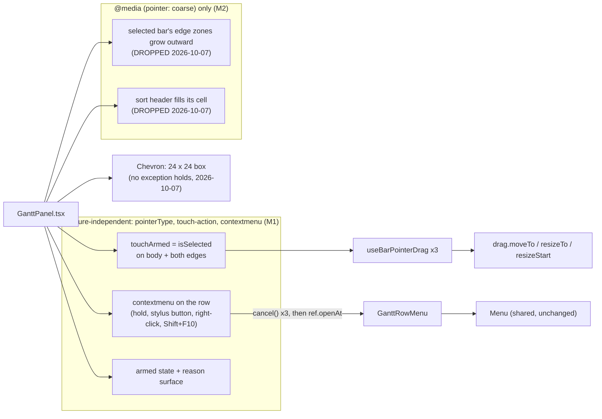
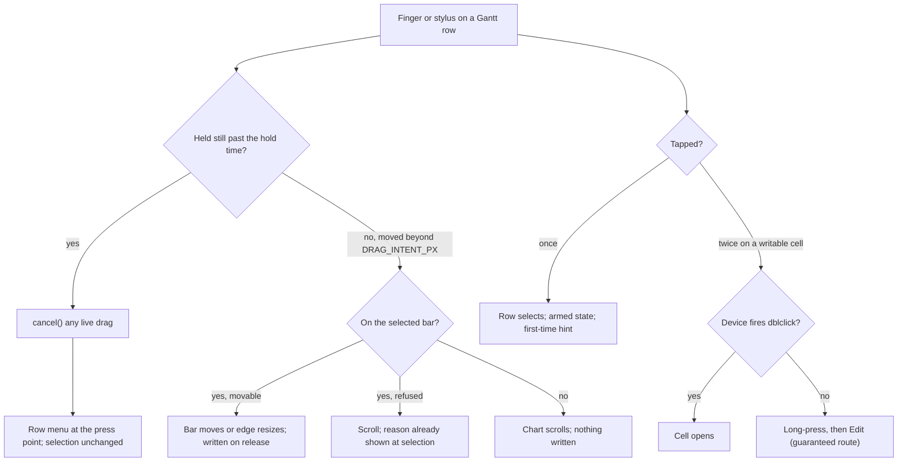

# Feature Spec: The Gantt under a finger and a stylus

- **Status:** Approved — by the product owner, 2026-10-05 (in advance, conditional on reviewer agreement; accessibility-, ux-reviewer and ui-architect agreed with changes, folded here)
- **Author(s):** feature-analyst (for the product owner)
- **Date:** 2026-10-05
- **Tracking issue / epic:** — (chosen from `docs/BACKLOG.md` "The Gantt's remaining editing gaps", the
  coarse-pointer residue, 2026-10-05)
- **Roadmap link:** `docs/BACKLOG.md:105-138`
- **Related ADR(s):** ADR-0059, ADR-0095, ADR-0170 (D6, the announcement contract), ADR-0173, ADR-0118
  (D1, D2, D7, D8), ADR-0117, ADR-0113, ADR-0142, ADR-0128 D4, ADR-0110 D5, ADR-0140, ADR-0081,
  ADR-0088 D1, ADR-0111. **New:** one ADR, provisionally **ADR-0177** (outline in §4.8) — required,
  because the epic adds a gesture rule and amends ADR-0118 D1's exception list.

**Terms.** "Stylus" is the input device. "Pen" means only the ADR-0028 single-editor edit lock.

**Defaults adopted at approval:** Q1 = **both postures** (keyboard attached and tablet); Q2 = **(a)
select, then drag**.

**What this epic mostly is.** ADR-0118 D7 records that the product owner's Surface reports
`pointer: fine` with the keyboard cover attached. Fixes keyed on `@media (pointer: coarse)` do nothing in
that posture. **M1 is the main deliverable.** It is keyed on the input event, so it works in every
posture. M2 is media-keyed and is expected to shrink, likely to the summary-row chevron alone (an AA
item at both pointers), once M0 has measured.

## 0. The brief, re-verified (CLAUDE.md §19.11 — the brief is not evidence)

Everything below was checked against the tree on 2026-10-05, not inherited.

| Claim (where)                                                                         | Verdict                  | Evidence                                                                                                                                                                                                                                                                                                     |
| ------------------------------------------------------------------------------------- | ------------------------ | ------------------------------------------------------------------------------------------------------------------------------------------------------------------------------------------------------------------------------------------------------------------------------------------------------------ |
| "It has no live row, which is the honest state" (`BACKLOG.md:136-137`)                | **False**                | `docs/TECH_DEBT.md` **#215** (open, verified 2026-09-13) names `GanttRowMenu` and `GANTT_ROW_HEIGHT = 28` as a dense-row coarse-pointer exception with **no large-target equivalent** (`TECH_DEBT.md:6030-6058`). **#439** (open) is the Gantt's `Grid width` divider failing a touch drag (`:11765-11781`). |
| "ADR-0118 **D6** narrowed the house rule to `pointer: coarse`" (`BACKLOG.md:134-135`) | **Wrong decision cited** | The narrowing is **D1** (the rule) and **D2** (the axis): `0118-…md:55-61, 82-98`. D6 records what M2/M3 changed (`:147-198`).                                                                                                                                                                               |
| "…and took the candidate set from 46 to one" (`BACKLOG.md:135`)                       | **Not found**            | ADR-0118 **measured** 46 comparable targets at 1646 (`:42-43`). Nothing reduces anything to one, and the figure could not be traced to any document.                                                                                                                                                         |
| "nobody has re-measured this view since" (`BACKLOG.md:136`)                           | **Partly false**         | ADR-0173 measured the `Grid width` divider by CDP touch (`docs/specs/gantt-column-resize/m1-measurement.md:62-68`). The column edges are gated as not rendered under coarse (`e2e-gantt/column-widths.spec.ts:352-372`). Rows, bars, edges and the row menu were never measured.                             |
| The brief lists "row handles"                                                         | **No such control**      | No row has a drag handle. Order is the sort (`GanttPanel.tsx:734-746`); hierarchy moves are Indent / Outdent in the row menu (`GanttRowMenu.tsx:223-231`). The WBS **disclosure chevron** (`GanttPanel.tsx:1855-1875`) is measured instead.                                                                  |
| `GanttPanel.tsx:316` "Read-only by design … no mutation, no pen interaction"          | **Stale docblock**       | False since ADR-0095 (`drag.moveTo`, `editing.begin` and `rowStructure.onReparent` are all in this file). Corrected in M1-T1.                                                                                                                                                                                |
| `TECH_DEBT.md:6040, 6076` cite `GanttPanel.tsx:81` for `GANTT_ROW_HEIGHT`             | **Stale line**           | The constant is at `:107`. M2-T4 cites the symbol instead.                                                                                                                                                                                                                                                   |

Gate blind spots found while checking. Both have ADR-0110 D5's shape: a sweep that is green about the
very class it should protect.

- **The 24 px Gantt grid sweep cannot see the disclosure chevron.** `e2e-workspace-fit/command-surface.spec.ts:748-792`
  sweeps `[role="treegrid"]` with `atLeast: 1`. Both seeds in that file are two flat activities (`:230-233`, `:947-950`). With no WBS summary
  there is no chevron, so a ~12 px `<button>` (`GanttPanel.tsx:1856-1874`) has never been swept at either
  pointer.
- **The coarse projection never enters the Gantt.** `COARSE_SURFACES` (`:882-893`) is swept in the
  diagram view only. Its selector list has no `[role="separator"]` (`:104-106`), so no divider has ever
  been swept at any pointer. That is folded into #439 at M0-T3; no new row is opened.

## 1. Business understanding

### Problem

The product owner works on a Microsoft Surface Pro (DPR 1.5) by **finger and stylus**. The Gantt is a
working surface (ADR-0095, ADR-0170, ADR-0173), and every gesture on it was designed and tested with a
mouse. The code already shows four things:

- **A bar body has no `touch-action` rule** (`GanttPanel.tsx:1967-1994`). The browser therefore
  claims a finger drag as a pan and sends `pointercancel`, which `useBarPointerDrag` treats as a cancel
  (`use-bar-pointer-drag.ts:152-159`). #439 recorded that sequence for the divider
  (`m1-measurement.md:64-66`). **Prediction: a finger cannot move a bar.**
- **The edge handles are 8 × 14 px and carry `touch-none` on every resizable bar** (`GanttPanel.tsx:2049,
2058`). A finger landing on an unselected bar's end therefore **resizes it instead of scrolling**. That
  is a live accidental-write path, and a larger zone would make it worse.
- **The row menu trigger is 28 × 28** (`icon-sm`, `button.tsx:75`). No Gantt row has a long-press or
  right-click route: there is no `onContextMenu` under `features/gantt` (grep, 2026-10-05). Indent,
  Outdent and Insert exist **only** in that menu (`GanttPanel.tsx:817-821`).
- **A cell opens on double-click or F2 only** (`GanttCell.tsx:137`). Reasons are `title`-only for sighted
  touch users (`GanttPanel.tsx:1992`, on an `aria-hidden` span; `GanttCell.tsx:124`). A refused **touch**
  drag is silent by design (`use-bar-pointer-drag.ts:84-85`).

### Users

| Role                                 | Need                                                                                               |
| ------------------------------------ | -------------------------------------------------------------------------------------------------- |
| Planner / Org Admin, holding the pen | Move and resize bars, edit cells, indent/outdent/insert by finger or stylus.                       |
| Contributor                          | Report progress from the row menu by finger.                                                       |
| Viewer                               | Select, scroll, and read the menu's shaded reasons by finger. No writes.                           |
| External Guest                       | **Unchanged.** The guest view has no `drag`/`editing`/row-menu bundles, and nothing here adds one. |

### Primary use cases

1. Move a bar by finger or stylus.
2. Resize a bar from either edge — or know the typed route at once.
3. Open a row's actions without hitting a 28 px target.
4. Edit a cell by touch.
5. Scroll the chart by finger without writing anything by accident (body **or** edges).

### User journeys

**Happy path.** Tap a bar and the row selects; the bar shows a visible **armed** state and a short hint.
Drag that bar sideways and it moves; the existing ADR-0170 D6 announcement follows. Press and hold a row
and its actions menu opens at the finger; tap Indent.

**Alternates.** A finger on an **unselected** bar, body or edge, scrolls. A stylus behaves the same,
unless M0 shows a stylus drag already works, in which case only touch is gated. A mouse is unchanged,
with one exception: a **right-click** on an activity row opens the row menu (Shift+right-click keeps the
browser's menu).

### Expected outcomes

The Gantt's existing capabilities are reachable by finger and stylus in both postures. No write path
changes, and a mouse user sees no change except the right-click menu.

### Success criteria

- On the product owner's Surface, the owed device checks (plan M0-T2, then the M1 confirmation) pass in
  both postures.
- No §2.5.8 failure in the Gantt grid at either pointer. Every target under 24 px is either fixed or
  passes under §2.5.8's **equivalent** exception, named in ADR-0177 D4 with its equivalent. This is
  gated on a plan **with** WBS summaries.
- The coarse projection covers the Gantt grid. Every control under 44 px is fixed or is a named
  ADR-0118 D1 exception.
- `computeSchedule` untouched (§3).

### Open questions

No critical question remains: Q1 and Q2 were answered at approval (header). Two items stay open:

- **Quick duration edit by touch (US-4 gap).** If M0 shows a double tap does not open a cell, touch's
  only guaranteed route to a duration is long-press (or the 28 px `⋯`) → `Edit` → the activity editor.
  That is a correct route, and it is slower than a mouse. The gap stays **open**, recorded in the
  ADR's Consequences as unresolved rather than closed by declaring an equivalent.
- **The TSLD canvas differs.** The canvas is `touch-none` throughout (`TsldCanvas.tsx:2323`) and has no
  `contextmenu` handler. M0 (P16) measures what a finger does there. Where it differs from the Gantt,
  ADR-0177 records the difference as deliberate (one bar per row and a DOM scroller, against a canvas
  that owns every gesture).

Defaults taken without asking:

- **Long-press and right-click open the row menu**, following the Explorer precedent
  (`HierarchyTree.tsx:516-535`: `onContextMenu`, plus a touch timer).
- **Neither long-press nor right-click changes the selection.** This matches the `⋯` trigger, which
  stops propagation so a menu press "must not also change the selection" (`GanttRowMenu.tsx:124-127`).
- **No row-height change.** That is #215's decision.
- **The `Grid width` divider stays with #439.**
- **Milestones stay pointer-immovable** at every pointer (`GanttPanel.tsx:1952-1957`).
- **No `VITE_*` flag** (ADR-0088 D1).
- **`pointer`, not `any-pointer`** (ADR-0118 D7).
- **The menu is not newly clamped.** `Menu` already clamps to the viewport (`menu.tsx:20, 56`).

## 2. Functional requirements

### User stories & acceptance criteria

> **US-1 — Move a selected bar by finger or stylus.** As a Planner holding the pen, I want to drag a bar
> by finger or stylus, so that I can reschedule on the tablet.
>
> - **Given** a movable bar that is **selected**, **when** I drag it sideways by finger or stylus,
>   **then** it follows. On release, the same write as a mouse drag is made (`drag.moveTo`,
>   `GanttPanel.tsx:1589-1607`), followed by the ADR-0170 D6 announcement.
> - **Given** an **unselected** bar, **when** a finger or stylus drags across its body **or either edge**,
>   **then** the chart scrolls. Nothing is written and nothing is announced: no refusal, because none
>   was attempted.
> - **Given** the selected bar, **when** I drag mostly vertically, **then** it scrolls (`pan-y`).
>   Pinch-zoom is unavailable while the gesture starts on the selected bar (`pan-y` excludes it), and is
>   available everywhere else. That is recorded in the ADR.
> - **Given** a selected, movable bar, **then** it shows a visible **armed** state (existing tokens, no new
>   colour, never colour alone — WCAG 1.4.1). The first touch or stylus selection per session also gives
>   the hint "Drag to move, or press and hold for actions".
> - **Given** a selected bar that **cannot** move, **when** it was selected by touch or stylus, **then**
>   its refusal reason is visible and announced. The reason may no longer live only in a `title` on an
>   `aria-hidden` span.
> - **Given** a mouse, **then** behaviour is byte-for-byte unchanged (no selection precondition).

> **US-2 — Resize a selected bar's edges by finger.** As a Planner holding the pen, I want to grab a
> selected bar's start or finish edge by finger, so that I can change its dates without a keyboard.
>
> - **Given** a selected, resizable edge, **then** the edge carries `touch-none`. **Given** an unselected
>   bar, **then** its edges carry no touch rule and a touch or stylus press there scrolls (M1).
> - **Given** `pointer: coarse` and a selected bar, **then** each edge zone grows outward from the bar end
>   (M2, conditional). The grown zone applies to the selected bar only.
> - **Given** `pointer: fine` and a mouse, **then** the 8 px handles are unchanged.

> **US-3 — Open a row's actions without the small button.** As any member, I want to press and hold a
> row (or right-click it), so that the actions open without aiming at 28 px.
>
> - **When** I press and hold by finger or stylus, or right-click by mouse, **then** the menu the `⋯`
>   opens appears at the press point. It has the same items, shading and reasons (ADR-0082), the same
>   accessible name (`Actions for <activity>`, `GanttRowMenu.tsx:143` → `menu.tsx:248`), and it is one
>   code path. The selection does not change.
> - **When** the press began on the selected, movable bar and moved more than `DRAG_INTENT_PX`, **then**
>   no menu opens and the drag proceeds. **When** it stayed within that threshold, **then** any live
>   drag is cancelled first (no ghost and no Escape listener survive) and the menu opens.
> - **When** `contextmenu` comes from the keyboard (Shift+F10 / Menu key: `pointerType` empty or the
>   coordinates 0), **then** the menu anchors to the row's rect and focus returns to the row. If the
>   keydown path (`GanttPanel.tsx:827-838`) already opened it, it is not opened twice.
> - **When** the menu closes after a long-press or right-click, **then** focus returns to the row.
> - **Given** a bucket row, or a target inside an open cell input, **then** the browser default stands.
> - **Shift+right-click** keeps the browser's menu.

> **US-4 — Edit a cell by touch.** As a Planner holding the pen, I want to open a cell by touch.
>
> - **Given** a writable cell, **when** I double-tap, **then** it opens — **if** M0 shows a double tap
>   yields `dblclick` on the device. Otherwise no gesture is invented. The route is long-press → `Edit`,
>   and the quick-edit gap stays open (§1).

> **US-5 — The AA floor at both pointers, honestly.** As a user with limited dexterity, I want every
> Gantt target either at least 24 × 24 or exempt under a named §2.5.8 exception, with its equivalent.
>
> - **Given** the chevron, **then** it clears 24 × 24 or passes a named exception (M2-T2).
> - **Given** the 8 × 14 edge handles and the 14 px bar body at a fine pointer, **then** they pass
>   §2.5.8 **only** under its equivalent exception. The equivalents are the typed `Start` / `Finish` /
>   `Duration` cells, F2, and row menu → `Edit`. ADR-0177 D4 names this in a **fine-pointer** list
>   that matches the sweep exemptions.

### WCAG mapping

- **2.5.7 Dragging Movements (AA).** Every drag has a single-pointer alternative.
  - Bar move: the typed `Start` cell.
  - Edge resize: the typed `Start` / `Finish` / `Duration` cells.
  - All of them also through row menu → `Edit` (the activity editor) and, by keyboard, F2.
  - **On touch**, the cells' only entry is a double tap, which is P9 and INDETERMINATE (**2026-10-07:**
    the device opened a text box on a double tap in both postures, item 5). So touch's
    **guaranteed** route is long-press → `Edit` or the 28 px `⋯` → `Edit`. That is why M1-T2 is owed
    whatever M0 says about cells.
- **2.5.8 Target Size (Minimum) (AA).** See US-5. The open cell input is 24 px tall (`GanttCell.tsx:155`).
  That **meets** 2.5.8, so it is not an AA item. Under coarse it is below the house rule's 44, so it
  joins D4's **coarse** list with the activity editor as its equivalent. It is not grown, because the
  row is 28 px.
- **2.5.2 Pointer Cancellation (A).** Satisfied. Drags commit on `pointerup` and cancel on
  `pointercancel` and Escape. Opening a menu is reversible (Escape, or a press outside), and nothing
  irreversible runs on a down event.
- **2.1.1 Keyboard.** Unchanged: Alt/Shift+←/→, F2, Shift+F10 / Menu key.
- **1.4.1 Use of Color.** The armed state is not colour alone.

### Workflows

- **Touch and stylus arming.** All three hook instances (body `:1608`, finish `:1659`, start `:1715`)
  take one input, `touchArmed = isSelected`.
  - A `touch` or `pen` press on an unarmed bar returns **before** the `enabled` / `onRefused` branch,
    with no `preventDefault`. The browser pans and the trailing click selects.
  - **This must not flip `enabled`.** The `!enabled` branch routes to `onRefused` and skips only `touch`
    (`:81-85`), so an unarmed stylus would announce a false refusal.
- **Long-press.** `contextmenu` on an activity row does four things, in order:
  1. Reads all three hooks' live movement. If any exceeds `DRAG_INTENT_PX`, the event is ignored.
  2. Otherwise it calls `cancel()` on all three.
  3. `preventDefault`.
  4. `menuRef.current.openAt(point, rowEl)`.

  `DRAG_INTENT_PX` is today's `REFUSED_DRAG_THRESHOLD_PX` (4 px, `use-bar-pointer-drag.ts:33`), exported
  under the new name and used by both paths. If Windows does not fire `contextmenu` on a touch hold (M0),
  a `useLongPress` primitive is extracted (§4.6).

### Edge cases

- **A release-time `contextmenu`.** Windows may fire `contextmenu` on touch **release**. `Menu`'s
  outside-dismiss listens to `pointerdown` only (`menu.tsx:189-196`), so the release does not dismiss
  it. The trailing `click` reaches the row, and US-3 says that must not change the selection, so the row
  swallows that one click (the `HierarchyTree.tsx:502-506` pattern). M0-T2 checks the device timing.
- **A second finger.** Ignored by pointer id (`use-bar-pointer-drag.ts:20-21`).
- **Virtualised away mid-gesture.** Torn down (`:66-75`).
- **Selection changes while a finger is down.** `touch-action` is read at `pointerdown`, so a pan is
  never converted into a drag.
- **Plan not calculated.** Long-press still opens the menu.
- **The stylus barrel button.** It arrives as `contextmenu` and takes the same path.

### Permissions

No permission changes.

- Writes keep `barMoveGate` / `barEdgeGate`. Indent / Outdent / Insert keep `canEditSchedule` /
  `penRefusal` (`GanttRowMenu.tsx:194`), and the shared roster keeps `isEnabled` / `penGated`
  (`:159-163`).
- Structural writes still need the pen (ADR-0028). This epic adds routes to existing writes, not new
  writes.
- Guests are unaffected.

### Validation rules

None new.

### Error scenarios

| Scenario                                     | Detection                        | User-facing result                         | Status  |
| -------------------------------------------- | -------------------------------- | ------------------------------------------ | ------- |
| Browser claims a gesture mid-drag            | `pointercancel`                  | Bar returns; nothing written               | —       |
| Touch or stylus on an unselected bar or edge | `touchArmed` false               | Scroll; nothing written, nothing announced | —       |
| Selected bar cannot move                     | gate false at selection          | Visible and announced reason               | —       |
| Write refused by the API                     | existing mutation path           | Existing ADR-0170 D6 announcement          | 409/423 |
| Long-press with no menu context              | `rowMenuContextFor` returns null | Browser default stands                     | —       |

## 3. Technical analysis

| Area           | Impact | Notes                                                                                                                                                                                                                                    |
| -------------- | ------ | ---------------------------------------------------------------------------------------------------------------------------------------------------------------------------------------------------------------------------------------- |
| Frontend       | med    | `GanttPanel.tsx` (arming, row `onContextMenu`, armed state, reason surface, coarse edge zones, chevron), `use-bar-pointer-drag.ts` (`touchArmed`, `cancel()`, exported `DRAG_INTENT_PX`), `GanttRowMenu.tsx` (an optional `ref` handle). |
| Backend        | none   |                                                                                                                                                                                                                                          |
| Database       | none   | No schema change, so `database-architect` is not engaged.                                                                                                                                                                                |
| API            | none   |                                                                                                                                                                                                                                          |
| Security       | none   | No new write or permission. The diagnostic page takes no input (ADR-0140).                                                                                                                                                               |
| Performance    | low    | One class per bar from `isSelected`; one `onContextMenu` per row; the `GanttRowMenu` handle keeps the per-row thunk (`GanttRowMenu.tsx:31-40`).                                                                                          |
| Infrastructure | low    | No Playwright config or CI step. M0 adds a static diagnostic page to `apps/web/public/`, which ships in the image and needs a release to reach the host.                                                                                 |
| Observability  | none   |                                                                                                                                                                                                                                          |
| Testing        | med    | Measurement harness; unit tests (arming with `pointerType: 'pen'`, cancel-before-menu, keyboard contextmenu, menu at a point); `touch.spec.ts`; both `command-surface.spec.ts` sweeps.                                                   |

**Recalculation parity.** No scheduling input changes. `computeSchedule` is never imported from
`features/gantt` (`engine-import.structural.test.ts`).

**ADR-0105 triggers crossed:**

- a user-facing entry point (long-press / right-click; touch drag);
- a component public contract (an optional `ref` on `GanttRowMenu`; new hook inputs and return);
- a shared gate (both sweeps in `command-surface.spec.ts`).

Not crossed: a Playwright config or CI step, and the schema.

**ADR-0111 key and focus claims, for the accessibility pre-release pass.**

- `contextmenu` from Shift+F10 / the Menu key now reaches a row handler that also anchors and restores
  focus. That sits beside the existing keydown path (`GanttPanel.tsx:827-838`).
- Focus returns to the **row** after a long-press or right-click open.
- `useBarPointerDrag`'s capture-phase Escape (`:161-176`) must be released by `cancel()`.

### Dependencies

Nothing must land first. #439, #215 and #438 are adjacent and are not absorbed.

## 4. Solution design

### 4.1 Architecture overview



### 4.2 Data flow (a finger moves a selected bar)

```mermaid
sequenceDiagram
  participant F as Finger
  participant B as Browser
  participant H as useBarPointerDrag (x3)
  participant R as Row
  participant W as Workspace
  F->>B: touch on unselected bar (body or edge)
  B-->>H: pointerdown, touchArmed false: return, no preventDefault
  Note over B: pan; nothing written
  F->>R: tap
  R->>W: click selects (unchanged)
  Note over R: re-render: armed state, pan-y on body, touch-none on edges
  F->>B: sideways drag on selected bar
  B-->>H: pointerdown, move, up
  H->>W: moveTo(...), then ADR-0170 D6 announcement
```

### 4.3 User flow



### 4.4 Database changes

None.

### 4.5 API changes

None.

### 4.6 Component changes

Tokens and Tailwind variants only. `pointer-coarse:` is used **only** for M2 geometry and never for a
gesture remedy.

- **`useBarPointerDrag`** (`model/use-bar-pointer-drag.ts`)
  - New input `touchArmed: boolean`. A `touch` or `pen` press with `touchArmed` false returns
    first: no `preventDefault`, no `onRefused`.
  - Returns `cancel()`, which runs `finish()` with the cancelled flag set: the ghost is cleared and the
    window and capture-phase Escape listeners are removed.
  - Exports `DRAG_INTENT_PX` (the renamed 4 px constant).
- **`GanttRowView`** (`GanttPanel.tsx`)
  - All three hooks get `touchArmed: isSelected`.
  - Classes when selected:
    - the body gets `touch-action: pan-y` (when movable);
    - each edge gets `touch-none` (when resizable). Today's unconditional `touch-none` is removed.
  - Armed state: a visible treatment of the selected, movable bar using existing tokens — for example
    a ring in `--ring`, plus a shape cue such as grip marks, so it is never colour alone. The exact form
    is settled with ux-reviewer.
  - The refusal reason for a selected bar selected by touch or stylus appears in a visible
    `role="status"` line. The panel's existing banner pattern (`GanttPanel.tsx:1036-1043`) is reused, or
    the object bar if ux-reviewer prefers. This replaces the touch path's reliance on the
    `aria-hidden` span's `title`. The first-session hint uses the same surface.
    - **ADR-0170 D6 governs announcements after a write settles.** The hint and the reason are
      selection-time facts, not write outcomes, so they do not use that channel's "after the write"
      slot. That contract is in ADR-0170, not ADR-0095, which has no announcement section.
  - `onContextMenu` on activity rows follows the workflow in §2. Keyboard origin anchors to
    `getBoundingClientRect()`, and the row swallows the trailing click after a long-press opens the menu.
  - Docblock at `:316` corrected.
  - M2 (conditional): the selected bar's edges grow outward under `pointer-coarse:`, to the row's
    height. The chevron gets a 24 × 24 box, or a recorded exemption. **Amended 2026-10-07:** the edge
    zones are dropped (device, 10 / 10); no exemption holds, so the chevron gets the box (plan, "M2 as
    re-scoped by the device"). Idle cells take `select-none` after a touch or stylus press, so a hold on
    the table half reaches the row menu (#464, plan M2-T5).
- **`GanttRowMenu`** gains one optional prop, nothing more: `ref?: Ref<{ openAt(point: {x: number; y:
number}, restoreTo: HTMLElement): void }>` (React 19 ref-as-prop).
  - `openAt` calls the existing `context()` thunk, sets the existing local `anchor` / `resolved` state,
    and points a local restore ref at `restoreTo`.
  - The `⋯` path is unchanged, and the content stays one code path.
  - There are no controlled props, and nothing per row is built until open (`GanttRowMenu.tsx:31-40`).
- **`useLongPress`** (`components/ui/`) is **extracted only if** M0 shows `contextmenu` does not fire on a
  touch hold. It follows the **tooltip** precedent: 500 ms, cancelled past 8 px of movement, an early
  lift, or `pointercancel`, with unmount cleanup (`tooltip.tsx:89-91, 318-359`). The `HierarchyTree`
  precedent (`:19, 337-352`) is not followed, because it cancels on **any** `pointermove` and a finger
  always jitters. Both existing copies migrate to it, which takes the copies from three to one. That
  makes it an ADR-0111 component-reviewer item.
- **Sort header buttons** (M2): under coarse they fill the 34 px header cell, which still makes them a
  named exception. **Dropped 2026-10-07** (device, 0 / 10 misses); they stay 24 tall.

### 4.7 Implementation approach & alternatives

**Chosen:** measure (M0), then gestures keyed on the event (M1, the main deliverable), then coarse
geometry only where it is measured and reachable (M2). The chevron may land as soon as M0 confirms it.

**Alternatives considered:**

- **Grow rows to 44 px under coarse.** That is #215's row-rhythm decision. Rejected here.
- **Switch to `any-pointer: coarse`.** It would give every hybrid 44 px permanently (ADR-0118 D7).
  Rejected.
- **Hide edge handles under coarse** (the ADR-0173 D3 precedent). It would take resizing away from a
  stylus in tablet posture. Rejected in favour of arming plus outward zones.
- **Drag immediately on touch (Q2 (b)).** Declined at approval.
- **Gate by flipping `enabled`.** Rejected: an unarmed stylus would announce a false refusal (§2).
- **Controlled open state on `GanttRowMenu`.** Rejected: it would lift per-row state into the panel,
  against the cost note at `GanttRowMenu.tsx:31-40`.

### 4.8 ADR outline — ADR-0177 (provisional): "A finger drags what it has selected"

- **D1 — Gesture remedies are posture-independent.** They key on `pointerType`, `touch-action` and
  `contextmenu`, and never on `pointer-coarse:`. Geometry remedies key on the media query. The reason is
  ADR-0118 D7.
- **D2 — On touch and stylus, a bar's body and both edges respond only once the bar is selected**
  (`touchArmed`). The early return happens before the refusal path, and mouse input is unchanged. If M0
  shows a stylus drag already works, only touch is gated. The armed state is visible. `pan-y` costs
  pinch-zoom over the selected bar only.
- **D3 — `contextmenu` opens a grid row's menu.** Sources: a hold, the stylus button, right-click, and
  Shift+F10 / the Menu key, with keyboard origin anchored to the row. Any live drag is cancelled first.
  The selection does not change, and Shift+right-click keeps the browser menu. This is the large-target
  equivalent ADR-0118 D1 requires of #215's Gantt half.
- **D4 — Exception lists, each with its equivalent and each matching a sweep exemption.**
  - **Fine pointer, §2.5.8 equivalent exception:**
    - the 8 × 14 edge handles and the 14 px bar body → typed `Start` / `Finish` / `Duration` cells, F2,
      and row menu → `Edit`;
    - ~~the chevron, only if exempted rather than fixed.~~ (2026-10-07: fixed, not exempted.)
  - **Coarse pointer, ADR-0118 D1, below 44:**
    - the `⋯` (28) → long-press;
    - ~~the edge zones' height (28)~~ the edge handles (8 × 14, not grown — M2-T1 dropped
      2026-10-07) → typed cells / `Edit`;
    - the sort headers (~~34~~ 24 tall, `Float left` 32 — M2-T3 dropped 2026-10-07) → none at a large
      target. Sorting has no other route, and that is said plainly;
    - the open cell input (24 tall) → the activity editor;
    - the compact `View ▾` checkboxes (28 px row, 16 × 16; M0 P12), added 2026-10-07.

  D4 is written at M2's close in the ADR-0118 D6 manner.

- **Consequences.**
  - Right-click on a Gantt row changes for mouse users.
  - The difference from the TSLD canvas is recorded as deliberate.
  - The quick-duration-by-touch gap stays **open**. **Amended 2026-10-07:** closed by the device — a
    double tap opened a text box in both postures (`device-results.md`, item 5).
  - Recalculation is untouched.
- **Amends:** ADR-0095 (bar gesture contract) and ADR-0118 D1 (exceptions). Their headers and
  `CLAUDE.md` §16 lines gain "amended by ADR-0177".
- **Status:** Proposed at M1-T1; Accepted at the epic's close.

## 5. Links

- Implementation plan: [`./implementation-plan.md`](./implementation-plan.md)
- Docs updated by this change:
  - `docs/BACKLOG.md` (the §0 corrections);
  - `docs/TECH_DEBT.md` #215 (the Gantt equivalent, and the symbol citation) and #439 (the unswept
    divider);
  - `docs/UX_STANDARDS.md` ("Row / node actions": long-press and right-click; the exception list);
  - `docs/DESIGN_SYSTEM.md` (the exception list);
  - `CLAUDE.md` §16 (ADR-0177, plus "amended by" on ADR-0095 and ADR-0118).
