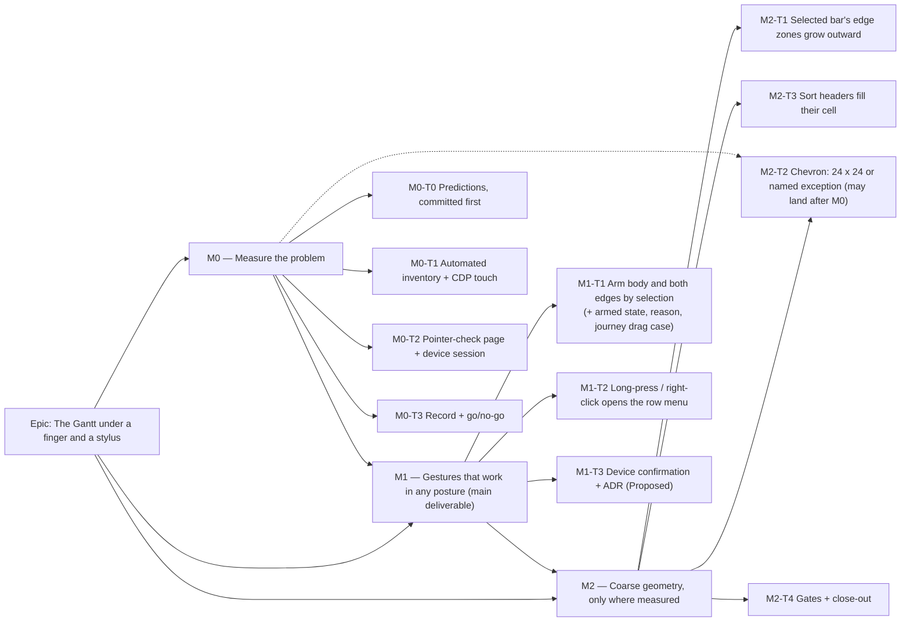

# Implementation Plan: The Gantt under a finger and a stylus

- **Feature spec:** [`./feature-spec.md`](./feature-spec.md)
- **Status:** Approved — by the product owner, 2026-10-05 (in advance, conditional on reviewer agreement; accessibility-, ux-reviewer and ui-architect agreed with changes, folded here)
- **Owner:** builder agent (Sonnet), reviewed as listed per milestone

**Terms.** "Stylus" is the device. "Pen" means only the ADR-0028 edit lock. **Defaults adopted:**
Q1 = both postures; Q2 = (a) select, then drag.

## Breakdown

### Epic

**The Gantt under a finger and a stylus** — make the Gantt's shipped editing reachable by touch and
stylus in both postures, and give #215's Gantt half its large-target equivalent.

**Shape.** M0 measures. **M1 is the main deliverable.** It is keyed on the input event, so it works
with the keyboard attached, where the Surface reports `pointer: fine` (ADR-0118 D7). M2 is keyed on
`pointer: coarse`, and is expected to shrink to the chevron, which is an AA item at both pointers.
Every task carries an exit.

**No `VITE_*` flag** (ADR-0088 D1). The rollback is the commit boundary.

**Recalculation parity.** No scheduling input changes, and `computeSchedule` is not imported from
`features/gantt`.

---

### Milestone 0: Measure the problem

**Outcome:** a committed record of every Gantt target's size and touch / stylus behaviour, and a go or
no-go per later task.
**Entry point:** `Ships dark: measurement only. The one artefact that ships is a static diagnostic page
(/pointer-check.html) reached by typing its address. It takes no input and is not a product capability
(ADR-0140). M1 surfaces the first user-facing change.`
**Journey:** none.

---

#### Feature: M0-F1 — The measurement

> **Description:** ADR-0113 / ADR-0142. Predictions are committed before the first run (the ADR-0118 M0
> precedent).
> **Complexity:** M
> **Dependencies:** none
> **Risks:**
>
> - An instrument measuring the wrong pointer → the harness asserts `matchMedia` first (ADR-0118 D3).
> - Emulation is not a Surface → anything the emulator cannot settle is `INDETERMINATE` (ADR-0128 D4)
>   until the device answers.
>   **Testing requirements:** none (this is evidence). test-engineer reviews the harness.

##### Task M0-T0 — Predictions, committed before anything runs

- **Description:** write `docs/specs/gantt-coarse-pointer/m0-falsification.md` from the table below,
  adding the falsifying observation for each row. Commit it alone.
- **Complexity:** S · **Dependencies:** none · **Risks:** peeking first → the commit order is the
  control · **Testing:** none.

| #   | Target                                                                     | Prediction (fine → coarse)                                                        | Read from                                                       |
| --- | -------------------------------------------------------------------------- | --------------------------------------------------------------------------------- | --------------------------------------------------------------- |
| P1  | Bar body (movable)                                                         | 14 tall both; `touch-action: auto`; CDP touch drag → `pointercancel`, no write    | `GanttPanel.tsx:1967-1994`; `use-bar-pointer-drag.ts:152-159`   |
| P2  | Edge handles, **selected** bar                                             | 8 × 14 both; `touch-none`; CDP touch drag resizes                                 | `GanttPanel.tsx:2043-2063`                                      |
| P2b | Edge handles, **unselected** bar                                           | same as P2 — **a finger resizes instead of scrolling** (an accidental-write path) | same; `touch-none` is unconditional                             |
| P3  | Row menu trigger `⋯`                                                       | 28 × 28 both                                                                      | `button.tsx:75`                                                 |
| P4  | WBS disclosure chevron                                                     | ≤ 16 × 16 both — below 24 at fine                                                 | `GanttPanel.tsx:1856-1874`                                      |
| P5  | Sort header buttons                                                        | 24 tall both                                                                      | `GanttPanel.tsx:1119-1146`; `GanttRuler.tsx:6`                  |
| P6  | Column edges                                                               | 24 × 34 fine; not rendered coarse                                                 | `GanttColumnEdge.tsx:64`                                        |
| P7  | `Grid width` divider                                                       | ~24 wide; `touch-action: auto`; `pointercancel` (as #439)                         | `panel-resizer.tsx:104-135`                                     |
| P8  | Long-press / right-click on a row                                          | no app menu; browser default; whether `contextmenu` fires on hold or on release   | no `onContextMenu` under `features/gantt`                       |
| P9  | Double tap on a writable cell                                              | INDETERMINATE in emulation                                                        | `GanttCell.tsx:137`                                             |
| P10 | Open cell input                                                            | 24 tall both                                                                      | `GanttCell.tsx:155`                                             |
| P11 | Row menu items                                                             | ≥ 44 coarse                                                                       | `menu.tsx:457`                                                  |
| P12 | `View ▾` Columns group and `Show logic links`                              | width fields 44 coarse; compact checkboxes unknown                                | `gantt-columns-group.tsx:179-241`; `form.tsx:263-307`           |
| P13 | Object bar in the Gantt                                                    | ≥ 44 coarse                                                                       | `toolbar-styles.ts:179`                                         |
| P14 | Milestone diamond                                                          | no pointer handler at either pointer                                              | `GanttPanel.tsx:1952-1957`                                      |
| P15 | Refusal reasons                                                            | `title` only on an `aria-hidden` span; refused touch silent                       | `GanttPanel.tsx:1992`; `use-bar-pointer-drag.ts:84-85`          |
| P16 | **TSLD canvas**: a finger on an unselected bar, a selected bar, and a hold | the canvas owns every gesture (`touch-none`); hold opens nothing                  | `TsldCanvas.tsx:2323`; no `onContextMenu` under `features/tsld` |

##### Task M0-T1 — Automated inventory and CDP touch probes

- **Description:** `apps/web/measure-gantt/coarse-targets.spec.ts` in the **existing**
  `playwright.measure-gantt.config.ts` (not CI; no config change).
  - **Fixture:** `plan:capability-types-and-wbs` (`docs/TEST_PLAYBOOK.md:102`), seeded through the API.
  - **Viewports:** 1646 × 1097 and 1368 × 912.
  - **Contexts:** a fine context and a coarse one (`browser.newPage({ hasTouch: true })`, with
    `matchMedia` asserted).
  - (a) **Geometry** for P1–P6, P10–P14:
    - the box;
    - `elementFromPoint` at the centre, with `hitBy`;
    - computed `touch-action`;
    - the §2.5.8 24 px-circle spacing test (recorded, not judged).
  - (b) **Gestures**, by CDP `Input.dispatchTouchEvent` (the `column-truncation.spec.ts:454-465` method):
    - a drag on the body of a selected and of an unselected bar;
    - a drag on **each edge of a selected and of an unselected bar** (P2b);
    - a drag on the divider;
    - a double tap on a cell;
    - a ≥ 600 ms hold on a row: the event order, and whether `contextmenu` fires on hold or on release;
    - the same on the TSLD canvas (P16).
    - Writes are detected by the activity's version.
  - (c) **Fine media with touch input** (the D7 hybrid): if the harness cannot produce it, record
    `INDETERMINATE — device only`.
- **Complexity:** M · **Dependencies:** M0-T0
- **Risks:** CDP touch is not the device → M0-T2 is the arbiter for gestures.
- **Testing:** pinned positives (≥ 1 chevron, ≥ 1 movable bar, ≥ 1 of each edge, coarse confirmed);
  three runs, with the spread recorded.

##### Task M0-T2 — Pointer-check page and device session

- **Description:**
  1. **`apps/web/public/pointer-check.html` + `pointer-check.js`** (external script, for the web CSP).
     It prints in large text: `pointer`, `any-pointer`, `hover`, `any-hover`, `devicePixelRatio` and the
     viewport. It updates live, so folding the cover changes it on screen. It takes no input and makes
     no request (ADR-0140). Changeset `@repo/web` **patch** ("add a pointer-check diagnostic page"),
     because it must be released to reach the host. It stays as a diagnostic.
  2. **A one-page tick-box checklist** for the product owner, run on the deployed product with a plan
     the assistant prepares (WBS summaries, the pen held).

     _Before each posture: open `/pointer-check.html` and photograph the screen._

     **Finger pass — about 10 minutes per posture, so about 20 for both:**

     - [ ] 1. Drag a bar sideways **without tapping it first**. Did it move, or did the chart scroll?
     - [ ] 2. Tap the bar, then drag it. Moved or scrolled?
     - [ ] 3. Drag the **right end** of a bar you have **not** tapped. Did it stretch, or scroll?
     - [ ] 4. Press and hold a row for a second. What appeared — nothing, the browser's menu, or
           highlighted text? Did it appear **while** you held, or **after** you lifted?
     - [ ] 5. Double-tap a Duration cell. Did a text box open?
     - [ ] 6. Tap the `⋯` at a row's end ten times, then the small arrow beside a summary row ten times.
           How many missed?

     **Stylus pass — about 5 minutes, either posture:** repeat 1, 3 and 4.

     A screen recording (Windows: Snipping Tool → Record) or photos are accepted as the answer, and
     nothing has to be typed up. **Total about 25–30 minutes, plus setup.**

     **Owed from the device, because emulation cannot settle them:** checks 1–4 in both postures (P1,
     P2b, P8 timing, the D7 hybrid), check 5 (P9), check 6 (the hit rates M2-T1/T2 exit on), and the
     stylus pass (the stylus exit in M1-T1).
- **Complexity:** S (the assistant) · **Dependencies:** M0-T1
- **Risks:** this waits on the product owner → the assistant drafts M0-T3 meanwhile (CLAUDE.md §19.12).
- **Testing:** the page gets one unit test that it renders the four media values; no journey (it is
  not a product surface).

##### Task M0-T3 — Record and decide

- **Description:** `m0-measurement.md` records the command, a verdict per prediction (`CONFIRMED` /
  `REFUTED` / `INDETERMINATE`), the device answers, and a go / no-go per task.
  - Fold the unswept divider into #439 as an annotation.
  - Update `docs/BACKLOG.md`'s Gantt entry with spec §0's corrections.
  - A changed scope, as opposed to a dropped task, goes back to the product owner.
- **Complexity:** S · **Dependencies:** M0-T1, M0-T2 · **Testing:** `pnpm check:spec-status`.
  Changeset: none, beyond M0-T2's.

---

### Milestone 1: Gestures that work in any posture

**Outcome:** by finger or stylus, in either posture:

- a planner drags a **selected** bar, or its edges;
- a finger on an unselected bar scrolls rather than writing;
- anyone opens a row's actions by press-and-hold (or right-click) without hitting 28 px.

**Entry point:**

- plan workspace → `Gantt` → an activity row: **tap the bar**, which shows its armed state, then drag it
  sideways by finger or stylus;
- **press and hold the row** (or right-click it) → menu `Actions for <activity name>`.

**Journey:** `apps/web/e2e-gantt-editing/touch.spec.ts` (new file in the existing suite). It uses a
`hasTouch` context with `matchMedia` asserted, and CDP touch. **Its drag case lands with M1-T1** and is
verified **red against M1-T1's parent** first (ADR-0081 §2, ADR-0110). The long-press cases land with
M1-T2.

---

#### Feature: M1-F1 — Touch and stylus gestures

> **Description:** US-1, US-2 (the arming half), US-3, and US-4's stated route.
> **Complexity:** M
> **Dependencies:** M0 go
> **Risks:**
>
> - A live drag and the menu at once → `cancel()` on all three hooks before opening; the event is
>   ignored past `DRAG_INTENT_PX`.
> - A mouse regression → `bar-drag.spec.ts` must stay green **unchanged**.
>   **Testing requirements:** unit, journey, and the existing mouse journey.

##### Task M1-T1 — Arm the body and both edges by selection (touch and stylus)

- **Description:**
  - **The hook.** `useBarPointerDrag` gains `touchArmed`. For `pointerType` `touch` or `pen`, an unarmed
    press returns **before** the `enabled` / `onRefused` branch, with no `preventDefault`. `enabled` is
    **not** flipped (spec §2).
  - **All three instances** (`GanttPanel.tsx:1608, 1659, 1715`) pass `touchArmed: isSelected`.
  - **The body** gets `touch-action: pan-y` only when selected and movable.
  - **The edges.** Their unconditional `touch-none` (`:2049, 2058`) becomes selected-only.
  - **Armed state.** A visible armed state for a selected, movable bar, using existing tokens and not
    colour alone.
  - **Hint and reason.** A first-session hint ("Drag to move, or press and hold for actions"). A
    selected bar refused by its gate shows a visible `role="status"` reason when selected by touch or
    stylus. These are selection-time messages, separate from ADR-0170 D6's after-write announcements.
  - **Docblock.** Correct `:316`.
  - **Journey.** The `touch.spec.ts` drag case.
  - **ADR.** Draft ADR-0177 as `Proposed` (D1, D2) in this task, because this task is the decision.
- **Exits:**
  - **Stylus.** If M0 shows a stylus drag already moves a bar in both postures, gate `touch` only.
  - **Whole task.** **Dropped** only if M0 shows a finger drag already moves a bar **and** a finger on an
    unselected edge already scrolls — in which case P1 and P2b are both refuted. P2b alone is enough to
    keep the edge half.
- **Complexity:** M · **Dependencies:** M0-T3
- **Risks:**
  - `touch-action` is read at `pointerdown` → the journey taps, waits for `aria-selected`, then drags.
  - `pan-y` blocks pinch-zoom over the selected bar → recorded in the ADR.
- **Testing:**
  - **Unit, the hook:**
    - an unarmed `pointerType: 'pen'` press calls neither `onCommit` nor `onRefused`, and does not
      `preventDefault`;
    - the same for `'touch'`;
    - a `'mouse'` press is unchanged when unarmed.
  - **Unit, the panel:** the edge classes carry `touch-none` only when selected; the body carries
    `pan-y` only when selected and movable; the armed state renders.
  - **Unit, reasons:** the refusal reason is in a `role="status"` node.
  - **Structural:** no gesture class sits behind a `pointer-coarse:` variant.
  - **Journey, a selected bar:** tap it, CDP-drag it, and the `Start` cell changes.
  - **Journey, an unselected bar:** CDP-drag its end, and its `Duration` cell does **not** change.
  - **Journey, a refused bar:** its reason is visible.
- **Development steps:**
  1. Write the journey drag case and run it red on the parent.
  2. Write hook tests first, then the hook.
  3. Classes, armed state and reason surface, each with tests.
  4. Run the journey green.
  5. ADR draft.
  6. Changeset `@repo/web` **minor** ("drag a selected Gantt bar with a finger or stylus; an unselected
     bar now scrolls").

##### Task M1-T2 — Long-press and right-click open the row menu

- **Description:**
  - **`GanttRowMenu`** gains only an optional `ref?: Ref<{ openAt(point, restoreTo: HTMLElement): void }>`
    (React 19 ref-as-prop). `openAt` sets the existing local `anchor` / `resolved` state and a local
    restore ref.
  - **The hook** returns `cancel()` and exports `DRAG_INTENT_PX` (the renamed 4 px constant at
    `use-bar-pointer-drag.ts:33`).
  - **The row's `onContextMenu`:**
    1. If any of the three hooks has moved more than `DRAG_INTENT_PX`, ignore the event.
    2. Otherwise `cancel()` all three.
    3. `preventDefault`.
    4. `openAt`.
  - **Keyboard origin** (`pointerType` empty, or the coordinates 0) anchors to the row rect. If the
    keydown path (`:827-838`) already opened the menu, it is not opened again.
  - **After the menu closes**, focus returns to the row.
  - **Selection is unchanged.** The row swallows the trailing click after a long-press opened the menu.
  - **The browser's menu stays** on bucket rows, inside an open cell input, and on Shift+right-click.
  - **Fallback.** If M0 shows Windows fires no `contextmenu` on a touch hold, extract `useLongPress`
    into `components/ui/` on the **tooltip** precedent (500 ms, 8 px tolerance, `tooltip.tsx:89-91,
318-359`) and migrate `tooltip.tsx` and `HierarchyTree.tsx`. That makes one copy, not three, and
    brings component-reviewer in.
- **Exit:** dropped only if #215 first brings the `⋯` to 44 under coarse **and** the product owner is
  only ever in tablet posture. Q1 = both, so this task is owed as things stand.
- **Complexity:** M · **Dependencies:** M1-T1
- **Risks:**
  - A right-click change for mouse users → the changeset and `docs/UX_STANDARDS.md` say "**right-click**
    on a Gantt row opens its actions; Shift+right-click keeps the browser's menu".
  - Key and focus claims under ADR-0111 (spec §3) → **accessibility-reviewer before release**.
- **Testing:**
  - **Unit:**
    - the menu opens at the point with the same items as the `⋯`, compared as lists;
    - the `Menu` is named `Actions for <activity>`;
    - a hold on the **still** selected bar cancels the live drag: no ghost, and the Escape listener is
      removed;
    - a hold after a move past the threshold opens nothing;
    - a keyboard-origin `contextmenu` anchors to the row and restores focus there, and does not
      double-open;
    - an event inside an open cell input is left alone;
    - the selection is unchanged after a long-press, including the trailing click.
  - **Journey cases:**
    - long-press a row → the menu opens and `Indent` is present;
    - hold the selected bar still → the menu opens;
    - drag the selected bar → no menu;
    - axe on the open menu.
- **Development steps:** handle → hook `cancel()` → row handler → tests → journey cases → changeset
  `@repo/web` **minor** ("press and hold, or right-click, a Gantt row to open its actions").

##### Task M1-T3 — Device confirmation and docs

- **Description:**
  - **A device confirmation** on the deployed release, run as a three-item tick-box (about 5 minutes per
    posture):
    1. tap then drag a bar;
    2. drag an untapped bar's end;
    3. press and hold a row, lift, and check the menu is still open.
  - **The ADR.** ADR-0177 D3 added; it stays `Proposed`.
  - **Docs:**
    - `docs/UX_STANDARDS.md` "Row / node actions" gains the long-press and right-click sentence;
    - US-4's route (long-press → `Edit`) and the open quick-edit gap go in the ADR's Consequences;
    - `CLAUDE.md` §16 gets the ADR-0177 line;
    - the ADR-0095 and ADR-0118 headers, and their §16 lines, gain "amended by ADR-0177".
- **Complexity:** S · **Dependencies:** M1-T2
- **Testing:** `pnpm prepush`; `scripts/e2e-local.sh web:gantt-editing`.

**M1 reviews:**

- accessibility-reviewer (**before release**, ADR-0111), component-reviewer, ux-reviewer and
  test-engineer;
- component-reviewer again if `useLongPress` is extracted.

Not engaged: security, api, backend-performance, database-architect — there is nothing for them to
review.

---

### Milestone 2: Coarse geometry, only where measured

**Outcome:**

- in tablet posture, the **selected** bar's edges are easy to grab;
- at both pointers, every Gantt target is ≥ 24 px or a named exception;
- the gates can see all of it.

**Entry point:** plan workspace → `Gantt` (tablet posture). The entry points are the selected bar's
**start and finish edges**, the WBS **disclosure arrow**, and the **sort buttons** in the column header.
**Journey:** `touch.spec.ts` gains a coarse case — on the selected bar, CDP-drag the finish edge from
20 px outside the bar end, and the `Duration` cell changes. M2-T4 adds the sweeps.

**Whole-milestone note:** with Q1 = both, M2-T1 and M2-T3 are reachable in tablet posture. M2 is
expected to shrink to M2-T2 plus M2-T4 if M0's hit rates are high.

---

#### Feature: M2-F1 — Coarse targets and the AA floor

> **Description:** US-2 (geometry), US-5.
> **Complexity:** M
> **Dependencies:** M1 (except M2-T2)
> **Risks:** a zone overlapping its neighbours (the ADR-0118 D8 blind spot) → zones apply to the
> selected bar only, are bounded by the row's height, and grow outward into whitespace (ADR-0059: one bar
> per row).
> **Testing requirements:** unit, journey, sweeps.

##### Task M2-T1 — The selected bar's edge zones grow outward under coarse

- **Description:** `pointer-coarse:` classes, applied **only on the selected bar**, give each edge zone
  the row's height and extend it outward from the bar end. The inward 4 px is unchanged.
- **Exit:** **dropped** if M0-T2 shows ≥ 8/10 edge hits by finger in tablet posture. **Re-scoped**
  (back to the product owner) if M0 finds a collision.
- **Complexity:** S · **Dependencies:** M1-T1
- **Risks:** the start zone overlapping the baseline ghost → the ghost has no handler
  (`GanttPanel.tsx:1945-1951`); confirmed by `hitBy`.
- **Testing:** unit (the classes are present only when selected); the journey's coarse case; the mouse
  `bar-drag.spec.ts` unchanged.
- **Changeset:** `@repo/web` **patch**.

##### Task M2-T2 — The disclosure chevron (AA, both pointers) — may land straight after M0

- **Description:** the chevron is `aria-hidden` with `tabIndex={-1}` and toggles by keyboard
  (ArrowRight/Left).
  - **Prefer a recorded exemption** over changing the fine-pointer layout, but only if
    accessibility-reviewer can name a qualifying §2.5.8 exception.
  - **Note:** the keyboard is **not** a pointer equivalent under §2.5.8's equivalent clause. A code read
    (2026-10-05) found no other pointer control that toggles a summary row — a row click selects
    (`GanttPanel.tsx:1762`). The spacing exception is doubtful, because the chevron sits inside the row,
    which is itself a target.
  - **If no exception holds**, it gets a 24 × 24 box with the icon centred, checked against the Code
    column at depth ≥ 4.
- **Exit:** **dropped** if M0 refutes P4 (≥ 24).
- **Complexity:** S · **Dependencies:** M0-T3 (not M1)
- **Testing:** unit; the 24 px sweep (M2-T4), red then green.
- **Changeset:** `@repo/web` **patch**, if the box lands.

##### Task M2-T3 — The sort headers fill their cell under coarse

- **Description:** under `pointer-coarse:`, the header buttons fill the 34 px cell. That is still a
  named exception, and it states plainly that sorting has no other large-target route.
- **Exit:** **dropped** if M0 shows ≥ 8/10 header hits in tablet posture.
- **Complexity:** XS · **Dependencies:** M0-T3 · **Testing:** unit; the coarse projection.

##### Task M2-T4 — Gates and close-out

- **Description:**
  1. **`e2e-workspace-fit/command-surface.spec.ts`:**
     - add a WBS summary with a child to **both** seeds (`:230-233`, `:947-950`), and re-check every
       pinned count, since the deck's enabled set may change;
     - the 24 px Gantt sweep's pinned positive requires ≥ 1 chevron;
     - the coarse projection gains a **Gantt grid** surface: switched to in the test, `matchMedia`
       asserted, and `minWidth: 834` because of #438;
     - the Gantt exemptions are scoped **inside `[role="treegrid"]`** by attribute selector (for
       example `[role="treegrid"] [data-gantt-coarse-exempt]`), added alongside `EXEMPT_WITHIN` at `:913`
       and never by size;
     - every change is verified red against a planted regression (ADR-0110).
  2. **ADR-0177:** D4 is written, with **both** lists matching the exemptions, and the ADR is
     **Accepted**.
  3. **Docs:**
     - `docs/UX_STANDARDS.md` and `docs/DESIGN_SYSTEM.md` exception lists;
     - #215 gains the Gantt equivalent and a symbol citation;
     - the spec and plan headers become `Accepted — shipped (ADR-0177)`;
     - `docs/BACKLOG.md` is rewritten to what is left, including the quick-duration-by-touch gap.
- **Exit:** owed whenever any M1 or M2 task lands, because the sweeps and D4 cover M1's exceptions too.
- **Complexity:** M · **Dependencies:** M2-T1..T3 (whichever land)
- **Risks:** a shared-gate change → test-engineer and accessibility-reviewer review the gate itself.
- **Testing:** `pnpm prepush`; `scripts/e2e-local.sh web:workspace-fit`;
  `scripts/e2e-local.sh web:gantt-editing`.

**M2 reviews:** accessibility-reviewer, component-reviewer, ux-reviewer, test-engineer.

## Sequencing & slices

1. **M0.** M0-T0, then M0-T1. M0-T2 is the diagnostic page (released), then the device session.
   Then M0-T3.
2. **M2-T2** may follow M0 at once.
3. **M1-T1**, with its journey drag case, then **M1-T2**, then **M1-T3**.
4. **M2-T1** and **M2-T3** in either order, then **M2-T4**.

Each step is one commit and keeps `main` releasable. The mouse path is unchanged, which the untouched
`bar-drag.spec.ts` proves.

## Definition of Done (per task)

The Feature Completion Criteria in [`docs/PROCESS.md`](../../PROCESS.md) apply. In particular:

- accessibility-reviewer **before** M1 ships (ADR-0111);
- `pnpm prepush` and the named `scripts/e2e-local.sh` suites are **run**.

## Risks & assumptions (rollup)

| Risk / assumption                                                           | Likelihood | Impact | Mitigation                                                                            |
| --------------------------------------------------------------------------- | ---------- | ------ | ------------------------------------------------------------------------------------- |
| Keyboard-attached posture reports `fine`, so media fixes reach nobody there | high       | high   | M1 is posture-independent and is the main deliverable; M2 is expected to shrink.      |
| Unselected edge resizes under a scrolling finger (live today, P2b)          | high       | med    | M1-T1 arms the edges by selection; a journey asserts no write.                        |
| CDP touch disagrees with the device                                         | med        | med    | The device session is the arbiter; `INDETERMINATE` is first-class.                    |
| A live drag and the menu at once                                            | med        | med    | `cancel()` ×3, `DRAG_INTENT_PX`; unit and journey both ways.                          |
| Stylus false refusals                                                       | med        | low    | The early return comes before `onRefused`; a `'pen'` unit test.                       |
| Right-click change for mouse users                                          | certain    | low    | Stated in the changeset and UX_STANDARDS; Shift+right-click keeps the browser's menu. |
| Touch quick-edit stays slower (double tap INDETERMINATE)                    | med        | low    | Recorded as open, not closed by an equivalent.                                        |
| Pinch-zoom blocked over the selected bar                                    | certain    | low    | Only on that bar; recorded in the ADR.                                                |
| Scope creep into #215, #439 or #438                                         | med        | med    | Named out of scope; findings are filed, not fixed.                                    |
