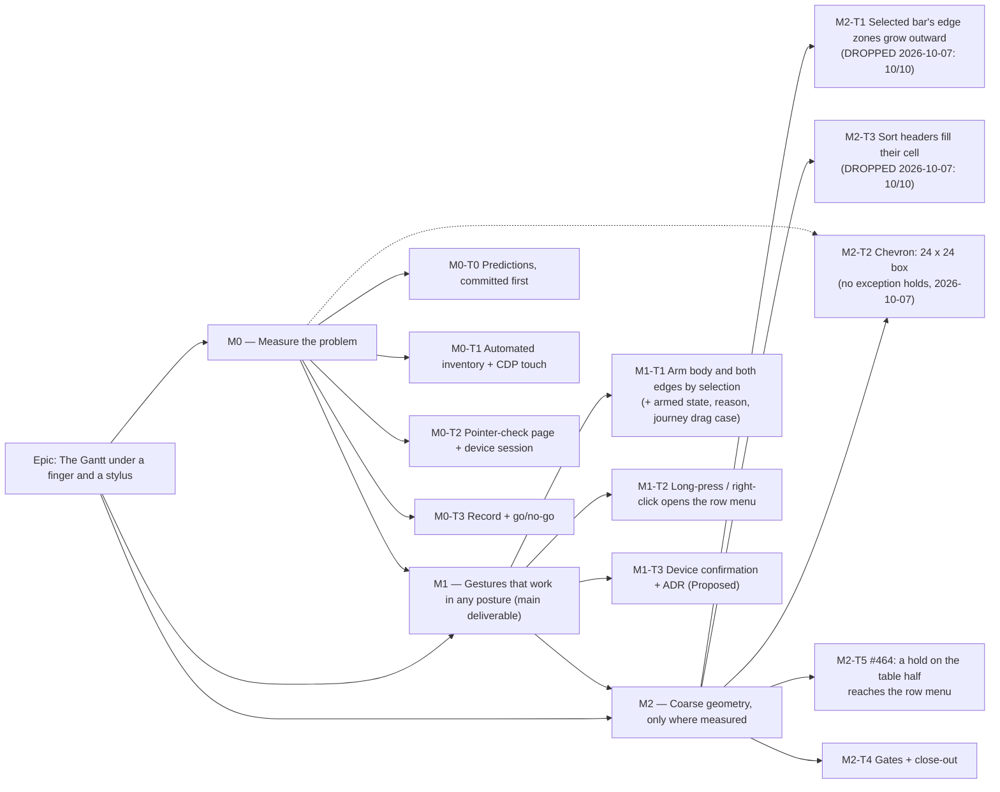

# Implementation Plan: The Gantt under a finger and a stylus

- **Feature spec:** [`./feature-spec.md`](./feature-spec.md)
- **Status:** Approved — by the product owner, 2026-10-05 (in advance, conditional on reviewer agreement; accessibility-, ux-reviewer and ui-architect agreed with changes, folded here)
- **Decision:** M2 go-ahead and #464 added by the product owner 2026-10-07 ('go ahead with Gantt M2 and #464'); amendment pending reviewer agreement. See "M2 as re-scoped by the device (2026-10-07)" under Milestone 2.
- **Owner:** builder agent (Sonnet), reviewed as listed per milestone

**Terms.** "Stylus" is the device. "Pen" means only the ADR-0028 edit lock. **Defaults adopted:**
Q1 = both postures; Q2 = (a) select, then drag.

## Breakdown

### Epic

**The Gantt under a finger and a stylus** — make the Gantt's shipped editing reachable by touch and
stylus in both postures, and give #215's Gantt half its large-target equivalent.

**Shape.** M0 measures. **M1 is the main deliverable.** It is keyed on the input event, so it works
with the keyboard attached, where the Surface reports `pointer: fine` (ADR-0118 D7). M2 is keyed on
`pointer: coarse`, and is expected to shrink to the chevron, which is an AA item at both pointers.
Every task carries an exit.

**No `VITE_*` flag** (ADR-0088 D1). The rollback is the commit boundary.

**Recalculation parity.** No scheduling input changes, and `computeSchedule` is not imported from
`features/gantt`.

---

### Milestone 0: Measure the problem

**Outcome:** a committed record of every Gantt target's size and touch / stylus behaviour, and a go or
no-go per later task.
**Entry point:** `Ships dark: measurement only. The one artefact that ships is a static diagnostic page
(/pointer-check.html) reached by typing its address. It takes no input and is not a product capability
(ADR-0140). M1 surfaces the first user-facing change.`
**Journey:** none.

---

#### Feature: M0-F1 — The measurement

> **Description:** ADR-0113 / ADR-0142. Predictions are committed before the first run (the ADR-0118 M0
> precedent).
> **Complexity:** M
> **Dependencies:** none
> **Risks:**
>
> - An instrument measuring the wrong pointer → the harness asserts `matchMedia` first (ADR-0118 D3).
> - Emulation is not a Surface → anything the emulator cannot settle is `INDETERMINATE` (ADR-0128 D4)
>   until the device answers.
>   **Testing requirements:** none (this is evidence). test-engineer reviews the harness.

##### Task M0-T0 — Predictions, committed before anything runs

- **Description:** write `docs/specs/gantt-coarse-pointer/m0-falsification.md` from the table below,
  adding the falsifying observation for each row. Commit it alone.
- **Complexity:** S · **Dependencies:** none · **Risks:** peeking first → the commit order is the
  control · **Testing:** none.

| #   | Target                                                                     | Prediction (fine → coarse)                                                        | Read from                                                       |
| --- | -------------------------------------------------------------------------- | --------------------------------------------------------------------------------- | --------------------------------------------------------------- |
| P1  | Bar body (movable)                                                         | 14 tall both; `touch-action: auto`; CDP touch drag → `pointercancel`, no write    | `GanttPanel.tsx:1967-1994`; `use-bar-pointer-drag.ts:152-159`   |
| P2  | Edge handles, **selected** bar                                             | 8 × 14 both; `touch-none`; CDP touch drag resizes                                 | `GanttPanel.tsx:2043-2063`                                      |
| P2b | Edge handles, **unselected** bar                                           | same as P2 — **a finger resizes instead of scrolling** (an accidental-write path) | same; `touch-none` is unconditional                             |
| P3  | Row menu trigger `⋯`                                                       | 28 × 28 both                                                                      | `button.tsx:75`                                                 |
| P4  | WBS disclosure chevron                                                     | ≤ 16 × 16 both — below 24 at fine                                                 | `GanttPanel.tsx:1856-1874`                                      |
| P5  | Sort header buttons                                                        | 24 tall both                                                                      | `GanttPanel.tsx:1119-1146`; `GanttRuler.tsx:6`                  |
| P6  | Column edges                                                               | 24 × 34 fine; not rendered coarse                                                 | `GanttColumnEdge.tsx:64`                                        |
| P7  | `Grid width` divider                                                       | ~24 wide; `touch-action: auto`; `pointercancel` (as #439)                         | `panel-resizer.tsx:104-135`                                     |
| P8  | Long-press / right-click on a row                                          | no app menu; browser default; whether `contextmenu` fires on hold or on release   | no `onContextMenu` under `features/gantt`                       |
| P9  | Double tap on a writable cell                                              | INDETERMINATE in emulation                                                        | `GanttCell.tsx:137`                                             |
| P10 | Open cell input                                                            | 24 tall both                                                                      | `GanttCell.tsx:155`                                             |
| P11 | Row menu items                                                             | ≥ 44 coarse                                                                       | `menu.tsx:457`                                                  |
| P12 | `View ▾` Columns group and `Show logic links`                              | width fields 44 coarse; compact checkboxes unknown                                | `gantt-columns-group.tsx:179-241`; `form.tsx:263-307`           |
| P13 | Object bar in the Gantt                                                    | ≥ 44 coarse                                                                       | `toolbar-styles.ts:179`                                         |
| P14 | Milestone diamond                                                          | no pointer handler at either pointer                                              | `GanttPanel.tsx:1952-1957`                                      |
| P15 | Refusal reasons                                                            | `title` only on an `aria-hidden` span; refused touch silent                       | `GanttPanel.tsx:1992`; `use-bar-pointer-drag.ts:84-85`          |
| P16 | **TSLD canvas**: a finger on an unselected bar, a selected bar, and a hold | the canvas owns every gesture (`touch-none`); hold opens nothing                  | `TsldCanvas.tsx:2323`; no `onContextMenu` under `features/tsld` |

##### Task M0-T1 — Automated inventory and CDP touch probes

- **Description:** `apps/web/measure-gantt/coarse-targets.spec.ts` in the **existing**
  `playwright.measure-gantt.config.ts` (not CI; no config change).
  - **Fixture:** `plan:capability-types-and-wbs` (`docs/TEST_PLAYBOOK.md:102`), seeded through the API.
  - **Viewports:** 1646 × 1097 and 1368 × 912.
  - **Contexts:** a fine context and a coarse one (`browser.newPage({ hasTouch: true })`, with
    `matchMedia` asserted).
  - (a) **Geometry** for P1–P6, P10–P14:
    - the box;
    - `elementFromPoint` at the centre, with `hitBy`;
    - computed `touch-action`;
    - the §2.5.8 24 px-circle spacing test (recorded, not judged).
  - (b) **Gestures**, by CDP `Input.dispatchTouchEvent` (the `column-truncation.spec.ts:454-465` method):
    - a drag on the body of a selected and of an unselected bar;
    - a drag on **each edge of a selected and of an unselected bar** (P2b);
    - a drag on the divider;
    - a double tap on a cell;
    - a ≥ 600 ms hold on a row: the event order, and whether `contextmenu` fires on hold or on release;
    - the same on the TSLD canvas (P16).
    - Writes are detected by the activity's version.
  - (c) **Fine media with touch input** (the D7 hybrid): if the harness cannot produce it, record
    `INDETERMINATE — device only`.
- **Complexity:** M · **Dependencies:** M0-T0
- **Risks:** CDP touch is not the device → M0-T2 is the arbiter for gestures.
- **Testing:** pinned positives (≥ 1 chevron, ≥ 1 movable bar, ≥ 1 of each edge, coarse confirmed);
  three runs, with the spread recorded.

##### Task M0-T2 — Pointer-check page and device session

- **Description:**
  1. **`apps/web/public/pointer-check.html` + `pointer-check.js`** (external script, for the web CSP).
     It prints in large text: `pointer`, `any-pointer`, `hover`, `any-hover`, `devicePixelRatio` and the
     viewport. It updates live, so folding the cover changes it on screen. It takes no input and makes
     no request (ADR-0140). Changeset `@repo/web` **patch** ("add a pointer-check diagnostic page"),
     because it must be released to reach the host. It stays as a diagnostic.
  2. **A one-page tick-box checklist** for the product owner, run on the deployed product with a plan
     the assistant prepares (WBS summaries, the pen held).

     _Before each posture: open `/pointer-check.html` and photograph the screen._

     **Finger pass — about 10 minutes per posture, so about 20 for both:**

     - [ ] 1. Drag a bar sideways **without tapping it first**. Did it move, or did the chart scroll?
     - [ ] 2. Tap the bar, then drag it. Moved or scrolled?
     - [ ] 3. Drag the **right end** of a bar you have **not** tapped. Did it stretch, or scroll?
     - [ ] 4. Press and hold a row for a second. What appeared — nothing, the browser's menu, or
           highlighted text? Did it appear **while** you held, or **after** you lifted?
     - [ ] 5. Double-tap a Duration cell. Did a text box open?
     - [ ] 6. Tap the `⋯` at a row's end ten times, then the small arrow beside a summary row ten times.
           How many missed?

     **Stylus pass — about 5 minutes, either posture:** repeat 1, 3 and 4.

     A screen recording (Windows: Snipping Tool → Record) or photos are accepted as the answer, and
     nothing has to be typed up. **Total about 25–30 minutes, plus setup.**

     **Owed from the device, because emulation cannot settle them:** checks 1–4 in both postures (P1,
     P2b, P8 timing, the D7 hybrid), check 5 (P9), check 6 (the hit rates M2-T1/T2 exit on), and the
     stylus pass (the stylus exit in M1-T1).
- **Complexity:** S (the assistant) · **Dependencies:** M0-T1
- **Risks:** this waits on the product owner → the assistant drafts M0-T3 meanwhile (CLAUDE.md §19.12).
- **Testing:** the page gets one unit test that it renders the four media values; no journey (it is
  not a product surface).

##### Task M0-T3 — Record and decide

- **Description:** `m0-measurement.md` records the command, a verdict per prediction (`CONFIRMED` /
  `REFUTED` / `INDETERMINATE`), the device answers, and a go / no-go per task.
  - Fold the unswept divider into #439 as an annotation.
  - Update `docs/BACKLOG.md`'s Gantt entry with spec §0's corrections.
  - A changed scope, as opposed to a dropped task, goes back to the product owner.
- **Complexity:** S · **Dependencies:** M0-T1, M0-T2 · **Testing:** `pnpm check:spec-status`.
  Changeset: none, beyond M0-T2's.

---

### Milestone 1: Gestures that work in any posture

**Outcome:** by finger or stylus, in either posture:

- a planner drags a **selected** bar, or its edges;
- a finger on an unselected bar scrolls rather than writing;
- anyone opens a row's actions by press-and-hold (or right-click) without hitting 28 px.

**Entry point:**

- plan workspace → `Gantt` → an activity row: **tap the bar**, which shows its armed state, then drag it
  sideways by finger or stylus;
- **press and hold the row** (or right-click it) → menu `Actions for <activity name>`.

**Journey:** `apps/web/e2e-gantt-editing/touch.spec.ts` (new file in the existing suite). It uses a
`hasTouch` context with `matchMedia` asserted, and CDP touch. **Its drag case lands with M1-T1** and is
verified **red against M1-T1's parent** first (ADR-0081 §2, ADR-0110). The long-press cases land with
M1-T2.

---

#### Feature: M1-F1 — Touch and stylus gestures

> **Description:** US-1, US-2 (the arming half), US-3, and US-4's stated route.
> **Complexity:** M
> **Dependencies:** M0 go
> **Risks:**
>
> - A live drag and the menu at once → `cancel()` on all three hooks before opening; the event is
>   ignored past `DRAG_INTENT_PX`.
> - A mouse regression → `bar-drag.spec.ts` must stay green **unchanged**.
>   **Testing requirements:** unit, journey, and the existing mouse journey.

##### Task M1-T1 — Arm the body and both edges by selection (touch and stylus)

- **Description:**
  - **The hook.** `useBarPointerDrag` gains `touchArmed`. For `pointerType` `touch` or `pen`, an unarmed
    press returns **before** the `enabled` / `onRefused` branch, with no `preventDefault`. `enabled` is
    **not** flipped (spec §2).
  - **All three instances** (`GanttPanel.tsx:1608, 1659, 1715`) pass `touchArmed: isSelected`.
  - **The body** gets `touch-action: pan-y` only when selected and movable.
  - **The edges.** Their unconditional `touch-none` (`:2049, 2058`) becomes selected-only.
  - **Armed state.** A visible armed state for a selected, movable bar, using existing tokens and not
    colour alone.
  - **Hint and reason.** A first-session hint ("Drag to move, or press and hold for actions"). A
    selected bar refused by its gate shows a visible `role="status"` reason when selected by touch or
    stylus. These are selection-time messages, separate from ADR-0170 D6's after-write announcements.
  - **Docblock.** Correct `:316`.
  - **Journey.** The `touch.spec.ts` drag case.
  - **ADR.** Draft ADR-0177 as `Proposed` (D1, D2) in this task, because this task is the decision.
- **Exits:**
  - **Stylus.** If M0 shows a stylus drag already moves a bar in both postures, gate `touch` only.
  - **Whole task.** **Dropped** only if M0 shows a finger drag already moves a bar **and** a finger on an
    unselected edge already scrolls — in which case P1 and P2b are both refuted. P2b alone is enough to
    keep the edge half.
- **Complexity:** M · **Dependencies:** M0-T3
- **Risks:**
  - `touch-action` is read at `pointerdown` → the journey taps, waits for `aria-selected`, then drags.
  - `pan-y` blocks pinch-zoom over the selected bar → recorded in the ADR.
- **Testing:**
  - **Unit, the hook:**
    - an unarmed `pointerType: 'pen'` press calls neither `onCommit` nor `onRefused`, and does not
      `preventDefault`;
    - the same for `'touch'`;
    - a `'mouse'` press is unchanged when unarmed.
  - **Unit, the panel:** the edge classes carry `touch-none` only when selected; the body carries
    `pan-y` only when selected and movable; the armed state renders.
  - **Unit, reasons:** the refusal reason is in a `role="status"` node.
  - **Structural:** no gesture class sits behind a `pointer-coarse:` variant.
  - **Journey, a selected bar:** tap it, CDP-drag it, and the `Start` cell changes.
  - **Journey, an unselected bar:** CDP-drag its end, and its `Duration` cell does **not** change.
  - **Journey, a refused bar:** its reason is visible.
- **Development steps:**
  1. Write the journey drag case and run it red on the parent.
  2. Write hook tests first, then the hook.
  3. Classes, armed state and reason surface, each with tests.
  4. Run the journey green.
  5. ADR draft.
  6. Changeset `@repo/web` **minor** ("drag a selected Gantt bar with a finger or stylus; an unselected
     bar now scrolls").

##### Task M1-T2 — Long-press and right-click open the row menu

- **Description:**
  - **`GanttRowMenu`** gains only an optional `ref?: Ref<{ openAt(point, restoreTo: HTMLElement): void }>`
    (React 19 ref-as-prop). `openAt` sets the existing local `anchor` / `resolved` state and a local
    restore ref.
  - **The hook** returns `cancel()` and exports `DRAG_INTENT_PX` (the renamed 4 px constant at
    `use-bar-pointer-drag.ts:33`).
  - **The row's `onContextMenu`:**
    1. If any of the three hooks has moved more than `DRAG_INTENT_PX`, ignore the event.
    2. Otherwise `cancel()` all three.
    3. `preventDefault`.
    4. `openAt`.
  - **Keyboard origin** (`pointerType` empty, or the coordinates 0) anchors to the row rect. If the
    keydown path (`:827-838`) already opened the menu, it is not opened again.
  - **After the menu closes**, focus returns to the row.
  - **Selection is unchanged.** The row swallows the trailing click after a long-press opened the menu.
  - **The browser's menu stays** on bucket rows, inside an open cell input, and on Shift+right-click.
  - **Fallback.** If M0 shows Windows fires no `contextmenu` on a touch hold, extract `useLongPress`
    into `components/ui/` on the **tooltip** precedent (500 ms, 8 px tolerance, `tooltip.tsx:89-91,
318-359`) and migrate `tooltip.tsx` and `HierarchyTree.tsx`. That makes one copy, not three, and
    brings component-reviewer in.
- **Exit:** dropped only if #215 first brings the `⋯` to 44 under coarse **and** the product owner is
  only ever in tablet posture. Q1 = both, so this task is owed as things stand.
- **Complexity:** M · **Dependencies:** M1-T1
- **Risks:**
  - A right-click change for mouse users → the changeset and `docs/UX_STANDARDS.md` say "**right-click**
    on a Gantt row opens its actions; Shift+right-click keeps the browser's menu".
  - Key and focus claims under ADR-0111 (spec §3) → **accessibility-reviewer before release**.
- **Testing:**
  - **Unit:**
    - the menu opens at the point with the same items as the `⋯`, compared as lists;
    - the `Menu` is named `Actions for <activity>`;
    - a hold on the **still** selected bar cancels the live drag: no ghost, and the Escape listener is
      removed;
    - a hold after a move past the threshold opens nothing;
    - a keyboard-origin `contextmenu` anchors to the row and restores focus there, and does not
      double-open;
    - an event inside an open cell input is left alone;
    - the selection is unchanged after a long-press, including the trailing click.
  - **Journey cases:**
    - long-press a row → the menu opens and `Indent` is present;
    - hold the selected bar still → the menu opens;
    - drag the selected bar → no menu;
    - axe on the open menu.
- **Development steps:** handle → hook `cancel()` → row handler → tests → journey cases → changeset
  `@repo/web` **minor** ("press and hold, or right-click, a Gantt row to open its actions").

##### Task M1-T3 — Device confirmation and docs

- **Description:**
  - **A device confirmation** on the deployed release, run as a three-item tick-box (about 5 minutes per
    posture):
    1. tap then drag a bar;
    2. drag an untapped bar's end;
    3. press and hold a row, lift, and check the menu is still open.
  - **The ADR.** ADR-0177 D3 added; it stays `Proposed`.
  - **Docs:**
    - `docs/UX_STANDARDS.md` "Row / node actions" gains the long-press and right-click sentence;
    - US-4's route (long-press → `Edit`) and the open quick-edit gap go in the ADR's Consequences;
    - `CLAUDE.md` §16 gets the ADR-0177 line;
    - the ADR-0095 and ADR-0118 headers, and their §16 lines, gain "amended by ADR-0177".
- **Complexity:** S · **Dependencies:** M1-T2
- **Testing:** `pnpm prepush`; `scripts/e2e-local.sh web:gantt-editing`.

**M1 reviews:**

- accessibility-reviewer (**before release**, ADR-0111), component-reviewer, ux-reviewer and
  test-engineer;
- component-reviewer again if `useLongPress` is extracted.

Not engaged: security, api, backend-performance, database-architect — there is nothing for them to
review.

---

### Milestone 2: Coarse geometry, only where measured

**Outcome:**

- in tablet posture, the **selected** bar's edges are easy to grab;
- at both pointers, every Gantt target is ≥ 24 px or a named exception;
- the gates can see all of it.

**Entry point:** plan workspace → `Gantt` (tablet posture). The entry points are the selected bar's
**start and finish edges**, the WBS **disclosure arrow**, and the **sort buttons** in the column header.
**Journey:** `touch.spec.ts` gains a coarse case — on the selected bar, CDP-drag the finish edge from
20 px outside the bar end, and the `Duration` cell changes. M2-T4 adds the sweeps.

**Whole-milestone note:** with Q1 = both, M2-T1 and M2-T3 are reachable in tablet posture. M2 is
expected to shrink to M2-T2 plus M2-T4 if M0's hit rates are high.

#### M2 as re-scoped by the device (2026-10-07)

The product owner's Surface answers ([`device-results.md`](device-results.md), `web` 0.177.2) and
accessibility-reviewer's ruling on the chevron (2026-10-07) re-scope M2. This section **supersedes** the
Outcome, Entry point and Journey above, and the task texts below where they disagree.

- **M2-T1 — DROPPED.** Exit met: a finger stretched a selected bar's end **10 / 10** in tablet posture,
  0 / 10 other (`device-results.md`, item 7 and the decision table). M0's start-zone collision with the
  `⋯` (`m0-measurement.md`, Collisions) is moot with it.
- **M2-T3 — DROPPED.** Exit met: **0 / 10** header misses in tablet posture (item 8).
- **M2-T2 — a 24 × 24 box; no exception.** Below.
- **M2-T5 — NEW (#464).** Below.
- **Order: M2-T2, then M2-T5, then M2-T4.** Each is one commit; `main` stays releasable.
- **Open questions for the product owner:** Q-M2-1 (where the arrow goes) and Q-M2-2 (the #464
  trade-off), at the end of this section.

**Outcome (re-scoped):** at both pointers the summary-row arrow is ≥ 24 × 24; a press-and-hold anywhere
on an activity row, table half included, opens SchedulePoint's row menu; the gates see both.
**Entry point:** plan workspace → `Gantt` → an activity row: the summary-row **arrow**, and a
**press-and-hold on the table half**.
**Journey:** `e2e-gantt-editing/touch.spec.ts` gains the M2-T5 cases; the chevron box is asserted by a
case in `e2e-gantt/` and by M2-T4's sweep. The coarse edge-zone case above goes with M2-T1.

##### M2-T2 (re-specified) — the arrow gets a 24 × 24 box

- **Ruling (accessibility-reviewer, 2026-10-07): no §2.5.8 exception holds.** Equivalent: the keyboard
  is not a pointer control, and `GanttRowMenu` has no expand/collapse item. Spacing: the 24 px circle
  intersects the row, itself a target (`onClick`, `GanttPanel.tsx:1917-1929`). Inline / essential do
  not apply. The device's 0 / 10 misses show low urgency, not an exemption.
- **The change.** The activity-row arrow (`GanttPanel.tsx:2023-2043`: `aria-hidden`, `tabIndex={-1}`,
  `mr-1 inline-flex align-middle`, a `size-3` icon) becomes a 24 × 24 box (`size-6 shrink-0
items-center justify-center`, `mr-1` dropped). The icon stays 12 px, and the row stays 28 px.
  - It keeps `aria-hidden`, `tabIndex={-1}` and its click `stopPropagation` (`:2031-2034`).
  - It carries `data-gantt-disclosure`, the marker M2-T4's pinned positive counts.
  - Its comment follows the `min-h-6` style ("§2.5.8's 24 px floor, not a rhythm choice",
    `:1178-1189`).
  - It stays clear of the row-menu trigger.
- **A hold on the arrow.** The row has no long-press timer; M1 kept the native `contextmenu` only
  (`m1-record.md:16`). So a tap on the arrow cannot open the menu. A deliberate hold on it opens the row
  menu, as a hold does anywhere on the row.
  - **Gap found:** the arrow's own `onClick` stops propagation before the row's `swallowClick`
    (`:1917-1921`) can see the trailing click. A hold that opened the menu would therefore also toggle
    the row.
  - **Fix:** the arrow honours the same swallow.
  - Whether Windows sends that trailing click is the device's to say; the row already assumes it might
    (spec §2, edge cases).
- **Where it goes — the problem.** It sits in the Code column today, after the depth indent
  (`paddingLeft: 8 + depth * 14`, `:2020`; `px-2`, `:2013`).
  - Code is 80 px by default and 48 px at minimum (`layout/column-widths.ts:40, 52`).
  - So the room left is `80 - 16 - 14·depth`: 22 px at depth 3 and 8 px at depth 4. A 24 px box needs
    88 px at depth 4.
  - At 48 px wide the box does not fit past depth 0.
- **The options:**
  - **(A) Arrow only into the Activity column. This is the minimal alternative.** The indent stays in
    Code, so the hierarchy shows only in Code while the toggle sits in Activity. The two are separated
    by the Code text.
  - **(B) Keep the arrow in Code; cap the indent or let the box overflow. Rejected:** it fails at 48 px
    whatever the cap.
  - **(C) Indent and arrow both move into the Activity column. Recommended** (ux-reviewer;
    accessibility-reviewer prefers Activity placement and moving the bucket arrows too):
    - The order is indent → arrow → name, the Project Explorer's shape (`HierarchyTree.tsx:61`).
    - **The Code column becomes plain.**
    - Every row (activity rows and bucket rows) gets the same 24 px slot. A leaf's slot is empty. The
      bucket arrow stays a decorative `span` (`:1481-1487`), so the Activity column has one rule.
    - The slot always exists, because the Activity column cannot be hidden (`gantt-view-state.ts:47-58`).
    - The indent keys on `column.key === 'name'`, not on `i === 0`, so hiding Code changes nothing.
  - **Visible effect of (C):**
    - Codes stop being indented.
    - Names indent by depth and gain a 24 px slot.
    - The arrow sits immediately before the summary's name.
    - Bucket rows match.
  - **The printed programme is unchanged.** `GanttPrintSurface.tsx:313-345` is a separate `<table>`
    with no arrow and its own indent (`4 + depth * 10`, `:339`). An earlier draft of this section said
    print would change; that was wrong.
  - Placement is the product owner's call (Q-M2-1).
- **Tests.**
  - **Unit:**
    - the arrow carries the 24 px box classes and `data-gantt-disclosure`, and sits in the Activity
      cell;
    - it is still `aria-hidden` and `tabIndex -1`;
    - a tap toggles and does not select the row;
    - a hold that opened the menu does not also toggle;
    - under (C), the Code cell carries no depth padding, and bucket rows render the same slot.
  - **Journey (`e2e-gantt/`), run red against the parent first (ADR-0110):**
    - The arrow's box is at least 24 × 24 at fine and coarse, at depth 0 and depth 4, with Code at its
      default width and at 48 px (typed, ADR-0173).
    - `elementFromPoint` at the arrow's centre is the arrow, not the `⋯` and not the name text.
    - Under (C), the name's x-offset grows with depth.
    - At the narrowest Activity width the grid allows, the name still truncates with an ellipsis inside
      its cell and keeps any `title` it has today.
    - The fixture comes from **a new test-local helper**, `seedNestedWbs`, in the suite's support file.
      It creates five nested `WBS_SUMMARY` activities and a leaf through the public API, linking each
      child by `parentId` (`create-activity.dto.ts:287-288`), then recalculates.
    - **`plan:capability-types-and-wbs` reaches depth 1 only** (`types-wbs.ts:43-50`: one summary,
      two leaves), and the existing `seedActivities` helpers cannot set a parent. The catalogue plan is
      not touched.
    - **Expand-all:** the panel starts with nothing collapsed (`GanttPanel.tsx:403`). The helper
      therefore asserts every level's row is visible, rather than driving a control; the Gantt has none
      that expands everything.
  - **Print tests stay green unchanged**, plus one assertion that no leading slot or
    `data-gantt-disclosure` appears in the print surface.
  - Under (C), any test reading the Code cell's `paddingLeft` moves to the Activity cell. A grep on
    2026-10-07 found none under `e2e-gantt*` or the gantt unit tests; the builder re-greps for
    `depth * 14`.
- **The Surface sheet changes in this commit:** item 6 says where the arrow now is.
- **ADR-0111:** no key or focus behaviour changes (still `tabIndex -1`, keyboard toggles unchanged).
  **ADR-0105:** no new public contract. **Changeset:** `@repo/web` **patch**.

##### Task M2-T5 — #464: a hold on the table half reaches the row menu

**Diagnosis, from code (not reproduced; the device decides).** The row has one `onContextMenu`
(`GanttPanel.tsx:1839-1875`, bound at `:1930`); both halves are its descendants (table half
`:1952-1958`, chart half `:2111-2116`). Ranked:

1. **Likeliest — a hold on selectable text is a text-selection gesture.** The table half is the only part
   of the row with hit-testable text: idle cells render a plain `{text}` (`:2044-2051`;
   editable ones the same, `:1997-1999` via `GanttCell.tsx:213-215`) and nothing in the grid sets
   `user-select` (grep for `select-none` / `user-select` under `apps/web/src`, 2026-10-07: only
   `GanttColumnEdge.tsx:64` in the Gantt, which is the header). The chart half has no text at all: the
   bar, float, ghost and diamond are empty `aria-hidden` spans (`:2117-2179`). The chart half is the
   control: there a hold delivers `contextmenu` (after lift, item 4). So the only difference between a
   hold that works and one that does not is text under the finger. M0 saw `selectstart` follow a touch
   on a row in emulation (`m0-measurement.md:57`), so the grid's text is selectable under touch today.
   Whether Windows then dispatches no `contextmenu` or shows its selection menu regardless is not
   known, and the remedy does not depend on which.
2. **Unlikely — the event arrives and an early return hands it to the browser.** Every early return but
   one is row-wide and identical for both halves (`rowMenuContext`, Shift, `intentExceeded()`, and
   `openAt`, which returns false only for a null context, `GanttRowMenu.tsx:132-140`). The one that can
   differ is `closest('input,…,[role="menu"],[role="dialog"]')` (`:1844-1849`), and in the table half it
   matches only an **open** cell input (`GanttCell.tsx:139-212`); idle cells render no input,
   `textarea`, `select` or `[contenteditable]`, and no cell has a `contextmenu` or long-press handler
   (grep above: the row's is the only `onContextMenu` in `features/gantt`). It explains the report only
   if a cell was open, and an open cell closes on blur (`GanttCell.tsx:211`).
3. **Very unlikely — the hit lands outside the row.** The table half is `sticky z-10`, but every element
   in it is a row descendant, and the only Gantt overlay (`GanttColumnEdge`) is in the header.

**What distinguishes them.**

- **On the Surface:** when the browser's menu appeared, was a word highlighted (with selection
  handles)? Does a hold on an **empty** part of the table half (the blank Code cell of a row without a
  code, or the space beside a short value) open SchedulePoint's menu? Yes to either → cause 1. Was a
  text box open → cause 2.
- **In container Chromium** (CDP cannot synthesise the OS long-press, M0 P8; `m1-record.md:45-47`):
  dispatch a `contextmenu` on a table-half cell's text span after a real CDP touch press → the menu opens
  and `defaultPrevented` is true, which proves the handler path is the same as the chart half's (rules
  out 2 and 3 for the idle case); read the computed `user-select` of that span (today `auto`, i.e.
  selectable); `elementFromPoint` at a cell's centre is a `[role="row"]` descendant (rules out 3).

**Remedy — stop text selection in idle grid cells after a touch or stylus press.** Not `useLongPress`:
spec §4.6 extracts it only if `contextmenu` does not fire on a hold, and the chart half shows it does; a
timer of our own would also race the browser's selection rather than stop it.

- **Scope, keyed on the input event (ADR-0177 D1), not the media query.**
  - **Why not `pointer-coarse:`.** It would miss the cover-attached posture, which reports
    `pointer: fine` (`device-results.md`, The device) and is one of the two postures that failed. The
    structural test already forbids it (`GanttPanel.touch.test.tsx:165-172`).
  - **One attribute at the grid root, no React state.** The rows are not memoised, so panel state would
    re-render every virtualised row.
    - The existing scroll `Surface` (`GanttPanel.tsx:1074-1079`) gets an `onPointerDownCapture`.
    - The handler writes `event.currentTarget.dataset.lastInput`: `touch` for `touch` **and** `pen`,
      `mouse` for `mouse`.
    - `Surface` forwards both `className` and the rest props (`components/ui/surface.tsx:107-130`), so
      the root also takes `group/grid` (the builder greps that the group name is unused).
    - React never renders `data-last-input`, so it does not fight the write.
    - With no attribute (before any press), selection is allowed.
  - **What carries the class.** The **idle** cell text spans (`:1997-1999`, `:2044-2051`, and the name
    span wherever Q-M2-1 puts it) carry `group-data-[last-input=touch]/grid:select-none`.
  - **"Never on an open cell" is structural.** An open cell renders an `<input>`, not the idle span
    (`GanttCell.tsx:139-215`), so nothing on the field can match.
  - **Timing.** Written at `pointerdown`, the attribute is in place before a hold can become one.
  - **No shared hook.** One in `components/ui/` would be an ADR-0105 public contract.
- **Cost.**
  - **Mouse.** A mouse, and the Surface's touchpad (which reports as a mouse), keeps cell text
    selection, except between a touch or stylus press and the next mouse press.
  - **Stylus.** A stylus can no longer drag-select cell text.
  - **Something does rely on mouse selection.** The copy shortcut stands down for a live text
    selection, so a planner who selects table text and presses Ctrl+C gets the text
    (`use-clipboard-keybindings.ts:12-18, 66-67`).
  - **No test selects Gantt cell text.** A grep for `getSelection` under `apps/web/e2e-gantt*` found
    none; the copy-paste journey selects a heading (`e2e-copy-paste/copy-paste.spec.ts:217-225`). This
    is why the mouse is deliberately kept, and the unconditional `select-none` is rejected.
  - **How a touch or stylus user copies a cell value:**
    - **Editable cells:** double-tap opens the field. That worked in both postures (item 5). The
      contents open selected (`GanttCell.tsx:93-99`), and the browser's own menu, with Copy, stays
      inside an open field (`GanttPanel.tsx:1844-1849`).
    - **Code and Total float** are not editable cells (`:1967-1969`). Their route is row menu → `Edit`
      (`selection-actions.tsx:678`), the activity editor. Whether the editor shows the code as a
      selectable field was **not checked**.
    - The row menu has no text "Copy" item. `Duplicate` copies the activity, not its text.
- **Tests.**
  - **Unit (`GanttPanel.touch.test.tsx`):**
    - the attribute flips to `touch` on a `touch` press and on a `pen` press, and back on a `mouse`
      press;
    - idle spans carry the variant class, and an open cell's input does not;
    - accessibility-reviewer's case: a touch press, then a double-click opens the cell, and the input
      is not inside any element carrying the variant;
    - a `contextmenu` on a table-half span opens the menu with `defaultPrevented`.
    - **Pen is covered here only.** CDP cannot emit a stylus pointer type (`m1-record.md:73-74`).
  - **Journey (`e2e-gantt-editing/touch.spec.ts`):**
    - **Hold the CDP touch down**, as the existing hold cases do, so a tap cannot open the editor.
    - While it is held, the span's computed `user-select` is `none` (`expect.poll` / `toHaveCSS`).
      **This is the only red-at-parent assertion.**
    - Then dispatch the synthesised `contextmenu` on that span: the menu `Actions for <activity>`
      opens. This passes at the parent too, so it is labelled a **characterisation guard**.
    - Release, then on the **first** mouse press after the touch, drag across the cell text:
      `getSelection()` is non-empty. That works because the attribute flips in `pointerdown` capture,
      before the `mousedown` whose default action starts a selection. This case fails only against an
      unconditional `select-none`, and it is labelled so.
    - **Not asserted:** "no selection after a touch hold". M0 P8 saw none at the parent, so it cannot
      fail.
    - The `user-select` case also runs in a context whose `matchMedia('(pointer: fine)')` is asserted
      true, following the `measure-gantt` fine-context precedent. That separates the input-keyed fix
      from a `pointer-coarse:` one. If that context cannot deliver CDP touch, the case records the
      reason and the structural test carries the claim.
    - `grid-edit.spec.ts`'s mouse double-click cases stay green **unchanged**.
    - **What the journey proves:** the CSS is applied, and the menu opens on a synthesised event.
    - **What it does not prove:** that Windows suppresses the selection, or that #464 is fixed. Device
      item 12 is the arbiter.
  - **Device:** a new **item 12** in `device-checklist.md`, both postures: "Press and hold on the
    **words** in the table half of a row, then let go. What appeared?"
    - Two follow-ups: "Was a word highlighted?" and "Hold on an empty part of the table: what
      appeared?"
    - The sheet updates in this commit.
- **Explicit fallback if item 12 still shows the browser's menu:**
  1. M2-T5's commit is **reverted**, because it would cost the stylus its text selection for nothing.
  2. #464 stays open with the answer recorded.
  3. The two follow-up answers decide between causes 1 and 2.
  4. If they show the event never arrives, a `useLongPress` on the tooltip precedent returns to the
     product owner as a **new task**, not a silent change. It would be a `components/ui/` public
     contract (ADR-0105) and a component-reviewer item.
- **ADR-0111:** no key or focus behaviour changes, so no pre-release pass is owed.
  **ADR-0105:** no new public contract. **Changeset:** `@repo/web` **patch** ("a press and hold on the
  Gantt's table opens the row's actions, as on the chart").
- **Complexity:** S · **Dependencies:** none within M2 · **Reviews:** component-reviewer, test-engineer.

##### M2-T4 (re-scoped) — what it now covers

- **Gates (`e2e-workspace-fit/command-surface.spec.ts`).**
  - **Seeds.** Both seeds (`:230-233`, `:947-950`) gain a WBS summary with a child, via M2-T2's
    `seedNestedWbs` (or a one-level use of it). The rows are asserted expanded before sweeping, and
    every pinned count is re-checked.
  - **The fine 24 px sweep's chevron positive** counts `[data-gantt-disclosure]` inside the treegrid
    (at least 1), and asserts each box is at least 24 × 24.
    - A marker is needed because a swept target's id is `''`.
    - `atLeast: 1` on the grid (`:756`) does not do this job: the sort headers already satisfy it.
  - **The coarse projection gains the Gantt grid surface.** It asserts at least 44 for every swept
    target (`HOUSE_TARGET`, `:874`; the assertion at `:988-994`).
    - The 24 × 24 arrow is a real `<button>` that sweep picks up, so without a decision this task's
      own gate goes red on M2-T2.
    - **Decision: the arrow is listed in D4's coarse list and exempted, not grown to 44.** A 44 px box
      cannot sit in a 28 px row without #215's row-height decision. That is the same reason the 24 px
      sort headers are listed rather than grown, and the device hit the arrow 10 / 10 in both postures
      (item 6).
  - **Exemptions** use `[role="treegrid"] [data-gantt-coarse-exempt="<kind>"]`, added beside
    `EXEMPT_WITHIN` (`:913`), never by size.
    - The kinds are `disclosure`, `row-menu`, `sort` and `cell-input`.
    - **Each is exercised, so each can fail (ADR-0110).** The gate asserts every kind is present at
      least once. For `cell-input`, it opens a Duration cell for one pass.
    - **A planted regression per kind:** delete that element's attribute, and the element must appear
      in `belowHouse` (red).
    - The marker counts are also the Gantt surface's pinned positive, so an empty grid cannot pass.
  - **Not exempted, because the sweep cannot see them:**
    - **The edge handles and the bar body** are `span`s, which are outside the sweep's selector list
      (`:101-108`). An exemption for them could never fail. D4 lists them, and the unit class tests
      (`GanttPanel.touch.test.tsx:102-116`) hold them.
    - **The compact `View ▾` checkboxes:** whether any coarse surface sweeps the open `View ▾` was not
      checked.
      - If one does, they get a kind and a planted regression.
      - If none does, they are listed in D4 as **unswept**, with that reason, and no exemption is added.
- **ADR-0177 → Accepted**, with:
  - **D4, fine pointer (§2.5.8 equivalent exception):**
    - The 8 × 14 edge handles and the 14 px bar body → typed `Start` / `Finish` / `Duration` cells, F2,
      row menu → `Edit`.
    - **Keep the sentence:** the handles rely on the typed-cell equivalent, which is reachable by
      keyboard (F2) and by touch (double tap, item 5).
    - The arrow is **fixed**, not listed.
  - **D4, coarse (ADR-0118 D1, under 44):**
    - the `⋯` (28) → press-and-hold;
    - the summary-row arrow (24) → none at a large target. Say plainly: keyboard ArrowRight / Left only,
      and 10 / 10 on the device;
    - the edge handles (8 × 14, not grown) → typed cells / `Edit`;
    - the sort headers, **exactly 24** tall with the spacing test passed (`Float left` 32, M0 P5) → none
      at a large target, said plainly;
    - the open cell input (24) → the activity editor;
    - the compact checkboxes, as decided above.
    - Each swept entry matches a `data-gantt-coarse-exempt` kind. Each unswept one says why.
  - **D3:** one sentence. A hold anywhere on the row reaches the menu, and idle cell text gives way to
    it through **one attribute at the grid root** after a touch or stylus press (M2-T5).
  - **Consequences:** the "touch quick-edit gap is open" bullet is corrected — a double tap opened a
    text box in both postures (item 5).
- **Docs:** `docs/UX_STANDARDS.md`, `docs/DESIGN_SYSTEM.md` exception lists; #215 (the Gantt
  equivalent, by symbol); **#464 closed**; spec and plan headers `Accepted — shipped (ADR-0177)`;
  `docs/BACKLOG.md` rewritten to what is left, **without** the quick-duration-by-touch gap.

##### Questions for the product owner

- **Q-M2-1 — Where should the small arrow on a summary row go?** At its required size it no longer
  fits in the narrow Code column once rows are nested three or four deep.
  - **Default (C):** move the arrow **and** the indentation into the Activity column, so a row reads
    indent → arrow → name, like the Project Explorer.
    - Codes stop being indented.
    - Every name gets a 24 px slot, so names line up.
    - The grey grouping rows match.
    - The printed programme does not change.
  - **Alternative (A):** move only the arrow. Codes stay indented, and the arrow sits by the name.
- **Q-M2-2 — #464's trade-off.** After you touch the table with a finger or the stylus, the text in its
  cells cannot be highlighted until you next use the mouse or touchpad. The stylus can no longer
  highlight cell text at all.
  - Copying still works by double-tapping a cell to open it, or through row menu → Edit.
  - **Default:** accept.

##### Review record — the amendment (2026-10-07)

Four reviewers checked the first draft (commit `56305024`): accessibility, component, ux and test.
Everything below is folded into the sections above.

| #   | Reviewer            | Finding                                                                                  | Resolution                                                                                      |
| --- | ------------------- | ---------------------------------------------------------------------------------------- | ----------------------------------------------------------------------------------------------- |
| 1   | a11y, component     | **Blocking.** Print does not change: `GanttPrintSurface.tsx:313-345` is a separate table | Claim withdrawn; print tests stay green unchanged, plus a no-leak assertion                     |
| 2   | test                | **Blocking.** The coarse projection's ≥ 44 assertion would fail on the 24 px arrow       | The arrow is listed in D4 coarse and exempted by kind (not grown: 28 px row, #215)              |
| 3   | test                | **Blocking.** The catalogue plan reaches depth 1; no helper can seed parents             | New test-local `seedNestedWbs`; the "not checked" flag is answered: no                          |
| 4   | ux, a11y, component | Placement                                                                                | (C) is the default, (A) the minimal alternative, (B) rejected; bucket rows get the same slot    |
| 5   | component           | Panel state would re-render every row                                                    | `data-last-input` on the scroll `Surface`, written in capture; a `group-data` variant; no state |
| 6   | ux, test            | Journey design                                                                           | Held touch; first-mouse-press selection; red-vs-guard labels; a fine-context run; scope stated  |
| 7   | a11y                | Copy route for touch; an explicit fallback                                               | Both added (the editor's code field is not checked)                                             |
| 8   | test                | The chevron positive needs a marker                                                      | `data-gantt-disclosure`                                                                         |
| 9   | test                | Exemptions nothing exercises cannot fail                                                 | Every kind is asserted present, with a planted regression; edge handles are listed but unswept  |
| 10  | a11y                | D4 sentences; the arrow's click and a hold                                               | Kept. Found: a hold on the arrow would also toggle it; the arrow now honours the row's swallow  |

---

#### Feature: M2-F1 — Coarse targets and the AA floor

> **Description:** US-2 (geometry), US-5.
> **Complexity:** M
> **Dependencies:** M1 (except M2-T2)
> **Risks:** a zone overlapping its neighbours (the ADR-0118 D8 blind spot) → zones apply to the
> selected bar only, are bounded by the row's height, and grow outward into whitespace (ADR-0059: one bar
> per row).
> **Testing requirements:** unit, journey, sweeps.

##### Task M2-T1 — The selected bar's edge zones grow outward under coarse

> **Dropped 2026-10-07** — exit met, 10 / 10 (see "M2 as re-scoped by the device").

- **Description:** `pointer-coarse:` classes, applied **only on the selected bar**, give each edge zone
  the row's height and extend it outward from the bar end. The inward 4 px is unchanged.
- **Exit:** **dropped** if M0-T2 shows ≥ 8/10 edge hits by finger in tablet posture. **Re-scoped**
  (back to the product owner) if M0 finds a collision.
- **Complexity:** S · **Dependencies:** M1-T1
- **Risks:** the start zone overlapping the baseline ghost → the ghost has no handler
  (`GanttPanel.tsx:1945-1951`); confirmed by `hitBy`.
- **Testing:** unit (the classes are present only when selected); the journey's coarse case; the mouse
  `bar-drag.spec.ts` unchanged.
- **Changeset:** `@repo/web` **patch**.

##### Task M2-T2 — The disclosure chevron (AA, both pointers) — may land straight after M0

> **Re-specified 2026-10-07** — no exception holds; the box lands (see "M2-T2 (re-specified)" above).

- **Description:** the chevron is `aria-hidden` with `tabIndex={-1}` and toggles by keyboard
  (ArrowRight/Left).
  - **Prefer a recorded exemption** over changing the fine-pointer layout, but only if
    accessibility-reviewer can name a qualifying §2.5.8 exception.
  - **Note:** the keyboard is **not** a pointer equivalent under §2.5.8's equivalent clause. A code read
    (2026-10-05) found no other pointer control that toggles a summary row — a row click selects
    (`GanttPanel.tsx:1762`). The spacing exception is doubtful, because the chevron sits inside the row,
    which is itself a target.
  - **If no exception holds**, it gets a 24 × 24 box with the icon centred, checked against the Code
    column at depth ≥ 4.
- **Exit:** **dropped** if M0 refutes P4 (≥ 24).
- **Complexity:** S · **Dependencies:** M0-T3 (not M1)
- **Testing:** unit; the 24 px sweep (M2-T4), red then green.
- **Changeset:** `@repo/web` **patch**, if the box lands.

##### Task M2-T3 — The sort headers fill their cell under coarse

> **Dropped 2026-10-07** — exit met, 0 / 10 misses (see "M2 as re-scoped by the device").

- **Description:** under `pointer-coarse:`, the header buttons fill the 34 px cell. That is still a
  named exception, and it states plainly that sorting has no other large-target route.
- **Exit:** **dropped** if M0 shows ≥ 8/10 header hits in tablet posture.
- **Complexity:** XS · **Dependencies:** M0-T3 · **Testing:** unit; the coarse projection.

##### Task M2-T4 — Gates and close-out

- **Description:**
  1. **`e2e-workspace-fit/command-surface.spec.ts`:**
     - add a WBS summary with a child to **both** seeds (`:230-233`, `:947-950`), and re-check every
       pinned count, since the deck's enabled set may change;
     - the 24 px Gantt sweep's pinned positive requires ≥ 1 chevron;
     - the coarse projection gains a **Gantt grid** surface: switched to in the test, `matchMedia`
       asserted, and `minWidth: 834` because of #438;
     - the Gantt exemptions are scoped **inside `[role="treegrid"]`** by attribute selector (for
       example `[role="treegrid"] [data-gantt-coarse-exempt]`), added alongside `EXEMPT_WITHIN` at `:913`
       and never by size;
     - every change is verified red against a planted regression (ADR-0110).
  2. **ADR-0177:** D4 is written, with **both** lists matching the exemptions, and the ADR is
     **Accepted**.
  3. **Docs:**
     - `docs/UX_STANDARDS.md` and `docs/DESIGN_SYSTEM.md` exception lists;
     - #215 gains the Gantt equivalent and a symbol citation;
     - the spec and plan headers become `Accepted — shipped (ADR-0177)`;
     - `docs/BACKLOG.md` is rewritten to what is left, including the quick-duration-by-touch gap.
- **Exit:** owed whenever any M1 or M2 task lands, because the sweeps and D4 cover M1's exceptions too.
- **Complexity:** M · **Dependencies:** M2-T1..T3 (whichever land)
- **Risks:** a shared-gate change → test-engineer and accessibility-reviewer review the gate itself.
- **Testing:** `pnpm prepush`; `scripts/e2e-local.sh web:workspace-fit`;
  `scripts/e2e-local.sh web:gantt-editing`.

**M2 reviews:** accessibility-reviewer, component-reviewer, ux-reviewer, test-engineer.

## Sequencing & slices

1. **M0.** M0-T0, then M0-T1. M0-T2 is the diagnostic page (released), then the device session.
   Then M0-T3.
2. **M2-T2** may follow M0 at once.
3. **M1-T1**, with its journey drag case, then **M1-T2**, then **M1-T3**.
4. ~~**M2-T1** and **M2-T3** in either order, then **M2-T4**.~~ **Amended 2026-10-07:** M2-T1 and
   M2-T3 are dropped; **M2-T2**, then **M2-T5**, then **M2-T4**.

Each step is one commit and keeps `main` releasable. The mouse path is unchanged, which the untouched
`bar-drag.spec.ts` proves.

## Definition of Done (per task)

The Feature Completion Criteria in [`docs/PROCESS.md`](../../PROCESS.md) apply. In particular:

- accessibility-reviewer **before** M1 ships (ADR-0111);
- `pnpm prepush` and the named `scripts/e2e-local.sh` suites are **run**.

## Risks & assumptions (rollup)

| Risk / assumption                                                           | Likelihood | Impact | Mitigation                                                                            |
| --------------------------------------------------------------------------- | ---------- | ------ | ------------------------------------------------------------------------------------- |
| Keyboard-attached posture reports `fine`, so media fixes reach nobody there | high       | high   | M1 is posture-independent and is the main deliverable; M2 is expected to shrink.      |
| Unselected edge resizes under a scrolling finger (live today, P2b)          | high       | med    | M1-T1 arms the edges by selection; a journey asserts no write.                        |
| CDP touch disagrees with the device                                         | med        | med    | The device session is the arbiter; `INDETERMINATE` is first-class.                    |
| A live drag and the menu at once                                            | med        | med    | `cancel()` ×3, `DRAG_INTENT_PX`; unit and journey both ways.                          |
| Stylus false refusals                                                       | med        | low    | The early return comes before `onRefused`; a `'pen'` unit test.                       |
| Right-click change for mouse users                                          | certain    | low    | Stated in the changeset and UX_STANDARDS; Shift+right-click keeps the browser's menu. |
| Touch quick-edit stays slower (double tap INDETERMINATE)                    | med        | low    | **Retired 2026-10-07:** a double tap opened a text box in both postures (item 5).     |
| #464 remedy misdiagnosed (text selection is not the cause)                  | low        | med    | Device item 12 decides; the diagnosis reopens rather than a second remedy shipping.   |
| Pinch-zoom blocked over the selected bar                                    | certain    | low    | Only on that bar; recorded in the ADR.                                                |
| Scope creep into #215, #439 or #438                                         | med        | med    | Named out of scope; findings are filed, not fixed.                                    |
