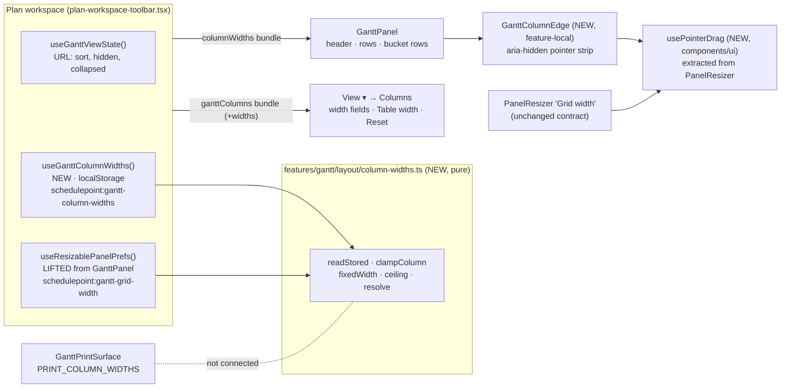
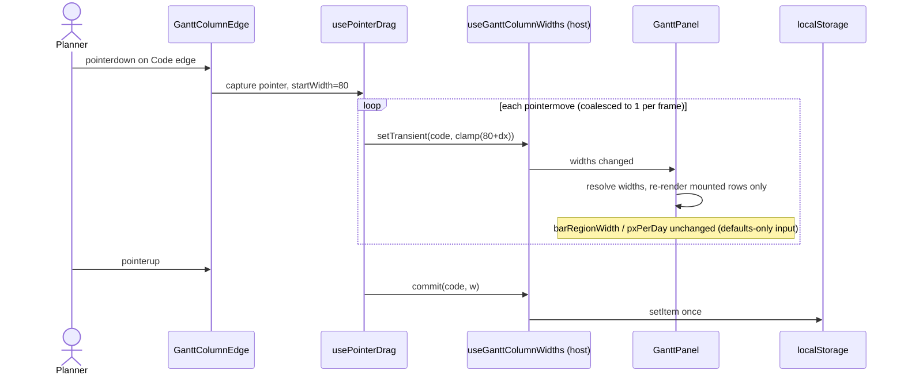
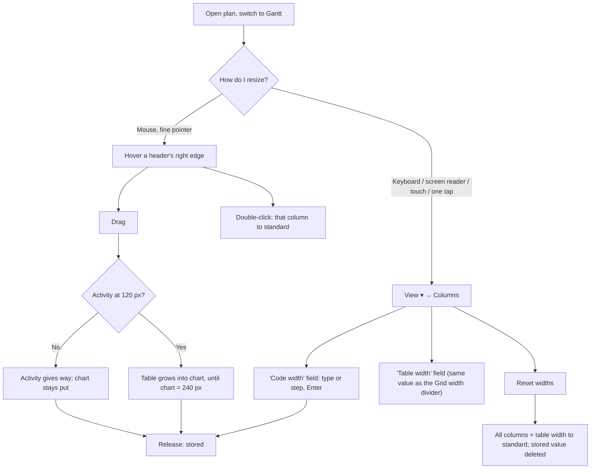

# Feature Spec: Resizable Gantt columns

- **Status:** Approved — by the product owner, 2026-10-03, as written, with Q1–Q4 at their recommended defaults: individual columns (the divider stays as is); the Activity column gives up the room; widths remembered on this computer and browser; print keeps its standard layout. ADR number 0173 (0172 went to the soft-delete gate, approved the same day).
- **Author(s):** feature-analyst (for the product owner)
- **Date:** 2026-10-03
- **Tracking issue / epic:** — (chosen from `docs/BACKLOG.md` "The Gantt's remaining editing gaps", 2026-10-03)
- **Roadmap link:** `docs/BACKLOG.md:104-137`
- **Related ADR(s):** ADR-0059, ADR-0095, ADR-0099 (Graphite M8, the grid splitter), ADR-0111, ADR-0117,
  ADR-0118, ADR-0123, ADR-0165, ADR-0081, ADR-0088 D1. **New:** ADR-0173 (outline in §4.8) — required.

## 0. The brief, re-verified (CLAUDE.md §19.11 — the brief is not evidence)

The backlog row this work comes from says _"the columns chooser's grid-width memory (T6 names it; the
grid has no resize handle, so nothing can set it yet — `gantt-view-state.ts:39`)"_. **Half of that is
false, and has been since Graphite M8.**

| Claim in the brief                        | What the code says                                                                                                                                                                                                                                                                                                                    | Verdict                          |
| ----------------------------------------- | ------------------------------------------------------------------------------------------------------------------------------------------------------------------------------------------------------------------------------------------------------------------------------------------------------------------------------------- | -------------------------------- |
| "the grid has no resize handle"           | `GanttPanel.tsx:1284-1309` renders `PanelResizer` with `label="Grid width"`; bounds `min={FIXED_WIDTH}` / `max={GANTT_GRID_MAX_WIDTH}` (720, `:128`)                                                                                                                                                                                  | **False**                        |
| "nothing can set [grid width] yet"        | `useResizablePanelPrefs({ storageKey: 'schedulepoint:gantt-grid-width', … })` at `GanttPanel.tsx:495-507`; persisted to `localStorage` (`use-resizable-panel-prefs.ts:73-79`)                                                                                                                                                         | **False** — built and remembered |
| The cited docblock                        | `gantt-view-state.ts:37-41` still says "the grid has no resize handle". `ADR-0095:221-223` says the same. Both are stale, and the backlog row copied the docblock verbatim.                                                                                                                                                           | Stale source, propagated         |
| A browser journey exists for the splitter | `e2e-gantt/gantt.spec.ts:144-203` drives `separator "Grid width"` to its floor and one step above, with and without a baseline, asserting the pinned columns end exactly where the chart begins                                                                                                                                       | True                             |
| Individual columns can be resized         | No. Every non-`name` column has a fixed intrinsic width (`SCREEN_COLUMN_WIDTHS`, `GanttPanel.tsx:141-153`; `predecessors` falls through to `?? 90`). Only `name` flexes, absorbing whatever the pane has beyond the fixed columns (`ganttColumnWidth`, `:194-202`)                                                                    | **This is the real gap**         |
| A "coarse-pointer pass" is owed           | Already specified and **approved but unbuilt** as `gantt-editing-gaps` M2-F2 (`docs/specs/gantt-editing-gaps/implementation-plan.md:317-369`); `COARSE_SURFACES` still lists no Gantt surface (`e2e-workspace-fit/command-surface.spec.ts:881-892`). This spec does not duplicate it; it only makes its own new controls coarse-safe. | Owned elsewhere                  |

This was already found once: the approved `gantt-editing-gaps` spec (2026-09-11) recorded _"Grid-width
memory — **built**"_ and recommended fixing the two documents (`feature-spec.md:292-301`). Neither was
fixed, which is how the stale sentence reached today's brief. This spec fixes both (M2-T5).

**So the honest scope is: the table/chart divider exists and is remembered; what a planner cannot do
is make one column — Code, Predecessors, Duration — wider or narrower.** That is what is specified
below.

## 1. Business understanding

### Problem

A planner reading the Gantt grid gets fixed widths for six of its seven columns. Two of those
visibly truncate real data, because every non-editable cell is single-line `truncate`
(`GanttPanel.tsx:1838`):

- **Code** is 80 px. Imported P6/MSP programmes routinely carry structured codes
  (`EW-STR-1010-020`) that do not fit, so the column that identifies a row shows `EW-STR-…`.
- **Predecessors** is 90 px (the fallback width — it has no entry in `SCREEN_COLUMN_WIDTHS`), yet it
  is a comma-joined list of activity **names** (`grid-columns.ts:140-143`). On any real plan it is an
  ellipsis. Its own docblock calls it "the widest column".

The only lever today is the Grid width divider, and it cannot help: extra width goes **only** to the
Activity column (`ganttColumnWidth`, `:199-201`). Conversely, a planner who does not need Float wide
cannot give its room to Activity except by hiding it.

### Users

Every role that sees the plan workspace's Gantt: **Org Admin, Planner, Contributor, Viewer**. Column
width is a **reading** preference, not a plan write, so it is not role-gated and needs no pen. The
**External Guest** share view does not render the Gantt (no `gantt` reference anywhere under
`features/share/`), so guests are out of scope.

### Primary use cases

1. Widen **Code** so structured codes read in full.
2. Widen **Predecessors** so the logic reads as text without opening each activity.
3. Narrow columns a planner rarely reads (Float left, Duration) so Activity gets the room.
4. Return everything to standard widths in one action.
5. Do all of the above by keyboard, by screen reader, by a single tap, and by a mouse drag.

### User journeys

- **Mouse:** hover the right edge of the `Code` header → the cursor becomes a column-resize cursor →
  drag right → the Code column widens, the Activity column gives up the same width, the chart does not
  move → release → reload the page → the width is still there. Double-click the edge → back to standard.
- **Keyboard / screen reader / touch / single pointer:** `View ▾` → **Columns** group → the `Code width`
  field reads `80` (px) → type `160`, press Enter (or use the field's up/down steps) → same result.
  `Reset widths` returns every column and the table width to standard.

The user-flow diagram is in §4.3.

### Expected outcomes

The grid stops hiding the two columns whose content most often does not fit, without making the
chart narrower for planners who never touch it.

### Success criteria

- Every width a planner can reach keeps the invariant the existing gate pins: **the pinned columns end
  exactly where the chart begins** (`grid-width.structural.test.ts`; `e2e-gantt/gantt.spec.ts:116-142`
  `chartMeetsGrid`), with and without a baseline.
- An untouched chart renders **byte-identically** to today (same widths, same seed, same zoom framing).
- Every width reachable by drag is reachable by typing, by keyboard, and by a single tap (WCAG 2.2
  2.1.1, 2.5.7), and every new pointer target is ≥ 24 × 24 (2.5.8) and ≥ 44 under `pointer: coarse` or
  absent there (ADR-0118).
- A column drag on the 2,000-activity seeded plan does not change the bars' px-per-day mid-drag and
  issues at most one React state update per animation frame (structural, M2-T3), with a recorded
  frame-interval reading (M2-T4) rather than an asserted one.

### Open questions

Four critical questions are at the end of this document (§6). Defaults stated for everything else:

- **Step size** for the typed field's up/down arrows: 16 px — the `PanelResizer` keyboard step
  (`panel-resizer.tsx:6`), so the two width controls on one surface agree.
- **Column bounds:** 48 px minimum, 400 px maximum for every resizable column (§2.5). Constants,
  revisited from M1-T0's measurement, not designed from taste.
- **Per plan or everywhere:** one set of widths for **every plan** on the device. Columns are the same
  vocabulary in every plan, and an organisation's code scheme is usually consistent across plans.
- **`vs baseline`** stays fixed at 72 px — it is not a `GanttColumn` (`grid-width.structural.test.ts:65-79`).
- **Activity** has no width of its own: it remains the elastic column, and its edge drag is the table
  width (§2.4).

## 2. Functional requirements

### 2.1 User stories & acceptance criteria

> **US-1 (M1)** — As a **Planner** (or any role that sees the Gantt), I want to set one column's width
> by typing it, so that I can read long codes and predecessor lists without a mouse.
>
> - **Given** the Gantt is open **when** I open `View ▾` **then** the **Columns** group shows, beside
>   each shown resizable column's checkbox, a number field named `<Column> width` holding its current
>   width in px, with min 48 and max 400.
> - **Given** `Code width` reads 80 **when** I type 160 and press Enter **then** the `Code` column header
>   and every rendered Code cell are 160 px wide, the Activity column is 80 px narrower, and the
>   `Grid width` separator's `aria-valuenow` is unchanged.
> - **Given** I type 20 **when** I press Enter or leave the field **then** the field shows 48 and the
>   column is 48 px (clamped, never refused), and the field's hint says "48 to 400 pixels".
> - **Given** a column is hidden **then** its width field is not shown, and **when** I show it again it
>   returns at the width I last gave it.
> - **Given** I reload the page or open another plan **then** the width is still 160.

> **US-2 (M1)** — As any Gantt user, I want to put every width back to standard in one action.
>
> - **Given** any widths are non-standard **when** I press `Reset widths` in the Columns group **then**
>   every column returns to its standard width **and** the table width returns to its seeded width,
>   and the stored preference is deleted (not written as the defaults).
> - **Given** nothing is non-standard **then** `Reset widths` is shown but shaded with the reason
>   "Already at standard widths" and stays focusable (ADR-0082).

> **US-3 (M1)** — As a keyboard or screen-reader user, I want the table width settable in the same
> place, so that the Grid width divider has a typed twin.
>
> - **Given** `View ▾` is open **then** a `Table width` field shows the same number as the `Grid width`
>   separator's `aria-valuenow`, bounded by the same min and max.
> - **When** I change either **then** the other follows (one source).

> **US-4 (M2)** — As a mouse user, I want to drag a column's right edge in the header.
>
> - **Given** a fine pointer **when** I press on the 24 px strip centred on the right edge of a resizable
>   column's header and drag **then** that column follows the pointer within its bounds, the Activity
>   column absorbs the difference, and the chart's left edge does not move — until Activity reaches its
>   120 px floor, after which the table widens into the chart.
> - **When** I drag the **Activity** column's right edge **then** the table width changes (the same
>   value the `Grid width` separator sets).
> - **When** I double-click an edge **then** that column returns to its standard width (Activity's edge:
>   the table width returns to its seed).
> - **When** I release **then** the width is stored once (not once per frame).
> - **Given** a drag would leave the chart narrower than 240 px **then** the column stops growing.

> **US-5 (M2)** — As a touch user, I want a way to resize that my finger can actually hit.
>
> - **Given** `pointer: coarse` **then** the header edge strips are **not rendered** (a 44 px strip on a
>   60 px Float column would cover its sort control), and the `View ▾` fields — already 44 px under a
>   coarse pointer through `--control-h` (ADR-0118 D2) — are the route. This is an ADR-0118 named
>   exception with its stated equivalent.

### 2.2 Workflows

**Typed (M1):** `View ▾` → Columns → field → type/step → Enter, blur, or a step applies →
`setColumnWidth(key, clamp(n))` → panel re-renders → stored.

**Drag (M2):** pointerdown on edge strip → pointer capture → pointermove coalesced to ≤ 1 update per
animation frame → `setColumnWidth(key, startWidth + dx)` (transient) → pointerup → commit + persist once.
There is **no Escape-to-cancel**: it would give the drag hook a key, and §4.6 keeps that hook
keyless. A mistaken drag is undone by double-clicking the edge, or by the field.

**Reset:** `Reset widths` → delete stored column widths → `gridPrefs.setSize(seed)`.

### 2.3 Edge cases

| Case                                                                  | Behaviour                                                                                                                                                                                                                                                                                                                                               |
| --------------------------------------------------------------------- | ------------------------------------------------------------------------------------------------------------------------------------------------------------------------------------------------------------------------------------------------------------------------------------------------------------------------------------------------------- |
| Untouched preference                                                  | Byte-identical to today: every width from `SCREEN_COLUMN_WIDTHS`, same seed, same zoom framing                                                                                                                                                                                                                                                          |
| Widened columns push the fixed sum past the 720 px grid ceiling       | **The floor wins**: ceiling becomes `max(720, FIXED_WIDTH)`. Without this, `clampSize` with `min > max` returns `max` — a pane narrower than its columns, which is ADR-0095's Float-over-chart incident again. Today `FIXED_WIDTH` maxes at 686 (all columns + baseline), so the inversion is latent, and per-column widths are what would make it live |
| Window narrowed after widening (chart would be < 240 px)              | Nothing is shrunk automatically; the chart scrolls as it does today at narrow widths. `Reset widths` is the escape hatch. The 240 px guard applies at drag/typing time only                                                                                                                                                                             |
| Narrow viewport (390 px) — `FIXED_WIDTH` already exceeds the scroller | Pre-existing, out of scope; M1-T0 measures what the Gantt does there today so this work cannot be blamed for, or hide, it                                                                                                                                                                                                                               |
| Baseline activated while widened                                      | `FIXED_WIDTH` rises by 72; floor wins; the stored table width is not overwritten (`use-resizable-panel-prefs.ts:88-103`'s rule, kept)                                                                                                                                                                                                                   |
| Corrupt / hand-edited / future-versioned stored value                 | Read totally: unknown keys dropped, non-finite numbers dropped, everything clamped, a version other than `1` ignored as a whole                                                                                                                                                                                                                         |
| `localStorage` disabled                                               | Widths work for the session and do not persist (the existing hook's behaviour)                                                                                                                                                                                                                                                                          |
| Two tabs                                                              | Last write wins on next load; no live cross-tab sync (same as every `PanelResizer` consumer)                                                                                                                                                                                                                                                            |
| Column narrowed below its content                                     | Text truncates with an ellipsis (`truncate`); the cell's full text stays the accessible content, so a screen reader still hears it all                                                                                                                                                                                                                  |
| Editable cell open while its column is resized                        | The edit stays open; the input takes the new width. No commit or cancel is triggered                                                                                                                                                                                                                                                                    |
| A row in edit (`F2`) while the View popover is used                   | Opening `View ▾` already moves focus; existing ADR-0108/0169 rules apply unchanged                                                                                                                                                                                                                                                                      |
| Print / printed programme                                             | Unaffected: `GanttPrintSurface` has its own paper widths (`PRINT_COLUMN_WIDTHS`, `GanttPrintSurface.tsx:61-83`) for an A4/Letter landscape document. Pending Q4                                                                                                                                                                                         |
| Shared link / URL                                                     | Widths are **not** in the URL; a link opens at the recipient's own widths. Pending Q3                                                                                                                                                                                                                                                                   |

### 2.4 The width model (the one decision everything else follows)

```text
w[k]        = clamp(stored[k] ?? DEFAULT[k], 48, 400)        for each visible non-name column k
FIXED       = Σ w[k]  +  NAME_MIN (120)  +  (baseline ? 72 : 0)
ceiling     = max(GANTT_GRID_MAX_WIDTH (720), FIXED)          ← NEW: the floor always wins
pane        = clamp(storedPane, FIXED, ceiling)               (existing hook, clamped on read)
Activity    = pane − (FIXED − 120)                            (existing ganttColumnWidth)
invariant   : Σ visible widths + variance = pane              (existing structural test)
```

- **Widening column k by Δ** raises `FIXED` by Δ. The pane does not move, so **Activity gives up Δ**
  and the chart's left edge stays where the planner put it — the existing rule, extended: "a width
  somebody placed should not move under them" (`GanttPanel.tsx:488-493`). Once Activity is at 120,
  `FIXED > pane`, the floor wins and the table grows into the chart.
- **Activity's own edge** sets the pane — it _is_ the table width.
- **The zoom framing input does not move.** `barRegionWidth` is computed from `GRID_WIDTH`, the sum of
  **default** widths (`GanttPanel.tsx:436-454`), and stays so. Making it planner-aware would rescale
  every bar on every frame of a column drag.

> **A pre-existing divergence, recorded rather than fixed.** `barRegionWidth` uses `GRID_WIDTH` (`:445`)
> while the chart actually starts at the dragged `gridWidth` (`:508`, `:1000`). So after a `Grid width`
> drag, a zoom preset frames its range against a width that is not the visible chart's. Whether that is
> visible to a planner is **not established** — M1-T0 measures it. If it is, it is filed as a
> `docs/TECH_DEBT.md` row; it is not fixed here, because fixing it changes the shipped splitter's
> behaviour and is a different decision.

### 2.5 Validation rules

| Field        | Rule                                                                                                                  |
| ------------ | --------------------------------------------------------------------------------------------------------------------- |
| Column width | Integer px, clamped to [48, 400]; non-numeric input reverts to the current value on blur                              |
| Table width  | Integer px, clamped to [`FIXED_WIDTH`, `max(720, FIXED_WIDTH)`] — identical to the separator's `aria-valuemin`/`max`  |
| Chart guard  | A change that would make `max(pane, FIXED) > scrollerWidth − 240` is clamped to the largest value that does not       |
| Stored shape | `{ "v": 1, "widths": { "<GanttColumnKey>": number } }` under `schedulepoint:gantt-column-widths`; `name` never stored |

No server validation: nothing reaches the server.

### 2.6 Permissions

None to add. A local view preference; no endpoint, no write, no pen (ADR-0028: not structural — not a
plan write at all). Deny-by-default is unaffected because there is nothing to deny.

### 2.7 Error scenarios

| Scenario                                     | Detection                       | User-facing result                                        | Status |
| -------------------------------------------- | ------------------------------- | --------------------------------------------------------- | ------ |
| Stored JSON corrupt                          | `JSON.parse` throws / shape bad | Standard widths, silently; next change overwrites it      | n/a    |
| Storage quota / disabled                     | `setItem` throws                | Widths apply for the session only                         | n/a    |
| Typed value out of range                     | clamp                           | Field shows the clamped value; hint states the range      | n/a    |
| Typed value non-numeric                      | `Number.isFinite` false         | Field reverts to the current width on blur                | n/a    |
| Pointer cancelled mid-drag (`pointercancel`) | event                           | Last applied width kept and committed (as `PanelResizer`) | n/a    |

## 3. Technical analysis

| Area           | Impact   | Notes                                                                                                                                                                                                                                                                                                                                |
| -------------- | -------- | ------------------------------------------------------------------------------------------------------------------------------------------------------------------------------------------------------------------------------------------------------------------------------------------------------------------------------------ |
| Frontend       | **med**  | `features/gantt/` (model, panel, header), the `View ▾` Columns group (`tsld-toolbar-items.tsx:1962-1984`), the toolbar context bundle (`plan-workspace-toolbar.tsx:566-569`), and a pointer-drag hook extracted from `PanelResizer` into `components/ui/`. No route, no new dependency.                                              |
| Backend        | none     |                                                                                                                                                                                                                                                                                                                                      |
| Database       | **none** | No model, column, index, constraint or migration. `database-architect` is therefore not engaged — a statement of fact, not a size judgement (CLAUDE.md §19.3). It **would** be engaged if Q3 is answered "follow me to every computer": there is no user-preference model today (`schema.prisma` has no `*Pref*`/`*Setting*` model). |
| API            | none     |                                                                                                                                                                                                                                                                                                                                      |
| Security       | low      | `localStorage` holds integers keyed by a closed column vocabulary; read totally and clamped. No PII, no tenancy data. Not shared across users of different browsers; shared by users of one browser profile (same as every existing panel preference).                                                                               |
| Performance    | low–med  | Drag re-renders the mounted virtual window only (rows are fixed 28 px and single-line, so no re-measure); ≤ 1 update per frame (rAF coalescing reused from `PanelResizer`, `panel-resizer.tsx:63-106`); one `localStorage` write per gesture; zoom framing input unchanged (§2.4).                                                   |
| Infrastructure | none     | No env, no CI job, no container change. **No `VITE_*` flag** (ADR-0088 D1: a build-time flag is never a rollback in a published image; the rollback is the commit boundary).                                                                                                                                                         |
| Observability  | none     | Client-only preference; nothing to log.                                                                                                                                                                                                                                                                                              |
| Testing        | **med**  | Unit: width model (pure), storage reader (total), hook. Structural: the existing `grid-width.structural.test.ts` extended to planner widths; a new "framing input is defaults-only" assertion. Journey: `e2e-gantt` typed route (M1), drag + coarse (M2). a11y: axe on the open `View ▾` panel; ADR-0111 review.                     |

### Dependencies

- **Reuses:** `PanelResizer`'s pointer logic (`panel-resizer.tsx:62-114`), `useResizablePanelPrefs`
  (unchanged), `Input` (`components/ui/input.tsx`, `type="number"` used in ten feature files already),
  `CheckboxField`, `Button`, the `pointer-coarse:` variant (ADR-0118), `chartMeetsGrid` from
  `e2e-gantt/gantt.spec.ts`.
- **The toolbar's key veto already yields to a number input**: `OWNS_ALL_KEYS` includes `'number'`
  (`components/ui/toolbar/toolbar-keyboard.ts:68-77`), so ArrowUp/Down in the field step the value
  rather than moving toolbar focus — the ADR-0111 #192 class, checked rather than assumed. Still
  reviewed before release (§4.6).
- **Independent of** `gantt-editing-gaps` M2 (arrows URL param + the Gantt coarse sweep). Either may land
  first. If that sweep lands first, M2 here adds its new controls to it; if after, it inherits them.

## 4. Solution design

### 4.1 Architecture overview



The panel keeps its **bundle idiom** (`use-gantt-view-state.ts:27-35`): with no `columnWidths`
bundle it uses defaults and its own grid prefs, so the print surface and every suite that mounts
`GanttPanel` directly stay byte-identical.

**Why the state is lifted to the host.** The `View ▾` fields and the panel must read one value. Two
`useResizablePanelPrefs` instances on one key do not sync (`use-resizable-panel-prefs.ts:69-86` — each
holds its own `useState`), so leaving `gridPrefs` inside the panel and adding a second reader in the
toolbar would show two different table widths. The host already threads `ganttViewState` to both
(`plan-workspace-toolbar.tsx:566-569`); this adds two siblings to it.

### 4.2 Data flow



### 4.3 User flow



### 4.4 Database changes

None (§3).

### 4.5 API changes

None.

### 4.6 Component changes

| Where                                                                                     | Change                                                                                                                                                                                                                                                              | Milestone |
| ----------------------------------------------------------------------------------------- | ------------------------------------------------------------------------------------------------------------------------------------------------------------------------------------------------------------------------------------------------------------------- | --------- |
| `features/gantt/layout/column-widths.ts` (new)                                            | Pure: `DEFAULT_COLUMN_WIDTHS` (moved from `SCREEN_COLUMN_WIDTHS`, now total over `GanttColumnKey` incl. `predecessors: 90`), bounds, `readStoredWidths` (total), `ganttFixedWidth`/`ganttColumnWidth` taking a widths map, `gridCeiling` (floor wins), `chartGuard` | M1        |
| `features/gantt/model/use-gantt-column-widths.ts` (new)                                   | Host hook: widths, `setWidth`, `setTransient`/`commit` (M2), `reset`; one `setItem` per commit                                                                                                                                                                      | M1        |
| `GanttPanel.tsx`                                                                          | Optional `columnWidths` + `gridPrefs` bundles; `GRID_WIDTH` stays **defaults-only** (renamed `DEFAULT_GRID_WIDTH` so the intent is legible); `max` becomes `gridCeiling`                                                                                            | M1        |
| `GanttPanel.tsx` header                                                                   | `columnheader` gains `relative`; a `GanttColumnEdge` per resizable column and Activity (M2)                                                                                                                                                                         | M2        |
| `features/gantt/components/GanttColumnEdge.tsx` (new, feature-local)                      | `aria-hidden`, not focusable, `w-6` strip centred on the edge, `cursor-col-resize`, `touch-action: none`, `pointer-coarse:hidden`, `onDoubleClick` → reset that column                                                                                              | M2        |
| `components/ui/use-pointer-drag.ts` (new, shared)                                         | The rAF-coalesced capture/move/up/cancel logic lifted **verbatim** from `PanelResizer`; `PanelResizer` consumes it. **No key handling** — see below                                                                                                                 | M2        |
| `tsld-toolbar-items.tsx` Columns group                                                    | Per shown resizable column: `Input type="number"` labelled `<Column> width`, suffix `px`, `aria-describedby` hint "48 to 400 pixels"; a `Table width` field; `Reset widths` button (shaded with reason when nothing to reset)                                       | M1        |
| `tsld-toolbar-context.ts` / `use-tsld-toolbar-context.tsx` / `plan-workspace-toolbar.tsx` | `ganttColumns` bundle gains `widths`, `setWidth`, `table`, `reset`                                                                                                                                                                                                  | M1        |

States: no loading/empty/error states are introduced — the preference is synchronous and local.

#### Keyboard and screen-reader semantics

**Decision: the header edges are pointer-only and hidden from assistive technology; the typed fields
are the keyboard, screen-reader, single-pointer and touch route.** This is a deliberate choice against
making each edge a focusable APG window splitter, for three reasons that were checked:

1. **Six to seven more Tab stops** would sit between the header's sort buttons and the rows (the
   treegrid's rows use one roving stop, `GanttPanel.tsx:1091-1094`). A keyboard user crossing the
   header to reach the data pays for every one, every time.
2. **Arrow-key collision.** The treegrid's own handler takes ArrowUp/Down/Left/Right (`:852-859`) and
   `PanelResizer` calls `preventDefault()` without `stopPropagation()` (`panel-resizer.tsx:141`). A
   separator inside the treegrid's React tree would therefore deliver ArrowDown to the grid's
   row-focus logic — the exact ADR-0111 #192 shape. Solvable, but it is a new keyboard contract on the
   product's most complex widget, bought to duplicate a route the fields already give.
3. **A keyboard route does not satisfy WCAG 2.5.7.** 2.5.7 asks for a **single-pointer, non-dragging**
   alternative; arrow keys on a separator are not one. A typed field is (tap, type, confirm) — the same
   reading `gantt-start-edge-resize` asked the reviewer to confirm for the `Start` cell
   (`feature-spec.md:277-280`). So focusable separators would still need the fields.

The precedent for an `aria-hidden` pointer affordance with a stated equivalent is the bar's own
finish-edge handle (`aria-hidden` `<span>`, equivalent `Shift+←/→`; `gantt-editing-gaps/feature-spec.md:306-312`).

**What a screen-reader user hears:** the `View ▾` Columns group is a `fieldset` with legend "Columns"
(`tsld-toolbar-items.tsx:1930-1933`). Each field is a native `spinbutton` — "Code width, 80, spin
button, 48 to 400 pixels". The column headers are unchanged ("Code, column header, sort none"). Width
changes are not announced in the grid — the field's own value is the confirmation.

#### New shared primitive and its keyboard contract

**`usePointerDrag`** (`components/ui/use-pointer-drag.ts`). **Keyboard contract: none — it claims no
key.** Pointer contract: `pointerdown` captures; `pointermove` while captured coalesces to one callback
per animation frame; `pointerup`/`pointercancel` flushes the last value immediately and releases
capture; unmount cancels a queued frame. **`PanelResizer`'s keyboard contract is unchanged** (Arrow
grow/shrink, Home/End, `reverseKeys`) — but `PanelResizer` _is_ a shared primitive whose internals move,
so **accessibility-reviewer and component-reviewer review M2-T1 before it is released** (ADR-0111,
CLAUDE.md §19.13), with every `PanelResizer` consumer's journey run — the consumer list is derived
by `grep -rl PanelResizer apps/web/src` at the time, not copied from here
(`use-resizable-panel-prefs.ts:14-22` records why a roster in prose goes stale).

M1's fields add no primitive: `Input type="number"` inside the toolbar's popover, whose veto is already
correct for `number` (§3 Dependencies). M1 still goes to accessibility-reviewer before release because
it puts ArrowUp/Down-owning inputs inside a `Toolbar` popover — the precise surface #192 broke.

#### Target size and coarse pointers

- **2.5.8 (24 × 24):** each edge strip is 24 px wide × the header row's 34 px (`RULER_HEIGHT`), centred
  on the boundary. It overlaps 12 px of the neighbouring header's sort button; the button keeps ≥ 36 px
  of width on the narrowest column (60 − 24) and its 24 px height (`min-h-6`, `GanttPanel.tsx:1147`),
  so it still clears 24 × 24. The edge strip is not in the 24 × 24 sweep's selector list
  (`command-surface.spec.ts:102-108` — it is `aria-hidden` and has no role), so M2's journey measures it
  directly.
- **`pointer: coarse`:** strips not rendered (`pointer-coarse:hidden`); fields 44 px via `--control-h`
  (ADR-0118 D2). Recorded as an ADR-0118 named exception with equivalent (ADR-0173 D3).
- **`touch-action: none`** on the strip, so a hybrid device's finger on a fine-primary screen drags
  rather than scrolls. `PanelResizer` has no `touch-action` rule today (`panel-resizer.tsx:149-181`) —
  whether the shipped `Grid width` divider can be dragged by touch at all is **unmeasured**; M2-T4
  measures it and files the result rather than fixing a shared primitive in passing.

### 4.7 Implementation approach & alternatives

**Chosen:** per-column widths, Activity elastic, floor-wins ceiling, defaults-only framing input,
pointer-only header edges plus typed fields in the existing Columns chooser, stored per device.

| Alternative                                                | Why not                                                                                                                                                                                                                                                    |
| ---------------------------------------------------------- | ---------------------------------------------------------------------------------------------------------------------------------------------------------------------------------------------------------------------------------------------------------- |
| **Grid-vs-chart split only** (the brief's "and/or")        | Already shipped (§0). It cannot widen Code or Predecessors: its extra width goes only to Activity.                                                                                                                                                         |
| **Spreadsheet model** — widening a column pushes the chart | Moves a divider the planner placed; and if the pane follows every column drag the 720 ceiling is hit after ~34 px with all columns shown, so the model degrades into the chosen one anyway. Offered to the product owner as Q2 because it is a taste call. |
| **Focusable APG separator per column**                     | §4.6: Tab-stop cost, arrow-key collision with the treegrid, and still not a 2.5.7 alternative.                                                                                                                                                             |
| **A dedicated "Column widths…" dialog**                    | A second place to manage columns; the chooser already lists them, and ADR-0095 M5-T1 put it in `View ▾` precisely to avoid new chrome (`tsld-toolbar-items.tsx:179-185`).                                                                                  |
| **Auto-fit (double-click fits content)**                   | Needs measuring every row's text, including the ~1,960 rows a virtualised 2,000-row grid never mounts; measuring only the mounted window gives a width that depends on scroll position — the ADR-0165 D1 cost, for a convenience. Deferred.                |
| **Widths in the URL** (ADR-0123 strings)                   | A width chosen on a 1,646 px monitor is wrong on a laptop; it is a device ergonomic, not a view worth sending (`gantt-editing-gaps/feature-spec.md:299-301` reached the same conclusion for table width). Q3.                                              |
| **Server-side per-user preference**                        | No preference model exists; needs schema + API + `database-architect`, for cross-device memory of a device-dependent value. Q3.                                                                                                                            |
| **Measured-and-frozen widths (ADR-0165 D1)**               | That is `DataTable`'s answer for a table whose widths are content-derived. The Gantt's are declared, which is exactly what makes them cheap to resize.                                                                                                     |

**Recalc parity gate:** not engaged — no scheduling input; `computeSchedule` is never imported
(`features/gantt/engine-import.structural.test.ts:54` pins that nothing in `apps/web/src` imports
the engine, and this work adds nothing that could).

**Flag:** none (ADR-0088 D1). **Entry point** M1: `View ▾` → Columns → `Code width` field.
M2: the header edges (pointer), with M1's field remaining the accessible entry point.

### 4.8 ADR required — ADR-0173 (outline)

**ADR-0173 — A column's width is the planner's, kept on their device, and its drag has a typed twin**

- **Context:** §0–§1; the latent ceiling inversion; the 2.5.7 reading.
- **D1 — Storage:** a column width is a per-device view preference in `localStorage`, global across
  plans; never in the URL (ADR-0123's URL state is for views worth sending), never on the server
  until a user-preference model exists for some other reason.
- **D2 — The elastic column:** Activity absorbs; the placed divider does not move; **a pane's floor
  always wins over its ceiling** (`ceiling = max(cap, floor)`), stated as a rule for any resizable
  pane whose floor is derived.
- **D3 — Pointer-only affordances:** a drag affordance may be `aria-hidden` and unfocusable **only**
  where the same view offers a typed, single-pointer equivalent that reaches every value the drag
  reaches; under `pointer: coarse` it is omitted rather than enlarged when enlargement would cover a
  neighbouring control. Registered as an ADR-0118 exception.
- **D4 — Paper keeps its own widths:** the printed programme is not a projection of a screen preference.
- **D5 — The framing input is defaults-only:** zoom framing never reads a planner's widths (no per-frame
  rescale). The pre-existing `barRegionWidth` divergence is recorded with M1-T0's measurement.
- **Consequences:** the `PanelResizer` 2.5.7 question for its other consumers is filed, not answered.

### 4.9 Findings outside scope, to be filed (not fixed here)

1. **`PanelResizer` offers no single-pointer non-drag alternative** for any consumer other than the
   Gantt after M1 (Explorer rail, activity panel, drawers). Keyboard steps do not satisfy 2.5.7. The
   accessibility-reviewer is asked to rule; if confirmed, a `docs/TECH_DEBT.md` row.
2. **`PanelResizer` has no `touch-action`** — touch drag of any divider may scroll instead. Unmeasured.
3. **`barRegionWidth` vs `gridWidth`** (§2.4 box). Unmeasured.
4. **Stale prose** — `gantt-view-state.ts:37-41`, `ADR-0095:221-223`, `docs/BACKLOG.md:125-127`. Fixed in M2-T5.

## 5. Links

- Implementation plan: [`./implementation-plan.md`](./implementation-plan.md)
- Related docs updated by this change: `docs/BACKLOG.md`, `docs/adr/0172-…` (new) and `CLAUDE.md` §16
  (one line), an amendment note on ADR-0095, `docs/DESIGN_SYSTEM.md` (the pointer-only-affordance rule),
  `docs/UX_STANDARDS.md` (where a width preference lives), `docs/TEST_PLAYBOOK.md` if a seeded plan
  gains a long-code case, `apps/web/CHANGELOG` via changesets.

## 6. Critical questions for the product owner

**Q1 — The divider is already there. Is "individual columns" what you want?**
The line between the table and the chart can already be dragged, and the app already remembers where
you put it (it shipped in an earlier release). What you cannot do today is make one column — say
**Code** or **Predecessors** — wider on its own.
**Recommended:** build individual column widths; leave the divider as it is.

**Q2 — When you widen one column, what should make room?**
(a) The **Activity name** column gets narrower and the chart stays exactly where it is, until Activity
is at its narrowest; only then does the table push into the chart. (b) Like a spreadsheet: everything
to the right shifts over and the chart gets narrower straight away.
**Recommended: (a)** — the chart doesn't jump around while you adjust a column, and it is the
simpler, safer change.

**Q3 — Where should the app remember your widths?**
(a) On **this computer and browser** — like the table/chart divider and the side panels today. (b)
**Follow you** to every computer you sign in on — this needs a new server-side settings store and is a
noticeably bigger job.
**Recommended: (a)** for now. Screen sizes differ between computers, so a width that suits your
monitor may not suit your laptop anyway.

**Q4 — Should the printed Gantt copy your screen widths?**
**Recommended: no** — the printed programme keeps its standard page layout, designed to fit
A4/Letter landscape, whatever you've done on screen.
