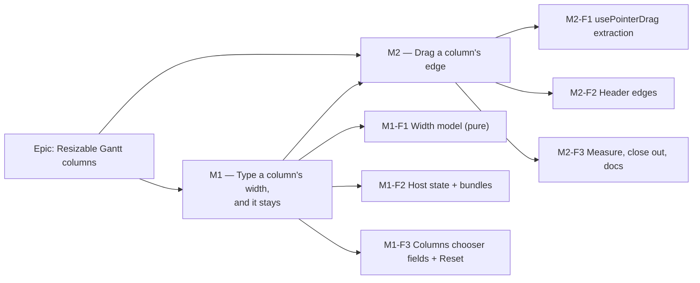

# Implementation Plan: Resizable Gantt columns

- **Feature spec:** [`./feature-spec.md`](./feature-spec.md)
- **Status:** Approved — by the product owner, 2026-10-03, as written, with Q1–Q4 at their recommended defaults: individual columns (the divider stays as is); the Activity column gives up the room; widths remembered on this computer and browser; print keeps its standard layout. ADR number 0173 (0172 went to the soft-delete gate, approved the same day).
- **Owner:** builder agent (Sonnet), reviewed as listed per milestone

## Breakdown

### Epic

**Resizable Gantt columns** — let a planner set each Gantt column's width by typing or dragging,
remembered per device; closes the real residue of `docs/BACKLOG.md` "The Gantt's remaining editing
gaps" and corrects its stale half.

**Shape: two milestones, each user-visible, each with its own journey. The typed route ships first**
— ADR-0095 D4's rule that the keyboard route lands before the pointer gesture, and WCAG 2.5.7's
requirement that the drag never be the only way.

**No `VITE_*` flag** (ADR-0088 D1). Each milestone is one or more commits on `main`; the rollback is
the commit boundary.

---

### Milestone 1: Type a column's width, and it stays

**Outcome:** any Gantt user can set Code, Duration, Start, Finish, Float left and Predecessors widths,
and the table width, from `View ▾` → Columns; reset them all; widths survive reload and apply to every
plan on that device.
**Entry point:** plan workspace, Gantt view → `View ▾` → fieldset **Columns** → spinbutton
**`Code width`** (and siblings), spinbutton **`Table width`**, button **`Reset widths`**.
**Journey:** `apps/web/e2e-gantt/column-widths.spec.ts` (new) — open the Gantt, open `View ▾`, fill
`Code width` with 160 + Enter, assert the `Code` columnheader's box is 160 px wide and
`chartMeetsGrid` holds, reload, assert still 160, press `Reset widths`, assert 80. Keyboard-only
variant: the whole sequence with `Tab`/`ArrowUp` and no mouse. axe on the open panel.

---

#### Feature: M1-F1 — The width model

> **Description:** a pure module holding defaults, bounds, the stored-value reader and the layout
> arithmetic, so the panel, the chooser and the tests ask one place.
> **Complexity:** M
> **Dependencies:** none
> **Risks:** reintroducing the ADR-0095 Float-over-chart class with a wider blast radius (every width
> now planner-reachable) → the existing structural test is extended to sweep planner widths, and the
> floor-wins ceiling is a named, tested function.
> **Testing requirements:** unit (model), structural (`grid-width.structural.test.ts` extended).

##### Task M1-T0 — Measure before building (≈ a record, no product change)

- **Description:** ADR-0113/0142: measure the problem, not only the remedy. On `plan:scale-500` and an
  import with structured codes (or a hand-made plan of 10 activities with 15-character codes — check
  `docs/TEST_PLAYBOOK.md` first, per CLAUDE.md §7), at 1646, 1024 and 390 px:
  (a) how many Code / Predecessors cells truncate at default widths;
  (b) whether `barRegionWidth` (from `GRID_WIDTH`, `GanttPanel.tsx:445`) differs from the visible chart
  width after a `Grid width` drag, and whether a zoom preset visibly mis-frames because of it;
  (c) what the Gantt does at 390 px today, where `FIXED_WIDTH` (524) exceeds the scroller;
  (d) whether the shipped `Grid width` divider can be dragged by touch (Chromium touch emulation).
- **Complexity:** S
- **Dependencies:** none
- **Risks:** (a) finds nothing truncates → the problem statement is wrong; **stop and report** rather
  than build. (b)/(c)/(d) find defects → file `docs/TECH_DEBT.md` rows; do not fix in this epic.
- **Testing:** none — this is evidence. Recorded in `docs/specs/gantt-column-resize/m1-measurement.md`.
- **Development steps:**
  1. Seed; open the Gantt; read cell `scrollWidth > clientWidth` over the mounted window.
  2. Drag the divider; compare `barRegionWidth` (via a temporary console read, not committed) to the
     chart header's measured width.
  3. Record figures with the command run; file rows for any confirmed defect.

##### Task M1-T1 — `layout/column-widths.ts`

- **Description:** move `SCREEN_COLUMN_WIDTHS` into `DEFAULT_COLUMN_WIDTHS: Record<Exclude<GanttColumnKey,'name'>, number>`
  (now **total**: `predecessors: 90` written down instead of the `?? 90` fallback, `GanttPanel.tsx:153`);
  `COLUMN_MIN = 48`, `COLUMN_MAX = 400`, `CHART_MIN_WIDTH = 240`; `readStoredWidths(raw: unknown)` (total:
  version must be `1`, keys filtered to the closed vocabulary, finite numbers only, clamped);
  `ganttFixedWidth(columns, widths, extraPinnedWidth)`; `ganttColumnWidth(column, widths, pane, fixed)`;
  `gridCeiling(fixed) = max(GANTT_GRID_MAX_WIDTH, fixed)`; `chartGuard(candidate, scrollerWidth)`.
- **Complexity:** M
- **Dependencies:** M1-T0 (bounds revisited from its figures)
- **Risks:** `extraPinnedWidth` must stay **required, never defaulted** (`GanttPanel.tsx:163-175`'s
  ADR-0070 rule) → keep the signature.
- **Testing:** unit — reader totality (corrupt JSON, wrong version, unknown key, `NaN`, `Infinity`,
  negative, `name` key ignored); ceiling never below floor for every reachable fixed sum; chart guard.
  Structural — extend `grid-width.structural.test.ts` `SETS × EXTRAS` with a `WIDTHS` axis (defaults,
  all-min, all-max, one column at max) and assert **fills the pane exactly** at
  `[fixed, fixed+1, fixed+96, ceiling]`; update the intrinsic-width caller count (`:166-170`) to the new
  function name and re-justify each caller in its message.
- **Development steps:**
  1. Write the failing structural cases first (all-max must fail against today's 720 `max`).
  2. Implement; move the helpers out of `GanttPanel.tsx`; re-export for the test.
  3. Verify red→green: revert `gridCeiling` to the constant 720 and confirm the all-max case fails.

#### Feature: M1-F2 — Host state, lifted

> **Description:** `useGanttColumnWidths()` in the host; `gridPrefs` lifted from the panel to the host;
> both threaded as bundles to the panel and to the toolbar's `ganttColumns`.
> **Complexity:** M
> **Dependencies:** M1-F1
> **Risks:** two readers of one key drift (two `useResizablePanelPrefs` instances do not sync) → the
> panel uses the host's instance when given one, its own only when mounted bare (print, unit suites).
> **Testing requirements:** unit (hook), component (panel with and without bundles renders identically
> at defaults).

##### Task M1-T2 — `model/use-gantt-column-widths.ts`

- **Description:** state from `readStoredWidths(localStorage)`; `setWidth(key, n)` clamps and persists;
  `reset()` **removes** the key (so a future default change reaches the planner); persistence wrapped in
  `try` like the existing hook. Transient/commit split is added in M2-T2, not here.
- **Complexity:** S
- **Dependencies:** M1-T1
- **Risks:** writing defaults on mount (the existing hook does, `use-resizable-panel-prefs.ts:73-79`)
  would freeze today's defaults into every browser → this hook writes **only** on a user change.
- **Testing:** unit — round trip; reset removes; storage throwing on get/set; no write on mount.

##### Task M1-T3 — Thread the bundles

- **Description:** `GanttPanel` gains optional `columnWidths` and `gridPrefs` props (bundle idiom,
  `use-gantt-view-state.ts:27-35`); `GRID_WIDTH` renamed `DEFAULT_GRID_WIDTH` and computed from
  **defaults only**; `max` becomes `gridCeiling(FIXED_WIDTH)`. Host (`plan-workspace-toolbar.tsx`) owns
  both hooks and passes them to the panel and to `ganttColumns` (`:566-569`), whose type
  (`tsld-toolbar-context.ts:79`) gains `widths`, `setWidth`, `table: { size, min, max, setSize }`, `reset`,
  `isDefault`.
- **Complexity:** M
- **Dependencies:** M1-T2
- **Risks:** the `barRegionWidth` effect's deps change and it starts re-measuring on width change →
  structural assertion that its input is `DEFAULT_GRID_WIDTH` and nothing planner-set.
- **Testing:** component — bare panel at defaults is byte-identical to `main` (snapshot of header widths
  and `contentWidth`); with a widths bundle, header and row cell widths agree; `GanttPrintSurface` suites
  untouched and green.

#### Feature: M1-F3 — The Columns chooser gets widths

> **Description:** per shown resizable column, a labelled number field; a `Table width` field; `Reset widths`.
> **Complexity:** M
> **Dependencies:** M1-F2
> **Risks:** ArrowUp/Down inside a `Toolbar` popover (the ADR-0111 #192 surface) → `OWNS_ALL_KEYS`
> already includes `number` (`toolbar-keyboard.ts:68-77`); a unit test pins it for this field, and
> accessibility-reviewer runs before release.
> **Testing requirements:** component, journey, axe, pre-release a11y review.

##### Task M1-T4 — Fields and reset

- **Description:** in `tsld-toolbar-items.tsx:1962-1984`, each `CheckboxField` row for a **shown** column
  gains `Input type="number" inputMode="numeric" min=48 max=400 step=16` with visible label
  `<Column> width`, `px` suffix, `aria-describedby` hint "48 to 400 pixels". Applies on Enter, blur or
  step; out-of-range clamps and shows the clamped value; non-numeric reverts. A `Table width` field
  (bounds from the bundle). `Reset widths` `Button` — shaded with reason "Already at standard widths"
  via ADR-0082's focusable-disabled pattern when `isDefault`.
- **Complexity:** M
- **Dependencies:** M1-T3
- **Risks:** a field that applies per keystroke jumps (typing "1" clamps to 48) → apply on commit only.
  Popover height grows by six rows → check it still fits at 1024 × 768 without the popover clipping
  (journey screenshot via `node scripts/shoot.mjs --width 1024`).
- **Testing:** component — labels, clamp, revert, Enter applies, reset shading + reason; toolbar key-veto
  unit for a `number` input in this popover. Journey — see the milestone line. axe on the open panel.
- **Development steps:**
  1. Component tests first. 2. Implement. 3. Journey. 4. accessibility-reviewer (keyboard in the popover,
     spinbutton naming, the hint) and ux-reviewer (copy, layout) **before** the release PR merges.
  2. Changeset (web, minor).

##### Task M1-T5 — Journey

- **Description:** `e2e-gantt/column-widths.spec.ts` as described on the milestone; reuse
  `chartMeetsGrid` (lift it from `gantt.spec.ts:116-142` into `e2e-gantt/support.ts` rather than copy it)
  and assert it **with a baseline active** at all-max widths — the state the floor-wins ceiling exists for.
- **Complexity:** M
- **Dependencies:** M1-T4
- **Risks:** locating by copy → locate the fields by accessible name, commands by registry id
  (`clickToolbarCommand`, Graphite M8's rule).
- **Testing:** `scripts/e2e-local.sh web:gantt` green locally before push (CLAUDE.md §19.8).

---

### Milestone 2: Drag a column's edge

**Outcome:** with a mouse, a planner drags any column's right header edge; Activity's edge is the table
width; double-click resets one column. Absent under a coarse pointer, where M1's fields are the route.
**Entry point:** Gantt header — the right edge of each column header (pointer only, `aria-hidden` by
design per spec §4.6; the accessible entry point remains M1's `Code width` field).
**Journey:** `e2e-gantt/column-widths.spec.ts` gains a drag step — `page.mouse` from the Code header's
right edge +60 px: Code is 140, Activity is 60 narrower, the chart's left edge is unchanged,
`chartMeetsGrid` holds; reload, still 140; double-click the edge, 80. A coarse-pointer case (the
ADR-0118 fixture, asserting `matchMedia('(pointer: coarse)').matches` first) asserts no edge strip is
rendered and the `Code width` field is ≥ 44 px tall.

---

#### Feature: M2-F1 — `usePointerDrag`, extracted

> **Description:** lift `PanelResizer`'s pointer logic (`panel-resizer.tsx:62-114`) verbatim into
> `components/ui/use-pointer-drag.ts`; `PanelResizer` consumes it. Keyboard handling stays in
> `PanelResizer`, untouched.
> **Complexity:** S
> **Dependencies:** M1 shipped
> **Risks:** a behaviour change in every divider in the product → `panel-resizer.test.tsx` green
> unmodified; every `PanelResizer` consumer's journey run (derive the list with `grep`); ADR-0111 review.
> **Testing requirements:** unit for the hook (coalescing, flush on up/cancel, unmount cancels);
> existing suites unmodified.

##### Task M2-T1 — Extract

- **Description / steps:** 1. Hook + unit tests. 2. `PanelResizer` uses it; diff shows only moved lines. 3. **accessibility-reviewer + component-reviewer before release** (CLAUDE.md §19.13), executing the
  Explorer rail, the activity panel and the Gantt divider in a real browser.
- **Complexity:** S · **Dependencies:** M1 · **Risks:** as above · **Testing:** as above.

#### Feature: M2-F2 — Header edges

> **Description:** `GanttColumnEdge` per resizable column and Activity, inside each `columnheader`
> (which becomes `relative`); `aria-hidden`, unfocusable, 24 px strip, `cursor-col-resize`,
> `touch-action: none`, `pointer-coarse:hidden`; double-click resets.
> **Complexity:** M
> **Dependencies:** M2-F1
> **Risks:** see table below.
> **Testing requirements:** component, structural (perf), journey, axe.

##### Task M2-T2 — Transient vs committed width

- **Description:** `useGanttColumnWidths` gains `setTransient(key, n)` (state only) and `commit(key)`
  (persist once). Drag start width captured at `pointerdown`; `dx` from `clientX`; chart guard applied.
  Activity's edge calls the table's `setSize` (the existing hook persists per change — accepted, as the
  shipped divider already does).
- **Complexity:** S · **Dependencies:** M2-T1 · **Risks:** persisting per frame → unit test counts
  `setItem` calls across a simulated 30-move drag: exactly 1.
- **Testing:** unit.

##### Task M2-T3 — The edge component

- **Description:** as the feature; it sits after the sort `button` in DOM order and is `aria-hidden`,
  so the header's accessible content and tab order are unchanged.
- **Complexity:** M · **Dependencies:** M2-T2
- **Risks:** a pointerdown on the edge also triggering the neighbouring sort → `stopPropagation` on the
  edge's `pointerdown`/`click`, and a test that a drag never changes `aria-sort`.
- **Testing:** component — strip present per resizable column, absent for `vs baseline`; `aria-hidden`;
  not focusable; dblclick resets; drag does not sort. **Structural** — `DEFAULT_GRID_WIDTH` is the only
  input to `barRegionWidth`, and nothing under `GanttColumnEdge` calls `localStorage`. Journey — milestone
  line; 24 × 24 measured directly on the strip (it is invisible to the deck sweep's selector).

#### Feature: M2-F3 — Measure, close out, documents

> **Description:** take the performance reading; record what M1-T0 and M2 found; fix the stale prose;
> file ADR-0173.
> **Complexity:** S
> **Dependencies:** M2-F2

##### Task M2-T4 — Performance and touch readings

- **Description:** on a 2,000-activity seeded plan (`--tier scale --activities 2000`, TEST_PLAYBOOK
  Tier 4), Week zoom, drag Code across 200 px: record frame interval p95 and dropped frames with a
  Performance-panel trace on the product owner's machine (ADR-0128: a measurement belongs on the machine
  that can take it — headless figures are not the envelope). Confirm in the trace: one React commit per
  frame, zero `pxPerDay` changes, no forced layout from the drag handler. Repeat M1-T0(d) for the new
  strip (touch on a fine-primary device).
- **Complexity:** S · **Dependencies:** M2-T3
- **Risks:** a reading that misses → the remedy is measured before it is built (ADR-0142): stop and
  report rather than optimise blind.
- **Testing:** the record, in `docs/specs/gantt-column-resize/m2-measurement.md`.

##### Task M2-T5 — Documents

- **Description:** write ADR-0173 from spec §4.8 and add its one line to CLAUDE.md §16
  (`check:adr-coverage`); amendment note on ADR-0095 (lines 221-223 superseded); replace
  `gantt-view-state.ts:37-41`'s paragraph with where widths live and why; rewrite `docs/BACKLOG.md:125-127`
  to say what is left (nothing in this row; the coarse pass is `gantt-editing-gaps` M2-F2); the
  pointer-only-affordance rule in `docs/DESIGN_SYSTEM.md`; file the §4.9 findings as `docs/TECH_DEBT.md`
  rows with M1-T0/M2-T4 evidence; flip both headers to `Accepted — shipped (ADR-0173)`.
- **Complexity:** S · **Dependencies:** M2-T4 · **Risks:** `check:spec-status` refuses a cited spec
  headed Draft → flip the header in the same commit that files the ADR.
- **Testing:** `pnpm prepush` (includes `check:adr-coverage`, `check:spec-status`, `check:counts`).

## Sequencing & slices

| Slice | Content       | User-visible                                                                                                           | `main` releasable after? |
| ----- | ------------- | ---------------------------------------------------------------------------------------------------------------------- | ------------------------ |
| 1     | M1-T0 record  | No                                                                                                                     | Yes (docs only)          |
| 2     | M1-T1 … M1-T3 | No — defaults byte-identical; ships dark until slice 3, which is in the same milestone and lands before its release PR | Yes                      |
| 3     | M1-T4, M1-T5  | **Yes** — typed widths                                                                                                 | Yes                      |
| 4     | M2-T1         | No (refactor)                                                                                                          | Yes                      |
| 5     | M2-T2, M2-T3  | **Yes** — drag                                                                                                         | Yes                      |
| 6     | M2-T4, M2-T5  | Docs/ADR                                                                                                               | Yes                      |

No flag (ADR-0088 D1). M1 is independent of `gantt-editing-gaps` M2; whichever lands second adds or
inherits the new controls in the Gantt coarse sweep.

## Definition of Done (per task)

Each task's PR satisfies the Feature Completion Criteria in [`docs/PROCESS.md`](../../PROCESS.md):
code, tests, docs, security, performance, accessibility, Docker build, CI, changeset, version impact.
"Tests" means **`pnpm prepush` was run**, plus `scripts/e2e-local.sh web:gantt` for every task touching
the Gantt and the journeys of every `PanelResizer` consumer for M2-T1 (CLAUDE.md §19.8).

**Reviewers.** M1: accessibility-reviewer (pre-release, §19.13 — number inputs inside a `Toolbar`
popover), ux-reviewer, component-reviewer, test-engineer for the journey. M2: accessibility-reviewer +
component-reviewer (pre-release — `PanelResizer` internals move), performance-reviewer (M2-T4 trace).
**Not engaged:** database-architect (no schema — stated, not judged), api-reviewer, security-reviewer
beyond a light read of the storage reader, backend-performance-reviewer.

## Risks & assumptions (rollup)

| Risk / assumption                                                                                  | Likelihood        | Impact | Mitigation                                                                                                                                               |
| -------------------------------------------------------------------------------------------------- | ----------------- | ------ | -------------------------------------------------------------------------------------------------------------------------------------------------------- |
| Floor/ceiling inversion paints columns over the chart (ADR-0095 class) once widths are planner-set | high if unhandled | high   | `gridCeiling = max(720, floor)`; structural sweep over a widths axis, verified red against the constant ceiling; journey at all-max with a baseline      |
| Column drag rescales bars every frame                                                              | med               | med    | Framing input is defaults-only; structural assertion; M2-T4 trace                                                                                        |
| Number fields inside the toolbar popover break toolbar keys (ADR-0111 #192 shape)                  | low               | high   | `OWNS_ALL_KEYS` already includes `number`; unit pin; pre-release a11y review                                                                             |
| Extracting `usePointerDrag` changes every divider                                                  | low               | med    | Verbatim move; existing tests unmodified; every consumer's journey; pre-release review                                                                   |
| Edge strip steals clicks from the neighbouring sort button                                         | med               | low    | `stopPropagation`; test that a drag never sorts; the sort button keeps ≥ 36 × 24                                                                         |
| M1-T0 finds little truncation — the problem is smaller than assumed                                | low               | med    | Stop and report before M1-T1                                                                                                                             |
| 2.5.7: reviewer rules the typed field is not an adequate non-drag alternative                      | low               | med    | Asked before M1 ships; fallback is per-row −/+ `Button`s (single tap, no typing)                                                                         |
| The `View ▾` popover becomes too tall at 1024 × 768                                                | med               | low    | Screenshot check in M1-T4; fallback: widths only for shown columns (already the design), then a two-column layout                                        |
| Assumption: widths are per device, global across plans (Q3) and print is unaffected (Q4)           | —                 | —      | If Q3 = "follow me", M1-F2 becomes a server preference: new schema via database-architect, new endpoint, api + security review — re-plan before building |
