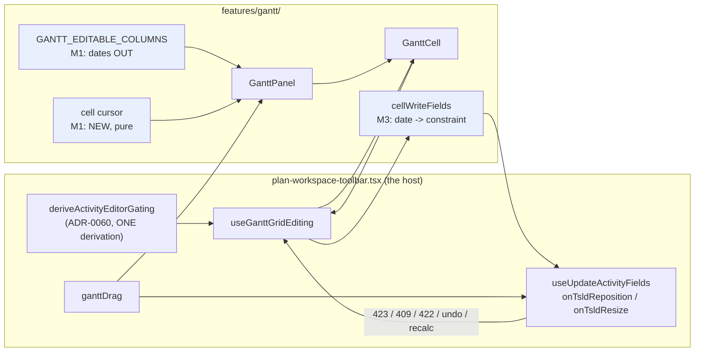
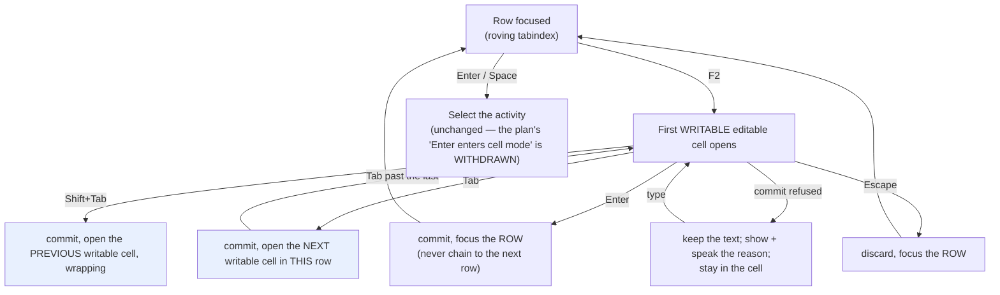

# Feature Spec: The Gantt's remaining editing gaps

- **Status:** Draft — awaiting approval before implementation
- **Author(s):** Feature Analyst (Product Owner / Solution Architect / Technical Lead hats)
- **Date:** 2026-09-10
- **Tracking issue / epic:** —
- **Roadmap link:** [`docs/BACKLOG.md`](../../BACKLOG.md) — `S` "The Gantt's remaining editing gaps";
  [`docs/PROJECT_BRIEF.md`](../../PROJECT_BRIEF.md) §8 (the "read-primary; edit supported" Must-have)
- **Related ADR(s):** builds on **ADR-0095** (the Gantt becomes a working surface) and **ADR-0059**
  (the read-only first ship). Amends nothing yet — §4 recommends **no new ADR** for the repair work
  and names the one decision (§1 CQ-1) that would need one.
- **Predecessor spec:** [`docs/specs/gantt-editing/`](../gantt-editing/) — `Accepted — shipped
(ADR-0095)`

---

> **Read this first.** The brief that commissioned this spec offered three framing claims and asked
> for each to be tested. **Two are wrong and one is imprecise.** The corrections are in §1
> "What the register says, and what the code says", and they change the shape of the work: the
> headline item the backlog names (`start-edge resize`) is **not** the most valuable thing here, and
> the second item it names (`grid-width memory`) is **already built**. The most valuable thing is a
> **live dead end nobody has recorded anywhere** — two grid cells that open, accept typing, and
> refuse every value with a message saying the value is wrong.
>
> Every decision-bearing claim below names the file and line that established it (ADR-0076 / §19.11).
> Where a claim could not be established without running a browser, it says so and names the
> experiment.

---

## 1. Business understanding

### Problem

`docs/BACKLOG.md:79-105` carries an `S` row, "The Gantt's remaining editing gaps", which says the
epic landed and names three things as left: the **start-edge resize**, the **columns chooser's
grid-width memory**, and a **coarse-pointer pass**. It closes: _"`PROJECT_BRIEF.md` §8's 'edit
supported' is **substantially** met and deliberately not claimed closed."_

Re-deriving each of those from the code changes the problem statement.

#### What the register says, and what the code says

| Register claim                                                                                                          | Verified against                                                                                                                          | Verdict                                                                                                                                                                                                                                            |
| ----------------------------------------------------------------------------------------------------------------------- | ----------------------------------------------------------------------------------------------------------------------------------------- | -------------------------------------------------------------------------------------------------------------------------------------------------------------------------------------------------------------------------------------------------- |
| _"the **start-edge resize** (D4 — it carries a mode-dependent meaning…)"_                                               | `GanttPanel.tsx:1576-1585`; `use-plan-workspace-model.ts:1179-1213`; `tsld-toolbar-items.tsx:2455-2499`; `plan-workspace-toolbar.tsx:910` | **True that it is absent. The stated reason does not survive re-derivation** — see §1 "Q2" below. It is a real gap and a small one, and the argument that withheld it applies equally to a gesture that shipped.                                   |
| _"the columns **chooser's** grid-width memory (T6 names it; the grid has no resize handle, so nothing can set it yet)"_ | `GanttPanel.tsx:454-490` and `:1249-1278`; `use-resizable-panel-prefs.ts:39-68`                                                           | **FALSE.** The grid has had a splitter since Graphite M8 (`PanelResizer`, `label="Grid width"`), and the width **is** remembered — `useResizablePanelPrefs({ storageKey: 'schedulepoint:gantt-grid-width' })`, i.e. `localStorage`. See §1 "Q1-b". |
| _"a **coarse-pointer** pass — `docs/TECH_DEBT.md` #133"_                                                                | `docs/TECH_DEBT.md:4791`                                                                                                                  | **The citation is wrong twice.** #133 is **closed** (2026-08-28, "Overtaken — ADR-0109 D1 deleted the width ladder"), and it was about the merged command strip, never the Gantt. A coarse-pointer gap **does** exist here; it is a different one. |
| _"Delivered, and verified during the 2026-08-18 reconciliation pass"_ — the eight-item delivered list                   | each item, see §1 "Q1-a"                                                                                                                  | **All eight verified delivered.** The row's positive half is accurate.                                                                                                                                                                             |

#### The thing nothing records

**Two grid cells are lit and inert, and every commit through them fails with a message that blames
the planner's input.**

`GANTT_EDITABLE_COLUMNS` (`cell-edit.ts:246-251`) maps the `earlyStart` and `earlyFinish` columns to
editable cells. `ganttCellGate` (`cell-gate.ts:96-108`) returns `writable: true` for them on a
calculated plan when the reader holds the role and the pen. `GanttPanel.tsx:1680-1714` therefore
renders a `GanttCell` with `onDoubleClick={gate.writable ? onBegin : undefined}`
(`GanttCell.tsx:137`), so a double-click opens a real `<input>` seeded with the date. The planner
types and presses Enter.

`commitCell` then calls `cellWriteFields`, which for those two keys is:

```ts
    case 'earlyStart':
    case 'earlyFinish':
      // …Wired in M2-T3b with the constraint note; refused here until then rather than sent
      // somewhere plausible, because a silently-wrong write is worse than a refusal.
      return null;
```

— `cell-commit.ts:87-93`. A `null` fragment reaches `commitCell.ts:137-143`, which returns
`{ ok: false, failure: { message: 'That value is not something this cell accepts.' } }`. That
sentence is shown in the cell and **spoken to the live region** (`use-gantt-grid-editing.ts:142-146`)
for **every** value, including a valid date in the exact format the cell was seeded with.

Three things make this worse than an ordinary unbuilt feature:

1. **The task it defers to does not exist.** `M2-T3b` is cited in `cell-commit.ts:91` and in
   `cell-commit.test.ts:62`. Searching the whole approved spec directory for `M2-T3b` or `T3b`
   returns **nothing** (`docs/specs/gantt-editing/`). `M2-F2`'s description folds Start and Finish
   into scope (`implementation-plan.md:367-373`) and tasks `M2-T2`…`M2-T5` never wire them. The
   plan had the gap; the code invented an id for it; nothing tracks it.
2. **A unit test pins the dead end as correct.** `cell-commit.test.ts:60-66`, _"never PATCHes a
   computed date column"_. The assertion is right about the API contract and wrong about the
   product: refusing the **write** is correct, and offering the **cell** is not. This is ADR-0104's
   shape — a defect with a suite that pins it.
3. **It merged against this epic's own stated merge condition.** ADR-0095 shipped with no feature
   flag, under the constraint the spec wrote as a blockquote: _"No milestone may merge with an
   affordance that is visible and inert"_ (`docs/specs/gantt-editing/feature-spec.md:379-381`).

Two further items were specified, referenced in shipped docblocks, and never built:

- **The one-per-session constraint note.** `implementation-plan.md:369` requires it; `M2-T3b`'s
  comment names it; `bar-annotations.ts:13` says the badge _"sustains what the one-per-session note
  says at the moment a constraint is written"_, and `token-contrast.test.ts:194` repeats it. A
  case-insensitive search of `apps/web/src` for `once per session|one-per-session|per-session`
  returns **exactly those two docblocks and no implementation.**
- **`% complete` as a grid cell.** `M2-F2` names it (`implementation-plan.md:367`). It exists in the
  model (`cell-edit.ts:32`, `:51-57`, and `cellWriteFields` handles it at `cell-commit.ts:79-85`)
  and is deliberately absent from `GANTT_EDITABLE_COLUMNS` because _"the grid has no Progress column
  yet"_ (`cell-edit.ts:238-244`). It is not in `GANTT_COLUMNS` (`grid-columns.ts:64-113`) or in
  `HIDEABLE_COLUMNS` (`gantt-view-state.ts:55-62`). This one is **honestly documented in the code**
  and recorded nowhere else.

And one keyboard contract was specified in full and shipped in part:

- `implementation-plan.md:829-833` specifies _"`F2` **or `Enter`** on a focused row enters cell
  mode"_ and _"In cell mode, `Tab`/`Shift+Tab` **cycle that row's editable cells and wrap**"_.
  Shipped: `F2` only, and it opens **the first writable editable cell**, which for every row is
  `name` (`GanttPanel.tsx:875-899` walking `COLUMNS` in `grid-columns.ts:64-113` order —
  `code` is not editable, `name` is). `Enter` on a row **selects the activity** instead
  (`GanttPanel.tsx:1643-1649`). `Tab` inside a cell commits and does **not** move to another cell:
  `GanttCell.tsx:174-178` calls `onCommit()` and returns without `preventDefault`, and the only
  focus instruction in the feature is `onCellClosed`, which the host implements as _"focus
  `[role="treegrid"] [role="row"][tabindex="0"]`"_ (`plan-workspace-toolbar.tsx:889-891`). There is
  no `Shift+Tab` handler and no cell cursor anywhere in `features/gantt/` (grep for `'Tab'` and
  `shiftKey` returns `GanttCell.tsx:174` and three `Shift+F10` sites only).

  **The consequence, stated as a candidate rather than a finding:** if `Tab` does not reach the next
  cell, then **Duration, Start and Finish are reachable by pointer alone** — a WCAG 2.2 §2.1.1
  (Level A) failure of the kind this epic's own plan calls out in writing
  (`implementation-plan.md:434`). And `PlanShortcutsHelp.tsx:138` tells the planner
  `Tab · Commit and move to the next cell`, which the code does not do.

  **I could not establish where focus lands, because that needs a real browser** — the input is still
  mounted at the instant `Tab` is processed, the commit is asynchronous, and jsdom's focus model is
  not the platform's. The experiment that settles it is one Playwright step: `F2` on a row, `Tab`,
  and read `document.activeElement`. That step belongs in M1 whichever way it comes out.

#### Why now

Three reasons, in order of weight.

1. **A planner meeting the date cells today is told their input is wrong.** That is worse than the
   feature being absent, because it is unfalsifiable from the outside: the planner tries other date
   formats. It is live on the auto-pulling host (ADR-0047) and has been since `web-v0.92.0`
   (2026-08-18).
2. **`docs/BACKLOG.md` decides what gets picked up next**, and this row's own neighbour records the
   same file describing shipped work as owed **five times** (`docs/BACKLOG.md:106-137`). This row is
   the sixth, in the other direction: it describes as owed one thing that shipped
   (grid-width memory), cites a closed debt row for another, and misses three unbuilt items entirely.
3. **The brief's §8 line can be closed or cannot**, and nobody can tell which while the register's
   two stated grounds for hedging are the two this spec finds least load-bearing (§1 "Q4").

### Users

| Role               | Interest in this work                                                                                                                                                                                             |
| ------------------ | ----------------------------------------------------------------------------------------------------------------------------------------------------------------------------------------------------------------- |
| **Planner**        | Primary. Types dates into the grid, drags bar ends, reads the chart to hand to somebody else. Every item here is theirs. Needs the pen (ADR-0028) for all of it except progress.                                  |
| **Contributor**    | Reports progress. Affected by the `% complete` cell gap: their one write scope is the one with no grid cell, so they reach it through the object bar → editor dialog (which works — `object-actions.spec.ts:47`). |
| **Org Admin**      | Same as Planner, plus the pen override. Nothing role-specific here.                                                                                                                                               |
| **Viewer**         | Reads. Every gate below already shades or omits for them; the work must not change that.                                                                                                                          |
| **External Guest** | **Out of scope and structurally so** — `SCHEDULE_READ` is fixed read-only and the guest route has no workspace model (ADR-0051; the predecessor spec settled this at `feature-spec.md:207`).                      |

### Primary use cases

1. A planner types a start date into a Gantt grid cell and the bar moves — or is told, before
   typing, that this cell is not one you type into.
2. A planner drags a bar's **left** end to move its start while keeping its finish, as they can on
   the diagram.
3. A planner reaches every editable cell from the keyboard.
4. A planner turns the dependency arrows on and finds them still on after a reload.
5. A planner using a touch device can hit the Gantt's controls.

### User journeys

**Today (the defect).** Gantt → double-click a **Start** cell → type `2026-03-01` → Enter →
_"That value is not something this cell accepts."_ → try `01/03/2026` → same → try
`1 Mar 2026` → same. There is no state in which this cell succeeds.

**After M1 (the smallest honest fix).** Gantt → the **Start** and **Finish** cells render read-only,
value at full contrast, with `aria-readonly` and a linked reason — _"Dates are computed. Move the
bar, or set a constraint in the activity editor."_ Nothing is lost, because nothing worked.

**After M3 (the capability, if approved).** Gantt → double-click **Start** → type a date → Enter →
a note appears once per session explaining that a typed date pins the activity → the bar moves and
successors re-flow → `Ctrl+Z` restores it.

See the flow diagrams in §4.

### Expected outcomes

- No control in the Gantt accepts input it cannot use.
- The Gantt's documented keyboard contract and its actual keyboard contract are the same document.
- `PROJECT_BRIEF.md` §8's Must-have is either **closed** with the evidence written down, or its
  remaining condition is named in one sentence somebody can act on.
- `docs/BACKLOG.md`'s row is rewritten from the code rather than from itself.

### Success criteria

| #   | Criterion                                                                                                        | How it is measured                                                                                                       |
| --- | ---------------------------------------------------------------------------------------------------------------- | ------------------------------------------------------------------------------------------------------------------------ |
| S1  | No editable-looking Gantt cell can produce `That value is not something this cell accepts` for a **valid** value | A journey types a valid date into Start; either it commits, or the cell never opened. Verified red against today's code. |
| S2  | Every editable cell in a row is reachable from the keyboard                                                      | A journey presses `F2` then `Tab` and asserts `document.activeElement` is the next editable cell's input                 |
| S3  | `PlanShortcutsHelp`'s Gantt list matches the shipped bindings, in both directions                                | A structural test derives the documented set from the panel's handler, or a review pins each row to a line               |
| S4  | The Gantt clears the 44 × 44 house rule under a coarse pointer                                                   | The existing `COARSE_SURFACES` sweep gains the treegrid and the Gantt object bar; verified red first                     |
| S5  | The arrows toggle survives a reload                                                                              | `view-state.spec.ts` gains a case, in the URL-param shape M5-T6 already uses                                             |
| S6  | The backlog row and `gantt-view-state.ts:37-41` state what is true                                               | Both rewritten in the same change, each citing the line it was derived from                                              |

### Open questions

Only two are **critical** — the ones whose answers change scope. Everything else has a stated
default and is not blocking.

> **CQ-1 (CRITICAL) — Is the typed-date cell a capability we want, or is the cell withdrawn?**
>
> M1 makes the cells read-only, which is correct and cheap whichever way this goes. M3 builds the
> capability: a typed date writes the **constraint** a drag writes (SNET in EARLY, `visualStart` in
> VISUAL), plus the one-per-session note the plan already specified.
>
> **This is the only item in the spec that would need an ADR**, because "typing a date into a
> computed column silently pins the activity" is a semantic decision about the schedule, not a UI
> repair. My recommendation is **build it (M3)** — P6 and MS Project both do it, `M2-F2` already
> approved it, and the alternative leaves the two most obvious cells in a Gantt grid permanently
> inert. But it is a week of work against M1's afternoon, and the product owner may reasonably
> prefer M1 alone.
>
> **Default if unanswered:** M1 only. The dead end closes; the capability waits.

> **CQ-2 (CRITICAL) — Does the start-edge resize get built, given that its stated reason does not
> hold?**
>
> §1 "Q2" below shows the deferral's reason is not discriminating. That does not make building it
> right; it makes the deferral **undecided rather than decided**. The honest options are: build it
> (M4, small — the write path exists and the Gantt already calls it), or re-defer it **with a
> reason that survives** (my candidate: _the Gantt has no drift or `visualConflict` cue at all, so
> Visual-mode editing there is under-served in general, and one more gesture does not fix that_).
>
> **Default if unanswered:** re-defer, with the reason above written into the register, and the
> whole Visual-mode-legibility question raised as its own backlog row.

**Non-critical, with defaults stated:**

- **Arrows default.** Stays **off**. It was a product-owner decision (Q1 → C) taken before any
  measurement (`link-density.spec.ts:20-22`), the toggle's own declaration records the reasoning
  (`view-toggles.ts:64-68`), and §1 "Q3" finds the cost case neither made nor needed. What M2 fixes
  is that the choice does not **persist**, which is the part nobody decided.
- **`% complete` column.** **Not added.** It would widen the grid — the surface three epics have
  spent measuring — for a write a Contributor already reaches in two clicks from the same row. The
  gap is recorded in `docs/TECH_DEBT.md` instead of being carried as unowned scope. Reversible in
  one task if the product owner disagrees.
- **`Enter` as a second cell-mode entry point.** **Not added.** `Enter` on a row selects the
  activity today (`GanttPanel.tsx:1645`), which is the treegrid convention and is used; rebinding it
  is exactly the "one key, two meanings" trap `PlanShortcutsHelp.tsx:110-113` was written about. The
  plan's `Enter` entry point is **withdrawn**, in writing, rather than left owed.
- **Right-click row menu.** **Not added.** Only `HierarchyTree.tsx:374` implements `onContextMenu`
  anywhere in `apps/web/src`; the canvas and the activities table do not. Adding it to the Gantt
  alone would be one surface out of step with two.
- **Multi-select in the Gantt.** **Stays out** (predecessor spec D4, `feature-spec.md:393-394`;
  `plan-workspace-toolbar.tsx:1136-1147` records the current honest behaviour). It is its own slice
  and is correctly deferred.

---

### The four questions, answered from evidence

#### Q1 — What is actually missing?

**(a) The register's delivered list is accurate.** Verified item by item rather than inherited:

| Claimed delivered               | Evidence                                                                          |
| ------------------------------- | --------------------------------------------------------------------------------- |
| dependency arrows               | `GanttLinkOverlay.tsx`; `link-paths.ts:80-125`; `GanttPanel.tsx:557-563`, `:1184` |
| in-cell editing, per-cell scope | `cell-gate.ts:62-108`; `cell-edit.ts:51-57`                                       |
| bar drag                        | `use-bar-pointer-drag.ts`; `GanttPanel.tsx:1553-1574`                             |
| `Alt+←/→`                       | `GanttPanel.tsx:848-853`; `bar-drag.spec.ts:118`                                  |
| row menu                        | `GanttRowMenu.tsx`; keyboard route at `GanttPanel.tsx:808-819`                    |
| columns chooser                 | `gantt-view-state.ts:55-71`; `tsld-toolbar-items.tsx:181-190`                     |
| Indent / Outdent                | `structure-edit.ts`; `view-state.spec.ts:111`, `:184`                             |
| Insert activity                 | `view-state.spec.ts:199`                                                          |
| URL-backed view memory          | `gantt-view-state.ts:98-221`; `view-state.spec.ts:54`                             |
| the ADR-0093 inherited promise  | `plan-workspace-toolbar.tsx:1104-1164`; `object-actions.spec.ts:47`               |

**Also shipped and not in the register's list:** the finish-edge pointer resize
(`GanttPanel.tsx:1576-1616`), `Shift+←/→` duration nudge (`:854-866`), bar labels and the constraint
badge (`bar-annotations.ts`), the grid splitter (`:1249-1278`), and the Gantt half of the shortcuts
sheet (`PlanShortcutsHelp.tsx:128-142`).

**(b) What the register names as left, corrected.**

- **Start-edge resize** — absent. Real. See Q2.
- **Grid-width memory** — **built.** `PanelResizer` with `label="Grid width"` at
  `GanttPanel.tsx:1262-1277`; persisted to `localStorage` under `schedulepoint:gantt-grid-width`
  (`:477-489` → `use-resizable-panel-prefs.ts:39-68`). What is genuinely absent is grid width in the
  **URL** view state, which the shipped code deliberately declined for a reason that has since
  lapsed: `gantt-view-state.ts:37-41` still reads _"the grid has no resize handle, so nothing can set
  it. It returns when the grid becomes resizable."_ The grid became resizable. That docblock is a
  live piece of misinformation and the backlog row inherited it verbatim.
  **Recommendation: do not add grid width to the URL.** `localStorage` is the right home — it is a
  per-device ergonomic preference, not a view worth sending to somebody, and it is where the
  Explorer rail and the Graphite drawer keep theirs. Fix the two documents instead.
- **Coarse-pointer pass** — the cited row (#133) is closed and was about a different surface. A real
  gap exists and is narrower: `e2e-workspace-fit/command-surface.spec.ts:881-892` lists the coarse
  44 × 44 surfaces as the command deck, the plan header and the Project Explorer. **The Gantt
  treegrid is not among them**, though the _fine_ 24 × 24 sweep does cover it (`:747-791`) and the
  Gantt object bar (`:807-831`). Separately, the sweep's element list (`:102-108`) matches
  `button,a,[role=button],select,textarea,summary,[role=…],input` — so the Gantt's **bar** and its
  **finish-edge resize handle** are invisible to it, being `aria-hidden` `<span>`s carrying
  `onPointerDown` (`GanttPanel.tsx:1852-1867`, `:1912-1919`). The handle is `w-2 h-3.5` — **8 × 14
  px**. Whether that is a §2.5.8 failure is genuinely arguable (it is `aria-hidden`, redundant with
  `Shift+←/→`, and the bar itself is the larger target) and **this register has overstated an SC
  citation once** (ADR-0082). It is stated here as _unmeasured_, not as a violation.

**(c) Unbuilt and recorded nowhere — the substance of this spec.**

| #   | Gap                                                                              | Evidence                                                                                       | Class                                            |
| --- | -------------------------------------------------------------------------------- | ---------------------------------------------------------------------------------------------- | ------------------------------------------------ |
| G1  | Start/Finish cells open and refuse every value with a message blaming the input  | `cell-commit.ts:87-93` + `:137-143`; `cell-edit.ts:246-251`                                    | **Live defect** (lit-inert)                      |
| G2  | The one-per-session constraint note does not exist                               | `bar-annotations.ts:13`, `token-contrast.test.ts:194` vs. zero matches                         | Unbuilt, described as built                      |
| G3  | `Tab` does not cycle cells; `Shift+Tab` unhandled; `Enter` entry point not built | `GanttCell.tsx:174-178`; `implementation-plan.md:829-833`                                      | Approved, shipped in part                        |
| G4  | The shortcuts sheet documents G3's unbuilt behaviour                             | `PlanShortcutsHelp.tsx:138`                                                                    | **False claim on a surface**                     |
| G5  | Sheet omits `Shift+F10`/`ContextMenu`, `Ctrl+Z`/`Y`, `Ctrl+C`/`V`                | `PlanShortcutsHelp.tsx:128-142` vs. `GanttPanel.tsx:808`, `plan-workspace-toolbar.tsx:839-851` | Documentation gap                                |
| G6  | The arrows toggle is not persisted anywhere                                      | `use-tsld-canvas-ui-state.ts:180` — plain `useState`                                           | Unbuilt                                          |
| G7  | `% complete` has no grid cell                                                    | `cell-edit.ts:238-244`; absent from `grid-columns.ts:64-113`                                   | Honestly deferred in code                        |
| G8  | No `visualConflict` cue in the Gantt                                             | grep of `features/gantt/` returns `isCritical` only                                            | Named in the old plan's "Recorded, not actioned" |
| G9  | Coarse 44 × 44 does not cover the Gantt; the sweep cannot see bar or handle      | `command-surface.spec.ts:881-892`, `:102-108`                                                  | Gate blind spot                                  |
| G10 | No journey **drives** the pointer drag or the pointer resize                     | `bar-drag.spec.ts:219-233` asserts presence and a non-zero box only                            | Coverage gap                                     |

**G5 is worse than it reads.** ADR-0095 D7 records that Indent, Outdent and Insert exist **only** in
the row menu, and `GanttPanel.tsx:798-807` says in as many words that without `Shift+F10` they would
be _"reachable by mouse alone (WCAG 2.1.1, Level A)"_. The binding was built for that reason and is
documented in no user-facing place.

**(d) Deliberate, ADR-backed, and correctly left alone.** Recorded so a future reader does not
mistake them for gaps: zoom-to-selection and isolate-logic are **absent** rather than shaded in the
Gantt because the object cannot do them in this projection (ADR-0095 D1, `selection-actions.tsx:862`,
`:881`); a Gantt drag never changes lane (predecessor D3, `bar-drag.ts:12-15`); Indent files under
the nearest existing summary rather than converting a task (ADR-0038's invariant, ADR-0095's closing
section); editing is not offered in the printed programme or the guest view (predecessor D1); the
Gantt does not get its own time scale (ADR-0059 §2, predecessor D2); link **routing** is deliberately
absent and structurally pinned (`link-paths.structural.test.ts`).

#### Q2 — Why was the start-edge resize deferred, and is that reason still true?

The reason, in full, twice — `docs/adr/0095-…md:234-236` and `GanttPanel.tsx:1580-1584`:

> The start edge is deliberately NOT offered on this surface yet: it carries a MODE-dependent
> meaning (EARLY writes SNET + durationDays, VISUAL writes visualStart + durationDays), and shipping
> it without **the mode statement the canvas has beside it** would leave a planner unable to tell
> which of two writes their drag just made.

Four things, each read rather than recalled.

1. **The write path exists and is already mode-aware.** `onTsldResize` takes an optional `startDay`
   and branches on the mode: VISUAL goes through `setVisualStart` with the new start and duration
   (`use-plan-workspace-model.ts:1179-1198`); EARLY writes `constraintType: 'SNET'` at the new start
   inside the full-definition PATCH (`:1200-1217`). The Gantt already calls this function
   (`plan-workspace-toolbar.tsx:911`), passing `durationDays` alone. Adding the start edge is
   supplying one more field from an existing gesture.

2. **The mode selector is not canvas-only.** `mode-early` and `mode-visual` declare
   `isVisible: () => SCHEDULING_MODES_ENABLED` with **no `planView` gate**
   (`tsld-toolbar-items.tsx:2455-2499`) — unlike `logicLinks`, which `VIEW_SCOPED_TOGGLES` explicitly
   scopes to `'gantt'` (`:489-491`). `SCHEDULING_MODES_ENABLED` is default-on (`env.ts:161`). The
   `Early | Visual` segment with its `isActive` marker therefore renders in the Gantt exactly as on
   the diagram. On this reading the reason **has lapsed**.

3. **On the other reading, the canvas does not have what D4 credits it with either.** If "the mode
   statement" means the canvas's mode-specific _visual language_ — drift tails, the `visualConflict`
   highlight — then the Gantt genuinely lacks it (G8). But the canvas's own start-edge feedback does
   **not** name the mode: the live cursor readout says `Start 2 Jan` (`cursor-readout.ts:92-98`) and
   the settle announcement says _"Moved the start of "X" to <date> (N days, finish unchanged)"_
   (`TsldPanel.tsx:2440-2450`). Neither says EARLY or VISUAL.

4. **The reason does not discriminate.** The Gantt's already-shipped **bar move** is mode-dependent
   in precisely the same way — `moveTo` calls `onTsldReposition`, which writes `visualStart` in
   VISUAL and an SNET in EARLY (`plan-workspace-toolbar.tsx:910`;
   `use-plan-workspace-model.ts:1060-1075`) — and `e2e-gantt-editing/bar-drag.spec.ts:138` and `:157`
   prove both branches against a real API. It shipped in M3 with no mode statement beside it. An
   argument that forbids the start edge forbids the gesture that shipped.

**Verdict.** The deferral's stated reason does not survive re-derivation. The gap is real and small;
the reason for it is not the one written down. This is exactly the shape
`docs/CLAUDE.md` records as _"a deferral whose reason has lapsed reads exactly like one whose reason
still holds"_ — so it goes back to the product owner as **CQ-2** rather than being built on the
strength of a debunked objection, or left deferred on it.

#### Q3 — Are the dependency arrows default-off for cost or for design?

**Design, and the decision preceded the measurement.** Three pieces of evidence, none inferred:

- The toggle's declaration: _"Defaults **OFF** (the product owner's Q1 answer), which is the one
  toggle in this set that does. Logic on a dense programme is a thicket, and a selected row's own
  links draw regardless — so the off-state answers 'why is this bar here?' without anybody turning
  anything on, and the toggle buys the whole-window view rather than the capability."_
  (`view-toggles.ts:64-68`.) The off-state behaviour is real: `link-paths.ts:100-101` widens the set
  to any link touching the selection whatever `showAll` says.
- The measurement harness says the ordering explicitly: _"Q1 was answered **C** (all links behind a
  `View ▾` toggle) **ahead of** this measurement, so the number no longer decides whether M4 happens
  — it sizes the mitigation"_ (`link-density.spec.ts:20-22`).
- ADR-0095 D5's whole argument is about **substrate**, answering ADR-0059 §4's objection with
  geometry. It never argues a per-frame cost.

**Does the measurement cover the default-on case?** For the **count**, yes. `endpointVisible` counts
every dependency in the plan with at least one endpoint in the rendered window
(`link-density.spec.ts:376-390`) — which is exactly what `ganttLinkPaths({ showAll: true })` yields,
because `showAll` is applied before the window cull and admits everything. The reported
2,160-activity / 3,200-link figures (p95 71–74, sort-independent;
`docs/specs/gantt-editing/implementation-plan.md:915-947`) therefore describe the toggle **on**.
Note the harness defaults to `MEASURE_ACTIVITIES ?? 400` (`:62`), so those figures came from a run
with the variable set — the plan names `schedulepoint-seed scale --activities 2000` (`:898`).

**What the measurement does not cover, in its own words:**

> **Not measured here:** the _render cost_ of drawing N paths. This counts links; it does not prove
> that drawing them is cheap. … A render measurement is its own task.
> — `link-density.spec.ts:36-39`

So: the count is bounded by the viewport and does not grow with the plan; the paint cost of ~74 SVG
elbows has **never been measured on any hardware**. Nothing in this spec needs that number, because
nothing here proposes flipping the default. **If CQ's default is overturned and the arrows go
default-on, that measurement becomes a prerequisite**, and `performance-reviewer` is owed with it.

#### Q4 — What does "edit supported" actually require, and is the register's hedge the stale part?

The brief's whole clause is one line:

> - Gantt view as an alternate projection of the same data (read-primary; edit supported).
>   — `docs/PROJECT_BRIEF.md:74`

It enumerates nothing. Against it, the Gantt today supports: in-cell editing of **Activity** and
**Duration** with per-cell write scope; bar **move** by pointer and by `Alt+←/→`, mode-aware in both
scheduling modes; **finish-edge resize** by pointer and by `Shift+←/→`; **Indent / Outdent /
Insert**; a **row menu** and a **docked object bar** carrying the same roster the canvas offers —
progress, notes, resources, edit, duplicate, dissolve, delete, open logic, conflict remedy; **undo**
through the shared stack; and **URL-backed view memory**. Every write goes through the workspace's
own mutations, so the pen's 423, the optimistic 409, the ADR-0048 undo record and the ADR-0032
coalesced recalculation all arrive unchanged (`cell-commit.ts:8-24`; `bar-drag.ts:3-16`).

**That is "edit supported" by any reading of those two words.** "Read-primary" is also satisfied —
the TSLD remains the default view and the brief's own §7 metric that would police the balance is
recorded as unmeasurable (ADR-0059's risk section).

**So the honest answer to the brief's fourth question is yes: the register's wording is what is
stale.** ADR-0095's closing line and `CLAUDE.md`'s banner both hedge to "substantially met", and
the two grounds they give do not support the hedge:

- **The start-edge resize.** §8 does not mention a start edge. The diagram had no start-edge resize
  either until ADR-0052 M3, long after §8 was written.
- **Arrows default-off.** §8 says nothing about dependency arrows in the Gantt. ADR-0059 §4
  _excluded_ them; ADR-0095 D5 _built_ them. A lens whose default is off is a shipped capability
  with a chosen default, not an unmet requirement.

**Recommendation: close §8's Gantt line**, in the same change that fixes G1 — with the evidence
above written into the ADR that files this work, and with the residual named rather than implied
(the Gantt has no Visual-mode legibility cues; multi-select is canvas-only; the start edge is a
decision, not an omission). ADRs are immutable, so ADR-0095's sentence is not edited — it is
superseded by a statement in the new ADR, which is the register's own convention.

**Is closing it one epic or several?** Neither. It is **one small fix-slice plus one product-owner
decision**, and the plan beside this spec is sized accordingly. A spec that talks its reader out of
an epic is worth more than one that invents it — and the epic-shaped work that genuinely remains
around the Gantt (Visual-mode cues, plural selection, a cell cursor) is _not_ what §8 asks for and
should be raised on its own merits.

---

## 2. Functional requirements

### User stories & acceptance criteria

> **US-1 (M1)** — As a **Planner**, I want the Gantt's date cells to tell me the truth about
> whether I can type in them, so that I do not spend a minute trying date formats against a cell
> that accepts none.
>
> - **Given** the Gantt with a calculated plan and I hold the pen, **when** I double-click a
>   **Start** or **Finish** cell, **then** nothing opens — the cell is read-only.
> - **Given** the same cell, **then** it carries `aria-readonly="true"`, keeps its value at full
>   contrast with only its chrome dimmed (ADR-0083), keeps its position in the row, and links a
>   reason with `aria-describedby`.
> - **Given** I read that reason, **then** it says what to do instead — moving the bar, or setting a
>   constraint in the activity editor — and never `That value is not something this cell accepts`.
> - **Given** a **Viewer**, **then** the cell renders identically; the reason is about the object,
>   not the reader, and `cell-gate.ts:105-108` already checks permission last.
> - **Given** the plan is not yet calculated, **then** the existing sentence stands: _"Recalculate
>   the plan to set dates."_ (`cell-gate.ts:96-103` — unchanged.)

> **US-2 (M1)** — As a **Planner** driving from the keyboard, I want every editable cell in a row to
> be reachable, so that Duration is not a mouse-only field.
>
> - **Given** a focused row, **when** I press `F2`, **then** the first writable editable cell opens.
> - **Given** an open cell, **when** I press `Tab`, **then** the edit commits **and** focus moves to
>   the next editable cell in the same row, wrapping at the end.
> - **Given** an open cell, **when** I press `Shift+Tab`, **then** the same, backwards.
> - **Given** an open cell, **when** I press `Enter`, **then** the edit commits and focus returns to
>   the **row** — deliberately not chaining into the next row.
> - **Given** the last editable cell of a row, **when** I `Tab`, **then** focus wraps to the first
>   editable cell **of that row**, never to the next row.
> - **Given** any of the above, **then** `PlanShortcutsHelp`'s Gantt list describes exactly this.

> **US-3 (M1)** — As a **Planner**, I want the Gantt's shortcut sheet to list every binding the
> Gantt actually has, so that the keyboard-only route to Indent, Outdent and Insert is discoverable.
>
> - **Given** the Gantt and I press `?`, **then** the sheet lists `Shift+F10` / `Menu` — "Open this
>   row's actions menu".
> - **And** it lists `Ctrl/Cmd+Z` and `Ctrl/Cmd+Shift+Z` · `Ctrl+Y` when undo is enabled, because
>   the workspace key scope is bound at the workspace root and is live in this view
>   (`plan-workspace-toolbar.tsx:839-851`).
> - **And** it lists `Ctrl/Cmd+C` / `Ctrl/Cmd+V` when copy/paste is enabled, on the same reasoning.
> - **And** it lists `Enter` / `Space` on a row as "Select the activity", which is what
>   `GanttPanel.tsx:1645` does.
> - **Given** any of those bindings is later removed, **then** the sheet fails a test rather than
>   going stale (see §3 Testing).

> **US-4 (M2)** — As a **Planner**, I want the dependency arrows to still be on after I reload, so
> that I do not turn them on every session.
>
> - **Given** I turn `View ▾ ▸ Logic links` on in the Gantt, **when** I reload, **then** the arrows
>   are still drawn.
> - **Given** I have never touched it, **then** the arrows are **off** and the URL carries no
>   parameter for them — the defaults-are-omitted rule the other three Gantt params already follow
>   (`gantt-view-state.ts:217-221`).
> - **Given** I copy the URL to a colleague, **then** they see the chart with the arrows in the same
>   state.
> - **Given** I switch to the diagram, **then** nothing changes there — the diagram draws its logic
>   unconditionally and the toggle is already scoped to `'gantt'`
>   (`tsld-toolbar-items.tsx:489-491`).

> **US-5 (M3, gated on CQ-1)** — As a **Planner**, I want to type a start date into the grid, so
> that I can pin an activity without leaving the row I am reading.
>
> - **Given** a calculated plan in **EARLY** mode and I hold the pen, **when** I type a date into
>   **Start** and press Enter, **then** an `SNET` constraint is written at that date and the
>   schedule re-flows — the same write the drag makes (`use-plan-workspace-model.ts:1204-1212`).
> - **Given** **VISUAL** mode, **then** `visualStart` is written and **no** constraint is
>   (`:1179-1198`).
> - **Given** either, **when** the write lands, **then** a note appears **once per session**
>   explaining that a typed date pins the activity — routed through the **shared** polite live
>   region, never a second one (`notice-strip.tsx`, and the predecessor plan's own §"Q2's note is
>   wired to the shared live region" at `implementation-plan.md:848-858`).
> - **Given** the write lands, **then** one undo entry is recorded and `Ctrl+Z` restores the prior
>   constraint or placement.
> - **Given** I type an unparseable date, **then** the cell keeps my text, shows a message naming
>   the expected format, and writes nothing.
> - **Given** **Finish**, **then** the constraint written is the finish-side equivalent (`FNET`),
>   and the note says so.

> **US-6 (M4, gated on CQ-2)** — As a **Planner**, I want to drag a bar's left end in the Gantt, so
> that I can move a start while keeping the finish, as I can on the diagram.
>
> - **Given** a task bar with the pen, **when** I drag its **left** end, **then** the start moves,
>   the finish stays, and the write is `onTsldResize({ activityId, durationDays, startDay })` —
>   the function the Gantt already calls, with one more field.
> - **Given** the keyboard, **then** an equivalent exists before or with the gesture, never after
>   (ADR-0095 D4's rule) — `Alt+Shift+←/→` is the candidate, subject to the collision review in §3.
> - **Given** a **summary** or a **milestone**, **then** the handle is absent, exactly as the
>   finish-edge handle is (`GanttPanel.tsx:1613-1616`).
> - **Given** the drag lands, **then** it is announced, and the announcement names the new start
>   date — matching the canvas's wording verbatim (`TsldPanel.tsx:2445-2449`).

> **US-7 (M2)** — As a **Planner on a touch device**, I want the Gantt's controls to be big enough
> to hit, so that the chart is usable on a tablet on site.
>
> - **Given** a coarse pointer at 1646, 1024, 834 and 390, **then** every swept control in the Gantt
>   treegrid and in the Gantt's object bar clears **44 × 44**, or is a named exception with its
>   reason written beside the exclusion (ADR-0118 D2's rule).
> - **Given** the sweep, **then** it has a pinned positive floor per surface, so an empty surface
>   cannot pass it (the ADR-0093 rule the fine sweep already follows).

### Workflows

**W1 — Reading a Start cell (M1).** Focus or hover the cell → it is visibly read-only (chrome
dimmed, value not) → hovering shows the reason as a `title`, focusing announces it via
`aria-describedby`. Double-click does nothing. This is `GanttCell`'s existing read-only path
(`GanttCell.tsx:106-138`), reached by removing two entries from `GANTT_EDITABLE_COLUMNS`.

**W2 — Tabbing a row's cells (M1).** `F2` on a row → the first writable cell opens → `Tab` commits
and opens the next writable cell in the same row → `Tab` past the last wraps to the first →
`Escape` at any point discards and returns focus to the row → `Enter` commits and returns focus to
the row.

**W3 — Typing a date (M3).** Double-click **Start** → an input seeded with the displayed date →
type → `Enter` → `committing` (the input goes `readOnly`, `aria-busy`) → the PATCH carries the
constraint → on success the note fires once per session, the row re-renders from the recalculation,
one undo entry is recorded, and focus returns to the row → on 423/409/422 the text is kept and the
server's sentence is shown and spoken (`use-gantt-grid-editing.ts:142-146`, unchanged).

**W4 — Dragging the left end (M4).** Press on the left grab zone → the bar's left edge tracks the
pointer at ≤ 1 publish per frame (`use-bar-pointer-drag.ts`) → `Escape` cancels and restores →
release commits `{ durationDays, startDay }` → announced.

### Edge cases

| Case                                                  | Expected                                                                                                                                       |
| ----------------------------------------------------- | ---------------------------------------------------------------------------------------------------------------------------------------------- |
| Row is a **WBS summary**                              | Every cell but Activity already read-only with an object reason (`cell-gate.ts:78-85`) — unchanged by all milestones                           |
| Row is a **milestone**                                | Duration read-only (`:87-94`); in M4 no start-edge handle; in M3 the Start cell still writes a constraint (a milestone has a start)            |
| Row is the derived **Unassigned bucket**              | `GanttBucketRowView` has no activity, so no cells and no handles — unchanged (`GanttPanel.tsx:1283-1290`)                                      |
| Plan **not calculated**                               | Dates read-only with "Recalculate the plan to set dates"; Duration and Activity stay editable (`cell-gate.ts:96-103` — deliberately unchanged) |
| **No pen**                                            | Every definition cell read-only with the reader-facing reason from the editor's own gate object; progress unaffected (ADR-0060 Q-C)            |
| A **recalculation lands while a cell is open**        | Untouched cell reseeds; typed cell is never overwritten (`cell-edit.ts:172-180`) — unchanged, and M1's `Tab` change must not break it          |
| `Tab` on the **only** editable cell in a row          | Commits and stays (wrap of a one-element set is itself) — an explicit unit case, because "wrap" is where an off-by-one lives                   |
| `Tab` while `committing`                              | Refused — the reducer ignores `begin` during a commit (`cell-edit.ts:128-130`); the cell must not open the next one mid-flight                 |
| **Every** cell in a row is read-only (Viewer)         | `F2` opens nothing and consumes nothing — the key falls through, as today (`GanttPanel.tsx:885-898`)                                           |
| A row is **virtualized away** mid-drag                | The rAF is cancelled on unmount (`use-bar-pointer-drag.ts:56`) — unchanged; M4's second handle uses the same hook                              |
| **URL says arrows on, but the view is the diagram**   | The parameter is read and held; the diagram ignores it, as the toggle already does (`tsld-toolbar-items.tsx:479-491`)                          |
| **Hand-edited arrows parameter is garbage**           | Total reader, default off — the rule every parser in `gantt-view-state.ts` already follows and `view-state.spec.ts:73` already drives          |
| M3: date typed on an **already-constrained** activity | The constraint is **overwritten**, exactly as a drop does (`use-plan-workspace-model.ts:1056-1057` records the same for reposition)            |
| M3: the **note** has already fired this session       | Silent — one note per session, per plan-workspace mount                                                                                        |

### Permissions

**No new permission, and no new endpoint.** Every write reuses a path that already carries its gates.

| Action                        | Gate                                                             | Where resolved                                                |
| ----------------------------- | ---------------------------------------------------------------- | ------------------------------------------------------------- |
| Read the chart / read a cell  | `schedule:read` (organisation-scoped)                            | unchanged                                                     |
| Type into Activity / Duration | `gating.general` — role **and** the ADR-0028 pen                 | `cell-gate.ts:73`, resolved from `deriveActivityEditorGating` |
| Type a date (M3)              | `gating.general` — same object, no new rule                      | `cell-gate.ts:73`                                             |
| Drag either bar end (M4)      | `drag.canEdit`, which is `canEditSchedule && !lateOverlayActive` | `plan-workspace-toolbar.tsx:830`, `bar-drag.ts:20-25`         |
| Report progress               | role only, **not** pen-gated (ADR-0060 Q-C)                      | `cell-gate.ts:73` via `GANTT_CELL_SCOPES`                     |
| External Guest                | none of the above; the guest route has no workspace model        | ADR-0051, unchanged                                           |

The server is the trust boundary throughout: the client gates are for legibility, and the PATCH is
refused by `assertHoldsPen` (423) and the optimistic `version` (409) regardless.

### Validation rules

| Field                   | Rule                                                                                                       | Shared?                                                                                |
| ----------------------- | ---------------------------------------------------------------------------------------------------------- | -------------------------------------------------------------------------------------- |
| Activity name           | non-empty after trim (client); length bounded by the API                                                   | `cell-commit.ts:67-70`, unchanged                                                      |
| Duration                | the ADR-0070 `d`/`h`/`m` grammar with a **required** `hoursPerDay`                                         | `durationWriteFields`, reused not reimplemented (`cell-commit.ts:72-77`)               |
| **Start / Finish (M3)** | an ISO calendar date, parsed with the **same** formatter the cell renders from, so the seed round-trips    | Must reuse `grid-columns.ts`'s date formatter; a second parser is how the two disagree |
| Start / Finish (M3)     | the write is a **constraint**, never a PATCH of `earlyStart`/`earlyFinish` — the engine owns those columns | `cell-commit.ts:89-92` is right about this and must stay right                         |
| Arrows parameter (M2)   | `on` \| absent; absent is the default and is deleted from the URL                                          | `gantt-view-state.ts` parsers, total by rule                                           |

### Error scenarios

| Scenario                                       | Detection                          | User-facing result                                                                         | Status |
| ---------------------------------------------- | ---------------------------------- | ------------------------------------------------------------------------------------------ | ------ |
| Someone else holds the pen                     | API                                | "Someone else is editing this plan." — text kept                                           | 423    |
| The row changed while typing                   | API optimistic `version`           | "This activity changed while you were typing." — caller refetches                          | 409    |
| Date unparseable (M3)                          | client, before the PATCH           | a message naming the expected format; **never** the current generic sentence               | —      |
| Constraint rejected by the engine's rules (M3) | API                                | the server's own sentence, not a generic one (`cell-commit.ts:113`)                        | 422    |
| Recalculation fails after a write              | existing workspace conflict banner | unchanged                                                                                  | —      |
| Cell open on an activity deleted by a peer     | API                                | the server's message; the gate already degrades safely (`use-gantt-grid-editing.ts:81-85`) | 404    |

---

## 3. Technical analysis

| Area               | Impact   | Notes                                                                                                                                                                                                                                                                                  |
| ------------------ | -------- | -------------------------------------------------------------------------------------------------------------------------------------------------------------------------------------------------------------------------------------------------------------------------------------- |
| **Frontend**       | med      | `features/gantt/` only, plus `PlanShortcutsHelp.tsx` and (M2) `gantt-view-state.ts` + the toggle's host. No new route. M1 is a **removal** of two map entries plus a cell-cursor addition; M3 adds a write branch; M4 adds a second grab zone.                                         |
| **Backend**        | **none** | Verified, not assumed: the whole design composes `useUpdateActivityFields` and `onTsldResize`, both of which already exist and are already called from this surface (`cell-commit.ts:37-41`; `plan-workspace-toolbar.tsx:911`). No module, service or controller changes.              |
| **Database**       | **none** | No model, column, index, constraint or migration. **`database-architect` is therefore not engaged, and that is a statement rather than an omission** — there is nothing to design, not a change judged too small (CLAUDE.md §19.3).                                                    |
| **API**            | **none** | No endpoint, no DTO, no OpenAPI change. M3 writes `constraintType`/`constraintDate` or `visualStart` through paths the drag already uses.                                                                                                                                              |
| **Security**       | **none** | No new permission, no new boundary, no new input reaching the server that the drag does not already send. `security-reviewer` is **not owed** — see §5.                                                                                                                                |
| **Performance**    | low      | M1's cell cursor is per-row, bounded by the editable-column count (four). M4 adds one `<span>` per movable bar to the rendered window (~40 rows). **Nothing here changes what the arrows draw**, so the unmeasured SVG paint cost (Q3) is not touched.                                 |
| **Infrastructure** | **none** | No new Playwright config and no new CI step: every journey below extends `e2e-gantt-editing` (which has its own step already) or `e2e-workspace-fit`. This deliberately avoids ADR-0105's CI trigger for the build.                                                                    |
| **Observability**  | **none** | No new logs, metrics or traces. Announcements go to the **existing** shared polite region.                                                                                                                                                                                             |
| **Testing**        | high     | Unit: the cell cursor (wrap, one-element, committing), `cellWriteFields` for dates (M3). Structural: the shortcuts sheet against the panel's handler. Journey: `Tab` focus destination (the one thing only a browser can answer), the coarse sweep, the arrows round trip, M3's write. |

### The engine parity claim, in its honest form

**The CPM engine is not imported and no migration runs.** `engine-import.structural.test.ts` already
holds that for `features/gantt/`, and `scripts/frontend-only.json` holds the other half — note that
ADR-0096 records that declaration going stale and refusing an unrelated `apps/api` change, so **if
this work is opted into that gate, the entry is removed when it ships.** In the honest form ADR-0096
uses: there is nothing here to hold parity _for_ — the ADR-0034 recalculation parity gate is
untouched by construction.

### Dependencies

- **Nothing must land first.** M1 depends on shipped code only.
- M3 depends on CQ-1; M4 depends on CQ-2. Both are product-owner answers, not engineering blockers.
- M1's `Tab` change touches `GanttCell`'s keyboard contract. **That fires CLAUDE.md §19.13**
  (ADR-0111): accessibility-reviewer and component-reviewer run **before** the change ships, not at
  a later gate pass. This is the rule written after two primitive keyboard changes in two days
  passed every automated gate and were wrong — the second inside the fix for the first.
- M4 must resolve a chord collision before it is designed: the Gantt row handler already binds
  `Alt+←/→` (move) and `Shift+←/→` (duration) at `GanttPanel.tsx:848-866`, and bare `←/→` are
  treegrid disclosure. `Alt+Shift+←/→` is the candidate and it is **not** the canvas's chord, so
  ADR-0095 D4's "a planner learns one chord, not two" argument does not transfer and has to be
  re-made or conceded.

---

## 4. Solution design

### Architecture overview

Nothing new is introduced. The change is in three existing seams: which columns map to editable
cells, where focus goes when a cell closes, and (M3/M4) which field the existing write carries.



### Data flow — a typed date (M3)

The point of the diagram is that **the engine's columns are never written**. The cell writes an
input; the engine returns an answer.

```mermaid
sequenceDiagram
  actor P as Planner
  participant C as GanttCell
  participant M as useGanttGridEditing
  participant W as cellWriteFields
  participant A as PATCH /activities/:id (fields)
  participant E as CPM engine (server)

  P->>C: double-click Start, type 2026-03-01, Enter
  C->>M: commit()
  M->>W: cellWriteFields('earlyStart', text, hoursPerDay)
  Note over W: EARLY -> { constraintType:'SNET', constraintDate }<br/>VISUAL -> { visualStart }<br/>NEVER { earlyStart }
  W-->>M: patch fragment
  M->>A: patch + version (pen asserted server-side)
  alt 423 pen held / 409 stale / 422 rejected
    A-->>M: error
    M-->>C: keep the text, show + speak the server's sentence
  else 200
    A->>E: recalculate (ADR-0022, coalesced by the client per ADR-0032)
    E-->>A: computed earlyStart / earlyFinish
    A-->>M: the saved row
    M->>M: recordUpdate(before, after)  %% one undo entry (ADR-0048)
    M-->>P: "Piling updated." + the one-per-session pinning note
    M-->>C: close; focus returns to the row
  end
```

### User flow — the cell cursor (M1)



### Database changes

**None.** No model, column, index, constraint or migration.

### API changes

**None.** M3's write is `constraintType` + `constraintDate` (or `visualStart`) through
`PATCH /api/v1/organizations/:orgSlug/plans/:planId/activities/:activityId` — the partial-fields
PATCH the grid already uses (`cell-commit.ts:37-41`) and the drag already sends
(`use-plan-workspace-model.ts:1204-1212`). No DTO field is added and no OpenAPI change is needed.

### Component changes

| Component / module                       | Change                                                                                                                                                                         | Milestone |
| ---------------------------------------- | ------------------------------------------------------------------------------------------------------------------------------------------------------------------------------ | --------- |
| `model/cell-edit.ts`                     | `GANTT_EDITABLE_COLUMNS` drops `earlyStart` / `earlyFinish`; the docblock records why and what would restore them                                                              | M1        |
| `model/cell-gate.ts`                     | a new object-reason branch for the date keys: read-only with "Dates are computed. Move the bar, or set a constraint in the activity editor." — **before** the permission check | M1        |
| **`model/cell-cursor.ts`** _(new, pure)_ | given a row's activity, the gate resolver and the current key, return the next / previous **writable** editable key, wrapping. No React, no DOM — the `cell-edit.ts` shape     | M1        |
| `components/GanttCell.tsx`               | `Tab` / `Shift+Tab` call a new `onAdvance(direction)` instead of falling through to native focus; `preventDefault` so the browser does not also move focus                     | M1        |
| `components/GanttPanel.tsx`              | wires `onAdvance` to `cell-cursor` + `editing.begin`; M4 adds the left grab zone                                                                                               | M1, M4    |
| `PlanShortcutsHelp.tsx`                  | `GANTT_READ_SHORTCUTS` / `GANTT_EDIT_SHORTCUTS` corrected and completed                                                                                                        | M1        |
| `model/gantt-view-state.ts`              | a fourth param for the arrows; the stale grid-width paragraph replaced with what is true                                                                                       | M2        |
| `model/cell-commit.ts`                   | the date branch becomes a constraint fragment; a real parse error message                                                                                                      | M3        |
| **the one-per-session note**             | a small hook over the shared announcer + `NoticeStrip`; **never a second live region**                                                                                         | M3        |

No new design-system primitive, no one-off styling, no new token. `GanttCell`'s read-only treatment
(chrome dimmed via `--muted`, value at `--foreground`) is already in the contrast matrix
(ADR-0095 D3), so M1 adds no colour pair.

### Implementation approach & alternatives

**Chosen: repair first, capability second, and each milestone stands alone.**

M1 removes a dead end by **withdrawing** two cells rather than by building the feature behind them.
That is the smaller, safer, and — critically — the **independently correct** move: if CQ-1 comes
back "build it", M1's read-only branch is deleted in M3 and nothing was wasted; if CQ-1 comes back
"leave it", M1 is the whole answer. This ordering also means the live defect is fixed in an
afternoon rather than waiting on a decision.

**Alternative considered — build M3 directly and skip M1.** Rejected: it leaves the defect live for
the length of the larger milestone, and it couples a repair to a decision. The register records this
exact coupling costing time twice.

**Alternative considered — hide the Start/Finish columns instead.** Rejected outright: they are the
two most useful columns in a Gantt grid and are read constantly. The problem is that they are
**writable**, not that they are present.

**Alternative considered — make `Tab` move to the next cell natively by giving cells `tabIndex={0}`.**
Rejected: it breaks the APG treegrid pattern the whole grid is built on (`GanttCell.tsx:110-115`
records why cells are `-1`), and it would make a keyboard planner tab through six cells per row to
reach the seventh row — the exact cost that docblock names.

**Alternative considered — put grid width in the URL** (the backlog row's implied ask). Rejected on
the evidence in §1 Q1-b: it is already persisted where per-device ergonomics belong, and the two
documents saying otherwise are the defect.

**No ADR for M1, M2 or M4.** M1 is a defect repair plus a keyboard-contract completion of an already
approved design; M2 moves one existing toggle into the URL alongside three that are already there;
M4 supplies one existing parameter to one existing function. **M3 needs an ADR** if it is approved,
because "typing into a computed column writes a constraint" is a schedule semantic — the same class
of decision ADR-0052 §3 made for the canvas drag.

**No feature flag.** ADR-0088 D1 settled that a `VITE_` constant is inlined at build time and is not
an operator rollback; the rollback here is a commit boundary. M1 is additionally a _removal_ of a
broken path, which nobody would want to roll back.

---

## 5. Process, agents and triggers

### ADR-0105 triggers this work fires

| Trigger                                        | Fires?                                                                                                                    | Why                                                                                            |
| ---------------------------------------------- | ------------------------------------------------------------------------------------------------------------------------- | ---------------------------------------------------------------------------------------------- |
| A user-facing **entry point** added or changed | **Yes** — M1 (cells withdrawn, `Tab` rebound), M3 (typed date), M4 (left handle)                                          | This is why the work stops for a spec rather than proceeding from a debt row                   |
| A **Playwright config or CI step**             | **No, by design** — every journey extends `e2e-gantt-editing` or `e2e-workspace-fit`, both of which have CI steps already | If a milestone finds it needs a new config, that is a signal it has drifted and it stops       |
| A **component's public contract**              | **Yes** — `GanttCell` gains `onAdvance`; `GanttGridEditing` gains a member                                                | Also fires CLAUDE.md §19.13 (see below)                                                        |
| A **shared gate**                              | **Yes** — M2 adds the Gantt to `COARSE_SURFACES` in `command-surface.spec.ts`                                             | A shared gate change; verified red before it is trusted                                        |
| The **schema**                                 | **No** — confirmed against the design: no model, column, index, constraint or migration                                   | So `database-architect` is not engaged, and that is recorded as a fact rather than a judgement |

### Specialist agents a build owes

**Owed:**

- **accessibility-reviewer** — twice, and the first is **before merge, not at a gate pass**.
  M1 changes a shared component's keyboard model (`GanttCell`'s `Tab`), which is CLAUDE.md §19.13 /
  ADR-0111 verbatim. It is also the reviewer who must rule on the §2.1.1 question in §1 Q1-c G3 and
  on the 8 × 14 handle in Q1-b — the second of which this spec deliberately leaves as a **candidate**
  rather than a citation, because the register has overstated an SC once.
- **component-reviewer** — with the above, for the same reason: `GanttCell` and `Toolbar` are shared
  primitives and the rule is that more than one implementer means both reviewers.
- **ux-reviewer** — for the read-only reason sentence (M1), the shortcuts-sheet rewrite (M1), the
  note's wording and once-per-session boundary (M3), and the withdrawal of the plan's `Enter`
  entry point.
- **test-engineer** — for the `Tab` destination journey, which is the only instrument that can
  answer §1 Q1-c G3, and for the coarse sweep's pinned positives.
- **performance-reviewer** — **only if CQ overturns the arrows default.** In that case the render
  measurement `link-density.spec.ts:36-39` explicitly declines to make becomes a prerequisite.

**Not owed, with reasons:**

- **database-architect** — no schema change of any kind. Named explicitly so "the agent was not run"
  cannot later read as an oversight (the ADR-0121 convention).
- **security-reviewer** — no new endpoint, no new permission, no new auth boundary, and no input
  reaching the server that the shipped drag does not already send. If M3's design drifts to a new
  route or a new field, this changes and the milestone stops.
- **api-reviewer** — no API surface changes.
- **backend-performance-reviewer** — no query, no transaction, no lock.
- **devops-reviewer** — no Dockerfile, compose, workflow or release change.
- **ui-architect** — no architectural change; this works entirely inside ADR-0059 / ADR-0095's
  established seams, and the one architecturally significant question (CQ-1) is escalated to an ADR
  rather than absorbed.

### Honest statement of what this spec could NOT establish

1. **Where focus lands on `Tab` out of an open cell.** Established: no code moves it to the next
   cell, and `onCellClosed` sends it to the row. Not established: what the browser does in the
   window between `onCommit()` and the input unmounting. Settled by one Playwright step; that step
   is M1-T1.
2. **Whether the 8 × 14 finish-edge handle is a §2.5.8 failure.** It is `aria-hidden`, redundant with
   `Shift+←/→`, and sits on a much larger bar; the Equivalent and Essential exceptions are both
   arguable. Referred to accessibility-reviewer rather than asserted.
3. **The SVG paint cost of the arrows at any density.** Never measured, by the measurement's own
   admission. Not needed unless the default changes.
4. **Whether any planner has hit G1.** The product owner reviews every release (CLAUDE.md §17), so
   the surface is in use; nothing records a report. The defect's shape — a message that blames the
   input — makes it the kind a user reports as "the date format is wrong", if at all.
5. **Whether `% complete` in the grid is wanted.** No evidence either way; a default is stated and it
   is reversible.

---

## 6. Links

- Implementation plan: [`./implementation-plan.md`](./implementation-plan.md)
- Predecessor: [`docs/specs/gantt-editing/`](../gantt-editing/) — spec, plan and the measurement
  findings this one re-derives
- Docs this change updates: `docs/BACKLOG.md` (the row, rewritten from the code),
  `docs/TECH_DEBT.md` (G7, G8, G9's residue), `docs/PROJECT_BRIEF.md` §8 (annotated if closed),
  `CLAUDE.md` (ADR-0095's banner sentence, if §8 closes), and the two stale docblocks at
  `gantt-view-state.ts:37-41` and `bar-annotations.ts:13`
