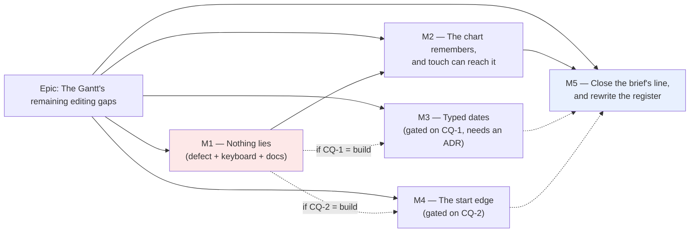

# Implementation Plan: The Gantt's remaining editing gaps

- **Feature spec:** [`./feature-spec.md`](./feature-spec.md) — **Approved** 2026-09-11, with CQ-1 answered BUILD (the typed-date cell, which needs its own ADR) and CQ-2 taking its written default (re-defer the start-edge resize).
  implementation`. The two files are one artefact and carry the same state.
- **Status:** Draft — awaiting approval before implementation
- **Owner:** — (unassigned; the product owner approves, then this is picked up)

---

> **What this plan is not.** It is not an epic. §1 of the spec finds that
> `PROJECT_BRIEF.md` §8's "edit supported" is **met**, that one of the three items the backlog names
> is already built, and that a second cites a closed debt row. What is genuinely owed is **one live
> defect**, **two documents that state something untrue**, and a short list of small independent
> items — plus two decisions that are the product owner's and nobody else's.
>
> **M1 is the whole of the urgent work and it is a day.** Everything after it is optional, sequenced
> so that stopping after any milestone leaves `main` releasable and the Gantt coherent — which is
> the constraint the predecessor epic accepted in place of a feature flag
> (`docs/specs/gantt-editing/feature-spec.md:379-381`) and which this plan inherits unchanged.

## Breakdown

### Epic

**The Gantt's remaining editing gaps** — close the dead ends left by ADR-0095, make the Gantt's
documented behaviour and its actual behaviour the same document, and settle whether
`PROJECT_BRIEF.md` §8's last Must-have is closed. Maps to the `S` row at `docs/BACKLOG.md:79-105`,
which this work also rewrites.

---

## Milestone 1 — Nothing in the Gantt lies

**Outcome:** no control in the Gantt accepts input it cannot use; every editable cell in a row is
reachable from the keyboard; and the shortcuts sheet lists what the Gantt actually binds.

**Entry point:** the Gantt grid. Two, both a planner presses today: **double-click a `Start` cell**
(accessible name `Start, <activity>`) — which after this milestone opens nothing and states a reason;
and **`F2` then `Tab`** on a focused row — which after this milestone reaches the `Duration` cell.

**Journey:** `apps/web/e2e-gantt-editing/grid-edit.spec.ts` gains two cases in the suite that already
has its own CI step — (a) a valid date typed into `Start` never produces
`That value is not something this cell accepts` (verified **red** against today's code first), and
(b) `F2` then `Tab` lands `document.activeElement` on the `Duration` input. Case (b) is the only
instrument in the repository that can answer the spec's open question §5.1, because the unit tier
runs in jsdom and jsdom's focus model is not the platform's.

---

#### Feature: M1-F1 — The date cells stop accepting input they refuse

> **Description:** `Start` and `Finish` cells render **read-only with an object reason** instead of
> opening an input whose every commit fails with `That value is not something this cell accepts`
> (`cell-commit.ts:87-93` → `:137-143`).
> **Complexity:** S
> **Dependencies:** —
> **Risks:**
> (a) Removing the map entries silently removes something else that reads them → the keys stay in
> `GanttCellKey` and in `GANTT_CELL_SCOPES`, which is where the scope decision lives; only
> `GANTT_EDITABLE_COLUMNS` changes, and `cell-edit.ts:238-244` already records that exact pattern
> for `percentComplete`, so this follows a precedent rather than inventing one.
> (b) The read-only branch is written as a **permission** reason rather than an **object** reason →
> it must land **above** the permission check in `ganttCellGate` (`cell-gate.ts:105-108` states the
> rule: a reason about the object is never masked by one about the reader), or a Viewer is told
> "your role cannot edit this" about a cell nobody can edit.
> **Testing requirements:** unit on the gate for the new branch across summary / milestone / task ×
> calculated / uncalculated × pen / no-pen; the journey case above, verified red first.

##### Task M1-T1 — Prove the defect, in a browser, before changing anything

- **Description:** add the failing journey case. It is written first so the fix has an oracle and so
  the claim in the spec is established by something that ran rather than by four files read
  together.
- **Complexity:** S
- **Dependencies:** —
- **Risks:** the case passes for the wrong reason (e.g. the cell never opens on the fixture because
  the plan is uncalculated) → the case asserts the input **opened** before it asserts the message,
  so a green run cannot mean "there was nothing to test" — the ADR-0093 pinned-positive rule.
- **Testing:** this task _is_ the test. Run it, confirm it is **red**, and record the exact message
  string in the case's docblock.
- **Development steps:**
  1. In `e2e-gantt-editing/grid-edit.spec.ts`, seed the existing `ganttPlan` fixture and recalculate.
  2. Double-click the `Start` cell of a task row; assert an `<input>` is present (the pinned
     positive).
  3. Type the value the cell was seeded with, press Enter, assert the refusal message appears.
  4. Run `scripts/e2e-local.sh web:gantt-editing`; record the red output in the commit message.

##### Task M1-T2 — Withdraw the two cells

- **Description:** the date columns become read-only cells with a reason.
- **Complexity:** S
- **Dependencies:** M1-T1
- **Risks:** the reason sentence tells a planner nothing to do next → it names both routes that
  work: moving the bar, and the activity editor's constraint field.
- **Testing:** gate unit matrix; M1-T1's journey case, now asserting the cell **does not open**
  rather than asserting a message.
- **Development steps:**
  1. Remove `earlyStart` / `earlyFinish` from `GANTT_EDITABLE_COLUMNS` (`cell-edit.ts:246-251`);
     replace the docblock's silence with the reason and with what would restore them (M3).
  2. Add the object branch to `ganttCellGate` above the permission return, with the sentence
     _"Dates are computed. Move the bar, or set a constraint in the activity editor."_
  3. Turn `cell-commit.ts:87-93`'s comment from a deferral naming a non-existent task (`M2-T3b`)
     into a statement of the current contract, citing this plan.
  4. Rewrite `cell-commit.test.ts:60-66`'s docblock: the assertion stays (it is right about the API
     contract), the sentence claiming the cell is offered until `M2-T3b` lands goes.
  5. Flip M1-T1's journey case to the post-fix assertion and confirm it fails against the pre-fix
     tree.

---

#### Feature: M1-F2 — The cell cursor

> **Description:** `Tab` / `Shift+Tab` inside an open cell commit **and move to the next / previous
> writable editable cell in the same row**, wrapping — the behaviour
> `docs/specs/gantt-editing/implementation-plan.md:829-833` approved and
> `PlanShortcutsHelp.tsx:138` already promises. Today `GanttCell.tsx:174-178` commits and lets
> native focus go wherever the platform sends it, and `onCellClosed` returns focus to the **row**
> (`plan-workspace-toolbar.tsx:889-891`).
> **Complexity:** M
> **Dependencies:** M1-F1 (the writable set changes, so the cursor must be written against the final
> set — writing it first would produce a cursor that walks through two cells that refuse everything)
> **Risks:**
> (a) **This changes a shared primitive's keyboard model**, which is CLAUDE.md §19.13 / ADR-0111:
> accessibility-reviewer and component-reviewer run **before merge**, not at a later gate pass. The
> rule exists because two such changes in two days passed every automated gate and were wrong, the
> second inside the fix for the first.
> (b) `preventDefault` on `Tab` is a focus **trap** if the cursor ever fails to place focus → the
> advance handler places focus or restores the row, never neither, and a unit case asserts the
> row-restore branch.
> (c) The reseed race (`docs/TECH_DEBT.md` #83) regresses → the cursor never touches the reducer's
> dirty logic; it calls `commit()` then `begin()`, both of which already exist.
> **Testing requirements:** unit on the pure cursor (wrap, single-element row, skip-read-only,
> committing-refuses); a component case for `preventDefault`; the journey case that reads
> `document.activeElement`.

##### Task M1-T3 — `cell-cursor.ts`, pure

- **Description:** a new pure module: given the visible columns, the gate resolver and the current
  key, return the next / previous **writable** editable key, wrapping within the row.
- **Complexity:** S
- **Dependencies:** M1-T2
- **Risks:** it re-derives the editable set instead of reading `GANTT_EDITABLE_COLUMNS` → it takes
  the same map the panel renders from, so a column added later cannot be visible-but-unreachable.
- **Testing:** unit only, no browser — the `cell-edit.ts` shape and the reason that file is pure.
- **Development steps:**
  1. `features/gantt/model/cell-cursor.ts`, no React and no DOM.
  2. Cases: two writable cells; one writable cell (wrap of a singleton is itself); a row whose only
     editable columns are read-only (returns `null`); a hidden column excluded from the walk.
  3. Docblock states the two rules a reader would otherwise have to infer: the walk is **within one
     row**, and it skips **read-only** cells rather than stopping at them.

##### Task M1-T4 — Wire `Tab` / `Shift+Tab`

- **Description:** `GanttCell` gains `onAdvance(direction)`; `GanttPanel` supplies it from the
  cursor and `editing.begin`.
- **Complexity:** M
- **Dependencies:** M1-T3
- **Risks:** the commit is asynchronous and the next cell opens before the write settles → `begin`
  is refused during `committing` by the reducer already (`cell-edit.ts:128-130`), so the advance
  must await the settle or explicitly restore the row; a unit case pins whichever is chosen.
- **Testing:** component cases for both directions, wrap, and the refusal-during-commit path.
- **Development steps:**
  1. Add `onAdvance` to `GanttGridEditing`'s consumer props; `GanttCell.tsx:174-178` calls it and
     `preventDefault`s.
  2. `GanttPanel` resolves the next key through `cell-cursor` and calls `editing.begin` with the
     seed read the same way `F2` reads it (`GanttPanel.tsx:892-895`) — one seeding rule, not two.
  3. Confirm `Enter` still commits **and returns focus to the row** (unchanged), and that `Escape`
     still discards — both are existing assertions that must pass untouched.
  4. **Run accessibility-reviewer and component-reviewer on the diff before opening the PR.**

##### Task M1-T5 — Journey: where focus actually goes

- **Description:** the case that answers the spec's §5.1.
- **Complexity:** S
- **Dependencies:** M1-T4
- **Risks:** asserting the DOM's text instead of focus → the assertion reads
  `document.activeElement`'s `aria-label`, which is `"<Column>, <activity>"`
  (`GanttPanel.tsx:1692`) and therefore names both axes.
- **Testing:** this task is the test.
- **Development steps:**
  1. `F2` on a task row; assert the active element is the `Activity` input.
  2. `Tab`; assert it is the `Duration` input.
  3. `Tab` again; assert it wraps to `Activity` (with the dates withdrawn by M1-F1, those two are
     the whole set — state that in the docblock so the case is not read as under-covering).
  4. Run it against the pre-M1-T4 tree and record what it reported. **Whatever that turns out to
     be, write it into the case's docblock** — if focus was already reaching the next cell, the
     spec's §5.1 candidate is withdrawn in place rather than quietly dropped.

---

#### Feature: M1-F3 — The shortcuts sheet says what the Gantt does

> **Description:** `PlanShortcutsHelp.tsx:128-142` gains the four bindings it omits and loses the
> one it describes wrongly.
> **Complexity:** S
> **Dependencies:** M1-F2 (so the `Tab` row is written once, describing the shipped behaviour)
> **Risks:** the sheet goes stale again → M1-T7 adds the cheapest gate that can catch it.
> **Testing requirements:** unit on the sheet's Gantt branch; a structural test pinning the
> keyboard-route claim that matters most.

##### Task M1-T6 — Correct and complete the Gantt list

- **Description:** the sheet's two Gantt arrays.
- **Complexity:** S
- **Dependencies:** M1-T4
- **Risks:** merging the two views' lists → deliberately not done;
  `PlanShortcutsHelp.tsx:110-113` records why (the views share key names and not meanings).
- **Testing:** unit assertions per added row.
- **Development steps:**
  1. Add `Shift+F10` · `Menu` — "Open this row's actions menu (Indent, Outdent, Insert)". This is
     the highest-value line in the milestone: ADR-0095 D7 records those three commands as existing
     **only** in that menu, and `GanttPanel.tsx:798-807` says without this binding they would be
     mouse-only (WCAG 2.1.1, Level A). The binding was built; nothing told anybody.
  2. Add `Enter` / `Space` on a row — "Select the activity" (`GanttPanel.tsx:1645`).
  3. Add undo/redo and copy/paste rows under the same flag conditions the diagram's list uses — the
     workspace key scope is bound at the workspace root and is live here
     (`plan-workspace-toolbar.tsx:839-851`).
  4. Correct the `Tab` row to what M1-F2 ships.

##### Task M1-T7 — A gate against the next drift

- **Description:** a structural test asserting the sheet's Gantt list names every key the Gantt
  panel's own handler claims, in both directions.
- **Complexity:** S
- **Dependencies:** M1-T6
- **Risks:** the test matches on prose and a docblock satisfies it → it strips comments before
  scanning, which is the fix four gates in this repository have already needed
  (ADR-0120, ADR-0106 M4).
- **Testing:** verified **red** against the pre-M1-T6 sheet, naming each missing key.
- **Development steps:**
  1. Derive the bound set from `GanttPanel.tsx`'s `onKeyDown` switch and its two guards.
  2. Assert every member appears in `GANTT_READ_SHORTCUTS ∪ GANTT_EDIT_SHORTCUTS`, and that the
     arrays name no key the handler does not bind.
  3. State the blind spot in the docblock: it proves the key is **named**, not that the description
     is true. That second half is a reviewer's job and the test must not imply otherwise.
  4. Cross-surface bindings (undo, copy) are asserted from the workspace key scope, or excluded by
     name with the reason — never silently.

---

## Milestone 2 — The chart remembers, and a thumb can reach it

**Outcome:** the dependency-arrows choice survives a reload and travels in a shared link, and the
Gantt is covered by the 44 × 44 coarse-pointer gate that already covers the deck, the header and the
Explorer.

**Entry point:** `View ▾ ▸ Structure ▸ Logic links` in the Gantt (accessible name `Logic links`) —
press it, reload, and the arrows are still there.

**Journey:** `apps/web/e2e-gantt-editing/view-state.spec.ts` gains a round-trip case beside the three
it already runs for sort, columns and the collapse set. The coarse half extends
`apps/web/e2e-workspace-fit/command-surface.spec.ts`'s existing coarse projection — **no new
Playwright config and no new CI step**, which is deliberate (spec §3 Infrastructure).

---

#### Feature: M2-F1 — The arrows toggle joins the view memory

> **Description:** `logicLinks` is plain `useState` (`use-tsld-canvas-ui-state.ts:180`) and is
> therefore forgotten on every reload and every plan switch — while sort, hidden columns and the
> collapse set are all URL-backed (`gantt-view-state.ts:98-102`). A planner who wants arrows
> re-presses the menu item every session.
> **Complexity:** M
> **Dependencies:** —
> **Risks:**
> (a) The canvas's lens state is deliberately unpersisted (`use-tsld-canvas-ui-state.ts:60-66`) and
> this must not change that → only `logicLinks` moves, and only because it is already **scoped to
> the Gantt** by `VIEW_SCOPED_TOGGLES` (`tsld-toolbar-items.tsx:489-491`). The rule to write down:
> a toggle that belongs to one view joins that view's memory; a toggle that belongs to the diagram's
> live lens stays where it is.
> (b) The `''` trap — `useUrlFilterState` deletes a param whose value is `''`, which is how
> "hide nothing" became unrepresentable and cost `HIDE_NOTHING` (`gantt-view-state.ts:73-86`) → the
> encoding is `glinks=on` / absent, never a boolean, and a journey drives the round trip because
> the unit tier hands the parser a literal and never crosses the hook that deletes it.
> **Testing requirements:** unit on the parser (total, permissive, default off); the journey round
> trip; a flag-off-style parity assertion that an untouched chart writes **no** parameter.

##### Task M2-T1 — The parameter

- **Complexity:** S · **Dependencies:** — · **Risks:** a fourth param widens the URL past what
  browsers carry → it is three characters plus a value; the collapse-set cap
  (`gantt-view-state.ts:88-89`) is what bounds URL length and is untouched.
- **Testing:** unit per parser rule, including a garbage value landing on a working chart.
- **Steps:** add `glinks` to `GANTT_VIEW_PARAMS`; a total parser defaulting **off**; the serialiser;
  the entry in `GANTT_VIEW_DEFAULTS` so an untouched chart omits it.

##### Task M2-T2 — Route it through the toggle

- **Complexity:** M · **Dependencies:** M2-T1 · **Risks:** two sources of truth — the URL and the
  `useState` — disagreeing → the Gantt reads the URL and the diagram continues to read the
  in-memory toggle it ignores anyway; one value reaches `GanttPanel`'s `showAllLinks`
  (`plan-workspace-toolbar.tsx:1266`), never two.
- **Testing:** unit that the diagram is unaffected; the journey.
- **Steps:** wire; assert `VIEW_SCOPED_TOGGLES` still scopes the menu item to `'gantt'`; add the
  round-trip journey case.

---

#### Feature: M2-F2 — The Gantt joins the coarse-pointer gate

> **Description:** `command-surface.spec.ts:881-892` lists three coarse surfaces and the Gantt is
> not one, though the **fine** 24 × 24 sweep does cover the treegrid (`:747-791`) and the Gantt
> object bar (`:807-831`). Separately the sweep's element list (`:102-108`) cannot see the Gantt's
> bar or its `w-2 h-3.5` finish-edge handle, both `aria-hidden` ``s carrying `onPointerDown`
> (`GanttPanel.tsx:1852-1867`, `:1912-1919`).
> **Complexity:** M
> **Dependencies:** —
> **Risks:**
> (a) The sweep goes red on day one and gets deleted rather than fixed (ADR-0058) → **run it
> report-only first**, count the findings, and only then decide between fixing them and naming
> exceptions. The Explorer tree is the precedent: excluded by an **ancestor selector with its reason
> written beside it** (`command-surface.spec.ts:894-912`), never by a size threshold.
> (b) The bar and the handle are swept and reported as failures when they may be lawfully exempt →
> **accessibility-reviewer rules on them before the assertion is written.** The spec deliberately
> records this as a candidate, not a violation; the register has overstated an SC citation once
> (ADR-0082) and this plan does not repeat it.
> **Testing requirements:** the extended sweep with a pinned positive floor per surface, verified
> red by shrinking one Gantt control.

##### Task M2-T3 — Measure before asserting

- **Complexity:** S · **Dependencies:** — · **Risks:** reasoning about box sizes instead of reading
  them → the run reports every control with its measured box, which is what the sweep's `hitBy`
  field exists for (`command-surface.spec.ts:52-58`).
- **Testing:** none yet; this task produces the number.
- **Steps:** add the Gantt treegrid and the Gantt object bar to `COARSE_SURFACES` behind a
  report-only run at all four `COARSE_WIDTHS`; record what fails and by how much; put it to
  accessibility-reviewer with the numbers.

##### Task M2-T4 — Fix, or name the exception

- **Complexity:** M · **Dependencies:** M2-T3 · **Risks:** growing a row's controls changes
  `GANTT_ROW_HEIGHT`, which is a **JavaScript constant** feeding both the row style and the
  virtualizer's `estimateSize` (`GanttPanel.tsx:69-81`) — the identical constraint that made the
  Explorer tree a named exception (`docs/TECH_DEBT.md` #215) → if the row rhythm is the blocker, the
  outcome is an exception with that reason and a debt row, **not** a threshold relaxation.
- **Testing:** the assertion, verified red.
- **Steps:** fold whatever the review says is blocking; write the exceptions with their reasons into
  `EXEMPT_WITHIN`'s docblock beside the two already there; arm the assertion; confirm the pinned
  positives still fail on an empty surface.

##### Task M2-T5 — Drive the pointer gestures

- **Complexity:** S · **Dependencies:** — · **Risks:** none material; this is pure coverage.
- **Testing:** this task is the test.
- **Steps:** `bar-drag.spec.ts:219-233` asserts the resize handle is **present and non-zero** and
  never drags it, and no journey drags a bar either. Add both: drag the bar and assert the API
  stored a new start; drag the handle and assert the API stored a new duration. This is the pair
  ADR-0095 D4's own risk section calls the half only a real server can show.

---

## Milestone 3 — A typed date pins an activity _(gated on CQ-1; needs an ADR)_

**Outcome:** a planner types a date into `Start` or `Finish` and the activity is pinned there, with
a once-per-session explanation of what just happened and an undo entry.

**Entry point:** the Gantt grid — double-click a `Start` cell (accessible name `Start, <activity>`),
type a date, press Enter.

**Journey:** `e2e-gantt-editing/grid-edit.spec.ts` gains two cases, in the shape the suite already
uses for durations: type a date in **EARLY** and read back an `SNET` at that date from the API; type
one in **VISUAL** and read back `visualStart` with **no** constraint. That second case matters
disproportionately — `e2e-gantt-editing/bar-drag.spec.ts:157` is one of only a handful of journeys in
the repository that runs in Visual mode at all, and ADR-0092 records the consequence of that gap
being the exact place a defect was hiding.

> **Do not start this milestone until CQ-1 is answered.** If the answer is "leave it", M1-F1 was the
> whole fix and this milestone is deleted rather than deferred — a deferral is work still owed
> (ADR-0092's rule), and this would not be.

---

#### Feature: M3-F1 — The ADR

> **Description:** "typing into a computed column writes a constraint" is a schedule semantic, not a
> UI repair. ADR-0052 §3 made the equivalent decision for the canvas drag and it needed an ADR then.
> **Complexity:** S
> **Dependencies:** CQ-1 answered "build"
> **Risks:** the number is taken between drafting and filing → check `docs/adr/` at filing time;
> ADR-0079 was filed as 0079 rather than the 0078 its own plan named, and ADR-0071 was never filed
> at all.
> **Testing requirements:** `pnpm check:adr-coverage` (which now checks the index in both
> directions — ADR-0110 D6) and `pnpm check:spec-status`.

##### Task M3-T1 — Write and file it

- **Complexity:** S · **Dependencies:** — · **Risks:** it asserts what the canvas does without
  reading it → every claim about the drag's semantics cites
  `use-plan-workspace-model.ts:1179-1213` by line.
- **Testing:** the two gates above; `pnpm prepush` (one command — running its parts by hand is how
  `check:adr-coverage` was missed once, in a change whose subject was filing an ADR).
- **Steps:** state the decision, the two mode branches, the note, what is refused (`MANDATORY_*` is
  not writable from a cell), and the parity sentence in its honest form — the CPM engine is not
  imported and no migration runs, so there is nothing here to hold parity _for_.

#### Feature: M3-F2 — The write

> **Description:** `cellWriteFields` returns a constraint fragment for the date keys instead of
> `null`.
> **Complexity:** M
> **Dependencies:** M3-F1
> **Risks:**
> (a) A second date parser drifts from the cell's formatter → the parse reuses `grid-columns.ts`'s
> formatter's inverse, so the seed round-trips by construction. Two implementations of "what does
> this date string mean" is the ADR-0065 `routeOrthogonal` argument, and the drift would be
> invisible because each side looks right alone.
> (b) It PATCHes `earlyStart` → `cell-commit.ts:89-92` is **right** about this and its assertion at
> `cell-commit.test.ts:60-66` is kept, rewritten to assert the constraint fragment rather than
> `null`.
> (c) The mode is read from a second source → it comes from the same `barDateSource` / scheduling
> mode the host already resolves and hands the panel (`plan-workspace-toolbar.tsx:1252`).
> **Testing requirements:** unit per mode and per key; the two journey cases.

##### Task M3-T2 — Parse and build the fragment

- **Complexity:** M · **Dependencies:** M3-T1 · **Risks:** as above.
- **Testing:** unit: EARLY `Start` → `SNET`; EARLY `Finish` → `FNET`; VISUAL `Start` →
  `visualStart` with no constraint; unparseable → a **named** error, not the generic sentence.
- **Steps:** widen `cellWriteFields`' signature to take the mode; the four branches; delete the
  generic-refusal path for these keys.

##### Task M3-T3 — Restore the cells

- **Complexity:** S · **Dependencies:** M3-T2 · **Risks:** the cells come back before the write
  works → this task lands **after** M3-T2 in the same PR, never before it; that ordering is the
  whole lesson of M1-F1.
- **Testing:** the gate matrix from M1-T2, inverted for the writable case.
- **Steps:** restore the two entries to `GANTT_EDITABLE_COLUMNS`; delete M1-F1's read-only branch;
  extend `cell-cursor`'s walk (it reads the map, so this is automatic — assert it).

#### Feature: M3-F3 — The one-per-session note

> **Description:** the note `docs/specs/gantt-editing/implementation-plan.md:369` specified, which
> two shipped docblocks describe as existing (`bar-annotations.ts:13`,
> `token-contrast.test.ts:194`) and which a search of `apps/web/src` shows **does not**.
> **Complexity:** S
> **Dependencies:** M3-F2
> **Risks:** a **second** live region → it routes through the shared polite channel, and the
> predecessor plan already wrote down why (`implementation-plan.md:848-858`): this repository has
> shipped announcement-overwrite defects twice, and the note fires exactly as a coalesced
> recalculation starts its own state changes.
> **Testing requirements:** a race case — the note and the commit's own announcement must not
> overwrite each other; a case that the second write in a session is silent.

##### Task M3-T4 — Build it, and fix the two docblocks

- **Complexity:** S · **Dependencies:** M3-T2 · **Risks:** the "session" boundary is undefined →
  it is the plan-workspace mount, stated in the hook's docblock.
- **Testing:** as above.
- **Steps:** the hook; the wording (reviewed by ux-reviewer); **and** correct
  `bar-annotations.ts:13` and `token-contrast.test.ts:194`, which have described this as shipped
  since M5.

---

## Milestone 4 — The start edge _(gated on CQ-2)_

**Outcome:** a planner drags a bar's left end in the Gantt to move its start while keeping its
finish, as they can on the diagram.

**Entry point:** the Gantt chart — press and drag the **left** end of any task bar; and its keyboard
equivalent on the focused row.

**Journey:** `e2e-gantt-editing/bar-drag.spec.ts` gains an EARLY case and a VISUAL case, matching
the two the finish edge should already have had (M2-T5).

> **Do not start this milestone until CQ-2 is answered.** The spec establishes that the deferral's
> stated reason does not discriminate — it forbids equally the bar **move** that shipped in M3 — so
> the deferral is **undecided**, not decided. Building it on the strength of a debunked objection is
> as wrong as leaving it deferred on one.

---

#### Feature: M4-F1 — The keyboard equivalent, first

> **Description:** ADR-0095 D4's rule, verbatim: the keyboard equivalent lands **before** the
> pointer gesture, _"so there was no window in which the feature existed for some planners and not
> others"_.
> **Complexity:** M
> **Dependencies:** CQ-2 answered "build"
> **Risks:**
> (a) **A chord collision.** The row handler already binds `Alt+←/→` (move) and `Shift+←/→`
> (duration) at `GanttPanel.tsx:848-866`; bare `←/→` are treegrid disclosure. `Alt+Shift+←/→` is the
> candidate and it is **not** what the canvas uses — so ADR-0095 D4's "a planner learns one chord,
> not two" argument does **not** transfer, and this task either re-makes it or concedes it in
> writing.
> (b) This changes a shared surface's keyboard model → **§19.13 again**: accessibility-reviewer and
> component-reviewer before merge.
> **Testing requirements:** unit per gate branch (summary refuses, milestone refuses, no-pen
> refuses, each with a spoken reason — `bar-drag.ts:63-70`'s rule); the journey.

##### Task M4-T1 — Settle the chord

- **Complexity:** S · **Dependencies:** — · **Risks:** deciding it in code → it is decided in
  writing, in this plan, with the collision table and the reviewers' answer, before anything is
  bound.
- **Testing:** none; this task produces a decision.
- **Steps:** enumerate every chord the Gantt row handler and the workspace key scope bind; propose;
  review; record.

##### Task M4-T2 — Bind it

- **Complexity:** M · **Dependencies:** M4-T1 · **Risks:** it moves the start **and** the finish →
  the write is `onTsldResize({ activityId, durationDays, startDay })` and the duration is derived so
  the finish is unchanged, which is what the canvas does (`TsldPanel.tsx:2415-2432`).
- **Testing:** unit; the two journey cases.
- **Steps:** a `resizeStartBar` beside `resizeBar` (`GanttPanel.tsx:773-793`), sharing
  `barMoveGate`; the announcement wording copied **verbatim** from `TsldPanel.tsx:2445-2449`, so the
  same operation reads the same in both views.

#### Feature: M4-F2 — The left grab zone

> **Description:** the mirror of `GanttPanel.tsx:1912-1919`.
> **Complexity:** S
> **Dependencies:** M4-F1
> **Risks:** the two zones overlap on a very short bar → the same 8 px straddle the finish edge uses,
> with an explicit rule for a bar narrower than 16 px (the move gesture wins; a bar that short cannot
> be resized by pointer and `Alt+Shift+←/→` is the route).
> **Testing requirements:** component case for the zone's presence per activity type; the journey
> drags it.

##### Task M4-T3 — Add it

- **Complexity:** S · **Dependencies:** M4-T2 · **Risks:** it renders on a summary or a milestone →
  the same `moveGate?.movable === true && !geometry.milestone` condition the finish handle uses.
- **Testing:** as above.
- **Steps:** the ``; reuse `useBarPointerDrag`; feed `startDayAtChartX` (`drag-day.ts`, already
  used by the move path) for the new start and derive the duration to hold the finish.

---

## Milestone 5 — Close the brief's line, and rewrite the register

**Outcome:** `PROJECT_BRIEF.md` §8's Gantt Must-have is closed with its evidence written down, or its
one remaining condition is a sentence somebody can act on. Every document this work found wrong is
corrected in the same change.

**Ships dark:** nothing user-facing. This milestone is documents and gates only.

---

#### Feature: M5-F1 — The documents

> **Description:** six corrections, each citing the line that established it.
> **Complexity:** S
> **Dependencies:** M1 (M2–M4 change the wording, not whether it happens)
> **Risks:** correcting the backlog row from this spec rather than from the code → each claim is
> re-verified at the time of writing, because this spec will itself be weeks old by then and
> `docs/BACKLOG.md:133-137` records that exact failure mode five times over.
> **Testing requirements:** `pnpm check:counts`, `pnpm check:debt-status`, `pnpm check:doc-links`,
> `pnpm check:spec-status`, `pnpm check:adr-coverage` — via `pnpm prepush`, as one command.

##### Task M5-T1 — Correct what is wrong

- **Complexity:** S · **Dependencies:** M1 · **Risks:** as above.
- **Testing:** the gates above.
- **Steps:**
  1. `gantt-view-state.ts:37-41` — the grid **is** resizable and its width **is** remembered
     (`localStorage`, `schedulepoint:gantt-grid-width`). Replace the stale reason with what is true,
     and with why `localStorage` rather than the URL is the right home for it.
  2. `docs/BACKLOG.md:79-105` — rewrite from the code. The grid-width clause goes; the `#133`
     citation goes (that row is **closed**, `docs/TECH_DEBT.md:4791`, and was about the command
     strip); the start-edge clause becomes whatever CQ-2 decided; and the items §1 Q1-c found are
     added or filed.
  3. `bar-annotations.ts:13` and `token-contrast.test.ts:194` — if M3 did not ship, these describe a
     note that does not exist and must say so.
  4. `docs/TECH_DEBT.md` — new rows for whatever is left: `% complete` has no grid cell
     (`cell-edit.ts:238-244`); the Gantt has no `visualConflict` cue; and any coarse exception M2-T4
     named. Each with a **status**, because `check:debt-status` refuses a row without one.

##### Task M5-T2 — Close §8, or name what is left

- **Complexity:** S · **Dependencies:** M5-T1 · **Risks:** closing it on assertion → the closure
  quotes `PROJECT_BRIEF.md:74` in full, lists what the Gantt supports against it, and states the
  residual (no Visual-mode cues, no plural selection) as **separate work rather than an unmet
  requirement**.
- **Testing:** the gates; `pnpm check:counts` in particular, because `CLAUDE.md`'s banner is one of
  the files this touches.
- **Steps:**
  1. Annotate `PROJECT_BRIEF.md` §8's Gantt line the way its Should-have neighbours are annotated
     (`:92-94` is the pattern).
  2. Correct `CLAUDE.md`'s ADR-0095 paragraph, which currently ends _"is still called
     **substantially** met rather than closed"_ on two grounds this spec finds do not support it.
     ADRs are immutable, so ADR-0095's own sentence is **superseded by a statement in the new ADR**,
     not edited.
  3. Add the closure's evidence to whichever ADR files this work.

---

## Sequencing & slices

| Order | Slice                            | Ships alone? | Releasable `main`?                                                            |
| ----- | -------------------------------- | ------------ | ----------------------------------------------------------------------------- |
| 1     | **M1** — nothing lies            | **Yes**      | Yes. It removes a broken path and completes an approved keyboard contract.    |
| 2     | **M2** — memory + touch          | Yes          | Yes. Independent of M1 in principle; sequenced after it because M1 is urgent. |
| 3     | **M3** — typed dates _(CQ-1)_    | Yes          | Yes. Restores what M1 withdrew, this time working.                            |
| 4     | **M4** — the start edge _(CQ-2)_ | Yes          | Yes. Keyboard first, then the gesture — never the other way round.            |
| 5     | **M5** — documents               | Yes          | Yes.                                                                          |

**M1 can ship on its own and probably should**, before either decision comes back. It is the only
slice with a live defect behind it.

**No feature flag.** ADR-0088 D1 established that a `VITE_` constant is inlined at build time and
has never been an operator rollback; the rollback is a commit boundary. M1 is additionally the
removal of a path that does not work, which nobody would want back.

**The inherited merge constraint.** Every milestone here obeys the predecessor epic's blockquote —
_"No milestone may merge with an affordance that is visible and inert, a control whose write path is
half-built, or a gesture with no undo"_ (`docs/specs/gantt-editing/feature-spec.md:379-381`). That
constraint is why M1 exists: it is the rule this work is repairing a breach of, so breaching it
again would be the register's favourite shape.

**Journeys land with the first user-facing milestone, not at the end** (ADR-0081 §2). M1-T1's case
is written **before** the fix, red, which is stronger than the rule requires.

## Definition of Done (per task)

Each task's PR must satisfy the Feature Completion Criteria in
[`docs/PROCESS.md`](../../PROCESS.md). Three of them are worth restating because this plan's shape
makes them easy to skip:

- **The pre-push gate is one command** — `pnpm prepush` — plus
  `scripts/e2e-local.sh web:gantt-editing` for M1/M3/M4 and
  `scripts/e2e-local.sh web:workspace-fit` for M2. Running the parts by hand is how a documented
  gate gets missed (CLAUDE.md §19.8). **`scripts/e2e-local.sh web` (the base journey) runs too
  whenever a screen changes** — ADR-0096 records that suite being the one thing the documented
  pre-push gate could not run, for a mapping bug.
- **§19.13's pre-merge review is not optional** for M1-T4 and M4-T2. Both change a shared
  primitive's keyboard model, and both are exactly the class ADR-0111 was written about.
- **Every gate this work adds is verified red first** against a named mutation (ADR-0110 D5). A gate
  that has never been made to fail by the defect it was written for is not finished.

## Risks & assumptions (rollup)

| Risk / assumption                                                                         | Likelihood | Impact | Mitigation                                                                                                                                                      |
| ----------------------------------------------------------------------------------------- | ---------- | ------ | --------------------------------------------------------------------------------------------------------------------------------------------------------------- |
| **The `Tab` focus destination turns out to be fine already**, and §1 Q1-c G3 is withdrawn | low        | low    | M1-T5 runs against the **pre-fix** tree and records what it found. A withdrawn claim is written into the case's docblock, not deleted (the register's rule).    |
| M1-T4's `preventDefault` creates a focus trap when the cursor returns `null`              | med        | high   | The advance handler places focus or restores the row, never neither; a unit case pins the `null` branch; §19.13 review before merge.                            |
| M2-T3's report-only run produces so many findings the gate is abandoned                   | med        | med    | ADR-0058's rule is the plan: measure, then choose between fixing and naming exceptions **with reasons**. The Explorer tree is the worked precedent.             |
| M2 grows the URL past what proxies carry                                                  | low        | low    | Three characters plus a value. The collapse-set cap is what bounds URL length and is untouched.                                                                 |
| M3 writes a constraint a planner did not intend, and does not notice                      | med        | high   | The one-per-session note **is** this mitigation, plus one undo entry per commit and the constraint badge already on the bar (`bar-annotations.ts:54-65`).       |
| M3's date parser drifts from the cell's formatter                                         | med        | high   | One implementation, the formatter's inverse. Two would drift invisibly (the ADR-0065 argument).                                                                 |
| M4's chord collides with a shipped binding                                                | med        | high   | M4-T1 settles it in writing before anything is bound, with the full collision table. ADR-0095 D4 records the identical near-miss on bare arrows.                |
| A milestone quietly needs a new Playwright config or CI step                              | low        | med    | That fires an ADR-0105 trigger. The milestone **stops** and the plan is amended — it does not proceed on the grounds of being small.                            |
| The register is corrected from this spec rather than from the code, weeks later           | **high**   | med    | M5-T1 re-verifies every claim at the time of writing. This is the failure `docs/BACKLOG.md:133-137` records five times; assume it will happen unless prevented. |
| **Assumption:** no schema change, so `database-architect` is not engaged                  | —          | high   | Confirmed against the whole design: no model, column, index, constraint or migration. If any milestone finds otherwise it stops and the agent runs (§19.3).     |
| **Assumption:** the arrows' unmeasured SVG paint cost stays irrelevant                    | —          | med    | True only while the default stays off. If it flips, `link-density.spec.ts:36-39`'s deliberately-declined render measurement becomes a prerequisite.             |
