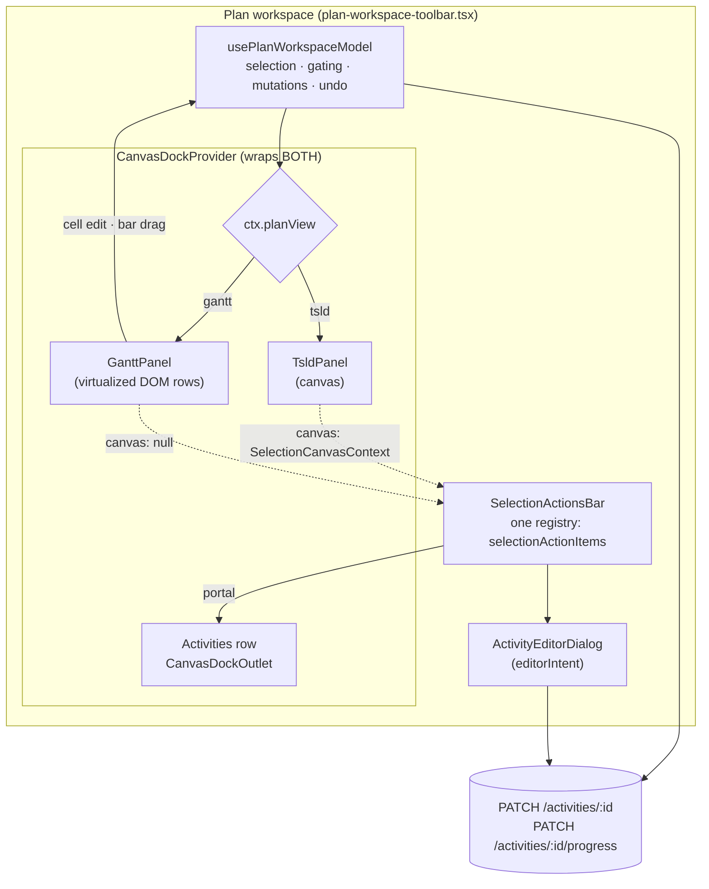
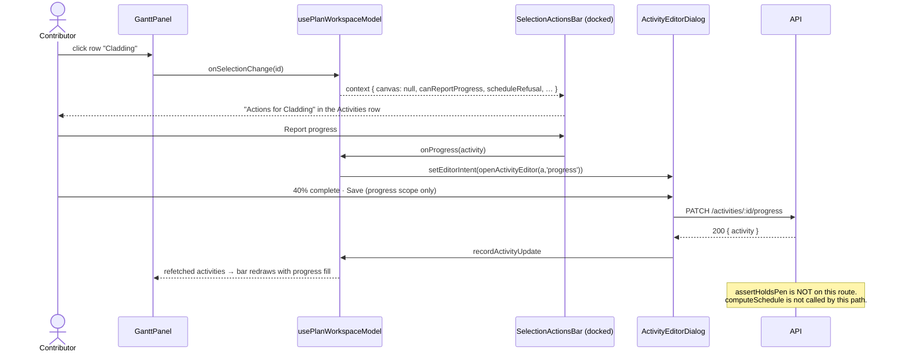
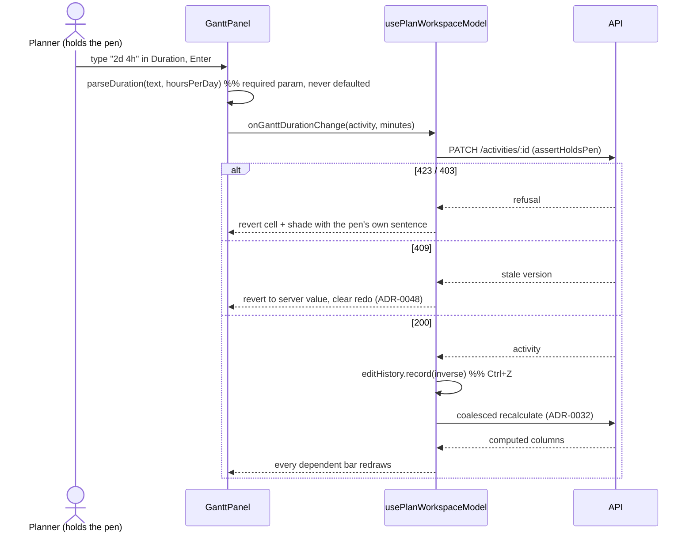
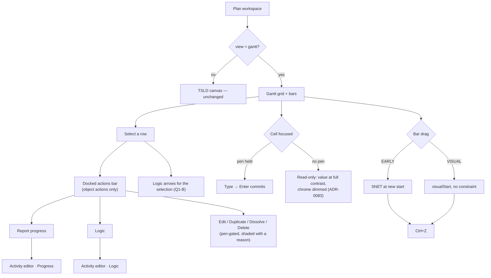

# Feature Spec: Gantt editing — the Gantt as a working surface

- **Status:** **Draft — awaiting approval.** Four CRITICAL questions in §1 change the design or the
  scope; defaults are stated for everything else.
- **Author(s):** Feature Analyst (Product Owner / Solution Architect / Technical Lead hats)
- **Date:** 2026-08-17
- **Tracking issue / epic:** —
- **Roadmap link:** [`PROJECT_BRIEF.md`](../../PROJECT_BRIEF.md) §8 — the last open Must-have;
  [`BACKLOG.md`](../../BACKLOG.md) — "Gantt dependency arrows and Gantt editing"
- **Related ADR(s):** proposes **ADR-0095** _(number to be confirmed at filing — ADR-0079 was filed
  as 0079 rather than the 0078 its own plan named, because the number was taken between the plan and
  the milestone; ADR-0071 was never filed at all)_. Amends **ADR-0059 §4** (the first ship is
  read-only, with no dependency arrows). Builds on ADR-0025, ADR-0028, ADR-0033, ADR-0038, ADR-0048,
  ADR-0052, ADR-0060, ADR-0062, ADR-0063, ADR-0081, ADR-0082, ADR-0088, ADR-0090–ADR-0094.

---

## 0. What this spec establishes before it argues anything

Every claim below that decides something names what was **read or run** to establish it
(ADR-0076 / `PROCESS.md` "Decision-bearing claims carry their evidence"). Claims marked
**[READ, NOT RUN]** were established by reading code and have **not** been driven in a browser;
M0-T1 exists to run them. Claims marked **[UNMEASURED]** are stated as unknowns, not as figures.

Six findings from that reading change the shape of this epic. They are here rather than buried in
§3 because three of them contradict the brief this spec was written from — which is exactly the
failure `PROCESS.md` records twice ("the brief is not evidence").

### F1 — The dock is already view-agnostic. Only its producer is canvas-only.

`plan-workspace-toolbar.tsx:997` mounts `CanvasDockProvider` around **both** the surface (`:1008`,
`:1110`) and the activities row that renders the outlet (`ActivityPanelCollapsedBar:1014`,
`ActivityBottomPanel:1028`). Those two render regardless of which surface is showing. So in the
Gantt the dock row **already exists and is empty** — the same 36 px strip with a word at one end and
a button at the other that ADR-0092 D2 measured for the canvas.

What is canvas-only is the **producer**: `TsldPanel.tsx:2522-2524` renders
`<SelectionActionsBar>` inside `<CanvasDock>`, and `TsldPanel` does not mount in the Gantt
(`plan-workspace-toolbar.tsx:598-642` — `surface = ctx.planView === 'gantt' ? <GanttPanel/> : canvas`).

**Consequence:** ADR-0093 Option C ("lift the object half of the dock bar to workspace level so it
serves both views… an epic, not a milestone") is **much smaller than that ADR estimated**, because
the split it said would be needed has already been made.

### F2 — The bar's canvas/object split is already expressed in the type system.

`selection-actions.tsx:197-200`:

```ts
export type SelectionBarContext = SelectionActionContext & {
  canvas: SelectionCanvasContext | null;
};
```

and both canvas-only items are gated `isVisible: (ctx) => ctx.canvas !== null` (`:730`, `:745`).
The type's own docblock says: _"the Gantt renders no selection bar today, but `TsldPanel` is not the
only conceivable host… `canvas === null` is the whole statement."_

ADR-0093 Option C said the lift "means splitting the bar". It does not. The bar is split; a host
that passes `canvas: null` gets the object actions and nothing else, by construction.

### F3 — A Gantt row click writes state that, with shipped flag defaults, opens nothing.

`plan-workspace-toolbar.tsx:618-621` calls `model.onSelectionChange(activity.id)` **and**
`model.setLogicActivity(activity)`. `setLogicActivity` (`use-plan-workspace-model.ts:209-212`) is
the raw state setter, not the `onOpenLogic` entry point (`:255-261`) that branches on
`ACTIVITY_EDITOR_CONVERGENCE_ENABLED`. And `plan-dialogs.tsx:54` mounts the legacy `DependencyEditor`
**only when that flag is off** — it is default-on (ADR-0062).

So with the shipped defaults the write's only surviving consumer is the selection fallback at
`plan-workspace-toolbar.tsx:622`. This is not a defect — nothing wrong appears on screen — but it
means **the Gantt row click selects, and does nothing else.** The file's own comment above it
("choosing a row here opens the same Logic panel the canvas opens", `:583-584`) describes a world
the convergence flag ended. **[READ, NOT RUN]**

### F4 — The inherited requirement's premise is wrong in the register, and it does not matter as much as it looks.

`BACKLOG.md:35-36` states that "a Contributor in the Gantt reaches progress only through the
activities-table row menu". The task brief for this spec repeats it. **It is not what the code
says.**

`add-note` (`tsld-toolbar-items.tsx:2425-2441`) is enabled on `canWriteNotes && selectedActivity != null`
— role-gated to Contributor upward, **not** pen-gated, and with **no view gate at all**. Its
`onActivate` calls `ctx.openActivityNotes()` → `revealActivityNotes`
(`use-plan-workspace-model.ts:267-274`), which with the convergence flag on opens
`setEditorIntent(openActivityEditor(activity, 'notes'))` — the **tabbed activity editor**
(`activity-crud-dialogs.tsx:138-155`). That editor carries the Progress tab.

So a Contributor in the Gantt today can reach progress reporting: select a row, press a button
labelled **Add note**, and change tab. **[READ, NOT RUN — every link in the chain read; the chain
has not been driven, and whether `add-note` is inline or demoted into the `⋯` at 1646 px is
unmeasured. M0-T1 runs it.]**

**This does not weaken the requirement; it re-frames it.** A capability reachable only through a
control named after something else, via a tab the reader has to guess is there, is not reachable in
any sense that matters — it is the ADR-0081 shape one step short of dead code. But M1's honest claim
is "give an existing capability an entry point that says what it is", not "restore a lost
capability", and the journey must assert the former. Recording the correction rather than stepping
over it is the ADR-0071 lesson.

### F5 — A Gantt bar drag is a call to an existing workspace function, not a new write path.

`use-plan-workspace-model.ts:956-1002` — `onTsldReposition({ activityId, startDay, laneIndex })`
already handles `laneIndex === undefined` with `startDay` present: it takes the "day changed" branch
(`:996`) and leaves the lane alone. That branch already carries the Early/Visual split
(`:1005-1026`: VISUAL writes `visualStart`; EARLY writes an SNET at the new start), the ADR-0048
undo command, the pen-rejection path (`:988`), the 409 path (`:989-991`) and the recalc notify.

**A horizontal-only bar drag in the Gantt is `onTsldReposition({ activityId, startDay })`.** There
is no new mutation, no new semantic and no new engine input — it is the same PATCH the canvas
already sends. The only new code is the pixel→day conversion, and the Gantt's chart anchor
(`chartAnchor(span)`) differs from the `plannedStart` origin `onTsldReposition` expects
(`:1003`), so that conversion must be derived once and shared, never written twice.

### F6 — The Gantt has no Duration column.

`grid-columns.ts:31-50` — `GANTT_COLUMNS` is Code / Activity / Start / Finish / Float. `duration`
exists as a **sort key** (`row-model.ts:11-12`) with no column to sort. Duration is the single field
a P6 or Powerproject planner types most often, and the one field that is not on this grid.

---

## 1. Business understanding

### Problem

The product owner's requirement, verbatim:

> "for the gantt it needs to be comparable to P6 / Power Project in terms of usability"

Three independent drivers converge on it, and they are **not** the same driver:

1. **It is the brief's last open Must-have.** [`PROJECT_BRIEF.md`](../../PROJECT_BRIEF.md) §8 words
   it "Gantt view as an alternate projection of the same data (read-primary; **edit supported**)",
   and §11 spells the functional requirement out: _"**Gantt view — secondary:** tabular list + bars;
   sortable; **editable duration and dates**; same underlying model."_ ADR-0059 shipped the view
   read-only (§4) and deferred editing as its M5. Every other Must-have is closed.
   **Note what §11 does and does not name:** duration and dates. It does **not** name dependency
   arrows, link creation, or a spreadsheet of arbitrary columns. That is evidence about the bar, and
   it was read rather than assumed.
2. **An inherited requirement with a date on it.** ADR-0093 (2026-08-13) removed `Report progress`
   from the command surface on the discriminator "an object action belongs on the object"; its
   replacement — the canvas dock — is canvas-only. The product owner accepted that cost **explicitly
   on the basis that progress reporting from a Gantt selection is picked up here** (ADR-0093 D5,
   recorded in `BACKLOG.md:30-36`). See **F4**: the premise recorded there is inaccurate, the
   requirement stands, and discharging it is scheduled first.
3. **Dependency arrows are contested and gated.** `BACKLOG.md:24-29` gates arrows and general
   editing on "evidence of use, not before — that gate is the point". ADR-0059 §4 excludes arrows
   because "arbitrary link routing is the very thing that forced canvas on the TSLD — drawing them
   would drag the rejected substrate back in through the side door". **This spec does not resolve
   that quietly.** It is CRITICAL question **Q1**, with options and costs, and §4 argues that
   ADR-0059 §4 conflated two separable questions (_should logic be visible?_ and _must it be drawn
   on canvas?_).

Underneath all three is the thing a planner actually feels. Today the Gantt is a **picture of a
schedule you cannot touch**: selecting a row does nothing visible (**F3**), the one column a planner
types most is absent (**F6**), and the only route to the editor is a button named for notes
(**F4**). It is an excellent read-only projection and a dead end as a working surface.

### What "comparable to P6 / Powerproject in terms of usability" is taken to mean

The requirement is decomposed into ten named behaviours, each **adopted** or **declined with a
reason**. This is the requirement made testable; it is not a feature-count exercise, and no
behaviour is adopted because P6 has it.

The two tools disagree with each other, which is itself useful. **P6**'s Activities view is a
spreadsheet with bars attached — the table is primary, in-cell editing is the main verb, and
relationship lines are a **toggle** most planners keep off because a full link set on a bar chart is
unreadable. **Powerproject** is bar-first — you draw and drag on the chart, and links are shown by
default. "Comparable to both" therefore cannot mean "copy either". It means: **the table is a real
spreadsheet, the bars are really draggable, the object's actions are on the object, and logic is
legible on demand.**

| #      | Behaviour                                                                                     | Verdict                    | Reason                                                                                                                                                                                                                                                                                                                          |
| ------ | --------------------------------------------------------------------------------------------- | -------------------------- | ------------------------------------------------------------------------------------------------------------------------------------------------------------------------------------------------------------------------------------------------------------------------------------------------------------------------------- |
| **B1** | The table is a working spreadsheet: chosen columns, in-cell editing, keyboard cell navigation | **Adopt** (M2, M5)         | The brief's §11 "editable duration and dates" is exactly this. A Duration column does not exist today (**F6**).                                                                                                                                                                                                                 |
| **B2** | Bars are directly manipulable — move, resize either end                                       | **Adopt** (M3)             | §11's "dates". Costs almost nothing: it is an existing workspace call (**F5**).                                                                                                                                                                                                                                                 |
| **B3** | Every object action is on the object — the selected row offers what the selected bar offers   | **Adopt** (M1)             | ADR-0093 D1's own discriminator, applied to the view that decision left behind.                                                                                                                                                                                                                                                 |
| **B4** | Progress reporting from the chart                                                             | **Adopt** (M1)             | The inherited requirement. Falls out of B3 — `progress` is already a dock item (`selection-actions.tsx:494-508`).                                                                                                                                                                                                               |
| **B5** | Logic is **visible** on the chart                                                             | **CRITICAL — Q1**          | Both tools show links; they disagree about the default. §4 separates "visible" from "on canvas".                                                                                                                                                                                                                                |
| **B6** | Logic is **creatable** on the chart (drag bar-to-bar)                                         | **Decline for v1** (Q1b)   | The brief's thesis is that the diagram is where logic is built, and §11's Gantt requirement names dates and duration only. The Logic tab (ADR-0062) creates links from either view once B3 lands. Revisit on evidence of use — the `BACKLOG.md:28` gate, applied honestly rather than to arrows alone.                          |
| **B7** | Structure is editable — indent / outdent, insert, delete, reorder                             | **Partial** (M1, M5)       | Delete / Dissolve / Duplicate arrive free with B3. Indent/outdent reuses the ADR-0063 M4b reparent seam (M5). **Vertical drag to reorder is declined**: row order is WBS/plan order, so a vertical drag means reparenting, and a gesture that silently reparents is worse than no gesture.                                      |
| **B8** | The view remembers itself — sort, collapse, columns, split, zoom                              | **Adopt** (M5)             | Typed URL search params, the ADR-0053 M6 / ADR-0059 §3 precedent. Cheap; high value on a surface a planner returns to.                                                                                                                                                                                                          |
| **B9** | Undo                                                                                          | **Adopt** (M1–M3)          | Non-negotiable on a drag surface. ADR-0048's stack is workspace-level (`model.undoRedo`) and composes inverses from the same REST mutations, so B2 inherits it via **F5**. Whether `Ctrl+Z` reaches the Gantt is **[UNMEASURED]** — M0-T1.                                                                                      |
| B10a   | P6 activity codes, saved layouts, global filters                                              | **Decline**                | No data model for activity codes exists. A separate epic, not a Gantt affordance.                                                                                                                                                                                                                                               |
| B10b   | P6 multi-level Group & Sort by arbitrary field                                                | **Decline**                | WBS (ADR-0038/0063) is this product's grouping model, and it is already on the grid. A second grouping axis is its own decision.                                                                                                                                                                                                |
| B10c   | P6 bottom-pane resource / cost detail                                                         | **Decline**                | The resource strip (ADR-0049) is a canvas lens; duplicating it here is the ADR-0093 defect one surface along.                                                                                                                                                                                                                   |
| B10d   | Powerproject's jagged **progress line**                                                       | **Decline for v1**, record | A genuine staple and a real gap. It needs a data-date-relative rendering decision of its own, and folding it into an epic already carrying B1–B5 is how a milestone stops being a thin slice. `BACKLOG.md` row.                                                                                                                 |
| B10e   | Powerproject's draw-a-bar-on-the-chart creation                                               | **Decline**                | This is precisely "the graphical diagram becoming a secondary visualisation of Gantt-based data entry" that [`PROJECT_BRIEF.md`](../../PROJECT_BRIEF.md) §1 exists to prevent. Creating from the Gantt is an **Insert activity** row action (M5), which is P6's model and not Powerproject's, and that asymmetry is deliberate. |
| B10f   | Bar labels beside bars (activity name to the right of the bar)                                | **Adopt** (M5)             | Render-only, and the largest single legibility win in a printed programme. Both tools do it.                                                                                                                                                                                                                                    |

**One P6 behaviour is adopted in outcome and declined in derivation, and the distinction matters.**
In P6, dragging a bar writes a constraint, always. SchedulePoint reached the same place from a
different argument: ADR-0033 split the conflated plan start into a data date and a scheduling
**mode**, and ADR-0052 M3 made the start-edge gesture mode-aware. `onTsldReposition` implements it
(**F5**): EARLY writes an SNET at the new start; VISUAL writes `visualStart` and writes **no
constraint**. The Gantt adopts **that rule verbatim**, not P6's. Inventing a Gantt-specific drag
semantic would give the product two answers to "what does moving a bar mean", which is the
ADR-0062 / ADR-0065 drift shape.

### Users

| Role                      | What they need from this                                                                                                                               |
| ------------------------- | ------------------------------------------------------------------------------------------------------------------------------------------------------ |
| **Planner** (+ Org Admin) | The full working surface: type a duration, drag a bar, retype dates, restructure, undo. Pen-gated (ADR-0028) — a definition write needs the edit-lock. |
| **Contributor**           | Report progress against the bar chart they already read, and add notes. **Not** pen-gated (ADR-0060 Q-C, ADR-0046). This is the inherited requirement. |
| **Viewer**                | Unchanged. Every write affordance shades with a reason (ADR-0082); none is hidden, so the surface says what a role change would buy.                   |
| **External Guest**        | **Out of scope, and structurally so.** `SCHEDULE_READ` is fixed and read-only (ADR-0051); the guest view is a separate route with no workspace model.  |

### Primary use cases

1. A Contributor selects a bar in the Gantt and reports progress on it, without leaving the view.
2. A Planner retypes a duration in the grid and watches the programme re-flow.
3. A Planner drags a bar to a new start and the successors move.
4. A Planner asks "why is this bar here?" and sees the logic driving the selected activity.
5. A Planner fixes a mis-grouped activity — reparent, delete, duplicate — from the row.

### User journeys

**Happy path (the inherited requirement, M1).** Planner opens the plan → switches to Gantt
(`view-gantt`) → clicks a row → the docked "Actions for _Cladding_" bar appears in the Activities
row at the foot → presses **Report progress** → the activity editor opens on its Progress tab →
saves → the row's bar redraws with its progress fill. No pen required; a Viewer sees the same bar
with the action shaded and a reason.

**Alternate — the Planner's edit (M2/M3).** Same to the row click, then either: type `2d 4h` into
the Duration cell and press Enter, or drag the bar's right end. Either way the coalesced recalc
(ADR-0032) runs and every dependent bar moves. `Ctrl+Z` reverts it.

**Alternate — no pen.** A Planner without the lock sees the Duration cell **read-only, not
disabled** (ADR-0083) and every pen-gated bar action shaded with "Take the edit lock to change this
plan." Drag gestures do not arm.

**Alternate — a conflict.** A concurrent edit makes the version stale; the PATCH 409s; the cell
reverts to the server value with an inline message and the undo entry is discarded (ADR-0048's
abort-and-refetch rule, inherited rather than re-decided).

### Expected outcomes

- The brief's §8 Must-have closes **substantially and honestly** — with §11's "editable duration and
  dates" satisfied, and with what was declined written down. (ADR-0059's own shipping banner claimed
  to close this line once and was wrong; CLAUDE.md §1 records that.)
- ADR-0093 D5's accepted cost is discharged, and `BACKLOG.md`'s inherited-requirement paragraph is
  closed rather than re-deferred.
- A Contributor can do their weekly job — [`PROJECT_BRIEF.md`](../../PROJECT_BRIEF.md) §10 journey 2
  — in the view they can actually read.

### Success criteria

- **SC-1** From a cold plan open, a Contributor reports progress on a named activity from the Gantt
  in ≤ 3 interactions (switch view, select row, press the action), proved by the flag-on journey.
- **SC-2** Every pen-gated action offered in the Gantt is offered in the diagram, and vice versa, for
  the object half — asserted structurally against one registry, not by inspection.
- **SC-3** A duration typed in the grid and a duration typed in the editor produce the same stored
  `durationMinutes` — asserted against a real API on an eight-hour calendar (the ADR-0070 M6 trap:
  `hoursPerDay` is a required parameter of the parser and must not be defaulted).
- **SC-4** The Gantt's live row count remains bounded by the viewport with editing on — the ADR-0059
  substrate claim re-asserted after the epic, not assumed to survive it.
- **SC-5** `computeSchedule` is byte-identical: no engine import appears anywhere in the diff, and no
  new field reaches the engine's input. Structural, per milestone (§4).
- **SC-6** No regression in the command surface's fit at **1646 px** — the width three epics have
  fought over (ADR-0090/0091/0092). This epic adds nothing to Row 1 or Row 2 by design; the gate
  (`e2e-toolbar-fit`) proves it rather than the design intending it.

### Open questions

Four are CRITICAL. Everything else has a stated default and does not block.

> **Q1 — CRITICAL. Do dependency arrows appear in the Gantt, and if so, all of them or the
> selection's?**
>
> This is the largest single driver of "comparable to P6/Powerproject", because both tools show
> logic on the bar chart and neither can be argued to be a Gantt without addressing it. It is also
> the one question where ADR-0059 has a standing decision that this epic would amend.
>
> | Option                                                                    | What a planner gets                               | Cost                                                                                                                | Substrate risk                                                                        |
> | ------------------------------------------------------------------------- | ------------------------------------------------- | ------------------------------------------------------------------------------------------------------------------- | ------------------------------------------------------------------------------------- |
> | **A** No arrows (status quo)                                              | Logic only via the editor's Logic tab or the TSLD | Zero                                                                                                                | None                                                                                  |
> | **B** Selection-only overlay — the selected row's predecessors/successors | "Why is this bar here?" answered in place         | Bounded by that activity's degree (single digits in every real programme)                                           | None: one `<svg>` in the existing scroll container, no second scroll model            |
> | **C** All links behind a **toggle**, default off (P6's model)             | Full logic tracing on demand                      | Bounded by _links whose row span crosses the visible window_ — **[UNMEASURED]**, and the number M0-T1 exists to get | Real but manageable — still SVG, still one scroller; the risk is path count per frame |
> | **D** All links, always on (Powerproject's default)                       | Same as C, unasked                                | Same as C, paid on every frame including the reading case the view was built for                                    | Same as C plus an unreadable chart on a dense programme                               |
>
> **Recommended default: B in M4, and C only if M0-T1's measurement supports it** — with the
> threshold named in advance so the measurement decides rather than the arguer: if the p95 count of
> window-crossing links on a 2,000-activity imported-shape plan exceeds **300**, C is declined and
> recorded as declined. D is not recommended in any case.
>
> **The substrate objection is answered by separating two questions ADR-0059 §4 fused.** That
> decision's reason — "arbitrary link routing is the very thing that forced canvas on the TSLD" — is
> an argument about **canvas**, and it is correct about canvas: a Canvas-2D arrow layer over a
> virtualized DOM grid means two scroll models synchronised pixel-for-pixel, which is the exact
> defect ADR-0059's own alternatives section rejected ("grid/bar desync is the defect class a user
> spots in the first second"). It is **not** an argument against arrows. An SVG overlay inside the
> single existing scroll container has one scroll model, needs no parallel accessibility layer
> (the arrows are `aria-hidden` decoration whose textual equivalent is the Logic tab and, from M5,
> a Predecessors column), and is bounded by the same virtualization the rows are.
> Amending ADR-0059 §4 on that distinction is honest; ignoring it would not be.

> **Q2 — CRITICAL. Does typing a Start or Finish date in the grid write a constraint?**
>
> In EARLY mode, moving an activity's start means writing an SNET — that is what `onTsldReposition`
> already does (`use-plan-workspace-model.ts:1026-1027`, and its comment at `:998-1000` states it
> "by design overwrites any prior constraint"). A typed date is the same act with a keyboard.
>
> The question is whether the Gantt should do it **silently**. P6 does (and planners are routinely
> surprised by the constraint they did not know they set). SchedulePoint has a constraint model
> visible in the editor and a conflict vocabulary that flags violations (ADR-0094).
>
> **Recommended default: type a date → write the constraint the drag would write, and say so** —
> one non-blocking inline note on first use per session ("This sets a Start-no-earlier-than
> constraint"), with the constraint then visible in the editor's Scheduling scope as it already is.
> Not a modal, not a per-edit confirmation. The alternative — refusing typed dates and offering only
> the drag — is worse: it makes the keyboard route weaker than the pointer route, which is a WCAG
> 2.1.1 problem as well as a usability one.

> **Q3 — CRITICAL. Is the object-action surface in the Gantt the docked bar, a row context menu, or
> both?**
>
> The dock (F1/F2) is nearly free and already tested, gated and reason-carrying. A right-click row
> menu is what both P6 and Powerproject give you and is what a planner will try first.
>
> **Recommended default: the docked bar in M1 (it discharges the inherited requirement at the lowest
> risk), and a row menu in M5 rendered from the _same_ `selectionActionItems` registry** — never a
> second roster. Note the gate hole this must respect: `selection-duplication.structural.test.ts`
> compares the command-surface registry with the dock registry, and ADR-0094 already recorded that
> **a third registry is invisible to it**. A hand-written row menu would be ADR-0093's defect
> reproduced where its own gate cannot see it.

> **Q4 — CRITICAL. Does this epic ship behind `VITE_GANTT_EDITING`, default-off, or unflagged behind
> commit boundaries?**
>
> ADR-0088 D1 established that a `VITE_` flag buys the **operator** no rollback at all: Vite inlines
> the constants at build time and the publish workflow passes none, so every published image carries
> every flag at its default. ADR-0061/0092/0093 therefore shipped unflagged with commit boundaries
> as the mitigation.
>
> But there is one thing a **default-off** flag genuinely buys here, and it is not rollback: the
> product owner's host auto-pulls every release (ADR-0047, CLAUDE.md §17), so between M1 and M6 a
> half-built editing surface would otherwise be live on the running system on the day each milestone
> merges. That is a real cost this epic has and ADR-0092's did not, because this one makes a
> read-only surface writable in stages.
>
> **Recommended default: `VITE_GANTT_EDITING`, derived from `GANTT_VIEW_ENABLED`, default-off,
> flipped at M6.** Class B (a one-line guard, never a second JSX root — `classACap` is **0**,
> `scripts/flag-retirement.json:543`). Two things about this are **[UNMEASURED]** and are M0 tasks:
> the estate has **no** default-off flag today (ADR-0084: `flagDefaultOff` is called zero times), so
> whether `pnpm check:flags` accepts one is unverified; and a derived flag must retire no earlier
> than its parent (ADR-0084 D4, and `flag-retirement.json` records that gate failing on its own
> first run).

### Answered — product-owner decisions, 2026-08-17

All four criticals are settled. **Two depart from the recommended default**, and both change the
shape of the work rather than merely selecting an option, so what they cost is recorded here rather
than discovered during build.

**Q1 → C (all links behind a toggle, default off).** Adopted **ahead of** the M0-T1 R5 measurement
rather than conditionally on it. The consequence is a real one and must not be quietly dropped: the
window-crossing link count stops being a **go/no-go gate** and becomes a **performance requirement**.
M0-T1 R5 still runs, at the same point, on the same fixture — but its output now sizes the mitigation
instead of deciding whether M4 happens. If p95 exceeds 300, M4 ships a bounded strategy (cull to the
visible window, then cap with an honest "N links not shown" statement) rather than being declined.
**A cap that is silent is the defect this register keeps recording** (ADR-0081's dark capability,
ADR-0059 M6's lit-but-inert zoom), so the count is stated on screen or there is no cap.
The B overlay is not skipped — it is M4's first slice and the toggle's off-state, because
selection-only is what a planner reads when tracing one bar, and it is the fallback if the all-links
path measures badly.

**Q2 → the recommended default.** Typing a date writes the constraint the drag writes, with one
non-blocking inline note per session.

**Q3 → the recommended default.** Docked bar in M1, row menu in M5 from the **same**
`selectionActionItems` registry.

**Q4 → unflagged, commit boundaries only** (the spec recommended a default-off flag). This accepts
the cost the flag existed to avoid: the host auto-pulls every release (ADR-0047), so **each milestone
reaches the running system as it merges.** That is only safe under a constraint the plan must now
carry, and it is a constraint on ordering rather than a note:

> **Every milestone must leave the Gantt in a coherent state for a planner who finds it mid-epic.**
> No milestone may merge with an affordance that is visible and inert, a control whose write path is
> half-built, or a gesture with no undo. A milestone that cannot meet that is split until it can.

That is stricter than "commit boundaries", and it is the honest price of the choice. It also removes
this epic's need for the estate's first `flagDefaultOff` call, which M0 had listed as **[UNMEASURED]**
(`pnpm check:flags` has never seen a default-off flag) — so that unknown disappears rather than being
resolved. M1 already satisfies the constraint by construction: it discharges the inherited
requirement and is complete in itself.

**Stated defaults, not blocking.** (D1) Editing is **not** offered in the printed programme or the
guest share view. (D2) The Gantt does not gain its own zoom or its own time-scale — ADR-0059 §2
stands. (D3) A Gantt drag **never changes lane**, so a planner cannot silently rearrange the diagram
from the chart; the horizontal-only call in **F5** is what makes that structural rather than a rule.
(D4) Multi-select in the Gantt is **out of scope** for this epic — ADR-0080's plural model is
canvas-derived and lifting it is its own slice. (D5) No new permission and no new endpoint (§3/§4).

---

## 2. Functional requirements

### User stories & acceptance criteria

> **US-1** — As a **Contributor**, I want to report progress on an activity from the Gantt, so that
> I can do the weekly update in the view I can read.
>
> - **Given** the Gantt is showing and I select a row, **then** a bar titled "Actions for _<name>_"
>   appears in the Activities row at the foot of the workspace, carrying **Report progress**.
> - **Given** I press it, **then** the activity editor opens on its **Progress** tab for that
>   activity.
> - **Given** I save, **then** the row's bar redraws with the new progress fill and the grid's cells
>   update, without a full page reload.
> - **Given** I hold no Contributor role, **then** the action is **shaded with a reason**, never
>   hidden (ADR-0082) — "You don't have permission to report progress".
> - **Given** a Planner holds the pen and I do not, **then** Report progress is **still enabled** —
>   progress is deliberately not pen-gated (ADR-0060 Q-C).

> **US-2** — As a **Planner**, I want the Gantt row's actions to be the same actions the canvas bar
> offers, so that switching view does not change what I can do.
>
> - **Given** a selection in either view, **then** the object actions offered are the same set,
>   derived from one registry.
> - **Given** the Gantt, **then** the two canvas-only commands (`zoom-to-selection`,
>   `isolate-logic`) are **absent**, not shaded — the object has no such operation here, which is
>   ADR-0082's omit branch, and `canvas: null` already expresses it (**F2**).
> - **Given** I do not hold the pen, **then** Edit / Duplicate / Dissolve / Delete shade as a set
>   with the pen's own sentence, and Logic / Report progress / Resources stay live.

> **US-3** — As a **Planner**, I want to type a duration into the grid, so that I can adjust a
> programme at the speed I can type.
>
> - **Given** a Duration cell and the pen, **when** I type `2d 4h` and press Enter, **then** the
>   activity's `durationMinutes` is written through the existing PATCH and the coalesced recalc runs.
> - **Given** an eight-hour calendar, **then** `1d` stores 480 minutes, not 1440 (ADR-0068/0070) —
>   and the parser takes `hoursPerDay` as a **required** parameter, never defaulted.
> - **Given** I press Escape mid-edit, **then** the cell reverts and nothing is sent.
> - **Given** I do not hold the pen, **then** the cell is **read-only, not disabled** (ADR-0083): its
>   value keeps full contrast, its chrome dims, and it keeps a caret and its tab stop.
> - **Given** a milestone or WBS summary row, **then** the Duration cell is not editable, and the
>   grid says why rather than silently ignoring the keystroke.

> **US-4** — As a **Planner**, I want to drag a bar and its ends, so that I can reschedule the way
> the tool I am replacing lets me.
>
> - **Given** EARLY mode, **when** I drag a bar to a new start, **then** an SNET at the new start is
>   written — the same act `onTsldReposition` performs for the canvas (**F5**).
> - **Given** VISUAL mode, **then** `visualStart` is written and **no** constraint is (ADR-0033).
> - **Given** any drag, **then** the activity's `laneIndex` is unchanged (D3).
> - **Given** the drop lands on a non-working day, **then** the ghost previews the engine's
>   roll-forward and the PATCH carries the **raw dropped day** (ADR-0092 D4 — the client must not
>   persist its own day-granularity approximation of a minute-granularity, per-activity-calendar
>   rule).
> - **Given** a drag, **then** `Ctrl+Z` reverts it as one step, and a drag burst coalesces to one
>   undo entry (ADR-0048).

> **US-5** — As a **Planner**, I want to see what is driving the selected activity without leaving
> the Gantt.
>
> _(Content depends on Q1. Under the recommended default B:)_
>
> - **Given** a selected row, **then** its predecessor and successor links are drawn as arrows
>   between the bars, with the driving ones distinguished by weight — the canvas's existing cue, not
>   a new one.
> - **Given** an endpoint outside the visible window, **then** the arrow is drawn to the window edge
>   with a stub marker, never clipped to look like it stops there.
> - **Given** a screen-reader user, **then** the arrows are `aria-hidden` and the same facts are
>   available as text — the editor's Logic tab today, and the Predecessors column from M5.

> **US-6** — As a **Planner**, I want the Gantt to look like a programme, so I can hand it to
> someone. _(M5: bar labels, Duration / Total float / Predecessors columns, a column chooser.)_

> **US-7** — As a **Planner**, I want the view to be where I left it. _(M5: sort, collapse set,
> chosen columns and grid width in typed URL search params — deep-linkable and reload-surviving.)_

> **US-8** — As a **Planner**, I want to fix a mis-grouped activity from its row. _(M5: indent /
> outdent through the existing ADR-0063 M4b reparent seam; Insert activity opening the create dialog
> with the row's parent pre-set.)_

> **US-9** — As a **Viewer**, I want the Gantt to keep working exactly as it does today. _(Every
> milestone: no write affordance is enabled, none is hidden, and the read surface is unchanged.)_

### Workflows

1. **Select** — click or `Enter`/`Space` on a row. Selection is workspace state
   (`plan-workspace-toolbar.tsx:566` already says so), so it survives a view switch. The dock bar
   mounts; the command surface's selection-aware items light.
2. **Report progress** — dock bar → editor Progress tab → per-scope save (ADR-0060) → refetch →
   redraw.
3. **Edit a cell** — focus the cell, type (or `F2`), `Enter` commits / `Escape` reverts / `Tab`
   commits and moves. Definition cells route through the pen-gated PATCH; progress cells through the
   progress PATCH. **The scope is per cell, not per grid** — the direct consequence of ADR-0060's
   ruling that a merged save must pick one permission rule and would silently remove a Contributor's
   ability to report progress.
4. **Drag a bar** — pointerdown on the bar, ghost follows, cursor date chip reads the day, drop
   commits via `onTsldReposition`. Keyboard equivalent required, not optional (WCAG 2.1.1): the
   canvas's `Shift+←/→` duration nudge and its arrow-key move already exist and are the pattern.
5. **Undo** — `Ctrl+Z` on the workspace root.

### Edge cases

| Case                                      | Expected                                                                                                                                                                                                                                                                                                                                                                                                                 |
| ----------------------------------------- | ------------------------------------------------------------------------------------------------------------------------------------------------------------------------------------------------------------------------------------------------------------------------------------------------------------------------------------------------------------------------------------------------------------------------ |
| Plan never calculated                     | Today the panel shows "This plan has not been calculated" instead of a chart (`GanttPanel.tsx:372-381`). **Editing must not resurrect a chart there** — there is no anchor date, so a drag has no meaning. Cell editing of name/duration still works; Start/Finish are read-only with a reason until the plan is calculated (M2-T4's stated default); this is a real design question M2 must answer rather than inherit. |
| Zero activities                           | The empty state stands; nothing to select, no bar.                                                                                                                                                                                                                                                                                                                                                                       |
| WBS summary row                           | Dates are an engine rollup — **not draggable, not date-editable**, exactly as the canvas band is select-only (ADR-0063). Duration likewise.                                                                                                                                                                                                                                                                              |
| Derived **Unassigned** bucket row         | Not an activity (`row-model.ts:54-64`). No selection, no actions, no bar drag. The discriminated union already makes this a compile-time fact.                                                                                                                                                                                                                                                                           |
| Milestone (zero-duration)                 | Draggable (it has a date), not duration-editable.                                                                                                                                                                                                                                                                                                                                                                        |
| Row inside a collapsed summary            | An action targeting it expands the ancestors first (the pattern `GanttPanel.tsx:245-267` already implements for bring-into-view), never silently no-ops.                                                                                                                                                                                                                                                                 |
| Selection made in the canvas, then switch | The row is selected in the Gantt and the same bar mounts. Selection is workspace state.                                                                                                                                                                                                                                                                                                                                  |
| Pen taken away mid-edit (peer take-over)  | The in-flight PATCH 423s; ADR-0028's existing `onWriteRejected` path handles it; the cell reverts and the dock bar re-shades. No new mechanism.                                                                                                                                                                                                                                                                          |
| Stale version (409)                       | Abort-and-refetch, clear redo (ADR-0048's rule, inherited).                                                                                                                                                                                                                                                                                                                                                              |
| Below `md` (single-pane)                  | The dock outlet is **not** registered on the activities pane (`plan-workspace-toolbar.tsx:1121`, `hostsDock={false}`) and `CanvasDock` falls back to rendering in place. The Gantt has no in-place slot today — **M1 must decide where the bar renders below `md`**, or it will be invisible, which is ADR-0092 M6's exact finding.                                                                                      |
| 2,000-activity plan                       | Row virtualization holds (SC-4). Arrows, if adopted, are bounded by the window (Q1).                                                                                                                                                                                                                                                                                                                                     |
| Browser zoom 200%                         | Layout holds (WCAG 1.4.4); the grid/chart split reflows.                                                                                                                                                                                                                                                                                                                                                                 |

### Permissions

**No new permission, and no new trust boundary.** Every write this epic offers is an existing
endpoint with an existing gate:

| Action                          | Endpoint                                                           | Gate                                                                            |
| ------------------------------- | ------------------------------------------------------------------ | ------------------------------------------------------------------------------- |
| Report progress                 | `PATCH …/activities/:id/progress` (`activities.controller.ts:107`) | `activity:update_progress` — Contributor upward, **not** pen-gated              |
| Edit definition (duration/date) | `PATCH …/activities/:id` (`:68`)                                   | `activity:update` — Planner/Org Admin, **`assertHoldsPen`** (423 when not held) |
| Delete / Dissolve / Duplicate   | `DELETE :id` (`:140`), `POST :id/dissolve` (`:166`)                | As today                                                                        |
| Reparent (M5)                   | The existing batch update (ADR-0063 M4b)                           | Pen-gated                                                                       |

All org-scoped through the existing `AuthContextService`; cross-org stays 404. **The client is not
the trust boundary** — the Gantt's gating mirrors the API's and the API refuses independently, which
is what makes a new view structurally incapable of widening access (ADR-0059's own §Permissions
note, still true).

### Validation rules

Shared client↔server, and **reused, not restated**: the duration grammar (`d`/`h`/`m`, bare number =
days, weeks refused) is ADR-0070's parser with its required `hoursPerDay` parameter; dates are
`YYYY-MM-DD` validated against the plan's data date as the progress DTO already does (N07);
percent-complete bounds are the progress DTO's. **A second copy of any of these in the Gantt is a
defect, not a convenience** — that is the ADR-0065 `routeOrthogonal` rule.

### Error scenarios

| Scenario                          | Detection                    | User-facing result                                                            | Status |
| --------------------------------- | ---------------------------- | ----------------------------------------------------------------------------- | ------ |
| Not a member of the organisation  | Guard                        | Uniform not-found; no existence oracle                                        | 404    |
| Role lacks `activity:update`      | Client gate + server         | Action shaded with the role sentence; server refuses independently            | 403    |
| Pen not held                      | `assertHoldsPen`             | Action shaded with "Take the edit lock…"; an in-flight write reverts the cell | 423    |
| Stale version                     | Optimistic lock              | Cell reverts to the server value, inline message, redo cleared                | 409    |
| Duration unparseable / weeks used | Shared parser (client first) | Inline field error naming the accepted grammar                                | 422    |
| Date before the data date         | Progress DTO (N07)           | Inline field error                                                            | 422    |
| Drag on a summary or bucket row   | Not armed                    | No gesture; the row's own affordance explains                                 | —      |

---

## 3. Technical analysis

| Area               | Impact     | Notes                                                                                                                                                                                                                                                                                                                                                                                                       |
| ------------------ | ---------- | ----------------------------------------------------------------------------------------------------------------------------------------------------------------------------------------------------------------------------------------------------------------------------------------------------------------------------------------------------------------------------------------------------------- |
| **Frontend**       | **High**   | `features/gantt/` gains editing seams; the selection bar's host moves to workspace level (F1/F2); a cell-edit model; a drag model; possibly an SVG logic overlay. No new route.                                                                                                                                                                                                                             |
| **Backend**        | **None**   | Established by reading `apps/api/src/modules/activities/activities.controller.ts` — `PATCH :activityId` (`:68`) and `PATCH :activityId/progress` (`:107`) already carry every field this epic writes, with the gates it needs. Not inferred from the client.                                                                                                                                                |
| **Database**       | **None**   | No model, column, index or constraint. Established the same way: every field the Gantt writes is an existing column already written by the canvas through the same DTO. **Per CLAUDE.md §19.3 this is stated, not assumed** — if any milestone turns out to want persistence (e.g. a per-user column choice), that task opens `database-architect` before anything else, without a self-assessment of size. |
| **API**            | **None**   | No new endpoint, no DTO change, no OpenAPI delta.                                                                                                                                                                                                                                                                                                                                                           |
| **Security**       | **Low**    | No new endpoint or permission; the client gate mirrors an independently-enforced server gate. Worth one security-reviewer pass at M6 precisely because "a new view cannot widen the boundary" is the kind of claim that is usually true and occasionally not.                                                                                                                                               |
| **Performance**    | **Medium** | Two questions, both **[UNMEASURED]**: does editing state per row break the virtualizer's bounded live-node claim (SC-4), and what does an arrow layer cost (Q1)? Both are M0-T1 measurements, not estimates.                                                                                                                                                                                                |
| **Infrastructure** | **None**   | One new Playwright config + CI step (the flag-on journey), following `playwright.gantt.config.ts`.                                                                                                                                                                                                                                                                                                          |
| **Observability**  | **None**   | No new logs, metrics or traces. Note ADR-0059's accepted risk: the brief's §7 "≥ 70% of editing sessions in the TSLD" metric **remains unmeasurable** — no telemetry facade exists — and this epic makes the Gantt more attractive, so the risk grows while the measurement stays absent. Recorded, not solved.                                                                                             |
| **Testing**        | **High**   | Unit (cell model, drag→day conversion, gating), structural (one registry, engine-not-imported, selection-duplication), flag-on Playwright journey landing with **M1** (ADR-0081 §2), plus the existing `e2e-toolbar-fit` and `e2e-gantt` suites re-run.                                                                                                                                                     |

### Dependencies

**Must already be true (all verified):** the dock provider wraps both surfaces (F1); the bar's
context type expresses a canvas-less host (F2); `onTsldReposition` supports a lane-free day move
(F5); the activity editor is workspace-hosted and intent-driven (`activity-crud-dialogs.tsx:138`);
the undo stack is on the model, not the canvas.

**Affected features:** the TSLD selection bar (host change — must stay byte-identical), the
activities table (its row menu and this grid must not become two answers to one question), the
printed programme (`GanttPrintSurface` — read-only, unchanged), the command surface (nothing added;
SC-6).

**Must land first, in order:** M0's measurements, because four decisions in this spec are waiting on
them, and this register's last four epics each had a width or cost expectation contradicted by their
own measurement (ADR-0091 D4, ADR-0092 M4, ADR-0093 Consequences, ADR-0094 M0-T1).

---

## 4. Solution design

### Architecture overview

The load-bearing move is that **the object-action surface stops belonging to the diagram and starts
belonging to the workspace** — ADR-0093 Option C, which F1/F2 show is mostly already built.



Two properties are structural rather than maintained:

- **One registry.** `selectionActionItems` is the only roster of object actions. A Gantt row menu
  (Q3) renders from it; it does not restate it. Two rosters drift and the drift is invisible, which
  is the ADR-0062 tab-vs-dialog and ADR-0065 `routeOrthogonal` finding.
- **`canvas: null` is the whole statement.** The Gantt does not opt out of `zoom-to-selection` and
  `isolate-logic` by naming them; those items ask whether a canvas exists and get `null`.

### Data flow — the inherited requirement (M1)



### Data flow — a definition edit (M2/M3)



### User flow



### Database changes

**None.** Established by reading `activities.controller.ts` and `packages/types/src/index.ts:333+`:
every field this epic writes (`durationMinutes`, `constraintType`/`constraintDate`, `visualStart`,
`percentComplete`, `parentId`) is an existing persisted column already written by the canvas through
the same DTOs. **`database-architect` is therefore not engaged because there is no schema to design,
not because a change was judged too small** (CLAUDE.md §19.3 — the distinction that instruction
exists to make). Two candidate features would change that and are called out in the plan so the
judgement is not made silently: a **persisted per-user column choice** (M5 — the default is URL
search params, which needs no schema) and a **persisted Gantt as the share-link default view**
(explicitly out of scope). Either opens `database-architect` first.

### API changes

**None.** No new endpoint, no DTO field, no status code, no OpenAPI delta. If any milestone finds it
needs one, that is a signal the milestone has drifted out of scope and it stops for a decision.

### Component changes

| Component                                                             | Change                                                                                                                                                                                   |
| --------------------------------------------------------------------- | ---------------------------------------------------------------------------------------------------------------------------------------------------------------------------------------- |
| `SelectionActionsBar` (`features/tsld/toolbar/selection-actions.tsx`) | **Host moves**, contents unchanged. Acceptance: every existing suite passes **unchanged** — the ADR-0062 extraction proof.                                                               |
| `TsldPanel`                                                           | Stops deriving the object context; receives it. Must stay byte-identical for the canvas, including the `CanvasDock` in-place fallback its own unit tests depend on.                      |
| `GanttPanel`                                                          | Gains: selection→dock wiring (M1), editable cells (M2), bar drag (M3), the optional logic overlay (M4), bar labels + columns (M5). Read-only paths untouched.                            |
| `grid-columns.ts`                                                     | **Duration** column added (F6), plus Total float / Predecessors at M5. Shared with `GanttPrintSurface` — one answer to "what does this cell say" (ADR-0059's own rule).                  |
| New `features/gantt/editing/`                                         | The cell-edit model and the drag→day conversion, as **pure functions** with the geometry, so both are unit-testable without a browser.                                                   |
| New `features/gantt/logic-overlay/` _(Q1-dependent)_                  | SVG paths for the visible link set. Reuses the canvas's driving/non-driving cue rather than inventing one.                                                                               |
| `components/ui/*`                                                     | **No new primitive expected.** Cell editing uses the existing `Input`; a row menu uses `Menu` with `ADR-0082`'s `disabledReason`. A new primitive here would need its own justification. |

### Implementation approach & alternatives

**Chosen: compose on what exists, and move hosts rather than duplicating producers.**

1. **The object bar is lifted, not copied** (F1/F2). One registry, one component, one context
   builder, two hosts, mutually exclusive by `ctx.planView`.
2. **Writes go through the workspace's existing mutations** (F5). The Gantt calls
   `onTsldReposition` / `updateActivity` / the progress mutation — never its own fetch. This is what
   makes the pen, the 409 path, the undo command and the coalesced recalc arrive for free and,
   more importantly, arrive **identically** to the canvas.
3. **Semantics are inherited, never re-decided.** Early/Visual (ADR-0033), start-edge meaning
   (ADR-0052 M3), raw-dropped-day persistence (ADR-0092 D4), duration grammar (ADR-0070), per-scope
   save (ADR-0060), shade-don't-hide (ADR-0082), read-only-not-disabled fields (ADR-0083).
4. **Arrows, if adopted, are SVG in the existing scroller** — separating "logic visible" from "logic
   on canvas", which is the distinction ADR-0059 §4 fused (Q1).

**Alternatives considered:**

- **Make the activities table the editing surface and leave the Gantt read-only.** Rejected: the
  table is not virtualized (ADR-0059 verified that, not assumed) and it is a different screen; the
  requirement is that the _bar chart_ is a working surface. It would also give the product two
  spreadsheets.
- **Give Gantt rows a menu mirroring the activities table's** (ADR-0093 Option B). Rejected as the
  _first_ move: a hand-written third roster sits exactly where the selection-duplication gate cannot
  see it (ADR-0094 recorded that hole). Available at M5 **derived from the one registry** (Q3).
- **Canvas-2D bar/arrow layer over the DOM grid.** Rejected for ADR-0059's own reason, which is
  correct: two scroll models synchronised pixel-for-pixel, and a second hand-built accessibility
  layer to solve what the DOM solves natively.
- **A third-party Gantt with editing built in.** Rejected on ADR-0059's standing argument: we own
  the scheduling semantics precisely so we are not bound to a vendor's interpretation of them, and
  the component would fight the design system on every token.
- **Ship it all in one milestone.** Rejected: the inherited requirement (M1) is worth days and the
  rest is worth weeks, and `main` stays releasable only if they are separable.

### How the recalculation parity gate holds — per milestone

`computeSchedule` must be byte-identical when a new input is absent (ADR-0034). This epic's claim is
the strongest form available: **the CPM engine is never imported, and no new field reaches its
input.**

| Milestone         | Why parity holds                                                                                                                                                             |
| ----------------- | ---------------------------------------------------------------------------------------------------------------------------------------------------------------------------- |
| M0 (measure/lift) | Frontend-only refactor + a Playwright harness. No engine import; no write path changes at all.                                                                               |
| M1 (object bar)   | Opens dialogs that already exist and already write. Zero new fields.                                                                                                         |
| M2 (cell edit)    | Writes `durationMinutes` etc. through the **existing** `PATCH /activities/:id`, the same call the editor makes. The engine's input is unchanged in shape and in value-space. |
| M3 (bar drag)     | Calls `onTsldReposition` (**F5**) — literally the canvas's write path. No new DTO field, no new engine input.                                                                |
| M4 (arrows)       | Render-only, reading persisted dependency rows. Nothing is written.                                                                                                          |
| M5 (polish)       | Columns and labels are render-only; reparent uses the existing batch. `parentId` is already an engine input and its value-space is unchanged.                                |
| M6 (gate pass)    | Flag flip + reviews. No product code beyond folded findings.                                                                                                                 |

**Enforced, not asserted:** a structural test in `features/gantt/` fails on any import reaching
`apps/api/src/modules/schedule/engine` from the web app, in the shape
`float-paths-view-agnostic.structural.test.ts` already uses — because a claim in a spec is what
ADR-0058 tells us not to trust.

---

## 5. Links

- Implementation plan: [`./implementation-plan.md`](./implementation-plan.md)
- The read-only view this builds on: [`docs/specs/gantt-view/`](../gantt-view/feature-spec.md),
  [ADR-0059](../../adr/0059-gantt-view-rendering-substrate-and-the-view-seam.md)
- The inherited requirement: [ADR-0093](../../adr/0093-an-object-action-belongs-on-the-object.md)
  D5, [`docs/BACKLOG.md`](../../BACKLOG.md)
- Docs this change updates: `docs/adr/0095-*` (new), `CLAUDE.md` §16 (register entry) and §1 (the
  Must-have banner), `docs/BACKLOG.md` (close the inherited paragraph; add B10b/B10d rows),
  `docs/PROJECT_BRIEF.md` §8 status, `docs/TESTING.md` (the new CI step), `scripts/flag-retirement.json`.
