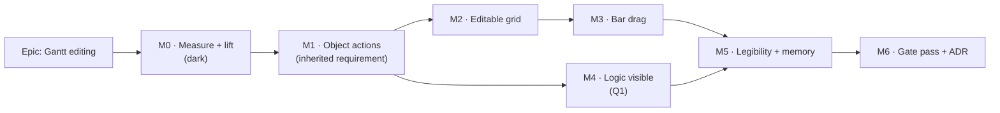

# Implementation Plan: Gantt editing — the Gantt as a working surface

- **Feature spec:** [`./feature-spec.md`](./feature-spec.md) — **not yet approved**; four CRITICAL
  questions (Q1 arrows, Q2 typed dates, Q3 row menu, Q4 flag) change what M4, M2 and M5 contain.
- **Status:** Draft
- **Owner:** —

> **Two authoring rules govern every milestone below** (ADR-0081, `PROCESS.md` Stage 5):
> each milestone **names its entry point** or declares itself dark, and the **flag-on journey lands
> with M1** — the first user-facing milestone — not at enablement.
>
> **And one measurement rule.** Where this plan asserts a cost, a width or a row budget it names the
> harness that established it, or marks it **[UNMEASURED]**. This register's last four epics each
> had such an expectation contradicted by their own measurement (ADR-0091 D4 withdrawn, ADR-0092 M4
> "gaining exactly nothing", ADR-0093's width argument withdrawn, ADR-0094 M0-T1's first hypothesis
> wrong). Nothing here is exempt from that.

## Breakdown

### Epic

**Gantt editing** — make the Gantt a working surface comparable in usability to Primavera P6 and
Asta Powerproject, discharge ADR-0093 D5's inherited requirement, and close the last open Must-have
in [`PROJECT_BRIEF.md`](../../PROJECT_BRIEF.md) §8. Roadmap theme: "Gantt view — the secondary
tabular projection of the same model".

**Feature flag — NONE (Q4 answered 2026-08-17: unflagged, commit boundaries only).** The spec
recommended `VITE_GANTT_EDITING` default-off; the product owner chose unflagged, which accepts
the cost that flag existed to avoid: the host auto-pulls every release (ADR-0047), so **each
milestone reaches the running system on the day it merges.** That is only safe under the
ordering constraint below, which is stricter than "commit boundaries" and is the honest price
of the choice:

> **Every milestone leaves the Gantt coherent for a planner who finds it mid-epic.** No
> milestone merges with an affordance that is visible and inert, a control whose write path is
> half-built, or a gesture with no undo. A milestone that cannot meet that is **split until it
> can** — this is a merge condition, not an aspiration, and M6's gate pass is too late to
> discover it.

This also removes the estate's need for its first `flagDefaultOff` call, so M0-T2's
**[UNMEASURED]** unknown disappears rather than being resolved

---

## Milestone 0 — Measure, and lift the object bar

**Outcome:** the four measurements four decisions are waiting on, and the selection bar hosted by
the workspace instead of the diagram.
**Ships dark:** nothing changes for any user. The lift is behaviour-preserving for the canvas and
the Gantt gains no affordance; M1 surfaces it.
**Journey:** none — dark by declaration. M0-T1 adds a **measurement harness**, which is not a gate
and says so in its own docblock (ADR-0081 §3, the `measure-link-routing` / `measure-toolbar`
precedent).

---

#### Feature: M0-F1 — The measurements

> **Description:** get the numbers before designing against them.
> **Complexity:** M
> **Dependencies:** none
> **Risks:** a harness that bypasses the product measures the wrong thing → it drives the real
> workspace through the real journey, like `measure-toolbar`, and its docblock states what it does
> not cover.
> **Testing requirements:** the harness is the deliverable; its output is a checked-in markdown
> readings file (`m0-measurements.md`), the `progress-entry-convergence/m0-measurements.md`
> precedent.

##### Task M0-T1 — `apps/web/measure-gantt/` + `playwright.measure-gantt.config.ts`

- **Description:** a measurement harness driving the real plan workspace in Chromium at **1646 ×
  1097** (the product owner's Surface Pro — the width ADR-0091's retrospective established two epics
  had never used) and **1920 × 1080**, on two seeded plans (≈200 and ≈2,000 activities, the latter
  imported-shape so its link fan-out is realistic).
- **Complexity:** M
- **Dependencies:** none
- **Risks:** seeding 2,000 activities trips the global throttler → raise `RATE_LIMIT_LIMIT` for this
  harness only, as `playwright.gantt.config.ts:57` already does.
- **Testing:** n/a (a harness). Verified by its readings being reproducible across two runs.
- **Development steps:**
  1. **R1 — Verify F4 by running it.** Select a Gantt row as a Contributor; assert whether
     `add-note` is inline or in the `⋯` at 1646; press it; assert the tabbed editor opens and the
     Progress tab is reachable. **This is the claim the spec marks `[READ, NOT RUN]`, and it decides
     M1's framing and its journey's assertions.** If it is false, `BACKLOG.md`'s paragraph is right
     and M1 restores a lost capability; if true, M1 gives an existing one an honest name.
  2. **R2 — The Gantt's vertical budget.** Chrome above the grid vs. rows visible, at both widths —
     the figure ADR-0092 got for the canvas (240 px chrome / 576 px canvas at 1646) and nobody has
     ever taken for the Gantt.
  3. **R3 — The dock row in the Gantt.** Confirm the outlet registers and is empty (spec F1), and
     measure what a docked bar costs the grid in height. ADR-0092 asserted **0 px** for the canvas
     as an equality; assert the same here or report the difference.
  4. **R4 — Live row count** at 200 and 2,000 activities, before any editing work, as the SC-4
     baseline the epic is later measured against.
  5. **R5 — The arrow number (Q1).** For the 2,000-activity plan, the p95 count of dependency links
     whose row span **crosses** a 40-row window, sampled across the plan. This is the number Q1's
     option C lives or dies on, and it does not exist today.
  6. **R6 — Does `Ctrl+Z` reach the Gantt?** The accelerators are a React `onKeyDown` on the
     workspace root (ADR-0080's finding); whether focus inside the Gantt grid reaches it is
     unverified and B9 depends on it.
  7. **R7 — Below `md`.** With the single-pane layout, confirm the dock outlet is absent
     (`plan-workspace-toolbar.tsx:1121`, `hostsDock={false}`) and record where a Gantt-produced strip
     would render. ADR-0092 M6 found every docked strip invisible below `md` and it was untested
     anywhere; do not inherit that.
  8. Write `docs/specs/gantt-editing/m0-measurements.md`; add `test:e2e:measure-gantt` to
     `apps/web/package.json`. **Not** a CI step — a harness, not a gate.

##### Task M0-T2 — Prove each milestone can merge coherently, before any of them does

- **Description:** Q4's answer (unflagged) makes the ordering constraint above a **merge condition**,
  and a condition nobody checks until M6 is a condition that fails at M6. Walk M1–M5 and, for each,
  name what a planner finds on the running host the day it merges. This replaces the flag-mechanics
  task the spec had here: with no flag there is nothing to verify about `flagDefaultOff`, and the
  estate keeps its record of zero such calls.
- **Complexity:** S
- **Dependencies:** none
- **Risks:** a milestone that cannot be made coherent is found late, when splitting it is expensive →
  find it now, on paper, when splitting is free.
- **Testing:** none — this is a written artefact reviewed before M1 starts.
- **Development steps:**
  1. For each of M1–M5 write one sentence: what is newly visible, what it does, and what it does
     **not** yet do that a planner might reasonably expect from what they can see.
  2. Flag any milestone whose sentence contains "but you cannot yet" about something its own new
     affordance implies — that is the lit-but-inert shape (ADR-0059 M6, ADR-0062 M6, ADR-0064 §7).
  3. Split those before M1 starts, and record the split. M3 is the one to look at hardest: a bar that
     drags but has no undo, or drags in EARLY mode only, is exactly this defect.

---

#### Feature: M0-F2 — The object bar becomes the workspace's

> **Description:** move the host of `SelectionActionsBar` and its context derivation from `TsldPanel`
> to the plan workspace, so a second surface can host it. ADR-0093 Option C, which spec F1/F2 show is
> already half-built.
> **Complexity:** M
> **Dependencies:** M0-T1 R3
> **Risks:** the canvas regresses invisibly → **the acceptance condition is that every existing
> `TsldPanel` and `selection-actions.*` suite passes unchanged**, which is the ADR-0062 extraction
> proof and the ADR-0078 barrel-preserving-move rule. If a suite needs editing, the move was not
> behaviour-preserving and stops.
> **Testing requirements:** existing suites unchanged + one new identity test.

##### Task M0-T3 — Extract the context builder

- **Description:** the ~20-field `selectionCtx` memo (`TsldPanel.tsx:1346-1412`) becomes a pure
  builder the workspace calls, with `TsldPanel` receiving the result. **Not** a second copy in the
  workspace — a duplicated 20-field context is precisely the drift the epic's own §4 rule forbids.
- **Complexity:** M
- **Dependencies:** —
- **Risks:** the plural-selection suppression (`TsldPanel.tsx:1348-1360`) is derived from canvas
  selection state → keep that derivation where it is and pass its verdict in; do not move state the
  canvas owns.
- **Testing:** every existing suite unchanged; a new identity test asserting the canvas host and the
  Gantt host receive contexts differing **only** in `canvas`.
- **Development steps:**
  1. Extract `buildSelectionBarContext(...)` beside `selection-actions.tsx`, pure, no React.
  2. `TsldPanel` calls it; assert its suites pass with **no edits**.
  3. Workspace calls it too, with `canvas: null`, but renders nothing yet (dark).
  4. Structural test: the two call sites pass the same object shape.

##### Task M0-T4 — Engine-import structural gate

- **Description:** a test that fails on any import from the CPM engine reaching
  `features/gantt/`, in the shape of `float-paths-view-agnostic.structural.test.ts`.
- **Complexity:** S
- **Dependencies:** —
- **Risks:** none. It is cheap and it converts the epic's parity claim from prose into a gate
  (ADR-0058's rule applied to our own spec).
- **Testing:** verified **red** first, by adding a deliberate import and removing it.
- **Development steps:** write it, verify red, remove the probe, land it.

---

## Milestone 1 — Object actions in the Gantt

**Outcome:** a Contributor selects a bar in the Gantt and reports progress on it; a Planner reaches
Logic, Edit, Duplicate, Dissolve, Delete and Resources from the same place. **The inherited
requirement (ADR-0093 D5) is discharged.**
**Entry point:** the plan workspace, Gantt view — select any activity row; the bar titled **"Actions
for _<activity name>_"** appears in the Activities row at the foot of the workspace, carrying
**Report progress** (accessible name: `Report progress`).
**Journey:** `apps/web/e2e-gantt-editing/object-actions.spec.ts` — sign in, open a plan, switch to
Gantt, select a row, press **Report progress**, assert the editor opens on Progress, save, assert the
stored value **read back from the API** (never from the DOM under test — the ADR-0070 M6 rule). Lands
**with this milestone**, per ADR-0081 §2.

---

#### Feature: M1-F1 — The docked bar in the Gantt

> **Description:** render `SelectionActionsBar` with `canvas: null` when the Gantt is the mounted
> surface. One registry, one component, two hosts, mutually exclusive by `ctx.planView`.
> **Complexity:** M
> **Dependencies:** M0-F2
> **Risks:** (a) both hosts render at once → they are branches of one ternary
> (`plan-workspace-toolbar.tsx:598`), asserted by a test that mounts each and counts bars;
> (b) below `md` the bar is invisible (M0-T1 R7) → decided in M1-T2, not discovered at M6;
> (c) the singular and plural bars collide in the dock (ADR-0092 M6's finding) → the Gantt has no
> plural selection (spec D4), so the collision cannot arise, and there is a test saying so.
> **Testing requirements:** unit (gating, `canvas: null` hides exactly two items), structural
> (`selection-duplication` still green — this adds no command-surface item), journey.

##### Task M1-T1 — Render the bar for a Gantt selection

- **Description:** wire the workspace-built context into a `<CanvasDock>`-wrapped
  `SelectionActionsBar` on the Gantt branch, behind `GANTT_EDITING_ENABLED` (a one-line guard).
- **Complexity:** M
- **Dependencies:** M0-T3
- **Risks:** the selection fallback `model.selectedActivityId ?? model.logicActivity?.id`
  (`plan-workspace-toolbar.tsx:622`) makes "what is selected" ambiguous → M1 uses
  `selectedActivityId` alone and **removes the now-dead `setLogicActivity` write** (spec F3), with a
  test pinning that a row click still selects.
- **Testing:** unit — bar mounts on selection, unmounts on deselect, `zoom-to-selection` and
  `isolate-logic` are **absent** (not shaded); Viewer sees every write action shaded with a reason.
- **Development steps:**
  1. Guarded render on the Gantt branch.
  2. Delete the dead `setLogicActivity` call; keep the selection write.
  3. Unit tests including the Viewer and no-pen matrices.
  4. Assert `restoreFocus` hands focus back to the grid row on unmount — the WCAG 2.4.3 failure
     ADR-0080 and ADR-0092 M6 each found once. Verified by a test that fails without it.

##### Task M1-T2 — Below `md`, and the empty-row question

- **Description:** decide and implement where the bar renders in the single-pane layout, where no
  dock outlet is registered.
- **Complexity:** S
- **Dependencies:** M0-T1 R7
- **Risks:** shipping it invisible, which is ADR-0092 M6's exact finding and was untested anywhere
  because jsdom has no layout → the journey runs one case at a narrow viewport.
- **Testing:** journey case at `< md`; unit test that the in-place fallback renders.
- **Development steps:** implement the fallback slot in the Gantt; journey case; note the height cost
  against M0-T1 R2.

##### Task M1-T3 — The flag-on journey (ADR-0081 §2)

- **Description:** `playwright.gantt-editing.config.ts` + `e2e-gantt-editing/object-actions.spec.ts`
  - `test:e2e:gantt-editing` + its own CI step.
- **Complexity:** M
- **Dependencies:** M1-T1
- **Risks:** locating a control by its copy → locate by `[data-toolbar-item]`, the standing rule
  after three journeys broke on a label change in ADR-0091 M7.
- **Testing:** it **is** the test. Run locally via `scripts/e2e-local.sh web:gantt-editing` before
  push — CI is the second opinion, never the first.
- **Development steps:**
  1. Config modelled on `playwright.gantt.config.ts`, with `PLAN_EDIT_LOCK_ENFORCED: 'true'` so the
     pen is real — the only place the optimistic-`version` trap is testable at all.
  2. Contributor path: progress reported and **read back from the API**.
  3. Planner path: pen held → Edit opens; pen not held → shaded with a reason.
  4. Viewer path: every write action shaded, none hidden.
  5. Add the CI step; add the suite to `docs/TESTING.md`.

##### Task M1-T4 — Close the register entries this discharges

- **Description:** `BACKLOG.md`'s inherited-requirement paragraph is closed **and its incorrect
  premise corrected** (spec F4), with M0-T1 R1's reading as the evidence.
- **Complexity:** S
- **Dependencies:** M0-T1 R1, M1-T1
- **Risks:** correcting it silently → the correction says what was read and what was run, per
  CLAUDE.md §19.10.
- **Testing:** n/a (docs).

---

## Milestone 2 — The grid becomes a spreadsheet

**Outcome:** a planner types a duration or a name into the grid and the programme re-flows;
`PROJECT_BRIEF.md` §11's "editable duration" is satisfied. A **Duration column exists** for the
first time (spec F6).
**Entry point:** the Gantt grid — click or press `F2` on a **Duration** cell (column header
"Duration"); type; `Enter`.
**Journey:** `e2e-gantt-editing/grid-edit.spec.ts` — type `4h` on an **eight-hour calendar** and
assert the API stores **240 minutes**, not 1440-derived. That specific case exists because ADR-0070
M6's journey found the same field silently refusing `4h` on the surface where it mattered most.

---

#### Feature: M2-F1 — The Duration column

> **Description:** add Duration to `GANTT_COLUMNS` (shared with the print surface, so screen and
> paper cannot disagree).
> **Complexity:** S
> **Dependencies:** —
> **Risks:** printing a milestone's `0 d` where the activity has real work → print the row's own
> `durationDays`/`durationMinutes`, never re-derive; ADR-0070 M4–M6 records the flag-off parity test
> catching exactly that rounding.
> **Testing requirements:** unit on the formatter incl. sub-day and milestone rows; the print
> surface's existing snapshot updated deliberately.

##### Task M2-T1 — Column + formatter

- **Complexity:** S · **Dependencies:** — · **Risks:** grid width grows and the chart shrinks →
  measure against M0-T1 R2 rather than assuming; the `SCREEN_COLUMN_WIDTHS` map
  (`GanttPanel.tsx:52-58`) is where it is paid.
- **Testing:** unit; print snapshot; a width assertion at 1646.
- **Steps:** add the column; reuse ADR-0070's formatter with its **required** `hoursPerDay`; update
  both surfaces; measure.

#### Feature: M2-F2 — In-cell editing, scoped per cell

> **Description:** editable cells for **name**, **duration** and **% complete**. Each cell knows its
> **write scope** — definition (pen-gated) or progress (role-only) — because ADR-0060 established
> that a merged save must pick one permission rule and would silently remove a Contributor's ability
> to report progress. Per-cell scope is that ruling at cell granularity, not a new idea.
> **Complexity:** L
> **Dependencies:** M2-F1
> **Risks:** (a) editing state per row breaks the bounded-live-node claim → re-run M0-T1 R4 and
> assert SC-4; (b) a cell that renders and quietly refuses (the ADR-0070 M6 defect) → the journey
> types into every editable cell type; (c) no-pen cells use native `disabled` → **ADR-0083**: they
> are read-only, value at full contrast, chrome dimmed, tab stop kept, and the contrast pair is
> added to `token-contrast.test.ts` **before** the CSS is written.
> **Testing requirements:** unit on the cell model (commit/revert/scope), gating matrix, journey.

##### Task M2-T2 — The cell-edit model (pure)

- **Complexity:** M · **Dependencies:** M2-T1 · **Risks:** a seed effect reading a stale
  `dirtyFields` flag — the ADR-0070 `useDurationSeed` defect (TECH_DEBT #83) → the model reads the
  field's current value in the effect, never a captured flag.
- **Testing:** unit only; no browser needed, which is the point of keeping it pure.
- **Steps:** state machine (idle → editing → committing → error); commit on `Enter`/`Tab`, revert on
  `Escape`; scope per cell key; unit tests incl. the stale-seed case verified red first.

##### Task M2-T3 — Wire cells to the existing mutations

- **Complexity:** M · **Dependencies:** M2-T2 · **Risks:** a private fetch → cells call the
  workspace's mutations, so the pen 423, the 409 revert, the undo record and the coalesced recalc all
  arrive identically to the canvas (spec F5's argument, one field along).
- **Testing:** unit with mocked mutations for 423 / 409 / 200; journey for the real thing.
- **Steps:** wire; assert an undo entry is recorded per commit; assert a 409 clears redo.

##### Task M2-T4 — Gating and the not-calculated case

- **Complexity:** S · **Dependencies:** M2-T3 · **Risks:** the "plan not calculated" state
  (`GanttPanel.tsx:372-381`) renders a message instead of a grid, so cells are unreachable there →
  **decide it**: either the message gains an editable grid or it says so. Silently having no route
  is the ADR-0081 shape.
- **Testing:** unit per state; a11y check that a read-only cell keeps its tab stop.
- **Steps:** gating from `activityEditorGating` (the one derived object, ADR-0060 §6 — never a second
  `{ writable, reason }` assembled beside it); summary/bucket/milestone rules; the decision above,
  recorded.

##### Task M2-T5 — Journey: the sub-day case

- **Complexity:** S · **Dependencies:** M2-T3 · **Risks:** asserting the DOM instead of the store →
  assert via the API.
- **Steps:** eight-hour calendar; type `4h`; read back 240 minutes; then type `1d` and read back 480.

---

## Milestone 3 — Bars move

**Outcome:** a planner drags a bar to a new start, or drags an end to change duration, and the
programme re-flows. `PROJECT_BRIEF.md` §11's "editable … dates".
**Entry point:** the Gantt chart — press and drag any activity bar; or drag its right/left end.
Keyboard equivalent on the focused row (`Shift+←/→` nudges duration, `←/→` moves the start), because
a pointer-only capability is a WCAG 2.1.1 failure and the canvas already has the pattern.
**Journey:** `e2e-gantt-editing/bar-drag.spec.ts` — drag in **EARLY** mode, assert an SNET was
written at the dropped day and successors moved; drag in **VISUAL** mode, assert `visualStart` and
**no** constraint. Note this is only the **second** journey in the repository to run in Visual mode
(ADR-0092's is the first); the other configs pin `VITE_SCHEDULING_MODES` off.

---

#### Feature: M3-F1 — Horizontal bar drag

> **Description:** call `onTsldReposition({ activityId, startDay })` — the workspace function that
> already handles a lane-free day move, with the Early/Visual split, the undo command, the pen path,
> the 409 path and the recalc notify (spec F5). **No new write path.**
> **Complexity:** M
> **Dependencies:** M0-T1, M1
> **Risks:** (a) two date origins — the Gantt anchors at `chartAnchor(span)` while
> `onTsldReposition` expects days from `plan.plannedStart` (`use-plan-workspace-model.ts:1003`) → the
> conversion is **one shared pure function**, unit-tested, never written twice; (b) persisting the
> client's rounded day → ADR-0092 D4: the ghost previews the roll-forward, the PATCH carries the
> **raw** dropped day; (c) a drag silently changing lane → the call omits `laneIndex`, which is
> structural rather than a rule (spec D3).
> **Testing requirements:** unit on the conversion (incl. DST-safe day arithmetic), unit on the
> gating, journey in both modes.

##### Task M3-T1 — Pixel→day conversion (pure) · **S**

- Steps: derive from the same `pxPerDay`/anchor the bars are drawn from (`bar-geometry.ts`) — a
  second date→pixel implementation is how two views drift about where a Monday is (ADR-0059 §2);
  unit tests at preset boundaries.

##### Task M3-T2 — The drag gesture · **M**

- Risks: a drag that arms without the pen → gestures arm only when `canEditSchedule`; **selection
  itself is never gated** (ADR-0063 M4b's "selecting is a read", and ADR-0080's three consequences of
  it are the checklist to walk).
- Steps: pointer handlers with a ghost; cursor date chip reusing ADR-0054's; commit through
  `onTsldReposition`; Escape cancels mid-drag.

##### Task M3-T3 — Bar-end resize · **M**

- Dependencies: M3-T2. Risks: inventing a start-edge semantic → **reuse ADR-0052 M3 verbatim**
  (EARLY: SNET + `durationDays`; VISUAL: `visualStart` + `durationDays`). Verify `onTsldResize`'s
  signature is lane-free before assuming it, the same way F5 was established.

##### Task M3-T4 — Keyboard equivalence · **S**

- Risks: shipping a pointer-only capability → a test that drives it from the keyboard alone, and an
  announcement on commit (WCAG 4.1.3 — ADR-0064's gate pass found four controls silent while their
  keyboard siblings announced).

##### Task M3-T5 — Journey, both modes · **M**

- Steps: a config pinning `VITE_SCHEDULING_MODES: 'true'`; assert the stored constraint / `visualStart`
  through the API; assert `Ctrl+Z` reverts (using M0-T1 R6's answer); allow for the recalc's
  settle time rather than reporting a race as a failure (ADR-0080's journey learned that one).

---

## Milestone 4 — Logic is visible _(Q1 answered: **option C**)_

**Outcome:** a **Show logic links** toggle in `View ▾` (never Row 1 or Row 2 — SC-6), **default
off**, draws every dependency whose row span crosses the visible window. Selecting a row draws that
row's predecessors and successors regardless of the toggle, so "why is this bar here?" is answerable
without turning anything on.
**Entry point:** `View ▾ → Show logic links` for the full set; selecting a row for its own links.
**Journey:** `e2e-gantt-editing/logic-overlay.spec.ts` — select a row with a known predecessor,
assert the path renders, assert it is `aria-hidden` and the textual equivalent is present; then
toggle all-links on and assert a link between two rows neither of which is selected.

> **Q1 was answered C ahead of the measurement, and that changes what M0-T1 R5 is for.** The
> product-owner decision (2026-08-17, feature-spec "Answered") adopts all-links-behind-a-toggle
> without making it conditional on the count. R5 still runs, unchanged, at the same point — but its
> output now **sizes the mitigation** rather than deciding whether this milestone happens. There is
> no longer a number that declines C.
>
> **So the ≤ 300 threshold becomes a performance requirement with a named fallback.** If p95
> window-crossing links exceeds 300 on the 2,000-activity imported-shape fixture, M4 ships a bounded
> strategy — cull to the visible window first, then cap — and **the cap is stated on screen** ("N
> links not shown"). A silent cap is precisely the defect class this register keeps recording
> (ADR-0081's dark capability, ADR-0059 M6's lit-but-inert zoom, ADR-0090's "no silent caps"), so
> either the count is visible or there is no cap.
>
> **Selection-only is not skipped; it is the first slice and the toggle's off-state.** It is what a
> planner reads when tracing one bar, it is bounded by that activity's degree in every real
> programme, and it is the fallback surface if the all-links path measures badly. Building C without
> it would leave the off-state empty and make the toggle the only route to any logic at all.
>
> **The routing objection is weaker here than ADR-0059 §4 implies, and the reason is worth stating
> because neither that ADR nor this spec's first draft said it.** ADR-0059's phrase is "arbitrary
> link **routing**", and routing cost — obstacle avoidance, corridor bundling (ADR-0065) — is
> independent of the render target, so answering "SVG, not canvas" does not by itself answer it.
> What answers it is the geometry: TSLD bars **share lanes**, so a link must be routed around bars
> that sit between its endpoints; Gantt rows are **one bar per row, vertically separated**, so a
> link is a simple elbow through whitespace. ADR-0065's expensive half does not arise. That is the
> strongest argument for showing logic in the Gantt and it is being recorded, not assumed —
> M4-T1 asserts that the derivation contains no obstacle search.

#### Feature: M4-F1 — The overlay · **L**

> **Risks:** (a) dragging Canvas-2D back in through the side door → the substrate is **one SVG in
> the existing scroll container**; a second scroller is out of bounds and there is a structural test
> saying the Gantt subtree imports no canvas painter; (b) an endpoint outside the window drawn as if
> the chain stopped → stub markers at the window edge, asserted; (c) arrows as the only carrier of a
> fact → `aria-hidden`, with the Logic tab today and the Predecessors column at M5 as the text.
> **Testing:** unit on path derivation; a counting-stub budget test in the shape of ADR-0054's
> `paint.dates-budget.test.ts` — asserting the **shape** of per-frame cost, because a CI runner's
> absolute timings are noise; journey.

- **M4-T1** — visible-link derivation from the culled row window (pure) · **M**
- **M4-T2** — SVG paths + driving/non-driving cue reused from the canvas · **M**
- **M4-T3** — off-window stubs + the budget test · **M**
- **M4-T4** — journey + a11y assertion · **S**
- **M4-T5** — the `View ▾` toggle, derived from the same `LensToggle` records the
  popover reads (ADR-0092 D5's rule: never restated beside them) · **S**
- **M4-T6** — the bounded strategy **if and only if** R5's p95 exceeds 300: cull to the visible
  window, then cap with the withheld count stated on screen. Skipped, and recorded as skipped
  with the measured number beside it, if R5 comes in under. · **M**

---

## Milestone 5 — Programme legibility, and the view's memory

**Outcome:** the Gantt reads like a programme somebody would hand over, and comes back the way it was
left.
**Entry point:** multiple, each named — the **Columns** button above the grid; **bar labels** appear
beside bars with no control (a render change); the row's **context menu** (Q3); **Indent** /
**Outdent** in that menu.
**Journey:** `e2e-gantt-editing/view-state.spec.ts` — set a sort and a column choice, reload, assert
they survive; open a row menu and assert its items are the dock's.

#### Feature: M5-F1 — Columns and labels · **M**

- **M5-T1** Duration / Total float / Predecessors columns + a **Columns** chooser · **M** — risk:
  the chooser is state that wants persisting; the **default is typed URL search params** (ADR-0053
  M6 / ADR-0059 §3). A per-user persisted choice is a **schema change** and therefore opens
  `database-architect` **before any code** (CLAUDE.md §19.3), or it is not done.
- **M5-T2** Bar labels beside bars (B10f) · **S** — risk: labels collide at dense zoom → level-of-
  detail rule modelled on ADR-0054's Dates toggle; shared with the print surface.

#### Feature: M5-F2 — The row context menu (Q3) · **M**

- **M5-T3** Render the menu **from `selectionActionItems`** · **M** — risk: a third roster the
  selection-duplication gate structurally cannot see (ADR-0094 recorded that hole) → derive, and
  extend the gate to assert the row menu's roster **is** the dock's, verified red first. Menu items
  shade with `disabledReason` and stay focusable (ADR-0082).

#### Feature: M5-F3 — Structure editing · **M**

- **M5-T4** Indent / Outdent through the existing ADR-0063 M4b reparent batch · **M** — risk:
  inventing a second reparent path → reuse the batch, including its version carrying. **Vertical
  drag to reorder stays declined** (B7).
- **M5-T5** Insert activity — opens the create dialog with the row's parent pre-set · **S** — risk:
  becoming Powerproject's draw-on-chart creation, which B10e declines; this is P6's model and the
  asymmetry is deliberate.

#### Feature: M5-F4 — View memory · **S**

- **M5-T6** sort, collapse set, columns and grid width in typed URL search params · **S** — risk:
  TECH_DEBT #96, the router JSON-parses every search param so `?x=1` arrives as a **number**; the
  Gantt's `?view=` is already named in that row. Coerce explicitly and add a journey case, because
  this defect class is invisible to unit tests that mock `useSearch`.

---

## Milestone 6 — The gate pass and the ADR

**Outcome:** the epic is enabled by default, the ADR is filed, and the register is corrected.
**Entry point:** none new — this milestone lights what M1–M5 built.
**Journey:** the full `e2e-gantt-editing` suite plus a **sweep of every other Playwright suite**, per
ADR-0091's rule after three journeys broke on a label change and were found by CI rather than by the
author.

#### Feature: M6-F1 — Specialist gates over the combined diff · **L**

Six reviewers, read-only, over the whole epic diff — this register records the gate pass finding
defects that had passed a human read for **six consecutive epics**, so it is scheduled as work, not
as a formality:

| Reviewer                       | What it is being asked                                                                                                                     |
| ------------------------------ | ------------------------------------------------------------------------------------------------------------------------------------------ |
| `accessibility-reviewer`       | WCAG 2.2 AA over a grid that is now interactive: cell tab order, `readonly` announcement, drag's keyboard equivalent, live-region wording. |
| `ux-reviewer`                  | Does the Gantt now say what it can and cannot do? Is any control lit-but-inert? Is any reason sentence false for one of its two readers?   |
| `component-reviewer`           | One registry, one context builder, no one-off styling, no new primitive without justification.                                             |
| `performance-reviewer`         | SC-4 re-measured **after** the epic, not assumed to survive it; re-render reach into the grid.                                             |
| `security-reviewer`            | The "a new view cannot widen the boundary" claim, tested rather than accepted.                                                             |
| `backend-performance-reviewer` | Only if any milestone unexpectedly touched the API. If none did, say so — a skipped review recorded is different from a review nobody ran. |

- **M6-T1** run the gates; fold blocking findings **each with a regression test verified red against
  the old code first** · **L**
- **M6-T2** _(no flag to flip — Q4)_. Instead: confirm `scripts/flag-retirement.json` is
  **unchanged** by this epic and that `pnpm check:flags` still reports the same live count, so
  an epic that deliberately added no flag cannot have added one by accident · **S**
- **M6-T3** file the ADR · **M** — it must record: the amendment to **ADR-0059 §4**; Q1's answer with
  M0-T1 R5's number beside it; the B1–B10 adopt/decline table as the decomposition of "comparable to
  P6/Powerproject"; spec F4's correction to `BACKLOG.md`; and **what was measured and contradicted
  the plan**, because five of the last six ADRs have such a section and it is the most useful part of
  each.
- **M6-T4** update `CLAUDE.md` §1 (the Must-have banner — carefully: ADR-0059's own banner claimed to
  close this line and was wrong) and §16; `PROJECT_BRIEF.md` §8; `BACKLOG.md`; `docs/TESTING.md`;
  add a changeset · **S**

---

## Sequencing & slices

| Order | Milestone | Releasable on its own? | Why here                                                                                                                                    |
| ----- | --------- | ---------------------- | ------------------------------------------------------------------------------------------------------------------------------------------- |
| 1     | M0        | Yes (dark)             | Four decisions wait on its numbers; the lift de-risks everything after it.                                                                  |
| 2     | **M1**    | **Yes**                | **The inherited requirement. Scheduled first by instruction and by value — it is the smallest slice that discharges a live accepted cost.** |
| 3     | M2        | Yes                    | The brief's "editable duration". Independent of M3.                                                                                         |
| 4     | M3        | Yes                    | The brief's "editable dates". Depends on M0's conversion work, not on M2.                                                                   |
| 5     | M4        | Yes                    | Q1-gated; can run in parallel with M2/M3 once answered, since it touches no write path.                                                     |
| 6     | M5        | Yes                    | Polish; each feature is independently landable.                                                                                             |
| 7     | M6        | Yes                    | Enablement.                                                                                                                                 |

`main` stays releasable throughout: every milestone is behind one Class B guard, and M0 ships dark.

## Definition of Done (per task)

Each task's PR satisfies the Feature Completion Criteria in [`docs/PROCESS.md`](../../PROCESS.md) —
code, tests, docs, security, performance, accessibility, Docker build, CI, changelog, version impact.
**"Tests" means the pre-push gate was run**: `pnpm lint && pnpm typecheck && pnpm test`, plus
`scripts/e2e-local.sh web:gantt-editing` for any task touching a journey. No task in this epic
touches `apps/api`, so `scripts/e2e-local.sh api` is not required — and if one turns out to, that is
the signal named in the spec's §4 that the milestone has drifted.

## Risks & assumptions (rollup)

| Risk / assumption                                                               | Likelihood | Impact   | Mitigation                                                                                                                                                                                                                |
| ------------------------------------------------------------------------------- | ---------- | -------- | ------------------------------------------------------------------------------------------------------------------------------------------------------------------------------------------------------------------------- |
| **Q1 answered "all links, always"** and the measurement then refuses it         | med        | high     | R5's threshold is named **before** the answer, so the measurement decides. D is not recommended in any case.                                                                                                              |
| Spec **F4** is wrong — `add-note` does not reach the editor from the Gantt      | med        | med      | M0-T1 R1 runs it before M1 is designed against it. Either answer leaves M1's work identical; only its framing and journey assertions change.                                                                              |
| Spec **F5** is wrong — `onTsldResize` is not lane-free                          | low        | med      | M3-T3 verifies the signature before assuming it, the way F5 itself was established.                                                                                                                                       |
| The lift (M0-F2) regresses the canvas invisibly                                 | med        | high     | Acceptance is that **every existing suite passes unchanged**; if one needs editing, the move stops.                                                                                                                       |
| Editing state per row breaks the bounded-live-node claim                        | med        | med      | R4 is the baseline; SC-4 is re-measured at M6 by the performance gate rather than assumed.                                                                                                                                |
| Below `md` the docked bar is invisible                                          | med        | med      | R7 measures it; M1-T2 decides it; a journey case at a narrow viewport pins it. ADR-0092 M6 shipped exactly this defect untested.                                                                                          |
| The Gantt becomes attractive enough to pull planners off the TSLD               | med        | med      | ADR-0059 accepted this risk and recorded the brief's §7 metric as **unmeasurable** (no telemetry facade). This epic increases it and cannot measure it — stated, not solved.                                              |
| Two spreadsheets — this grid and `ActivitiesTable` — drift                      | med        | med      | Shared column semantics (`grid-columns.ts`) and one action registry. A UX gate question at M6 rather than a claim now.                                                                                                    |
| Something needs a schema change mid-epic                                        | low        | med      | Named in advance (M5-T1's persisted column choice). `database-architect` opens **before** any code, with no self-assessment of size (CLAUDE.md §19.3).                                                                    |
| A width regression on the command surface                                       | low        | med      | Nothing is added to Row 1 or Row 2 by design; `e2e-toolbar-fit` proves it. Note the selection bar is **out of that gate's scope by decision** (TECH_DEBT #124), so its own width is unguarded — worth one M6 measurement. |
| A milestone merges to the auto-pulling host in a half-built state (Q4: no flag) | med        | **high** | The ordering constraint is a merge condition, and M0-T2 walks M1–M5 against it before M1 starts rather than discovering it at M6.                                                                                         |
