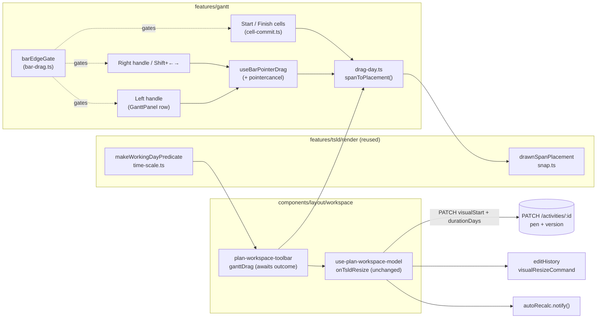
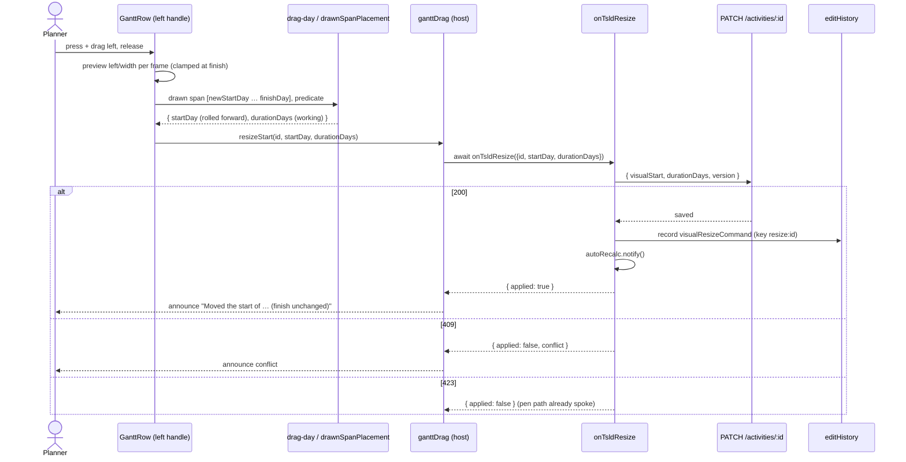
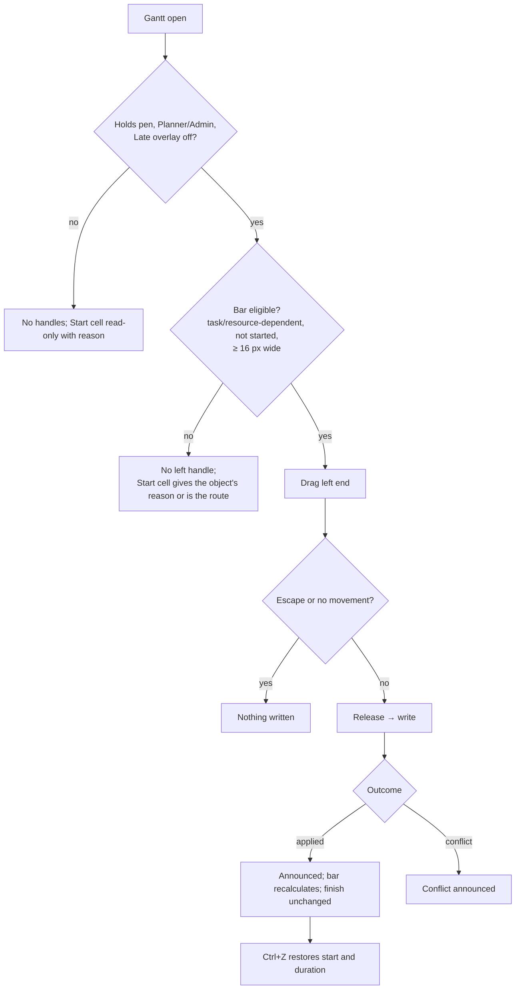

# Feature Spec: The Gantt's start-edge resize

- **Status:** Accepted — shipped (ADR-0170)
- **Author(s):** Feature Analyst (Product Owner / Solution Architect / Technical Lead hats)
- **Date:** 2026-10-02
- **Tracking issue / epic:** —
- **Roadmap link:** [`docs/BACKLOG.md`](../../BACKLOG.md) — `S` "The Gantt's remaining editing gaps";
  [`docs/PROJECT_BRIEF.md`](../../PROJECT_BRIEF.md) §8 ("read-primary; **edit supported**")
- **Related ADR(s):** builds on **ADR-0095** (the Gantt becomes a working surface), **ADR-0052 §3**
  (the diagram's start-edge semantic), **ADR-0134** (a typed date writes what a drag writes),
  **ADR-0148** (one planning surface), **ADR-0048** (undo), **ADR-0028** (the pen). Needs **one new
  ADR** (ADR-0170, outline in §4.8): it lifts a deferral ADR-0095 recorded and corrects an arithmetic
  claim ADR-0134's implementation makes.
- **Predecessor spec:** [`docs/specs/gantt-editing-gaps/`](../gantt-editing-gaps/feature-spec.md) —
  its CQ-2 re-deferred this item on 2026-09-11; ADR-0148 (2026-09-21) removed the reason that
  survived. That spec's M4 is the sketch this one replaces.

---

> **Read this first — three things the brief did not say, all found by reading the code.**
>
> 1. **The Gantt already has a start-edge write: the typed `Start` cell.** `cell-commit.ts:196-210`
>    writes `{ visualStart: typed, durationDays }` holding the finish — the same write the diagram's
>    start-edge drag makes. So the keyboard and non-drag route already exists and is journey-tested
>    (`e2e-gantt-editing/grid-edit.spec.ts:426-465`). What is missing is only the **gesture**.
> 2. **Every Gantt write that holds one end of a bar counts the wrong days.** The finish-edge drag
>    (`drag-day.ts:62-75`) and both typed date cells (`cell-commit.ts:191`, `:196`) compute
>    `durationDays` as **calendar** days, but `durationDays` is a **working-day** quantity
>    (`packages/types/src/index.ts:448-459`). The diagram had exactly this defect, reported from the
>    field and fixed (`TsldPanel.tsx:2665-2671`, regression `TsldPanel.resize-duration.test.tsx:18-26`).
>    The Gantt was not fixed. A start-edge drag built on the Gantt's helpers would announce "finish
>    unchanged" and then move the finish whenever the bar crosses a weekend. **This is CQ-1.**
> 3. **The Gantt throws away the result of every bar write.** `plan-workspace-toolbar.tsx:1026-1027`
>    calls `void model.onTsldReposition(…)` / `void model.onTsldResize(…)`, and the row announces
>    success **before** the write is sent (`GanttPanel.tsx:776-777`, `:805-806`). A stale-version
>    refusal (`use-plan-workspace-model.ts:1456-1459`) is never shown and is announced as a success.
>
> Two smaller corrections to the brief: the canvas start-edge write is at
> `use-plan-workspace-model.ts:1375-1414` (`onTsldResize`, the `startDay !== undefined` branch). Line
> 1284 is inside `onTsldReposition` — the bar **move** — not the resize. And the deferral sentence the
> backlog attributes to "ADR-0095 D4" lives in ADR-0095's closing section (`:234-236`); D4 itself is
> the `Alt+←/→` decision.

## 1. Business understanding

### Problem

In the Gantt a planner can move a whole bar (drag it, or `Alt+←/→`) and change where it **finishes**
(drag its right end, or `Shift+←/→`). They cannot drag its **left** end to start the work earlier or
later while keeping the finish date. On the diagram (TSLD) they can, and have since ADR-0052 M3. A
planner who learns one view and switches to the other finds a gesture missing for no reason they can
see.

The reason was real when written: until 2026-09-21 a start-edge drag meant one of two different
writes depending on the plan's scheduling mode (ADR-0052 §3), and the Gantt shows no mode. ADR-0148
deleted the modes. The diagram's start edge now has one write — hand-place the start, keep the
finish — with no branch (`use-plan-workspace-model.ts:1392-1414`). The Gantt resize is **unbuilt,
not blocked**.

While checking that, this spec found the Gantt's existing "keep one end, change the other" writes
count calendar days where the engine counts working days (Read-this-first, item 2). That defect is
live today, on shipped controls, and the new gesture would inherit it.

### Users

| Role                       | Needs                                                                      | Gets this capability?                                                                  |
| -------------------------- | -------------------------------------------------------------------------- | -------------------------------------------------------------------------------------- |
| **Planner**, **Org Admin** | Adjust a start without disturbing a committed finish, in the view they use | **Yes**, while holding the pen (ADR-0028) and not in the Late overlay                  |
| **Contributor**            | Reports progress, not structure                                            | No — the bar's definition scope is shut to them (ADR-0060 §6), exactly as for the move |
| **Viewer**, External Guest | Read the programme                                                         | No — no handle is rendered                                                             |

### Primary use cases

1. **Pull a start earlier** to show work beginning sooner, keeping the agreed finish (the duration
   grows).
2. **Push a start later** because a crew is not available yet, keeping the finish (the duration
   shrinks — never below one working day).
3. **Undo** a start-edge drag in one step.

### User journeys

Happy path: the planner holds the pen → opens the Gantt → points at the left end of a task bar (the
cursor becomes a resize arrow) → drags left two columns across a weekend → sees the bar's left end
follow the pointer, day by day → releases → hears/sees "Moved the start of "Excavate" to 2 Mar 2026
(7 days, finish unchanged); dates will update." → the plan recalculates → the bar's finish is where
it was. `Ctrl+Z` puts the start and the duration back.

Alternates: Escape mid-drag cancels with nothing written; a keyboard user does the same thing with
`F2` → the `Start` cell → type a date → `Enter` (§2 "Keyboard"); a refused bar (summary, milestone,
level-of-effort, a started activity) shows no left handle and the typed `Start` cell gives the reason.

### Expected outcomes

- The Gantt and the diagram mean the same thing by "drag the start edge", and the Gantt's typed
  `Start`, typed `Finish` and finish-edge drag mean the same thing as the diagram's by "N days".
- `PROJECT_BRIEF.md` §8's Gantt line loses its last named residual (CLAUDE.md banner: "substantially
  — because the start-edge resize is deliberately absent (ADR-0095 D4)").

### Success criteria

- **The finish does not move.** After a start-edge drag that crosses a non-working day, the
  activity's `visualEffectiveFinish` read from the API equals its value before the drag. This is the
  load-bearing assertion of the journey (§5 plan, M2) and the one the current helpers would fail.
- **No constraint is written** (`constraintType` stays `null`) — ADR-0148 D6's reason.
- One undo step restores both `visualStart` and `durationDays`.
- No schema, API or engine change: `engine-import.structural.test.ts` and `check:frontend-only` stay
  green, so the recalculation parity gate is untouched by construction.

### Open questions

> **CQ-1 (CRITICAL) — Fix the shipped Gantt day-counting in this work?**
>
> _Plain English:_ when you drag the right end of a bar in the Gantt, or type a Start or Finish date,
> the Gantt counts weekends as working days. A five-day task stretched over a weekend comes back two
> days longer than you drew it. The diagram had the same fault, it was reported, and it was fixed
> there — not in the Gantt. The new left-edge drag needs the corrected counting to keep its promise
> ("finish unchanged").
>
> **Recommendation: yes — fix it first (M1), as its own release.** It changes what three shipped
> controls write, so you should know it is happening, but it changes them to what the diagram
> already writes. Leaving it means the new gesture either shares the fault or uses different
> arithmetic from the typed cells beside it, and we would be shipping two answers to one question.
>
> **Default if unanswered:** fix it (M1).
>
> **ANSWERED 2026-10-02 (product owner): YES — but in the SAME release as the start-edge handle,
> not as its own release.** The recommendation above proposed M1 as a release of its own; that part
> is **overruled**. M1 and M2 stay separate milestones and separate commits, but there is no release
> between them: they ship in one PR and one release. Consequence recorded in the plan: the
> "either can be reverted alone" rationale for separate releases is gone, and a planner first meets
> the corrected arithmetic and the new handle together.

> **CQ-2 (CRITICAL) — What does the left edge do on an activity that has already started?**
>
> _Plain English:_ once an activity has an actual start, the schedule draws it from that actual
> date and ignores any hand-placed start (`compute.ts:110-112`, `:364-366`; ADR-0148 amendment 1).
> So dragging its left end would save a placement that has no visible effect, change its duration,
> and move its **finish** — the opposite of what the gesture promises.
>
> **Recommendation: refuse it in the Gantt** — no left handle on a started or finished activity,
> and the typed `Start` cell says "This activity has started, so its start is its actual start.
> Change it under Progress." (the same Gantt write, so the same rule). The diagram allows the same
> inert write today; that is recorded as a `docs/TECH_DEBT.md` row for its own fix rather than
> changed here, because a diagram behaviour change needs its own review.
>
> **Default if unanswered:** refuse in the Gantt (drag and typed `Start`); file the diagram row.
>
> **ANSWERED 2026-10-02 (product owner): the recommended default stands** — no left handle on a
> started or finished activity; the typed `Start` cell gives the reason. The diagram's behaviour is
> filed as a `docs/TECH_DEBT.md` row in M1 (M1-T3), as planned.

> **CQ-3 (design-changing, low stakes) — A keyboard shortcut for "move the start one day"?**
>
> _Plain English:_ keyboard users can already change a start while keeping the finish, by typing it
> into the Start cell. A dedicated chord (e.g. `Alt+Shift+←/→`) would be quicker for nudging. The
> diagram has **no** such chord (`TsldPanel.tsx:2239-2278` binds only `Shift+←/→` and `Alt+arrows`),
> so adding one to the Gantt alone gives the two views different keys for the same job.
>
> **Recommendation: no new chord.** The typed `Start` cell is the keyboard equivalent, and it is
> documented in the shortcuts sheet. If you want the chord, it should land in **both** views together
> as a follow-up, with an accessibility review of both key handlers (CLAUDE.md §19.13).
>
> **Default if unanswered:** no chord; the shortcuts sheet names the `Start` cell.
>
> **NOT ANSWERED 2026-10-02 — the recommended default stands:** no new keyboard shortcut. The typed
> `Start` cell is the keyboard route and the shortcuts sheet names it. A chord, if ever wanted,
> lands in both views together (CLAUDE.md §19.13 review).

**Non-critical, with defaults stated:**

- **Level-of-effort bars get no left handle**, and lose the right handle and `Shift+←/→` they have
  today. An LOE's span is derived by the engine (ADR-0148 D0; ADR-0052 §3 "milestones/LOE/WBS
  summaries (duration-derived) offer no handles"), and the diagram already refuses them
  (`hit-test.ts:91-93`). The Gantt's `resizeBar` refuses only milestones (`GanttPanel.tsx:797`), so a
  Gantt resize of an LOE writes a duration the engine does not use. Folded into M1's shared gate.
- **Live preview for both edges.** Today the finish-edge drag shows nothing until release —
  `barResize.deltaX` is never read in the bar's style (`GanttPanel.tsx:1876-1883` reads only
  `barDrag.deltaX`). The start edge ships with a preview and the finish edge gets the same one.
- **No live date read-out** beside the pointer (the diagram has one, `cursor-readout.ts:92-98`). The
  announcement on release names the date; a read-out is a separate Gantt affordance with no request.
- **Touch is not promised** (§2 "Coarse pointer").
- **Zero-duration tasks** (ADR-0162) are tasks: they get the handle, as on the diagram
  (`isResizeEligibleType` admits `TASK`). Dragging the start earlier gives them a real duration —
  the same as dragging their finish later today.

## 2. Functional requirements

### User stories & acceptance criteria

> **US-1** — As a **Planner** holding the pen, I want to drag the left end of a bar in the Gantt, so
> that I can change when work starts without moving when it finishes.
>
> - **Given** a not-started task bar and the pen, **when** I press on its left end and drag left by
>   two day columns and release, **then** one `PATCH` is sent carrying `visualStart` at the new start
>   and `durationDays` equal to the **working** days from the new start to the unchanged finish, and
>   **no** constraint field.
> - **Given** the same drag crosses a non-working day, **when** the plan recalculates, **then** the
>   activity's drawn finish (`visualEffectiveFinish`) is unchanged.
> - **When** I drag right past the finish, **then** the start stops at the finish day (one working
>   day minimum) — the bar never inverts.
> - **When** I press Escape mid-drag, **then** the bar returns and nothing is written.
> - **When** I press and release without moving, **then** it is a click (row selection), not a write
>   (`use-bar-pointer-drag.ts:94-96`).
> - **When** the write lands, **then** the shared live region announces
>   `Moved the start of "<name>" to <date> (<n> day(s), finish unchanged); dates will update.` —
>   the diagram's sentence verbatim (`TsldPanel.tsx:2700-2703`) — and only then.
> - **When** the write is refused for a stale version, **then** the conflict sentence is announced
>   and nothing claims success.

> **US-2** — As a **Planner**, I want one undo to put the start and the duration back.
>
> - **Given** a start-edge drag landed, **when** I press `Ctrl/Cmd+Z`, **then** `visualStart` and
>   `durationDays` both return to their prior values in one step (`visualResizeCommand`,
>   `commands.ts:680-715`), and `Ctrl+Shift+Z` re-applies them.

> **US-3** — As a **keyboard user**, I can make the same change without a pointer.
>
> - **Given** a focused row, **when** I press `F2`, move to the `Start` cell, type a date and press
>   `Enter`, **then** the same write as US-1 is made, with the same working-day arithmetic.
> - **Then** the shortcuts sheet (`PlanShortcutsHelp.tsx`, Gantt list) states this route.

> **US-4** — As any user, a bar that cannot take the gesture does not offer it.
>
> - **Given** a WBS summary, a milestone, a level-of-effort, a started or finished activity, no pen,
>   a Contributor/Viewer/Guest, or the Late overlay, **then** no left handle is rendered (never a lit
>   but inert grab zone), and the typed `Start` cell (where applicable) is read-only or refuses with
>   the object's reason.

### Workflows

1. Pointer down on the left handle → `useBarPointerDrag` captures (primary button only).
2. Each frame: the bar's left edge and width are previewed at the day column under the pointer,
   clamped at the finish column.
3. Release → the Gantt converts the drawn span `[newStartDay, finishDay]` to
   `(startDay, durationDays)` with the diagram's `drawnSpanPlacement` and the plan's working-day
   predicate → `onTsldResize({ activityId, startDay, durationDays })` → awaits the outcome.
4. `applied` → announce; `conflict` → announce the conflict; pen lost → the pen path already
   announces (`pen.onWriteRejected`). Recalculation is the coalesced auto-recalc
   (`use-plan-workspace-model.ts:1462-1466`).

### Edge cases

| Case                                                  | Expected                                                                                                                                                       |
| ----------------------------------------------------- | -------------------------------------------------------------------------------------------------------------------------------------------------------------- |
| Bar narrower than 16 px (two 8 px handles)            | **No left handle**; the right handle and move behave exactly as today. The typed `Start` cell is the route. Stated so narrow bars are byte-for-byte unchanged. |
| New start lands on a weekend/holiday                  | Rolled **forward** to the next working day, as the diagram does (`snap.ts:93-108`); the preview shows the drawn column, the announcement the written date.     |
| Drag past the finish                                  | Clamped to the finish day: duration 1 working day (`gesture-machine.ts:552-557` is the diagram's rule).                                                        |
| Drag before the plan's planned start                  | Allowed; `startDay` may be negative (`drag-day.ts:38-40`) and the engine decides.                                                                              |
| Placed earlier than logic allows                      | Written as placed; the engine flags `EARLIER_THAN_LOGIC` (ADR-0148 D5). Same as a move.                                                                        |
| Plan not yet calculated (no bar)                      | No bar, so no handle (`bar-geometry.ts:62`).                                                                                                                   |
| Plan calendar not loaded                              | `drawnSpanPlacement` falls back to calendar days (`snap.ts:90-91,101`) — the pre-fix behaviour, only for that window. Accepted; stated.                        |
| Activity on its **own** calendar, or resource-driven  | Counted on the **plan** calendar, as the diagram does (`TsldPanel.tsx:1822-1825`); the engine re-derives. A shared residual (`snap.ts:48-52`), not new.        |
| Another planner changed the activity                  | 409 → conflict announced; nothing re-sent (`use-plan-workspace-model.ts:1456-1459`).                                                                           |
| Pen lost mid-drag                                     | 423 → the existing pen path (`pen.onWriteRejected`); nothing announced as success.                                                                             |
| Row virtualised away mid-drag                         | The hook cancels on unmount (`use-bar-pointer-drag.ts:53-56`); nothing written.                                                                                |
| Pointer cancelled by the browser (touch scroll)       | Treated as Escape — **new**: the hook listens to `pointercancel` (§3).                                                                                         |
| Start-then-finish drag on one bar in quick succession | Coalesces to one undo step (`resize:{id}` key, `commands.ts:704`).                                                                                             |

### Coarse pointer and touch

The handle is 8 px wide, an `aria-hidden` pointer affordance like the finish handle
(`GanttPanel.tsx:1923-1936`). It takes **WCAG 2.5.8's Equivalent exception**: the same function is
available through the typed `Start` cell, which is a full-size control — the same exception the
diagram's bar-end zones take (`hit-test.ts:95-100`). The bars set no `touch-action`, so on a touch
screen a horizontal drag will usually scroll the chart instead; this work does **not** add
`touch-action: none`, because a finger landing on a bar would then stop scrolling the chart, which is
the more common intent. The touch route is the `Start` cell. The Gantt's coarse-pointer gate is still
unbuilt (`gantt-editing-gaps` M2-F2; `e2e-workspace-fit/command-surface.spec.ts` sweeps the Gantt only
at 24 × 24, `:747-791`) and this spec does not take it on.

### Keyboard (WCAG 2.1.1) and dragging alternative (WCAG 2.5.7)

- **2.1.1:** the start can be changed with the finish held, by keyboard, today: `F2` on the row
  (`GanttPanel.tsx:890-904`) → the `Start` cell → type → `Enter`. M1 makes its arithmetic match the
  drag's. ADR-0095 D4's rule — the keyboard route lands **before** the pointer gesture — is therefore
  already met, by ADR-0134.
- **2.5.7:** the dragging function is achievable with a single pointer without dragging: click the
  `Start` cell, choose/enter the date, confirm. The accessibility-reviewer is asked to confirm this
  reading (a typed field as the non-drag alternative) before M2 ships, rather than this spec asserting
  it.
- **No new key binding** (CQ-3), so the treegrid's keyboard contract is unchanged and §19.13's
  mandatory pre-release review is not triggered by this work; it is run anyway for the handle.

### Permissions

Deny-by-default, resolved by the objects that already decide it — nothing new:

- **Client:** `barMoveGate` (`bar-drag.ts:50-61`) → `drag.canEdit`, which is "fused role + pen, minus
  the Late overlay" derived once by the workspace (`bar-drag.ts:21-25`; `plan-workspace-toolbar.tsx:1023`).
  The new start-edge gate composes it, object reasons first.
- **Server:** `PATCH /api/v1/organizations/:orgSlug/activities/:activityId` — "Planner or Org Admin;
  optimistic locking", `423` without the plan edit-lock (`activities.controller.ts:68-94`),
  organisation-scoped. **The write is structural** (it changes a definition field, `durationDays`,
  and a placement) and needs the pen.

### Validation rules

Client-side only, because the endpoint and DTO are unchanged:

- `durationDays` ≥ 1 working day (the clamp); integer.
- The start-edge gate refuses: `WBS_SUMMARY`, `START_MILESTONE`, `FINISH_MILESTONE`,
  `LEVEL_OF_EFFORT` (matching `isResizeEligibleType`, `hit-test.ts:91-93`), and an activity with
  `actualStart !== null || actualFinish !== null` (matching the engine's `isFrozenByActuals`, derived
  at `progress.ts:84-86`) — CQ-2.
- A `MANDATORY_*` constraint: the typed cell already refuses (`cell-commit.ts:160-167`). **The drag
  does not**, and neither does the diagram's: a hand-placement does not replace a constraint (no
  constraint field is sent). Kept as-is so drag and diagram agree; listed in §4.7 as a deliberate
  asymmetry with the cell.

### Error scenarios

| Scenario                       | Detection                           | User-facing result                                                                               | Status |
| ------------------------------ | ----------------------------------- | ------------------------------------------------------------------------------------------------ | ------ |
| Not holding the pen            | edit-lock guard                     | Pen path's sentence (`pen.onWriteRejected`); no success announced                                | 423    |
| Stale version                  | optimistic lock                     | "This plan changed since you opened it — your resize wasn't applied. Refresh to see the latest." | 409    |
| Role lacks schedule edit       | RBAC (client hides; server refuses) | No handle rendered                                                                               | 403    |
| Write succeeded, recalc failed | auto-recalc                         | Existing non-fatal path: dates update after the next recalculation                               | —      |
| Any other failure              | promise rejection                   | "Couldn't resize the activity." announced — **new**: today a `void`ed rejection is unhandled     | 5xx    |

## 3. Technical analysis

| Area           | Impact   | Notes                                                                                                                                                                                                                                                                                                                                              |
| -------------- | -------- | -------------------------------------------------------------------------------------------------------------------------------------------------------------------------------------------------------------------------------------------------------------------------------------------------------------------------------------------------- |
| Frontend       | med      | `GanttPanel.tsx` (handle, preview, narrow rule), `bar-drag.ts` (gate + async contract), `drag-day.ts` (working-day conversion), `cell-commit.ts` (same conversion; started refusal), `use-bar-pointer-drag.ts` (`pointercancel`), `plan-workspace-toolbar.tsx:1022-1033` (await outcomes, pass the predicate), `PlanShortcutsHelp.tsx` (one line). |
| Backend        | none     | Reuses `PATCH …/activities/:id` through `useSetActivityVisualStart` (`use-activities.ts:338-360`).                                                                                                                                                                                                                                                 |
| Database       | **none** | **No schema change.** `visualStart` and `durationDays` exist. database-architect is not required; if anything in build suggests otherwise, stop and run it (CLAUDE.md §19.3).                                                                                                                                                                      |
| API            | none     | No endpoint, DTO or OpenAPI change.                                                                                                                                                                                                                                                                                                                |
| Security       | low      | Same endpoint, same guards. Client hides the handle; server remains the authority (`activities.controller.ts:68-94`).                                                                                                                                                                                                                              |
| Performance    | low      | One predicate built per plan/calendar in the host (memoised, as `TsldPanel.tsx:1822-1825`), not per row. Preview publishes ≤ 1×/frame via the existing ref+rAF hook. No new per-row scans (ADR-0095 D7's finding).                                                                                                                                 |
| Infrastructure | none     | No new Playwright config or CI step — extends `apps/web/e2e-gantt-editing/`.                                                                                                                                                                                                                                                                       |
| Observability  | none     | Client gesture; existing API logs.                                                                                                                                                                                                                                                                                                                 |
| Testing        | med      | Unit: conversion, gate, narrow rule, hook cancel, async outcome. Journey: `bar-drag.spec.ts` + `grid-edit.spec.ts`. a11y review.                                                                                                                                                                                                                   |

**Recalc parity gate.** No new scheduling input: the write sets two existing inputs through an
existing endpoint, so `computeSchedule` is not touched and is byte-identical for every plan.
Evidence it stays so: `apps/web/src/features/gantt/engine-import.structural.test.ts` (no engine import)
and `check:frontend-only` (ADR-0095 Consequences), both of which this work must leave green.

**No feature flag** (ADR-0088 D1): a `VITE_*` flag is baked at build and cannot be switched off on
the auto-pulled host, so it would be a second JSX root rather than a rollback. Rollback is the commit
boundary — M1 and M2 are separate commits in **one release** (CQ-1, 2026-10-02), so reverting one
means reverting a commit within the release PR before it merges, or a follow-up revert after. The
capability names its entry point and lands with a journey (ADR-0081).

### Dependencies

- `drawnSpanPlacement` (`features/tsld/render/snap.ts:93-108`) and `makeWorkingDayPredicate`
  (`features/tsld/render/time-scale.ts:318-334`) — reused, not copied. The Gantt already imports from
  `features/tsld/render/*` (`drag-day.ts:1`, `bar-geometry.ts:3`).
- `model.tsldCalendar` (`use-plan-workspace-model.ts:452`) and `plan.plannedStart` — the same inputs
  the diagram's predicate is built from (`plan-workspace-toolbar.tsx:1068`, `:1150`). Both views count
  `startDay` from `plannedStart` (`use-plan-workspace-model.ts:1388-1399`; `drag-day.ts:35-40`), so
  one predicate fits both.
- `onTsldResize`'s start-edge branch (`use-plan-workspace-model.ts:1392-1414`) — unchanged.

## 4. Solution design

### 4.1 Architecture overview

The Gantt adds a second grab zone and calls the workspace's **existing** start-edge write. The only
new logic is a pure conversion shared by every Gantt "hold one end" write, and a gate.

### 4.2 Data flow

### 4.3 User flow

### 4.4 Database changes

**None.** No model, column, index, constraint or data migration. (Stated loudly because the caller
asked: if a builder finds one is needed, that is an ADR-0105 trigger — stop, and run
database-architect.)

### 4.5 API changes

**None.** The request is the one the diagram already sends:
`PATCH /api/v1/organizations/:orgSlug/activities/:activityId` with
`{ visualStart: "YYYY-MM-DD", durationDays: n, version }` (`use-activities.ts:341-356`).

### 4.6 Component changes

| File                                                     | Change                                                                                                                                                                                                                                                                                                                                                                                                       |
| -------------------------------------------------------- | ------------------------------------------------------------------------------------------------------------------------------------------------------------------------------------------------------------------------------------------------------------------------------------------------------------------------------------------------------------------------------------------------------------ |
| `features/gantt/layout/drag-day.ts`                      | `durationDaysForFinishAtX` is replaced by one `spanToPlacement({ startDay, endDay, isWorkingDay })` wrapper over `drawnSpanPlacement`, used by both edges. Docblock: the ADR-0092 D4 "send the raw day" note is narrowed — the **start** is rolled forward as the diagram's resize does (`TsldPanel.tsx:2671-2687`).                                                                                         |
| `features/gantt/model/bar-drag.ts`                       | `barEdgeGate(activity, drag, edge)` beside `barMoveGate`: summary → milestone → LOE → (start edge) started/finished → permission. `GanttBarDrag.moveTo/resizeTo` become `Promise<TsldEditOutcome>`-returning; add `resizeStart(id, startDay, durationDays)`; add `isWorkingDay` (nullable). Stale "Early/Visual split" docblock corrected.                                                                   |
| `features/gantt/components/GanttPanel.tsx`               | Left handle `` at `geometry.x - 4`, `w-2`, `cursor-ew-resize`, rendered only when `barEdgeGate(...,'start').resizable && geometry.width >= 16`. Right handle gains `data-bar-edge="finish"`. Preview: bar `left`/`width` follow the active edge's `deltaX`, snapped to whole columns. Announce **after** the outcome. Stale mode docblock at `:1591-1600` rewritten. |
| `features/gantt/model/use-bar-pointer-drag.ts`           | `pointercancel` → cancel (as Escape). Optional `snapPx` is not added; snapping is the caller's.                                                                                                                                                                                                                                                                                                              |
| `features/gantt/model/cell-commit.ts`                    | Start/Finish durations via `spanToPlacement` (needs the predicate in `CellWriteContext`); started/finished refusal on `Start`. Docblock `:132-140` corrected — its "the client holds no calendar … exactly as true of dragging a bar's edge" is false since the diagram's fix.                                                                                                                               |
| `components/layout/workspace/plan-workspace-toolbar.tsx` | `ganttDrag` awaits outcomes, announces applied/conflict/failure; builds the predicate once (`useMemo`) from `model.tsldCalendar` + `plan.plannedStart` and passes it to the panel and the cell editor.                                                                                                                                                                                                       |
| `components/layout/workspace/PlanShortcutsHelp.tsx`      | Gantt list: one row — "Change the start, keeping the finish: F2 → Start cell, or drag the bar's left end".                                                                                                                                                                                                                                                                                                   |

States: no loading state (the write is optimistic with a preview); error → announced; empty
(uncalculated) → no bar, no handle.

### 4.7 Implementation approach & alternatives

**Chosen:** reuse the diagram's write (`onTsldResize` with `startDay`) and its conversion
(`drawnSpanPlacement`) verbatim; add a gate and a handle; fix the Gantt's shared arithmetic first.

Alternatives rejected:

- **Build the gesture on the Gantt's existing calendar-day helper.** Smallest diff, and wrong: the
  announcement's "finish unchanged" would be false for any bar crossing a weekend. Shipping it would
  reproduce a field-reported defect the diagram already fixed.
- **A new `Alt+Shift+←/→` chord** (the predecessor plan's M4-T1). The typed cell already satisfies
  2.1.1, the diagram has no chord, and a Gantt-only chord makes the views disagree (CQ-3).
- **A server-side "resize start" endpoint.** ADR-0052 rejected this for the diagram; the minimal
  `PATCH` already carries both fields in one call.
- **Allow the start edge on started activities** (as the diagram does). Writes an inert placement and
  moves the finish (CQ-2).
- **Refuse on `MANDATORY_*` constraints in the drag**, as the cell does. Rejected for now: the drag
  writes no constraint and the diagram does not refuse; the asymmetry with the cell (which refuses
  because ADR-0134 D4 forbids overwriting a `MANDATORY_*` constraint from a cell) is recorded in ADR-0170
  rather than "fixed" in one view.

### 4.8 ADR — ADR-0170 (outline, to be written in M0 before code)

**Title:** "The Gantt's start edge writes what the diagram's writes, counted in working days."

- **Context:** ADR-0095's closing section deferred the start edge for a mode-dependent meaning;
  ADR-0148 deleted the modes. Separately, the Gantt's finish-edge drag and ADR-0134's typed cells
  count calendar days into a working-day field.
- **D1:** the Gantt offers the start edge; its write is `onTsldResize` with `startDay`, unchanged.
- **D2:** every Gantt write that holds one end of a bar converts a drawn span with the diagram's
  `drawnSpanPlacement` on the plan's working-day predicate. Amends ADR-0134's arithmetic (the ADR text
  does not state calendar days; its implementation's docblock does, and is corrected).
- **D3:** eligibility = the diagram's `isResizeEligibleType` plus "not frozen by actuals" for the start
  edge (CQ-2 outcome). LOE loses its Gantt resize.
- **D4:** keyboard route is the typed `Start` cell; no chord (CQ-3 outcome).
- **D5:** narrow-bar rule (< 16 px: no left handle).
- **Consequences:** frontend-only; parity untouched; diagram's started-activity behaviour filed as debt;
  CLAUDE.md banner's "substantially" hedge revisited.
- **Amends:** ADR-0095 (lifts the deferral), ADR-0134 (arithmetic). Adds one line to CLAUDE.md §16
  (`check:adr-coverage`).

## 5. Links

- Implementation plan: [`./implementation-plan.md`](./implementation-plan.md)
- Related docs updated by this change: `docs/BACKLOG.md` (the Gantt row — and its wrong `:1284`
  citation), `CLAUDE.md` §1 banner and §16, `docs/TECH_DEBT.md` (diagram started-activity row),
  `docs/adr/0170-…` (new), `docs/TEST_PLAYBOOK.md` only if a catalogue plan is adopted for the journey.
