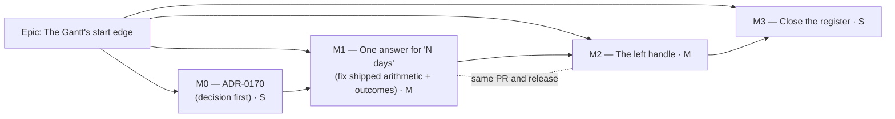

# Implementation Plan: The Gantt's start-edge resize

- **Feature spec:** [`./feature-spec.md`](./feature-spec.md)
- **Status:** Approved 2026-10-02 (product owner)
- **Owner:** — (the product owner approves; implementation goes to the **builder** agent, CLAUDE.md §19.14)

## Breakdown

### Epic

**The Gantt's start edge** — make "drag the left end of a bar" mean in the Gantt what it means on the
diagram, and make every Gantt "hold one end" write count working days. Roadmap theme:
`PROJECT_BRIEF.md` §8, the Gantt's "edit supported".

---

## Milestone 0 — ADR-0170, before any code

**Outcome:** the decision is filed: the deferral ADR-0095 recorded is lifted, the arithmetic is
fixed to the diagram's, and the CQ answers are written down.
**Ships dark:** documents only; nothing user-facing.

#### Feature: M0-F1 — The ADR

> **Description:** write `docs/adr/0170-the-gantts-start-edge-writes-what-the-diagrams-writes.md`
> from the spec's §4.8 outline, with the CQ-1/2/3 answers as given.
> **Complexity:** S
> **Dependencies:** spec approved
> **Risks:** the ADR restates the brief's citations → every line number is re-read at writing time
> (the brief's `:1284` was already wrong).
> **Testing requirements:** `pnpm check:adr-coverage` (one line in CLAUDE.md §16), `pnpm check:spec-status`
> (this spec flips to `Approved` once cited — S3 refuses a cited `Draft`), `pnpm check:doc-links`.

##### Task M0-T1 — Write and register the ADR (≈ one PR, docs-only)

- **Complexity:** S · **Dependencies:** — · **Risks:** see above.
- **Testing:** the three checks above via `pnpm prepush`.
- **Development steps:**
  1. Write ADR-0170 (Status: Accepted; Amends ADR-0095 and ADR-0134).
  2. Add the §16 line to CLAUDE.md; set this spec's header to `Approved — <date>, CQ answers`.
  3. Add an "Amended by: ADR-0170" header note to ADR-0095 and ADR-0134 (the convention ADR-0134's
     own header follows for ADR-0148).

---

## Milestone 1 — One answer for "N days"

**Outcome:** dragging a Gantt bar's right end, typing a `Finish`, or typing a `Start` writes the same
working-day duration the diagram writes — a five-day task stretched over a weekend comes back the
length it was drawn. Every Gantt bar write reports its real outcome. Level-of-effort bars stop
offering a resize the engine ignores.
**Entry point:** the Gantt chart — the existing right-end handle (`data-bar-edge="finish"`), and the
`Start` / `Finish` cells (accessible names `Start, <activity>` / `Finish, <activity>`).
**Journey:** `apps/web/e2e-gantt-editing/grid-edit.spec.ts` — the typed-`Finish` case asserts the
stored finish **equals the typed date** on a Mon–Fri plan across a weekend (it asserts only "not
equal to before" today, `:493-497`, which is why the defect passed); `bar-drag.spec.ts` gains a
finish-edge pointer drag across a weekend asserting the finish lands where dropped.

> **CQ-1 answered 2026-10-02: yes, in the same release as M2.** M1 is its own milestone and its own
> commit(s) — reviewable and revertable as a unit — but it does **not** ship alone: M1 and M2 land in
> **one PR and one release**, with no release between them. (Had the answer been "no", M1 would have
> shrunk to M1-F2 and M1-F3 and left the typed `Start` cell and the drag disagreeing.)

#### Feature: M1-F1 — One conversion

> **Description:** a Gantt `spanToPlacement` over the diagram's `drawnSpanPlacement`
> (`snap.ts:93-108`), fed the plan's working-day predicate built once in the host from
> `model.tsldCalendar` + `plan.plannedStart`; used by the finish-edge drag and both typed date cells.
> **Complexity:** M
> **Dependencies:** M0
> **Risks:**
> (a) Origin confusion — the Gantt draws from `chartAnchor`, writes count from `plannedStart`
> (`drag-day.ts:3-13`) → the predicate is keyed to `plannedStart` (as the diagram's is,
> `plan-workspace-toolbar.tsx:1068`), and a round-trip unit test draws with `barGeometry` and converts
> back, the pattern `drag-day.test.ts:103-125` already uses.
> (b) Calendar not loaded → `drawnSpanPlacement(…, null)` returns the calendar span (`snap.ts:101`);
> asserted, and stated in the docblock.
> (c) A per-row predicate rebuild → built in the host with `useMemo`; a unit test asserts referential
> stability across renders.
> **Testing requirements:** unit — weekend crossing for each of the three writers; holiday exception;
> null predicate; round trip at every zoom preset. Journey as above.

##### Task M1-T1 — The conversion and its callers

- **Complexity:** M · **Dependencies:** M0-T1 · **Risks:** (a)–(c).
- **Testing:** `drag-day.test.ts` (rewritten for the new function), `cell-commit.test.ts` (weekend
  cases for `Start` and `Finish`), a `GanttPanel.editing.test.tsx` case for the finish-edge commit.
- **Development steps:**
  1. Replace `durationDaysForFinishAtX` with `spanToPlacement`; keep `dateAtChartX`/`startDayAtChartX`.
  2. Thread `isWorkingDay` through `GanttBarDrag` and `CellWriteContext`; build it in
     `plan-workspace-toolbar.tsx`.
  3. Correct the docblocks that assert the old arithmetic: `cell-commit.ts:132-140`,
     `drag-day.ts:55-61`.
  4. Changeset: `@repo/web` **patch** ("Gantt durations count working days, matching the diagram").
     It releases together with M2's **minor** changeset, so the version that ships is a minor whose
     notes name both changes; the working-day fix is listed first and plainly, because it changes
     what three shipped controls write.

#### Feature: M1-F2 — Outcomes are awaited, not discarded

> **Description:** `GanttBarDrag.moveTo/resizeTo` return the workspace's outcome; the row announces
> **after** it, matching the diagram (`TsldPanel.tsx:2689-2710`): applied → the success sentence;
> conflict → the conflict sentence; rejection → "Couldn't move/resize the activity."
> **Complexity:** S
> **Dependencies:** —
> **Risks:** announcing twice (row + host) → one owner: the host awaits and announces; the row passes
> the sentence to say on success. Unit-tested by counting announcer calls.
> **Testing requirements:** unit per outcome branch for move, nudge, resize and Shift-nudge.

##### Task M1-T2 — Await and announce

- **Complexity:** S · **Dependencies:** — · **Risks:** above.
- **Testing:** `GanttPanel.editing.test.tsx` / a host test: applied, 409, 423, throw.
- **Development steps:**
  1. Change `plan-workspace-toolbar.tsx:1026-1027` from `void` to awaited, with the `.catch`.
  2. Move the announcements in `nudgeBar`, `resizeBar`, `commitDrag`, `commitResize` behind the outcome.

#### Feature: M1-F3 — One edge gate

> **Description:** `barEdgeGate(activity, drag, edge)` in `bar-drag.ts`: summary → milestone → LOE →
> (start only) frozen by actuals (`actualStart ?? actualFinish`, mirroring `progress.ts:84-86`) →
> permission. Used by `resizeBar`, both handles, and (start) the typed `Start` cell.
> **Complexity:** S
> **Dependencies:** CQ-2 answer
> **Risks:** the cell and the handle drift → `cell-gate.ts`/`cell-commit.ts` call the same function
> for the `Start` refusal; a structural test asserts no second literal of the reason string.
> **Testing requirements:** unit per branch with its spoken reason; LOE finish handle absent (component).

##### Task M1-T3 — The gate

- **Complexity:** S · **Dependencies:** M1-T2 · **Risks:** removing LOE resize is a behaviour change
  → changeset says so; ADR-0170 D3 records why.
- **Testing:** `bar-drag` unit; `GanttPanel` component case for LOE; `cell-commit` started refusal.
- **Development steps:**
  1. Add `barEdgeGate`; route `resizeBar` and the finish handle through it.
  2. `Start` cell refusal for started/finished activities (copy confirmed by ux-reviewer).
  3. File the `docs/TECH_DEBT.md` row: the diagram allows the start edge (and the move) on a started
     activity, writing an inert placement — with `compute.ts:110-112,364-366` as evidence.

##### Task M1-T4 — The journey

- **Complexity:** M · **Dependencies:** M1-T1..T3 · **Risks:** the fixture plan has no Mon–Fri
  calendar, so a weekend proves nothing → the fixture **binds a Mon–Fri calendar through the API and
  asserts it** before the case (whether a fresh plan already has one was not established for this
  spec); the dates are derived from the fixture, never hard-coded (`grid-edit.spec.ts:443-450`).
- **Testing:** `scripts/e2e-local.sh web:gantt-editing` locally before push (CLAUDE.md §19.8).
- **Development steps:** tighten the typed-`Finish` assertion; add a typed-`Start` weekend case
  asserting `visualEffectiveFinish` unchanged; add the finish-edge pointer drag case.

---

## Milestone 2 — The left handle

**Outcome:** a Planner holding the pen drags a bar's left end in the Gantt; the start moves, the
finish stays, one undo puts it back.
**Ships with M1:** same PR, same release (CQ-1). M2's journey runs on top of M1's corrected
arithmetic, which is the point of the ordering.
**Entry point:** the Gantt chart — the left end of an eligible task bar, located by
`[data-activity-id="<id>"] [data-bar-edge="start"]` (pointer-only, `aria-hidden`; its keyboard and
non-drag equivalent is the `Start` cell, `Start, <activity>`).
**Journey:** `apps/web/e2e-gantt-editing/bar-drag.spec.ts` (suite `web:gantt-editing`):

1. drag the left handle two columns left across a weekend on a Mon–Fri plan → poll the API:
   `visualStart` = the rolled-forward target, `constraintType` null, **`visualEffectiveFinish`
   unchanged** (the load-bearing assertion);
2. `Ctrl+Z` → `visualStart` and `durationDays` back to their prior values;
3. a milestone and a started activity carry **no** left handle (count 0) — paired with a positive
   count on an eligible bar in the same test, so the assertion cannot pass over an absent feature.

> **Existing test that will break, deliberately:** `bar-drag.spec.ts:81-83,205-219` locates the
> handle by `.cursor-ew-resize` and asserts `toHaveCount(1)`. A second handle makes it 2. Re-point it
> at `[data-bar-edge="finish"]` in the same commit, and say so in the commit message.

#### Feature: M2-F1 — Handle, preview, write

> **Description:** the left handle (spec §4.6), its commit (clamp at the finish, `spanToPlacement`,
> `drag.resizeStart`), and a live preview for **both** edges (left/width follow `deltaX` snapped to
> whole columns).
> **Complexity:** M
> **Dependencies:** M1
> **Risks:**
> (a) The two handles and the bar body overlap on a short bar → no left handle below 16 px; unit at
> 15/16 px.
> (b) Preview re-renders the window → it reads the hook's `deltaX`, which already publishes ≤ 1×/frame
> (`use-bar-pointer-drag.ts:71-81`); no new state.
> (c) Announcement says a date the engine then rolls → announce the **written** (rolled) date, as the
> diagram does (`TsldPanel.tsx:2696-2703`).
> (d) `startDay` for a finish milestone shifted (#381) → not reachable (milestones have no handle),
> but the write passes through `onTsldResize`'s own shift (`use-plan-workspace-model.ts:1397-1400`)
> unchanged.
> **Testing requirements:** component tests — handle presence per type/state, narrow rule, clamp,
> Escape, zero-move click, announcement after outcome; the journey.

##### Task M2-T1 — The handle and its write

- **Complexity:** M · **Dependencies:** M1 · **Risks:** (a), (c), (d).
- **Testing:** `GanttPanel.editing.test.tsx` cases; `bar-drag` unit for `resizeStart`.
- **Development steps:**
  1. Add `resizeStart` to `GanttBarDrag` → `model.onTsldResize({ activityId, startDay, durationDays })`.
  2. Render the left ``; `data-bar-edge` on both handles.
  3. Rewrite the docblock at `GanttPanel.tsx:1591-1600` (it still describes the deleted modes).

##### Task M2-T2 — The preview, and `pointercancel`

- **Complexity:** S · **Dependencies:** M2-T1 · **Risks:** a `pointercancel` with no handler leaves
  window listeners attached until some later `pointerup`, which would then commit the stale delta —
  plausible from the code (`use-bar-pointer-drag.ts:110-112` registers move/up/keydown only) but
  **not reproduced**; the unit test is written to show it before the fix.
- **Testing:** `use-bar-pointer-drag.test.ts` — `pointercancel` then `pointerup` commits nothing.
- **Development steps:** preview both edges; add the `pointercancel` listener (treated as Escape).

##### Task M2-T3 — The journey and the shortcuts sheet

- **Complexity:** M · **Dependencies:** M2-T1, M2-T2 · **Risks:** pointer drags in Playwright land a
  pixel off a column boundary → drag by whole `pxPerDay` multiples from the handle's measured box
  centre, and assert API values rather than pixels.
- **Testing:** the three journey steps above; `scripts/e2e-local.sh web:gantt-editing`.
- **Development steps:** journey; one `PlanShortcutsHelp.tsx` Gantt row; changeset `@repo/web`
  **minor** ("Drag a bar's start in the Gantt").

---

## Milestone 3 — Close the register

**Outcome:** no document still says the Gantt lacks the start edge, or cites the wrong line for it.
**Ships dark:** documents only.

#### Feature: M3-F1 — The documents

> **Description:** `docs/BACKLOG.md` Gantt row rewritten from the code (the start-edge clause and its
> `:1284` citation go); CLAUDE.md §1 banner's "substantially … start-edge resize is deliberately absent
> (ADR-0095 D4)" re-derived — closed only if the brief's §8 has no other residual, otherwise naming
> what remains; ADR-0170 Consequences notes M1/M2 shipped versions.
> **Complexity:** S
> **Dependencies:** M2 released
> **Risks:** writing the closure from this spec rather than from the code (CLAUDE.md §19 "re-verify a
> spec's problem statement") → every claim re-read at the time.
> **Testing requirements:** `pnpm check:counts`, `check:doc-links`, `check:spec-status` (this spec →
> `Accepted — shipped (ADR-0170)`).

##### Task M3-T1 — Rewrite

- **Complexity:** S · **Dependencies:** M2 · **Risks:** above.
- **Testing:** `pnpm prepush`.
- **Development steps:** the three edits above; no changeset (docs only).

---

## Sequencing & slices

| Order | Milestone            | User-facing | Release                 | Why this order                                                                           |
| ----- | -------------------- | ----------- | ----------------------- | ---------------------------------------------------------------------------------------- |
| 0     | M0 — ADR             | No          | Own PR (docs only)      | Decision before code (the ADR-0134 precedent).                                           |
| 1     | M1 — working days    | **Yes**     | **With M2** (CQ-1)      | The new gesture's promise depends on it; it is also a live defect on shipped controls.   |
| 2     | M2 — the left handle | **Yes**     | **With M1** (CQ-1)      | Keyboard route already exists (ADR-0134), so no window where only pointer users have it. |
| 3     | M3 — documents       | No          | After the M1+M2 release | Written after release, from the code.                                                    |

**No feature flag** (ADR-0088 D1). M1 and M2 are separate milestones and commits but **one release**
(CQ-1, 2026-10-02): there is no version in which the Gantt has the corrected arithmetic and no left
handle, or the reverse. Rollback is a revert of the release's commits, not of one milestone's release.

## Definition of Done (per task)

Each task's PR must satisfy the Feature Completion Criteria in
[`docs/PROCESS.md`](../../PROCESS.md) — code, tests, docs, security, performance, accessibility,
Docker build, CI, changelog, version impact — with `pnpm prepush` **run**, and
`scripts/e2e-local.sh web:gantt-editing` run for M1 and M2.

**Reviews:** M1 — component-reviewer (the `GanttBarDrag` contract), ux-reviewer (refusal and conflict
copy), test-engineer (the journey). M2 — accessibility-reviewer (2.5.7 reading of the typed-cell
alternative; 2.5.8 Equivalent exception; announcement timing), component-reviewer, ux-reviewer,
performance-reviewer (preview render cost on a 2,000-row plan). database-architect, api-reviewer and
backend-performance-reviewer are **not** required: no schema, endpoint or query changes.
security-reviewer optional (same endpoint and guards).

## Risks & assumptions (rollup)

| Risk / assumption                                                                | Likelihood | Impact | Mitigation                                                                                                                                                                                                         |
| -------------------------------------------------------------------------------- | ---------- | ------ | ------------------------------------------------------------------------------------------------------------------------------------------------------------------------------------------------------------------ |
| M1 changes what three shipped controls write; a planner notices durations differ | med        | low    | It is the diagram's existing behaviour; changeset and ADR say so plainly. It now arrives in the same release as the left handle, so the release notes must name it first and not let the headline feature bury it. |
| M1 and M2 share one release, so a defect in either holds back or reverts both    | med        | low    | Separate commits keep each revertable; the working-day fix is verified by M1's own journey cases before M2 is started.                                                                                             |
| Plan-calendar predicate miscounts an activity on its own calendar                | med        | low    | Shared residual with the diagram (`snap.ts:48-52`); engine re-derives; stated, not fixed here.                                                                                                                     |
| Refusing started activities in the Gantt while the diagram allows them           | certain    | low    | `TECH_DEBT` row filed in M1-T3 for the diagram's fix.                                                                                                                                                              |
| 2.5.7 reviewer rules the typed cell is not a valid non-drag alternative          | low        | med    | Asked before M2 ships; fallback is a dedicated "Change start…" row-menu item opening the cell.                                                                                                                     |
| Journey fixture lacks a Mon–Fri calendar, so weekend cases pass vacuously        | med        | high   | Fixture binds and asserts the calendar first (M1-T4).                                                                                                                                                              |
| `pointercancel` gap commits a stale drag on touch                                | low        | med    | Unit test shows it, then the fix (M2-T2).                                                                                                                                                                          |
| Existing `.cursor-ew-resize` journey locator breaks                              | certain    | low    | Re-pointed to `data-bar-edge` in M2-T1, named in the commit.                                                                                                                                                       |
