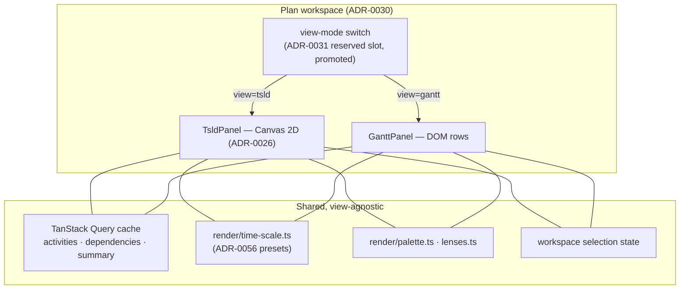
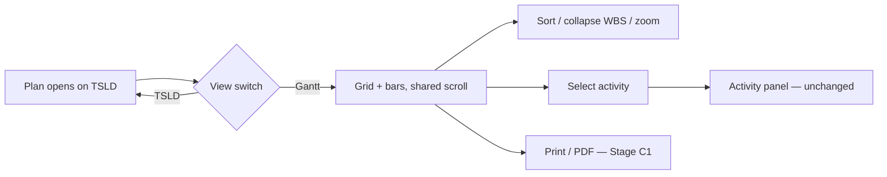

# Feature Spec: Gantt view

- **Status:** Draft — awaiting approval
- **Author(s):** Technical Lead (with the Product Owner)
- **Date:** 2026-07-28
- **Tracking issue / epic:** —
- **Roadmap link:** [`ROADMAP.md`](../../ROADMAP.md) — "Gantt view — the secondary tabular projection of the same model"
- **Related ADR(s):** proposes **ADR-0059** (rendering substrate + the view seam); builds on ADR-0026 (TSLD canvas), ADR-0029/0030 (shell + workspace), ADR-0031 (toolbar registry — the reserved `view-mode` slot), ADR-0038 (WBS), ADR-0055 (surface scopes), ADR-0056 (time axis)

## 1. Business understanding

### Problem

SchedulePoint's thesis is that the **TSLD is the primary editing surface** — the brief is explicit that the graphical diagram must not become "a secondary visualisation of Gantt-based data entry" ([`PROJECT_BRIEF.md`](../../PROJECT_BRIEF.md) §1). That thesis is now built and shipped.

But the brief has always listed a Gantt view as a **Must-have** (§8: "Gantt view as an alternate projection of the same data (read-primary; edit supported)"), and it is the last one outstanding. The reason is not planner preference — it is that **the people a planner reports to do not read logic diagrams.** A site manager, a client's QS, a main contractor's commercial lead and a bank's monitoring surveyor all read bar charts. Today, the only way to give them one is to export to XER/MSPDI and open it in the tool SchedulePoint is meant to replace.

That is a live commercial gap, not a cosmetic one:

- **Nothing in SchedulePoint produces a document a stakeholder recognises.** The PNG/PDF export (Stage C1) exports the TSLD, which is the wrong artefact for a progress meeting.
- **The External-Guest share link (ADR-0051) shares a TSLD.** We built a read-only door for exactly this audience and put the wrong view behind it.
- **WBS hierarchy (ADR-0038) has no surface that does it justice.** Summary rollup exists in the engine and in the activity table's nesting, but the collapsible summary bar — the thing that makes a 2,000-activity programme legible to a non-planner — has no home. `TECH_DEBT #37` records the canvas version as deferred; the honest answer is that the Gantt, not the canvas, is where it belongs.

**Why now.** The model is complete and stable. Every field a Gantt needs — `earlyStart`/`earlyFinish`/`lateStart`/`lateFinish`, `totalFloat`, `freeFloat`, `isCritical`, `parentId`, `percentComplete`, `levelingDelay` — is already computed, persisted and exposed. This is a projection of data that exists, not new capability. It is also the cheapest remaining Must-have.

### Users

| Role                                 | Need                                                                                             |
| ------------------------------------ | ------------------------------------------------------------------------------------------------ |
| **Planner** (primary author)         | A familiar cross-check of their own logic; a view to hand over and to print for issue.           |
| **Contributor** (site/works manager) | Read their activities as bars against dates, and update progress against a row they can find.    |
| **Viewer** (commercial, client-side) | Read the programme the way they read every other programme, without being taught a new notation. |
| **External Guest** (share link)      | The same, without an account — the audience ADR-0051 built the door for.                         |

### Primary use cases

1. **Read the programme as bars** — a sortable grid of activities beside a time-scaled bar chart, rows and bars in lockstep.
2. **Collapse to the story** — roll a 2,000-activity programme up to its WBS summary bars, expand only the branch under discussion.
3. **See the critical path and the float** — the same criticality and float the TSLD shows, in the notation this audience expects.
4. **Compare to baseline** — the variance bar ADR-0025 explicitly deferred "until a Gantt exists".
5. **Issue it** — print / export to PDF at a sensible page break, reusing the Stage C1 machinery.

### User journeys

**Happy path (read).** Planner opens a plan → workspace opens on the TSLD as today → picks **Gantt** in the view switch → the same plan renders as grid + bars, WBS collapsed to level 2 → expands "Substructure" → sees the critical path in red and one activity with 12 days' negative float → switches back to the TSLD to fix the logic → the Gantt reflects it after the existing auto-recalc.

**Hand-over.** Planner sets the view to Gantt, sets a date range, prints to PDF, attaches it to the monthly report. Alternatively creates a share link (ADR-0051) that opens on the Gantt for a client who has never seen a TSLD.

**Progress (later milestone).** Site manager opens the plan on a tablet, finds their activity by scrolling the grid, sets 60% complete in the row, and watches the bar fill.

### Expected outcomes

- SchedulePoint can be handed to a non-planner stakeholder without an export to a competitor's format.
- The last Must-have in the brief closes; §8 is complete.
- WBS hierarchy and baselines each gain the surface their ADRs anticipated.

### Success criteria

- A planner can produce a printable bar chart of a real programme without leaving the app.
- **≥ 70% of _editing_ sessions still happen in the TSLD** (`PROJECT_BRIEF.md` §7). ⚠️ **This metric is not measurable today** — it depends on view-mode telemetry, and there is no telemetry facade in the codebase (the `lib/telemetry.ts` two documents referenced was never written; see ADR-0058). Either the metric is deferred with that acknowledged, or a minimal view-mode counter is in scope. **Recommended: acknowledge and defer** — do not build a telemetry stack to measure a number nobody will act on this year.
- The Gantt renders a 2,000-activity plan without dropping frames on the ADR-0026 hardware envelope.

### Open questions

Numbered; **Q1–Q3 are the ones that change the design** and are the only ones I would block on.

| #      | Question                                                                                   | Recommended default                                                                                                                                                             |
| ------ | ------------------------------------------------------------------------------------------ | ------------------------------------------------------------------------------------------------------------------------------------------------------------------------------- |
| **Q1** | Is the first ship **read-only**, or editable?                                              | **Read-only.** The brief says "read-primary". Editing pulls in the pen (ADR-0028), undo/redo (ADR-0048) and drag semantics (ADR-0033 Early vs Visual) — a milestone of its own. |
| **Q2** | Do **dependency arrows** appear in the Gantt?                                              | **No, not in M1.** They are the TSLD's job, and arbitrary routing is what forced Canvas-2D there. Offer them later as an opt-in overlay for the selected activity only.         |
| **Q3** | Is the Gantt a **peer view** (switch, one at a time) or a **second pane** beside the TSLD? | **Peer view**, via the `view-mode` slot ADR-0031 already reserved. Two time-scaled surfaces side by side on one screen is a worse experience than either alone.                 |
| Q4     | WBS summary rows in M1?                                                                    | **No** — M1 is a flat, sorted list; hierarchy is M2. Keeps the first slice thin and the rollup risk isolated.                                                                   |
| Q5     | Does the share link (ADR-0051) open on the Gantt?                                          | Yes, but **later** — needs a per-share default-view field. Not M1.                                                                                                              |
| Q6     | Does the Gantt get its own zoom presets?                                                   | **Reuse ADR-0056's** `pxPerDayForPreset(level, width)` verbatim. A second time-axis implementation is how the two views drift apart.                                            |

## 2. Functional requirements

### User stories & acceptance criteria

**GV-1 — Switch to the Gantt view**

> As a Planner, I want to switch the plan workspace between the TSLD and a Gantt, so I can read the same schedule in the notation my audience expects.

- **Given** a plan is open and the flag is on, **when** I pick "Gantt" in the view switch, **then** the workspace region renders the Gantt and the URL carries `?view=gantt`.
- **Given** a URL with `?view=gantt`, **when** I load it cold or reload, **then** the Gantt is the view — the choice is deep-linkable and survives a refresh.
- **Given** the flag is off, **then** no switch renders and the workspace is byte-for-byte today's (the parity contract).
- The switch is a **radiogroup**, keyboard-operable, with the current view exposed via `aria-checked`.

**GV-2 — Read the grid and bars in lockstep**

- **Given** the Gantt is open, **then** each activity is one row: identity/date columns on the left, a time-scaled bar on the right, sharing **one vertical scroll**.
- **Given** I scroll vertically, **then** grid and bars never desynchronise — including during momentum scroll and at the list ends.
- **Given** I scroll horizontally in the bar region, **then** the grid columns stay pinned and the time ruler moves with the bars.
- **Given** a milestone (zero duration), **then** it renders as a diamond at its date, not a zero-width bar.

**GV-3 — Criticality, float and progress read correctly**

- Critical activities are distinguishable **without relying on colour alone** (WCAG 1.4.1) — the existing TSLD treatment is the reference.
- Total float renders as a trailing float bar behind the activity bar, matching the ADR-0054 float-tail semantics.
- `percentComplete` renders as a progress fill within the bar.
- Every visual encoding has a **text equivalent in the row** — a screen-reader user reads dates and float from the grid, never from the bar.

**GV-4 — Sort and column control**

- Sortable by name, code, early start, early finish, total float, and duration. Sort is URL-backed (`?sort=`), consistent with the ADR-0053 M6 decision to put list state in typed search params.
- Sort applies to the whole list, not the loaded page.

**GV-5 — Empty, loading and error states**

- Empty plan → the same "no activities yet" affordance the workspace already uses, not a blank grid.
- Not-yet-calculated plan (no `earlyStart`) → rows render with a "not calculated" state and a Recalculate affordance, never bars at epoch zero.
- Load failure → the standard error surface with a retry, announced.

### Workflows

1. **Open → switch → read → switch back.** No data refetch on switch: both views read the same TanStack Query cache entries.
2. **Recalculate → both views update.** The Gantt subscribes to the same query keys, so the existing coalesced auto-recalc (ADR-0032) already covers it.
3. **Select an activity in one view → it is selected in the other.** Selection is workspace state, not view state.

### Edge cases

| Case                                           | Expected                                                                                        |
| ---------------------------------------------- | ----------------------------------------------------------------------------------------------- |
| 2,000+ activities                              | Row virtualization; only visible rows exist in the DOM.                                         |
| Activity with no computed dates                | Row renders, bar region shows the "not calculated" treatment.                                   |
| Negative float                                 | Bar and float tail render; the row shows the negative number explicitly.                        |
| Plan spanning 10 years at day zoom             | Horizontal extent is virtualized or clamped; the view must not allocate a 10-year-wide surface. |
| Zero-duration task that is **not** a milestone | Per ADR-0035 §-zero-task rules — a task, not a diamond. The two are distinguished.              |
| Very long activity name                        | Truncates with a tooltip and full text in the accessible name.                                  |
| Browser zoom to 200%                           | Layout holds (WCAG 1.4.4); the grid/bar split reflows rather than clipping.                     |

### Permissions

**No new permission.** The Gantt reads exactly what the activity list already reads (`activity:read` via the existing org-scoped endpoints). If Q1 flips to editable, it reuses the existing `activity:update` + `assertHoldsPen` gate — the API stays the sole trust boundary, and a new view cannot widen it.

### Validation rules

None new for a read-only view. Editing (deferred) reuses the existing DTOs unchanged.

### Error scenarios

| Scenario                     | Detection        | UX                                       | Status |
| ---------------------------- | ---------------- | ---------------------------------------- | ------ |
| Activity list fetch fails    | query error      | error panel + retry, announced           | —      |
| Plan not found / cross-org   | existing guard   | 404, as everywhere (no existence oracle) | 404    |
| Edit without the pen (later) | `assertHoldsPen` | existing 423 routing, unchanged          | 423    |

## 3. Technical analysis

| Area           | Impact   | Notes                                                                                                                                  |
| -------------- | -------- | -------------------------------------------------------------------------------------------------------------------------------------- |
| Frontend       | **high** | A new feature module + a new workspace view + row virtualization. The bulk of the work.                                                |
| Backend        | **none** | Every field already exists on the activity DTO and is already exposed.                                                                 |
| Database       | **none** | No schema change. No migration.                                                                                                        |
| API            | **none** | No new endpoint, no contract change. (Q5's share-default-view would be additive, later.)                                               |
| Security       | **none** | No new endpoint, no new permission, no new trust boundary.                                                                             |
| Performance    | **med**  | Row virtualization is mandatory; `ActivitiesTable` (588 lines) **is not virtualized today** — verified. The Gantt cannot inherit that. |
| Infrastructure | **none** | —                                                                                                                                      |
| Observability  | **none** | Unless the §7 view-mode metric is pulled in (see Success criteria).                                                                    |
| Testing        | **high** | Unit (pure layout maths), component (grid/bar sync, states), a11y (axe + keyboard), e2e (flag-on journey), **flag-off parity**.        |

**The critical-path gate is the CPM engine's absence from this work.** The Gantt reads persisted computed columns. `computeSchedule` is not called, not changed, and not linked against — so the ADR-0034 recalc parity gate is **structurally** untouched, in the same sense as ADR-0052/0054.

### Dependencies

- **Nothing must land first.** Every input exists.
- **Reuses:** `render/time-scale.ts` (the axis and ADR-0056 presets), `render/palette.ts` + `render/lenses.ts` (colour), `ActivitiesTable`'s column semantics, the ADR-0031 toolbar registry, ADR-0055 surface scopes, the Stage C1 export/print machinery (later milestone).
- **Unblocks:** the Gantt baseline variance bar (ADR-0025's deferred follow-up) and a stakeholder-appropriate share link (ADR-0051, Q5).

## 4. Solution design

### Architecture overview

The load-bearing property: **the two views share their data, their time axis, their palette and their selection, and nothing else.** Neither imports the other. A `gantt/` feature module sits beside `tsld/`, and the switch is the only thing that knows both exist.

### Data flow

No new data flow. The Gantt subscribes to the query keys the workspace already populates; a recalculate invalidates them and both views re-render. There is no Gantt-specific fetch, no Gantt-specific cache, and no server round-trip on view switch.

### User flow

### Database changes

**None.**

### API changes

**None.**

### Component changes

New feature module `apps/web/src/features/gantt/`:

- `components/GanttPanel.tsx` — the view; owns the shared scroll container.
- `components/GanttGrid.tsx` — the left columns (virtualized rows).
- `components/GanttBars.tsx` — the right bar region (same row model, same virtualizer).
- `components/GanttRuler.tsx` — the time header, fed by `time-scale.ts`.
- `layout/` — **pure modules**, unit-testable without a DOM: `row-model.ts` (flatten/sort/collapse), `bar-geometry.ts` (dates → x/width, milestone/float/progress geometry).

Changed: `tsld-toolbar-items.tsx` (`view-mode` promoted from `isVisible: () => false` to a real segmented control), `plan-workspace.tsx` (renders one view or the other).

### Implementation approach & alternatives

**Chosen: DOM rows, virtualized, with the time axis shared from the TSLD's pure modules.** This is the ADR-0059 decision.

The TSLD is Canvas-2D because it must draw **thousands of simultaneously-visible items at arbitrary 2-D positions with routed link geometry** — ADR-0026 measured that and set a 4 ms budget. **A Gantt is not that problem.** It is a vertical list with exactly one bar per row and no routing; row virtualization bounds the live node count to what fits the viewport (~40 rows), regardless of whether the plan has 200 activities or 20,000. Reaching for canvas here would import the cost ADR-0026 accepted — a parallel focusable DOM layer built solely to make a canvas accessible — to solve a problem that DOM solves natively.

Rejected alternatives:

- **Canvas-2D bars beside a DOM grid.** Reuses `paint.ts`, but requires synchronising two independent scroll models pixel-for-pixel and rebuilding the a11y shadow layer. The sync is the exact defect class users notice instantly, and we would be choosing it voluntarily.
- **Extend `ActivitiesTable` with a bar column.** Tempting — the grid half exists. Rejected: the table is not virtualized, its row model is not shared with anything, and a bar column inside a `<td>` cannot pin columns while the time region scrolls horizontally. It would also entangle the Gantt's lifecycle with a component eight other features already depend on.
- **A third-party Gantt component.** Rejected on the standing argument in `docs/specs/engine-conformance-framework/feature-spec.md` §49: we own the scheduling semantics precisely so we are not bound to a vendor's interpretation of them. A component that renders bars from its own model would need our CPM outputs marshalled into its shape, and would fight the design system on every token.
- **A separate `/gantt` route rather than a view switch.** Rejected: the workspace shell (ADR-0029/0030) mounts once and owns selection; a sibling route would duplicate that and lose selection on switch.

**Feature flag:** `VITE_GANTT_VIEW`, default off, with a flag-off parity suite pinning the workspace — the rollback contract that ADR-0053 M6 established and deliberately kept.

## 5. Links

- [`PROJECT_BRIEF.md`](../../PROJECT_BRIEF.md) §8 (Must-have), §11 (view definition), §7 (the 70% metric)
- [`ROADMAP.md`](../../ROADMAP.md) — Gantt view
- [ADR-0026](../../adr/0026-tsld-canvas-rendering-and-architecture.md) — why the TSLD is canvas, and why that reasoning does not transfer
- [ADR-0031](../../adr/0031-tsld-toolbar-registry-and-taxonomy.md) §296 — the reserved `view-mode` slot
- [ADR-0038](../../adr/0038-wbs-activity-hierarchy.md) — the hierarchy this view finally surfaces
- [ADR-0025](../../adr/0025-baselines-snapshot-and-variance.md) — the deferred Gantt variance bar
- [ADR-0056](../../adr/0056-tsld-time-axis-legibility-and-preset-framing.md) — the time axis being reused
- [`TOOLBAR_ROADMAP.md`](../../TOOLBAR_ROADMAP.md) — the view-mode stub's stated promotion condition
