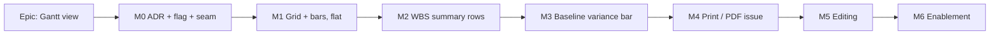

# Implementation Plan: Gantt view

- **Feature spec:** [`feature-spec.md`](feature-spec.md)
- **Status:** **Approved** (2026-07-28) — unchanged by the Q1–Q3 answers, which came back as the defaults this plan assumes
- **Owner:** Technical Lead
- **Flag:** `VITE_GANTT_VIEW` — **default ON since 2026-07-28 (M6)**

## Breakdown

### Epic

**Gantt view** — the brief's last outstanding Must-have: a conventional grid-and-bar projection of the same model, for the audience that does not read logic diagrams. Maps to the `ROADMAP.md` "Gantt view" line.

---

### Milestone M0 — Decision & seam (dark)

**Outcome:** the view switch exists behind a flag and renders an empty Gantt shell. Nothing user-visible with the flag off.

#### Feature: The rendering decision and the view seam

> **Description:** ADR-0059 (DOM rows, not canvas — and why ADR-0026's reasoning does not transfer), the `VITE_GANTT_VIEW` flag, promotion of the reserved `view-mode` toolbar slot, and URL-backed view state.
> **Complexity:** M
> **Dependencies:** none
> **Risks:** promoting `view-mode` touches a shipped, default-on toolbar → the flag-off parity suite must pin the toolbar before the item changes.
> **Testing requirements:** unit (view param parse/serialise); component (switch renders only when flagged, radiogroup semantics); **flag-off parity** for the workspace and toolbar.

##### Task 0.1 — ADR-0059 + flag

- **Description:** Write ADR-0059 recording the substrate decision and its alternatives (from the spec §4). Add `VITE_GANTT_VIEW` to `config/env` and `.env.example`, default off.
- **Complexity:** S · **Dependencies:** none
- **Risks:** an ADR written after the code is an ADR nobody reads → write it first, and let review push back on it.
- **Testing:** none (docs + config); `check:doc-links` covers the links.
- **Steps:** 1) draft ADR-0059; 2) add the flag; 3) index it in `CLAUDE.md` §16 and `docs/adr/README.md`.

##### Task 0.2 — URL-backed view state

- **Description:** `?view=tsld|gantt` as a typed search param on the plan route, defaulting to `tsld`. Follows the ADR-0053 M6 precedent (list state belongs in the URL, not component state).
- **Complexity:** S · **Dependencies:** 0.1
- **Risks:** an unknown `?view=` value must fall back to `tsld`, not crash → parse defensively, test the bad-input case.
- **Testing:** unit for the parser incl. garbage input; route test for deep-link and reload.

##### Task 0.3 — Promote the `view-mode` toolbar slot

- **Description:** Turn `isVisible: () => false` into a real segmented radiogroup (TSLD | Gantt), visible only when the flag is on. `TOOLBAR_ROADMAP.md` and ADR-0031 §296 both state the promotion condition — update both in the same PR.
- **Complexity:** M · **Dependencies:** 0.2
- **Risks:** ADR-0055 §8.4 decided _not_ to ship a `Gantt | Network` control while only one view existed. That condition is now met for Gantt — record the amendment explicitly rather than silently contradicting it.
- **Testing:** component (roving focus, `aria-checked`, activation); **flag-off parity** asserting the toolbar is byte-for-byte unchanged.

##### Task 0.4 — Empty `GanttPanel` behind the switch

- **Description:** The panel mounts, occupies the workspace region, renders an explicit "not built yet" state. Proves the seam without any layout work.
- **Complexity:** S · **Dependencies:** 0.3
- **Testing:** component (switching mounts/unmounts without losing selection).

---

### Milestone M1 — Grid + bars (the substance)

**Outcome:** a planner can read a real plan as a flat, sorted grid-and-bar chart with criticality, float and progress.

#### Feature: Row model and bar geometry (pure)

> **Description:** The two pure modules everything else depends on. No DOM, no React — unit-testable in isolation, the `render/*` precedent.
> **Complexity:** M · **Dependencies:** M0
> **Risks:** date→pixel maths duplicated from the TSLD would drift → import `time-scale.ts`, do not reimplement (spec Q6).
> **Testing:** unit only, but exhaustive: boundaries, milestones, negative float, uncalculated activities, DST/timezone.

##### Task 1.1 — `layout/row-model.ts`

- **Description:** Activities → an ordered flat row list. Sort comparators (name, code, early start, early finish, total float, duration), stable and total.
- **Complexity:** S · **Testing:** unit incl. ties, nulls-last for uncalculated, and sort stability.

##### Task 1.2 — `layout/bar-geometry.ts`

- **Description:** A row + the time scale → bar `x`/`width`, milestone diamond, float tail extent, progress fill fraction. Consumes `time-scale.ts`; adds no axis maths of its own.
- **Complexity:** M · **Testing:** unit — zero duration, sub-pixel widths (clamp to a visible minimum), negative float, null dates, bars entirely off-viewport.

#### Feature: The rendered view

> **Complexity:** L · **Dependencies:** 1.1, 1.2
> **Risks:** grid/bar scroll desync is the defect users notice instantly → **one** scroll container owning both, asserted by test, not two synchronised ones.
> **Testing:** component, a11y (axe + keyboard), and a perf test that asserts the _shape_ of the cost (rendered row count bounded), per the ADR-0054 counting-stub precedent.

##### Task 1.3 — Virtualized shared-scroll shell

- **Description:** `GanttPanel` owns one vertical virtualizer; `GanttGrid` and `GanttBars` render the same window. Left columns pinned; the bar region scrolls horizontally under a sticky `GanttRuler`.
- **Complexity:** L · **Dependencies:** 1.2
- **Risks:** `ActivitiesTable` is **not** virtualized (verified) — there is no in-repo pattern to copy except the navigator tree (HN-C2). Reuse that approach; do not invent a third.
- **Testing:** component (scroll keeps rows aligned; ends of list); perf-shape test at 2,000 rows.

##### Task 1.4 — Bars, milestones, criticality, float, progress

- **Description:** Render the geometry using `palette.ts`/`lenses.ts` tokens. Criticality distinguished by more than hue (WCAG 1.4.1) — the defect class ADR-0055 was written about.
- **Complexity:** M · **Dependencies:** 1.3
- **Testing:** component per encoding; token-contrast coverage across themes × surfaces.

##### Task 1.5 — Columns, sort, and the states

- **Description:** The grid columns, URL-backed sort, and the empty / not-calculated / error / loading states from spec GV-5.
- **Complexity:** M · **Dependencies:** 1.3
- **Testing:** component per state; sort round-trips through the URL.

##### Task 1.6 — Accessibility pass

- **Description:** Every bar's information available as row text; the grid is a real `grid`/`table` with correct semantics; full keyboard operability; result count announced (the WCAG 4.1.3 lesson from ADR-0053 M6).
- **Complexity:** M · **Dependencies:** 1.4, 1.5
- **Testing:** axe across themes; keyboard-only traversal; SR-name assertions.

---

### Milestone M2 — WBS summary rows

**Outcome:** a 2,000-activity programme collapses to its structure. Closes the surface gap `TECH_DEBT #37` records.

- **2.1** Extend `row-model.ts` with the parent tree, expand/collapse, and URL-backed expansion state. _(M, unit)_
- **2.2** Summary bar geometry — span from earliest descendant start to latest finish. **Read the ADR-0035 §24 rollup rules; do not re-derive them in the client.** _(M, unit)_
- **2.3** Render summary rows: indentation, disclosure control, `aria-expanded`, `aria-level`. _(M, component + a11y)_

**Risk:** a client-side rollup that disagrees with the engine's is worse than no rollup. Mitigation: assert equality against the engine's persisted summary values in a test, and treat divergence as a bug in the client.

---

### Milestone M3 — Baseline variance bar

**Outcome:** the comparison ADR-0025 deferred "until a Gantt exists".

- **3.1** Ghost baseline bar beneath the current bar, from the existing variance endpoint. _(M)_
- **3.2** Variance readout in the row + a `View▾` toggle for the overlay. _(S)_

**Note:** amend ADR-0025's "deferred" line rather than leaving it stale — the same lock-step rule the reconciliation pass enforces.

---

### Milestone M4 — Print & PDF issue — **landed**

**Outcome:** a planner produces a document for a progress meeting without leaving the app.

- **4.1** ✅ A **print document**, not a print stylesheet (ADR-0059 §6). Investigating 4.1 turned up the blocker that decided it: printing a virtualized list prints only the rows on screen, and the shell's clipped panes would crop it further. `GanttPrintSurface` mounts detached, renders every row, fits the whole span to the page, and delegates pagination to a real `<thead>` — which is how the ruler repeats per page. The container/lifecycle convention the TSLD image path already used is extracted to `lib/print-document.ts` + `styles/print-document.css` and shared. _(M)_
- **4.2** ❌ **Not done, deliberately.** The Stage C1 PDF path embeds a PNG from `renderExportImage` — a canvas rasterisation, which cannot render a DOM Gantt (verified by reading `export/pdf.ts`, not assumed). Browser print-to-PDF covers the need today. A native Gantt PDF would need a second, DOM-aware renderer; that is its own spec, not a task in this one.

**Risk (realised as expected):** the existing PDF path is canvas-image-based, so 4.2 spun out rather than being forced.

---

### Milestone M5 — Editing (only if Q1 says so)

**Outcome:** duration and dates editable from the Gantt, per `PROJECT_BRIEF.md` §11.

- **5.1** Inline duration/date editing in the grid, through the existing mutations. _(M)_
- **5.2** Bar drag/resize reusing the ADR-0052 gesture semantics and ADR-0033's Early/Visual split. _(L)_
- **5.3** Pen (ADR-0028) and undo/redo (ADR-0048) integration — both are view-agnostic and should need no new server surface. _(M)_

**Gate:** do not start M5 until M1–M2 have shipped and been used. The brief says "read-primary"; building the editor first would invert that on the evidence of nothing.

---

### Milestone M6 — Enablement — **landed**

**Outcome:** `VITE_GANTT_VIEW` default-on (2026-07-28).

- **6.1** ✅ Review pass over the combined diff — run **inline, not by the specialist subagents** (`.claude/agents/`), which the session that built this had not been asked to invoke. Worth naming: the ADR-0053 M6 / ADR-0056 M7 passes used the agents, and their value was independent eyes. This pass had one pair. The blocking finding was a **lit-but-inert control**: `setZoomPreset` delegated only to the canvas handle, which is null while the Gantt is mounted, so the zoom presets were enabled and silently did nothing — indistinguishable to a user from a slow feature. The preset is shared state both views read, so it now sets that first and commands the canvas second; stepping, fitting and go-to-date have no Gantt equivalent and shade with a reason (`canvasActive`). Pinned by `features/gantt/toolbar-in-gantt.test.tsx`.
- **6.2** ✅ Flag-on journey `apps/web/e2e-gantt/` + its own CI step (`pnpm --filter @repo/web test:e2e:gantt`).
- **6.3** ⚠️ **Partly.** The claim the substrate decision rests on — live node count bounded by the viewport, not the plan — **is** measured in a real browser with the real virtualizer (`e2e-gantt/gantt-scale.spec.ts` seeds two plans an order of magnitude apart and asserts an identical row window). What is **not** measured is frame timing on the ADR-0026 §16 hardware envelope: the only browser CI has is a headless Chromium on a shared runner. Recorded as `TECH_DEBT #60` rather than claimed — the distinction `TECH_DEBT #59` exists to protect.
- **6.4** ✅ Flag flipped; the flag-off parity suites are kept and pinned, not weakened. That is the rollback contract.

## Sequencing & slices

M0 → M1 is the only hard ordering; **M1 is independently shippable and is the whole point** — everything after it is additive. M2 and M3 can swap. M4 may spin out into its own spec if 4.2 proves to need a server-side renderer. M5 is gated on Q1 and on M1 having been used in anger.

Each milestone keeps `main` releasable: the flag is off until M6, and every milestone carries a flag-off parity suite.

## Definition of Done (per task)

The repo's standard (`PROCESS.md`): code to the approved design, tests (unit + component + a11y as applicable), docs in lock-step, specialist review where the task touches their invariants, CI green, changeset for user-visible change, version impact assessed.

Additionally, for every task in this epic: **the CPM engine is not imported, not called and not changed.** The ADR-0034 recalc parity gate stays structurally trivial, and a diff that breaks that property is out of scope by construction.

## Risks & assumptions (rollup)

| Risk                                                                   | L   | I   | Mitigation                                                                                                           |
| ---------------------------------------------------------------------- | --- | --- | -------------------------------------------------------------------------------------------------------------------- |
| Grid/bar scroll desync                                                 | M   | H   | One scroll container, not two synchronised. Asserted by test.                                                        |
| Virtualization is new ground — the activities table has none           | M   | M   | Reuse the navigator-tree approach (HN-C2); don't invent a third pattern.                                             |
| The Gantt becomes the default surface and erodes the TSLD-first thesis | M   | H   | Ship read-only first; TSLD stays the default view; §7 metric acknowledged as unmeasurable and revisited.             |
| Client-side WBS rollup diverges from the engine                        | M   | H   | Assert equality against persisted engine values; divergence is a client bug.                                         |
| ADR-0055 §8.4 said don't ship the view switch                          | H   | L   | Its stated condition (a second view) is now met — amend the ADR explicitly in Task 0.3, don't quietly contradict it. |
| Scope creep from "Gantt" into a second editing surface                 | H   | M   | Q1 default is read-only; M5 is separately gated.                                                                     |
| PDF path assumes a canvas image                                        | M   | M   | Investigate in M4 before committing; spin out if needed.                                                             |

**Assumption:** no backend work. If review finds a read the Gantt needs that the activity DTO does not carry, that is a spec change, not a task — bring it back through Stage 3.
