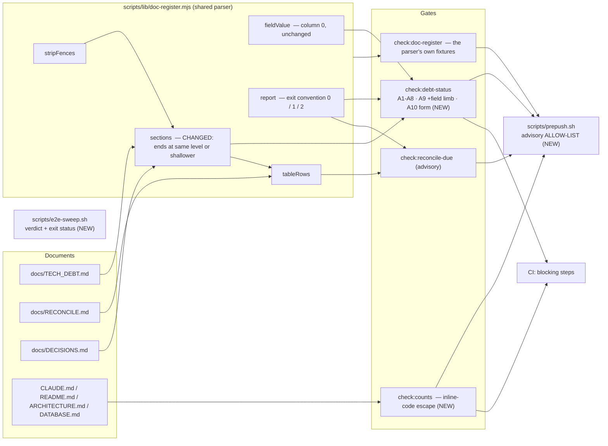
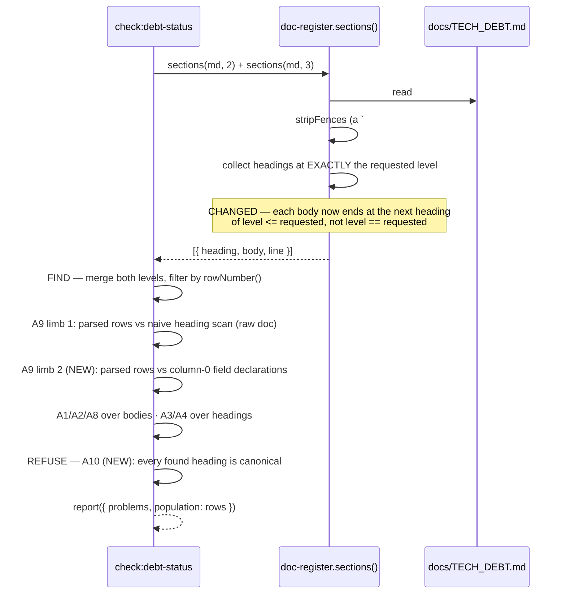
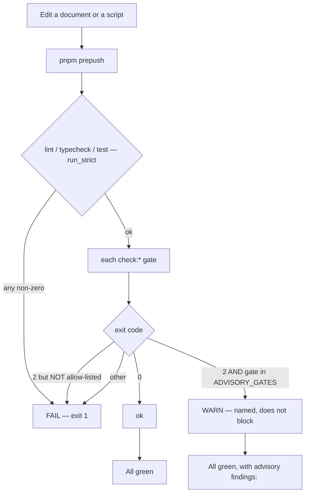

# Feature Spec: Gate conventions — what a register parser refuses, and what it merely finds

- **Status:** Draft — awaiting approval
- **Author(s):** feature-analyst (Product Owner / Solution Architect / Technical Lead hats)
- **Date:** 2026-09-02
- **Tracking issue / epic:** _to be created_
- **Roadmap link:** repository maintenance — drift control (ADR-0058, ADR-0120)
- **Related ADR(s):** amends **ADR-0120** (the drift gates, D5/A9 and the exit convention);
  builds on **ADR-0058** (a gate that fails on day one gets deleted rather than fixed),
  **ADR-0076** (a decision-bearing claim carries its evidence), **ADR-0105** (a shared-gate
  change is a spec-and-plan trigger), **ADR-0110 D5** (a gate is finished only when the defect
  it names has made it fail). A **new ADR is proposed** — outline in §4.9.
- **Closes:** `docs/TECH_DEBT.md` **#222**, **#227**, **#231**, **#235** (the convention half),
  **#237** (the class half).

> **Why this document exists at all.** Every change below is to a **shared gate** —
> `scripts/lib/doc-register.mjs`, `scripts/check-counts.mjs`, `scripts/prepush.sh`,
> `scripts/e2e-sweep.sh`. ADR-0105 makes that a spec-and-plan trigger regardless of size, and three
> of the five rows say so in their own bodies (`#222`, `#227`, `#231`) as the reason they are rows
> and not commits.

---

## 0. Evidence log — what was verified, and what the rows got wrong

Per ADR-0076 and `docs/PROCESS.md` "Decision-bearing claims carry their evidence", every claim below
was established **in this session** by reading the file or by a repository-wide search, on
2026-09-02. **The brief and the rows were not taken as evidence** — and three of their claims turned
out to be wrong.

| #       | Claim                                                                                                                                                                                                                                                                                                                                                                                             | How established                                                                                                            |
| ------- | ------------------------------------------------------------------------------------------------------------------------------------------------------------------------------------------------------------------------------------------------------------------------------------------------------------------------------------------------------------------------------------------------- | -------------------------------------------------------------------------------------------------------------------------- |
| **E1**  | `sections(md, level)` collects headings at exactly `level` and ends each body at the next heading of that **same** level, or EOF.                                                                                                                                                                                                                                                                 | Read `scripts/lib/doc-register.mjs:93-110`.                                                                                |
| **E2**  | **The row's consumer list is wrong.** The module is imported by **two** gates, not three: `check-debt-status.mjs:25` and `check-reconcile-due.mjs:35`. `check-doc-links.mjs:22-24` imports only node built-ins and does **not** use it. `check:doc-register` (`package.json:21`) is the module's **own test runner**, not a third document gate.                                                  | Grep for `from './lib` across `scripts/*.mjs`; read `package.json:21-32`.                                                  |
| **E3**  | A section **body** is consumed in exactly three assertions, all through `fieldValue`: A1 (`check-debt-status.mjs:114`), A2 (`:120-122`), A8 (`:210-213`). Headings feed A3/A4/A9/`rowNumber`; the compact table and the ledger are read from **raw lines** (`:70-83`), not from bodies.                                                                                                           | Read `scripts/check-debt-status.mjs`.                                                                                      |
| **E4**  | `check:reconcile-due` uses a body only via `tableRows(md, 'Passes run')`. `## Passes run` is `docs/RECONCILE.md:212` and the next heading `## The one rule` is `:232` — **both level 2**, so the fix cannot move that boundary. Its `sections(decisions, 2\|3)` calls read `heading` only (`check-reconcile-due.mjs:111-114`).                                                                    | Read both files.                                                                                                           |
| **E5**  | `docs/TECH_DEBT.md` today holds **72** `^### ` headings, **71** of which are numbered rows, and **zero** `^## ` numbered rows. Its only `##` headings are `:89`, `:95`, `:1161`.                                                                                                                                                                                                                  | `rg -c '^### '` → 72; `rg -c '^#{2,3} #?\d+[a-z]?[.\s—-]'` → 71; `rg '^## #?\d+…'` → no matches; `rg -n '^## '` → 3 lines. |
| **E6**  | **Exactly one** row's body is currently mis-bounded: `### 232.` at `:1124`, whose body runs to `:1725` (the next `###`, `#117` at `:1726`) — **601 lines**, swallowing the whole `## Closed numbers` section. Its own `**Status:**` is at `:1126`, and `fieldValue` returns the first match, so the value it reports is correct today.                                                            | Read `docs/TECH_DEBT.md:1124-1130`, `:1161`, `:1726`; combined with E1.                                                    |
| **E7**  | **The live hole #231 names is already patched by hand.** `#117` now carries `**Status:** unverified` at `docs/TECH_DEBT.md:1728`, with a blockquote recording that it had none until 2026-09-01.                                                                                                                                                                                                  | Read `docs/TECH_DEBT.md:1726-1738`.                                                                                        |
| **E8**  | Column-0 `**Status:**` lines: **71**. Numbered rows: **71**. Unanchored occurrences of the string: **74** — so three are prose.                                                                                                                                                                                                                                                                   | `rg -c '^\*\*Status:\*\*'` → 71; `rg -c '\*\*Status:\*\*'` → 74; with E5.                                                  |
| **E9**  | Heading-form census of the 71 rows: **60** are `### <n>. <title>`, **8** are `### #<n> — <title>`, **3** are `### <n><letter>. <title>` (`118a`, `118b`, `119a`). One further `###` heading (`:2968`) is not a row at all — it is a sub-heading inside `#193`.                                                                                                                                    | `rg -c '^### #\d+ —'` → 8; `rg -n '^### \d+[a-z]\. '` → 3 lines; 72 − 71 = 1 non-row.                                      |
| **E10** | `check-counts.mjs:129` matches ADR counts with the unanchored `phrase('(\\d+) ADRs')`. Across the four gated documents there are today **exactly two** matches — `CLAUDE.md:25` and `README.md:16` — and both are real claims. **Zero live false positives.**                                                                                                                                     | Read `scripts/check-counts.mjs:97-147`; `rg -n '\d+\s*>?\s*ADRs'` over the four gated documents.                           |
| **E11** | **#222's proposed remedy, taken literally, would break the gate.** Count claims are _not_ confined to a banner form: `CLAUDE.md:108` and `:111` sit **inside a fenced code block** (the repository-layout tree), and `docs/ARCHITECTURE.md:56` and `:133` are plain prose. Restricting the scan to "the banner's form" would silently drop four real claim sites.                                 | `rg -n` for the count nouns over the four gated documents; read `CLAUDE.md:105-112`.                                       |
| **E12** | **A stale docblock in the module written against stale claims.** `doc-register.mjs:117-118` says of `fieldValue` that "Inline code spans are stripped first". The implementation (`:120-133`) does not strip them, and the inline comment at `:122-128` records that the earlier backtick guard was **removed as actively wrong**.                                                                | Read `scripts/lib/doc-register.mjs:112-133`.                                                                               |
| **E13** | `prepush.sh:85-100`'s `run()` reads exit **2** as advisory for **every** gate; `run_strict` (`:72-83`) is opted into by three (`:106-108`). All 13 `check:*` scripts are `node scripts/*.mjs` invocations (`package.json:21-32,42`), and the only one that deliberately returns 2 is `check:reconcile-due`, via `report({ advisory: true })` (`doc-register.mjs:200`).                            | Read both files.                                                                                                           |
| **E14** | `e2e-sweep.sh:58-74` prints `"$s EXIT=$?"` per suite and ends with `echo "SWEEP-DONE"`. It sets `set -u` only, so **the script's own exit status is the final `echo`'s and is therefore always 0.** Nothing aggregates. A full sweep is **43** suites (42 `test:e2e:<name>` scripts in `apps/web/package.json:18-64`, plus the bare `web`).                                                       | Read `scripts/e2e-sweep.sh`; `rg -o '"test:e2e[^"]*":' apps/web/package.json`.                                             |
| **E15** | CI runs `check:doc-links`, `check:doc-register`, `check:debt-status` and `check:counts` as **blocking, hand-written** steps (`.github/workflows/ci.yml:62-111`); `check:reconcile-due` is deliberately absent (`:75-77`). `e2e-sweep.sh` appears in no workflow.                                                                                                                                  | Read `.github/workflows/ci.yml`.                                                                                           |
| **E16** | `docs/TECH_DEBT.md:18-21` instructs that a closed number goes to "Closed numbers **at the foot**". `## Closed numbers` is at `:1161`, with roughly forty detailed rows **after** it. `check-debt-status.mjs:66,81-83` classifies **any** `\| N \|` line after that line as a ledger row. Latent only: the last `\|`-line in the file is `:1285`, so no detailed row currently holds such a table. | Read `docs/TECH_DEBT.md`; `rg -n '^\|'` (156 matches, none above `:1285` after the ledger).                                |
| **E17** | `docs/RECONCILE.md` contains **6** lines matching `^# `; five are shell comments inside a ` ```bash ` fence (`:71-86`). `sections()` calls `stripFences` first (`:95`), so they are invisible today — but they are exactly the shape that would truncate a level-2 section once "shallower" is honoured.                                                                                          | `rg -c '^# ' docs/RECONCILE.md` → 6; read `:66-95`.                                                                        |

**Three corrections to the rows and the brief**, all in the direction that _narrows_ the work:

1. **E2 — #231 overstates the blast radius.** It names `check:doc-links` and `check:doc-register` as
   consumers; neither is. Combined with E3/E4, **the entire body-boundary blast radius is
   `check:debt-status`'s three field assertions over one document.**
2. **E7 — #231's headline instance is already fixed.** The parser change is a _recurrence_ fix, not a
   repair. That changes how it must be verified: there is no red state left in the tree, so the
   red-verification has to come from a fixture and from a `git`-checked prior revision (ADR-0110 D5).
3. **E11 — #222's proposed remedy is wrong as written.** "The banner states counts in one known form"
   is false of four of the six live claim sites. §4.7 proposes a different mechanism for the same
   goal.

A fourth finding is **E12**, which belongs to no row: the shared parser's own docblock describes
behaviour the code does not have, three lines above the comment explaining why that behaviour was
removed. It is folded into this epic because it is a claim about the exact module being changed.

---

## 1. Business understanding

### Problem

This repository's documentation gates are trusted. `check:debt-status` decides whether the register
that decides what gets worked on next can be believed; `check:counts` decides whether the front door
and the operating manual are telling a reader the truth; `prepush.sh` is the one command a
contributor runs before pushing; `e2e-sweep.sh` is the instrument reached for when a change is
underneath every journey.

Five rows say, in five different costumes, that **the instruments are not saying what their readers
think they are saying**:

- **#231** — the shared parser gives a `###` row a body that runs past every intervening `##`
  heading. Measured once: `#117` had **no status line at all** and the gate reported "71 with a
  status, 0 without", because its body ran 1,115 lines and picked up its neighbour's.
- **#227** — nothing asserts the register's heading form. The gate reads both levels deliberately
  (ADR-0120 Finding 0: a row in the wrong form is still a row), and that correct generosity is
  precisely why nobody notices the form drifting. It drifted to 70 of 100 rows once before.
- **#222** — `check:counts` reads any `N ADRs` anywhere in a gated file as a stated count, so
  writing a sentence _about_ counts fails the gate. It happened inside the ADR documenting the gates
  built to stop exactly this class of defect.
- **#235** — `prepush.sh` reads exit 2 as "advisory". `tsc` uses exit 2 for "I reported type
  errors". For the whole life of the three-state convention, **a broken typecheck printed a yellow
  WARN and let the push through**. The live hole is closed; the convention that produced it is not.
- **#237** — `e2e-sweep.sh` prints one line per suite and aggregates nothing, so one `EXIT=1` among
  43 scrolls past. That is how the base journey came to have **never once been run** by the sweep
  whose own comment says at length that it must be. Verified beyond the row: the script always exits
  0 (E14), so even a caller reading `$?` learns nothing.

**They are one problem.** Every instance is a check that is generous where it should be strict, or
strict where it should be generous, or silent where it should speak — and in every instance the
instrument _reported something_, which is why nobody looked. That is ADR-0120 D5's class
(`a check whose subject was not what it believed`) and ADR-0058's rule (`verify the claim; do not
trust the document`) applied to the checkers themselves.

### Why now

Three reasons, in order of weight.

1. **The rows ask to be done together.** #227's body: _"Worth doing as one slice with those two,
   since all three are `scripts/` changes to the same family of checks and all three want the same
   question asked once."_ #231 and #222 each defer for the same ADR-0105 reason and each name the
   other two.
2. **Nothing here is under time pressure and everything here is cheap** — no schema, no API, no
   product surface, no user-visible behaviour. This is the kind of work that only ever gets done
   deliberately, because nothing breaks if it is not.
3. **The register is about to be trusted harder, not less.** ADR-0120 armed `check:debt-status` in
   CI four days ago (E15). Every additional consumer of a gate raises the cost of the gate being
   quietly wrong.

### Users

There is **no end-user surface**. The users are:

| Persona                       | Need                                                                                                                                                                            |
| ----------------------------- | ------------------------------------------------------------------------------------------------------------------------------------------------------------------------------- |
| **Contributor (human or AI)** | `pnpm prepush` tells the truth: green means checked, WARN means judgement, FAIL means an edit. A gate that goes yellow for a real type error is worse than one that goes quiet. |
| **Register reader**           | `docs/TECH_DEBT.md` can be believed about which rows are open, because every row's status is its own.                                                                           |
| **Documentation author**      | Writing a sentence _about_ a number does not fail a gate; if it does, the failure says how to say it.                                                                           |
| **Gate author (future)**      | One written rule for what a register parser refuses and what it merely finds, so the next gate does not re-derive it and get it wrong.                                          |

### Primary use cases

1. A contributor runs `pnpm prepush` and gets a verdict whose three states mean what the script says
   they mean, for every gate, including gates that do not exist yet.
2. A contributor adds a row to `docs/TECH_DEBT.md`; if its heading form drifts, CI says so with the
   canonical form in the message.
3. A contributor writes a sentence about a count in a gated document and is either not stopped, or
   is stopped by a message that names the escape.
4. A contributor runs `scripts/e2e-sweep.sh` and gets a named count of failures at the end, and a
   non-zero exit if any suite failed.
5. A future gate author reads one rule rather than reverse-engineering four scripts.

### User journeys

**Happy path (contributor).** Edit → `pnpm prepush` → 3 core gates + 13 `check:*` gates run → one of
three verdicts, with the advisory ones named. Nothing about this changes visually; what changes is
that a stray exit 2 from a future tool can no longer be read as advisory.

**Drift path (register author).** Add `## 244. Something` → CI's "Check the tech-debt register" step
fails with `A10: docs/TECH_DEBT.md:NNNN heading is "## 244. …" — rows are "### <number>. <title>"`.
Fix the heading; push.

**Prose path (documentation author).** Write "the threshold is 8 ADRs" in `CLAUDE.md` → today the
gate fails claiming the repository has 123; after this epic the failure message names the escape, or
(with the escape applied) the sentence is read as prose.

**Sweep path.** `scripts/e2e-sweep.sh` → 43 suites → final line
`SWEEP: 41 passed, 2 failed — gantt, wbs (logs in /tmp/sweep-<name>.log)`, exit 1.

### Expected outcomes

- A register parser that **finds** every candidate the document contains and **refuses** only by a
  separate, explicit assertion — with that rule written down once (§4.1) instead of re-derived per
  gate.
- Two structural defects retired: a section body that crosses a shallower heading (#231), and a
  pre-push convention that lets a third-party exit code masquerade as advisory (#235).
- Two silences ended: heading-form drift (#227) and a sweep with no verdict (#237).
- One over-eager match given a documented, cheap escape (#222).

### Success criteria

| #      | Criterion                                                                                                                                                                               | How measured                                                                                       |
| ------ | --------------------------------------------------------------------------------------------------------------------------------------------------------------------------------------- | -------------------------------------------------------------------------------------------------- |
| **S1** | Every new assertion has been made to **fail** by the specific defect it names, before it is armed.                                                                                      | A recorded red run per assertion, in `docs/specs/gate-conventions/red-runs.md` (ADR-0110 D5).      |
| **S2** | No gate fails on day one. Where an assertion has first-run findings, the repair lands **before** the assertion is armed.                                                                | M0's measurement, then a report-only interval per ADR-0058 / ADR-0120's own arming procedure.      |
| **S3** | The parser change alters **no** `check:debt-status` finding and no summary figure.                                                                                                      | Byte-comparison of the gate's full output before and after (M1-T1).                                |
| **S4** | `pnpm prepush` reports FAIL for a planted type error, and WARN only for a gate on the advisory allow-list.                                                                              | Two red runs (M4).                                                                                 |
| **S5** | `scripts/e2e-sweep.sh` exits non-zero and names the failures when any suite fails.                                                                                                      | Red run against a stubbed `e2e-local.sh` (M5) — **not** by running 43 real suites; see §3 Testing. |
| **S6** | The rule in §4.1 is written where the next gate author will meet it — in an ADR and in the module's docblock — and the four stale/false claims in E2/E7/E11/E12 are corrected in place. | Review of the diff.                                                                                |

### Open questions

Three are **CRITICAL** — their answers change what gets built. Everything else has a stated default
and is not blocking.

> **CRITICAL Q1 — the register's canonical heading form.** 60 rows use `### <n>. <title>`, 8 use
> `### #<n> — <title>`, 3 use `### <n><letter>.` (E9). The document's own rule (`:101`) states one
> form. Do the 8 get normalised, or is the second form blessed?
> **Default if unanswered: normalise.** Two forms is the drift #227 exists to stop, the repair is 8
> title-line edits, and `rowNumber()` stays generous either way so nothing can go missing during it.

> **CRITICAL Q2 — the claim/mention discriminator for `check:counts`.** E10/E11 establish that no
> purely syntactic rule separates "123 ADRs" (a claim) from "8 ADRs" (a mention), and that the row's
> proposed banner-shape remedy would drop four real claim sites. So the choice is between an
> **escape** (prose marks a number as not-a-claim) and a **claim marker** (a claim marks itself).
> **Default if unanswered: the escape** — a number inside inline code is a mention, the gate strips
> inline code spans before matching, and the failure message says so. Reason: additive, zero
> first-run findings (E10), preserves the property #222 itself calls valuable ("it cannot miss a real
> stale count, only invent one"), and does not put gate syntax into four documents' prose.

> **CRITICAL Q3 — advisory eligibility in `prepush.sh`.** The proposal (§4.8) inverts the default:
> strict for every gate, with advisory an **allow-list** owned by us. Today that list has exactly one
> member. Is that the shape, and is `check:reconcile-due` the only member?
> **Default if unanswered: yes to both**, with a structural test asserting the list and
> `report({ advisory: true })` agree, so the two cannot drift.

**Non-critical, with defaults taken:**

| Question                                                                   | Default taken                                                                                                                                                     |
| -------------------------------------------------------------------------- | ----------------------------------------------------------------------------------------------------------------------------------------------------------------- |
| Does `## Closed numbers` move to the foot of `docs/TECH_DEBT.md`?          | **Yes** (M1-T3). The file's own rule already says "at the foot" (E16); it is a pure move; it retires a line-number heuristic (E16) in favour of a structural one. |
| Should `e2e-sweep.sh` become a CI gate?                                    | **No.** 43 suites is the best part of an hour (`e2e-sweep.sh:19-21`). Out of scope, §3.                                                                           |
| Does the epic add a new `check:*` script?                                  | **No.** Every new assertion lives inside an existing gate, so CI's hand-written step list (E15) needs no new entry and the epic does not add a CI step.           |
| Does `check:doc-links` change?                                             | **No.** It does not use the parser (E2).                                                                                                                          |
| Does the epic re-order or re-word register rows beyond the heading repair? | **No.** Title lines and one section move only.                                                                                                                    |
| Is the `**Verified:**` field gated the way `**Status:**` is?               | **No** — out of scope. A8 already relates the two; a presence rule for `Verified` is a register-policy change, not a parser change.                               |

---

## 2. Functional requirements

### User stories & acceptance criteria

> **US-1** — As a **register reader**, I want a row's fields to come from that row, so that a status
> I read is a claim about the row I am reading.
>
> **Acceptance criteria**
>
> - **Given** a `### ` row followed by a `## ` heading, **when** the parser sections the document,
>   **then** the row's body ends at the `## ` heading.
> - **Given** the same row, **when** it declares no `**Status:**`, **then** `check:debt-status`
>   reports A1 against **that** row rather than inheriting a neighbour's.
> - **Given** a `#### ` sub-heading inside a row, **then** the row's body still contains it — deeper
>   headings do not end a section.
> - **Given** a `# ` line inside a fenced block (E17), **then** it ends nothing.
> - **Given** today's `docs/TECH_DEBT.md`, **then** the gate's output is **byte-identical** before
>   and after the change (S3).

> **US-2** — As a **gate author**, I want the control that answers "did we read less than we think?"
> to measure a **different quantity** from the parser, so that it cannot agree with itself.
>
> **Acceptance criteria**
>
> - **Given** a document where the count of numbered headings equals the count of parsed rows but a
>   row's field was inherited, **when** A9 runs, **then** the **field limb** reports the discrepancy.
> - **Given** today's register, **then** the field limb reports 71 = 71 and produces **no** finding
>   (E8).
> - **Given** the register at the revision before `#117` gained its status line, **then** the field
>   limb reports 70 against 71 and fails (the red run for S1).
> - The limb counts **column-0** field declarations only, because three of the 74 occurrences of
>   `**Status:**` are prose (E8).

> **US-3** — As a **register author**, I want a wrong heading form to fail loudly, so that the
> parser's deliberate generosity does not become a licence for drift.
>
> **Acceptance criteria**
>
> - **Given** a row headed `## 244. …`, **then** A10 fails and names the canonical form.
> - **Given** a `### ` heading under `## Detailed items` that is not a numbered row, **then** A10
>   fails (one instance exists today, `:2968`; repaired to `#### ` in M2).
> - **Given** the register after M2's repair, **then** A10 produces **zero** findings.
> - **Given** a row headed `### 118a. …`, **then** A10 **passes** — the letter suffix is canonical
>   and `rowNumber()` already supports it.
> - A10 asserts the form; it does **not** narrow what the parser reads. `sections(md, 2)` stays in
>   `check-debt-status.mjs:58`, so a drifted row is still **found** and still checked by A1–A8, and
>   is additionally reported by A10.

> **US-4** — As a **documentation author**, I want to write about a number without failing a count
> gate, and to be told how when I do.
>
> **Acceptance criteria**
>
> - **Given** `the threshold is \`8\` ADRs`in a gated document, **then**`check:counts` does not
>   read it as a claim.
> - **Given** `123 ADRs` in `CLAUDE.md`'s banner, **then** it is still read as a claim and still
>   checked (E10).
> - **Given** `23 feature modules` inside `CLAUDE.md`'s fenced repository tree (E11), **then** it is
>   still read as a claim — fenced content is **not** excluded by this gate and must not become so.
> - **Given** a mismatch, **then** the failure message names the escape.
> - **Given** today's four gated documents, **then** the change alters **no** finding (E10).

> **US-5** — As a **contributor**, I want `pnpm prepush`'s three states to mean what the script says,
> for every gate including ones that do not exist yet.
>
> **Acceptance criteria**
>
> - **Given** a gate not on the advisory allow-list that exits 2 for any reason, **then** `prepush`
>   reports **FAIL**.
> - **Given** `check:reconcile-due` exiting 2, **then** `prepush` reports **WARN** and exits 0.
> - **Given** a planted type error, **then** `prepush` reports FAIL (the existing `run_strict`
>   behaviour, preserved).
> - **Given** the allow-list naming a gate that does not pass `advisory: true` to `report()`, or vice
>   versa, **then** a structural test fails.

> **US-6** — As a **contributor running the sweep**, I want a verdict, not 43 lines to read.
>
> **Acceptance criteria**
>
> - **Given** any suite failing, **then** the final line names the count and the failed suites, and
>   the script exits non-zero.
> - **Given** every suite passing, **then** the final line says so and the script exits 0.
> - **Given** an empty suite list (the derivation returning nothing), **then** the script **refuses**
>   rather than reporting success over nothing — `report()`'s empty-population rule
>   (`doc-register.mjs:210-216`) applied to a shell script.
> - **Given** a suite that timed out (exit 124 from `timeout 900`), **then** it is reported as a
>   failure and distinguished from an ordinary one in the line.

### Workflows

**W1 — parse.** Read document → strip fences → collect headings at level _L_ → each body ends at the
next heading of level ≤ _L_, or EOF → assertions run over `{ heading, body, line }`.

**W2 — find, then refuse.** `check-debt-status` reads levels 2 **and** 3 (generous: find every row)
→ A1–A9 check content → **A10 checks form** (strict: refuse drift). Generosity and strictness are
two steps, never one regex.

**W3 — count claim.** Read document → strip **inline code spans** → match each figure's patterns →
compare against the tree → on mismatch, report with the escape named.

**W4 — pre-push.** For each gate: run → exit 0 → ok; exit ≠ 0 and gate ∈ `ADVISORY_GATES` and exit
= 2 → WARN; otherwise FAIL.

**W5 — sweep.** Derive suite list → refuse if empty → per suite: kill servers, run, record exit →
final verdict line + exit status.

### Edge cases

| Case                                                                            | Expected behaviour                                                                                                                                         |
| ------------------------------------------------------------------------------- | ---------------------------------------------------------------------------------------------------------------------------------------------------------- |
| A `# ` shell comment inside a fenced block (E17 — five exist in `RECONCILE.md`) | Ends nothing. `stripFences` runs first; pinned as a fixture case, because this fix makes level-1 lines significant to level-2 sections for the first time. |
| An **unterminated** fence                                                       | Swallows the rest, as a renderer would — existing behaviour, unchanged, already pinned (`doc-register.test.mjs:86-90`).                                    |
| A `#### ` sub-heading inside a row                                              | Does **not** end the row. (True today by accident, true after the fix by rule; M2's repair depends on it.)                                                 |
| A document whose only heading is `# `                                           | One section at level 1; levels 2 and 3 empty → `report()`'s empty-population refusal already covers a gate that finds nothing.                             |
| A row containing a markdown table with a numeric first cell, after `:1161`      | Today misread as a ledger row (E16). Retired by M1-T3's section move; asserted afterwards.                                                                 |
| A gated document mentioning a count inside a fenced block                       | Still read as a claim — `check:counts` deliberately does not strip fences (E11), and four live claim sites depend on that.                                 |
| A `check:*` script that is not a node invocation                                | FAIL unless allow-listed. This is the point of inverting the default (E13).                                                                                |
| A sweep run with explicit suite arguments (`e2e-sweep.sh edit wbs`)             | Same verdict rules, over the named subset. An unknown suite name is a failure, named.                                                                      |
| `e2e-local.sh` refusing an unknown suite (the `#237` instance)                  | Counted as a failure and named in the verdict — the whole point of the row.                                                                                |

### Permissions

**Not applicable, and that is a statement rather than an omission.** Nothing in this epic runs in the
API, the web client or the database. There is no organisation scope, no role, no principal and no
share token; the artefacts are `scripts/*` and `docs/*`, exercised by `pnpm` and by CI. ADR-0012's
RBAC model is untouched, and so is the External Guest boundary (ADR-0051).

### Validation rules

| Rule                                                                               | Where enforced                             |
| ---------------------------------------------------------------------------------- | ------------------------------------------ |
| A section ends at the next heading of the **same level or shallower**.             | `doc-register.mjs` `sections()`            |
| A field declaration is a `**Field:**` at **column 0** (unchanged).                 | `doc-register.mjs` `fieldValue()`          |
| A register row heading is `### <number>[<letter>]. <title>` (subject to Q1).       | `check-debt-status.mjs` A10                |
| Every `### ` heading under `## Detailed items` is a row; sub-headings are `#### `. | `check-debt-status.mjs` A10                |
| The count of column-0 `**Status:**` declarations equals the count of parsed rows.  | `check-debt-status.mjs` A9 (field limb)    |
| A number in inline code is a mention, not a count claim (subject to Q2).           | `check-counts.mjs`                         |
| Exit 2 is advisory **only** for a gate on `ADVISORY_GATES`.                        | `prepush.sh` + a structural agreement test |
| A sweep with an empty suite list refuses.                                          | `e2e-sweep.sh`                             |

### Error scenarios

| Scenario                                                | Detection       | Result                                                                                 | Exit |
| ------------------------------------------------------- | --------------- | -------------------------------------------------------------------------------------- | ---- |
| A register row has no status                            | A1              | `A1: docs/TECH_DEBT.md:NNNN "…" has no **Status:** line.`                              | 1    |
| Rows parsed ≠ column-0 status declarations              | A9 field limb   | Names both counts and says one of them is wrong                                        | 1    |
| A heading is `## 244.` or a non-row `### `              | A10             | Names the offending line and the canonical form                                        | 1    |
| A stated count disagrees with the tree                  | `check:counts`  | Existing message **plus** the escape ("if this is prose, put the number in backticks") | 1    |
| A non-allow-listed gate exits 2                         | `prepush.sh`    | `FAIL <gate>` + last 12 log lines                                                      | 1    |
| The advisory allow-list and `report({advisory})` differ | structural test | Names both sides                                                                       | 1    |
| Any suite fails in the sweep                            | `e2e-sweep.sh`  | `SWEEP: N passed, M failed — <names>`                                                  | 1    |
| The sweep's suite list is empty                         | `e2e-sweep.sh`  | Refuses; "a sweep with no subject reports green and reads as checked"                  | 1    |

---

## 3. Technical analysis

| Area               | Impact   | Notes                                                                                                                                                                                                                                                                                                                      |
| ------------------ | -------- | -------------------------------------------------------------------------------------------------------------------------------------------------------------------------------------------------------------------------------------------------------------------------------------------------------------------------- |
| **Frontend**       | **none** | No file under `apps/web/src` changes. No component, route, state or token.                                                                                                                                                                                                                                                 |
| **Backend**        | **none** | No file under `apps/api/src` changes. The CPM engine is not imported.                                                                                                                                                                                                                                                      |
| **Database**       | **none** | No model, column, index, constraint or migration — confirmed against the intended diff (`scripts/`, `docs/`, `package.json` only). **`database-architect` is therefore not engaged, and that is a decision recorded rather than an omission** (CLAUDE.md §19.3 applies to schema changes; there is no schema change here). |
| **API**            | **none** | No endpoint, DTO, status code or OpenAPI change.                                                                                                                                                                                                                                                                           |
| **Security**       | **none** | No principal, no authorisation, no input from an untrusted source. The scripts read repository files and `git`; none takes network input.                                                                                                                                                                                  |
| **Performance**    | **low**  | `check:debt-status` gains one whole-document regex scan (A9's field limb) and one per-heading test (A10). Budget: the gate must stay well inside `check:reconcile-due`'s stated `<1.0 s` sibling budget (`check-reconcile-due.mjs:141-146`). Measured in M0-T5.                                                            |
| **Infrastructure** | **low**  | No new CI step (E15) — every assertion lands inside a gate CI already runs. No new `check:*` key, so `prepush.sh`'s derived roster (`:115-118`) is unchanged in size.                                                                                                                                                      |
| **Observability**  | **low**  | The gates' own output is the observable. `e2e-sweep.sh` gains a verdict line.                                                                                                                                                                                                                                              |
| **Testing**        | **med**  | See below — this is where the real work is.                                                                                                                                                                                                                                                                                |

**Testing, in more detail.** There is no Playwright journey here and no browser: these are node
scripts and one bash script. ADR-0081's rule is about **something driving the real thing**, and the
equivalent instruments are:

- `scripts/lib/doc-register.test.mjs` — the module's fixtures, run by `check:doc-register`, which is
  a CI step (E15). Every parser case lands here, including the fixture-precondition assertions that
  file already uses (`:43-49`) after two of its cases shipped vacuous.
- **The real tree.** Each gate is run against the actual repository before and after, and the output
  compared (S3). A fixture cannot tell you that a change moved zero findings across 71 real rows.
- **Red runs.** ADR-0110 D5: each new assertion must be made to fail by the defect it names, and the
  output recorded. For A9's field limb the red state no longer exists in the working tree (E7), so
  the red run is taken against the prior revision via `git show`.
- **A stub, not 43 suites.** The sweep's verdict is verified against a stubbed `scripts/e2e-local.sh`
  returning a scripted sequence of exit codes. Running 43 real suites to test an `if` would take an
  hour and would prove nothing the stub does not.

### Dependencies

- **Prerequisite:** none. Nothing here waits on anything.
- **Affected:** `check:debt-status`, `check:doc-register`, `check:counts`, `check:reconcile-due`,
  `prepush.sh`, `e2e-sweep.sh`, `docs/TECH_DEBT.md`, `docs/TESTING.md:355,357,378`, `CLAUDE.md` §19.8
  and §16 (the ADR entry), `scripts/debt-register.json` (unchanged in value; see M1-T3's assertion).
- **Ordering constraint (hard):** the register repairs (M1-T3 section move, M2-T1 heading repair)
  land **before** the assertions that would fail on them are armed. ADR-0058: a gate that fails on
  day one gets deleted rather than fixed, and ADR-0120's own arming procedure is the precedent — its
  Gate A ran report-only through two milestones while the file was repaired.

### Explicitly NOT in scope, with reasons

1. **Making `e2e-sweep.sh` a CI gate.** 43 suites is close to an hour (`e2e-sweep.sh:19-21`). Its
   value is as a local instrument before a change that sits under every journey; putting it in CI
   would either lengthen every run by an hour or be conditional, and a conditional sweep is the
   `contains(github.head_ref, 'gantt')` defect ADR-0095 records.
2. **A general "every gate must aggregate" rule.** #237 asks for a sweep that ends with a named count.
   Generalising that to every script in `scripts/` is a rule with no measured population behind it.
3. **`check:doc-links`.** Not a consumer (E2). Touching it would be scope invented from a wrong claim.
4. **Re-wording or re-ordering register rows** beyond the heading repair and the one section move.
   The register's _content_ is not this epic's subject, and a large content diff would bury the
   structural one.
5. **A `**Verified:**` presence rule.** Register policy, not parser behaviour.
6. **Retiring `check:counts`' over-eagerness itself.** #222 states, and this spec agrees, that the
   gate's inability to miss a stale count is a property worth keeping. The escape preserves it; a
   narrowing would not.
7. **The `#235` residual that is genuinely not answerable** — see §4.8.

---

## 4. Solution design

### 4.1 The rule this epic exists to write down

> **A register parser FINDS by structure and REFUSES by declaration.**
>
> 1. **Finding is generous, and deliberately so.** The reader must locate every candidate the
>    document contains, in every form the document has ever legitimately used, because a row the
>    parser cannot see is a row the gate cannot check — and that failure is _silent_.
>    `check-debt-status` reads both heading levels for exactly this reason (ADR-0120 Finding 0), and
>    that stays.
> 2. **Refusing is strict, and it is a separate assertion.** The canonical form is enforced _over
>    what was found_, never by narrowing the reader. Folding the two together gives neither property:
>    a strict reader goes blind (the 31 invisible `##` rows), and a generous reader with no separate
>    assertion blesses drift (#227).
> 3. **A parser never infers from prose.** Where structure cannot separate a claim from a mention,
>    the **author declares** which it is. `**Status:**` at column 0 is a declaration; `check:counts`'s
>    bare `N ADRs` is an inference, and that is why one works and the other files a tech-debt row
>    (#222).
> 4. **Structure means position AND extent.** A field is anchored at column 0; a section is bounded
>    by headings of the same level _or shallower_. #231 is the second half having been forgotten
>    while the first was carefully argued.
> 5. **Every generous reader owes a control that does not share its blind spot and measures a
>    DIFFERENT QUANTITY.** ADR-0120 D5's A9 counted headings against headings and agreed with itself
>    over 31 rows; #231 is the same shape one axis over — headings against headings, blind to bodies.
>    A control that compares the same quantity on both sides can only ever agree with itself.

### 4.2 Architecture overview



`check:doc-links` is deliberately absent from this diagram: it does not use the parser (E2).

### 4.3 Data flow — one document through the parser



### 4.4 Developer flow



### 4.5 The parser change (#231)

`sections(md, level)` keeps its signature and its return shape. One line of logic changes: when
locating the end of a section, it looks for the next heading at level ≤ `level` rather than at
exactly `level`.

**Blast radius, measured rather than argued** (E2/E3/E4/E5/E6):

| Consumer              | Uses `body`?                       | Documents                      | Sections whose boundary moves                      |
| --------------------- | ---------------------------------- | ------------------------------ | -------------------------------------------------- |
| `check:debt-status`   | Yes — A1/A2/A8 via `fieldValue`    | `docs/TECH_DEBT.md`            | **1** (`### 232.` at `:1124`, 601 lines → 37)      |
| `check:reconcile-due` | Only via `tableRows('Passes run')` | `RECONCILE.md`, `DECISIONS.md` | **0** — that heading is `##` followed by `##` (E4) |
| `check:doc-links`     | Does not use the parser (E2)       | —                              | —                                                  |

**Predicted effect on findings: zero** (E6 — `### 232.` declares its own `**Status:**` two lines
below its heading, and `fieldValue` returns the first match). M0-T1 must confirm this by
byte-comparing the gate's output; **if it does not hold, the milestone changes shape** and a repair
pass precedes the change (§5 falsification F0.1).

**The new hazard this introduces, named because it is the one thing that could go wrong quietly:**
level-1 lines become significant to level-2 sections for the first time, and this repository's
documents contain shell comments that begin `# ` (E17 — five in `RECONCILE.md` alone). `stripFences`
already removes them, so the hazard is covered; it is covered _by an existing behaviour_, which is
exactly the kind of dependency that gets refactored away, so it becomes a pinned fixture case.

### 4.6 A9's second limb (#231's other half) and A10 (#227)

**A9 limb 2 — fields, not headings.** A9 exists to answer "did we read less than we think?" and
today asks it by counting headings on both sides. The new limb counts **column-0 field
declarations** in the raw document and compares against the number of rows for which the parser
found one:

- Today: 71 declarations, 71 rows → **no finding** (E8). Zero first-run cost, so no repair pass and
  no report-only interval needed for this limb.
- At the revision before `#117` gained its status line: 70 against 71 → **red**. That is the recorded
  red run (S1); it is taken from `git show` because the defect no longer exists in the working tree
  (E7).
- It scans the **raw** document, fences included — the same asymmetry A9's first limb already
  documents and for the same reason: a fenced false positive is loud and fixed the day it appears,
  whereas sharing the parser's machinery produces a silent false negative. Anchored at column 0,
  because three of the 74 occurrences of `**Status:**` are prose (E8).

**A10 — the heading form.** Two clauses:

1. Every heading the parser recognises as a row is `### <number>[<letter>]. <title>` (Q1 default) or
   `### #<number> — <title>` (Q1 alternative).
2. Every `### ` heading below `## Detailed items` is a row. A sub-heading inside a row is `#### `.

**First-run cost, measured (E9):** with Q1's default, **12 findings** — 8 `#<n> —` rows, 3 lettered
rows if the letter form is not blessed (it is: `rowNumber()` already supports `[a-z]?`, so the real
figure is **9**), and 1 non-row `###` heading. All are title-line edits, none needs a judgement.
Under ADR-0058 that is a repair pass, not a cliff — and it is why M2 repairs before it arms.

**What A10 does not do.** It does not narrow `sections(md, 2)` out of `check-debt-status.mjs:58`. The
parser stays generous, a drifted row is still found and still checked by A1–A8, and A10 reports the
form **in addition**. That is §4.1's rule 2, and it is the difference between this and the change
ADR-0120 Finding 0 records having to undo.

### 4.7 Claim versus mention (#222)

**The row's proposed remedy does not survive measurement.** It says "the banner states counts in one
known form; a phrase mid-paragraph is not that form". Measured (E11): of the six live claim sites,
two are in a blockquote banner, **two are inside a fenced code block** (`CLAUDE.md:108,111`) and two
are plain prose (`docs/ARCHITECTURE.md:56,133`). Restricting to a banner shape would silently stop
checking four real claims — the exact failure mode `check:counts` exists to prevent, introduced by
the fix for a different one.

**And the treatment the row asks for is not the treatment `doc-register.mjs` gives** (E12). Its
`fieldValue` docblock claims inline code spans are stripped; the code does not strip them, and the
comment three lines below records that the earlier backtick guard was removed as _actively wrong_
because it ate two real declarations. The treatment that module actually gives is **column-0
anchoring** — position, not content — and there is no positional analogue for a count claim, because
the claims are in four different positions (E11).

So the honest conclusion is that **no purely syntactic rule separates a claim from a mention here**,
and inventing one would be tuning to a single data point.

**Chosen design (Q2 default): an escape, declared by the author.**

- `check-counts.mjs` strips **inline code spans** (`` `…` ``) before matching, and only for that
  purpose. Fenced blocks stay in scope (E11).
- An author writing about a number puts it in backticks: ``the threshold is `8` ADRs``.
- The failure message gains one sentence naming the escape, so the cost #222 records — "an author
  must phrase around it, without being told why until the gate fires" — becomes "an author is told
  exactly what to do the first time it fires".
- **First-run cost: zero** (E10 — the only two `N ADRs` matches in the gated set are real claims).

**Alternatives considered and rejected.**

| Alternative                                           | Why not                                                                                                                                                              |
| ----------------------------------------------------- | -------------------------------------------------------------------------------------------------------------------------------------------------------------------- |
| Restrict to a banner/blockquote shape (the row's own) | Drops four live claim sites (E11).                                                                                                                                   |
| Negative lookbehind for `=`, `T =`, `p75`, etc.       | Tuned to the one instance that fired. The next mention has different words.                                                                                          |
| An HTML comment marker (`<!-- counts:ignore -->`)     | Puts gate syntax in prose, on its own line, for a case that arises a few times a year. Backticks already read naturally and already mean "this is a token".          |
| Make the gate advisory                                | It is a blocking CI step precisely because a stale count is a false claim in the front door (E15). Downgrading it to buy a phrasing convenience inverts the trade.   |
| A machine-readable counts block in each document      | Six claim sites in four documents, two of them inside a code fence a reader is meant to copy. The prose _is_ the claim; extracting it makes the prose ungated again. |

### 4.8 The advisory channel (#235) — answerable now, and the answer is narrow

#235 asks two questions. Both are answerable, and the answers differ.

**(a) "Could any future `check:*` exit 2 for its own reasons?"** — **Yes in principle, no today.**
Measured (E13): all 13 `check:*` scripts are `node scripts/*.mjs`; node exits 1 on an uncaught
throw and otherwise whatever `process.exit` is given; the only deliberate 2 is
`check:reconcile-due`'s `report({ advisory: true })`. But the collision is real for any gate that is
a shell pipeline (bash exits 2 on a syntax error, `grep` exits 2 on error) or that propagates a
child's status — which is exactly how `tsc` produced the defect.

**(b) "Should the advisory channel be a sentinel in the output rather than an exit code?"** — **No**,
and this is a decision rather than a deferral:

- A sentinel is **spoofable**. Several gates print a subprocess's output; a gate echoing another's
  WARN line would be read as advisory.
- `prepush.sh` prints only `tail -12` of a gate's log (`:80,93,97`), so a sentinel could be off the
  end of what is read.
- It re-creates the failure `report({ advisory })` was built to remove: _"a promise kept by each
  branch remembering to keep it is not kept"_ (`doc-register.mjs:186-200`). A sentinel must be
  printed correctly on every exit path of every advisory gate.

**Chosen design: keep the exit code, invert the default, and own the eligibility list.**

```
ADVISORY_GATES=( "check:reconcile-due" )      # the only member today
```

- `run()` treats exit 2 as advisory **only** when the gate is on that list; every other gate is
  strict. `run_strict` disappears as a special case — the three core gates get the default
  behaviour rather than an opt-out (which is what made `tsc`'s collision possible: the safe
  behaviour was the exception).
- A structural test asserts the list and the scripts agree in **both** directions: every member
  passes `advisory: true` to `report()`, and no non-member does. A one-sided assertion passes
  equally when the list is empty (ADR-0093's lesson), so both limbs are required and both are
  verified red.
- **What stays a recorded rule** is not a question but a permanent property: a future gate that is
  not a node script can still pick an exit code we did not anticipate. The allow-list makes that
  _harmless_ rather than _answered_ — an unanticipated code from a non-member is a FAIL, which is
  the safe direction. That is the honest residual and it goes in the ADR's Consequences rather than
  being claimed as closed.

### 4.9 The sweep's verdict (#237)

`e2e-sweep.sh` accumulates per-suite exit codes and ends with a verdict:

```
SWEEP: 41 passed, 2 failed — gantt(1), wbs(124 timeout).  Logs: /tmp/sweep-<name>.log
```

and exits 1 if any failed. Three details are decisions rather than mechanics:

1. **Exit 124 is named as a timeout**, because `timeout 900` (`:71`) and a genuine assertion failure
   are different diagnoses and the line is the only place a reader sees either.
2. **An empty suite list refuses.** `report()`'s empty-population rule (`doc-register.mjs:210-216`)
   applied to a shell script: the derivation is a `node -e` that could silently yield nothing, and a
   sweep that runs `web` alone while reporting "SWEEP-DONE" is exactly the class #237 is about.
3. **`SWEEP-DONE` is kept as well as the verdict**, because it is a string a human or an agent may be
   grepping for; removing it silently changes a contract nobody wrote down. It is retained on the
   same final line.

The **verification is a stub, not a sweep** (§3): `e2e-local.sh` is replaced by a fixture returning a
scripted sequence of exit codes, and the verdict line and exit status are asserted for
all-pass / one-fail / one-timeout / empty-list. Running 43 real suites to test an `if` would take an
hour and prove nothing more.

### 4.10 ADR outline (proposed — ADR-0124, "A register parser finds generously and refuses explicitly")

| Section          | Content                                                                                                                                                                                                                                                                                                        |
| ---------------- | -------------------------------------------------------------------------------------------------------------------------------------------------------------------------------------------------------------------------------------------------------------------------------------------------------------- |
| **Context**      | Five rows, one shape. ADR-0120 built the drift gates and its own D5 records a control that agreed with itself; #231 is that class one axis over. E2/E7/E11/E12 as the corrections the epic's own sources needed.                                                                                               |
| **Decision D1**  | A parser finds by structure and refuses by declaration — §4.1's five clauses, in full.                                                                                                                                                                                                                         |
| **Decision D2**  | A section is bounded by headings of the same level **or shallower**. Blast radius stated as measured, not asserted.                                                                                                                                                                                            |
| **Decision D3**  | Every generous reader owes a control measuring a **different quantity**. A9 gains a field limb.                                                                                                                                                                                                                |
| **Decision D4**  | Where structure cannot separate a claim from a mention, the author declares. `check:counts` gains an escape rather than a narrowing; the row's own remedy is recorded as **withdrawn on measurement** (E11).                                                                                                   |
| **Decision D5**  | Advisory is an allow-list, not an exit code any tool can reach. `run_strict` retired as a special case. The residual — a future non-node gate — is stated, not claimed closed.                                                                                                                                 |
| **Decision D6**  | A sweep ends with a verdict and an exit status; an empty population refuses.                                                                                                                                                                                                                                   |
| **Rejected**     | Banner-shape narrowing (drops four claim sites); a sentinel channel (spoofable, truncated, per-branch); narrowing `sections(md, 2)` in `check-debt-status` (undoes ADR-0120 Finding 0); making the sweep a CI gate (an hour per run, or conditional — the ADR-0095 defect).                                    |
| **Consequences** | Positive: four silences ended, one over-eagerness given an escape, one rule written once. Negative: a heading-form gate is one more thing to satisfy when adding a row, and the `#### ` sub-heading convention is new. Follow-ups: the E12 docblock correction; whether `**Verified:**` earns a presence rule. |

### 4.11 Database changes

**None.** No model, column, index, constraint or migration. `database-architect` is not engaged
because there is no schema change to design — recorded explicitly so that "the agent was not run"
cannot later read as an oversight (CLAUDE.md §19.3 / §20).

### 4.12 API changes

**None.** No endpoint, DTO, envelope, status code or OpenAPI change.

### 4.13 Component changes

**None.** No file under `apps/web/src`. No design-system primitive, token, route or accessibility
surface, so `accessibility-reviewer` and `component-reviewer` are not engaged (CLAUDE.md §19.13's
trigger is a **primitive's keyboard contract**, which nothing here touches).

### 4.14 Implementation approach & alternatives

**Chosen: five thin slices behind one written rule, measurement first.**

- **M0 measures before anything changes** — the blast radius of the parser fix, the first-run cost of
  each new assertion, and the current advisory posture. Each later milestone carries a falsification
  condition written **before** its run.
- **Repairs land before the assertions that would fail on them.** ADR-0058's rule, and ADR-0120's own
  precedent: its Gate A was report-only through two milestones while the register was repaired.
- **Each assertion is verified red against the specific defect it names** (ADR-0110 D5), and the
  outputs are committed to `docs/specs/gate-conventions/red-runs.md`. Where the red state no longer
  exists in the tree (A9's field limb — E7), the red run is taken against a prior revision.
- **The rows are one epic and one decision, but five milestones.** #227/#231/#222 ask to be "one
  slice"; that is satisfied by one spec, one ADR and one release train. They are not one PR, because
  each carries its own repair and its own red-verification, and a single commit touching the shared
  parser, twelve register headings and `check:counts` could not be reverted independently — which
  matters more than usual for changes to the gates everything else is checked by.

**Alternatives considered:**

| Alternative                                         | Why not                                                                                                                                                                                              |
| --------------------------------------------------- | ---------------------------------------------------------------------------------------------------------------------------------------------------------------------------------------------------- |
| Fix #231 alone as a one-line commit                 | It is a shared gate (ADR-0105), and doing it alone would leave A9 still comparing headings against headings — the control that could not see the defect stays unable to see the next one.            |
| Do the three parser rows and defer #235/#237        | They are the same failure ("the instrument reported something, so nobody looked") and #235's convention decision is cheap once the rule in §4.1 exists. Deferring them means writing the rule twice. |
| Write the rule as a docblock only, no ADR           | The rule governs gates that do not exist yet; a docblock in one module is not where the next gate's author looks. ADR-0120 is cited by number in four places for the same reason.                    |
| Narrow `sections(md, 2)` out of `check-debt-status` | That is ADR-0120 Finding 0's defect being re-introduced. Generosity in the reader is the correct half; strictness belongs in A10.                                                                    |
| Add a new `check:register-form` script              | A new `check:*` key means a new hand-written CI step (E15) and a new `prepush` roster entry, for an assertion that belongs beside A1–A9 and reads the same parse.                                    |

---

## 5. Links

- Implementation plan: [`./implementation-plan.md`](./implementation-plan.md)
- Measurement (produced by M0): `./m0-measurement.md`
- Red runs (produced per milestone): `./red-runs.md`
- Prior art: [`docs/specs/drift-gates/`](../drift-gates/) — ADR-0120's spec, plan and red run.
- Documents this change updates: `docs/TECH_DEBT.md` (heading repair, section move, five rows
  closed/narrowed), `docs/TESTING.md:355,357,378`, `CLAUDE.md` §16 (new ADR entry) and §19.8,
  `scripts/lib/doc-register.mjs` docblocks (including the E12 correction), `docs/RECONCILE.md` if the
  runbook's step 4 wording needs the new form.
