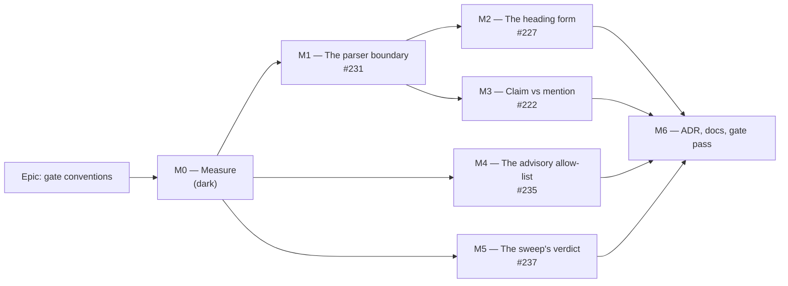

# Implementation Plan: Gate conventions — what a register parser refuses, and what it merely finds

- **Feature spec:** [`./feature-spec.md`](./feature-spec.md) — **not yet approved**
- **Status:** Draft — awaiting approval
- **Owner:** repo
- **Closes:** `docs/TECH_DEBT.md` #222, #227, #231, #235 (convention half), #237 (class half)

## Breakdown



M4 and M5 depend only on M0 and can land in parallel with M1–M3. M2 and M3 both depend on M1 only
because M1 lands the `red-runs.md` convention and the parser they are asserted against; neither
touches M1's code.

### Epic

**Gate conventions** — one written rule for what a register parser refuses and what it merely finds,
and the five instruments that were getting it wrong brought into line. Maps to the repository
maintenance / drift-control theme (ADR-0058, ADR-0120).

**Standing rules for every milestone below:**

- **Measurement precedes the change**, and each milestone's **falsification condition is written and
  committed before its run** (§5 of the spec; the ADR-0100/ADR-0121 pattern).
- **Every new assertion is verified RED against the specific defect it names** before it is armed
  (ADR-0110 D5), and the output is appended to `docs/specs/gate-conventions/red-runs.md`. An
  assertion that has only ever been green is not finished.
- **Repairs land before arming** (ADR-0058; ADR-0120's Gate A precedent — report-only through two
  milestones while the register was repaired).
- **`pnpm prepush` is run locally before every push** (CLAUDE.md §19.8). `scripts/e2e-local.sh` is
  **not** required: no milestone touches `apps/api` or a Playwright suite — stated so the omission is
  a decision rather than a skip.

---

## Milestone M0 — Measure, and write the falsification conditions

**Outcome:** every number this epic's design rests on is re-derived from the tree as it stands, and
each later milestone's pass/fail condition is committed before that milestone runs.

**Entry point:** `Ships dark: nothing changes for any reader.` M0 produces one document,
`docs/specs/gate-conventions/m0-measurement.md`, and no executable change. The first user-facing
milestone is M1, whose entry point is `pnpm check:debt-status`.

**Journey:** not applicable — no browser, no product surface. The equivalent instrument, per §3 of
the spec, is that **every figure is produced by running the real gate against the real tree**, never
by reading a file and reasoning. M0's own deliverable is the record of those runs.

**Why it exists.** The spec's §0 evidence log was built by _reading_; three of the five rows'
decision-bearing claims turned out to be wrong when read against the code (E2, E7, E11). M0 is the
same discipline applied to the numbers that decide milestone shape rather than milestone content —
and #231's fix moves body boundaries in a shared parser, which is precisely the change where "it
probably changes nothing" is the sentence that gets something shipped wrong.

---

#### Feature: The measurement record

> **Description:** re-derive the blast radius of each change and the first-run cost of each new
> assertion; commit the falsification conditions.
> **Complexity:** M
> **Dependencies:** none.
> **Risks:** the measurement is taken with a stale working tree → every task records the `git rev-parse HEAD` it ran against, at the top of the document.
> **Testing requirements:** none — this milestone adds no assertion. Its output is evidence.

##### Task M0-T1 — Baseline the two parser consumers (≈ one PR, docs only)

- **Description:** capture the exact, complete output of `pnpm check:debt-status` and
  `pnpm check:reconcile-due` against the current tree, and the section inventory the parser produces
  for `docs/TECH_DEBT.md`, `docs/RECONCILE.md` and `docs/DECISIONS.md`.
- **Complexity:** S
- **Dependencies:** none
- **Risks:** a summary line is captured instead of the full finding list → the byte-comparison in
  M1-T1 then proves nothing. Mitigation: capture stdout **and** stderr in full to a file that is
  committed.
- **Testing:** n/a
- **Development steps:**
  1. Record `git rev-parse HEAD`.
  2. `pnpm check:debt-status > m0/debt-status.before.txt 2>&1`; same for `check:reconcile-due`.
  3. With a throwaway node script (not committed to `scripts/`), print for each of the three
     documents: every section at levels 2 and 3, with heading, start line, end line and body length,
     **under the current parser**. Commit as `m0/sections.before.txt`.
  4. Repeat step 3 under the **proposed** parser rule, in the same throwaway script, and commit as
     `m0/sections.after.txt`. **Do not modify `scripts/lib/doc-register.mjs` in this task.**
  5. Diff the two and record every section whose boundary moves.
  6. Write the finding into `m0-measurement.md` under **F0.1**.

> **Falsification condition F0.1 (committed before step 4 runs):** _the proposed rule moves **at
> most two** section boundaries across the three documents, and changes **zero** findings and zero
> summary figures in either gate's output._
> Predicted from reading (spec E6): exactly one boundary moves — `### 232.` at
> `docs/TECH_DEBT.md:1124`, from 601 body lines to ~37 — and no finding changes.
> **If falsified:** M1 stops being a latent-correctness fix and becomes repair-then-arm; M1-T1 and
> M1-T2 split, with the repair landing first and the parser change second.

##### Task M0-T2 — First-run cost of A9's field limb

- **Description:** count column-0 `**Status:**` declarations against parsed rows, today and at the
  revision before `#117` gained its status line.
- **Complexity:** S
- **Dependencies:** M0-T1
- **Risks:** the count is taken unanchored and inflated by prose (74 vs 71 — spec E8) → the limb is
  designed against a wrong number. Mitigation: both anchored and unanchored counts are recorded, and
  the difference is explained in the document.
- **Testing:** n/a
- **Development steps:**
  1. Anchored and unanchored counts of `**Status:**` in `docs/TECH_DEBT.md`, today.
  2. The same counts at the parent of the commit that added `docs/TECH_DEBT.md:1728`, via
     `git show <rev>:docs/TECH_DEBT.md`. Record the commit sha.
  3. Record both against the parsed row count.
  4. Write into `m0-measurement.md` under **F0.2**.

> **Falsification condition F0.2:** _today the limb reports N = N and produces **zero** findings;
> at the prior revision it reports N−1 against N and **fails**._
> Predicted: 71 = 71 today; 70 against 71 before (spec E8/E7).
> **If falsified in the first half:** the limb needs a repair pass before arming (ADR-0058), and
> M1-T4 gains a repair task. **If falsified in the second half:** the limb does not catch the defect
> it was written for and the design is wrong — stop and re-derive it.

##### Task M0-T3 — First-run cost of the heading-form assertion

- **Description:** census every `### ` heading in `docs/TECH_DEBT.md` by form, and classify each
  non-canonical one as "title-line edit" or "needs a judgement".
- **Complexity:** S
- **Dependencies:** none
- **Risks:** a census written from the commonest shape finds only the commonest shape — #227's own
  body records a sweep that found 30 of 41 for exactly that reason. Mitigation: the census is
  **exhaustive by construction** — every `^### ` line is classified into one of the enumerated forms
  or into `UNCLASSIFIED`, and a non-empty `UNCLASSIFIED` set is itself the finding.
- **Testing:** n/a
- **Development steps:**
  1. Enumerate every `^### ` line with its line number.
  2. Classify: `<n>. `, `<n><letter>. `, `#<n> — `, not-a-row, `UNCLASSIFIED`.
  3. For each non-canonical one, state the repair in one line.
  4. Write into `m0-measurement.md` under **F0.3**, with the resolution of **Q1** noted.

> **Falsification condition F0.3:** _the assertion produces **at most 15** findings, every one of
> them a title-line edit needing no judgement, and the `UNCLASSIFIED` set is empty._
> Predicted (spec E9): 9 findings under Q1's default (8 `#<n> —` rows + 1 non-row heading), the three
> lettered rows being canonical.
> **If falsified:** the canonical form widens to cover the legitimate variants rather than the
> register being repaired — the repair is only affordable while it is small, and a 40-row repair
> would be a document rewrite wearing a gate's clothes.

##### Task M0-T4 — Claim/mention census across the four gated documents

- **Description:** for every one of the six figures `check:counts` reads, enumerate **every** match
  in `CLAUDE.md`, `README.md`, `docs/ARCHITECTURE.md` and `docs/DATABASE.md`, and mark each as a
  claim or a mention.
- **Complexity:** S
- **Dependencies:** none
- **Risks:** the census covers only the `ADRs` pattern (the one that fired) and misses that the
  looser patterns — `(\d+) (?:[a-z]+ )?models`, `(\d+) (?:[a-z]+ )?migrations` — are more prone, not
  less. Mitigation: all six patterns, all four documents, exhaustively.
- **Testing:** n/a
- **Development steps:**
  1. Run each pattern from `check-counts.mjs:108-130` over each document, listing every match with
     its line and 20 characters of context.
  2. Mark claim / mention.
  3. Note which matches are inside a fenced block (spec E11 — `CLAUDE.md:108,111`) and confirm they
     are claims that must keep being read.
  4. Re-run with inline code spans stripped and record the delta.
  5. Write into `m0-measurement.md` under **F0.4**.

> **Falsification condition F0.4:** _stripping inline code spans changes **no** match in any of the
> four documents today, and every current match is a claim._
> Predicted (spec E10/E11): six claim sites, zero mentions, zero delta.
> **If falsified:** the escape becomes a repair-plus-gate (some prose already sits in backticks and
> would stop being checked), and M3 gains a repair task ahead of the change.

##### Task M0-T5 — The advisory posture, and the gates' runtime

- **Description:** measure which `check:*` scripts can return 2 today, and the wall-clock cost of the
  two gates M1/M2 add assertions to.
- **Complexity:** S
- **Dependencies:** none
- **Risks:** "all of them are node scripts" is read off `package.json` and assumed to mean "none can
  exit 2" — a node gate that shells out propagates its child's code. Mitigation: each gate is **run**
  and its exit code recorded, and any `execFileSync`/`spawn` call site in a gate is listed.
- **Testing:** n/a
- **Development steps:**
  1. Run each `check:*` and record its exit code on a green tree.
  2. Grep every gate for child-process calls and note which propagate a child status
     (`check-reconcile-due.mjs`, `check-frontend-only.mjs`, `check-playbook.mjs`, `check-claims.mjs`
     all spawn — confirm what each does with a non-zero child).
  3. Time `pnpm check:debt-status` and `pnpm check:counts`, three runs each, record the median.
  4. Write into `m0-measurement.md` under **F0.5**.

> **Falsification condition F0.5:** _exactly one `check:*` script returns 2 on any code path today,
> and `check:debt-status` runs in under 1.0 s._
> Predicted (spec E13): `check:reconcile-due` only.
> **If falsified on the first clause:** the allow-list gains members in M4 and each addition is
> argued individually. **If falsified on the second:** M1/M2's assertions are budgeted explicitly
> rather than assumed free.

##### Task M0-T6 — The sweep's current behaviour, proven rather than read

- **Description:** demonstrate that `scripts/e2e-sweep.sh` exits 0 regardless of per-suite results.
- **Complexity:** S
- **Dependencies:** none
- **Risks:** proving it by running 43 real suites (an hour, and a green tree proves nothing).
  Mitigation: a stub.
- **Development steps:**
  1. Create a throwaway stub `e2e-local.sh` returning a scripted sequence (0, 1, 124, 0).
  2. Run the sweep against a two-suite list with the stub on `PATH`/by path override; record the
     per-suite lines and `echo $?`.
  3. Write into `m0-measurement.md` under **F0.6**.

> **Falsification condition F0.6:** _the sweep prints `EXIT=1` and `EXIT=124` lines and still exits
> **0**._
> Predicted (spec E14): yes — the script's status is the final `echo`'s.
> **If falsified:** the row's premise is wrong and M5 shrinks to the verdict line alone.

---

## Milestone M1 — The parser boundary, and a control that measures a different quantity (#231)

**Outcome:** a register row's fields come from that row. `sections()` ends a section at the next
heading of the same level **or shallower**, and A9 gains a second limb that counts **fields** rather
than headings — so the control that answers "did we read less than we think?" can no longer agree
with itself.

**Entry point:** `pnpm check:debt-status` (and the CI step "Check the tech-debt register"). The
reader-visible change is a finding that would previously have been silent; there is no screen.

**Journey:** the real-tree run. Every task below runs the gate against `docs/TECH_DEBT.md` itself and
compares full output, not a fixture — a fixture cannot tell you a change moved zero findings across
71 real rows.

---

#### Feature: `sections()` bounds a body by depth, not by equality

> **Description:** one logic change in the shared parser, plus the fixtures that pin the cases it
> newly makes significant.
> **Complexity:** S (the change) / M (the evidence)
> **Dependencies:** M0-T1
> **Risks:** (1) a `# ` line becomes significant to level-2 sections for the first time and this
> repository's documents contain shell comments beginning `# ` — five in `docs/RECONCILE.md` alone
> (spec E17) → covered by `stripFences`, which runs first; pinned as a fixture case so the cover
> cannot be refactored away silently. (2) A consumer nobody enumerated → the enumeration is E2, taken
> by grep over `scripts/*.mjs` rather than from the row, which named `check:doc-links` wrongly.
> **Testing requirements:** `scripts/lib/doc-register.test.mjs` (run by `check:doc-register`, a CI
> step), plus the before/after byte-comparison of both consumer gates.

##### Task M1-T1 — Change the boundary, and prove it moved nothing

- **Description:** `sections()` ends a section at the next heading of level ≤ the requested level.
- **Complexity:** S
- **Dependencies:** M0-T1
- **Risks:** the change is made and the "nothing moved" claim is asserted rather than shown — the
  exact ADR-0076 Class 3 failure this epic is about. Mitigation: the before/after outputs are
  committed and the diff is empty by inspection, not by summary line.
- **Testing:**
  - New fixture cases in `doc-register.test.mjs`, each verified red against the pre-change module:
    (a) a `###` section followed by a `##` heading ends at the `##`;
    (b) a `####` sub-heading does **not** end a `###` section;
    (c) a `# ` line inside a fenced block ends nothing (the E17 hazard);
    (d) a `# ` line **outside** a fence does end a `##` section;
    (e) the existing seven-section `traps.md` count is unchanged.
  - Fixture **preconditions** asserted the way `doc-register.test.mjs:43-49` already does — two of
    that file's cases once shipped vacuous because Prettier normalised the fixture. Any new fixture
    lands in `scripts/lib/fixtures/`, which is already `.prettierignore`d.
  - `pnpm check:debt-status` and `pnpm check:reconcile-due` output byte-identical to M0-T1's capture.
- **Development steps:**
  1. Write the five fixture cases first; run them against the unchanged module and record which fail
     (expected: a, and c/d as new coverage). Commit the red output to `red-runs.md`.
  2. Make the one-line change.
  3. Re-run the fixtures; all green.
  4. Re-run both consumer gates; diff against M0-T1's captures.
  5. Update the `sections()` docblock to state the rule **and** the E17 hazard it depends on
     `stripFences` for.
  6. Record the result against F0.1 in `m0-measurement.md`.

##### Task M1-T2 — Correct the `fieldValue` docblock (spec E12)

- **Description:** `doc-register.mjs:117-118` claims inline code spans are stripped; the code does
  not strip them, and the comment three lines below records that the earlier backtick guard was
  removed as actively wrong.
- **Complexity:** XS
- **Dependencies:** none
- **Risks:** correcting it by _adding_ the stripping instead of correcting the sentence — which would
  re-introduce the defect the comment at `:122-128` records (it ate two real declarations).
  Mitigation: the task is a prose correction only; the code is not touched, and the docblock gains a
  sentence saying why stripping was rejected.
- **Testing:** the existing `Row two` fixture case (`doc-register.test.mjs:110-113`) already pins the
  behaviour; a comment change cannot break it, which is the point.
- **Development steps:**
  1. Rewrite the sentence to describe column-0 anchoring, and cite the comment below it.
  2. Note it in `docs/DECISIONS.md` — a false claim in a shared module's docblock, found by the epic
     that changes the module.

##### Task M1-T3 — Move `## Closed numbers` to the foot of the register

- **Description:** the register's own rule says the ledger is "at the foot" (`docs/TECH_DEBT.md:18-21`);
  it sits at `:1161` with roughly forty detailed rows after it, and `check-debt-status.mjs:66,81-83`
  classifies any `| N |` line after that line as a ledger row (spec E16).
- **Complexity:** S (a pure move of ~110 lines)
- **Dependencies:** M1-T1 (so the boundary rule is already correct when the sections change shape)
- **Risks:** (1) a "move" that quietly edits content → the diff is checked to be a pure relocation
  (identical lines, different position). (2) The gate's figures change → asserted not to:
  `compact` is bounded by `detailedAt` (`:95`, unmoved) and `ledger` by `ledgerAt`, and the same rows
  fall on the same side of both.
- **Testing:**
  - `pnpm check:debt-status` summary line identical before and after (`N detailed rows … N compact-table rows, N ledgered, N section headings`).
  - `scripts/debt-register.json`'s `compactTableRatchet` unchanged at 43 — asserted, because A7 fails
    in **both** directions and a silent change here would be caught by it, which is the check working.
- **Development steps:**
  1. Cut the `## Closed numbers` section (heading, prose, table) and paste it after the last detailed
     row.
  2. Verify the diff is a pure move.
  3. Run `pnpm check:debt-status`; compare the summary line and the finding list.
  4. Record in `m0-measurement.md` that the latent misclassification (E16) is retired.

##### Task M1-T4 — A9's second limb: count fields, not headings

- **Description:** A9 gains a limb comparing the number of parsed rows against the number of
  **column-0 field declarations** in the raw document.
- **Complexity:** S
- **Dependencies:** M0-T2, M1-T1
- **Risks:** (1) the limb shares the parser's machinery and therefore its blind spot — the failure
  A9's first limb already records. Mitigation: it scans the **raw** document with its own regex, and
  the docblock states the asymmetry (a fenced false positive is loud; a shared blind spot is silent).
  (2) It counts unanchored occurrences and inflates by 3 (spec E8) → anchored at column 0, with the
  74-vs-71 measurement quoted in the comment as the reason.
- **Testing:**
  - Fixture case: a document whose heading count matches but one of whose rows has no field →
    **fails**. Verified red.
  - The historical red run: at the revision before `docs/TECH_DEBT.md:1728` existed, the limb reports
    70 against 71 (M0-T2). Recorded in `red-runs.md` with the sha — this is the only place the
    defect the limb exists for still exists.
  - Green against today's tree, zero findings.
- **Development steps:**
  1. Confirm F0.2 from M0-T2.
  2. Write the fixture case; verify red.
  3. Implement the limb; run the historical red check via `git show`.
  4. Run against the live tree; expect zero findings.
  5. Extend A9's comment block to state **which quantity each limb measures and why two are needed**
     — the ADR-0120 D5 lesson, written where the next reader meets it.

---

## Milestone M2 — The heading form (#227)

**Outcome:** the register's heading form is asserted, so the parser's deliberate generosity stops
being a licence for drift.

**Entry point:** `pnpm check:debt-status` — a new `A10` finding naming the offending line and the
canonical form.

**Journey:** the real-tree run, plus a deliberate drift (`### 244.` → `## 244.`) reverted after the
red output is captured.

**Ordering is load-bearing:** the repair (M2-T1) lands **before** the assertion is armed (M2-T2).
ADR-0058 — a gate that fails on day one gets deleted rather than fixed; ADR-0120's Gate A is the
precedent in this very file.

---

#### Feature: A10 — every found heading is canonical

> **Description:** repair the non-canonical headings, then assert the form, without narrowing what
> the parser reads.
> **Complexity:** M
> **Dependencies:** M0-T3, M1 (the parser is settled first)
> **Risks:** (1) the assertion is implemented by narrowing `sections(md, 2)` out of
> `check-debt-status.mjs:58` → that is ADR-0120 Finding 0's defect re-introduced; the plan states
> explicitly that line does not change, and a test asserts a `## `-drifted row is still **found** and
> still checked by A1–A8. (2) The repair is bigger than measured → F0.3 is the stop condition.
> **Testing requirements:** fixture cases + a live red run + the "still found" regression.

##### Task M2-T1 — Repair the register's headings

- **Description:** bring the non-canonical headings to the canonical form, per M0-T3's census and
  Q1's answer.
- **Complexity:** S
- **Dependencies:** M0-T3, **Q1 answered**
- **Risks:** a row loses its number or gains a different one → `A4` (uniqueness) and `A5` (ledger
  collision) already cover this and are run before and after. A row cited by an ADR by number must
  keep that number; the repair changes **punctuation and prefix only**, never the digits.
- **Testing:**
  - `pnpm check:debt-status` before and after: the row **count** and the set of row **numbers** are
    identical. This is the assertion that matters — the repair must not make a row invisible.
  - Grep the ADR corpus for citations of the eight repaired numbers and confirm none is a link to a
    heading anchor that the repair would break.
- **Development steps:**
  1. Convert the 8 `### #<n> — <title>` headings to `### <n>. <title>` (Q1 default).
  2. Demote the one non-row `### ` heading (`docs/TECH_DEBT.md:2968`) to `#### `.
  3. Update the convention paragraph at `:101-112` to state the canonical form **including** the
     letter-suffix variant and the `#### ` sub-heading rule — the paragraph is currently silent on
     both, which is how three lettered rows and one sub-heading came to look like drift.
  4. Re-run the gate; confirm the row-number set is unchanged.

##### Task M2-T2 — Arm A10

- **Description:** add the two-clause form assertion to `check-debt-status.mjs`.
- **Complexity:** S
- **Dependencies:** M2-T1
- **Risks:** A10 is written so that a green run cannot distinguish "every heading is canonical" from
  "no heading was examined" → it is folded into the existing A9 population guard, and its own fixture
  includes a **pinned positive case** (a canonical heading that must pass) alongside the negative one.
  ADR-0093's lesson.
- **Testing:**
  - Red run 1: a `## 244. …` row in a fixture → fails, naming the line and the canonical form.
  - Red run 2: a `### Some prose heading` under `## Detailed items` → fails.
  - Green: a `### 118a. …` row passes; a `#### ` sub-heading passes.
  - Regression: a `## `-drifted row is still **found** and still checked by A1 — asserted, because
    the tempting implementation is a narrowing.
  - Live red run: temporarily drift one real heading, capture the output into `red-runs.md`, revert.
- **Development steps:**
  1. Write the fixtures; verify each red against the un-armed gate.
  2. Implement A10 beside A1–A9.
  3. Run against the live tree; expect zero findings (post-M2-T1).
  4. Do the live drift-and-revert red run and commit the output.
  5. Close `#227` in `docs/TECH_DEBT.md` and add it to the Closed-numbers ledger.

---

## Milestone M3 — Claim versus mention (#222)

**Outcome:** an author can write _about_ a number in a gated document without failing `check:counts`,
and is told how the first time the gate fires.

**Entry point:** `pnpm check:counts` (and the CI step "Check the stage-banner counts") — the failure
message now names the escape.

**Journey:** the real-tree run over all four gated documents, plus a planted mention.

---

#### Feature: the escape, and the message that names it

> **Description:** strip inline code spans before matching; extend the failure message.
> **Complexity:** S
> **Dependencies:** M0-T4, **Q2 answered**
> **Risks:** (1) the fix is implemented as the row proposed — narrowing to a banner shape — which
> would silently stop checking four live claim sites (spec E11). The plan records that remedy as
> **withdrawn on measurement** so it cannot be reinstated as a tidy-up. (2) Stripping is applied to
> **fenced** blocks as well as inline spans, which would drop `CLAUDE.md:108,111` — two real claims
> inside the repository-layout tree. A fixture pins that fenced content stays in scope.
> **Testing requirements:** fixtures + the four-document live run + a planted mention verified red
> and then green.

##### Task M3-T1 — Strip inline code spans, keep fences in scope

- **Description:** `check-counts.mjs` removes `` `…` `` spans from a document before matching the six
  figure patterns.
- **Complexity:** S
- **Dependencies:** M0-T4
- **Risks:** a multi-backtick span (` `code with ` inside` `) is mishandled and eats a real
  claim → the stripper handles runs of backticks, and a fixture covers it. A stripper that replaces a
  span with nothing can also **join** two numbers; it replaces with a single space.
- **Testing:**
  - Fixture: ``the threshold is `8` ADRs`` → not a match. Verified red against the current gate.
  - Fixture: `123 ADRs` → still a match.
  - Fixture: a count inside a ` ``` ` fence → **still a match** (the `CLAUDE.md:108` case).
  - Live: `pnpm check:counts` output identical to today's across all four documents (F0.4).
- **Development steps:**
  1. Confirm F0.4 from M0-T4.
  2. Add the stripper with a docblock stating **why fences are deliberately not stripped**, citing
     the two claim sites that depend on it.
  3. Run the fixtures red-then-green; run the live gate.

##### Task M3-T2 — The failure message names the escape

- **Description:** extend `check-counts.mjs:174-180`'s output with one sentence.
- **Complexity:** XS
- **Dependencies:** M3-T1
- **Risks:** the sentence tells an author to use the escape for a **real** stale count, teaching them
  to silence the gate. Mitigation: the wording puts the correction first and the escape second, and
  names the condition ("if this sentence is _about_ a number rather than stating the repository's").
- **Testing:** a planted stale count in a scratch copy → message contains both clauses. Recorded in
  `red-runs.md`.
- **Development steps:**
  1. Extend the message.
  2. Capture the red output.
  3. Close `#222`; ledger it. Note in `docs/DECISIONS.md` that the row's own proposed remedy was
     withdrawn on measurement, with the four claim sites it would have dropped.

---

## Milestone M4 — The advisory channel is an allow-list, not a number (#235)

**Outcome:** `pnpm prepush`'s three states mean what the script says for **every** gate, including
gates that do not exist yet. A stray exit 2 from any tool can no longer be read as advisory.

**Entry point:** `pnpm prepush` — visually unchanged on a green tree; the behaviour change is that a
non-allow-listed gate exiting 2 now reports FAIL.

**Journey:** two planted-failure runs (a type error; a scratch gate returning 2).

---

#### Feature: `ADVISORY_GATES`, and a structural test that it agrees with the code

> **Description:** invert the default in `prepush.sh`; retire `run_strict` as a special case; assert
> the list and `report({ advisory: true })` agree in both directions.
> **Complexity:** S
> **Dependencies:** M0-T5, **Q3 answered**
> **Risks:** (1) retiring `run_strict` re-opens the `tsc` hole → it does the opposite (strict becomes
> the default), and the planted-type-error red run is repeated to prove it. (2) A one-sided
> structural assertion passes over an empty list → both limbs required, both verified red.
> **Testing requirements:** two planted-failure runs + the structural test, each verified red.

##### Task M4-T1 — Invert the default in `prepush.sh`

- **Description:** `run()` treats exit 2 as advisory only for a gate named in `ADVISORY_GATES`;
  `run_strict` is deleted and its three call sites use the default.
- **Complexity:** S
- **Dependencies:** M0-T5
- **Risks:** the derived roster (`prepush.sh:115-118`) and the allow-list drift → the allow-list is
  checked against the roster at runtime: a member that is not a `check:*` key is an error, not a
  no-op, because a typo'd entry would silently make a gate strict and look correct.
- **Testing:**
  - Red run A: plant a type error → `FAIL typecheck`, overall exit 1. (Repeats #235's own
    verification, because this task moves the code that fixed it.)
  - Red run B: add a scratch `check:scratch` returning 2 → `FAIL check:scratch`, exit 1. Remove it.
  - Green run C: `check:reconcile-due` returning 2 → `WARN`, exit 0. Forced by pointing it at a
    fixture with a stale pass date, or by a temporary threshold of 0.
- **Development steps:**
  1. Add `ADVISORY_GATES` with its single member and the reason.
  2. Rewrite `run()`; delete `run_strict`; update the long comment block at `:39-71` to describe the
     inverted default and to keep the `tsc` measurement as the reason it exists.
  3. Run A, B, C; commit the outputs.

##### Task M4-T2 — The two-way agreement test

- **Description:** a node-runnable sibling test asserting that every `ADVISORY_GATES` member's script
  passes `advisory: true` to `report()`, and that no non-member does.
- **Complexity:** S
- **Dependencies:** M4-T1
- **Risks:** the test greps for `advisory` in prose and matches a docblock — the scan-matching-prose
  failure this repository has recorded seven times. Mitigation: comment-stripped scan, and a pinned
  positive case (`check-reconcile-due.mjs` must be found), so a green run cannot mean "found
  nothing".
- **Testing:**
  - Red 1: add a fake member to the list → fails naming it.
  - Red 2: add `advisory: true` to a non-member gate → fails naming it.
  - Pinned positive: the one real member is found.
- **Development steps:**
  1. Write the test with both limbs and the positive case.
  2. Verify both reds.
  3. Chain it into `check:doc-register` (which is already a two-script chain — `package.json:21`), so
     it needs **no new CI step**.
  4. Rewrite `#235` in `docs/TECH_DEBT.md` to be about what is **left** — the permanent residual that
     a future non-node gate can pick an unanticipated code, now harmless because unanticipated means
     FAIL — or close it if the product owner reads that residual as settled.

---

## Milestone M5 — The sweep ends with a verdict (#237)

**Outcome:** `scripts/e2e-sweep.sh` names its failures and exits non-zero, so one `EXIT=1` among 43
cannot scroll past.

**Entry point:** `scripts/e2e-sweep.sh` — the final line.

**Journey:** the stub harness (§3 of the spec). Running 43 real suites to test an `if` would take an
hour and prove nothing the stub does not; the stub is the instrument that can actually be made red.

---

#### Feature: aggregation, refusal, and a named verdict

> **Description:** accumulate per-suite exits; refuse an empty population; print a verdict; exit
> accordingly.
> **Complexity:** S
> **Dependencies:** M0-T6
> **Risks:** (1) `set -u` without `-e` and a subshell losing the accumulator → the loop runs in the
> current shell, and a test asserts the count survives a failing first suite. (2) The verdict
> changes a string an agent or a human greps for → `SWEEP-DONE` is retained on the same line.
> **Testing requirements:** the stub harness, four cases, each verified red against the current
> script.

##### Task M5-T1 — Aggregate and report

- **Description:** collect `name:code` pairs; print
  `SWEEP-DONE: N passed, M failed — <name>(<code>) …`; exit 1 when `M > 0`.
- **Complexity:** S
- **Dependencies:** M0-T6
- **Risks:** a timeout (124) is reported as an ordinary failure and a reader misdiagnoses → 124 is
  labelled `timeout` in the line, per §4.9.
- **Testing:** stub cases — all pass; one fail; one timeout; a mix. Each asserts the line **and**
  `$?`. All four verified red against the current script (which exits 0 in every case — F0.6).
- **Development steps:**
  1. Commit the stub harness under `scripts/lib/fixtures/` or a sibling, with a docblock saying it
     stands in for `e2e-local.sh` and **where it bypasses the real thing** (ADR-0081's harness rule).
  2. Verify the four cases red.
  3. Implement the accumulator and the verdict.
  4. Re-run; all green.

##### Task M5-T2 — Refuse an empty population

- **Description:** if the derived suite list is empty, the sweep refuses rather than reporting
  success over nothing.
- **Complexity:** XS
- **Dependencies:** M5-T1
- **Risks:** the refusal also fires for a legitimate single-suite invocation (`e2e-sweep.sh edit`) →
  the guard is on the **derivation** returning nothing, not on the list's length after arguments.
- **Testing:** stub case with a `node -e` that yields an empty string and no arguments → refuses,
  exit 1, with the reason. Verified red.
- **Development steps:**
  1. Add the guard, wording it after `report()`'s own refusal
     (`doc-register.mjs:210-216`) so the two read alike.
  2. Update `docs/TESTING.md:378`'s step 4c description to state the verdict and the exit status.
  3. Rewrite `#237` to be about what is left, or close it and ledger it.

---

## Milestone M6 — The rule, the documents, and the gate pass

**Outcome:** the rule this epic exists to write down is in an ADR, the four false or stale claims are
corrected in place, and the whole diff has been through the specialist reviews the repository's own
record says find what a human read does not.

**Entry point:** `Ships dark: documentation and review only. No script changes beyond folded review
findings.`

**Journey:** not applicable. The equivalent is that every gate touched by M1–M5 is run once more
against the real tree at the end, and `pnpm prepush` is run whole.

---

#### Feature: ADR-0124 and the document sweep

> **Description:** file the ADR; update the documents; close or narrow the five rows.
> **Complexity:** M
> **Dependencies:** M1–M5
> **Risks:** the ADR is written from the plan rather than from the outcome — ADR-0076 Class 1, and
> this register records it happening inside the drift register's own first batch. Mitigation: the ADR
> is written **after** M5 lands and every figure in it is re-derived from the shipped code, not
> copied from this plan.
> **Testing requirements:** `pnpm check:adr-coverage` (which checks the ADR index in both directions
> since ADR-0110 D6); `pnpm check:doc-links`; `pnpm check:counts` (the ADR count moves by one).

##### Task M6-T1 — File the ADR

- **Complexity:** M
- **Dependencies:** M1–M5
- **Risks:** the number is taken and the ADR is filed under a colliding one, or is written and never
  moved into `docs/adr/` — both have happened (ADR-0071 was cited by shipped code while absent from
  the register; ADR-0079 was filed under a different number than its plan named). Mitigation: pick
  the number at filing time, not at planning time, and run `pnpm check:adr-coverage` in the same
  commit.
- **Testing:** `pnpm check:adr-coverage`, `pnpm check:counts`, `pnpm check:doc-links`.
- **Development steps:**
  1. Write the ADR to the §4.10 outline, re-deriving every number from the shipped code.
  2. Add the `CLAUDE.md` §16 entry — and note that `check:counts` will now demand the ADR count move
     by one, in the same commit.
  3. Add the entry to `docs/adr/README.md`.

##### Task M6-T2 — The document sweep

- **Complexity:** S
- **Dependencies:** M6-T1
- **Testing:** `pnpm prepush` whole.
- **Development steps:**
  1. `docs/TESTING.md:355,357,378` — the advisory convention and step 4c's verdict.
  2. `CLAUDE.md` §19.8 if the pre-push wording needs the allow-list.
  3. `scripts/lib/doc-register.mjs` — the `sections()` and `fieldValue` docblocks (M1-T1, M1-T2).
  4. `docs/TECH_DEBT.md` — close #222, #227, #231; narrow or close #235 and #237; add each closed
     number to the ledger **in the same commit** (the register's own rule at `:18-21`).
  5. `docs/DECISIONS.md` — the three corrections this epic made to its own sources (E2, E11, E12).

##### Task M6-T3 — The gate pass

- **Complexity:** M
- **Dependencies:** M6-T2
- **Risks:** the pass is skipped because "it is only scripts" — which is the judgement ADR-0105 says
  is made by the person about to skip the step. Mitigation: the reviewer set is chosen by what the
  diff touches, and the reasoning for each _exclusion_ is recorded, not just each inclusion.
- **Testing:** the reviews themselves; every blocking finding folded with a regression test verified
  red first.
- **Development steps:**
  1. **devops-reviewer** over the whole diff — `prepush.sh`, `e2e-sweep.sh`, the CI interaction, the
     exit-code convention. This is the primary review for this epic.
  2. **test-engineer** over the fixtures and red runs — specifically, whether any new assertion can
     pass vacuously, which is this repository's most-recorded gate defect.
  3. **security-reviewer** — narrow scope, and the honest question is whether any script now reads
     input it did not before (it does not) and whether the sweep's verdict could leak a path or a
     credential into a log. Recorded as a short review rather than skipped.
  4. **Not engaged, with reasons:** `database-architect` (no schema change — spec §4.11);
     `accessibility-reviewer` / `component-reviewer` / `ux-reviewer` (no UI surface, no primitive
     keyboard contract — spec §4.13); `api-reviewer` / `backend-performance-reviewer` (no endpoint,
     no query); `ui-architect` (no frontend architecture).
  5. Fold blocking findings; record non-blocking ones as a new `docs/TECH_DEBT.md` row rather than
     rushing them.

---

## Sequencing & slices

| Order | Milestone | Ships                                    | `main` releasable? | Independently revertible?                    |
| ----- | --------- | ---------------------------------------- | ------------------ | -------------------------------------------- |
| 1     | **M0**    | one document                             | yes                | yes                                          |
| 2     | **M1**    | parser + A9 limb + ledger move           | yes                | yes (one module, one document section)       |
| 3     | **M2**    | heading repair, then A10                 | yes                | yes — repair and arming are separate commits |
| 4     | **M3**    | `check:counts` escape + message          | yes                | yes                                          |
| 5     | **M4**    | `prepush.sh` allow-list + agreement test | yes                | yes                                          |
| 6     | **M5**    | sweep verdict + refusal                  | yes                | yes                                          |
| 7     | **M6**    | ADR, docs, row closures, gate pass       | yes                | n/a                                          |

**M4 and M5 may land in parallel with M1–M3** — they share no file. They are sequenced after M0 only
because M0 measures their premises.

**Feature flags: none.** ADR-0088 D1 established that a `VITE_` constant is inlined at build time and
is not an operator rollback; nothing here is a client build anyway. The rollback contract is the
commit boundary, and every milestone is one or two commits.

**Why not one PR**, given that #227 asks for "one slice with those two": one spec, one ADR and one
release train satisfies that. One _commit_ touching the shared parser, twelve register headings and
`check:counts` could not be reverted independently — which matters more than usual for the gates
everything else is checked by, and would also make each assertion's red run unattributable.

## Definition of Done (per task)

Each task's PR must satisfy the Feature Completion Criteria in [`docs/PROCESS.md`](../../PROCESS.md).
Three of those criteria are read narrowly here, and the reading is stated so it cannot be read
loosely later:

- **"Tests completed"** means the fixtures exist **and** the red run for each new assertion is
  recorded in `red-runs.md` (ADR-0110 D5). An assertion that has only ever been green is not done.
- **"The pre-push gate was run"** means `pnpm prepush` in full. `scripts/e2e-local.sh` is **not**
  required — no milestone touches `apps/api` or a Playwright suite.
- **"Changelog / version impact"** — **no changeset**. Nothing here is user-visible; `scripts/` and
  `docs/` are outside both published packages. Stated explicitly because a milestone that adds no
  changeset opens no Version Packages PR and cuts no release, and a terminal condition written as
  "merged and released" would therefore never be reachable (CLAUDE.md §19.12's recorded failure).

## Risks & assumptions (rollup)

| Risk / assumption                                                                                              | Likelihood | Impact | Mitigation                                                                                                                                                    |
| -------------------------------------------------------------------------------------------------------------- | ---------- | ------ | ------------------------------------------------------------------------------------------------------------------------------------------------------------- |
| The parser change moves a boundary nobody enumerated                                                           | low        | high   | M0-T1 enumerates every section in all three documents before and after; F0.1 stops the milestone if more than two move.                                       |
| A `# ` line outside a fence truncates a level-2 section in a document nobody checked (the E17 hazard)          | low        | med    | `stripFences` covers the fenced case and is pinned by a new fixture; M0-T1's inventory covers the unfenced case across all three documents.                   |
| A new assertion fails on day one and gets weakened rather than repaired                                        | med        | high   | Every assertion's first-run cost is measured in M0 (F0.2/F0.3/F0.4); repairs are separate, earlier commits (ADR-0058, ADR-0120's Gate A precedent).           |
| An assertion passes vacuously — the repository's most-recorded gate defect                                     | med        | high   | Every new assertion carries a **pinned positive case**; `test-engineer` reviews specifically for this in M6-T3.                                               |
| A scan matches its own explanatory prose — seven recorded instances, one of them in this very module's subject | med        | med    | Comment-stripped scanning for the M4-T2 test; column-0 anchoring for A9's limb; fixtures live in `.prettierignore`d directories so they cannot be normalised. |
| The heading repair changes a row number an ADR cites                                                           | low        | high   | The repair touches prefix and punctuation only; A4/A5 run before and after; the ADR corpus is grepped for the eight numbers.                                  |
| `check:counts`' escape teaches authors to silence real stale counts                                            | low        | med    | The message puts the correction first and names the condition for the escape; the escape is inline code, which is visible in the diff.                        |
| The ADR is written from the plan rather than the outcome (ADR-0076 Class 1)                                    | med        | med    | M6-T1 lands after M5 and re-derives every figure from the shipped code.                                                                                       |
| **Assumption:** no consumer of `doc-register.mjs` exists outside `scripts/`                                    | —          | high   | Established by grep over the repository (spec E2), not assumed; re-checked in M0-T1.                                                                          |
| **Assumption:** `docs/RECONCILE.md`'s `## Passes run` heading stays at level 2                                 | —          | med    | If it ever becomes `###`, `tableRows` gains a boundary. Noted in the `tableRows` docblock as part of M1-T1.                                                   |
| **Assumption:** the register's compact-table ratchet does not move                                             | —          | low    | A7 fails in both directions and is run before and after M1-T3.                                                                                                |

---

## Awaiting approval

**No implementation begins until the spec and this plan are approved and Q1–Q3 are answered.** The
stated defaults are safe to proceed on if the product owner prefers not to decide them individually;
each is recorded in the spec §1 "Open questions" with the reasoning that produced it.
