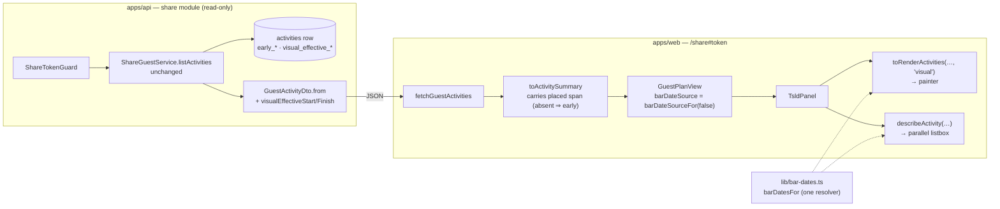
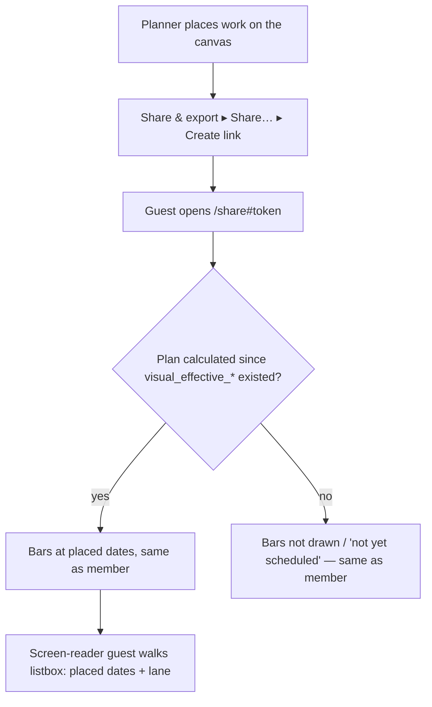

# Feature Spec: A share link draws the bars where the planner placed them

- **Status:** Approved — by the product owner, 2026-09-28 (a guest sees the placed bars).
- **Author(s):** feature-analyst (for the product owner)
- **Date:** 2026-09-28
- **Tracking issue / epic:** `docs/TECH_DEBT.md` #356
- **Roadmap link:** none. This is a register-row fix. It gets a spec because it widens a security
  boundary (ADR-0105).
- **Related ADR(s):** ADR-0051 (guest share links, `SCHEDULE_READ`), ADR-0148 (visual is the plan),
  ADR-0105 (a register row is not a spec), ADR-0026 D7 (the parallel listbox), ADR-0081 (entry point
  and journey). **A new ADR is recommended: ADR-0163, amending ADR-0051 §4** (§4.7).

> **The product owner has already decided the direction (2026-09-28): a guest sees the PLACED
> bars, meaning the same positions the planner sees.** This spec does not reopen that. It covers
> what the decision costs, which fields it needs, what it tells a guest, and how we prove it holds.

---

## 0. What was checked, and what was wrong in the row

Register row #356 (`docs/TECH_DEBT.md:11185-11229`) lists five facts. All five were re-read on
2026-09-28 and **all five still hold**. Four of its line citations have moved since it was filed,
which is not surprising:

| Row's citation                            | Where it is today                                                                     | Holds? |
| ----------------------------------------- | ------------------------------------------------------------------------------------- | ------ |
| `guest-dto.spec.ts:136-137` (forbidden)   | `apps/api/src/modules/share/dto/guest-dto.spec.ts:143-144`                            | yes    |
| `guest-api.ts:227-228` (adapter nulls)    | `apps/web/src/features/share/guest-api.ts:230-231`                                    | yes    |
| `TsldPanel.tsx:601` (default `'early'`)   | `apps/web/src/features/tsld/components/TsldPanel.tsx:655`                             | yes    |
| `GuestPlanView.tsx:255-261` (no source)   | `apps/web/src/features/share/components/GuestPlanView.tsx:255-262`                    | yes    |
| `plan-workspace-toolbar.tsx:482` (member) | `apps/web/src/components/layout/workspace/plan-workspace-toolbar.tsx:488` (+ `:1055`) | yes    |

Reading the code turned up **one more fact the row does not have**. It is the most urgent part of
this work:

> **The guest's accessible channel says every activity is unscheduled.** `TsldPanel` builds the
> listbox text by calling `describeActivity(a, { overlapsInLane, withCodes })`, and it does **not**
> pass `barDateSource` (`TsldPanel.tsx:1170-1173`). `describeActivity` then uses its own default,
> `'visual'` (`render/a11y.ts:166`). The guest adapter sets `visualEffectiveStart: null`
> (`guest-api.ts:230`), so the sentence takes the `drawn.start === null` branch and reads
> `"<name>, <n> working days, not yet scheduled"` (`a11y.ts:167`).
>
> So a sighted guest sees bars drawn at the **early** dates, and a screen-reader guest is told
> **no activity has dates**. The two disagree, and both differ from the member view. That is a
> WCAG 1.1.1 failure on the one screen an outsider sees.
>
> **This was worked out by reading the code, not seen in a browser.** The existing journey cannot
> see it: its only listbox assertion is `getByRole('option', { name: /Excavate/ })`
> (`e2e-share/share.spec.ts:77`), and that matches the "not yet scheduled" sentence. M2's journey
> is the first thing that will observe it. Its red run records what it sees.

This fix repairs both channels at once. When the guest adapter carries the placed dates, the
listbox default (`'visual'`) becomes correct for the guest too.

A second finding sits next door and is **not** folded in (§4.8): a **member** with the Late overlay
switched on is read the placed dates, not the late ones. This is the same missing argument at
`TsldPanel.tsx:1170`, and `a11y.test.ts:372-381` says in so many words that the caller must pass
the source.

---

## 1. Business understanding

### Problem

A share link is how a planner hands a schedule to someone who was not in the room: a client's
owner rep, or a subcontractor (ADR-0051 context, `docs/adr/0051-external-guest-share-links.md:20-25`).
Since ADR-0148 collapsed the scheduling modes, **the plan is where the bars are placed**. The member
canvas draws `visualEffectiveStart`/`visualEffectiveFinish` for every plan
(`lib/bar-dates.ts:54-56`, `plan-workspace-toolbar.tsx:488`). The guest canvas still draws the CPM
**early** dates, because:

1. the guest API does not send the placed span (`guest-activity.dto.ts:98-121`, and it is on the
   forbidden list at `guest-dto.spec.ts:143-144`);
2. the web adapter fills in `null` (`guest-api.ts:230-231`);
3. `GuestPlanView` passes no `barDateSource`, so `TsldPanel` falls back to `'early'`
   (`TsldPanel.tsx:655`, `GuestPlanView.tsx:255-262`).

**The collapse took information away from guests without anyone deciding to.** Before ADR-0148, a
drag on an `EARLY` plan wrote a binding `SNET` at the drop date (`docs/adr/0148-visual-is-the-plan.md:24-27`),
and a binding `SNET` sets `early_start = constraint_date` (the "binding" class, `:126`). So the guest
**was** shown the dragged position, through `earlyStart`. After the collapse, the same drag writes a
placement, and a placement does not move `earlyStart`. The one-off strip made it worse for bars
dragged before the collapse. It turned binding `SNET`s into placements, and after that "the bars do
not move and the float downstream does" (`:139-141`). The **member's** bar stayed put. The
**guest's** bar moved to the network's earliest date, a date the planner never chose.

### Users

| Role                                                        | Need                                                                                          |
| ----------------------------------------------------------- | --------------------------------------------------------------------------------------------- |
| **External Guest** (share-link holder)                      | To see the programme as the planner laid it out, in both the picture and the spoken sentence. |
| **Planner / Org Admin** (who issues the link, `plan:share`) | To know the link shows what they see, so they need not explain the difference in a meeting.   |
| Contributor / Viewer                                        | Not affected. They use the member view, which already draws placed bars.                      |

### Primary use cases

1. A planner hand-places work, shares the plan, and the guest sees each bar at the same dates and
   lane as the planner does.
2. A guest using a screen reader hears each activity's placed dates and lane. Today they hear
   "not yet scheduled".

### User journeys

The planner authors and places work → opens **Share & export ▸ Share…** → creates a link → sends it.
The guest opens `/share#<token>` → the read-only diagram draws each bar where the planner placed
it → a keyboard or screen-reader guest walks the listbox and hears the same dates and lane. See the
user flow in §4.

### Expected outcomes

- For every activity, the member canvas and the guest canvas agree on **when** a bar sits (and they
  already agree on its lane).
- The guest listbox speaks real dates instead of "not yet scheduled".
- No new route, no new query, no schema change, and no engine change.

### Success criteria

The **falsification conditions** in §2 hold, each **verified red against today's code** before the
fix lands (ADR-0110 D5).

### Open questions

**No critical questions.** The product owner's decision settles the design. The defaults below are
the ones taken. Any of them can be overturned without redesigning anything.

- **Q1 (not critical).** Should parity mean **only bar position**, or every mark the member draws?
  **Default: bar position (dates and lane) only.** Four member marks still differ on the guest
  canvas, and each is a separate written exclusion in ADR-0051 (§4.6). Widening any of them is a
  separate decision.
- **Q2 (not critical).** Existing live links will start showing placed bars as soon as the release
  lands, because ADR-0051 has no per-link scope column (`:158-161`). **Default: accept this.** It is
  exactly the decision the product owner took. The changeset says it in words.
- **Q3 (not critical).** New ADR or an in-place amendment? **Recommendation: a new ADR-0163 that
  amends ADR-0051 §4** (§4.7).

---

## 2. Functional requirements

### User stories & acceptance criteria

> **US-1** — As an **External Guest**, I want the diagram to draw each activity where the planner
> placed it, so that the programme I am shown is the programme being run.
>
> - **Given** an activity whose placed start differs from its early start, **when** I open the share
>   link, **then** its bar starts at the placed date, as it does in the member's view.
> - **Given** an activity nobody has placed, **when** I open the link, **then** its bar draws where
>   it does today, because an unplaced activity's `visualEffectiveStart` equals its logic-earliest
>   (`lib/bar-dates.ts:48-52`).
> - **Given** a successor pushed later by a placed predecessor, **then** its bar draws at the pushed
>   position, exactly as the member sees it (`engine/compute.ts:302-303`, 313-321).

> **US-2** — As an **External Guest using a screen reader**, I want each activity's listbox entry to
> state the dates the bar is drawn at, so that the text alternative matches the picture.
>
> - **Given** a calculated plan, **when** I move through the diagram's listbox, **then** each option
>   states a date span and lane, never "not yet scheduled" (for a recalculated plan).
> - **Given** the same activity in the member view, **then** the date and lane part of both option
>   names is identical.

> **US-3** — As the **Planner who issued the link**, I want to be sure the link shows nothing new
> beyond where the work sits, so that sharing a plan still keeps my working notes private.
>
> - **Given** any activity, **then** the guest response still has **no** `visualStart`,
>   `visualConflict`, `visualConflictReason`, `visualDriftDays`, `remainingFloat`, constraint field,
>   cost, resource, note or audit field.

### Falsification / acceptance conditions

Each condition names its instrument. **FC-1, FC-3, FC-4 and FC-5 must be run red against today's
code first, and the red output recorded in the milestone's PR.**

| #        | Condition                                                                                                                                                                                                                                                                                                                                  | Instrument                                                                              | Today                                                                  |
| -------- | ------------------------------------------------------------------------------------------------------------------------------------------------------------------------------------------------------------------------------------------------------------------------------------------------------------------------------------------ | --------------------------------------------------------------------------------------- | ---------------------------------------------------------------------- |
| **FC-1** | For a placed activity, `GET /api/v1/share/activities` returns `visualEffectiveStart`/`visualEffectiveFinish` **identical to** the member's `GET …/activities` for that row. As a **precondition inside the case**, `visualEffectiveStart !== earlyStart`, or the case proves nothing.                                                      | `apps/api/test/share-guest.e2e-spec.ts` (new case)                                      | Red: fields absent                                                     |
| **FC-2** | The guest activity key set grows by **exactly** `visualEffectiveStart` and `visualEffectiveFinish`. Every other forbidden key stays forbidden. The live e2e forbidden list gains `visualConflictReason`, `visualDriftDays` and `remainingFloat`, so the boundary is pinned at both the unit and wire levels.                               | `guest-dto.spec.ts` exact-key + `it.each`; e2e `FORBIDDEN_KEYS`                         | Exact-key is red (two keys missing); the rest is green and stays green |
| **FC-3** | The guest DTO copies the **right columns**. The fixture gives `visualEffective*` dates that differ from `earlyStart`/`earlyFinish`. Today every date in it is `DAY` (`guest-dto.spec.ts:60-74`), so a mapping of `visualEffectiveStart: day(entity.earlyStart)` would pass.                                                                | `guest-dto.spec.ts` value case                                                          | Red                                                                    |
| **FC-4** | Every **production** `<TsldPanel` host passes `barDateSource` explicitly. The guest passes `barDateSourceFor(false)` (= `'visual'`). The census has a **pinned positive case**: it must find ≥ 2 hosts, or an empty glob would pass it.                                                                                                    | new `share/guest-bar-basis.structural.test.ts` + `GuestPlanView.test.tsx` prop capture  | Red: the guest passes nothing                                          |
| **FC-5** | **Journey, text limb.** The guest listbox option for the placed activity states the **same date-span and lane clauses** as the member's option for that activity, and contains the placed date. Only those clauses are compared. The float and conflict clauses differ on purpose, because their fields stay excluded (`a11y.ts:176-215`). | `e2e-share/share.spec.ts`                                                               | Red (reasoned): "not yet scheduled"                                    |
| **FC-6** | **Journey, pixel limb (scale-free).** On each canvas, `r = (Excavate.left − Pour.left) / (Pour.right − Pour.left)` measured from painted bar ink. The guest's `r` is within **0.1** of the member's, **and** the guest's `r > 0.4`. The fixture places Excavate 3 working days into a 5-day Pour, so the expected value is ≈ 0.6.          | `e2e-share` pixel helper adapted from `e2e-arrange/support.ts` `canvasInk` (`:249-336`) | Red: the guest draws both at the data date, so `r ≈ 0`                 |
| **FC-7** | **Version skew.** If a response has **no** `visualEffectiveStart` key (an older API), the adapter draws the early dates, which is today's picture and never a blank diagram. If the key is present and `null`, nothing is drawn, as in the member view.                                                                                    | `guest-api.test.ts` (new)                                                               | Not applicable today                                                   |
| **FC-8** | **No cost, no engine.** `share-guest.service.ts` has no diff. `computeSchedule` is not imported. No migration.                                                                                                                                                                                                                             | `git diff --stat` in the PR description                                                 | —                                                                      |

**Why FC-6 exists as well as FC-5, and it is the easy thing to leave out.** The two channels read
**different inputs**. The painter uses `toRenderActivities(…, barDateSource)`
(`TsldPanel.tsx:1154-1157`). The listbox uses `describeActivity(a, …)` with **no source**, so it
falls back to `a11y.ts`'s own `'visual'` default (`TsldPanel.tsx:1170`, `a11y.ts:166`). A half fix
that adds the fields to the adapter but never passes `barDateSource` would therefore turn FC-5
**green while the canvas still draws early dates**. FC-4 guards that seam at the unit level. FC-6
guards it in the real product. If FC-6 turns out to be unable to tell the cases apart (for example,
node glyphs hide the bar's ink edges), **stop** rather than ship on FC-5 alone. The fallback is to
fold the `TsldPanel.tsx:1170` fix (§4.8), which makes the text channel follow the painter's source,
so FC-5 then witnesses both channels.

### Workflows

1. **API.** `ShareGuestService.listActivities` is unchanged (`share-guest.service.ts:83-115`). It
   already loads **full** rows (`activity.repository.ts:133-145`, which has no `select`), and
   `GuestActivityDto.from` copies two more columns through the same `day()` helper the early dates
   use (`guest-activity.dto.ts:99`). That helper is the one the member DTO uses
   (`activity-response.dto.ts:460, 525-526`), so a `FINISH_MILESTONE`'s end-of-day date (ADR-0155)
   formats the same way on both surfaces.
2. **Web.** `fetchGuestActivities` → `toActivitySummary` now carries the two fields → `GuestPlanView`
   passes `barDateSource={barDateSourceFor(false)}` → `TsldPanel` resolves every bar through
   `barDatesFor` (`bar-dates.ts:73-92`), the resolver the member view already uses.

### Edge cases

| Case                                                                     | Behaviour                                                                                                                                                                                                                 |
| ------------------------------------------------------------------------ | ------------------------------------------------------------------------------------------------------------------------------------------------------------------------------------------------------------------------- |
| Unplaced activity                                                        | Placed span = logic-earliest, the same pixels as today (`bar-dates.ts:48-52`).                                                                                                                                            |
| Placement earlier than logic allows (engine flags `EARLIER_THAN_LOGIC`)  | Drawn at the placement. The engine keeps an infeasible placement "exactly" and flags it (`compute.ts:300-302, 353`). The guest sees the bar there **without** the warning triangle (§4.6).                                |
| Plan whose last recalculation pre-dates the `visual_effective_*` columns | `null` placed dates, so the bar is not drawn and the listbox says "not yet scheduled". **Identical to the member view.** `a11y.ts:153-159` records this as deliberate: a fallback would describe a bar that is not there. |
| Plan never calculated                                                    | Early and placed dates are both `null`, the same as today.                                                                                                                                                                |
| Started / complete / LOE / WBS summary                                   | Pass 2 was taught Pass 1's three branches before anything read it as authoritative (ADR-0148 D0, `:52-58`), so the placed span is right for these shapes.                                                                 |
| Finish milestone                                                         | Formatted with the same `day()` helper as the member DTO, and drawn through the same axis helper in the web (ADR-0155).                                                                                                   |
| Same-lane overlap badge                                                  | Now worked out on the **placed** span (`to-render-model.ts:42-52`). Today the guest's badge is worked out on the early span, so it can differ from the member's. This fix makes them match.                               |
| Link gap labels                                                          | Now worked out on the placed span (`TsldPanel.tsx:1833-1847`), which also closes a quieter guest/member divergence.                                                                                                       |
| API older than web (skew, or a rollback of the API image)                | FC-7: the adapter falls back to the early dates, so the guest sees today's picture.                                                                                                                                       |
| Web older than API                                                       | The old bundle ignores the extra keys (`guestFetch` is a plain cast, `guest-api.ts:43`), so the guest sees today's picture.                                                                                               |

### Permissions

- **Who can reach it:** anyone holding a live share token (the `GuestPrincipal` via
  `ShareTokenGuard`, ADR-0051 §3). **The token is still the entire scope.** No path, query or body
  parameter is added (`share-guest.service.ts:39-44`).
- **Who can create the link:** unchanged. `plan:share` belongs to Planner and Org Admin.
- **Members:** unaffected.
- **Scope change:** `SCHEDULE_READ` gains the placed span (§4.5, ADR-0163).

### Validation rules

None. The change is read-only. The fields are engine-owned and written on every recalculation, in
the same statement as the early dates (`schedule.repository.ts:847-909`, columns at `:862-863`).

### Error scenarios

| Scenario                       | Detection                 | User-facing result                        | Status |
| ------------------------------ | ------------------------- | ----------------------------------------- | ------ |
| Dead / revoked / expired token | `ShareTokenGuard`         | Uniform "no longer available" (unchanged) | 404    |
| Rate limit                     | throttler                 | "Too many requests" (unchanged)           | 429    |
| Older API without the fields   | Key absent in the adapter | Early-date picture (today's) — FC-7       | 200    |

---

## 3. Technical analysis

| Area           | Impact  | Notes                                                                                                                                                                                                                                                                                                                                                                      |
| -------------- | ------- | -------------------------------------------------------------------------------------------------------------------------------------------------------------------------------------------------------------------------------------------------------------------------------------------------------------------------------------------------------------------------- |
| Frontend       | low     | `guest-api.ts` (type + adapter), `GuestPlanView.tsx` (one prop), a structural census, and a correction to `TsldPanel`'s docblock. **Not** changing `TsldPanel`'s `'early'` default: 78 test mounts across 35 suites rely on it (counted with `grep -c '<TsldPanel'` over `*.test.tsx`), so changing it is out of proportion. The census pins the production hosts instead. |
| Backend        | low     | `GuestActivityDto`: two properties + `from()`. The service is unchanged.                                                                                                                                                                                                                                                                                                   |
| Database       | none    | No schema change, so `database-architect` is **not** engaged. That is not a judgement that the change is small; there is simply nothing to design (§19.3).                                                                                                                                                                                                                 |
| API            | low     | Additive response fields on `GET /api/v1/share/activities`. OpenAPI descriptions. `docs/API.md:543, :555-557`.                                                                                                                                                                                                                                                             |
| Security       | **med** | **Widens ADR-0051 `SCHEDULE_READ`**, the app's first unauthenticated data read. The reasoning is in §4.5. Needs a security-reviewer pass.                                                                                                                                                                                                                                  |
| Performance    | low     | No new query. The payload grows by about 71 bytes per activity before gzip (the two keys and their `YYYY-MM-DD` values). That is an **estimate from the JSON shape, not a measurement**, roughly 140 kB extra for a 2,000-activity plan before compression.                                                                                                                |
| Infrastructure | none    | —                                                                                                                                                                                                                                                                                                                                                                          |
| Observability  | none    | —                                                                                                                                                                                                                                                                                                                                                                          |
| Testing        | med     | DTO unit (FC-2/3), API e2e (FC-1), web unit (FC-4/7), structural census (FC-4), journey (FC-5/6).                                                                                                                                                                                                                                                                          |

### Dependencies

- Engine columns already written on every recalculation (`schedule.repository.ts:862-863`).
- ADR-0148 D0: Pass 2 is authoritative for progressed, LOE and summary shapes.
- No other work has to land first.

---

## 4. Solution design

### 4.1 Architecture overview



### 4.2 Data flow

```mermaid
sequenceDiagram
  participant Guest as Guest browser
  participant API as /api/v1/share/activities
  participant DB as activities
  Guest->>API: GET (Authorization: Bearer sp_share_…)
  API->>DB: findManyActiveByPlan(token's org + plan)
  DB-->>API: full rows (incl. visual_effective_start/finish)
  API-->>Guest: GuestActivityDto[] (+ visualEffectiveStart/Finish)
  Guest->>Guest: toActivitySummary (placed span; absent ⇒ early)
  Guest->>Guest: TsldPanel barDateSource='visual' → barDatesFor → paint + listbox
```

### 4.3 User flow



### 4.4 Database / API / component changes

- **Database:** none.
- **API:** `GuestActivityDto` gains:
  - `visualEffectiveStart: string | null`, `format: date`. Description: _"Where the bar is drawn:
    the plan as the planner laid it out (ADR-0148). Equals the logic-earliest start for an activity
    nobody has placed. Null until the plan has been calculated."_
  - `visualEffectiveFinish: string | null`, same shape.
  - `from()` copies both through `day()`. The docblock's exclusion list (`guest-activity.dto.ts:20-27`,
    currently "the visual-planning fields (visual*)") is rewritten to name the four that stay out,
    each with its reason.
- **Web:**
  - `GuestActivity` gains `visualEffectiveStart?: string | null` and `visualEffectiveFinish?: string | null`.
    These are **optional on the wire type** because an older API does not send them.
  - `toActivitySummary` maps them with the skew rule (FC-7). If the key is absent, use the early
    field. If it is present, pass it through, **including `null`**, which keeps ADR-0148's
    "no fallback for null" rule (`a11y.ts:153-159`).
  - `GuestPlanView` passes `barDateSource={barDateSourceFor(false)}`. It imports from
    `@/lib/bar-dates`, **not** `@/features/tsld`, because `GuestPlanView.test.tsx:23-25` mocks
    `@/features/tsld` down to `TsldPanel` alone. The reason for passing `false` is written beside it:
    the guest surface offers no Late overlay (`TsldViewControls.tsx:19-29` lists grid, data date,
    today, non-working and labels only).
  - `TsldPanel`'s `barDateSource` docblock (`TsldPanel.tsx:508-512`) still describes `schedulingMode`
    and `VITE_SCHEDULING_MODES`, both deleted by ADR-0148 D1. It is corrected to say that the
    `'early'` default exists for unit suites and that every production host passes the source,
    pinned by the census.
- **Print / export paths reachable from the guest view: none.** The guest mounts `TsldPanel` without
  `chromeless`, so its chrome is the hint line, the Keyboard shortcuts button, `TsldViewControls`
  and the legend (`TsldPanel.tsx:2847-2907`). The PNG/PDF/CSV/print commands live in the workspace
  toolbar context (`use-tsld-toolbar-context.tsx`, `toolbar/commands/use-diagram-image.ts`), which
  the guest never mounts. The journey already asserts that the guest has **zero** toolbars
  (`share.spec.ts:84`). The browser's own Ctrl+P prints the page's canvas as drawn, so it inherits
  this fix without further work. Nothing else needs changing.

### 4.5 Security reasoning: what a guest learns from a placement

**What is added.** For each activity the guest can already see, one more date span at the same
`YYYY-MM-DD` granularity as the early and late dates it already gets. No new entity. No identity,
money, resource, note, baseline or audit field. No new route and no new parameter. Anti-IDOR is
still by construction (`share-guest.service.ts:39-44`).

**Compared with what the guest already has:**

1. **Early dates, late dates, total float and `isCritical` are already in scope** (ADR-0051 §4,
   `:143-146`). They tell the guest the network's timing, its slack and its critical path. The
   placed span is the same kind of fact, about the same activity.
2. **The vertical half of the planner's layout is already in scope.** `laneIndex` is exposed
   (`guest-activity.dto.ts:64-65`), and ADR-0051 §4 lists "lane/position". The placed span is the
   horizontal half of that same layout.
3. **Before the collapse, a guest was shown exactly this.** An `EARLY`-plan drag became an `SNET`,
   and a binding `SNET` sets `earlyStart` to the drop date (ADR-0148 `:24-27`, `:126`). The widening
   gives back a disclosure the guest already had, which the collapse removed without a decision.
   For rows the strip converted, the placed start **equals** the constraint date the guest was
   already shown as `earlyStart`, so there is nothing new to learn there.

**What becomes derivable, stated rather than hidden.** A guest who compares `visualEffectiveStart`
with `earlyStart` learns how far a bar sits from its network earliest date (the drift). With the
plan calendar they already receive (`GuestCalendarDto`: weekday mask and exceptions), they can
**estimate** it in working days. From `totalFloat` minus that, they can estimate the remaining
float. It is only an estimate, because per-activity calendars and shift hours are not exposed.
Some placement conflicts become inferable as well. The engine keeps an infeasible placement
"exactly" and flags it when `placed < logicEarliest` (`compute.ts:300-302, 353`), so a bar drawn
**before** its early start is a strong sign of that. **I have not established** whether every
flagged case can be seen this way, because that depends on how pass 2's logic-earliest compares
with pass 1's `earlyStart` in every shape. So this is described as **partly derivable**, not as
fully derivable.

**What stays out, each for a reason that still holds:**

| Field                                    | Stays excluded because                                                                                                                                                                                                                                                                                                                                                  |
| ---------------------------------------- | ----------------------------------------------------------------------------------------------------------------------------------------------------------------------------------------------------------------------------------------------------------------------------------------------------------------------------------------------------------------------- |
| `visualStart`                            | It is the **authoring input**: it says which bars a person pinned by hand. A guest cannot reliably reconstruct it from the effective span, because an unplaced successor pushed by a placed predecessor also draws later than its early start (`compute.ts:313-321`). It sits alongside `constraintType`/`constraintDate`, which are also authoring state and excluded. |
| `visualConflict`, `visualConflictReason` | "a guest is shown where the work sits, never the planner's working notes about why a placement is contentious" (`guest-dto.spec.ts:146-150`). `LATER_THAN_BOUND` would also reveal that a constraint exists, and constraints are out.                                                                                                                                   |
| `visualDriftDays`, `remainingFloat`      | "a float is analysis, not the schedule a share link exists to show" (`guest-dto.spec.ts:152-156`). The guest can estimate these (see above). Exposing the exact engine figure is a separate decision.                                                                                                                                                                   |

**Why this is acceptable.** The person sharing is a Planner or Org Admin who holds `plan:share` and
has chosen to show the plan to this guest. After ADR-0148 the placed span **is** the plan
(`:48-50`). Withholding it does not protect anything sensitive. It makes the shared artefact wrong.
The residual risk is that a planner's speculative placement becomes visible to an outsider. That is
the same risk as every other date on a shared plan, and it has the same controls: the planner
decides whether to share, the link can be revoked, and it can expire (ADR-0051 §5).

**Retroactive effect.** ADR-0051 has no per-link scope column (`:158-161`), so **every live link**
starts showing placed bars on the release that ships M2. This is intended. The changeset says so.

### 4.6 What "exactly what the planner sees" covers after this change

This change makes **bar position** identical: dates and lane, in both the picture and the spoken
sentence. Four member marks still differ. Each difference is an existing ADR-0051 exclusion, and
each was written before the mark became visible on the canvas:

| Member mark                                        | Why the guest does not draw it                                                                 | Exclusion has a written reason?                                                                            |
| -------------------------------------------------- | ---------------------------------------------------------------------------------------------- | ---------------------------------------------------------------------------------------------------------- |
| Placement-conflict triangle (`paint.ts:2089-2091`) | `visualConflict` is excluded                                                                   | Yes (`guest-dto.spec.ts:146-150`)                                                                          |
| Constraint pin                                     | `constraintType`/`Date` are excluded; the adapter sets them to `null` (`guest-api.ts:184-187`) | Listed in ADR-0051 and the DTO docblock (`guest-activity.dto.ts:24-25`)                                    |
| Near-critical rung (ADR-0151)                      | `isNearCritical` excluded; adapter sets `false` (`guest-api.ts:224`)                           | **No**, it is listed bare (`guest-dto.spec.ts:136`), yet `nearCriticalCount` **is** exposed in the summary |
| Driving-link weight and ink (ADR-0154)             | `isDriving` excluded; adapter sets `false` (`guest-api.ts:277`)                                | **No**, it is listed bare (`guest-dto.spec.ts:266`)                                                        |

The last two are **not folded into this change**. Each is a separate `SCHEDULE_READ` widening that
needs its own reasoning, and adding them here would be exactly the scope creep ADR-0105 exists to
stop. They go in a register row (plan, M3).

**Out of scope and shared with the member view:** the header's "Project finish" reads
`MAX(early_finish)` (`schedule.repository.ts:411`) on **both** surfaces (`GuestPlanView.tsx:187, 231-232`;
`ScheduleSummaryStrip.tsx:69, 109`). It can therefore disagree with the last placed bar in both
views. That is not a guest/member divergence, so it does not belong to #356. The plan has M3
confirm whether a register row exists and file one if not.

### 4.7 ADR recommendation: new ADR-0163, amending ADR-0051 §4

**A new ADR, not an edit inside ADR-0051**, because:

- ADR-0051 is `Accepted` and is the record of a security boundary. The house rule is that an ADR is
  never rewritten in place, only amended or superseded (CLAUDE.md §6). ADR-0148 set the precedent of
  a new ADR carrying an explicit **Amends** line.
- The one earlier widening of guest scope, `durationMinutes` (ADR-0070), was justified as "the
  exact form of a field already in scope" (`guest-dto.spec.ts:184-187`). **That justification does
  not apply here.** The placed span is a new fact, so it needs its own written reasoning.

**Outline — ADR-0163: "A guest sees the plan as placed"** (use the next free number at filing time)

- **Status:** Accepted on approval · **Amends:** ADR-0051 §4 · **Caused by:** ADR-0148 · **Spec:** this directory.
- **Context:** the three facts in §1; the pre-collapse disclosure via a binding `SNET`; the finding
  about the accessible channel.
- **Decision:** `SCHEDULE_READ` includes `visualEffectiveStart`/`visualEffectiveFinish`. The guest
  canvas draws on the placed basis. The four neighbouring fields stay out, each with its reason
  (§4.5 table).
- **Consequences:** it applies to every live link; drift, remaining float and some conflicts become
  partly derivable (stated, and accepted); no route, query or schema change; the recalculation
  parity gate is not touched because no engine code is involved; the skew fallback (FC-7).
- **Alternatives rejected:** (b) keep computed bars, which is the defect; (c) draw both, which puts
  two positions for one activity in front of a reader who was not in the room; a per-link opt-in
  scope column, which is premature (ADR-0051 already rejected it on YAGNI grounds, `:235-237`) and
  needs a schema change for a choice nobody has asked for.
- **Paperwork:** this spec's status moves to `Approved` when the ADR cites it (`check:spec-status`).
  `docs/adr/README.md` gets an index row. `CLAUDE.md` §16 gets an entry. `docs/ROADMAP.md` gets an
  entry or a written exemption (`check:adr-coverage`, ADR-0147). ADR-0051's status line gets
  "Amended by ADR-0163 (§4)".

### 4.8 Implementation approach & alternatives

**Chosen:** widen the DTO by the minimum (two fields), carry them through the adapter, and have the
guest host state its source explicitly, with a census so that no future host inherits `'early'`
by omission.

**Alternatives considered:**

- **Change `TsldPanel`'s default to `'visual'`, or make the prop required.** This fixes the root
  cause (a default nobody chose) more thoroughly. It is rejected **for this change** because 78
  test mounts across 35 suites depend on the default. The census gets the same protection for the
  two production hosts at a fraction of the churn. Worth revisiting if a third host is ever added.
- **Also expose `remainingFloat` / `visualDriftDays`.** The guest cannot reach any surface that
  draws them. The feasible window (`floatTails`) and the centre item are off by default
  (`view-toggles.ts:107-145`), and `TsldViewControls` offers neither switch. They are not needed
  for the picture, and the minimum was preferred.
- **Fix `TsldPanel.tsx:1170` here, passing `barDateSource` to `describeActivity`.** This is correct,
  but it changes **member** behaviour (spoken dates under the Late overlay) and it is not needed for
  the guest fix. **It is filed, not folded** (M3), unless FC-6 fails to tell the cases apart, in
  which case it becomes the fallback witness (§2).
- **Ship API and web in separate releases.** Not needed: the FC-7 fallback makes a single release
  safe whichever side of the skew a host is on. They still land as separate milestones and commits.

**Parity statement.** The CPM engine is not imported and no migration runs. The only engine
columns involved are **read**, and they are the ones already written on every recalculation, so
the ADR-0034 parity gate has nothing to protect here.

## 5. Links

- Implementation plan: [./implementation-plan.md](./implementation-plan.md)
- Related docs updated by this change: `docs/API.md` (guest surface table and "Never exposed"),
  `docs/adr/0163-…` (new), `docs/adr/0051-external-guest-share-links.md` (status line),
  `docs/adr/README.md`, `CLAUDE.md` §16, `docs/ROADMAP.md` (entry or exemption),
  `docs/TECH_DEBT.md` (#356 closed and moved to the ledger, new rows filed).
