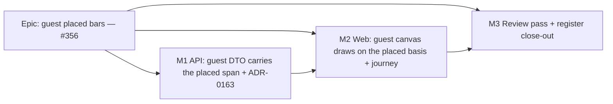

# Implementation Plan: A share link draws the bars where the planner placed them

- **Feature spec:** [./feature-spec.md](./feature-spec.md)
- **Status:** Approved — by the product owner, 2026-09-28 (a guest sees the placed bars).
- **Owner:** api + web (`docs/TECH_DEBT.md` #356)

## Breakdown

### Epic

**Guest placed bars.** A share link draws each bar where the planner placed it, in both the picture
and the spoken sentence. Size **M**. No schema change, no engine change, no new route, no `VITE_`
flag (ADR-0088 D1: a build-time constant is not an operator rollback; the rollback is a commit
boundary).

---

### Milestone 1: the guest API carries the placed span (shippable slice)

**Outcome:** `GET /api/v1/share/activities` returns `visualEffectiveStart`/`visualEffectiveFinish`,
and ADR-0163 records why.
**Entry point:** `Ships dark: the fields are on the wire, but no guest canvas reads them until M2.
A web bundle older than M2 ignores unknown keys (guest-api.ts:43 is a plain cast).`
**Journey:** none at this milestone (it is dark). The API e2e is the gate.

#### Feature: widen `SCHEDULE_READ` by two fields

> **Description:** add the two properties to `GuestActivityDto`, rewrite the exclusion docblock with
> reasons, update the field-exclusion contract at both the unit and wire levels, and file ADR-0163.
> **Complexity:** S
> **Dependencies:** approval of this spec
> **Risks:** the fixture sets every date to `DAY` (`guest-dto.spec.ts:60-74`), so a wrongly mapped
> column would pass → give the placed span distinct dates (FC-3). A reviewer might read the change
> as "all visual fields are now allowed" → the four fields that stay excluded each get a written
> reason in both test tiers.
> **Testing requirements:** FC-1, FC-2, FC-3 (spec §2), each verified red first.

##### Task M1-T1 — File ADR-0163 and move the spec to Approved (≈ same PR as T2)

- **Description:** write ADR-0163 from the outline in spec §4.7. Add the §16 entry in `CLAUDE.md`,
  the `docs/adr/README.md` index row, and either a `docs/ROADMAP.md` entry or a written exemption.
  Add "Amended by ADR-0163 (§4)" to ADR-0051's status line. Change this spec's and this plan's
  headers to `Approved`.
- **Complexity:** S
- **Dependencies:** approval
- **Risks:** `check:adr-coverage` refuses a filed ADR that is missing from §16 or the index
  (ADR-0147), and `check:spec-status` refuses a `Draft` spec that an ADR cites (ADR-0131) → do all
  four edits in the same commit.
- **Testing:** `pnpm prepush` (it derives both gates).
- **Development steps:**
  1. Take the next free ADR number (0163 at the time of writing; re-check with `ls docs/adr`).
  2. Write the ADR with the parity statement in its honest form: no engine code is imported, and the
     columns are only read.
  3. Add the index row, the §16 entry, the roadmap entry or exemption, and the ADR-0051 status note.
  4. Update both spec headers.

##### Task M1-T2 — `GuestActivityDto` gains the placed span

- **Description:** add `visualEffectiveStart`/`visualEffectiveFinish` (`@ApiProperty({ format:
'date', nullable: true, type: String, description })`, with the description from spec §4.4).
  `from()` copies both through the existing `day()` (`guest-activity.dto.ts:99`). Rewrite the
  docblock's "the visual-planning fields (visual*)" (`:23`) to name the four that stay excluded,
  each with its reason.
- **Complexity:** S
- **Dependencies:** none
- **Risks:** copying `visualStart` by mistake (the input, not the drawn span) → FC-2's `it.each`
  still forbids `visualStart`.
- **Testing:** `guest-dto.spec.ts`:
  1. **Exact-key list** (`:176-200`): add the two keys, with a comment giving the written reason
     (ADR-0163: the drawn span is the plan since ADR-0148; it is not the input and not the analysis).
  2. **`FORBIDDEN_ACTIVITY_KEYS`** (`:103-171`): remove the two keys. Give the bare `visualStart`
     and `visualConflict` entries (`:142, :145`) written reasons, in line with the file's own rule
     that "an exclusion nobody wrote down reads as an accident" (`:107, :149`).
  3. **Fixture:** set `visualEffectiveStart`/`Finish` to dates that differ from `earlyStart`/`Finish`
     (for example, `earlyStart` 2026-07-01, `visualEffectiveStart` 2026-07-08).
  4. **New value case:** `dto.visualEffectiveStart === '2026-07-08'` and `!== dto.earlyStart`.
  5. **Red first:** run it before the DTO change and record the failure (exact-key mismatch and a
     missing property).
- **Development steps:**
  1. Write the test changes. Run them red.
  2. Change the DTO. Run them green.
  3. `docs/API.md:543`: add "placed start/finish (where the bar is drawn)" to the activities row.
     `:555-557`: add "the placement input, conflict, drift and remaining float" to "Never exposed".

##### Task M1-T3 — Live-wire proof (FC-1) and pinning the neighbouring exclusions

- **Description:** add a new case to `apps/api/test/share-guest.e2e-spec.ts`. Create two activities,
  place one through `PATCH …/activities/placements` with the pen held, recalculate, then compare the
  guest read with the member read.
- **Complexity:** S
- **Dependencies:** M1-T2
- **Risks:** a placement at the early date proves nothing → **assert inside the case** that the
  member row's `visualEffectiveStart !== earlyStart` before comparing. Recalculation is pen-gated →
  use the suite's existing pen and recalculate helpers.
- **Testing:**
  1. Placed row: the guest's `visualEffectiveStart`/`Finish` equal the member's exactly. Unplaced
     row: the guest's `visualEffectiveStart === earlyStart`.
  2. Add `visualConflictReason`, `visualDriftDays` and `remainingFloat` to the e2e `FORBIDDEN_KEYS`
     (`:276-310`). `containsKey` matches exact keys (`:35-43`), so the two new fields do not trip the
     existing `visualStart` entry.
  3. Red first: run the new case before T2 and record the failure.
- **Development steps:**
  1. Write the case. Run it red against M1-T1's tree without T2.
  2. Land it with T2. Run `scripts/e2e-local.sh api`.
  3. Add a changeset: `api` **minor** (additive response fields). Wording: "share links now include
     where each bar is placed."

---

### Milestone 2: the guest canvas draws on the placed basis (first user-facing milestone)

**Outcome:** a guest sees each bar at the planner's placed dates, and a screen-reader guest hears
those dates and the lane.
**Entry point:** the public guest view `/share#<token>`: region **"Time-scaled logic diagram"** and
its option list. The planner reaches it through **Share & export ▸ Share…** (`share.spec.ts:41-42`).
**Journey:** `apps/web/e2e-share/share.spec.ts`, extended (FC-5, FC-6). It lands **in this
milestone** (ADR-0081 §2).

#### Feature: guest adapter and host basis

> **Description:** carry the two fields through `toActivitySummary`, with the skew rule. Pass
> `barDateSource` explicitly from `GuestPlanView`. Add a census so that no production host inherits
> `'early'`. Correct `TsldPanel`'s stale docblock.
> **Complexity:** M
> **Dependencies:** M1 (FC-7 means a web-before-API deploy still degrades safely, but the journey
> needs M1's API)
> **Risks:** see the per-task risks and the rollup.
> **Testing requirements:** FC-4, FC-5, FC-6, FC-7.

##### Task M2-T1 — Adapter: carry the placed span, with a skew fallback

- **Description:** in `guest-api.ts`, `GuestActivity` gains `visualEffectiveStart?: string | null`
  and `visualEffectiveFinish?: string | null` (optional, because an older API does not send them).
  `toActivitySummary` (`:230-231`): if the key is **absent**, use `earlyStart`/`earlyFinish`, which
  gives today's picture. If the key is **present**, pass it through, `null` included. Keep the
  neighbouring `null` comments for the four fields that stay excluded, but make them cite ADR-0163.
- **Complexity:** S
- **Dependencies:** none (M1 is a runtime dependency, not a compile-time one)
- **Risks:** a fallback on `null` would draw a bar the member view does not draw, which breaks
  `a11y.ts:153-159`'s deliberate no-fallback rule → only an **absent** key falls back, and a test pins
  each case separately.
- **Testing:** a new `guest-api.test.ts`:
  1. Key present with a date → carried through.
  2. Key present as `null` → `null`.
  3. Key absent → the early dates.
  4. `toRenderActivities(toActivitySummary(row), barDateSourceFor(false))` yields
     `earlyStart === row.visualEffectiveStart`. This goes through the **real** render seam rather than
     a restatement of it.
- **Development steps:**
  1. Write the tests. Case 1 is red today.
  2. Change the type and the adapter.

##### Task M2-T2 — `GuestPlanView` states its basis, and a census pins every host

- **Description:** `GuestPlanView` passes `barDateSource={barDateSourceFor(false)}`, importing from
  `@/lib/bar-dates`, with the comment "the guest surface has no Late overlay"
  (`TsldViewControls.tsx:19-29`). Add a new structural test
  `apps/web/src/features/share/guest-bar-basis.structural.test.ts`. It scans non-test `.tsx` under
  `apps/web/src` for `<TsldPanel` JSX elements and requires a `barDateSource=` attribute inside each
  element. The tag reader must handle balanced braces, because an `=>` in a sibling attribute ends a
  naive `/<TsldPanel[^>]*>/` match early. That exact hole is recorded in ADR-0145. Add a **pinned
  positive case**: the census must find ≥ 2 hosts. Correct `TsldPanel.tsx:508-512`'s docblock.
- **Complexity:** S
- **Dependencies:** M2-T1
- **Risks:** a census over an empty glob passes (ADR-0093/0108) → the pinned count guards it. The
  reader treats a comment as code → strip comments before scanning, as sibling gates do.
- **Testing:**
  1. `GuestPlanView.test.tsx`: the `TsldPanel` mock (`:23-25`) captures its props. Assert
     `barDateSource === 'visual'`. This is red today (`undefined`).
  2. Census: verify it red three ways. (a) Remove the prop from `GuestPlanView`. (b) Add a fixture
     host whose `barDateSource` appears after an `onX={() => …}` attribute. (c) Point the glob at an
     empty directory, which must fail on the pinned count.
- **Development steps:**
  1. Write both tests. Run them red.
  2. Add the prop and correct the docblock.

##### Task M2-T3 — Journey: pin where a guest bar sits compared with the member's (FC-5, FC-6)

- **Description:** extend `share.spec.ts`. The drawn activity's date depends on click pixels and is
  not reliable, so the fixture is set through the API. Copy `placeRelativeTo`/`recalculate`-style
  helpers into `e2e-share/support.ts`. Suites copy support code rather than importing it across
  suite boundaries (`e2e-arrange/support.ts:196-197`). Steps:
  1. With the pen held, create **Pour** (5 working days, no predecessors, lane 1) through the REST
     API.
  2. Place **Excavate** at the data date + 3 working days (the plan starts Monday 2026-01-05,
     `support.ts:43`, so that is 2026-01-08), lane 0.
  3. Recalculate. Read the member API and **assert Excavate's `visualEffectiveStart !== earlyStart`**
     (the precondition).
  4. **FC-5 (text):** read the member's option name for Excavate and pull out its **date-span and
     lane clauses** with a regex (`/, (\d{2} \w{3} \d{4}(?: to \d{2} \w{3} \d{4})?), lane (\d+)/`).
     Assert the guest's option name yields the same captures, and that they include `08 Jan 2026`.
     **Do not compare the whole sentence.** The float and conflict clauses differ on purpose: the
     guest's `remainingFloat` and `visualConflict*` are excluded, so `a11y.ts:176-215` leaves those
     clauses out.
  5. **FC-6 (pixels, scale-free):** in each context, press Fit (the guest uses `TsldViewControls`'
     Fit button; the member uses `Zoom ▾ ▸ Fit to plan`). Then use a suite-local
     `barExtentsByRow(page)` adapted from `canvasInk` (`e2e-arrange/support.ts:249-336`: bar ink
     classified by saturation, never by a hex literal). Compute
     `r = (Excavate.left − Pour.left) / (Pour.right − Pour.left)`. Assert
     `|r_guest − r_member| < 0.1` and `r_guest > 0.4`. The expected value is about 0.6.
- **Complexity:** M
- **Dependencies:** M1, M2-T1, M2-T2
- **Risks:**
  - **Node glyphs blur the edges of the bar ink** (ADR-0157: 15 px ground-filled nodes) → both
    contexts measure the same way, so the bias cancels in the difference; the tolerance absorbs the
    rest.
  - **The ratio cannot tell the cases apart** → **stop.** The fallback is to fold the
    `TsldPanel.tsx:1170` fix so FC-5 witnesses the painter's source (spec §2). Do **not** ship on
    FC-5 alone, because the listbox does not read `barDateSource` (`TsldPanel.tsx:1170`, `a11y.ts:166`).
  - The existing "not yet scheduled" behaviour is **reasoned, not observed** → the red run records
    the guest's actual option name as evidence.
- **Testing:** **red run first:** revert M2-T1 and M2-T2 locally, run the suite, and record the
  guest's option name and `r_guest`. Then run green. Keep the existing axe scan (`share.spec.ts:181-185`)
  running after the fixture change.
- **Development steps:**
  1. Write the helpers and the assertions.
  2. Take the red run and record it in the PR.
  3. Take the green run. Run `scripts/e2e-local.sh web:share` and the base journey.
  4. Add a changeset: `web` **patch**. Wording: "a share link draws bars where the planner placed
     them; screen readers hear their dates."

---

### Milestone 3: review pass and register close-out

**Outcome:** the boundary change is reviewed, #356 is closed, and the findings next to it are filed.
**Entry point:** n/a (no product change). **Journey:** n/a.

##### Task M3-T1 — Specialist reviews over the combined diff

- **Description:** **security-reviewer** (the `SCHEDULE_READ` widening, spec §4.5; including a check
  that no parameter was added and that the anti-IDOR construction still holds), **api-reviewer**
  (OpenAPI descriptions, `docs/API.md`), and **accessibility-reviewer** (the guest listbox now speaks
  dates; confirm the member's announcement is unchanged). Fold every blocking finding, each with a
  regression test verified red first.
- **Complexity:** S
- **Dependencies:** M1, M2

##### Task M3-T2 — Register

- **Description:**
  1. Close #356: delete the row, add a ledger entry pointing at ADR-0163 and the journey.
  2. **File:** `TsldPanel.tsx:1170` does not pass `barDateSource` to `describeActivity`, so a
     member with the Late overlay on hears the placed dates, not the late ones. This breaks
     `a11y.test.ts:372-381`'s stated contract ("the source is the CALLER'S").
  3. **File:** the guest canvas still lacks the near-critical rung (ADR-0151) and driving-link weight
     (ADR-0154). Their exclusions have no written reason (`guest-dto.spec.ts:136, :266`), while
     `nearCriticalCount` is exposed in the summary.
  4. **Check, then file if missing:** "Project finish" reads `MAX(early_finish)`
     (`schedule.repository.ts:411`) on both surfaces, and can disagree with the last placed bar.
- **Complexity:** S
- **Dependencies:** M3-T1
- **Testing:** `pnpm check:debt-status` (via `pnpm prepush`).

## Sequencing & slices

M1 → M2 → M3, one PR each (M1-T1 lands with M1-T2/T3). **Each slice leaves `main` releasable.**

- M1 on its own: the fields are on the wire and unused by today's bundle, so nothing changes for users.
- M2 needs M1's API for its journey. The FC-7 fallback keeps the product correct on a host where the
  web image moves ahead of the API image (they auto-pull independently, ADR-0047).

M1 and M2 can release together, so no two-release ordering is required. No feature flag.

## Definition of Done (per task)

Each task's PR must satisfy the Feature Completion Criteria in
[`docs/PROCESS.md`](../../PROCESS.md): code, tests, docs, security, performance, accessibility,
Docker build, CI, changelog, and version impact. Plus:

- `pnpm prepush`
- `scripts/e2e-local.sh api` (M1)
- `scripts/e2e-local.sh web:share` and the base journey (M2)
- CI checks read per CLAUDE.md §19.9 (deduplicated by name, current head)

## Risks & assumptions (rollup)

| Risk / assumption                                                                   | Likelihood | Impact | Mitigation                                                                                                          |
| ----------------------------------------------------------------------------------- | ---------- | ------ | ------------------------------------------------------------------------------------------------------------------- |
| A half fix (adapter only) turns FC-5 green while the canvas still draws early dates | med        | high   | FC-4 (unit prop + census) and FC-6 (pixels). FC-6 is not optional.                                                  |
| The pixel ratio cannot tell the cases apart because of node glyphs                  | low–med    | med    | Stop. Fall back to folding the `TsldPanel.tsx:1170` fix so the text channel follows the painter.                    |
| Every live link changes its picture on release                                      | certain    | low    | Intended (the product owner's decision). The changeset states it.                                                   |
| A guest estimates drift, remaining float, and some conflicts                        | certain    | low    | Stated and accepted in ADR-0163 (spec §4.5). The exact engine figures stay out.                                     |
| An API rollback under a newer web gives a blank guest diagram                       | low        | med    | FC-7: an absent key falls back to the early dates.                                                                  |
| The "not yet scheduled" guest finding is reasoned, not observed                     | —          | —      | M2-T3's red run observes it and records the actual option name.                                                     |
| ADR number collision                                                                | low        | low    | Re-check the next free number at filing time. Record any change rather than working around it (ADR-0079 precedent). |
