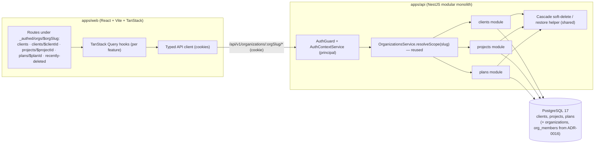
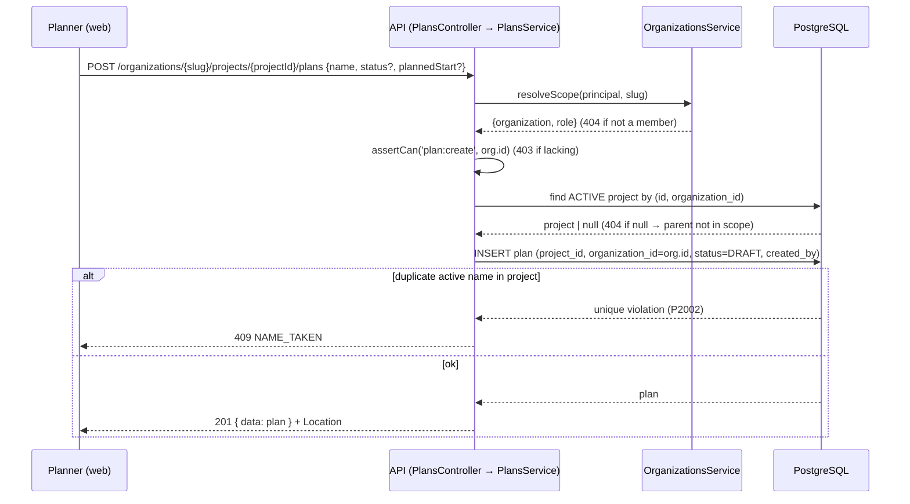
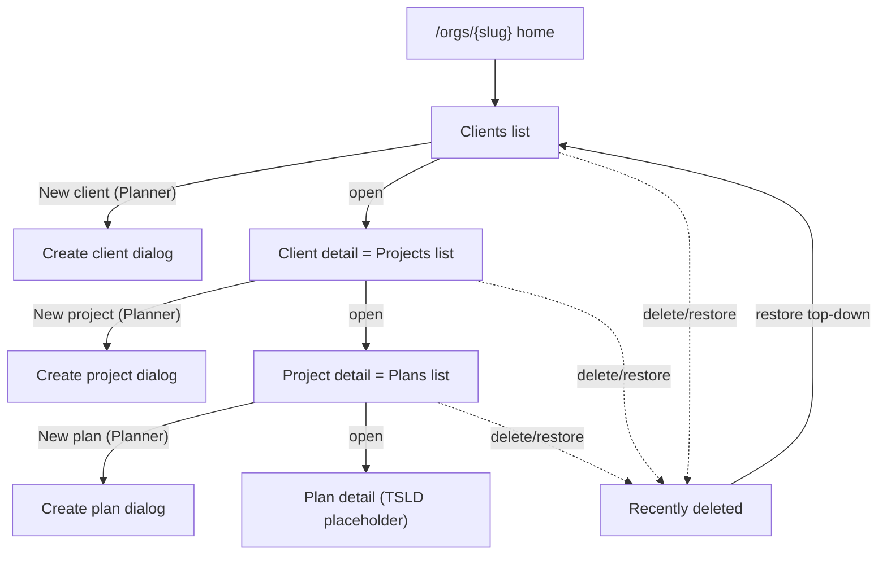
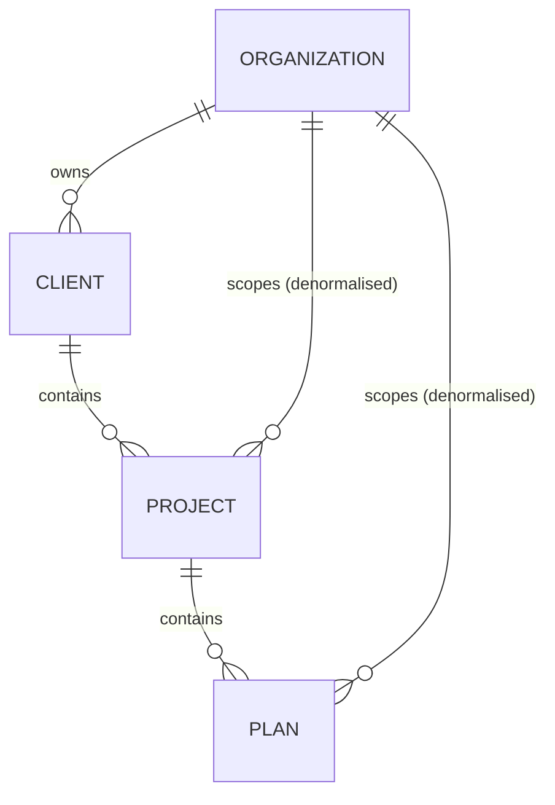

# Feature Spec: Client → Project → Plan hierarchy CRUD

- **Status:** Draft
- **Author(s):** Feature Analyst (Solution Architect / Product Owner / Tech Lead hats)
- **Date:** 2026-07-09
- **Tracking issue / epic:** _TBD_ — Epic "Domain hierarchy & navigation"
- **Roadmap link:** M2 — Hierarchy CRUD & navigation (see `docs/ROADMAP.md`)
- **Related ADR(s):** ADR-0008 (modular monolith), ADR-0012 (RBAC + resource
  scoping), ADR-0014/0015 (reference template), ADR-0016 (identity & tenancy +
  role set). **No new ADR proposed** — this slice reuses the tenancy/RBAC pattern
  established by ADR-0016 unchanged. Two cross-cutting conventions
  (cascade soft-delete + restore, denormalised `organization_id`) are recorded in
  `docs/DECISIONS.md`; promote to an ADR only if a reviewer judges them broadly
  architectural (see §4).

> This is the **second vertical slice** of SchedulePoint. It builds directly on
> the organisation onboarding & membership slice (ADR-0016) — reusing its
> `OrgMember` scoping key, `resolveScope(principal, orgSlug)` resolver,
> deny-by-default RBAC, `{data,meta}`/`{error}` envelopes, soft-delete + audit +
> optimistic locking, cursor pagination, and the web `_authed` org-scoped shell —
> to deliver the three domain containers **Client → Project → Plan** as CRUD with
> **soft-delete + restore**. It unblocks Activities and the TSLD canvas, which
> hang off `Plan` in later slices. **No scheduling maths, activities, calendars,
> or CPM are in scope here** — a Plan is a container with basic metadata only.

## 1. Business understanding

### Problem

SchedulePoint's domain is a hierarchy — **Org → Client → Project → Plan →
Activity** (PROJECT_BRIEF §9). The previous slice delivered the tenant boundary
(`Organization`/`OrgMember`) but there is nowhere yet to put work: a planner who
signs in and creates an organisation lands on an empty shell with no way to
record the client they are building for, the project under that client, or the
plan they will schedule. Every downstream capability — activities, the TSLD
canvas, calendars, baselines, progress, share links — is addressed **through a
Plan**, so until the three container levels exist the product cannot progress
past onboarding.

"Why now": it is the immediate prerequisite for the flagship feature (the TSLD
canvas). It is also the cheapest place to prove the org-scoped CRUD pattern that
every future domain entity (activities, notes, resources, baselines) will copy,
including the **soft-delete + restore** convention the brief mandates for the
hierarchy (PROJECT_BRIEF §11) and the 90-day retention posture (§13).

### Users

Roles are per **organisation membership** (ADR-0012/0016). This slice touches all
four member roles; **External Guest** remains out of scope (guests hold a
per-plan share grant, delivered later).

| Role            | Needs in this slice                                                                      |
| --------------- | ---------------------------------------------------------------------------------------- |
| **Org Admin**   | Full CRUD on clients/projects/plans; delete & restore; manage the whole tree.            |
| **Planner**     | Full CRUD on clients/projects/plans; delete & restore — the primary author of hierarchy. |
| **Contributor** | Browse/read the tree (clients → projects → plans) to find the plans they work on.        |
| **Viewer**      | Browse/read the tree, read-only.                                                         |

> Per PROJECT_BRIEF §5 the **Planner** owns hierarchy CRUD; **Org Admin** manages
> the org and, as its administrator, is also granted hierarchy write here so an
> admin is never locked out of their own org's data. Contributors and Viewers get
> read only in this slice (Contributors gain progress rights on _activities_
> later, which do not exist yet).

### Primary use cases

1. **Create a client** within the active organisation.
2. **Create a project** under a client; **create a plan** under a project.
3. **Browse the hierarchy** — drill Org → Clients → a Client's Projects → a
   Project's Plans → a Plan's detail (the future canvas host).
4. **Rename / edit** a client, project, or plan (description; plan status &
   planned start).
5. **Delete** a client/project/plan (soft delete, cascading to descendants) and
   **restore** it (with its cascaded descendants) within the retention window.

### User journeys

- **Green-field setup (happy path).** Planner (already in an org from the
  previous slice) → **Clients** → "New client" → names it → opens the client →
  "New project" → names it → opens the project → "New plan" → names it, sets a
  status and optional planned start → lands on the plan detail (an empty
  placeholder that the TSLD canvas will fill later). See the user-flow diagram in
  §4.
- **Tidy up / mistaken delete.** Planner deletes a client created by accident;
  its projects and plans disappear from the active views together. They open
  **Recently deleted**, find the client, and **restore** it — the client and the
  projects/plans that went with it reappear.
- **Read-only browse.** A Viewer/Contributor drills the same tree to locate a
  plan; every create/edit/delete affordance is absent (and the API forbids the
  action regardless).

### Expected outcomes

- Planners can build and navigate the full Org → Client → Project → Plan tree in
  the web app, org-scoped and deny-by-default, on the existing mobile-first,
  theme-aware shell.
- A reusable, IDOR-safe **org-scoped CRUD + soft-delete/restore** pattern proven
  on three real modules, ready to be copied for Activities and every later
  entity.
- `Plan` exists as the anchor that Activities, calendars, baselines and share
  links attach to in subsequent slices.

### Success criteria

- A planner can go from an empty org to "created a client, a project, and a plan"
  in **< 90 seconds** (p90), no documentation needed.
- **Zero cross-tenant / cross-parent leakage**: a member of org A can never read
  or mutate a client/project/plan in org B, nor address a project under a client
  they cannot see (proven by e2e IDOR tests returning 404).
- List reads (clients in an org; projects in a client; plans in a project)
  **p95 < 200ms** at the brief's scale (typical org 20–100 plans; ceiling 100
  plans/org — PROJECT_BRIEF §12/§14), every scope/parent column indexed and every
  list cursor-paginated.
- Delete → the item and its descendants leave all active views atomically;
  restore returns exactly that set. No orphan (active row under a deleted
  ancestor) can exist.
- WCAG 2.2 AA on all new screens; CI green (lint, typecheck, unit, API e2e,
  Playwright a11y).

### Open questions

- **CRITICAL — Delete policy for a non-empty parent: cascade soft-delete, or
  block (RESTRICT)?** Deleting a Client that still has Projects/Plans either (a)
  **cascades** a soft-delete down the subtree, or (b) is **rejected** until the
  child rows are removed first. This changes the schema (a cascade needs a
  `delete_batch_id` marker), the service logic, and the UX. **Recommended
  default:** **cascade soft-delete** with a shared `delete_batch_id`, because it
  matches planner expectations, the 90-day soft-delete retention (PROJECT_BRIEF
  §13), and gives a symmetric one-click restore (see §4, decision **D1/D2**). The
  safer-but-clunkier alternative (RESTRICT — "empty it first") is noted as the
  fallback if you would rather forbid accidental mass deletes in v1.
- _Non-critical (defaults stated, proceed):_
  - **Restore of a child while its parent is deleted.** **Default:** **not
    allowed** — you must restore top-down (409 `PARENT_DELETED`). This is the
    "no orphan under a deleted ancestor" invariant (decision **D2**).
  - **Re-parenting (move a project to another client, a plan to another
    project).** **Default:** **out of scope** for this slice — create/delete is
    enough to correct mistakes; a `move` endpoint is a later addition.
  - **Plan metadata depth.** **Default:** `name` (required), `description`
    (optional), `status` (`DRAFT|ACTIVE|ARCHIVED`), `plannedStart` (optional
    date-only). Scheduling attributes (calendar, data date) are deferred with
    Activities/CPM. Client & Project carry `name` + optional `description` only —
    kept lean and extensible.
  - **Hard-delete / purge after 90 days.** **Default:** **out of scope** here;
    tracked as a follow-up job against the retention policy (PROJECT_BRIEF §13).
  - **Uniqueness scope for names.** **Default:** name is unique **per immediate
    parent among active rows** (client name unique per org; project name unique
    per client; plan name unique per project), via a partial unique index — a
    soft-deleted name may be reused, and the same name may exist under different
    parents.

## 2. Functional requirements

### User stories & acceptance criteria

> **US-1 — Create a client.** As a Planner, I want to create a client in my
> organisation, so that I can organise projects under the customer they belong to.
>
> - **Given** I hold `client:create` in org O **when** I POST a valid, unique
>   name **then** a client is created in O (audit `created_by` = me, `version` 1)
>   and returned with **201** + `Location`.
> - **Given** a name that duplicates an **active** client in O **when** I create
>   **then** I get **409** `NAME_TAKEN` and nothing is created.
> - **Given** a name equal to a **soft-deleted** client's name **when** I create
>   **then** it succeeds (soft-deleted names are free to reuse).
> - **Given** an empty or over-long name **when** I submit **then** I get **422**.
> - **Given** I am only a Viewer/Contributor in O **when** I create **then** **403**.

> **US-2 — Browse clients.** As any member, I want a paginated list of my
> organisation's clients, so that I can navigate into their projects.
>
> - **Given** I am a member of O **when** I list clients **then** I see active
>   clients only, cursor-paginated, deterministically ordered, with each client's
>   project count (or a cheap indicator) and an accessible empty/loading/error
>   state.
> - **Given** I am **not** a member of O **when** I list its clients **then** I
>   get **404** (O is invisible — anti-enumeration, via `resolveScope`).

> **US-3 — Update a client.** As a Planner, I want to rename a client / edit its
> description, so that it stays accurate.
>
> - **Given** I hold `client:update` and supply the current `version` **when** I
>   PATCH name/description **then** it updates and `version` increments.
> - **Given** a stale `version` **when** I submit **then** **409** (optimistic
>   lock) and I must refetch.
> - **Given** a new name that collides with another active client in O **then**
>   **409** `NAME_TAKEN`.

> **US-4 — Delete & restore a client.** As a Planner, I want to delete a client
> (and undo it), so that I can remove mistakes without losing data permanently.
>
> - **Given** I hold `client:delete` **when** I delete a client **then** the
>   client **and all its active projects and their plans** are soft-deleted in one
>   transaction under a shared `delete_batch_id`, and disappear from every active
>   list; response **204**.
> - **Given** I hold `client:restore` **when** I restore a soft-deleted client
>   **whose org is active** **then** the client and exactly the descendants
>   soft-deleted **in the same batch** are restored; descendants I had deleted
>   _earlier, separately_ stay deleted; response **200** with the restored client.
> - **Given** the restore would collide with a now-active client of the same name
>   **then** **409** `NAME_TAKEN` (the caller must rename the live one first).
> - **Given** a Viewer/Contributor **when** they delete or restore **then** **403**.

> **US-5 — Create a project under a client.** As a Planner, I want to add a
> project to a client, so that plans have a project to live in.
>
> - **Given** I hold `project:create` and the parent client is active in O **when**
>   I POST a valid, unique-within-the-client name **then** a project is created
>   under that client (its `organization_id` copied from the client) → **201**.
> - **Given** the parent client does not exist, is soft-deleted, or is in another
>   org **when** I create **then** **404** (parent not found in my scope).
> - **Given** a name duplicating an active project under the same client **then**
>   **409** `NAME_TAKEN`; the same name under a _different_ client is allowed.

> **US-6 — Browse & manage projects.** As a member, I want to list a client's
> projects (and, as a Planner, edit/delete/restore them), so that I can navigate
> and maintain them.
>
> - **Given** I open a client **when** I list its projects **then** I see active
>   projects only, cursor-paginated, with a plan-count indicator.
> - Update / delete / restore behave exactly as **US-3/US-4** (optimistic lock,
>   `NAME_TAKEN`, cascade to plans, batch restore, top-down restore invariant).

> **US-7 — Create a plan under a project.** As a Planner, I want to add a plan to
> a project, so that I have a container to schedule in later.
>
> - **Given** I hold `plan:create` and the parent project is active **when** I
>   POST `{name, description?, status?, plannedStart?}` **then** a plan is created
>   under that project (`organization_id` copied) with `status` defaulting to
>   `DRAFT` → **201**.
> - **Given** the parent project is missing/soft-deleted/out-of-scope **then**
>   **404**.
> - **Given** a name duplicating an active plan under the same project **then**
>   **409** `NAME_TAKEN`.
> - **Given** an invalid `status` or a malformed `plannedStart` **then** **422**.

> **US-8 — Browse, view & manage plans.** As a member, I want to list a project's
> plans and open a plan, so that I can find and (as a Planner) maintain the plan I
> will schedule.
>
> - **Given** I open a project **when** I list its plans **then** I see active
>   plans only, cursor-paginated, showing name/status/planned start.
> - **Given** I open a plan **when** it loads **then** I see its metadata and a
>   placeholder region reserved for the future TSLD canvas.
> - Update / delete / restore behave as **US-4** (a plan has no children, so its
>   delete cascades to nothing; restore requires its project to be active).

> **US-9 — Recently deleted / restore surface.** As a Planner, I want to see
> recently deleted clients/projects/plans and restore them, so that soft-delete is
> reversible without a support request.
>
> - **Given** I am a Planner in O **when** I open "Recently deleted" **then** I see
>   soft-deleted items in O (within retention), each with what it was and when it
>   was deleted, and a Restore action subject to the top-down invariant.
> - **Given** an item whose parent is still deleted **when** I try to restore it
>   **then** the action is blocked with a clear "restore its parent first" message
>   (**409** `PARENT_DELETED`).

### Workflows

- **Create (any level):** `resolveScope(principal, orgSlug)` (404 non-member) →
  `assertCan('<entity>:create', orgId)` → for project/plan, load the **active
  parent in this org** (404 if absent) → insert child (copy `organization_id`
  from parent/scope; `created_by`/`updated_by` = caller) → audit log → 201.
  Duplicate active name under the parent → DB partial-unique violation mapped to
  **409** `NAME_TAKEN`.
- **List (any level):** resolveScope → `assertCan('<entity>:read', orgId)` → for
  project/plan, verify the parent is active & in-scope (404 otherwise) → cursor
  page of active children, deterministic `orderBy` (createdAt, id).
- **Update:** resolveScope → `assertCan('<entity>:update')` → load active row
  in-scope (404) → optimistic-locked `updateMany(where version)` → 0 rows ⇒ 409.
- **Delete (cascade soft-delete):** resolveScope → `assertCan('<entity>:delete')`
  → load active row in-scope (404) → `$transaction`: generate `batchId`; soft-set
  `deleted_at`/`deleted_by`/`delete_batch_id = batchId` on the row **and every
  active descendant** (client → its projects → their plans) → audit → 204.
- **Restore:** resolveScope → `assertCan('<entity>:restore')` → load the
  soft-deleted row in-scope; assert its **parent is active** (else 409
  `PARENT_DELETED`) → assert no active name collision (else 409 `NAME_TAKEN`) →
  `$transaction`: clear soft-delete on the row **and every row sharing its
  `delete_batch_id`** → audit → 200.

### Edge cases

- **Empty lists** (no clients / no projects / no plans) → designed empty states
  with a primary "create" CTA (for writers) or a neutral message (for readers).
- **Concurrent edits** on the same row → optimistic-lock **409**.
- **Concurrent create of the same name** under one parent → DB partial-unique
  ensures one wins; the loser gets **409** `NAME_TAKEN`.
- **Delete while someone else is editing a descendant** → the descendant's next
  versioned write returns 409/404 (row now soft-deleted); reads simply stop
  showing it.
- **Restore where a same-name sibling is now active** → **409** `NAME_TAKEN`;
  caller renames the live one, then restores.
- **Restore of a child whose ancestor is still deleted** → **409**
  `PARENT_DELETED` (top-down invariant; decision **D2**).
- **Partially-deleted subtree restore:** a project deleted _individually_ before
  its client was deleted keeps its own earlier `delete_batch_id`; restoring the
  client (a later batch) does **not** resurrect that project — restore is
  batch-scoped, so history is preserved exactly.
- **Cross-parent / cross-org id probing** (guessing a UUID) → **404**, because
  every load is filtered by the resolved `organization_id` (and parent id where
  applicable).
- **Deep-linking** to a deleted or foreign plan → route loader surfaces a
  not-found state, not a crash.

### Permissions

Deny-by-default (ADR-0012): every endpoint is authenticated; every org-scoped
endpoint pairs a **permission check** with a **resource-scope check**
(`resolveScope` → membership in the owning org) — the anti-IDOR control. Child
loads additionally filter by the resolved `organization_id` (and parent id).

**New permission codes** (added to `apps/api/src/common/auth/org-permissions.ts`):
`client:read|create|update|delete|restore`, `project:read|create|update|delete|restore`,
`plan:read|create|update|delete|restore`.

**Role → permission matrix** (blank = deny):

| Capability                                    | Org Admin | Planner | Contributor | Viewer |
| --------------------------------------------- | :-------: | :-----: | :---------: | :----: |
| Read/browse clients·projects·plans (`*:read`) |     ✓     |    ✓    |      ✓      |   ✓    |
| Create (`*:create`)                           |     ✓     |    ✓    |      —      |   —    |
| Update (`*:update`)                           |     ✓     |    ✓    |      —      |   —    |
| Delete (`*:delete`)                           |     ✓     |    ✓    |      —      |   —    |
| Restore (`*:restore`)                         |     ✓     |    ✓    |      —      |   —    |

> Implementation note: extend `org-permissions.ts` with a `HIERARCHY_READ` set
> (all `*:read`, granted to every role via `MEMBER_BASELINE`) and a
> `HIERARCHY_WRITE` set (all `*:create|update|delete|restore`, granted to
> `PLANNER` and `ORG_ADMIN`). `ORG_ADMIN` keeps its existing member-admin
> permissions in addition. Viewer/Contributor gain only the read codes.

### Validation rules

Shared client↔server where possible (Zod in `@repo/types`/web ↔ `class-validator`
DTOs in the API):

- **name** (all three): trimmed, **1–120** chars, non-empty; unique per immediate
  parent among active rows.
- **description** (all three): optional, ≤ **2000** chars.
- **Plan.status**: enum ∈ `{DRAFT, ACTIVE, ARCHIVED}`; defaults `DRAFT`.
- **Plan.plannedStart**: optional **date-only** (`YYYY-MM-DD`), stored as `date`;
  no time component (a plan's start is a calendar day, not an instant). Displayed
  `dd-MMM-yyyy` (PROJECT_BRIEF §15, en-GB).
- **version**: required integer on every update (optimistic lock).
- **path ids** (`clientId`/`projectId`/`planId`): validated as UUID (`ParseUuidPipe`).
- Pagination `limit` default 20 / max 100; `cursor` opaque (row id); `order`
  default `desc`.

### Error scenarios

| Scenario                                         | Detection                    | User-facing result                   | Status |
| ------------------------------------------------ | ---------------------------- | ------------------------------------ | ------ |
| Not authenticated                                | auth guard                   | redirect to sign-in                  | 401    |
| Not a member of the org in the URL               | `resolveScope`               | org treated as non-existent          | 404    |
| Member but insufficient role (e.g. Viewer write) | permission check             | friendly forbidden message           | 403    |
| Parent client/project missing/deleted/foreign    | scoped parent load           | "not found"                          | 404    |
| Target row missing/deleted/foreign (by id)       | scoped, active-only load     | "not found"                          | 404    |
| Invalid payload (name/description/status/date)   | DTO validation               | inline field errors                  | 422    |
| Duplicate active name under the parent           | partial-unique constraint    | inline "name already used here"      | 409    |
| Stale update (optimistic lock)                   | zero-row versioned update    | "changed elsewhere — refresh"        | 409    |
| Restore blocked by still-deleted ancestor        | parent-active check          | "restore its parent first"           | 409    |
| Restore name collision with a live sibling       | active-name check on restore | "a live item already uses this name" | 409    |

## 3. Technical analysis

| Area           | Impact | Notes                                                                                                                                                                                                                      |
| -------------- | ------ | -------------------------------------------------------------------------------------------------------------------------------------------------------------------------------------------------------------------------- |
| Frontend       | high   | New org-scoped routes (`clients`, `clients/$clientId`, `projects/$projectId`, `plans/$planId`, `recently-deleted`); three feature folders; list/detail/create/edit/delete UI reusing existing primitives; nav breadcrumbs. |
| Backend        | high   | Three new modules (`clients`, `projects`, `plans`), each copied from the reference template; a shared cascade/restore helper; reuse `OrganizationsService.resolveScope`.                                                   |
| Database       | high   | One migration: `Client`, `Project`, `Plan` models + `PlanStatus` enum; denormalised `organization_id`; parent FKs (`RESTRICT`); partial-unique name indexes + `delete_batch_id` (raw SQL).                                 |
| API            | high   | ~18 new endpoints under `/api/v1/organizations/:orgSlug/…`; OpenAPI + `API.md` updated. No new status codes (reuses 201/200/204/404/403/409/422).                                                                          |
| Security       | high   | Deny-by-default; permission + org-scope on every route; child loads filtered by resolved `organization_id`; IDOR-safe 404s; audit-log entries on create/update/delete/restore.                                             |
| Performance    | med    | Small tables at target scale but list-heavy; index every scope/parent column; cursor-paginate all lists; avoid N+1 on child counts (grouped count, not per-row query).                                                     |
| Infrastructure | none   | No new services/env/secrets. Reuses Postgres, existing CI, containers.                                                                                                                                                     |
| Observability  | med    | Structured/correlated logs + audit entries for hierarchy mutations (create/update/delete/restore, incl. cascade batch id) per SECURITY_STANDARDS/OBSERVABILITY.                                                            |
| Testing        | high   | Unit (services: scope, uniqueness, cascade, restore invariants, optimistic lock); API e2e (Supertest, real Postgres: CRUD, IDOR 404 matrix, cascade+restore, 409s); web component + Playwright journey + axe a11y.         |

### Dependencies

- **Prerequisite / must land first:** the org onboarding & membership slice
  (ADR-0016) — this feature scopes entirely through its `Organization`/`OrgMember`
  models, `resolveScope`, principal, envelopes, pagination DTO, and web `_authed`
  shell. All of these already exist on `main`.
- **Blocks:** Activities + the TSLD canvas, calendars, baselines, progress,
  per-plan share links — all attach to `Plan` delivered here.
- **Third parties:** none.
- **Reference template:** the three backend modules are copied from
  `apps/api/examples/reference-feature/` (ADR-0014/0015) and adapted.

## 4. Solution design

### Architecture overview

Standard modular-monolith layering (controller → service → repository), reusing
the org-scope resolver and the deny-by-default RBAC from the previous slice.
Nothing departs from `BACKEND_ARCHITECTURE.md` / `FRONTEND_ARCHITECTURE.md`; the
only new cross-cutting elements are the **cascade soft-delete/restore helper** and
the **denormalised `organization_id`** convention (both recorded in
`DECISIONS.md`).



### Data flow — create a plan (representative write with scope + parent + uniqueness)



### Data flow — cascade delete then restore (decisions D1 & D2)

```mermaid
sequenceDiagram
  participant Planner as Planner (web)
  participant API as API (ClientsService)
  participant DB as PostgreSQL

  Note over API,DB: DELETE client — cascade soft-delete (D1)
  Planner->>API: DELETE /organizations/{slug}/clients/{clientId}
  API->>API: resolveScope + assertCan('client:delete')
  API->>DB: $tx: batchId=uuid; soft-delete client + its active projects + their active plans (delete_batch_id=batchId)
  DB-->>API: rows updated
  API-->>Planner: 204

  Note over API,DB: RESTORE client — batch restore, top-down (D2)
  Planner->>API: POST /organizations/{slug}/clients/{clientId}/restore
  API->>API: resolveScope + assertCan('client:restore')
  API->>DB: load soft-deleted client; assert org active; assert no active name clash
  API->>DB: $tx: clear deleted_at on all rows WHERE delete_batch_id = client.delete_batch_id
  DB-->>API: rows restored
  API-->>Planner: 200 { data: client }
```

### User flow



### Database changes

One migration adding three models + one enum, following `DATABASE.md` (UUID v7
PKs, `snake_case` via `@map`, `timestamptz` UTC, soft delete, audit,
optimistic-locking `version`, scoped indexes). **Design with the
database-architect agent before writing the migration.** Partial-unique indexes
use the `WHERE deleted_at IS NULL` predicate and, like the existing ones, are
**raw SQL in the migration** (Prisma cannot express partial indexes).

- **Enum `PlanStatus { DRAFT, ACTIVE, ARCHIVED }`** — kept in lock-step with the
  `@repo/types` union.
- **`Client`** — `id` uuid v7, `organization_id` uuid FK (`ON DELETE RESTRICT`),
  `name`, `description?`, `version`, audit (`created_by`/`updated_by` **TEXT** —
  Better Auth user ids are TEXT, **not** uuid; this bit the prior slice, so no
  `@db.Uuid` on these columns), `deleted_at`, `delete_batch_id?` uuid. Indexes:
  `idx_clients_organization_id`; **partial unique** `uq_clients_org_name`
  `(organization_id, name) WHERE deleted_at IS NULL`.
- **`Project`** — `id`, `organization_id` uuid FK (`RESTRICT`, denormalised),
  `client_id` uuid FK (`RESTRICT`), `name`, `description?`, `version`, audit,
  `deleted_at`, `delete_batch_id?`. Indexes: `idx_projects_client_id`,
  `idx_projects_organization_id`; **partial unique** `uq_projects_client_name`
  `(client_id, name) WHERE deleted_at IS NULL`.
- **`Plan`** — `id`, `organization_id` uuid FK (`RESTRICT`), `project_id` uuid FK
  (`RESTRICT`), `name`, `description?`, `status PlanStatus @default(DRAFT)`,
  `planned_start date?`, `version`, audit, `deleted_at`, `delete_batch_id?`.
  Indexes: `idx_plans_project_id`, `idx_plans_organization_id`; **partial unique**
  `uq_plans_project_name` `(project_id, name) WHERE deleted_at IS NULL`.
- **`delete_batch_id`** — nullable uuid, set on a row and all descendants
  soft-deleted in the same delete operation; the unit of restore. Not a FK (it is
  a correlation id, not a row reference). Indexed only if the recently-deleted
  query needs it (`idx_*_delete_batch_id`) — decide with database-architect.
- **Denormalised `organization_id`** on Project and Plan (not just via the parent
  chain) so every scope check and list query filters/indexes on one column
  without a 2–3 table join, and IDOR checks are uniform across all three modules.
  Invariant: a child's `organization_id` always equals its parent's, set by the
  service inside the create transaction (copied from the resolved parent), never
  from client input.



### API changes

All under `/api/v1`, cookie-authenticated, standard `{data,meta}`/`{error}`
envelopes, cursor pagination on lists, CSRF on mutations. Org scope is always
`:orgSlug` in the path (resolved via `resolveScope`). **List & create are nested
under the immediate parent; read/update/delete/restore are addressed under the
org by id** — this keeps org scope present on every route (for `resolveScope`)
while avoiding 4-segment-deep item paths, and mirrors the members module's shape.

| Method | Path                                                  | Permission        | Success           | Notes                                                          |
| ------ | ----------------------------------------------------- | ----------------- | ----------------- | -------------------------------------------------------------- |
| GET    | `/organizations/:orgSlug/clients`                     | `client:read`     | 200 `{data,meta}` | Active clients, cursor-paginated.                              |
| POST   | `/organizations/:orgSlug/clients`                     | `client:create`   | 201 `{data}`      | Body `{name, description?}`; `Location`.                       |
| GET    | `/organizations/:orgSlug/clients/:clientId`           | `client:read`     | 200 / 404         | Single active client in scope.                                 |
| PATCH  | `/organizations/:orgSlug/clients/:clientId`           | `client:update`   | 200 / 409         | Body `{name?, description?, version}`.                         |
| DELETE | `/organizations/:orgSlug/clients/:clientId`           | `client:delete`   | 204               | Cascade soft-delete (D1).                                      |
| POST   | `/organizations/:orgSlug/clients/:clientId/restore`   | `client:restore`  | 200 / 409         | Batch restore, top-down (D2).                                  |
| GET    | `/organizations/:orgSlug/clients/:clientId/projects`  | `project:read`    | 200 `{data,meta}` | Active projects under the client.                              |
| POST   | `/organizations/:orgSlug/clients/:clientId/projects`  | `project:create`  | 201 `{data}`      | Parent client must be active in scope.                         |
| GET    | `/organizations/:orgSlug/projects/:projectId`         | `project:read`    | 200 / 404         | Single active project in scope.                                |
| PATCH  | `/organizations/:orgSlug/projects/:projectId`         | `project:update`  | 200 / 409         | Body `{name?, description?, version}`.                         |
| DELETE | `/organizations/:orgSlug/projects/:projectId`         | `project:delete`  | 204               | Cascade soft-delete to plans.                                  |
| POST   | `/organizations/:orgSlug/projects/:projectId/restore` | `project:restore` | 200 / 409         | Batch restore, top-down.                                       |
| GET    | `/organizations/:orgSlug/projects/:projectId/plans`   | `plan:read`       | 200 `{data,meta}` | Active plans under the project.                                |
| POST   | `/organizations/:orgSlug/projects/:projectId/plans`   | `plan:create`     | 201 `{data}`      | Body `{name, description?, status?, plannedStart?}`.           |
| GET    | `/organizations/:orgSlug/plans/:planId`               | `plan:read`       | 200 / 404         | Single active plan in scope.                                   |
| PATCH  | `/organizations/:orgSlug/plans/:planId`               | `plan:update`     | 200 / 409         | Body `{name?, description?, status?, plannedStart?, version}`. |
| DELETE | `/organizations/:orgSlug/plans/:planId`               | `plan:delete`     | 204               | Soft-delete (no children).                                     |
| POST   | `/organizations/:orgSlug/plans/:planId/restore`       | `plan:restore`    | 200 / 409         | Restore; parent project must be active.                        |
| GET    | `/organizations/:orgSlug/deleted`                     | `client:read`†    | 200 `{data,meta}` | Recently-deleted items for restore UI (optional; see plan).    |

† The recently-deleted surface is read by writers in practice; gate it on the
write permissions (`*:restore` present) or expose per-entity `?deleted=true`
list variants — decide during design of Task D. It is the only endpoint whose
exact shape is deferred to implementation; the core 18 CRUD routes are fixed.

- **Request DTOs** (`class-validator`): `CreateClientDto{name, description?}`,
  `UpdateClientDto{name?, description?, version}`; the Project variants;
  `CreatePlanDto{name, description?, status?, plannedStart?}`,
  `UpdatePlanDto{…, version}`; list DTOs extend the shared `PaginationQueryDto`.
- **Response DTOs** never expose audit/internal columns beyond what the UI needs
  (`created_at`, `version`): `ClientResponseDto`, `ProjectResponseDto`,
  `PlanResponseDto` (+ `.from()` mappers, per the members module pattern).
- **Shared types** added to `packages/types/src/index.ts`: `ClientSummary`,
  `ProjectSummary`, `PlanSummary`, `PlanStatus` union, and any list-item count
  shapes.

### Component changes

Web, feature-first (`FRONTEND_ARCHITECTURE.md`), design-system tokens/primitives
only — reusing the dialog/select/DataTable primitives and the new
`destructive`/`destructive-text` token split for delete affordances; no one-off
styling. Every view designs loading (skeleton) / empty / error (retry) / success
(toast) states; mobile-first; theme-aware. Routing extends the existing
code-based TanStack Router tree under `_authed`, reusing `ensureOrgMembership` in
each route's `beforeLoad`.

- **Routes (in `apps/web/src/routes/…`, registered in `app/router.tsx`):**
  `/orgs/$orgSlug/clients`, `/orgs/$orgSlug/clients/$clientId` (client detail =
  projects list), `/orgs/$orgSlug/projects/$projectId` (project detail = plans
  list), `/orgs/$orgSlug/plans/$planId` (plan detail placeholder),
  `/orgs/$orgSlug/recently-deleted`. Each `beforeLoad` calls
  `ensureOrgMembership`; child routes additionally validate the parent id via
  their loader (graceful not-found).
- **`features/clients`:** `useClients`, `useClient`, `useCreateClient`,
  `useUpdateClient`, `useDeleteClient`, `useRestoreClient`; `ClientsTable`,
  `ClientFormDialog`, `DeleteClientConfirm`.
- **`features/projects`** and **`features/plans`:** the analogous hooks +
  `ProjectsTable`/`ProjectFormDialog`, `PlansTable`/`PlanFormDialog`
  (adds `RoleSelect`-style `StatusSelect` + a date field for `plannedStart`),
  and a `PlanDetail` shell reserving the canvas region.
- **Shared:** a `Breadcrumbs` element (Org ▸ Client ▸ Project ▸ Plan) reusing the
  layout package; a `RecentlyDeletedList` reusing the DataTable primitive with a
  Restore action and the top-down-invariant messaging.

### Implementation approach & alternatives

**Chosen:** copy the reference backend template three times (`clients`,
`projects`, `plans`), adapt entity/DTO/permission/repository, and reuse
`OrganizationsService.resolveScope` for org scope in every service (as the
members module already does). Extract the cascade soft-delete + batch restore
into one small shared helper so all three modules share identical, tested
semantics. Denormalise `organization_id` onto Project and Plan so scope checks and
lists are single-column indexed and IDOR-uniform. Frontend extends the existing
`_authed` org-scoped route tree and feature-folder structure. This maximises reuse
and keeps every cross-cutting pattern identical to the template and the previous
slice.

**Alternatives considered:**

- _Scope children via the parent chain only (no denormalised `organization_id`)._
  Rejected: every list/scope check would join Plan→Project→Client to reach the
  org, adding cost and divergent query shapes across modules. Denormalising one
  indexed column, with the equality invariant enforced in the create transaction,
  is cheaper and uniform. (Recorded in `DECISIONS.md`.)
- _RESTRICT delete of non-empty parents (empty-it-first)._ Simpler (no
  `delete_batch_id`, no cascade), and safer against accidental mass deletion — but
  a poor fit for the brief's soft-delete/restore-for-planners intent and painful
  for a client with many plans. Recommended as the fallback if the critical
  question is answered "block" (see §1). (Kept out of the default design.)
- _One generic polymorphic "hierarchy node" table._ Rejected: collapses three
  distinct entities (with divergent future columns — plans grow scheduling
  attributes) into an untyped table, fighting Prisma's typing and the per-entity
  permission model. Three explicit models match the domain and the brief's ER.
- _`Better Auth` / library-owned hierarchy._ N/A — this is pure domain data.

**Is an ADR required?** **No new ADR.** The module shape, tenancy, RBAC, scoping,
envelopes, soft-delete/audit/locking, and pagination are all exactly the
ADR-0008/0012/0014/0015/0016 patterns, reused unchanged; the permission codes and
models are **additive**. Two conventions are new but not architecturally
significant enough to warrant an ADR on their own:

- **Cascade soft-delete + batch restore** (`delete_batch_id`, top-down restore
  invariant) — a data-lifecycle convention future entities (activities, notes,
  baselines) will reuse.
- **Denormalised `organization_id` on descendant entities** — a scoping/indexing
  convention future descendants will reuse.

Both are recorded in `docs/DECISIONS.md`. **Recommendation:** if the
security/database reviewer judges either to be a broad, load-bearing standard
(likely, since every future domain table will copy them), **promote it to a short
ADR** at that point rather than pre-emptively. This is flagged, not decided,
here.

## 5. Links

- Implementation plan: [`docs/plans/hierarchy-crud.md`](../plans/hierarchy-crud.md)
- Docs to update with this change: `docs/API.md` (new endpoints), `docs/DATABASE.md`
  (cascade soft-delete/restore + `delete_batch_id` + denormalised scope note),
  `docs/DECISIONS.md` (the two conventions above), `CLAUDE.md` §1 (hierarchy exists),
  `docs/ROADMAP.md` (M2 progress), OpenAPI spec, `packages/types` contracts, a changeset.
