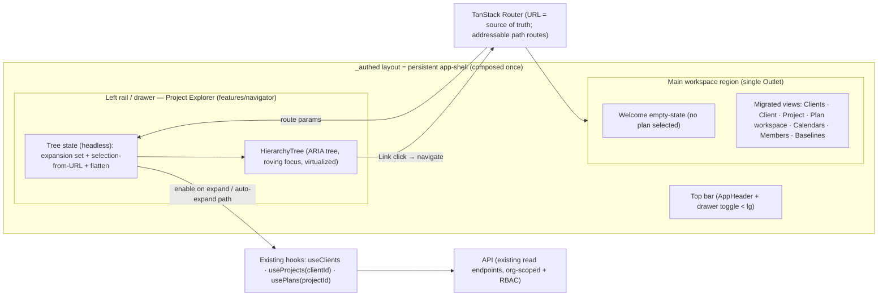
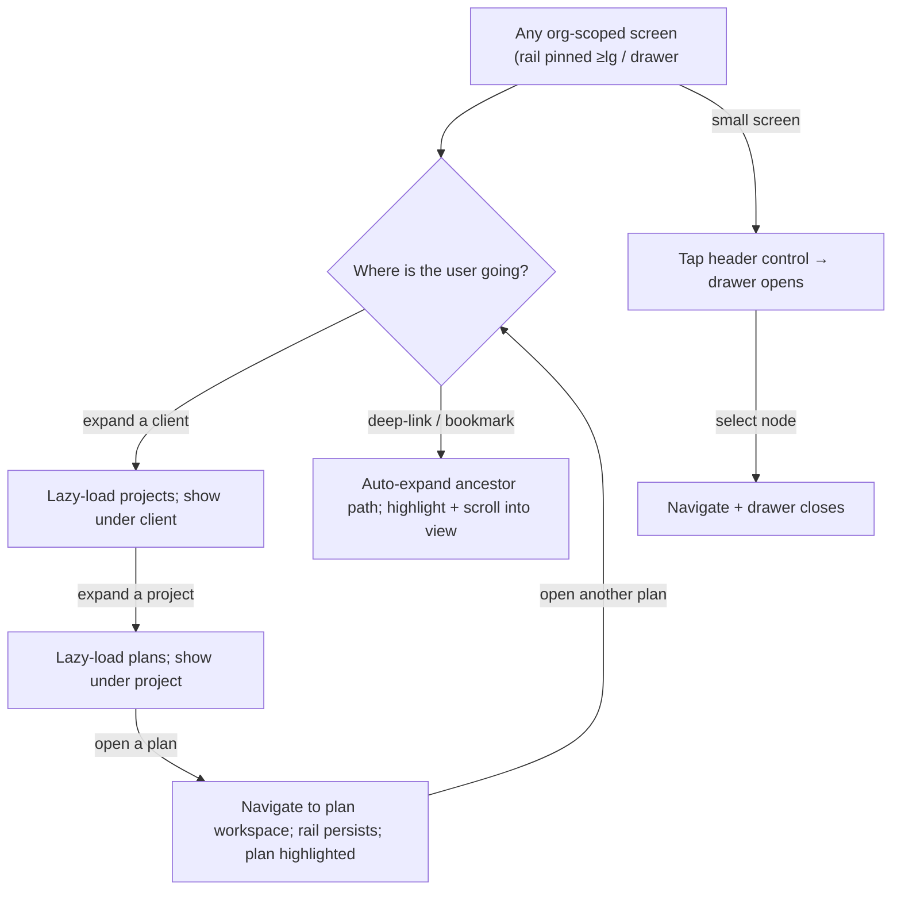

# Feature Spec: Persistent hierarchy navigator

- **Status:** Draft (awaiting approval)
- **Author(s):** Feature Analyst (Product Owner / Solution Architect / Technical Lead hats)
- **Date:** 2026-07-12
- **Tracking issue / epic:** _TBD_ — Epic "Domain hierarchy & navigation" (navigation UX)
- **Roadmap link:** `docs/ROADMAP.md` — navigation UX (extends the delivered
  "Hierarchy" theme; the primary way users move around the app)
- **Related ADR(s):** **ADR-0029 — Persistent app-shell + hierarchy navigator**
  (being drafted in parallel by ui-architect; this spec designs **within** it and
  does not re-decide the architecture). Also honours ADR-0004 (frontend state
  split), ADR-0005 (TanStack Router), ADR-0006 (tokens/shadcn/CVA), ADR-0012/0016
  (RBAC + tenancy), and builds on the shipped [hierarchy-crud](hierarchy-crud.md)
  slice.

> **Scope frame (locked product-owner decisions).** This feature makes the app a
> **persistent shell** — top bar + collapsible/resizable left rail + a single main
> **workspace region** — that **stays mounted**; navigation swaps **only** the main
> region's content (addressable **path routes**; the URL changes underneath a shell
> that never tears down). We are **evolving the existing `_authed` shell, not
> building greenfield.** It is delivered in three milestones: **M1** — the
> persistent app-shell template (chrome once + `<Outlet/>`, responsive rail→drawer,
> theme-aware, with a neutral welcome landing); **M2** — the hierarchy tree
> navigator in the rail; **M3** — migrate the existing views (plan-detail/canvas,
> clients, projects, plans, calendars, members, baselines) to render inside the
> outlet.
>
> This **augments, does not replace** the existing navigation: the dedicated
> list/management pages (clients, a client's projects, a project's plans, the plan
> workspace, and the recycle bin at `/orgs/$orgSlug/recently-deleted`) all **stay**;
> they simply render inside the shell's main region. The navigator is
> **navigation-only in v1**: selecting a node opens/navigates; there is **no
> in-tree create/rename/delete**, **no search box**, and **no Gantt/Network toggle
> or canvas minimap**. Those are named, out-of-scope future phases (§4). **The
> shippable P1 = M1 + M2**: a read-only tree navigator inside a working persistent
> shell, wired to the routes that already exist.

## 1. Business understanding

### Problem

Today a planner reaches a plan by clicking through a chain of full-page
navigations: Clients list → a client's projects → a project's plans → the plan
workspace (the TSLD canvas host). Each hop is a route change that unmounts the
previous page. Moving between two plans under different clients means walking
_back up_ and _down again_ every time — losing your place in the hierarchy on
every switch. For the product's core user (a planner who lives in the schedule
1–3 hours a day and routinely compares/updates several plans in a sitting), that
click-through model is slow, disorienting, and unlike the file-explorer mental
model these users already have from desktop scheduling tools (P6, Netpoint).

The hierarchy itself (Org → Client → Project → Plan) and its CRUD already ship
([hierarchy-crud](hierarchy-crud.md)); what is missing is a **persistent,
always-there way to see where you are and jump anywhere** without tearing down
the workspace. Navigation is the single most frequent interaction in the app, so
it is the highest-leverage UX investment available right now.

**Why now.** The plan workspace (TSLD canvas, calendars, baselines, edit-lock)
is now rich and expensive to mount. Repeatedly unmounting the whole shell to
change plans wastes that investment. A persistent navigator is the natural home
for everything that follows (future in-tree CRUD, search, drag-reorganise) and
the moment to introduce the left-rail shell the app has owed since the header-nav
stop-gap (noted in `docs/TECH_DEBT.md`).

### Users

Organisation members (ADR-0012/0016). All four member roles can **read** the
whole hierarchy (`client:read`/`project:read`/`plan:read` are granted to every
role — see [hierarchy-crud](hierarchy-crud.md) §2), so the tree is the same shape
for everyone; only the write-only surfaces they reach _from_ it differ.

| Role               | Need from the navigator                                                                   |
| ------------------ | ----------------------------------------------------------------------------------------- |
| **Planner**        | Fast, persistent jumping between plans across clients/projects during an editing session. |
| **Org Admin**      | Same as Planner; oversee the whole org's tree at a glance.                                |
| **Contributor**    | Find the plans they report progress on without losing context.                            |
| **Viewer**         | Browse and open plans read-only.                                                          |
| **External Guest** | **Out of scope** — a guest holds a single per-plan share link, not an org tree.           |

### Primary use cases

1. **Orient** — see the current location (selected plan) highlighted within the
   Org → Client → Project → Plan tree, always visible alongside the workspace.
2. **Jump between plans** — expand a client/project and open a different plan
   **without unloading the navigator** (its expansion, scroll and selection
   persist across the switch).
3. **Drill down** — expand a client to reveal its projects, a project to reveal
   its plans (children **lazy-loaded on expand**), and open any node.
4. **Deep-link** — arrive at `/orgs/$slug/plans/$id` (a shared/bookmarked URL)
   and have the tree auto-reveal and highlight that plan's ancestor path.
5. **Land neutrally after login** — with no plan selected, the shell is up and the
   main region shows a welcome empty-state that invites picking a plan (or, for a
   new user, creating the first Client → Project → Plan).
6. **Work on any device** — the rail collapses to a drawer on small screens.

### User journeys

- **Happy path (jump between plans).** A Planner is editing Plan A (TSLD canvas
  mounted in the workspace). The navigator rail is pinned on the left, showing
  Plan A selected under its project and client. They expand another client →
  its project → click Plan B. The workspace navigates to Plan B; **the rail stays
  mounted** with both clients still expanded and their scroll position intact. No
  full-page back-and-forth. See the user-flow diagram in §4.
- **Neutral landing (after login).** A member signs in and lands on the org home.
  The shell is up (top bar + rail ready); the main region shows a centered welcome
  card — "Select a plan from the Project Explorer" — over the workspace's neutral
  backdrop (the date ruler + TODAY marker are visible behind the card, matching the
  product-owner screenshot). A new user with an empty org additionally sees a
  "+ Client → Project → Plan" getting-started hint that links to the Clients page
  (creation lives on the dedicated pages — navigation-only tree). Selecting a plan
  from the rail replaces the card with the plan workspace.
- **Deep-link / bookmark.** A Contributor opens a bookmarked plan URL. The route
  loads; the navigator resolves the plan's project and client, **auto-expands**
  that path, highlights the plan, and scrolls it into view.
- **Small screen.** On a tablet held in portrait / a phone, the rail is hidden; a
  header control opens the tree as a full-height drawer. Selecting a node
  navigates and closes the drawer.
- **Read-only browse.** A Viewer expands clients and projects and opens plans;
  there are no create/edit/delete affordances anywhere in the tree (there are
  none for anyone in v1).

### Expected outcomes

- The navigator becomes the **primary** way to move around the app; the tree is
  visible on every org-scoped screen and never tears down when the workspace
  changes.
- Switching plans is a single click that preserves navigation context, cutting
  the interaction cost of the app's most frequent task.
- The app gains the **persistent left-rail + responsive drawer shell** it has
  owed, giving every future navigation capability (in-tree CRUD, search) a home.

### Success criteria

- From any plan, a planner reaches a **different plan under a different client in
  ≤ 2 clicks** (expand → open), with the rail never unmounting (verified by an
  e2e journey that asserts the tree DOM node persists across the navigation).
- **Neutral landing**: after login with no plan selected, the shell is up and the
  main region shows the welcome empty-state (not a blank screen) within the same
  render — no separate loading page.
- **Deep-link reveal**: arriving at a plan URL auto-expands and highlights its
  path with **no extra clicks**.
- Expanding a node fetches its children **once** and caches them (reuses the
  existing list queries — no new endpoints, no N+1 across the tree).
- The tree is **fully keyboard-operable** and passes an automated **axe** check
  with the ARIA `tree` pattern (WCAG 2.2 AA) — a first-class deliverable, not a
  follow-up.
- Correct in light/dark and from 320px (drawer) to widescreen (pinned rail); no
  measurable regression to the plan-workspace initial mount (the tree is code-split
  and its child queries are lazy).

### Open questions

**Resolved by the product owner (recorded, not open):**

- **Rail scope across the app** — the app becomes a **persistent shell** whose top
  bar + rail stay mounted on **every** org-scoped route; navigation swaps only the
  main region. The rail is present app-wide (org-scoped routes), hidden only on
  public/auth and onboarding screens. Routes stay **addressable path routes**.

**CRITICAL (answers change design or scope):**

- **Q2 — Node decorators (child counts / plan status) in v1.** Showing "Client
  (3)" counts or a plan-status dot requires **either** adding `projectCount`/
  `planCount` to the list DTOs (a coordinated **API change**) **or** eager child
  fetches (an N+1 that contradicts the locked lazy-load decision). **Recommended
  default:** **no decorators in v1** — plain, icon-prefixed labels only; counts and
  status dots are a cheap fast-follow **once** the list DTOs carry counts. This
  keeps v1 to **zero backend change**.
- **Q3 — What a non-leaf node's click does.** Clicking a **client**/**project**
  node — does it (a) navigate to that node's existing page **and** toggle
  expansion, or (b) only toggle expansion (only **plan** leaves navigate)?
  **Recommended default:** **(a)** — the twist/chevron toggles expansion, and
  activating the row navigates to that node's existing route (client → its
  projects page, project → its plans page, plan → the workspace), matching the
  routes that already exist and keeping the tree and page views consistent.

**Non-critical (defaults stated — proceeding):**

- **Expansion state persistence.** **Default:** selection is a **projection of the
  URL** (ADR-0029 / ADR-0004 — the URL is the source of truth); _which extra nodes
  are expanded_ is **ephemeral client UI state** kept per-org in `sessionStorage`,
  **not** in the URL (keeps URLs clean and shareable). Deep-links always
  auto-expand the selected path regardless.
- **Virtualization threshold.** **Default:** always render through a virtualizer
  (a single windowed list of the flattened visible nodes) so behaviour is uniform;
  the window is cheap when short.
- **Guest/External access.** **Default:** out of scope — guests never see the org
  tree.
- **Keyboard type-ahead (jump to a node by typing its name).** **Default:**
  **not** in v1 (it edges toward search, which is a named future phase); arrow/Home/
  End navigation is in scope.

## 2. Functional requirements

### User stories & acceptance criteria

> **US-1 — Persistent orientation.** As a member, I want the hierarchy tree
> always visible beside my work, so I always know where I am and can move without
> losing context.
>
> - **Given** I am on any org-scoped screen **when** it renders **then** the
>   navigator rail is present (pinned on `lg`+; a drawer toggle below `lg`) showing
>   my org's clients.
> - **Given** I navigate from one plan to another **when** the workspace changes
>   **then** the navigator does **not** unmount — its expanded nodes, scroll
>   position and focus are preserved (the same DOM tree persists).
> - **Given** the route corresponds to a node in the tree **when** it is rendered
>   **then** exactly that node is marked selected (`aria-selected`, visible
>   highlight) and no other.

> **US-2 — Lazy drill-down.** As a member, I want to expand a client to see its
> projects and a project to see its plans, loaded only when I open them, so the
> tree stays fast at org scale.
>
> - **Given** a collapsed client **when** I expand it **then** its projects are
>   fetched **once** (reusing the existing projects-by-client query) and cached;
>   re-expanding does not refetch while fresh.
> - **Given** a collapsed project **when** I expand it **then** its plans are
>   fetched once (reusing the existing plans-by-project query).
> - **Given** an expanded parent with many children **when** it renders **then**
>   the visible node list is virtualized so scrolling stays smooth.

> **US-3 — Open a node.** As a member, I want to click (or press Enter on) a node
> to open it, so I can move around by pointing at where I want to be.
>
> - **Given** any node **when** I activate it **then** the app navigates to that
>   node's existing route (client → projects page, project → plans page, plan →
>   workspace) via a router link, so the URL remains the source of truth (Q3).
> - **Given** I activate a node on a small screen **when** navigation starts
>   **then** the drawer closes.

> **US-3b — Neutral welcome landing.** As a member, I want a helpful welcome state
> when no plan is selected, so the app never shows an empty or dead main region.
>
> - **Given** I am on an org-scoped route with no plan selected (e.g. the org home)
>   **when** the shell renders **then** the main region shows a centered welcome
>   card ("Select a plan from the Project Explorer") over the neutral workspace
>   backdrop (date ruler + TODAY marker visible), with the rail ready beside it.
> - **Given** my org has no clients yet **when** the welcome state renders **then**
>   it also shows a "+ Client → Project → Plan" getting-started hint linking to the
>   Clients page (creation lives there — the tree is navigation-only).
> - **Given** the welcome state **when** I select a plan from the rail **then** the
>   card is replaced by the plan workspace (URL updates; shell persists).

> **US-4 — Deep-link reveal.** As a member, I want a bookmarked/shared plan URL to
> reveal its place in the tree automatically, so I never have to re-find it.
>
> - **Given** I load `/orgs/$slug/plans/$planId` directly **when** the screen
>   renders **then** the tree auto-expands Org → Client → Project → **Plan**,
>   highlights the plan, and scrolls it into view.
> - **Given** the plan (or an ancestor) is not accessible/exists **when** the route
>   resolves **then** the workspace shows its existing not-found state and the tree
>   simply contains no selection (no crash).

> **US-5 — Full keyboard operability.** As a keyboard or screen-reader user, I
> want to operate the whole tree without a mouse, so the primary navigation is
> accessible.
>
> - **Given** focus is in the tree **when** I press ↑/↓ **then** roving focus moves
>   to the previous/next **visible** node; **→** expands a collapsed node (or moves
>   to its first child); **←** collapses an expanded node (or moves to its parent);
>   **Home/End** jump to first/last visible node; **Enter/Space** activates
>   (navigates).
> - **Given** the tree **when** inspected **then** it exposes `role="tree"` with
>   `role="treeitem"`/`role="group"`, `aria-expanded`, `aria-selected`,
>   `aria-level`, `aria-setsize`, `aria-posinset`, and a single tab stop (roving
>   `tabindex`); it passes automated **axe** checks.

> **US-6 — Responsive rail ⇄ drawer.** As a member on a small screen, I want the
> tree to get out of the way but stay reachable, so the app is usable on a tablet
> or phone.
>
> - **Given** viewport `< lg` **when** the shell renders **then** the rail is
>   hidden and a header control (with an accessible label) opens the tree as a
>   full-height drawer/sheet; **≥ lg** the rail is pinned.
> - **Given** the drawer is open **when** I press `Esc` or select a node **then**
>   it closes and focus returns to the trigger.

### Workflows

- **Initial render:** resolve `orgSlug` from the URL → load the org's clients
  (existing `useClients`) → compute the **visible node list** (roots + expanded
  descendants) → derive **selection** from the current route params → if a plan/
  project/client is selected, **auto-expand its ancestor path** and fetch the
  needed children → render the virtualized tree.
- **Expand:** mark node expanded (client state) → enable that node's child query
  (`useProjects(clientId)` / `usePlans(projectId)`) → show per-node loading, then
  children (or empty/error state).
- **Collapse:** mark node collapsed (children stay cached; query disabled). Focus
  stays on the node.
- **Activate:** navigate via a `<Link>` to the node's route (URL updates →
  selection recomputes). On `< lg`, close the drawer.
- **Route change (from anywhere, incl. header nav or page links):** selection is
  recomputed from the new URL; if the newly-selected node isn't yet revealed, its
  ancestor path is auto-expanded.

### Edge cases

- **Neutral landing (no plan selected):** the main region shows the welcome
  empty-state (centered card over the neutral workspace backdrop), not a blank
  region — an explicit state, present on first render (US-3b).
- **Empty org (no clients):** the rail root shows a designed empty state ("No
  clients yet") and the welcome card shows the "+ Client → Project → Plan"
  getting-started hint; both link to the Clients page (creation lives there —
  navigation-only tree).
- **Empty children:** an expanded client with no projects (or project with no
  plans) shows a subtle muted "No projects" / "No plans" row, not a blank gap.
- **Very large branch:** a project with hundreds of plans renders through the
  virtualizer; keyboard nav still reaches any node (the focused node is force-
  rendered inside the window).
- **Stale tree vs. CRUD on a page:** creating/deleting a client/project/plan on a
  dedicated page invalidates the same query keys the tree reads, so the tree
  updates automatically (shared `clientKeys`/`projectKeys`/`planKeys`).
- **Deleted / soft-deleted node currently selected:** the tree lists only active
  rows; if the selected plan was just deleted elsewhere, the workspace shows
  not-found and the tree shows no selection (no orphaned highlight).
- **Concurrent expand + navigate:** expansion (client state) and selection (URL)
  are independent, so a navigation mid-expand cannot corrupt either.
- **Deep-link to a foreign/nonexistent node:** route loader/`useX` 404s
  gracefully (existing behaviour); tree has no selection.
- **Offline / failed child load:** the parent node shows an inline "Couldn't load
  — retry" affordance; the rest of the tree stays usable; expansion is preserved.

### Permissions

Deny-by-default, org-scoped (ADR-0012/0016), enforced by the API — the tree is a
**view** and makes no trust decision. In v1 all member roles hold `*:read`, so the
tree shows the same active hierarchy to every member of the org; non-members never
resolve the org (the route guard `ensureOrgMembership` already redirects). No new
permission codes. The component renders **only what the read APIs return**, so any
future server-side per-node visibility (e.g. a "plans assigned to me" filter for
Contributors) needs no client change. Write affordances are absent for everyone
(navigation-only v1).

### Validation rules

No user input in v1 (no forms, no search). The only "inputs" are URL params
(already validated by the existing routes) and ephemeral expansion state
(persisted to `sessionStorage` as an org-keyed set of node ids; corrupt/oversized
stored state is ignored and reset — never trusted for correctness, only for
convenience).

### Error scenarios

| Scenario                            | Detection                       | User-facing result                                  | Status |
| ----------------------------------- | ------------------------------- | --------------------------------------------------- | ------ |
| Not a member of the org in the URL  | `ensureOrgMembership` guard     | redirected home (org invisible)                     | —/404  |
| Root clients query fails            | TanStack Query error            | inline error + Retry in the rail root               | 5xx    |
| A node's children query fails       | TanStack Query error (per node) | inline "Couldn't load — retry" on that node         | 5xx    |
| Deep-link to a deleted/foreign node | route loader / `useX` 404       | workspace not-found; tree shows no selection        | 404    |
| Corrupt persisted expansion state   | parse/shape guard               | ignored; tree opens with only the URL path expanded | —      |

## 3. Technical analysis

| Area           | Impact   | Notes                                                                                                                                                                                                                             |
| -------------- | -------- | --------------------------------------------------------------------------------------------------------------------------------------------------------------------------------------------------------------------------------- |
| Frontend       | **high** | New persistent left-rail + responsive drawer in the `_authed` shell; a new `features/navigator` module (headless tree state + accessible `HierarchyTree` component); virtualization; keyboard model.                              |
| Backend        | **none** | v1 reuses the existing read endpoints (`…/clients`, `…/clients/:id/projects`, `…/projects/:id/plans`) unchanged. (Decorators/search are future phases.)                                                                           |
| Database       | **none** | No schema change.                                                                                                                                                                                                                 |
| API            | **none** | No new/changed endpoints (subject to Q2 — default is no decorator/count DTO change).                                                                                                                                              |
| Security       | **low**  | No new surface; org scope + RBAC already enforced server-side; tree only renders what the read APIs return. `sessionStorage` holds only non-sensitive node ids.                                                                   |
| Performance    | **med**  | Lazy child queries (one per expanded parent) + virtualized visible list keep it cheap at org scale; tree bundle code-split; no eager full-tree load; watch re-render cost on expand/scroll.                                       |
| Infrastructure | **none** | No new services/env/secrets. Possibly one new client dependency (`@tanstack/react-virtual`) — TanStack, consistent with the stack.                                                                                                |
| Observability  | **low**  | Optional lightweight telemetry: navigator open/collapse, node-open events (via the existing telemetry facade); no new backend signals.                                                                                            |
| Testing        | **high** | Unit (pure tree/flatten/keyboard-reducer logic, selection-from-URL, expansion store); component (states, ARIA, roving focus) + **axe**; Playwright journeys (jump-between-plans persistence, deep-link reveal, drawer, keyboard). |

### Dependencies

- **Prerequisite (already on `main`):** the [hierarchy-crud](hierarchy-crud.md)
  slice — its routes (`/orgs/$slug/clients`, `…/clients/$clientId`,
  `…/projects/$projectId`, `…/plans/$planId`), its query hooks (`useClients`,
  `useProjects`, `usePlans`) and shared query-key factories
  (`clientKeys`/`projectKeys`/`planKeys` in `lib/query/hierarchy-keys.ts`), the
  `_authed` layout (`routes/authed-layout.tsx`), the `AppHeader`, and
  `ensureOrgMembership` in `app/router.tsx`.
- **Architecture:** **ADR-0029** (persistent navigation tree) — must be accepted
  before/with this build; this spec conforms to it.
- **New client dependency (likely):** `@tanstack/react-virtual` for windowing the
  flattened visible-node list (alternative: hand-rolled windowing / CSS
  `content-visibility` — see §4).
- **Blocks (future phases):** in-tree CRUD (context menus) and server-side search
  build on this shell.
- **Third parties:** none.

## 4. Solution design

> Conforms to **ADR-0029**. The governing principle: **the tree is a projection of
> the URL** (TanStack Router is the source of truth for _selection_; ADR-0004/0005).
> Expansion is minimal ephemeral client state. Children are lazy, org-scoped, and
> permission-filtered by the API. The component is mobile-first, theme-aware, and a
> first-class **ARIA `tree`**.

### Architecture overview

We **evolve the existing `_authed` layout route** into a **persistent app-shell**:
top bar + collapsible/resizable left rail + a single main **workspace region**
(`<Outlet/>`), where the chrome is composed **once** and only the outlet's content
swaps on navigation. Because the layout route does not remount when its child
routes change, the shell **and** the navigator (and its state) **persist across
plan-to-plan navigation** while the main region swaps. The tree lives in the rail;
the welcome empty-state and every migrated view render in the main region. All
server data flows through the **existing** feature query hooks — the navigator adds
**no** new API surface in v1.



**Milestone shape (delivery, not three separate specs):** **M1** stands up the
persistent shell + responsive rail placeholder + the welcome empty-state; **M2**
puts the real `HierarchyTree` in the rail; **M3** migrates the existing views to
render inside the main region. M1 + M2 is the shippable P1 read-only navigator.

### Data flow — expand a client, then open a plan

```mermaid
sequenceDiagram
  participant U as User
  participant T as HierarchyTree
  participant S as Tree state (expansion + selection)
  participant Q as TanStack Query (existing hooks)
  participant R as Router (URL)

  U->>T: click chevron on Client C
  T->>S: toggleExpanded(C)
  S->>Q: enable useProjects(orgSlug, C.id)
  Q-->>S: projects (cached thereafter)
  S-->>T: visible nodes recomputed → render (virtualized)
  U->>T: click Plan P (a leaf link)
  T->>R: navigate /orgs/{slug}/plans/{P.id}
  R-->>S: route params change → selection = P (rail stays mounted)
  R-->>U: workspace renders Plan P; tree highlights P
```

### User flow



### Database changes

**None.**

### API changes

**None in v1** (default answer to Q2). The navigator consumes the existing
org-scoped read endpoints exactly as the dedicated pages do:

| Method | Path (existing)                                      | Used for             |
| ------ | ---------------------------------------------------- | -------------------- |
| GET    | `/organizations/:orgSlug/clients`                    | tree roots           |
| GET    | `/organizations/:orgSlug/clients/:clientId/projects` | a client's children  |
| GET    | `/organizations/:orgSlug/projects/:projectId/plans`  | a project's children |

If Q2 is answered "show counts", a follow-up adds `projectCount`/`planCount` to
`ClientSummary`/`ProjectSummary` (a small, additive DTO change reviewed by
api-reviewer + backend-performance-reviewer) — **out of v1 scope** by default.

### Component changes

A new **`features/navigator`** module (feature-first,
`docs/FRONTEND_ARCHITECTURE.md`), design-system tokens/primitives only — no
one-off styling; mobile-first; theme-aware. It depends **downward** on shared code
and on the existing feature hooks it re-consumes (via each feature's public
surface), never sideways into their internals.

- **Shell (`components/layout/`) — M1:** evolve `AuthedLayout` from a vertical
  `header + Outlet` into the persistent app-shell: `top bar + [rail | main region
(Outlet)]` on `lg`+, with a **collapsible/resizable** rail, and a **drawer**
  (reuse the existing `Dialog`/add a `Sheet` variant of it) below `lg`. Add a
  top-bar **"Show Project Explorer"** toggle (`AppHeader`) visible below `lg`. A
  `WelcomeEmptyState` renders in the main region when no plan is selected (centered
  card over the neutral workspace backdrop; new-user getting-started hint).
  Governed by a `VITE_NAV_TREE` flag until complete.
- **View migration (M3):** the existing route screens (clients, client-detail,
  project-detail, plan-detail/canvas, calendars, members, baselines) are migrated
  to render inside the shell's single main region rather than owning their own
  full-page `main` chrome — a mechanical move that removes per-page shell
  duplication; no behavioural change to each view's content.
- **`features/navigator/hooks/`** (headless, pure where possible, unit-tested):
  - `useHierarchyTree(orgSlug)` — orchestrates expansion state + selection +
    flattening into the visible-node list.
  - `useExpansionState(orgSlug)` — the expanded-id set, persisted per-org in
    `sessionStorage`; exposes `toggle/expand/collapse/expandPath`.
  - selection is **derived from route params** (`useParams`) — not stored.
  - a pure `flattenVisible(roots, childrenByParent, expanded)` → ordered nodes
    with `level`, `setSize`, `posInSet` (drives ARIA + virtualization).
  - a pure keyboard reducer (`treeKeydown(state, key) → intent`) — exhaustively
    unit-tested (↑/↓/←/→/Home/End/Enter).
- **`features/navigator/components/`:**
  - `HierarchyTree` — `role="tree"`, roving `tabindex`, virtualized (single
    windowed list of visible nodes), renders `TreeNode`s.
  - `TreeNode` — `role="treeitem"` with chevron (expand toggle) + a `<Link>` label
    (activate/navigate); `aria-level/-expanded/-selected/-setsize/-posinset`; icons
    (Lucide) per level; selected/hover/focus states from tokens.
  - Per-node **loading** (skeleton/spinner), **empty** ("No projects/plans"), and
    **error** ("Couldn't load — retry") states; **root** loading/empty/error states.
  - `NavigatorRail` (pinned container) and `NavigatorDrawer` (Sheet) wrappers that
    both render `HierarchyTree`; a shared live-region announcement on expand/select
    (reuse the existing `AnnouncerProvider`).
- **Reuse, do not duplicate:** `useClients`/`useProjects`/`usePlans`,
  `clientKeys`/`projectKeys`/`planKeys`, `Breadcrumbs` (kept — complements the
  tree), `useOrgRole`/RBAC (only needed if/when write affordances arrive), the
  existing `Dialog`/`Spinner`/`Button` primitives and design tokens.

### Implementation approach & alternatives

**Chosen:** **shell-first, in three milestones.** First evolve the `_authed`
layout into a **persistent app-shell** (chrome once + a single main-region
`<Outlet/>`, responsive rail→drawer, theme-aware, with a welcome empty-state) — M1;
then mount a **persistent, headless-state + accessible-view tree** in the rail —
M2; then migrate the existing views into the main region — M3. Throughout,
**selection is a pure projection of the URL** and only **expansion** is client
state; children load lazily through the **existing** query hooks (one query per
expanded parent, cached and shared with the dedicated pages), and the flattened
visible-node list is **virtualized**. This maximises reuse (zero backend change,
shared caches so page CRUD updates the tree for free), keeps `main` releasable
behind `VITE_NAV_TREE`, and delivers the responsive app-shell the app has owed.
M1 + M2 is the shippable P1 read-only navigator.

**Alternatives considered:**

- **Eager full-tree load** (fetch the whole Org→Client→Project→Plan tree upfront).
  Rejected per the locked medium-scale decision: hundreds of plans/org means a
  large payload and wasted work for branches never opened; lazy-on-expand matches
  the file-explorer model and the scale.
- **Expansion state in the URL** (shareable expanded set). Rejected as the default:
  it bloats/complicates URLs and conflates _selection_ (which belongs in the URL)
  with _view scaffolding_ (ephemeral). Deep-links still fully reveal the selected
  path. (Deferred to ADR-0029; overridable if the ADR decides otherwise.)
- **Non-persistent tree inside each page** (re-mounted per route). Rejected — it
  reintroduces the exact context-loss problem this feature exists to remove.
- **Replace the dedicated list/management pages with the tree.** Rejected by the
  locked "augment, not replace" decision — pages stay for CRUD, bulk actions, and
  the recycle bin; the tree is navigation-first.
- **No virtualization (render all visible nodes).** Rejected for large expanded
  branches; virtualization is required, with the caveat that the ARIA `tree` +
  windowing must keep the focused node rendered (handled in the component;
  reviewed by accessibility-reviewer).
- **A rich pre-built tree library.** Rejected in favour of shadcn/ui + a small
  bespoke ARIA tree (owned as source, tokenised, matching the design system) —
  consistent with ADR-0006 and "every dependency is a liability". `@tanstack/
react-virtual` (windowing only) is the single considered addition.

**Named future phases (explicitly out of v1 scope):**

1. **Phase 2 — In-tree CRUD via context menu** (create/rename/delete/restore from
   the tree, RBAC-gated, optimistic, wired to the existing mutations). Requires
   write affordances + confirm dialogs; a separate spec.
2. **Phase 3 — Server-side search / jump-to** across the hierarchy (a new
   org-scoped search endpoint + a rail search box). Explicitly **not** v1.

**Is an ADR required?** **Yes — ADR-0029** (persistent navigation tree), authored
in parallel by ui-architect; this feature is designed to it. This spec adds no
_new_ architectural decision beyond conforming to ADR-0029.

## 5. Links

- Implementation plan: [`docs/plans/hierarchy-navigator.md`](../plans/hierarchy-navigator.md)
- Related docs to update by this change: `docs/adr/0029-*.md` (accept),
  `docs/FRONTEND_ARCHITECTURE.md` (persistent rail shell + navigator module),
  `docs/UX_STANDARDS.md` / `docs/DESIGN_SYSTEM.md` (rail⇄drawer navigation
  pattern), `docs/TECH_DEBT.md` (retire the "drawer-below-lg shell owed" item),
  `CLAUDE.md` §12 if a new shared primitive (Sheet) is introduced, `docs/ROADMAP.md`
  (navigation UX), and a changeset.
