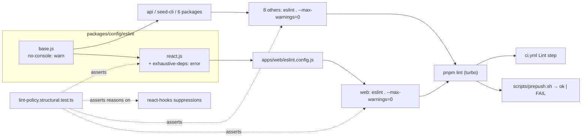
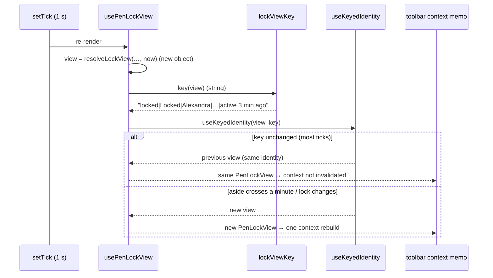
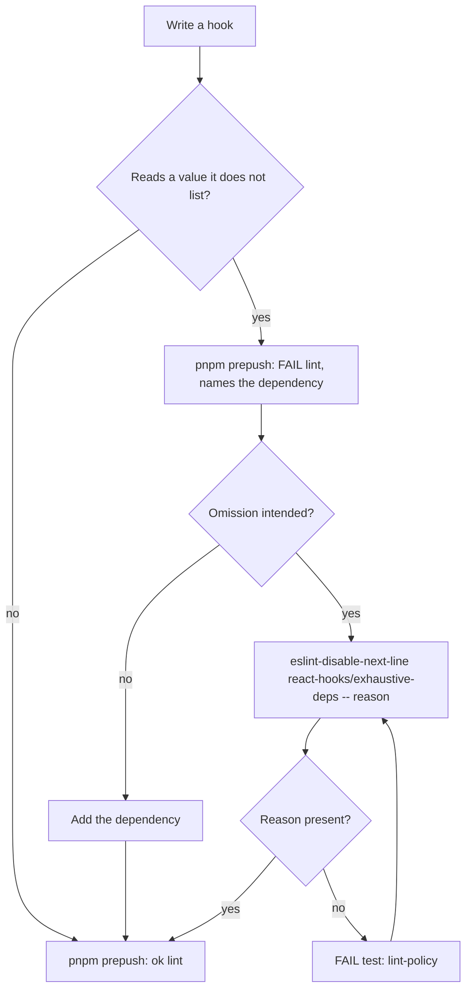

# Feature Spec: A lint warning is a failure, and `exhaustive-deps` is armed

- **Status:** Accepted — shipped (ADR-0164). Q1: `--max-warnings=0` in all nine workspaces. Q2: the default (reasons required) stands.
- **Author(s):** Claude (feature-analyst, for the product owner)
- **Date:** 2026-09-28
- **Tracking issue / epic:** `docs/TECH_DEBT.md` #353. Repository tooling, plus one printed-programme
  defect.
- **Roadmap link:** none. This is a tooling decision a planner cannot act on (the ADR-0136 and
  ADR-0160 precedent), so the ADR goes in `scripts/adr-coverage.json` as an exemption.
- **Related ADR(s):** ADR-0058, ADR-0076, ADR-0105, ADR-0110 D5, ADR-0120, ADR-0124, ADR-0133 D6,
  ADR-0160. A new ADR is drafted in §4.6 (number provisional).

ADR-0105 makes a change to a shared gate a spec trigger, however small the change. This is that
spec. The row it answers makes two claims. The narrow one is that `react-hooks/exhaustive-deps` runs
at `warn`, so real staleness defects shipped while `lint` printed `ok`. The wide one is that
`scripts/prepush.sh` has no way to show a gate that passed with findings. This spec settles both.

**This spec was written without a shell.** The session had no command runner, so
`pnpm --filter @repo/web lint` could **not** be run as the brief asked. Every lint claim below comes
from reading the source. Where a claim is corroborated, the corroboration is the ESLint result cache
this machine last wrote (`apps/web/.eslintcache`, `apps/api/.eslintcache`, both gitignored at
`.gitignore:25`, write date unknown). M0-T1 takes the real run, and the real run replaces anything
here that it contradicts. The plan says what happens if they disagree.

## 0. Evidence

Dependency internals are cited by **package@version, path and a verbatim anchor**, never by line
number. A by-line citation into a dependency has to be registered in
`scripts/dependency-claims.json` (§19.11, `check:claims`), and this session could not run that gate
to check a registration. M0-T0 registers the four that decisions rest on, with line ranges. This is
disclosed so that nobody reads it as a way round the gate.

| #   | Claim                                                                                                                                                                                                                                                                   | Verdict                                           | Established by                                                                                                                                                                                                                                                                                                                                                                                                                                                                                                 |
| --- | ----------------------------------------------------------------------------------------------------------------------------------------------------------------------------------------------------------------------------------------------------------------------- | ------------------------------------------------- | -------------------------------------------------------------------------------------------------------------------------------------------------------------------------------------------------------------------------------------------------------------------------------------------------------------------------------------------------------------------------------------------------------------------------------------------------------------------------------------------------------------- |
| E1  | `exhaustive-deps` is `warn` because the preset spreads the plugin's recommended config.                                                                                                                                                                                 | True                                              | `packages/config/eslint/react.js:30`. In eslint-plugin-react-hooks@7.1.1, `cjs/eslint-plugin-react-hooks.development.js`, `basicRuleConfigs` holds `'react-hooks/exhaustive-deps': 'warn'`.                                                                                                                                                                                                                                                                                                                    |
| E2  | Only `apps/web` uses the React preset.                                                                                                                                                                                                                                  | True                                              | Across the nine workspace `eslint.config.*` files, the only import of `@repo/config/eslint/react` is `apps/web/eslint.config.js:1`.                                                                                                                                                                                                                                                                                                                                                                            |
| E3  | No workspace `lint` script fails on warnings.                                                                                                                                                                                                                           | True                                              | All nine read `eslint . --cache --cache-strategy content`, with no `--max-warnings` (for example `apps/web/package.json:12`, `apps/api/package.json:12`). Root `lint` is `turbo run lint` (`package.json:16`) and CI runs it unchanged (`.github/workflows/ci.yml:54-55`).                                                                                                                                                                                                                                     |
| E4  | `prepush.sh` never prints a passing gate's output.                                                                                                                                                                                                                      | True                                              | `run()` sends output to a log and prints only `ok` on exit 0 (`scripts/prepush.sh:102-107`). The script's own header says an advisory gate was "COMPLETELY SILENT" before ADR-0124 (`:59-61`).                                                                                                                                                                                                                                                                                                                 |
| E5  | **The row's count is wrong in two ways.** Its headline says "six warnings (four `exhaustive-deps`, two `incompatible-library`)", but its own table lists **six** `exhaustive-deps` sites, three of them since fixed. It also leaves out **five `no-console` warnings**. | **False as stated — found by reading**            | `docs/TECH_DEBT.md:11054-11067`. `no-console` is `warn` for every `.ts/.tsx` file (`packages/config/eslint/base.js:25,56`). Five `console.log` calls with no disable are in files `apps/web/tsconfig.json:40-45` includes: `e2e-page-composition/composition.spec.ts:511,516,517`, `measure-axis-markers/overlap.spec.ts:202`, `measure-axis-markers/label-widths.spec.ts:172`.                                                                                                                                |
| E6  | The cached web result agrees with E5: **10 warnings across 8 files, 0 errors**. That is 3 `exhaustive-deps` + 2 `incompatible-library` + 5 `no-console`.                                                                                                                | Corroborated (cache, date unknown)                | `apps/web/.eslintcache`. Eight result records carry `"errorCount":0,…"warningCount":N`: one with 3 (composition.spec.ts has exactly three calls) and seven with 1. The message strings present include `missing dependency: 'model'`, `'view'`, `'dependencies'` and `Compilation Skipped: Use of incompatible library`.                                                                                                                                                                                       |
| E7  | **`apps/api` has one warning** and every other package has none.                                                                                                                                                                                                        | Corroborated (cache, date unknown)                | `apps/api/.eslintcache` holds a single `"warningCount":1` record, whose message is `Unexpected console statement`. The source is `apps/api/test/m0-engine-input.e2e-spec.ts:76` (`console.log('PRODUCT BUILDER:', …)` with no disable). The other seven caches hold no non-zero `warningCount`.                                                                                                                                                                                                                |
| E8  | Site 1 (`plan-workspace-toolbar.tsx`, "`:788` `model`") has **moved to `:876-894`** and is the `scheduleState` memo. The rule wants `model` because the body **calls a method on it**: `model.scheduleRefusal('recalculate')`.                                          | True — read                                       | `apps/web/src/components/layout/workspace/plan-workspace-toolbar.tsx:876-894`. No other hook in the file lacks a dependency; all 38 were read, including the three generic-typed memos at `:876`, `:1183` and `:1500`, which a `use(Memo…)\(` search misses.                                                                                                                                                                                                                                                   |
| E9  | Site 1 has **no stale behaviour**. `scheduleRefusal` is a `useCallback` that does not use `this` and already appears in the dependency list. The warning is about the call shape only.                                                                                  | True — read                                       | `use-plan-workspace-model.ts:197-200` (`refuseSchedule`, deps `[canEditSchedule, penReadOnly, penHolder]`), exported as `scheduleRefusal: refuseSchedule` (`:2344`).                                                                                                                                                                                                                                                                                                                                           |
| E10 | Site 2 (`use-pen-lock-view.ts:202`, `view`) is a **deliberate value-keyed memo**. `view` is rebuilt on every render and every tick. `signatureWithAside` is its identity. Listing `view` would bring back the per-tick context churn ADR-0133 D6 records.               | True — read                                       | `use-pen-lock-view.ts:85-89`, `:157`, `:175-215`. ADR-0133 D6 (`docs/adr/0133-a-command-surface-declares-its-rows-and-the-pen-leads-the-one-it-unlocks.md:90-115`). Two lines of the memo's reason are **orphaned** (`:200-201` start mid-sentence), because the first half of the comment was lost.                                                                                                                                                                                                           |
| E11 | Site 2's signature leaves out two `LockView` fields, `badgeName` and `messageVisible`. Today that is safe only by coincidence: `badgeName` is `firstName(holder)` with `holder` a memo dependency, and `messageVisible` is decided by `tone` + `actions`.               | True — read                                       | `lock-view.ts:20-27` and `:53-99` (the union), `:153-160` and `:178-213` (where each field is set).                                                                                                                                                                                                                                                                                                                                                                                                            |
| E12 | Site 3 (`use-tsld-toolbar-context.tsx`, `dependencies`) is a **real staleness defect**. `printDiagram`'s Gantt branch passes `dependencies` to the printed programme's Predecessors column (`:747`), and the memo's list (`:849-979`) leaves it out.                    | True — read                                       | `use-tsld-toolbar-context.tsx:201` (the stabilised edges), `:747`, `:849-979`. The comment at `:959-962` says the edges "now reach the picture through `buildDiagramImage`". That is true of the diagram and false of the printed Gantt, which #217 added later (ADR-0076 Class 3).                                                                                                                                                                                                                            |
| E13 | **`model.dependencies` is a new object on every render**, so `exportMatch` recomputes on every render and returns a new object. `exportMatch` is a dependency of the context memo, so the whole toolbar context can change identity on every host render.               | **Reasoned from source; M0-T4 decides**           | `useQuery` returns `observer.trackResult(result)`. In @tanstack/react-query@5.103.2, `build/modern/useBaseQuery.js` has the anchor `return !defaultedOptions.notifyOnChangeProps ? observer.trackResult(result) : result;`. In @tanstack/query-core@5.103.2, `build/modern/queryObserver.js` `trackResult` has the anchor `return new Proxy(result, {`. `exportMatch`'s dependencies include `model.dependencies` (`use-tsld-toolbar-context.tsx:366-374`), and the context memo lists `exportMatch` (`:965`). |
| E14 | A suppression of `react-hooks/exhaustive-deps` also **turns off the React Compiler's analysis** for that function, so the compiler-derived rules (`refs`, `set-state-*`) stop checking it. Nothing reports this.                                                        | **Reasoned from source; M0-T3 decides the scope** | eslint-plugin-react-hooks@7.1.1, `cjs/…development.js`: `const DEFAULT_ESLINT_SUPPRESSIONS = [` lists `'react-hooks/exhaustive-deps'` and `'react-hooks/rules-of-hooks'`, consumed by `findProgramSuppressions`. The diagnostic that would report it, `name: 'rule-suppression'`, has `preset: LintRulePreset.Off`.                                                                                                                                                                                            |
| E15 | `incompatible-library` is `warn` in the recommended set. Both warnings are TanStack Virtual's `useVirtualizer`.                                                                                                                                                         | True                                              | Plugin anchor `name: 'incompatible-library'` with `severity: ErrorSeverity.Warning, … preset: LintRulePreset.Recommended`. Call sites: `GanttPanel.tsx:569` and `HierarchyTree.tsx:215`, the only two `useVirtualizer` calls in `apps/web/src`. GanttPanel records the blind spot this causes (`:618-633`).                                                                                                                                                                                                    |
| E16 | ESLint 9 reports unused disable directives as warnings by default, so under `--max-warnings=0` a stale suppression fails.                                                                                                                                               | True                                              | eslint@9.39.5 `lib/config/default-config.js`, anchor `reportUnusedDisableDirectives: 1`. No cache holds an `Unused eslint-disable directive` message, so none exists today (subject to M0-T1).                                                                                                                                                                                                                                                                                                                 |
| E17 | ESLint's `--cache` replays cached warnings, and a config change invalidates every entry. So `--max-warnings=0` counts correctly on a warm run, and changing a severity re-lints everything.                                                                             | True                                              | eslint@9.39.5 `lib/cli-engine/lint-result-cache.js`. Anchors `fileDescriptor.meta.hashOfConfig !== hashOfConfig` (invalidation) and `fileDescriptor.meta.results = resultToSerialize` (whole results cached, warnings included).                                                                                                                                                                                                                                                                               |
| E18 | Of the **42** `react-hooks/*` suppressions in `apps/web` (41 `exhaustive-deps`, 1 `set-state-in-effect`), **15 carry no ` -- reason`**: 10 in product code and 5 in tests.                                                                                              | True — grep, 2026-09-28                           | `grep -rn "eslint-disable[^\n]*react-hooks/" apps/web/src`. The reasonless ones are `menu.tsx:199`, `useScopeForm.ts:76`, `use-duration-seed.ts:81`, `use-hierarchy-tree.ts:197,271`, `HierarchyTree.tsx:312`, `use-gantt-grid-editing.ts:208`, `ResourceHistogram.tsx:88`, `ActivityResourcesPanel.tsx:193`, `TsldPanel.tsx:2401`, and five `TsldPanel.*.test.tsx` files.                                                                                                                                     |
| E19 | The "passing gate with findings" problem **is wider than lint**. `check:claims` prints a finding and exits 0.                                                                                                                                                           | True — read                                       | `scripts/check-claims.mjs:405-413`: a registered claim no longer cited gets a `console.warn('  note: …')` and does not fail. Under `prepush.sh:102-107` that line is never shown.                                                                                                                                                                                                                                                                                                                              |
| E20 | The comment above `migrationPlanId` says `exhaustive-deps` "cannot see through a member expression". That is **wrong for a property read**. The rule accepts `model.planId` as a dependency and asks for `model` only when a method is **called** (E8).                 | **Reasoned from the rule; M0-T2 tests it**        | `plan-workspace-toolbar.tsx:793-796`. The extraction it defends does no harm; only the reason given for it is wrong.                                                                                                                                                                                                                                                                                                                                                                                           |

## 1. Business understanding

### Problem

`react-hooks/exhaustive-deps` finds one class of defect: a memo or effect that reads a value it does
not list, so it keeps showing an old answer after the value changes. Here that rule is a warning,
`lint` exits 0 on warnings, and `pnpm prepush` prints only `ok`. The rule named four live staleness
defects on the day each one shipped (row #353: listbox speech, an exported title, the selection
bar), and no gate stopped any of them. Site 3 below is one more of the same kind, still live. The
rule was never the weak point. The weak point was that its output went nowhere.

### Users

- **Engineers and agents** writing hooks in `apps/web`, who need a missing dependency to fail the
  gate they run.
- **Every role that can print the Gantt** (Viewer upwards; printing is a read). They are affected by
  site 3 only.
- **Reviewers**, who need every `react-hooks` suppression to state its reason at the call site.

### Expected outcomes

- A missing hook dependency fails `pnpm lint`, `pnpm prepush` and CI's Lint step.
- No workspace can pass lint while carrying a warning, so the "passed, with findings nobody saw"
  outcome stops existing for lint.
- The printed Gantt's Predecessors column always shows the plan's current links.
- Every `react-hooks` suppression carries a written reason, enforced by a test.

### Success criteria (committed before M0 measures anything)

- **FC-1** `pnpm lint` exits 0 across all nine workspaces with **zero warnings and zero errors**,
  with the rule armed and `--max-warnings=0` in every workspace lint script.
- **FC-2 (red, severity limb)** With `--max-warnings=0` removed from `apps/web` only, adding a probe
  hook that has a missing dependency makes `pnpm --filter @repo/web lint` exit non-zero and name
  `react-hooks/exhaustive-deps` as an **error**.
- **FC-3 (red, warnings limb)** With `exhaustive-deps` put back to `warn` in the preset only, the same
  probe fails lint through `--max-warnings=0`. FC-2 and FC-3 each prove one mechanism alone (ADR-0110
  D5).
- **FC-4 (red, the real defect)** Removing `dependencies` from the site-3 memo's list again makes
  `pnpm prepush` print `FAIL  lint` (not `WARN`) and exit 1.
- **FC-5 (red, estate)** Adding a `console.log` to an `apps/api` test `.ts` file fails `pnpm lint`.
  This shows the warnings limb covers packages the React rule never reaches.
- **FC-6** The pen-lock stability suite passes unedited
  (`use-pen-lock-view.stability.test.tsx:66-128`) and its new tick cases pass. The suite fails if the
  keyed-identity helper is changed to return its input.
- **FC-7** Any cost to `pnpm prepush` is recorded rather than bounded. Every workspace already lints,
  so the only new work is the one full re-lint E17 predicts on the first run after the severity
  changes.

### Open questions

See §6. There is one critical question, Q1. Q2 has a stated default.

## 2. Functional requirements

### US-1: an engineer cannot land a missing hook dependency

> As an engineer in `apps/web`, I want a hook that reads a value it does not list to fail `pnpm lint`,
> so that the stale answer never ships.
>
> - **Given** the rule is armed, **when** a `useMemo`, `useCallback` or `useEffect` leaves out a
>   dependency it reads, **then** `pnpm lint` exits non-zero, `pnpm prepush` prints `FAIL  lint`, and
>   CI's Lint step fails.
> - **Given** a dependency is left out on purpose, **when** the engineer suppresses it, **then** the
>   directive must carry ` -- <reason>`, or the lint-policy test fails (D5).

### US-2: a printed Gantt lists the plan's current predecessors

> As a planner (any role that can print), I want the printed programme's Predecessors column to show
> the links the plan has now, so that paper matches the screen.
>
> - **Given** the Gantt with the Predecessors column shown (it is hidden by default,
>   `gantt-view-state.ts:71`), **when** I add or remove a link and then choose `Deliver ▸ Print…`
>   (`tsld-toolbar-items.tsx:1753-1761`), **then** the printed column includes the change, even when
>   the recalculation changed no activity's dates.

### US-3: a workspace cannot pass lint with a warning

> As whoever reads `pnpm prepush`, I want `ok  lint` to mean "no findings" rather than "no errors".
>
> - **Given** any workspace, **when** it has one warning of any rule, **then** that workspace's lint
>   exits 1. The warning is not a quieter kind of passing.

### Decisions per site

**D1 — the three `exhaustive-deps` sites.**

| Site                                                                           | Decision                                                                                                                                                                           | What a user would see if it were stale                                                                                                                                                                                                                                                                                                                                                                                                                                                                                                                                                  |
| ------------------------------------------------------------------------------ | ---------------------------------------------------------------------------------------------------------------------------------------------------------------------------------- | --------------------------------------------------------------------------------------------------------------------------------------------------------------------------------------------------------------------------------------------------------------------------------------------------------------------------------------------------------------------------------------------------------------------------------------------------------------------------------------------------------------------------------------------------------------------------------------- |
| 1. `plan-workspace-toolbar.tsx:876-894` `scheduleState` (was "`:788` `model`") | **Fix without widening.** Read `const { scheduleRefusal } = model` outside the memo and call it inside. The dependency list does not change.                                       | **Nothing.** The only thing the rule objects to is a method call on `model` (E8). The callback is already listed and does not use `this` (E9). Adding `model` itself would recompute on every render, because the model hook returns a new object each time (`use-plan-workspace-model.ts:2291`). Correct the `:793-796` comment in the same edit so it says what the rule actually does (E20).                                                                                                                                                                                         |
| 2. `use-pen-lock-view.ts:175-215` return memo (`view`)                         | **Fix by moving the value-keyed memo into a module-private `useKeyedIdentity(value, key)`**, and make the key complete (D1a).                                                      | **Nothing today** (E11). The hazard is not staleness. It is the naive fix: listing `view` makes the memo recompute on every tick. The return value would then change identity every second, and ADR-0133 D6's per-second invalidation of the toolbar context would come back.                                                                                                                                                                                                                                                                                                           |
| 3. `use-tsld-toolbar-context.tsx:849-979` context memo (`dependencies`)        | **Fix: add `dependencies`.** Also make `exportMatch` (`:336-374`) read the stabilised `dependencies` (`:201`) instead of `model.dependencies`, and correct the `:959-962` comment. | **The printed Gantt's Predecessors column shows the links as they were when the memo last ran.** Adding a non-driving link that moves no date leaves `model.activities.data` the same object (TanStack Query shares unchanged structure). If nothing else re-runs the memo, the next Print leaves the new link off paper. The `exportMatch` change is in the same memo and the same file, and uses the same stabilised value. E13 is why it is in scope: while `exportMatch` depends on a new object every render, the memo that site 3 is about may be rebuilt on every render anyway. |

**D1a — why site 2 does not get a call-site suppression, and what it gets instead.** The brief allowed
"keep with a written call-site reason". That was ruled out because of E14. An `exhaustive-deps`
suppression inside `usePenLockView` would turn off the React Compiler's analysis for the whole hook.
This hook carries two refs (`containerRef`, `justActedRef`) and a focus-restore effect, which is
exactly what `react-hooks/refs` exists to check. ADR-0133 D6 records that this hook has already been
wrong once in a way nothing reported.

The value-keyed memo cannot be written in a form the rule accepts. A memo whose identity follows a
content key is exactly what the rule is built to reject. So the one unavoidable suppression goes into
a three-line module-private hook, `useKeyedIdentity(value, key)` (`useMemo(() => value, [key])`), with
its reason on the directive. The compiler then skips only those three lines. The key comes from a
pure `lockViewKey(view)` in `lock-view.ts`, built from a field table typed with `satisfies`
`Record<keyof LockView-fields, true>`. Adding a field to `LockView` without adding it to the key then
fails typecheck. That closes E11's gap without depending on the current coincidence. The helper is
**not** exported and **not** put in `src/hooks/`. A shared "memo by key" helper would invite
suppression by proxy. M0-T3 checks whether the compiler's skip really is scoped to the enclosing
function. If it is not, M1-T2 falls back to the React-documented "store information from previous
renders" form (`useState` plus a conditional set during render). That form needs no suppression at
all, provided M0-T3 shows no compiler rule fires on it.

**D2 — arming.** In `packages/config/eslint/react.js`, after the recommended spread, set
`'react-hooks/exhaustive-deps': 'error'`. Every workspace lint script becomes
`eslint . --cache --cache-strategy content --max-warnings=0`. The flag goes in the **workspace**
scripts rather than the root turbo call, so that `pnpm --filter @repo/web lint` and CI give the same
verdict (ADR-0160's "same command" principle).

**D3 — `incompatible-library`.** Keep the plugin's severity (`warn`). With `--max-warnings=0` a warning
blocks anyway, so the severity decides only how an editor displays it. Suppress the two call sites
(`GanttPanel.tsx:569`, `HierarchyTree.tsx:215`) with a reason on the directive. The reason states the
consequence: _the compiler's analysis skips this component, so the `refs` and `set-state-*` rules do
not run here_ (GanttPanel's own record is at `:618-633`, and that comment's claim that `pnpm lint`
prints the warning "every run" must be updated). Unlike E14's case, these suppressions cost nothing
extra: the component is already skipped because of the library, and `incompatible-library` is not in
`DEFAULT_ESLINT_SUPPRESSIONS`. If TanStack Virtual ever becomes compatible, E16's unused-directive
report flags the stale suppression.

Two alternatives were rejected. Turning the rule **off** would let a new incompatible call site
through silently. Wrapping `useVirtualizer` in a local hook would hide the incompatibility from the
analysis without making the code any safer, and it would become a real stale-UI bug on the day
`babel-plugin-react-compiler` is wired into the build. GanttPanel records that it is not wired today
(`:631-633`).

**D4 — the rest of the estate.** Six `no-console` warnings (E5, E7) get a per-line
`eslint-disable-next-line no-console -- <reason>`. That matches the convention 29 files already use
(`grep -c "eslint-disable.*no-console"` across `apps/` and `packages/`). The measurement harnesses
print on purpose. For `m0-engine-input.e2e-spec.ts:76`, M1 reads the file and chooses between the
same disable and deleting a debugging print. No config-level `off` for `e2e*`/`measure-*`: it would
hide an accidental `console.log` in a journey, which is a real smell.

**D5 — suppressions carry a reason.** A structural test fails if any
`eslint-disable(-next)?-line react-hooks/<rule>` directive in `apps/web` has no `--` description.
The 15 existing reasonless ones (E18) get reasons. For most, the reason is already on the preceding
comment line and only needs moving onto the directive. This is the row's own concern made enforceable:
"a suppression written to get a red gate green is worse than the warning" (#353, referring to #85).
Arming the rule increases exactly that temptation. Reading a site to write its reason may turn up a
live defect. If so, it is **recorded as a new register row and not fixed here**, unless the fix is
one line and pinned by a red test (ADR-0105).

**D6 — the row's wider question: should `prepush.sh` surface a passing gate's warnings? Recommended
answer: no. Remove the state instead.** A fourth result state, "ok, with findings", was considered and
is **not recommended**:

1. **ADR-0120's discriminator already places lint findings.** `prepush.sh:49-50` says: "exit 1 is for
   an obligation whose remedy is an edit to the file that failed; exit 2 is for one whose remedy is
   somebody's judgement." Every lint warning is fixed by an edit (a dependency, a directive, a
   reason). So it belongs with blocking findings, and `--max-warnings=0` puts it there.
2. **A printed-but-passing state is the pattern that has already failed.** Row #220 was an advisory
   `WARN` that nobody acted on, and `prepush.sh:54-57` states "a warning is ignorable" as the honest
   weakness of the advisory state. A fourth state is that weakness again, with more output to scroll
   past.
3. **It would cover prepush only.** CI runs the same `pnpm lint` and would still go green. Building
   it would mean parsing ESLint's summary line, which ties the gate to a formatter's wording.

The general rule, recorded in the ADR and in `prepush.sh`'s header, is: **a gate has no
pass-with-findings outcome.** A finding either blocks (exit 1) or is declared advisory (exit 2 and
listed in `ADVISORY_GATES`). E19 shows the rule is already broken outside lint: `check:claims`' "note"
on a dead register entry. Changing a different gate is outside this approved scope under ADR-0105, so
it is **filed as a register row** with the rule it breaks named. The same applies to test runs that
pass while printing `console.warn`/`act` noise.

### Edge cases

- **Turbo stops at the first failing workspace** (no `--continue`), so a web warning can hide an api
  warning in the same run. That was already true for errors and is acceptable. M0-T1 lints each
  workspace separately so the inventory is complete.
- **A warm ESLint cache** replays warnings, so `--max-warnings=0` cannot pass through a cache hit
  (E17).
- **Editor integrations** show `exhaustive-deps` in red after D2. That is intended.
- **Dependabot bumping `eslint-plugin-react-hooks`** may add new recommended `warn` rules. Under
  `--max-warnings=0` the bump PR fails lint, which is when someone should read them (the same stance
  `check:claims` takes on bumps).

### Permissions

Not applicable to the tooling. Site 3 changes no gate: Print stays behind `ctx.hasDiagram`
(`tsld-toolbar-items.tsx:1755-1756`). No pen, no RBAC, no org scope.

### Error scenarios

| Scenario                                            | Detection                     | Developer-facing result                             | Exit |
| --------------------------------------------------- | ----------------------------- | --------------------------------------------------- | ---- |
| Missing hook dependency                             | `exhaustive-deps` (error)     | `FAIL  lint` naming the file, line and missing name | 1    |
| Any warning (for example `no-console`)              | `--max-warnings=0`            | "ESLint found too many warnings (maximum: 0)"       | 1    |
| Suppression with no reason                          | lint-policy structural test   | `FAIL  test` naming the directive's file:line       | 1    |
| Stale suppression                                   | unused-directive report (E16) | `FAIL  lint`                                        | 1    |
| A workspace script that has lost `--max-warnings=0` | lint-policy structural test   | `FAIL  test` naming the `package.json`              | 1    |

## 3. Technical analysis

| Area           | Impact | Notes                                                                                                                                                                                                   |
| -------------- | ------ | ------------------------------------------------------------------------------------------------------------------------------------------------------------------------------------------------------- |
| Frontend       | low    | Three hook sites and one pure `lockViewKey`. About 21 comment or directive edits (6 `no-console`, 2 `incompatible-library`, 15 reasons). No new component, no UI change except US-2's printed column.   |
| Backend        | none   | One directive in an `apps/api` e2e test file. The API code is not touched.                                                                                                                              |
| Database       | none   | No schema, no migration. `database-architect` is not engaged because there is nothing to design.                                                                                                        |
| API            | none   |                                                                                                                                                                                                         |
| Security       | none   | No authN/Z, input or secret surface.                                                                                                                                                                    |
| Performance    | low+   | Site 2 must keep ADR-0133 D6's identity property (FC-6). Site 3 may **improve** context stability (E13, measured in M0-T4). One full re-lint on the first run (E17).                                    |
| Infrastructure | low    | Nine `package.json` lint scripts. CI's step is unchanged (`pnpm lint`). `check:ci-roster` is unaffected, because no `check:*` script is added.                                                          |
| Observability  | none   |                                                                                                                                                                                                         |
| Testing        | med    | New `lint-policy.structural.test.ts`, new cases in `use-pen-lock-view.stability.test.tsx`, `lock-view.test.ts` and `use-tsld-toolbar-context.print.test.tsx`, a context-identity case, and the red run. |

**Parity statements.** The CPM engine is not imported and no migration runs, so the ADR-0034 parity
gate is untouched by construction. No write path changes, so the pen (ADR-0028) is not involved. **No
`VITE_` flag** (ADR-0088 D1): a lint policy cannot be behind a build-time constant, and the
printed-column fix is a defect repair. The rollback is a commit boundary. **No new user-facing entry
point** (ADR-0081): US-2 repairs an existing command, `Deliver ▸ Print…`, and is pinned by the
existing print suite rather than by a new journey.

### Dependencies

- None blocking. Nothing else is in flight on `packages/config/eslint/` (`scripts/frontend-only.json`
  is `active: false`).
- `@repo/web` already depends on `eslint` directly (`apps/web/package.json:106`), so the structural
  test can call `ESLint#calculateConfigForFile` without a new dependency.

## 4. Solution design

### Architecture overview

### Data flow: site 2 before and after

### User flow (developer)

### Database changes

None.

### API changes

None.

### Component changes

- `features/plan-lock/lib/lock-view.ts`: new pure export `lockViewKey(view: LockView | null): string`,
  built from a `satisfies`-typed field table. Unit-tested per field.
- `features/plan-lock/lib/use-pen-lock-view.ts`: module-private `useKeyedIdentity`. The return memo
  lists `stableView` instead of `signatureWithAside`, which goes away. The orphaned comment at
  `:199-201` is replaced by the helper's docblock. The public `PenLockView` shape is unchanged.
- `features/tsld/toolbar/use-tsld-toolbar-context.tsx`: `dependencies` added to the context memo's
  list. `exportMatch` reads the stabilised edges. The `:959-962` comment is corrected.
- `components/layout/workspace/plan-workspace-toolbar.tsx`: `scheduleRefusal` is read outside the
  `scheduleState` memo. The `:793-796` comment is corrected.

### Implementation approach and alternatives

**Chosen:** clean the tree first, then arm, then add the red run and the ADR. The rule is armed only
against a tree that already passes (ADR-0058), so it does not fail on its first day and get deleted.

| Alternative                                              | Why not                                                                                                                                                                                    |
| -------------------------------------------------------- | ------------------------------------------------------------------------------------------------------------------------------------------------------------------------------------------ |
| Arm `exhaustive-deps: error` only, no `--max-warnings=0` | Leaves `no-console`, `incompatible-library` and unused-directive warnings in the silent state the row describes, and the next warn-severity rule shipped by a plugin bump lands there too. |
| A fourth prepush state that prints warnings              | See D6: ignorable, covers prepush only, and tied to formatter output.                                                                                                                      |
| `--max-warnings=0` on the root `turbo run lint` only     | `pnpm --filter <ws> lint` and editors would disagree with CI.                                                                                                                              |
| Site 2: list `view` in the dependencies                  | Brings back ADR-0133 D6's per-tick context invalidation.                                                                                                                                   |
| Site 2: call-site suppression                            | Turns off compiler analysis for a ref-heavy hook with a recorded history (E14, D1a).                                                                                                       |
| Site 1: add `model`                                      | Recomputes on every render for no correctness gain (E9).                                                                                                                                   |
| `incompatible-library: off`                              | A new call site would pass silently.                                                                                                                                                       |

### 4.6 ADR required: outline

This changes a repository-wide standard (CLAUDE.md §5: "ESLint owns correctness") and records a rule
about every gate. That needs an ADR, as ADR-0160 was for a change of similar size. **Provisional
number ADR-0163**; take the next free number when filing (the ADR-0079 lesson).

- **Title:** A lint warning is a failure, and a gate has no pass-with-findings outcome.
- **Context:** #353. E3–E6. The four staleness defects that shipped under `ok lint`. E19.
- **D1:** `--max-warnings=0` in every workspace lint script. Warning severity stops meaning "allowed".
- **D2:** `react-hooks/exhaustive-deps` is `error` in the React preset.
- **D3:** Every `react-hooks/*` suppression carries a reason on its directive, enforced by a test.
  Records E14 (an `exhaustive-deps` suppression turns off compiler analysis for its function) as a
  cost that the reason must justify.
- **D4:** `incompatible-library` stays `warn`. Its two call sites are suppressed with the consequence
  stated.
- **D5:** A gate's finding is blocking (exit 1) or declared advisory (exit 2 and `ADVISORY_GATES`).
  There is no third way. Refines ADR-0120 and ADR-0124. `check:claims`' note is recorded as a known
  exception, filed.
- **Consequences:** a plugin bump that adds a warn rule fails lint. That is intended, and it is the
  moment someone should read the new rule. Editors show red. Supersedes nothing.

Filing it also means: a CLAUDE.md §16 entry (`check:adr-coverage` A1), a `docs/adr/README.md` row,
and a `scripts/adr-coverage.json` exemption with a reason.

## 5. Red run plan and acceptance conditions

The red run is committed as `docs/specs/hook-deps-gate/red-run.md`, recording each command, its exit
code and the relevant output lines. Every limb is **verified red, then reverted** (ADR-0110 D5).

| Limb | Mutation (uncommitted)                                                                                                                      | Expected                                                                                                                  |
| ---- | ------------------------------------------------------------------------------------------------------------------------------------------- | ------------------------------------------------------------------------------------------------------------------------- |
| R1   | Probe file `apps/web/src/lint-probe.tsx` with `useMemo(() => a + b, [a])`. `--max-warnings=0` temporarily removed from `apps/web`'s script. | `pnpm --filter @repo/web lint` exit 1, `error  React Hook useMemo has a missing dependency: 'b'`. Proves D2 alone (FC-2). |
| R2   | Same probe. Preset line reverted to `warn`, `--max-warnings=0` present.                                                                     | Exit 1, "ESLint found too many warnings (maximum: 0)". Proves the flag alone (FC-3).                                      |
| R3   | Remove `dependencies` from the site-3 list.                                                                                                 | `pnpm prepush` prints `FAIL  lint` (not `WARN`: `lint` is not in `ADVISORY_GATES`, `prepush.sh:94`) and exits 1 (FC-4).   |
| R4   | `console.log('x')` in `apps/api/test/*.e2e-spec.ts`.                                                                                        | `pnpm lint` exit 1 from `@repo/api` (FC-5).                                                                               |
| R5   | A reasonless `// eslint-disable-next-line react-hooks/exhaustive-deps` above a real omission.                                               | `lint-policy.structural.test.ts` fails and names the file:line.                                                           |
| R6   | A reasoned directive above a hook whose dependency list is complete.                                                                        | Lint exit 1 on the unused directive (E16).                                                                                |
| R7   | `useKeyedIdentity` changed to `return value`.                                                                                               | Stability suite case "same object across a re-render" fails (FC-6).                                                       |
| R8   | Site-3 fix reverted.                                                                                                                        | New print case fails: the printed dependencies are the pre-change set.                                                    |
| R9   | `--max-warnings=0` deleted from one package's script (for example `packages/types`).                                                        | Lint-policy test fails and names that `package.json`.                                                                     |

**Acceptance conditions** (all must hold at merge):

1. FC-1 to FC-7 hold, with R1–R9 recorded red and then green.
2. `pnpm prepush` is all green. `scripts/e2e-local.sh api` passes (§19.8: `apps/api` was touched,
   even if only a comment).
3. `use-pen-lock-view.stability.test.tsx` passes **unedited in its existing three cases**.
4. The `@repo/web` suite passes. The only edited test files are the ones named in §3 plus the 5
   reasonless test directives.
5. #353 moves to the Closed-numbers ledger, and the new rows (E13 if confirmed, E14, E19) are filed.
6. The ADR is filed, and CLAUDE.md §5 and §16, `docs/TESTING.md` "Before you push" and `prepush.sh`'s
   header are updated.
7. A `@repo/web` **patch** changeset for US-2. No changeset for `@repo/config` (tooling, the ADR-0136
   precedent).

## 6. Critical questions

- **Q1 (critical: decides which packages change, and answers the row's wider question). Adopt
  `--max-warnings=0` in all nine workspace lint scripts?** Recommended **yes** (D6). It touches
  `apps/api` and seven packages, but by M0-T1's expected count it costs one directive outside
  `apps/web` (E7). The alternatives are (b) `apps/web` only, which leaves a silent `no-console` in the
  API, or (c) an advisory warning count in `prepush.sh`, which is not recommended (D6). **Default if
  unanswered: (a).**
- **Q2 (default stated; not blocking). Include D5's reason-required test and the 15 reason edits?**
  Default **yes**: it is the row's own "justify it in writing at the call site" made enforceable, and
  the counterweight to arming the rule. If declined, D5 and M1-T5 drop out and the ADR's D3 becomes
  guidance.

Everything else has a stated default above. No schema, security or product-scope question is open.

## 7. Links

- Implementation plan: [`./implementation-plan.md`](./implementation-plan.md)
- Register row: [`docs/TECH_DEBT.md`](../../TECH_DEBT.md) #353
- ADRs: [ADR-0058](../../adr/0058-drift-control-and-the-reconciliation-pass.md),
  [ADR-0105](../../adr/0105-a-register-row-is-not-a-spec.md),
  [ADR-0110](../../adr/0110-a-gate-is-verified-against-the-defect-it-names.md),
  [ADR-0120](../../adr/0120-a-documented-obligation-with-no-computed-observer.md),
  [ADR-0124](../../adr/0124-a-register-parser-finds-by-structure-and-refuses-by-declaration.md),
  [ADR-0133](../../adr/0133-a-command-surface-declares-its-rows-and-the-pen-leads-the-one-it-unlocks.md),
  [ADR-0160](../../adr/0160-a-gate-ci-runs-is-a-gate-prepush-runs.md)
- Docs this change updates: CLAUDE.md §5 and §16, `docs/TESTING.md`, `docs/adr/README.md`,
  `docs/TECH_DEBT.md`, `scripts/adr-coverage.json`, `scripts/dependency-claims.json` (M0-T0),
  `scripts/prepush.sh` (header comment only).
