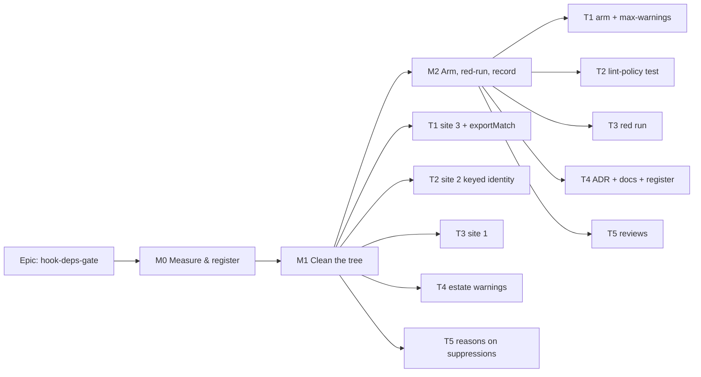

# Implementation Plan: A lint warning is a failure, and `exhaustive-deps` is armed

- **Feature spec:** [`./feature-spec.md`](./feature-spec.md)
- **Status:** Approved — by the product owner, 2026-09-28. Q1: `--max-warnings=0` in all nine workspaces. Q2: the default (reasons required) stands.
- **Owner:** web / repository tooling

## Breakdown

### Epic

**hook-deps-gate**: arm `react-hooks/exhaustive-deps` against a clean tree, make a lint warning a
failure in every workspace, and fix the three remaining sites. Maps to repository hygiene (drift
gates, ADR-0058), not to a product roadmap theme.

**The ordering is the design.** The rule is armed only after the tree passes it (ADR-0058: a gate that
fails on day one gets deleted rather than fixed). Every M1 task is independently releasable. M2 is the
only step that can make `main` red, and it lands last, in one commit, after a clean local run.

---

### Milestone M0: measure and register (no product change)

**Outcome:** the authoritative warning inventory exists, and the four open questions the spec could
only answer by reasoning (E13, E14, E20, and the inventory itself) are answered by running something.
**Entry point:** Ships dark. Measurement only; nothing is reachable.

#### Feature: evidence the spec could not take

> **Description:** The spec was written without a shell (spec, preamble). M0 replaces its reasoning
> with runs.
> **Complexity:** S
> **Dependencies:** none
> **Risks:** the inventory disagrees with the spec. That is handled by a rule, not by judgement: each
> extra site goes through M1's fix-or-reason treatment. **If M0-T1 finds more than 10 warnings the
> spec does not name, stop and re-plan with the product owner** rather than growing M1 silently
> (ADR-0105).
> **Testing requirements:** none shipped. The outputs are committed as `m0-measurement.md`.

##### M0-T0: register the dependency claims (≈ part of the first PR)

- **Description:** Add the four decision-bearing dependency citations to
  `scripts/dependency-claims.json`, with package, version, path, line range and the spec's anchor:
  plugin `basicRuleConfigs` (E1), `DEFAULT_ESLINT_SUPPRESSIONS` (E14), `useBaseQuery` `trackResult`
  (E13), `queryObserver` `trackResult` Proxy (E13). Add `eslint-plugin-react-hooks` and
  `@tanstack/react-query` to `verifiedAgainst`, plus `resolveVia` where they are not linked from the
  root.
- **Complexity:** S
- **Risks:** the resolver cannot find the plugin from the root (it is a dependency of `@repo/config`).
  Mitigation: add a `resolveVia` entry, the same way `@tanstack/query-core` does.
- **Testing:** `pnpm check:claims` passes. Then one anchor is deliberately corrupted, `check:claims`
  goes red, and the corruption is reverted.
- **Development steps:** 1. Open each file at the installed version and record the line range. 2. Add the entries. 3. Only then may later documents cite those ranges by line.

##### M0-T1: the lint inventory

- **Description:** Run each workspace with `pnpm --filter <ws> exec eslint . --format json` (not
  through turbo, which stops at the first failure) and tabulate every message: rule, file:line,
  severity.
- **Complexity:** S
- **Testing:** confirm or refute E5–E7. Expected: web 10 (3 `exhaustive-deps`, 2
  `incompatible-library`, 5 `no-console`), api 1, others 0, and no unused directives.
- **Development steps:** 1. Clear each `.eslintcache` so the cache cannot flatter the result. 2. Run
  all nine. 3. Commit the table to `m0-measurement.md` with the command lines.

##### M0-T2: two rule-behaviour experiments

- **Description:** (a) Confirm the site-1 diagnosis (E8): in a scratch copy, move `scheduleRefusal`
  out of the memo, and the `'model'` warning disappears with no dependency added. (b) Test E20: a memo
  that reads `model.planId` with `[model.planId]` listed produces no warning.
- **Complexity:** S
- **Testing:** recorded output only.

##### M0-T3: compiler suppression scope (decides M1-T2's form)

- **Description:** Establish E14's scope. A scratch component holds (i) a `react-hooks/refs` violation
  (`ref.current` read during render) and (ii) an unrelated `exhaustive-deps` suppression. Case A puts
  both in the **same** function. Case B puts the suppression in a **separate** module-private hook in
  the same file. Record whether `react-hooks/refs` fires in each case. Also lint the `useState`
  "previous render" form of `useKeyedIdentity` and record any compiler-derived diagnostic.
- **Complexity:** S
- **Risks:** Case B also turns analysis off, meaning the skip is per file. Then M1-T2 uses the
  suppression-free `useState` form, provided it lints clean. If neither works, stop and put the choice
  to the product owner with both costs.
- **Testing:** recorded output only.

##### M0-T4: toolbar context identity (tests E13)

- **Description:** A unit case that renders `useTsldToolbarContext` with a model whose `dependencies`
  is a **real** `useQuery` result (a `QueryClient` with seeded data), not the `{ data: [] }` literal the
  existing fixtures reuse (`use-tsld-toolbar-context.print.test.tsx:85`). Re-render with nothing
  changed and assert `result.current` identity.
- **Complexity:** S
- **Risks:** identity breaks for a reason other than `exportMatch` (for example `model.autoRecalc`,
  `model.undoRedo` or `recalc` also being new every render). Mitigation: M1-T1 fixes `exportMatch`
  only. Any other unstable member is recorded in a register row, not fixed here (ADR-0105).
- **Testing:** the case is kept and becomes M1-T1's regression, whatever it shows.

##### M0-T5: the pass-with-findings survey

- **Description:** Run `pnpm prepush` with output captured per gate (read `/tmp/prepush-last.log`
  after each), and list every passing gate that prints a finding-shaped line. E19's `check:claims`
  note is the known case.
- **Complexity:** S
- **Testing:** recorded only. Each case becomes a register row naming ADR D5's rule.

---

### Milestone M1: clean the tree (each task releasable alone)

**Outcome:** `pnpm lint` reports zero warnings in every workspace, with the rule still at `warn`. The
printed Gantt's Predecessors column is current.
**Entry point:** `Deliver ▸ Print…` in the Gantt view (`tsld-toolbar-items.tsx:1753-1761`), for
M1-T1's user-visible fix. The other tasks ship with nothing to reach.
**Journey:** none new. This is a defect repair on an existing command, pinned by
`use-tsld-toolbar-context.print.test.tsx`. ADR-0081's journey rule covers new capability, and no new
capability is claimed.

#### Feature: the three `exhaustive-deps` sites

> **Description:** D1 of the spec.
> **Complexity:** M
> **Dependencies:** M0-T3 (for T2), M0-T4 (for T1's regression case)
> **Risks:** site 2 regresses ADR-0133 D6's identity property. Mitigation: FC-6 and red limb R7.
> **Testing requirements:** unit only. Each new case is verified red against the pre-fix code first.

##### M1-T1: site 3, the context memo (≈ one PR)

- **Description:** Add `dependencies` to `use-tsld-toolbar-context.tsx`'s context memo list. Make
  `exportMatch` compute its isolate chain from `dependencies` (`:201`) and list `dependencies` instead
  of `model.dependencies` (`:347`, `:373`). Rewrite the `:959-962` comment so it states which consumers
  read edges through which path. Check the `:407-410` docblock ("an unrelated parent re-render … the
  15s pen poll") against M0-T4's result, and correct it if M0-T4 showed it false.
- **Complexity:** S
- **Dependencies:** M0-T4
- **Risks:** changing `exportMatch`'s source changes CSV-export matching. It does not: it is the same
  edge array, and `model.dependencies?.data ?? []` equals `model.dependencies.data ?? []` whenever the
  query is present. Mitigation: the existing export-CSV suites pass unedited.
- **Testing:** (1) new case in `use-tsld-toolbar-context.print.test.tsx`: re-render with a new
  `dependencies.data` array and the **same** `activities` array, call `printDiagram` with
  `planView='gantt'`, and assert `printGanttSchedule` received the new edges (red on pre-fix code, R8).
  (2) M0-T4's identity case, if E13 is confirmed.
- **Development steps:** 1. Write both cases and see them red. 2. Make the edit. 3. Run
  `pnpm --filter @repo/web lint` and see the `'dependencies'` warning gone. 4. Add a `@repo/web` patch
  changeset ("The printed programme's Predecessors column now shows links added since the last
  recalculation.").

##### M1-T2: site 2, keyed identity (≈ one PR)

- **Description:** Add `lockViewKey(view)` to `lock-view.ts`, built from a field table typed with
  `satisfies` so that a missing or extra `LockView` field fails typecheck. Add a module-private
  `useKeyedIdentity(value, key)` to `use-pen-lock-view.ts`, in the form M0-T3 chose. Its docblock says
  why it exists and why it is not exported. Replace `signatureWithAside` in the return memo's
  dependency list with the stable view. Delete the orphaned `:199-201` fragment.
- **Complexity:** M
- **Dependencies:** M0-T3
- **Risks:** (a) the focus effect keyed on `signature` (`:111-117`) is untouched and must stay that
  way. (b) A reviewer reads the helper as a general tool. Mitigation: not exported, with a docblock
  naming ADR-0133 D6.
- **Testing:** (1) `lock-view.test.ts`: for each `LockView` field, two views differing only in that
  field give different keys. (2) `use-pen-lock-view.stability.test.tsx`: the three existing cases stay
  unedited (acceptance condition 3). Add a `HELD_BY_OTHER` case where `now` advances by 1 s within the
  same "active …" phrase, which keeps identity, and one where it advances past the minute boundary,
  which gives a new identity. (3) R7.
- **Development steps:** 1. Key test red, then green. 2. Helper. 3. Swap the dependency. 4. Run the
  suite and lint.

##### M1-T3: site 1, `scheduleState` (≈ one small PR, or folded into T1)

- **Description:** `const { scheduleRefusal } = model;` above the memo, the body calls
  `scheduleRefusal('recalculate')`, and the dependency entry becomes `scheduleRefusal`. Correct the
  `:793-796` comment using M0-T2(b)'s result.
- **Complexity:** S
- **Dependencies:** M0-T2
- **Risks:** none that changes behaviour (E9).
- **Testing:** the existing `deriveScheduleState` and status-bar suites pass unedited. Lint shows no
  `'model'` warning.

#### Feature: the rest of the estate to zero

> **Description:** D3 and D4, and D5's existing sites.
> **Complexity:** M (mostly reading)
> **Dependencies:** M0-T1
> **Risks:** reading a reasonless suppression finds a live defect. Mitigation: record it in a new
> register row. Fix it only if the fix is one line and pinned by a red test (ADR-0105).
> **Testing requirements:** lint and the existing suites.

##### M1-T4: `no-console` and `incompatible-library` directives

- **Description:** Add six `no-console` directives with reasons: `composition.spec.ts:511,516,517`,
  `overlap.spec.ts:202`, `label-widths.spec.ts:172` and `apps/api/test/m0-engine-input.e2e-spec.ts:76`.
  For the last one, delete the print instead if reading shows it is leftover debugging. Add two
  `react-hooks/incompatible-library` directives with the consequence stated
  (`GanttPanel.tsx:569`, `HierarchyTree.tsx:215`; confirm each reported line in M0-T1). Update
  GanttPanel's `:621-624` claim that `pnpm lint` prints the warning "every run".
- **Complexity:** S
- **Testing:** `pnpm lint` shows zero warnings. Because this touches `apps/api`, run
  `scripts/e2e-local.sh api` (§19.8).

##### M1-T5: reasons on the 15 reasonless `react-hooks` suppressions (Q2)

- **Description:** For each site in E18, read the hook and write ` -- <reason>` on the directive,
  usually by moving the preceding comment's reason onto it.
- **Complexity:** M
- **Risks:** stale-behaviour discoveries (see the feature-level risk above).
- **Testing:** none new here. M2-T2's test enforces the rule from then on.

---

### Milestone M2: arm, red run, record

**Outcome:** a missing hook dependency, or any warning in any workspace, fails `pnpm lint`,
`pnpm prepush` and CI.
**Entry point:** Ships dark. Developer tooling; nothing is visible to a planner.

#### Feature: arm the gate

> **Description:** D2 and D5 of the spec, with the red run and the record.
> **Complexity:** M
> **Dependencies:** all of M1 (the tree must already be at zero warnings)
> **Risks:** CI goes red on a warning M0-T1 missed. Mitigation: a clean local `pnpm lint` with caches
> cleared immediately before pushing, and T1 in a commit of its own so reverting it is one command.
> **Testing requirements:** R1–R9, then `pnpm prepush` all green.

##### M2-T1: arm (one commit)

- **Description:** In `packages/config/eslint/react.js`, after the recommended spread, set
  `'react-hooks/exhaustive-deps': 'error'`, with a comment citing #353 and the ADR. Append
  `--max-warnings=0` to all nine workspace `lint` scripts (Q1).
- **Complexity:** S
- **Testing:** clear the caches, then `pnpm lint` reports 0 problems. FC-7: time the first run and
  record it.

##### M2-T2: `apps/web/src/lint-policy.structural.test.ts`

- **Description:** Four assertions. (a) `new ESLint().calculateConfigForFile('src/main.tsx')` gives
  `react-hooks/exhaustive-deps` severity 2. (b) Every workspace `package.json` found by listing
  `apps/*` and `packages/*` (**derived, never listed**, the ADR-0073 C4 rule) has a `lint` script that
  contains `--max-warnings=0`. (c) Every `eslint-disable(-next)?-line react-hooks/<rule>` directive in
  `apps/web` has a `--` description (comments are the subject here, so scanning comments is correct).
  (d) A **pinned positive case**: the directive scan finds at least 40 directives and the package scan
  finds 9 workspaces. A scan that found nothing would pass every other assertion (the ADR-0093 and
  ADR-0108 lesson).
- **Complexity:** S
- **Risks:** `calculateConfigForFile` is slow under the project service. It does not parse, so it
  should be fast; record the time.
- **Testing:** R5 and R9 red.

##### M2-T3: the red run

- **Description:** Run R1–R9 from spec §5, one at a time, each reverted. Record the commands, exit codes
  and the relevant output lines in `docs/specs/hook-deps-gate/red-run.md`.
- **Complexity:** S

##### M2-T4: record

- **Description:** File the ADR (spec §4.6; take the next free number). Add the CLAUDE.md §16 entry,
  `docs/adr/README.md` row and `scripts/adr-coverage.json` exemption. In CLAUDE.md §5, add one line:
  "a lint warning fails lint (`--max-warnings=0`)". In `docs/TESTING.md`, add the same to "Before you
  push". In `prepush.sh`, add a header comment stating the no-pass-with-findings rule (**comment only;
  no behaviour change**). In `docs/TECH_DEBT.md`, move #353 to the Closed-numbers ledger, and file new
  rows for E14 (41 suppressions that turn off compiler analysis, as a cost the reasons now have to
  justify, not a to-do), E19 and M0-T5's results, and anything M0-T4 showed about other unstable
  context members. Move the spec and plan headers to `Accepted — shipped (ADR-NNNN)` in the same
  commit that cites them (`check:spec-status`).
- **Complexity:** S
- **Testing:** `pnpm prepush`, including `check:adr-coverage`, `check:debt-status`,
  `check:spec-status`, `check:doc-links` and `check:claims`.

##### M2-T5: reviews before release

- **Description:** **component-reviewer** on M1-T2 (the helper, the key, the stability contract) and
  M1-T1. **performance-reviewer** on M1-T1 and M1-T2 against ADR-0133 D6. **devops-reviewer** on the
  lint-script and CI effect. Blocking findings are fixed with a test that is red first. Non-blocking
  findings become one register row.
- **Complexity:** S

## Sequencing and slices

1. **M0** (one docs PR: `m0-measurement.md` and the claims registration). This PR is also where the
   spec's evidence changes from reasoning to measurement.
2. **M1-T1, M1-T3** (web and site-3 fix, with a changeset). **M1-T2** (pen lock). **M1-T4** (estate).
   **M1-T5** (reasons). Any order, and each can merge alone. `main` stays releasable because the rule
   is still `warn`.
3. **M2-T1 to M2-T4** in one PR, with T1 as its own commit so it can be reverted alone. M2-T5 runs on
   that PR before merge.

No `VITE_` flag (ADR-0088 D1). The rollback for M2 is reverting the M2-T1 commit.

## Definition of Done (per task)

Each PR meets the Feature Completion Criteria in [`docs/PROCESS.md`](../../PROCESS.md). "Tests" means
`pnpm prepush` was **run**, plus `scripts/e2e-local.sh api` for M1-T4 (it touches `apps/api`).

## Risks and assumptions (rollup)

| Risk / assumption                                                                      | Likelihood | Impact | Mitigation                                                                                  |
| -------------------------------------------------------------------------------------- | ---------- | ------ | ------------------------------------------------------------------------------------------- |
| The spec's lint inventory is wrong (it was written without a shell).                   | med        | low    | M0-T1 decides. More than 10 unexpected sites means stop and re-plan.                        |
| The compiler skip is per file, not per function (E14 scope).                           | low        | med    | M0-T3 decides before M1-T2. The `useState` form is the fallback, and escalation after that. |
| Site 2's change breaks ADR-0133 D6's identity property.                                | low        | high   | Existing stability cases stay unedited, new tick cases are added, and R7 is verified red.   |
| E13 is confirmed but other context members also churn, so the benefit does not appear. | med        | low    | Fix `exportMatch` (correct anyway), file the rest, and do not chase them.                   |
| A plugin bump adds a new warn rule and a Dependabot PR goes red.                       | med        | low    | Intended (ADR D1 consequence). The bump is when someone should read the new rule.           |
| Reading 15 suppressions turns up live defects and scope grows.                         | med        | med    | Record, do not fix, unless the fix is one line and red-pinned (ADR-0105).                   |
| The dependency-claims registration fails to resolve the plugin.                        | low        | low    | A `resolveVia` entry, as for `@tanstack/query-core`.                                        |
