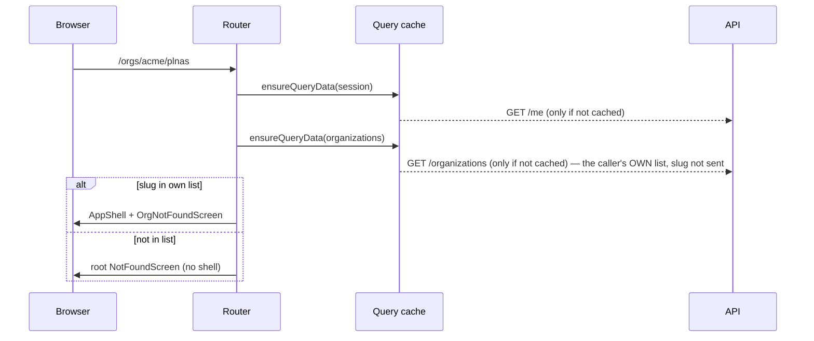
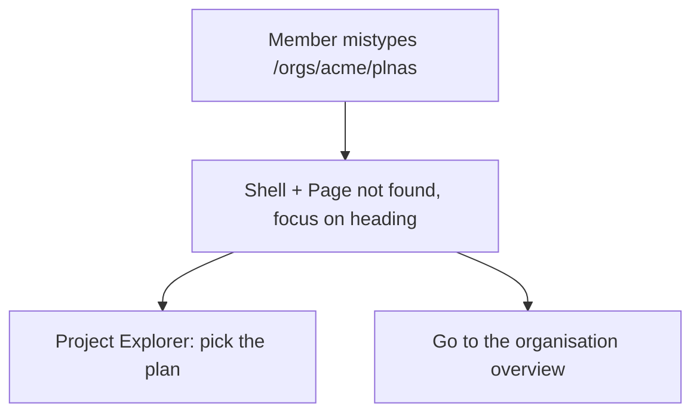

# Feature Spec: A member's mistype under their own organisation stays in the shell

- **Status:** Draft — awaiting spec approval.
- **Decision:** Approved in principle by the product owner 2026-10-07 ('Do #462 and #463 as well'), pending spec approval.
- **Author(s):** Claude Code (feature-analyst), for James Ewbank (product owner)
- **Date:** 2026-10-07
- **Tracking issue / epic:** `docs/TECH_DEBT.md` #463 (raised by estate polish M3, `docs/specs/estate-polish-oct/`)
- **Roadmap link:** none (quality of an existing surface)
- **Related ADR(s):** ADR-0086 (uniform 404), ADR-0029 (persistent shell), ADR-0105 (why this is a spec),
  ADR-0088 D1 (no flag), ADR-0081 (entry point + journey), ADR-0132 (a destination is not an alert). **No new ADR.**

> **Why a spec (ADR-0105).** A new route and a new screen component join the router's public shape, and the
> M3 journey's parity assertion changes. **No schema change, no API change, no new Playwright config or CI
> step** (existing suites gain steps). **No flag** (ADR-0088 D1); the commit is the rollback.
>
> **Out of scope: #462** (a visible reason beside the empty canvas's **Draw the first activity**). It
> changes copy visibility inside behaviour that row already describes and adds no surface, so it is being
> done separately as a register-row fix under ADR-0105.
>
> **Surface test sheet** (`docs/specs/gantt-coarse-pointer/device-checklist.md`): **not affected** — it
> exercises the Gantt under finger and stylus; nothing here touches the Gantt, the canvas or pointer input.

---

## 0. What was checked (CLAUDE.md §19.11)

| #   | Claim                                                                | What is true, and the evidence                                                                                                                                                                                                                                                                                                                                                                                                                                                                                                                                                                       |
| --- | -------------------------------------------------------------------- | ---------------------------------------------------------------------------------------------------------------------------------------------------------------------------------------------------------------------------------------------------------------------------------------------------------------------------------------------------------------------------------------------------------------------------------------------------------------------------------------------------------------------------------------------------------------------------------------------------- |
| 0.1 | Unknown URLs render one `NotFoundScreen` at root                     | `apps/web/src/app/router.tsx:663-664` (`defaultNotFoundComponent: NotFoundScreen`, `notFoundMode: 'root'`). `NotFoundScreen` takes no props by design (`components/layout/not-found-screen.tsx:14-18`) and focuses its `<h1>` on mount (`:41`).                                                                                                                                                                                                                                                                                                                                                       |
| 0.2 | In root mode, no `beforeLoad` below root runs for an unmatched path  | **Read, not measured.** `router-core@1.171.34` keeps the partially matched routes (`router.js:660-665`) but `findGlobalNotFoundRouteId` returns the root in `'root'` mode (`:958-968`), and the client lane ends at that planned boundary (`load-client.js:611-618`). So today `_authed`'s session guard and `ensureOrgMembership` do **not** run for `/orgs/<slug>/nope`: signed out, non-member, member and nonexistent slug all see the same root screen. M1-T0 measures this.                                                                                                                            |
| 0.3 | The M3 journey pins the behaviour this spec changes                  | `apps/web/e2e-staff/staff.spec.ts:149-187` creates an organisation **as the member** and asserts `/orgs/${slug}/nope` settles identical to `/staff`. That address is a **member's own** mistype — exactly what moves into the shell. The parity set must swap it for a foreign and a nonexistent slug (plan M1-T3).                                                                                                                                                                                                                                                                                  |
| 0.4 | How the client decides membership                                    | `ensureOrgMembership` (`router.tsx:291-301`) looks the slug up in the **caller's own** organisations list (`GET /api/v1/organizations`, `features/organizations/api/use-organizations.ts:22-23`) — no request names the slug. A non-member and a nonexistent slug are both simply "not in my list".                                                                                                                                                                                                                                                                                                    |
| 0.5 | Is a non-member's org page already distinguishable from a fake one?  | **No, and both are distinguishable from `/no-such-path`.** Signed in, `/orgs/<foreign>` and `/orgs/<nonexistent>` both redirect to `/` (`router.tsx:294-297`), which sends the reader to their own organisation; `/no-such-path` shows the not-found page. The API agrees: `resolveScope` throws the same `NotFoundError('Organisation not found.')` for "no such org" and "not a member" (`apps/api/src/modules/organizations/organizations.service.ts:158-174`). So the property that matters — **nothing tells a caller whether an organisation they are not in exists** — already holds, and is what this spec must keep. |
| 0.6 | The shell gets its organisation from the URL                         | `AppShell` reads `orgSlug` from `useParams({ strict: false })` (`components/layout/navigator/app-shell.tsx:45-46`), so a route whose path carries `$orgSlug` gets the Project Explorer for free.                                                                                                                                                                                                                                                                                                                                                                                                      |
| 0.7 | No route-change focus manager exists                                 | Screens move focus themselves (`not-found-screen.tsx:41`; `RouteErrorScreen` likewise). The new screen must do the same.                                                                                                                                                                                                                                                                                                                                                                                                                                                                             |

## 1. Business understanding

### Problem

Since M3 (#459), a signed-in planner who mistypes an address inside their own organisation —
`/orgs/acme/plnas`, a stale bookmark, a link to a flag-dark screen — loses the Project Explorer and
breadcrumbs and gets a centred card whose only way on is **Go to the home page**, a full reload. That was
accepted as the price of one uniform not-found picture. This spec removes the price for **members only**,
without giving anyone else a way to learn which organisations exist.

### Users

Every organisation role (Org Admin, Planner, Contributor, Viewer) mistyping under an organisation they
belong to. External Guests never reach `/orgs/…` (their surface is `/share`). Non-members, signed-out
visitors and staff are affected only in that their picture must **not** change in a way that leaks.

### Success criteria

- **SC-1 (member).** Signed in, `/orgs/<my-org>/nope` (and any deeper unmatched path, e.g.
  `/orgs/<my-org>/plans/abc/x`) renders inside the shell: Project Explorer present, one `<main>` (the
  shell's), one `<h1>` "Page not found" that has focus, title `Page not found · SchedulePoint`, a link back
  to the organisation overview that navigates without a reload.
- **SC-2 (non-member, the #459 guard).** Signed in, `/orgs/<foreign-org>/nope` and
  `/orgs/<no-such-org>/nope` each settle **byte-identical** to `/no-such-path` and `/staff` — the M3
  journey's comparison (title, `lang`, `<meta>` set, `<main>` outerHTML, `<h1>` list) — and **identical to
  each other** in requests made.
- **SC-3 (signed out).** `/orgs/<any>/nope` behaves the same for every slug (see Q1 for which picture).

### Open questions

See §6 — one critical question (Q1). Defaults for everything else are stated where they arise.

## 2. Functional requirements

**US-1** — As a member of an organisation, I want a mistyped address inside it to keep me in the app, so
that I can carry on from the Project Explorer or go back to the overview in one click.

- **Given** I am signed in and a member of `acme`, **when** I open `/orgs/acme/<anything no route
  matches>`, **then** the shell renders with an in-shell "Page not found" (SC-1).
- **Given** that page, **when** I press **Go to the organisation overview**, **then** I reach
  `/orgs/acme` by client-side navigation (shell stays mounted).

**US-2** — As anyone who is not a member of `<slug>`, I want the same "Page not found" as any other
unknown address, so that the product never confirms an organisation I am not in exists.

- **Given** I am signed in and **not** a member of `<slug>` (whether or not it exists), **when** I open
  `/orgs/<slug>/<unmatched>`, **then** the root `NotFoundScreen` renders, outside the shell (SC-2).

### Edge cases

- **Member of no organisation** → not a member of any slug → root screen.
- **Membership revoked while the list is cached** → the stale list may say "member" until it refetches;
  the shell's own queries then fail with the API's uniform 404 (0.5). Same staleness every org route
  already has via `ensureOrgMembership`; not new.
- **Flag-dark org screens** (`/orgs/acme/resources` with `VITE_RESOURCES` off) → a member now sees the
  in-shell picture. Intended.
- **`/orgs` and `/orgs/`** (no slug) → unmatched by the new route → root screen, as today.
- **`/staff/x`, `/no-such-path`** → unchanged.

### Permissions

No change. The membership test is UX, not trust (the API re-checks every request, 0.5). No permission is
read; any role that is a member gets the in-shell picture.

### Validation rules

n/a — no input beyond the URL slug, which is only compared against the caller's own list.

### Error scenarios

| Scenario                                   | Detection                              | User-facing result                     | Status |
| ------------------------------------------ | -------------------------------------- | -------------------------------------- | ------ |
| Member, unmatched path under own org       | splat route, slug in own list          | in-shell "Page not found"              | n/a    |
| Non-member / nonexistent slug              | splat route, slug not in own list      | root `NotFoundScreen` (no shell)       | n/a    |
| Signed out                                 | `_authed` guard                        | per Q1 (default: sign-in redirect)     | n/a    |
| `GET /organizations` fails                 | `ensureQueryData` rejects in `beforeLoad` | `RouteErrorScreen` — as every org route today | n/a |

## 3. Technical analysis

| Area           | Impact | Notes                                                                                                                                                                                                                                                                                  |
| -------------- | ------ | -------------------------------------------------------------------------------------------------------------------------------------------------------------------------------------------------------------------------------------------------------------------------------------- |
| Frontend       | low    | One splat route under `_authed`; one new lazy screen; a small pure membership helper shared with `ensureOrgMembership`. `NotFoundScreen` is **unchanged** (no prop).                                                                                                                  |
| Backend / API  | none   | n/a — no endpoint or body changes.                                                                                                                                                                                                                                                      |
| Database       | none   | n/a — no schema change.                                                                                                                                                                                                                                                                 |
| Security       | low    | The one real risk is re-opening #459; §4.4 analyses it. The decision reads only the caller's own membership list.                                                                                                                                                                       |
| Performance    | low    | Member path: the organisations list is already cached by the shell/home resolver. New lazy chunk is a few hundred bytes; `router-splitting.structural.test.ts` requires it to be lazy or named.                                                                                         |
| Infrastructure | none   | n/a.                                                                                                                                                                                                                                                                                    |
| Observability  | none   | n/a — client-side picture only.                                                                                                                                                                                                                                                         |
| Testing        | low    | Unit (helper, screen); the M3 journey's parity loop re-pointed and a member block added; a signed-out step in `e2e-public`.                                                                                                                                                             |

### Dependencies

Estate polish M3 (shipped). Nothing else.

## 4. Solution design

### 4.1 Architecture

```mermaid
flowchart LR
  U[URL /orgs/:slug/unmatched] --> A[_authed beforeLoad<br/>session guard]
  A -- no session --> SI[redirect /sign-in?redirect=… · Q1]
  A --> S[orgNotFoundRoute '/orgs/$orgSlug/$'<br/>beforeLoad: isMember(own list, slug)]
  S -- member --> IS[OrgNotFoundScreen<br/>inside AppShell outlet]
  S -- not member / no such org --> NF["throw notFound({ routeId: rootRouteId })"]
  NF --> R[root NotFoundScreen<br/>outside the shell, unchanged]
```

### 4.2 Data flow



### 4.3 User flow



### 4.4 Does deciding "member or not" leak? — the honest analysis

What must stay **indistinguishable** is a foreign organisation and a nonexistent one (0.5). What is
**already** distinguishable, today and before M3, is `/orgs/…` from `/no-such-path` (signed in, `/orgs/x`
redirects home; signed out it redirects to sign-in) — that only reveals the public route prefix, which
ships in the bundle. So:

| Channel                  | Foreign vs nonexistent slug                                     | Non-member `/orgs/x/nope` vs `/no-such-path`                                                                                                                                         |
| ------------------------ | --------------------------------------------------------------- | ------------------------------------------------------------------------------------------------------------------------------------------------------------------------------------ |
| Settled DOM / title      | identical (same component, same branch)                         | identical — SC-2, asserted by the journey                                                                                                                                            |
| Requests                 | identical — the only input is the caller's own list (0.4)       | **differs on a cold load:** `GET /organizations`, possibly the `AuthedLayout` chunk, and the hierarchy warm-up `_authed.beforeLoad` schedules (`router.tsx:256`). Accepted residue: same for every slug, reveals the route prefix only. M1-T0 records the exact set. |
| Timing                   | identical — an in-memory `find` over the caller's list          | a `/organizations` round trip on a cold load (same residue)                                                                                                                          |
| Pending skeleton         | identical — `RoutePending` after 1 s, if the reads are slow     | `/no-such-path` never pends (same residue)                                                                                                                                           |
| Shell flash              | none for either: the shell is a child match and renders only once the lane resolves past it; the not-found boundary is root. **Read, not measured** — M1-T0 confirms no `AppShell` paint for a non-member on a cold and a warm load. | same                                                                                                                                                                                 |

So deciding membership first does **not** leak organisation existence: it never asks the server about the
slug. It does widen the request-level difference between `/orgs/x/nope` and `/no-such-path` that already
exists between `/orgs/x` and `/no-such-path`. The #459/ADR-0086 property (`/staff` indistinguishable) is
untouched — `/staff` is outside `_authed` and not matched by the new route.

### 4.5 Component changes

- **`NotFoundScreen` — unchanged, and that is a decision.** Its docblock argues a prop is a way for two
  callers to diverge (`not-found-screen.tsx:14-18`); every non-member path keeps rendering it bare. Its
  docblock gains one sentence naming the sibling and why the sibling is members-only.
- **New `OrgNotFoundScreen`** (`apps/web/src/routes/org-not-found.tsx`, lazy). Inside the shell's `<main>`,
  so it uses `PageContainer` (no `<main>` of its own) and `Breadcrumbs` (one crumb to the organisation
  overview, then "Page not found"). Same heading **"Page not found"**, same sentence **"There is nothing at
  this address."**, same title via `useDocumentTitle('Page not found')`, `<h1>` focused on mount (0.7). Link
  **Go to the organisation overview** — a router `<Link>` to `/orgs/$orgSlug`. No `role="alert"`: this is a
  destination, not an event (ADR-0132). Copy strings are shared constants so the two screens cannot drift
  in wording.
- **Router:** `orgNotFoundRoute` (`path: '/orgs/$orgSlug/$'`, child of `_authed`), registered
  unconditionally. Its `beforeLoad` calls a pure `isOrgMember(organizations, slug)` that
  `ensureOrgMembership` also uses, so the two lookups cannot drift; on false it throws
  `notFound({ routeId: rootRouteId })` — explicit, so the result does not depend on `notFoundMode`.

### Database changes

n/a — no schema change.

### API changes

n/a — no endpoint or contract change.

### 4.6 Approach & alternatives

**Chosen:** a splat route under `_authed`, member check in `beforeLoad`, root screen for everyone else.

- **A prop/variant on `NotFoundScreen`** — rejected: it is the divergence its own docblock forbids, and the
  two pictures differ structurally (`AuthShell` + own `<main>` vs inside the shell's `<main>`), so a prop
  would be a component with two roots.
- **Back to `notFoundMode: 'fuzzy'`** — rejected: it re-creates the three pictures #459 removed, and puts
  non-members inside `_authed` too.
- **Splat as a sibling of `_authed` rendering the shell itself** — would keep signed-out on the root
  screen, but mounts a second shell and breaks ADR-0029's mounted-once shell on every navigation across it.
- **Redirect a non-member's mistype home (like `/orgs/<foreign>`)** — equally leak-free, but contradicts
  M3's "an address that is not a page shows the not-found page". Not chosen.

## 5. Links

- Implementation plan: [`./implementation-plan.md`](./implementation-plan.md)
- Related docs updated by this change: `docs/TECH_DEBT.md` (#463 closed), the `NotFoundScreen` and
  `router.tsx` docblocks, CLAUDE.md stage banner if `pnpm check:counts` moves, a `web` changeset.

## 6. Critical question for the product owner

**Q1. When somebody who is NOT signed in follows a mistyped organisation address (for example a broken
link in an email), what should they see?**

- **(a) Recommended — the sign-in page, then the right page once they sign in.** This is what every other
  organisation address already does, so a member following a bad link signs in and lands inside the app
  with the "Page not found" and their Project Explorer. It reveals nothing about which organisations exist
  (it happens for every name). It does undo one small detail of the October change: for these addresses
  only, a signed-out visitor gets sign-in rather than the plain "Page not found".
- **(b) The plain "Page not found", as today.** Keeping this needs the app's frame to be built twice,
  which our architecture rules out, so it would cost a larger change for little benefit.

Default if unanswered: **(a)**. Everything else in this spec uses the defaults stated above and needs no
decision.
