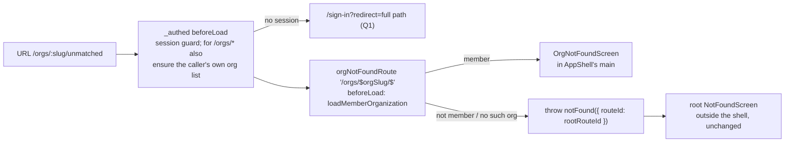
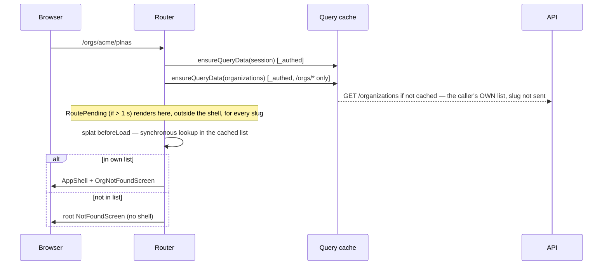
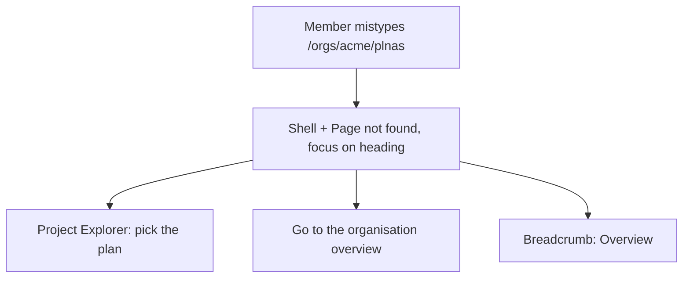

# Feature Spec: A member's mistype under their own organisation stays in the shell

- **Status:** Draft — awaiting spec approval.
- **Decision:** Approved in principle by the product owner 2026-10-07 ('Do #462 and #463 as well'), pending spec approval.
- **Author(s):** Claude Code (feature-analyst), for James Ewbank (product owner)
- **Date:** 2026-10-07 (revised the same day after four reviews — §7)
- **Tracking issue / epic:** `docs/TECH_DEBT.md` #463 (raised by estate polish M3, `docs/specs/estate-polish-oct/`)
- **Roadmap link:** none (quality of an existing surface)
- **Related ADR(s):** ADR-0086 (uniform 404), ADR-0029 (persistent shell), ADR-0105 (why this is a spec),
  ADR-0111 (keyboard/focus contract reviewed before release), ADR-0145/0146 (archetypes, page measure),
  ADR-0088 D1 (no flag), ADR-0081 (entry point + journey), ADR-0132 (a destination is not an alert).
  **No new ADR.**

> **Why a spec (ADR-0105).** A new route joins the tree, a new screen is added, and a shared primitive's
> public contract widens (`PageHeader` gains one optional prop, §4.5). **No schema change, no API change,
> no new Playwright config or CI step** (existing suites gain steps). **No flag** (ADR-0088 D1); the
> commit is the rollback.
>
> **Out of scope: #462** (a visible reason beside the empty canvas's **Draw the first activity**). It
> changes copy visibility inside behaviour that row already describes and adds no surface, so it is being
> done separately as a register-row fix under ADR-0105.
>
> **Surface test sheet** (`docs/specs/gantt-coarse-pointer/device-checklist.md`): **not affected** — it
> exercises the Gantt under finger and stylus; nothing here touches the Gantt, the canvas or pointer input.

---

## 0. What was checked (CLAUDE.md §19.11)

| #    | Claim                                                              | What is true, and the evidence                                                                                                                                                                                                                                                                                                                                                                                                                                                                                                       |
| ---- | ------------------------------------------------------------------ | ------------------------------------------------------------------------------------------------------------------------------------------------------------------------------------------------------------------------------------------------------------------------------------------------------------------------------------------------------------------------------------------------------------------------------------------------------------------------------------------------------------------------------------ |
| 0.1  | Unknown URLs render one `NotFoundScreen` at root                   | `apps/web/src/app/router.tsx` lines 663-664 (`defaultNotFoundComponent`, `notFoundMode: 'root'`). `NotFoundScreen` takes no props by design (`not-found-screen.tsx` docblock, lines 14-18) and focuses its `<h1>` on mount (line 41).                                                                                                                                                                                                                                                                                                |
| 0.2  | In root mode no `beforeLoad` below root runs for an unmatched path | **Read, not measured.** `@tanstack/router-core@1.171.34` keeps the partially matched routes (`router.js:659-665`), `findGlobalNotFoundRouteId` returns the root in `'root'` mode (`router.js:958-968`), and the client lane ends at that planned boundary (`load-client.js:611-618`). So today `_authed`'s guard and `ensureOrgMembership` do not run for `/orgs/<slug>/nope`. M1-T0 measures it.                                                                                                                                    |
| 0.3  | The M3 journey pins the behaviour this spec changes                | `apps/web/e2e-staff/staff.spec.ts` lines 149-187 create an organisation **as the member** and assert `/orgs/${slug}/nope` settles identical to `/staff` — a member's own mistype, exactly what moves into the shell. Plan T3 re-points it.                                                                                                                                                                                                                                                                                           |
| 0.4  | How the client decides membership                                  | `ensureOrgMembership` (`router.tsx` lines 291-301) looks the slug up in the **caller's own** list (`GET /api/v1/organizations`, `use-organizations.ts` lines 22-23). No request names the slug.                                                                                                                                                                                                                                                                                                                                      |
| 0.5  | What a non-member already sees under `/orgs/<x>/`                  | Real sub-routes (`/orgs/<x>`, `/members`, `/clients`, `/plans/<id>`, …) run `ensureOrgMembership` and **redirect to `/`** (`router.tsx` lines 294-297, 307, 315, 357, 424) for a foreign and a nonexistent slug alike; an unmatched path shows the root not-found. The API returns the same `NotFoundError('Organisation not found.')` for "no such org" and "not a member" (`organizations.service.ts` lines 158-174).                                                                                                              |
| 0.6  | The shell gets its organisation from the URL                       | `AppShell` reads `orgSlug` via `useParams({ strict: false })` (`app-shell.tsx` lines 45-46).                                                                                                                                                                                                                                                                                                                                                                                                                                         |
| 0.7  | No route-change focus manager exists                               | Screens move focus themselves (`not-found-screen.tsx` line 41; `route-error-screen.tsx` lines 88-94). In the shell, no route does today.                                                                                                                                                                                                                                                                                                                                                                                             |
| 0.8  | `PageHeader` cannot be given focus today                           | Its props are `title`, `description`, `aside`, `actions`, `className` (`page-header.tsx` lines 5-40); the `<h1>` takes no ref or `tabIndex` (lines 81-86).                                                                                                                                                                                                                                                                                                                                                                           |
| 0.9  | Gates the new route and screen meet                                | `router-search-census.structural.test.ts` pins `EXPECTED_ROUTE_COUNT = 22` (line 93) → 23; the splat declares no `validateSearch`, so A1 is unaffected; `search-consumer-census` is unaffected (the screen reads no search). `routes/archetypes.structural.test.ts` refuses a hand-rolled `<h1>` (line 71) on its `SURFACE` list (lines 42-53). `page-container.structural.test.ts` requires an explicit `width` to be declared with a reason (lines 146-152). `router-splitting.structural.test.ts` requires the screen to be lazy. |
| 0.10 | Sign-in carries the whole path back                                | `_authed` redirects with `redirect: location.href` (`router.tsx` line 254); `/sign-in` keeps it if it has exactly one leading slash and drops it otherwise (lines 137-138). A mistyped `/orgs/acme/plnas?x=1` survives unchanged.                                                                                                                                                                                                                                                                                                    |

## 1. Business understanding

### Problem

Since M3 (#459), a signed-in planner who mistypes an address inside their own organisation —
`/orgs/acme/plnas`, a stale bookmark, a link to a flag-dark screen — loses the Project Explorer and
breadcrumbs and gets a centred card whose only way on is **Go to the home page**, a full reload. This spec
removes that cost **for members only**, without giving anyone a way to learn which organisations exist.

### Users

Every organisation role (Org Admin, Planner, Contributor, Viewer) mistyping under an organisation they
belong to. External Guests never reach `/orgs/…`. Non-members, signed-out visitors and staff are affected
only in that their picture must not change in a way that leaks.

### Success criteria

- **SC-1 (member).** `/orgs/<my-org>/nope` and deeper unmatched paths render inside the shell: Project
  Explorer present, one `<main>` (the shell's), one `<h1>` "Page not found" with focus, title
  `Page not found · SchedulePoint`, a link back to the overview that navigates without a reload.
- **SC-2 (the actual guarantee).** **For any path shape under `/orgs/<x>/`, a foreign slug and a
  nonexistent slug are indistinguishable** — same settled page, same requests, same pending state. Today's
  shape-dependent difference stays: an unmatched path settles to the root not-found (byte-identical to
  `/no-such-path` and `/staff` on the M3 comparison), a real sub-route redirects home (0.5). That reveals
  which route names exist, which ship in the public bundle — accepted residue, not a #459 leak.
- **SC-3 (signed out).** `/orgs/<any>/nope` behaves the same for every slug (Q1: sign-in, carrying the path).

### Open questions

One critical question, §6. Everything else uses the defaults stated below.

## 2. Functional requirements

**US-1** — As a member of an organisation, I want a mistyped address inside it to keep me in the app, so
that I can carry on from the Project Explorer or go back to the overview in one click.

- **Given** I am signed in and a member of `acme`, **when** I open `/orgs/acme/<unmatched>`, **then**
  the shell renders with the in-shell "Page not found" (SC-1).
- **Given** I am on it and change only the unmatched part (`/orgs/acme/x` → `/orgs/acme/y`), **then**
  focus returns to the heading again.
- **When** I press **Go to the organisation overview**, **then** I reach `/orgs/acme` client-side.

**US-2** — As anyone who is not a member of `<slug>`, I want nothing I see to depend on whether that
organisation exists, so that the product never confirms an organisation I am not in.

- **Given** I am signed in and not a member of `<slug>` (whether or not it exists), **when** I open
  `/orgs/<slug>/<unmatched>`, **then** the root `NotFoundScreen` renders outside the shell, and the
  shell never paints at any point of the load (SC-2).

### Edge cases

- **Member of no organisation** → not a member of any slug → root screen.
- **Membership removed while the list is cached** → may see the in-shell page once until the list
  refetches; the shell's own reads then get the API's uniform 404. Same staleness every org route has via
  `ensureOrgMembership`; it is about the caller's own membership, never an oracle about others.
- **Flag-dark org screens** (e.g. `resources` with the flag off) → existing behaviour, now the in-shell
  picture for a member and the root picture for anyone else; identical per slug.
- **`/orgs` and `/orgs/`** → unmatched by the new route → root screen, as today.
- **`/staff/x`, `/no-such-path`** → unchanged.

### Permissions

No change. The membership test is UX, not trust (the API re-checks, 0.5). No permission is read.

### Validation rules

n/a — the slug is only compared against the caller's own list; the redirect path is validated as today (0.10).

### Error scenarios

| Scenario                             | Detection                                 | User-facing result                     | Status |
| ------------------------------------ | ----------------------------------------- | -------------------------------------- | ------ |
| Member, unmatched path under own org | splat route, slug in own list             | in-shell "Page not found"              | n/a    |
| Non-member / nonexistent slug        | splat route, slug not in own list         | root `NotFoundScreen` (no shell)       | n/a    |
| Signed out                           | `_authed` guard                           | `/sign-in?redirect=<full path>` (Q1)   | n/a    |
| `GET /organizations` fails           | `ensureQueryData` rejects in `beforeLoad` | `RouteErrorScreen`, as every org route | n/a    |

## 3. Technical analysis

| Area           | Impact | Notes                                                                                                                                                            |
| -------------- | ------ | ---------------------------------------------------------------------------------------------------------------------------------------------------------------- |
| Frontend       | low    | One splat route; one lazy screen; `loadMemberOrganization` shared with `ensureOrgMembership`; a shared copy module; `PageHeader` gains `headingFocusRef` (§4.5). |
| Backend / API  | none   | n/a — no endpoint or body changes.                                                                                                                               |
| Database       | none   | n/a — no schema change.                                                                                                                                          |
| Security       | low    | The risk is re-opening #459; §4.4. The decision reads only the caller's own list.                                                                                |
| Performance    | low    | The organisations list is already needed by every org route; the new chunk is small and lazy.                                                                    |
| Infrastructure | none   | n/a.                                                                                                                                                             |
| Observability  | none   | n/a — client-side picture only.                                                                                                                                  |
| Testing        | low    | Unit (helper, router shape, screen, copy parity, `PageHeader`); M3 journey re-pointed plus member, signed-out and residue steps.                                 |

### Dependencies

Estate polish M3 (shipped). Nothing else.

## 4. Solution design

### 4.1 Architecture

### 4.2 Data flow

**Why the list is awaited in `_authed` for `/orgs/*`.** Rendered matches run up to the first match that is
not yet `success` (`load-client.js:40-42`). If the list were fetched only in the splat's `beforeLoad`, a
slow cold load could render `_authed` (the shell, with `orgSlug` = the foreign slug) around a pending
outlet, then swap it for the root screen: a shell flash, and Explorer requests keyed on the slug. Those
requests would get the API's identical 404 for foreign and nonexistent slugs (0.5), so it would not leak
existence, but it is a visible tell and a waste. Awaiting the list while `_authed` itself is pending means
`RoutePending` paints at the root outlet, outside the shell (its own docblock: "while the shell itself is
still loading it is the only content on the page"), for members and non-members alike. Every existing org
route already awaits this list; it is fetched earlier, not additionally. **Read, not measured** — T0 and
T3 assert it.

### 4.3 User flow

### 4.4 Does deciding "member or not" leak? — the analysis

| Channel              | Foreign vs nonexistent slug (must be identical)         | Non-member `/orgs/x/nope` vs `/no-such-path` (residue allowed)                                                                           |
| -------------------- | ------------------------------------------------------- | ---------------------------------------------------------------------------------------------------------------------------------------- |
| Settled DOM / title  | identical — same branch, same component                 | identical (journey)                                                                                                                      |
| Requests             | identical — only input is the caller's own list (0.4)   | cold load adds `GET /organizations` and the hierarchy warm-up `_authed` schedules (`router.tsx` line 256); reveals the route prefix only |
| Timing               | identical — an in-memory lookup                         | one `/organizations` round trip on a cold load                                                                                           |
| Pending              | identical — `RoutePending` at the root outlet, if > 1 s | `/no-such-path` never pends                                                                                                              |
| Shell paint          | none for either (§4.2)                                  | none                                                                                                                                     |
| Real sub-route shape | both redirect home (0.5)                                | n/a — differs from the unmatched shape; route names are public                                                                           |
| Signed out (Q1 a)    | both redirect to sign-in                                | differs from `/no-such-path` (which shows the not-found); reveals the route prefix only                                                  |

Deciding membership first never asks the server about the slug, so it cannot leak existence. `/staff` is
outside `_authed` and unmatched by the new route; ADR-0086's property is untouched.

### 4.5 Component changes

- **`components/layout/not-found-copy.ts` (new, not a component — keeps react-refresh lint quiet).**
  Exports `NOT_FOUND_COPY = { title: 'Page not found', description: 'There is nothing at this address.' }`.
  `NotFoundScreen` and the new screen take their heading, sentence and `useDocumentTitle` argument from it.
- **`NotFoundScreen` — props unchanged (none).** Docblock gains: the copy lives in `not-found-copy.ts`;
  the members-only sibling exists and why it is members-only.
- **`PageHeader` gains `headingFocusRef?: React.Ref<HTMLHeadingElement>`.** When passed, the `<h1>`
  takes the ref, `tabIndex={-1}` and `outline-none`; when absent, output is byte-identical. **Chosen over a
  local mechanism** (a wrapper `ref` that finds the `<h1>` and sets `tabIndex` imperatively, as
  `NotFoundScreen` does through `CardTitle`): the local route reaches into a primitive's DOM, and the
  `outline-none` it needs could only be a one-off descendant selector, which the design system forbids. A
  named prop makes "this heading is a programmatic focus target" a reusable rule. Cost: an ADR-0105
  contract change (covered here) and **accessibility- and component-review before release** (ADR-0111).
  Unit test: with the prop, ref resolves to the `<h1>` with `tabIndex=-1`; without, no `tabIndex`.
- **`routes/org-not-found.tsx` → `OrgNotFoundScreen` (new, lazy, no props).** TSDoc says why no props:
  everything comes from the route (`useParams({ from: '/orgs/$orgSlug/$' })`) and the copy module, so it
  cannot diverge from the root wording. Structure, top to bottom, left-aligned (not centred, not a card):
  `PageContainer width="narrow"` (declared in `page-container.structural.test.ts`'s `WIDTH_EXCEPTIONS`
  with a reason; `page-container.tsx`'s docblock lines 21-25 updated — its "only consumer is
  `staff.tsx:107`" is stale since #459) → `Breadcrumbs` (default `wrap`; first crumb **Overview** →
  `/orgs/$orgSlug`, no org-name fetch; last crumb **Page not found** with `aria-current="page"`; never
  echoes the unknown path) → `PageHeader` (title + description from `NOT_FOUND_COPY`, `headingFocusRef`) →
  a router `<Link>` **Go to the organisation overview** styled `textLinkVariants({ size: 'sm' })`, the
  primary action. Both crumb and link stay (the link is the primary action). Added to
  `routes/archetypes.structural.test.ts`'s `SURFACE`.
- **Focus.** An effect focuses the heading on mount and **whenever the pathname changes** (the effect
  depends on the pathname; `/orgs/a/x` → `/orgs/a/y` re-uses the match). Docblock says why this is the
  only in-shell route that moves focus: it replaces content the reader did not ask for, as
  `NotFoundScreen` and `RouteErrorScreen` do. A cold load therefore skips past the skip link once —
  acceptable for a destination. Activating the overview link drops focus to `<body>` like every in-shell
  navigation; no one-off fix. No `role="status"`/`role="alert"` (ADR-0132).
- **Responsive.** `PageContainer`'s measure; the trail wraps; the `<h1>` wraps via `PageHeader`'s
  `wrap-anywhere`; no fixed widths; below `lg` the Explorer is the shell's off-canvas sheet; content is not
  vertically centred.
- **Router.** `app/org-membership.ts` exports `loadMemberOrganization(queryClient, slug):
Promise<OrganizationSummary | undefined>` (used by `ensureOrgMembership`, which keeps its redirect and its
  `setLastActiveOrg`) and `orgNotFoundBeforeLoad`, which **does not** call `setLastActiveOrg` (a mistype is
  not a visit) and on a miss throws `notFound({ routeId: rootRouteId })` — explicit, so the outcome does not
  depend on `notFoundMode`. `orgNotFoundRoute` (`'/orgs/$orgSlug/$'`, child of `_authed`, unconditional).
  `_authed.beforeLoad` ensures the organisations list when the pathname starts with `/orgs/` (§4.2).

### Database changes

n/a — no schema change.

### API changes

n/a — no endpoint or contract change.

### 4.6 Approach & alternatives

**Chosen:** a splat route under `_authed`, membership decided before the shell can render, root screen for
everyone else.

- **A prop/variant on `NotFoundScreen`** — rejected: the divergence its docblock forbids, and the two
  pictures are structurally different (own `<main>` on `AuthShell` vs inside the shell's `<main>`).
- **Back to `notFoundMode: 'fuzzy'`** — rejected: re-creates #459's three pictures.
- **Splat as a sibling of `_authed` rendering the shell itself** — would keep signed-out on the root
  screen but mounts a second shell, breaking ADR-0029's mounted-once shell.
- **Redirect a non-member's mistype home** — equally leak-free, but contradicts M3's "an address that is
  not a page shows the not-found page". Not chosen.

## 5. Links

- Implementation plan: [`./implementation-plan.md`](./implementation-plan.md)
- Docs updated by this change: `docs/TECH_DEBT.md` (#463 closed), `docs/UX_STANDARDS.md` (a short "not
  found" rule: an unknown address inside a member's organisation keeps the shell; anywhere else the one root
  page; never echo the unknown path), `NotFoundScreen`/`PageHeader`/`PageContainer`/`router.tsx`
  docblocks, `docs/COMPONENT_LIBRARY.md` if it lists `PageHeader` props, CLAUDE.md banner if
  `pnpm check:counts` moves, a `web` changeset.

## 6. Critical question for the product owner

**Q1. For these mistyped organisation addresses only, signed-out visitors will see the sign-in page instead
of "Page not found". Is that all right?**

- **(a) Recommended — yes.** It is what every other organisation address already does, and after signing in
  they land on the right picture: a member gets "Page not found" inside the app with their Project Explorer.
  It reveals nothing about which organisations exist, because it happens for every name.
- **(b) No — keep "Page not found" for signed-out visitors.** That needs the app's frame built twice, which
  our architecture rules out, so it is a much larger change for little gain.

Default if unanswered: **(a)**.

## 7. Review record (2026-10-07)

Four reviews of the first draft (commit `f2ccb422`). Verdicts and what was folded:

| Reviewer      | Verdict                               | Points and resolution                                                                                                                                                                                                                                                                                                                                                                                                                                                                                                                                                                                                                                                                                                                                                                                    |
| ------------- | ------------------------------------- | -------------------------------------------------------------------------------------------------------------------------------------------------------------------------------------------------------------------------------------------------------------------------------------------------------------------------------------------------------------------------------------------------------------------------------------------------------------------------------------------------------------------------------------------------------------------------------------------------------------------------------------------------------------------------------------------------------------------------------------------------------------------------------------------------------- |
| Security      | Sound, no leak; approve once B1 fixed | **B1** "same picture as any unknown address" overclaimed: real sub-routes redirect a non-member home. SC-2, US-2, 0.5 and §4.4 now state the actual guarantee (foreign = nonexistent for every path shape) and record redirect-vs-not-found as residue; journey asserts `/orgs/<foreign>/members` = `/orgs/<nonexistent>/members`. **S1** Q1 (a) kept; changeset and #463 close state the signed-out change (§4.4). **S2** hard no-shell and pending-parity assertions with a delayed list (plan T0/T3), and §4.2's design change that makes them hold. **S3** census gates (0.9, T1). **S4** unit probe that a child `notFound({ routeId: rootRouteId })` yields the root picture, not `RouteErrorScreen` (T1). **S5/S6** edge cases. **S7** T0 probe throwaway; `m1-measurement.md` the only artefact. |
| Component     | 3 blocking                            | **B1** `not-found-copy.ts` + parity unit test. **B2** `PageContainer width="narrow"` (declared; stale docblock fixed) + `PageHeader`; no hand-rolled `<h1>`; added to `SURFACE`; focus via a new `headingFocusRef` prop, chosen over a local mechanism with the reason in §4.5. **B3** `loadMemberOrganization` shared; splat skips `setLastActiveOrg`; memory-history router unit test. Suggestions: `useParams({ from })`, no-props TSDoc, docblock pointer, one-heading/no-main/no-alert/router-`Link` test — all folded.                                                                                                                                                                                                                                                                             |
| UX            | Pass with nits                        | `PageHeader` (as component B2); link `textLinkVariants({ size: 'sm' })`, left-aligned, no card; crumbs **Overview** → **Page not found**, no path echo, `wrap`; both crumb and link kept; shared sentence; responsive line and no-overflow checks at 1368×912 and 390 wide with axe at both; where `RoutePending` shows (§4.2); sign-in carries the full path (0.10); `UX_STANDARDS.md` rule (§5, plan T4); Q1 reworded plainly.                                                                                                                                                                                                                                                                                                                                                                         |
| Accessibility | No blocking                           | Re-focus on pathname change (§4.5, unit test); cold-load skip-link bypass accepted; `tabIndex=-1` + `outline-none` via the prop; docblock on why this route moves focus; no live-region roles; link activation drops focus like every in-shell navigation; journey: focus on cold and client-side arrival, one `h1`, one `main`, link name + href, last crumb `aria-current`, title, no alert, logical Tab; axe with `wcag2a/2aa/21a/21aa/22aa` after focus settles at both widths.                                                                                                                                                                                                                                                                                                                      |

**Declined:** none. **Not done in this revision:** the `docs/UX_STANDARDS.md` rule is written at build
(plan T4), not here, because this revision is confined to the spec directory.
