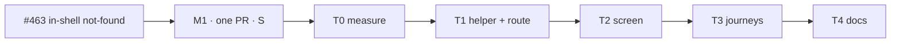

# Implementation Plan: A member's mistype under their own organisation stays in the shell

- **Feature spec:** [`./feature-spec.md`](./feature-spec.md)
- **Status:** Draft — awaiting spec approval (approved in principle by the product owner 2026-10-07).
- **Owner:** Claude Code (builder agent), for James Ewbank

## Breakdown

One milestone, one PR. No flag (ADR-0088 D1), no schema or API change, no new Playwright config or CI
step, no new ADR. PR description carries: **Surface sheet not affected** (spec header).

---

### Milestone M1: a member's mistype keeps the shell; everyone else's picture is unchanged

**Outcome:** a signed-in member who mistypes under their own organisation sees "Page not found" inside
the shell, with the Project Explorer and a link back to the overview.
**Entry point:** the address bar — `/orgs/<my-org>/<anything unmatched>`; on screen, **Go to the
organisation overview** (link) in the workspace.
**Journey:** `apps/web/e2e-staff/staff.spec.ts`, test 1 (the M3 parity journey), extended in T3.

> **Complexity:** S · **Dependencies:** estate polish M3 (shipped)
> **Risks:** see rollup
> **Testing requirements:** unit (helper, screen, splitting rule); e2e member block + re-pointed parity
> loop + signed-out step; axe on the in-shell page

#### T0 — Measure before the change (no product code)

- **Description:** confirm spec 0.2 and record the baseline, as M3-T0 did (`m3-measurement.md`).
- **Complexity:** S · **Dependencies:** none
- **Risks:** the reading contradicts 0.2 (e.g. `_authed` already runs for unmatched paths) → stop and
  revise the spec's §4.4 before T1.
- **Testing:** throwaway Playwright probe, deleted; result committed as `m1-measurement.md` beside the spec.
- **Steps:**
  1. Signed out, and signed in as (i) member, (ii) non-member of an existing org, (iii) any user with a
     nonexistent slug: open `/orgs/<slug>/nope` cold and via client navigation; record title, `<main>`,
     `<h1>`, focus, and the network request list.
  2. Record the same for `/no-such-path` as the reference.

#### T1 — Membership helper and the splat route

- **Description:** extract `isOrgMember(organizations, slug)` (pure) used by both `ensureOrgMembership` and
  a new `orgNotFoundRoute` (`'/orgs/$orgSlug/$'`, child of `_authed`, unconditional). Non-member →
  `throw notFound({ routeId: rootRouteId })`.
- **Complexity:** S · **Dependencies:** T0
- **Risks:** the splat outranks a real route → TanStack ranks static/param segments above a splat; T3's
  journey also opens a real org screen to prove it still resolves.
- **Testing:** unit for `isOrgMember` (member, non-member, empty list, case as stored);
  `router-splitting.structural.test.ts` passes with the new lazy component.
- **Steps:**
  1. Helper + its test.
  2. Route; update the `notFoundMode` comment at `router.tsx:655-662` to name the route.

#### T2 — `OrgNotFoundScreen`

- **Description:** the in-shell screen per spec §4.5; shared copy constants with `NotFoundScreen`;
  `NotFoundScreen`'s docblock names the sibling and why it is members-only. `NotFoundScreen`'s props stay
  none.
- **Complexity:** S · **Dependencies:** T1
- **Risks:** a second `<main>` or a one-off style → `PageContainer` + `Breadcrumbs` only; component-reviewer.
- **Testing:** unit — one `<h1>` "Page not found" focused on mount; title; link href `/orgs/<slug>`; no
  `<main>`; no `role="alert"`. Existing `not-found-screen.test.tsx` unchanged and green.

#### T3 — Journeys (ADR-0081: drive the real product)

- **Description:** re-point the M3 parity loop and add the member block.
- **Complexity:** S · **Dependencies:** T2
- **Risks:** the second organisation needs a second account → the journey already creates several
  contexts; add one owner account that creates the foreign org.
- **Testing / steps** (`e2e-staff/staff.spec.ts`, test 1):
  1. **Parity loop:** replace `/orgs/${slug}/nope` with `/orgs/${foreignSlug}/nope` (an org the member is
     not in) and `/orgs/no-such-org-${stamp}/nope`; the existing `toEqual(reference)` then proves SC-2.
     Also assert the request lists for those two addresses are equal to each other (SC-2, "identical to
     each other").
  2. **Member block:** `/orgs/${slug}/nope` and `/orgs/${slug}/plans/abc/x` → Project Explorer region
     visible, exactly one `<main>`, `<h1>` "Page not found" focused, title `Page not found ·
     SchedulePoint`; press **Go to the organisation overview** → URL `/orgs/${slug}`, no document reload
     (a `window` marker survives); axe clean on the in-shell page.
  3. **Signed out** (`e2e-public`): `/orgs/acme/nope` → behaviour per Q1 (default: `/sign-in?redirect=…`).
  4. Run `scripts/e2e-local.sh web:staff` and `web:public` locally before push (CLAUDE.md §19.8).

#### T4 — Docs and release

- **Steps:**
  1. `docs/TECH_DEBT.md` #463 → closed, citing the commit and the journey; note the accepted residue
     (spec §4.4 request-level difference) in the closing text.
  2. `pnpm check:counts`; update CLAUDE.md's stage banner if the web source-file figure moves.
  3. `web` changeset (patch): "A mistyped address inside your organisation now keeps you in the app."
     Mention the signed-out change per Q1.
  4. Spec header → `Approved` at approval; `Accepted`/close per ADR-0131 when shipped (no ADR expected,
     so it stays `Approved` with the shipping commit cited in #463).
  5. `pnpm prepush`.

## Sequencing & slices

T0 → T1 → T2 → T3 → T4 in one PR. Between commits `main` stays releasable: T1 alone, without T2, would
render nothing for members, so T1 and T2 land together.

## Reviewers

**security-reviewer** (the #459 re-open risk, §4.4), **accessibility-reviewer** (focus/heading/title in
the shell — ADR-0111 does not strictly apply since no shared primitive's keyboard contract changes, but
focus on mount does), **component-reviewer**, **ux-reviewer** (copy, link label). No database-architect
(no schema), no api-reviewer (no API change).

## Definition of Done (per task)

Each task's PR must satisfy the Feature Completion Criteria in
[`docs/PROCESS.md`](../../PROCESS.md) (code, tests, docs, security, performance, accessibility, Docker
build, CI, changelog, version impact).

## Risks & assumptions (rollup)

| Risk / assumption                                                                                          | Likelihood | Impact | Mitigation                                                                                  |
| ---------------------------------------------------------------------------------------------------------- | ---------- | ------ | ------------------------------------------------------------------------------------------- |
| Spec 0.2 (root mode skips `_authed` for unmatched paths) is wrong                                          | low        | med    | T0 measures it before code                                                                   |
| A non-member sees the shell paint before the root screen (a flash that is itself a tell of "org route")    | low        | med    | T0 + T3 assert no `AppShell` node on cold and warm loads; same for every slug regardless     |
| Request-level difference `/orgs/x/nope` vs `/no-such-path` read as re-opening #459                          | med        | low    | Documented residue (§4.4): reveals the public route prefix only; foreign = nonexistent       |
| Splat swallows a real route                                                                                 | low        | med    | Router ranking; T3 opens a real org screen too                                               |
| Stale cached membership after removal shows the in-shell page once                                          | low        | low    | Same staleness `ensureOrgMembership` has; API still answers 404                              |
| The two screens' wording drifts                                                                             | low        | low    | Shared copy constants (T2)                                                                   |
