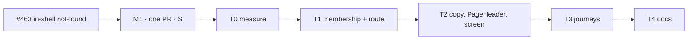

# Implementation Plan: A member's mistype under their own organisation stays in the shell

- **Feature spec:** [`./feature-spec.md`](./feature-spec.md)
- **Status:** Approved — by the product owner, 2026-10-07, with the spec (Q1: sign-in page for signed-out visitors).
- **Owner:** Claude Code (builder agent), for James Ewbank

## Breakdown

One milestone, one PR. No flag (ADR-0088 D1), no schema or API change, no new Playwright config or CI
step, no new ADR. PR description carries: **Surface sheet not affected** (spec header).

---

### Milestone M1: a member's mistype keeps the shell; nobody else learns anything new

**Outcome:** a signed-in member who mistypes under their own organisation sees "Page not found" inside the
shell, with the Project Explorer, an **Overview** crumb and a link back to the overview.
**Entry point:** the address bar — `/orgs/<my-org>/<anything unmatched>`; on screen, **Go to the
organisation overview** (link) in the workspace.
**Journey:** `apps/web/e2e-staff/staff.spec.ts` test 1 (the M3 parity journey), extended in T3; one
signed-out step in `e2e-public`.

> **Complexity:** S · **Dependencies:** estate polish M3 (shipped)
> **Risks:** see rollup
> **Testing requirements:** unit (membership helper, router shape, copy parity, `PageHeader` prop, screen);
> e2e member, non-member, residue and signed-out steps; axe at two widths

#### T0 — Measure before the change (no product code)

- **Description:** confirm spec 0.2 and record the baseline. The probe is **throwaway**;
  `m1-measurement.md` beside the spec is the only artefact.
- **Complexity:** S · **Dependencies:** none
- **Risks:** a reading contradicts 0.2 or §4.2 → stop and revise the spec before T1.
- **Steps:**
  1. Signed out, and signed in as (i) member, (ii) non-member of an existing org, (iii) nonexistent slug:
     open `/orgs/<slug>/nope` and `/orgs/<slug>/members` cold and client-side; record title, `<main>`,
     `<h1>`, focus, network request list.
  2. Same for `/no-such-path` as the reference.

#### T1 — Membership helper, the splat route, `_authed` ensures the list

- **Description:** `app/org-membership.ts` with `loadMemberOrganization` and `orgNotFoundBeforeLoad`
  (spec §4.5); `ensureOrgMembership` uses the helper; `orgNotFoundRoute` (`'/orgs/$orgSlug/$'`, under
  `_authed`, unconditional); `_authed.beforeLoad` ensures the organisations list for `/orgs/*` paths.
- **Complexity:** S · **Dependencies:** T0
- **Risks:** the splat outranks a real route → the router unit test and T3 open `/orgs/x/members`.
- **Testing:**
  - unit: `loadMemberOrganization` (member, non-member, empty list); `orgNotFoundBeforeLoad` never calls
    `setLastActiveOrg`;
  - unit, memory-history router of the same shape (`notFoundMode: 'root'`, `defaultErrorComponent`
    present, the real `beforeLoad`s, a stubbed query client): non-member slug → root `NotFoundScreen`,
    no `AuthedLayout`, **not** `RouteErrorScreen` (security S4); member → in-shell screen;
    `/orgs/x/members` → `MembersScreen`;
  - `router-search-census.structural.test.ts`: `EXPECTED_ROUTE_COUNT` 22 → 23 after re-deriving; A1 needs
    no case (no `validateSearch`); `search-consumer-census` unchanged; `router-splitting` passes (lazy).
- **Steps:** helper + tests; route; `_authed` change; update the `notFoundMode` comment in `router.tsx`.

#### T2 — Shared copy, `PageHeader` prop, `OrgNotFoundScreen`

- **Description:** spec §4.5 in full.
- **Complexity:** S · **Dependencies:** T1
- **Risks:** a shared primitive's contract widens → accessibility-reviewer and component-reviewer
  **before release** (ADR-0111); byte-identical output without the prop is unit-pinned.
- **Testing (unit):**
  - copy parity: render `NotFoundScreen` and `OrgNotFoundScreen`; same `<h1>` text, same description,
    same `document.title`;
  - `PageHeader`: with `headingFocusRef` the ref is the `<h1>` with `tabIndex=-1`; without it, no `tabIndex`;
  - screen: one heading, focused on mount and again after a pathname change; no `<main>`; no
    `role="alert"`/`role="status"`; the link is a router `Link` to `/orgs/<slug>`; last crumb
    `aria-current="page"`, first crumb **Overview**; the unknown path appears nowhere in the DOM;
  - `routes/archetypes.structural.test.ts` `SURFACE` gains `routes/org-not-found.tsx`;
    `page-container.structural.test.ts` `WIDTH_EXCEPTIONS` gains it with its reason.
- **Steps:** copy module; `NotFoundScreen` imports it (docblock pointer); `PageHeader` prop + docblock;
  screen; `page-container.tsx` docblock lines 21-25 corrected.

#### T3 — Journeys (ADR-0081: drive the real product)

- **Complexity:** S · **Dependencies:** T2
- **Risks:** a foreign org needs a second account → add one owner context that creates it.
- **Steps** (`e2e-staff/staff.spec.ts`, test 1):
  1. **Parity loop:** replace `/orgs/${slug}/nope` with `/orgs/${foreignSlug}/nope` and
     `/orgs/no-such-org-${stamp}/nope`; the existing `toEqual(reference)` proves they match `/staff`.
  2. **Foreign = nonexistent, every shape:** for `/nope` and `/members`, the foreign and nonexistent
     slugs settle to equal pictures and equal request lists (path-normalised for the slug).
  3. **No shell, ever, for a non-member:** cold load with `GET /api/v1/organizations` delayed ~1.5 s
     (`page.route`); a `MutationObserver` installed by `addInitScript` records whether any Project
     Explorer / shell node ever attached → never, for the foreign and nonexistent slugs; the
     `route-pending` node appears identically for both.
  4. **Member:** `/orgs/${slug}/nope` (cold `goto`) and a client-side arrival (navigate within the app to
     `/orgs/${slug}/plans/abc/x`): Project Explorer present; exactly one `<main>` and one `<h1>`;
     `<h1>` "Page not found" **focused** in both arrivals; title `Page not found · SchedulePoint`; link
     name **Go to the organisation overview** and href `/orgs/${slug}`; last crumb `aria-current="page"`;
     no `role="alert"`; Tab from the heading lands on the next control in reading order; pressing the link
     reaches `/orgs/${slug}` with no document reload (a `window` marker survives).
  5. **Widths:** at 1368×912 and at 390 wide, no horizontal overflow (`scrollWidth <= clientWidth` on the
     document and `main`), and axe with `wcag2a, wcag2aa, wcag21a, wcag21aa, wcag22aa` after focus settles
     (pattern at `staff.spec.ts` lines 1374-1377) → no violations.
  6. **Signed out** (`e2e-public`): `/orgs/acme/plnas?x=1` → `/sign-in?redirect=%2Forgs%2Facme%2Fplnas%3Fx%3D1`
     (Q1 default).
  7. Run `scripts/e2e-local.sh web:staff` and `web:public` before push (CLAUDE.md §19.8).

#### T4 — Docs and release

- **Steps:**
  1. `docs/TECH_DEBT.md` #463 → closed, citing the commit and journey, stating the signed-out change and the
     accepted residue (spec §4.4: real-route vs unmatched shape; request-level difference from
     `/no-such-path`; signed-out `/orgs/x/nope` now redirects).
  2. `docs/UX_STANDARDS.md`: the short "not found" rule (spec §5); `docs/COMPONENT_LIBRARY.md` if it lists
     `PageHeader`'s props.
  3. `pnpm check:counts`; update CLAUDE.md's banner if the web source-file figure moves.
  4. `web` changeset (patch): "A mistyped address inside your organisation now keeps you in the app.
     Signed-out visitors following such an address now see sign-in first."
  5. Spec and plan headers → `Approved` at approval (ADR-0131); no ADR expected, so they stay `Approved`
     with the shipping commit cited in #463.
  6. `pnpm prepush`.

## Sequencing & slices

T0 → T4 in one PR. T1 and T2 land together: the route without the screen would render nothing for members.

## Reviewers

Before release: **accessibility-reviewer** and **component-reviewer** (the `PageHeader` prop, focus —
ADR-0111), **security-reviewer** (§4.4 and the T3 assertions), **ux-reviewer** (copy, layout at two
widths). No database-architect (no schema), no api-reviewer (no API change).

## Definition of Done (per task)

Each task's PR must satisfy the Feature Completion Criteria in
[`docs/PROCESS.md`](../../PROCESS.md) (code, tests, docs, security, performance, accessibility, Docker
build, CI, changelog, version impact).

## Risks & assumptions (rollup)

| Risk / assumption                                                          | Likelihood | Impact | Mitigation                                                                    |
| -------------------------------------------------------------------------- | ---------- | ------ | ----------------------------------------------------------------------------- |
| Spec 0.2 (root mode skips `_authed` for unmatched paths) is wrong          | low        | med    | T0 measures before code                                                       |
| The shell paints for a non-member on a slow cold load                      | low        | med    | §4.2 awaits the list in `_authed`; T3 step 3 asserts it never attaches        |
| Request-level difference from `/no-such-path` read as re-opening #459      | med        | low    | Residue documented (§4.4); foreign = nonexistent asserted for two path shapes |
| `PageHeader`'s new prop changes existing headers                           | low        | med    | Byte-identical without the prop, unit-pinned; ADR-0111 review before release  |
| Splat swallows a real route                                                | low        | med    | Router unit test and T3 open `/orgs/x/members`                                |
| Moving the list fetch into `_authed` changes timing of existing org routes | low        | low    | Same request, earlier; every org route already awaits it                      |
| Stale cached membership after removal shows the in-shell page once         | low        | low    | Same as `ensureOrgMembership`; API still answers 404                          |
