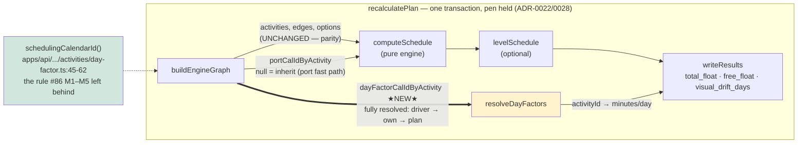
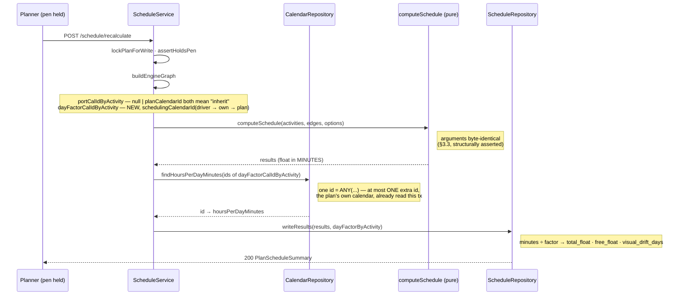
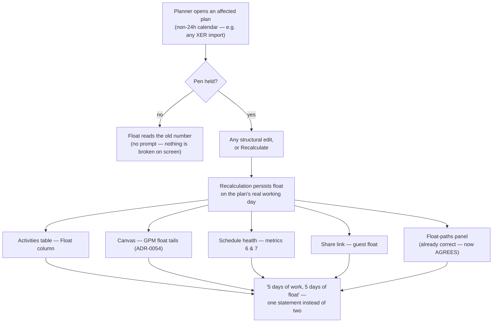

# Feature Spec: The inherited plan calendar's day factor — float measured on the day the work is done

- **Status:** Approved
- **Author(s):** feature-analyst, for James Ewbank
- **Date:** 2026-09-13
- **Tracking issue / epic:** `docs/TECH_DEBT.md` #86 — the **second** of that row's two mechanisms
- **Roadmap link:** none — debt-driven work, triggered by ADR-0105 (a register row is not a spec)
- **Related ADR(s):** amends **ADR-0068 §4**; collides with **ADR-0125 / ADR-0126** (§3.6); builds on
  ADR-0035 §17–§23, ADR-0036 §7, ADR-0037, ADR-0039 §4, ADR-0116. **A new ADR is required** (§4.8) —
  next free number is **ADR-0139**.

---

## 0. What this spec establishes, and what it corrects in its own brief

Every claim below names the command, file+line or test that established it. Four claims **inherited
from the brief** were checked and three of them moved (§19.11 / ADR-0076 — "the brief is not
evidence").

| Claim as briefed                                                                                              | Verdict                                                         | Evidence                                                                                                                                                                                                                                                                                                                                                                                                                                            |
| ------------------------------------------------------------------------------------------------------------- | --------------------------------------------------------------- | --------------------------------------------------------------------------------------------------------------------------------------------------------------------------------------------------------------------------------------------------------------------------------------------------------------------------------------------------------------------------------------------------------------------------------------------------- |
| `effectiveOf` returns `r.calendarId` with no plan fallback; `null` reaches `resolveDayFactors` and takes 1440 | **CONFIRMED**                                                   | `schedule.service.ts:1343-1353` (`effectiveOf`), `:1373-1375` (`calIdByActivity`), `:358-374` (`resolveDayFactors`, `calId === null ? DEFAULT_HOURS_PER_DAY_MINUTES`)                                                                                                                                                                                                                                                                               |
| Proven by an executing green test                                                                             | **CONFIRMED**                                                   | `apps/api/test/resource-dependent-day-factor.e2e-spec.ts:681-743` — `inh.totalFloat` **2**, `exp.totalFloat` **5**, over an asserted-equal window (`:730-731`) with identical 2,400 duration minutes (`:735-738`)                                                                                                                                                                                                                                   |
| `totalFloat` is the field that moves                                                                          | **CONFIRMED, and it is three fields, not one**                  | `schedule.repository.ts:752` `total_float`, `:754` `free_float`, `:770-774` `visual_drift_days`. Those are the **only** three the factor touches — `leveling_delay_minutes` is stored in minutes (`:787-789`) and converted at the API boundary                                                                                                                                                                                                     |
| `durationDays` / `remainingDurationDays` / `levelingDelayDays` may be affected too                            | **FALSE — they are already correct**                            | `day-factor.ts:28` `ownCalendarId` = `activityCalendarId ?? planCalendarId`; `:45-62` `schedulingCalendarId` ends in the same rung; `attachDayFactors` (`:153-183`) feeds `activity-response.dto.ts:423/448/490`. The plan rung is present on the read path and missing only on the recalculation write path                                                                                                                                        |
| The client may have the same hole                                                                             | **FALSE — the client is right and only the server is wrong**    | `apps/web/src/lib/effective-hours-per-day.ts:124-127` — `activityCalendarId !== '' ? activityCalendarId : planCalendarId`. **There is no client change in this epic** (§3.1)                                                                                                                                                                                                                                                                        |
| Inheriting is the default, so the affected population is plausibly most activities on most non-24h plans      | **HALF TRUE, and the other half narrows it sharply**            | Inheriting is the default: `schema.prisma:965` `calendarId String?`, no default. But a **stock plan is unaffected**: a new plan takes the org's seeded `Standard` calendar (`plans.service.ts:110`), which is five full-day `[0,1440)` shifts (`organizations.service.spec.ts:119-131`) whose factor derives to **1440** (`hours-per-day.ts:35-36` → `packages/types/src/index.ts:1107-1125`, modal daily minutes). See §1.4 for what _is_ affected |
| Baselines freeze the factor at capture, so a pre-fix baseline may now disagree with live                      | **CONFIRMED, and worse than briefed**                           | `baselines.service.ts:160-164` freezes the **plan's** factor; `baseline.repository.ts:211` copies `total_float` as a **raw day count**. So the snapshot is _already_ internally incoherent: its frozen factor is 480 and its frozen float was divided by 1440                                                                                                                                                                                       |
| Revision comparison reads frozen float and may report spurious rows                                           | **CONFIRMED — one predicate, and `isCritical` is NOT involved** | `revision-changes.ts:217` `from.isCritical !== to.isCritical \|\| from.totalFloatDays !== to.totalFloatDays`. `is_critical` is decided in **minutes** inside the engine (`engine/compute.ts:150`, `:699-700`), so it does not move; only the `CRITICALITY` change class's float half and `revision-delta.ts:223-225`'s `floatMovementDays` do                                                                                                       |
| ADR-0125's `MATCH`/`DIFFERS`/`UNKNOWN` machinery may be reusable                                              | **NO — it answers a different question**                        | Those four columns freeze the **criticality rule**, and criticality is unaffected here (row above). Reuse would mean a _new_ marker column. §3.6 costs it; CQ-2 decides                                                                                                                                                                                                                                                                             |

One live docblock is **false today and the fix makes it true**, which is worth recording because it is
the class the register keeps finding: `use-float-paths-panel.ts:125-128` says relative float "sits
beside `activity.totalFloat`, which the server already converts that way". For an inheriting activity
it does not, and the two numbers on that panel are therefore on different day lengths today.

---

## 1. Business understanding

### Problem

On a plan whose calendar is not a 24-hour one, **an activity that inherits that calendar has its
float reported against a 24-hour day while its dates, its duration and its schedule are computed on
the plan's real working day.** A five-day slack window on an eight-hour plan reads as **2 days of
float**. The same activity's duration on the same row reads **5 days**. Both numbers come back on one
DTO, from one row, and cannot both be true.

The mechanism is one missing fallback rung. `buildEngineGraph`'s `effectiveOf`
(`schedule.service.ts:1343-1353`) answers "which calendar does this activity schedule on?" with
`driving resource → activity's own`, and stops. It never reaches `→ plan`, because for the engine it
does not need to: `portFor` (`:1369-1370`) collapses **both** `null` and `plan.calendarId` to
`undefined`, which is the byte-identical inherit fast path (ADR-0037). That is correct for the engine
and wrong for the one other consumer of the same map — `resolveDayFactors` (`:358-374`), which turns
`null` into the 24-hour constant and hands it to the write that persists float **in days**
(`schedule.repository.ts:750-754`).

So a sentinel meaning "inherit" is read by one consumer as "inherit" and by another as "24 hours".

**Why now.** #86's driving-resource mechanism shipped today (`api-v0.62.0` / `web-v0.127.0`, M1–M5).
This is the same row's other mechanism, it needs **no resource at all**, and the register's own note
says it "is very probably the larger population of the two". It is also the only reason #86 is still
open. `resolveDayFactors`'s docblock (`:345-356`) states the defect, names this spec's work as where
it belongs, and calls itself "left as characterisation, deliberately".

### Users

| Role                                              | What changes for them                                                                                                                                                                             |
| ------------------------------------------------- | ------------------------------------------------------------------------------------------------------------------------------------------------------------------------------------------------- |
| **Planner** (`schedule:calculate`, holds the pen) | The Float column, the canvas float tails, the float-paths panel and the schedule health report finally agree about how much slack an activity has. Reported float **increases** on affected plans |
| **Contributor / Viewer** (`schedule:read`)        | The same numbers, read-only. No permission change                                                                                                                                                 |
| **External Guest** (per-plan share link)          | `totalFloat` is in the fixed guest read scope (`guest-activity.dto.ts:80`, `:114`) and moves with everything else                                                                                 |
| **Org Admin**                                     | Nothing role-specific                                                                                                                                                                             |

Nobody gains or loses a capability. This is a correction to a number on surfaces that already exist.

### Primary use cases

1. A planner on an eight-hour-day plan reads an activity's float and gets the number its own duration
   is measured in.
2. A planner runs the DCMA health check and metric 6 (high float) counts activities against a
   threshold expressed in the same days the plan works in.
3. A planner hands a share link to a client, and the guest's float read-out matches the member's.
4. A planner who imported a P6 programme sees float that is comparable with the float P6 reported.

### User journeys

**Happy path.** Planner opens a plan on a non-24h calendar → takes the pen → makes any structural
edit (or presses **Recalculate**) → the recalculation persists float on each activity's real day →
the Activities table's Float column, the canvas tails and the health report all read the corrected
number. No new control, no new screen, no prompt.

**The alternate that matters.** A plan nobody recalculates keeps the number it already has. The fix
takes effect at the **next recalculation** and at no other moment; there is no backfill (§4.6, and
the default in §1.6 explains why). An actively-edited plan self-corrects on its first edit, because
auto-recalculation has fired on every structural edit since ADR-0032 M3.

**The alternate that is a product decision, not a bug.** A planner compares the live plan against a
baseline captured **before** this fix and sees a `CRITICALITY` change row reading `float 2 d →
float 5 d` for an activity that did not move, on a day nobody edited it. §3.6 and **CQ-2**.

### Expected outcomes

- One statement per span. "Five days of work with five days of float" replaces "five days of work
  with two days of float", which is not expressible on any single day length —
  `schedule.repository.ts:746-749` says so in its own comment, and is the code that violates it.
- Float, duration and the float-paths panel come from one day-length rule instead of two.
- The DCMA report stops under-counting high float on non-24h plans.
- `docs/TECH_DEBT.md` #86 closes.

### Success criteria

| #   | Criterion                                                                                      | How it is known                                                                       |
| --- | ---------------------------------------------------------------------------------------------- | ------------------------------------------------------------------------------------- |
| S1  | The characterisation case inverts: the inheriting twin reads **5**, matching the explicit twin | `resource-dependent-day-factor.e2e-spec.ts:741-742`, both sides kept (§5 of the plan) |
| S2  | `computeSchedule`'s arguments are **unchanged** across the fix                                 | A structural assertion plus the conformance/golden suites passing **unedited** (§4.5) |
| S3  | Every surface that prints float agrees with the duration beside it on one plan                 | Web journey (§3.9)                                                                    |
| S4  | A plan on a 24-hour calendar, and a plan with no calendar, are **byte-identical**              | Regression cases, verified red against a fix that changes them                        |
| S5  | At most **one** additional primary-key read per recalculation, never per activity              | Measured; falsification condition in the plan's M0                                    |

### Open questions

> **BOTH CRITICAL QUESTIONS ANSWERED by the product owner, 2026-09-13**, with the build approved to
> run through to a pull request. Recorded here rather than only in the conversation that produced
> them, because a spec whose blocking answers live elsewhere is one the next reader cannot act on.
>
> **CQ-1 → option (c), the two named maps.** `calIdByActivity` stays the engine's PORT map and a
> separate `dayFactorCalIdByActivity` is built by the **existing** `schedulingCalendarId` resolver —
> the rule #86 M1–M5 already wrote and left behind on this path. `resolveDayFactors`' body does not
> change: `null → 1440` becomes correct the moment `null` means "the plan has no calendar either".
> Both register candidates were rejected with reasons, and the reasons are the decision — (a) makes
> the parity claim a dependency on `portFor`'s two-case guard collapsing `plan.calendarId`, a
> coincidence rather than a property, and also reaches the PRED/SUCC lag resolution; (b) writes the
> fallback rung a second time beside a resolver that already encodes it, which is the duplication
> that produced #86.
>
> **CQ-2 → option (A): accept, document, file a debt row.** The boundary hazard is **pre-existing and
> reachable today** — `hoursPerDay` is client-settable and independent of the shifts, so editing it
> re-frames every float on that calendar with no date moving — so this fix instantiates a known class
> once more rather than creating one. ADR-0125's four frozen-criticality columns are **not** the
> remedy: `is_critical` and the delta's entered/left sets are unaffected, so they answer a different
> question. And the frozen side **cannot** be rescaled, because rounding destroyed the information at
> write time (2 × 1440 ÷ 480 = 6 where the truth is 5). Option (C) is the correct shape and is
> declined on cost for a transitional boundary that it would not fully close anyway.
>
> **The population claim was corrected before these were asked**, and it changes the priority rather
> than the design: a **stock plan is unaffected** (seed calendars derive 1440 from full-day weekday
> shifts, so `null → 1440` is right for them), while **every XER import is affected wholesale**,
> since a P6 calendar's `day_hr_cnt` is eight hours. Narrow and total, landing on the on-ramp from
> P6 — not broad and low-grade, which is how it was first described to the product owner.

Two are critical and are in §6. Everything else has a stated default in §6.3.

### 1.4 Who is actually affected — measured, not assumed

The population is **not** "most plans". It is **every plan whose calendar's
`hours_per_day_minutes` ≠ 1440**, and within such a plan, every activity that inherits — which is
most of them, since inheriting is the column's default (`schema.prisma:965`).

Three things narrow and then widen it, all established by reading:

1. **A stock plan is clean.** A plan created through the UI takes the org's seeded `Standard`
   calendar (`plans.service.ts:110`), whose five full-day `[0,1440)` shifts derive a factor of
   **1440** (`organizations.service.spec.ts:119-131`; `hours-per-day.ts:35-36`;
   `packages/types/src/index.ts:1107-1125`). At 1440 the missing rung changes nothing, because the
   fallback and the constant agree.
2. **Getting to a non-24h factor requires a deliberate act** — typing `hoursPerDay` (which always
   wins: `hours-per-day.ts:34`) or authoring intraday shifts through the ADR-0067 editor.
3. **But every XER import lands in the affected population wholesale.** An imported calendar takes
   the file's P6 `day_hr_cnt`, falling back to the modal derivation from its shifts
   (`interchange.service.ts:464-467`), and the imported plan's default calendar is one of those
   (`:481-485`). A real P6 calendar is eight hours. So **an imported programme is affected in its
   entirety** — and it is exactly the case where a planner is most likely to compare our float
   against the float P6 gave them.

**The count against the deployed database is owed and is one query** — the sibling of #86's
still-outstanding M0-T3, and for the same reason: a count from a test database is structurally zero
and worse than no number. It is M0-T1 in the plan.

### 1.5 What "the correct number wins" costs, stated plainly

Reported float **increases** on affected plans (2 → 5 in the fixture). Three consequences are
accepted by the product owner's already-given decision and are recorded rather than discovered:

- **A planner may have circulated the smaller number.** Float is a headline planning figure.
- **DCMA metric 6 can flip PASS → FAIL.** It counts incomplete activities with float above a day
  threshold (`compute-health.ts:398`), so under-measured float **hid** high-float activities. The
  flip is in the honest direction — it un-hides a real finding rather than inventing one, which is
  the inverse of the ADR-0116 prohibition #86's M5 found (a compliant plan reported as failing).
- **DCMA metric 7 (negative float) can also move**, and only this spec's reading of the arithmetic
  finds it: it counts `totalFloat < 0` on the **rounded day** value (`:408`). −400 working minutes
  rounds to `-0` at 1440 and is not counted; at 480 it rounds to **−1** and is. So a sub-day negative
  float that the report currently misses becomes visible.

### 1.6 What is deliberately NOT done

**No backfill, and no staleness signal.** The corrected value is written by `writeResults` inside a
pen-gated, advisory-locked recalculation (`schedule.service.ts:421-471`). A migration cannot run
`computeSchedule`; a background sweep that recalculated every plan would need a pen it cannot hold,
would move `schedule_computed_at` under planners who did nothing, and would fire ADR-0087 D2's named
trigger for reopening ADR-0009. The honest position is that a dormant plan keeps a number that was
**already** wrong before this epic, and corrects itself the first time anybody edits it. Default,
stated; see §6.3.

---

## 2. Functional requirements

### User stories & acceptance criteria

> **US-1** — As a **Planner**, I want an activity's float measured in the same day length as its
> duration, so that the two numbers on one row describe one span.
>
> **Acceptance criteria**
>
> - **Given** a plan on a calendar of `hoursPerDay: 8` **and** an activity that names no calendar of
>   its own, with 2,400 duration minutes and a five-working-day slack window,
>   **when** the plan is recalculated,
>   **then** the activity's `totalFloat` reads **5**, not 2, and `durationDays` still reads 5.
> - **Given** the same plan **and** a second activity carrying that same calendar **explicitly**,
>   **when** the plan is recalculated,
>   **then** both activities report the **same** float — this is the characterisation case inverting
>   (`resource-dependent-day-factor.e2e-spec.ts:681-743`).
> - **Given** an activity with its **own** calendar different from the plan's,
>   **when** the plan is recalculated,
>   **then** its float is measured on **its own** calendar — unchanged by this epic.

> **US-2** — As a **Planner**, I want free float and visual drift on the same footing as total float,
> so that one recalculation does not produce three numbers on two day lengths.
>
> **Acceptance criteria**
>
> - **Given** the US-1 plan, **when** it is recalculated, **then** `freeFloat` is converted on the
>   same factor as `totalFloat` (`schedule.repository.ts:750-754`).
> - **Given** a plan in **Visual** scheduling mode with a hand-placed activity that drifts,
>   **when** it is recalculated, **then** `visualDriftDays` is converted on that same factor
>   (`:770-774`).

> **US-3** — As a **Planner**, I want the schedule health report's float metrics to count days I
> recognise, so that a DCMA assessment of my plan is not quietly lenient.
>
> **Acceptance criteria**
>
> - **Given** a plan on an eight-hour calendar with an inheriting activity holding 44 working days of
>   float, **when** the health report is read, **then** metric 6 counts it as a high-float activity.
>   (Today it reads ~14 days and is missed.)
> - **Given** the same plan, **when** the report is read, **then** metrics 8, 12 and 13 are
>   **unchanged** — they are already on the right factor (`compute-health.ts:427`,
>   `schedule.service.ts:1019-1029`, `compute-health.ts:552-554`).

> **US-4** — As an **External Guest**, I want the float I am shown to be the float the member is
> shown.
>
> **Acceptance criteria**
>
> - **Given** a share link on an affected plan, **when** the guest reads activities, **then**
>   `totalFloat` equals the member read for the same activity (`guest-activity.dto.ts:114`).
> - **Given** the same link, **then** no calendar, resource or plan-setting field is disclosed —
>   the guest adopts the corrected figure without learning what a day length is (the ADR-0051 fixed
>   `SCHEDULE_READ` scope, unchanged; the #86 CQ-4 precedent).

> **US-5** — As a **Planner** comparing revisions, I want a reported float change to mean somebody's
> work changed.
>
> **Acceptance criteria** — **these depend on CQ-2 and are written for the recommended answer (A).**
>
> - **Given** a baseline captured **after** this fix and a live plan recalculated after it,
>   **when** they are compared, **then** a `CRITICALITY` row appears only where criticality or float
>   genuinely moved.
> - **Given** a baseline captured **before** the fix on an affected plan,
>   **when** it is compared against a live plan recalculated after it,
>   **then** the comparison may report `CRITICALITY` rows caused by the re-framing, **and the
>   product says so** — the boundary is documented in the ADR and in `revision-changes.ts`'s own
>   docblock, and carried as a debt row with a named trigger.
> - **In every case**, `entered` / `left` / `remainedCritical` are **unaffected**, because
>   `is_critical` is decided in minutes by the engine (`engine/compute.ts:699-700`) and this epic
>   does not touch it.

### Workflows

```text
Planner takes the pen
  → edits an activity (or presses Recalculate)
      → POST /schedule/recalculate
          → advisory lock, pen asserted, ONE transaction
          → buildEngineGraph                       (engine input — UNCHANGED)
          → computeSchedule                        (UNCHANGED, byte-identical arguments)
          → [levelSchedule]                        (UNCHANGED)
          → resolveDayFactors(dayFactorCalIdByActivity)   ← THE ONLY CHANGE: which map it is handed
          → writeResults                           (total_float / free_float / visual_drift_days)
  → table, canvas tails, health report, guest view read the corrected days
```

### Edge cases

| Case                                                                         | Expected behaviour                                                            | Why                                                                                                                                                                                |
| ---------------------------------------------------------------------------- | ----------------------------------------------------------------------------- | ---------------------------------------------------------------------------------------------------------------------------------------------------------------------------------- |
| Plan has **no** calendar (`plans.calendar_id IS NULL`) and activity inherits | Factor stays 1440 — byte-identical                                            | `schedulingCalendarId` returns `null`; `resolveDayFactors` maps `null → 1440` unchanged. This is the one case the current docblock's invariant genuinely holds for                 |
| Plan calendar is a 24-hour one (the seeded `Standard`)                       | Byte-identical                                                                | The fallback resolves to a calendar whose factor **is** 1440                                                                                                                       |
| Activity carries its own calendar                                            | Unchanged                                                                     | Already resolved today                                                                                                                                                             |
| `RESOURCE_DEPENDENT` with a driver whose resource calendar is **null**       | Now falls through to activity → plan instead of to 1440                       | `effectiveOf:1350` does `?? r.calendarId`, which may itself be null. **The same defect through the driver path**, closed by the same change — and it is not covered by #86's M1–M5 |
| `RESOURCE_DEPENDENT` with **no** driver (`resourceDriverMissing`)            | Falls through to activity → plan                                              | The flag stays on the port path where it belongs and is not consulted by the factor rule (`day-factor.ts:48-53`)                                                                   |
| Plan calendar soft-deleted or archived under the activity                    | Factor resolves from the row anyway                                           | `findHoursPerDayMinutes` is deliberately unfiltered (`calendar.repository.ts:366-372`); an absent id still falls back to 1440                                                      |
| Calendar's `hoursPerDay` edited after a recalculation                        | Float is re-framed at the **next** recalculation                              | Pre-existing (ADR-0068 §1's "applied once, at the write"), unchanged by this epic, and one of §3.6's pre-existing comparison instances                                             |
| Plan never recalculated since the release                                    | Keeps today's number                                                          | §1.6. Not a new state: it is the state it is already in                                                                                                                            |
| WBS summaries / LOE / milestones                                             | Same rule; a milestone's float converts on the same factor as everything else | No type branch is introduced                                                                                                                                                       |
| Concurrent recalculations                                                    | Unchanged                                                                     | The change is inside the existing advisory lock + pen assertion; no new lock, no new query ordering                                                                                |

### Permissions

**No permission changes.** ADR-0012 mapping, unchanged:

| Action                    | Permission                                       | Scope                     |
| ------------------------- | ------------------------------------------------ | ------------------------- |
| Cause the corrected write | `schedule:calculate` + the ADR-0028 pen          | organisation → plan       |
| Read the corrected float  | `schedule:read`                                  | organisation → plan       |
| Read it as a guest        | none (bearer share token, fixed `SCHEDULE_READ`) | plan, from the token only |

### Validation rules

None added. No DTO gains a field, no input is accepted that was not accepted before, and nothing
client-supplied reaches the changed code path. The only new value in play —
`plans.calendar_id` — is already validated at its own write seam by the shared ADR-0053 §2 guard
(`plans.service.ts:197-204`).

### Error scenarios

| Scenario                                              | Detection                             | User-facing result                                                                                                                 | Status |
| ----------------------------------------------------- | ------------------------------------- | ---------------------------------------------------------------------------------------------------------------------------------- | ------ |
| Plan calendar row missing when the factor is resolved | `factors.get(id)` returns `undefined` | Factor falls back to 1440 — the same fallback `buildPlanCalendar` takes for the schedule, so the unit and the schedule still agree | 200    |
| Plan has no start date                                | unchanged pre-check                   | "Set the plan's start date…"                                                                                                       | 422    |
| Pen not held                                          | unchanged `assertHoldsPen`            | `LockedError`                                                                                                                      | 423    |
| Working-time horizon exceeded                         | unchanged guard                       | 422 naming the calendar                                                                                                            | 422    |

No new error is introduced, and none can be: the change alters an in-memory map's contents, not a
query's shape or a write's reachability.

---

## 3. Technical analysis

| Area           | Impact                       | Notes                                                                                                                                                                                                                                                     |
| -------------- | ---------------------------- | --------------------------------------------------------------------------------------------------------------------------------------------------------------------------------------------------------------------------------------------------------- |
| Frontend       | **none**                     | `effective-hours-per-day.ts:124-127` already has the plan rung. Read-outs change because the API's numbers change, not because the client does. §3.1                                                                                                      |
| Backend        | **low, and narrow**          | One function's argument in `schedule.service.ts`. No new module, no new endpoint, no new service                                                                                                                                                          |
| Database       | **none for the fix**         | No model, column, index, constraint or migration. §3.5 — stated as a finding, not by omission                                                                                                                                                             |
| API            | **low**                      | No DTO shape changes. Three **values** change: `totalFloat`, `freeFloat`, `visualDriftDays`. `docs/API.md` needs a behaviour note, not a contract change                                                                                                  |
| Security       | **none**                     | No new route, no new read, no scope change. The one extra database read is a primary-key lookup on a calendar already inside the request's org scope                                                                                                      |
| Performance    | **negligible, and measured** | At most **one** additional id in an existing `id = ANY(...)` (`calendar.repository.ts:374-384`) — and it is the plan's own calendar row, already read by `resolveCalendar` in the same transaction (`schedule.service.ts:1321`). Never per activity. §3.4 |
| Infrastructure | **none**                     |                                                                                                                                                                                                                                                           |
| Observability  | **none new**                 | `meta.activityCalendarCount` is deliberately unchanged (§3.3)                                                                                                                                                                                             |
| Testing        | **medium**                   | One characterisation inversion, one parity gate, one anti-recurrence structural test, API e2e across four surfaces, one web journey. §3.9                                                                                                                 |

### 3.1 The asymmetry, stated plainly

The client already resolves `activity calendar → plan calendar`
(`apps/web/src/lib/effective-hours-per-day.ts:124-127`), and so does the server's **read** path
(`day-factor.ts:28`, consumed by `attachDayFactors:153-183`). Exactly one rule in the estate lacks
that rung, and it is the one that converts the engine's **output**:
`schedule.service.ts:1343-1353` → `:1373-1375` → `:358-374`.

So `apps/web` is untouched by this epic. That is worth naming rather than leaving implicit, because
#86's M1–M5 changed both sides and a reader inheriting that shape would expect a client half here.
The absence is the finding.

### 3.2 Which fields move, and which provably do not

**Move** (all three are converted by the one factor at `schedule.repository.ts:750-754`, `:770-774`):

- `activities.total_float` → `totalFloat` on every activity read, the guest read
  (`guest-activity.dto.ts:114`), the canvas float tail (`to-render-model.ts:72-74` — the tail's
  _length on screen_ is drawn from this), the Activities table Float column, and the health report's
  metrics 6 and 7 (`compute-health.ts:398`, `:408`).
- `activities.free_float` → `freeFloat`.
- `activities.visual_drift_days` → `visualDriftDays` (ADR-0033 drift; Visual mode only).

**Do not move, each checked rather than assumed:**

| Field / behaviour                                            | Why it is unaffected                                                                                                                                                                                                                                                                 |
| ------------------------------------------------------------ | ------------------------------------------------------------------------------------------------------------------------------------------------------------------------------------------------------------------------------------------------------------------------------------ |
| `durationDays`, `remainingDurationDays`, `levelingDelayDays` | Converted by `attachDayFactors` → `schedulingCalendarId`, which **already** ends `?? planCalendarId` (`day-factor.ts:28`, `:58-62`)                                                                                                                                                  |
| `is_critical`, `is_near_critical`                            | Decided inside the engine **in minutes** (`engine/compute.ts:150` reads `criticalFloatThresholdMinutes`; `:699-700` compares minutes). `schedule.service.ts:1470-1476`'s comment records the earlier defect of converting that threshold, and its resolution — the column is minutes |
| Every date column                                            | The engine's input is unchanged (§3.3)                                                                                                                                                                                                                                               |
| `leveling_delay_minutes`                                     | Stored in minutes (`schedule.repository.ts:787-789`)                                                                                                                                                                                                                                 |
| Float-paths panel                                            | Returns **minutes** (`schedule.service.ts:772-775`) and is converted client-side on the already-correct rule. It currently **disagrees** with the table; the fix makes them agree                                                                                                    |
| Health metrics 8, 12, 13, 14                                 | Metric 8 uses `attachDayFactors`' factor (`compute-health.ts:427`); metric 12's what-if likewise (`schedule.service.ts:1019-1029`); CPLI uses the plan factor via `workingDaysBetween` (`compute-health.ts:552-554`, `schedule.service.ts:898-904`)                                  |
| Interchange export                                           | Emits minutes/`day_hr_cnt`; no float column round-trips                                                                                                                                                                                                                              |

### 3.3 The parity gate — which sentence applies, and why

**Not ADR-0125 D1's strong form.** `computeSchedule` _is_ called here
(`schedule.service.ts:433`), so "not called, not imported, not reachable" would be false, and
reaching for it is exactly the mis-citation ADR-0129 warns about.

**Not ADR-0116 D7's weaker form either.** "Computes read-only and persists nothing" is false — this
path writes.

**The sentence that applies is a third one, and it is stronger than both:**

> The CPM engine's **input is byte-identical and its output is untouched**. The change is entirely in
> the day↔minute conversion applied to `computeSchedule`'s result after it returns.

That must be **established, not asserted**. Under the recommended design (§4.2) it is structural:
**no line that contributes to `computeSchedule`'s arguments is modified at all.** The new map is
built beside the existing one, is passed to `resolveDayFactors` and to nothing else, and:

- `portFor` (`:1369-1370`) is unchanged and still collapses `null` and `plan.calendarId` to
  `undefined`, so `toEngineActivity`/`toEngineEdge` receive identical ports;
- `distinctActivityCalIds` (`:1358-1364`) is unchanged, so no extra port is built and
  `meta.activityCalendarCount` does not move;
- `options`, `criticality` and the levelling model are untouched.

Under the _rejected_ alternative (resolving the inherited id into `calIdByActivity` itself), the
parity argument would instead **depend on `portFor`'s two-case guard continuing to treat
`plan.calendarId` as inherit** — true today, and a coincidence rather than a contract. That
difference is the main reason §4.2 recommends what it does.

Proof obligations: a structural assertion that `computeSchedule`'s arguments are unchanged, plus the
ADR-0034 conformance and golden suites passing **unedited** (§3.9 / plan M1).

### 3.4 Performance

The changed map resolves `null` to `plan.calendarId` for inheriting activities, so
`resolveDayFactors`' id set gains **at most one** id. Consequences, in full:

- A plan where every activity inherits goes from **zero** calendar lookups (`findHoursPerDayMinutes`
  short-circuits on an empty array, `calendar.repository.ts:378`) to **one**.
- A plan that already has any explicitly-calendared activity usually gains **nothing** — the plan's
  calendar id is very often already in the set.
- The row is the plan's own calendar, already read by `resolveCalendar` (`schedule.service.ts:1321`)
  in the same transaction, so it is in the same buffer pool page.
- It is **never per activity**: the query is one `id = ANY(...)` for the whole plan
  (`:372`).

Falsification condition, committed before the measurement (plan M0-T2): **> 5 ms p95 added to
`recalculate` at 2,000 activities, or any change that is not O(1) in activity count, fails the
design.** A number from a container is untrustworthy for frame-level work (ADR-0127 D8), but a
per-statement database timing on a seeded plan is a different quantity and is takeable — and the
honest fallback if it is not is to state the structural argument and record the measurement as owed.

### 3.5 Database — no change, stated as a finding

**There is no model, column, index, constraint or migration in the fix itself**, confirmed against
the change surface in §4.2: the diff is in-memory map construction plus one function signature. Per
§19.3 this is recorded explicitly rather than by omission, so "the agent was not run" cannot read as
an oversight.

**`database-architect` becomes mandatory and unconditional if CQ-2 is answered (C)** — the marker
column in §3.6. The plan carries that as a task gated on the answer, not as an optional courtesy.

### 3.6 The revision-comparison and baseline-variance collision — investigated

Two surfaces read a **frozen** day-denominated float against a **live** one.

**(a) Revision comparison (ADR-0125/0126).** `revision-changes.ts:217`:

```
case 'CRITICALITY':
  return from.isCritical !== to.isCritical || from.totalFloatDays !== to.totalFloatDays;
```

Both sides are raw day counts carried through with no rescaling
(`revision-projections.ts:101`, `:125`). So a baseline captured before the fix (`totalFloat` 2) and a
live plan recalculated after it (5) produce a `CRITICALITY` row labelled `float 2 d → float 5 d`
(`:180`) and a `floatMovementDays` of +3 (`revision-delta.ts:223-225`) — for an activity whose dates,
duration, logic and criticality are all identical.

**(b) Baseline variance.** `variance.ts:91-92` computes `live.totalFloat - base.totalFloat` directly,
producing the same +3 as `totalFloatVariance`.

**Three findings change how this should be decided:**

1. **`is_critical` is not involved.** The delta's headline sets — `entered`, `left`,
   `remainedCritical` — read `isCritical` only (`revision-delta.ts:300-308`), and criticality is
   decided in minutes by the engine. **The comparison's most load-bearing output is unaffected.**
   This also disposes of reusing ADR-0125's four frozen criticality columns: they answer "under which
   rule was `is_critical` computed?", and that rule has not changed.

2. **The defect class is PRE-EXISTING and reachable today**, so this fix adds an instance rather than
   a class. Two routes, both through the public API:
   - `hoursPerDay` is client-settable and **independent of the shifts**
     (`hours-per-day.ts:34` — "an explicit `hoursPerDay` from the client always wins"). Editing a
     calendar's `hoursPerDay` re-frames every float on it at the next recalculation, with no date
     moving.
   - Moving an activity between two calendars with identical windows and different `hoursPerDay`
     does the same, per-activity.
     `revision-changes.ts:209-213` records exactly this hazard for **duration** and fixes it by
     comparing minutes: _"comparing days would report a pure calendar edit as a duration change
     (ADR-0068)"_. The `CRITICALITY` case is the same sentence's blind spot, one case below it.

3. **The frozen side cannot be rescaled, and that rejects the obvious repair.** Two attempts fail:
   - _Multiply each side's days by its frozen factor._ `baselines.hours_per_day_minutes` is the
     **plan's** factor (`baselines.service.ts:160-164`), which is wrong for an activity with its own
     calendar — and for a pre-fix inheriting row it is 480 while the float was divided by 1440, so
     the snapshot is already internally incoherent (§0).
   - _Rescale by the known old rule._ `2 × 1440 ÷ 480 = 6`, and the true answer is 5. Rounding
     destroyed the information at write time (`Math.round(2400/1440) = 2`). **Unrecoverable.**
   - _Rewrite existing baselines._ Refused twice over: it violates ADR-0025's copy-not-reference
     rule, and the arithmetic above shows it cannot be done correctly anyway.

**Three live options, costed. CQ-2 decides.**

|                                              | What it does                                                                                                                                          | Cost                                                                                                                                                                             | Residual                                                                                                                                                                        |
| -------------------------------------------- | ----------------------------------------------------------------------------------------------------------------------------------------------------- | -------------------------------------------------------------------------------------------------------------------------------------------------------------------------------- | ------------------------------------------------------------------------------------------------------------------------------------------------------------------------------- |
| **A — accept and document (RECOMMENDED)**    | Change nothing in the comparison. Record the boundary in the ADR and in `revision-changes.ts`'s own docblock; file a debt row with a trigger          | ~0                                                                                                                                                                               | A pair straddling the fix may report a `CRITICALITY` row and a `totalFloatVariance` that no edit caused. Bounded to affected plans and to baselines captured before the release |
| **B — narrow `CRITICALITY` to `isCritical`** | Drop the float half of the predicate                                                                                                                  | Small diff                                                                                                                                                                       | **Loses a real signal** ADR-0126 deliberately added: "this got tighter without leaving the critical path". And it does not help `variance.ts` at all                            |
| **C — freeze a float-frame marker**          | A nullable discriminator on `baselines` recording which rule framed its float; a three-valued `MATCH`/`DIFFERS`/`UNKNOWN` verdict, the ADR-0125 shape | Schema change → **`database-architect`, mandatory** (§19.3); a migration; a new nullable column with the no-DEFAULT argument (ADR-0126's `lane_index` precedent); DTO + web work | Correct, and buys a permanent mechanism for a one-off boundary — while leaving finding (2)'s pre-existing instances untouched unless float minutes are also frozen              |

**Recommendation: A**, because the affected output is the secondary half of one change class, the
class is pre-existing and independently reachable, and C pays a permanent schema cost for a
transitional boundary while still not fixing the general case. The general case — comparing float in
**minutes** on both sides, which requires freezing float minutes — is real, separable, and belongs in
its own spec with its own evidence. **A ships with that debt row written, not implied.**

### 3.7 ADR-0068 §4 is amended, not contradicted

ADR-0068 establishes the factor, freezes it at capture, and keeps it out of the engine. Nothing there
changes. What changes is the _resolution order_ one call site uses, and ADR-0068 §6 already names
"`durationDays` changes on existing rows" as this decision family's standing hazard — which is
exactly what is happening, one field along. The new ADR records the amendment.

### 3.8 Dependencies

- **Nothing must land first.** #86's M1–M5 are released (`api-v0.62.0`), and `schedulingCalendarId`
  — the resolver this fix reuses — is the artefact they left behind (`day-factor.ts:45-62`).
- **Affected by**: ADR-0125/0126/0129 revision comparison (§3.6); ADR-0116 health check (§1.5);
  ADR-0051 guest read; ADR-0054 canvas float tails.
- **Nothing depends on this landing first.**

### 3.9 Testing

| Tier                        | What it proves                                                                                                             | Where                                                                                                     |
| --------------------------- | -------------------------------------------------------------------------------------------------------------------------- | --------------------------------------------------------------------------------------------------------- |
| Characterisation inversion  | The defect is gone, with the old number kept beside the new one (#86's own precedent)                                      | `apps/api/test/resource-dependent-day-factor.e2e-spec.ts:681-743`                                         |
| Parity, structural          | `computeSchedule`'s arguments are unchanged                                                                                | New structural spec beside `schedule.service.ts`; verified red against a change that touches the port map |
| Parity, behavioural         | The engine's semantics are untouched                                                                                       | ADR-0034 conformance + goldens pass **unedited**                                                          |
| Anti-recurrence, structural | The factor map is `schedulingCalendarId`'s answer for every activity, and `resolveDayFactors` is never handed the port map | New structural spec; verified red against handing it `calIdByActivity`                                    |
| Unit                        | `resolveDayFactors`' four cases: inherit-with-plan-calendar, inherit-without, own, driver                                  | `schedule.service.spec.ts`                                                                                |
| API e2e                     | Four surfaces on one affected plan agree: activity read, guest read, health metrics 6/7, revision compare                  | `apps/api/test/`                                                                                          |
| API e2e, negative           | A 24h-calendar plan and a no-calendar plan are byte-identical                                                              | same file, verified red                                                                                   |
| Web journey                 | The Float column and the Duration column agree on an eight-hour plan, driven against a real API with the pen               | existing suite (§4.7 names it)                                                                            |

**The blind spot, stated rather than left to be found:** a test that recalculates and then reads back
through the same API is **self-consistent by construction** if the rule collapses on both sides — the
property that hid #86 for a year (its M5 note says so). The discriminator is the **explicit twin**:
two activities in one plan, identical but for `activities.calendar_id`, which cannot agree unless the
rule is right. Every new case keeps such a control.

---

## 4. Solution design

### Architecture overview



The red thread: **one map served two quantities.** The fix gives the second quantity its own named
map, built by the resolver that already encodes the rule — the same "two named rules with no default
between them" shape #86's M1–M5 used on the read path.

### Data flow



### User flow



### Database changes

**None.** See §3.5. Conditional on CQ-2 = (C) only, and then via `database-architect`.

### API changes

**No contract change.** No endpoint, DTO field, status code or error is added, removed or retyped.
Three **values** change on existing fields (§3.2). Documentation obligations:

- `docs/API.md` — a note on `totalFloat` / `freeFloat` / `visualDriftDays` saying which day they are
  measured in and that the value changes on the next recalculation of an affected plan.
- The OpenAPI descriptions for those three properties, which currently do not say whose day they are.
- A **changeset**: `apps/api` **minor** (pre-1.0 convention for a user-visible behaviour change,
  §10). No `apps/web` changeset — nothing there changes.

### Component changes

**None.** §3.1.

### 4.2 Implementation approach & alternatives

**Chosen: one resolver, two named maps.**

1. In `buildEngineGraph`, keep `calIdByActivity` **exactly as it is** — it is the _port_ map, and its
   `null`-means-inherit sentinel is what gives ADR-0037 its byte-identical fast path. Correct its
   docblock (`schedule.service.ts:1301-1303`, `:1547-1551`), which currently claims it is "the day↔
   minute factor's source". That claim is the thing that misled.
2. Add `dayFactorCalIdByActivity`, built by calling the **existing** `schedulingCalendarId`
   (`day-factor.ts:45-62`) per activity with `{ type, drivingCalendarId, activityCalendarId,
planCalendarId }`.
3. Hand _that_ map to `resolveDayFactors`.
4. **`resolveDayFactors`' body does not change at all.** It already maps `null → 1440`, which becomes
   correct the moment `null` means "the plan has no calendar either". Only its docblock changes — the
   false clause becomes true, and its "left as characterisation, deliberately" paragraph is replaced
   by the decision.

The equivalence is exact and is worth stating as the anti-recurrence assertion:

```
schedulingCalendarId({type, drivingCalendarId, activityCalendarId, planCalendarId})
  ≡ effectiveOf(row).calId ?? plan.calendarId          — for every activity, every type
```

Verified by reading both: `effectiveOf:1346` non-RD → `r.calendarId`, and `day-factor.ts:58-59` non-RD
→ `activityCalendarId ?? planCalendarId`; `effectiveOf:1347-1352` RD → driver `?? r.calendarId`, and
`:61` RD → `drivingCalendarId ?? ownCalendarId(...)`. The `driverMissing` flag stays on the port path,
where it is a fact about the plan rather than about a day length (`day-factor.ts:48-53`).

**Why this and not the two options the register named.**

| Option                                                                                        | Verdict                                                                                                                                                                                                                                                                                                                                                                                                                                 |
| --------------------------------------------------------------------------------------------- | --------------------------------------------------------------------------------------------------------------------------------------------------------------------------------------------------------------------------------------------------------------------------------------------------------------------------------------------------------------------------------------------------------------------------------------- |
| **(a) Resolve the inherited calendar into `calIdByActivity`** (register's first candidate)    | **Rejected.** It is engine-neutral _today_ only because `portFor:1369-1370` collapses `plan.calendarId` to `undefined` — so the parity argument becomes a dependency on a two-case guard rather than on nothing changing. It also collapses a sentinel two consumers read differently, and `effectiveOf` additionally feeds the PRED/SUCC lag-calendar resolution (`:1458-1459`), so the blast radius is genuinely larger than it looks |
| **(b) Default to the plan's factor inside `resolveDayFactors`** (register's second candidate) | **Nearly right, and the recommended design is its stronger form.** It requires a new required `planCalendarId` parameter and re-implements the fallback rung _beside_ a resolver that already encodes it — a second spelling of one rule, which is the ADR-0065 `routeOrthogonal` argument and the shape that produced #86 in the first place                                                                                           |
| **(c) One resolver, two named maps**                                                          | **Chosen.** No line feeding `computeSchedule` is touched, so parity is structural rather than argued (§3.3); one rule with one implementation; `resolveDayFactors` unchanged in body; the wrong wiring is catchable by a structural assertion                                                                                                                                                                                           |
| **(d) Rename `calIdByActivity` → `portCalIdByActivity`**                                      | **Considered, declined.** The rename is the clearer end state, but it adds churn to a fix whose whole value is that its diff is small enough to verify by eye. The corrected docblock plus the structural assertion carry the same protection. Recorded so a later reader knows it was weighed                                                                                                                                          |

### 4.3 What the ADR must record

Beyond the decision: that reported float **increases**; that the engine's parity sentence here is a
third form and which one (§3.3); that ADR-0068 §4 is amended; the CQ-2 answer and the comparison
boundary; and that `database-architect` was **not** engaged because there is nothing to design
(§3.5) — not because a change was judged too small.

### 4.4 Risks

| Risk                                                                                    | Mitigation                                                                                                   |
| --------------------------------------------------------------------------------------- | ------------------------------------------------------------------------------------------------------------ |
| A reviewer reads "the engine is untouched" as ADR-0125 D1's strong form and it is not   | §3.3 states the exact sentence and forbids the other two by name                                             |
| The fix silently changes engine input through a path nobody checked                     | Structural assertion on `computeSchedule`'s arguments + conformance/goldens unedited                         |
| A characterisation suite is edited to green rather than inverted                        | #86's precedent: both numbers kept side by side, and the inversion is a task with its own definition of done |
| The comparison boundary ships undocumented and a planner reports a phantom float change | CQ-2's answer is written into the ADR, the code and a debt row before the behaviour change ships             |
| A new call site reaches for the port map again                                          | The anti-recurrence structural assertion, verified red                                                       |

---

## 5. Links

- Implementation plan: [`./implementation-plan.md`](./implementation-plan.md)
- Register row: `docs/TECH_DEBT.md` #86 (read whole — its M0-T2b block is the experiment this spec
  builds on)
- Sibling epic (mechanism one, shipped): [`../resource-dependent-day-factor/`](../resource-dependent-day-factor/)
  and its [`m0-measurements.md`](../resource-dependent-day-factor/m0-measurements.md)
- Docs this change updates: `docs/API.md`, `docs/DATABASE.md` (the float columns' stated unit),
  `docs/TECH_DEBT.md` (#86 closes; the §3.6 residual opens), `CLAUDE.md` §16 (the new ADR's entry)

---

## 6. Critical questions

### CQ-1 — Where the fix belongs _(the register reserves this for the product owner)_

`docs/TECH_DEBT.md` #86's M0-T2b block ends: _"What it does not settle: where the fix belongs …
different changes with different blast radii — M1's choice, and still the product owner's to
approve."_

- **(a)** Resolve the inherited calendar into `calIdByActivity`.
- **(b)** Default to the plan's factor inside `resolveDayFactors`.
- **(c) — RECOMMENDED.** One resolver, two named maps (§4.2): `calIdByActivity` stays the port map,
  a new `dayFactorCalIdByActivity` is built by the existing `schedulingCalendarId`, and
  `resolveDayFactors`' body does not change. **No line feeding `computeSchedule` is touched**, so the
  parity claim is structural rather than argued.

### CQ-2 — The revision-comparison and baseline-variance boundary

A baseline captured before this fix, compared against a plan recalculated after it, can report a
`CRITICALITY` change row and a `totalFloatVariance` that **no edit caused**. `is_critical` and the
delta's `entered`/`left` sets are **not** affected (§3.6 finding 1), and the defect class is
**pre-existing and reachable today** through a calendar `hoursPerDay` edit (finding 2).

- **(A) — RECOMMENDED.** Accept it, document it in the ADR and in `revision-changes.ts`, and file a
  debt row for the general fix (freeze float **minutes** on both sides) with a named trigger.
- **(B)** Narrow the `CRITICALITY` predicate to `isCritical` only. Loses a real signal; does not help
  `variance.ts`.
- **(C)** Freeze a float-frame marker on `baselines` with a three-valued verdict (the ADR-0125
  shape). Correct; costs a schema change, `database-architect` (mandatory, §19.3), a migration and
  DTO + web work — and still leaves finding (2)'s pre-existing instances.

### 6.3 Defaults taken without asking

| Question                                               | Default                 | Why                                                                                                                                                                                                  |
| ------------------------------------------------------ | ----------------------- | ---------------------------------------------------------------------------------------------------------------------------------------------------------------------------------------------------- |
| Is this a user-visible change worth an ADR?            | **Yes — ADR-0139**      | The ADR-0134 precedent: a change to what a number _means_ on existing plans earns one even when the diff is small. It also amends ADR-0068 §4 and records a CQ-2 decision in ADR-0125/0126 territory |
| Backfill existing plans?                               | **No**                  | §1.6. A migration cannot run the engine; a sweep would need a pen it cannot hold and would fire ADR-0087 D2's trigger                                                                                |
| Signal staleness on un-recalculated plans?             | **No**                  | `schedule_computed_at` is engine-owned and must mean "when this was computed". A dormant plan holds a number that was already wrong                                                                  |
| Accept DCMA verdict movement on metrics 6 and 7?       | **Yes**                 | §1.5 — it un-hides real findings; the inverse of ADR-0116's one prohibition                                                                                                                          |
| Change `apps/web`?                                     | **No**                  | §3.1 — the client already has the rung                                                                                                                                                               |
| Change the guest scope or tell the guest a day length? | **No**                  | #86's CQ-4 precedent: a guest adopts the corrected figure without learning why                                                                                                                       |
| Ship behind a `VITE_` flag?                            | **No**                  | ADR-0088 D1 — a `VITE_` constant is inlined at build time and is not an operator rollback; and this is a server-side change a client flag structurally cannot gate (ADR-0060 M0 / ADR-0074)          |
| Change `meta.activityCalendarCount`?                   | **No**                  | It counts distinct **non-inherit** calendars for the ADR-0036 §6 horizon message; making inheriting activities count would change an observability figure's meaning for nothing                      |
| Version bump?                                          | **minor** on `apps/api` | §10, pre-1.0 convention for a user-visible behaviour change                                                                                                                                          |
