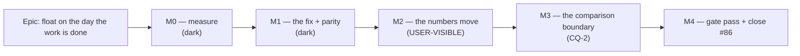

# Implementation Plan: The inherited plan calendar's day factor

- **Feature spec:** [`./feature-spec.md`](./feature-spec.md) — **Approved** (2026-09-13; CQ-1 the
  two-map design, CQ-2 accept-and-document).
- **Status:** Approved
- **Owner:** unassigned
- **Register row:** `docs/TECH_DEBT.md` #86 — the second of its two mechanisms
- **ADR:** required, filed at M2. Next free number is **ADR-0139** (`docs/adr/` ends at 0138).

---

## Breakdown

### Epic

**Float measured on the day the work is done** — close `docs/TECH_DEBT.md` #86's second mechanism, so
that an activity inheriting its plan's calendar reports float on that calendar's working day instead
of on a 24-hour one. Roadmap theme: none; debt-driven, ADR-0105-triggered.

**The whole diff is `apps/api`.** `apps/web` is untouched (spec §3.1) — the client already resolves
`activity → plan` and is right today.

---

## Milestone M0 — Measure before deciding (ships dark)

**Outcome:** two numbers exist that do not exist today — how much of the estate is affected, and what
the fix costs per recalculation.
**Ships dark:** no code path changes; M0 produces measurements and a document.
**Journey:** none — there is no capability to drive. M2 carries the epic's journey (ADR-0081 §2).

> **Feature: M0 evidence**
> **Complexity:** S
> **Dependencies:** none
> **Risks:** a measurement taken from the wrong database reads as an answer → each task states where
> it must be taken and refuses to substitute
> **Testing requirements:** none — this milestone writes `m0-measurements.md`, not code

##### Task M0-T1 — Count the affected population against the **deployed** database

- **Description:** one query. How many plans sit on a calendar whose `hours_per_day_minutes ≠ 1440`,
  how many active activities are on those plans, and how many of those have
  `calendar_id IS NULL`. The last number is the population whose float is wrong.
- **Complexity:** S
- **Dependencies:** none
- **Risks:** taken from a test database it is structurally zero and **worse than no number** — the
  sibling epic's M0-T3 records exactly this refusal and is still owed for the same reason. → The task
  states that a zero from an empty database is not the zero being asked for, and is not takeable
  from a container.
- **Testing:** n/a
- **Development steps:**
  1. Run the three counts against the deployed database.
  2. Cross-check the imported-plan claim (spec §1.4.3): how many of those plans were created by
     interchange. A P6 calendar is eight hours, so an import is affected wholesale.
  3. Record in `m0-measurements.md` with the date, the host and the exact SQL.
  4. If the count is **zero**, say so loudly — it is the strongest argument for the smallest possible
     change and must not be left unstated.

##### Task M0-T2 — Cost the extra calendar read, with the falsification condition committed first

- **Description:** the fix adds at most **one** id to an existing `id = ANY(...)`
  (`calendar.repository.ts:374-384`) — the plan's own calendar, already read by `resolveCalendar` in
  the same transaction (`schedule.service.ts:1321`). Establish that, rather than asserting it.
- **Complexity:** S
- **Dependencies:** none
- **Risks:** a frame-level number from a container is untrustworthy (ADR-0127 D8) → this is a
  **per-statement database timing**, a different quantity, taken on the seeded 2,000-activity plan.
  If it still cannot be taken honestly, record it as owed and rely on the structural argument.
- **Testing:** n/a
- **Development steps:**
  1. **Commit the falsification condition before the run:** > 5 ms p95 added to `recalculate` at
     2,000 activities, **or** any growth that is not O(1) in activity count, fails the design.
  2. Measure before and after on the same plan, both limbs, with the no-change spread stated.
  3. Record the non-vacuity control: the plan must actually contain inheriting activities, or the
     run measures nothing.

---

## Milestone M1 — The fix, and the proof that the engine did not move (ships dark)

**Outcome:** the factor is resolved correctly, and `computeSchedule`'s arguments are provably
unchanged.
**Ships dark by construction:** M1 is inert until a plan is recalculated, and nothing in M1 changes
what any screen renders on a plan that has not been. It is sequenced separately from M2 so that the
parity evidence is reviewable on its own, before any number moves.
**Journey:** none — M2's.

> **Feature: one resolver, two named maps**
> **Complexity:** M
> **Dependencies:** CQ-1 answered
> **Risks:** the parity claim is argued rather than established → M1-T2 is a structural assertion,
> verified red
> **Testing requirements:** structural parity spec, structural anti-recurrence spec, unit cases for
> the four fallback shapes, conformance + goldens passing **unedited**

##### Task M1-T1 — Build `dayFactorCalIdByActivity` and hand it to `resolveDayFactors`

- **Description:** spec §4.2. `buildEngineGraph` gains a second map built by the **existing**
  `schedulingCalendarId` (`apps/api/src/modules/activities/day-factor.ts:45-62`).
  `calIdByActivity` keeps its `null`-means-inherit sentinel and its role as the **port** map.
  `resolveDayFactors`' body does not change.
- **Complexity:** S
- **Dependencies:** CQ-1
- **Risks:** the new map is built with a locally re-written rule instead of the shared resolver,
  re-creating the two-spellings defect that produced #86 → M1-T3 asserts the equivalence
- **Testing:** unit cases in `schedule.service.spec.ts` for all four shapes — inherit with a plan
  calendar, inherit with none, own calendar, driving-resource calendar (including a driver whose
  resource calendar is `null`, spec §2 edge cases)
- **Development steps:**
  1. Import `schedulingCalendarId` into `schedule.service.ts` (it already imports from that module).
  2. Build `dayFactorCalIdByActivity` beside `calIdByActivity`, from `activityRows` +
     `drivingResourceCalByActivity` + `plan.calendarId`.
  3. Return it from `buildEngineGraph`; pass it at `schedule.service.ts:457`.
  4. **Correct two docblocks that are false today:** `:1301-1303` and `:1547-1551` both call
     `calIdByActivity` "the day↔minute factor's source". That claim is what misled.
  5. Rewrite `resolveDayFactors`' docblock (`:338-357`) — the "FALSE when the plan has a calendar"
     paragraph becomes the invariant it always meant, and "left as characterisation, deliberately"
     is replaced by the decision and the ADR number.
  6. Correct `use-float-paths-panel.ts:125-128`'s comment, which asserts the server "already converts
     that way" — false today, true after this task. Comment only; no behaviour change in `apps/web`.

##### Task M1-T2 — Prove the engine's input is unchanged

- **Description:** the parity gate. Spec §3.3 — this is **not** ADR-0125 D1's strong form (the engine
  _is_ called) and **not** ADR-0116 D7's weaker one (this path writes). The claim is that
  `computeSchedule`'s arguments are byte-identical.
- **Complexity:** M
- **Dependencies:** M1-T1
- **Risks:** a gate that passes for the wrong reason — the fourth-most-common failure in this
  register → **verified red first**, against a deliberate mutation that routes the new map into
  `portFor`
- **Testing:** the new structural spec; ADR-0034 conformance + goldens run and pass **unedited** (an
  edited golden is the failure this gate exists to catch)
- **Development steps:**
  1. Write a spec that captures `computeSchedule`'s three arguments for a plan with a mix of
     inheriting, own-calendar and driven activities, and asserts them against the pre-fix capture.
  2. Verify it **red** by mutating `portFor`'s collapse, then again by feeding the factor map to
     `toEngineActivity`.
  3. Run the conformance + golden suites; assert in the commit message that **no golden file was
     touched**.
  4. Add the negative regression: a 24-hour-calendar plan and a no-calendar plan produce byte-
     identical writes. Verified red against a fix that changes them.

##### Task M1-T3 — The anti-recurrence assertion

- **Description:** pin the two properties that keep the defect closed: (i) for every activity, the
  factor map's value equals `schedulingCalendarId(...)`; (ii) `resolveDayFactors` is never handed the
  port map.
- **Complexity:** S
- **Dependencies:** M1-T1
- **Risks:** an assertion that cannot fail — the shape #86's own M5 census had, and the shape
  ADR-0138's sweep found nine times → each limb verified red against a named mutation, and the spec
  records which mutation
- **Testing:** the structural spec itself
- **Development steps:**
  1. Assert the equivalence `schedulingCalendarId(...) ≡ effectiveOf(row).calId ?? plan.calendarId`
     over a fixture covering all four shapes.
  2. Assert the call-site wiring — `resolveDayFactors` receives `dayFactorCalIdByActivity`, and
     `portFor` is never called with a value from it.
  3. Verify red by swapping the two maps at the call site.

---

## Milestone M2 — The numbers move (USER-VISIBLE)

**Outcome:** on a plan whose calendar is not a 24-hour one, float finally reads in the same days as
the duration beside it.

**Entry point — it adds no control, and corrects a number on five existing surfaces:**

| Surface          | Where                             | Accessible name                                                                                                    |
| ---------------- | --------------------------------- | ------------------------------------------------------------------------------------------------------------------ |
| Activities table | plan workspace, Activities panel  | the **Float** column                                                                                               |
| TSLD canvas      | plan workspace                    | the GPM **float tails** lens (`View ▾ ▸ …`) — the tail's drawn length is `totalFloat` (`to-render-model.ts:72-74`) |
| Schedule health  | plan workspace, Health check dock | metrics **6** (high float) and **7** (negative float)                                                              |
| Share link       | `/share` guest view               | the guest activity read                                                                                            |
| Float paths      | plan workspace, Float paths panel | already correct — it starts **agreeing** with the table                                                            |

The command a planner presses is **Recalculate** (or any structural edit, which auto-recalculates
since ADR-0032 M3). There is no new control and no prompt.

**Journey:** extend **`apps/web/e2e-sub-day/`** (`pnpm --filter @repo/web test:e2e:sub-day`) — it
already builds a plan on a **480-minute** calendar with the pen enforced and asserts values read back
from the API rather than from the DOM under test (`e2e-sub-day/support.ts:30-47`). **Deliberately not
a new Playwright config:** a new config is an ADR-0105 trigger _and_ an ADR-0138 `check:e2e-roster`
change, and this fixture is the one the epic needs.

> **Feature: the corrected read-out**
> **Complexity:** M
> **Dependencies:** M1
> **Risks:** a test that recalculates and reads back through the same API is self-consistent by
> construction — the property that hid #86 for a year → every case keeps an **explicit twin** control
> (spec §3.9)
> **Testing requirements:** the characterisation inversion, API e2e across four surfaces, the web
> journey step

##### Task M2-T1 — Invert the characterisation case

- **Description:** `apps/api/test/resource-dependent-day-factor.e2e-spec.ts:681-743` currently asserts
  `inh.totalFloat` **2** against `exp.totalFloat` **5**. After M1 both read 5.
- **Complexity:** S
- **Dependencies:** M1
- **Risks:** edited to green rather than inverted, losing the evidence → #86's own precedent applies:
  **keep both numbers side by side**, because the pair is the evidence. Its docblock's three
  pre-written outcomes stay; a note records which one landed and when.
- **Testing:** the case itself; run it red against `api-v0.62.0` first to confirm it still
  discriminates
- **Development steps:**
  1. Re-run against the released code and record that it passes (the defect is still live).
  2. Invert the assertion; keep `expect(2)` beside `expect(5)` as the recorded before-state.
  3. Rewrite the docblock's "Characterisation, not desired behaviour" framing — it promised the
     inversion; say that it happened.
  4. Do the same for the sibling case at `:615-653` if its `Task twin` float assertion moves.

##### Task M2-T2 — API e2e across the four server surfaces

- **Description:** on one affected plan, prove the member read, the guest read, the health report and
  the revision comparison all report the corrected number — and that the twin control still
  discriminates.
- **Complexity:** M
- **Dependencies:** M2-T1
- **Risks:** a case that passes because the fixture has no float at all (the ADR-0093 trap) → assert
  `totalFloat > 0` on both twins **first**, as the existing case does (`:728-729`)
- **Testing:** these cases
- **Development steps:**
  1. Member read: `totalFloat` and `durationDays` describe one span.
  2. Guest read: the guest's `totalFloat` equals the member's for the same activity; and nothing
     outside the fixed `SCHEDULE_READ` scope is disclosed.
  3. Health report: metric 6 counts an activity holding 44 working days of float on an eight-hour
     plan. Verify red — today it reads ~14 and is missed.
  4. Health report: metrics 8, 12, 13 are **unchanged** (they were already on the right factor).
  5. Metric 7: a sub-day negative float that rounds to `-0` at 1440 and to `-1` at 480 (spec §1.5).

##### Task M2-T3 — The journey step

- **Description:** one step in `e2e-sub-day` that drives the real product: an eight-hour plan, the pen
  taken, an activity with float, and the table's Float column read against the Duration column.
- **Complexity:** S
- **Dependencies:** M2-T1
- **Risks:** a locator tied to copy rather than to role+name → locate by column header role and
  accessible name, per the standing rule in `docs/TECH_DEBT.md` #133's neighbours
- **Testing:** the step
- **Development steps:**
  1. Seed via the API; recalculate through the UI control the milestone names.
  2. Assert the Float column and the Duration column describe one span.
  3. Run the whole `e2e-sub-day` suite, not only the new step.

##### Task M2-T4 — Documentation and the changeset

- **Description:** `docs/API.md` + the OpenAPI property descriptions for `totalFloat`, `freeFloat`,
  `visualDriftDays` — which day they are measured in, and that the value changes on the next
  recalculation of an affected plan. `docs/DATABASE.md` for the three columns' stated unit.
- **Complexity:** S
- **Dependencies:** M2-T1
- **Risks:** the changeset omitted, so no image carries the behaviour → the ADR-0130 M4 lesson;
  `apps/api` **minor**, `apps/web` none
- **Testing:** `pnpm check:doc-links`
- **Development steps:** 1. Update the three documents. 2. `pnpm changeset`.

---

## Milestone M3 — The comparison boundary (shape decided by CQ-2)

**Outcome:** a planner comparing across the fix boundary is not shown a float change nobody made —
or, under (A), is told plainly that one is possible and why.
**Entry point:** under **(A)**, none — M3 is documentation and a debt row, and **ships dark**. Under
**(B)** or **(C)** it is user-visible in the revision-compare dock (the Changes list's `CRITICALITY`
rows), and the journey step below becomes mandatory.
**Journey:** under (B)/(C), a step in the revision-compare journey asserting the row's presence or
absence across a pre-fix/post-fix pair.

> **Feature: the boundary, answered**
> **Complexity:** S under (A) · S–M under (B) · **L under (C)**
> **Dependencies:** CQ-2 answered; M2
> **Risks:** an ADR that records the decision and code that does not, or the reverse → the task list
> below is written per answer so the two cannot diverge
> **Testing requirements:** per answer

##### Task M3-T1(A) — Accept, document, and file the residual _(if CQ-2 = A)_

- **Description:** change no behaviour. Record the boundary where a reader will meet it.
- **Complexity:** S
- **Dependencies:** CQ-2
- **Risks:** the note goes only in the ADR, where the next reader of `revision-changes.ts` will not
  see it → it goes in **both**, and the debt row carries the trigger
- **Testing:** none (no behaviour change) — but assert that `entered`/`left` are unaffected, so the
  claim in the ADR is executable rather than argued
- **Development steps:**
  1. Extend `revision-changes.ts`'s `CRITICALITY` case comment, beside the `REDURATIONED` comment
     that already records this exact hazard for duration and solves it by comparing minutes.
  2. Note the same in `variance.ts`'s `totalFloatVariance`.
  3. File the debt row: _compare float in minutes on both sides_ — which needs float minutes frozen —
     with the trigger **a planner reports a float change nobody made**, and with spec §3.6's three
     findings, including the two pre-existing routes that reach it without this epic.
  4. Add a test asserting `entered`/`left`/`remainedCritical` do not move across a changed float,
     verified red against a delta that keyed on `totalFloatDays`.

##### Task M3-T1(B) — Narrow the predicate _(if CQ-2 = B)_

- **Description:** `revision-changes.ts:217` drops its float half.
- **Complexity:** S · **Dependencies:** CQ-2
- **Risks:** loses ADR-0126's "got tighter without leaving the critical path" signal, and does not
  help `variance.ts` at all → both stated in the ADR as accepted costs
- **Testing:** the change-class suite, with a case pinning that a float-only movement no longer
  reports; verified red
- **Development steps:** 1. Narrow the predicate and its label. 2. Record the loss in the ADR. 3. State what `variance.ts` still does.

##### Task M3-T1(C) — Freeze a float-frame marker _(if CQ-2 = C)_

- **Description:** a nullable discriminator on `baselines` plus a three-valued
  `MATCH`/`DIFFERS`/`UNKNOWN` verdict, the ADR-0125 shape.
- **Complexity:** **L** · **Dependencies:** CQ-2
- **Risks:** a `DEFAULT` manufactures a frame nothing ran under — ADR-0126's `lane_index` argument
  verbatim → **no DEFAULT**, `NULL` means "unknowable", and `?? 'MATCH'` is forbidden by name
- **Testing:** migration applied against a **populated** table; DTO totality; the comparison's
  three-valued rendering; the verdict never coalesced
- **Development steps:**
  1. **`database-architect`, unconditionally and first (§19.3).** If it returns nothing or fails,
     **re-run it** — an unavailable agent is a reason to wait, never to proceed.
  2. Design the column and its migration to the agent's output; do not hand-write it.
  3. Write the frame at capture, inside the existing lock, from the same place the criticality rule
     is written (`baselines.service.ts:191-218`).
  4. Thread the verdict to the DTO and the dock; never coalesce it.
  5. Record that the general case (pre-existing re-framings, spec §3.6 finding 2) is **still** open.

---

## Milestone M4 — Gate pass, ADR, and close #86

**Outcome:** the epic is reviewed by specialists, the ADR is filed, and #86 closes.
**Ships dark:** no behaviour changes at M4 beyond folded review findings.
**Journey:** the suites M2 and M3 added, run whole.

> **Feature: the close**
> **Complexity:** M
> **Dependencies:** M2, M3
> **Risks:** #86 marked fixed while one of its two mechanisms is untested → the close cites the
> inverted characterisation case by file and line, not the milestone list
> **Testing requirements:** full pre-push gate + `scripts/e2e-local.sh api` + `web:sub-day`

##### Task M4-T1 — Specialist reviews over the combined diff

- **Description:** the deferred gate pass. **api-reviewer** (the three fields' documented unit and
  the OpenAPI descriptions), **backend-performance-reviewer** (re-derive M0-T2's number from the
  shipped code rather than trusting it), **security-reviewer** (the guest read's scope is unchanged),
  **test-engineer** (do the new assertions discriminate?), and **database-architect** only if CQ-2 = C.
- **Complexity:** M · **Dependencies:** M3
- **Risks:** findings folded without regression tests → each fix carries one, **verified red first**
- **Testing:** the regression tests the reviews produce
- **Development steps:** 1. Run the reviews. 2. Fold blocking findings with tests. 3. File
  non-blocking findings as a numbered debt row with reasons.

##### Task M4-T2 — File ADR-0139

- **Description:** the decision record. Spec §4.3 lists what it must carry.
- **Complexity:** M · **Dependencies:** M4-T1
- **Risks:** filed and not registered — the ADR-0071 failure, which `check:adr-coverage` **cannot**
  see for `CLAUDE.md` (`docs/TECH_DEBT.md` #291) → the same commit adds the entry to `docs/adr/README.md`
  **and** to `CLAUDE.md` §16, and re-reads both
- **Testing:** `pnpm check:adr-coverage`, `pnpm check:counts`, `pnpm check:spec-status`
- **Development steps:**
  1. Write ADR-0139, recording: the decision; that reported float **increases**; the exact parity
     sentence and why it is neither ADR-0125 D1's nor ADR-0116 D7's; the ADR-0068 §4 amendment;
     CQ-2's answer and the comparison boundary; and that `database-architect` was **not** engaged
     because there is nothing to design (or was, under C).
  2. Set both spec headers to `Accepted — shipped (ADR-0139)` **in the same change** (ADR-0131 — a
     header is nobody's step unless it is this one).
  3. Register it in `docs/adr/README.md` and `CLAUDE.md` §16.

##### Task M4-T3 — Close `docs/TECH_DEBT.md` #86

- **Description:** both mechanisms are now fixed. Close the row and ledger it.
- **Complexity:** S · **Dependencies:** M4-T2
- **Risks:** the row's status vocabulary — `check:debt-status` has no `closed` token
  (ADR-0138's own closing finding) → delete the row and ledger it in the Closed-numbers ledger, with
  the entry pointing at the inverted test
- **Testing:** `pnpm check:debt-status`
- **Development steps:**
  1. Close #86, citing `resource-dependent-day-factor.e2e-spec.ts:681-743` by line.
  2. Leave M0-T3/M0-T4 of the **sibling** epic recorded as still owed if they still are — do not let
     this row's close absorb them.
  3. Record the M3(A) residual as its own numbered row.

---

## Sequencing & slices

Four slices, each keeping `main` releasable:

1. **M0** — documents only. Releasable trivially.
2. **M1** — inert until a recalculation, and byte-identical on 24h-calendar and no-calendar plans.
   Releasable; reviewable on its parity evidence alone, which is the reason it is not merged with M2.
3. **M2** — the numbers move. The first slice a planner can see. Carries the journey.
4. **M3 + M4** — the boundary, the ADR, the close.

**No feature flag.** ADR-0088 D1: a `VITE_` constant is inlined at build time, every published image
carries every flag at its default, and an operator cannot switch one off — so a flag would be a
second code path maintained forever, not a rollback. It is additionally the wrong instrument here:
this is a **server-side** change, which a client build-time constant structurally cannot gate
(ADR-0060 M0 / ADR-0074). **The rollback is a commit boundary**, and M1/M2 are separate commits for
exactly that reason.

## Definition of Done (per task)

Each task's PR satisfies the Feature Completion Criteria in [`docs/PROCESS.md`](../../PROCESS.md).
Two obligations are called out because this epic touches `apps/api`:

- **`pnpm prepush` — one command**, not its parts. `scripts/prepush.sh` derives the gate list from
  `package.json` precisely so nobody keeps one in their head (CLAUDE.md §19.8).
- **`scripts/e2e-local.sh api`** on every `apps/api` change, and **`scripts/e2e-local.sh web:sub-day`**
  for M2-T3. CI is the second opinion, never the first.

## Risks & assumptions (rollup)

| Risk / assumption                                                               | Likelihood                 | Impact                       | Mitigation                                                                                                                  |
| ------------------------------------------------------------------------------- | -------------------------- | ---------------------------- | --------------------------------------------------------------------------------------------------------------------------- |
| The engine's input moves and nothing reports it                                 | low                        | **high**                     | M1-T2's structural assertion, verified red; conformance + goldens unedited                                                  |
| The parity sentence is mis-cited as ADR-0125 D1's strong form                   | med                        | med                          | Spec §3.3 names the applicable form and forbids the other two                                                               |
| A characterisation suite edited to green instead of inverted                    | med                        | med                          | M2-T1 keeps both numbers; #86's own precedent                                                                               |
| A comparison across the boundary reports a phantom float change                 | **high** on affected plans | med                          | CQ-2; under (A) it is documented in the ADR, in two code sites and in a debt row with a trigger                             |
| DCMA metric 6 flips PASS → FAIL on a plan somebody already reported             | med                        | med                          | Accepted (spec §1.5) — it un-hides a real finding, the inverse of ADR-0116's prohibition                                    |
| The population turns out to be zero on the deployed database                    | **unknown until M0-T1**    | changes priority, not design | M0-T1 is one query and runs first. A zero is the strongest argument for the smallest change and must be stated              |
| A dormant plan keeps the wrong number indefinitely                              | high                       | low                          | Accepted (spec §1.6) — it is the number it already has, and auto-recalculation corrects it on first edit                    |
| A future call site reaches for the port map again                               | med                        | med                          | M1-T3's anti-recurrence assertion, verified red                                                                             |
| The ADR is filed and not registered in `CLAUDE.md`                              | med                        | low                          | M4-T2 does both in one commit; `check:adr-coverage` cannot see `CLAUDE.md` (#291)                                           |
| **Assumption:** `schedulingCalendarId ≡ effectiveOf().calId ?? plan.calendarId` | —                          | high if wrong                | Established by reading both (`day-factor.ts:58-62` vs `schedule.service.ts:1346-1352`) **and** asserted executably by M1-T3 |
| **Assumption:** `apps/web` needs no change                                      | —                          | med if wrong                 | Established at `effective-hours-per-day.ts:124-127`; M2-T3's journey drives the real client and would fail if it were wrong |
