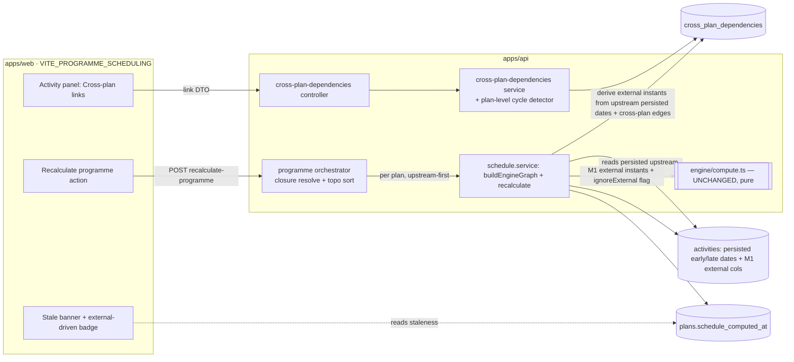
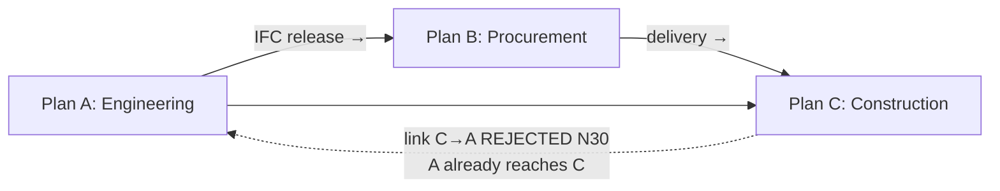
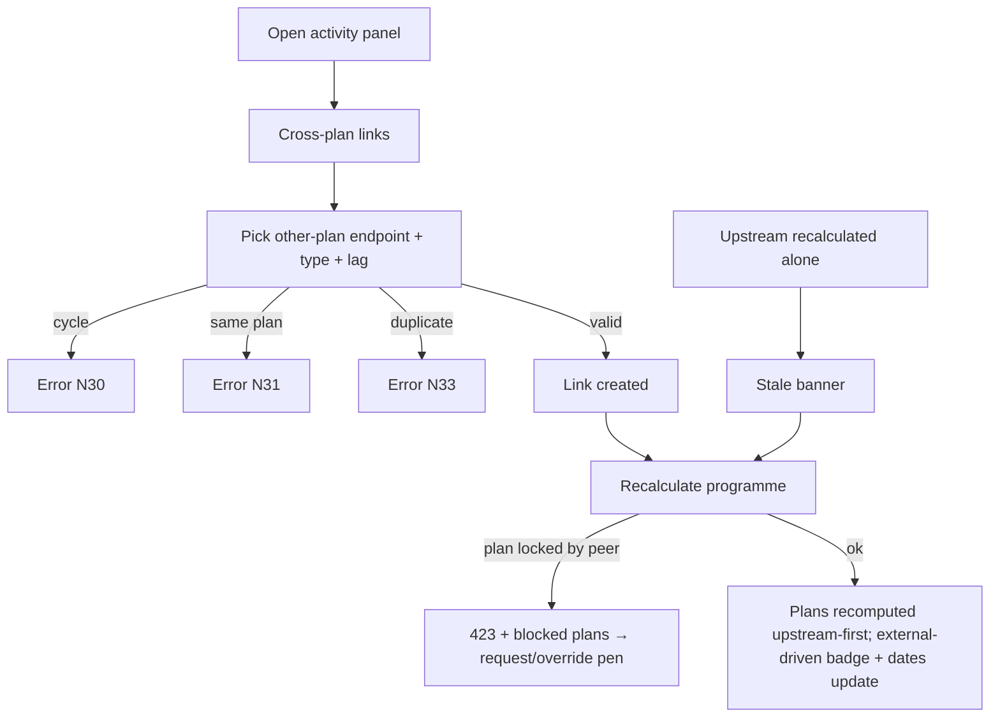

# Feature Spec: Inter-project scheduling — Milestone 2 (live cross-plan / programme solve)

- **Status:** Draft (awaiting approval — NO application code written)
- **Author(s):** feature-analyst (Product Owner / Solution Architect / Technical Lead hats)
- **Date:** 2026-07-18
- **Tracking issue / epic:** #TBD (Epic: Programme / multi-plan scheduling — the M1 epic)
- **Roadmap link:** Engine Conformance & Validation Framework → programme / multi-plan scheduling (the
  live cross-plan solve deferred by ADR-0043 M1)
- **Related ADR(s):** **ADR-0045 (NEW, drafted with this spec)**; amends ADR-0021 (DAG), ADR-0022
  (execution), ADR-0043 (M1); new ADR-0035 §30.5–§30.8 + N30–N33; builds on ADR-0012/0016 (authz/tenancy),
  ADR-0028 (edit-lock), ADR-0037 (instant axis), ADR-0034 (conformance).

> **Scope note.** This designs **Milestone 2** of inter-project scheduling: a **live** cross-plan
> dependency whose external bounds are **derived** from a linked plan's computed schedule (superseding
> M1's hand-entered static instants), a **cross-plan (plan-level) DAG invariant**, cross-plan
> **authorisation**, **staleness** tracking, and a synchronous **programme-level recalc** that solves a
> set of interdependent plans in dependency order. It **reuses M1's engine seam unchanged** — the pure
> `computeSchedule` (ADR-0022/0037) is not touched; all cross-plan orchestration lives in the service /
> programme layer feeding the M1 per-activity external-instant inputs. A background **push**-propagation
> job and an explicit **Programme** entity are explicitly deferred to a later, separately-ADR'd slice.

---

## 1. Business understanding

### Problem

M1 (ADR-0043) let a planner **type in** an imported external early start / late finish on an activity and
toggle "ignore external relationships". That models the _interface_ but not the _live link_: when the
upstream plan re-plans (the vendor slips, the IFC drawing releases later), the downstream date does **not**
move — the planner must notice and re-type it. Real construction programmes are split across many
interdependent plans (engineering → procurement → construction → start-up, plus multiple contractors), and
planners need the downstream schedule to track the upstream one automatically, with a clear picture of what
is gated by whom and what has gone stale. Today there is no first-class relationship across the plan
boundary, no guarantee the programme graph stays acyclic, and no way to recalculate a set of plans together
in the right order.

### Users

- **Planner** (`PLANNER`) — owns one or more plans in a programme; draws a **live cross-plan link** from an
  upstream activity to their activity, runs a **programme recalculate** to bring their plan in line with its
  neighbours, and sees which of their activities are externally driven and whether their schedule is stale.
- **Org Admin** (`ORG_ADMIN`) — the same, plan-wide; owns programme-level policy and can override plan
  edit-locks (ADR-0028) to unblock a programme recalc.
- **Contributor** (`CONTRIBUTOR`) — reports progress; reads cross-plan links and external-driven flags
  (does not create cross-plan links by default).
- **Viewer / External Guest** — read-only; sees cross-plan links, external-driven badges, staleness.
- **The conformance harness** (CI) — a first-class user: feeds a multi-plan fixture through the derivation +
  programme-order logic to assert the cross-plan differential, goldens, and negatives (ADR-0034 three tiers).

### Primary use cases

1. **Create a live cross-plan link** — a planner links an upstream activity (in plan A) to a successor
   activity (in plan B) with a type (FS/SS/FF/SF) and lag, establishing a live dependency across the plan
   boundary.
2. **Programme recalculate** — a planner recalculates plan B's cross-plan **closure**: every upstream plan
   (and B) is recomputed in dependency order, so B's external bounds reflect its upstreams' **current**
   computed dates.
3. **See staleness** — when an upstream plan is recalculated on its own, B is flagged **stale** so the
   planner knows to run a programme recalculate.
4. **Read cross-plan impact** — the planner sees which of B's activities are externally driven (by which
   upstream link) and the resulting float, to escalate a gating interface.
5. **Toggle ignore-external** (M1, unchanged) — dropping external bounds now drops the **derived** cross-plan
   bounds too, so the planner can compare "own logic" vs "gated by the programme".

### User journeys

**Happy path.** A planner on the Construction plan opens the milestone "Absorber Column T-301 Delivered to
Site", opens **Cross-plan links**, and adds a link: predecessor = "T-301 Fabrication Complete" in the
Procurement plan, type FS, lag 10 days. They run **Recalculate programme**. The orchestrator recomputes
Procurement first, then Construction; the milestone's external early start is derived from Procurement's
computed early finish + 10 days, the milestone and its successors move, and the activity shows an
"external-driven" badge naming the upstream link. Later, Procurement re-plans (its finish slips) and is
recalculated on its own; the Construction plan now shows a **stale** banner. The planner runs Recalculate
programme again and the milestone moves out.

**Alternate — later-of / manual floor.** The activity also carries a hand-entered M1 external early start
(a contractual "no earlier than"). The effective bound is the **later** of (derived from the link, manual
column) — the manual floor still applies (ADR-0035 §30.5).

**Alternate — cycle rejected.** A planner tries to link an activity in plan A to one in plan B when plan B
already feeds plan A (any cross-plan path B → … → A). The create is rejected (409
`CROSS_PLAN_CYCLE_DETECTED`) — the plan-level graph must stay acyclic (§30.6).

**Alternate — blocked plan.** A programme recalc needs the pen on every plan it writes; a neighbour is being
edited by someone else. The recalc fails fast (423) listing the blocked plans; the planner requests the pen
(ADR-0028 hand-off) or an Org Admin overrides, then retries.

**Alternate — never-calculated upstream.** An upstream plan in the closure has never been calculated. Its
edges contribute **no** bound (treated as absent), the run proceeds and reports
`crossPlanUpstreamMissingCount` (N32) — never an error.

### Expected outcomes

- Planners model **live** inter-project interfaces; downstream schedules track upstream re-plans on a
  programme recalculate instead of manual re-entry.
- The programme graph is **guaranteed acyclic** (plan-level DAG) and a programme solve is **deterministic
  and terminating**.
- The pure engine and the entire golden/scenario suite are **unchanged** (the parity gate holds by
  construction).
- The cross-plan capability rows + new scenarios flip ⚪ → ✅ on the conformance matrix.

### Success criteria

- A live cross-plan link derives the downstream bound from the upstream's computed dates; a programme
  recalc moves the downstream to match (asserted end-to-end).
- **Cross-plan differential:** on a two-plan fixture, a programme recalc **differs** from recalculating the
  downstream alone (its external bound now reflects the upstream) — the ADR-0034 "must-differ" proof.
- **Parity gate:** a plan with **no** cross-plan edges (and no derived bounds) produces **byte-identical**
  engine input and output; every prior golden/scenario/snapshot is unchanged.
- The plan-level DAG rejects a cross-plan cycle (N30) and a same-plan cross-plan edge (N31); a
  never-calculated upstream warns and proceeds (N32); a duplicate is rejected (N33).
- **Determinism:** two overlapping programme recalcs cannot deadlock (deterministic lock ordering);
  repeated programme recalcs are idempotent on an unchanged programme.
- Staleness is surfaced on the summary and cleared by a programme recalc.
- `pnpm lint && pnpm typecheck && pnpm test` green; per-plan recalc p95 unchanged (engine untouched);
  programme recalc cost ≈ Σ per-plan recalc.

### Open questions

See "Critical questions" at the end — each has a stated default so a non-answer still yields a buildable
plan.

## 2. Functional requirements

### User stories & acceptance criteria

> **US-1** — As a **Planner**, I want to create a **live cross-plan link** from an upstream activity to my
> activity, so that my schedule is gated by the upstream's computed dates.
>
> **Acceptance criteria**
>
> - **Given** two active activities in **different** plans of my org **when** I create a link
>   (type + lag) **then** the link is stored and appears on both activities' cross-plan link lists.
> - **Given** the link would close a **plan-level cycle** **then** it is rejected with 409
>   `CROSS_PLAN_CYCLE_DETECTED` and nothing is stored.
> - **Given** both endpoints are in the **same** plan **then** it is rejected with 422
>   `CROSS_PLAN_SAME_PLAN` (I'm told to use an intra-plan dependency).
> - **Given** an identical link already exists **then** 409 `DUPLICATE_CROSS_PLAN_DEPENDENCY`.

> **US-2** — As a **Planner**, I want a **programme recalculate** so that my plan and its upstreams are
> recomputed in dependency order and my external bounds reflect current upstream dates.
>
> **Acceptance criteria**
>
> - **Given** my plan has upstream cross-plan links **when** I recalculate the programme **then** each plan
>   in the closure is recomputed **upstream-first**, and my activity's external early start equals the
>   later of (upstream's freshly-computed bound, my M1 manual column).
> - **Given** an upstream plan has never been calculated **then** its links contribute no bound, the run
>   proceeds, and `crossPlanUpstreamMissingCount` is reported (N32).
> - **Given** a plan in the set is locked by another editor **then** the run fails fast with 423 listing the
>   blocked plans and writes **nothing** (default policy; see CQ-3).
> - **Given** no cross-plan edges exist **then** a programme recalc equals a single-plan recalc,
>   byte-identical.

> **US-3** — As a **Planner**, I want to see when my plan is **stale** relative to its upstreams, so that I
> know to run a programme recalculate.
>
> **Acceptance criteria**
>
> - **Given** an upstream plan was recalculated after mine **then** my schedule summary reports
>   `scheduleStale: true` and the stale upstream plan ids.
> - **Given** I run a programme recalculate **then** `scheduleStale` clears for my plan.

> **US-4** — As a **Planner/Viewer**, I want to see which activities are **externally driven** and by which
> cross-plan link, so that I can escalate a gating interface.

> **US-5** — As an **Org Admin**, I want to **override** a plan edit-lock so a programme recalculate can
> proceed when a neighbour is left locked (ADR-0028 immediate override).

> **US-6** — As the **conformance harness**, I want to feed a multi-plan fixture through the derivation +
> programme-order logic, so that the cross-plan differential, goldens, and negatives assert the documented
> semantics (ADR-0034 three tiers).

### Workflows

1. **Create cross-plan link:** open activity → **Cross-plan links** → pick the other-plan endpoint
   (searchable, org-scoped) + type + lag → save (validated client + server; cycle/same-plan/duplicate
   checks) → link appears.
2. **Programme recalculate:** plan schedule menu → **Recalculate programme** → server resolves the closure,
   topologically orders plans, asserts the pen per plan, recalculates each in order (upstream-first),
   returns a per-plan summary + programme roll-up.
3. **Staleness:** the schedule summary read computes staleness from `schedule_computed_at` across the
   upstream closure; the UI shows a stale banner + a "Recalculate programme" call to action.

### Edge cases

- **Empty:** no cross-plan edges → programme recalc == single-plan recalc; derivation is inert (parity).
- **Multiple upstream links into one activity:** the effective external early start is the **max** over all
  derived bounds and the manual column (later drives).
- **Both directions on one activity:** an incoming link (early-start bound) and an outgoing link
  (late-finish bound) → both fold into their respective M1 inputs.
- **Diamond / fan-in closure:** plan D depends on B and C which both depend on A → topological order visits
  A once, then B and C, then D; A is not recomputed twice.
- **Never-calculated / empty upstream:** contributes no bound (N32 warn).
- **Cross-plan cycle attempt** (plan-level) → N30 reject; **same-plan** endpoints → N31 reject; **duplicate**
  → N33 reject; **cross-org** endpoints → 404 (anti-IDOR, indistinguishable from missing).
- **Endpoint soft-deleted / plan soft-deleted:** the link is soft-deleted by cascade; a deleted endpoint
  contributes no bound.
- **Concurrency:** cross-plan create is serialised by an **org-scoped** advisory lock (the cross-plan graph
  is org-wide, not plan-scoped); programme recalc takes per-plan advisory locks in **deterministic
  topological order** (deadlock-free) and the pen per plan.
- **Ignore-external (M1):** with the plan option on, **both** derived and manual external bounds drop.

### Permissions

Map to RBAC + org scope (ADR-0012/0016), deny-by-default:

- **Create / delete a cross-plan link** — new permission **`dependency:link_cross_plan`** (Planner +
  Org Admin), org-scoped; both endpoints resolved active in the caller's org (anti-IDOR); the **pen**
  (ADR-0028) asserted on the **successor** plan (default — see CQ-2).
- **Read / list cross-plan links** — reuse `dependency:read`, org-scoped.
- **Programme recalculate** — reuse `schedule:calculate` (Planner + Org Admin); the **pen** asserted on
  **every** plan it writes (default — see CQ-3); Org Admin may override locks (ADR-0028).
- **Read staleness / external-driven flags** — reuse `schedule:read`.

### Validation rules (shared client ↔ server)

- Cross-plan link: `predecessorActivityId`, `successorActivityId` (both required, **different** plans, same
  org), `type` (FS/SS/FF/SF, default FS), `lagDays` (signed, day-denominated public API; stored minutes —
  ADR-0036 §7), `lagCalendar` (default `PROJECT_DEFAULT`). Same-plan ⇒ 422 (N31).
- No cross-org endpoints (rejected as 404). No self-activity (implied by different-plan rule).
- Programme recalc: no body; the target plan id is the path param; the closure is server-derived.

### Error scenarios

| Scenario                                             | Detection                   | User-facing result                                | Status  |
| ---------------------------------------------------- | --------------------------- | ------------------------------------------------- | ------- |
| Not a member of the org / cross-org endpoint         | authz + anti-IDOR load      | friendly not-found / forbidden                    | 404/403 |
| Lacks `dependency:link_cross_plan`                   | RBAC check                  | forbidden                                         | 403     |
| Cross-plan edge closes a plan-level cycle (N30)      | plan-level cycle walk       | inline error `CROSS_PLAN_CYCLE_DETECTED`          | 409     |
| Both endpoints in the same plan (N31)                | service check               | inline error `CROSS_PLAN_SAME_PLAN`               | 422     |
| Duplicate cross-plan link (N33)                      | partial-unique index        | inline error `DUPLICATE_CROSS_PLAN_DEPENDENCY`    | 409     |
| Programme recalc: a plan is locked by another editor | pen assertion (per plan)    | 423 `PLAN_EDIT_LOCK_HELD` + blocked plan ids      | 423     |
| Programme recalc: upstream never calculated (N32)    | derivation (soft)           | run proceeds; `crossPlanUpstreamMissingCount` > 0 | 200     |
| Stale downstream after single-plan recalc            | read-time freshness compare | `scheduleStale: true` + stale upstream ids        | 200     |
| Residual programme cycle (invariant breach)          | topo sort fails             | opaque alarm-worthy 500 (should be unreachable)   | 500     |

## 3. Technical analysis

| Area           | Impact                                       | Notes                                                                                                                                                                                                                                                                                                                                                     |
| -------------- | -------------------------------------------- | --------------------------------------------------------------------------------------------------------------------------------------------------------------------------------------------------------------------------------------------------------------------------------------------------------------------------------------------------------- |
| Frontend       | med (flag-gated `VITE_PROGRAMME_SCHEDULING`) | A **Cross-plan links** section in the activity panel (other-plan endpoint picker + type/lag), a **Recalculate programme** action + progress/result surface, a **stale** banner, and an external-driven badge that names the upstream link. Reuse the existing dependency-editor, scheduling-option, and badge primitives; no new design-system primitive. |
| Backend        | high                                         | A new `cross-plan-dependencies` module (controller → service → repository) mirroring the dependencies module; a **plan-level** cycle detector; a **programme orchestrator** (closure resolve + topo sort + per-plan sequential recalc) extending `ScheduleService`; derivation wired into `buildEngineGraph`. The pure engine is **unchanged**.           |
| Database       | med                                          | New `cross_plan_dependencies` table (org-scoped, two plan ids, FS/SS/FF/SF, lag, soft-delete/audit/version, partial-unique on (pred, succ, type)); a `plans.schedule_computed_at TIMESTAMPTZ NULL` freshness cursor. Additive, no backfill. **database-architect pass required BEFORE the migration.**                                                    |
| API            | med                                          | New endpoints: cross-plan link CRUD (create/list/delete) and `POST …/schedule/recalculate-programme`; the schedule summary gains `scheduleStale` + stale upstream ids + `crossPlanUpstreamMissingCount`. Standard `{ data }/{ error }` envelopes; OpenAPI + `docs/API.md`.                                                                                |
| Security       | high                                         | A cross-plan edge has **two** resource endpoints — anti-IDOR must load **both** active in the caller's org and reject cross-org; new `dependency:link_cross_plan`; the pen interaction across plans; **security-reviewer** required.                                                                                                                      |
| Performance    | med                                          | Derivation is O(cross-plan edges) reading persisted dates already loaded per plan; the plan-level cycle walk/topo sort is bounded by **plan** count (small). Programme recalc cost ≈ Σ per-plan recalc; no new engine pass. Index the two plan ids + the (pred, succ, type) unique. **backend-performance-reviewer** for the closure loads.               |
| Infrastructure | none in M2 (no queue/worker — push deferred) | A background push job (ADR-0009) is the deferred next slice.                                                                                                                                                                                                                                                                                              |
| Observability  | med                                          | Recalc log gains programme fields: plan count in the closure, topo order, per-plan durations, `crossPlanUpstreamMissingCount`, blocked plans on a 423. Staleness surfaced on the summary.                                                                                                                                                                 |
| Testing        | high                                         | Structural gate (types/coverage), plan-level cycle-detector unit tests, derivation unit + parity tests, programme-order tests (diamond, missing upstream, determinism/deadlock-free), API/Supertest (authz/IDOR/cycle/duplicate/423), conformance cross-plan differential + goldens + N30–N33, e2e (flag-gated).                                          |

### Dependencies

- **Prerequisites (all landed):** M1 (ADR-0043) engine seam + external columns; ADR-0021 cycle-walk pattern;
  ADR-0022 single-plan recalc transaction + plan advisory lock; ADR-0028 pen (`assertHoldsPen`);
  ADR-0037 instant axis; the conformance harness + a multi-plan fixture (new).
- **Must land first within this feature:** ADR-0045 + §30.5–§30.8 (semantics) before the behaviour; the
  **cross-plan DAG invariant** and the **derivation + parity gate** before the **programme recalc**
  (sequencing intent).
- **Affected features:** the schedule summary read (adds staleness), the recalc log, the activity panel.
- **Third parties:** none.

## 4. Solution design

### Architecture overview



### Data flow — programme recalculate

```mermaid
sequenceDiagram
  participant U as Planner
  participant PO as Programme orchestrator
  participant XS as Cross-plan repo
  participant SS as ScheduleService (per plan)
  participant ENG as computeSchedule (pure, unchanged)
  U->>PO: POST plans/:planId/schedule/recalculate-programme (schedule:calculate)
  PO->>XS: load cross-plan edges; resolve upstream closure of :planId
  PO->>PO: plan-level topological sort (deadlock-free deterministic order)
  loop each plan, upstream-first
    PO->>SS: recalculate(plan) — existing ADR-0022 txn
    Note over SS: advisory lock (topo order) + assertHoldsPen(plan)
    SS->>XS: incoming/outgoing cross-plan edges for plan
    SS->>SS: derive externalEarlyStart = max(derived from upstream persisted dates, M1 col)<br/>externalLateFinish = min(derived, M1 col)
    SS->>ENG: EngineActivity.external* (derived) + ignoreExternalRelationships
    ENG-->>SS: results (+ externalDrivenCount) — signature unchanged
    SS->>SS: write engine columns; set schedule_computed_at = now()
  end
  PO-->>U: per-plan summaries + programme roll-up (+ crossPlanUpstreamMissingCount)
```

### Cross-plan DAG invariant (plan-level)



The **nodes are plans**, edges are cross-plan dependencies; the graph must stay acyclic. With ADR-0021's
per-plan activity DAG this makes the union graph acyclic and the programme solve a single topological pass.

### User flow



### Database changes

**database-architect pass required before the migration.** Additive, no backfill:

- **New `cross_plan_dependencies`** (org-scoped): `id` (uuid v7 PK), `organization_id` (FK RESTRICT),
  `predecessor_id` + `successor_id` (Activity FKs RESTRICT), `predecessor_plan_id` + `successor_plan_id`
  (Plan FKs RESTRICT, denormalised for scoping/ordering), `type` (`DependencyType` default FS),
  `lag_minutes` (signed Int, range CHECK as `dependencies`), `lag_calendar` (`LagCalendarSource` default
  `PROJECT_DEFAULT`), plus the house housekeeping (`version`, `created_at`/`updated_at`, `created_by`/
  `updated_by`, `deleted_at`, `delete_batch_id`).
  - **Partial-unique** `(predecessor_id, successor_id, type) WHERE deleted_at IS NULL` → N33 duplicate.
  - **CHECK** `predecessor_plan_id <> successor_plan_id` (defence-in-depth for N31; primary check is the
    service).
  - Indexes: `(predecessor_id)`, `(successor_id)` (direction lists + cycle-walk adjacency), `(organization_id)`
    (FK/IDOR), and `(successor_plan_id)` / `(predecessor_plan_id)` for the per-plan derivation loads.
- **New `plans.schedule_computed_at TIMESTAMPTZ NULL`** — the freshness cursor for staleness (§30.7); NULL =
  never calculated. Set by the engine-owned write path (does not touch `version`/`updated_at`, mirroring
  ADR-0022). Single-row column, no index needed (read with the plan / per closure).

Separate table (not reusing `dependencies`) so ADR-0021's single-`plan_id` invariant and the per-plan
adjacency/engine loads stay byte-identical. No engine-owned schema on the new table (derivation is
transient); the _effect_ is observed via the existing per-activity `external_driven` flag (M1).

### API changes

Standard envelopes; OpenAPI + `docs/API.md`:

- `POST   /organizations/:orgSlug/plans/:planId/activities/:activityId/cross-plan-links` (or a plan-scoped
  variant — see CQ-1) — create a link (`dependency:link_cross_plan`). Body: other-plan endpoint id + role
  (predecessor/successor), `type`, `lagDays`, `lagCalendar`. Errors: N30 409 / N31 422 / N33 409 / 403 / 404.
- `GET    …/activities/:activityId/cross-plan-links` — list an activity's cross-plan links (both
  directions), paginated (`dependency:read`).
- `DELETE …/cross-plan-links/:id` — soft-delete (`dependency:link_cross_plan` + pen).
- `POST   …/plans/:planId/schedule/recalculate-programme` — programme recalc (`schedule:calculate`).
  Response: `{ plans: PlanScheduleSummary[], programme: { planCount, order, crossPlanUpstreamMissingCount } }`.
  423 with blocked plan ids when a plan is locked (default policy).
- **Schedule summary** (`GET …/schedule/summary`, `recalculate`, `recalculate-programme`) gains
  `scheduleStale: boolean`, `staleUpstreamPlanIds: string[]`, `crossPlanUpstreamMissingCount: number`.

### Component changes

Reuse the design system; flag-gated behind `VITE_PROGRAMME_SCHEDULING` (defaults off until polish):

- **`CrossPlanLinksSection`** in the activity panel — an other-plan endpoint picker (org-scoped, searchable,
  shows plan + activity), type + lag inputs (reuse the dependency-editor form), and the link list with
  delete. Mirror N30/N31/N33 client-side. Runs through **ux/component/accessibility** reviewers.
- **Programme recalc control** — reuse the existing recalc action/menu; add a result panel (per-plan
  summaries, missing-upstream warning) and the 423 blocked-plans handling (link to request/override the pen).
- **Stale banner** — reuse the existing banner/alert component; text + call to action, never colour-only
  (WCAG 2.2 AA).
- **External-driven badge** — reuse M1's badge; on hover/expand, name the driving cross-plan link.

### Implementation approach & alternatives

**Chosen — derive the M1 external instants above an unchanged engine; enforce a plan-level DAG; solve the
programme in topological order with per-plan sequential transactions.** This is the smallest slice that
makes a live cross-plan edge real while keeping `computeSchedule` pure (the parity gate holds by
construction — no cross-plan edge ⇒ identical M1 inputs ⇒ identical output), reusing the accepted M1 §30
clamps verbatim, the ADR-0021 reachability-walk pattern (at plan grain), and the ADR-0022 single-plan
transaction (once per plan). Staleness is **pull** (a read-time freshness compare) so no worker/queue is
needed. See ADR-0045 for the full options analysis (engine-input vs derivation; plan-level vs
activity-level DAG + fixpoint; pull vs push; one-big-txn vs per-plan; implicit vs explicit programme
entity; compose-with vs overwrite the M1 columns).

**Architectural significance / ADR.** Cross-plan edges, a cross-plan acyclicity invariant, cross-plan
authorisation, and a programme-level execution model are architecturally significant → **ADR-0045**
(drafted with this spec), plus ADR-0035 §30.5–§30.8 + N30–N33 (accept-with-milestone).

## 5. Critical questions (defaults stated — non-answers still build)

1. **Where does a cross-plan link "live" in the API/UX — anchored on the successor activity, or a
   plan-level programme editor?** _Default:_ anchor create/list on the **activity** (both directions
   listed), mirroring the intra-plan dependency editor; a plan-level programme view is a later addition.
2. **Which plan's pen guards cross-plan link create/delete?** _Default:_ the **successor** plan (the plan
   whose schedule the edge bounds). _Alternative:_ require the pen on **both** plans (stricter, heavier).
3. **Programme recalc when a plan in the set is locked by another editor — fail-fast or skip-and-report?**
   _Default:_ **fail fast** with 423 + blocked plan ids, writing nothing (atomic-feeling, no partial
   programme). _Alternative:_ recompute the plans you can pen and report the skipped ones (partial, but the
   skipped plans' downstreams stay stale).
4. **Cross-plan acyclicity grain — plan-level DAG (chosen) or activity-level + iterative fixpoint?**
   _Default:_ **plan-level DAG** (deterministic single pass; forbids bidirectional plan interfaces).
   _Confirm_ the bidirectional-interface limitation is acceptable for the first slice.
5. **Staleness propagation — pull + flag (chosen) or a background push recalc (ADR-0009)?** _Default:_
   **pull + `scheduleStale` flag**; the push job is the deferred next slice.

## 6. Links

- Implementation plan: [`./M2-live-cross-plan-solve-implementation-plan.md`](./M2-live-cross-plan-solve-implementation-plan.md)
- ADR (draft): [`docs/adr/0045-live-cross-plan-programme-scheduling.md`](../../adr/0045-live-cross-plan-programme-scheduling.md)
- Milestone 1: [`./feature-spec.md`](./feature-spec.md), [ADR-0043](../../adr/0043-inter-project-external-dates.md)
- Semantics ledger to amend: [`docs/adr/0035-schedulepoint-cpm-semantics.md`](../../adr/0035-schedulepoint-cpm-semantics.md) (new §30.5–§30.8, N30–N33)
- Amended: [ADR-0021](../../adr/0021-dependency-graph-dag-invariant.md), [ADR-0022](../../adr/0022-cpm-execution-and-persistence-model.md)
- Capability matrix / S09 family: [`../engine-conformance-framework/CAPABILITY_MATRIX.md`](../engine-conformance-framework/CAPABILITY_MATRIX.md)
- Engine/service seams: `apps/api/src/modules/schedule/{engine/compute.ts,schedule.service.ts}`; `apps/api/src/modules/dependencies/{cycle-detector,dependencies.service}.ts`
