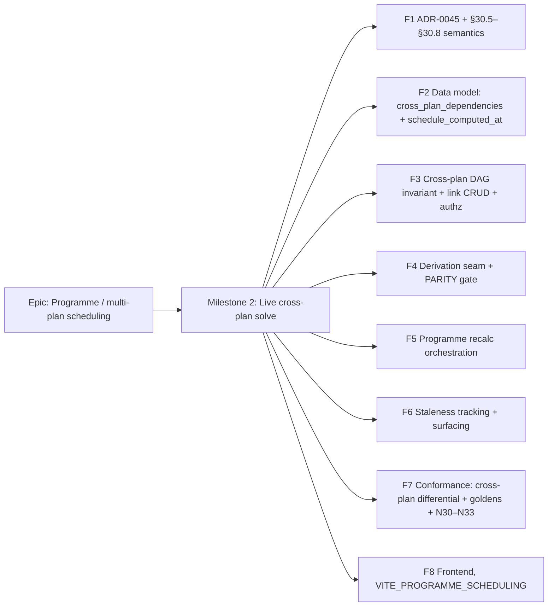

# Implementation Plan: Inter-project scheduling — Milestone 2 (live cross-plan / programme solve)

- **Feature spec:** [`./M2-live-cross-plan-solve-feature-spec.md`](./M2-live-cross-plan-solve-feature-spec.md) (Draft — awaiting approval)
- **ADR:** [`docs/adr/0045-live-cross-plan-programme-scheduling.md`](../../adr/0045-live-cross-plan-programme-scheduling.md) (Proposed) + ADR-0035 §30.5–§30.8 / N30–N33; amends ADR-0021/0022/0043
- **Status:** Draft (NOT approved — no application code until the spec + ADR are accepted)
- **Owner:** Programme / multi-plan scheduling (IPD M2)

## Breakdown

### Epic

**Programme / multi-plan scheduling** — let a plan's schedule track dates that live in other plans, live.
The M1 epic (ADR-0043); this milestone delivers its explicitly-deferred live cross-plan solve.

---

### Milestone 2: Live cross-plan / programme solve (shippable slice)

**Outcome:** a planner can draw a **live** cross-plan link from an upstream activity to their activity and
run a **programme recalculate** that recomputes the plan's cross-plan closure in dependency order, so
downstream bounds track upstream computed dates. The programme graph is guaranteed acyclic (plan-level
DAG); staleness is surfaced; the pure engine and the whole golden suite are **unchanged** (parity gate).

> **Sequencing intent (mandated by the spec):** land **semantics** (F1), then the **data model** (F2), then
> the **cross-plan DAG invariant + link CRUD** (F3) and the **derivation + parity gate** (F4) — these keep
> `main` releasable with zero behaviour change until a link exists and a programme recalc runs — **before**
> the **programme recalc orchestration** (F5). Staleness (F6), conformance (F7), and the flag-gated
> frontend (F8) follow. Each feature is one or a few PRs; `main` stays releasable throughout.

---

#### Feature F1 — ADR-0045 + ADR-0035 §30.5–§30.8 semantics

> **Description:** Finalise ADR-0045 (problem/options/decision/consequences; amends ADR-0021/0022/0043) and
> add ADR-0035 §30.5 (live derivation), §30.6 (plan-level DAG), §30.7 (staleness = pull), §30.8 (programme
> order/determinism) + negatives N30–N33. No code.
> **Complexity:** S
> **Dependencies:** none.
> **Risks:** semantics bind the engine/orchestration → circulate the 5 critical questions with the PO before merge; state defaults so it is buildable without answers.
> **Testing requirements:** doc review; markdown/link check in CI.

##### Task F1.T1 — Accept ADR-0045 + §30.5–§30.8 (≈ one PR)

- **Description:** Finalise the ADR-0045 draft; add the §30 sub-clauses + N30–N33 to the ADR-0035 ledger
  (each accept-with-owning-feature); update `docs/adr/README.md` and CLAUDE.md §16 ADR list.
- **Complexity:** S
- **Dependencies:** none.
- **Risks:** drift from M1 intent → cross-check against ADR-0043 + the M1 external clamp seam.
- **Testing:** doc lint; reviewer sign-off.
- **Development steps:**
  1. Finalise `docs/adr/0045-live-cross-plan-programme-scheduling.md`.
  2. Add §30.5–§30.8 + N30–N33 rows to ADR-0035 (confirm N-numbers are free — highest is N29).
  3. Update ADR README + CLAUDE.md §16; note the ADR-0021/0022/0043 amendments.

---

#### Feature F2 — Data model: `cross_plan_dependencies` + `plans.schedule_computed_at`

> **Description:** The cross-plan edge table (org-scoped, two plan ids, FS/SS/FF/SF, lag, soft-delete/audit/
> version, partial-unique) and the plan freshness cursor. Additive, no backfill.
> **Complexity:** M
> **Dependencies:** F1.
> **Risks:** modelling a second edge table risks divergence from `dependencies` → mirror its housekeeping exactly; DB CHECK/indexes reviewed with database-architect.
> **Testing requirements:** migration up/down; Prisma client typecheck; index/constraint presence assertions.

##### Task F2.T1 — Design with database-architect (≈ design, no code)

- **Description:** Run the **database-architect** agent on the table + column (FKs/RESTRICT, denormalised
  plan ids, partial-unique, plan-id-inequality CHECK, direction + successor-plan indexes,
  `schedule_computed_at`). Confirm no reuse of `dependencies` (ADR-0021 invariant).
- **Complexity:** S
- **Dependencies:** F1.
- **Risks:** wrong index set → derivation loads slow; the architect pass is the mitigation.
- **Testing:** design review only.

##### Task F2.T2 — Migration + Prisma model (≈ one PR)

- **Description:** Add `cross_plan_dependencies` + `plans.schedule_computed_at` per the architect design;
  partial-unique + CHECK as raw SQL (Prisma can't express partial indexes).
- **Complexity:** M
- **Dependencies:** F2.T1.
- **Risks:** additive only → ADR-0018 self-migrating image applies cleanly; no backfill.
- **Testing:** migration up/down; Prisma typecheck; a spec asserting the partial-unique + plan-id CHECK.
- **Development steps:**
  1. Prisma model + `plans` column; `@map`/timestamptz/soft-delete per house standards.
  2. Raw-SQL partial-unique, plan-id CHECK, lag-range CHECK, indexes.
  3. `@repo/types` DTO/union stubs if needed; changeset.

---

#### Feature F3 — Cross-plan DAG invariant + link CRUD + authz

> **Description:** A new `cross-plan-dependencies` module (controller → service → repository) mirroring the
> dependencies module; a **plan-level** cycle detector; create/list/delete with anti-IDOR, the new
> `dependency:link_cross_plan` permission, the pen gate, and N30/N31/N33.
> **Complexity:** L
> **Dependencies:** F2.
> **Risks:** cross-plan authz/IDOR (two endpoints) → security-reviewer; cycle-race across plans → org-scoped advisory lock.
> **Testing requirements:** plan-level cycle-detector unit tests; Supertest create/list/delete (authz/IDOR/N30/N31/N33/423); org-scoped cycle race e2e (exactly-one-success).

##### Task F3.T1 — Plan-level cycle detector (≈ one PR)

- **Description:** A pure `wouldCreatePlanCycle(edges, predPlanId, succPlanId)` (plan-grain reachability
  walk, mirroring `cycle-detector.ts`): reject if `predPlan` is reachable from `succPlan` over cross-plan
  edges. Same-plan endpoints ⇒ true (defensive; the service rejects with N31 first).
- **Complexity:** S
- **Dependencies:** F2.
- **Risks:** none (pure) → cover acyclic, 2-plan mirror, longer A→B→C→A.
- **Testing:** unit: acyclic pass; self, mirror, and longer plan cycles rejected.

##### Task F3.T2 — Repository + service create/list/delete (≈ one PR)

- **Description:** `CrossPlanDependencyRepository` (soft-delete filter, both-direction lists by activity,
  org-scoped adjacency load for the walk) + `CrossPlanDependenciesService.create/list/remove`. Create:
  resolve org (anti-IDOR), assert `dependency:link_cross_plan`, load **both** endpoints active in-org,
  reject same-plan (N31 422) and cross-org (404), then in ONE transaction under an **org-scoped advisory
  lock** load the cross-plan edge set, run `wouldCreatePlanCycle` (N30 409), assert the pen on the
  successor plan (default CQ-2), insert (duplicate → N33 409). Delete: pen + soft-delete via lifecycle.
- **Complexity:** L
- **Dependencies:** F3.T1.
- **Risks:** IDOR/scope on two endpoints → security-reviewer; org-scoped lock key must be distinct from the plan advisory key.
- **Testing:** Supertest: authz 403, cross-org 404, N31/N30/N33, pen 423, happy path; race e2e for a mirror cross-plan create.
- **Development steps:**
  1. Repo (mirror `dependency.repository.ts`; add org-scoped adjacency load).
  2. Service create/list/remove with the checks above; new permission + role mapping.
  3. Controller + DTOs + OpenAPI; `docs/API.md`; changeset.

---

#### Feature F4 — Derivation seam + PARITY gate

> **Description:** In `buildEngineGraph`, derive each activity's effective external instants from its
> incoming/outgoing cross-plan edges + the upstreams' **persisted** dates, composed with the M1 columns
> (later-of forward / tighter-of backward). The pure `computeSchedule` is **untouched**. No cross-plan edge
> ⇒ identical M1 inputs ⇒ byte-identical output.
> **Complexity:** L
> **Dependencies:** F2 (schema), F3 (edges exist). Independent of F5.
> **Risks:** perturbing the parity path → derivation is a strict no-op when no cross-plan edge feeds an activity; full golden/scenario suite is the gate.
> **Testing requirements:** derivation unit tests (FS/SS/FF/SF fold, multi-upstream max, both directions), an explicit all-absent parity test, N32 (missing upstream) warn.

##### Task F4.T1 — Derivation helper (pure, engine-free) (≈ one PR)

- **Description:** A pure `deriveExternalInstants(crossPlanEdges, upstreamPersistedDates, m1Columns)` that,
  per activity, computes `externalEarlyStart = max(derived-from-incoming, m1EES)` and `externalLateFinish
= min(derived-from-outgoing, m1ELF)`, applying the edge's typed lag; a never-calculated upstream endpoint
  contributes no bound (N32) and is counted. Lives beside the service (not in the engine).
- **Complexity:** M
- **Dependencies:** F3.
- **Risks:** lag/direction arithmetic must match the engine's `forwardLowerBound`/`backwardUpperBound` shapes → reuse the same day-granular convention as the M1 columns (crossed as `YYYY-MM-DD`).
- **Testing:** unit: each edge type, multi-upstream max/min, manual-column compose, missing-upstream count.

##### Task F4.T2 — Wire into `buildEngineGraph` + parity gate (≈ one PR)

- **Description:** Load the plan's cross-plan edges + the referenced upstream activities' persisted dates
  in `buildEngineGraph`; run `deriveExternalInstants`; pass the derived instants onto `EngineActivity`
  (the existing M1 fields) instead of / composed with the raw M1 columns. Only queried when the plan has
  cross-plan edges (else the byte-identical fast path). Thread `crossPlanUpstreamMissingCount` into the
  summary/log.
- **Complexity:** M
- **Dependencies:** F4.T1.
- **Risks:** a stray non-guarded branch → the full engine + conformance suite is the net.
- **Testing:** service test that derived instants reach the engine; an explicit **all-absent parity** test (no cross-plan edge ⇒ engine input identical to pre-change); N32 count surfaced.
- **Development steps:**
  1. Add cross-plan edge + upstream-date loads (guarded on "plan has cross-plan edges").
  2. Compose derived + M1 columns; feed the existing M1 `EngineActivity` fields.
  3. Surface `crossPlanUpstreamMissingCount`; changeset.

---

#### Feature F5 — Programme recalc orchestration (extends ADR-0022)

> **Description:** The synchronous `recalculate-programme` endpoint: resolve the target plan's upstream
> closure, topologically sort the plans, and recalculate each **upstream-first** using the existing
> single-plan recalc transaction; per-plan advisory locks in **deterministic topological order**
> (deadlock-free), the pen asserted per plan (fail-fast 423 default).
> **Complexity:** L
> **Dependencies:** F3 (edges + plan-level graph), F4 (derivation). Land AFTER F3/F4 (spec-mandated).
> **Risks:** deadlock across plan locks → deterministic ordering; partial writes → fail-fast pen pre-check; residual programme cycle → topo-sort failure maps to an alarm 500.
> **Testing requirements:** closure/topo-order tests (diamond, chain); pen-blocked 423 with blocked ids; determinism/deadlock-free concurrency test; idempotence on an unchanged programme; no-edge ⇒ equals single-plan recalc.

##### Task F5.T1 — Closure resolver + topological sort (≈ one PR)

- **Description:** A pure `resolveProgrammeOrder(planId, crossPlanEdges)` returning the upstream closure of
  `planId` in topological order (plan-level), or a residual-cycle error (should be unreachable given F3).
  Deterministic tie-break (plan id) so the order — and thus the lock order — is stable.
- **Complexity:** M
- **Dependencies:** F3.
- **Risks:** none (pure) → cover chain, diamond, disconnected, single-plan.
- **Testing:** unit: order correctness + determinism; residual-cycle throws.

##### Task F5.T2 — Programme orchestrator + endpoint (≈ one PR)

- **Description:** `ScheduleService.recalculateProgramme(principal, orgSlug, planId)`: resolve org + the
  closure; **pre-flight** assert the pen on every plan (fail-fast 423 + blocked ids, default CQ-3); then
  loop the plans in order, calling the existing `recalculate` per plan (each its own ADR-0022 txn +
  advisory lock in topo order); aggregate per-plan summaries + programme roll-up. Controller +
  `POST …/schedule/recalculate-programme`.
- **Complexity:** L
- **Dependencies:** F5.T1, F4.T2.
- **Risks:** lock ordering across concurrent programme recalcs → acquire strictly in topo order; long-running → per-plan txns released between plans; skip-vs-fail is CQ-3.
- **Testing:** Supertest: happy multi-plan, 423 blocked, N32 missing-upstream; concurrency test asserting no deadlock; idempotence; no-edge equals single-plan.
- **Development steps:**
  1. Pre-flight pen check across the closure (fail-fast).
  2. Loop `recalculate` per plan in topo order; roll up summaries.
  3. Controller + OpenAPI + `docs/API.md`; log the closure/order/durations; changeset.

---

#### Feature F6 — Staleness tracking + surfacing

> **Description:** Set `plans.schedule_computed_at` on every recalc (engine-owned write path, no
> version/updated_at touch); compute `scheduleStale` + stale upstream ids on the summary read by comparing
> `schedule_computed_at` across the upstream closure. Pull only — no push job (§30.7).
> **Complexity:** M
> **Dependencies:** F2 (column), F4/F5 (recalc paths set it).
> **Risks:** staleness read cost → bounded by plan count; reuse the closure resolver.
> **Testing requirements:** unit: freshness compare (stale when an upstream is newer); Supertest: single-plan recalc leaves downstream stale; programme recalc clears it.

##### Task F6.T1 — Stamp + compute staleness (≈ one PR)

- **Description:** Write `schedule_computed_at = now()` in the engine-owned write (both single-plan and
  programme). In `summary`, resolve the upstream closure and set `scheduleStale`/`staleUpstreamPlanIds`.
- **Complexity:** M
- **Dependencies:** F5.T2.
- **Risks:** the stamp must not bump `version`/`updated_at` (ADR-0022) → include it in the raw engine-owned UPDATE.
- **Testing:** unit + Supertest as above; assert the stamp does not touch `version`.

---

#### Feature F7 — Conformance: cross-plan differential + goldens + N30–N33

> **Description:** A multi-plan fixture + adapter; a cross-plan **differential** (programme recalc differs
> from downstream-alone); first-principles goldens; negatives N30–N33. ADR-0034 three tiers; update the
> capability matrix in the same PR (living-matrix rule).
> **Complexity:** M
> **Dependencies:** F4 (derivation), F5 (order). Can parallel F6/F8.
> **Risks:** no external oracle → goldens are first-principles + §30.5–§30.8 semantics, self-baselined.
> **Testing requirements:** tier-1 structural gate; tier-2 differential; tier-3 goldens; N30–N33.

##### Task F7.T1 — Multi-plan fixture + adapter (≈ one PR)

- **Description:** Add a small two/three-plan fixture (upstream Procurement → downstream Construction, plus a
  diamond) and an adapter that builds cross-plan edges and runs the derivation + programme order engine-free
  where possible; wire the structural coverage gate for the cross-plan tags.
- **Complexity:** M
- **Dependencies:** F4.T2, F5.T1.
- **Testing:** tier-1 gate asserts the cross-plan tags are claimed.

##### Task F7.T2 — Differential + goldens + negatives (≈ one PR)

- **Description:** Differential: `resultsDiffer(programmeRecalc, downstreamAlone)`. Goldens: FS-across-plan
  later-of-two (derived vs M1 column), a diamond fan-in, ignore-external drops derived bounds. Negatives:
  N30 (cross-plan cycle reject), N31 (same-plan reject), N32 (missing-upstream warn), N33 (duplicate
  reject). Update `CAPABILITY_MATRIX.md` rows in the same PR.
- **Complexity:** M
- **Dependencies:** F7.T1.
- **Testing:** golden snapshots + negative assertions; matrix updated.

---

#### Feature F8 — Frontend (flag-gated `VITE_PROGRAMME_SCHEDULING`)

> **Description:** A **Cross-plan links** section in the activity panel, a **Recalculate programme** control
>
> - result/423 handling, a **stale** banner, and an external-driven badge that names the driving link — all
>   reusing design-system primitives, behind `VITE_PROGRAMME_SCHEDULING` (default off).
>   **Complexity:** L
>   **Dependencies:** F3 (link API), F5 (programme API), F6 (staleness).
>   **Risks:** one-off styling / a11y → reuse dependency-editor, banner, badge; ux/component/accessibility reviewers.
>   **Testing requirements:** component tests (form states, validation, endpoint picker); Playwright (create link → recalc programme → dates move → badge; upstream recalc → stale banner → programme recalc clears; 423 blocked path); a11y checks.

##### Task F8.T1 — CrossPlanLinksSection + endpoint picker (≈ one PR)

- **Description:** Other-plan endpoint picker (org-scoped, searchable, shows plan + activity), type/lag
  inputs, link list + delete; mirror N30/N31/N33 client-side. Flag-gated.
- **Complexity:** M
- **Dependencies:** F3.T2.
- **Testing:** component tests; a11y (labels, keyboard, focus).

##### Task F8.T2 — Programme recalc control + stale banner + badge (≈ one PR)

- **Description:** Recalc-programme action + result panel (per-plan summaries, missing-upstream warning,
  423 blocked-plans with a request/override-pen link); stale banner with a call to action; external-driven
  badge naming the link.
- **Complexity:** M
- **Dependencies:** F8.T1, F5.T2, F6.T1.
- **Testing:** Playwright journeys; a11y checks.

---

### Deferred (NOT in M2 — sketched, needs its own ADR/slice)

- **Push propagation / auto-recalc-on-upstream-change** (ADR-0009 background job).
- **Explicit `Programme` entity** (portfolio views, programme baselines, cross-plan reporting).
- **Activity-level cross-plan acyclicity + iterative fixpoint solve** (bidirectional plan interfaces).
- **Cross-org / cross-tenant** interfaces (currently rejected).

## Sequencing & slices

1. **F1 (semantics)** — no behaviour; unblocks everything.
2. **F2 (data model)** — additive schema; dark. `main` releasable.
3. **F3 (DAG + link CRUD)** — links can be created/queried/deleted with the cross-plan DAG guaranteed;
   still no schedule effect until a recalc derives from them.
4. **F4 (derivation + parity gate)** — derivation feeds the M1 inputs; **byte-identical when no edge**.
   Single-plan recalc now honours a cross-plan link's derived bound.
5. **F5 (programme recalc)** — the multi-plan solve in dependency order (the headline capability). Lands
   **after** the DAG (F3) and parity gate (F4), as mandated.
6. **F6 (staleness)** — surfaces drift; **F7 (conformance)** proves the axis; **F8 (frontend)** behind
   `VITE_PROGRAMME_SCHEDULING` (default off) is the first user-visible slice.

Feature flag: **`VITE_PROGRAMME_SCHEDULING`** (web, default off) gates the UI; the API is inert until a
cross-plan link exists and a programme recalc is called, so F2–F7 keep `main` releasable with zero
behaviour change on existing plans.

## Definition of Done (per task)

Each task's PR satisfies the Feature Completion Criteria in [`docs/PROCESS.md`](../../PROCESS.md): code,
tests (≥80% changed-line; unit + API/e2e/a11y as relevant), docs (ADR/§30/API/matrix), **security-reviewer**
(F3/F5 — cross-plan IDOR/scope, pen), **backend-performance-reviewer** (F4/F5/F6 — closure loads, no new
engine pass), **database-architect** (F2, before the migration), **accessibility-reviewer** (F8), Docker
build, CI green, changeset, version impact (pre-1.0 additive ⇒ minor; new endpoints/columns are
backward-compatible).

## Risks & assumptions (rollup)

| Risk / assumption                                                              | Likelihood | Impact | Mitigation                                                                                                                    |
| ------------------------------------------------------------------------------ | ---------- | ------ | ----------------------------------------------------------------------------------------------------------------------------- |
| Parity path accidentally perturbed by derivation                               | low        | high   | Derivation is a strict no-op with no cross-plan edge; explicit all-absent parity test + full golden/conformance suite (F4.T2) |
| Deadlock across per-plan advisory locks in programme recalc                    | med        | high   | Deterministic topological lock ordering; per-plan txns released between plans; concurrency test (F5.T2)                       |
| Cross-plan authz / IDOR (two endpoints, possibly two projects)                 | med        | high   | Load both endpoints active in-org; reject cross-org (404); new `dependency:link_cross_plan`; security-reviewer (F3)           |
| Plan-level DAG forbids legitimate bidirectional interfaces                     | med        | med    | Documented limitation (ADR-0045); activity-level + fixpoint is the deferred upgrade; confirm acceptable (CQ-4)                |
| Staleness is pull-only — downstream shows stale dates until a programme recalc | med        | med    | Explicit `scheduleStale` flag + UI banner; push job is the deferred next slice (CQ-5)                                         |
| Programme recalc blocked by a peer-locked plan                                 | med        | med    | Fail-fast 423 + blocked ids (default); ADR-0028 request/override; skip-and-report is CQ-3                                     |
| Never-calculated upstream produces surprising (absent) bounds                  | low        | low    | N32 warn-and-proceed + `crossPlanUpstreamMissingCount`; never an error                                                        |
| Scope creep into push propagation / programme entity                           | med        | high   | Explicitly fenced to a later slice; M2 is derive + plan-level DAG + synchronous programme recalc                              |
