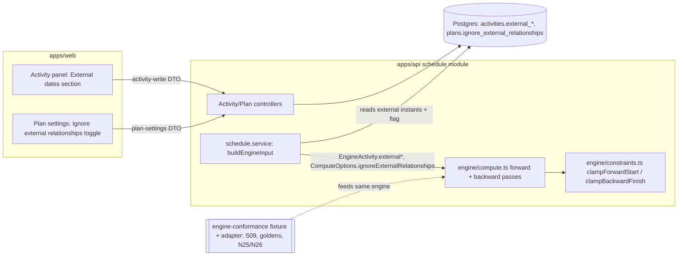
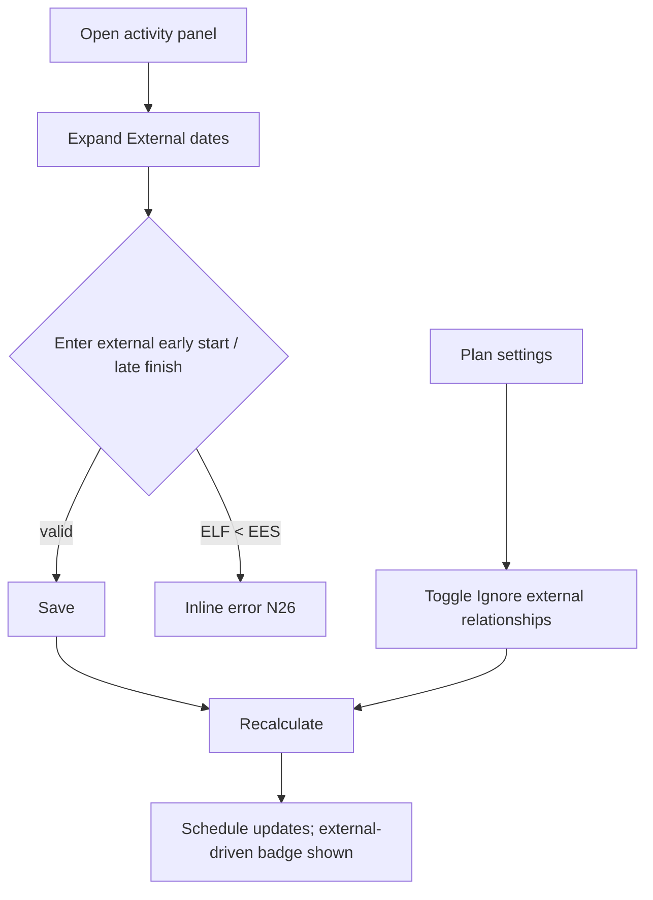

# Feature Spec: External / inter-project dates (CPM engine dimension)

- **Status:** Approved (2026-07-18) — Milestone 1 in build
- **Author(s):** feature-analyst (Product Owner / Solution Architect / Technical Lead hats)
- **Date:** 2026-07-18
- **Tracking issue / epic:** #TBD
- **Roadmap link:** Engine Conformance & Validation Framework — the last un-ADR'd P6-class CPM axis (`docs/ROADMAP.md`; `docs/specs/engine-conformance-framework/`)
- **Related ADR(s):** ADR-0043 (NEW, drafted with this spec — inter-project external dates); ADR-0035 §30 (NEW section, accepts-with-milestone); builds on ADR-0021 (DAG), ADR-0022 (execution/persistence), ADR-0023/0036/0037 (date/calendar axis), ADR-0033 (scheduling modes), ADR-0034 (conformance methodology), ADR-0016 (tenancy/org scoping)

> **Scope note.** This spec designs **Milestone 1 only**: external dates as an
> **activity-level scheduling input** (an imported external early-start / late-finish
> instant per activity) plus a plan-level **ignore-external** option. It **defers** a
> live cross-plan CPM solve (auto-deriving external dates from a linked plan's computed
> schedule) to a sketched, un-designed Milestone 2. See §4 "Implementation approach"
> for why this is the smallest correct first slice.

---

## 1. Business understanding

### Problem

SchedulePoint's CPM engine is functionally complete through conformance milestone M7
(30 ✅ / 2 ⚪ on the [capability matrix](../engine-conformance-framework/CAPABILITY_MATRIX.md)).
**External / inter-project dates** is one of the two remaining ⚪ dimensions and the only
one with **no ADR yet**. The product owner selected it next because it unblocks
**programme / multi-plan scheduling**: real construction programmes are split across
several plans (engineering, procurement, construction, start-up, and multiple
contractors), and activities in one plan are gated by dates that live in **another**
plan — a vendor delivery, an IFC drawing release, a downstream commissioning window.

Today a planner has no way to represent "this milestone cannot start before
2026-04-13 because the Engineering project hands it over then" without abusing a
manual constraint, and no way to model the P6 planner's daily reality of toggling
**"ignore relationships to/from other projects"** to see the plan on its own logic vs.
gated by its neighbours. The conformance fixture encodes exactly this (tags
`net_external_*`, `interproject`; **scenario S09**), and it is the last unscored axis.

### Users

- **Planner** (org role `PLANNER`) — owns a plan; enters/maintains the external dates
  that gate their activities (an imported vendor delivery, an interface milestone), and
  toggles the ignore-external option to compare the plan on its own logic vs. gated.
- **Org Admin** (`ORG_ADMIN`) — same capability plan-wide; owns programme-level policy.
- **Contributor** (`CONTRIBUTOR`) — may edit external dates on activities they can edit,
  per the existing activity-write permission.
- **Viewer / External Guest** — read-only; sees external-date badges and the resulting
  schedule, never edits.
- **The conformance harness** (CI, not a human) — a first-class "user": it feeds the
  fixture's external columns through the engine to assert S09, the goldens, and the
  negatives (ADR-0034 three tiers).

### Primary use cases

1. **Set an external date on an activity** — a planner marks a milestone/activity with
   an imported **external early start** (earliest it can begin, gated by an upstream
   project) and/or an **external late finish** (latest it may finish, gated by a
   downstream project).
2. **Schedule honouring external dates** — a recalculation treats the external early
   start as a lower bound on the forward pass and the external late finish as an upper
   bound on the backward pass, so the schedule reflects the inter-project interface.
3. **Toggle "ignore external relationships"** — a plan-level option drops all external
   bounds for a recalculation, so the planner sees the plan on its own internal logic
   (the S09 differential).
4. **Read the impact** — the planner sees which activities are driven by an external
   date (vs. their own logic) and the resulting float, so they can escalate the gating
   interface.

### User journeys

**Happy path.** A planner opens a construction plan. On the milestone
"Absorber Column T-301 Delivered to Site" they open the activity panel, expand
**External dates**, and enter an **external early start** of 2026-07-27 (the vendor's
committed delivery, imported from the Procurement programme). They recalculate. The
milestone and its successors move to reflect the delivery; the activity shows an
"external-driven" badge because the external date, not internal logic, set its start.
Later they toggle **Ignore external relationships** on and recalculate again to see how
much the plan would pull left if the interface were removed — quantifying the schedule
risk the vendor represents.

**Alternate — later-of-two-wins.** An activity carries **both** an internal FS
predecessor **and** an external early start. On recalculation the **later** of (network
early start, external early start) drives (the fixture's A2120). Toggling ignore-external
drops the external date, so internal logic alone drives.

**Alternate — impossible window.** An activity's external late finish is earlier than
its internal logic can achieve. The schedule is produced with **negative total float**
on the driving chain (surfaced, never an error) — the existing constraint-conflict
behaviour, so the planner sees the interface is infeasible.

### Expected outcomes

- Planners can model inter-project interfaces **without abusing manual constraints**, and
  can compare "plan on its own logic" vs. "plan gated by its neighbours" in one click.
- The engine's **last un-ADR'd P6-class axis** is designed, documented (ADR-0043 +
  ADR-0035 §30), and scored: the `net_external_*` / `interproject` capability row and
  **scenario S09** flip ⚪ → ✅.
- A **foundation** is laid for a later live cross-plan solve (Milestone 2) without
  committing to it now.

### Success criteria

- The `net_external_*` / `interproject` capability-matrix row and **S09** move ⚪ → ✅ in
  the same PR that lands the behaviour (ADR-0034 living-matrix rule).
- **S09 is a runnable differential**: flipping `ignoreExternalRelationships` on drops all
  five fixture external early starts and pulls the procurement chain left — the dates
  **differ** from the S01 baseline (the ADR-0034 "flip-one-option-must-differ" proof).
- First-principles **goldens** pass for A2120 (later-of-two-wins), A12500 (external late
  finish), and one clean external-early-start (e.g. A2200).
- **Byte-parity gate:** on a plan with no external dates and the option off, every prior
  golden/scenario/snapshot is **byte-identical** — `computeSchedule` output unchanged.
- Negatives N25 (external early start before data date → warn+clamp) and N26 (external
  late finish before external early start → boundary reject) are asserted.
- `pnpm lint && pnpm typecheck && pnpm test` green; recalc p95 unchanged (no new pass).

### Open questions

See §"Critical questions" at the end. Each has a stated default so a non-answer still
yields a buildable plan.

## 2. Functional requirements

### User stories & acceptance criteria

> **US-1** — As a **Planner**, I want to set an **external early start** on an activity,
> so that its schedule reflects an interface handed over by an upstream project.
>
> **Acceptance criteria**
>
> - **Given** an activity I can edit **when** I set an external early start of date `D`
>   and recalculate **then** the activity's early start is `max(network early start, D)`,
>   measured on its own calendar (ADR-0037), floored at the data date.
> - **Given** the external early start is the binding bound **then** the activity is
>   flagged **external-driven** (observability) and its successors move accordingly.
> - **Given** no external early start is set **then** the schedule is byte-identical to
>   today (the parity path).

> **US-2** — As a **Planner**, I want to set an **external late finish** on an activity,
> so that its schedule reflects a downstream project's commissioning window.
>
> **Acceptance criteria**
>
> - **Given** an activity **when** I set an external late finish of date `D` and
>   recalculate **then** the activity's late finish is `min(network late finish, D)` on
>   its own calendar, and its total float reflects the tighter bound.
> - **Given** the external late finish is earlier than internal logic can achieve
>   **then** total float goes **negative** on the driving chain (surfaced, not an error).

> **US-3** — As a **Planner**, I want to toggle **Ignore external relationships** on the
> plan, so that I can see the plan on its own internal logic.
>
> **Acceptance criteria**
>
> - **Given** activities carry external dates **when** I turn the option on and
>   recalculate **then** **all** external early starts **and** late finishes are dropped,
>   and the schedule pulls left to internal logic (the S09 behaviour).
> - **Given** the option is off (default) **then** external dates are honoured.

> **US-4** — As a **Viewer / External Guest**, I want to see which activities are gated
> by an external date and the resulting schedule, so that I understand the plan's
> external dependencies — **read-only**.

> **US-5** — As the **conformance harness**, I want to feed the fixture's external
> columns and the ignore option through the engine, so that S09, the goldens, and the
> negatives assert the documented semantics (ADR-0034 three tiers).

### Workflows

1. **Set external date:** open activity panel → **External dates** section → enter
   external early start and/or late finish (calendar-day inputs, ADR-0023 inclusive
   display) → save (validated client + server) → recalc → schedule updates.
2. **Toggle ignore-external:** plan settings / recalc options → toggle
   **Ignore external relationships** → recalc → schedule updates; the toggle persists on
   the plan like the other scheduling options.
3. **Recalculate:** the existing plan-scoped recalc endpoint (ADR-0022) builds engine
   input, now including per-activity external instants and the plan flag, runs the single
   (unchanged-signature) CPM pass, writes results.

### Edge cases

- **Empty:** no activity has an external date → option is inert → byte-parity path.
- **Both bounds on one activity:** external early start **and** external late finish set
  and consistent (EES ≤ ELF) → both bounds apply on their respective passes.
- **External + internal logic:** later-of-two-wins on the forward pass (US-1); external
  late finish is one more upper bound on the backward pass alongside FNLT/secondary.
- **External + a mandatory/FINISH_ON constraint on the same activity** (A12500 carries
  both a `FINISH_ON` and an external late finish) → the external late finish is an
  **additional** backward bound; it never overrides the hard pin, and never sets the
  `constraintViolated` (mandatory) flag — external dates are soft bounds, not pins.
- **External early start before the data date (N25):** honoured but cannot pull work
  before the data date; clamped to the data-date floor + a soft warning counted (mirrors
  N15).
- **External late finish before external early start (N26):** an impossible per-activity
  window → **boundary reject** at the DTO/service (`EXTERNAL_FINISH_BEFORE_START`),
  mirroring N06 (actual finish before start).
- **Concurrent:** external-date edits go through the existing activity optimistic-lock +
  plan advisory lock; the ignore flag is a plan-row field under optimistic locking.
- **Milestones:** the fixture's external activities are `FINISH_MILESTONE`s (zero
  duration); the bounds apply to their single instant.

### Permissions

Map to RBAC + org scope (ADR-0012, ADR-0016), deny-by-default:

- **Set / clear an external date on an activity** — reuses the **existing activity-write
  permission** (the same one that guards constraints/duration on an activity), scoped to
  the activity's plan's organisation. **No new permission for Milestone 1** — an external
  date is just another nullable field on an activity the planner already owns.
- **Toggle the plan's ignore-external option** — reuses the **existing plan
  scheduling-option / recalc permission** (the same one guarding
  `useExpectedFinishDates`, `makeOpenEndsCritical`, `levelResources`), plan-org scoped.
- **Read** external dates / external-driven flags — the existing `schedule:read` /
  activity-read permission, org-scoped.
- **Milestone 2 (deferred):** a **live cross-plan link** spans two plans and therefore
  needs authorisation on **both** — that is where a new cross-plan permission (or a
  dual-scope check) is introduced. **Out of scope here** (see Critical Question 4).

### Validation rules (shared client ↔ server)

- `externalEarlyStart`, `externalLateFinish`: optional `DateTime?` (ISO instant stored;
  calendar-day inclusive display per ADR-0023). Either, both, or neither may be set.
- If both set: `externalLateFinish >= externalEarlyStart` (else N26 reject).
- `ignoreExternalRelationships`: plan `Boolean`, default `false`.
- No currency/locale concerns. Instants stored UTC; displayed on the activity's calendar.

### Error scenarios

| Scenario                                               | Detection                     | User-facing result                                       | Status |
| ------------------------------------------------------ | ----------------------------- | -------------------------------------------------------- | ------ |
| Not a member of the plan's org                         | authz check (deny-by-default) | friendly forbidden                                       | 403    |
| Lacks activity-write permission                        | RBAC check                    | forbidden                                                | 403    |
| External late finish before external early start (N26) | DTO validator + service       | inline field error `EXTERNAL_FINISH_BEFORE_START`        | 422    |
| External early start before data date (N25)            | engine (soft)                 | schedule produced; clamped to data date; warning counted | 200    |
| External late finish infeasible vs. logic              | engine                        | negative total float, surfaced on the chain              | 200    |
| Stale activity/plan write (optimistic lock)            | version check                 | conflict, reload                                         | 409    |
| Malformed date                                         | DTO validator                 | inline error                                             | 422    |

## 3. Technical analysis

| Area           | Impact  | Notes                                                                                                                                                                                                                                                                                                                                                                                                 |
| -------------- | ------- | ----------------------------------------------------------------------------------------------------------------------------------------------------------------------------------------------------------------------------------------------------------------------------------------------------------------------------------------------------------------------------------------------------- |
| Frontend       | low–med | An **External dates** section in the activity panel (two optional date inputs) reusing the existing form primitives (RHF + Zod, ADR-0007) and the activity-panel patterns; an **Ignore external relationships** toggle in plan/recalc settings alongside the existing scheduling-option toggles; an "external-driven" badge on the canvas/activity row. No new route, no new design-system primitive. |
| Backend        | med     | Two nullable columns on `activities`; one `Boolean` on `plans`; DTO fields + validation; the schedule service's engine-input builder passes the new instants + flag into `ComputeOptions`/`EngineActivity`; no new module.                                                                                                                                                                            |
| Database       | low–med | Additive: `activities.external_early_start`, `activities.external_late_finish` (`TIMESTAMPTZ NULL`); `plans.ignore_external_relationships` (`BOOLEAN NOT NULL DEFAULT false`). Constant defaults ⇒ no data backfill (mirrors ADR-0035 §9/§20/§28 option columns). No new index (row columns read with the parent, never filtered across plans).                                                       |
| API            | low     | Extends the existing activity create/update DTOs and the plan-settings/recalc-options DTOs; documented in OpenAPI. Standard `{ data }`/`{ error }` envelopes. No new endpoint.                                                                                                                                                                                                                        |
| Security       | low     | Reuses existing activity-write / plan-settings / read permissions + org scoping. New inputs validated at the boundary. No cross-plan surface in M1 (that is the deferred M2 risk).                                                                                                                                                                                                                    |
| Performance    | none    | External bounds are two extra clamps inside the **existing** forward/backward passes — **no new engine pass**, O(1) per activity. Recalc cost unchanged. The `computeSchedule` signature is unchanged.                                                                                                                                                                                                |
| Infrastructure | none    | No new services, env, or containers.                                                                                                                                                                                                                                                                                                                                                                  |
| Observability  | low     | Add `externalDrivenCount` (and, if adopted, per-activity `externalStartDriven`/`externalFinishConstrained` flags) to the engine summary/results and the recalc log line, mirroring `constraintViolationCount`/`loeNoSpanCount`.                                                                                                                                                                       |
| Testing        | med     | Engine-free structural gate (types/coverage), engine unit tests (clamp + parity), the **S09 differential**, first-principles goldens (A2120/A12500/A2200), negatives N25/N26, API DTO tests, a thin e2e for the panel + toggle.                                                                                                                                                                       |

### Dependencies

- **Prerequisites:** none new — everything this depends on is already landed
  (ADR-0037 own-calendar instant axis, the constraint clamp helpers in `constraints.ts`,
  the recalc option plumbing in `schedule.service.ts`, the conformance harness + fixture).
- **Affected features:** the recalc endpoint (ADR-0022), the activity panel, plan
  scheduling options. All extended additively.
- **Must land first within this feature:** the ADR-0043 accept + ADR-0035 §30 section
  before the engine behaviour merges (the living-matrix / semantics-ledger rule).
- **Third parties:** none.

## 4. Solution design

### Architecture overview

External dates are modelled **exactly as the fixture encodes them**: two per-activity
imported instants (`external_early_start`, `external_late_finish`) plus a plan-level
`ignore_external_relationships` switch. They plug into the **existing** CPM passes as two
additional clamps — an external early start behaves like an **SNET** on the forward pass,
an external late finish like an **FNLT** on the backward pass — so the engine gains **no
new pass** and `computeSchedule`'s signature is unchanged (the byte-parity gate holds by
construction: absent inputs + option off ⇒ no clamp).



### Data flow

```mermaid
sequenceDiagram
  participant U as Planner
  participant API as Schedule/Activity controller
  participant SVC as schedule.service
  participant ENG as computeSchedule (pure)
  U->>API: PATCH activity { externalEarlyStart } (activity-write, org-scoped)
  API->>API: validate (N26: ELF >= EES); org + optimistic lock
  API->>DB: persist external_early_start
  U->>API: PATCH plan { ignoreExternalRelationships } (plan-settings)
  API->>DB: persist ignore_external_relationships
  U->>API: POST plan/schedule/recalculate
  SVC->>DB: load activities (+external instants) + plan flag
  SVC->>ENG: EngineActivity.external*, ComputeOptions.ignoreExternalRelationships
  Note over ENG: forward: earlyStart = max(networkES, EES) unless ignored (clamp like SNET, data-date floor)
  Note over ENG: backward: lateFinish = min(networkLF, ELF) unless ignored (clamp like FNLT)
  ENG-->>SVC: results (+ externalDrivenCount) — signature unchanged
  SVC->>DB: batched write (ADR-0022)
  SVC-->>U: schedule + summary
```

### User flow



### Database changes

Design with the **database-architect** before the migration. Additive, no backfill:

- `activities.external_early_start  TIMESTAMPTZ NULL` — imported upstream interface
  instant; NULL = none (the parity default).
- `activities.external_late_finish  TIMESTAMPTZ NULL` — imported downstream interface
  instant; NULL = none.
  - CHECK (optional, defensive): `external_late_finish >= external_early_start` when both
    non-null (the DB backstop to the DTO N26 check).
- `plans.ignore_external_relationships BOOLEAN NOT NULL DEFAULT false` — mirrors the
  existing `make_open_ends_critical` / `level_resources` option columns (row column, no
  index, constant default).

No new model, no new index (external instants are read with their activity, never filtered
across plans — same rationale as the other option columns). Soft-delete/audit/optimistic
locking are inherited from `activities`/`plans`.

### API changes

No new endpoint — extend existing DTOs (documented in OpenAPI, ADR-0035-style):

- **Activity create/update DTO** gains optional `externalEarlyStart?: string` and
  `externalLateFinish?: string` (ISO date; class-validator + shared Zod). Cross-field
  validation: `externalLateFinish >= externalEarlyStart` ⇒ 422
  `EXTERNAL_FINISH_BEFORE_START` (N26).
- **Plan settings / recalc-options DTO** gains `ignoreExternalRelationships?: boolean`
  (default false), alongside the existing scheduling toggles.
- **Recalc / schedule read responses** gain the observability field
  `externalDrivenCount` in the summary (and, if adopted, per-activity external-driven
  flags), mirroring `constraintViolationCount`.

### Component changes

Reuse the design system (no one-offs):

- **`ExternalDatesSection`** in the activity panel — two optional date inputs using the
  existing form field + date-picker primitives (RHF + Zod), with the loading/empty/error/
  success states the panel already defines. Runs through **ux-reviewer**,
  **accessibility-reviewer**, **component-reviewer**.
- **Ignore-external toggle** — reuse the existing scheduling-option toggle pattern in plan
  settings; no new primitive.
- **External-driven badge** — reuse the existing activity badge/flag component (as used
  for `constraintViolated`/LOE flags); never colour-only (WCAG 2.2 AA, ADR text label).

### Implementation approach & alternatives

**Chosen — external dates as an activity-level input + an ignore-external plan option,
clamped inside the existing passes; a live cross-plan solve deferred.**

_Why this is the smallest correct first slice._ The fixture itself models external dates
as **per-activity imported instants** (`external_early_start`/`external_late_finish`) and
the S09 behaviour as a **boolean toggle**, not as live edges to another plan's live
schedule. So the smallest design that fully scores the `net_external_*` / `interproject` /
S09 conformance target is precisely this input-plus-toggle model. It reuses the SNET/FNLT
clamp helpers (`clampForwardStart`/`clampBackwardFinish` in `constraints.ts`), adds **no
new engine pass**, and keeps `computeSchedule`'s signature and the byte-parity gate intact
(absent inputs + option off ⇒ identical output). It respects org-scoping and the
plan-scoped recalc endpoint (ADR-0022) with **no new cross-plan surface**, so it needs no
new permission and no cross-plan authorisation model. It is genuinely shippable: a planner
can enter an imported vendor delivery / interface milestone and compare "own logic" vs.
"gated" today.

_What is deferred (Milestone 2, sketched not designed here)._ A **live cross-plan
linkage** — a first-class inter-plan relationship whose external dates are **auto-derived**
from the linked plan's computed schedule and kept fresh (a real programme solve or a
propagation job) — is architecturally heavier: it introduces cross-plan edges (a
cross-plan analogue of the ADR-0021 DAG invariant, including cross-plan cycle detection),
cross-plan **authorisation** (a link spans two plans in possibly different org-scoped
projects), staleness/propagation (when plan A recalculates, plan B's imported dates drift),
and a programme-level recalc orchestration above ADR-0022's single-plan endpoint. Milestone
1 deliberately models the **interface** (the imported dates) without the **live solve**, so
the engine axis and the conformance score land now and the heavy cross-plan machinery is a
separate, ADR-gated milestone.

**Alternatives considered.**

- **Model external early start as a plain `SNET` constraint and external late finish as a
  plain `FNLT`** (no new columns; overload the existing constraint fields). Rejected: it
  destroys the distinction the fixture and P6 draw between an **internal** constraint and
  an **external** (other-project) bound — the ignore-external toggle must drop _only_ the
  external ones while leaving internal SNET/FNLT untouched, and an activity can carry both
  an internal constraint (A12500's `FINISH_ON`) **and** an external bound simultaneously.
  Distinct columns are required to represent and to selectively ignore them.
- **A new engine pass for external dates.** Rejected: they are just two more clamps on the
  existing forward/backward passes (like SNET/FNLT); a new pass would risk the byte-parity
  gate and add cost for no behavioural gain.
- **Build the live cross-plan solve now.** Rejected as the first slice: it is M–L→XL, needs
  cross-plan DAG + authz + propagation, and is **not required** to score S09 /
  `net_external_*` (the fixture proves the axis with static imported dates). Sequenced as
  Milestone 2 behind its own ADR amendments.
- **Store external dates as offsets from the data date** (like the engine's internal
  frame). Rejected: external dates are **absolute** interface commitments from another
  project (a vendor delivery date), independent of this plan's data date; storing absolute
  instants (ADR-0037 axis) is the correct model and survives a data-date change.

**Architectural significance / ADR.** Introducing an inter-project scheduling input and the
ignore-external semantic is architecturally significant → **ADR-0043 (inter-project
external dates)**, drafted with this spec, plus a new **ADR-0035 §30** section documenting
the ambiguous behaviours (accept-with-milestone) and negatives **N25/N26**. See the ADR
draft at [`docs/adr/0043-inter-project-external-dates.md`](../../adr/0043-inter-project-external-dates.md).

## 5. Links

- Implementation plan: [`./implementation-plan.md`](./implementation-plan.md)
- ADR (draft): [`docs/adr/0043-inter-project-external-dates.md`](../../adr/0043-inter-project-external-dates.md)
- Semantics ledger to amend: [`docs/adr/0035-schedulepoint-cpm-semantics.md`](../../adr/0035-schedulepoint-cpm-semantics.md) (new §30, N25/N26)
- Capability matrix / scenario S09: [`../engine-conformance-framework/CAPABILITY_MATRIX.md`](../engine-conformance-framework/CAPABILITY_MATRIX.md)
- Fixture: `packages/engine-conformance/fixtures/` (`activities.csv` external columns, `TEST_MATRIX.md` S09)
- Engine seams: `apps/api/src/modules/schedule/engine/{compute,constraints,types}.ts`; recalc: `apps/api/src/modules/schedule/schedule.service.ts`
