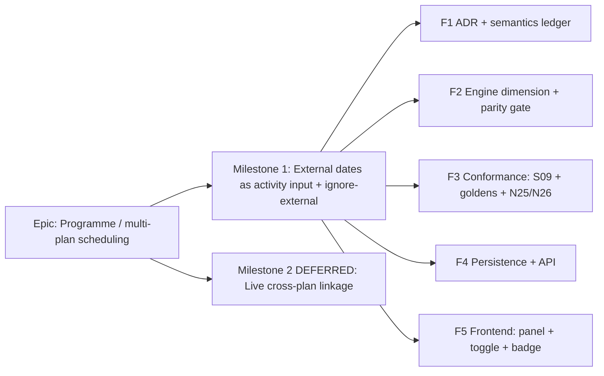

# Implementation Plan: External / inter-project dates (CPM engine dimension)

- **Feature spec:** [`./feature-spec.md`](./feature-spec.md) (Approved 2026-07-18)
- **ADR:** [`docs/adr/0043-inter-project-external-dates.md`](../../adr/0043-inter-project-external-dates.md) (Accepted) + ADR-0035 §30 (Accepted), N25/N26
- **Status:** Milestone 1 in build — the five critical questions were approved at their recommended
  defaults (imported-dates-only first slice; ignore-external drops both directions; soft SNET/FNLT-shaped
  bounds; N25 warn+clamp). Milestone 2 (live cross-plan solve) remains deferred.
- **Owner:** Engine dimension (IPD)

## Breakdown

### Epic

**Programme / multi-plan scheduling** — let a plan's schedule reflect dates that live in
other plans/projects. Maps to the Engine Conformance & Validation Framework roadmap theme
(the last un-ADR'd P6-class axis) and the broader programme-scheduling direction.

---

### Milestone 1: External dates as an activity-level input + ignore-external option (shippable slice)

**Outcome:** a planner can set an imported external early start / late finish on any
activity and toggle "Ignore external relationships" on the plan; recalculation honours (or
drops) those bounds. The `net_external_*` / `interproject` capability row and **scenario
S09** flip ⚪ → ✅. The no-external path is byte-identical (parity gate). **No live
cross-plan solve.**

> Sequencing intent: land the **ADR + semantics** (F1), then the **engine dimension behind
> the parity gate** (F2) with its **conformance proof** (F3) — these three keep `main`
> releasable with zero behaviour change until a plan actually carries external data — then
> the **persistence/API** (F4) and finally the **frontend** (F5). Each feature is one or a
> few PRs; `main` stays releasable throughout.

---

#### Feature F1 — ADR-0043 + ADR-0035 §30 semantics ledger

> **Description:** Write ADR-0043 (problem/options/decision/consequences) and add ADR-0035
> §30 documenting the ambiguous external-date behaviours (accept-with-M1) + negatives
> N25/N26. No code.
> **Complexity:** S
> **Dependencies:** none.
> **Risks:** semantics chosen here bind the engine → circulate the 5 critical questions with the PO before merge → mitigation: state defaults so the ADR is buildable even without answers.
> **Testing requirements:** doc review only; markdown/link check in CI.

##### Task F1.T1 — Draft & accept ADR-0043 and ADR-0035 §30 (≈ one PR)

- **Description:** Finalise the ADR-0043 draft; add ADR-0035 §30 (external early start =
  SNET-like forward bound with data-date floor; external late finish = FNLT-like backward
  bound; ignore-external drops both; external bounds are soft, never mandatory pins, never
  set `constraintViolated`; N25 warn+clamp, N26 boundary reject). Update the ADR-0035
  acceptance ledger (§30 → Accepted with M1) and the ADR README index.
- **Complexity:** S
- **Dependencies:** none.
- **Risks:** drift from fixture intent → cross-check against `activities.csv` external rows + `TEST_MATRIX.md` S09.
- **Testing:** doc lint; reviewer sign-off.
- **Development steps:**
  1. Finalise `docs/adr/0043-inter-project-external-dates.md` (already drafted).
  2. Add ADR-0035 §30 + N25/N26 rows; update the acceptance-status ledger.
  3. Update `docs/adr/README.md` and CLAUDE.md §16 ADR list (add ADR-0043).

---

#### Feature F2 — Engine dimension + byte-parity gate

> **Description:** Add the external-date inputs and ignore-external option to the pure
> engine, clamping inside the existing forward/backward passes. `computeSchedule` signature
> unchanged. No-external path byte-identical.
> **Complexity:** M
> **Dependencies:** F1 (semantics).
> **Risks:** accidentally perturbing the parity path → mitigation: default-off/absent inputs are a strict no-op; run the full golden/scenario suite as the gate before merge.
> **Testing requirements:** engine unit tests (clamp math both passes), an explicit parity test (all-absent ⇒ identical to a pre-change snapshot), N25/N26 engine-side behaviour where applicable.

##### Task F2.T1 — Add external inputs to the engine types + structural gate (≈ one PR)

- **Description:** Add `externalEarlyStart?`/`externalLateFinish?` to `EngineActivity`,
  `ignoreExternalRelationships?` to `ComputeOptions`, and `externalDrivenCount` (+ optional
  per-activity `externalStartDriven`/`externalFinishConstrained`) to `EngineSummary`/
  `EngineResult` in `engine/types.ts`. Wire the engine-free structural coverage gate
  (`packages/engine-conformance` coverage of the `net_external_*`/`interproject` tags) so
  the tags stop reading `todo`.
- **Complexity:** S
- **Dependencies:** F1.
- **Risks:** none (additive optional fields).
- **Testing:** typecheck; the engine-free structural CI gate (ADR-0034 tier 1) asserts the tags are now claimed.
- **Development steps:**
  1. Add the optional fields with doc comments mirroring the ADR-0037/§9 style.
  2. Update `@repo/types` if the plan/DTO union needs the flag.
  3. Update the coverage map for the external tags.

##### Task F2.T2 — Clamp external bounds inside the passes (≈ one PR)

- **Description:** In `compute.ts`, on the **forward** pass clamp early start up to the
  external early start (`max`, floored at the data date) unless
  `ignoreExternalRelationships`; on the **backward** pass clamp late finish down to the
  external late finish (`min`) unless ignored. Reuse/extend the `constraints.ts`
  `clampForwardStart`/`clampBackwardFinish` helpers so external bounds compose with
  SNET/FNLT/secondary. Measure on the activity's own calendar (ADR-0037). Set the
  external-driven flags/count. N25 (EES < data date) → clamp + increment a warning count.
- **Complexity:** M
- **Dependencies:** F2.T1.
- **Risks:** interaction with mandatory/FINISH_ON pins → external bound is soft, never a pin, never sets `constraintViolated`; add explicit tests for A12500-style (FINISH_ON + ELF) coexistence.
- **Testing:** unit tests for both clamps, later-of-two-wins, negative-float-from-ELF, N25 clamp+warn, coexistence with pins.
- **Development steps:**
  1. Thread the external instants into the forward/backward clamp sites.
  2. Gate both on `!ignoreExternalRelationships`.
  3. Populate `externalDrivenCount` + flags; increment the N25 warning count.

##### Task F2.T3 — Byte-parity gate (≈ one PR, may fold into F2.T2)

- **Description:** Prove that with all external inputs absent and the option off, the entire
  golden/scenario/snapshot suite is byte-identical. Add a focused parity test.
- **Complexity:** S
- **Dependencies:** F2.T2.
- **Risks:** a stray non-guarded branch → the full suite is the net.
- **Testing:** run the complete engine + conformance suite; add `compute.external.spec.ts` with an explicit all-absent parity assertion against a captured baseline.

---

#### Feature F3 — Conformance: S09 differential + goldens + negatives

> **Description:** Wire the conformance adapter to read the fixture's external columns and
> the ignore option; make **S09** a runnable differential; add first-principles goldens and
> negatives per the ADR-0034 three-tier methodology.
> **Complexity:** M
> **Dependencies:** F2.
> **Risks:** no external oracle (ADR-0034) → goldens are first-principles + documented ADR-0035 §30 semantics, self-baselined; any P6 cross-check is optional.
> **Testing requirements:** tier 1 structural gate (F2.T1); tier 2 S09 differential ("flip ignore on ⇒ dates differ from S02/S01"); tier 3 goldens (A2120/A12500/A2200); negatives N25/N26.

##### Task F3.T1 — Adapter reads external columns; flip S09 runnable (≈ one PR)

- **Description:** In `conformance/adapter.ts`, map `external_early_start`/
  `external_late_finish` onto `EngineActivity`; in `conformance/scenarios.ts`, add S09 to
  the option-flip registry (`ignoreExternalRelationships: true`) and flip
  `SCENARIO_SUPPORT.S09` to runnable. Update `CAPABILITY_MATRIX.md` (the ⚪ row + S09 → ✅)
  **in the same PR** (ADR-0034 living-matrix rule).
- **Complexity:** M
- **Dependencies:** F2.T2.
- **Risks:** matrix drift → the PR that flips behaviour must flip the matrix.
- **Testing:** S09 asserts `resultsDiffer(S09_ignore_on, baseline)` — all five external early starts drop, procurement chain pulls left.
- **Development steps:**
  1. Adapter: parse + attach the two external instants.
  2. Scenarios: register S09 as an ignore-external differential.
  3. Update the capability matrix rows + scenario table.

##### Task F3.T2 — First-principles goldens + negatives (≈ one PR)

- **Description:** Add goldens: **A2120** (internal FS vs external early start — later
  wins; and with ignore-external on, internal wins), **A12500** (external late finish
  alongside its FINISH_ON), **A2200** (clean external early start). Add negatives **N25**
  (external early start before data date → clamp+warn) and **N26** (external late finish
  before external early start → boundary reject).
- **Complexity:** M
- **Dependencies:** F3.T1.
- **Risks:** golden brittleness → assert the documented semantics (bounds + driver), not incidental offsets.
- **Testing:** golden snapshots + negative assertions in the conformance spec files.

---

#### Feature F4 — Persistence + API

> **Description:** Add the DB columns, DTO fields + validation, and wire the schedule
> service's engine-input builder to pass external instants + the plan flag through.
> **Complexity:** M
> **Dependencies:** F2 (engine consumes them). Independent of F3.
> **Risks:** migration on a hot table → additive nullable columns + constant-default boolean, no backfill.
> **Testing requirements:** API/Supertest for DTO validation (N26 422, authz 403, optimistic 409), service test that external instants + flag reach the engine, migration smoke.

##### Task F4.T1 — Migration + Prisma model (≈ one PR)

- **Description:** Add `activities.external_early_start`/`external_late_finish`
  (`TIMESTAMPTZ NULL`, optional CHECK ELF≥EES) and `plans.ignore_external_relationships`
  (`BOOLEAN NOT NULL DEFAULT false`). **Design with the database-architect** first.
- **Complexity:** S
- **Dependencies:** F1.
- **Risks:** none (additive) → self-migrating image (ADR-0018) applies cleanly.
- **Testing:** migration up/down; Prisma client typecheck.

##### Task F4.T2 — DTO + validation + service wiring (≈ one PR)

- **Description:** Extend the activity create/update DTO (`externalEarlyStart?`,
  `externalLateFinish?`, cross-field N26 check → 422 `EXTERNAL_FINISH_BEFORE_START`) and the
  plan-settings/recalc-options DTO (`ignoreExternalRelationships?`). In
  `schedule.service.ts` `buildEngineInput`, pass the external instants onto `EngineActivity`
  and `plan.ignoreExternalRelationships` into `ComputeOptions`. Surface `externalDrivenCount`
  in the recalc log + response summary.
- **Complexity:** M
- **Dependencies:** F4.T1, F2.T2.
- **Risks:** authz gaps → reuse the existing activity-write / plan-settings permissions + org scope; run **security-reviewer** (IDOR/scope).
- **Testing:** Supertest DTO/authz/optimistic-lock; service test asserting the values reach the engine; OpenAPI updated.
- **Development steps:**
  1. DTO fields + class-validator/Zod (shared) + N26 cross-field check.
  2. Service: thread into the engine-input builder.
  3. OpenAPI + `docs/API.md`; changeset.

---

#### Feature F5 — Frontend: activity panel section + plan toggle + badge

> **Description:** An **External dates** section in the activity panel, an **Ignore external
> relationships** toggle in plan settings, and an "external-driven" badge — all reusing
> design-system primitives.
> **Complexity:** M
> **Dependencies:** F4 (API).
> **Risks:** one-off styling / a11y gaps → reuse existing form + toggle + badge components; run ux/component/accessibility reviewers.
> **Testing requirements:** component tests (form states, validation), Playwright journey (set external date → recalc → badge; toggle ignore → recalc → pull-left), a11y checks.

##### Task F5.T1 — ExternalDatesSection + validation (≈ one PR)

- **Description:** Add the two optional date inputs (RHF + Zod, ADR-0007) to the activity
  panel with loading/empty/error/success states; mirror N26 client-side.
- **Complexity:** M
- **Dependencies:** F4.T2.
- **Risks:** design drift → reuse existing field/date-picker primitives; **component-reviewer**.
- **Testing:** component tests; a11y (labels, keyboard, focus).

##### Task F5.T2 — Ignore-external toggle + external-driven badge (≈ one PR)

- **Description:** Add the plan toggle beside the existing scheduling-option toggles; add
  the external-driven badge (reuse the flag/badge component; text label, not colour-only).
- **Complexity:** S
- **Dependencies:** F5.T1.
- **Risks:** WCAG contrast/colour-only → text label + AA contrast; **accessibility-reviewer**.
- **Testing:** Playwright journey; a11y checks.

---

### Milestone 2: Live cross-plan linkage (DEFERRED — sketched, not designed here)

**Outcome (future):** a first-class inter-plan relationship whose external dates are
**auto-derived** from the linked plan's computed schedule and kept fresh, so a programme of
plans schedules coherently.

> **Not designed in this spec.** Requires its own feature-analyst pass + ADR amendments:
> cross-plan edges + a cross-plan DAG/cycle invariant (extending ADR-0021 across plans);
> **cross-plan authorisation** (a link spans two plans/projects — a new permission or a
> dual-scope check on both endpoints, Critical Q4); staleness/propagation (plan A's recalc
> drifts plan B's imported dates — a propagation job, ADR-0009); and programme-level recalc
> orchestration above ADR-0022's single-plan endpoint. Rough size **L–XL**. Sequenced after
> M1 lands and the axis is scored.

## Sequencing & slices

1. **F1 (ADR + semantics)** — no behaviour; unblocks everything.
2. **F2 (engine, behind parity gate)** — additive optional inputs, no-op when absent →
   `main` stays byte-identical and releasable.
3. **F3 (conformance)** — flips S09 + the ⚪ row to ✅; proves the axis (tiers 1–3). Still
   no product behaviour until data exists.
4. **F4 (persistence + API)** — planners can now store external dates + the toggle; recalc
   honours them.
5. **F5 (frontend)** — the planner-facing UI.

No feature flag is strictly required (every step is inert until an activity carries external
data / the toggle is on), but F5 may sit behind a small `VITE_*` flag if the UI wants to
land ahead of polish. F2+F3 keep `main` releasable with zero behaviour change; F4+F5 are the
first user-visible slice.

## Definition of Done (per task)

Each task's PR must satisfy the Feature Completion Criteria in
[`docs/PROCESS.md`](../../PROCESS.md): code, tests (≥80% changed-line; unit + API/e2e/a11y as
relevant), docs (ADR/§30/API/matrix), **security-reviewer** (F4), **backend-performance**
(F2/F4 — confirm no new pass/cost), **accessibility-reviewer** (F5), Docker build, CI green,
changeset, version impact (pre-1.0 additive ⇒ minor; the DTO/response additions are
backward-compatible).

## Risks & assumptions (rollup)

| Risk / assumption                                   | Likelihood | Impact | Mitigation                                                                                            |
| --------------------------------------------------- | ---------- | ------ | ----------------------------------------------------------------------------------------------------- |
| External-date semantics chosen here bind the engine | med        | med    | ADR-0043 + §30 with the 5 critical questions; defaults stated so it's buildable without answers       |
| Parity path accidentally perturbed                  | low        | high   | Absent inputs + option off is a strict no-op; full golden/scenario/snapshot suite is the gate (F2.T3) |
| Capability-matrix drift                             | med        | low    | ADR-0034 living-matrix rule — flip S09/⚪ row in the same PR as the behaviour (F3.T1)                 |
| Migration on a hot table                            | low        | med    | Additive nullable columns + constant-default boolean; no backfill; ADR-0018 self-migrating image      |
| Scope creep into a live cross-plan solve            | med        | high   | Explicitly fenced to Milestone 2; M1 is input+toggle only                                             |
| Cross-field / boundary validation gaps (N25/N26)    | low        | med    | DTO + optional DB CHECK + engine soft-clamp; asserted in conformance + Supertest                      |
