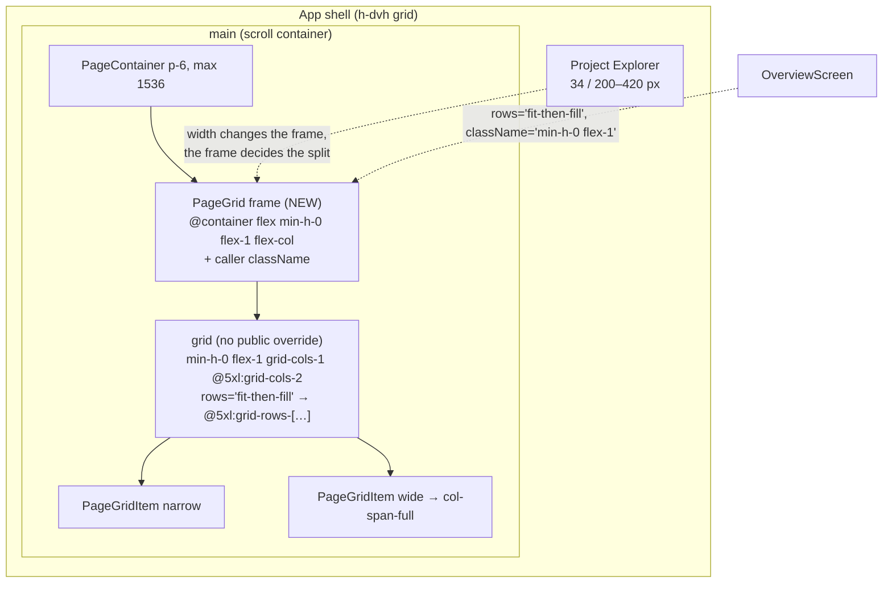
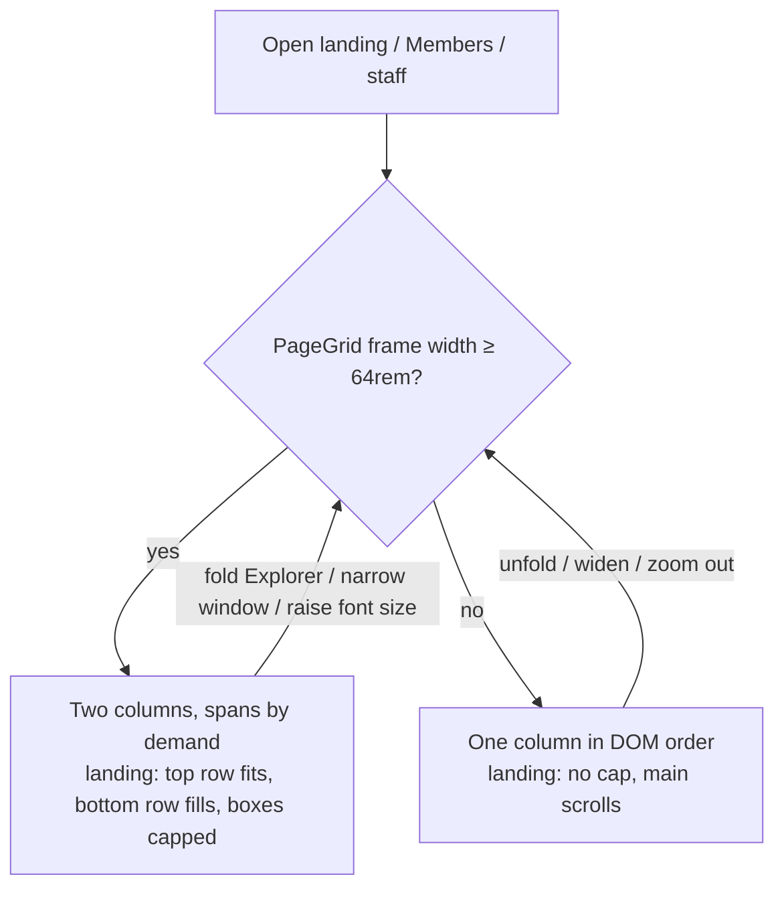

# Feature Spec: The page grid splits on the width it has (#333)

- **Status:** Approved 2026-10-08 by the product owner, recommendations accepted: CQ-1 change the default for all three pages. CQ-2 (the 64rem vs 72rem split) stays decided by the M0 photographs and the SC-6 rule, and M1 does not start before it.
- **Author(s):** feature-analyst
- **Date:** 2026-10-08
- **Tracking issue / epic:** `docs/TECH_DEBT.md` #333 (`:10387-10410`); named follow-up in
  `docs/specs/minimum-viewport/implementation-plan.md:358-359`
- **Roadmap link:** ADR-0179 follow-ups ("Next in line")
- **Related ADR(s):** ADR-0143 (`PageGrid`, span by demand), ADR-0146 D1 (one page measure),
  ADR-0179 D1 (1024 × 600 floor, Explorer at default width), ADR-0105 (why this is a spec).
  **A new short ADR is required — ADR-0182** (§4.6): it changes the split rule of a shared primitive.

> **The brief's remedy does not fix the reported width, and this spec says so first.** "Two columns
> only from `xl`" means `@media (min-width: 80rem)` — **1280 px inclusive**
> (`node_modules/.pnpm/tailwindcss@4.3.3/.../theme.css:330`; `globals.css:41-43` overrides no
> default breakpoint, only adds `wide` = 100rem). So at the 1280 width #333 is about, an `xl:` split
> still gives two 466 px columns. Any viewport breakpoint would have to sit strictly above 1280, and
> every viewport breakpoint is blind to the Explorer, which moves the grid's width by up to 386 px at
> one window size (§3.1). This spec therefore recommends a **container query** instead.

> **Amendment 2026-10-09 — CQ-2 decided: `@6xl` (72rem), for all three consumers.** M0
> (`m0-measurement.md`) applied SC-6 literally and it could not decide: its second clause (no
> `project · client` subtitle truncated mid-word) fails at 1912 — the 732 px layout this spec leaves
> unchanged — so no threshold can satisfy it, and it is **dropped as a threshold test**. The
> truncation is a pre-existing `RowSubject` defect at every width, filed as `docs/TECH_DEBT.md` #472
> and not touched here. The clause that does discriminate is the first (a plan name wraps to a second
> line): it fails at the `@5xl` pair (500/505 px tracks) and passes at 546 and above, so the
> threshold is **72rem**. Decided by the coordinator under the product owner's delegation ("CQ-2 by
> the M0 photographs"); he can object. **Wherever this document says `@5xl`, `64rem`, 500 px or 1349,
> read `@6xl`, `72rem`, 564 px and 1477**, and read the consequences below, which replace §1's
> outcome table for the landing and Members (Explorer at 276, grid = window − 325):
>
> | Window                                                | Landing and Members now                         |
> | ----------------------------------------------------- | ----------------------------------------------- |
> | 1024–1476 (incl. 1280, 1366, **1440**)                | **one column**, 699 / 955 / 1033 / 1115 px wide |
> | 1477 and up (incl. 1646, 1912)                        | two columns, 564 px tracks at the narrowest     |
> | 1912 (both of the product owner's screens, landscape) | unchanged, 732 px tracks                        |
>
> **The honest cost: a 1440 laptop, which `@5xl` would have left in two 546 px columns, now gets one
> 1115 px column** — the width ADR-0098 narrowed rows away from (ADR-0146:18 names 1104 as rejected).
> It was accepted because the alternative leaves names wrapping at 500–505 px tracks. The staff
> console, with no Explorer, splits from a **1200 px** window (grid = window − 48), so it changes in
> 1024–1199 rather than 1024–1071 (still derived, not measured). The Explorer folded gives two
> columns again from a 1245 window (grid = window − 93); at 420 a window must reach about 1621. SC-1 asserts four distinct
> tops at 1280 × 800 and two at 1600 × 1000 (grid 1275, unchanged); SC-3's "1440 × 900 with the
> Explorer at 420" is one column as before, and its fold case at 1280 is two columns (grid 1187).

## 1. Business understanding

### Problem

The organisation landing (`/orgs/$orgSlug`, `OverviewScreen.tsx:213-301`) pairs its four boxes in two
columns from Tailwind `md` (768 px) because that is `PageGrid`'s rule (`page-grid.tsx:54`). On a
narrower **designed** window (ADR-0179 D1: 1024 × 600 up, Explorer at 276) the columns are too narrow
for the rows: at 1280 a plan name wraps to two lines and its `project · client` subtitle truncates
mid-word (`m6-two-column.md:114-117`, `landing-1280.png`). At 1024 it is worse — about 338 px a column
(derived, §3.1) — and nothing has ever photographed it.

The primitive's own docblock already states the rule it fails: "two 366 px columns on a tablet would
reproduce the defect this component exists to avoid" (`page-grid.tsx:49-50`). It enforces that rule
with a **viewport** proxy chosen before the shell had a docked Explorer, so at the design floor it
produces columns narrower than the 366 px it calls a defect.

**Why now:** ADR-0179 made 1024–1440 the designed range, and its plan names this as a follow-up
(`minimum-viewport/implementation-plan.md:358-359`; `m0-measurement.md:175`, payoff list item 11).

### Problem statement re-verified (CLAUDE.md §19.11, "re-verify the PROBLEM")

| Claim in #333                                 | Re-checked against                                                                                                                          | Still true?                                                                                                                                                                                                                          |
| --------------------------------------------- | ------------------------------------------------------------------------------------------------------------------------------------------- | ------------------------------------------------------------------------------------------------------------------------------------------------------------------------------------------------------------------------------------ |
| Columns are 464 px at 1280                    | `table-wrap-coverage/m0/README.md:54-58` (later sitting: grid 955, tracks **466 + 466**)                                                    | **Yes**, ±2 px. The m6 figure is section content width on build 0.132; the later figure is the track.                                                                                                                                |
| Split is `md:` in `PageGrid`                  | `page-grid.tsx:54` `grid grid-cols-1 gap-6 md:grid-cols-2`; `:74` `md:col-span-2`                                                           | Yes.                                                                                                                                                                                                                                 |
| "Its other consumer is the staff console"     | `grep PageGrid apps/web/src`                                                                                                                | **No — there are three consumers**: `OverviewScreen.tsx:213`, `features/staff/ui/staff-console-screen.tsx:261`, **and `routes/members.tsx:45`**. `table-wrap-coverage/m0/README.md:61-62` already said "all three of its consumers". |
| "Neither of the product owner's screens"      | Screens are now **1912 × 948** (monitor) and **1912 × 1114** (Surface, landscape) — ADR-0179:53, `minimum-viewport/feature-spec.md:409-410` | Yes, still unaffected (§2). Note #333 cites 1646 for the Surface; that figure is older. ADR-0179 also lists the Surface **upright at ~1272** (`minimum-viewport/feature-spec.md:422`), which **is** in the cramped band.             |
| "Below `md` the grid collapses to one column" | `page-grid.tsx:54`                                                                                                                          | Yes; and below 1024 is now outside the designed range anyway (ADR-0179 D1).                                                                                                                                                          |

### Users

Every organisation role lands here: Org Admin, Planner, Contributor, Viewer (the screen already
omits sections per role, `OverviewScreen.tsx:259`, `:285`). Org Admins also use Members. Staff use
`/staff`. External Guests never see any `PageGrid` screen. **No permission changes.**

### Primary use cases

1. A planner on a 13–14" laptop at Windows' default 150 % (~1272 wide, `minimum-viewport/feature-spec.md:425`)
   or a 1366 laptop opens the landing and reads it without names wrapping and subtitles truncating.
2. The product owner's Surface used **upright** (~1272 wide) shows the landing as one readable column
   rather than two cramped ones.
3. A planner who folds the Explorer gets two columns back at a width where they fit; one who drags it
   to its 420 px maximum gets one column where two would not.

### Expected outcomes — plain English, Explorer at its default width

| Window                                                    | Landing today                    | Landing after                                                                                         | Members after                                             | Staff console after |
| --------------------------------------------------------- | -------------------------------- | ----------------------------------------------------------------------------------------------------- | --------------------------------------------------------- | ------------------- |
| **1024** (the floor)                                      | two columns of ~338 px — cramped | **one column, 699 px wide**; the four boxes stack and the main area scrolls                           | three sections stacked                                    | **one column**      |
| **1280**                                                  | two columns of 466 px — cramped  | **one column, 955 px wide**; boxes stack at full height and the main area scrolls instead of each box | stacked; the invitations table gets 955 px instead of 466 | unchanged (two)     |
| 1366 laptop (~1358)                                       | two of ~505                      | two of ~505 (just over the threshold)                                                                 | unchanged                                                 | unchanged           |
| 1440                                                      | two of ~545                      | two of ~545 — **unchanged** (under the default threshold; see CQ-2)                                   | unchanged                                                 | unchanged           |
| **1912** (both of the product owner's screens, landscape) | two of 732                       | **unchanged**, pixel for pixel                                                                        | unchanged                                                 | unchanged           |

**One threshold for every org screen.** With the Explorer at 276, an org screen's grid is window −
325, so the landing **and** Members are one column at windows **up to 1348** and two from **1349**
(a 1024 px grid). Every figure in this spec uses that pair.

The staff console has no Explorer (`staff-console-screen.tsx:49-51`), so its grid is 277 px wider
than an org screen's at the same window (ADR-0146:40-41) and it splits from a 1072 px window. Its
only change is in the 1024–1071 band — **derived, not measured** (R5).

**Browser zoom counts as width.** At ≥ 150 % zoom the 1912 monitor is ~1275 CSS px or less, so the
landing there is one column; at 125 % (~1530) it stays two columns of ~590. The ADR states this.

**The reflow is instant.** There is no transition: crossing the threshold (resize, Explorer fold,
zoom) re-lays the grid in the same frame, as `md:` does today.

### Success criteria (falsifiable)

- **SC-1** At 1280 × 800, Explorer default: the landing's four regions have **four distinct tops**
  (one column). At 1600 × 1000: **two** distinct tops (existing assertion, `overview.spec.ts:108-123`).
- **SC-2** At 1912 × 948 and 1912 × 1114: every landing track is **732 px** before and after (within
  1 px). Members and `/staff` tracks unchanged at 1912.
- **SC-3** At 1280 × 800 with the Explorer folded: two columns (tracks ≥ 500). At 1440 × 900 with the
  Explorer at 420: one column. (This is what a viewport breakpoint cannot do, so it is the test that
  the chosen mechanism is the one built.) In **both** layouts the DOM order of the section headings
  and the Tab order across them are the same sequence, and after the grid reflows on an Explorer
  fold, **focus is still on the control that caused it** (the fold button or splitter).
- **SC-4** No horizontal document overflow and no clipped section at 1024 × 600 on the landing and
  Members, **and at 1280 × 800 with the root font size at 200 %** (WCAG 1.4.4; the threshold is
  rem-based, so this is the one-column case at a 1280 grid).
- **SC-5** axe runs in **both** states (one column at 1280 × 800, two at 1600 × 1000) with
  `scrollable-region-focusable` and `region` named in the run, and reports nothing new.
- **SC-6 — the decision rule for CQ-2.** At the **narrowest paired width** the chosen threshold
  allows (a 1024 px grid for `@5xl`: windows 1349 and 1358 with the Explorer at 276), M0's
  photographs show **no plan name wrapping to a second line and no `project · client` subtitle
  truncated mid-word** on the landing, and no wrapped cell in Members' paired sections. If any does,
  the threshold moves to `@6xl` and SC-6 is re-taken at its narrowest pair (windows 1477/1486).

### Open questions

- **CQ-1 (critical, product owner)** — change `PageGrid`'s rule for **all three consumers**, or add
  an opt-in prop so only the landing changes? **Recommended: change the default** (§4.5); the
  component, UX and accessibility reviewers all agreed on 2026-10-08. A reviewer's agreement is not
  approval, so it stays a question until the product owner answers it.
- **CQ-2 (critical, BLOCKED on M0)** — threshold: grid width **≥ 64rem** (`@5xl`, columns ≥ 500 px;
  recommended) or ≥ 72rem (`@6xl`, columns ≥ 564)? Not decided by preference: **SC-6** decides it
  from M0's photographs, and M1 does not start until it has.
- Defaults for everything else: no flag (ADR-0088 D1); rem-based threshold, so it scales with the
  reader's font size; the device checklist is not changed (§3.3).

## 2. Functional requirements

> **US-1** — As any organisation member on a window between 1024 and 1348 px wide, I want the
> landing in one column, so that plan names and their subtitles are readable.
>
> - **Given** the Explorer at 276 and a 1280 window **when** I open the landing **then** the four
>   boxes stack in DOM order (Jump back in, Needs your attention, Where the work stands, Recently
>   changed) and none is height-capped.
> - **Given** a 1912 window **when** I open the landing **then** it is identical to today.

> **US-2** — As a planner who resizes or folds the Explorer, I want the landing to choose one or two
> columns from the room it actually has.
>
> - **Given** a 1280 window **when** I fold the Explorer **then** the landing becomes two columns
>   without reload; **when** I unfold it **then** it returns to one.

> **US-3** — As an Org Admin on a 1280 window, I want the Members page to stop squeezing the
> invitations table into half the page.
>
> - **Given** a 1280 window **when** I open Members **then** Roster, Pending invitations and "What each
>   role can do" stack at full width.

### Edge cases

- **Exactly at the threshold** (a 1024 px grid): two columns (min-width is inclusive).
- **Root font size raised** (e.g. 20 px): the threshold is 64rem = 1280 px of grid, so larger text
  stays single-column longer. That is the intent and matches `breakpoints.test.ts:40-45`'s convention.
- **Browser zoom on the 1912 monitor**: 150 % gives ~1275 CSS px → one column; 125 % gives ~1530 →
  two columns of ~589.
- **Single-column landing on a short window**: the M9 height cap is off below the split (as it is
  below `md` today, `OverviewScreen.tsx:229-231`), so `<main>` scrolls. Each `fill` body keeps its
  `tabIndex={0}` (`section-card.tsx:263`) although it no longer scrolls — an existing state, now
  reachable in the designed range. Not an AA failure (it is operable and inside a named region),
  so it is **not fixed here**; it is filed as its own register row (plan M2-T2, Risk R4).
- **An overlay inside a grid section.** The frame is a containing block for `position: fixed` and
  `absolute` descendants (R7). **Requirement:** nothing inside a `PageGrid` renders a non-portalled
  `fixed`/`absolute` overlay. `Menu` and `Tooltip` portal to `document.body` with `position: fixed`
  (`menu.tsx:244-253`, `tooltip.tsx:389-397`) and are unaffected.
- **Empty organisation** branch (`OverviewScreen.tsx:197-211`) does not use `PageGrid` — unaffected.

### Permissions, validation, errors

None. Pure layout; no request, no data, no role logic changes.

## 3. Technical analysis

| Area               | Impact  | Notes                                                                                                                                                                                             |
| ------------------ | ------- | ------------------------------------------------------------------------------------------------------------------------------------------------------------------------------------------------- |
| Frontend           | **low** | `page-grid.tsx` (container frame, split variant, `rows` prop, `col-span-full`); `OverviewScreen.tsx:213-234` uses the prop; docblocks.                                                            |
| Backend / DB / API | none    | —                                                                                                                                                                                                 |
| Security           | none    | —                                                                                                                                                                                                 |
| Performance        | none    | One extra `div` per grid. `container-type: inline-size` applies **layout, style and inline-size containment** (CSS Containment 3) — see R7 for what layout containment means for overlays. No JS. |
| Infrastructure     | none    | No Playwright config or CI step added.                                                                                                                                                            |
| Testing            | low     | Unit structural tests; one journey assertion added to an existing suite; measurement harness re-run.                                                                                              |

### 3.1 The widths, verified

Grid width on an org screen = window − 277 (Explorer 276 + splitter; measured stage 747 at 1024,
`minimum-viewport/m0-measurement.md:47`) − 48 (`PageContainer` `p-6`, `page-container.tsx:62`),
capped at 1488 (`max-w-screen-2xl` less padding, `page-container.tsx:38`; ADR-0146:33). Track =
(grid − 24) / 2.

| Window | Grid (Explorer 276) | Track today | Grid, Explorer folded (34) |                                                           Grid, Explorer 420 | Source                                               |
| -----: | ------------------: | ----------: | -------------------------: | ---------------------------------------------------------------------------: | ---------------------------------------------------- |
|   1024 |                 699 |         338 |                        942 | ≥ 672 (Explorer clamped by `STAGE_MIN_WIDTH`, `use-explorer-prefs.ts:38-44`) | derived                                              |
|   1280 |             **955** |     **466** |                       1198 |                                                                          811 | **measured** (`table-wrap-coverage/m0/README.md:56`) |
|   1440 |                1115 |         546 |                       1358 |                                                                          971 | derived (m6 measured 544)                            |
|   1646 |            **1321** |     **649** |                       1488 |                                                                         1177 | **measured** (`m0/README.md:57`; ADR-0146:40)        |
|   1912 |                1488 |         732 |                       1488 |                                                                         1443 | **measured at 1920** (`m0/README.md:58`)             |

The Explorer swing at one window is up to **386 px** of grid (folded vs 420; `use-explorer-prefs.ts:27-28`
and m0's measured spine). A viewport query cannot see it.

### 3.2 Two couplings the change must carry

1. **The landing's height cap is keyed to the same split.** `OverviewScreen.tsx:233`
   `md:grid-rows-[minmax(0,auto)_minmax(0,1fr)]` exists "only from `md`, where the grid is two
   columns" (`:229-231`). If the split moves and this does not, a single-column grid gets a two-row
   template, the second box is squeezed to its 220 px floor and the bottom two get implicit rows.
   **So the primitive owns it**: `PageGrid` gains `rows?: 'auto' | 'fit-then-fill'`, and
   `'fit-then-fill'` emits `@5xl:grid-rows-[minmax(0,auto)_minmax(0,1fr)]` in the same file and the
   same expression as `@5xl:grid-cols-2`. The threshold is written once; no cross-file test is
   needed to hold two copies together, because there is only one copy.
2. **`PageGridItem`'s `md:col-span-2`** (`page-grid.tsx:74`) would, in a one-column grid between
   768 px and the new split, create an implicit second column. It becomes `col-span-full`
   (`grid-column: 1 / -1`), which spans every explicit column in either mode and needs no breakpoint.
   Only Members' Roster uses `wide` today (`members.tsx:46`).

### 3.3 Component-contract and gate impact (ADR-0105)

- **Trigger crossed: a component's public contract.** `PageGrid` is a shared primitive
  (`components/ui/page/index.ts:32`). Under the recommended option its **behaviour** changes for all
  three consumers, `className` **moves from the grid to the outer frame** (the `StatGrid` /
  `FieldGridContainer` convention, `stat-grid.tsx:94`, `form-layout.tsx:206`), and it gains one
  optional closed prop, `rows` (§4.4). That is why #333 could not be closed as a defect fix, and why
  this spec exists. The `className` move is safe at today's call sites: Members passes `mt-6`
  (spacing, correct on the frame), staff passes nothing, and the landing's only grid-specific class
  is the row template, which becomes the `rows` prop.
- **Not crossed:** no user-facing entry point is added (the landing exists), no Playwright config or
  CI step (one assertion joins `e2e-overview/overview.spec.ts`), no schema change.
- **Shared gate touched, not changed:** `container-query.structural.test.ts:41-44` already recognises
  `@5xl:` and forbids it beside `@container` on one element — the design puts them on different
  elements, as `stat-grid.tsx:80-94` does. `page-grid.structural.test.ts:53` still finds `grid-cols-1`.
- **Docs that state the `md` split — grepped, none found.** `grep -i "PageGrid|page grid|two.column"`
  over `COMPONENT_LIBRARY.md`, `DESIGN_SYSTEM.md`, `UX_STANDARDS.md` and `FRONTEND_ARCHITECTURE.md`
  returns only `DESIGN_SYSTEM.md:1167` (`FieldGrid`) and `FRONTEND_ARCHITECTURE.md:378` (the shell
  grid) — neither is `PageGrid`. The builder re-runs that grep unconditionally at M1, since a doc
  may gain a mention before then. The rule's home is the rewritten `page-grid.tsx:49-50` docblock.
- **Device checklist** (`docs/specs/gantt-coarse-pointer/device-checklist.md`): **not affected.** Its
  scope is the Gantt under finger and stylus (`:1-19`); no step opens the landing, Members or
  `/staff`. Nothing to update. The upright-Surface effect (one column at ~1272) goes in the hand-off
  as an observation, not into the sheet.

### Dependencies

None. ADR-0179 M4 does not have to land first; the two do not touch the same files.

## 4. Solution design

### 4.1 Architecture overview

### 4.2 Data flow

None: layout is resolved by the browser from the frame's inline size; no state, no JS, no query.

### 4.3 User flow

### 4.4 Component changes

`components/ui/page/page-grid.tsx`:

- `PageGrid` renders **a frame `div`, always `@container flex min-h-0 flex-1 flex-col`**, with the
  caller's `className` merged onto it — the `StatGrid`/`FieldGridContainer` convention. Inside it,
  the grid is `grid min-h-0 flex-1 grid-cols-1 gap-6 @5xl:grid-cols-2`, with **no public override**.
  No `frameClassName` prop.
- New prop **`rows?: 'auto' | 'fit-then-fill'`** (default `'auto'`): `'fit-then-fill'` adds
  `@5xl:grid-rows-[minmax(0,auto)_minmax(0,1fr)]` to the grid — the top row takes what it needs,
  the bottom row takes the rest, and only where the grid is two columns. Named for what it does to
  the rows, not for the landing; it is the only caller today.
- `PageGridItem`: `md:col-span-2` → `col-span-full`.
- Docblock `:49-50` rewritten: "one column until **this grid's own width** reaches 64rem, so a column
  is never narrower than 500 px whatever the window, the Explorer or the font size; `md` was a
  viewport proxy for that rule and missed it by 28 px at the 1024 floor." The frame adds **no
  landmark and no role** (a plain `div`, like `PageContainer`, `page-container.tsx:45-51`).

**The frame gets its width from layout in all three parents** (the `plan-facts.tsx:109-114`
collapse needs an auto-width flex item, and none of these is one):

| Consumer | Frame's parent                                                     | Parent layout                               | Frame width                                                                                                                 |
| -------- | ------------------------------------------------------------------ | ------------------------------------------- | --------------------------------------------------------------------------------------------------------------------------- |
| Landing  | `OverviewScreen.tsx:196` `mt-6 flex min-h-0 flex-1 flex-col`       | column flex, default `align-items: stretch` | stretched to the parent; `flex-1` makes it take the remaining height, so the M9 cap still binds (R1 closed by construction) |
| Members  | `PageContainer` (`members.tsx:32`; `page-container.tsx:62`, block) | block flow                                  | fills the content box; `flex-1`/`min-h-0` inert                                                                             |
| Staff    | `SectionGroup`'s `div.space-y-6` (`section-group.tsx:73`)          | block flow                                  | fills; `flex-1`/`min-h-0` inert                                                                                             |

`features/overview/OverviewScreen.tsx`: `<PageGrid rows="fit-then-fill" className="min-h-0 flex-1">`;
the `md:grid-rows-[…]` class and the `:229-231` comment go. `members.tsx` and
`staff-console-screen.tsx` need **no edit**.

### 4.5 Approach and alternatives (CQ-1)

| Option                                                       | What                                                         | Fixes 1280?                       | Sees the Explorer?                                                               | Other consumers                                                       | Verdict                                                                                                                              |
| ------------------------------------------------------------ | ------------------------------------------------------------ | --------------------------------- | -------------------------------------------------------------------------------- | --------------------------------------------------------------------- | ------------------------------------------------------------------------------------------------------------------------------------ |
| **A. `xl:` viewport split** (the brief)                      | `md:` → `xl:`                                                | **No** — `xl` is ≥ 1280 inclusive | No                                                                               | All change at 768–1279                                                | Rejected: misses its own target                                                                                                      |
| B. Higher viewport split (`wide:` 1600, or a new 81–85rem)   | custom media query                                           | Yes                               | No; a 1440 window with Explorer folded (1358 grid) goes to one column of 1358 px | All change                                                            | Rejected: a single column up to 1274 px wide at 1599 brings back the ~1104 px rows ADR-0098 narrowed (ADR-0146:18)                   |
| C. Landing-only class override                               | `className="md:grid-cols-1 @5xl:grid-cols-2"` on the landing | Yes                               | Yes, only if a container is declared by hand                                     | None                                                                  | Rejected: one-off styling (CLAUDE.md §12), fights the primitive's own rule through `twMerge`, and leaves `md:col-span-2` disagreeing |
| D. Opt-in prop (`split="md" \| "measure"`)                   | default unchanged                                            | Yes, landing only                 | Yes                                                                              | **Unchanged**                                                         | Acceptable fallback if CQ-1 is "landing only"                                                                                        |
| **E. Change the default to a container split (recommended)** | §4.4                                                         | **Yes**                           | **Yes**                                                                          | Members one column at windows ≤ 1348; staff changes only at 1024–1071 | **Recommended**                                                                                                                      |

**Why E over D.** The primitive's docblock states a column-width rule (`page-grid.tsx:49-50`), and E
implements that rule rather than a proxy for it. The second consumer has measured evidence of the
same defect: Members' invitations table could not reach its min-content in a 466 px track at 1280
(`table-wrap-coverage/m0/README.md:66-74`) and still wraps there (`m5/verdict.md:41-44`). A prop
would keep a mode nobody wants and leave Members cramped. The cost is that `/staff` changes in
1024–1071, which no staff member has (staff tracks were never measured — `table-wrap-coverage/m2/README.md:133-137` —
so that is derived, not measured).

**Threshold (CQ-2).** Any threshold leaves either narrow pairs or a wide single column:

| Container threshold | Narrowest pair | Widest single column |  Window where the landing splits (Explorer 276) |
| ------------------- | -------------: | -------------------: | ----------------------------------------------: |
| `@4xl` 56rem        |            436 |                  895 | ~1221 — narrower than the cramped 466; rejected |
| **`@5xl` 64rem**    |        **500** |             **1023** |                                       **~1349** |
| `@6xl` 72rem        |            564 |                 1151 |                                           ~1477 |

`@5xl` keeps the widest single column between ADR-0098's accepted 846 and the 1104 it rejected;
`@6xl` would put 1440 laptops into one 1115 px column. **SC-6 decides between them**, from M0's
photographs at 1349 and 1358 (the narrowest pairs `@5xl` allows) and 1440; `@6xl` is the fallback if
SC-6 fails.

### 4.6 ADR

**Required, short — ADR-0182** — "A page grid splits on the width it has" (number reserved by the
coordinator; 0180 and 0181 are other in-flight specs). Outline:

- **Context:** `PageGrid` split by viewport (`md`) while ADR-0179 put a 34–420 px Explorer beside every
  org screen; columns of 338 px at the floor, under the primitive's own 366 px defect line.
- **Decision:** the split is a container query on the grid's own frame at 64rem; `wide` spans
  `col-span-full`; anything else keyed to the split (today the `rows` template) is emitted **by the
  primitive**, so the threshold is written once. `className` lands on the frame. The frame adds no
  landmark and no role.
- **Alternatives:** A–D above.
- **Consequences:** org screens are one column at windows ≤ 1348 (Explorer 276); `/staff` changes in
  1024–1071 only; browser zoom ≥ 150 % on a 1912 monitor gives one column; the landing's height cap
  is off below the split; the frame's layout containment makes it the containing block for any
  non-portalled `fixed`/`absolute` descendant (R7); amends ADR-0143 D3's mechanism, not its
  span-by-demand rule.

No flag (ADR-0088 D1): the rollback is the commit.

### 4.7 Database / API changes

None.

## 5. Links

- Implementation plan: [`./implementation-plan.md`](./implementation-plan.md)
- Docs updated by the change: `docs/TECH_DEBT.md` #333 (closed), `docs/specs/minimum-viewport/implementation-plan.md:358`
  (marked taken), `docs/specs/organisation-landing-portfolio/m6-two-column.md` §4 (a forward note),
  CLAUDE.md §16 (one line for the new ADR). `COMPONENT_LIBRARY.md` / `DESIGN_SYSTEM.md`: grepped,
  no `PageGrid` mention today (§3.3); re-grepped at M1.
- **Stale statements found while writing this, filed as register follow-ups, not fixed here:**
  `routes/members.tsx:15-18` says `PageContainer`'s default is `max-w-6xl` (it is
  `max-w-screen-2xl`, `page-container.tsx:38`); `docs/HANDOFF.md:38` no longer carries the
  1912 × 1114 reading that ADR-0179:53 cites it for (the figure survives at
  `minimum-viewport/feature-spec.md:410`).
