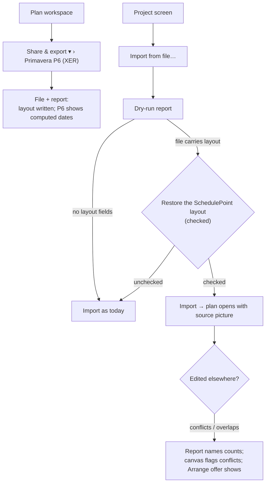

# Feature Spec: Layout interchange — a plan's picture survives export and re-import

- **Status:** Accepted — shipped ([ADR-0156](../../adr/0156-a-schedulepoint-layout-travels-in-an-inert-field.md)). Approved 2026-09-24 (product owner) — CQ-1 (A), CQ-2 (A); FC-6 recorded as unobserved. See `m4-verdict.md`
- **Author(s):** feature-analyst agent
- **Date:** 2026-09-24
- **Tracking issue / epic:** _(none yet)_
- **Roadmap link:** _(none — an interchange-fidelity epic extending ADR-0050 M4)_
- **Implementation plan:** [`./implementation-plan.md`](./implementation-plan.md)
- **Related ADR(s):** a draft, [`./adr-draft.md`](./adr-draft.md) — **ADR-0156** (next free number:
  `docs/adr/` holds up to `0155-a-finish-milestone-is-dated-by-the-day-it-closes.md`, listed
  2026-09-24; **re-verify at filing**, ADR-0079 records a number being taken between plan and
  milestone). It amends ADR-0148 D7, ADR-0050's mapping contract and ADR-0069 §2/§4, and applies
  ADR-0153's "an overlap that existed before is not this command's to fix" at import.

---

## 0. What changed while reading the code

The brief was checked claim by claim (CLAUDE.md §19.11). Most of it holds. **Ten findings change or
constrain the design**; each names what was read. No shell was available to this analyst, so the
brief's _measured_ figures (58 placements, 12 repacked lanes, finish 28 Feb 2031, 12 critical) were
**not re-run here**; M0-T1 re-takes them as the characterisation before anything is built.

### 0.1 The "no format can carry a placement" premise is about foreign tools, and this design makes it false for our own files

Three places state that a hand-placement can never arrive through interchange, and each argues from
it:

- `packages/interchange/src/import-graph.ts:176-193` — "**No parser writes it and no emitter reads
  it** … there is no candidate column to discover … It is deliberately **not** on the canonical model:
  a slot there would reserve space for something that can never arrive."
- `packages/interchange/src/export-mapper.ts:197-206` — the same argument, and "ONE producer. Neither
  `export-xer.ts` nor `export-mspdi.ts` repeats it."
- `docs/adr/0050-schedule-interchange-canonical-model.md:134` — the mapping-contract row.

The premise is true of **P6 and MS Project as producers**. It becomes false the moment SchedulePoint
writes its own field: then a placement **can** arrive, from a file SchedulePoint wrote. The two gates
that encode the old premise must therefore be **amended deliberately**, never dodged:

- `visual-placement.structural.spec.ts:29-48` asserts that neither serialiser mentions `visualStart`.
  Renaming the field on the canonical model (e.g. to `placedStart`) would keep that test green while
  making it vacuous — the gate-gaming shape ADR-0058 warns about. The test is **rewritten** to state
  the new rule (see §4.6), and verified red against the old one.
- `visual-placement.spec.ts:134-138` asserts the canonical model is byte-identical with and without a
  placement. That parity limb is **withdrawn and replaced**, not quietly edited.

### 0.2 Lanes never reach interchange in either direction

- Export: `apps/api/src/modules/interchange/export.service.ts:201-224` maps every activity field into
  the export graph **except** `laneIndex`; the export graph is the import-graph shape
  (`export-graph.ts:42-43`), which has no lane field (`import-graph.ts:149-195`).
- Import: `interchange.service.ts:511-530` assigns `laneIndex` = the activity's position in the graph,
  then phase 3 re-packs every dated activity (`:352-359`, `packImportedLanes` `:1061-1123`).

So the brief's "rows are repacked into 12 lanes" is the designed behaviour of ADR-0069, not a defect —
there was simply nothing to restore.

### 0.3 Phase 3 packs the EARLY span, which would reproduce the #663 defect on every restored plan

`ActivityRepository.findLayoutRowsForPlan` selects `earlyStart`/`earlyFinish` only
(`apps/api/src/modules/activities/activity.repository.ts:207-224`) and `packImportedLanes` packs on
them (`interchange.service.ts:1074-1085`). The web fixed exactly this for `Arrange` (ADR-0153's
context; `apps/web/src/features/tsld/model/arrange-lanes.ts:80-93` packs `drawnDaySpan(a, 'visual')`,
which reads `visualEffectiveStart/Finish` and adds the finish-milestone axis shift,
`apps/web/src/features/tsld/model/drawn-span.ts:55-62`). The server was never changed.

Today that is **nearly** harmless: a foreign import has no placement, so its effective dates equal its
early dates (ADR-0148 D2's post-D0 parity). Two consequences follow:

1. **With placements imported it would be wrong outright** — any activity still needing a lane would be
   placed against spans the canvas does not draw.
2. **The finish-milestone shift is already missing today.** ADR-0155 decision 8 puts a finish milestone
   one axis day later than its date (`apps/web/src/lib/milestone-day.ts:24-26`); phase 3 does not. On
   a seven-day calendar a finish milestone dated Friday and a task starting Saturday share a lane
   under phase 3 and overlap under the web's predicate, so a freshly imported plan can open with
   `Arrange`'s overlap offer already showing. **Reasoned from the two code paths, not observed**;
   M0-T4 measures it.

### 0.4 ADR-0050's contract says foreign UDFs are "dropped + reported". They are dropped silently.

`docs/adr/0050-…md:136` lists UDFs as "**dropped + reported**". The XER adapter reads seven named
tables (`xer-adapter.ts:40-49`) and nothing enumerates the rest: the full file was read and contains
no table-level drop finding, and a grep of `packages/interchange/src` for `UDF` finds only a comment
(`report.ts:22`) and a parser fixture (`xer-parser.spec.ts:174-182`). The parser **keeps** unknown
tables (`xer-parser.ts:102-109, 272-276`), so the rows are available — nobody reads them. This matters
here because the importer will start reading `UDFTYPE`/`UDFVALUE`; the honest contract row falls out
of the same code (§4.5).

### 0.5 No real P6 has ever been observed opening a SchedulePoint XER

The one `.xer` in the repository (`packages/engine-conformance/fixtures/p6_torture_test_v1.xer:1`)
has an `ERMHDR` reading `… SchedulePoint SchedulePoint …` — it was written by us, not by P6.
`docs/specs/schedule-interchange/implementation-plan-export.md:281` lists "manual open smoke" as the
mitigation for "Exported file rejected by real P6"; a grep of `docs/` for `opened in P6`, `real P6`,
`import into P6` finds no record of it being run. **The UDF tables proposed here add a new way for P6
to refuse or alter a file on top of a claim that was already unobserved.** That is why CQ-1 exists.

### 0.6 The UDF table shape is documented, not observed

From Oracle's _XER Import/Export Data Map_ via search-result excerpts (the pages at
`docs.oracle.com` are **blocked by this environment's egress proxy**, so the pages themselves were not
read): `UDFTYPE` carries `udf_type_id`, `table_name`, `udf_type_name`, `udf_type_label`,
`logical_data_type`; `UDFVALUE` carries `udf_type_id`, `fk_id`, `proj_id`, `udf_date`, `udf_number`,
`udf_text`, `udf_code_id`; logical types include `FT_TEXT`, `FT_INT`, `FT_FLOAT_2_DECIMALS`,
`FT_START_DATE`, `FT_END_DATE`. This repository has never seen a real P6 file carrying a UDF — the
same position ADR-0071 §5 refused to code an assignment-lag column from. Here the refusal would be
wrong, because **we are the only reader that must understand these fields**; P6 must merely tolerate
them. So the design proceeds, the exact `%F` lines are fixed in M0-T2 against a real sample if one
can be obtained (CQ-1), and every P6-tolerance statement in this spec is labelled
**reasoned from documentation, not observed**.

### 0.7 The NetPoint plan is not in `packages/seed`

The brief says `plan:reference-netpoint-power-plant` is "seeded by `packages/seed` reference tier".
It lives in `apps/seed-cli/src/references/netpoint-power-plant.ts` (`packages/seed/src` has no
reference tier: grep for `reference` finds only unrelated uses). Precedent for importing it from the
API workspace exists in a script (`apps/api/scripts/measure-finish-milestone.mts:31-32`); whether the
API e2e compile admits it is unverified (M0-T3), and the fallback is moving the spec into
`@repo/seed`. The plan itself carries 14 rows `0–13` including two single-bar rows 8 and 9
(`netpoint-power-plant.ts:124-206`), every bar placed (`:63-96`), on a seven-day calendar (`:46`).

### 0.8 MSPDI cannot promise identical placements even with layout carried

MSPDI export drops a calendar's hours-per-day (`packages/interchange/src/mspdi-emit.ts:425-431`), so
a round trip re-derives it from shifts; on a calendar whose declared day is not its shift total, every
duration — and therefore every placed instant — can move. Add `docs/TECH_DEBT.md` #386 (milestone type
inferred from logic) and the fact that `ExtendedAttribute` appears **nowhere** in
`packages/interchange/src` (grep: 0 hits). MSPDI is therefore a separate, optional milestone (CQ-2).

### 0.9 What the columns and the write paths already enforce

`activities.visual_start` is `DATE` (`apps/api/prisma/schema.prisma:1287`), `lane_index` is
`Int NOT NULL DEFAULT 0` (`:1102`). The placements batch validates a lane `0 … 10000`
(`update-placements.dto.ts:96-99`) and refuses to place a `WBS_SUMMARY` (`activities.service.ts:
842-848`); the single-activity PATCH validates `visualStart` as a calendar date with no range
(`update-activity.dto.ts:300-304`). The importer must apply the same rules, or an import becomes a
way to write what the API refuses.

### 0.10 A new report count breaks a pre-release browser tab

`interchangeCountsSchema` and `interchangeReportSchema` are `.strict()` (`report.ts:50-64, 107-126`)
and the dry-run parses with `.parse` (`apps/web/src/features/interchange/api/use-interchange.ts:122`).
A new `mapped` key therefore **throws** in a tab loaded before the release. Because the new keys are
**omitted when zero** (the existing idiom, `import-xer.ts:205-213`), only a file that carries layout
can trigger it, and only a post-release instance can produce one. Stated in §4.9, not guarded.

---

## 1. Business understanding

### Problem

A planner who lays a programme out by hand in SchedulePoint — every bar placed, every row chosen —
cannot move that picture to another SchedulePoint instance. Export → import preserves the network
exactly (the brief measured finish, critical set and milestone types identical through XER), but
**every hand-placed start and every row is lost**: 0 of 58 placements on the NetPoint reference plan,
rows re-packed from the source's 14 into 12. The receiving plan computes the same schedule and draws
a different diagram.

For a Graphical Path Method product the diagram **is** the plan (ADR-0148). Losing it on transfer
means a planner who builds a programme locally cannot hand it to their team's deployed instance, and a
reference plan built to compare against NetPoint cannot be moved to the machine it is compared on.

### Users

| Role                         | Need                                                                          |
| ---------------------------- | ----------------------------------------------------------------------------- |
| Planner / Org Admin (import) | Import a SchedulePoint-written file and get the picture that was exported.    |
| Any member (export)          | Export a plan whose file carries its layout, without choosing a special mode. |
| P6 recipient (outside)       | Receive a file that still opens and schedules as it does today.               |
| Contributor / Viewer / Guest | Nothing new. Viewer and Contributor can already export; they gain the layout. |

### Primary use cases

1. **Instance to instance.** Export the NetPoint plan from a local instance, import into the deployed
   app, see the same diagram.
2. **Round trip through P6.** Export to a P6 user, who edits and re-exports; import back and get the
   original layout where it still applies, with the parts it no longer describes reported.
3. **Genuine foreign file.** A P6 file SchedulePoint never wrote imports exactly as today.

### User journeys

Export: plan workspace → **Share & export ▾** → **Primavera P6 (XER)** → file downloads, report reads
"58 hand-placed starts and 14 rows written as SchedulePoint layout fields; P6 and other tools show
computed dates". Import: project screen → **Import from file…** → dry-run shows "SchedulePoint layout:
58 placed starts, 58 rows" with **Restore the SchedulePoint layout** checked → **Import** → the plan
opens with the source picture. See the user-flow diagram in §4.3.

### Expected outcomes

A SchedulePoint→SchedulePoint XER round trip is **layout-exact**; a P6 file is unchanged; and the
mapping contract states truthfully, in both directions, what travels and what a foreign tool does
with it.

### Success criteria

Stated as falsification conditions in §5 and committed before building (M0-T0). The headline:
**NetPoint XER round trip — every placement and every row identical, every drawn span identical,
finish and critical set identical; a foreign P6 file imports to the same graph and the same persisted
rows as today.**

### Open questions

Critical questions are in §6 with a recommended default each. Everything else is decided below with
its default stated.

---

## 2. Functional requirements

### User stories & acceptance criteria

> **US-1** — As any member who can export, I want a P6 export to carry the plan's layout, so that
> another SchedulePoint instance can restore it.
>
> - **Given** a plan with placements and rows **when** I export XER **then** the file carries one
>   SchedulePoint placed-start value per placed activity and one row value per activity (including
>   WBS summaries), in namespaced user-defined fields (§4.4).
> - **Given** the same export **then** the report carries **one** aggregate finding (kind
>   `approximation`, entity `activity`) naming the counts and stating that P6 and other tools read
>   computed dates. It no longer says the placement "is not written" (`export-mapper.ts:219-221`).
> - **Given** a plan nobody has placed **then** the row field is still written (every plan has rows)
>   and the placement finding is absent (the "only when there is something to lose" rule,
>   `export-mapper.ts:199-201`, kept for placements).

> **US-2** — As a Planner importing a SchedulePoint-written file, I want its layout restored by
> default, so that the diagram matches the exported one.
>
> - **Given** a file with layout fields **when** the dry-run runs **then** the report shows the counts
>   (`mapped.placements`, `mapped.lanes`) and the dialog shows **Restore the SchedulePoint layout**,
>   checked.
> - **Given** I commit with it checked **then** every carried placement is written to `visual_start`
>   and every carried row to `lane_index`; phase 3 does not re-pack any activity that carried a row.
> - **Given** the NetPoint plan **then** FC-1 holds.

> **US-3** — As a Planner importing a genuine P6 file, I want nothing to change.
>
> - **Given** a file with no SchedulePoint layout fields **then** the import graph, report and every
>   persisted column are identical to the pre-epic baseline captured in M0 (FC-2) — the only permitted
>   difference is the one ADR-0050's contract already promised and never delivered: a single `drop`
>   finding naming foreign UDF types, when the file has any (§0.4, §4.5).

> **US-4** — As a Planner importing a file that was edited in another tool after SchedulePoint wrote
> it, I want the layout applied where it still describes the plan, and told where it does not.
>
> - **Given** activities with no row field (added in P6) **then** each is placed in the nearest free
>   row beside its predecessors; **no activity that carried a row is moved** (FC-3).
> - **Given** a restored placement now earlier than its logic allows **then** the engine flags it as it
>   would any placement (ADR-0148 D5) and the commit report names the count in one finding.
> - **Given** two carried rows now overlap because a duration changed **then** they are left
>   overlapping, and the report says so and points at **Arrange** (ADR-0153: an overlap the command
>   did not create is not its to fix).

> **US-5** — As a Planner, I want to decline the layout when I know the file's picture is stale.
>
> - **Given** I uncheck **Restore the SchedulePoint layout** **then** the import behaves exactly as for
>   a foreign file (no `visual_start` written, every activity packed by phase 3) and the report records
>   that the layout was present and not applied.

> **US-6** — As anybody reading an import report, I want the layout's handling stated, never implied.
>
> - Every discarded layout value is counted by reason in `repairs` (malformed date, lane out of range,
>   unknown activity, duplicate value, placement on a WBS summary, a newer layout version).

### Workflows

1. **Export** — `ExportService.readGraph` adds `laneIndex`; the export mapper builds a canonical
   `layout` per activity; the XER emitter writes `UDFTYPE` + `UDFVALUE` through one module; the
   mapper raises the one aggregate finding.
2. **Import dry-run** — the XER adapter reads `UDFTYPE` rows whose `table_name` and label match the
   known set exactly, joins `UDFVALUE` by `udf_type_id` and `fk_id`, validates each value, and sets
   `layout` on the canonical activity; the mapper passes it to the import graph; the report counts it.
3. **Import commit** — phase 1 writes `visualStart`/`laneIndex` when restoring; phase 2 recalculates
   (unchanged); phase 3 runs in one of three modes (§4.7); a post-recalc read appends the
   conflict-count finding.

### Edge cases

| Case                                                       | Behaviour                                                                                                           |
| ---------------------------------------------------------- | ------------------------------------------------------------------------------------------------------------------- |
| Every activity carries a row                               | Phase 3 does nothing.                                                                                               |
| Some carry rows, some do not                               | Carried rows verbatim; the rest placed by `rowOccupancy` against the drawn spans (§4.7).                            |
| None carries a row (placements only, or row field deleted) | Phase 3 packs all, as today, on the drawn span.                                                                     |
| Placement on a `WBS_SUMMARY`                               | Never written by the emitter (summaries are `PROJWBS` rows); on read, discarded + `repair` finding.                 |
| Placement on a started / complete / LOE activity           | Carried verbatim; the engine already decides what Pass 2 does with it (ADR-0148 D0).                                |
| Finish milestone placement                                 | Carried as the stored date string; its end-of-day meaning is the v1 rule (§4.4, ADR-0155).                          |
| Lane value `"3.00"` from a P6 re-export of an `FT_INT`     | Accepted if it is an integer in `0 … 10000`; otherwise discarded + `repair`.                                        |
| Two `UDFVALUE` rows for one field and activity             | First in file order wins; the rest discarded + one `repair` finding with the count.                                 |
| `UDFVALUE.fk_id` names no `TASK`/`PROJWBS` row             | Discarded + counted.                                                                                                |
| Label `SchedulePoint layout v2: …` (a newer version)       | Not read; one `drop` finding: "written by a newer SchedulePoint; not applied".                                      |
| Label differing by one character / case                    | Treated as a foreign UDF (exact match only).                                                                        |
| Two `UDFTYPE` rows with an identical known label           | The lowest `udf_type_id` in file order is used; one `repair` finding.                                               |
| Multi-project XER                                          | Only `UDFVALUE` rows whose `proj_id` is the imported project (or empty) are read — the ADR-0050 first-project rule. |
| Importing instance older than the reader milestone         | Imports exactly as today: the adapter never reads `UDFTYPE`/`UDFVALUE` (`xer-adapter.ts:40-49`).                    |
| Placed date implausibly far away                           | Accepted exactly as the PATCH API accepts it (`update-activity.dto.ts:300-304` has no range); not a new hole.       |

### Permissions

No new permission. Export stays `interchange:export` (every member, `export.service.ts:108`); import
stays `interchange:import` (Planner + Org Admin, `interchange.service.ts:1168`), org-scoped,
deny-by-default. External Guests reach neither. The commit already takes the pen for phases 2–3
(`interchange.service.ts:279`, ADR-0028); writing `lane_index` in phase 3 stays inside that window.
`visual_start` is written in phase 1, on a plan the importer has just created and nobody else can
see, exactly like every other definition column today.

### Validation rules

| Field                     | Rule                                                                                                      |
| ------------------------- | --------------------------------------------------------------------------------------------------------- |
| Placed start (`udf_text`) | `^\d{4}-\d{2}-\d{2}$` and a real calendar date (the `IsCalendarDate` semantics the DTOs use).             |
| Row (`udf_number`)        | Finite, integer, `0 … 10000` (the placements-batch ceiling, one shared constant).                         |
| Field identity            | `UDFTYPE.table_name ∈ {TASK, PROJWBS}` **and** `udf_type_label` exactly one of the known labels.          |
| Lookup safety             | Labels resolved through a `Map`/`Object.hasOwn` table, never a plain object (`xer-adapter.ts:125-135`).   |
| `restoreLayout` option    | Multipart string `RESTORE` \| `IGNORE`, `@IsIn`, default `RESTORE` (the `globalCalendarScope` precedent). |

### Error scenarios

| Scenario                                       | Detection                       | User-facing result                                 | Status |
| ---------------------------------------------- | ------------------------------- | -------------------------------------------------- | ------ |
| Unknown `restoreLayout` value                  | `@IsIn`                         | invalid request, field-level message               | 422    |
| Malformed layout value in the file             | pure reader validation          | import proceeds; value discarded; `repair` finding | 200    |
| Phase-3 placement of un-rowed activities fails | best-effort catch (ADR-0069 §3) | plan kept; rows left as imported; warning logged   | 200    |
| Everything else                                | unchanged from ADR-0050         | unchanged                                          | —      |

---

## 3. Technical analysis

| Area           | Impact | Notes                                                                                                                                                                                                                                                                                         |
| -------------- | ------ | --------------------------------------------------------------------------------------------------------------------------------------------------------------------------------------------------------------------------------------------------------------------------------------------- |
| Frontend       | low    | Import dialog: two counts and one checkbox (the `globalCalendarScope` checkbox precedent, which re-runs the dry-run). Export surface unchanged.                                                                                                                                               |
| Backend        | med    | `@repo/interchange`: one new module (XER layout fields), canonical + import-graph fields, adapter/emitter/mapper hooks. `interchange` module: persist + phase 3.                                                                                                                              |
| Database       | none   | **No schema change**: `visual_start` and `lane_index` exist (`schema.prisma:1287, :1102`). One repository projection widens (`findLayoutRowsForPlan`). Not a migration, so database-architect is **not engaged — there is nothing to design**, not because a change was judged small (§19.3). |
| API            | low    | One optional multipart field on dry-run/commit; two optional report counts. OpenAPI + `docs/API.md`.                                                                                                                                                                                          |
| Security       | med    | Untrusted-file parsing gains two tables: exact-label match, bounded values, `Map` lookups, no new row cap needed (the parser's 1M-row cap applies, `xer-parser.ts:40-44`).                                                                                                                    |
| Performance    | low    | O(rows) read; phase 3 does **less** work when rows are carried. Export adds two tables, O(activities).                                                                                                                                                                                        |
| Infrastructure | none   | No new service, env var or CI job. `@repo/layout` gains two exports (already in the build contract).                                                                                                                                                                                          |
| Observability  | low    | The commit's `interchange commit laid out lanes` log gains the mode (`carried` / `partial` / `packed`) and counts.                                                                                                                                                                            |
| Testing        | high   | Pure unit + fixtures; API e2e round trip on NetPoint; a P6-edit simulation; foreign-file characterisation; web journey extension.                                                                                                                                                             |

### Dependencies

- **`docs/TECH_DEBT.md` #386's minimum fix** (in flight, coordinator) touches `mspdi-adapter.ts`. The
  XER milestones do not touch that file; the optional MSPDI milestone (M5) must start after it lands.
- **ADR-0155** is shipped: stored placements already carry the end-of-day meaning for finish
  milestones, so the file carries the stored date verbatim.
- **PR #663 / ADR-0153** web `drawnDaySpan` is the span M1 makes the server share.

### Engine parity

`computeSchedule` is not modified. On the foreign-file path its arguments are byte-identical to today,
because nothing sets `visualStart` or `laneIndex` from the file. On the layout path the arguments differ
**only in `visualStart`**, an input that already exists and that reaches **Pass 2 only** (ADR-0148 D2;
`compute.spec.ts` untouched), so the finish date and critical set cannot change — which is FC-1's second
limb, measured rather than assumed. `lane_index` never reaches the engine (ADR-0069 Consequences).

---

## 4. Solution design

### 4.1 Architecture overview

```mermaid
flowchart LR
  subgraph web[apps/web]
    EXP["Share & export ▾ › Primavera P6 (XER)"]
    IMP["Import from file… dialog<br/>+ Restore the SchedulePoint layout"]
  end
  subgraph api[apps/api interchange module]
    ES[ExportService.readGraph<br/>+ laneIndex]
    IS[InterchangeService.commit<br/>phase 1 writes visualStart/laneIndex<br/>phase 3 mode: carried / partial / packed]
  end
  subgraph pkg["@repo/interchange (pure)"]
    EM[export-mapper<br/>canonical.layout + one finding]
    LF["xer-layout-fields.ts<br/>(the ONLY module naming the fields)"]
    XE[xer-emit] --> LF
    XA[xer-adapter] --> LF
    MP[mapper → import graph<br/>visualStart + laneIndex]
  end
  subgraph lay["@repo/layout (pure)"]
    DS[drawnSpanDays + finishMilestoneDayShift]
    RO[rowOccupancy / packLanes]
  end
  EXP --> ES --> EM --> XE
  IMP --> IS --> XA --> MP
  IS --> DS
  IS --> RO
  web -. drawn-span.ts re-exports .-> DS
```

### 4.2 Data flow

```mermaid
sequenceDiagram
  participant A as Instance A (export)
  participant F as .xer file
  participant B as Instance B (import)
  participant E as CPM engine
  A->>A: readGraph (visualStart, laneIndex)
  A->>F: TASK/PROJWBS rows + UDFTYPE + UDFVALUE (namespaced v1 labels)
  Note over F: P6 ignores these for scheduling (reasoned, §0.6)
  F->>B: dry-run: read UDFTYPE by exact label, join UDFVALUE, validate
  B-->>B: report: mapped.placements / mapped.lanes + repairs
  B->>B: phase 1: create rows with visual_start + lane_index
  B->>E: phase 2: recalculate (unchanged)
  E-->>B: visual_effective_*, visual_conflict_reason
  B->>B: phase 3: carried → skip; partial → rowOccupancy for un-rowed only
  B-->>B: post-recalc finding: N restored placements now in conflict
```

### 4.3 User flow



### 4.4 The field contract (XER)

Written by **one module**, `packages/interchange/src/xer-layout-fields.ts`, which owns the labels, the
encode and the decode. Nothing else names a label.

| Field (label, exact)                    | `table_name` | `logical_data_type` | Value column | Written for                         |
| --------------------------------------- | ------------ | ------------------- | ------------ | ----------------------------------- |
| `SchedulePoint layout v1: placed start` | `TASK`       | `FT_TEXT`           | `udf_text`   | each activity with a `visual_start` |
| `SchedulePoint layout v1: lane`         | `TASK`       | `FT_INT`            | `udf_number` | every non-summary activity          |
| `SchedulePoint layout v1: lane`         | `PROJWBS`    | `FT_INT`            | `udf_number` | every `WBS_SUMMARY`                 |

Decisions, each with its reason:

- **The date is text, not a P6 date type.** A stored placement is a `DATE` with no time
  (`schema.prisma:1287`) whose meaning for a finish milestone is the **end** of that day (ADR-0155
  decision 3). `FT_START_DATE`/`FT_END_DATE` would put a datetime in `udf_date` and invite P6 to
  interpret, display or shift a time of day; `FT_TEXT` carries exactly the ten characters stored, with
  no timezone and no time. The cost is that a P6 user sees a text column rather than a date — accepted,
  because P6 is not meant to act on it.
- **`v1` is the rule, not decoration.** `v1` means "the stored `visual_start` under ADR-0155's
  end-of-day rule for finish milestones". A future change to what a stored placement means bumps the
  label, and a reader that does not know the version reports it rather than misreading it.
- **Identity is the label, never `udf_type_name` or `udf_type_id`.** Both are database-local in P6 and
  are expected to be renumbered/renamed on a P6 re-export (**reasoned, not observed**); the join inside
  one file uses the file's own ids.
- **Not gated on `ERMHDR`.** A P6 re-export of our file carries a P6 header and still carries our
  fields, which is the use case US-4 exists for.
- **Row is written for every activity.** Every plan has rows (`lane_index NOT NULL`), so there is
  nothing to "lose" to condition on; the placement field keeps the existing only-when-present rule.
- **No activity-type field in XER.** `task_type` already round-trips every type exactly
  (`xer-emit.ts:46-52`; the brief measured it). The type field belongs to the MSPDI option (§4.10).

`UDFTYPE` rows are emitted with the documented columns only (§0.6); M0-T2 either copies a real sample's
`%F` line or records that none was available.

### 4.5 Model changes (pure package)

- **Canonical:** `canonicalActivitySchema` gains an **optional** `layout: { placedStart: isoDate | null;
lane: int | null }`. Optional, so every existing fixture and the MSPDI adapter parse unchanged, and
  `.strict()` still holds. The docblock replaces §0.1's "can never arrive" with the true statement:
  _a foreign tool never produces one; SchedulePoint's own XER does_.
- **Import graph:** gains `laneIndex: int 0…10000, nullish`. `visualStart` already exists
  (`import-graph.ts:193`); its docblock is rewritten the same way.
- **Export graph:** is the import-graph shape (`export-graph.ts:42-43`), so it gains `laneIndex` for
  free; `ExportService.readGraph` sets it.
- **Report:** `mapped.placements` and `mapped.lanes`, optional, **omitted when zero**.
- **Foreign UDF drop (§0.4):** when a file has `UDFTYPE` rows that are not ours, one `drop` finding:
  "N user-defined field type(s) were not imported". This makes ADR-0050:136 true. It is the only report
  change a foreign file can see, and FC-2 names it.

### 4.6 The one-producer rule, restated

The rewritten `visual-placement.structural.spec.ts` asserts:

1. The placement **finding** still has one producer, `export-mapper.ts` (unchanged rule).
2. Only `xer-layout-fields.ts` contains any layout label string; `xer-emit.ts` and `xer-adapter.ts`
   import it; `mspdi-emit.ts`, `mspdi-serialiser.ts`, `export-mspdi.ts` and `mspdi-adapter.ts`
   mention neither the labels nor `layout` (until M5, which edits this assertion on purpose).
3. A pinned positive: `xer-layout-fields.ts` **does** contain both labels — without it, every
   assertion above passes against a repository in which the feature does not exist (ADR-0093).

Each verified red against a named mutation before it lands (ADR-0110 D5).

### 4.7 Phase 3 at import — three modes

Chosen after phase 2, from the rows the commit wrote:

| Mode      | When                                           | What phase 3 does                                                                                                                                                                                                                                           |
| --------- | ---------------------------------------------- | ----------------------------------------------------------------------------------------------------------------------------------------------------------------------------------------------------------------------------------------------------------- |
| `packed`  | no activity carried a row (foreign, or IGNORE) | `packLanes` over every dated activity, **on the drawn span** (M1) — today's behaviour with §0.3's defect fixed.                                                                                                                                             |
| `carried` | every dated activity carried a row             | nothing. No write, no version bump.                                                                                                                                                                                                                         |
| `partial` | some did, some did not                         | carried rows are fixed; each un-rowed activity, in drawn-start then id order, takes `rowOccupancy(...).nearestFree` starting from the mean row of its already-rowed predecessors (the `packLanes` hint rule) or row 0. Carried rows are never moved (FC-3). |

**Overlaps among carried rows are not resolved.** ADR-0153 decision 1 resolves only overlaps a command
created; at import there is no "before" to compare with, and resolving would silently move work in the
exact case (a clean SchedulePoint round trip whose source already accepted an overlap) where nothing
changed. The post-recalc finding counts them with the web's overlap predicate and names **Arrange**,
which already offers the fix on the canvas (`arrange-lanes.ts:70-74`).

**The drawn span is shared, not reimplemented** (ADR-0069 §1's argument): `finishMilestoneDayShift`
and a pure `drawnSpanDays({ type, start, finish }, dayOf)` move into `@repo/layout`; the web's
`lib/milestone-day.ts` and `drawn-span.ts` re-export/delegate (barrel-preserving, ADR-0078), and
`finish-milestone-day.structural.test.ts` stays green unedited — that is the before/after oracle.
`findLayoutRowsForPlan` widens its projection to `type`, `visualEffectiveStart`,
`visualEffectiveFinish`; the plan's data date is `plannedStart`.

### 4.8 Database, API and component changes

- **Database:** none (§3). The widened projection is a `select`, not a schema object.
- **API:** `InterchangeImportOptionsDto` gains `restoreLayout?: 'RESTORE' | 'IGNORE'` on dry-run and
  commit (dry-run needs it so the report describes the import being confirmed — the ADR-0053 M6
  `globalCalendarScope` rule). Report schema gains the two optional counts. Export endpoint unchanged;
  its OpenAPI description (`plan-export.controller.ts:50-54`) and `docs/API.md` say what the file now
  carries. No new route, no new permission, no audit change (`interchange.imported`'s `findingCount`
  already covers a non-clean import, `interchange.service.ts:334-337`).
- **Components:** `InterchangeReportTable` renders the two counts when present (it renders three
  today, `InterchangeReportTable.tsx:19-21`); `ImportScheduleDialog` renders the checkbox **only when
  the dry-run found layout** — omitted, not shaded, when the file has none (ADR-0082: the option does
  not apply to the object). Hand-rolled primitives, existing tokens, the checkbox wired to its
  description with `aria-describedby`; toggling re-runs the dry-run like the calendar-tier checkbox.

### 4.9 Consequences stated rather than guarded

- **Pre-release tab** (§0.10): a tab loaded before the reader release that imports a layout-carrying
  file sees the dry-run fail until refresh. Only a post-release instance can produce such a file.
- **An older importing instance ignores the layout silently** (§0.4's mechanism). Moving the picture to
  the deployed app needs it at or past the reader milestone; with ADR-0047 auto-pull that is the
  normal state, and the report of an older instance simply says nothing about layout.
- **A P6 recipient's database gains two UDF definitions** when they import our file — P6 UDFs are
  defined per database, not per project (**reasoned from vendor documentation, not observed**). That
  is the price CQ-1 asks the product owner to accept or refuse.
- **A placement stays advisory after a foreign edit.** If a P6 user moved an activity **earlier** by
  removing logic, the restored placement holds the bar where it was drawn and nothing flags it
  (over-placement is allowed by design, ADR-0148 D5). US-5's checkbox is the escape; the report's
  layout line says the layout "describes the picture when SchedulePoint exported it".

### 4.10 Scope option: MSPDI (and the activity type, per `docs/TECH_DEBT.md` #386)

MS Project's `ExtendedAttribute` mechanism could carry the same three fields **plus the SchedulePoint
activity type**, which would make a SchedulePoint→SchedulePoint MSPDI round trip keep finish milestones
as finish milestones — #386's second remedy — without changing how a genuine MS Project file is read.
**Recommended default: not in this epic; recorded as optional M5**, with the type field included when
it is built, because:

1. MSPDI cannot promise identical placed instants anyway (§0.8: hours-per-day is dropped), so the
   epic's headline condition could not be met through MSPDI on a working-hours calendar;
2. field IDs and the `<ExtendedAttributes>` definition block have never been read against a real MS
   Project file here (grep: 0 hits), which is the ADR-0071 §5 position and needs a real sample first;
3. `mspdi-adapter.ts` is being changed now for #386's minimum fix, and M5 must follow it.

XER needs no type field (`task_type` is exact, §4.4).

### 4.11 Reconciling ADR-0148 D7

D7 refuses to **translate** a placement into a constraint, because a constraint in an XER would "put
back, in somebody else's tool, exactly the conflation this epic removed". A `FT_TEXT` UDF is not a
scheduling input to P6 — it is displayed data (**reasoned from vendor documentation**) — so the reason
is honoured in full: nothing a foreign tool schedules from changes. What changes is D7's **statement**
and its consequence in the contract table ("the export carries one aggregate finding and the mapping
contract records the drop"). The draft ADR amends D7 to: _export never translates a placement into
anything a foreign tool schedules from; it may carry it, and the row, in inert fields namespaced to
SchedulePoint, which only SchedulePoint reads._

### 4.12 Alternatives considered

| Alternative                                           | Why not                                                                                                                                                                   |
| ----------------------------------------------------- | ------------------------------------------------------------------------------------------------------------------------------------------------------------------------- |
| Translate placement to `SNET`                         | Refused by ADR-0148 D7, for the reason §4.11 keeps.                                                                                                                       |
| A private XER table (`%T SP_LAYOUT`)                  | P6's handling of an unknown table is unknown **and** has no documented behaviour to reason from; UDFs are P6's own extension mechanism and survive a P6 re-export (US-4). |
| A sidecar layout file / a native SchedulePoint format | Two files to keep together, or a third format; loses US-4 entirely. Kept as the fallback if CQ-1 finds P6 refuses UDF tables.                                             |
| A separate "SchedulePoint (XER + layout)" menu item   | CQ-1's alternative answer. Adds a choice a planner must know to make, and an ordinary export would silently lose the picture again.                                       |
| Resolve imported overlaps (ADR-0153 at import)        | Moves work in a clean round trip whose source accepted an overlap (§4.7).                                                                                                 |
| Re-pack everything and restore only placements        | The brief's measured defect: rows are half the picture.                                                                                                                   |
| Encode placement as `FT_START_DATE`                   | Invites a time of day and P6 date handling onto a date-only value whose end-of-day meaning is ours (§4.4).                                                                |

---

## 5. Falsification and acceptance conditions

Committed **alone, before any code** (M0-T0, ADR-0128's ordering). Each names its instrument.

| #    | Condition                                                                                                                                                                                                                                                                                                                                                                                                      | Instrument                                               |
| ---- | -------------------------------------------------------------------------------------------------------------------------------------------------------------------------------------------------------------------------------------------------------------------------------------------------------------------------------------------------------------------------------------------------------------- | -------------------------------------------------------- |
| FC-1 | **NetPoint XER round trip:** for every activity, `visualStart`, `laneIndex`, `visualEffectiveStart`, `visualEffectiveFinish` and `visualConflictReason` equal the source (58/58 placements per the brief, re-derived in M0-T1); project finish and the critical set equal the source. Compared by activity **code**, never by id.                                                                              | API e2e, seeded through the public API                   |
| FC-2 | **Foreign-file parity:** for every XER fixture the repository imports today, the import graph (JSON) is byte-identical to the M0 baseline, the report is identical except the one foreign-UDF `drop` line where the fixture has foreign UDFs, and every persisted column is identical — `lane_index` included, measured against the **post-M1** baseline.                                                      | pure golden + API e2e, baseline captured in M0 before M1 |
| FC-3 | **Edited-elsewhere file:** exported NetPoint XER mutated (a duration lengthened on the critical spine; a new `TASK` with no layout values; one `UDFVALUE` row corrupted) imports with **0** carried rows moved, the new activity in a row free at its drawn span, the conflict count reported equal to the engine's `visual_conflict` count among restored placements, and one `repair` for the corrupt value. | API e2e                                                  |
| FC-4 | **Namespacing:** a foreign XER carrying `UDFTYPE` rows with near-miss labels (`SchedulePoint layout v1: Lane`, `…v2: row`, `SchedulePoint layout v1:lane`) imports to a graph byte-identical to the same file without those rows; the `v2` case adds exactly one "newer version" `drop`.                                                                                                                       | pure unit                                                |
| FC-5 | **M1 (drawn span at phase 3):** after an import of each catalogue XER fixture, the server port of the web overlap predicate reports **0** overlapping activities. Today's count is measured first (M0-T4) — if it is already 0 everywhere, M1 still lands for the layout path and its commit says the defect was latent.                                                                                       | API e2e + M0 measurement                                 |
| FC-6 | **P6 tolerance — owed, not claimable by CI:** one exported NetPoint XER opens in a real P6 and schedules to the same finish. Recorded **observed** or **unobserved**; unobserved is not a pass and is written as such in the ADR.                                                                                                                                                                              | Product owner (CQ-1)                                     |
| FC-7 | **Export unchanged in scheduling content:** for the rich export fixture, every non-UDF table of the XER is byte-identical to the pre-epic output.                                                                                                                                                                                                                                                              | pure golden                                              |

---

## 6. Critical questions

Only the two whose answers change what gets built. Everything else in this spec is a stated default.

**CQ-1 — Should every XER export carry the layout fields, given no real P6 has ever been observed
opening a SchedulePoint XER (§0.5) and importing ours would add two UDF definitions to a P6 database
(§4.9)?**

- **(A, recommended)** Always, with no new control. The round trip must not depend on a planner
  knowing to choose a special export; P6 does not schedule from UDFs; and the file was already
  unverified in P6 before this epic. Pair it with FC-6: if you (or a colleague) can open one exported
  file in P6, and ideally supply **any real P6-exported XER containing a UDF** so M0-T2 can copy P6's
  own `UDFTYPE`/`UDFVALUE` column lines rather than the documented subset, the P6 risk moves from
  reasoned to observed.
- **(B)** Only on request: a second menu item, **SchedulePoint transfer (XER with layout)**. Choose this
  if P6 recipients are a live audience whose databases must not gain fields.

**CQ-2 — MSPDI in this epic, or later?**

- **(A, recommended)** Later, as optional M5, carrying placement, row **and the SchedulePoint activity
  type** (closing #386's exact-round-trip half), after #386's minimum fix lands and a real MS Project
  file has been read. MSPDI cannot meet FC-1 on a working-hours calendar anyway (§0.8).
- **(B)** Now, alongside XER — adds a milestone, blocks on a real MS Project sample, and ships with
  FC-1 scoped to 24-hour calendars for MSPDI.

**Answered 2026-09-24 by the product owner:** CQ-1 **(A)** — every XER export carries the layout
fields, with no new control. CQ-2 **(A)** — MSPDI later, as optional M5, outside this build. No real P6
is available, so **FC-6 is recorded as unobserved** and cannot be discharged in this epic; the fallback
if a recipient ever reports P6 rejecting a file is CQ-1 (B). No real P6-exported XER was supplied, so
M0-T2 builds the `UDFTYPE`/`UDFVALUE` column lines from Oracle's documented subset.

**Defaults taken without asking** (say if any is wrong): `FT_TEXT` date encoding; row written for every
activity and WBS summary; an import checkbox **Restore the SchedulePoint layout**, checked by default and
shown only when the file carries layout; carried overlaps left for **Arrange**; phase 3 moves to the
drawn span for all imports (M1) as a separate, measured slice; the foreign-UDF `drop` finding added;
no audit-payload change; no `VITE_` flag (ADR-0088 D1 — the rollback is the commit boundary).

---

## 7. Links

- Implementation plan: [`./implementation-plan.md`](./implementation-plan.md)
- ADR draft: [`./adr-draft.md`](./adr-draft.md)
- Docs this change updates: `docs/adr/0050-…md` (mapping-contract rows 134 and 136), ADR-0148 D7 (by
  amendment in ADR-0156), ADR-0069 (phase-3 modes), `docs/API.md` (import option, report counts, export
  contents), `docs/TEST_PLAYBOOK.md` (the NetPoint row gains "round-trips its layout through XER"),
  `docs/TECH_DEBT.md` #386 (cross-reference to M5), CLAUDE.md §16 (ADR-0156 entry at filing —
  `check:adr-coverage` refuses the filing commit without it, ADR-0147).
