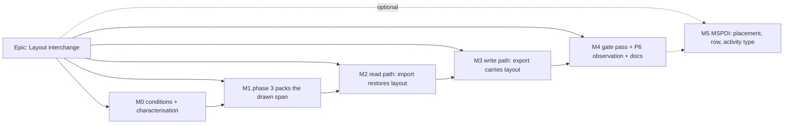

# Implementation Plan: Layout interchange — a plan's picture survives export and re-import

- **Feature spec:** [`./feature-spec.md`](./feature-spec.md)
- **Status:** Draft — awaiting approval before implementation
- **Owner:** _(assigned at approval)_

## Breakdown

### Epic

**Layout interchange** — a SchedulePoint→SchedulePoint XER round trip restores every hand-placed
start and every row, while a genuine P6 file imports exactly as today. Extends ADR-0050 M4; ADR-0156
(draft beside this plan).

### Why this order

- **M1 before M2.** The layout path needs the drawn span on the server (spec §4.7), and phase 3's
  foreign path should not keep a second span basis beside it. M1 is also a defect fix on its own
  (spec §0.3) with its own measured delta, so it ships and is judged alone, and FC-2's lane baseline is
  taken **after** it.
- **Reader (M2) one release before writer (M3)** — the ADR-0107 two-release shape. The deployed
  importer understands the fields before any instance can write them, so there is never a released
  exporter whose report promises a restore that no released importer performs.
- **No `VITE_` flag** (ADR-0088 D1). Each milestone's rollback is its commit boundary.

---

### Milestone M0 — Conditions and characterisation (shippable: docs + tests only)

**Outcome:** the bars exist before anything they judge; today's behaviour is pinned.
**Entry point:** `Ships dark: no product change — conditions, baselines and a sample-request only.`
**Journey:** none (no user-facing claim).

#### Feature: committed conditions and baselines

> **Description:** commit spec §5 verbatim as `conditions.md`, alone; capture the baselines FC-1/FC-2/FC-5
> are judged against; settle the three unverified facts the design leans on.
> **Complexity:** M
> **Dependencies:** approval
> **Risks:** a baseline taken after any code change → M0-T0 is its own commit; each baseline records the commit SHA it ran on.
> **Testing requirements:** the characterisation cases are themselves the tests; each verified to fail against a deliberate mutation.

##### Task M0-T0 — Commit the conditions alone

- **Description:** `docs/specs/layout-interchange/conditions.md` = spec §5, verbatim, one commit, no
  other file.
- **Complexity:** S · **Dependencies:** approval · **Risks:** conditions edited later to fit results →
  any later change is an amendment section with the reason, never an in-place edit.
- **Testing:** n/a.
- **Development steps:** 1. transcribe §5; 2. commit; 3. record the SHA in the plan.

##### Task M0-T1 — Re-take the brief's round-trip measurements

- **Description:** seed `plan:reference-netpoint-power-plant`, export XER, commit-import, and record per
  activity code: `visualStart`, `laneIndex`, effective dates, conflict reason; the finish; the critical
  set; the distinct-row counts. The brief's figures (58 placements lost, 14 → 12 rows, finish
  28 Feb 2031, 12 critical) are **inherited, not yet evidence** (spec §0).
- **Complexity:** S · **Dependencies:** M0-T3 · **Risks:** none material.
- **Testing:** written as the FC-1 e2e skeleton with the restore assertions `it.fails`-marked, so the
  same file becomes FC-1 in M3.
- **Development steps:** 1. write the case; 2. run `scripts/e2e-local.sh api`; 3. record the figures in
  `m0-measurement.md` beside the SHA.

##### Task M0-T2 — Fix the UDF column lines against evidence

- **Description:** if the product owner supplies a real P6-exported XER containing any UDF (CQ-1), copy
  its `%F` lines for `UDFTYPE`/`UDFVALUE`, its `logical_data_type` spellings and its `udf_number`
  formatting into `m0-measurement.md`; otherwise record "none available — documented subset used
  (spec §0.6)". Add the sample (redacted if needed) as a parser fixture.
- **Complexity:** S · **Dependencies:** CQ-1 answer · **Risks:** no sample → the P6-tolerance claim stays
  reasoned; stated in the ADR, not hidden.
- **Testing:** a parser case asserting the sample parses and its UDF tables survive as rows.
- **Development steps:** 1. request sample; 2. record lines or absence; 3. fixture + case.

##### Task M0-T3 — Can the API e2e seed the NetPoint plan?

- **Description:** establish whether `apps/api/test/*.e2e-spec.ts` can import
  `apps/seed-cli/src/references/netpoint-power-plant.ts` (precedent: a script,
  `apps/api/scripts/measure-finish-milestone.mts:31-32`). If not, move `netpointReferencePlan` into
  `@repo/seed` with `apps/seed-cli` re-exporting it (barrel-preserving) and `pnpm check:playbook`
  green.
- **Complexity:** S · **Dependencies:** none · **Risks:** the move touches the seed CLI → its existing
  suite is the oracle and must pass unedited.
- **Testing:** `pnpm --filter @repo/api typecheck` over the e2e tree; `pnpm check:playbook`.
- **Development steps:** 1. try the import; 2. if refused, move + re-export; 3. record which.

##### Task M0-T4 — Measure today's phase-3 overlaps and capture the foreign-file baseline

- **Description:** for every XER fixture imported by the existing e2e suites, record (a) the import
  graph JSON and report, (b) every persisted activity column, (c) the count of activities the **web**
  overlap predicate (drawn span, finish-milestone shift) reports as overlapping after import. (c) is
  FC-5's "before".
- **Complexity:** M · **Dependencies:** none · **Risks:** the web predicate is not callable from the API
  → port it into the harness by importing `drawnDaySpan` logic verbatim, with a comment that M1
  replaces the port with the shared function.
- **Testing:** the baseline file is committed; a case asserting today's output equals it passes now and
  is verified red by mutating one fixture value.
- **Development steps:** 1. harness; 2. capture; 3. commit baseline + count.

---

### Milestone M1 — Phase 3 packs the span the canvas draws

**Outcome:** an imported plan opens with no row overlap the canvas's own predicate would report.
**Entry point:** project screen → **Import from file…** → **Import** (existing control; behaviour change
only).
**Journey:** `apps/web/e2e-interchange/interchange.spec.ts`'s existing XER import test gains one step:
after landing on the plan, read the plan's activities through the API and assert zero overlaps under
the drawn-span predicate (the ADR-0070 rule: read the stored result from the API, not the DOM).

#### Feature: one drawn-span derivation, shared

> **Description:** move `finishMilestoneDayShift` and a pure `drawnSpanDays` into `@repo/layout`; the
> web delegates; the importer's phase 3 packs on it.
> **Complexity:** M
> **Dependencies:** M0-T4
> **Risks:** foreign-file rows change → that is the fix, measured by FC-5 and named in the changeset;
> web behaviour drifts → the web's existing suites (incl. `finish-milestone-day.structural.test.ts`)
> pass **unedited** as the before/after oracle.
> **Testing requirements:** `@repo/layout` unit cases for the shift and the span; API e2e FC-5; the
> journey step above.

##### Task M1-T1 — `drawnSpanDays` and `finishMilestoneDayShift` in `@repo/layout`

- **Description:** pure functions taking `{ type, start, finish }` and a `dayOf(iso)`; `type` typed as
  a string so the package gains no `@repo/types` dependency. `apps/web/src/lib/milestone-day.ts`
  re-exports; `apps/web/src/features/tsld/model/drawn-span.ts` delegates.
- **Complexity:** S · **Dependencies:** — · **Risks:** build contract → `@repo/layout` is already in it
  (`pnpm check:build-contract`).
- **Testing:** unit cases (finish milestone +1 both ends; task unshifted; null finish collapses to
  start); every existing web suite unedited.
- **Development steps:** 1. add + export; 2. delegate web; 3. run web unit + structural suites.

##### Task M1-T2 — Phase 3 reads the drawn span

- **Description:** widen `ActivityRepository.findLayoutRowsForPlan` to `type`,
  `visualEffectiveStart`, `visualEffectiveFinish`; `packImportedLanes` builds `PackItem`s from
  `drawnSpanDays` against the plan's `plannedStart`. Skips undated activities exactly as today
  (ADR-0069 §4).
- **Complexity:** S · **Dependencies:** M1-T1 · **Risks:** projection widening read as a schema change →
  it is a `select`; no migration, so database-architect is not engaged (nothing to design).
- **Testing:** API e2e FC-5 against M0-T4's count; unit case on a seven-day calendar with a Friday
  finish milestone and a Saturday task (the spec §0.3 shape), verified red against the early-span code.
- **Development steps:** 1. projection; 2. span; 3. e2e + journey step; 4. changeset (api patch:
  "imported plans no longer open with overlapping rows").

---

### Milestone M2 — Read path: an import restores a SchedulePoint layout

**Outcome:** importing a file that carries SchedulePoint layout fields restores placements and rows;
the planner can decline it.
**Entry point:** project screen → **Import from file…** → dry-run shows the layout counts and
**Restore the SchedulePoint layout** (checked) → **Import**.
**Journey:** `apps/web/e2e-interchange/` gains a test that uploads a **fixture** XER carrying layout
fields (hand-built with the M2-T1 module, since no released exporter writes them yet), asserts the
checkbox is present and checked and the counts render, imports, and reads the stored `visualStart` /
`laneIndex` back through the API. Axe scan on the dialog with the checkbox showing.

#### Feature: the layout-field reader (pure)

> **Description:** `xer-layout-fields.ts` (labels, encode, decode); adapter hook; canonical `layout`;
> import-graph `laneIndex`; report counts and findings; foreign-UDF drop.
> **Complexity:** M
> **Dependencies:** M1
> **Risks:** misreading a foreign field → exact-label match + FC-4; prototype pollution via labels →
> `Map`/`Object.hasOwn` lookup (the `xer-adapter.ts:125-135` pattern); tests of the old premise go red →
> amended deliberately (spec §0.1), each amendment in the commit message.
> **Testing requirements:** unit: every edge-case row in spec §2 has a case; FC-4; golden FC-2 for the
> pure graph; structural §4.6 (reader half).

##### Task M2-T1 — `xer-layout-fields.ts`

- **Description:** the one module naming the labels (spec §4.4); `decodeLayoutFields(document, projId)`
  → `Map<sourceId, { placedStart, lane }>` + findings; `encodeLayoutFields(model)` written here too but
  **not called** by the emitter until M3.
- **Complexity:** M · **Dependencies:** M0-T2 · **Risks:** a real sample contradicts the documented
  columns → M0-T2 runs first.
- **Testing:** unit cases per spec §2 edge-case table; round trip `decode(encode(x)) === x` on the rich
  fixture.
- **Development steps:** 1. labels + validation; 2. decode; 3. encode; 4. cases.

##### Task M2-T2 — Canonical, mapper and import graph

- **Description:** optional canonical `layout`; import-graph `laneIndex` (0…10000, nullish); mapper
  copies both; `validateAndRepair` carries them through untouched; rewrite the three docblocks spec §0.1
  names; `interchangeCountsSchema` gains `placements` and `lanes` (optional, omitted when zero).
- **Complexity:** S · **Dependencies:** M2-T1 · **Risks:** strict schema and stale tabs (spec §0.10) →
  stated in the changeset.
- **Testing:** FC-2 pure golden unchanged for every foreign fixture; `visual-placement.spec.ts` import
  half rewritten ("a SchedulePoint file restores; a foreign file reports nothing about placement").
- **Development steps:** 1. schemas; 2. mapper; 3. docblocks; 4. tests.

##### Task M2-T3 — Adapter hook + the foreign-UDF drop

- **Description:** `adaptXerToCanonical` calls `decodeLayoutFields` and attaches `layout` to TASK and
  PROJWBS activities (`wbs:` key prefix respected, `xer-adapter.ts:455-488`); placement on a PROJWBS
  row discarded + `repair`; foreign `UDFTYPE` rows → one `drop` finding (spec §4.5).
- **Complexity:** S · **Dependencies:** M2-T2 · **Risks:** the drop finding changes foreign reports →
  FC-2 names it as the only permitted change.
- **Testing:** FC-4 cases; a foreign-UDF fixture asserting exactly one drop line.
- **Development steps:** 1. hook; 2. drop; 3. structural test (reader half, spec §4.6 items 2–3,
  verified red).

#### Feature: persist and lay out (API)

> **Description:** the commit writes the restored values, phase 3 chooses its mode, the report gains the
> post-recalc findings; the import option.
> **Complexity:** M
> **Dependencies:** the pure reader feature
> **Risks:** a carried row moved by phase 3 → FC-3's "0 carried rows moved" assertion; best-effort phase
> 3 hides a failure → the existing warning log gains the mode, and the e2e asserts the mode.
> **Testing requirements:** API e2e with the fixture file; FC-3 on a hand-mutated fixture (the full FC-3
> on an exported NetPoint file runs in M3); authz unchanged (existing cases).

##### Task M2-T4 — `restoreLayout` option and phase-1 write

- **Description:** `InterchangeImportOptionsDto.restoreLayout` (`RESTORE`|`IGNORE`, default `RESTORE`)
  on dry-run and commit; `IGNORE` strips `layout` before mapping so the path is literally the foreign
  path, and adds the "present and not applied" `drop`. `persistGraph` writes `visualStart` and, when
  present, `laneIndex` instead of the source position (`interchange.service.ts:511-530`).
- **Complexity:** S · **Dependencies:** M2-T3 · **Risks:** none beyond validation → `@IsIn`, 422 case.
- **Testing:** e2e: RESTORE writes; IGNORE is byte-identical to a no-layout import of the same network.
- **Development steps:** 1. DTO + OpenAPI; 2. strip on IGNORE; 3. write; 4. `docs/API.md`.

##### Task M2-T5 — Phase 3 modes

- **Description:** `packed` / `carried` / `partial` (spec §4.7); `partial` uses `rowOccupancy` from
  `@repo/layout` seeded with carried rows, movers in drawn-start then id order, start row = mean
  carried-predecessor row (rounded, ties to lower) else 0. One all-or-nothing write as today.
- **Complexity:** M · **Dependencies:** M2-T4, M1-T2 · **Risks:** divergence from `packLanes`' hint rule
  → reuse its mean rule by extracting it rather than restating.
- **Testing:** unit (pure planner of movers) + e2e: carried → zero writes and no `version` bump; partial →
  only un-rowed activities change.
- **Development steps:** 1. mode selection; 2. partial placement; 3. log fields; 4. tests.

##### Task M2-T6 — Post-recalc report findings

- **Description:** after phase 2, one read of restored activities: count `visual_conflict_reason IS NOT
NULL` among restored placements and overlapping carried rows (shared predicate); append at most two
  findings ("N restored placements are no longer feasible…", "N activities overlap another in their
  row — Arrange can re-lay them"). Best-effort, never failing the commit.
- **Complexity:** S · **Dependencies:** M2-T5 · **Risks:** a read failing after a durable import → log
  and omit, same asymmetry as phase 3 (ADR-0069 §3).
- **Testing:** e2e on a fixture whose placement precedes its logic.
- **Development steps:** 1. read; 2. findings; 3. test.

#### Feature: the dialog (web)

> **Description:** counts + checkbox in the import dialog.
> **Complexity:** S
> **Dependencies:** M2-T4
> **Risks:** a shaded checkbox for files without layout → omitted instead (ADR-0082); a focus drop on
> the dry-run re-run → the calendar-tier checkbox's existing handling reused.
> **Testing requirements:** component tests (present/absent, toggles re-run with the option, announced
> via the dialog's existing live region); journey above; axe.

##### Task M2-T7 — `InterchangeReportTable` counts, `ImportScheduleDialog` checkbox

- **Description:** render `Placed starts` and `Rows` counts when present; render **Restore the
  SchedulePoint layout** with a description (`aria-describedby`) only when the dry-run reported layout;
  send `restoreLayout` on re-run and commit.
- **Complexity:** S · **Dependencies:** M2-T4 · **Risks:** copy overclaiming → the description says the
  layout "describes the picture when SchedulePoint exported it" (spec §4.9).
- **Testing:** component + journey + axe.
- **Development steps:** 1. counts; 2. checkbox; 3. wiring; 4. changeset (web minor, api minor,
  interchange package).

---

### Milestone M3 — Write path: an XER export carries the layout

**Outcome:** a SchedulePoint→SchedulePoint XER round trip restores the picture.
**Entry point:** plan workspace → **Share & export ▾** → **Primavera P6 (XER)**; then M2's import entry.
**Journey:** `apps/web/e2e-interchange/` round-trip test: seed a placed plan, export via the menu
(download captured), import the downloaded bytes via **Import from file…**, and assert through the API
that every `visualStart` and `laneIndex` matches the source by activity code.

#### Feature: emit the fields

> **Description:** export graph `laneIndex`; canonical `layout` from the export mapper; emitter writes
> `UDFTYPE`/`UDFVALUE` via M2-T1's encoder; the aggregate finding reworded.
> **Complexity:** M
> **Dependencies:** M2 **released** (reader one release before writer)
> **Risks:** a P6 recipient's import breaks (CQ-1) → FC-6 owed; FC-7 proves no scheduling table changed;
> the parity limb removed silently → replaced in the same commit by FC-7's golden.
> **Testing requirements:** FC-1, FC-3 (on the exported NetPoint file), FC-7; structural §4.6 in full.

##### Task M3-T1 — Export graph and mapper

- **Description:** `ExportService.readGraph` adds `laneIndex: a.laneIndex` (`export.service.ts:201-224`);
  `mapExportGraphToCanonical` sets `layout` (`placedStart` from `visualStart`, `lane` from `laneIndex`)
  and rewords the one finding to kind `approximation`: "N hand-placed start(s) and M row(s) written as
  SchedulePoint layout fields; P6 and other tools show every activity at its computed dates".
- **Complexity:** S · **Dependencies:** M2 · **Risks:** the reworded finding's count semantics → unit case
  per count combination (placements 0/N).
- **Testing:** `visual-placement.spec.ts` export half rewritten; the old parity limb replaced by FC-7.
- **Development steps:** 1. graph; 2. mapper; 3. finding; 4. tests.

##### Task M3-T2 — Emitter writes the tables

- **Description:** `emitXerFromCanonical` appends `UDFTYPE` then `UDFVALUE` after `TASKRSRC` (tables P6
  references by id must precede their values); ids deterministic (sorted by key); skip entirely only
  when the model has no activities.
- **Complexity:** S · **Dependencies:** M3-T1 · **Risks:** non-deterministic output → golden on the rich
  fixture.
- **Testing:** FC-7; decode(emit) round trip; structural §4.6 writer half verified red.
- **Development steps:** 1. append; 2. golden; 3. structural test.

##### Task M3-T3 — The NetPoint round trip, end to end

- **Description:** M0-T1's case with the `it.fails` markers removed = FC-1; FC-3 built by mutating the
  exported text (lengthen `B_ERECT`'s hours; insert a `TASK` row with no layout values; corrupt one
  `udf_text`).
- **Complexity:** M · **Dependencies:** M3-T2 · **Risks:** comparing by id → compare by code (ids differ
  by design).
- **Testing:** the cases are the test; `scripts/e2e-local.sh api` and `web:interchange` before push.
- **Development steps:** 1. FC-1; 2. FC-3; 3. journey; 4. changeset (api minor, web patch, interchange).

---

### Milestone M4 — Gate pass, the P6 observation, and the documents

**Outcome:** the epic is reviewed, its contract documents are true, and the P6 claim is labelled
observed or unobserved.
**Entry point:** `Ships dark: review and documentation only — the capability surfaced in M2/M3.`
**Journey:** M2's and M3's journeys, run with every other suite (`scripts/e2e-sweep.sh`).

#### Feature: review and record

> **Description:** specialist reviews over the combined M1–M3 diff; file ADR-0156; update the contract.
> **Complexity:** M
> **Dependencies:** M3
> **Risks:** findings deferred as "later" → each blocking finding folded with a regression test verified
> red; non-blocking ones filed as a numbered `TECH_DEBT` row.
> **Testing requirements:** whatever the reviews require; the full pre-push gate.

##### Task M4-T1 — Reviews

- **Description:** **security-reviewer** (untrusted-file reader, bounds, lookups), **api-reviewer**
  (option field, report counts, OpenAPI), **backend-performance-reviewer** (phase-3 modes, projection),
  **test-engineer** (FC coverage), **accessibility-reviewer** + **component-reviewer** + **ux-reviewer**
  (dialog checkbox and copy). database-architect only if any review proposes a schema object.
- **Complexity:** M · **Dependencies:** M3 · **Risks:** — · **Testing:** per findings.
- **Development steps:** 1. run; 2. fold; 3. file the rest.

##### Task M4-T2 — FC-6: open one export in P6

- **Description:** product owner (or a colleague) opens the exported NetPoint XER in P6 and records
  whether it opens, whether the two UDFs appear, and the finish. Recorded in `m4-verdict.md` as
  **observed** or **unobserved**.
- **Complexity:** S · **Dependencies:** M3 released · **Risks:** unobservable → recorded, ADR says so.
- **Testing:** n/a (a human observation, owed).
- **Development steps:** 1. request; 2. record.

##### Task M4-T3 — Documents

- **Description:** file ADR-0156 (re-verify the number); CLAUDE.md §16 entry (the `check:adr-coverage`
  gate refuses the filing without it); `docs/adr/README.md`; ADR-0050 rows 134 and 136 rewritten;
  `docs/API.md`; `docs/TEST_PLAYBOOK.md` NetPoint row; `docs/TECH_DEBT.md` #386 cross-reference to M5;
  spec header to `Accepted — shipped (ADR-0156)`.
- **Complexity:** S · **Dependencies:** M4-T1 · **Risks:** the §16 omission class (#291) → the gate.
- **Testing:** `pnpm prepush`.
- **Development steps:** 1. ADR; 2. register; 3. contract; 4. prepush.

---

### Milestone M5 (optional, product-gated) — MSPDI carries placement, row and activity type

**Outcome:** a SchedulePoint→SchedulePoint MSPDI round trip restores the layout and keeps every finish
milestone a finish milestone (`docs/TECH_DEBT.md` #386's exact half).
**Entry point:** **Share & export ▾** → **Microsoft Project (MSPDI)**; **Import from file…**.
**Journey:** the M3 round-trip journey parameterised over MSPDI, on a 24-hour-calendar plan (spec §0.8).
**Not scheduled until:** CQ-2 answered (B); #386's minimum fix merged (it edits `mspdi-adapter.ts`); a
real MS Project file has been read to fix the `ExtendedAttribute` field IDs and the definition block.

#### Feature: MSPDI extended attributes

> **Description:** `mspdi-layout-fields.ts` mirroring M2-T1 over `<ExtendedAttributes>` definitions and
> per-task `<ExtendedAttribute>`; the activity-type field read **only** when its SchedulePoint label is
> present, so a genuine MS Project file keeps its current inference.
> **Complexity:** L
> **Dependencies:** as above
> **Risks:** field IDs from memory (ADR-0071 §5) → blocked on a real file; hours-per-day loss → FC-1
> scoped to 24-hour calendars for MSPDI and stated.
> **Testing requirements:** pure fixtures from the real file; structural §4.6 assertion 2 amended on
> purpose; API + web round trip.

##### Task M5-T1 — Read a real MS Project file

- **Description / Complexity / Dependencies / Risks / Testing:** as the feature; S; — ; none; a parser
  fixture.
- **Development steps:** 1. obtain; 2. record field IDs; 3. fixture.

##### Task M5-T2 — Reader, writer, type field

- **Description:** as the feature. **Complexity:** L. **Dependencies:** M5-T1. **Risks:** as above.
  **Testing:** as above.
- **Development steps:** 1. module; 2. adapter hook (after #386); 3. emitter; 4. tests; 5. ADR-0156
  amendment section.

---

## Sequencing & slices

| Slice | Releasable because                                                                    | Rollback                          |
| ----- | ------------------------------------------------------------------------------------- | --------------------------------- |
| M0    | tests and documents only                                                              | revert                            |
| M1    | a defect fix to an existing path, measured by FC-5                                    | revert the commit                 |
| M2    | reads fields no released exporter writes yet; foreign path identical (FC-2)           | revert; files import as before    |
| M3    | the reader has been released for one release; FC-7 proves scheduling tables unchanged | revert; exports lose layout again |
| M4    | review and documents                                                                  | —                                 |
| M5    | optional                                                                              | revert                            |

No feature flag (ADR-0088 D1). No migration in any slice.

## Definition of Done (per task)

Each task's PR satisfies the Feature Completion Criteria in [`docs/PROCESS.md`](../../PROCESS.md):
code, tests, docs, security, performance, accessibility, Docker build, CI green, changeset, version
impact — and **`pnpm prepush` plus `scripts/e2e-local.sh api` and `web:interchange`** run locally
before push (CLAUDE.md §19.8). The base journey is run too when a screen changes (M2-T7).

## Risks & assumptions (rollup)

| Risk / assumption                                                               | Likelihood | Impact | Mitigation                                                                   |
| ------------------------------------------------------------------------------- | ---------- | ------ | ---------------------------------------------------------------------------- |
| P6 refuses or alters an XER carrying our UDF tables (unobserved, spec §0.5–0.6) | med        | high   | CQ-1; M0-T2 real sample; FC-6 owed; fallback = CQ-1 (B) separate menu item   |
| A foreign file's import changes (FC-2)                                          | low        | high   | baseline captured in M0; exact-label match; golden                           |
| Gates encoding the old premise are dodged by renaming rather than amended       | med        | med    | spec §0.1 names both; §4.6 rewritten test verified red against the old rule  |
| Phase 3 moves a carried row                                                     | low        | med    | FC-3 asserts 0 moved; `carried` mode writes nothing                          |
| Stale browser tab throws on a new report count                                  | low        | low    | keys omitted when zero; stated in changeset                                  |
| Restored placements describe a picture edited away in P6                        | med        | low    | engine flags infeasible ones; report counts them; IGNORE checkbox            |
| NetPoint plan not seedable from the API e2e                                     | med        | low    | M0-T3; move into `@repo/seed`                                                |
| M1 changes foreign-import rows more than predicted                              | low        | low    | FC-5 measured; each change is an overlap the canvas already reported         |
| MSPDI expectations set by the XER result                                        | med        | low    | M5 optional and gated; spec §0.8 states why MSPDI cannot meet FC-1 generally |
