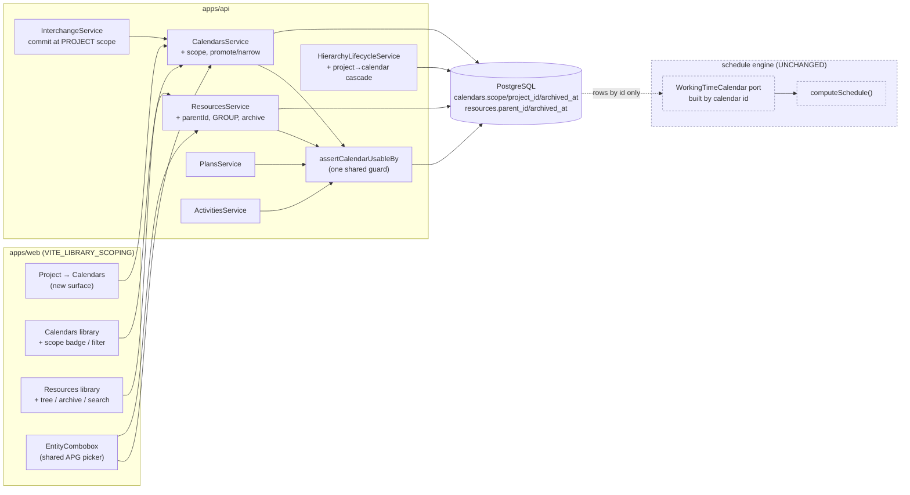
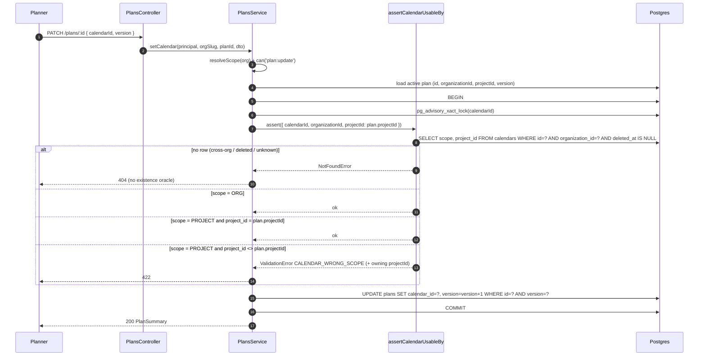
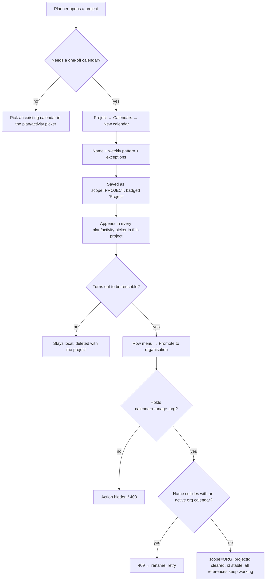

# Feature Spec: Calendar scoping tiers & resource-library manageability

- **Status:** Draft — **awaiting approval**
- **Author(s):** feature-analyst (with James Ewbank)
- **Date:** 2026-07-25
- **Tracking issue / epic:** _(to be created)_ — "Library scoping & manageability"
- **Roadmap link:** platform hardening / enterprise readiness (`docs/ROADMAP.md`)
- **Related ADR(s):** proposes **ADR-0053** (drafted in §4.9). Builds on / amends
  ADR-0024, ADR-0036, ADR-0037, ADR-0038, ADR-0039, ADR-0041, ADR-0046, ADR-0050.
- **Feature flag:** `VITE_LIBRARY_SCOPING` (compile-time, default **off** until the M6 gate)
- **Implementation plan:** [`implementation-plan.md`](implementation-plan.md)

---

## 1. Business understanding

### Problem

SchedulePoint's two shared libraries — **calendars** (ADR-0024/0036) and **resources**
(ADR-0039) — are **org-global and flat**. That was the right v1 shape for a single
project; it does not survive a real tenant.

**Calendars — a missing tier.** P6 has three calendar tiers: **Global**, **Project**, and
**Resource**. SchedulePoint has the org (global) tier (`calendars.organization_id`) and the
per-resource tier (`resources.calendar_id`, ADR-0039) but **no project tier**. Consequence:
every one-off calendar a planner needs — "Client X winter shutdown", "Tunnel drive night
shift", "Phase 2 turnaround" — permanently pollutes the library that every other project in
the tenant picks from. The pollution is worst where it is least visible: **every schedule
import creates its calendars as org calendars**
(`InterchangeService.commit` → `CalendarRepository.createManyForImport`, no project link), so
importing three P6 files can silently add a dozen shared calendars named `Standard 5 Day
Workweek`, `CALENDAR-1`, `Nights`. There is no way to clean that up short of deleting rows —
and the `CALENDAR_IN_USE` guard (correctly) refuses to delete anything still referenced.

**Resources — a missing management layer, not a missing tier.** The resource pool is
correctly org-global: a shared pool is precisely what makes cross-plan over-allocation
detection and levelling (ADR-0041) meaningful, and it matches P6's enterprise resource pool.
Fragmenting it would destroy that. What is missing is everything P6 _pairs_ with a shared
pool: a **hierarchy** (companies → trades → crews → individuals), an **active/archived**
lifecycle (the crane went off hire; the sub-contractor left; do not delete last year's
plans), and **search/filter** so a picker is usable past a page of rows.

**Why now.** Three forces converge:

1. **Interchange has landed** (ADR-0050 import + export). Import is now the fastest way to
   fill both libraries with junk, and it does so into shared tenant state.
2. **The resource dimension is complete** (ADR-0039 → 0041 → 0042 → 0044). Levelling,
   earned value and histograms all read the pool; the pool is now the thing planners touch
   most, and it is a flat unsearchable list.
3. **A live scale bug.** `PaginationQueryDto.limit` defaults to **20**, and both
   `apps/web/src/features/resources/api/use-resources.ts` (`resourcesQueryOptions`) and
   `apps/web/src/features/calendars/api/use-calendars.ts` (`calendarsQueryOptions`) call the
   list endpoints with **no pagination params** and type the response as a plain array. Past
   20 rows the library screens and **every picker** silently show only the first page. This
   is not a future risk; it is a defect today.

### Users

| Persona                           | Org role              | Need                                                                                                          |
| --------------------------------- | --------------------- | ------------------------------------------------------------------------------------------------------------- |
| **Project planner**               | `PLANNER`             | Create a shutdown calendar for _this_ project without asking permission or polluting the tenant library.      |
| **Head of planning**              | `ORG_ADMIN`           | Keep the shared org library small, curated and trustworthy; decide what is promoted to organisation scope.    |
| **Resource / commercial manager** | `PLANNER`/`ORG_ADMIN` | Organise hundreds of resources into trades and crews; retire ones no longer available without losing history. |
| **Contributor**                   | `CONTRIBUTOR`         | Read-only: sees the same tidy, searchable pickers; never manages libraries.                                   |
| **Viewer**                        | `VIEWER`              | Read-only.                                                                                                    |

### Primary use cases

1. Create a calendar that is **visible and selectable only inside one project**.
2. See, in the org calendar library, **which calendars are shared** and which belong to a
   project — and browse a project's own calendars from the project.
3. **Promote** a project calendar to the shared org library (it turned out to be reusable),
   or **narrow** an org calendar to a single project (it never was).
4. Organise the resource pool into a **tree** (e.g. `Groundworks → Crew A → Banksman`).
5. **Archive** a resource (or calendar) that is no longer available, keeping every existing
   assignment and every historic schedule intact.
6. **Search** a library or a picker by name/code and filter by kind / scope / archived.
7. **Import** a P6 XER and have its calendars land in the target project, not the shared library.

### User journeys

**J1 — Project calendar (happy path).** Planner opens _Project → Calendars_, clicks **New
calendar**, names it "Winter shutdown 25/26", adds a dated non-working range, saves. It
appears in the plan and activity calendar pickers of _every plan in that project_, badged
**Project**. It does **not** appear in the org library list, in any other project's pickers,
or in the resource calendar picker. See the user-flow diagram in §4.3.

**J2 — Scope violation (alternate).** A planner (or a script) PATCHes a plan in project _B_
with the id of project _A_'s calendar. The API rejects with **422 `CALENDAR_WRONG_SCOPE`**
and a message naming the owning project. Nothing is written; no dates move.

**J3 — Promote.** A planner realises "Winter shutdown 25/26" applies tenant-wide. From the
calendar's row menu → **Promote to organisation**. It widens (`scope: ORG`, `project_id`
cleared), keeps its id, and every existing reference keeps working.

**J4 — Narrow (guarded).** An Org Admin tries to narrow the shared "Nights" calendar to one
project. Two plans in other projects and one resource still use it → **409
`CALENDAR_SCOPE_NARROWING_BLOCKED`** with per-class counts. Nothing changes.

**J5 — Resource tree + archive.** Resource manager creates a `GROUP` node "Groundworks",
drags three existing resources under it, and archives "CR600 Crawler Crane" (off hire). The
crane disappears from the assignment picker but its 40 existing assignments, the levelled
schedule, the histogram and the EV rollup are **byte-for-byte unchanged**.

**J6 — Import.** A planner imports a 500-activity XER into project _Northgate_. Its 11
calendars land as **project** calendars of _Northgate_. The org library is untouched. The
interchange report names each one and says how its P6 `clndr_type` was mapped.

### Expected outcomes

- The shared org library stays **small and curated**; per-project noise stays in its project.
- Schedule import stops being a tenant-wide pollution vector.
- A resource pool of several hundred rows becomes navigable (tree + search) and
  **lifecycle-managed** (archive) without fragmenting it — so levelling and cross-plan
  over-allocation stay meaningful.
- A latent correctness bug (20-row silent truncation in every picker) is fixed.

### Success criteria

- After the change, a **fresh XER import adds zero rows to the org calendar library**
  (measured: `COUNT(*) WHERE scope='ORG'` before == after).
- A planner creates a project calendar and selects it on a plan in **< 30 s** with no
  Org-Admin involvement.
- Every calendar-assignment seam rejects an out-of-scope calendar — proven by an explicit
  reject-path test per seam (four seams, §2 US-3).
- A picker over **500 resources** returns filtered results in **p95 < 200 ms** (API) and shows
  a complete, searchable list (no silent truncation).
- **Recalculate output is byte-identical** across the whole golden + scenario suite
  (ADR-0034) before and after every milestone. This is the gate, not an aspiration.

### Open questions

The **critical** ones are in §5; each has a recommended answer. Everything else has a stated
default in this spec and is not blocking.

---

## 2. Functional requirements

### User stories & acceptance criteria

> **US-1 — Create a project-scoped calendar**
> As a **Planner**, I want to create a calendar that belongs to one project, so that a one-off
> shutdown does not pollute the organisation library.
>
> **Acceptance criteria**
>
> - **Given** I hold `calendar:create` in the org **when** I create a calendar from _Project →
>   Calendars_ **then** it is created with `scope = PROJECT` and `projectId` = that project,
>   and returned with both fields.
> - **Given** a project calendar exists **when** I list the **org** calendar library **then**
>   it is **not** listed by default (it is listed only with `?scope=all`, badged `Project`).
> - **Given** a project calendar exists **when** I list `GET …/projects/:projectId/calendars`
>   **then** I receive that project's calendars **and** the org-scoped ones (the full usable set).
> - **Given** I create a calendar from the **org** library screen **then** it is created with
>   `scope = ORG` and `projectId = null` (today's behaviour, unchanged).
> - **Given** a calendar name already used by an **active** calendar **in the same tier and
>   parent** **when** I create **then** I get **409 `DUPLICATE_CALENDAR`**. A project calendar
>   **may** share a name with an org calendar or with another project's calendar.

> **US-2 — Assign a project calendar within its project**
> As a **Planner**, I want to select a project calendar on any plan or activity in that project.
>
> - **Given** plan P is in project X **when** I set `plan.calendarId` to a calendar with
>   `scope=PROJECT, projectId=X` **then** it succeeds (200) and a later recalculate uses it.
> - **Given** activity A is in a plan of project X **when** I set `activity.calendarId` to that
>   same calendar **then** it succeeds.
> - **Given** any calendar with `scope=ORG` in my org **when** I assign it anywhere **then** it
>   succeeds (today's behaviour, unchanged).

> **US-3 — Scope violations are impossible (the security-shaped story)**
> As the **system**, I must refuse to bind a project-scoped calendar outside its project, so the
> tier is an invariant and not a convention.
>
> - **Given** plan P is in project **B** **when** I set `plan.calendarId` to a calendar owned by
>   project **A** **then** **422 `CALENDAR_WRONG_SCOPE`**, body names the owning project id;
>   nothing is written.
> - **Given** activity A is in a plan of project **B** **when** I set `activity.calendarId` to
>   project **A**'s calendar **then** **422 `CALENDAR_WRONG_SCOPE`**.
> - **Given** any org-scoped **resource** **when** I set `resource.calendarId` to **any**
>   project-scoped calendar **then** **422 `CALENDAR_WRONG_SCOPE`**
>   (`details.reason = 'RESOURCE_REQUIRES_ORG_CALENDAR'`) — an org-global resource may only hold
>   an org-global calendar.
> - **Given** any of the above **when** the calendar id is from **another organisation**, deleted,
>   or unknown **then** **404** (unchanged — no cross-tenant existence oracle).
> - **Given** the per-relationship lag calendar (`ActivityDependency.lagCalendar`) **then** it is a
>   `LagCalendarSource` **enum** (`PREDECESSOR | SUCCESSOR | TWENTY_FOUR_HOUR | PROJECT_DEFAULT`),
>   **not** a calendar FK — it dereferences a calendar an endpoint already resolved, so **no new
>   guard and no new error** exist for it. A structural test asserts `ActivityDependency` carries no
>   `calendar_id`, so a future per-relationship calendar FK cannot land without a guard.

> **US-4 — Change a calendar's scope**
> As a **Planner/Org Admin**, I want to promote a project calendar to the org library, or narrow
> an org calendar to one project.
>
> - **Given** a project calendar **when** I promote it (`PATCH` `scope: ORG`) **then** it succeeds
>   (widening is always safe: every referencer is inside the project ⊂ the org), `projectId` is
>   cleared, the id is stable, and its `version` bumps.
> - **Given** an org calendar with **no** active referencer outside the target project **and** no
>   active **resource** referencing it **when** I narrow it (`scope: PROJECT, projectId: X`)
>   **then** it succeeds.
> - **Given** an org calendar with **any** active plan/activity outside project X, or **any** active
>   resource **when** I narrow it **then** **409 `CALENDAR_SCOPE_NARROWING_BLOCKED`** with
>   `{ plans, activities, resources }` counts; nothing changes.
> - Both paths ride the existing optimistic `version` gate (stale version → **409**) and the
>   existing calendar advisory lock (no TOCTOU with a concurrent assignment or delete).

> **US-5 — Project delete cascades its calendars**
> As a **Planner**, when I delete a project, its project-scoped calendars go with it and come back
> with it.
>
> - **Given** project X with 3 project calendars **when** I soft-delete X **then** those calendars
>   **and their exceptions** are soft-deleted in the **same `delete_batch_id`** as the project's
>   plans/activities.
> - **Given** that batch **when** I restore the project from the recycle bin **then** the calendars
>   and exceptions are restored with it, and every plan/activity reference resolves.
> - **Given** an **org**-scoped calendar used by a plan of project X **when** I delete X **then**
>   the org calendar is **not** touched.
> - The single-calendar `CALENDAR_IN_USE` guard is **not** applied on the cascade path (the
>   referencers are being deleted in the same cohesive batch) — the ADR-0038 subtree-cascade
>   precedent.

> **US-6 — Resource hierarchy**
> As a **Resource manager**, I want to group resources into a tree so a pool of hundreds is navigable.
>
> - **Given** the resource library **when** I create a resource of kind **`GROUP`** **then** it is a
>   non-assignable grouping node with no calendar, no capacity ceiling and no cost rate.
> - **Given** a `GROUP` **when** I set another resource's `parentId` to it **then** it succeeds and the
>   child nests under it in the library and in pickers.
> - **Given** a non-`GROUP` resource **when** I set a child's `parentId` to it **then** **422
>   `RESOURCE_PARENT_NOT_GROUP`**.
> - **Given** a proposed parent that is the resource itself or one of its descendants **when** I save
>   **then** **409 `RESOURCE_PARENT_CYCLE`**; nothing is written.
> - **Given** a parent in another organisation (or deleted/unknown) **then** **404** for cross-org,
>   **422 `RESOURCE_PARENT_WRONG_SCOPE`** for an in-org but invalid parent.
> - **Given** a `GROUP` **when** I try to assign it to an activity **then** **422
>   `GROUP_NOT_ASSIGNABLE`**; **when** I try to mark it `isDriving` **then** the same.
> - **Given** a `GROUP` with descendants **when** I delete it **then** its whole subtree is soft-deleted
>   in one `delete_batch_id` — **unless** any descendant has an active assignment, in which case
>   **409 `RESOURCE_IN_USE`** with the **subtree** count and nothing is deleted.
> - **Given** the tree **when** the recalculate runs **then** the output is **byte-identical**: a
>   `GROUP` has no assignments, no calendar and no capacity, so the engine, the levelling pass
>   (ADR-0041) and the histogram/EV read-models see an unchanged input set.

> **US-7 — Archive / unarchive**
> As a **Resource manager**, I want to retire a resource without deleting it.
>
> - **Given** an active resource **when** I archive it **then** `archivedAt` is set, it disappears from
>   every picker, and it appears in the library only with **Show archived** on.
> - **Given** an archived resource **then** its **existing** assignments are unchanged and still
>   schedule, level, load the histogram and earn value **exactly as before** (archiving changes no
>   schedule output — the engine never reads `archived_at`).
> - **Given** an archived resource **when** I create a **new** assignment to it **then** **422
>   `RESOURCE_ARCHIVED`**. **When** I edit an **existing** assignment (units/rate/cost) **then** it
>   succeeds (maintaining history is not new exposure).
> - **Given** an archived resource **when** I unarchive it **then** it returns to every picker.
> - **Given** an in-use resource **when** I archive it **then** it succeeds (archive is explicitly
>   **not** blocked by use — that is the entire point, and the contrast with delete).
> - The same archive semantics apply to **calendars** (`calendars.archived_at`): an archived calendar
>   stays bound to its plans/activities/resources and still schedules; it is only hidden from pickers.

> **US-8 — Search & filter at scale**
> As any member, I want to find a calendar/resource by typing, in the library and in every picker.
>
> - **Given** ≥ 20 resources **when** I open the library or any resource picker **then** I see a
>   **complete, paginated** list — never a silently truncated first 20.
> - **Given** a search term **when** I type it **then** the list filters on `name` **and** `code`,
>   case-insensitively, server-side, debounced, with **p95 < 200 ms** at 500 rows.
> - **Given** filters **then** I can filter resources by `kind` and `archived`, and calendars by
>   `scope` and `archived`.
> - **Given** a picker whose current value is outside the filtered page **then** the current value is
>   still displayed as selected (never blank).
> - The picker is an **APG combobox**: full keyboard operation, visible focus, results count
>   announced to assistive technology, WCAG 2.2 AA.

> **US-9 — Interchange maps calendar tiers**
> As a **Planner**, I want an import's calendars to land in my project and an export to declare its tiers.
>
> - **Given** an XER import into project X **when** it commits **then** every calendar it creates is
>   `scope=PROJECT, projectId=X` (default), and the org library row count is unchanged.
> - **Given** a source calendar with `clndr_type = CA_Rsrc` referenced by an imported **resource**
>   **when** it commits **then** that calendar is created at **`scope=ORG`** (a resource may only hold
>   an org calendar, US-3) and the report carries a finding saying so.
> - **Given** a source calendar with `clndr_type = CA_Base` (global) **then** it imports at **PROJECT**
>   scope by default with a finding recommending promotion — unless the caller passes
>   `globalCalendarScope: 'ORG'`.
> - **Given** an ORG-scope import whose name collides with an existing active org calendar **then** the
>   new one is suffix-disambiguated (`"Standard 5-Day (imported 2026-07-25)"`) and a finding is
>   recorded — never silently reused (reuse would change dates if the shift patterns differ).
> - **Given** an export **then** each emitted `CALENDAR` row carries `clndr_type` =
>   `CA_Project` / `CA_Base` / `CA_Rsrc` derived from `scope` + whether a resource references it.
> - The **mapping-contract table** in `docs/specs/schedule-interchange/feature-spec.md` gains the
>   `clndr_type → Calendar.scope` rows in the same PR (ADR-0050's living-table rule).

### Workflows

**W1 — Assign a calendar (any seam).**
`resolveScope(org)` → permission check → load the owning entity (plan / activity+plan / resource)
→ open transaction → `acquireCalendarWriteLock(calendarId)` → **`assertCalendarUsableBy({ calendarId,
organizationId, projectId })`** → write → commit. The guard is **one shared helper** used by all
seams so a new seam cannot forget it.

**W2 — Narrow scope.** transaction → `acquireCalendarWriteLock` → count active plans/activities
**outside** the target project + **all** active resources → non-zero ⇒ 409 → else version-gated
`UPDATE` setting `scope='PROJECT', project_id=X`.

**W3 — Reparent a resource.** transaction → **`acquireResourceTreeWriteLock(organizationId)`** (a new
_org-scoped_ advisory lock, the ADR-0038 per-plan-lock analogue — the tree's scope is the org) →
validate parent active/in-org/`GROUP` → walk ancestors from the proposed parent, reject on reaching
the child → version-gated `UPDATE parent_id`.

**W4 — Archive.** version-gated `UPDATE archived_at = now()`. No lock, no cascade, no guard — a
metadata-only write with no schedule effect. Unarchive sets it back to `NULL`.

**W5 — Project delete.** `HierarchyLifecycleService.softDeleteCascade('project')` gains a step:
after stamping plans + activities (+ dependencies/notes/steps/assignments) with the batch, stamp
`calendars WHERE project_id = :id AND deleted_at IS NULL` and their `calendar_exceptions`. Restore
reverses it by `delete_batch_id`, unchanged.

### Edge cases

| Case                                                                         | Expected behaviour                                                                                                                        |
| ---------------------------------------------------------------------------- | ----------------------------------------------------------------------------------------------------------------------------------------- |
| Project calendar whose project is soft-deleted, then plan restored alone     | Restore is batch-cohesion guarded already; the calendar returns with its batch. A cross-batch restore is 409 `PARENT_DELETED` (existing). |
| Narrowing a calendar used only by plans **inside** the target project        | Allowed (counts are zero outside).                                                                                                        |
| Narrowing a calendar referenced by an **archived** resource                  | **Blocked** — archived ≠ deleted; the reference is live.                                                                                  |
| Promoting a project calendar whose name collides with an active org calendar | **409 `DUPLICATE_CALENDAR`** (the ORG-tier partial unique). The UI offers rename-then-promote.                                            |
| Two concurrent reparents forming a mirror cycle                              | Serialised by the org-scoped resource-tree advisory lock; the second walk sees the first and rejects 409.                                 |
| `GROUP` created with a `calendarId` / `maxUnitsPerHour` / `costPerUnit`      | **422** at the DTO/service, backed by same-row CHECK `ck_resources_group_no_scheduling_fields`.                                           |
| Changing a resource's `kind` **to** `GROUP` while it has assignments         | **409 `RESOURCE_IN_USE`** (a group is not assignable).                                                                                    |
| Changing a `GROUP`'s `kind` **away** from `GROUP` while it has children      | **409** — reparent the children first (ADR-0038 type-change precedent).                                                                   |
| Archiving a resource that is the **driving** resource of a live activity     | **Allowed** — schedule output is unchanged; the activity keeps driving on the same calendar.                                              |
| Deleting an archived resource                                                | Normal `RESOURCE_IN_USE` rules apply (archive does not bypass the delete guard).                                                          |
| Empty library / empty project-calendar list                                  | Empty state with a primary "New calendar" action (`docs/UX_STANDARDS.md`).                                                                |
| Search returning zero rows                                                   | "No matches" empty state inside the combobox, with a clear-filters affordance; never a blank popover.                                     |
| Picker current value archived after selection                                | Rendered as selected with an `Archived` badge; only _new_ selections are filtered.                                                        |
| Tree depth abuse (deep nesting)                                              | Service caps depth at **10**; **422 `RESOURCE_TREE_TOO_DEEP`** (bounds the ancestor walk and keeps the picker sane).                      |
| Cross-plan dependency (ADR-0045) between projects with different calendars   | **No seam** — a cross-plan edge carries no calendar; the derived bound reads persisted dates. Unchanged.                                  |
| Guest share read (ADR-0051)                                                  | **No seam** — the `SCHEDULE_READ` scope exposes no calendar entity; guest access is already plan-scoped.                                  |
| Baseline snapshot (ADR-0025)                                                 | **No seam** — `BaselineActivity` is a non-FK date copy and holds no calendar reference.                                                   |

### Permissions (RBAC + scope, ADR-0012 / ADR-0016)

| Action                                               | Permission                                            | Roles                           |
| ---------------------------------------------------- | ----------------------------------------------------- | ------------------------------- |
| Read any calendar / resource (either tier)           | `calendar:read` / `resource:read` (unchanged)         | Every member                    |
| Create/update/delete a **PROJECT**-scoped calendar   | `calendar:create` / `:update` / `:delete` (unchanged) | Planner, Org Admin              |
| Create/update/delete an **ORG**-scoped calendar      | **new `calendar:manage_org`**                         | Planner, Org Admin _(see CQ-3)_ |
| **Promote** PROJECT → ORG                            | **`calendar:manage_org`**                             | Planner, Org Admin              |
| **Narrow** ORG → PROJECT                             | **`calendar:manage_org`**                             | Planner, Org Admin              |
| Create/reparent/archive a resource, create a `GROUP` | `resource:create` / `:update` (unchanged)             | Planner, Org Admin              |
| Assign a resource (archived ⇒ rejected in service)   | `resource:assign` (unchanged)                         | Planner, Org Admin              |
| Import (calendars land at project scope)             | `interchange:import` (unchanged)                      | Planner, Org Admin              |

**Recommendation:** add exactly **one** new code, `calendar:manage_org`, granted initially to
**Planner + Org Admin** — so there is **zero capability regression** — following the
`dependency:link_cross_plan` precedent ("an explicit, independently-revocable capability … so it is
auditable on its own"). Narrowing it to Org-Admin-only later is a one-line change in
`apps/api/src/common/auth/org-permissions.ts` with no schema or API change. See **CQ-3**.

**Scope-filtered listing is not an authorisation boundary.** Every member of an org can already read
every project in it. Hiding project calendars from the org list is a **usability** filter. The
security control is the write-time `assertCalendarUsableBy` guard, and it is enforced server-side at
every seam regardless of what the UI lists.

### Validation rules

| Field                     | Rule                                                                                                   | Where                                           |
| ------------------------- | ------------------------------------------------------------------------------------------------------ | ----------------------------------------------- |
| `calendar.scope`          | `'ORG' \| 'PROJECT'`; required on create (default `ORG`)                                               | Zod + `class-validator` `@IsEnum`               |
| `calendar.projectId`      | UUID; **required iff** `scope='PROJECT'`, **must be absent/null iff** `scope='ORG'`                    | cross-field DTO validator + DB CHECK            |
| calendar name             | 1–200 chars; unique among **active rows in the same tier + parent**                                    | partial uniques (two)                           |
| `resource.parentId`       | UUID or null; active, same-org, `kind='GROUP'`, not self, not a descendant, depth ≤ 10                 | service (+ `ck_resources_parent_not_self`)      |
| `resource.kind`           | adds `'GROUP'`; a `GROUP` must have `calendarId`/`maxUnitsPerHour`/`costPerUnit` all null              | DTO + `ck_resources_group_no_scheduling_fields` |
| `archivedAt`              | server-set instant; not client-settable (a `POST …/archive` / `…/unarchive` action, not a PATCH field) | controller shape                                |
| `q` (search)              | ≤ 100 chars, trimmed; matched with Prisma `contains` + `mode: 'insensitive'` on `name` and `code`      | DTO                                             |
| `archived` (filter)       | `'exclude' \| 'include' \| 'only'`, default `'exclude'`                                                | DTO                                             |
| `scope` (calendar filter) | `'org' \| 'project' \| 'all'`, default `'org'` on the org list                                         | DTO                                             |

Shared client↔server: the `CalendarScope` and `ResourceKind` unions live in `@repo/types` and must
stay in lock-step with the Prisma enums (the house rule).

### Error scenarios

| Scenario                                          | Detection                     | User-facing result                                                     | Status                                                        |
| ------------------------------------------------- | ----------------------------- | ---------------------------------------------------------------------- | ------------------------------------------------------------- |
| Calendar id from another org / deleted / unknown  | scoped repository load        | "Calendar not found."                                                  | 404                                                           |
| Project calendar assigned outside its project     | `assertCalendarUsableBy`      | "This calendar belongs to project _Northgate_ and can't be used here." | 422 `CALENDAR_WRONG_SCOPE`                                    |
| Project calendar assigned to an org resource      | same guard, resource branch   | "A resource can only use an organisation-wide calendar."               | 422 `CALENDAR_WRONG_SCOPE` / `RESOURCE_REQUIRES_ORG_CALENDAR` |
| Narrowing an org calendar still used elsewhere    | scoped counts under the lock  | "Still used by 2 plans and 1 resource outside this project."           | 409 `CALENDAR_SCOPE_NARROWING_BLOCKED`                        |
| Duplicate calendar name in the same tier          | partial unique (`P2002`)      | inline "A calendar with this name already exists."                     | 409 `DUPLICATE_CALENDAR`                                      |
| Calendar delete while referenced                  | existing in-use guard         | "This calendar is in use by …"                                         | 409 `CALENDAR_IN_USE` (unchanged)                             |
| Create ORG calendar without `calendar:manage_org` | permission check              | "You do not have permission to perform this action."                   | 403                                                           |
| Resource parent cycle                             | ancestor walk under tree lock | "That would nest a resource inside itself."                            | 409 `RESOURCE_PARENT_CYCLE`                                   |
| Parent is not a `GROUP`                           | service check                 | "Only a group can contain resources."                                  | 422 `RESOURCE_PARENT_NOT_GROUP`                               |
| Parent in another org / deleted                   | scoped load                   | "Resource not found." / "That parent can't be used."                   | 404 / 422 `RESOURCE_PARENT_WRONG_SCOPE`                       |
| Tree deeper than 10                               | depth check in the walk       | "Resource groups can be nested up to 10 levels."                       | 422 `RESOURCE_TREE_TOO_DEEP`                                  |
| Assigning a `GROUP`                               | service check                 | "A group can't be assigned to an activity."                            | 422 `GROUP_NOT_ASSIGNABLE`                                    |
| Assigning an archived resource                    | service check                 | "This resource is archived. Unarchive it to assign it."                | 422 `RESOURCE_ARCHIVED`                                       |
| Deleting a `GROUP` whose subtree is in use        | subtree count under the lock  | "3 resources in this group are still assigned."                        | 409 `RESOURCE_IN_USE`                                         |
| Stale `version` on any scope/parent/archive write | version-gated `UPDATE`        | "This was changed elsewhere. Refresh and try again."                   | 409                                                           |

---

## 3. Technical analysis

| Area               | Impact   | Notes                                                                                                                                                                                                                                                                                                                                                                                                      |
| ------------------ | -------- | ---------------------------------------------------------------------------------------------------------------------------------------------------------------------------------------------------------------------------------------------------------------------------------------------------------------------------------------------------------------------------------------------------------- |
| **Frontend**       | **high** | New project-calendars surface; scope badges/filters in the calendars library; resource tree rendering + reparent; archive toggles; a **new shared APG combobox picker** replacing four `<Select>` pickers; search/filter UI. All behind `VITE_LIBRARY_SCOPING`.                                                                                                                                            |
| **Backend**        | med      | `calendars` + `resources` modules extended (no new module). One new shared guard (`assertCalendarUsableBy`) + one new org-scoped advisory lock. `HierarchyLifecycleService` gains a calendar cascade branch. `interchange` commit changes calendar scope.                                                                                                                                                  |
| **Database**       | med      | 1 new enum (`CalendarScope`), 1 enum member (`ResourceKind.GROUP`), 5 columns (`calendars.scope`, `calendars.project_id`, `calendars.archived_at`, `resources.parent_id`, `resources.archived_at`), 3 CHECKs, index swap + 4 new partial indexes. **All additive with constant defaults / NULLs — no data migration.**                                                                                     |
| **API**            | med      | 1 new list route (`GET …/projects/:projectId/calendars`); 4 archive/unarchive actions; new query params on 2 list routes; new fields on 2 response DTOs; 1 new permission code. **No breaking change** (new fields are additive; existing routes keep their shape). OpenAPI regenerated.                                                                                                                   |
| **Security**       | **high** | This feature _is_ a scoping boundary. Four assignment seams must be guarded; the guard must be shared, not copy-pasted. New permission code. Interchange writes must respect the tier. Requires **security-reviewer** sign-off (IDOR + scope).                                                                                                                                                             |
| **Performance**    | med      | Fixes a real truncation bug. New search predicate (`contains`) is a filtered seq-scan under an org filter — acceptable at hundreds of rows; documented escalation is a `pg_trgm` GIN index on `lower(name)` if a tenant exceeds ~5k rows (`docs/PERFORMANCE.md` measure-first). Ancestor walk and subtree cascade are bounded (depth ≤ 10; org resource count). Requires **backend-performance-reviewer**. |
| **Infrastructure** | none     | No new services, env vars or containers. One compile-time web flag.                                                                                                                                                                                                                                                                                                                                        |
| **Observability**  | low      | Structured logs for scope changes, archive/unarchive, reparent, cascade counts (existing `PinoLogger` pattern). No new metrics.                                                                                                                                                                                                                                                                            |
| **Testing**        | **high** | Unit (service invariants, one **reject-path test per seam**), API/Supertest (scope guards, cascade, archive, search/pagination), Playwright (project-calendar journey, tree, archive) + axe a11y on the new combobox, plus the **unchanged golden/scenario suite as the parity gate**.                                                                                                                     |
| **Engine**         | **none** | See §4.8. The engine resolves a calendar **by id** and never sees `scope`, `project_id`, `archived_at` or `parent_id`. `computeSchedule`'s signature is unchanged.                                                                                                                                                                                                                                         |

### Dependencies

- **Prerequisites (all landed):** ADR-0024/0036 (calendar model), ADR-0037 (per-activity calendar
  port), ADR-0038 (adjacency-list precedent), ADR-0039 (resource library), ADR-0041 (levelling),
  ADR-0046 (fail-closed CHECK + polymorphic-cascade precedent), ADR-0050 (interchange).
- **Affected features:** plans (calendar picker), activities (calendar picker), resources
  (calendar picker + assignment picker), interchange import **and** export, recycle bin (new
  entity in the cascade counts), project delete/restore, resource histogram / EV / levelling
  (read-only impact: **none**, must be proven).
- **Must land first (within this feature):** M1 (schema + guards) gates everything else; the
  shared combobox (M4) is a prerequisite for retiring the four `<Select>` pickers.
- **Third parties:** none.

---

## 4. Solution design

### 4.1 Architecture overview



The dashed region is the **parity boundary**: nothing this feature adds crosses it.

### 4.2 Data flow — the shared scope guard



The same helper, with `projectId: null` and a resource branch, backs the resource seam — where
**any** `scope=PROJECT` calendar is rejected outright.

### 4.3 User flow



### 4.4 Database changes

Designed to be reviewed by the **database-architect** agent before the migration is written.

#### `calendars`

```prisma
enum CalendarScope {
  ORG
  PROJECT
}

model Calendar {
  // …existing…
  /// Which tier this calendar belongs to (ADR-0053). ORG = the shared organisation
  /// library (today's only tier); PROJECT = local to one project, listed and
  /// selectable only within it. Constant DEFAULT ORG ⇒ every existing row keeps
  /// today's behaviour; the service always sets it explicitly.
  scope     CalendarScope @default(ORG)
  /// The owning project for a PROJECT-scoped calendar; NULL for an ORG one. FK is
  /// RESTRICT (calendars soft-delete; the project cascade is the real path).
  /// Agreement with `scope` is guaranteed by ck_calendars_scope_parent.
  projectId String?       @map("project_id") @db.Uuid
  /// Retired from pickers but still valid on existing references (ADR-0053 §4).
  /// NULL = active. NEVER read by the engine.
  archivedAt DateTime?    @map("archived_at") @db.Timestamptz(3)

  project   Project?      @relation(fields: [projectId], references: [id], onDelete: Restrict)
  @@index([organizationId, createdAt, id])   // existing
}
```

Raw SQL in the migration (Prisma cannot express these):

```sql
-- Fail-closed agreement between the discriminator and the FK (the ADR-0046 CASE…ELSE false
-- precedent): a future enum member cannot land silently unconstrained.
ALTER TABLE calendars ADD CONSTRAINT ck_calendars_scope_parent CHECK (
  CASE scope
    WHEN 'ORG'     THEN project_id IS NULL
    WHEN 'PROJECT' THEN project_id IS NOT NULL
    ELSE false
  END
);

-- Name uniqueness becomes per-tier. Existing rows are all ORG, so the org index is
-- semantically identical for them (a safe widening).
DROP INDEX uq_calendars_org_name;
CREATE UNIQUE INDEX uq_calendars_org_name     ON calendars (organization_id, name)
  WHERE deleted_at IS NULL AND scope = 'ORG';
CREATE UNIQUE INDEX uq_calendars_project_name ON calendars (project_id, name)
  WHERE deleted_at IS NULL AND scope = 'PROJECT';

-- The project-scoped list + its cursor sort + the project-delete cascade sweep.
CREATE INDEX idx_calendars_project_id ON calendars (project_id, created_at, id)
  WHERE deleted_at IS NULL AND project_id IS NOT NULL;
```

**Why an enum discriminator _and_ a nullable FK** rather than "just nullable `project_id`":
(a) it makes the tier a first-class, API-visible, filterable concept rather than a null test
spread across every query; (b) it makes the constraint **fail-closed and extensible** — adding a
`CLIENT` tier later fails the CHECK until the migration handles it, instead of silently
defaulting; (c) it follows the house precedent set by ADR-0046 (`entity_type` + nullable typed
parent FKs + `CASE … ELSE false`). The cost — two columns that could disagree — is exactly what
the CHECK removes. See **CQ-1**.

**Name uniqueness across tiers is deliberately allowed** (a project may have its own "Standard"
alongside the org's). Justification: forcing global uniqueness would let an org-level rename
break unrelated projects and would forbid the common P6 pattern of a project-local override. The
UI disambiguates with a tier badge, not with a name rule.

#### `resources`

```prisma
enum ResourceKind {
  LABOUR
  EQUIPMENT
  MATERIAL
  GROUP        // new: a non-assignable grouping node (ADR-0053 §3)
}

model Resource {
  // …existing…
  /// The parent GROUP in the resource tree (adjacency list, ADR-0038 precedent).
  /// NULL = top level. Only a GROUP may be a parent; acyclicity + same-org + depth
  /// are SERVICE invariants (a CHECK cannot read the parent row).
  parentId   String?   @map("parent_id") @db.Uuid
  /// Retired from pickers; existing assignments keep working and keep scheduling.
  /// NULL = active. NEVER read by the engine, the levelling pass or the EV read-model.
  archivedAt DateTime? @map("archived_at") @db.Timestamptz(3)

  parent   Resource?  @relation("ResourceHierarchy", fields: [parentId], references: [id], onDelete: Restrict)
  children Resource[] @relation("ResourceHierarchy")
}
```

```sql
ALTER TABLE resources ADD CONSTRAINT ck_resources_parent_not_self
  CHECK (parent_id IS NULL OR parent_id <> id);

-- Unlike ADR-0038's parent-type rule (which needs the PARENT row), this one is
-- SAME-ROW and therefore legally expressible as a CHECK — cheap defence in depth
-- behind the DTO/service reject.
ALTER TABLE resources ADD CONSTRAINT ck_resources_group_no_scheduling_fields CHECK (
  kind <> 'GROUP'
  OR (calendar_id IS NULL AND max_units_per_hour IS NULL AND cost_per_unit IS NULL)
);

CREATE INDEX idx_resources_parent_id ON resources (parent_id)
  WHERE deleted_at IS NULL AND parent_id IS NOT NULL;
```

**Additivity.** Every column is nullable-with-no-default or a constant default; the enum gains a
member; no existing row changes value. **No data migration.** With no project calendar, no
`GROUP` and no archived row present, the system is byte-identical to today.

### 4.5 API changes

| Method & path                                                      | Change                                                                                                                                                                 |
| ------------------------------------------------------------------ | ---------------------------------------------------------------------------------------------------------------------------------------------------------------------- |
| `GET /api/v1/organizations/:orgSlug/calendars`                     | **+ query** `q`, `scope=org\|project\|all` (default `org`), `archived=exclude\|include\|only`. **+ response fields** `scope`, `projectId`, `archivedAt`.               |
| `GET /api/v1/organizations/:orgSlug/projects/:projectId/calendars` | **NEW** — the calendars _usable in this project_ = its PROJECT-scoped ones **+** all ORG ones. Cursor-paginated, same query params.                                    |
| `POST /api/v1/organizations/:orgSlug/calendars`                    | **+ body** `scope` (default `ORG`), `projectId`. `scope=ORG` requires `calendar:manage_org`.                                                                           |
| `PATCH /api/v1/organizations/:orgSlug/calendars/:calendarId`       | **+ body** `scope`, `projectId` (the promote/narrow path; version-gated). New 409 `CALENDAR_SCOPE_NARROWING_BLOCKED`.                                                  |
| `POST …/calendars/:calendarId/archive` · `…/unarchive`             | **NEW** — 204. Action endpoints, not a PATCH field (`archivedAt` is server-set).                                                                                       |
| `GET /api/v1/organizations/:orgSlug/resources`                     | **+ query** `q`, `kind`, `archived`, `parentId` (`null` ⇒ top level), `tree=true` (bounded flat tree for the library). **+ response fields** `parentId`, `archivedAt`. |
| `POST` / `PATCH …/resources[/:id]`                                 | **+ body** `parentId`; `kind` accepts `GROUP`. New 409/422 codes per §2.                                                                                               |
| `POST …/resources/:resourceId/archive` · `…/unarchive`             | **NEW** — 204.                                                                                                                                                         |
| `POST …/activities/:activityId/assignments`                        | unchanged shape; **new rejects** 422 `GROUP_NOT_ASSIGNABLE`, 422 `RESOURCE_ARCHIVED`.                                                                                  |
| `PATCH …/plans/:planId` (calendar) · `POST/PATCH …/activities`     | unchanged shape; **new reject** 422 `CALENDAR_WRONG_SCOPE`.                                                                                                            |
| `POST …/projects/:projectId/interchange/…`                         | **+ optional body field** `globalCalendarScope: 'PROJECT' \| 'ORG'` (default `'PROJECT'`).                                                                             |

All follow `docs/API.md`: `{ data, meta }` envelope, cursor pagination, `{ error: { code, message,
details } }` on failure. No versioning break — every addition is optional and every existing
response field keeps its meaning.

### 4.6 Component changes

New / changed, all behind `VITE_LIBRARY_SCOPING`, all built from existing design-system tokens and
primitives (no one-off styling):

- **`components/ui/combobox.tsx` (NEW, shared)** — a hand-rolled **APG combobox** (the repo's
  `components/ui/menu.tsx` precedent: hand-rolled APG over a hover-only or ad-hoc control).
  Debounced server-side search, `keepPreviousData`, cursor "load more", renders the current value
  even when outside the filtered page (generalising the `missingCurrent` trick already in
  `PlanCalendarPicker.tsx`), optional tree indentation, optional trailing badges (`Project`,
  `Archived`), `aria-activedescendant`, results-count announcement via the existing `useAnnounce`.
- **Replaces four raw `<Select>` pickers:** `features/plans/components/PlanCalendarPicker.tsx`,
  the activity calendar field in `features/activities/components/ActivityFormDialog.tsx`, the
  resource calendar field in `features/resources/components/ResourceFormDialog.tsx`, and the
  resource field in `features/resources/components/ActivityResourcesDialog.tsx`.
- **`features/calendars/components/CalendarsTable.tsx`** — scope badge column, scope filter,
  search box, "Show archived", promote/narrow row actions (in the existing APG `Menu`).
- **`features/calendars/components/CalendarFormDialog.tsx`** — scope choice (ORG option gated on
  `calendar:manage_org`), project pre-filled and locked when created from the project surface.
- **`routes/project-calendars.tsx` (NEW)** — the _Project → Calendars_ screen, reachable from the
  Project Explorer (ADR-0029) and the project detail view; reuses `CalendarsTable` with a project
  filter.
- **`features/resources/components/ResourcesTable.tsx`** — tree rendering (reusing the navigator's
  ARIA-tree conventions from ADR-0029), reparent action, archive/unarchive, search + kind +
  archived filters, `GROUP` create.
- **Empty / loading / error states** per `docs/UX_STANDARDS.md` for every new list and the
  combobox popover (including a "no matches" state and an explicit archived-hidden hint).

### 4.7 Implementation approach & alternatives

**Chosen approach.** One additive schema slice per concern, an invariant enforced by **one shared
guard function** reused at every seam, and a strict rule that nothing new is readable by the CPM
engine. Slice as five releasable milestones (schema+API dark → web → hierarchy → archive+search →
interchange) behind one compile-time flag.

**Alternatives considered.**

| Alternative                                                           | Why not                                                                                                                                                                                                                                                                             |
| --------------------------------------------------------------------- | ----------------------------------------------------------------------------------------------------------------------------------------------------------------------------------------------------------------------------------------------------------------------------------- |
| **Per-plan calendars** instead of per-project                         | P6 scopes calendars to the **project**; plans within a project share a shutdown. Per-plan would multiply near-identical calendars across a project's baselines/scenarios — the pollution problem in miniature. (Product-owner decision.)                                            |
| **Fragment the resource pool per project**                            | Destroys cross-plan over-allocation detection and levelling (ADR-0041), and diverges from P6's enterprise pool. (Product-owner decision.)                                                                                                                                           |
| **Nullable `project_id` only, no `scope` enum**                       | Simpler and cannot disagree — a real merit. Rejected for API/query clarity and for the fail-closed extensibility of the `CASE … ELSE false` CHECK (ADR-0046 precedent). See **CQ-1**.                                                                                               |
| **Any resource may parent (no `GROUP` kind)**                         | Makes "can I assign this?" ambiguous, and forces the levelling pass and histogram to decide whether a parent's capacity/demand double-counts its children. A distinct non-assignable kind makes the parity argument _trivial_ — the ADR-0038 `WBS_SUMMARY` precedent. See **CQ-2**. |
| **Reuse soft delete instead of an archive flag**                      | Different semantics: a soft-deleted resource cannot be referenced by an active assignment (the `RESOURCE_IN_USE` guard blocks the delete precisely _because_ of that). Archive must keep existing references live. They are orthogonal and both are needed.                         |
| **Boolean `is_active` instead of `archived_at`**                      | `archived_at` carries _when_ at no extra cost, matches the `deleted_at` idiom already in the schema, and indexes identically (`WHERE archived_at IS NULL`).                                                                                                                         |
| **Client-side search only**                                           | Cannot work: the client only ever holds one 20-row page. Server-side `q` + cursor is the only correct fix, and it fixes the existing truncation defect at the same time.                                                                                                            |
| **`pg_trgm` GIN index now**                                           | Premature (`docs/PERFORMANCE.md` measure-first). Documented as the named escalation past ~5k rows per org.                                                                                                                                                                          |
| **Import global (`CA_Base`) calendars straight into the org library** | A foreign file would write shared tenant state on every import — the exact problem. Default is project scope + a "promote" recommendation; `globalCalendarScope: 'ORG'` is the explicit opt-in.                                                                                     |
| **Two ADRs (calendars, resources)**                                   | They share one driving force and one is the _reason_ the other is safe (the pool stays org-global **because** calendars gained a project tier). One ADR with two decision sections.                                                                                                 |

### 4.8 Engine impact — none (verified)

Stated as a claim to be re-verified by the reviewer:

1. The engine consumes a **`WorkingTimeCalendar` port** built from `calendar_shifts` /
   `calendar_exceptions` rows **loaded by calendar id**. It never receives `organization_id`, and
   will never receive `scope`, `project_id` or `archived_at`.
2. `ScheduleService`'s per-recalc `portByCalId` cache is keyed by calendar id — unchanged.
3. `computeSchedule`'s signature is **unchanged**; no new option, no new input field.
4. `ActivityDependency.lagCalendar` is an **enum**, not an FK — the lag calendar dereferences an
   endpoint's already-resolved calendar. No new seam.
5. A `GROUP` resource has no assignments, no calendar, no `max_units_per_hour` and no
   `cost_per_unit` (CHECK-enforced), so the levelling demand/capacity sets (ADR-0041), the
   histogram (ADR-0044) and the EV rollup (ADR-0042) see an **identical** input set.
6. `archived_at` is read by **no** scheduling or read-model code path — only by list filters and
   the assignment-create guard.

**Therefore the recalculate parity gate (ADR-0034 golden + scenario suite) is structurally
untouched.** Proof obligations, per milestone: (a) the full golden + scenario suite runs
**unchanged and green**; (b) a **structural test** asserts the engine input DTO has no `scope`,
`projectId`, `archivedAt` or `parentId` field; (c) a **structural test** asserts
`ActivityDependency` carries no `calendar_id` column.

### 4.9 ADR-worthiness & draft outline

**Verdict: an ADR is required.** This adds a new **scoping dimension** to a core library entity
(a long-lived schema decision), introduces a **cross-cutting invariant** enforced at four write
seams, extends the tenancy/permission model, and changes the interchange mapping contract — every
trigger in `docs/PROCESS.md` "Change management".

> ### ADR-0053 — Calendar scoping tiers & the resource management layer
>
> **Status:** Proposed (Accepts with M1 for §1–§2; §3–§4 Accept with M3/M4; §5 with M5)
>
> **Context.** Both shared libraries are org-global and flat. Calendars lack P6's **project**
> tier, so every one-off (and every import) pollutes shared tenant state permanently. Resources
> are correctly org-global — a shared pool is what makes levelling and cross-plan over-allocation
> meaningful — but lack the management layer P6 pairs with it (hierarchy, archive, search). A
> list-truncation defect (default `limit=20`, no client pagination) makes both unusable past a page.
>
> **Decision.**
>
> 1. **A calendar scope tier** — `CalendarScope { ORG, PROJECT }` + nullable `project_id`, kept
>    honest by a fail-closed `CASE … ELSE false` CHECK; per-tier partial-unique names; existing
>    rows migrate to `ORG` with no behaviour change. **Per-project, not per-plan** (P6-aligned).
> 2. **One shared usable-by guard at every seam.** A calendar is usable by X iff it is `ORG`-scoped
>    (same org) or `PROJECT`-scoped with `project_id` = X's project. Enforced by a single helper at
>    `plan.calendarId`, `activity.calendarId` and `resource.calendar_id` (where **any** project
>    calendar is a hard reject — an org-global resource may only hold an org-global calendar), under
>    the existing calendar advisory lock. Cross-org → 404; in-org wrong project → 422
>    `CALENDAR_WRONG_SCOPE`. The per-relationship lag calendar is an **enum**, not an FK — no seam.
>    Widening (PROJECT→ORG) is always allowed; narrowing (ORG→PROJECT) is guarded by a scoped
>    in-use count. Project soft-delete **cascades** its calendars in the same `delete_batch_id`.
> 3. **The resource pool stays a single org-level pool**; manageability comes from an
>    **adjacency-list `parent_id`** (ADR-0038 precedent) plus a **non-assignable `GROUP`
>    `ResourceKind`**, so a grouping node has no calendar, capacity, cost or assignment — making the
>    parity argument trivial. Invariants (acyclic, same-org, only-a-`GROUP`-parents, depth ≤ 10) are
>    service-owned under a new **org-scoped** resource-tree advisory lock.
> 4. **`archived_at` on `resources` and `calendars`** — orthogonal to soft delete: archived rows stay
>    valid and keep scheduling; they are hidden from pickers and rejected for **new** assignments only.
> 5. **Interchange maps the tier**: import creates calendars at PROJECT scope pinned to the target
>    project (resource calendars at ORG, with a finding); export emits `clndr_type`. The mapping
>    contract table is updated in lock-step.
> 6. **The CPM engine is untouched** and the recalc parity gate is structurally trivial.
>
> **Alternatives considered.** Per-plan calendars; nullable `project_id` with no discriminator; a
> fragmented per-project resource pool; any-resource-can-parent; soft delete as archive; client-side
> search; importing global calendars straight into the org library. (Rationale as in §4.7.)
>
> **Consequences.** _Positive:_ the shared library stays curated; import stops polluting; the pool
> becomes navigable and lifecycle-managed without fragmenting; a real truncation bug is fixed.
> _Negative:_ a new cross-cutting invariant that every future calendar seam must honour (mitigated by
> the single shared guard + a structural test); five service-owned resource-tree invariants needing
> explicit reject-path tests; one new permission code; a per-tier uniqueness rule that allows
> same-named calendars in different tiers (mitigated by tier badges in the UI).
> _Follow-ups:_ `GROUP`-level roll-up in the histogram/resource strip (deferred, explicit non-goal);
> `pg_trgm` search index if a tenant exceeds ~5k rows; a possible `CLIENT` tier (the CHECK is already
> fail-closed for it).
>
> **References.** ADR-0024/0036/0037 (calendars), ADR-0038 (adjacency list), ADR-0039/0041/0042/0044
> (resources), ADR-0046 (fail-closed CHECK + cascade), ADR-0050 (interchange), ADR-0012/0016 (RBAC +
> tenancy), ADR-0034 (parity gate).

---

## 5. Critical questions (answers change design or scope)

> **CQ-1 — Model the calendar tier as `scope` enum + nullable `project_id`, or just nullable
> `project_id`?**
> **Recommendation: the enum + nullable FK + fail-closed CHECK.** It makes the tier a first-class
> API/query concept, follows ADR-0046's house precedent, and makes a future third tier fail closed
> rather than default silently. The redundancy risk is fully removed by the CHECK. (If the product
> owner prefers minimalism, "just nullable `project_id`" is a defensible, cheaper design — the rest
> of the spec is unchanged except the DTO/filter shape.)

> **CQ-2 — Should a grouping node be a distinct non-assignable `GROUP` kind, or can any resource
> parent (and be assigned)?**
> **Recommendation: a distinct `GROUP` kind.** It mirrors ADR-0038's `WBS_SUMMARY`, and — decisively —
> it makes the levelling/histogram/EV parity argument _trivial_ (a group has no demand and no
> capacity, so no double-count question ever arises). The cost is that "Crew A" as both a bookable
> resource **and** a parent must be modelled as a group plus a member resource.

> **CQ-3 — Does creating/editing an **org-wide** calendar need its own permission, and if so, who
> holds it?**
> **Recommendation: add `calendar:manage_org`, granted to Planner + Org Admin.** This is **zero
> capability change today** while making writes to shared tenant state independently revocable and
> auditable (the `dependency:link_cross_plan` precedent). Narrowing it to **Org Admin only** later is
> a one-line change. If the product owner wants the tighter governance _now_, say so — it is a
> capability regression for Planners and should be a deliberate choice, not a side effect.

> **CQ-4 — On import, what happens when a source resource/calendar matches an **archived** row?**
> **Recommendation: match it, auto-unarchive it, and record a report finding.** The alternatives are
> worse: refusing to match would collide with the active-name partial unique (archived rows still
> occupy the name) and hard-fail the import; matching without unarchiving would leave the import
> creating assignments to an archived resource, contradicting the `RESOURCE_ARCHIVED` rule.

> **CQ-5 — Should `archived_at` apply to calendars as well as resources, in this feature?**
> **Recommendation: yes, in M4, with identical semantics.** It is nearly free (same column, same
> filter, same actions) and it is the only way to retire a calendar that the `CALENDAR_IN_USE` guard
> — correctly — refuses to delete. Cheap to descope to resources-only if the milestone is tight.

> **CQ-6 — Should a `GROUP` roll up its descendants' demand in the resource histogram / canvas
> resource strip (ADR-0044/0049)?**
> **Recommendation: no — explicit non-goal for this feature.** Roll-up is a read-model change with
> real double-count design questions (does a group row replace or supplement its children?) and would
> put this feature's fingerprints on the histogram. Ship the tree in the **library and pickers** only;
> raise roll-up as a separate, later rung with its own design.

> **CQ-7 — Sequencing: is fixing the picker truncation defect allowed to land ahead of the flag?**
> **Recommendation: yes — carve the pagination/search fix (M4's server side + the combobox) out as
> independently mergeable.** It is a correctness fix for a defect that exists today, is valuable with
> or without the rest of the feature, and gating it behind `VITE_LIBRARY_SCOPING` would leave a known
> silent-truncation bug in production for the duration of the epic.

---

## 6. Links

- Implementation plan: [`implementation-plan.md`](implementation-plan.md)
- Docs this change must update: `CLAUDE.md` §16 (ADR-0053 row), `docs/adr/README.md`,
  `docs/adr/0053-*.md` (new), `docs/DATABASE.md` (per-tier uniqueness + the new CHECKs),
  `docs/API.md` (new routes/params/codes), `docs/specs/schedule-interchange/feature-spec.md`
  (mapping-contract table), `docs/COMPONENT_LIBRARY.md` (the new combobox primitive),
  `docs/TECH_DEBT.md` (close the picker-truncation defect; open the `pg_trgm` and `GROUP`-roll-up
  follow-ups).
- Key existing code: `apps/api/src/modules/calendars/`, `apps/api/src/modules/resources/`,
  `apps/api/src/common/hierarchy/hierarchy-lifecycle.service.ts`,
  `apps/api/src/common/auth/org-permissions.ts`, `apps/api/src/modules/interchange/`,
  `packages/interchange/src/xer-adapter.ts`, `apps/web/src/features/calendars/`,
  `apps/web/src/features/resources/`.
