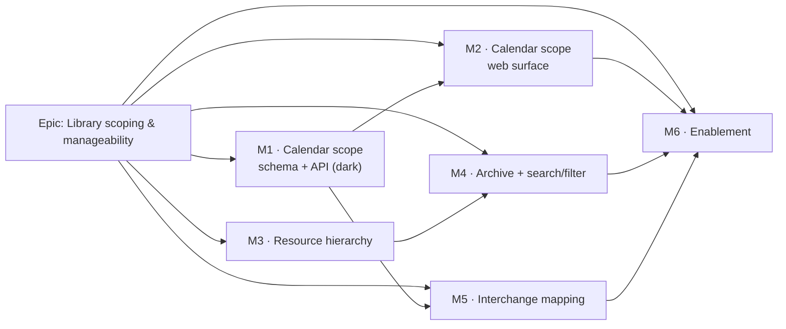

# Implementation Plan: Calendar scoping tiers & resource-library manageability

- **Feature spec:** [`feature-spec.md`](feature-spec.md) — **not yet approved**
- **Status:** Draft — awaiting approval
- **Owner:** _(to be assigned)_
- **Flag:** `VITE_LIBRARY_SCOPING` (compile-time, `flagDefaultOff` until T6.2)
- **Proposed ADR:** ADR-0053 (outline in the spec §4.9)

## Breakdown

### Epic

**Library scoping & manageability** — give calendars a P6-style project tier and give the
(deliberately unfragmented) org resource pool the management layer P6 pairs with it: hierarchy,
archive, and search. Roadmap theme: platform hardening / enterprise readiness.

**Epic-wide invariants (every task must hold them):**

- **Parity gate.** The ADR-0034 golden + scenario suite runs **unchanged and green** in every PR.
  No task may add a field the CPM engine can read.
- **Additive only.** Every column is nullable-with-no-default or has a constant default; no data
  migration; `main` stays releasable after every task.
- **Template conformance.** All backend work follows `apps/api/examples/reference-feature/`
  (controller → service → repository, deny-by-default authz, validated DTOs, `{ data, meta }`
  envelopes, soft delete/audit/version). `scripts/verify-template.sh` must stay green.

---

## Milestone M1 — Calendar scope: schema, guards & API (dark)

**Outcome:** the API can create, list, promote and narrow project-scoped calendars, and **refuses**
to bind one outside its project at every seam. No web surface yet, so nothing user-visible changes:
every existing calendar is `ORG` and behaves exactly as today.

---

#### Feature: Calendar scope tier (backend)

> **Description:** the `scope`/`project_id` model, the shared usable-by guard at all seams, scope
> change, and the project-delete cascade.
> **Complexity:** L
> **Dependencies:** none (all prerequisites landed).
> **Risks:** a missed assignment seam silently defeats the whole tier → mitigated by **one shared
> guard helper** plus one explicit reject-path test per seam plus a structural test asserting no
> other calendar FK exists. A botched unique-index swap could break calendar creation → mitigated by
> the swap being a strict _widening_ for existing (all-`ORG`) rows, verified on a restored snapshot.
> **Testing requirements:** unit (guard truth table, scope-change guards), API/Supertest (each seam's
> 422/404, cascade + restore, per-tier uniqueness), migration test on seeded data, golden suite unchanged.

##### Task 1.1 — Design review + ADR-0053 draft

- **Description:** run the **database-architect** agent over the §4.4 schema delta; write
  `docs/adr/0053-calendar-scoping-and-resource-management.md` from the spec's outline, status
  _Proposed_ (§1–§2 Accept with M1).
- **Complexity:** S · **Dependencies:** spec approval · **Risks:** none
- **Testing:** n/a (docs)
- **Steps:** 1) database-architect review of columns/CHECK/indexes; 2) write the ADR; 3) add the
  `CLAUDE.md` §16 row and the `docs/adr/README.md` entry.

##### Task 1.2 — Migration + Prisma model + `@repo/types`

- **Description:** add `CalendarScope`, `calendars.scope` (default `ORG`), `calendars.project_id`
  (FK RESTRICT), `ck_calendars_scope_parent`, the per-tier unique swap, `idx_calendars_project_id`.
  Extend `CalendarSummary` in `@repo/types` with `scope`/`projectId` (lock-step rule).
- **Complexity:** M · **Dependencies:** 1.1
- **Risks:** dropping `uq_calendars_org_name` under load → the migration recreates it in the same
  transaction; verified against a production-shaped snapshot.
- **Testing:** migration up/down on seeded data; a CHECK-violation test (`scope='PROJECT'` with NULL
  project) asserting the DB rejects it; both partial uniques exercised.
- **Steps:** 1) `schema.prisma` (with the house block comments); 2) raw-SQL migration; 3)
  `@repo/types`; 4) `pnpm --filter @repo/api prisma generate` + typecheck; 5) changeset.

##### Task 1.3 — The shared usable-by guard

- **Description:** add `assertCalendarUsableBy({ calendarId, organizationId, projectId })` (in
  `modules/calendars/`, exported for cross-module use like `CalendarRepository` is today). Takes the
  existing `acquireCalendarWriteLock`; returns void or throws `NotFoundError` (cross-org/deleted) /
  `ValidationError` `CALENDAR_WRONG_SCOPE` (in-org, wrong project). A `projectId: null` caller (a
  resource) rejects **any** `scope=PROJECT` calendar with `RESOURCE_REQUIRES_ORG_CALENDAR`.
- **Complexity:** M · **Dependencies:** 1.2
- **Risks:** subtly different behaviour if re-implemented per seam → it is one function, and 1.4
  deletes the three existing `assertCalendarInOrg` copies in favour of it.
- **Testing:** unit truth table — {ORG, PROJECT-same, PROJECT-other, cross-org, deleted, unknown} ×
  {plan, activity, resource} = 18 cases.
- **Steps:** 1) write the helper + `CALENDAR_CONFLICT`/error-code constants; 2) export from the
  calendars module; 3) unit tests.

##### Task 1.4 — Wire the guard at all three write seams

- **Description:** replace `assertCalendarInOrg` in `PlansService` (set-calendar),
  `ActivitiesService` (create + update — `plan.projectId` is already in hand from `loadActivePlan`,
  so **no extra query**) and `ResourcesService` (create + update) with `assertCalendarUsableBy`.
- **Complexity:** M · **Dependencies:** 1.3
- **Risks:** an N+1 from re-loading the plan on the activity path → explicitly avoided (the pen gate
  already loads the plan); confirmed by the **backend-performance-reviewer**.
- **Testing:** one API reject-path test per seam (422 body carries the owning `projectId`); one
  cross-org test per seam still returning 404; existing seam tests unchanged and green.
- **Steps:** 1) three call-site swaps; 2) delete the duplicated helpers; 3) API tests; 4)
  **structural test** asserting `ActivityDependency` has no `calendar_id` (so a future
  per-relationship calendar FK cannot land unguarded).

##### Task 1.5 — Create / list at project scope + the new route

- **Description:** `CreateCalendarDto` gains `scope` + `projectId` with a cross-field validator;
  `CalendarsService.create` validates the project is active + in-org and requires
  `calendar:manage_org` for `scope=ORG`. Add `GET …/projects/:projectId/calendars` (project's own +
  all ORG), and `?scope=` on the org list (default `org`).
- **Complexity:** M · **Dependencies:** 1.2, plus 1.7 for the permission code
- **Risks:** the org list silently changing shape for existing clients → default `scope=org`
  preserves today's result set exactly.
- **Testing:** API — create at each scope; project list returns project + org calendars; org list
  excludes project ones by default; 403 without `calendar:manage_org`; 409 duplicate per tier.
- **Steps:** 1) DTOs + validator; 2) repository query + index check (`EXPLAIN`); 3) new controller
  route; 4) response DTO fields; 5) OpenAPI + `docs/API.md`.

##### Task 1.6 — Scope change (promote / narrow)

- **Description:** `PATCH …/calendars/:id` accepts `scope`/`projectId`. Widening always allowed;
  narrowing counts, under the calendar advisory lock in one transaction, active plans/activities
  **outside** the target project **plus all** active resources → 409
  `CALENDAR_SCOPE_NARROWING_BLOCKED` with per-class counts.
- **Complexity:** M · **Dependencies:** 1.5
- **Risks:** TOCTOU (a plan assigned between the count and the update) → the same advisory lock the
  `CALENDAR_IN_USE` delete guard already uses serialises it; a regression test asserts the lock is taken.
- **Testing:** unit (count logic) + API (promote succeeds and keeps the id/references; narrow blocked
  with counts; narrow allowed when clean; stale version → 409).
- **Steps:** 1) repository scoped counts (+ index check); 2) service branch; 3) API tests; 4) docs.

##### Task 1.7 — `calendar:manage_org` permission

- **Description:** add the code to `OrgPermission`, grant to Planner + Org Admin (zero capability
  change), with the "independently revocable / auditable" rationale comment (the
  `dependency:link_cross_plan` precedent).
- **Complexity:** S · **Dependencies:** none · **Risks:** none
- **Testing:** `org-permissions.spec.ts` — every role's grant asserted, including the negative cases.

##### Task 1.8 — Project-delete cascade for project calendars

- **Description:** `HierarchyLifecycleService` project branch stamps `calendars WHERE project_id = :id
AND deleted_at IS NULL` and their `calendar_exceptions` with the same `delete_batch_id`; restore is
  the existing batch sweep. Add `calendars` to `HierarchyCounts` and the recycle-bin DTO.
- **Complexity:** M · **Dependencies:** 1.2
- **Risks:** an org calendar accidentally swept → the predicate is `project_id = :id`, which is NULL
  for org calendars; asserted by an explicit test. Restore cohesion → covered by the existing
  batch-restore machinery plus a new round-trip test.
- **Testing:** unit + API — delete a project with 3 project calendars + 1 org calendar in use;
  assert only the 3 are stamped, all share the batch, restore returns everything and references resolve.
- **Steps:** 1) service branch + counts; 2) DTO/count updates; 3) tests; 4) `docs/DATABASE.md` note.

##### Task 1.9 — M1 review gate

- **Description:** run **security-reviewer** (seam coverage, IDOR, 404-vs-422 split, permission
  grant), **api-reviewer** (routes, codes, envelopes, pagination), **backend-performance-reviewer**
  (new queries/indexes, no N+1 on the activity path). Confirm the golden suite is untouched and green.
- **Complexity:** S · **Dependencies:** 1.2–1.8
- **Testing:** full `pnpm lint && pnpm typecheck && pnpm test`; golden + scenario suite diffed as
  byte-identical.

---

## Milestone M2 — Calendar scope: web surface

**Outcome:** a Planner can create, see, use, promote and narrow project calendars from the UI.

#### Feature: Project calendars UI

> **Description:** the project calendars screen, scope badges/filters in the library, scope-aware
> pickers, and the new error surfaces.
> **Complexity:** L · **Dependencies:** M1
> **Risks:** picker regression (a plan's current calendar disappearing from a scope-filtered list)
> → the "render the current value even if absent" rule (already proven in `PlanCalendarPicker`) is
> carried into every changed picker and tested.
> **Testing:** component tests per surface; a Playwright journey (create project calendar → assign to
> a plan → verify it is absent from another project's picker); axe checks on the new screen.

##### Task 2.1 — Web API layer + flag

- **Description:** add `VITE_LIBRARY_SCOPING` (`flagDefaultOff`) to `apps/web/src/config/env.ts` with
  the house doc-comment; extend `use-calendars.ts` with the project list query, scope filter,
  promote/narrow mutations, and query keys.
- **Complexity:** S · **Dependencies:** M1 · **Testing:** hook tests; flag-off byte-identical test.

##### Task 2.2 — Calendars library: scope column, filter, row actions

- **Description:** `CalendarsTable` gains a `Scope` badge column, a scope filter, and
  Promote/Narrow items in the existing APG `Menu` (never hover-only, per `docs/UX_STANDARDS.md`),
  gated on `calendar:manage_org`. Surface the 409 narrowing error with its counts.
- **Complexity:** M · **Dependencies:** 2.1 · **Testing:** component tests incl. the gated actions
  and the 409 message; **ux-reviewer** + **accessibility-reviewer**.

##### Task 2.3 — Project → Calendars screen

- **Description:** new route + screen reusing `CalendarsTable` scoped to the project; entry point
  from the Project Explorer / project detail (ADR-0029). `CalendarFormDialog` gains the scope choice
  (locked to `PROJECT` when opened from the project screen).
- **Complexity:** M · **Dependencies:** 2.2 · **Testing:** route test, component tests, axe.

##### Task 2.4 — Scope-aware pickers + 422 surfacing

- **Description:** the plan and activity calendar pickers read the **project** list; the resource
  calendar picker reads **ORG only**. All three render a friendly `CALENDAR_WRONG_SCOPE` message.
- **Complexity:** M · **Dependencies:** 2.3
- **Risks:** a picker showing a calendar the API will reject → the picker source _is_ the usable set,
  so the 422 is a defence-in-depth path, tested but not expected.
- **Testing:** component tests per picker; the "current value outside the list" case.

##### Task 2.5 — E2E + a11y + review gate

- **Complexity:** M · **Dependencies:** 2.4 · **Testing:** Playwright journey + a11y checks;
  **ux-reviewer**, **accessibility-reviewer**, **component-reviewer** (no one-off styling).

---

## Milestone M3 — Resource hierarchy

**Outcome:** resources can be organised into groups; the pool stays a single org-level pool and the
schedule output is provably unchanged.

#### Feature: Resource tree

> **Description:** `parent_id`, the `GROUP` kind, five service invariants, the subtree cascade, the
> tree API and the library tree UI.
> **Complexity:** L · **Dependencies:** M1 (only for the shared flag/enablement; schema-independent)
> **Risks:** a concurrent mirror-reparent slipping a cycle past two ancestor walks → a **new
> org-scoped** `acquireResourceTreeWriteLock(organizationId)`, taken only on parent-changing writes
> (the ADR-0038 per-plan-lock analogue), so the hot rename/delete path keeps today's per-resource lock.
> Levelling/histogram double-count → structurally impossible: a `GROUP` has no assignments, calendar,
> capacity or cost (CHECK-enforced).
> **Testing:** unit per invariant (each reject path), API tests, a concurrency test for the lock, the
> golden suite unchanged, plus an explicit levelling/histogram/EV parity test with a `GROUP` present.

##### Task 3.1 — Migration + enum member + types

- **Description:** `resources.parent_id` (self-FK RESTRICT, named relation `ResourceHierarchy`),
  `ResourceKind.GROUP`, `ck_resources_parent_not_self`, `ck_resources_group_no_scheduling_fields`,
  `idx_resources_parent_id`; `@repo/types` in lock-step.
- **Complexity:** M · **Dependencies:** ADR-0053 §3 accepted
- **Testing:** migration up/down; both CHECKs exercised from raw SQL.

##### Task 3.2 — Tree advisory lock + invariants

- **Description:** `acquireResourceTreeWriteLock(tx, organizationId)` in `common/db/`; the ancestor
  walk (cycle, depth ≤ 10), same-org parent, `PARENT_NOT_GROUP`, and the `kind`-change guards.
- **Complexity:** L · **Dependencies:** 3.1
- **Testing:** unit per reject path (`RESOURCE_PARENT_CYCLE`, `RESOURCE_PARENT_WRONG_SCOPE`,
  `RESOURCE_PARENT_NOT_GROUP`, `RESOURCE_TREE_TOO_DEEP`); a two-transaction concurrency test proving
  the mirror-reparent cycle is rejected.

##### Task 3.3 — `GROUP` assignment bar + subtree delete

- **Description:** reject assigning or driving a `GROUP` (`GROUP_NOT_ASSIGNABLE`); delete of a
  `GROUP` counts active assignments across the **whole subtree** (409 `RESOURCE_IN_USE` with the
  subtree count) and otherwise soft-deletes the subtree in one `delete_batch_id`.
- **Complexity:** M · **Dependencies:** 3.2 · **Testing:** API tests for both branches + restore.

##### Task 3.4 — Tree read API

- **Description:** `?parentId=` (with an explicit `null` for top level) and a bounded `?tree=true`
  flat-tree response for the library; cursor pagination preserved.
- **Complexity:** M · **Dependencies:** 3.1 · **Testing:** API + `EXPLAIN` on the new index;
  **backend-performance-reviewer**.

##### Task 3.5 — Resources library tree UI

- **Description:** `ResourcesTable` renders the tree (reusing the ADR-0029 navigator's ARIA-tree
  conventions — roles, expand/collapse, keyboard), plus a "New group" action and a reparent action in
  the APG `Menu`.
- **Complexity:** L · **Dependencies:** 3.4, 2.1 (flag)
- **Testing:** component tests, axe, keyboard-navigation test; **accessibility-reviewer**.

##### Task 3.6 — Parity proof

- **Description:** a test that builds a plan with resources, assignments and levelling on, snapshots
  the recalc + histogram + EV output, introduces a `GROUP` parent over those resources, and asserts
  the outputs are **byte-identical**. Plus the structural test that the engine input DTO has no
  `parentId`/`archivedAt`/`scope`.
- **Complexity:** M · **Dependencies:** 3.3 · **Testing:** is the test.

---

## Milestone M4 — Archive, search & the shared picker

**Outcome:** libraries and pickers are usable at scale; retired rows can be hidden without losing
history. **The truncation defect is fixed** (see CQ-7 — the server-side list work and the combobox
may land ahead of the flag).

#### Feature: Archive lifecycle

> **Description:** `archived_at` on `resources` and `calendars`, archive/unarchive actions, filters,
> and the new-assignment reject.
> **Complexity:** M · **Dependencies:** M3 (resources), M1 (calendars)
> **Risks:** archive mistaken for delete by users → distinct wording, a distinct badge, and an
> explicit "archived rows keep scheduling" hint in the UI; the semantics table in the spec is the
> source of truth for copy.
> **Testing:** unit + API for every rule in US-7, incl. the "existing assignment still edits" and
> "archived resource still schedules identically" cases.

##### Task 4.1 — Migration + archive/unarchive endpoints

- **Description:** `archived_at` on both tables (nullable, no default); `POST …/archive` /
  `…/unarchive` (204) on both; `archived` filter on both list endpoints (default `exclude`);
  `@repo/types` in lock-step.
- **Complexity:** M · **Testing:** migration; API for each action + filter value.

##### Task 4.2 — Assignment guard for archived resources

- **Description:** assignment **create** rejects an archived resource (422 `RESOURCE_ARCHIVED`);
  assignment **update** does not.
- **Complexity:** S · **Dependencies:** 4.1 · **Testing:** both API paths.

#### Feature: Server-side search & the shared combobox

> **Description:** `q`/`kind`/`scope`/`archived` query params with cursor pagination, and one shared
> APG combobox replacing four `<Select>` pickers.
> **Complexity:** L · **Dependencies:** 4.1
> **Risks:** the `contains` scan degrading past a few thousand rows per org → measured in 4.3; the
> `pg_trgm` GIN index is the documented, deferred escalation (`docs/TECH_DEBT.md`). Replacing four
> pickers at once risks regressions → each swap is its own commit with its own tests.
> **Testing:** API (filters × pagination), a seeded 500-row perf assertion (p95 < 200 ms), component
>
> - axe tests on the combobox, a regression test that a >20-row library is no longer truncated.

##### Task 4.3 — List query params + perf measurement

- **Complexity:** M · **Testing:** API tests; a seeded 500-resource benchmark recorded in the PR;
  `EXPLAIN` output attached. **backend-performance-reviewer**.

##### Task 4.4 — `components/ui/combobox.tsx` (APG)

- **Description:** the shared picker primitive: debounced server search, `keepPreviousData`,
  "load more", current-value-outside-page handling, tree indentation, trailing badges, full keyboard
  - `aria-activedescendant` + announced result counts.
- **Complexity:** L · **Dependencies:** 4.3
- **Testing:** component + keyboard + axe tests; **component-reviewer** and
  **accessibility-reviewer** sign-off; `docs/COMPONENT_LIBRARY.md` entry.

##### Task 4.5 — Adopt the combobox in all four pickers

- **Description:** plan calendar, activity calendar, resource calendar (ORG only), assignment
  resource (leaves only, archived hidden). One commit per picker.
- **Complexity:** M · **Dependencies:** 4.4 · **Testing:** the existing picker tests updated + the
  new truncation regression test.

##### Task 4.6 — Library search/filter UI + "Show archived"

- **Complexity:** M · **Dependencies:** 4.4 · **Testing:** component tests + axe; **ux-reviewer**.

---

## Milestone M5 — Interchange mapping

**Outcome:** import stops polluting the org library; export declares calendar tiers; the mapping
contract is honest.

#### Feature: `clndr_type` ↔ `Calendar.scope`

> **Description:** parse `clndr_type` on import, commit calendars at the right tier, emit
> `clndr_type` on export, and update the living mapping-contract table.
> **Complexity:** M · **Dependencies:** M1 (scope model), M4 (archive, for CQ-4)
> **Risks:** a resource calendar landing at project scope would break the US-3 resource rule and, if
> unnoticed, silently change dates → the commit asserts the resource rule and fails the transaction
> rather than degrading. Name collisions on ORG import → suffix + finding, never silent reuse.
> **Testing:** `@repo/interchange` unit tests on the adapter/mapper; API tests on commit (org row
> count unchanged; resource calendars at ORG); round-trip export/import fixture test.

##### Task 5.1 — Canonical model + XER adapter carry `scope`

- **Description:** `CanonicalCalendar` gains a `scope`/`sourceType` field; `xer-adapter.ts` reads
  `CALENDAR.clndr_type` (`CA_Base` / `CA_Project` / `CA_Rsrc`) and records a finding per calendar.
  MSPDI maps to `PROJECT` (its calendars are project-local) with a finding.
- **Complexity:** M · **Testing:** parser/adapter unit tests with fixtures for all three types.

##### Task 5.2 — Commit at the right tier

- **Description:** `InterchangeService.commit` creates calendars at `PROJECT` scope pinned to the
  target project by default; resource-referenced calendars at `ORG` with a finding; a
  `globalCalendarScope: 'PROJECT' | 'ORG'` option for `CA_Base`; ORG-name collisions
  suffix-disambiguated with a finding; the compensating delete path updated.
- **Complexity:** L · **Dependencies:** 5.1
- **Testing:** API — org calendar count unchanged after a project-scope import; resource calendars at
  ORG; collision suffixing; dry-run report contents; compensation on failure.

##### Task 5.3 — Archived-match behaviour (CQ-4)

- **Description:** an import matching an archived resource/calendar auto-unarchives it and records a
  finding.
- **Complexity:** S · **Dependencies:** 5.2, 4.1 · **Testing:** API test.

##### Task 5.4 — Export emits `clndr_type` + mapping-contract update

- **Description:** `xer-emit.ts` `CALENDAR_FIELDS` gains `clndr_type`, derived from `scope` + resource
  reference. Update the mapping-contract table in
  `docs/specs/schedule-interchange/feature-spec.md` (ADR-0050's living-table rule).
- **Complexity:** M · **Dependencies:** 5.1 · **Testing:** emit unit tests + a round-trip fixture test.

---

## Milestone M6 — Enablement & documentation

**Outcome:** the feature is on by default, documented, and the debt register is current.

##### Task 6.1 — Manual sweep

- **Description:** the documented pre-enablement sweep (`docs/TECH_DEBT.md` #25 pattern): exercise
  every journey in the spec §1 by hand across roles (Viewer/Contributor/Planner/Org Admin), both
  themes, mobile + desktop, keyboard-only.
- **Complexity:** M · **Dependencies:** M2, M3, M4, M5

##### Task 6.2 — Flip the flag + accept the ADR

- **Description:** `VITE_LIBRARY_SCOPING` → `flagDefaultOn` with the house doc-comment recording the
  enablement date and the rollback instruction; ADR-0053 → **Accepted**; update `CLAUDE.md` §16 and
  `docs/adr/README.md`.
- **Complexity:** S · **Dependencies:** 6.1
- **Testing:** a flag-off test proving byte-identical behaviour (the rollback contract).

##### Task 6.3 — Docs + debt register + changeset

- **Description:** `docs/API.md` (routes/params/codes), `docs/DATABASE.md` (per-tier uniqueness, the
  new CHECKs, the calendar cascade), `docs/COMPONENT_LIBRARY.md` (combobox), `docs/TECH_DEBT.md`
  (close the picker-truncation defect; open `pg_trgm` search index and `GROUP` histogram roll-up);
  final changeset (**minor**, pre-1.0).
- **Complexity:** S · **Dependencies:** 6.2

---

## Sequencing & slices

1. **M1** lands dark — every calendar is `ORG`, so behaviour is unchanged; `main` is releasable.
2. **M2** turns it on in the UI behind `VITE_LIBRARY_SCOPING` (off).
3. **M3** is schema-independent of M1 and may run in parallel with M2 if capacity allows.
4. **M4** depends on M3 for the resource half; its **server-side list params + combobox (4.3–4.5) may
   be carved out and merged ahead of the flag** — they fix a defect that exists today (**CQ-7**).
5. **M5** needs M1 (tier) and M4 (archive, for CQ-4).
6. **M6** flips the flag once every gate is green.

Every task is one PR, satisfies the Feature Completion Criteria, and keeps the golden suite green.

## Definition of Done (per task)

Each PR must satisfy the Feature Completion Criteria in [`docs/PROCESS.md`](../../PROCESS.md):
code, tests (≥ 80% on changed code), docs, security review, performance, accessibility, Docker
build, CI green, changeset, version impact — **plus this epic's parity gate**: the ADR-0034 golden +
scenario suite unchanged and green.

## Risks & assumptions (rollup)

| Risk / assumption                                                                  | Likelihood | Impact | Mitigation                                                                                                        |
| ---------------------------------------------------------------------------------- | ---------- | ------ | ----------------------------------------------------------------------------------------------------------------- |
| A calendar assignment seam is missed, defeating the tier                           | med        | high   | One shared guard; one reject-path test per seam; a structural test asserting no other calendar FK exists.         |
| The unique-index swap breaks calendar creation                                     | low        | high   | Strict widening for all-`ORG` existing rows; recreated in the same transaction; snapshot-restored migration test. |
| Concurrent reparents create a resource cycle                                       | low        | high   | New org-scoped resource-tree advisory lock + a two-transaction concurrency test.                                  |
| `GROUP` nodes leak into levelling/histogram demand                                 | low        | high   | Structurally impossible (no assignments/calendar/capacity/cost, CHECK-enforced) + an explicit parity test.        |
| Users read "archive" as "delete" and lose confidence                               | med        | med    | Distinct copy/badges, a "keeps scheduling" hint, ux-reviewer sign-off on wording.                                 |
| Search `contains` degrades on a very large tenant                                  | low        | med    | Measured at 500 rows in 4.3; `pg_trgm` GIN is the named, deferred escalation in `docs/TECH_DEBT.md`.              |
| Replacing four pickers at once regresses a form                                    | med        | med    | One commit per picker, each with its existing tests plus the current-value-outside-page case.                     |
| Import fidelity claims drift from the mapping-contract table                       | med        | med    | Table updated in the same PR as 5.4 (ADR-0050's living-table rule) + a round-trip fixture test.                   |
| Narrowing `calendar:manage_org` to Org-Admin-only later is a capability regression | —          | med    | Deliberately deferred as a policy decision (**CQ-3**); the code exists so the change is one line.                 |
| **Assumption:** a tenant has ≲ 5,000 resources and ≲ 1,000 calendars               | —          | med    | The bounded-scale assumption inherited from ADR-0021/0038; escalation paths documented, not built.                |
