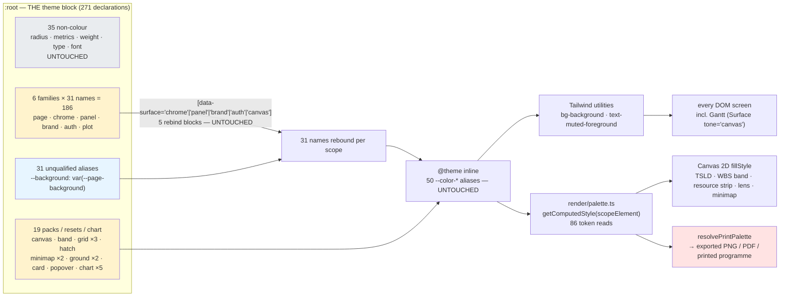
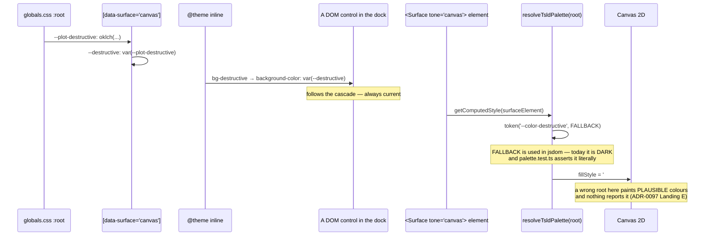
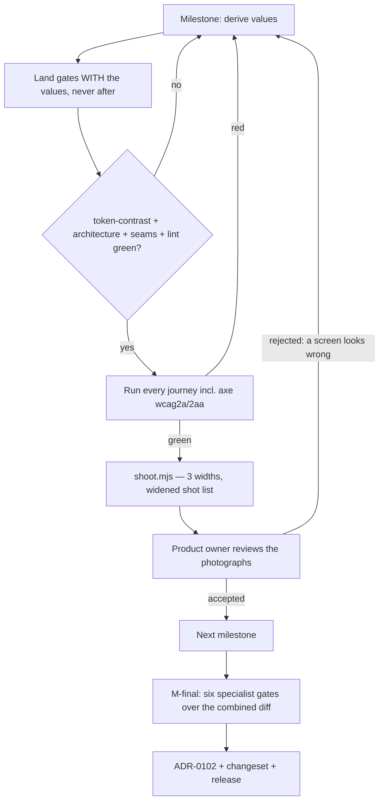

# Feature Spec: The light corporate theme

- **Status:** Draft — **awaiting approval before implementation**
- **Author(s):** feature-analyst (Product Owner / Solution Architect / Technical Lead hats)
- **Date:** 2026-08-21
- **Tracking issue / epic:** _tbc_
- **Roadmap link:** design-system continuation (ADR-0097 → ADR-0099 → this)
- **Related ADR(s):** ADR-0097 (governing), ADR-0099 (the palette being replaced), ADR-0055
  (surface scopes), ADR-0077 §8/§9 (`brand`/`auth`), ADR-0100 (minimap frame), ADR-0101 (the two
  stopgaps this replaces), ADR-0056 F5/F7a (gridlines, hatch), ADR-0095 (Gantt), ADR-0059 M4
  (printed programme). **This epic needs its own ADR — outline in §4.7.**

> **A note on filenames.** The request named `spec.md` / `plan.md`; `docs/PROCESS.md` §Artifacts
> and `docs/templates/` name `feature-spec.md` / `implementation-plan.md`, and every other feature
> directory uses those. I have used the process names. Nothing else about the request is changed.

---

## 0. What I could and could not verify, stated first

`docs/PROCESS.md` "Decision-bearing claims carry their evidence" and ADR-0076 apply to this
document. Two things about **how** it was produced belong at the top rather than in a footnote:

- **This agent had no shell in this session** (tools: read, grep, glob, write). Every count below
  was derived by pattern-matching the working tree and is reproducible by the command given beside
  it. **I could not run `git`**, so the recovered `.corporate` block at `44f1c59^` is the one thing
  in this spec I have **not** read. Everything attributed to it is the coordinator's measurement,
  labelled as such, and **M0-T1 exists to re-derive it before any value depends on it**.
- **Six claims in the brief and in the register are wrong.** They are corrected in §0.1 rather than
  repeated, because a wrong number laundered into a spec is the failure ADR-0076 exists for. Two of
  them change what gets built.

### 0.1 Corrections

| #   | Claim as given                                                                                                                                                  | What the code says                                                                                                                                                                                                                                                                                                                                                                                                                                                                                  | Consequence                                                                                                                                                                        |
| --- | --------------------------------------------------------------------------------------------------------------------------------------------------------------- | --------------------------------------------------------------------------------------------------------------------------------------------------------------------------------------------------------------------------------------------------------------------------------------------------------------------------------------------------------------------------------------------------------------------------------------------------------------------------------------------------- | ---------------------------------------------------------------------------------------------------------------------------------------------------------------------------------- |
| C1  | "the product has never decided a typeface … must at minimum be an explicit in/out-of-scope call"                                                                | **The typeface is decided and shipped.** `globals.css:29-78` declares two `@font-face` rules for **Space Grotesk**, self-hosted from `src/assets/fonts/`, chosen by the product owner from four candidates (`docs/specs/design-system-rewrite/typeface.md`) and gated four ways by `token-architecture.test.ts:586-641`. ADR-0097 _found_ that no face had been chosen; ADR-0097 then _chose one_.                                                                                                  | **Do not spend a critical question on it.** Out of scope — with one live exception, C7.                                                                                            |
| C2  | "the `auth` scope … is fixed-dark by design"                                                                                                                    | **`auth` is fixed-WHITE.** `--auth: oklch(1 0 0)`, `--auth-foreground: oklch(0.252 0.056 264)` (navy) — `globals.css:365-366`. The fixed **navy** is `--brand` (`globals.css:294`). The two were inverted.                                                                                                                                                                                                                                                                                          | Changes the `auth` fork entirely: on a light page `auth` risks **collapsing onto the page**, not clashing with it. §4.5.                                                           |
| C3  | "ADR-0097 says the vocabulary is 31 names across 6 scopes"                                                                                                      | **6 scopes is right; 31 is right; ADR-0097 is wrong.** That ADR's Consequences and its own 2026-08-19 correction both say "six families × **29** names = 174". `token-architecture.test.ts:341` asserts **31** ("rebinds exactly the closure, all 31 of it"), and 31 is what the closure computes: 50 `--color-*` aliases in `@theme inline` minus 19 deliberately outside (4 resets + 10 packs + 5 chart). 18 base + **13** closure members, not 11.                                               | A theme block owes **186** family declarations, not 174. Matters only if a second theme returns — recorded so the next reader is not misled.                                       |
| C4  | "How many declarations are at `:root`?"                                                                                                                         | **271**, and they are not one population: **182 literal colours**, **54 `var()` aliases** (31 unqualified + 22 `--plot-*` + `--plot-background`, which the original command could not see — see §3.1), **35 non-colour** (1 radius, 3 metrics, 5 weights, 24 type, 2 font stacks). The coordinator's "~40 non-colour" is **35**.                                                                                                                                                                    | **The re-derivation is 182 numbers, not 271.** §3.1.                                                                                                                               |
| C5  | ADR-0099 is "values only, no new structure"                                                                                                                     | True of the CSS, and **its prose was not updated with it**. `globals.css:80-117` — the file's own header — still describes _"Navy chrome around a light working canvas, amber as the primary action colour"_, and lines 119, 125-131, 136-148 are **six orphaned comments** annotating declarations that moved into `--page-*`. The file describes the light corporate theme it stopped implementing.                                                                                               | An **asset and a hazard**: some of the derivation the coordinator went to git for is in the working tree, attached to the wrong numbers. §0.2.                                     |
| C6  | (implicit) the diagram values carry their derivation                                                                                                            | **`--plot-destructive`'s comment contradicts its own declaration.** `globals.css:553-577` reasons _"Critical darkens 0.505 → 0.46 and its chroma eases 0.19 → 0.175, giving 1.61:1"_ and warns that `oklch(0.46 0.19 27.5)` is out of sRGB gamut. The declaration on line 578 is `oklch(0.721 0.148 37)`. Neither number appears in the comment; the shipped triple is separated on **lightness** (0.49 / 0.60 / 0.721), which is Graphite's rule, and the comment is ADR-0097's Light-era working. | Third instance of the same drift, **inside the exact block this epic re-derives**. Anyone recovering values by reading `globals.css` gets Light-era reasoning on Graphite numbers. |
| C7  | —                                                                                                                                                               | **`PrintSurface.css:32` hard-codes `font-family: 'Inter', …`**, so the printed programme is not set in the product's typeface. Its docblock also still says "regardless of the app's light/dark/system theme" (three themes, one survives).                                                                                                                                                                                                                                                         | A one-line fix this epic should take, because it is in the print path this epic touches anyway.                                                                                    |
| C8  | `globals.css` twice states the diagram ground sits at **"1.02:1 against the page"** (`:524-526` and `:954-956`), calling it _"two greys nobody can tell apart"_ | **They are the same colour.** `--canvas: oklch(0.177 0.011 260.6)` (`:332`) and `--page-background: oklch(0.177 0.011 260.6)` (`:464`) are byte-identical, so the ratio is exactly **1.00:1**. The 1.02:1 predates ADR-0099's re-valuing and survived it, like C5 and C6.                                                                                                                                                                                                                           | Strengthens **CQ-2**: it is not "two greys nobody can tell apart", it is **one grey**. The canvas scope is currently a seam with no value difference behind it at all.             |

### 0.2 The finding that most changes the epic's cost

**A live defect in the export and print path, established by reading the token chain end to end.**

`use-diagram-image.ts:111` calls `resolvePrintPalette(canvasSurface)` — the **canvas scope element**.
Inside `[data-surface='canvas']`, `--background` → `--plot-background` → `--canvas` →
`oklch(0.177 0.011 260.6)`, i.e. near-black (`globals.css:332, 527, 957`). `resolvePrintPalette`
sets `ground: token('--color-background', '#ffffff')` — so the **fallback** is white and the
**resolved value** is near-black. Meanwhile `PrintSurface.css:23-55` pins the surrounding print
chrome at `#ffffff` with `#1a1a1a` ink, _"PINNED to `resolvePrintPalette()`'s own light fallbacks so
the two can't drift"_.

So a printed programme, an exported PNG and an exported PDF currently bake a **near-black diagram
onto a white page**. `resolvePrintPalette`'s own docblock explains why: ADR-0097 deleted the
`.dark`-clearing trick because _"the product's working surfaces are already light"_ — true when
written — and ends _"**If a dark theme returns, this is one of the places that needs it back**"_.
ADR-0099 returned one and this was not restored. Nobody sees it on screen, which is why it survived.

**Status of this claim:** established by reading `use-diagram-image.ts:111`, `palette.ts:121-172`,
`PrintSurface.css:1-55` and the `globals.css` token chain. **Not** confirmed in a browser — no shell
here. **M0-T2 confirms or refutes it by rendering one**, and it is a gating output of M0 because if
it is real it is a defect on `main` today, independent of this epic.

**Why it changes the cost:** the light theme fixes it _for free_ — but only accidentally. The
mechanism that guaranteed a light printed page is gone, and this epic should either restore it or
record deliberately that print now depends on the app theme being light. §4.4.

### 0.3 The recovered `.corporate` block — what I am and am not relying on

The coordinator established, by command:

```
git show 44f1c59^:apps/web/src/styles/globals.css | sed -n '508,1020p' \
  | grep -o '^\s*--[a-z0-9-]*'                       → 117 unique names
awk '/^:root \{/,/^\}/' apps/web/src/styles/globals.css | grep -o '^\s*--[a-z0-9-]*'  → 271 unique
comm -23 <corporate> <root>                          → EMPTY  (strict subset)
```

I **verified the 271** independently (§3.1 reconciles to exactly 271 by composition, which is a
stronger check than re-running the same command). I **could not verify the 117 or the subset
relation**, and M0-T1 does.

**Treat the block as a derivation with its working shown, not as a patch to apply.** It was derived
before the `--page-*`/`--plot-*` split, before the 13-member closure expansion, before `auth`
(ADR-0077 M7), before the minimap frame (ADR-0100) and before ADR-0099 re-valued the canvas. Its
_reasoning_ is what survives the flip — amber is 1.92:1 on off-white and therefore cannot be the
page primary; near-critical must be bronze because amber is spoken for — because that reasoning was
derived **on a light ground**, which is the ground we are returning to. Its _values_ must be re-run
through today's matrix, and M1 is a **measurement milestone** whose deliverable is the list of what
broke.

---

## 1. Business understanding

### Problem

The product owner loaded `web-v0.96.0`, said the dark theme is _"awful in all respects"_ and _"very
hard on the eyes over a long period"_, and asked for a **light corporate theme** replacing it
entirely — chrome and canvas.

Three things make this more than a preference:

1. **It is the answer to a question the product deliberately left open.**
   `docs/specs/graphite/design.md:98-116` is headed **"The palette is OPEN"** and says in terms
   _"a dark graphite scheme was drafted and landed as ADR-0099 M1 … **The product owner is not
   settled on it**"_, asking specifically about _"long-session comfort; whether dark, light, or
   both"_. This epic closes that section. It is not a reversal of a settled decision.
2. **There is a measured mechanism behind the complaint.** ADR-0101 measured the most-read pair in
   the product — page foreground on the canvas ground — at **14.62:1**, more than triple WCAG AA and
   more than double AAA. On a near-black ground that is the halation profile: light glyphs bloom into
   the dark field, which is what makes a long session tiring and is worse for astigmatic readers.
   `docs/TECH_DEBT.md` #157 records the structural cause — **every colour gate in this repository
   asserts a floor and none asserts a ceiling**, so values could only ever be pushed apart.
   Two stopgaps are in the tree now (`globals.css:465-474`, `423-433`) explicitly labelled as this
   epic's to replace.
3. **The product already disagrees with itself.** The six pre-authentication screens are a **light
   corporate surface today** — a fixed navy panel (`--brand`, sampled `#14213D`) beside a white card
   (`--auth`) with amber accents (`#fca311`), theme-invariant by ADR-0077 §2/M7. A user signs in to a
   light corporate front door and lands in a dark graphite application. This epic makes the
   application agree with the front door, not the other way round.

### Users

Everybody, on every screen — but the person whose need decides the design is the **Planner**, using
the plan workspace for hours at a stretch on a 1646 CSS-px Surface Pro (ADR-0091's retrospective).
Colour here is not decoration: on the diagram it carries criticality, conflict, float, working time
and selection simultaneously.

Roles are **unaffected**. This epic changes no permission, no gate, no scope check. Org Admin,
Planner, Contributor, Viewer and External Guest all see the new values; External Guest sees them on
the `/share` read-only view, which uses the same tokens.

### Primary use cases

1. A planner works the TSLD canvas for a long session without eye strain.
2. A planner tells the three criticality states apart at a glance on a light ground.
3. A planner prints or exports a programme and it looks like the screen and like paper.
4. Anyone reads a table, a form or a dialog at a comfortable, non-glaring contrast.
5. A signed-out visitor moves from the sign-in screen into the app without the identity changing.

### User journeys

There is no new user journey — this is a re-valuing of an existing one. The journey that matters is
the **review** journey, and it is the epic's acceptance mechanism (§4.6):

sign in → organisation overview → a list screen → the plan workspace (editing and read-only) →
an activity editor → the Gantt → a print preview. At three widths. As photographs, milestone by
milestone.

### Expected outcomes

- Long-session comfort on the primary surface, with a **stated instrument** behind it rather than an
  opinion (§4.3).
- One identity from the sign-in screen through to the diagram.
- `docs/specs/graphite/design.md` §5 closed; `docs/TECH_DEBT.md` #157 **closed as answered** — the
  flip retires the failure mode rather than the epic building a gate against it (§4.3, with the
  arithmetic).
- The print/export path either provably light or provably deliberate (§0.2).

### Success criteria

| #   | Criterion                                                        | How it is measured                                                                                                                                                                                                                       |
| --- | ---------------------------------------------------------------- | ---------------------------------------------------------------------------------------------------------------------------------------------------------------------------------------------------------------------------------------- |
| S1  | The product owner accepts the look, screen by screen             | `.screenshots/` at 1646 / 1920 / 1280, reviewed per milestone. Rejection at a milestone is a normal outcome, not a failure.                                                                                                              |
| S2  | No pair regresses                                                | `token-contrast.test.ts` green over 6 scopes; the criticality triple ≥ 1.5:1; every plot-pack pair ≥ 3:1 on both grounds; the minimap frame ≥ 3:1 on all three of its grounds.                                                           |
| S3  | No **new** WCAG failure in a real browser                        | `axe-core` `wcag2a`/`wcag2aa` (which includes `color-contrast`, the only instrument here that sees composited alpha) across every journey that already runs it.                                                                          |
| S4  | The most-read pairs are **reported** with their achieved figures | §4.3 — no ceiling gate ships; the milestone document records the numbers so a later reader can see where the values landed. `docs/TECH_DEBT.md` #157 closes as _answered_.                                                               |
| S5  | The diagram carries every semantic it carried before             | §3.3's enumeration, each with a ground and a gate or a recorded exemption.                                                                                                                                                               |
| S6  | A printed programme is light, on purpose                         | A rendered print artefact at M2, compared with the same diagram on screen.                                                                                                                                                               |
| S7  | Nothing else moved                                               | No structural change: `THEME_SELECTORS` stays one entry, `REBOUND_NAMES` stays 31, the five rebind blocks are untouched, the seam allowlist is unchanged. Asserted, not asserted-by-hope — the existing structural suites do it already. |

### Open questions

**Three are critical (§2.6). Everything else has a default, stated in place.**

---

## 2. Functional requirements

Colour is not a feature with a workflow, so the requirements are written as invariants and
acceptance conditions rather than as CRUD stories. Two of them are genuine user stories.

### User stories & acceptance criteria

> **US-1** — As a **Planner**, I want the application to be light, so that a full day in the plan
> workspace does not tire my eyes.
>
> **Acceptance criteria**
>
> - **Given** any authenticated screen, **when** it renders, **then** its `--background` resolves to
>   a light value and its foreground to a dark one.
> - **Given** the plan workspace, **when** the diagram paints, **then** the ground is light and every
>   bar fill is darker than it.
> - **Given** the most-read pairs (§4.3), **when** the matrix runs, **then** each sits inside the
>   stated band — not merely above the floor.
> - **Given** a `prefers-reduced-motion` or high-contrast OS setting, **when** the app renders,
>   **then** nothing regresses: no behaviour here depends on either.

> **US-2** — As a **Planner**, I want the three criticality states to stay distinguishable at a
> glance, so that reading a wall of bars does not require inspecting strokes.
>
> **Acceptance criteria**
>
> - **Given** the canvas scope, **when** `CRITICALITY_PAIRS` is computed, **then** every pair is
>   ≥ 1.5:1 (today's floor) and the achieved figures are **reported in the milestone document**.
> - **Given** any bar fill, **when** measured against the diagram ground, **then** ≥ 3:1.
> - **Given** a colour-deficient reader, **when** they look at the diagram, **then** the separation
>   is carried by **lightness**, not hue alone — `graphite/design.md:108-110` records the previous
>   hue-only separation at **1.23:1** and _"invisible to a colour-deficient reader"_.
> - **Given** any criticality state, **when** it paints, **then** WCAG 1.4.1 is still satisfied by
>   the shape cue (`paint.ts` solid outline critical / dashed near-critical), unchanged.

> **US-3** — As a **Planner**, I want a printed or exported programme to look like the diagram on
> screen and like a document, so I can hand it to a client.
>
> **Acceptance criteria**
>
> - **Given** the export path, **when** a PNG/PDF/print is produced, **then** its ground is light and
>   its inks are the same tokens the screen resolved.
> - **Given** the print chrome, **when** it renders, **then** it is set in the product's typeface,
>   not in whatever `'Inter'` resolves to.

> **US-4** — As a **signed-out visitor**, I want the app I sign in to to look like the screen I
> signed in from.
>
> **Acceptance criteria**
>
> - **Given** `/sign-in` and `/orgs/:slug`, **when** compared, **then** they read as one product.
> - **Given** the `brand` and `auth` families, **when** this epic ships, **then** their values are
>   **unchanged** unless §4.5's fork is answered otherwise, and that is a deliberate, recorded act.

> **US-5** — As an **External Guest** on a share link, I want the read-only plan view to be legible.
>
> **Acceptance criteria** — the `/share` view uses the same tokens and needs no separate work; it is
> named here so it is **shot** rather than assumed (§4.6 gap list).

### Workflows

None new. The one workflow this epic creates is internal: **derive → gate → photograph → review →
accept or re-derive**, per milestone.

### Edge cases

| Case                                                | Expected behaviour                                                                                                                                                                                                                                                                                                                                                                                                                                      |
| --------------------------------------------------- | ------------------------------------------------------------------------------------------------------------------------------------------------------------------------------------------------------------------------------------------------------------------------------------------------------------------------------------------------------------------------------------------------------------------------------------------------------- |
| **jsdom / no computed styles**                      | `palette.ts`'s `token(name, fallback)` returns the hard-coded fallback. Today those fallbacks are **dark** for `resolveTsldPalette` (`#14161c`, `#e6e8ee`…) and **light** for `resolvePrintPalette`. They must be re-derived to light, and `palette.test.ts` asserts several of them literally (`palette.test.ts:56, 81, 112, 128, 185` — one local is even named `dark`). This is a real, findable task, not a detail.                                 |
| **A token the painter reads that no scope rebinds** | Cannot happen for the 31 — `token-architecture.test.ts:366-372` asserts the canvas block rebinds exactly 31 and shadows nothing. It **can** happen for the 10-member plot pack, which is outside the closure by design; those are gated by their own pairs (`PLOT_GROUNDS`, `MINIMAP_GROUNDS`).                                                                                                                                                         |
| **Alpha modifiers** (`hover:bg-x/80`)               | Invisible to the token matrix — `globals.css:138-145` records a live 3.8:1 failure found only by an alpha census, and `token-contrast.test.ts:81-88` records `bg-destructive/90` shipping at 4.32:1. On a light ground the direction of the error **inverts** (an alpha fill lightens toward a light surface instead of toward a dark one), so **every hover/wash token must be re-checked, and axe in a real browser is the instrument that sees it**. |
| **A very short or very long plan**                  | Unaffected — a colour is not a function of plan size. But the minimap's rectangle can fill its box on a short plan (ADR-0100 established this by screenshot), so the frame pair must be legible when it coincides with the box border.                                                                                                                                                                                                                  |
| **Print with `color-adjust` off**                   | A browser may drop backgrounds. The print surface already relies on `#ffffff` paper; a light diagram degrades gracefully where a dark one degrades to unreadable. This is an argument _for_ the light print ground, and it should be stated rather than discovered.                                                                                                                                                                                     |
| **A user with an OS dark preference**               | Sees the light theme. `theme-boot.js` stamps nothing and `THEME_SELECTORS` has one entry (ADR-0097). This is the accepted cost, already recorded in ADR-0097's Consequences (_"dark mode is an accommodation for some people … not only a preference"_). This epic **does not change that trade**; it does make the surviving theme the comfortable one, which is a partial improvement.                                                                |

### Permissions

**None.** No RBAC change, no scope check, no new endpoint, no `assertHoldsPen` site. The CPM engine
is not imported and no migration runs, so the **ADR-0034 recalculation parity gate is untouched by
construction** — in its honest form: there is nothing here to hold parity for.

### Validation rules

The "validation" in a token epic is the gate set. §3.2 states each gate and whether it constrains,
is neutral, or must change — and for each change, whether it is a **weakening** (forbidden by
CLAUDE.md §19.7) or a **re-derivation**.

### Error scenarios

| Scenario                                           | Detection                                       | Result                                | Status |
| -------------------------------------------------- | ----------------------------------------------- | ------------------------------------- | ------ |
| A pair falls below its floor                       | `token-contrast.test.ts`                        | CI red, naming the pair and the ratio | —      |
| A family loses a member                            | `token-architecture.test.ts` completeness sweep | CI red, naming the token              | —      |
| A token declared outside a theme/scope block       | the theme contract assertion                    | CI red                                | —      |
| A colour literal in `className`/`style`            | the colour-literal lint rule                    | lint red                              | —      |
| A hand-written `data-surface` or `--chrome-*` read | `surface-seams.structural.test.ts:49-60`        | CI red                                | —      |
| A composited/alpha pair fails only when rendered   | `axe-core` `color-contrast` in the journeys     | CI red                                | —      |
| **A screen looks wrong and every gate is green**   | **the screenshot review**                       | milestone rejected, re-derive         | —      |

That last row is the point of the epic's shape. `shoot.mjs`'s own docblock says it: _"a contrast
matrix cannot tell you a screen is ugly"_.

### 2.6 Critical questions

Only three. Everything else is defaulted in place. **These are the ones whose answers change what
gets built.**

> **ALL THREE ANSWERED by the product owner, 2026-08-21 — each taking the recommended default.**
>
> |          | Answer                                                         | What it settles                                                                                                                                                                                                                                               |
> | -------- | -------------------------------------------------------------- | ------------------------------------------------------------------------------------------------------------------------------------------------------------------------------------------------------------------------------------------------------------- |
> | **CQ-1** | **(a) Navy chrome, light working surfaces**                    | `--chrome`/`--panel` stay dark navy; page, card, popover and diagram go light. The recovered `.corporate` derivation applies as written and amber keeps the placement it was measured for.                                                                    |
> | **CQ-2** | **A distinct working surface**, one measured step off the page | `--canvas` stops being byte-identical to `--page-background`. The step is chosen so the difference is perceptible (≥ ~0.02 OKLCH) and is **reported as a number**, not eyeballed.                                                                             |
> | **CQ-3** | **IN, values only**                                            | Derive the 10–12 swatch categorical ramp against the new ground and gate it. Do **not** build the colour-by-WBS mode, the assignment surface or its persistence — those stay `graphite/design.md` §5a's own epic, which inherits the colours already decided. |
>
> The three answers are mutually reinforcing rather than independent, and that is worth stating
> because it removes a risk the plan carried: CQ-1(a) keeps the chrome dark, so the CQ-2 step off
> the page has a **dark rail beside it** to be read against — the "two greys nobody can tell apart"
> trap needs a light rail to bite, and there isn't one. It also means the CQ-3 ramp is derived
> against exactly one ground rather than having to survive both a light rail and a light page.
>
> **What is still not decided, and is deliberately not a question:** whether `auth` survives. It has
> a default and an instrument (§4.5) and becomes a decision recorded in the ADR only if the gate says
> the scope has collapsed onto the page. Under CQ-1(a) that is now _less_ likely, since the sign-in
> panel's navy and the app's navy chrome agree.

---

**CQ-1 — Does the chrome go light, or stay navy?**

The request says "replace it entirely — chrome AND canvas", which settles that the chrome is **in
scope** but not what it becomes. Two coherent answers exist and they are 62 declarations and the
entire look apart:

- **(a) Navy chrome, light working surfaces.** The rail and command band stay dark navy
  (`--chrome`/`--panel`), the page, cards and diagram go light. This is exactly what
  `globals.css:96-97` already describes — _"Navy chrome around a light working canvas"_ — it is what
  the recovered `.corporate` block was derived for, it keeps `--chrome-ring` amber at 7.9:1 where
  amber is legible, and it matches the sign-in screen's navy panel. Least new derivation.
- **(b) Fully light.** Rail and strip in near-white with real borders, navy reserved for primary
  actions and the sign-in panel. A single continuous light surface. More restful; more new
  derivation (both families from scratch, and the ADR-0099 rail was designed _as_ dark chrome);
  risks the rail and the page becoming indistinguishable, which is the 1.02:1 trap ADR-0097 named
  one surface along.
- **(c) Light chrome with a navy identity band.** A hybrid.

**Default if unanswered: (a).** It is the measured, recoverable option; it is what the file's own
prose already claims; and it is the only one that makes the front door and the app one identity
without touching `brand`/`auth`.

---

**CQ-2 — Is the diagram ground paper (≈ the page), or a distinct working surface?**

This decides the whole plot derivation and it cannot be answered from the repository, because the
repository has tried both and recorded a problem with each:

- **Paper.** The diagram ground ≈ `--page-background`. Simple, and it makes the export match the
  screen trivially. But `globals.css:524-526` names this arrangement as the trap — _"two greys nobody
  can tell apart, which is exactly why the pre-scope trap never showed"_ — and per **C8** it
  understates it: `--canvas` and `--page-background` are **byte-identical today**, so the canvas
  scope is currently a seam with no value difference behind it at all. Re-creating that on purpose is
  defensible, but only if said out loud, because it means the diagram has no ground of its own.
- **A distinct working surface.** One deliberate, measured step off the page — the drawing board on
  the desk. Gives the month bands, the non-working wash and the hatch room to be _quiet_, which is
  half of what "hard on the eyes" was reporting (`globals.css:424-432`: the hatch at a 0.177 → 0.300
  step, two days in seven across the whole width).

There is a hard constraint on this choice that is already in the file and is Light-era reasoning
that becomes live again: `globals.css:573-577` records **1.70:1 as the ceiling** on the criticality
separation, _"established by maximising the worst pair over all three inks subject to a white
inside-label at 4.5:1 and every bar at 3:1 on a **near-white ground**"_. So on a near-white ground,
with white inside-labels, 1.5–1.70:1 is all the separation available. **Relaxing the inside-label
requirement** (dark ink inside lighter fills, or labels beside bars) is the lever that buys more, and
it is a design decision, not an arithmetic one.

**Default if unanswered:** a distinct working surface, one measured step off the page, with the
step's size chosen so that `--canvas` vs `--page-background` is perceptible (≥ ~0.02 OKLCH, the
threshold `token-architecture.test.ts:687-693` already uses) and reported as a number.

---

**CQ-3 — Is WBS / categorical colouring in this epic?**

`docs/specs/graphite/design.md:118-156` §5a is a **product-owner requirement, added late, never
answered**: P6 planners colour and group by WBS, and it _"collides head-on with the criticality
ladder … because both want the bar fill"_. It asks for a categorical palette of **10–12** colours;
the product ships **five** (`--chart-1..5`), already consumed by the Colour-by-WBS lens
(`palette.ts:225-231`) which cycles them.

Deciding it now is materially cheaper than deciding it later, because the ramp has to be derived
against the new ground either way and doing it twice is doing it twice.

- **In:** derive a 10–12 swatch categorical ramp now, each ≥ 3:1 on the diagram ground, each with a
  legible label ink, none confusable with the reserved semantics. Does **not** build the `colour by`
  mode, the assignment surface or the persistence — those are a separate epic.
- **Out:** re-derive the existing five against the new ground and leave the ramp's size to §5a's own
  epic.

**Default if unanswered: IN, values only.** Derive the ramp, ship it as `--chart-*` extended to the
agreed count, gate it, and explicitly **do not** build the mode or the surface. That leaves §5a's
epic as a behaviour change with its colours already decided, and it costs this epic one task.

---

### 2.7 Questions I am **not** asking, and why

| Not asked                                 | Because                                                                                                                                                                                                                                                                                                                                                                                                                                                                                                                      |
| ----------------------------------------- | ---------------------------------------------------------------------------------------------------------------------------------------------------------------------------------------------------------------------------------------------------------------------------------------------------------------------------------------------------------------------------------------------------------------------------------------------------------------------------------------------------------------------------- |
| "What does _corporate_ mean — which hue?" | **The repository answers it with measured values.** `--brand: oklch(0.252 0.056 264)` and `--brand-primary: oklch(0.786 0.167 70)` are the old Flask app's `#14213D` navy and `#fca311` amber, sampled from `static/css/main.css` (`globals.css:346-364`), with `--auth-ring`/`--auth-input` **derived down** rather than sampled because the original amber ring measured 2.02:1 and the field outline 2.22:1 — both WCAG 1.4.11 failures. Asking would be asking them to re-decide something they decided and we measured. |
| "Should the typeface change?"             | Decided — C1.                                                                                                                                                                                                                                                                                                                                                                                                                                                                                                                |
| "Should dark come back later?"            | Decided: replace entirely, mechanism kept live (ADR-0097 D-single-theme). The cost of a return is §3.1's numbers plus real design judgement, and this epic **improves** that position by re-deriving the diagram's separations on a second ground.                                                                                                                                                                                                                                                                           |
| "Should the `auth` scope be retired?"     | It has a **default and an instrument** (§4.5). It becomes a question only if the gate says the scope has collapsed, and then it is a decision recorded in the ADR, not a fork in the plan.                                                                                                                                                                                                                                                                                                                                   |
| "Should there be a `VITE_` flag?"         | No. ADR-0088 D1: a `VITE_` constant is inlined at build time, `docker-publish.yml` passes none, and `.dockerignore` strips `**/.env` — **there has never been an operator rollback**. The rollback is a commit boundary (ADR-0097/0098/0099 precedent).                                                                                                                                                                                                                                                                      |

---

## 3. Technical analysis

| Area           | Impact                                       | Notes                                                                                                                                                                                                                                                                                                                                                                                                                                            |
| -------------- | -------------------------------------------- | ------------------------------------------------------------------------------------------------------------------------------------------------------------------------------------------------------------------------------------------------------------------------------------------------------------------------------------------------------------------------------------------------------------------------------------------------ |
| Frontend       | **high**                                     | One CSS file's values; the painter's fallbacks; three components that read `--color-*` directly; the print surface. No routes, no state, no forms.                                                                                                                                                                                                                                                                                               |
| Backend        | **none**                                     | Not touched.                                                                                                                                                                                                                                                                                                                                                                                                                                     |
| Database       | **none**                                     | No model, no column, no migration. **`database-architect` is therefore not engaged — because there is no schema change, not because one was judged too small** (CLAUDE.md §19.3 / ADR-0091's phrasing).                                                                                                                                                                                                                                          |
| API            | **none**                                     | —                                                                                                                                                                                                                                                                                                                                                                                                                                                |
| Security       | **none**                                     | No authN/Z, no scope, no input, no secret, no audit event.                                                                                                                                                                                                                                                                                                                                                                                       |
| Performance    | **low, and it must be measured not assumed** | The painter re-resolves tokens once per theme bump, not per frame (`palette.ts` docblocks). Nothing here changes the number of `ctx` calls. The one real risk: a light ground with a **denser** hatch or **more** gridline tiers would add fill work — so the plot pack's re-derivation must not add a layer. `docs/TECH_DEBT.md` #75's known overage is not attributable here and the M-final should say so with a number, as ADR-0099 M10 did. |
| Infrastructure | **none**                                     | No env, no compose, no CI service. The CSP is untouched (`font-src 'self'` already satisfied).                                                                                                                                                                                                                                                                                                                                                   |
| Observability  | **none**                                     | —                                                                                                                                                                                                                                                                                                                                                                                                                                                |
| Testing        | **high**                                     | §3.2. Plus the screenshot harness, which is this epic's primary evidence and has named gaps (§4.6).                                                                                                                                                                                                                                                                                                                                              |

### 3.1 The real token inventory — measured

Reproduce with `rg` inside `apps/web/src/styles/globals.css`:

| Measure                                | Count   | Command                                                                               |
| -------------------------------------- | ------- | ------------------------------------------------------------------------------------- |
| Declarations in the whole file         | **511** | `rg -c '^\s+--[a-z0-9-]+:'`                                                           |
| Declarations at `:root`                | **271** | composition below; reconciles exactly                                                 |
| Literal `oklch()` colour declarations  | **182** | `rg -c '^\s+--[a-z0-9-]+:\s*oklch\('` (a 183rd `oklch(` is inside a comment)          |
| `var()` aliases at `:root`             | **54**  | `grep -cE '^\s*--[a-z0-9-]+:\s*var\('` — see the correction note below                |
| Non-colour tokens                      | **35**  | 1 radius + 3 metrics + 5 weights + 24 type + 2 font stacks                            |
| `--color-*` aliases in `@theme inline` | **50**  | `rg -c '^\s+--color-'`                                                                |
| **`REBOUND_NAMES`**                    | **31**  | 50 − 19 outside the closure; asserted at `token-architecture.test.ts:341`             |
| Surface scopes                         | **6**   | `page`, `chrome`, `panel`, `brand`, `auth`, `canvas` — `token-contrast.test.ts:25-26` |
| `SurfaceTone` members                  | **7**   | the 6 scopes' 5 attribute values + 2 resets (`surface.tsx:53`)                        |

**The 271 reconciles by composition, which is the check worth having:**

```
6 families × 31 names        = 186   (page, chrome, panel, brand, auth, plot)
packs 10 + resets 4 + chart 5 =  19
unqualified aliases           =  31
non-colour                    =  35
                              -----
                                271  ✓
```

> **Corrected at M0-T1 (2026-08-21): the alias count is 54, not 53, and the missing one matters.**
> The command in the table above was scoped to `var(--page-`, so it could count only aliases pointing
> at the page family. Counting all of them (`grep -cE '^\s*--[a-z0-9-]+:\s*var\('`) gives **54**, and
> `182 + 54 + 35 = 271` reconciles exactly where `53` left the composition one short.
>
> The one it could not see is **`--plot-background: var(--canvas)`** — which is the single
> declaration **CQ-2 is about**. It is why the diagram ground and the page ground are byte-identical
> today: the alias points at `--canvas`, and `--canvas` holds the same literal as `--page-background`.
> A counting command scoped to one family was structurally incapable of seeing the token that makes
> the diagram's ground a separate thing, and the epic's second critical question is precisely whether
> it should be one. Worth keeping as an instance of the class: the instrument was narrower than the
> question, and the number it returned looked reasonable.

and, on the colour side:

```
186 family declarations − 23 that are var() aliases (all --plot-*)  = 163 literal
+ 19 packs/resets/chart                                              = 182 literal ✓
```

**So the work is 182 numbers.** Grouped by how much design judgement each needs:

| Group                                                                         | Count                      | Judgement needed                                                                                                                                                                                                                    |
| ----------------------------------------------------------------------------- | -------------------------- | ----------------------------------------------------------------------------------------------------------------------------------------------------------------------------------------------------------------------------------- |
| `--page-*` literals                                                           | 31                         | **Low** — direct ancestors in the recovered block (its bare `--background`/`--foreground`/`--muted`); values largely transfer by rename. Must be re-run through the matrix.                                                         |
| `--chrome-*` + `--panel-*` literals                                           | 62                         | **Low if CQ-1 = (a)** (recoverable navy, already derived on this exact fill), **high if (b)**.                                                                                                                                      |
| `--brand-*` + `--auth-*` literals                                             | 62                         | **None** — theme-invariant, already light corporate, already measured. **Untouched by default.**                                                                                                                                    |
| `--plot-*` literals                                                           | 8 today, **more expected** | **High.** The genuinely new design work. On a light ground the lightness ordering **inverts**: bars must be darker than the ground, where today they are lighter. Several of the 22 page-aliases will legitimately become literals. |
| plot pack (`--canvas`, `--canvas-band`, 3 grid tiers, hatch, 2 minimap frame) | 8                          | **High.** The minimap frame is a white stroke + dark halo pair (`globals.css:343-344`) derived against a 0.177-L ground; **white cannot hold a light ground**, so the pair inverts.                                                 |
| `--ground` / `--ground-end`                                                   | 2                          | **None by default** — the public screens' gradient, part of the untouched front door.                                                                                                                                               |
| resets `--card`/`--popover` + foregrounds                                     | 4                          | **Low.**                                                                                                                                                                                                                            |
| `--chart-1..5`                                                                | 5 (or 10–12 — CQ-3)        | **Medium to high.**                                                                                                                                                                                                                 |

**Two of the 182 are labelled stopgaps this epic must delete rather than inherit** — `globals.css`
lines **465-474** (`--page-foreground`, softened 0.913 → 0.82, comment explicitly says _"The light
corporate theme replaces this value wholesale"_) and **423-433** (`--canvas-nonworking-hatch`,
0.3 → 0.25). Their **comments** go with them; the reasoning inside them (halation, hatch loudness)
carries forward to §4.3 and to the plot derivation.

### 3.2 The gates — which constrain this work

| Gate                                  | File                                                    | Constrains?                                                                                                                                                                                            | What must happen                                                                                                                                                                                                            |
| ------------------------------------- | ------------------------------------------------------- | ------------------------------------------------------------------------------------------------------------------------------------------------------------------------------------------------------ | --------------------------------------------------------------------------------------------------------------------------------------------------------------------------------------------------------------------------- |
| **The computed contrast matrix**      | `styles/token-contrast.test.ts`                         | **Yes — the primary constraint.** 6 scopes × (22 `TEXT_PAIRS` entries, 18 distinct — see below) + 14 `NON_TEXT_PAIRS`, plus the criticality triple, `PLOT_GROUNDS`, `MINIMAP_GROUNDS`, the grid tiers. | **Re-run, not relaxed.** Adding the reading-pair ceiling (§4.3) is an _addition_. Any floor that has to move is a **weakening** and is forbidden.                                                                           |
| **Token architecture / completeness** | `styles/token-architecture.test.ts`                     | **Neutral.** It asserts _shape_: family completeness, `REBOUND_NAMES` = 31, `@theme inline`'s `inline` keyword, no `--color-<family>-*` leak, literal-not-alias for `--field`/`--canvas`/grid tiers.   | **Unchanged.** If it goes red, the change was structural and this epic is out of scope. That is a useful tripwire, so say it: **any red here is a stop-and-reconsider, not a fix.**                                         |
| **The `auth` earns-its-keep gate**    | same file, `:643-712`                                   | **Yes, and it is the fork's instrument.** Requires ≥ 4 of 8 sampled `--auth-*` tokens to differ perceptibly (≥ 0.02 OKLCH) from their page counterparts, and `--auth-ring` to differ by > 0.1.         | **Expect it to go red**, because a light page may converge on a white card. §4.5. Its own message says what to do: _"retire it deliberately or restore the values"_. **Neither branch is a weakening**; both are decisions. |
| **The weight ratchet**                | same file, `:391-501`                                   | **Neutral.** 164 screen sites / 23 primitive sites.                                                                                                                                                    | Only moves if a milestone restyles markup, which none should.                                                                                                                                                               |
| **The sizing rhythm ratchet**         | same file, `:504-584`                                   | **Neutral.** Ceiling 18; no arbitrary type sizes at all.                                                                                                                                               | Same. **Watch the known trap**: both scanners strip comments now (`:412-419`, `:526-535`) because documenting a value used to count as using one — four recorded occurrences. Do not reintroduce it in a new gate.          |
| **The theme contract**                | same file, `:172-219`                                   | **Yes, weakly.** Every theme block declares the whole page family **literally**; the unqualified names **alias** it.                                                                                   | Holds automatically if only values change.                                                                                                                                                                                  |
| **`brand` declared-not-inherited**    | same file, `:75-97`                                     | **Neutral** while `brand` is untouched.                                                                                                                                                                | —                                                                                                                                                                                                                           |
| **Surface seams (structural)**        | `components/ui/surface-seams.structural.test.ts:48-60`  | **Neutral.** Only `surface.tsx` and `globals.css` may name `--chrome-*`/`--panel-*`/`--brand-*`/`--auth-*` or write `data-surface`.                                                                    | Unchanged — and it is why no component edit is needed to re-theme.                                                                                                                                                          |
| **The colour-literal lint rule**      | ESLint (rejects colour literals in `className`/`style`) | **Yes, as a floor on method.**                                                                                                                                                                         | Unchanged. Note it does **not** cover `.css` files or `fillStyle` strings — `palette.ts`'s fallback hexes and `PrintSurface.css`'s pinned hexes are outside it, which is exactly where two of this epic's tasks live.       |
| **`axe-core` in the journeys**        | `e2e-*/**.spec.ts`, `withTags(['wcag2a','wcag2aa'])`    | **Yes, and it is the only instrument that sees composited alpha.** `color-contrast` is a `wcag2aa` rule.                                                                                               | Re-run. Note the known limitation recorded elsewhere: axe measures **no hover state**, so hover tokens are covered by the matrix only.                                                                                      |
| **The screenshot harness**            | `apps/web/scripts/shoot.mjs`                            | **Yes — the acceptance evidence.**                                                                                                                                                                     | Must be **widened** first (§4.6).                                                                                                                                                                                           |

**One defect found in the matrix while reading it:** `TEXT_PAIRS` has 22 entries but **18 distinct
pairs** — `['--muted','--foreground']` appears at `:113` and `:120-124`, and
`success`/`warning`/`info` fill+label appear at `:95-97` and again at `:125-127`. Harmless (a
duplicate assertion passes twice) and worth removing while the file is open, but **it means any
statement of "the matrix checks 22 pairs" is 18**.

### 3.3 The diagram's semantic distinctions — enumerated, because "the bars" undersizes it

Every colour the diagram carries resolves in `render/palette.ts`, whose own docblock counts **86
token reads**. Three components read `--color-*` directly as well: `TsldMinimap.tsx`,
`TsldLegend.tsx`, `GanttPanel.tsx` (`grep -l "getComputedStyle\|--color-" src/features` →
6 files, of which `canvas-surface.tsx` and `use-theme-version.ts` are plumbing).

| #     | Distinction                                                        | Palette field / token                                                             | Ground(s) it must hold on                                                                                                                                          |
| ----- | ------------------------------------------------------------------ | --------------------------------------------------------------------------------- | ------------------------------------------------------------------------------------------------------------------------------------------------------------------ |
| 1     | diagram ground                                                     | `canvasGround` ← `--color-canvas`                                                 | — (it is a ground)                                                                                                                                                 |
| 2     | alternating month band                                             | `monthBand` ← `--color-canvas-band`                                               | the ground                                                                                                                                                         |
| 3     | non-working wash                                                   | `nonWorking` ← `--color-muted`                                                    | ground, band                                                                                                                                                       |
| 4     | non-working **hatch**                                              | `nonWorkingHatch` ← `--color-canvas-nonworking-hatch`                             | the wash (reported, not asserted — exempt, `token-contrast.test.ts:255-257`)                                                                                       |
| 5-7   | gridline tiers day / month / year                                  | `--color-canvas-grid-{day,month,year}`                                            | ground **and** band; month + year asserted ≥ 3:1, day exempt-and-reported                                                                                          |
| 8     | flag-off single gridline                                           | `gridLine` ← `--color-border`                                                     | ground                                                                                                                                                             |
| 9     | **ordinary bar**                                                   | `bar` ← `--color-primary` (canvas scope: `--plot-primary`)                        | ground ≥ 3:1                                                                                                                                                       |
| 10    | **critical bar**                                                   | `critical` ← `--color-destructive`                                                | ground ≥ 3:1; vs 9 and 11 ≥ 1.5:1                                                                                                                                  |
| 11    | **near-critical bar**                                              | `nearCritical` ← `--color-warning`                                                | as above                                                                                                                                                           |
| 12    | criticality shape-cue stroke                                       | `outline` ← `--color-foreground`                                                  | all three fills (WCAG 1.4.1 carrier)                                                                                                                               |
| 13    | bar hairline                                                       | `barStroke` ← `--color-border`                                                    | all fills                                                                                                                                                          |
| 14    | **selection ring**                                                 | `selection` ← `--color-ring`                                                      | all fills + ground (1.4.11)                                                                                                                                        |
| 15    | hover ring                                                         | `hoverRing` ← `--color-muted-foreground`                                          | must remain distinct from 14                                                                                                                                       |
| 16    | grab-handle halo                                                   | `handleHalo` ← `--color-canvas`                                                   | paired as the inverse of 12 — **this pairing is what lets one handle read on every fill, and it inverts with the ground**                                          |
| 17    | link/edge line                                                     | `edge` ← `--color-muted-foreground`                                               | ground, band, and `--accent` (selected row)                                                                                                                        |
| 18-19 | **Today** marker + pill ink                                        | `today` ← `--color-destructive`, `todayInk` ← `--color-destructive-foreground`    | ground; **and it shares a token with `critical`**                                                                                                                  |
| 20-21 | data-date rule + pill ink                                          | `dataDate` ← `--color-foreground`, `dataDateInk` ← `--color-background`           | ground; deliberately **not** `--color-info` (measured: info is a near neighbour of the bar fill)                                                                   |
| 22    | visual-planning **conflict**                                       | `conflict` ← `--color-warning` (+ triangle shape)                                 | shares a token with 11                                                                                                                                             |
| 23    | lane overlap                                                       | `laneOverlap` ← `--color-warning` (+ stacked-squares shape)                       | shares a token with 11 and 22                                                                                                                                      |
| 24-26 | inside-bar labels ×3                                               | `labelInside{,Critical,NearCritical}` ← each fill's `*-foreground`                | each on its own fill ≥ 4.5:1 — **the constraint that sets the 1.70:1 criticality ceiling**                                                                         |
| 27    | beside-bar label                                                   | `labelBeside` ← `--color-foreground`                                              | the ground — **this is the 14.62:1 pair**                                                                                                                          |
| 28-32 | **WBS band**: bar, derived (Unassigned), rule, label, selection    | `resolveWbsBandPalette`                                                           | the band's own ground                                                                                                                                              |
| 33-35 | **resource strip**: bar, axis, tick                                | `resolveResourceStripPalette`                                                     | strip ground                                                                                                                                                       |
| 36-39 | **float lens** bands: critical/low/medium/high                     | `--color-{destructive,warning,info,success}` + 4 inks                             | ground; and each vs its neighbours                                                                                                                                 |
| 40    | lens neutral (uncomputed/ungrouped)                                | `--color-muted-foreground` + `--color-background` ink                             | ground                                                                                                                                                             |
| 41-45 | **WBS colour cycle** ×5                                            | `--color-chart-1..5` + ink cycle                                                  | ground; mutually distinguishable — **CQ-3**                                                                                                                        |
| 46-47 | **minimap frame** stroke + halo                                    | `--color-canvas-minimap-frame{,-halo}`                                            | the minimap ground **and both bar fills** — a two-tone pair _because measurement said no single value works_ (`globals.css:335-342`)                               |
| 48    | minimap critical **fringe**                                        | `--color-foreground` on `--color-destructive`                                     | reported, not asserted (`token-contrast.test.ts:315-329`)                                                                                                          |
| 49-51 | **Gantt**: chart ground, ruler, rows                               | `GanttPanel.tsx:972` renders `<Surface tone="canvas">` around the **whole panel** | the canvas scope — so the Gantt inherits the plot values, which is why its own comment at `:946-950` warns _"there is no such element"_ for a chart-only sub-scope |
| 52-53 | Gantt **dependency arrows** (default-off) and **constraint badge** | `--color-muted-foreground`, `--color-warning-text`                                | asserted against both `--background` and `--accent` (`token-contrast.test.ts:158-176`)                                                                             |
| 54    | float / drift **tails**                                            | derived in `paint.ts` from the above (25 `hatch                                   | Tail` matches; no token reads of its own)                                                                                                                          | inherit |

**That is ~54 distinctions off ~20 tokens.** The over-loading is the design constraint: `critical`
and `today` are the same token; `nearCritical`, `conflict` and `laneOverlap` are the same token
carrying three meanings separated by **shape**. Any re-derivation that separates one of those pairs
buys clarity and costs a new token — which `graphite/design.md:114-116` calls _"a bigger change that
needs its own argument"_. **Default: do not add token names.** Values only.

### Dependencies

- **Must land first:** nothing. No prerequisite work, no blocked API, no migration.
- **Affected features:** every screen; specifically the plan workspace, the Gantt, the minimap
  (ADR-0100, landed 2026-08-21), the activity editor (ADR-0101, landed 2026-08-21 — the workspace
  screenshots now show a dialog rather than a drawer), the print/export path, the printed programme.
- **Inherited, unanswered:** `docs/specs/graphite/design.md` §5 (closed by this epic) and §5a (CQ-3).
- **Inherited debt:** `docs/TECH_DEBT.md` **#157** (the missing ceiling — **closed by this epic as
  answered**, §4.3, with no gate built), **#152** (the pre-existing `zoomToSelection` lane-framing
  defect — untouched), **#75** (the canvas draw budget — untouched, and the M-final must say so with
  a number rather than by omission), **#156** (the unregistered drawer-subject mechanism —
  unaffected).
- **Third parties:** none. No new dependency; nothing added to `scripts/dependency-claims.json`.

---

## 4. Solution design

### Architecture overview

**Nothing structural changes.** ADR-0097's architecture is kept exactly: one theme, `:root` **is**
the theme block, six surface scopes, 31 rebound names, `@theme inline` load-bearing, `<Surface>` the
only route into a scope. This epic changes **182 numbers inside that architecture**, plus the
painter's jsdom fallbacks and the print path.



Yellow = re-valued. Blue = mechanically follows. Grey = untouched. Red = §0.2's live defect.

### Data flow — how one colour reaches one pixel, twice

The two paths matter because they fail differently: a utility follows the cascade automatically,
while the painter takes a **snapshot** at a moment in time from a **specific element**.



### User flow — the acceptance loop, which is the epic's real control structure



The rejection edge from F is **expected to be taken**, and the plan is sized on that basis. ADR-0091
and ADR-0092 both record a design shipping on correct numbers and being called awful; the only
instrument that catches it is a picture in front of the person who will use it.

### Database changes

**None.** No model, column, index, constraint or data migration. `database-architect` is not
engaged because there is no schema change to design (ADR-0091's phrasing, deliberately: this is not
a self-assessment that a change is too small — CLAUDE.md §19.3).

### API changes

**None.**

### Component changes

Deliberately minimal — the surface-scope architecture is what makes a re-theme a values change.

| File                                          | Change                                                                                                                                                                                            | Why it is unavoidable                                                                                                  |
| --------------------------------------------- | ------------------------------------------------------------------------------------------------------------------------------------------------------------------------------------------------- | ---------------------------------------------------------------------------------------------------------------------- |
| `styles/globals.css`                          | **182 values**; delete two stopgap comments; repair the stale header prose (§0.1 C5) and the contradicted `--plot-destructive` comment (C6)                                                       | the theme                                                                                                              |
| `features/tsld/render/palette.ts`             | jsdom **fallback** hexes → light, for `resolveTsldPalette`, `resolveResourceStripPalette`, `resolveLensPalette`, `resolveWbsBandPalette`; and restore or replace the print path's light guarantee | fallbacks are outside the lint rule and outside the matrix                                                             |
| `features/tsld/render/palette.test.ts`        | assertions that pin those fallbacks literally (`:56, 81, 112, 128, 185`; one local is named `dark`)                                                                                               | they are literal                                                                                                       |
| `features/tsld/export/PrintSurface.css`       | `'Inter'` → the product's font stack; re-pin the three hexes to the new fallbacks; correct the "light/dark/system" prose                                                                          | C7 + §0.2                                                                                                              |
| `features/tsld/render/lenses.ts` / `.test.ts` | the ratio table in `palette.ts:236-240` quotes "light / dark" figures for two themes that no longer exist; `lenses.test.ts:303` iterates "per theme"                                              | stale, and it is a ratio table — the thing most likely to be trusted                                                   |
| `components/ui/*`                             | **none expected**                                                                                                                                                                                 | if a primitive needs a change, that is a _finding_: it means a pair was split across scopes, and it belongs in the ADR |
| `scripts/shoot.mjs`                           | widen the shot list (§4.6)                                                                                                                                                                        | acceptance evidence                                                                                                    |
| `styles/token-contrast.test.ts`               | **add** the reading-pair ceiling (§4.3); remove the four duplicate `TEXT_PAIRS` entries                                                                                                           | additive                                                                                                               |

### 4.3 The contrast ceiling — computed, and the answer is that there is no gate to build

`docs/TECH_DEBT.md` #157 asks this epic to _"decide whether a ceiling applies to its own grounds,
and if it does, the gate lands with the values rather than after them"_. **The answer is that it
does not, and the flip closes the row rather than the epic solving it.** That conclusion is
arithmetic, not preference, and it reverses the recommendation this section carried in its first
draft.

**The measurement.** Computed with `parseColour`/`relativeLuminance` from `@/test/colour` — the same
functions `token-contrast.test.ts` uses, so this is the gate's own arithmetic rather than a second
opinion:

| Pair                                                                                      | Ratio       |
| ----------------------------------------------------------------------------------------- | ----------- |
| dark ground `oklch(0.177 …)` vs `--page-foreground` **before** ADR-0101's stopgap (0.913) | **14.61:1** |
| the same, **after** the stopgap (0.82)                                                    | **10.84:1** |
| recovered `.corporate` **page** body — ground 0.982 / ink 0.321                           | **12.00:1** |
| recovered `.corporate` **card** body — ground 1.000 / ink 0.321                           | **12.64:1** |

**The light palette's body text is HIGHER than the softened dark value, and it is fine.** 12.64:1 is
roughly `#333` on white — an ordinary, comfortable light-UI value nobody would call a defect. That
single fact disqualifies the instrument:

- A ratio ceiling low enough to catch **14.61** must sit below it; one that does not reject a good
  light value must sit above **12.64**. **The entire admissible window is 12.64 → 14.61, under two
  points wide**, and it would be tuned to two data points.
- Worse, inside that window the rule would be enforcing something that **is not true on the ground
  it guards**. What made 14.61:1 uncomfortable was not the ratio; it was **halation** — light ink
  blooming into a dark field, an emissive-contrast phenomenon of _light-on-dark specifically_. Dark
  ink on a light ground does not bloom, which is why 12.64:1 reads as ordinary.

So the failure mode is **retired with the ground**, not carried across it. The surviving light-ground
risk is the **opposite** one — washed-out, low-contrast values — and every floor in
`token-contrast.test.ts` already catches that.

**Both instruments the first draft proposed are withdrawn, and the second one is worth recording as
withdrawn rather than simply dropped**, because it is the more tempting of the two: a
_ground-luminance band_ ("off-white, never paper-white") sounds principled and **fails on day one**
against the recovered palette's own `--card` at L = 1.000. A pure-white card was what the light
corporate design used and nobody reported it. A band set wide enough to admit 1.000 admits
everything and is vacuous; a band that excludes it rejects the design. ADR-0058's rule applies
exactly: a gate that fails on day one gets deleted rather than fixed.

**Therefore:**

- **`docs/TECH_DEBT.md` #157 CLOSES with this epic**, with the four figures and the command above,
  as _answered_ rather than _done_. No new gate ships.
- **The knowledge is preserved in the ADR, not in an open row.** #157's own last line already says
  _"If a dark theme ever returns, this row is its first requirement"_ — that sentence moves into
  ADR-0102 D5, so a future dark theme inherits it without anyone owing work today. **A gate for a
  theme this epic deletes is a gate with no subject.**
- **What #157 correctly identified survives as a property, not as debt:** every colour fix in this
  register's history moved a value toward a floor from below, and nothing pushes back. That is real,
  and on a light ground its consequence is benign. Recorded, not gated.

**This is a correction to the brief that started this work, and it is recorded as one** (ADR-0076
Class 3): 14.61:1 was measured correctly and then reasoned from to _"we need a ceiling"_, which the
comparison does not support. The number was right and the inference was not — caught by computing
the comparison instead of asserting it, which is the whole of what §19.10 asks for.

### 4.4 The print and export path

Three possible resolutions of §0.2, in preference order:

1. **Light by construction, with the inheritance made checkable** (recommended). The app's grounds
   are light, so `resolvePrintPalette` resolving from the canvas scope produces a light page
   naturally. **Add one assertion** that the print palette's `ground` is lighter than its `ink` by
   the margin a document needs — i.e. that paper is paper. This is deliberately _not_ the withdrawn
   ground-luminance band of §4.3: it is a **directional** assertion about the print artefact
   (ground lighter than ink), not a band on a design value, and it is the one thing that would have
   caught §0.2. It also closes the "if a dark theme returns" hole from the other side — it fails on
   the day one does, which is exactly when someone needs telling.
2. Restore an explicit light-forcing mechanism (a `[data-print]` scope, or a `print` tone on
   `Surface`). More honest, more surface area, and it re-opens a scope count the epic is trying not
   to touch.
3. Do nothing and rely on the app being light. **Rejected** — that is the state that produced the
   defect.

Whichever is chosen, `PrintSurface.css`'s pinned hexes and its typeface are corrected in the same
commit, and **a print artefact is rendered and looked at** (M2), because the entire reason this
survived is that nobody ever looked at one.

### 4.5 The `auth` scope fork — a default and an instrument, not a question

**Corrected premise (C2):** `auth` is the **white login card**, not a dark surface. `brand` is the
fixed navy panel beside it.

ADR-0097 tried to retire `auth`, measured, and kept it: **15 of 18 tokens differ from the page and
12 perceptibly**, led by `--auth-ring` at Δ≈0.39, derived by ADR-0077 M7 up from the old app's
failing 2.02:1 to 3.01–3.36:1. That measurement was taken against a **dark** page.

**Against a light corporate page, `auth`'s values and the page's values converge by construction** —
both are derived from the same navy-and-amber identity on an off-white/white ground. So the
earns-its-keep gate (`token-architecture.test.ts:662-702`) is **expected to fail**, and its failure
message already frames the decision: _"18 aliases pretending to be a design decision — retire it
deliberately or restore the values"_.

**Default: keep the scope, change nothing in it, and let the gate report.** Then, deliberately:

- If **≥ 4 pairs still differ perceptibly** → keep, no work, record the number.
- If **they have collapsed** → the scope has genuinely become dead weight. Retiring it is
  `THEME_SELECTORS`-adjacent structural work: delete 31 declarations, one `[data-surface='auth']`
  block, one `SurfaceTone` member, `AuthShell`'s tone, and the seam allowlist regex's `auth` term —
  and **the gate is deleted with it**, which is the ADR-0084 rule (delete the harness with the
  thing it harnesses). Recorded in the ADR either way.

**Do not retire it silently and do not weaken the gate to keep it.** Both are the failure modes this
register documents most often.

### 4.6 The screenshot harness — verified, and it is not yet complete enough

`apps/web/scripts/shoot.mjs` drives the real app against a real API and writes
`.screenshots/<width>/<name>.png`. **Verified:** `WIDTHS = [1646, 1920, 1280]` (`:31`, with 1646
leading deliberately as the product owner's Surface Pro) and **12 shots** (`:164-205`) — `sign-in`,
`sign-up`, `org-home-empty`, `org-home`, `clients`, `calendars`, `resources`, `members`,
`recently-deleted`, `plan-workspace`, `plan-workspace-readonly`, `plan-workspace-editor`.

**It is not complete enough to be this epic's acceptance evidence, and the gaps are exactly the
surfaces this epic re-derives.** Verified by reading the list against the routes:

| Missing                                                    | Why it matters here                                                                                                                                                                                                                            |
| ---------------------------------------------------------- | ---------------------------------------------------------------------------------------------------------------------------------------------------------------------------------------------------------------------------------------------- |
| **The Gantt** (`?view=gantt`)                              | ADR-0095 shipped an editable grid + chart + bars + badges + arrows, all inside `<Surface tone="canvas">` (`GanttPanel.tsx:972`). It is a second diagram surface with its own density and **has never been photographed**.                      |
| **The minimap**                                            | ADR-0100, landed 2026-08-21. Its frame is a **white stroke + dark halo** derived against a 0.177-L ground — the one token pair guaranteed to be wrong on a light ground. Reached via `View ▾ ▸ Panels ▸ Minimap`.                              |
| **A print / export artefact**                              | §0.2. The path nobody looks at is the path that broke.                                                                                                                                                                                         |
| **Four of the six public screens**                         | `verify-email`, `reset-password`, `forgot-password`, `accept-invitation` — the `brand`/`auth` scopes' other surfaces (ADR-0077, ADR-0074).                                                                                                     |
| **`/share`** (guest view)                                  | US-5. Session-less, its own layout, same tokens.                                                                                                                                                                                               |
| **`/staff`**                                               | ADR-0086's five panels.                                                                                                                                                                                                                        |
| **The audit log, project detail, recycle-bin dialogs**     | screens with tables and status pills, i.e. the `--muted`/`--secondary`/`--info` fills the closure exists for.                                                                                                                                  |
| **Loading / error / empty states** beyond `org-home-empty` | `Skeleton`s and `EmptyState`s are where a light ground most easily goes flat.                                                                                                                                                                  |
| **A dialog other than the activity editor**                | `plan-workspace-editor` was added by ADR-0101 precisely because _"a shot list that stops at the route and never opens what the route opens is the same blind spot with a smaller radius"_. That sentence applies to the other ~30 dialogs too. |

**M0-T2 widens the list before any value changes**, so the BEFORE and AFTER sets are comparable.

**Two operational traps, recorded because ADR-0099 M-final recorded them:** `reuseExistingServer` is
true outside CI, so a dev server left from another harness is silently adopted and that config's
flag pins never apply — `scripts/e2e-local.sh` now refuses to run while anything answers on 3000 or
5173, and the harness should be run the same way. And **a sweep measures the tree it runs against**:
do not leave a shoot running while editing.

### 4.7 Implementation approach & alternatives

**Chosen: re-value in place, sliced by surface scope, gates and photographs at every boundary, one
ADR.**

The surface-scope architecture makes this affordable: the five `[data-surface]` rebind blocks are
pure `var()` indirection and **do not change at all**, so re-theming is editing one block of values
and no component. That is ADR-0055's whole promise being collected.

**Alternatives considered:**

| Alternative                                                          | Why not                                                                                                                                                                                                                                                                                                                                                                  |
| -------------------------------------------------------------------- | ------------------------------------------------------------------------------------------------------------------------------------------------------------------------------------------------------------------------------------------------------------------------------------------------------------------------------------------------------------------------ |
| **Apply the recovered `.corporate` block as a patch**                | It is a strict subset of 117 of today's 271 names (coordinator's measurement), derived before the `--page-*`/`--plot-*` split, the closure expansion, `auth`, the minimap frame and ADR-0099's canvas. Applying it would leave 65 names silently un-derived and 8 of those are diagram values. **Its reasoning is recovered; its values are re-run through the matrix.** |
| **A second theme block, light beside dark**                          | Directly contradicts the instruction and ADR-0097's single-theme decision. Doubles the matrix, restores the flash problem, and re-introduces the picker.                                                                                                                                                                                                                 |
| **A `VITE_` flag for rollback**                                      | ADR-0088 D1: there has never been an operator rollback; a `VITE_` constant is inlined at build time and no published image can turn one off. The rollback is a commit boundary.                                                                                                                                                                                          |
| **One big-bang commit**                                              | Loses per-scope rollback granularity and makes the specialist review a 182-value diff with no boundaries. But see the release note in the plan: the _commits_ are per-scope, the _release_ is not cut between M1 and M2.                                                                                                                                                 |
| **Ship the page light and leave the diagram dark for a release**     | **Rejected explicitly.** The product owner's host auto-pulls every release (ADR-0047, Watchtower profile enabled), so an intermediate state is not hypothetical — they would see a light app with a black diagram. M1 and M2 are two commits in one release.                                                                                                             |
| **Add new token names for the over-loaded diagram semantics** (§3.3) | `graphite/design.md:114-116` calls new names _"a bigger change that needs its own argument"_. Values only. If the derivation proves a name is genuinely needed, that is an ADR-level finding, not a quiet addition.                                                                                                                                                      |

**ADR outline — ADR-0102, "The light corporate theme, and what a contrast ceiling is for"**

> _Check the next free number when filing. ADR-0101 is the highest filed. ADR-0071 was cited by
> shipped code for a whole epic without ever being filed; ADR-0079 was filed under a number its own
> plan did not name. Choose the number at filing time, from `docs/adr/`, not from this document._

- **Context.** The product owner's report; ADR-0101's 14.62:1 measurement; `graphite/design.md` §5
  being explicitly open; the product's front door already being light corporate.
- **D1 — Replace, do not add.** One theme; the mechanism stays live and inert; the cost of a return
  is restated with the **corrected** figure (186 family declarations, not 174; and this epic
  _reduces_ the design half of that cost by deriving the diagram's separations on a second ground).
- **D2 — Values only.** No new token name, no new scope, no structural change; the rebind blocks are
  untouched and the structural suites prove it.
- **D3 — The chrome's ground** (CQ-1) with its measurement.
- **D4 — The diagram's ground** (CQ-2), and the 1.70:1 criticality ceiling recovered from
  `globals.css:573-577` as Light-era reasoning that becomes live again — including the **lever**
  (the white-inside-label constraint) that moves it.
- **D5 — The ceiling question answered by arithmetic, and NO gate built** (§4.3). The admissible
  window between the bad dark value (14.61:1) and a good light one (12.64:1) is under two points,
  and inside it the rule would enforce halation — a property of light-on-dark that does not exist on
  the ground it would guard. `TECH_DEBT` #157 closes as _answered_; its last sentence ("if a dark
  theme ever returns, this row is its first requirement") moves here, so the knowledge survives
  without an open row. **Records the withdrawal of both first-draft instruments**, including the
  ground-luminance band, which fails on day one against the recovered palette's own pure-white card.
- **D6 — The print path** (§0.2, §4.4): the defect, why it was invisible, and which guarantee
  replaces the deleted one.
- **D7 — The `auth` scope** (§4.5): the measurement and the decision it produced.
- **D8 — The categorical ramp** (CQ-3): in or out, and what the later §5a epic inherits.
- **D9 — What the documents got wrong** (§0.1): six corrections, because `globals.css`'s own header
  describing the theme it stopped implementing is the same drift class the register keeps recording,
  and this one was load-bearing — it is the file anybody re-deriving values would read first.
- **Consequences**, incl. `graphite/design.md` §5 closed, §5a's inheritance, and an honest statement
  that dark-preferring users are still not served.

---

## 5. Links

- Implementation plan: [`./implementation-plan.md`](./implementation-plan.md)
- Docs this change updates: `docs/adr/` (new ADR), `CLAUDE.md` §16 register entry and §12's theme
  sentence, `docs/DESIGN_SYSTEM.md`, `docs/TECH_DEBT.md` (#157 closed or re-scoped; #156 unaffected),
  `docs/specs/graphite/design.md` §5 (closed, with a pointer), `docs/DECISIONS.md`.
- Prior art read for this spec: ADR-0097, ADR-0099, ADR-0055, ADR-0077, ADR-0100, ADR-0101,
  `docs/specs/design-system-rewrite/migration.md`, `docs/specs/graphite/design.md`.
