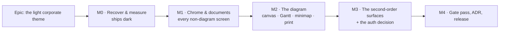

# Implementation Plan: The light corporate theme

- **Feature spec:** [`./feature-spec.md`](./feature-spec.md) — **not yet approved**
- **Status:** Draft — awaiting approval
- **Owner:** _tbc_

> **Filenames.** The request said `plan.md`; `docs/PROCESS.md` §Artifacts and
> `docs/templates/implementation-plan.md` say `implementation-plan.md`, and every other feature
> directory uses it. Process names used.

---

## Breakdown

### Epic

**The light corporate theme** — replace ADR-0099's dark Graphite values with a derived light
corporate palette across all six surface scopes and the diagram, keeping ADR-0097's single-theme
architecture untouched. Maps to the design-system roadmap theme (ADR-0097 → ADR-0099 → here) and
closes `docs/specs/graphite/design.md` §5, which is explicitly open.

**Standing rules for every milestone in this epic** (each is a rule the register records being
broken at least once):

1. **No structural change.** `THEME_SELECTORS` stays one entry, `REBOUND_NAMES` stays 31, the five
   `[data-surface]` rebind blocks are not edited, the seam allowlist is not widened, no token name
   is added. **Red in `token-architecture.test.ts` or `surface-seams.structural.test.ts` is a
   stop-and-reconsider, not a fix.**
2. **A gate lands with its values, never after** (ADR-0097 §9; the `--canvas-grid-month` case, which
   shipped at 2.08:1 behind a green suite because its pair was added later).
3. **No floor is lowered to make a value pass.** CLAUDE.md §19.7. A value that cannot clear a floor
   is the wrong value.
4. **Every milestone re-derives its own numbers rather than carrying the previous one's** — including
   this plan's. Six of this spec's inherited claims were already wrong (spec §0.1).
5. **Run the pre-push gate, including the e2e half** (`pnpm lint && pnpm typecheck && pnpm test`,
   plus `scripts/e2e-local.sh web:<suite>` for touched journeys, plus the **base** `web` journey —
   `docs/TESTING.md`'s rule after ADR-0096: change a screen, run the base journey). Nothing here
   touches `apps/api`, so `e2e-local.sh api` is not required.
6. **Kill stray servers before any harness run.** `reuseExistingServer` is true outside CI; ADR-0099
   records three consecutive false diagnoses from an adopted server. `scripts/e2e-local.sh` refuses
   while 3000/5173 answer — use it.

---

## Milestone M0 — Recover and measure (ships dark)

**Outcome:** nothing a user can see. **Ships dark, deliberately** (ADR-0081 §1): M0 produces the
evidence every later milestone is derived from, plus the BEFORE photographs the epic is judged
against. Surfaced by **M1**.

**Journey:** none owed — no user-facing capability. The journey obligation attaches to M1, which is
the first user-facing milestone, and M0-T2 is what makes M1's evidence comparable.

**Why it exists at all:** four of the five inputs this epic would otherwise inherit are wrong or
unverified (spec §0.1, §0.3). M0 is cheap; deriving 182 values from a stale premise is not.

---

#### Feature: The recovered derivation

> **Description:** turn the deleted `.corporate` block from a rumour into a read, classified,
> re-runnable derivation.
> **Complexity:** M
> **Dependencies:** none
> **Risks:** the block is less recoverable or less complete than reported → the epic falls back to
> deriving from first principles, which is M1's cost roughly doubled. **Named now so it is a known
> number rather than a surprise.**
> **Testing requirements:** none (a document), but its output is the input to M1's gates.

##### Task M0-T1 — Recover, read and classify the deleted block

- **Description:** `git show 44f1c59^:apps/web/src/styles/globals.css | sed -n '508,1020p'`. Read it
  **including its comments** — the reasoning is the recoverable asset, and it was derived on a light
  ground, which is why it survives the flip. Classify all 271 of today's `:root` declarations against
  it.
- **Complexity:** M
- **Dependencies:** —
- **Risks:** the line range or the SHA is wrong → verify by content (the block should open a
  `.corporate {` selector), not by trusting the range.
- **Testing:** none.
- **Development steps:**
  1. Recover the block; save it verbatim to `docs/specs/light-corporate-theme/m0-recovered.md`.
  2. **Re-derive the coordinator's three figures** (117 unique names, 271, strict-subset) rather than
     quoting them — spec §0.3 records that I could not, and rule 4 applies to this plan too.
  3. Produce the classification table: for each of the 271, one of `recovered` / `page-rename` /
     `new-closure-member` / `plot` / `pack` / `non-colour` / `theme-invariant-untouched`.
  4. **Re-derive the composition arithmetic in spec §3.1** (271 = 186 + 19 + 31 + 35; 182 literals)
     against the file, and correct the spec in place if either is wrong.
  5. Record explicitly which of the 117 recovered values **cannot** simply transfer, and why —
     minimum expected: everything the closure expansion added, everything `--plot-*`, and the
     minimap frame pair (which did not exist).

##### Task M0-T2 — Photograph the BEFORE state, and widen the shot list first

- **Description:** the epic's primary instrument. Widen `scripts/shoot.mjs` per spec §4.6, then shoot
  the current dark theme at all three widths. **The widening happens before the shoot**, so BEFORE
  and AFTER sets are comparable.
- **Complexity:** M
- **Dependencies:** —
- **Risks:** a new shot is flaky and the harness stops being trusted → each new shot lands with the
  same `waitFor` discipline as the existing twelve; a shot that cannot be made deterministic is
  **dropped and recorded**, not left flaky.
- **Testing:** the harness is the test. It runs green at three widths or the task is not done.
- **Development steps:**
  1. Add shots: **Gantt** (`?view=gantt`, with the dependency-arrow toggle on **and** off — it ships
     default-off, ADR-0095), **minimap** (`View ▾ ▸ Panels ▸ Minimap`), **`/staff`**, **`/share`**
     guest view, the four remaining public screens (`forgot-password`, `reset-password`,
     `verify-email`, `accept-invitation`), **audit log**, **project detail**, and at least one
     **loading** and one **error** state.
  2. Add a **print artefact** capture — a rendered export PNG and the print document. This is the
     only route to confirming or refuting spec §0.2, and it is the shot whose absence produced the
     defect.
  3. Run the full sweep at 1646 / 1920 / 1280; commit nothing (`.screenshots/` is git-ignored) but
     attach the set to the milestone document.
  4. **Confirm or refute §0.2** from the print artefact, in writing. If confirmed, raise it as a
     `docs/TECH_DEBT.md` row **immediately** — it is a defect on `main` today, independent of this
     epic, and it must not be laundered into "the theme fixed it".
  5. Record the harness's own limits in `m0-measurement.md`: it mints a tenant per run, so a byte
     comparison of two runs reports "everything changed" (ADR-0099 M2's finding) — comparison is by
     eye and by pixel-diff of stable regions, not by hash.

##### Task M0-T3 — Enumerate the diagram's semantics and their grounds

- **Description:** turn spec §3.3's ~54-distinction table into a working sheet: for each, the token,
  the ground(s) it must hold on, the current ratio, the applicable floor, and whether it is asserted,
  reported-and-exempt, or ungated.
- **Complexity:** M
- **Dependencies:** —
- **Risks:** the enumeration misses a distinction and it is discovered at M2 as a wrong-looking
  picture → derive it from `palette.ts`'s token reads **mechanically** (its docblock claims 86;
  count them) plus the three components that read `--color-*` directly, rather than from the table
  in the spec.
- **Testing:** none, but it is the checklist M2's acceptance runs against.
- **Development steps:**
  1. Enumerate every `token(` call across the six resolvers; reconcile against the claimed 86 and
     correct the docblock if it is wrong.
  2. Add the three direct readers: `TsldMinimap.tsx`, `TsldLegend.tsx`, `GanttPanel.tsx`.
  3. For each entry, name the ground(s) and the current ratio.
  4. Flag the **over-loaded** tokens explicitly (`critical` = `today`; `nearCritical` = `conflict` =
     `laneOverlap`) — these are where a light re-derivation is most likely to want a new name, and
     the standing rule says values only.
  5. Flag the **lightness inversions**: every bar fill must go from lighter-than-ground to
     darker-than-ground, and `handleHalo` is deliberately the inverse of `outline`, so that pairing
     flips as a unit.

##### Task M0-T4 — Answer the ceiling question and close #157

- **Description:** land spec §4.3's conclusion. **No gate is built.** The deliverable is the
  arithmetic, the withdrawal of both candidate instruments, and the `TECH_DEBT` edit.
- **Complexity:** S
- **Dependencies:** —
- **Risks:** a later reviewer reads "no ceiling" as an oversight and adds one → the reasoning goes in
  the ADR (D5) and in `TECH_DEBT` #157's closing note, in the form "here is why, and here is when it
  comes back", which is the pattern the day-tier and hatch exemptions already use in
  `token-contrast.test.ts`.
- **Testing:** none. The `TEXT_PAIRS` de-duplication (spec §3.2) rides along here as a no-behaviour
  tidy-up while the file is open.
- **Development steps:**
  1. Re-compute the four figures with `@/test/colour` and record the command.
  2. Write `m0-ceiling.md`: the window arithmetic (12.64 → 14.61), the halation asymmetry, the
     day-one failure of the ground-luminance band against `--card` at L = 1.000.
  3. Close `docs/TECH_DEBT.md` #157 as **answered**, moving its "if a dark theme ever returns"
     sentence into the ADR draft.
  4. Remove the four duplicate `TEXT_PAIRS` entries; confirm the suite's assertion count drops by
     exactly 24 (4 duplicates × 6 scopes) and nothing else moves.

**M0 exit condition:** the classification, the BEFORE photographs, the semantics sheet and the
ceiling answer exist, and **CQ-1 / CQ-2 / CQ-3 have been put to the product owner** with M0's
evidence attached. M1 does not start on defaults if an answer is available.

---

## Milestone M1 — Chrome and documents (the light corporate application)

**Outcome:** every non-diagram screen is light corporate — the organisation overview, all six list
screens, forms, dialogs, the rail, the command strip, the status bar, the staff console, the recycle
bin.
**Entry point:** **every authenticated screen**; the reviewable one is the organisation overview at
`/orgs/:slug`, which is where every sign-in lands (ADR-0098).
**Journey:** the **base** `pnpm --filter @repo/web test:e2e` journey plus `e2e-designed-chrome` and
`e2e-overview` (the latter is the only suite running `wcag22aa`). No new suite is created — this
milestone changes no markup, so the existing journeys already drive the surfaces; what they gain is
`axe`'s `color-contrast` running against new values, which is the point.

> **M1 is a MEASUREMENT milestone and it should be planned as one.** Its method is: apply the
> recovered derivation, run the matrix, and **let it tell us what broke**. A failure here is the
> expected outcome for some fraction of the 93 chrome/panel/page values, not a defect — it means a
> value derived against the pre-closure scope set does not hold under today's 31-name closure. The
> milestone is done when every failure has been re-derived (never when a floor has moved), and its
> deliverable includes **the list of what broke and why**, because that list is the evidence that the
> recovered block was a derivation and not a patch.

> **Release note:** M1 and M2 are **two commits in one release**. `main` is releasable at M1, but no
> release is cut between M1 and M2 — the product owner's host auto-pulls every release (ADR-0047,
> Watchtower enabled), so shipping a light application around a black diagram is not a hypothetical
> intermediate state, it is a thing they would open.

---

#### Feature: The page, card and popover values

> **Description:** `--page-*` (31 literals) plus the two resets, re-valued light.
> **Complexity:** L
> **Dependencies:** M0-T1
> **Risks:** the closure's 13 status members have no recovered ancestor (they post-date the block) →
> derive them by the same method the file already documents: the least-light fill clearing the floor
> against the surface, with a label that clears 4.5:1 on it. The method is written down at
> `globals.css:201-208`; reuse it rather than inventing one.
> **Testing requirements:** `token-contrast.test.ts` green across all six scopes; `axe` green in
> every journey that runs it; screenshots at three widths.

##### Task M1-T1 — The page family

- **Description:** 31 `--page-*` literals + `--card`/`--card-foreground`/`--popover`/
  `--popover-foreground`. Delete the `--page-foreground` stopgap comment (`globals.css:465-473`) and
  derive the value properly rather than inheriting 0.82.
- **Complexity:** L · **Dependencies:** M0-T1 · **Risks:** an alpha-modified hover is invisible to
  the matrix and inverts direction on a light ground → run the alpha census the file records
  (`globals.css:138-145`) over every `bg-*/NN` in `src/`, and rely on `axe` for the rendered check.
- **Testing:** matrix, base journey, `e2e-overview`, `e2e-designed-chrome`.
- **Development steps:**
  1. Apply the recovered page values (the block's bare `--background`/`--foreground`/`--muted`/…).
  2. Derive the 13 closure members by the documented method.
  3. Run the matrix; record every failure with its ratio; re-derive, never re-floor.
  4. Delete both stopgap comments' _page_ half; carry their reasoning into `m1-derivation.md`.
  5. Re-run the alpha census; fix any hover token that inverted.

##### Task M1-T2 — The chrome and panel families

- **Description:** 62 literals. **Shape depends on CQ-1.**
- **Complexity:** L (CQ-1 = a) / XL (CQ-1 = b) · **Dependencies:** M1-T1, CQ-1 answered
- **Risks:** under CQ-1 = (b) the rail and the page converge and the navigator stops reading as a
  distinct surface — the 1.00:1 trap one surface along (spec C8) → assert the adjacent-surface
  figures `token-contrast.test.ts:391-412` already _reports_ and put a number in the milestone
  document, even though they stay unasserted by design.
- **Testing:** as above, plus `e2e-designed-chrome`'s axe scan of the chrome band.
- **Development steps:**
  1. Apply or derive per CQ-1.
  2. Confirm `--chrome-ring`'s amber still clears 3:1 on whatever the chrome becomes — under (b) it
     almost certainly does not, and the ring goes navy (which is what `globals.css:125-131` already
     says about amber on light surfaces: 1.92:1, fails as text and as a focus indicator).
  3. Re-run the matrix and both journeys.

##### Task M1-T3 — Repair the file's prose

- **Description:** `globals.css`'s header (`:80-117`) and six orphaned comments (`:119, 125-131,
136-148`) describe the light corporate theme the file stopped implementing (spec C5). Under this
  epic most of it becomes **true again** — but it must be re-written from the shipped values, not
  reinstated on the assumption that it matches.
- **Complexity:** S · **Dependencies:** M1-T1, M1-T2
- **Risks:** re-writing prose to match values is exactly how C5/C6/C8 happened in the other
  direction → every ratio quoted in a comment must be one the matrix computes, and the milestone
  document says which assertion covers it.
- **Testing:** none directly; the seam and architecture suites confirm nothing structural moved.
- **Development steps:** rewrite the header; delete the orphans or re-attach them to the declarations
  they describe; correct the **1.02:1 → 1.00:1** claim in both places (or to whatever CQ-2 makes it).

##### Task M1-T4 — Photograph and review

- **Description:** the AFTER sweep for M1's screens, side by side with M0-T2's BEFORE.
- **Complexity:** S · **Dependencies:** M1-T1..T3
- **Risks:** **the product owner rejects a screen.** This is an expected edge in the flow, not a
  failure — sized into the plan (ADR-0091, ADR-0092: both shipped on correct numbers and were called
  awful).
- **Testing:** the sweep is the test.
- **Development steps:** run at three widths; assemble the comparison; **stop for review**; re-derive
  on rejection.

**M1 exit condition:** matrix green, journeys green, `m1-derivation.md` lists what broke and how each
was re-derived, and the product owner has seen the screens.

---

## Milestone M2 — The diagram

**Outcome:** the TSLD canvas, the WBS band, the resource strip, the lenses, the minimap, the Gantt
and the print/export path are light and derived.
**Entry point:** the **plan workspace** — `/orgs/:slug/plans/:planId`, in both pen states, plus
`View ▾ ▸ Panels ▸ Minimap` and the `Diagram | Gantt` mode switch.
**Journey:** the **flag-on journeys that already drive these surfaces** — `e2e-gantt`,
`e2e-workspace-chrome`, and the minimap's suite — re-run against new values, plus the new
print-artefact capture from M0-T2. **No new suite**: this milestone adds no capability, and
ADR-0081's rule is about a capability with no entry point, which does not apply to a re-valuing.

> This is where the genuinely new design work is. The recovered block predates ADR-0099's canvas
> entirely, and on a light ground **the lightness ordering inverts**: every bar fill must become
> darker than its ground, where today all three are lighter.

---

#### Feature: The plot family and pack

> **Description:** `--plot-*` (8 literals today, expected to grow as page-aliases become real
> values) plus the 8-member plot pack.
> **Complexity:** XL
> **Dependencies:** M1, M0-T3, CQ-2 answered
> **Risks:** (1) the criticality triple cannot clear 1.5:1 on a light ground under the white-inside-
> label constraint → the lever is the label ink (`globals.css:573-577` records the 1.70:1 ceiling as
> conditional on _"a white inside-label at 4.5:1"_), and changing it is a design decision to be made
> deliberately at M2, not a value nudge. (2) The over-loaded tokens force a name → that is an
> ADR-level finding; escalate, do not add a token quietly.
> **Testing requirements:** `CRITICALITY_PAIRS` ≥ 1.5:1; every bar ≥ 3:1 on the ground;
> `PLOT_GROUNDS` month + year ≥ 3:1 on ground **and** band; `MINIMAP_GROUNDS` all three; day tier and
> hatch reported; `paint.*.test.ts` counting-stub budgets unchanged.

##### Task M2-T1 — The ground, band, wash, hatch and gridline tiers

- **Description:** CQ-2's answer applied. The hatch's stopgap (`globals.css:423-433`) is deleted and
  re-derived — its 0.177 → 0.300 lightness step across two days in seven is the striping the product
  owner reported, and on a light ground the same texture reads differently and must be re-tuned by
  eye against a photograph, not by ratio alone (its contrast is deliberately unasserted).
- **Complexity:** L · **Dependencies:** CQ-2
- **Risks:** a light hatch that clears its (unasserted) contrast can still shout → the acceptance is
  a screenshot at 1646 with a plan containing weekends, i.e. M0-T2's programme fixture.
- **Testing:** grid tiers asserted; hatch and day tier reported; screenshot.

##### Task M2-T2 — The criticality triple and the bar inks

- **Description:** `--plot-primary` / `--plot-warning` / `--plot-destructive` and their three
  `*-foreground` label inks, re-derived downward in lightness.
- **Complexity:** L · **Dependencies:** M2-T1
- **Risks:** separation collapses to hue → **forbidden**: `graphite/design.md:108-110` records the
  previous hue-only separation at **1.23:1** and _"invisible to a colour-deficient reader"_. The
  separation is on **lightness**. The shape cue (solid/dashed outline) is unchanged and keeps 1.4.1
  satisfied regardless.
- **Testing:** `CRITICALITY_PAIRS`; each fill ≥ 3:1 on the ground; each label ≥ 4.5:1 on its fill.
- **Development steps:** derive; **check sRGB gamut before asserting a ratio** — `globals.css:566-572`
  records a proposed value being out of gamut so the asserted ratio was one the screen never
  produced; record the achieved figures and the ceiling actually available under the chosen label
  strategy.

##### Task M2-T3 — Selection, hover, handle halo, edges, Today, data date, conflict, lane overlap

- **Description:** the remaining ~15 painter distinctions from M0-T3's sheet.
- **Complexity:** M · **Dependencies:** M2-T2
- **Risks:** `handleHalo` is the deliberate inverse of `outline` (`palette.ts:77-86`) — that pairing
  is what lets one handle read on every fill, and flipping one without the other breaks it silently.
- **Testing:** M0-T3's sheet, worked through; screenshots with a selection, a hover and a drag ghost.

##### Task M2-T4 — The minimap frame pair

- **Description:** `--canvas-minimap-frame` (white) + `-halo` (dark) invert. The pair exists
  _because measurement said no single value works_ (`globals.css:335-342`): the edge must clear 3:1
  on the ground **and** both bar fills, and the best any single value achieved was 2.62:1.
- **Complexity:** M · **Dependencies:** M2-T2 (the bar fills are two of its three grounds)
- **Risks:** the M4 review of ADR-0100 found this pair declared at `:root` and **never aliased in
  `@theme inline`**, so it painted no colour in a real browser while the token gate stayed green →
  the reachability assertion at `token-contrast.test.ts:299-313` exists for that and must stay green.
- **Testing:** `MINIMAP_GROUNDS`; the reachability assertion; a minimap screenshot.

##### Task M2-T5 — The Gantt, the lenses, the chart ramp

- **Description:** `GanttPanel.tsx:972` wraps the **whole panel** in `<Surface tone="canvas">`, so the
  Gantt inherits the plot values — confirm rather than assume, then check its chart ground, ruler,
  rows, arrows and constraint badge against `--background` **and** `--accent`. Re-derive the float
  lens ramp and `--chart-*` (**count per CQ-3**).
- **Complexity:** L · **Dependencies:** M2-T2
- **Risks:** `palette.ts:236-240` carries a ratio table quoted "light / dark" for two themes that no
  longer exist, and `lenses.test.ts:303` iterates "per theme" → both are stale and must be
  re-derived, not adjusted.
- **Testing:** `e2e-gantt`; the two Gantt pairs already in `NON_TEXT_PAIRS`; lens ratio assertions.

##### Task M2-T6 — The print and export path

- **Description:** spec §4.4. Fix or confirm §0.2; add the directional paper assertion; correct
  `PrintSurface.css`'s pinned hexes, its `'Inter'` (C7) and its three-theme prose; re-derive
  `resolvePrintPalette`'s fallbacks.
- **Complexity:** M · **Dependencies:** M2-T2..T5
- **Risks:** this is the path nobody looks at — that is how the defect survived → **the acceptance is
  a rendered artefact, looked at**, not a passing unit test.
- **Testing:** the paper assertion; `palette.test.ts`'s fallback assertions updated; a rendered print
  and PNG in the milestone document.

##### Task M2-T7 — The painter's jsdom fallbacks

- **Description:** `resolveTsldPalette`, `resolveResourceStripPalette`, `resolveLensPalette`,
  `resolveWbsBandPalette` fallbacks → light; `palette.test.ts` assertions updated (`:56, 81, 112, 128,
185`, including a local literally named `dark`).
- **Complexity:** S · **Dependencies:** M2-T2..T5
- **Risks:** these are outside the colour-literal lint rule and outside the matrix — **nothing gates
  them**, which is why they are a named task rather than a detail.
- **Testing:** `palette.test.ts` green with re-derived expectations.

##### Task M2-T8 — Photograph and review

- **Complexity:** S · **Dependencies:** M2-T1..T7 · Same shape as M1-T4, over the diagram shots,
  both pen states, both view modes, minimap on, and the print artefact. **Stop for review.**

**M2 exit condition:** matrix and journeys green, the semantics sheet fully worked, the print
artefact looked at, and the product owner has seen the diagram.

---

## Milestone M3 — Second-order surfaces and the `auth` decision

**Outcome:** the remaining surfaces are correct and the two open scope questions are closed
deliberately.
**Entry point:** `/sign-in` and the five other public routes; `/share`; `/staff`.
**Journey:** `e2e-public`, `e2e-account`, `e2e-csp` (unchanged — no CSP impact, but it runs the
production build and is the cheapest confirmation that nothing about asset loading moved).

##### Task M3-T1 — The `auth` scope decision

- **Description:** spec §4.5, executed. Run the earns-its-keep gate; take the branch it indicates.
- **Complexity:** S (keep) / M (retire) · **Dependencies:** M1
- **Risks:** the temptation to weaken the gate to keep the scope → **forbidden**. Both branches are
  decisions; neither is a floor move.
- **Testing:** `token-architecture.test.ts:662-711`; `e2e-public`; sign-in screenshots.
- **Development steps:** run the gate; record the 8 sampled deltas as numbers; keep or retire per
  spec §4.5; if retiring, delete the gate **with** the scope (ADR-0084's rule) and remove `auth` from
  `SurfaceTone`, the rebind block, the seam regex, `FAMILIES` and `SCOPES`.

##### Task M3-T2 — `brand`, `--ground`/`--ground-end` and the public screens

- **Description:** confirm — by screenshot, at three widths — that the untouched front door still
  reads as one product with the new application. **Default is that nothing changes here**; a change
  is a decision, recorded.
- **Complexity:** S · **Dependencies:** M3-T1

##### Task M3-T3 — `/share`, `/staff`, and the remaining screens

- **Description:** the surfaces M0-T2 added to the shot list. Anything that looks wrong is a finding
  against M1's values, not a new derivation.
- **Complexity:** S · **Dependencies:** M1, M2

---

## Milestone M4 — The gate pass, the ADR, the release

**Outcome:** the epic is reviewable, recorded and released.
**Entry point:** none new. **Ships dark in the ADR-0081 sense** — it surfaces nothing; it is the
quality bar the register's last seven epics each recorded as earning its place.

##### Task M4-T1 — Six specialist gates over the combined diff

- **Description:** `accessibility-reviewer`, `ux-reviewer`, `component-reviewer`,
  `performance-reviewer`, `security-reviewer`, `devops-reviewer`. Security and devops are expected to
  pass with nothing blocking (no authN/Z, no secret, no container change) and are run anyway —
  ADR-0099 M10 records both re-deriving an epic's own numbers from the final code, which is the value.
- **Complexity:** L · **Dependencies:** M1–M3
- **Risks:** the register's own record says to expect **blocking findings**: ADR-0099 M10 found six
  in code that had passed a human read, ADR-0067 M4 found ten, ADR-0064 §7 found five. Budget for
  them; do not treat a clean pass as the expected outcome.
- **Testing:** every fix carries a regression test **verified red first**.

##### Task M4-T2 — Re-derive the epic's own claims

- **Description:** rule 4 applied to this epic's finished state. Re-measure the counts, the achieved
  ratios and the draw budget from the shipped code — not from these documents.
- **Complexity:** M · **Dependencies:** M4-T1
- **Development steps:**
  1. Re-run the §3.1 composition against the shipped `globals.css`.
  2. Report the draw cost against `docs/TECH_DEBT.md` #75 **with a number**, so "the theme did not
     cost anything" is a measurement rather than an omission (ADR-0099 M10's precedent).
  3. Correct any claim in this spec or plan that the shipped code disproves, **in place**.

##### Task M4-T3 — The ADR, the docs, the changeset

- **Description:** file the ADR per spec §4.7 (**choose the number from `docs/adr/` at filing time**
  — ADR-0071 went unfiled for a whole epic; ADR-0079 was filed under a number its plan did not name).
- **Complexity:** M · **Dependencies:** M4-T2
- **Development steps:**
  1. File the ADR; add it to `docs/adr/README.md` **and** `CLAUDE.md` §16 in the same commit
     (ADR-0078 found the README missing seven ADRs).
  2. Update `CLAUDE.md` §12's theme sentence and `docs/DESIGN_SYSTEM.md`.
  3. Close `docs/TECH_DEBT.md` #157; mark `docs/specs/graphite/design.md` §5 answered with a pointer;
     record §5a's inheritance per CQ-3.
  4. `pnpm changeset` — **minor** for `@repo/web` (user-visible, pre-1.0; no API contract change, so
     `@repo/api` does not bump).
  5. Add a `docs/DECISIONS.md` line for the ceiling withdrawal, since it is a decision _not_ to build
     a gate and those are the ones that get re-proposed.

---

## Sequencing & slices

| Slice | Releasable?             | Released?            | Rollback           |
| ----- | ----------------------- | -------------------- | ------------------ |
| M0    | yes (no product change) | yes                  | n/a                |
| M1    | yes                     | **no — held for M2** | revert one commit  |
| M2    | yes                     | **yes, with M1**     | revert two commits |
| M3    | yes                     | yes                  | revert per task    |
| M4    | yes                     | yes (the release)    | —                  |

**No feature flag.** ADR-0088 D1: a `VITE_` constant is inlined at build time, `apps/web/Dockerfile`
declares one `VITE_` build arg, `docker-publish.yml` passes none and `.dockerignore` strips
`**/.env` — no published image has ever been able to turn one off. The rollback is a commit
boundary, which is the ADR-0097 / ADR-0098 / ADR-0099 precedent for exactly this kind of work.

**The one non-obvious sequencing constraint** is the M1/M2 release hold, and it is not
conservatism: the product owner's host runs the ADR-0047 Watchtower profile, so every release
reaches them. A light application around a black diagram is a state they would see.

---

## Definition of Done (per task)

Each task's PR satisfies the Feature Completion Criteria in [`docs/PROCESS.md`](../../PROCESS.md).
Three of them bind unusually tightly here:

- **"Tests" means the pre-push gate was run**, including `scripts/e2e-local.sh web:<suite>` for every
  touched journey **and the base `web` journey**. A theme change is a screen change.
- **"Accessibility considered"** is not satisfied by the token matrix. `axe`'s `color-contrast` in a
  real browser is the only instrument that sees composited alpha, and the matrix is the only one that
  sees hover states. Both, every milestone.
- **"Documentation updated"** includes the comments inside `globals.css`. This epic exists partly
  because three of them (C5, C6, C8) described a theme the file had stopped implementing.

---

## Risks & assumptions (rollup)

| Risk / assumption                                                                     | Likelihood   | Impact   | Mitigation                                                                                                                                                                                                                                                          |
| ------------------------------------------------------------------------------------- | ------------ | -------- | ------------------------------------------------------------------------------------------------------------------------------------------------------------------------------------------------------------------------------------------------------------------- |
| The product owner rejects a milestone's look                                          | **high**     | med      | It is a normal edge in the flow (§User flow). M1 and M2 each end in a review gate with photographs, before the next begins. ADR-0091 and ADR-0092 both shipped on correct numbers and were called awful.                                                            |
| The recovered block is less usable than reported                                      | med          | high     | M0-T1 is a read, not an assumption. Fallback is first-principles derivation, which roughly doubles M1.                                                                                                                                                              |
| The criticality triple cannot clear 1.5:1 on a light ground under white inside-labels | **med**      | high     | The ceiling is documented as conditional on that label constraint (`globals.css:573-577`). The lever is the label strategy, decided at M2-T2 as a design decision. The shape cue keeps 1.4.1 satisfied regardless, so this is a quality risk, not a compliance one. |
| An alpha-modified hover inverts direction and no token gate sees it                   | **med**      | med      | The alpha census (M1-T1 step 5) plus `axe` in the journeys. The file records a live 3.8:1 and a live 4.32:1 both found this way.                                                                                                                                    |
| The `auth` scope collapses onto the page                                              | **high**     | low      | Expected; the gate is the instrument and both branches are decisions (§4.5).                                                                                                                                                                                        |
| §0.2's print defect is real                                                           | **med-high** | med      | M0-T2 confirms or refutes it against a rendered artefact, and raises it as its own `TECH_DEBT` row if real, so this epic does not launder a pre-existing defect into a benefit.                                                                                     |
| Someone "fixes" the absence of a contrast ceiling                                     | med          | low      | The reasoning lands in the ADR and in #157's closing note, in the exemption form the day tier and hatch already use.                                                                                                                                                |
| A new token name is needed for an over-loaded diagram semantic                        | low          | med      | Escalate to the ADR. `graphite/design.md:114-116` calls it _"a bigger change that needs its own argument"_.                                                                                                                                                         |
| A gate is weakened to make a value pass                                               | low          | **high** | CLAUDE.md §19.7. Standing rule 3; called out in three task risk lines.                                                                                                                                                                                              |
| The shot list is still incomplete after M0-T2                                         | med          | med      | It was incomplete for its whole existence twice (the workspace, then the editor). M4-T2 re-checks the list against the route table rather than against this plan.                                                                                                   |
| Draw performance regresses                                                            | low          | med      | Nothing here adds a layer or a fill pass; M4-T2 reports a number rather than asserting no cost.                                                                                                                                                                     |
| CPM/recalculation parity                                                              | **n/a**      | **n/a**  | The engine is not imported and no migration runs. There is nothing to hold parity _for_.                                                                                                                                                                            |
