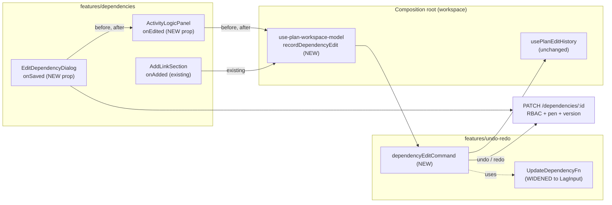
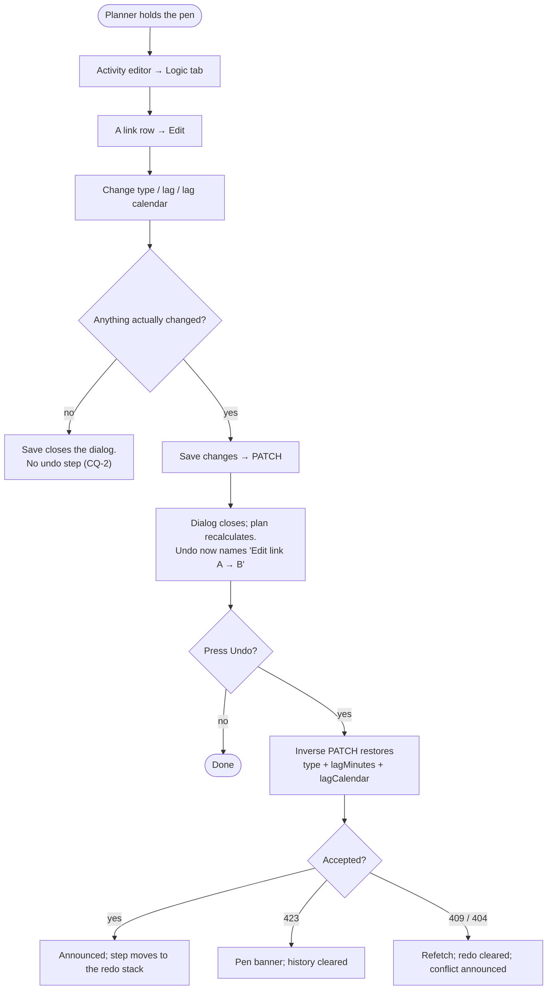

# Feature Spec: Undo for a link edited from the Edit-link dialog

- **Status:** Draft — awaiting approval
- **Author(s):** feature-analyst
- **Date:** 2026-09-01
- **Tracking issue / epic:** `docs/TECH_DEBT.md` #65
- **Roadmap link:** none — this is register work, not a roadmap theme
- **Related ADR(s):** ADR-0048 (client-side command stack), ADR-0052 M3 (lag-anchor drag / nudge),
  ADR-0062 (activity-editor convergence — the epic that filed #65), ADR-0028 (the pen),
  ADR-0036/0068/0070 (lag in minutes), ADR-0105 (why this row needs a spec at all)

---

## 0. Verification of the register row — read this first

`docs/TECH_DEBT.md` #65 was filed during the ADR-0062 convergence epic. Per CLAUDE.md §19.11 and
`docs/RECONCILE.md` (_verify the claim; do not trust the document_), every load-bearing sentence in
it was re-derived from the code before anything below was designed. **The problem statement holds.
Two of the row's four design claims do not.** Each finding names what was read.

### 0.1 The problem is still true (VERIFIED)

`EditDependencyDialog.tsx:120-134` calls `update.mutate(...)` and its `onSuccess` does exactly two
things — `announce('Dependency updated.')` and `onClose()`. The component has **no `onSaved`,
`onEdited` or any other post-write seam** in its prop type (`:37-63`), and its host
`ActivityLogicPanel.tsx:281-289` passes none. Nothing on either side touches the undo history.

Meanwhile the two neighbouring writes on the same panel do record:

| Write                               | Where it is recorded                                                      | Undoable today |
| ----------------------------------- | ------------------------------------------------------------------------- | -------------- |
| Add a link (`AddLinkSection`)       | `onAdded` → `recordDependencyAdd` (`use-plan-workspace-model.ts:979-991`) | **yes**        |
| Remove a link (`ConfirmDialog`)     | `onRemoved` → `recordDependencyRemove` (`:961-973`)                       | **yes**        |
| `Shift+←/→` lag nudge on a row      | `onNudgeLag` → `onTsldLag` → `lagDragCommand` (`:1265-1274`)              | **yes**        |
| **Edit link dialog (type/lag/cal)** | **nothing**                                                               | **no**         |

The row's framing — "`Shift+←/→` on a link is undoable and typing `5` into the same link's lag field
is not, from one panel, one row apart" — is literally true: `ActivityLogicPanel.tsx:226-231` renders
a tip advertising the undoable chord, and `:281` renders the dialog that is not, in the same
component.

**It is sharper than the row says.** The dialog now sits inside the tabbed activity editor
(ADR-0062, `ActivityEditorDialog.tsx:790-794`), and that editor's own General/Scheduling/Cost save
**does** record — `onSaved?: (before, after)` at `ActivityEditorDialog.tsx:186`, fired at `:532`,
wired to `model.recordActivityUpdate` at `activity-crud-dialogs.tsx:199`. So a planner who renames
an activity on the General tab can undo it, and one who changes that activity's link lag on the
Logic tab of the same dialog cannot.

### 0.2 The complete set of surfaces that can write a link's type / lag / lagCalendar (VERIFIED)

`useUpdateDependency` has exactly **two** production call sites in `apps/web/src` (grep over the
whole tree; the remaining 14 matches are test mocks):

1. `EditDependencyDialog.tsx:64` — the Edit-link dialog. **Records nothing.**
2. `use-plan-workspace-model.ts:1245` — `onTsldLag`, shared by the canvas lag-anchor drag **and**
   the Logic panel's `Shift+←/→` nudge (`useCoalescedLagNudge`, composed once at `:1304-1308`
   precisely so the two surfaces cannot drift). **Records `lagDragCommand` (`:1265-1274`).**

Surfaces checked and **excluded**, with the evidence:

- **The Gantt (ADR-0095).** `use-gantt-grid-editing.ts` contains no dependency mutation (its only
  match for `dependenc` is the word "dependency" in a comment about a closure). Its Predecessors
  column is display-only. The Gantt reaches the dialog only indirectly, by opening the activity
  editor on the Logic tab — the same dialog, not a second writer.
- **Cross-plan links (ADR-0045).** `CrossPlanLinksSection` writes `cross_plan_dependencies`, a
  separate table with a separate hook; no `useUpdateCrossPlanDependency` exists at all (grep: no
  matches). Out of scope, and stated as such rather than silently omitted.
- **The plural selection (ADR-0080).** Its bulk operations are activity placements and deletes
  (`bulkPlacementCommand`, `bulkDeleteCommand`); there is no plural link edit.
- **The guest share view (ADR-0051).** Read-only by construction.

### 0.3 The row's `onEdited` seam is the right shape — but the house name is `onSaved`, and the

**pre-edit snapshot is already in hand (PARTLY CORRECTED)**

The row says the seam must carry the pre-edit snapshot "which the mutation's response does not
contain". The first half is true and the second is a non-issue:

- **True:** `useUpdateDependency` is `apiFetch<DependencySummary>(… PATCH …)`
  (`use-dependencies.ts:140-149`) and the API returns the **updated** row
  (`dependencies.service.ts:363-365`). No PATCH response anywhere carries pre-edit values.
- **But the pre-edit row is the `dependency` prop.** `ActivityLogicPanel.tsx:176-178` resolves
  `editing` by id from the live query each render and hands it to the dialog at `:288`. The dialog's
  submit closure (`EditDependencyDialog.tsx:110-135`) therefore already holds the complete pre-edit
  `DependencySummary`. Nothing needs to be threaded down; it needs to be handed **up**.

So the design is not a new mechanism. It is `ActivityEditorDialog`'s existing
`onSaved?: (before, after) => void` (`:186`, fired at `:532`) applied to the sibling panel — the
same `(before, after)` pair, in the same dialog, one tab along. This spec adopts that name and
signature rather than the row's `onEdited`, because two names for one pattern in one editor is how
the two drift.

### 0.4 The row's coalescing key is **not wanted**, and the reason is in the type it would use

**(CORRECTED — this is the substantive change to the row's remedy)**

The row says the command "wants a coalescing key so a lag nudged five times is one undo step rather
than five". Three facts, each read from the code, say otherwise:

1. **A coalescing mechanism already exists** — `CommandCoalescing` and `coalescable()`
   (`commands.ts:44-84`), used by `repositionCommand`, `relaneCommand`, `durationResizeCommand`,
   `visualStartCommand`, `visualResizeCommand` and `lagDragCommand`. So the row is not inventing a
   mechanism, which was the thing to check. **It is also not needed here.**
2. **The `Command` docblock rules the dialog out by name.** `commands.ts:38-39`: _"Discrete edits (a
   dialog save) leave this unset and never coalesce."_ A coalescing key on a dialog save would
   contradict the type's own stated contract.
3. **The dialog cannot produce a burst.** `COALESCE_WINDOW_MS` is **500 ms**
   (`use-plan-edit-history.ts:18`) and the dialog closes on success
   (`EditDependencyDialog.tsx:131`). Reaching five saves means re-opening, re-typing and
   re-submitting five times inside half a second.

**What the row was actually describing already works.** "A lag nudged five times is one undo step"
is true today, twice over: `useCoalescedLagNudge` debounces a held-key burst into **one** PATCH
(`use-coalesced-lag-nudge.ts:44-53`), and `lagDragCommand`'s `lag:{dependencyId}` key
(`commands.ts:732-745`) merges any that do get through. The row appears to have carried the nudge's
requirement onto the dialog.

There is also a positive hazard in adding one: if the new command reused the `lag:{id}` key, a
`Shift+→` nudge followed within 500 ms by a dialog save would **merge**, producing one undo step
whose inverse restores a state from before the nudge — a step the planner never asked for. **The
command ships with no `coalescing` descriptor**, and a test pins that.

### 0.5 The inverse must write `lagMinutes`, and the existing type steers an implementer wrong

**(NEW — not in the row; this is the one finding that could have shipped a data-loss defect)**

`UpdateDependencyFn` (`commands.ts:687-693`) declares `lagDays: number`. `DependencySummary.lagDays`
is documented in `packages/types/src/index.ts:665-670` as _"rounded from the stored minutes. A
sub-day lag reads back as 0 here."_

So a `dependencyEditCommand` written against the existing type would restore the pre-edit lag as
**days**. Undoing an edit to a link that had a 90-minute cure lag would write **zero lag**, silently.

This is verbatim the defect `commands.ts:437-445` records having already shipped and fixed one
command along, for `dependencyLinkOf`: _"It used to be `lagDays` — a rounded read of the same value —
so undoing the removal of a two-hour cure lag restored the link with **no lag at all**, silently and
with no error anywhere."_ The type that caused it in one place is still in place next door.

The fix is available and exact: `UpdateDependencyInput` already accepts a `LagInput` union
(`use-dependencies.ts:85`, `:97-102`), the API stores `lagMinutes` verbatim with no conversion
(`dependencies.service.ts:330`), and `(lagMinutes, lagCalendar)` **is** the stored pair
(`packages/types/src/index.ts:672-676`). Restoring that pair restores stored state exactly, and is
strictly better than days, which the server would re-convert against the patched calendar
(`dependencies.service.ts:332-347`).

### 0.6 The conflict rule and the gates (VERIFIED)

- **Same gates as every other inverse.** `dependencies.service.ts:319-357` — `dependency:update`
  RBAC (`:320`), org scope (`:319`, `:322`), `assertHoldsPen` (**:324**, ADR-0028), optimistic
  version (`:350-358`, `ConflictError`). The inverse is an ordinary PATCH through
  `useUpdateDependency`, so it rides all four unchanged. The client stack cannot escalate.
- **ADR-0048 conflict contract applies unmodified.** `use-plan-undo-redo.ts:88-108`: 423 → clear the
  whole history + run the pen contract; 409/404 → abort non-destructively, refetch server truth,
  **clear redo only**; anything else → announce and leave the stacks intact. Nothing about this
  command needs a new branch.
- **No audit row.** `dependencies.service.ts:313-366` calls no `record()` — a link's type/lag is a
  content edit, permanently excluded by ADR-0073's coverage rule. So neither the forward edit nor its
  inverse writes to `audit_events`.

### 0.7 Two adjacent defects found while verifying — filed, not fixed here

- **`onTsldLag` flattens a sub-day lag on the forward write.** `use-plan-workspace-model.ts:1253-1261`
  compares and sends `lagDays`. A link carrying a 90-minute lag reads `lagDays === 0`, so dragging
  its anchor one day and back writes **0 minutes**, destroying the lag. This is the ADR-0070 M4
  "a canvas move resent the rounded duration" shape, one field along, still live. It is a **forward
  write** defect, not an undo one, and fixing it inside this work would silently change what a
  canvas drag does. **Recommend a new register row.**
- **`ActivityLogicPanel`'s Shift+←/→ tip is unconditional about days.** `:226-231` says "nudges that
  link's lag by one day" whether or not `VITE_SUB_DAY_DURATIONS` is on. Accurate today (the nudge is
  day-granular) — noted only so a future reader does not treat it as a claim about the dialog.

### 0.8 Conclusion

**The row is not stale, its diagnosis is correct, and its remedy needs two corrections**: drop the
coalescing key (§0.4) and carry the lag as **minutes** (§0.5). The work is small and worth doing.

---

## 1. Business understanding

### Problem

Undo is a promise about a surface, not about an operation. On the activity editor's **Logic** tab a
planner can add a link, remove a link and nudge a link's lag with the keyboard — all three
reversible with `Ctrl+Z` — and can change that same link's type, lag or lag calendar through the
**Edit** button in the same table row, which is not. Nothing on screen distinguishes the two, so the
planner learns "links are undoable here" from three controls and is contradicted by the fourth.

The cost is not theoretical. A link's type and lag are the two inputs that move dates hardest: a
`FS`→`SS` change or a 5-day lag on a driving edge re-plans everything downstream, and the only way
back today is to remember the previous values and retype them — from a dialog that has already
closed and re-seeded from the new state.

### Users

| Role               | Relationship to this feature                                                                                                        |
| ------------------ | ----------------------------------------------------------------------------------------------------------------------------------- |
| **Planner**        | The subject. Holds the pen (ADR-0028), edits links, presses Undo.                                                                   |
| **Org Admin**      | Same capability as a Planner here (`dependency:update`, and may override the pen).                                                  |
| **Contributor**    | Not affected — `canManageLogic = canEditSchedule` (`use-plan-workspace-model.ts:458`), so a Contributor never sees the Edit button. |
| **Viewer**         | Not affected — read-only.                                                                                                           |
| **External Guest** | Not affected — the share view is read-only (ADR-0051).                                                                              |

### Primary use cases

1. A planner changes a link's lag from the Edit-link dialog, sees the plan move further than
   expected, and presses `Ctrl+Z` (or the toolbar **Undo**) to put it back exactly as it was.
2. A planner changes a link's **type** (`FS` → `SS`) and undoes it.
3. A planner undoes, decides the change was right after all, and **redoes** it.
4. A planner changes a link's lag calendar from `PROJECT_DEFAULT` to `TWENTY_FOUR_HOUR` and undoes
   it, getting back both the calendar **and** the lag as it was measured on the old one.

### User journeys

Happy path: open the activity editor → **Logic** tab → a link row's **Edit** → change type/lag/lag
calendar → **Save changes** → the dialog closes and the schedule auto-recalculates → the toolbar
**Undo** control now names this step → press it → the link returns to its previous type, lag and lag
calendar, the plan recalculates, and the undo is announced. See the diagrams in §4.

Alternate: another user takes the pen between the edit and the undo → the inverse 423s → the whole
history is cleared and the shared lost-control banner appears (ADR-0048's existing contract, no new
code).

### Expected outcomes

Every way of changing a link on the Logic panel is reversible. The undo stack stops having a hole
whose only signal is that pressing `Ctrl+Z` does something other than what the planner expected.

### Success criteria

- All four link-write paths (add / remove / nudge / dialog edit) record exactly one command each,
  asserted by unit tests.
- A dialog edit followed by Undo restores the pre-edit `type`, `lagMinutes` **and** `lagCalendar`,
  asserted against the request body — not against the rendered field, which cannot show minutes on
  the degraded path.
- A sub-day lag survives the round trip exactly (0.5 §0.5), with the test verified red against a
  `lagDays`-based inverse.
- The flag-on journey (`e2e-undo`) presses the real controls in a real browser against a real API
  with the pen enforced.

### Open questions

Only two are critical enough to change the design. Defaults are stated so nothing is blocked.

> **CQ-1 (CRITICAL) — Should the inverse restore the lag calendar as well as the lag and type?**
> The dialog writes all three in one PATCH, so restoring only two would leave the link in a state it
> was never in. **Recommended default: yes, restore all three as one PATCH.** The only argument
> against is that `lagCalendar` is arguably a different kind of decision from a lag value; the
> argument for is that the forward write is atomic and a partial inverse is not an inverse.

> **CQ-2 (CRITICAL) — Should a save that changes nothing record an undo step?**
> Today the dialog PATCHes unconditionally, so pressing **Save changes** without touching a field
> bumps the row's `version` and moves nothing else. **Recommended default: record nothing when all
> three fields equal the pre-edit row.** An undo step whose inverse changes nothing visible is the
> ADR-0064 "a confirmation that names nothing" shape — the planner presses Undo, the plan does not
> move, and they conclude undo is broken. Explicitly **not** proposed: suppressing the PATCH itself,
> which is a behaviour change outside this row.

Non-critical, defaults taken:

- **Label.** `Edit link “{predecessor}” → “{successor}”`, following `lagDragCommand`'s two-endpoint
  convention (`commands.ts:726-728`) and the S1 entity-naming rule. Not `Change lag`, because this
  command may change type or calendar and nothing else.
- **Seam name.** `onSaved(before, after)` on the dialog, matching `ActivityEditorDialog:186`;
  `onEdited(before, after)` on `ActivityLogicPanel`, matching its existing `onAdded` / `onRemoved`
  past-tense convention. (The panel's props are named for the event; the dialog's for the act.)
- **Snapshot timing.** Captured inside the submit handler, not at dialog open — matching
  `ActivityLogicPanel.confirmRemove`'s `const snapshot = removing` (`:195-197`). The row is re-read
  from the live query every render (`:176-178`), so an open-time capture could pair a stale snapshot
  with a fresh version.
- **Flag.** No new `VITE_` flag. The recording is guarded by the existing `UNDO_REDO_ENABLED`, as
  every other `record*` seam is; ADR-0088 D1 established that a `VITE_` constant is not an operator
  rollback anyway.

## 2. Functional requirements

### User stories & acceptance criteria

> **US-1** — As a **Planner** holding the pen, I want a link edit made from the Edit-link dialog to
> be undoable, so that I can reverse a type or lag change I did not intend.
>
> **Acceptance criteria**
>
> - **Given** a link with `type=FS, lagMinutes=1440, lagCalendar=PROJECT_DEFAULT` **when** I save
>   `type=SS, lag=3d` from the dialog **then** exactly one command is pushed onto the undo stack, and
>   the toolbar **Undo** control names it `Undo Edit link “Excavate” → “Pour slab”`.
> - **Given** that command is top of the stack **when** I press **Undo** **then** a single PATCH is
>   sent carrying `type=FS`, `lagMinutes=1440`, `lagCalendar=PROJECT_DEFAULT` and the **current**
>   version, and "Undid edit link …" is announced.
> - **Given** I have just undone it **when** I press **Redo** **then** the post-edit values are
>   re-applied through the same seam.
>
> **US-2** — As a Planner, I want undoing a link edit to restore a **sub-day** lag exactly, so that a
> two-hour cure lag is not silently rounded to nothing.
>
> **Acceptance criteria**
>
> - **Given** a link with `lagMinutes=120` (`lagDays` reads 0) **when** I change the lag to `2d` and
>   then Undo **then** the link's stored lag is **120 minutes**, not 0.
> - The inverse PATCH body carries `lagMinutes` and **never** `lagDays`.
>
> **US-3** — As a Planner, I want a link edit and a keyboard lag nudge to remain **separate** undo
> steps, so that Undo reverses the thing I just did and not the thing before it.
>
> **Acceptance criteria**
>
> - **Given** I nudge a link's lag with `Shift+→` and, within half a second, save a change from the
>   dialog **then** the undo stack holds **two** steps, and the first Undo restores the nudged state.
> - The command carries no `coalescing` descriptor.
>
> **US-4** — As a Planner whose pen was taken between the edit and the undo, I want the existing
> lost-control contract, so that nothing new has to be learned.
>
> **Acceptance criteria**
>
> - **Given** the inverse is refused 423 **then** the whole history is cleared and the shared pen
>   banner appears — the unchanged `usePlanUndoRedo` path (`:90-97`).
> - **Given** the inverse is refused 409/404 **then** server truth is refetched, only the redo branch
>   is cleared, and the conflict message is announced (`:99-104`).

### Workflows

1. Planner opens the Edit-link dialog from a `DependencyTable` row's **Edit** button
   (`ActivityLogicPanel.tsx:183`).
2. Planner changes any of type / lag / lag calendar and submits.
3. `EditDependencyDialog` captures `before = dependency` at submit time, PATCHes, and on success
   calls `onSaved?.(before, after)` with the server's post-edit row, then announces and closes
   (unchanged order — the seam runs before the close, as `ActivityEditorDialog:532` does).
4. `ActivityLogicPanel` forwards to `onEdited`.
5. The composition root's `model.recordDependencyEdit(before, after)` builds a
   `dependencyEditCommand` and pushes it — a no-op when `UNDO_REDO_ENABLED` is false.
6. The existing ADR-0032 auto-recalculation redraws the plan. **The command never records the
   recalculation** (recompute-don't-restore, ADR-0048).

### Edge cases

| Case                                            | Expected behaviour                                                                                                                                   |
| ----------------------------------------------- | ---------------------------------------------------------------------------------------------------------------------------------------------------- |
| Save with no field changed                      | No command recorded (CQ-2 default). The PATCH still fires — unchanged behaviour.                                                                     |
| Sub-day lag (`lagMinutes` not a whole day)      | Restored exactly, in minutes (§0.5).                                                                                                                 |
| Lag calendar changed in the same save           | Restored as one PATCH together with the lag (CQ-1 default). Minutes are stored verbatim, so no re-conversion occurs (`dependencies.service.ts:330`). |
| The link is removed by another user before Undo | 404 → ADR-0048 non-destructive abort + refetch + clear redo.                                                                                         |
| The link was edited elsewhere before Undo       | 409 → same path. No auto-retry, no merge.                                                                                                            |
| Pen taken before Undo                           | 423 → history cleared, pen banner (no announcement here — the banner is the single utterance, `use-plan-undo-redo.ts:90-97`).                        |
| Undo pressed twice quickly                      | Serialised by `runningRef` (`use-plan-edit-history.ts:135`); the second returns `null`.                                                              |
| Plan switched                                   | History cleared per plan (`:98-100`).                                                                                                                |
| `VITE_UNDO_REDO` off                            | `recordDependencyEdit` returns immediately; the dialog still calls the seam, which is `undefined` at both hosts. Byte-identical behaviour.           |
| Nudge then dialog-save within 500 ms            | Two separate steps (US-3).                                                                                                                           |

### Permissions

No change. Reaching the dialog at all requires `canManageLogic`
(`ActivityLogicPanel.tsx:279`), which is `canEditSchedule` — **role ∧ pen**
(`use-plan-workspace-model.ts:458`). The inverse is an ordinary PATCH and is re-checked server-side:

| Gate                                          | Where                                 | Failure                   |
| --------------------------------------------- | ------------------------------------- | ------------------------- |
| Organisation scope                            | `dependencies.service.ts:319`, `:322` | 404 (no existence oracle) |
| `dependency:update` RBAC (Planner, Org Admin) | `:320`                                | 403                       |
| Single-editor pen (ADR-0028)                  | `:324`                                | 423                       |
| Optimistic version                            | `:350-358`                            | 409                       |

The API remains the sole trust boundary; undo cannot escalate (ADR-0048).

### Validation rules

No new validation. The inverse replays values that the server already accepted once, in the exact
unit it stored them. `lagMinutes` and `lagDays` stay mutually exclusive at the DTO
(`use-dependencies.ts:76-85`) and the inverse sends only `lagMinutes`.

### Error scenarios

| Scenario                    | Detection        | User-facing result                                       | Status |
| --------------------------- | ---------------- | -------------------------------------------------------- | ------ |
| Pen lost before the inverse | `assertHoldsPen` | Lost-control banner; history cleared                     | 423    |
| Link changed elsewhere      | version mismatch | `UNDO_CONFLICT_MESSAGE`; refetch; redo cleared           | 409    |
| Link deleted elsewhere      | row not found    | Same as 409                                              | 404    |
| Role lost mid-session       | RBAC             | Generic `UNDO_FAILED_MESSAGE`; stacks intact (retryable) | 403    |
| Network/500                 | fetch rejects    | Generic `UNDO_FAILED_MESSAGE`; stacks intact             | —      |

All five are existing branches of `usePlanUndoRedo`. **No new error handling is written.**

## 3. Technical analysis

| Area           | Impact         | Notes                                                                                                                                                                                                |
| -------------- | -------------- | ---------------------------------------------------------------------------------------------------------------------------------------------------------------------------------------------------- |
| Frontend       | **low–med**    | One new command builder; one widened exported type; two new optional props; one new model seam; two wiring sites.                                                                                    |
| Backend        | **none**       | No endpoint, DTO, service or controller change. Verified: the inverse uses `PATCH /organizations/:slug/dependencies/:id` exactly as it exists.                                                       |
| Database       | **none**       | No model, column, index, constraint or migration. `database-architect` is therefore **not engaged**, and this is stated so "the agent was not run" cannot read as an oversight (ADR-0121 precedent). |
| API            | **none**       | No contract change; `docs/API.md` and the OpenAPI spec are untouched.                                                                                                                                |
| Security       | **none**       | The inverse rides the unchanged RBAC + org-scope + pen + version gates (§0.6).                                                                                                                       |
| Performance    | **negligible** | One extra `DependencySummary` retained per recorded step, bounded by `MAX_HISTORY_DEPTH = 50`.                                                                                                       |
| Infrastructure | **none**       | No new Playwright config, no new CI step — the journey case joins the existing `e2e-undo` project.                                                                                                   |
| Observability  | **none**       | No audit event (§0.6); no new logs.                                                                                                                                                                  |
| Testing        | **med**        | Unit (commands, dialog, panel, model, wiring identity) + one flag-on journey case.                                                                                                                   |

### CPM engine and the ADR-0034 recalculation parity gate

**The CPM engine is not imported and no migration runs.** This is `apps/web` only, and the inverse
replays a value the forward write already sent through the same endpoint — so `computeSchedule`'s
input is unchanged in kind. The parity gate is untouched by construction.

### Dependencies

Nothing must land first. The work depends only on code already shipped: `usePlanEditHistory`,
`usePlanUndoRedo`, the `LagInput` union, and the `onAdded`/`onRemoved` seam pattern.

## 4. Solution design

### Architecture overview

The design adds **no new mechanism**. It threads one existing pattern (`onSaved(before, after)`)
through one existing chain (composition root → panel → dialog) into one existing store.



### Data flow

```mermaid
sequenceDiagram
  actor Planner
  participant Dlg as EditDependencyDialog
  participant Panel as ActivityLogicPanel
  participant Model as recordDependencyEdit
  participant Hist as usePlanEditHistory
  participant API

  Planner->>Dlg: change type / lag / lag calendar → Save
  Note over Dlg: before = dependency (captured AT SUBMIT,<br/>not at open — the row is re-read each render)
  Dlg->>API: PATCH {type, lagMinutes|lagDays, lagCalendar, version}
  API-->>Dlg: 200 DependencySummary (after)
  alt any of the three fields changed (CQ-2)
    Dlg->>Panel: onSaved(before, after)
    Panel->>Model: onEdited(before, after)
    Model->>Hist: record(dependencyEditCommand{before, after})
  end
  Dlg->>Dlg: announce + close
  Note over Hist: auto-recalc redraws; NOT recorded

  Planner->>Hist: Undo (toolbar / Ctrl+Z)
  Hist->>API: PATCH {type: before.type,<br/>lagMinutes: before.lagMinutes,<br/>lagCalendar: before.lagCalendar,<br/>version: threaded}
  alt 200
    API-->>Hist: new version (re-threaded)
    Hist-->>Planner: "Undid edit link …"
  else 423 pen lost
    Hist-->>Planner: history cleared + pen banner
  else 409 / 404
    Hist-->>Planner: refetch, clear redo, conflict message
  end
```

### User flow



### Database changes

**None.**

### API changes

**None.**

### Component changes

| File                                                        | Change                                                                                                                                                                              | Contract impact                                                                                                                                                  |
| ----------------------------------------------------------- | ----------------------------------------------------------------------------------------------------------------------------------------------------------------------------------- | ---------------------------------------------------------------------------------------------------------------------------------------------------------------- |
| `features/undo-redo/commands.ts`                            | New `dependencyEditCommand({ updateDependency, before, after, version, label? })`. Widen `UpdateDependencyFn`'s lag field to the `LagInput` union.                                  | Widening is source-compatible: `lagDragCommand` already passes `lagDays`, which satisfies the union, and `useUpdateDependency().mutateAsync` already accepts it. |
| `features/undo-redo/index.ts`                               | Export the new builder.                                                                                                                                                             | Additive.                                                                                                                                                        |
| `features/dependencies/components/EditDependencyDialog.tsx` | New optional prop `onSaved?: (before: DependencySummary, after: DependencySummary) => void`. Capture `before` at submit; call it in `onSuccess(after)` before `announce`/`onClose`. | **New optional prop — an ADR-0105 trigger. See §4.6.**                                                                                                           |
| `features/dependencies/components/ActivityLogicPanel.tsx`   | New optional prop `onEdited?: (before, after) => void`, forwarded to the dialog.                                                                                                    | Same trigger.                                                                                                                                                    |
| `components/layout/workspace/use-plan-workspace-model.ts`   | New `recordDependencyEdit` seam beside `recordDependencyAdd`/`recordDependencyRemove`; returned from the model.                                                                     | Additive.                                                                                                                                                        |
| `components/layout/workspace/activity-crud-dialogs.tsx`     | Pass `onEdited: model.recordDependencyEdit` inside the existing `logic` object.                                                                                                     | Wiring.                                                                                                                                                          |
| `components/layout/workspace/plan-dialogs.tsx`              | Pass `onEdited={model.recordDependencyEdit}` to `DependencyEditor` (the convergence-flag-off host).                                                                                 | Wiring.                                                                                                                                                          |
| `features/dependencies/components/DependencyEditor.tsx`     | Forward the new prop unchanged, as it forwards the others.                                                                                                                          | Additive.                                                                                                                                                        |

**Both hosts must be wired in the same change.** `activity-crud-dialogs.tsx` is the live path
(`VITE_ACTIVITY_EDITOR_CONVERGENCE` is default-on) and `plan-dialogs.tsx` is the flag-off path.
Wiring one and not the other is exactly the ADR-0064 §7 / ADR-0080 "one host and not its neighbour"
defect the register records shipping repeatedly — most recently as ADR-0080's `bulk` bar, which was
unreachable in the shipped app while every unit test passed. `plan-dialogs.convergence.test.tsx:128-138`
already pins `onRemoved` and `onNudgeLag` by **identity**; the new seam takes the same pin.

No visual change. No new states — the dialog's loading/error/success rendering is untouched.

### Implementation approach & alternatives

**Chosen:** replicate `ActivityEditorDialog`'s `onSaved(before, after)` seam onto the Edit-link
dialog, record through a new `dependencyEditCommand` that restores `(type, lagMinutes, lagCalendar)`
as one PATCH, with **no coalescing**.

Alternatives considered and rejected:

1. **Coalesce on `lag:{dependencyId}` (the row's sketch).** Rejected on §0.4: contradicted by the
   `Command` docblock, unreachable through a dialog that closes on save, and actively harmful —
   sharing the key would merge a nudge with a subsequent dialog save into a step nobody performed.
2. **Restore with `lagDays` (what the existing `UpdateDependencyFn` type invites).** Rejected on
   §0.5: silently destroys a sub-day lag, which is the defect `commands.ts:437-445` records having
   already shipped once for the sibling command.
3. **Reuse `lagDragCommand` with a wider signature.** Rejected: that builder's docblock, label and
   coalescing key all say "lag drag", and it echoes type and calendar verbatim rather than restoring
   them. Widening it to mean two different gestures is how a builder acquires a second, invisible
   contract.
4. **Record in the panel rather than the dialog.** Rejected: the panel does not know when the PATCH
   succeeded or what the server returned. The dialog owns the mutation (`:64`), so the dialog owns
   the seam — which is also why `AddLinkSection` owns `onAdded`.
5. **A generic "reverse the last dependency PATCH" interceptor at the API-client layer.** Rejected:
   it would record inverses for writes nobody thinks of as user edits, and it cannot know a label.
6. **Extend the API to return the pre-edit row.** Rejected: unnecessary (§0.3 — the client already
   holds it) and it would change a public contract to solve a client-side problem.

### 4.6 ADR-0105 trigger reading (asked for explicitly)

`docs/PROCESS.md:30-33` lists four triggers. My reading, with reasons:

| Trigger                                                          | Crossed? | Reason                                                                                                                                                                                                                                                                                                                                                                                                                                                                                                                                                                                                                                                                                                                         |
| ---------------------------------------------------------------- | -------- | ------------------------------------------------------------------------------------------------------------------------------------------------------------------------------------------------------------------------------------------------------------------------------------------------------------------------------------------------------------------------------------------------------------------------------------------------------------------------------------------------------------------------------------------------------------------------------------------------------------------------------------------------------------------------------------------------------------------------------ |
| **A component's public contract** (a prop's type or optionality) | **YES**  | The rule's parenthetical names "a prop's type or optionality", and adding `onSaved` to `EditDependencyDialog` and `onEdited` to `ActivityLogicPanel` changes both components' prop sets. The narrower reading — that only _existing_ props count — is available, and I reject it: `ActivityLogicPanel` is rendered by two hosts under two different flags, so the question "does every host pass this?" is exactly the review question the trigger exists to force, and it is the question ADR-0080 got wrong. Treating an added optional prop as outside the rule would also make the rule unfalsifiable in the common case, since almost every seam arrives as a new optional prop. **This alone makes the spec mandatory.** |
| **A user-facing entry point**                                    | **No**   | No new control. The **Edit** button, **Save changes**, the toolbar **Undo/Redo** and `Ctrl+Z` all exist. What changes is that an existing control's effect becomes reachable by an existing control. The _capability_ is new, which is why ADR-0081 still applies to the milestone (it names its entry point and lands with a journey) — but no entry point is added.                                                                                                                                                                                                                                                                                                                                                          |
| **A Playwright config or a CI step**                             | **No**   | The journey case joins `apps/web/e2e-undo/undo.spec.ts`, an existing project with an existing `test:e2e:undo` script and CI step. **If** the case is judged to want its own spec file that is still the same config and the same step. Adding a new config would cross the trigger, and is not proposed.                                                                                                                                                                                                                                                                                                                                                                                                                       |
| **A shared gate**                                                | **No**   | No `check:*` script, structural test policy or lint rule changes. New tests are added; existing gates are not modified.                                                                                                                                                                                                                                                                                                                                                                                                                                                                                                                                                                                                        |
| **The schema**                                                   | **No**   | No model, column, index, constraint or migration (§3).                                                                                                                                                                                                                                                                                                                                                                                                                                                                                                                                                                                                                                                                         |

**One trigger crossed, therefore the full spec and plan are required.** This is that spec.

## 5. Links

- Implementation plan: [`./implementation-plan.md`](./implementation-plan.md)
- Register row: [`docs/TECH_DEBT.md`](../../TECH_DEBT.md) #65
- Docs this change updates: `docs/TECH_DEBT.md` (close #65; file the §0.7 forward-write row). No ADR
  is required — this applies ADR-0048's existing model to one more surface and introduces no new
  architectural decision. `CLAUDE.md` needs no edit: it records no claim about link-edit undo.
