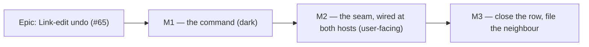

# Implementation Plan: Undo for a link edited from the Edit-link dialog

- **Feature spec:** [`./feature-spec.md`](./feature-spec.md) (Draft — **not yet approved**)
- **Status:** Draft
- **Owner:** unassigned
- **Register row:** `docs/TECH_DEBT.md` #65

> **Scope note.** Three of the spec's §0 findings change what gets built relative to the register
> row: the command carries **no coalescing descriptor** (§0.4), the inverse writes **`lagMinutes`**
> and never `lagDays` (§0.5), and the seam is named **`onSaved`** after the existing
> `ActivityEditorDialog` pattern rather than the row's `onEdited` (§0.3). Read §0 before starting.

## Breakdown

### Epic

**Link-edit undo** — make the fourth way of changing a link on the Logic panel as reversible as the
other three. Register work (`docs/TECH_DEBT.md` #65); maps to no roadmap theme.

---

## Milestone 1 — The command builder (ships dark)

**Outcome:** `dependencyEditCommand` exists, is exported, and provably restores a link's
`(type, lagMinutes, lagCalendar)` — including a sub-day lag. Nothing in the product calls it.

**Entry point:** `Ships dark: no caller, no UI change. M2 surfaces it.` (ADR-0081 §1 — declared
dark rather than left implicit.)

**Journey:** none, correctly — ADR-0081 §2 requires a journey on the first **user-facing**
milestone, which is M2. Recorded here so a reader can see the deferral is the rule and not an
omission.

**Why it is separable:** the builder is pure and has no React in it. Landing it alone keeps `main`
releasable and makes M2 a wiring change with the hard part already tested.

---

#### Feature: `dependencyEditCommand` + a lag-unit-safe `UpdateDependencyFn`

> **Description:** A `Command` whose `undo` restores the pre-edit type/lag/lag-calendar triple and
> whose `redo` re-applies the post-edit triple, both through the existing `useUpdateDependency`
> mutation, with the optimistic `version` threaded from each response.
> **Complexity:** S
> **Dependencies:** none
> **Risks:**
>
> - _An implementer writes the inverse in `lagDays` because that is what the existing type says_ →
>   the widening in Task 1 lands **first**, and Task 2's sub-day test is verified red against a
>   `lagDays` implementation before the fix, so the trap is demonstrated rather than described.
> - _Widening `UpdateDependencyFn` breaks `lagDragCommand`_ → it passes `lagDays`, which satisfies
>   the union; `pnpm typecheck` is the proof and the existing `commands.test.ts` lag suite is the
>   before/after oracle (it must pass **unchanged**).
>
> **Testing requirements:** unit only (`commands.test.ts`). No a11y, no API, no e2e at this
> milestone.

##### Task 1 — Widen `UpdateDependencyFn` to carry either lag unit (≈ one small PR, or folded into Task 2)

- **Description:** Change `UpdateDependencyFn`'s parameter (`commands.ts:687-693`) from a fixed
  `lagDays: number` to the same `{ lagDays } | { lagMinutes }` union `UpdateDependencyInput` already
  uses (`use-dependencies.ts:85`). Add a docblock sentence stating **why** — that `lagDays` is
  rounded from minutes (`packages/types/src/index.ts:665-670`) and that restoring a lag in days
  silently destroys a sub-day one, citing the `dependencyLinkOf` incident at `commands.ts:437-445`.
- **Complexity:** S
- **Dependencies:** none
- **Risks:** the union makes the type harder to read → the docblock carries the reason, which is the
  only thing that stops a future reader "simplifying" it back.
- **Testing:** `pnpm typecheck`; the existing `lagDragCommand (ADR-0052 M3)` describe block
  (`commands.test.ts:338-395`) must pass **with no edits** — that unchanged pass is the assertion
  that the widening is source-compatible.
- **Development steps:**
  1. Widen the type; keep `dependencyId` / `type` / `lagCalendar` / `version` as they are.
  2. Add the docblock reason with its two citations.
  3. Run `pnpm typecheck` and the undo-redo unit suite.

##### Task 2 — `dependencyEditCommand`

- **Description:** New builder taking `{ updateDependency, before: DependencySummary, after:
DependencySummary, version, label? }`. `undo` PATCHes `{ dependencyId, type: before.type,
lagMinutes: before.lagMinutes, lagCalendar: before.lagCalendar, version }`; `redo` does the same
  from `after`. `version` is threaded from each response, seeded from the forward write's
  post-edit version — the `lagDragCommand` shape (`commands.ts:711-731`). Default label
  `Edit link “{before.predecessor.name}” → “{before.successor.name}”`.
  **No `coalescable(...)` wrapper.**
- **Complexity:** S
- **Dependencies:** Task 1
- **Risks:**
  - _Somebody adds coalescing later because every neighbouring builder has it_ → the docblock states
    the three reasons (§0.4) and Task 3's test asserts `command.coalescing` is `undefined`, so the
    addition fails a test rather than passing review.
  - _`before` and `after` diverge in which fields they describe_ → both are whole
    `DependencySummary` rows, the full-snapshot rule `definitionSnapshotCommand` already follows
    (`commands.ts:103-112`).
- **Testing:** see Task 3.
- **Development steps:**
  1. Write the builder beside `lagDragCommand` (they are the two dependency-PATCH commands and
     belong together).
  2. Docblock: what it reverses, why minutes not days, why no coalescing, and that the follow-up
     recalculation is never recorded.
  3. Export from `features/undo-redo/index.ts`.

##### Task 3 — Unit tests for the builder

- **Description:** Cover the round trip, the sub-day case, version threading, and the absence of
  coalescing.
- **Complexity:** S
- **Dependencies:** Task 2
- **Risks:** _a test that passes against the wrong implementation_ → the sub-day case is **verified
  red first** against a `lagDays`-based inverse, and the no-coalescing case is verified red against a
  `lag:{id}`-keyed one. Both red runs are recorded in the PR description.
- **Testing:** in `commands.test.ts`, a new `dependencyEditCommand` describe block:
  1. `undo` sends the pre-edit `type`, `lagMinutes`, `lagCalendar` at the seeded version; `redo`
     sends the post-edit triple.
  2. **Sub-day:** `before.lagMinutes = 120`, `before.lagDays = 0`; after undo the body carries
     `lagMinutes: 120` and **no `lagDays` key at all** (assert on `Object.keys`, not just the value —
     a body carrying both is a 422 by design, `use-dependencies.ts:76-85`).
  3. Version threading: two successive undo/redo cycles each send the version the previous response
     returned, never the original.
  4. `expect(command.coalescing).toBeUndefined()`.
  5. A lag-calendar change and a type change restore in the **same single** PATCH (one call, not
     two) — the CQ-1 default made assertable.
- **Development steps:**
  1. Write test (2) first, against a deliberately `lagDays`-based inverse; confirm red.
  2. Write test (4) against a deliberately coalescable command; confirm red.
  3. Implement/keep the correct builder; confirm green.
  4. Add the remaining cases.

---

## Milestone 2 — The seam, wired at both hosts (the user-facing milestone)

**Outcome:** A planner who changes a link's type, lag or lag calendar from the Edit-link dialog can
undo and redo it.

**Entry point (ADR-0081 §1):** _Activity editor → **Logic** tab → a link row's **Edit** button →
**Save changes**_, then the plan command deck's **Undo** control (accessible name
`Undo Edit link “Excavate” → “Pour slab”`) or `Ctrl+Z`. **No new control is added** — the capability
is that these existing controls now reach this edit.

**Journey (ADR-0081 §2):** a case in `apps/web/e2e-undo/undo.spec.ts` (existing project, existing
`pnpm --filter @repo/web test:e2e:undo` script, existing CI step — **no new Playwright config and no
new CI step**, so the ADR-0105 infrastructure trigger stays uncrossed). It takes the pen, draws two
tasks, links them, opens the Logic tab, edits the link's lag, presses **Undo**, and asserts the
restored value **read back from the API** rather than from the DOM under test — the ADR-0070 M6 rule,
because the degraded whole-days field cannot display minutes.

**Why it must be one slice:** wiring one host and not the other is the defect this register records
shipping four times (ADR-0064 §7, ADR-0080's `bulk` bar, ADR-0062 M6, ADR-0059 M6). Splitting M2 by
host would be scheduling that defect.

---

#### Feature: the `onSaved` → `onEdited` → `recordDependencyEdit` chain

> **Description:** Thread `(before, after)` from the dialog's `onSuccess` up to the workspace model,
> exactly as `onAdded` / `onRemoved` are threaded.
> **Complexity:** S–M
> **Dependencies:** Milestone 1
> **Risks:**
>
> - _The seam is wired at one host only_ → Task 7 pins **both** by identity, mirroring
>   `plan-dialogs.convergence.test.tsx:128-138`; and the journey drives the live (convergence-on)
>   host, which is the only instrument that can see the wiring actually reached.
> - _`before` is captured at dialog open and is stale_ → captured **inside** the submit handler
>   (`ActivityLogicPanel.confirmRemove`'s `const snapshot = removing` precedent, `:195-197`), with a
>   test that changes the row between open and submit.
> - _A no-op save records a step that does nothing_ → CQ-2's guard, with its own test.
>
> **Testing requirements:** unit (dialog, panel, model, both wiring sites) + one flag-on journey
> case + an axe pass over the dialog (unchanged markup, but the milestone touches it).

##### Task 4 — `EditDependencyDialog.onSaved`

- **Description:** Add `onSaved?: (before: DependencySummary, after: DependencySummary) => void`.
  Capture `const before = dependency` at the top of the submit callback; in `onSuccess(after)` call
  `onSaved?.(before, after)` **before** `announce` and `onClose` (the `ActivityEditorDialog:531-538`
  order). Apply CQ-2: call it only when `type`, the effective lag, or `lagCalendar` differs from
  `before`.
- **Complexity:** S
- **Dependencies:** Task 2
- **Risks:** _the CQ-2 comparison is written against the form text rather than the stored value_ →
  compare `after` against `before` field-by-field, using the server's post-edit row; the form's text
  is unit-ambiguous on the degraded path.
- **Testing:** in `EditDependencyDialog.test.tsx` — (a) a changed save calls `onSaved` once with the
  pre-edit row and the server's row; (b) an unchanged save does **not** call it; (c) a failed PATCH
  does not call it; (d) the existing "seeds type/lag and PATCHes with the row version" test passes
  **unchanged** (the before/after oracle).
- **Development steps:**
  1. Add the prop + docblock naming the `onAdded`/`onRemoved` precedent and why the snapshot is taken
     at submit.
  2. Capture, compare, call.
  3. Tests, including a case where the row is replaced between open and submit.

##### Task 5 — `ActivityLogicPanel.onEdited` and `DependencyEditor` forwarding

- **Description:** Add `onEdited?: (before, after) => void` to `ActivityLogicPanel`, forwarded to the
  dialog's `onSaved` at `:281-289`. Forward it unchanged through `DependencyEditor` (which forwards
  every other panel prop).
- **Complexity:** S
- **Dependencies:** Task 4
- **Risks:** _the prop is added to the panel and not forwarded through `DependencyEditor`_ → the
  flag-off host would silently never record; Task 7 pins it.
- **Testing:** `ActivityLogicPanel.test.tsx` — editing a link calls `onEdited` with both rows;
  absent, the panel behaves identically (the byte-identical claim its sibling props make).
- **Development steps:**
  1. Add and forward the prop with a docblock matching `onRemoved`'s.
  2. Forward through `DependencyEditor`.
  3. Tests.

##### Task 6 — `recordDependencyEdit` on the workspace model

- **Description:** New `useCallback` beside `recordDependencyAdd` (`use-plan-workspace-model.ts:979`):
  returns immediately unless `UNDO_REDO_ENABLED`; otherwise
  `editHistory.record(dependencyEditCommand({ updateDependency: updateDependency.mutateAsync,
before, after, version: after.version }))`. Return it from the model beside its two siblings
  (`:2096-2097`).
- **Complexity:** S
- **Dependencies:** Task 2
- **Risks:** _the `updateDependency` mutation is declared below this point in the file_ → it is
  declared at `:1245`, after the record seams at `:961-991`; the new seam must be placed after it or
  the mutation hoisted. **Verified constraint, not a guess** — check on first edit.
- **Testing:** a case in `use-plan-workspace-model.undo-redo.test.ts` (or a small sibling file
  following `use-plan-workspace-model.lag.test.ts`): exactly one command recorded when the flag is
  on, **none** when off.
- **Development steps:**
  1. Add the seam in a position where `updateDependency` is already in scope.
  2. Return it from the model.
  3. Tests, flag-on and flag-off.

##### Task 7 — Wire both hosts, and pin both by identity

- **Description:** `activity-crud-dialogs.tsx:219-224` — add `onEdited: model.recordDependencyEdit`
  to the `logic` object. `plan-dialogs.tsx:66-67` — add `onEdited={model.recordDependencyEdit}` to
  `DependencyEditor`.
- **Complexity:** S
- **Dependencies:** Tasks 5, 6
- **Risks:** _the identity test passes while the seam is wired to a different function_ → assert with
  `toBe`, not `toBeDefined`, exactly as `plan-dialogs.convergence.test.tsx:131` does.
- **Testing:** two assertions in `plan-dialogs.convergence.test.tsx` — the editor host receives
  `recordDependencyEdit` by identity, and the flag-off `DependencyEditor` host receives it too.
- **Development steps:**
  1. Wire both.
  2. Add both identity assertions; verify each red by removing the wiring it pins.

##### Task 8 — The flag-on journey case

- **Description:** Extend `apps/web/e2e-undo/undo.spec.ts` (or add a spec file inside the same
  project) with: onboard → new plan → take the pen → draw two tasks → link them → open the activity
  editor's **Logic** tab → **Edit** the link → change the lag → **Save changes** → press the toolbar
  **Undo** → assert the link's lag is back to its pre-edit value, **read from the API**.
- **Complexity:** M
- **Dependencies:** Task 7
- **Risks:**
  - _An assertion scoped to the document rather than the row passes on unrelated text_ → scope to the
    dialog/row (the ADR-0073 C2.5 finding).
  - _A toolbar control located by copy breaks on the next label change_ → locate by
    `[data-toolbar-item]` / role+name, per the ADR-0091 M7 rule in `docs/TECH_DEBT.md` #133's
    neighbours.
  - _An undo is a PATCH + a recalculation + a refetch and outruns Playwright's 5 s default poll_ →
    give the assertion an explicit timeout, as the existing cases do (`undo.spec.ts:36`, `:48`).
  - _The suite may reveal the wiring never reached the live host_ → that is the point; it is the
    only instrument that can (ADR-0081 §2).
- **Testing:** the journey **is** the test. Run `scripts/e2e-local.sh web:undo` locally before
  pushing — CLAUDE.md §19.8 makes the e2e half non-optional for a changed flag-on suite.
- **Development steps:**
  1. Extend `e2e-undo/support.ts` only if a link-creation helper does not already exist; prefer
     reusing what is there.
  2. Write the case; run it locally; record the first-run result honestly in the PR — including any
     assumption of the test's own that turns out wrong.
  3. Keep the existing axe pass; add one over the Edit-link dialog if the case opens it (it does).

---

## Milestone 3 — Close the row, file its neighbour

**Outcome:** the register tells the truth about what was done and what was found.

**Entry point:** `Ships dark: documentation only.`

**Journey:** none — no product behaviour changes.

##### Task 9 — Register and docs

- **Description:** Move `docs/TECH_DEBT.md` #65 to closed, recording the **two corrections to its own
  remedy** (no coalescing key; minutes not days) rather than a bare "done" — a closed row that hides
  its corrections teaches the next reader the wrong remedy. File a new row for the §0.7 finding:
  _`onTsldLag` flattens a sub-day lag on the forward write_ (`use-plan-workspace-model.ts:1253-1261`),
  status `open`, with the reproduction.
- **Complexity:** S
- **Dependencies:** Task 8
- **Risks:** _the new row is written in the `##` heading form_ → `docs/TECH_DEBT.md:100-103` specifies
  `### <number>. <title>`; `pnpm check:debt-status` will read either but the convention is the `###`
  form (see #227).
- **Testing:** `pnpm check:debt-status`, `pnpm check:doc-links`.
- **Development steps:**
  1. Close #65 with its corrections.
  2. File the forward-write row.
  3. Add a changeset (`patch`, `@repo/web`) — this is user-visible.
  4. No ADR: this applies ADR-0048's existing model to one more surface and decides nothing new.
     No `CLAUDE.md` edit: it makes no claim about link-edit undo.

---

## Sequencing & slices

1. **M1** (Tasks 1–3) — pure, dark, releasable. Could be one PR.
2. **M2** (Tasks 4–8) — the user-facing slice. Tasks 4–7 are one PR (splitting them would leave a
   prop wired at one host); Task 8 may be a second PR **only if** the journey is written the same day.
3. **M3** (Task 9) — with or immediately after M2.

**No new feature flag.** The recording is guarded by the existing `UNDO_REDO_ENABLED`, as every other
`record*` seam is, so flag-off behaviour is byte-identical and the rollback is a commit boundary
(ADR-0088 D1: a `VITE_` constant is inlined at build time and was never an operator rollback).

`main` stays releasable after every task: M1 adds unreachable code, M2's first PR adds seams that are
`undefined` at every host until its last line, and M3 is documentation.

## Definition of Done (per task)

Each PR must satisfy the Feature Completion Criteria in [`docs/PROCESS.md`](../../PROCESS.md).
Specifically for this work:

- `pnpm prepush` (the single command — §19.8; running its parts by hand is how a gate gets missed).
- `scripts/e2e-local.sh web:undo` for any PR touching the journey, **and** the base journey
  (`scripts/e2e-local.sh web`) for any PR that changes a screen — the ADR-0096 rule.
- `apps/api` is untouched, so `scripts/e2e-local.sh api` is **not** required. State that in the PR
  rather than leaving its absence to be inferred.
- Every test written to catch a specific defect is **verified red first**, and the red run is quoted
  in the PR description.

## Specialist agents

| Agent                      | When             | Why                                                                                                                                                                                                                                                   |
| -------------------------- | ---------------- | ----------------------------------------------------------------------------------------------------------------------------------------------------------------------------------------------------------------------------------------------------- |
| **database-architect**     | **not engaged**  | There is no model, column, index, constraint or migration (spec §3). Recorded explicitly so "the agent was not run" cannot read as an oversight.                                                                                                      |
| **component-reviewer**     | M2, before merge | Two components gain public props under two hosts and two flags — the exact "wired at one host and not its neighbour" question.                                                                                                                        |
| **accessibility-reviewer** | M2, before merge | The undo announcement path is a live region (WCAG 4.1.3), and the dialog's focus/close ordering changes by one call. Not a keyboard-contract change, so ADR-0111's mandatory pre-release review does **not** fire — stated as a reading, not silence. |
| **ux-reviewer**            | M2               | The command label is what the Undo control announces; a label naming the wrong thing is worse than a generic one.                                                                                                                                     |
| **test-engineer**          | M1–M2, optional  | If the red-first verification of the sub-day case proves awkward to stage.                                                                                                                                                                            |
| **security-reviewer**      | not required     | No new endpoint, no gate change, no new principal. The inverse rides four unchanged server gates (spec §0.6). Engage if CQ-1 or CQ-2 is answered in a way that changes what the inverse writes.                                                       |

## Risks & assumptions (rollup)

| Risk / assumption                                                                                     | Likelihood                             | Impact                                            | Mitigation                                                                                                                            |
| ----------------------------------------------------------------------------------------------------- | -------------------------------------- | ------------------------------------------------- | ------------------------------------------------------------------------------------------------------------------------------------- |
| The inverse is implemented in `lagDays` and silently destroys a sub-day lag                           | **med** (the existing type invites it) | **high** (silent data loss)                       | Task 1 widens the type first; Task 3's test is verified red against exactly that implementation                                       |
| Coalescing is added later "for consistency" with the neighbouring builders                            | med                                    | med (merges a nudge into a dialog save)           | Docblock states the three reasons; a test asserts `coalescing === undefined`                                                          |
| The seam is wired at one host only                                                                    | med (four recorded precedents)         | high (dark capability)                            | Both hosts in one PR; two identity pins; the journey drives the live host                                                             |
| `before` captured at open rather than at submit                                                       | low                                    | med (undo restores a value the planner never saw) | Follows `confirmRemove`'s precedent; test that mutates the row between open and submit                                                |
| A no-op save records a step that appears broken                                                       | med                                    | low                                               | CQ-2 default: record only on a real difference                                                                                        |
| CQ-1 answered "lag only"                                                                              | low                                    | med (rework of the command's body and its tests)  | Both CQs raised **before** implementation; M1 is the only affected milestone and is small                                             |
| The journey is flaky because undo is PATCH + recalc + refetch                                         | med                                    | low                                               | Explicit timeouts, matching the existing cases                                                                                        |
| **Assumption:** `useUpdateDependency().mutateAsync` is assignable to the widened `UpdateDependencyFn` | —                                      | —                                                 | Read from `use-dependencies.ts:97-102`; **confirmed by reading, not by running `tsc`** — treat as unverified until Task 1's typecheck |
| **Assumption:** the `e2e-undo` project can create a dependency through the UI without a new helper    | —                                      | —                                                 | **Unverified.** `e2e-undo/support.ts` was not read in full; Task 8 step 1 allows for adding one                                       |
