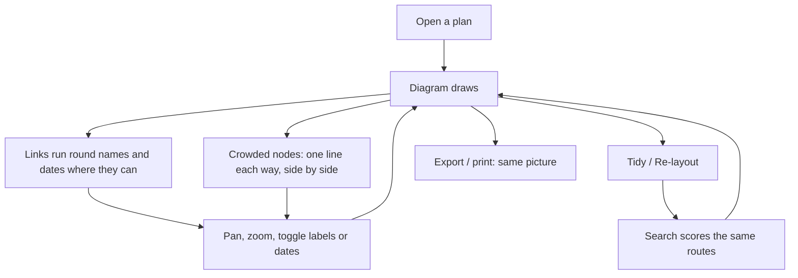

# Feature Spec: Links that read the labels, and two-way tracks at crowded nodes

- **Status:** Approved — product owner, 2026-09-25: plan approved as written; **CQ-1 answered "accept the cost"** (FC-Q2 is recorded, never a stop); **CQ-2 answered "yes, inside the circle"** (an end exactly `PORT_OFFSET_PX` from a task node centre counts as attached). Built under this plan; recorded as ADR-0159
- **Author(s):** feature-analyst, for the product owner
- **Date:** 2026-09-25
- **Tracking issue / epic:** none yet. Combines `docs/TECH_DEBT.md` #393 and #394, both approved for
  one epic by the product owner on 2026-09-25.
- **Roadmap link:** the TSLD legibility programme (`docs/specs/node-to-node-links/`,
  `docs/specs/netpoint-grammar/`, `docs/specs/netpoint-layout/`)
- **Related ADR(s):** [ADR-0159](../../adr/0159-a-route-reads-the-text-it-is-drawn-beside.md) (filed at M4; outline in §4.12). It amends ADR-0158 decisions 1,
  2, 4 and 8. It moves ADR-0157's text placement into a module without changing it.

## 0. How to read this

**Two register rows, one epic, because they share one object: the router's view of the picture.**
#393 says the router cannot see the names and dates the painter draws, so it cannot avoid them. #394
says some opposed link pairs remain after ADR-0158's third pass, and no legal route separates them.
The remedy for #394 has to move lines by a few pixels, and it must not move one onto a name, which
it can only check once #393 has given the router the text. So #393 comes first.

**This spec changes where some links run and nothing else.** Bars, nodes, lanes, names, dates, the
wrap rule, gap labels, lag plates, the listbox and the spoken logic summary keep their current
placement rules. There is no API change, no schema change and no migration. The CPM engine is not
imported. No `VITE_` flag (ADR-0088 D1): each milestone is a commit boundary, and that is the
rollback.

**Citations** are at the working tree read for this spec (2026-09-25). `paint.ts` line numbers are
given because this spec read them, but they move whenever someone edits `paintScene`, so each is
also named by its layer.

### 0.1 What the brief said, checked

CLAUDE.md §19.11: the brief is not evidence. Each claim was read in the code.

| Brief claim                                                                                                                                   | What the code says                                                                                                                                                                                                                                                                                                                                                                                                                                                                                                                                                                |
| --------------------------------------------------------------------------------------------------------------------------------------------- | --------------------------------------------------------------------------------------------------------------------------------------------------------------------------------------------------------------------------------------------------------------------------------------------------------------------------------------------------------------------------------------------------------------------------------------------------------------------------------------------------------------------------------------------------------------------------------- |
| `paint.ts` places each name centred over its bar and dates inside or flanking the bar ends, using `ctx.measureText` and neighbour gaps.       | **True, with one gap.** Names: layer 3.6, halved-gap budget and centring (`paint.ts:2417-2474`). Dates: layer 3.7, inside / one date per node / flanking (`paint.ts:2652-2739`). A milestone gets one centred date (`:2673-2692`). The centre item is layer 3.8 (`:2778-2844`). The gap the brief leaves out: **a name's two-line wrap is decided against the routes**. `createWrapClearance` reads `routed.lines` (`paint.ts:2351-2355`), and a wrap is refused when its upper line meets a link (`:2476-2490`). So the text layout cannot all be decided before routing (§4.2). |
| Find "whatever layer modules it calls".                                                                                                       | **There are none for placement.** `layers/` holds `shapes.ts`, the width memo `text-measure.ts` and `wrap-clearance.ts`. All placement is inline in `paintScene`. M1 extracts it.                                                                                                                                                                                                                                                                                                                                                                                                 |
| Gap labels and lag plates are placed after text.                                                                                              | **True.** Both are collected by the link layer and placed in layer 3.9, after every name and date, against `placedText` (`paint.ts:1378-1392`, `:2846-2922`).                                                                                                                                                                                                                                                                                                                                                                                                                     |
| The row's fix: a pure module "called by the router with the same widths".                                                                     | **True for the painter, not free for Tidy.** The painter measures through a main-thread memo (`layers/text-measure.ts:15`), and the memo is cleared when `document.fonts` finishes loading the self-hosted face (`:26-30`, the face is IBM Plex Sans, `geometry.ts:472-473`). Tidy runs in a Web Worker (`run-optimise-layout.ts:17`) that has no `document`. So "the same widths" has to be carried across the worker boundary (§4.4).                                                                                                                                           |
| FC-T6's misses: `brief` 4 against 3 at 4 px/day, `small-17` 17 against 8 at 1 px/day.                                                         | **True as M2 measured them, and stale now.** Those figures are from `m2-verdict.md:48-51`, before ADR-0158's phase 3. That amendment raised Unit 300's text crossings by two to five a frame (`docs/adr/0158-…:190-192`). M0-T1 re-measures.                                                                                                                                                                                                                                                                                                                                      |
| Instruments exist and count what the brief lists.                                                                                             | **True.** `AttachmentReading` (`scripts/attachment-probe.ts:239-268`) has every field named. `--json` exists (`measure-attachment.mjs:26`). The four fixtures are built at `attachment-probe.ts:707-718`.                                                                                                                                                                                                                                                                                                                                                                         |
| `route-frame.opposed.test.ts` rebuilds the Install Analyser Room shape.                                                                       | **True.** Its second case also asserts that every link into the node ends on the same point the link out starts from (`route-frame.opposed.test.ts:147-160`). A port-offset remedy changes that meaning where it applies. §4.7 keeps that test passing unedited.                                                                                                                                                                                                                                                                                                                  |
| Cost today: `routeFrame` p95 ~4.9–5.5 ms, Tidy on Unit 300 6.87–7.39 s against 4.08–4.21 s pre-epic, Tidy at 300 generated activities 15.6 s. | **True.** `docs/adr/0158-…:194-204` and `optimise-layout.ts:92-95`.                                                                                                                                                                                                                                                                                                                                                                                                                                                                                                               |
| #382: "adding lanes adds evaluations to a Tidy already over its bar".                                                                         | **Imprecise.** #382 is about **Re-layout**, not Tidy. Both use one search, and its evaluations are capped at 2,000 (`optimise-layout.ts:100`, `:117`). Adding lanes cannot add evaluations past that cap. It adds candidate moves that compete for the same cap, so matching today's quality may need a larger cap, and the cost comes from there. The recommendation to do #382 after this epic still holds (§1.8).                                                                                                                                                              |

**One finding the brief did not mention.** An off-centre end inside a node disc is already shipped.
Where two bars in a lane meet within `LABEL_GAP_PX` (4 px), one disc is drawn at the later bar's
start (`render-model.ts:382-385`, `:426-444`), so the earlier bar's finish anchor can sit up to 4 px
from that disc's centre. The attachment probe judges each end against its own bar's edge
(`attachment-probe.ts:115-131`), so it has never flagged this. It is the precedent §4.7 builds on.

## 1. Business understanding

### 1.1 Problem

**#393: a link can run through a name or a date.** Node-to-node routing chooses each link's shape
among up to fifteen orthogonal candidates. It scores them on foreign glyphs, opposed overlaps,
crossings, overlaps, length and bends (`link-score.ts:269-273`, `:475-488`). Text is not a term. The
painter places names and dates only after routing (layers 3.6–3.8), from measured widths the router
never sees. ADR-0158 tried to add a text term and stopped, because any estimate of where text sits
would be a second opinion (ADR-0149's drift argument). `docs/TECH_DEBT.md` #391 item 11 records the
visible result on the reference plan: "Chem Clean" and "Steam Blows" crossed by a vertical link. The
same blindness costs lag plates. A plate is placed after text, at the first free point on its own
line, and is withheld when there is none. On `small-17` at 12 px/day three of four plates are drawn
(`m2-verdict.md:163-176`). ADR-0158 assigned that miss to #393 too.

**#394: some links still run against each other along one track.** ADR-0158's phase 3 removed every
opposed pair on the reference plan and about a third on Unit 300 and `small-17`. What remains is of
two kinds (the #394 row):

1. **Crowded shared nodes.** One bar's finish and the next bar's start share one node. A link
   arrives from above, another from below, and the link leaving cannot go east because the next bar
   is there. It leaves up or down, and opposes one arrival either way. No reordering or escape helps.
2. **Escapes through a bar.** The only route off the shared track crosses a foreign bar, and
   decision 4 ranks a bar above an opposed overlap.

The product owner's words on `web-v0.150.0`: "the logic should avoid routing lines in opposing
direction on each other." Two arrowheads pointing at each other on one stroke read as neither link.

**Why now.** Both are the recorded residue of the epic that shipped today (ADR-0158). Their fixtures
and instruments are fresh, and the product owner approved both.

### 1.2 Users

Everyone who reads the diagram: Planner, Contributor, Viewer, Org Admin, and an External Guest on a
share link (the guest view mounts the same painter). No role gains or loses a capability, and
nothing new can be pressed. A Planner holding the pen who presses **Tidy** or **Re-layout** gets a
search that scores the text-aware routes (§4.4).

### 1.3 Primary use cases

1. A planner reads an activity's name and dates without a link line across them, wherever a legal
   shape avoids them.
2. A planner reads a lag on its plate, because the link was routed to leave room for it.
3. A planner follows two links through a crowded node and sees two lines, one each way, not one line
   with an arrowhead at each end.
4. A planner exports or prints the diagram and gets the same lines (ADR-0103).

### 1.4 User journeys

Open a plan. Links run round names and dates where a shape exists that does so without passing
through a bar or adding a crossing. At a node where an arrival and a departure must share a vertical,
they are drawn as two parallel lines a few pixels apart, both entering the node's disc. Pan and zoom:
names re-centre on the visible part of their bar (`docs/TECH_DEBT.md` #380), and the links re-route
against the names as they now sit. Press Tidy: the search scores layouts on the same routes.

### 1.5 Expected outcomes

- Fewer links through names and dates, on every fixture, with no rise in hidden links, and crossings
  held within the bar in §4.10.
- Lag plates that were withheld for lack of room are drawn where a route with room exists.
- Opposed pairs fall to the residue M0 measures as unfixable by an offset, and every other count
  holds.
- The reference plan and the brief fixture draw **identical lines** for #394, because phase 3
  already clears them (`docs/adr/0158-…:183-188`).

### 1.6 Success criteria

The falsification conditions in §4.10, measured on the four fixtures that ADR-0158 used. The
headline ones are FC-W2 (text crossings fall), FC-K1 (opposed pairs fall to the absorbable residue)
and FC-K2 (no unattached end, under a definition M3 states and M0 proves non-vacuous).

### 1.7 Open questions

**Critical (two):**

| #        | Question                                                                                                                                                                                                                                                                                                                                                                                                                                                                                                                                                                                                                                                                             | Recommended default                                                                                                                                                                                                                                                                                                                                                                |
| -------- | ------------------------------------------------------------------------------------------------------------------------------------------------------------------------------------------------------------------------------------------------------------------------------------------------------------------------------------------------------------------------------------------------------------------------------------------------------------------------------------------------------------------------------------------------------------------------------------------------------------------------------------------------------------------------------------ | ---------------------------------------------------------------------------------------------------------------------------------------------------------------------------------------------------------------------------------------------------------------------------------------------------------------------------------------------------------------------------------- |
| **CQ-1** | **Tidy inside the text-aware router.** Tidy scores every candidate layout by routing the whole plan (`layout-objective.ts:77-96`), so a text term runs inside its loop. Tidy is already past ADR-0158's 1.5× bar by your decision. **What further rise do you accept before the work stops and comes back to you, and which way would you lean if it is exceeded?** The options if it is exceeded: (a) accept the cost; (b) Tidy routes text-blind, which is a second opinion about the picture and the same shape as an option you declined on 2026-09-25; (c) lower the 300-activity Tidy limit; (d) optimise first (a per-lane memo of the text layout is the obvious one, §4.9). | **A bar of 1.25× this epic's own M0 Tidy time on Unit 300, taken in one sitting with interleaved builds.** If it is missed, M2 builds (d) once and re-measures. If it is still missed, work stops and you choose. The analyst's lean would be (a). (b) brings back the drift ADR-0149 exists to stop, and (c) removes Tidy from plans it serves today. The choice is yours.        |
| **CQ-2** | **What "enters at its node" means at a crowded node.** The remedy for #394 draws an arrival and a departure on one vertical as two parallel lines, each **exactly `PORT_OFFSET_PX` (a value between 3.25 and 4.5 px, derived in §4.7) either side of the node centre**, both ending inside the disc. ADR-0158 established "zero unattached ends" with ends on the node centre. **Is an end offset by exactly that amount, inside the disc, still "at its node"?**                                                                                                                                                                                                                    | **Yes.** Applied only where phase 3 left an opposed pair and the glyph can absorb the offset (a task node's disc; never an embed dot, a milestone or a span end). The judge accepts exactly `PORT_OFFSET_PX`, no more, so a genuinely detached end still fails. You see the pictures at M3's verdict before the gate pass, and the verdict can withdraw M3 without touching M1–M2. |

**Stated defaults (not questions; overturn any of them):**

| #   | Default                                                                                                                                                                                                                                                                                                                      | Why                                                                                                                                                                                                                                                                                                                              |
| --- | ---------------------------------------------------------------------------------------------------------------------------------------------------------------------------------------------------------------------------------------------------------------------------------------------------------------------------- | -------------------------------------------------------------------------------------------------------------------------------------------------------------------------------------------------------------------------------------------------------------------------------------------------------------------------------- |
| D-1 | **Text ranks after overlaps and before length.** Phase 1 becomes (obstructions, text, length, bends, order); phase 2 (obstructions, crossings, overlaps, text, length, …); phase 3 (obstructions, opposed, crossings, overlaps, text, …).                                                                                    | This is the remedy your approved node-to-node conditions named for FC-T6: "add names as a score term after overlaps" (`node-to-node-links/conditions.md:101`). Placed there, it cannot trade a bar, an opposed pair, a crossing or an overlap for a name. It only breaks ties those terms leave.                                 |
| D-2 | **The router avoids what is drawn.** Turning off `Labels`, `Dates` or the centre item, or turning on `Activity codes` (which widens names), can change which shape a link takes.                                                                                                                                             | Avoiding text that is not drawn would cost other links room for nothing. The switches are not persisted, and the lines follow the picture as it is.                                                                                                                                                                              |
| D-3 | **Text crossings count every text box a line meets, including its own endpoints' names.**                                                                                                                                                                                                                                    | That is how the instrument counts (`attachment-probe.ts:484-494`). One definition in the router and the judge. A vertical into a start node from above does cross that activity's own name where the name overhangs the node.                                                                                                    |
| D-4 | **The name's wrap stays a painter decision after routing.** The router scores the one-line name.                                                                                                                                                                                                                             | The wrap is refused wherever a link meets its upper line (`paint.ts:2476-2490`). Making the router see the wrap would make text depend on routes and routes on text. A wrapped name's lower line sits in the same band as the one-line name, within one glyph of its width, and M0 counts the difference (FC-W4).                |
| D-5 | **A lag plate is a second text term**, scored only for a link with a non-zero lag, only at the tier plates are drawn (detail). It asks whether the candidate line has a free plate position against the row text and glyphs, using the painter's own `lagPlateCandidates` and `freePlatePosition` (`link-marks.ts:145-200`). | ADR-0158 assigned the plate miss to #393 ("once the router can read the painter's text layout, it can choose a route that leaves room for its plate"). It ignores other plates, which are route-dependent, so it can under-count and never over-count. If FC-W5 shows it moves nothing, it is withdrawn and the text term stays. |
| D-6 | **Offsets are applied to vertical tracks only.** An opposed pair on a lane-centre horizontal is counted and left.                                                                                                                                                                                                            | #394 describes verticals ("arrive from above, another from below"). M0-T2 counts horizontal pairs. If they are a material share, M3 applies the same rule in y, and it says so in its verdict.                                                                                                                                   |
| D-7 | **Tidy uses the text toggles the planner is looking at**, at the search's own reference zoom (4 px/day, `layout-objective.ts:44-45`).                                                                                                                                                                                        | The dialog's scores describe the picture on screen. The reference zoom is the search's existing contract, and this epic does not change it.                                                                                                                                                                                      |
| D-8 | **The layout objective gains no text term.** Tidy scores the text-aware routes on its existing terms.                                                                                                                                                                                                                        | Changing what Tidy optimises is an optimiser change in #382's area and the product owner's ordering (ADR-0152). Kept out.                                                                                                                                                                                                        |

### 1.8 Out of scope

- **`docs/TECH_DEBT.md` #382 (Re-layout cannot add lanes).** Recommended to follow this epic, not to
  join it. It is a different subsystem: the search (`optimise-layout.ts`) and its row budget, which is
  the seed's row count by design (`optimise-layout.ts:34-35`). Its objective calls `routeFrame`
  (`layout-objective.ts:84-90`), so measuring it against a router this epic is changing would mix two
  effects in one number. It also changes what the search spends its 2,000-evaluation cap on, in a
  Tidy already over ADR-0158's cost bar. **#382's measurements must be taken on this epic's router**:
  its target ("no worse than the hand layout: 1 hidden, 3 crossings") was scored by the router in
  `web-v0.150.0`, and M2 changes that router's picks.
- A text term in Tidy's objective (D-8).
- Offsets at embeds, milestones and span ends (§4.7), and on horizontal tracks unless M0 says otherwise
  (D-6).
- Retiring phase 3 and the escapes in favour of offsets everywhere. Phase 3's separate routes are the
  picture you accepted. Offsets treat only what phase 3 cannot separate. (§4.13.)
- `docs/TECH_DEBT.md` #391's other items.

## 2. Functional requirements

### 2.1 User stories and acceptance criteria

> **US-1 — A link runs round a name where it can.** As any reader, I want links not to cross
> activity names and dates, so that I can read them.
>
> - **Given** a link and two legal shapes with the same foreign glyphs, crossings and overlaps
>   **when** one meets a name or date and the other does not **then** the one that does not is drawn.
> - **Given** every legal shape meets text **then** the shape meeting the fewest boxes is drawn, and
>   the instrument counts the case.
> - **Given** any link **then** it never goes through more bars, runs against more links, crosses more
>   links or overlaps more links to avoid text (D-1).

> **US-2 — The router and the painter agree about where text is.** As a reader, I want the avoided
> text to be the text actually drawn.
>
> - **Given** any frame **then** the name, date and centre-item boxes the router scores are the boxes
>   the painter draws, taken from one module (FC-W0).
> - **Given** a wrapped name **then** its upper line is still drawn only where no link meets it, as
>   today.

> **US-3 — A lag plate gets room.** As a planner, I want a lag's plate drawn where a route with room
> for it exists.
>
> - **Given** a lagged link at the detail tier and two legal shapes tied on every higher term **when**
>   only one has a free plate position **then** that one is drawn (D-5).

> **US-4 — Two links through a crowded node read as two.** As a reader, I want an arrival and a
> departure that must share a vertical at one node to be drawn as two lines, each with its own
> direction.
>
> - **Given** an opposed pair on a vertical track, left after phase 3, whose track ends at task nodes
>   (or at no end) **then** the down-travelling line is drawn on one side of the track and the
>   up-travelling line on the other, each `PORT_OFFSET_PX` from it (§4.7).
> - **Given** such an end **then** it lies inside the node's disc, its segment leaves in a direction the
>   node allows, the stub rule holds, and the arrowhead stops at the rim.
> - **Given** a pair whose track ends at an embed, a milestone or a span end **then** it is left, and
>   counted.
> - **Given** a plan with no opposed pair after phase 3 **then** every line is exactly as today.

> **US-5 — Stable and the same everywhere.**
>
> - **Given** the same plan and viewport **then** 200 shuffles of `scene.edges` draw identical lines
>   (FC-T5 carried forward).
> - **Given** an export or print **then** it shows the same lines and text (ADR-0103).
> - **Given** Tidy or Re-layout **then** it scores layouts on the same routes the painter draws.

### 2.2 Workflows

None new. The diagram draws differently. Tidy and Re-layout run as before, with a width table in
their request (§4.4).

### 2.3 Edge cases

| Case                                                                       | Behaviour                                                                                                                                                                                  |
| -------------------------------------------------------------------------- | ------------------------------------------------------------------------------------------------------------------------------------------------------------------------------------------ |
| Labels toggle off                                                          | No name boxes, so names are not avoided (D-2).                                                                                                                                             |
| Overview tier (under 4 px/day)                                             | Dates are withheld (`paint.ts:2580-2587`), so only names are avoided. Plates are detail-tier only, so the plate term is inert.                                                             |
| A name wider than its bar, overhanging the start node                      | Counted against a vertical arriving from above (D-3). A VH arriving from the west avoids it where legal.                                                                                   |
| A wrapped name                                                             | Router scores the one-line box (D-4). The instrument counts crossings of wrapped lines separately (FC-W4).                                                                                 |
| A name centred on the visible part of a long bar (#380)                    | Moves with the pan. Routes are already a function of the viewport, so FC-T5 is unaffected.                                                                                                 |
| Fonts not yet loaded                                                       | The painter's memo holds the fallback face's widths until `document.fonts.ready` clears it (`text-measure.ts:26-30`). Router and painter read the same memo, so they agree in either face. |
| Tidy with a label the width table lacks                                    | The worker's measurer **throws**, the search reports `failed`, and the dialog shows its existing error. A table-completeness test makes this unreachable (§4.4).                           |
| Opposed pair at a shared node where the disc sits at the later bar's start | The disc is the one drawn (`render-model.ts:426-444`). Offsets are measured from the disc centre, so both ends stay inside it.                                                             |
| Offset would shorten an adjacent end segment below the stub rule           | The line is re-validated with `obeysPorts` after the offset. If it fails, that track is left and counted.                                                                                  |
| Offset target position already holds another segment                       | That track is left and counted.                                                                                                                                                            |
| V link (one vertical, node to node)                                        | It travels one direction along its whole length, so it takes the same side at both ends. Both ends must be absorbable.                                                                     |
| Flag-off paths (no routing, no refresh, no time-true)                      | Unchanged byte for byte. The text index and the track pass exist only on the routed path (`route-frame.ts:131-139`).                                                                       |

### 2.4 Permissions

No change. Reading the diagram needs `schedule:read`. Tidy and Re-layout keep their pen gate
(ADR-0028). There is no new write.

### 2.5 Validation rules

None. There is no input.

### 2.6 Error scenarios

| Scenario                                        | Detection                                                                                        | Result                                                                                 |
| ----------------------------------------------- | ------------------------------------------------------------------------------------------------ | -------------------------------------------------------------------------------------- |
| Width table missing a key in the Tidy worker    | the worker's measurer throws                                                                     | `failed` message; the Arrange dialog's existing error; a completeness test prevents it |
| No offset position is legal for a residue track | re-validation after the offset                                                                   | track left as today and counted by the instrument                                      |
| Text index absent on the routed path            | `routeFrame`'s parameter is **required** (`TextIndex \| null`); `null` must be passed explicitly | compile error, not a silent text-blind route                                           |

## 3. Technical analysis

| Area           | Impact       | Notes                                                                                                                                                                                                                                                        |
| -------------- | ------------ | ------------------------------------------------------------------------------------------------------------------------------------------------------------------------------------------------------------------------------------------------------------ |
| Frontend       | **med–high** | `apps/web/src/features/tsld/render/` only: a new pure text-layout module extracted from `paintScene`, a text index, a score term, a track pass, an arrowhead trim change, and the Tidy request carrying a width table.                                       |
| Backend        | none         |                                                                                                                                                                                                                                                              |
| Database       | none         | No schema change, so `database-architect` is not engaged. There is nothing to design.                                                                                                                                                                        |
| API            | none         |                                                                                                                                                                                                                                                              |
| Security       | low          | The Tidy worker request gains a `(font, text) → width` table built from strings already on the client. No new input crosses a trust boundary. The worker's CSP (`script-src 'self'`, ADR-0152) is unchanged, because no font is loaded in the worker (§4.4). |
| Performance    | **high**     | The router runs on the paint path (ADR-0026) and in every Tidy evaluation. Tidy is already past its accepted bar. §4.9 and FC-Q.                                                                                                                             |
| Infrastructure | none         | No new Playwright config or CI step. Journeys join `e2e-netpoint-grammar/`.                                                                                                                                                                                  |
| Observability  | none         |                                                                                                                                                                                                                                                              |
| Testing        | **high**     | Unit and property tests for the module, index, term and track pass; an agreement gate between the module and the painter; hand re-baselined golden log; journeys; harness measurements; a width-table completeness test.                                     |

### 3.1 What reads text today, and what reads routes

| Consumer                                                               | Reads                                               | Effect of this change                                                                                           |
| ---------------------------------------------------------------------- | --------------------------------------------------- | --------------------------------------------------------------------------------------------------------------- |
| Name layer 3.6 (`paint.ts:2333-2524`)                                  | rows, widths, `routed.lines` for the wrap           | Placement moves to the module; the wrap stays here (D-4).                                                       |
| Date layer 3.7 (`:2583-2764`)                                          | rows, widths                                        | Moves to the module.                                                                                            |
| Centre item 3.8 (`:2778-2844`)                                         | rows, widths                                        | Moves to the module.                                                                                            |
| Plates and gap labels 3.9 (`:2846-2922`)                               | routes, `placedText`                                | Unchanged. `placedText` is seeded from the module's line boxes instead of from `noteText` calls.                |
| `routeFrame` (`route-frame.ts:91-97`)                                  | scene, view, visible set                            | Gains a required `text` argument (§4.3).                                                                        |
| Layout objective (`layout-objective.ts:77-96`)                         | `routeFrame`                                        | Builds the module's layout at the reference zoom and passes its index.                                          |
| Tidy worker (`optimise-layout-protocol.ts:27-34`, `:64-87`)            | request                                             | Gains `textWidths` and `textToggles` (§4.4).                                                                    |
| Arrowhead (`headLineFor`, `paint.ts:1429-1445`)                        | line tip                                            | Recognises an offset tip and trims to the rim (§4.7).                                                           |
| Attachment probe (`attachment-probe.ts:274-520`)                       | its own `routeFrame` call and the painter's strokes | Passes the same text index as the painter, gains a point-by-point control, and gets an amended end judge at M3. |
| `shuffleDifferences`, `netpoint-evaluate.ts`, `measure-route-cost.mjs` | `routeFrame`                                        | Pass the text index. A harness that routes text-blind after M2 measures a copy of the router.                   |
| Export, print, guest view                                              | `paintScene`                                        | Follow automatically.                                                                                           |
| Listbox, spoken logic summary (`summarizeLogic`)                       | dependencies, not routes                            | Untouched.                                                                                                      |
| Gantt, minimap                                                         | no routes                                           | Untouched.                                                                                                      |

### 3.2 Where text can meet a line: the geometry

Reasoned from `rowSlots` (`geometry.ts:141-150`) and confirmed by M0-T2's orientation breakdown.

In a 60 px lane with a 6 px bar, the bar occupies y 27–33. The name's ink box (11 px, the probe's
`fontPx`, `attachment-probe.ts:211-225`) sits at y 12.5–23.5 and the date's at 36.5–47.5. Gutter runs
stay inside the 11 px clear half-band at each lane boundary (`link-routing.ts:336-342`), and every
other horizontal runs on a lane centre-line at y 30. **So on today's geometry only vertical segments
can meet a name or date**, and each meets at most two text bands per lane it crosses. That makes the
text term the same shape of work as the obstruction test for verticals, which already does a binary
search per lane crossed (`link-score.ts:183-199`). The legacy inside and beside placements are
unreachable while `rowReservesTextRows()` holds (`geometry.ts:851-853`, 27 ≥ 16). The module keeps
them for parity and the index handles any orientation.

### 3.3 Dependencies

- Nothing must land first. Builds on shipped code.
- M2 depends on M1. M3 depends on M1 (its guard reads the text index) and not on M2, so M3 can
  proceed if CQ-1 stops M2.

## 4. Solution design

### 4.1 Architecture overview

```mermaid
flowchart LR
  R[laneRows<br/>paint-frame.ts] --> TL[row-text-layout<br/>pure: names, dates, centre item]
  W[measure&#40;text, font&#41;<br/>painter memo / worker table] --> TL
  TL --> TI[textIndex<br/>per-lane ink boxes]
  TI --> RF[routeFrame]
  G[glyph index] --> RF
  RF --> P1[phase 1<br/>obstr, text, len]
  P1 --> P2[phase 2<br/>+ crossings, overlaps, text]
  P2 --> P3[phase 3<br/>+ opposed]
  P3 --> TK[two-way tracks<br/>offset residue]
  TK --> GC[packGutterChannels]
  GC --> L[lines]
  L --> PT[painter: lines, heads,<br/>wrap decision, plates, gap labels]
  TL --> PT
  L --> LO[layout objective<br/>Tidy / Re-layout]
  L --> EX[export / print]
```



### 4.2 One text layout, two readers (#393, M1)

**The module.** `render/row-text-layout.ts` (name settled at M1):

```
layoutRowText({ rows, view, size, toggles, tier, visualRefresh, reservesTextRows, measure, labelOf })
  → { items: PlacedText[], wraps: WrapProposal[] }
```

- `rows` is `frame.laneRows()` (`paint-frame.ts:141-153`): the visible set, lane-bucketed and
  x-sorted, which is what both text layers read today.
- `measure(text, font)` is the only source of widths. The painter passes its memo
  (`labelWidths.measure`, which sets `ctx.font` only on a miss). A harness passes the recording
  context's fixed-width measure. Tidy passes a table lookup (§4.4).
- `PlacedText` = { activity id, kind (`name` | `date-start` | `date-finish` | `milestone-date` |
  `centre` | legacy `inside` / `beside` / `flank-plated`), text, x, y, align, font, ink box, line
  box }. The ink box is `fontPx` high (what a reader sees, and what the probe counts). The line box is
  `LABEL_LINE_H` high (what `noteText` records today, `paint.ts:1389-1392`, for plates and gap labels
  to avoid).
- `WrapProposal` = the one-line item plus the two lines `wrapTwoLines` would produce and their
  positions. The painter takes the wrap only where `wrapClearance.clear` says the upper line is free
  of links, exactly as today (`paint.ts:2476-2490`).

**It is a move, not a change** (ADR-0078 §3). Every placement branch, constant and comment moves
verbatim: the halved-gap budget and the reason it is not clamped at zero (`paint.ts:2402-2429`),
centring on the visible part (`:2454-2473`), the lone-ellipsis rule (`:2393-2400`), the milestone's
single date (`:2673-2692`), the dates ladder with "suppression is its last rung" (`:2653-2739`),
one date per node (`:2700-2709`), the node text inset (`:2544-2570`), and the centre item's lazy
styling (`:2784-2799`). The painter keeps every `fillText`, `font`, `textAlign` and `fillStyle`
write in its current layer and order, and draws the module's items. So with the golden test's warmed
memo (`paint.golden.test.ts:274-284`) the log is predicted **byte-identical**: the layout step makes
no context call on a warm memo.

**Where it runs.** Before the edge layer, because the router needs it. `laneRows()` then builds
earlier in the frame. This is not `docs/TECH_DEBT.md` #76's hoist: the rects it reads are already
cached per frame by the time the router's glyph index has run (`paint-frame.ts:47-54`, `#76` "do not
re-do the rect hoist"). The layout was already computed every frame the layers were on. It now
happens once, earlier, and is read twice. M1 measures the painter's p95 anyway (FC-Q1).

**The one opinion is enforced, not described.** A structural test refuses `truncateToWidth`,
`wrapTwoLines` and `dateLabelSlot` calls from `paint.ts` (they belong to the module now). An
agreement harness (FC-W0) compares the module's items with the recorded `fillText` calls on the four
fixtures at every zoom and pan: same text, x, y and alignment, with wrapped names listed separately.

### 4.3 The text term (#393, M2)

**The index.** `textIndexOf(items)` groups ink boxes by lane, sorted by x0, with the widest box's
width kept for the same binary search the glyph index uses (`link-score.ts:48-57`, `:111-121`).

**`routeFrame` gains a required argument**: `routeFrame(scene, view, visibleIds, byId, rectCache,
text: TextIndex | null)`. Required, so every caller decides and the compiler checks
(ADR-0070's rule for `hoursPerDay`). `null` is legitimate only off the routed path. On the routed
path it is passed by the painter, the layout objective, and every harness.

**The term.** For each candidate: `text` = how many ink boxes the line meets (strict interior, the
probe's `segmentMeetsBox`, `attachment-probe.ts:228-234`). Computed once per candidate beside
`obstructionCounts` (`link-score.ts:295-321`), because it does not depend on other links. With D-1's
order:

| Phase | Order                                                                      |
| ----- | -------------------------------------------------------------------------- |
| 1     | obstructions, **text**, length, bends, order                               |
| 2     | obstructions, crossings, overlaps, **text**, length, bends, order          |
| 3     | obstructions, opposed, crossings, overlaps, **text**, length, bends, order |

Every existing early exit keeps the property it has today. Phase 2 stops at a pick with no crossing
and no overlap (`link-score.ts:590-592`), on the argument that phase 1 already made it best on every
other term among the ordinary shapes. With text in phase 1 before length, that argument still holds
for text. Escapes are sorted after every ordinary shape (`:313-319`) and are not consulted by that
exit, today or after this change. The `crossingLimit` pruning (`:602-604`) is unaffected, because
crossings still precede text.

**The plate sub-term (D-5).** For a link with a non-zero lag, when plates are on (detail tier,
labels on; `paint.ts:1492-1497`), `plateBlocked` = 1 when `freePlatePosition` finds no position on
the candidate line against the text line boxes and the glyph boxes, else 0. It ranks immediately
after `text`. It is the painter's own function with the painter's own inputs, minus other plates.

**Honest limits, stated in the ADR.** The router scores one-line names (D-4). A wrapped name's lower
line sits in the same band as the one-line name and is within one glyph of its width. The probe
counts crossings of wrapped lines separately, so any gap is visible (FC-W4). The plate term ignores
other plates, so it can report room that a plate placed earlier then takes.

### 4.4 The same widths in the Tidy worker

The painter's widths come from a main-thread memo that is cleared when the face loads
(`text-measure.ts:15`, `:26-30`). The worker has no `document`. Two ways to carry the widths across:

| Option                                                                                                    | For                                                                                                                                                                     | Against                                                                                                                                                                                                         |
| --------------------------------------------------------------------------------------------------------- | ----------------------------------------------------------------------------------------------------------------------------------------------------------------------- | --------------------------------------------------------------------------------------------------------------------------------------------------------------------------------------------------------------- |
| **A width table in the request (chosen)**                                                                 | Exact by construction: every width is the painter's own measurement at the moment of the press. Testable in jsdom. No font load in the worker, so the CSP is unchanged. | It must be complete for every string the layout can ask for.                                                                                                                                                    |
| Load IBM Plex Sans in the worker (`FontFace` on the worker's font set) and measure with `OffscreenCanvas` | No table.                                                                                                                                                               | A second measurer. It is equal only if proven equal, per string, per engine. Its font load is asynchronous and could lose the race with the first evaluation. It adds a font fetch to the worker under the CSP. |

**What the layout can ask for is finite, and M0 counts it.** Given an activity's label `s` and font
`f`, the layout measures `s`, the ellipsis, and prefixes of `s` plus the ellipsis, trimmed and
untrimmed (`truncateToWidth`, `geometry.ts:863-881`). It also measures the two date strings and, when
the centre item is on, its two forms. The wrap is not asked for, because the router does not wrap
(D-4). So the table is O(Σ label length): for each label, its full width and its prefix-plus-ellipsis
widths in the label's font (bold for a milestone), plus dates. `use-arrange-search.ts` builds it from
the drawn activities through `labelWidths` and sends it as `textWidths: [key, width][]` with
`textToggles`. The worker's measurer looks each key up and **throws** on a miss.

**Completeness is a test, not a hope.** A property test runs the module with a recording measurer,
over the fixtures, with arbitrary lane layouts and view widths, and asserts every requested key is in
the table built for those activities. M0-T4 measures the table's size and build time on Unit 300 and
at 300 generated activities (FC-Q4).

### 4.5 Data flow

```mermaid
sequenceDiagram
  participant C as TsldCanvas
  participant P as paintScene
  participant T as row-text-layout
  participant R as routeFrame
  participant K as candidates + score
  C->>P: frame (scene, view, size)
  P->>T: rows, view, size, toggles, measure
  T-->>P: items + wrap proposals
  P->>R: scene, view, visible, byId, rects, textIndex(items)
  loop each visible edge
    R->>K: anchors, glyphs, text
    K-->>R: candidates scored (obstr, text, len)
  end
  R->>R: phase 2, phase 3 (text after overlaps)
  R->>R: two-way tracks (M3), gutter channels
  R-->>P: lines
  P->>P: stroke lines and heads; draw items; decide wraps against lines
  P->>P: place plates, then gap labels, against placed text
```

### 4.6 User flow



### 4.7 Two-way tracks at crowded nodes (#394, M3)

**The options, weighed.**

| Option                                                                                                                                                                                                                                                   | Verdict                                                                                                                                                                                                                                                                                                                              |
| -------------------------------------------------------------------------------------------------------------------------------------------------------------------------------------------------------------------------------------------------------- | ------------------------------------------------------------------------------------------------------------------------------------------------------------------------------------------------------------------------------------------------------------------------------------------------------------------------------------ |
| **Split a residue track by travel direction (chosen).** After phase 3, on each vertical track still carrying an opposed overlap, every segment travelling down moves to one side by `PORT_OFFSET_PX` and every segment travelling up moves to the other. | Separates both kinds in #394 without re-ranking anything and without moving any link that is not in a residue pair. A V link keeps one direction along its whole length, so it takes the same side at both ends. A same-direction bus stays together. It is a function of the final segment set, so it is order-independent (FC-T5). |
| Separate ports by role (arrivals left of centre, departures right) at every node                                                                                                                                                                         | Rejected. A V link is a departure at one end and an arrival at the other, so it would need opposite offsets at its two ends and a jog. It would also move every link in every plan, and every fingerprint with it.                                                                                                                   |
| Rank opposed pairs above foreign glyphs, so an escape through a bar wins                                                                                                                                                                                 | Rejected. It reverses your order (ADR-0158 decision 4), and decision 10 exists because a similar trade measured two or three more hidden links a frame on Unit 300.                                                                                                                                                                  |
| A different lane layout (an "opposed" term in the Tidy objective)                                                                                                                                                                                        | Out of scope (D-8, #382's area). It also cannot help where two bars abut in one lane by the schedule's own logic.                                                                                                                                                                                                                    |
| Split the shared node back into two discs where crowded                                                                                                                                                                                                  | Rejected. It reverses ADR-0157's shared node and #379's one date per node, and gains only the up-to-4 px the two anchors already differ by.                                                                                                                                                                                          |
| Mark the pair with a different arrowhead                                                                                                                                                                                                                 | Rejected. The complaint is two arrowheads on one stroke.                                                                                                                                                                                                                                                                             |

**`PORT_OFFSET_PX` is derived, and the derivation can withdraw M3.** Reasoned from constants below.
M0-T3 computes it as a derivation test, and if the lower bound exceeds the upper, M3 is withdrawn.

- **Lower bound: the two lines' marks must not touch.** The widest pair of marks side by side is an
  arrowhead (half-width `ARROWHEAD_HALF_W_PX` = 3, `link-routing.ts:661`) beside a chevron
  (half-width `CHEVRON_HALF_W_PX` = 2.5, `link-marks.ts:53`), with 1 px of ground between:
  2δ ≥ 3 + 2.5 + 1, so δ ≥ **3.25**.
- **Upper bound: each end must enter the disc with its whole stroke.** The widest stroke is 3 px (a
  highlighted driving link, `paint.ts:1522`), and the disc's inner edge is `NODE_RADIUS` −
  `NODE_RIM_MAX_W` / 2 = 7.5 − 1.5 = 6 (`render-model.ts:245-248`, `:345`): δ + 1.5 ≤ 6, so
  δ ≤ **4.5**.

**Where an offset may apply.** At a segment's end, only where the end's glyph can absorb it: a task
node's disc. Never at an embed (its dot's radius is 2, `link-ports.ts:45`), a milestone's centre
port, or an LOE, hammock or summary end (reach 0). A segment with neither end at an anchor (a middle
vertical) is attachment-neutral. A pair is treated only if every segment the pass would move is
absorbable at each anchored end.

**Guards, all evaluated against the pre-pass picture so the result does not depend on order.** A
track is left, and counted, if any moved line would: fail `obeysPorts` with the offset (for example
an adjacent end segment falling below the stub rule, `link-candidates.ts:85-100`); meet a foreign
glyph or hide a leg it did not before; meet more text boxes (§4.3's index); gain a crossing; or land
on a position another segment already occupies.

**What "attached" means afterwards (CQ-2).** An end is attached when its segment leaves in an
allowed direction, obeys the stub rule, and its point is **the anchor, or exactly `PORT_OFFSET_PX`
from a task-node anchor, perpendicular to that segment**. "Exactly" is deliberate: a judge that
accepted "within δ" would let a drifting end pass. The probe's judge is amended to match
(`attachment-probe.ts:110-132`). So is its own-anchor exemption for false junctions, which today is a
distance of 0.5 px from the anchor (`:369-376`) and would count an offset end's own node. It becomes
an exemption by activity id. The baseline is re-measured with the amended judge, so FC-K2 stays like
for like (the precedent: FC-T2's corrected metric, `node-to-node-links/conditions.md:141-145`).

**Downstream.** `headLineFor` recognises a tip `PORT_OFFSET_PX` from a node centre and trims it to
the rim: √(`NODE_REACH_PX`² − δ²) along the line, not `NODE_REACH_PX` (`paint.ts:1429-1445`). The
router's shared-end test reads anchors, not line points (`link-score.ts:508-511`), so the bus
exemption is unaffected. `route-frame.opposed.test.ts` passes **unedited**. Phase 3 already
separates that shape, so the track pass has nothing to do there. A new case covers a crowded shared
node that phase 3 cannot separate.

### 4.8 Database, API and component changes

- **Database:** none.
- **API:** none.
- **Components:** none visible. New pure modules under `apps/web/src/features/tsld/render/`:
  `row-text-layout.ts`, `text-index.ts`, `link-tracks.ts` (names settled when built). Changed:
  `paint.ts` (layers 3.6–3.8 draw the module's items; `headLineFor`), `route-frame.ts` (required
  `text` argument; track pass), `link-score.ts` (text and plate terms), `layout-objective.ts`,
  `optimise-layout-protocol.ts` and `use-arrange-search.ts` (width table). No design-system change,
  no new token, no new colour.

### 4.9 Cost

- **Paint path.** The layout is already computed every frame the text layers are on. It moves
  earlier and is read twice. New work: building the index (one sort per lane of items already
  produced), and one text query per candidate. On today's geometry that query touches only vertical
  segments, one binary search per text band per lane crossed (§3.2), which is the obstruction test's
  shape. The track pass scans the phase-3 buckets, which already exist (`link-score.ts:613-623`). The
  bar is ADR-0158's absolute 8 ms p95, today 4.9–5.5 ms (FC-Q1).
- **Tidy.** Every evaluation now builds a text layout for the whole plan at the reference zoom and
  scores text per candidate. The layout is O(N log N) plus table lookups. It depends only on lane
  contents, and a Tidy move changes one or two lanes. So a per-lane memo keyed by the lane's ordered
  activity ids would make most of it free. That memo is **not built unless FC-Q2 misses on its first
  reading**, because it is complexity bought only if the measurement asks for it (CQ-1 (d)).
- **Can text-aware scoring be afforded inside Tidy's loop?** Not known, and not guessed. The analyst
  expects the term itself to be cheap (§3.2) and the layout rebuild to be the larger share. That
  expectation is labelled "reasoned, not measured". M0 takes the baseline, M2 measures, and CQ-1
  decides what happens if the bar is missed.

### 4.10 Measurement first, and the falsification conditions

The repository's rule (ADR-0142 D4, CLAUDE.md §19.11): measure before building; commit conditions
before code. M0 writes `conditions.md` with these bars filled from its baseline, **in a commit before
M1's first commit**. Counts are taken at zooms 1, 4 and 12 px/day and pans 0, 32, 200 and 500. Each
condition is judged per fixture and zoom on **one pan reading** where M0 confirms every pan agrees,
which is how node-to-node judged them (`node-to-node-links/conditions.md:8-11`), so FC-T6's
per-reading bars compare like for like. Where pans disagree, M0 says so and that cell is judged
summed over four pans, as ADR-0158's amendment tables are. Bars written as `⌊x⌋` round down, as
`⌈x⌉` round up. "M0" means this epic's re-measured baseline on today's tree, not the node-to-node M0.

**Text (judged at M1 and M2):**

| ID        | Condition                                                                                                                                                                                                                       | Pass bar                                                                                                                                                                                                                                             |
| --------- | ------------------------------------------------------------------------------------------------------------------------------------------------------------------------------------------------------------------------------- | ---------------------------------------------------------------------------------------------------------------------------------------------------------------------------------------------------------------------------------------------------- |
| **FC-W0** | Agreement. The module's items equal the painter's recorded `fillText` calls for names, dates and centre items: same text, x, y and alignment, on four fixtures × three zooms × four pans. Wrapped names are listed, not failed. | Exact. **Verified red** by perturbing the module (for example, dropping the halved gap) and watching it fail. Judged at M1.                                                                                                                          |
| **FC-W1** | The extraction moved nothing.                                                                                                                                                                                                   | Golden log byte-identical against a written prediction; every text budget suite unedited and green. Judged at M1.                                                                                                                                    |
| **FC-W2** | Text crossings fall.                                                                                                                                                                                                            | ≤ M0 in every cell; **and** ≤ node-to-node FC-T6's bar in every cell (`node-to-node-links/conditions.md:92-97`), which closes that miss; **and** strictly below M0 in at least one cell of each of `brief` and `small-17` (non-vacuity).             |
| **FC-W3** | Nothing above text got worse.                                                                                                                                                                                                   | Unattached ends 0. Foreign-occluded links ≤ M0. Opposed pairs ≤ M0. Crossings ≤ ⌊M0 × 1.05⌋ (on the small plans that means no rise). Overlaps ≤ ⌊M0 × 1.05⌋. A cell past its bar stops the work and goes to the product owner with the pairs listed. |
| **FC-W4** | Wrap residue.                                                                                                                                                                                                                   | Crossings of wrapped lines reported per cell. Bar: ≤ M0's. If a wrapped lower line accounts for any rise in FC-W2, it is reported pair by pair.                                                                                                      |
| **FC-W5** | Plates.                                                                                                                                                                                                                         | Lag plates drawn ≥ M0 in every cell, and `small-17` at 12 px/day ≥ 4 (node-to-node FC-T7's floor). Plates on text stay 0. If the plate sub-term moves no cell, it is withdrawn and the text term stays.                                              |
| **FC-W6** | Gap labels.                                                                                                                                                                                                                     | ≥ ⌈M0 × 0.90⌉ in every cell (node-to-node FC-T7's rule).                                                                                                                                                                                             |
| **FC-T5** | Determinism.                                                                                                                                                                                                                    | 200 seeded shuffles of `scene.edges` draw identical lines on all four fixtures (carried forward).                                                                                                                                                    |

**Two-way tracks (judged at M3):**

| ID        | Condition                                                                                                                                                                                                                                                                                                                                                | Pass bar                                                                                                                                                                                                                                                                                       |
| --------- | -------------------------------------------------------------------------------------------------------------------------------------------------------------------------------------------------------------------------------------------------------------------------------------------------------------------------------------------------------- | ---------------------------------------------------------------------------------------------------------------------------------------------------------------------------------------------------------------------------------------------------------------------------------------------- |
| **FC-K0** | Non-vacuity. M0's listing finds opposed pairs after phase 3 on `small-17` and Unit 300, classifies every one (crowded shared node / arrive–leave at an unshared node / escape through a bar / other), and finds at least one **absorbable** pair on each. The harness-only prototype (M0-T3) shows what the **unamended** judge reports for offset ends. | Judged at M0. Zero absorbable pairs on both plans means M3 has nothing to do: withdraw it.                                                                                                                                                                                                     |
| **FC-K1** | Opposed pairs fall.                                                                                                                                                                                                                                                                                                                                      | ≤ M0's non-absorbable residue in every cell (every absorbable pair separated, unless a §4.7 guard refused it, and each refusal listed).                                                                                                                                                        |
| **FC-K2** | Attachment, amended.                                                                                                                                                                                                                                                                                                                                     | 0 unattached ends under the amended judge. The judge's self-test still reproduces every existing verdict (`attachment-probe.ts:728-826`) and adds three cases: an end at exactly δ from a node (attached), an end at δ + 1 (unattached), and an offset end at an embed (unattached).           |
| **FC-K3** | Nothing else moves.                                                                                                                                                                                                                                                                                                                                      | **Fingerprints identical** on every fixture and cell where M0 found no absorbable pair (at least `brief` and `reference-netpoint`). Elsewhere, crossings, foreign-occluded links, text crossings and overlaps each ≤ their M2 value, and false junctions (amended exemption) ≤ M0 re-measured. |
| **FC-K4** | The two lines really are two.                                                                                                                                                                                                                                                                                                                            | On the painter's recorded paths, the ink of any two offset segments on one track, including heads and chevrons, is ≥ 1 px apart everywhere they run side by side.                                                                                                                              |
| **FC-K5** | The report's own shape.                                                                                                                                                                                                                                                                                                                                  | `route-frame.opposed.test.ts` passes unedited.                                                                                                                                                                                                                                                 |
| **FC-T5** | Determinism.                                                                                                                                                                                                                                                                                                                                             | As above.                                                                                                                                                                                                                                                                                      |

**Cost (judged at M1, M2 and M3; one sitting, builds interleaved BASE → NEW → BASE → NEW, spread
beside every number, ADR-0128's INDETERMINATE rule as node-to-node `conditions.md` decision 2):**

| ID        | Condition                                                                                                                                    | Pass bar                                                                                                                                                                          |
| --------- | -------------------------------------------------------------------------------------------------------------------------------------------- | --------------------------------------------------------------------------------------------------------------------------------------------------------------------------------- |
| **FC-Q1** | `routeFrame` p95, Chromium, `scale-2000`, Week, with the text index prebuilt as the painter has it. Also `paintScene` p95 on the same scene. | `routeFrame` ≤ 8 ms (ADR-0158's absolute bar) and ≤ 1.3 × M0. `paintScene` ≤ M0 + M0's own spread at M1 (a move must not cost), and ≤ 1.3 × M0 at M2.                             |
| **FC-Q2** | Tidy on Unit 300 (node, the worker proxy, three runs each).                                                                                  | ≤ **1.25 × M0** (CQ-1). If missed on the first reading, build the per-lane memo (§4.9) and re-measure. If still missed, **stop**: the product owner chooses among CQ-1's options. |
| **FC-Q3** | Tidy at 300 generated activities (`PLANS=scale300 scripts/measure-netpoint-optimise.mjs`).                                                   | Reported beside FC-Q2. No separate bar: ADR-0158 accepted 15.6 s against the 10 s figure the limit was chosen on.                                                                 |
| **FC-Q4** | The width table.                                                                                                                             | Build ≤ 50 ms on the main thread at 300 activities, and the completeness property holds.                                                                                          |
| **FC-Q5** | The staff-console paint probe on the product owner's hardware, Week at 2,000.                                                                | Dropped-frame delta ≤ 2.00 pp (ADR-0127's bar). **Owed until taken, never claimed** (as FC-T8 (c)).                                                                               |

### 4.11 Risks

| Risk                                                                             | Likelihood          | Impact | Mitigation                                                                                                                    |
| -------------------------------------------------------------------------------- | ------------------- | ------ | ----------------------------------------------------------------------------------------------------------------------------- |
| Tidy cost past CQ-1's bar                                                        | med                 | med    | FC-Q2 stops the work and returns it to the product owner. The per-lane memo is ready as (d). M3 does not depend on M2.        |
| Phase 1 picks move once text precedes length, and crossings of other links shift | med                 | low    | FC-W3 caps crossings. A rise stops the work, pair by pair.                                                                    |
| The extraction silently changes a placement                                      | med                 | high   | FC-W0 agreement on four fixtures, FC-W1 golden byte-identical, structural test against placement calls left in `paint.ts`.    |
| The width table misses a key and Tidy fails                                      | low                 | med    | The completeness property test, and the throw is loud: the existing `failed` path.                                            |
| Offset ends read as "beside the node"                                            | med                 | med    | CQ-2; pictures at M3's verdict; exact-δ judge; the derivation withdraws M3 if the marks cannot be kept apart inside the disc. |
| The probe routes text-blind after M2, and measures a copy of the router          | high if unaddressed | high   | M2 makes `text` a required argument, and adds a point-by-point control between the probe's lines and the painter's strokes.   |
| Routes change when a planner toggles labels or dates (D-2)                       | certain             | low    | Stated; the toggles are not persisted; a unit case pins it so it cannot surprise a later reader.                              |
| The golden scene reaches no text avoidance or no residue track                   | med                 | med    | M2 and M3 each write a prediction naming which cases the scene reaches; missing cases get their own unit tests.               |

### 4.12 ADR outline (ADR-0159, filed at M4)

**Title:** A route reads the text it is drawn beside, and a two-way track splits at its node.

- **Context.** #393 and #394, with the figures M0 measured. ADR-0158's attempt at a text term, and
  why it stopped.
- **Decision 1.** Row text is placed by one pure module (`row-text-layout.ts`), taking a width
  function. The painter, the router and Tidy read it. The wrap stays a painter decision after routing.
- **Decision 2.** Text is a score term after overlaps (and after obstructions in phase 1). A lag plate
  is a sub-term after it.
- **Decision 3.** Tidy receives the painter's widths as a table, never a second measurer.
- **Decision 4.** A vertical track still opposed after phase 3 is split by travel direction by
  `PORT_OFFSET_PX`, where each moved end is a task node. Guards against every higher term.
- **Decision 5.** "Attached" means at the anchor, or exactly `PORT_OFFSET_PX` from a task-node anchor
  perpendicular to the end segment. The judge is amended to match.
- **Amends.** ADR-0158 decisions 1–2 (attachment), 4 (score order), 8 (a pass after phase 3).
- **Not amended.** ADR-0157's placement rules (moved verbatim), ADR-0154 marks, ADR-0152's objective.
- **Consequences.** FC results as numbers, including any cost the product owner accepted under CQ-1.

### 4.13 Approach and alternatives

**Chosen:** extract the text layout, score text after overlaps, carry widths as a table; split
residue tracks by travel direction.

| Alternative                                                               | Why not                                                                                                                                                                             |
| ------------------------------------------------------------------------- | ----------------------------------------------------------------------------------------------------------------------------------------------------------------------------------- |
| An approximate text model in the router (character count × average width) | The second opinion ADR-0149 and ADR-0158 both refused. It would disagree with the painter exactly where a name is nearly truncated.                                                 |
| Put the wrap decision in the module before routing                        | Text would depend on routes and routes on text. The wrap is the only route-dependent placement, and its residue is counted (FC-W4).                                                 |
| Text above crossings                                                      | The product owner never ranked text. The approved remedy put it after overlaps. It could trade a real crossing for a name.                                                          |
| Load the font in the worker                                               | A second measurer (§4.4).                                                                                                                                                           |
| Retire phase 3 and use offsets everywhere                                 | Cheaper for Tidy, but it replaces separate routes you accepted with parallel lines everywhere. Offsets only treat the residue. It stays measurable if CQ-1 ever needs a cost lever. |
| A View toggle for text avoidance or for offsets                           | A second routing state that the export parity gate, Tidy's objective and every fingerprint would have to carry, for a preference.                                                   |

## 5. Links

- Implementation plan: [`./implementation-plan.md`](./implementation-plan.md)
- Predecessor: [`../node-to-node-links/`](../node-to-node-links/feature-spec.md) (ADR-0158), whose
  instruments, fixtures and condition style this epic reuses.
- Related docs updated by this change (at M4): `docs/adr/0159-…` (new), `docs/adr/README.md`,
  CLAUDE.md §16, `docs/TECH_DEBT.md` (#393 and #394 closed and ledgered; #391 item 11 re-measured),
  `docs/DESIGN_SYSTEM.md` if it describes link attachment (checked at M4), `docs/TEST_PLAYBOOK.md` if
  it describes the reference plan's links (`pnpm check:playbook`).
