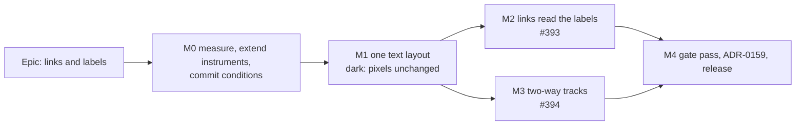

# Implementation Plan: Links that read the labels, and two-way tracks at crowded nodes

- **Status:** Approved — product owner, 2026-09-25: plan approved as written; **CQ-1 answered "accept the cost"** (FC-Q2 is recorded, never a stop); **CQ-2 answered "yes, inside the circle"** (an end exactly `PORT_OFFSET_PX` from a task node centre counts as attached). Built under this plan; recorded as ADR-0159
- **Feature spec:** [`./feature-spec.md`](./feature-spec.md)
- **Owner:** feature-analyst draft; build owner to be named on approval

## Breakdown

### Epic

**Links and labels.** The router reads the painter's names and dates and avoids them where it can
(#393). An arrival and a departure that must share a vertical at a crowded node are drawn as two
lines (#394). Theme: TSLD legibility.

**Scope.** `apps/web` only. No API, no schema, no migration, and the CPM engine is not imported.
`database-architect` is not engaged, because there is no schema change to design. No new `VITE_`
flag (ADR-0088 D1): each milestone is a commit boundary, and that is the rollback.

**Order is a decision.** M0 commits the conditions before M1's first commit (ADR-0142 D4). M1 lands
the extraction alone, so a placement change cannot hide inside a routing change. M2 and M3 both
depend on M1 and not on each other, so M3 can proceed if CQ-1 stops M2. `docs/TECH_DEBT.md` #382 is
not in this plan and is recommended next, measured on this epic's router (spec §1.8).

---

### Milestone M0: Measure first, extend the instruments, commit the conditions

**Outcome:** today's numbers on today's tree, instruments that can see what M2 and M3 change, the
`PORT_OFFSET_PX` derivation, and `conditions.md` with every bar filled.
**Entry point:** `Ships dark: scripts and documents only; no product change.`
**Journey:** none (no user-facing change).

#### Feature: The instruments

> **Description:** extend `attachment-probe.ts` and add an opposed-pair listing, so M2 and M3 are
> judged by counters that see text by kind, residue tracks by kind, and offset ends.
> **Complexity:** M
> **Dependencies:** none
> **Risks:** an instrument change moves an existing baseline → every extension is additive, and the
> existing fields are required to reproduce today's values exactly, recorded in `m0-baseline.md`.
> **Testing requirements:** the probe's self-test extended; each new counter verified red against a
> hand-built case.

##### Task M0-T1 — Re-baseline on today's tree

- **Description:** run `node scripts/measure-attachment.mjs --json` on the four fixtures (`brief`,
  `small-17`, `reference-netpoint`, Unit 300) at 1, 4 and 12 px/day and pans 0, 32, 200 and 500, plus
  the 200-shuffle check. Record whether every pan agrees in each cell. The #393 row's figures are
  from before ADR-0158's phase 3 (spec §0.1), so this is the baseline every bar reads.
- **Complexity:** S
- **Dependencies:** none
- **Risks:** a reading that differs from ADR-0158's amendment table → reported, not reconciled away.
  The amendment table sums four pans. Say which form each cell uses.
- **Testing:** n/a (a measurement).
- **Development steps:**
  1. Run twice; record both runs and the fingerprints.
  2. Write `docs/specs/links-and-labels/m0-baseline.md`.

##### Task M0-T2 — Text by kind, a point-by-point control, and the opposed-pair listing

- **Description:**
  - `attachment-probe.ts`: split `textCrossings` by the text's kind (name, date, milestone date,
    centre item) and by the crossing segment's orientation, and count crossings of wrapped name
    lines separately (FC-W4). Classify a recorded text by its row band from `rowSlots`, and say so in
    the docblock (M1 replaces this with the module's own kinds).
  - Add a **point-by-point control**: the probe's own `routeFrame` lines (`attachment-probe.ts:282`)
    must equal the painter's stroked link polylines, not only in count. After M2 a probe that routed
    without the painter's text index would then throw rather than measure a copy.
  - Add `scripts/opposed-probe.ts`, committing the scratch listing the #394 row describes: every
    opposed pair left after phase 3, its track orientation, its kind (crowded shared node /
    arrive–leave at an unshared node / escape through a bar / other), the glyph kind at each anchored
    end of each segment, and each link's best zero-opposed candidate with its score (the "escape
    through a bar" evidence). Also report whether each pair is **absorbable** (spec §4.7).
- **Complexity:** M
- **Dependencies:** none
- **Risks:** classifying text by row band misreads a legacy inside label → the legacy placement is
  unreachable while `rowReservesTextRows()` holds (`geometry.ts:851-853`); the probe throws if it
  meets a text outside every band.
- **Testing:** self-test cases: a vertical through a name (counted as a name, vertical); a gutter run
  beside a date (not counted); a crowded shared node pair (classified); a pair ending at an embed
  (not absorbable). Each verified red against the obvious mistake named beside it.
- **Development steps:**
  1. Extend the probe; run; confirm the old fields reproduce M0-T1 exactly.
  2. Write the listing; run on `small-17` and Unit 300; commit the listing to `m0-baseline.md`.

##### Task M0-T3 — `PORT_OFFSET_PX`, and what an offset does to today's judge

- **Description:** the #394 row asks for this measurement before any change.
  1. Compute the derivation (spec §4.7) from the constants as a derivation test in the style of
     `geometry.constant-derivation.test.ts`, kept in the scratch branch until M3. If the lower bound
     exceeds the upper, record it: M3 is withdrawn before it starts.
  2. In the harness only (never the product), apply ±δ by travel direction to the absorbable residue
     tracks and run the **unamended** judge. Record what it reports: expected, from reading
     `attachment-probe.ts:110-132` and `:369-376`, offset ends misread as embeds and each offset end's
     own node counted as a false junction. That is the reading that shows the judge must be amended
     explicitly rather than tuned.
  3. Run a draft amended judge on the same output: 0 unattached ends, and the existing self-test
     plus the three new cases (δ attached, δ + 1 unattached, offset at an embed unattached).
  4. Render the prototype's picture of the two worst crowded nodes on `small-17` and Unit 300, for
     CQ-2.
- **Complexity:** M
- **Dependencies:** M0-T2
- **Risks:** the prototype is mistaken for the design → it lives only in a scratch script, recorded
  as such; M3 rebuilds it in the product with guards.
- **Testing:** the derivation test; the self-test cases.
- **Development steps:**
  1. Derive; prototype; judge twice; render; record.

##### Task M0-T4 — The width table's size and cost

- **Description:** instrument `truncateToWidth` in a harness to record every `(font, text)` key the
  current placement code asks for, over the four fixtures and at 300 generated activities, across
  zooms and random lane layouts. Confirm it is contained in the O(Σ label length) set the spec names
  (§4.4). Measure the set's size and its build time through the real `labelWidths` memo in Chromium.
- **Complexity:** S
- **Dependencies:** none
- **Risks:** a key outside the set (a call pattern the spec missed) → the spec's §4.4 is corrected
  before M2, and the finding is recorded rather than worked round.
- **Testing:** n/a (a measurement), kept as the seed of M2-T3's property test.
- **Development steps:**
  1. Record keys; compare with the set; time the build; record.

#### Feature: Baseline and conditions

> **Description:** cost in one sitting, then the committed conditions.
> **Complexity:** S
> **Dependencies:** M0-T1 to M0-T4
> **Risks:** machine noise larger than the bar → spread beside every figure; ADR-0128's
> INDETERMINATE rule.
> **Testing requirements:** reproducible by one command each.

##### Task M0-T5 — Cost baseline, one sitting

- **Description:** `scripts/measure-route-cost.mjs` gains a `paintScene` p95 limb on the same
  `scale-2000` Week scene, and takes three Tidy runs instead of two. Run `routeFrame` p95,
  `paintScene` p95 and Tidy on Unit 300 in one sitting on node 22. Run
  `PLANS=scale300 scripts/measure-netpoint-optimise.mjs` once.
- **Complexity:** S
- **Dependencies:** none
- **Risks:** a baseline from another sitting → M2 and M3 re-take the baseline interleaved with the
  new build; this reading sets the order of magnitude, not the comparison.
- **Testing:** n/a.
- **Development steps:**
  1. Extend the harness; run; record with spreads.

##### Task M0-T6 — Commit `conditions.md`

- **Description:** copy spec §4.10 into `docs/specs/links-and-labels/conditions.md` with M0's numbers
  in place, and the CQ-1 and CQ-2 answers (or their defaults). Commit it alone, **before** M1's first
  commit.
- **Complexity:** S
- **Dependencies:** M0-T1 to M0-T5; CQ-1 and CQ-2 answered or defaults taken
- **Risks:** a bar tuned to the answer → the bars are the spec's, written before any baseline; only
  reference numbers are filled in.
- **Testing:** n/a.
- **Development steps:**
  1. Fill in; commit.

---

### Milestone M1: One text layout (dark)

**Outcome:** names, dates and centre items are placed by one pure module that the painter draws.
The picture does not change.
**Entry point:** `Ships dark: the painter draws exactly what it drew before; M2 gives the router the
module's output.`
**Journey:** none (no user-facing change). The existing `e2e-netpoint-grammar/text.spec.ts` must
pass unedited, which is part of FC-W1.

#### Feature: Extract the placement

> **Description:** spec §4.2.
> **Complexity:** L
> **Dependencies:** M0-T6
> **Risks:** a branch reordered or a `?? false` inverted in the move → FC-W0 agreement on four
> fixtures, FC-W1 golden byte-identical, and every comment moved verbatim (ADR-0078 §3).
> **Testing requirements:** unit tests per branch; the agreement harness; the golden log unedited;
> the text budget suites unedited.

##### Task M1-T1 — `row-text-layout.ts`

- **Description:** move the placement logic of layers 3.6 (`paint.ts:2333-2524`), 3.7
  (`:2526-2764`) and 3.8 (`:2766-2844`) into a pure function taking `rows`, `view`, `size`,
  toggles, tier, `visualRefresh`, `reservesTextRows`, `measure(text, font)` and `labelOf`. Return
  `PlacedText` items (ink box and line box) and `WrapProposal`s (spec §4.2). Keep the legacy
  inside/beside and plated-flank branches.
- **Complexity:** L
- **Dependencies:** M0-T6
- **Risks:** the module and the painter both still hold a copy → M1-T2's structural test.
- **Testing:** one case per branch, each lifted from the layer's existing comment: halved gap with no
  zero clamp (FC-N6a's milestone overlap), first-in-row free centring, visible-part centring (#380),
  lone ellipsis suppressed, milestone bold measured under its own key, milestone single date, dates
  inside / one per node (#379) / flanking / none, node text inset, and the centre item's full, short
  and none forms.
- **Development steps:**
  1. Move code and comments verbatim into the function.
  2. Write the cases against the recording context's fixed-width measure.

##### Task M1-T2 — The painter draws the module's items

- **Description:** `paintScene` calls the module once, before the edge layer, with
  `measure = (t, f) => labelWidths.measure(t, (x) => { ctx.font = f; return ctx.measureText(x).width; }, f)`.
  It draws items in layers 3.6–3.8 at their current positions in the log, resolves each wrap against
  `routed.lines` exactly as today, and seeds `placedText` from the items' line boxes instead of from
  `noteText`. Add a structural test refusing `truncateToWidth`, `wrapTwoLines` and `dateLabelSlot`
  calls in `paint.ts`, with comments stripped first (ADR-0106's scan-matching-prose lesson) and a
  pinned positive case.
- **Complexity:** M
- **Dependencies:** M1-T1
- **Risks:** a cold memo now writes `ctx.font` earlier in the frame → every layer that draws text
  already sets its font before `fillText`. A cold-memo case asserts the `fillText` sequence is
  unchanged. The golden test warms its memo (`paint.golden.test.ts:274-284`), so its log is predicted
  byte-identical.
- **Testing:** golden log unedited; `paint.dates-budget.test.ts`, `paint.centre-item-budget.test.ts`,
  `paint.netpoint-text.test.ts` and `lod-tier.structural.test.ts` unedited; the structural test
  verified red by leaving one `truncateToWidth` in place.
- **Development steps:**
  1. Write the prediction ("byte-identical") first.
  2. Rewire; run; compare.

##### Task M1-T3 — The text index and FC-W0

- **Description:** `text-index.ts`: `textIndexOf(items)` groups ink boxes by lane, sorted, with the
  widest box kept for binary search, in the glyph index's shape (`link-score.ts:48-57`). Not yet read
  by the router. Add FC-W0 to the probe: the module's items against the recorded `fillText` calls,
  four fixtures × three zooms × four pans. The probe now reads text kinds from the module rather than
  from row bands.
- **Complexity:** M
- **Dependencies:** M1-T2
- **Risks:** the agreement check passes vacuously because both sides are empty → a pinned count of
  items per fixture and zoom, taken from M0.
- **Testing:** FC-W0 verified red by perturbing the module (drop the halved gap) and watching the
  agreement fail; index unit tests (lane grouping, binary-search bound).
- **Development steps:**
  1. Index; agreement check; red run; record in `m1-verdict.md`.

##### Task M1-T4 — Judge M1

- **Description:** FC-W0, FC-W1 and FC-Q1's `paintScene` limb (a move must not cost), in one sitting
  against M0's tree. Write `m1-verdict.md`. No changeset: nothing a user sees has changed.
- **Complexity:** S
- **Dependencies:** M1-T3
- **Risks:** a cost within noise read as a pass → ADR-0128's rule, spread stated.
- **Testing:** the measurements; `pnpm prepush`; `scripts/e2e-local.sh web:netpoint-grammar`.
- **Development steps:**
  1. Measure; write; commit.

---

### Milestone M2: Links read the labels (#393)

**Outcome:** on every plan, a link avoids names and dates where a shape exists that avoids them
without adding a bar, an opposed pair, a crossing or an overlap. A lag plate gets room where a route
leaves it some. Tidy scores the same routes.
**Entry point:** the TSLD diagram itself, on any plan with links and labels (there is no control to
press). The guest view, the export and the printed diagram follow from the same painter. Tidy and
Re-layout are reached from **Arrange** (`e2e-arrange/arrange.spec.ts`).
**Journey:** `apps/web/e2e-netpoint-grammar/links.spec.ts` gains "a link runs round a name rather than
through it where it can", under the existing `playwright.netpoint-grammar.config.ts` (no new config
or CI step). It seeds, through the API with the pen enforced, a predecessor and successor two lanes
apart with an activity between them whose long name sits where today's vertical runs, recalculates,
and reads canvas pixels: no link ink inside the name's ink box, and link ink present on the
alternative shape (the control). **Written first and verified red against the shipped build**
(ADR-0081).

#### Feature: The text term

> **Description:** spec §4.3.
> **Complexity:** L
> **Dependencies:** M1
> **Risks:** a harness or caller keeps routing text-blind → `text` is a required argument; the
> probe's point-by-point control from M0-T2.
> **Testing requirements:** unit, property (FC-T5), counting gate, golden, journey, harness.

##### Task M2-T1 — Score text, then plates

- **Description:** `routeFrame(scene, view, visibleIds, byId, rectCache, text: TextIndex | null)`,
  required. `routeNodeToNodeParts` scores `text` beside `obstructionCounts`, and `plateBlocked` for a
  lagged link at the detail tier (spec D-5), using `lagPlateCandidates` and `freePlatePosition`
  against the index's line boxes and the glyph boxes. The compare functions take D-1's order in all
  three phases.
- **Complexity:** M
- **Dependencies:** M1-T3
- **Risks:** the plate term's cost on lagged links → it runs only at the detail tier, only for a lag,
  and is counted in the budget gate.
- **Testing:** a tie broken by text (phase 1); a crossing never traded for text (phase 2); an opposed
  pair never traded for text (phase 3); a plate given room; the phase-2 early exit still returns the
  phase-1 pick when it has no crossing and no overlap; `paint.routing-budget.test.ts` extended to
  bound text queries per candidate.
- **Development steps:**
  1. Term; order; cases.
  2. Plate sub-term; cases.

##### Task M2-T2 — Every caller passes the index

- **Description:** the painter passes `textIndexOf(items)`. `layoutLines` and `evaluateLayout`
  (`layout-objective.ts:77-126`) build the module's layout at the reference zoom with a `measure`
  they are given (required), and pass its index. `attachment-probe.ts`, `shuffleDifferences`,
  `netpoint-evaluate.ts`, `measure-route-cost.mjs` and the route-frame unit tests pass the same
  index the painter would. The revision overlay's `lineOf` reuse (`route-frame.ts:65-69`) keeps the
  frame's index.
- **Complexity:** M
- **Dependencies:** M2-T1
- **Risks:** a harness passes `null` to make a failing number go away → a grep over `apps/web/scripts/`
  for `routeFrame(` with `null`, recorded in the verdict; the probe's point-by-point control.
- **Testing:** `pnpm typecheck` finds every caller; the probe's control passes on all four fixtures.
- **Development steps:**
  1. Thread the argument; fix each caller; record the list.

##### Task M2-T3 — The width table across the worker boundary

- **Description:** `OptimiseRequest` gains `textWidths: [string, number][]` (key = font + text) and
  `textToggles`. `use-arrange-search.ts` builds the table from the drawn activities through
  `labelWidths` (spec §4.4). The worker's `measure` looks up and throws on a miss.
  `handleOptimiseRequest` passes it to `optimiseLayout`, which passes it to `evaluateLayout`.
- **Complexity:** M
- **Dependencies:** M2-T2, M0-T4
- **Risks:** a key the table lacks → the property test below. A table built before the face loads →
  it holds the widths the painter is using at that moment, which is the property wanted, and a case
  says so.
- **Testing:** a completeness property test (the module with a recording measurer over the fixtures,
  random lane layouts and view widths; every requested key is in the table); a protocol test that a
  missing key produces `failed`, not a silent width; `e2e-arrange/arrange.spec.ts` and `e2e-csp` re-run
  (the worker still loads under the production CSP).
- **Development steps:**
  1. Builder; protocol; worker lookup.
  2. Property test from M0-T4's key recorder.

##### Task M2-T4 — Golden log and budgets

- **Description:** re-baseline `render/__snapshots__/paint.golden.test.ts.snap` **by hand against a
  written prediction** (never `-u`, ADR-0034): which links in the maximal scene meet text today, which
  shapes change, and the per-method deltas. The flag-off log must not change. If the scene contains
  no link that meets text, say so, and pin the behaviour in unit cases instead.
- **Complexity:** M
- **Dependencies:** M2-T1
- **Risks:** a re-baseline that absorbs an unpredicted change → a deliberately wrong prediction is
  shown to fail once, as node-to-node M2-T3 did.
- **Testing:** the golden log; `paint.routing-budget.test.ts`; `paint.link-marks-budget.test.ts`.
- **Development steps:**
  1. Predict; regenerate; compare by script; commit the audited hunks.

##### Task M2-T5 — Journey and sweep

- **Description:** write the journey (above) against the shipped build and see it fail. Land it with
  M2-T1. Re-run `e2e-netpoint-grammar`, `e2e-arrange`, `e2e-export` and `e2e-csp`, then the full sweep
  (`scripts/e2e-sweep.sh`).
- **Complexity:** M
- **Dependencies:** M2-T1 to M2-T3
- **Risks:** a pixel assertion passing for the wrong reason → the control (link ink on the
  alternative shape) and the red run.
- **Testing:** the journey; the sweep.
- **Development steps:**
  1. Write; red; land; sweep.

##### Task M2-T6 — Judge M2

- **Description:** FC-W2–W6, FC-T5 and FC-Q1–Q4, cost in one sitting with builds interleaved. Write
  `m2-verdict.md` with pictures of the four fixtures before and after. Add a changeset (`feat(web)`).
  - **If FC-W3 is missed** (a crossing, hidden link, opposed pair or overlap rose): stop, list the
    pairs, and go to the product owner.
  - **If FC-Q2 is missed on the first reading:** build the per-lane layout memo (spec §4.9) as
    **M2-T6b**, with its own test that the memo returns identical items, and re-measure. If it is
    still missed, **stop**. The product owner chooses among CQ-1's options, and M3 may proceed.
  - **If FC-W5 moves no cell:** withdraw the plate sub-term and record why.
- **Complexity:** S (M with M2-T6b)
- **Dependencies:** M2-T5
- **Risks:** a verdict read generously → every bar was committed at M0.
- **Testing:** the measurements.
- **Development steps:**
  1. Measure; judge; write; changeset.

---

### Milestone M3: Two-way tracks at crowded nodes (#394)

**Outcome:** an arrival and a departure that phase 3 could not separate are drawn as two parallel
lines, one each way, both entering the node's disc. No other line moves.
**Entry point:** the TSLD diagram itself, on any plan with a crowded shared node (no control to
press).
**Journey:** `apps/web/e2e-netpoint-grammar/links.spec.ts` gains "two links on one track at a crowded
node are drawn apart". It seeds a crowded shared node that phase 3 cannot separate (M0-T2's listing
names the shape), recalculates, and scans a horizontal pixel row across the track just outside the
node's rim: **two** separate runs of link ink, and the node's rim present (the control). Written
first and verified red against the shipped build (one run).

#### Feature: Split residue tracks

> **Description:** spec §4.7.
> **Complexity:** M
> **Dependencies:** M1 (the text guard reads the index); M0-T3 (the derivation, and its verdict)
> **Risks:** the pass moves a line it should not → guards evaluated on the pre-pass picture; FC-K3
> fingerprints identical wherever M0 found nothing to do.
> **Testing requirements:** unit and property tests, derivation test, amended judge, journey.

##### Task M3-T1 — `link-tracks.ts`

- **Description:** after phase 3 and before `packGutterChannels` (`route-frame.ts:270-293`), find
  every vertical track still carrying an opposed overlap. Move each down-travelling segment on it to
  one side by `PORT_OFFSET_PX` and each up-travelling one to the other, together with same-direction
  segments sharing the track. Adjacent horizontals change length accordingly. Apply only where every
  moved anchored end is a task node, and every guard in spec §4.7 passes against the pre-pass
  picture. Return the lines and a count of refused tracks by reason.
- **Complexity:** M
- **Dependencies:** M0-T3, M1-T3
- **Risks:** order dependence → the pass is a function of the segment set; the 200-shuffle property.
- **Testing:** a crowded shared node separated; a V link on one side at both ends; a same-direction
  bus kept together; each guard refusing its case (stub, obstruction, hidden leg, text, crossing,
  occupied target); an embed end left; a frame with no opposed pair returned untouched (identity, not
  equality); `route-frame.opposed.test.ts` unedited.
- **Development steps:**
  1. Derivation constant `PORT_OFFSET_PX` in `render-model.ts` with its derivation test.
  2. The pass; the cases; wire it.

##### Task M3-T2 — The arrowhead and the judge

- **Description:** `headLineFor` (`paint.ts:1429-1445`) recognises a tip exactly `PORT_OFFSET_PX` from
  a node centre and trims √(`NODE_REACH_PX`² − δ²) along the line, so the head still stops at the rim.
  The probe's `endSpecOf` accepts an end at the anchor or exactly δ from a task-node anchor,
  perpendicular to its end segment (spec §4.7). Its false-junction own-anchor exemption becomes by
  activity id. Re-measure M0's baseline with the amended judge.
- **Complexity:** S
- **Dependencies:** M3-T1
- **Risks:** the amended judge is vacuous → the existing self-test verdicts reproduce, and the three
  new cases (δ attached, δ + 1 unattached, offset at an embed unattached) are each verified red
  against a judge that accepts "within δ".
- **Testing:** `paint.netpoint-text.test.ts` gains an offset-tip head case; the self-test.
- **Development steps:**
  1. Head trim; judge; re-baseline; cases.

##### Task M3-T3 — Golden, journey, verdict

- **Description:** a written prediction for the golden log. If the maximal scene has no residue track
  after phase 3 (M0-T2 says), the prediction is byte-identical, and a unit scene pins the pass
  instead. Write the journey (above), red first. Judge FC-K0–K5, FC-T5 and FC-Q1–Q2 in
  `m3-verdict.md`, with before-and-after pictures of the worst crowded nodes on `small-17` and Unit
  300 for the product owner (CQ-2). Changeset (`feat(web)`).
- **Complexity:** M
- **Dependencies:** M3-T2
- **Risks:** the pictures read as "beside the node" → CQ-2 withdraws M3 without touching M1–M2; the
  pass is one module and one call site.
- **Testing:** the golden log; the journey; `e2e-netpoint-grammar`, `e2e-arrange`, `e2e-export` and
  the sweep; the measurements.
- **Development steps:**
  1. Predict; journey red; land; sweep; measure; write; pictures to the product owner.

---

### Milestone M4: Gate pass, ADR-0159, release

**Outcome:** the combined work reviewed, recorded and released.
**Entry point:** as M2 and M3.
**Journey:** as M2 and M3.

#### Feature: Reviews and records

> **Description:** specialist reviews over M1–M3 together; ADR-0159; docs.
> **Complexity:** M
> **Dependencies:** M2 and M3 (or whichever of them the product owner kept)
> **Risks:** a defect in the seam between two milestones, invisible to either (ADR-0152's M6 found
> one) → reviewers read the combined diff.
> **Testing requirements:** every blocking fix carries a test verified red first.

##### Task M4-T1 — Reviews

- **Description:** run, over the combined diff:
  - **component-reviewer**: the module's API, the required `text` argument, the protocol change, and
    whether every comment moved verbatim.
  - **performance-reviewer**: FC-Q1–Q4 re-derived from the final code, the per-lane memo if built,
    and the counting gates.
  - **ux-reviewer**: on rendered pictures of all four fixtures at three zooms (text avoidance, plates,
    crowded nodes).
  - **accessibility-reviewer**: that nothing a reader relies on moved (the listbox, the spoken logic
    summary, contrast), and that two offset lines stay separable without colour (WCAG 1.4.1; they
    differ by direction marks and position, never hue).
  - **test-engineer**: the two journeys and the completeness property.
  - `database-architect` is not engaged (no schema change). `security-reviewer` is not needed: the
    worker message carries widths of strings already on the client.
- **Complexity:** M
- **Dependencies:** M2-T6, M3-T3
- **Risks:** none beyond findings.
- **Testing:** fixes with red-first regression tests; the rest filed in `docs/TECH_DEBT.md`.
- **Development steps:**
  1. Run; fold blocking findings; file the rest.

##### Task M4-T2 — ADR-0159 and docs

- **Description:** file ADR-0159 (spec §4.12). Add its CLAUDE.md §16 entry and its
  `docs/adr/README.md` row (`check:adr-coverage` refuses either missing). In `docs/TECH_DEBT.md`,
  close #393 and #394 into the ledger with their measured results, and update #391 item 11 with the
  new count. Check `docs/DESIGN_SYSTEM.md` and `docs/TEST_PLAYBOOK.md` for link-attachment claims. Set
  this spec's and plan's status. Note in #382's row that its measurements must be taken on this
  router.
- **Complexity:** S
- **Dependencies:** M4-T1
- **Risks:** a doc still saying ends sit on the node centre → grep for "node centre", "attached" and
  "unattached" across `docs/`.
- **Testing:** `pnpm prepush` (every `check:*` gate).
- **Development steps:**
  1. Write; run the gate; release.

## Sequencing & slices

1. **M0** (docs and scripts only). `conditions.md` lands in its own commit before M1.
2. **M1** (dark extraction). Pixels unchanged; `main` stays releasable.
3. **M2** (#393, visible). One slice: the term, the callers, the worker table, the golden log and the
   journey land together, because a router scoring text the Tidy worker cannot see would give Tidy a
   different picture from the canvas.
4. **M3** (#394, visible). Its own slice and release, independent of M2's cost outcome.
5. **M4** (reviews, ADR-0159, docs). The epic is complete here.

No `VITE_` flag. The existing `VITE_CANVAS_LINK_ROUTING` stays, and its flag-off path is untouched.

## Definition of Done (per task)

Each task's PR must satisfy the Feature Completion Criteria in
[`docs/PROCESS.md`](../../PROCESS.md) (code, tests, docs, security, performance, accessibility,
Docker build, CI, changelog, version impact). `pnpm prepush` is run, and
`scripts/e2e-local.sh web:netpoint-grammar` for any task touching the painter, the router or the
journey; `web:arrange` for any task touching Tidy.

## Risks & assumptions (rollup)

| Risk / assumption                                                    | Likelihood          | Impact | Mitigation                                                                                      |
| -------------------------------------------------------------------- | ------------------- | ------ | ----------------------------------------------------------------------------------------------- |
| Tidy's cost past CQ-1's bar                                          | med                 | med    | FC-Q2 stops the work; per-lane memo as (d); product owner decides; M3 independent of M2.        |
| The extraction changes a placement                                   | med                 | high   | FC-W0 agreement, FC-W1 golden byte-identical, structural test, comments verbatim.               |
| Crossings of other links shift when phase 1 ranks text before length | med                 | low    | FC-W3 caps them; a rise stops the work, listed pair by pair.                                    |
| A harness routes text-blind after M2                                 | high if unaddressed | high   | Required `text` argument; the probe's point-by-point control against the painter's strokes.     |
| The width table misses a key                                         | low                 | med    | Completeness property test; a loud `failed` on a miss.                                          |
| The δ window is empty or the pictures read as detached               | med                 | med    | M0-T3 derivation can withdraw M3 before it starts; CQ-2 with pictures at M3; exact-δ judge.     |
| The golden scene reaches neither text avoidance nor a residue track  | med                 | med    | Written predictions name what it reaches; unit scenes pin the rest.                             |
| Instruments were wrong before the product in the last four epics     | high                | med    | Every new counter verified red against a named mistake; old counters must reproduce M0 exactly. |
| #382 measured on the old router                                      | med                 | med    | Out of scope here; M4-T2 records in #382's row that its figures must be taken on this router.   |
