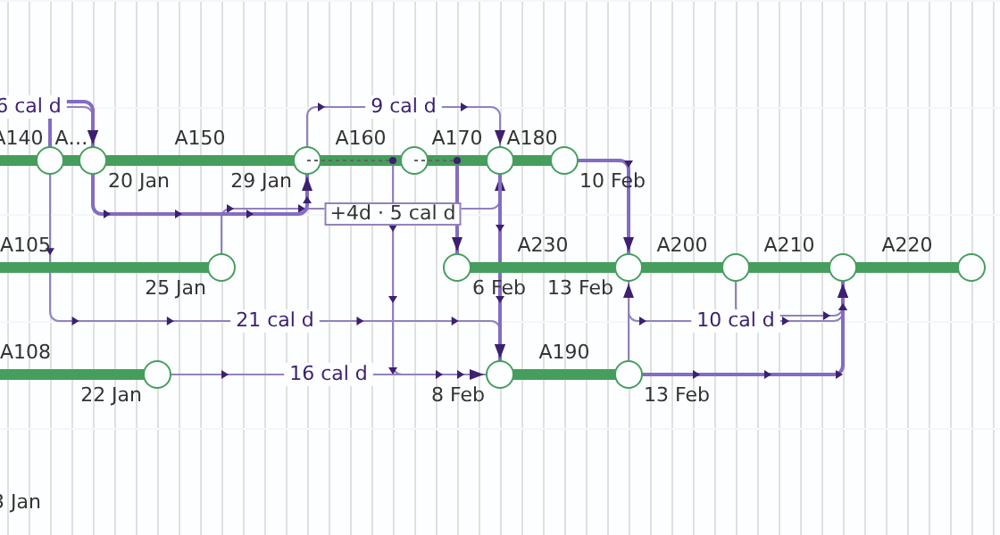
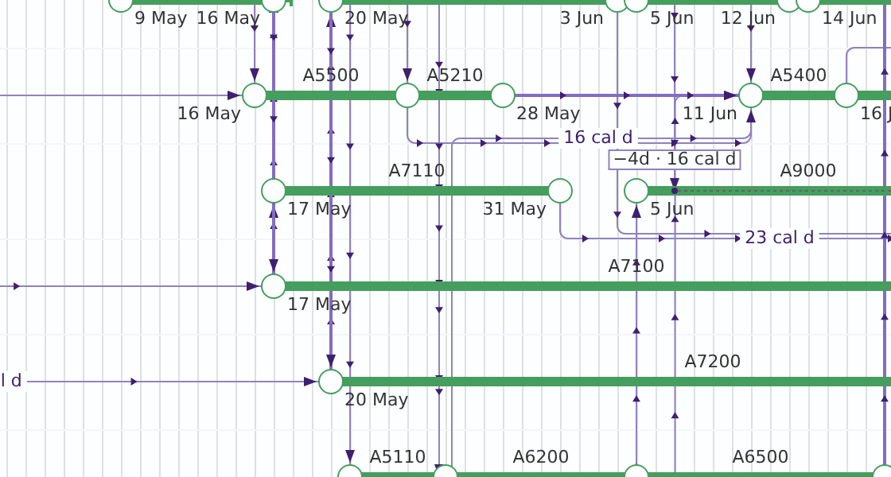

# M0 baseline: links and labels

**Status:** Measured 2026-09-25 on commit `f35e635e` (node v22.22.2, headless Chromium from
`/opt/pw-browsers`). Every figure here names the script that produced it, run from `apps/web`.
[`conditions.md`](./conditions.md) takes its reference numbers from this file and nothing else.

## T1: the re-baseline on today's tree

`node scripts/measure-attachment.mjs --json`: four fixtures, zooms 1, 4 and 12 px/day, pans 0, 32,
200 and 500. **Every count agrees across the four pans**, so every condition is judged on one pan
reading (pan 32). Only the fingerprints differ between pans, because they hash absolute
coordinates.

| Plan               | px/day | Unattached | False junctions | Overlaps | Opposed | Text × | Crossings | Occluded | Gap labels | Plates | Plates on text | Bends |
| ------------------ | -----: | ---------: | --------------: | -------: | ------: | -----: | --------: | -------: | ---------: | -----: | -------------: | ----: |
| brief              |      1 |          0 |               1 |        0 |       0 |      6 |         0 |        0 |          0 |      0 |              0 |     8 |
| brief              |      4 |          0 |               0 |        0 |       0 |      4 |         0 |        0 |          0 |      0 |              0 |     6 |
| brief              |     12 |          0 |               0 |        0 |       0 |      0 |         0 |        0 |          1 |      2 |              0 |     4 |
| small-17           |      1 |          0 |              56 |        0 |       3 |     17 |         9 |        0 |          0 |      0 |              0 |    26 |
| small-17           |      4 |          0 |               2 |        0 |       3 |      7 |         7 |        0 |          1 |      0 |              0 |    22 |
| small-17           |     12 |          0 |               0 |        0 |       2 |      5 |         7 |        0 |          5 |      3 |              0 |    21 |
| reference-netpoint |      1 |          0 |               0 |        0 |       0 |      7 |         1 |        0 |          0 |      0 |              0 |    26 |
| reference-netpoint |      4 |          0 |               0 |        0 |       0 |     10 |         1 |        0 |         17 |      0 |              0 |    26 |
| reference-netpoint |     12 |          0 |               0 |        0 |       0 |     10 |         1 |        0 |         17 |      4 |              0 |    26 |
| Unit 300           |      1 |          0 |             369 |       21 |      32 |    163 |       348 |        9 |          0 |      0 |              0 |   195 |
| Unit 300           |      4 |          0 |              95 |       14 |      28 |    165 |       349 |        8 |         28 |      0 |              0 |   176 |
| Unit 300           |     12 |          0 |              14 |       10 |      23 |     93 |       344 |        6 |         35 |     32 |              0 |   177 |

Links routed: brief 6, small-17 29, reference-netpoint 68, Unit 300 188. Fingerprints (pan 32), which
FC-K3 holds fixed where M3 has nothing to do:

| Plan               | 1 px/day       | 4 px/day       | 12 px/day      |
| ------------------ | -------------- | -------------- | -------------- |
| brief              | `48f45e64fee8` | `7b762ca8d2a9` | `fff575ab47a0` |
| small-17           | `e59054d22e86` | `e9a294ae1b48` | `71823d99deaa` |
| reference-netpoint | `f4626a071713` | `f63fcb067e80` | `47df2f3f148a` |
| Unit 300           | `677f53b45d33` | `f58d75c056cd` | `6cee9ff6573c` |

### Node-to-node's FC-T6 is already missed in two cells

FC-T6 (`node-to-node-links/conditions.md`, "FC-T6") set text-crossing bars of brief ≤ 6 / 3 / 0 and
small-17 ≤ 8 / 7 / 5. Today's tree reads **brief 4 at 4 px/day** and **small-17 17 at 1 px/day**. The
other ten cells are inside their bars. This is the miss FC-W2 exists to close. It is recorded here
because a bar that a later change quietly crossed looks, in the next epic's documents, exactly like a
bar that was always met.

## T2: what the links cross, and the opposed pairs

**Text crossings by kind** (the probe's `textCrossingsByKind`, which classifies each text by its row
band from `rowSlots`, and throws on a text outside every band):

| Plan               | px/day | Name | Wrapped name | Date | Milestone date | Centre item | Horizontal / vertical |
| ------------------ | -----: | ---: | -----------: | ---: | -------------: | ----------: | --------------------: |
| brief              |      1 |    6 |            0 |    0 |              0 |           0 |                 0 / 6 |
| brief              |      4 |    1 |            0 |    3 |              0 |           0 |                 0 / 4 |
| small-17           |      1 |   17 |            0 |    0 |              0 |           0 |                0 / 17 |
| small-17           |      4 |    5 |            0 |    2 |              0 |           0 |                 0 / 7 |
| small-17           |     12 |    2 |            0 |    3 |              0 |           0 |                 0 / 5 |
| reference-netpoint |      1 |    7 |            0 |    0 |              0 |           0 |                 0 / 7 |
| reference-netpoint |      4 |    4 |            0 |    0 |              6 |           0 |                0 / 10 |
| reference-netpoint |     12 |    4 |            0 |    0 |              6 |           0 |                0 / 10 |
| Unit 300           |      1 |  163 |            0 |    0 |              0 |           0 |               0 / 163 |
| Unit 300           |      4 |  102 |            0 |   55 |              8 |           0 |               0 / 165 |
| Unit 300           |     12 |   45 |            0 |   37 |             11 |           0 |                0 / 93 |

**Every text crossing today is a vertical segment**, as spec §4.3 predicted. At 1 px/day every one is
a name, because the date tier withholds dates below 4 px/day. No wrapped name is crossed in any cell,
and the centre item is off by default so it is never crossed.

**Opposed pairs** (`node scripts/measure-opposed.mjs`, which reads `routeFrame`'s final lines and
holds its recomputed candidates to the drawn shape):

| Plan     | px/day | Pairs | Absorbable | Kinds                                                                                             |
| -------- | -----: | ----: | ---------: | ------------------------------------------------------------------------------------------------- |
| small-17 |      1 |     3 |          3 | crowded shared node 3                                                                             |
| small-17 |      4 |     3 |          3 | crowded shared node 3                                                                             |
| small-17 |     12 |     2 |          2 | crowded shared node 2                                                                             |
| Unit 300 |      1 |    32 |         15 | crowded 15 (8 abs.), escape through a bar 12 (6 abs.; 1 horizontal), unshared 2, other 3 (1 abs.) |
| Unit 300 |      4 |    28 |         16 | crowded 11 (8 abs.), escape 13 (6 abs.), unshared 3 (1 abs.), other 1 (1 abs.)                    |
| Unit 300 |     12 |    23 |         11 | crowded 8 (7 abs.), escape 11 (3 abs.; 1 horizontal), unshared 3, other 1 (1 abs.)                |

brief and reference-netpoint have no opposed pair at any zoom. **FC-K0 passes**: both named plans
have absorbable pairs. The non-absorbable residue on Unit 300 is 17 / 12 / 12, and **every one** of
those pairs either lies on a horizontal track (1 / 0 / 1) or has an end on the track at a
milestone's centre port, a span end or an embed, which an offset cannot enter. Counted from the
listing's `trackEnds`: at 1 px/day 10 have a milestone centre, 5 a span start, 3 an embed (some
pairs have two).

## T3: the port offset, and what an offset does to today's judge

**The window is [3.25, 4.5] px** (`two-way-prototype.ts` `portOffsetBounds()`, from
`ARROWHEAD_HALF_W_PX` 3, `CHEVRON_HALF_W_PX` 2.5, 1 px of ground; and `NODE_RADIUS` 7.5,
`NODE_RIM_MAX_W` 3, the widest 3 px stroke at `paint.ts:1672` and `:1740`). The lower bound is below
the upper, so M3 is not withdrawn. The prototype uses **4**, a whole pixel, which keeps a 1 px link at
the same sub-pixel phase after the move.

`node scripts/measure-two-way.mjs` splits every vertical two-way track by travel direction in a
harness only (never the product), then reads the result with both judges. The draft amended judge is
first run on today's unmoved routes, and **every count equals the shipped judge's**; the script
throws otherwise. The side each direction takes is measured three ways, because the spec fixes only
that the directions part:

| Plan     | px/day | Reading                  | Unattached | False junctions | Overlaps | Opposed | Text × | Crossings | Occluded |
| -------- | -----: | ------------------------ | ---------: | --------------: | -------: | ------: | -----: | --------: | -------: |
| small-17 |      4 | M0                       |          0 |               2 |        0 |       3 |      7 |         7 |        0 |
| small-17 |      4 | down-west, shipped judge |          0 |               3 |        0 |       0 |      6 |        10 |        0 |
| small-17 |      4 | down-west, amended       |          0 |               2 |        0 |       0 |      6 |        10 |        0 |
| small-17 |      4 | down-east, amended       |          0 |               1 |        0 |       0 |     10 |         7 |        0 |
| small-17 |      4 | fewest crossings         |          0 |               1 |        0 |       0 |     10 |         7 |        0 |
| Unit 300 |      1 | M0                       |          0 |             369 |       21 |      32 |    163 |       348 |        9 |
| Unit 300 |      1 | down-west, amended       |          0 |             379 |       18 |      19 |    164 |       344 |        9 |
| Unit 300 |      1 | fewest crossings         |          0 |             376 |       21 |      22 |    162 |       343 |        9 |
| Unit 300 |      4 | M0                       |          0 |              95 |       14 |      28 |    165 |       349 |        8 |
| Unit 300 |      4 | down-west, amended       |          0 |              97 |       10 |      16 |    169 |       352 |        8 |
| Unit 300 |      4 | fewest crossings         |          0 |              95 |       10 |      13 |    166 |       348 |        8 |
| Unit 300 |     12 | M0                       |          0 |              14 |       10 |      23 |     93 |       344 |        6 |
| Unit 300 |     12 | down-west, amended       |          0 |              16 |        7 |      12 |     96 |       349 |        6 |
| Unit 300 |     12 | fewest crossings         |          0 |              16 |        7 |      12 |     96 |       347 |        6 |

Findings:

1. **The shipped judge reads every offset end as an embed, and passes it.** Counted rather than
   inferred (`endKinds` in the reading): on small-17 at 4 px/day the split moves 9 ends, embeds go
   3 → 12 and start/finish nodes fall by the same 9; on Unit 300 at 4 px/day embeds go 19 → 49. An
   embed allows a vertical end, so every offset end is "attached" and unattached stays 0. The
   unamended judge is therefore silently permissive: a genuinely detached vertical end inside a bar
   would pass it too. This is the reason M3-T2 amends the judge explicitly rather than tuning it. The
   amended judge restores every node kind exactly.
2. **The spec's second prediction was half right.** It said each offset end's **own** node would
   count as a false junction. It does not: the probe already exempts the link's own two activities
   through its sibling set. What the shipped judge counts is the **co-located neighbour's** node at a
   crowded shared node, which the 0.5 px end-point exemption stops covering once the end moves
   (small-17 at 4 px/day: 2 → 3 shipped, 2 amended). The amended exemption, by anchor, removes it.
   What remains above M0 under the amended judge is real: the moved line passes 4 px closer to a
   foreign node (Unit 300 +10 / +2 / +2), which §4.7's glyph guard exists to refuse.
3. **No fixed side convention wins.** Down-west adds crossings on small-17 (7 → 10 at 4 px/day);
   down-east adds text crossings there (7 → 10) instead. Choosing per track by fewest crossings is
   best or joint best on Unit 300 in every cell and keeps small-17's crossings at M0 at 4 and
   12 px/day, but raises them 9 → 11 at 1 px/day. M3's guards (§4.7: no added crossing, no added
   text crossing, no new foreign glyph) will refuse some of these tracks, and FC-K1 counts each
   refusal. **M3-T1 should take the side per track as the better of the two**, a function of the
   segment set, so it stays order-independent.
4. The prototype separates every absorbable pair on small-17 (3 → 0 in every cell) and 12–13 per
   zoom on Unit 300. Its refusals are by cluster (8 / 7 / 5 clusters with a non-node end), which is
   coarser than the pair-level count above.

The amended judge's six self-test cases pass, and four named mutations each turn exactly one red:
"within δ" (δ − 1), "offset at any anchor" (embed offset), "no perpendicular check", and "anchor case
dropped".

**Pictures (CQ-2),** painted by the real painter through a bundle-time `route-frame` shim
(`node scripts/shoot-two-way.mjs`), at 12 px/day around the split track with the most segments, with
the fewest-crossings rule:

| Plan     | As shipped                                            | Split                                             |
| -------- | ----------------------------------------------------- | ------------------------------------------------- |
| small-17 |  |  |
| Unit 300 |  |  |

The arrowhead is not trimmed for the offset (that is M3-T2's `headLineFor` change), so a head on an
offset end still stops `NODE_REACH_PX` short of its tip along the line. The pairs the prototype
refuses (a milestone's centre, an embed) are still visible beside the split ones in the Unit 300
picture.

## T4: the width table

`node scripts/measure-width-table.mjs` records every `(font, text)` key the painter asks the shared
`labelWidths` memo for (`width-table-probe.ts` patches the memo in front of its cache). It covers
small-17, the reference plan and Unit 300 (both with their real names) and the 300-activity
generated plan. Each is painted at six zooms (1–24 px/day), three canvas widths (800, 1646, 4000),
four lane layouts (its own and three seeded shuffles) and three toggle sets (default, centre item on,
activity codes on).

**No key falls outside spec §4.4's predicted set** (label, every prefix plus the ellipsis trimmed and
untrimmed, the two dates, the centre item's two forms), in any scene or toggle set. Two classes the
painter asks for are deliberately outside the table: the two-line wrap (867 keys on Unit 300, since
the router does not wrap, D-4) and the link labels (gap labels and plates, O(edges)), which M2-T3
decides about when it builds the plate sub-term.

| Scene              | Activities | Σ label chars | Table keys (default) | As `[key, width][]` | Build median (min–max), two runs |
| ------------------ | ---------: | ------------: | -------------------: | ------------------: | -------------------------------- |
| small-17           |         17 |            68 |                   81 |               ~1 kB | 0.20 ms                          |
| reference-netpoint |         58 |           944 |                  847 |              ~42 kB | 2.10 ms (1.70–7.10)              |
| Unit 300           |        144 |         4,011 |                3,458 |             ~151 kB | 7.20–9.80 ms (6.20–27.90)        |
| scale-300          |        325 |         7,000 |                5,955 |             ~198 kB | 13.50–30.70 ms (10.20–42.00)     |

The build runs in Chromium through the real memo and a real 2D context, with IBM Plex Sans loaded
from the repository's own woff2 and checked loaded, median of seven cold builds. **At 300 activities
the build is under FC-Q4's 50 ms in both runs, but its worst single build was 42 ms**, so the
headroom is thinner than a median suggests. With activity codes on, Unit 300's table grows to 4,821
keys.

## T5: cost, one sitting

`node scripts/measure-route-cost.mjs` (now with a `paintScene` limb and three Tidy runs), then
`PLANS=scale300 node scripts/measure-netpoint-optimise.mjs`, one after the other on one machine:

| Reading                                                  | Run 1     | Run 2    | Run 3    | Spread  |
| -------------------------------------------------------- | --------- | -------- | -------- | ------- |
| `routeFrame` p95, scale-2000, Week, 1920×1080 (206 bars) | 6.10 ms   | 4.70 ms  |          | 1.40 ms |
| `paintScene` p95, same scene and view, DPR 1             | 13.90 ms  | 16.20 ms |          | 2.30 ms |
| Tidy, Unit 300, node (the worker proxy)                  | 7,147 ms  | 7,300 ms | 7,127 ms | 173 ms  |
| Tidy, scale-300 packed (FC-Q3)                           | 16,395 ms |          |          |         |

`routeFrame`'s p50 was 2.10 ms both runs; `paintScene`'s 8.50 and 7.90 ms. Headless Chromium
rasterises in software, so the paint figure sets an order of magnitude and a same-machine comparison,
never a claim about a planner's frame (FC-Q5 is that, and is owed). As the plan says, M1–M3 re-take
this baseline interleaved with the new build; this reading is not their comparison.
