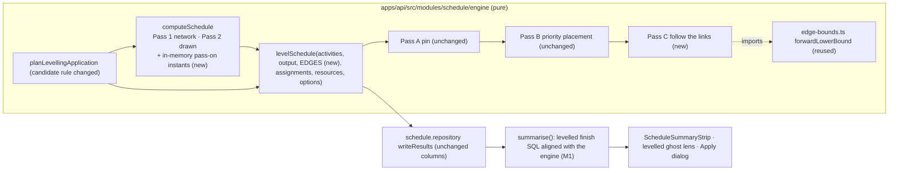
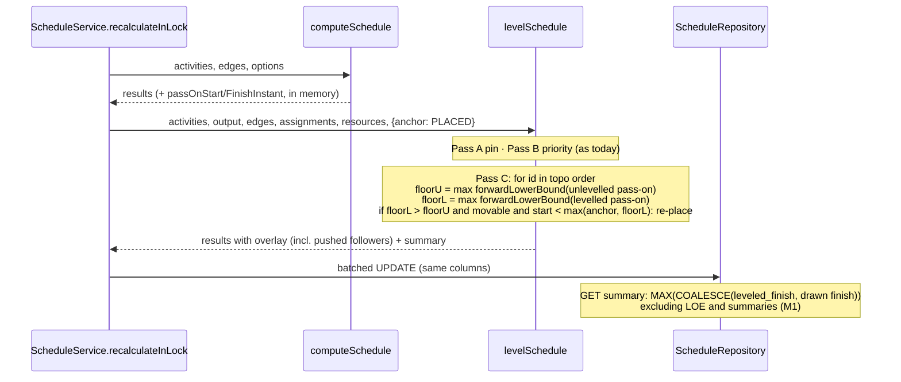
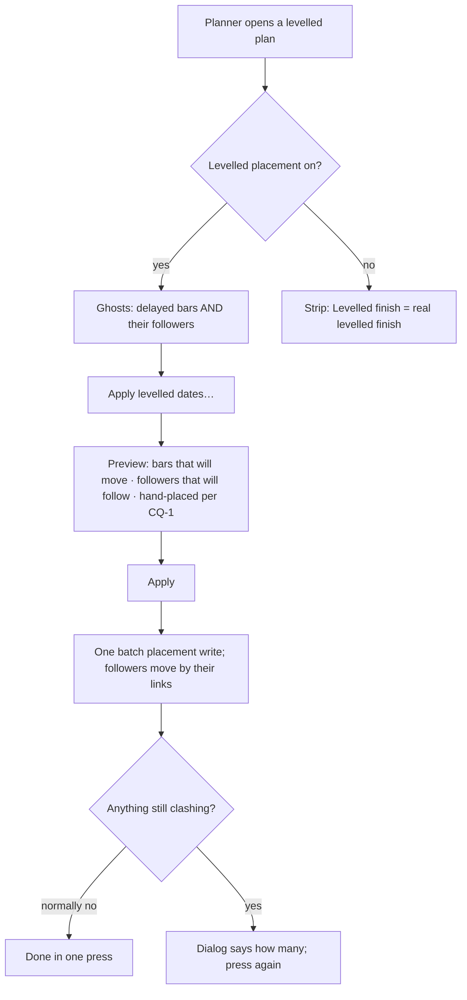

# Feature Spec: Logic-aware levelling

- **Status:** Draft — awaiting approval
- **Author(s):** feature-analyst (for the product owner)
- **Date:** 2026-10-01
- **Tracking issue / epic:** `docs/HANDOFF.md:45-47` ("Levelling ignores logic") and `:59` (candidate 4);
  closes `docs/TECH_DEBT.md` **#427**. Named as the follow-up by
  `docs/specs/apply-levelled-dates/feature-spec.md:533` and ADR-0167 (Alternatives, "Loop until nothing
  clashes").
- **Roadmap link:** none of its own; ADR-0041's Consequences name "later rungs" and this is the first
  change to the heuristic itself since ADR-0071.
- **Related ADR(s):** a new ADR is required, **ADR-0168** (the next free number: `docs/adr/` ends at
  `0167-…`, and `grep -r ADR-0168` finds nothing). Outline in §4.9. It amends ADR-0041 (§1, §3, §7),
  ADR-0035 (§28) and ADR-0167 (D1, D3). It does not amend ADR-0148 D9: levelling stays a lens and never
  writes a placement. **No ADR may cite this directory until the header above says `Approved`**
  (`check:spec-status` S3).

**Why a spec and not a register fix (ADR-0105).** Under the recommended answers none of the five
triggers fires: there is no new entry point, no new Playwright config or CI step, no component whose
public contract changes, no shared gate and no schema change. It is a spec anyway, because it changes
the **semantics of an Accepted golden contract** (ADR-0035 §28 and ADR-0041 §1). #427 says so itself:
"a change to ADR-0041 §1 and ADR-0035 §28 with conformance consequences, so it is not a fold-in"
(`docs/TECH_DEBT.md:11633-11634`). **CQ-2 (b) would fire the schema trigger** and route the work through
database-architect.

**What was run to write this.** Nothing. This analysis had read and search tools only, no shell. Every
figure below is either **read** at the file and line cited, **measured earlier** by
`docs/specs/apply-levelled-dates/m0-measurement.md` (cited by line), or **derived by hand** and marked
"derived". M0 of the plan runs every derived claim before any behaviour changes (ADR-0142).

---

## 0. What was checked

| #   | Claim the design depends on                                                                  | Evidence                                                                                                                                                                                                                                                                                                                                                                                                                                                                                                                                                                                                                                          | Effect on the design                                                                                                                                                                                                                                                                                                                                                 |
| --- | -------------------------------------------------------------------------------------------- | ------------------------------------------------------------------------------------------------------------------------------------------------------------------------------------------------------------------------------------------------------------------------------------------------------------------------------------------------------------------------------------------------------------------------------------------------------------------------------------------------------------------------------------------------------------------------------------------------------------------------------------------------- | -------------------------------------------------------------------------------------------------------------------------------------------------------------------------------------------------------------------------------------------------------------------------------------------------------------------------------------------------------------------- |
| C1  | **Levelling reads no links.**                                                                | Read: `levelSchedule(activities, output, assignments, resources, options)`, no edges (`level.ts:85-91`). Each activity is placed from its anchor start only: `esInst = instOfOffset(accessors.startOffset(r))` then `earliestFeasibleStart(calA, esInst, …)` (`level.ts:270-286`).                                                                                                                                                                                                                                                                                                                                                                | A predecessor's delay can never reach a follower. This is the whole defect.                                                                                                                                                                                                                                                                                          |
| C2  | **An activity with no capped resource gets no overlay at all.**                              | Read: `if (finiteAsgs.length === 0) continue; // not a participant → no overlay` (`level.ts:237`).                                                                                                                                                                                                                                                                                                                                                                                                                                                                                                                                                | A follower with no resource cannot be pushed even in principle today. Pushing it means giving it an overlay, in the existing columns.                                                                                                                                                                                                                                |
| C3  | **Measured on the shipped engine: the overlay is logically impossible on chain plans.**      | Measured 2026-09-30: `S` starts in the overlay at 4320 and 5760 while `P` finishes at 8640 (`m0-measurement.md:33-46`).                                                                                                                                                                                                                                                                                                                                                                                                                                                                                                                           | Restates the problem; nothing here re-measures it.                                                                                                                                                                                                                                                                                                                   |
| C4  | **Measured: most ghosts on a chain-heavy plan are dropped, and one press leaves it all.**    | Measured on `scaleSpec({ activities: 2000 })` (2,160 activities, 3,200 links): capacity 8, 10 delayed, 8 dropped, 0 left; capacity 2, 236 delayed, **218 dropped**, `remainingAfterApply` **236** (`m0-measurement.md:140-160`).                                                                                                                                                                                                                                                                                                                                                                                                                  | The handoff's problem statement is **confirmed, with a nuance**: on the seeded variant, one press resolved everything. The damage is concentrated where contention is heavy. Success criterion SC-2 is stated against both.                                                                                                                                          |
| C5  | **The preview costs a third solve only because something was dropped.**                      | Read: `const after = dropped.length === 0 ? tentative : solve(input, place(kept));` (`apply-levelling.ts:214-215`). Measured: 3 solves in both variants (`m0-measurement.md:145-152`).                                                                                                                                                                                                                                                                                                                                                                                                                                                            | If logic-aware ghosts stop being dropped, the preview falls to two solves. A measurable win (SC-5), not a promise.                                                                                                                                                                                                                                                   |
| C6  | **#427, measured: the engine's levelled finish is two days early on a three-activity plan.** | Measured (`m0-measurement.md:114-118`): `leveledProjectFinish` 2026-01-10 where `C` would finish 2026-01-12. The roll-up counts a non-participant at its anchor finish (`level.ts:370-378`).                                                                                                                                                                                                                                                                                                                                                                                                                                                      | Closed by the engine change: a pushed follower now carries a levelled finish.                                                                                                                                                                                                                                                                                        |
| C7  | **There are two levelled finishes, and the one on screen is the other one.**                 | Read: the recalculation response takes the engine's figure (`schedule.service.ts:516`); `GET …/schedule/summary` takes a SQL aggregate (`schedule.service.ts:811`, `:830`), `MAX(COALESCE(leveled_finish, early_finish))` over **every** activity (`schedule.repository.ts:422-426`). The strip reads the GET (`use-schedule.ts:41-43`; `ScheduleSummaryStrip.tsx:81`, `:143`). The engine excludes LOE and summaries and falls back to the **drawn** finish (`level.ts:372-374`); the SQL falls back to the **early** finish and excludes nothing. "Finish" itself is `COALESCE(visual_effective_finish, early_finish)` (`placed-finish.ts:18`). | **Derived, not measured:** on a plan where a hand-placed bar with no capped resource finishes last, the strip's "Levelled finish" ignores that placement and can read **earlier than "Finish"**. ADR-0166 D2 moved the engine's roll-up to the drawn span and did not move this SQL. #427 is not closed until the figure on screen is right, so it is in scope (M1). |
| C8  | **The catalogue already shows #427.**                                                        | Read: `plan:capability-levelling` has `V4` "Handover" after `V1`, `V2`, `V3` (`resources.ts:181-188`). `V4` has no duration override, so it gets the 5-day default (`builders.ts:40`). `V3` levels to 12-16 Mar (`resources.ts:199-201`). **Derived:** the strip reads 16 Mar (V3's levelled finish), while V4 could not run before 17-23 Mar. That is five working days early, and V4 has no ghost.                                                                                                                                                                                                                                              | M2's journey asserts on this existing plan. There is no need for a new seed to show the defect.                                                                                                                                                                                                                                                                      |
| C9  | **What Pass 2 passes to a follower is already defined, in one place.**                       | Read: `prop = placed !== null ? Math.max(placed, logicEarliest) : logicEarliest` and its finish (`compute.ts:358`, `:364-371`). A progressed activity passes Pass 1's instants (`:364-366`). An LOE predecessor never pushes (`:325-326`). Link arithmetic has one home, `forwardLowerBound` (`edge-bounds.ts:35`), held there by `edge-bounds.structural.spec.ts:9-16`.                                                                                                                                                                                                                                                                          | The levelled push reuses `forwardLowerBound` and mirrors Pass 2's pass-on rule. It does not restate either.                                                                                                                                                                                                                                                          |
| C10 | **The existing parity corpus contains no case this change can move.**                        | Read: `level.parity.spec.ts:87-152` and its snapshot. In all eight scenarios, **no activity that levelling delays has a successor**. The scenario titled "a delay that must propagate down a chain of successors" (`:146-151`) levels `B` (the chain head) first and delays `A`, which has no successors; `C`, `D` and `E` stay `null` (`__snapshots__/level.parity.spec.ts.snap:69-111`).                                                                                                                                                                                                                                                        | **Derived:** under the recommended design (D-1) all eight snapshots are unchanged. The title above over-claims, so a real propagation corpus is added (M0-T2). The existing file is not renamed, because renaming moves its snapshot keys.                                                                                                                           |
| C11 | **S10's fixture has followers of both serialised pairs.**                                    | Read: `A6200 → A6500` FS (`p6_torture_test_v1.json:7078-7082`), `A7730 → A7740` FS (`:7428-7432`), `A6100 → A6200` SS+0 (`:7020-7023`). S10 asserts only the two pairs and the mandatory exclusions (`scenarios.spec.ts:207-261`).                                                                                                                                                                                                                                                                                                                                                                                                                | **Derived:** S10's existing assertions still hold. `A6500` and `A7740` gain overlays, which is S10's first evidence of logic-awareness and is added as new assertions.                                                                                                                                                                                               |
| C12 | **The levelling golden has no links, and the cost gates have none either.**                  | Read: `LEVELLING_GOLDEN_CASES` has one case with `edges: []` (`goldens.ts:610-650`). The three call-count gates use `computeSchedule(activities, [], …)` (`level.spec.ts:747`, `:774`, `:808`).                                                                                                                                                                                                                                                                                                                                                                                                                                                   | Neither can see a per-link cost or a per-link answer. A hand-computed chain golden and a chain cost gate are owed.                                                                                                                                                                                                                                                   |
| C13 | **Every caller already holds the links.**                                                    | Read: recalculation and metric 12 via `levelIfEnabled` (`level-if-enabled.ts:46`; `critical-path-test.ts:157-206`, `anchor: 'NETWORK'`). The conformance adapter has `network.edges` (`adapter.ts:453-467`). The preview has `input.edges` (`apply-levelling.ts:137-147`). Plus `goldens.spec.ts:54` and the measurement script `:91`.                                                                                                                                                                                                                                                                                                            | `edges` becomes a required argument. Every caller states it, the precedent `anchor` set (ADR-0166 D4).                                                                                                                                                                                                                                                               |
| C14 | **The overlay columns already accept a non-participant.**                                    | Read: the batch write sends `leveled_start` / `leveled_finish` / `leveling_delay_minutes` for **every** result, null where there is no overlay (`schedule.repository.ts:883-960`; columns `schema.prisma:1450-1453`).                                                                                                                                                                                                                                                                                                                                                                                                                             | No schema change is needed for a pushed follower to carry an overlay.                                                                                                                                                                                                                                                                                                |
| C15 | **The ghost draws for any activity with an overlay that differs from where it is drawn.**    | Read: `if (a.leveledStart === null …) continue; if (a.leveledStart === a.visualEffectiveStart) continue;` (`lenses.ts:466-480`). The screen-reader clause is keyed the same way (`a11y.ts:522-524`).                                                                                                                                                                                                                                                                                                                                                                                                                                              | Followers get ghosts with no painter change. Only docblocks that say "non-participant → null" go stale (`lenses.ts:462-463`, `tsld-toolbar-items.tsx:343-344`).                                                                                                                                                                                                      |
| C16 | **The apply writes a row for every activity with a delay.**                                  | Read: candidates are `levelingDelay > 0` (`apply-levelling.ts:175`). Case P3 pins today's answer, `leftToLogic: ['S']` (`apply-levelling.spec.ts:248-255`).                                                                                                                                                                                                                                                                                                                                                                                                                                                                                       | Once followers carry a delay, the apply must **not** write an unplaced follower whose move is only the knock-on. A placement would detach it from its links (CQ-1, D-6). P3's expectation changes on purpose.                                                                                                                                                        |
| C17 | **The within-float cap clamps to the drawn start.**                                          | Read: `if (leveledStartInst < esInst) { leveledStartInst = esInst; … }` (`level.ts:322-325`).                                                                                                                                                                                                                                                                                                                                                                                                                                                                                                                                                     | With links, it must clamp to the later of the drawn start and the link floor, or the cap could put a follower before its predecessor (D-8).                                                                                                                                                                                                                          |
| C18 | **Metric 12 reads the levelled schedule.**                                                   | Read: the completion carrier is chosen from levelled results on both sides (`critical-path-test.ts:217-222`).                                                                                                                                                                                                                                                                                                                                                                                                                                                                                                                                     | Metric 12's verdict can change on a levelled plan. That is a consequence to state, not a defect.                                                                                                                                                                                                                                                                     |
| C19 | **The topological order is deterministic.**                                                  | Read: Kahn's algorithm with a min-id ready set (`graph.ts:74-88`).                                                                                                                                                                                                                                                                                                                                                                                                                                                                                                                                                                                | The new link-order pass is as deterministic as Pass 2 (ADR-0041 invariant (a)).                                                                                                                                                                                                                                                                                      |

**One finding about the problem statement itself (CLAUDE.md §19.11, "re-verify the problem").** The
handoff says "most ghosts are dropped". That is true at capacity 2 (218 of 236) and also at capacity 8
(8 of 10), but at capacity 8 one press still left **0** clashes (`m0-measurement.md:142`, `:156-157`).
"One press leaves much unresolved" is true only under heavy contention. The levelled-finish half (#427)
is a defect at any contention, and C7 makes it worse than #427 records.

---

## 1. Business understanding

### Problem

When levelling delays an activity to free a crane, the work that **follows** that activity should move
too. Today it does not (C1, C2). Three things go wrong:

1. **The ghosts lie on chain plans.** A follower's ghost can start before the activity it depends on has
   finished (C3). A planner reading the levelled view sees a sequence that cannot happen.
2. **"Apply levelled dates" does little on a busy plan.** The apply asks the engine which ghosts break
   their links and drops them. On the 2,000-activity plan under heavy contention, 218 of 236 are dropped
   and all 236 clashes are still there after the press (C4). The planner has to press repeatedly and
   cannot know how many presses it will take.
3. **"Levelled finish" is early.** It ignores the knock-on (C6, #427): two days early on the M0 fixture,
   and five working days early on the shipped `plan:capability-levelling` (C8, derived). The figure on
   screen comes from a second calculation that also ignores hand placements (C7).

Why now: Apply levelled dates (ADR-0167) shipped on 2026-09-30. Its dialog is the first place a planner
sees the real post-levelling finish next to the strip's figure, and #427's trigger is exactly that
(`docs/TECH_DEBT.md:11636-11637`).

### Users

| Role                | Need                                                                                                      |
| ------------------- | --------------------------------------------------------------------------------------------------------- |
| Planner, Org Admin  | Ghosts they can trust, a levelled finish they can quote, and an Apply that takes one press.               |
| Contributor, Viewer | Read the same ghosts and figures (`schedule:read`). Nothing new to do.                                    |
| External Guest      | Sees ghosts through the share link already (`guest-api.ts` reads `leveledStart`). Same change, read-only. |

### Primary use cases

1. A planner turns on **Levelled placement** and sees each delayed activity's followers shifted with it.
2. A planner reads **Levelled finish** in the summary and gets the date the plan would really finish if
   levelled.
3. A planner presses **Apply levelled dates…** once, and the bars that need placing move together with
   their followers, with almost nothing dropped.

### User journeys

- **Happy path.** Open `plan:capability-levelling` → turn on **Levelled placement** → V3's ghost sits
  after V2's, **and V4 (Handover) has a ghost after V3's** → the strip's Levelled finish reads V4's
  levelled finish → **Apply levelled dates…** lists V2 and V3 as moving and says V4 will follow them →
  Apply → V4 is drawn after V3 by its link, with no placement of its own.
- **Hand-placed follower.** As above, but V4 was dragged by hand to a date that is now too early. What
  happens is CQ-1.
- **Levelling off.** Nothing changes anywhere (Gate A).

### Expected outcomes

- A levelled ghost never starts earlier than its predecessors' ghosts allow.
- The strip's Levelled finish equals the finish of the levelled schedule, and it is never earlier than
  the strip's Finish.
- On chain-heavy plans, one Apply resolves (nearly) everything.

### Success criteria

All are measured in M0 (before) and M3 (after) on the same machine and with the same script, not
predicted.

| #    | Criterion                                                                                                                                                                                                                                                                                               |
| ---- | ------------------------------------------------------------------------------------------------------------------------------------------------------------------------------------------------------------------------------------------------------------------------------------------------------- |
| SC-1 | **No ghost is earlier than its links.** On the propagation corpus, the scale plan and every seeded levelling plan, for every link, the successor's levelled start ≥ `forwardLowerBound` of its predecessor's levelled position, except where the successor is mandatory or started (D-2).               |
| SC-2 | **The apply drops (almost) nothing.** Measured on the scale plan: dropped as earlier than logic goes from **218 to 0** at capacity 2 and from **8 to 0** at capacity 8. Any non-zero count is investigated before shipping, not accepted. `remainingAfterApply` is reported for both (today 236 and 0). |
| SC-3 | **One levelled finish.** For every levelled seed plan and the corpus, the recalculation response's `leveledProjectFinish` equals the `GET …/summary` figure and is ≥ `projectFinish`. M0 records whether either holds today.                                                                            |
| SC-4 | **#427's fixture.** `leveledProjectFinish` = **2026-01-12** on the M0 S2 fixture (today 2026-01-10).                                                                                                                                                                                                    |
| SC-5 | **Cost.** The recalculation's engine p95 on the scale plan stays within **1.5×** the M0 figure. The preview takes **2 solves**, not 3, when nothing is dropped. Exceeding 1.5× stops M2 and is reported, not tuned around.                                                                              |
| SC-6 | **Parity.** Gate A, the eight `level.parity.spec.ts` snapshots, S10's existing assertions and the existing levelling golden are byte-identical, **unedited**.                                                                                                                                           |

### Open questions

See §6. Three were critical. **The product owner answered all three on 2026-10-01, through
AskUserQuestion in the session, each choosing the recommended option:** CQ-1 (a), a hand-placed
follower moves too and is listed as "the work before it moved"; CQ-2 (a), one count with no schema
change; CQ-3 (a), no back-fill, and M0 counts the gaps. Approval to build is a separate decision.

---

## 2. Functional requirements

### User stories & acceptance criteria

> **US-1** — As a Planner, I want a delayed activity's followers to move with it in the levelled view, so
> that the ghosts describe a sequence that can actually happen.
>
> - **Given** levelling is on, `P` is delayed by a resource and `P → S` (any link type, any lag) **when**
>   the plan recalculates **then** `S`'s levelled start ≥ the start that link allows from `P`'s levelled
>   position, and `S` has a ghost if that differs from where `S` is drawn.
> - **Given** `S` has no capped resource **then** `S` still gets a levelled position (a ghost) when pushed.
> - **Given** `S` is pushed and also needs a capped resource **then** it is placed at the first slot at
>   or after the pushed start where the resource is free.
> - **Given** no predecessor of `S` moved **then** `S`'s overlay is exactly what it is today (Gate D).
> - **Given** `S` is mandatory-constrained or started **then** it does not move (D-2).
> - **Given** the predecessor is Level-of-Effort **then** it pushes nothing (as in Pass 2, C9).

> **US-2** — As a Planner, I want "Levelled finish" to be the finish my levelled plan would actually have,
> so that I can quote it.
>
> - **Given** levelling ran **then** the summary's Levelled finish = the latest of every activity's
>   levelled finish, or its drawn finish where it has no levelled position, and LOE and WBS summaries are
>   excluded. The recalculation response and `GET …/summary` agree (SC-3).
> - **Given** a hand-placed activity with no capped resource finishes last **then** Levelled finish is no
>   earlier than its drawn finish (C7).

> **US-3** — As a Planner, I want one Apply to place the bars that need placing and let their followers
> follow, so that I do not have to press repeatedly or find my followers pinned to dates.
>
> - **Given** an unplaced follower whose only move is the knock-on **then** no row is written for it. The
>   dialog says it will follow the bars before it.
> - **Given** a follower that is also delayed by its own resource beyond the knock-on **then** a row is
>   written, as today.
> - **Given** a hand-placed follower whose only move is the knock-on **then** CQ-1 decides.
> - **Given** the engine still flags a target `EARLIER_THAN_LOGIC` **then** it is dropped and named as
>   today (ADR-0167 D3 stays as the oracle). SC-2 expects this to be empty.

### Workflows

Recalculation (server, under the plan lock, ADR-0022), unchanged except inside `levelSchedule`:

1. `computeSchedule` runs, unchanged.
2. **Pass A** (unchanged): pinned and self-over-allocated participants occupy the profile at their anchor.
3. **Pass B** (unchanged): levellable participants are placed in composite priority order, each from its
   anchor start, exactly as today.
4. **Pass C** (new, "follow the links"): walk every activity in topological order. For each, compute the
   **link floor** from its predecessors' levelled pass-on, and the same floor from their unlevelled
   pass-on. If the levelled floor is later (a predecessor moved) and the activity may be pushed (D-2), and
   its current levelled start is earlier than `max(anchor start, levelled floor)`, then:
   - a participant is lifted out of the profile and re-placed by the same `earliestFeasibleStart` search
     from that point (with the within-float cap clamped as in D-8);
   - a non-participant is given an overlay at that point, rolled to working time on its own calendar.
5. Roll-up and write as today. Pushed non-participants now carry overlays in the existing columns.

### Edge cases

| Case                                                                         | Behaviour                                                                                                                                                                                               |
| ---------------------------------------------------------------------------- | ------------------------------------------------------------------------------------------------------------------------------------------------------------------------------------------------------- |
| Link types SS, FF, SF and negative lag                                       | The floor comes from `forwardLowerBound` (C9), so they behave exactly as in Pass 2.                                                                                                                     |
| Predecessor is LOE                                                           | Pushes nothing (`compute.ts:325-326`).                                                                                                                                                                  |
| Predecessor is started (progressed)                                          | Never moved by levelling, so it passes on Pass 1's instants, as in Pass 2 (`compute.ts:364-366`). It pushes nothing new.                                                                                |
| Follower is mandatory-constrained                                            | Not moved. Its overlay stays at its anchor even if the levelled floor is later. This is an infeasibility the overlay shows rather than hides (follow-up F-2).                                           |
| Follower is a milestone                                                      | Pushed, so a finish milestone carries the real levelled finish. It holds no resource demand (`m0-measurement.md:199-202`).                                                                              |
| Follower is a WBS summary                                                    | Summaries carry no logic (`critical-path-test.ts:62`), so this does not arise.                                                                                                                          |
| A hand-placed follower already earlier than its links (an existing conflict) | Not touched unless a predecessor moved. If one did, it is pushed to `max(drawn start, levelled floor)` (D-3).                                                                                           |
| Push lands part-way through a day                                            | Counted, with no ghost when the date is unchanged: the #426 class, now reachable by a knock-on too. #426 stays open (D-7).                                                                              |
| `levelWithinFloatOnly` on                                                    | A pushed participant is capped at its late finish, but never before its link floor (D-8). If its predecessors stayed within their float, the floor is ≤ its late start, so the cap and the floor agree. |
| Pass C moves a participant later and leaves a gap on its resource            | The gap is not back-filled (D-9; CQ-3). M0 counts how often it happens.                                                                                                                                 |
| Cross-plan predecessor                                                       | Not pushed across plans. A downstream plan reads the upstream **drawn** span (ADR-0148 D10), not its levelled one (D-6).                                                                                |
| Levelling off                                                                | The pass does not run (Gate A).                                                                                                                                                                         |
| Plan with no links                                                           | Pass C has nothing to push. Output identical (Gate D).                                                                                                                                                  |

### Permissions

Unchanged. The overlay is engine-owned and written by the recalculation (ADR-0041 invariant (d)), which
is pen-gated (ADR-0028). `GET …/summary` and the activity list are `schedule:read`. The apply preview and
write keep their existing `activity:update` checks, pen and throttle (ADR-0167). No new route, permission
or audit classification. **Not a structural write:** nothing here writes outside the recalculation and
the existing batch placement route.

### Validation rules

None new. No new input; `edges` are already validated when the graph is built (ADR-0021).

### Error scenarios

| Scenario                            | Detection                                                          | User-facing result                       | Status |
| ----------------------------------- | ------------------------------------------------------------------ | ---------------------------------------- | ------ |
| Cyclic graph (should be impossible) | `buildGraph` throws `ScheduleGraphNotADagError` (`graph.ts:90-94`) | As today: the recalculation fails loudly | 500    |
| Stale preview on Apply              | unchanged (ADR-0167 D5)                                            | unchanged                                | —      |
| Engine pass slower than SC-5        | M2's measurement                                                   | n/a: the milestone stops                 | —      |

---

## 3. Technical analysis

| Area           | Impact | Notes                                                                                                                                                                                                                                                                                                        |
| -------------- | ------ | ------------------------------------------------------------------------------------------------------------------------------------------------------------------------------------------------------------------------------------------------------------------------------------------------------------ |
| Frontend       | low    | No painter change (C15). Copy: the strip hint (`ScheduleSummaryStrip.tsx:187-194`), the Apply dialog's lists (`ApplyLevellingDialog.tsx:339-352`), stale docblocks (`lenses.ts:458-464`, `tsld-toolbar-items.tsx:340-347`).                                                                                  |
| Backend        | high   | `engine/level.ts` Pass C; `levelSchedule` takes `edges`; `compute.ts` exposes Pass 2's pass-on instants in memory; `apply-levelling.ts` candidate rule; the summary SQL.                                                                                                                                     |
| Database       | none\* | \*Under CQ-2 (a). CQ-2 (b) adds one engine-owned column (database-architect).                                                                                                                                                                                                                                |
| API            | low    | Shapes unchanged, except one additive field on the levelling-application response. **Meaning** changes: `leveledStart` / `leveledFinish` / `levelingDelayDays` can now be non-null for an activity with no capped resource, and `leveledProjectFinish` is corrected. `docs/API.md` and the changeset say so. |
| Security       | none   | No new route, input or permission.                                                                                                                                                                                                                                                                           |
| Performance    | med    | Pass C: one topological walk, at most two `forwardLowerBound` calls per link, and one re-search per pushed participant. That is the same order as Pass 2. Measured, SC-5.                                                                                                                                    |
| Infrastructure | none   |                                                                                                                                                                                                                                                                                                              |
| Observability  | low    | The existing `schedule recalculated` log line gains a pushed count (`schedule.service.ts:484-495`).                                                                                                                                                                                                          |
| Testing        | high   | A propagation corpus, a chain golden, S10 additions, a chain cost gate, apply cases P3/P4 revised, a SQL ↔ engine agreement test, wrong-implementation runs (ADR-0110), and the journey.                                                                                                                     |

### Dependencies

- ADR-0166 (the anchor) and ADR-0167 (the apply): both shipped.
- The edge-bounds single home (#385): `level.ts` must **import** `forwardLowerBound`.
  `edge-bounds.structural.spec.ts` fails if a link-type `case` or `edge.lagMinutes` read appears in
  `level.ts`, which is the right constraint.
- No new package or dependency.

---

## 4. Solution design

### 4.1 Architecture overview

### 4.2 Data flow

### 4.3 User flow

### 4.4 Database changes

**None under CQ-2 (a).** Pushed followers use `leveled_start`, `leveled_finish` and
`leveling_delay_minutes`, which the batch write already sends for every activity (C14).

**Under CQ-2 (b)** one engine-owned column, for example `activities.leveling_follow_minutes INT NULL`:
the part of the delay that is knock-on. It is written only by the recalculation's batched `UPDATE`,
never by a DTO, never bumps `version` (ADR-0041 (d)), and has no index (there is no query pattern on
it). **Routed through database-architect without exception** (CLAUDE.md §19.3). Not designed further
here.

The summary SQL change in M1 is a query change, not a schema change.

### 4.5 Parity and conformance (ADR-0034)

The parity argument gains a fourth gate. The first three are restated, not weakened.

| Gate                                        | Claim                                                                                                                                                                            | How it is held                                                                                                                                                                                                                                                                                                                                         |
| ------------------------------------------- | -------------------------------------------------------------------------------------------------------------------------------------------------------------------------------- | ------------------------------------------------------------------------------------------------------------------------------------------------------------------------------------------------------------------------------------------------------------------------------------------------------------------------------------------------------ |
| **A** (structural)                          | Levelling off: `computeSchedule` byte-identical. The pass does not run.                                                                                                          | Unchanged. The in-memory pass-on instants are **added** fields, as ADR-0166 D2 added `placed*Offset`. Persisted network and placed outputs are byte-identical, proven by `compute.spec.ts` and the goldens passing unedited.                                                                                                                           |
| **B** (zero lag) and **C** (nothing placed) | The captured corpus.                                                                                                                                                             | **Derived** unchanged (C10), and run unedited in M0 against a scratch reference implementation (ADR-0110). If a snapshot moves, stop.                                                                                                                                                                                                                  |
| **D** (new, structural)                     | With levelling on, an activity's overlay differs from today's **only if it is downstream (by links) of an activity whose levelled pass-on differs from its unlevelled pass-on.** | By construction. Pass B is today's code, unchanged. Pass C moves an activity only when `floorL > floorU`. The two floors come from the **same function over the same inputs** when no predecessor moved, so they are equal bit for bit. Pinned by a property test over the corpus: Pass C's move set ⊆ the downstream closure of Pass B's delayed set. |

**Conformance consequences (ADR-0034):**

- **S10** keeps every existing assertion (derived, C11). It gains two: `A6500` and `A7740` levelled
  starts ≥ their predecessors' levelled finishes. The scenario stays ✅ in `CAPABILITY_MATRIX.md`, with
  a note.
- **The levelling golden** gains a hand-computed chain case: the M0 S2 fixture (Q and P on one crane, C
  after P, 24/7, data date 2026-01-05). The expected answer is C at 2026-01-11 to 2026-01-12 and
  `leveledProjectFinish` 2026-01-12. Computed first-principles (ADR-0034, no external oracle).
- **A new propagation corpus** `level.links.parity.spec.ts` is **captured before** `level.ts` changes
  (M0). Its snapshots move exactly once, in M2, and that diff is the review artefact.
- **ADR-0035 §28** is amended: first bullet, a new "follows its links" bullet, and the summary definition.
  The fixture JSON is untouched.
- **DCMA metric 12** (`NETWORK` anchor) can change its verdict on a levelled plan, because the carrier's
  levelled finish now responds to links (C18). A unit case pins one plan where it does.

### 4.6 The algorithm (the part that needs care)

Two in-memory additions:

- `computeSchedule` exposes on each `EngineResult` **`passOnStartInstant` / `passOnFinishInstant`**:
  exactly `visualPropStart` / `visualPropFinish` (`compute.ts:364-371`). They are not persisted. This
  avoids a second derivation of Pass 2's rule inside `level.ts`; ADR-0166's rejected "rebuild from the
  date string" alternative is the precedent.
- `levelSchedule` records per result **`leveledFollowsLinks: boolean`**, also in memory: true when Pass C
  set the position and it equals `max(anchor, floorL)`, i.e. no resource delay beyond the knock-on. The
  apply reads it (§4.7).

The accessor switch (`level.ts:106-125`) gains `passOnStart` / `passOnFinish`. Under `PLACED` these are
the Pass 2 pass-on instants. Under `NETWORK` they are the early instants (the network has no
placements). This keeps both anchors honest in one place, the rule ADR-0166 D2 set.

Pass C, for each `id` in `buildGraph(activities, edges).order`:

1. `floorU` = max over incoming non-LOE edges of `forwardLowerBound(edge, passOnU(pred))`, and `floorL`
   the same over `passOnL(pred)`. `passOnL(p)` = `passOnU(p)` unless `p` was moved by Pass B or C, in
   which case it is `(max(levelledStart, passOnU.start), advance(that, span))`. So it can never fall
   below `passOnU`.
2. If `floorL <= floorU`, or the activity is mandatory, started, LOE or a summary: leave it. (**Gate D.**)
3. `earliest = rollForwardToWorking(cal, max(anchorStart, floorL))`. If the current levelled start (or
   the anchor, for a non-participant) is ≥ `earliest`: leave it.
4. **Participant:** remove its intervals from `profile` and run `earliestFeasibleStart(cal, earliest, d,
perResource)`. Apply the window check (`level.ts:289-305`) and the within-float cap, clamped to
   `earliest` (D-8). Re-occupy. **Self-over-allocated:** place at `earliest` without a search; it stays
   flagged. **Non-participant:** overlay at `earliest`, finish `advance(earliest, span)`, delay measured
   from the anchor.
5. Set `leveledFollowsLinks`.

Bounded: one pass, at most one `earliestFeasibleStart` per activity, and `O(k log k)` per search
(ADR-0041 §F). Invariant (b) holds: a re-placement searches the profile as it stands, and lifting an
interval out only frees capacity.

### 4.7 API and component changes

**API (additive, `api` minor):**

- `GET …/schedule/levelling-application` gains `followingLinks: string[]`: activities that will move only
  because the bars before them move, and get **no row**. Each `items[]` entry for a hand-placed knock-on
  row (CQ-1 (a)) gains `reason: 'RESOURCE' | 'LINKS'`. `leftToLogic` and `conflictingPlaced` stay, and
  are expected to be empty (SC-2).
- `docs/API.md`: on the activity fields, `leveledStart` / `leveledFinish` / `levelingDelayDays` are
  "non-null where levelling moved the activity, **for a resource or because a predecessor moved**". On
  the summary, `leveledProjectFinish` is redefined per US-2.

**Engine and service:**

- `level.ts`: `edges` parameter; accessors; Pass C; roll-up unchanged in shape.
- `apply-levelling.ts`: a candidate is an activity with `levelingDelay > 0` **and not**
  (`leveledFollowsLinks` and unplaced). Hand-placed followers per CQ-1. The tentative-solve-and-drop
  oracle stays (ADR-0167 D3).
- `schedule.repository.ts:419-426`: the levelled finish becomes
  `MAX(COALESCE(leveled_finish, visual_effective_finish, early_finish))`, excluding `LEVEL_OF_EFFORT` and
  `WBS_SUMMARY`. It is shared with the engine's roll-up through one named definition beside
  `placedFinishSql` (`placed-finish.ts`), the pattern that file already uses for "Finish".

**Web (`web` minor):**

- `ApplyLevellingDialog.tsx`: a `NameList` "Will follow the bars before them" (the content of
  `followingLinks`). Under CQ-1 (a), the "Placed by hand" table shows the reason. No prop or contract
  change.
- `ScheduleSummaryStrip.tsx:187-194`: "Levelling moved N activities, either to keep resource demand
  within capacity or because work before them moved; the levelled finish is when the plan finishes if
  levelled." Under CQ-2 (b) it shows two counts.
- Docblocks: `lenses.ts:458-464`, `tsld-toolbar-items.tsx:340-347`.

### 4.8 Implementation approach & alternatives

**Chosen: place, then follow the links.** Pass B is untouched, so every existing answer stands
(Gate D), and Pass C repairs only what links make impossible.

| Alternative                                                                                                                                                                          | Why not (or not now)                                                                                                                                                                                                                                                                                                                                                                                                                                                                   |
| ------------------------------------------------------------------------------------------------------------------------------------------------------------------------------------ | -------------------------------------------------------------------------------------------------------------------------------------------------------------------------------------------------------------------------------------------------------------------------------------------------------------------------------------------------------------------------------------------------------------------------------------------------------------------------------------- |
| **Level in link order** (the textbook "serial schedule generation": an activity becomes eligible only when all its predecessors are levelled, and priority picks among the eligible) | Packs better: no gaps are left behind. But it **changes results on plans where nothing is pushed**. A high-priority activity whose lower-priority predecessor is not yet placed now waits, and an unrelated activity can take the resource first. So no structural gate holds, every levelled plan's ghosts may shift on release, and the corpus and S10 would need re-baselining. **This is CQ-3.** M0 counts how often Pass C leaves a gap, which is the evidence for revisiting it. |
| **Priority inheritance** (an activity takes the best priority of its descendants, then levels in link order)                                                                         | Keeps more of today's order than the above, but makes an unimportant activity jump the queue because something important follows it. Harder to explain to a planner. Not offered.                                                                                                                                                                                                                                                                                                      |
| **Iterate the whole pass, raising anchors, until nothing violates a link**                                                                                                           | No natural bound (anchors rise, packing changes, floors move), and the same objection ADR-0167 gave a loop.                                                                                                                                                                                                                                                                                                                                                                            |
| **Push followers in the apply only** (a loop of solves)                                                                                                                              | Leaves the ghosts and the levelled finish wrong (#427 open), and each round costs two engine passes. Rejected by ADR-0167 for the same reason.                                                                                                                                                                                                                                                                                                                                         |
| **Fix #427 by re-running `computeSchedule` with levelled starts as placements** (the third solve the preview already does)                                                           | Right figure, but a whole extra network solve on every levelled recalculation, and it makes the summary depend on a placement nobody made.                                                                                                                                                                                                                                                                                                                                             |
| **Levelling-aware float** (recompute late dates on the levelled schedule)                                                                                                            | A named later rung (ADR-0041 §3). It changes the critical path's meaning and is out of scope here.                                                                                                                                                                                                                                                                                                                                                                                     |
| **A `VITE_` flag**                                                                                                                                                                   | ADR-0088 D1: an operator cannot switch it off. The rollback is the commit boundary.                                                                                                                                                                                                                                                                                                                                                                                                    |

### 4.9 ADR-0168 (outline): "Levelling follows the links"

- **Status:** Proposed, until this spec is Approved and M2 lands.
- **Amends:** ADR-0041 §1 ("…at or after its anchor start" becomes "…and no earlier than its levelled
  predecessors' links allow"), §3 (the overlay may now cover activities with no capped resource) and §7
  (Gate D). ADR-0035 §28 (first bullet; a new "follows its links" bullet; the levelled-finish
  definition). ADR-0167 D1 (an unplaced knock-on follower gets no row) and D3 (the oracle stays,
  expected empty).
- **Does not amend:** ADR-0148 D9 (still a lens), ADR-0041 §3's network-float authority, ADR-0166's
  anchor.
- **Decision:** D-1 to D-10 and the CQ answers.
- **Consequences:** ghosts appear for followers on every levelled plan with chains at the first
  recalculation after release. The levelled finish moves later where it was understated, and on placed
  plans the summary figure corrects (C7). Metric 12 can change (C18). The preview usually takes 2 solves.
  #427 closed, #426 open and more reachable.

### 4.10 Defaults (no answer needed unless you disagree)

- **D-1** Place, then follow the links (above), subject to CQ-3.
- **D-2** Moved by links: everything except mandatory-constrained, started, LOE and WBS summary.
  Milestones and self-over-allocated activities move.
- **D-3** An existing earlier-than-logic placement is left alone unless a predecessor moved.
- **D-4** No flag (ADR-0088 D1). Entry points are the existing **Levelled placement** toggle, the strip
  and **Apply levelled dates…** (ADR-0081).
- **D-5** The network float and critical path are unchanged (ADR-0041 §3).
- **D-6** No push across plans.
- **D-7** #426 stays open, and its row is annotated that knock-ons can now produce it.
- **D-8** The within-float cap clamps to `max(anchor, link floor)`.
- **D-9** Gaps left by Pass C are not back-filled.
- **D-10** No schema change (CQ-2 (a)).

---

## 5. Links

- Implementation plan: [`./implementation-plan.md`](./implementation-plan.md)
- Prior art: [`../apply-levelled-dates/`](../apply-levelled-dates/feature-spec.md),
  [`../placed-load-basis/`](../placed-load-basis/feature-spec.md),
  [`../resource-levelling/`](../resource-levelling/feature-spec.md)
- Docs updated by this change: ADR-0168 (new), amendment blocks in ADR-0041, ADR-0035 and ADR-0167,
  `docs/API.md`, `docs/TEST_PLAYBOOK.md` (the `plan:capability-levelling` row's "what wrong looks like"
  gains "V4 has no ghost"), `docs/TECH_DEBT.md` (#427 closed, #426 annotated),
  `CAPABILITY_MATRIX.md` (S10 note), `CLAUDE.md` §16 (one line), changesets for `api` and `web`.

## 6. Questions

### Critical (the answer changes what gets built)

**CQ-1. When levelling pushes back a bar you placed by hand, only because the work before it moved, what
should happen?**

- **(a) It moves too.** The levelled view shows it later, and **Apply levelled dates** moves it, listed
  under "Placed by hand" with the reason "the work before it moved". Undo puts it back. _Recommended:_
  it matches what Apply already does for hand-placed bars that a resource delays
  (`ApplyLevellingDialog.tsx:314-326`), and leaving it guarantees a clash with its own links.
- **(b) The view shows it later, but Apply leaves it where you put it** and lists it as "will start
  earlier than its links allow". That is what Apply does today.

**CQ-2. What should "Levelled activities" in the summary count?**

- **(a) Every bar levelling moves, including the ones that only moved because work before them moved.**
  One number, with clearer wording. No database change. _Recommended._
- **(b) Two numbers: "delayed for a resource" and "moved because earlier work moved".** It needs one new
  stored column, which means a database change reviewed by the database specialist and roughly one more
  milestone.

**CQ-3. When levelling has to move a bar later because the work before it was delayed, it can leave a
gap on a crane it had booked for that bar. Should levelling go back and fill such gaps?**

- **(a) No. Keep it predictable.** Levelled plans change only downstream of a bar that moved, so nothing
  you have already reviewed shifts for no visible reason. Gaps are counted in M0, and if they turn out to
  be common this comes back to you. _Recommended._
- **(b) Yes. Re-level the whole plan in link order** (the textbook method). It packs tighter, but on
  release every levelled plan's ghosts may move, including ones nothing pushed, and the existing safety
  checks can no longer prove what did not change.
