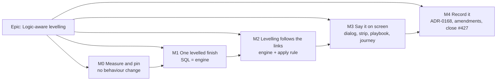

# Implementation Plan: Logic-aware levelling

- **Feature spec:** [`./feature-spec.md`](./feature-spec.md)
- **Status:** Approved — by the product owner, 2026-10-01 (AskUserQuestion in the session). CQ-1 **(a)**
  a hand-placed follower moves too; CQ-2 **(a)** one count, no schema change; CQ-3 **(a)** no back-fill,
  M0 counts the gaps.
- **Owner:** product owner (approval); builder agent (implementation)

## Breakdown

### Epic

**Logic-aware levelling.** A levelling delay pushes the work that follows it, so the ghosts, the
levelled finish and one press of **Apply levelled dates** all describe a schedule that can happen.
Closes `docs/TECH_DEBT.md` #427. Amends ADR-0041 §1/§3/§7, ADR-0035 §28 and ADR-0167 D1/D3 as a new
ADR-0168.

**No flag** (ADR-0088 D1). The rollback is the commit boundary of M2.

---

### Milestone M0: Measure and pin (no behaviour change)

**Outcome:** the "before" figures for SC-1 to SC-5 recorded, the derived claims in spec §0 (C7, C8, C10,
C11) confirmed or withdrawn, and the new tests in place as `it.fails` or captured snapshots.
**Entry point:** Ships dark: test and measurement only. Nothing user-visible changes until M1.
**Journey:** none (no capability claimed).

#### Feature: The measurement record

> **Description:** `docs/specs/logic-aware-levelling/m0-measurement.md`, in the format of the
> apply-levelled-dates record.
> **Complexity:** M
> **Dependencies:** spec approved.
> **Risks:** a derived claim turns out false. **Mitigation:** the record says so, and the spec is amended
> before M1 (CLAUDE.md §19.11). If C10 (corpus unchanged) is false, **stop** and return to the product
> owner, because Gate D's argument rests on it.
> **Testing requirements:** every figure carries the command that produced it.

##### Task M0-T1 — Measure the problem on the shipped engine (≈ one PR, docs only)

- **Description:** using a scratch spec (deleted afterwards) and
  `apps/api/scripts/measure-levelling-application.mts`, record:
  1. On `scaleSpec({ activities: 2000 })` at capacity 8 and capacity 2: delayed, dropped, rows and
     `remainingAfterApply` (re-taking `m0-measurement.md:140-143`); recalculation engine p50/p95; preview
     solves.
  2. **How many delayed activities have a successor**, and how many links are violated in the overlay
     (SC-1's "before").
  3. **C7:** on a fixture with a hand-placed, non-participant last activity, the recalculation response's
     `leveledProjectFinish` against the `GET …/summary` figure against `projectFinish`, through the API
     e2e harness (`scripts/e2e-local.sh api`).
  4. **C8:** on the seeded `plan:capability-levelling`, V4's drawn dates and the strip's Levelled finish.
  5. **For CQ-3:** with a scratch reference implementation of Pass C, how many participants it re-places
     **and** leaves a gap behind, on the scale plan and every seeded levelling plan.
- **Complexity:** M
- **Dependencies:** none.
- **Risks:** the shared sandbox is noisy. **Mitigation:** n = 50 after a warm-up, nearest-rank, both
  routes alternated in one run (the M1 precedent); read ratios, not milliseconds.
- **Testing:** n/a (measurement).
- **Development steps:**
  1. Write the scratch spec and run it.
  2. Record the figures with commands.
  3. Amend spec §0 for any claim that did not hold.

##### Task M0-T2 — Capture and pin before touching `level.ts` (≈ one PR)

- **Description:**
  - New `engine/level.links.parity.spec.ts`: five propagation shapes snapshotted **as today's engine
    answers them**: FS chain through a non-participant; SS and FF with lag; a follower on a second
    resource; a priority inversion (a follower placed by Pass B before its delayed predecessor); and
    `levelWithinFloatOnly` with a chain. Its docblock says these snapshots are **expected to move once,
    in M2**, unlike `level.parity.spec.ts`.
  - `it.fails` cases, red today and green after M2:
    - the chain golden (spec §4.5, C at 2026-01-11 to 2026-01-12, finish 2026-01-12);
    - S10's `A6500` and `A7740` assertions;
    - SC-1's "no ghost earlier than its links", over the new corpus;
    - an API e2e asserting recalculation response = `GET …/summary` for `leveledProjectFinish` (red for
      M1 if M0-T1 confirms C7).
- **Complexity:** M
- **Dependencies:** M0-T1.
- **Risks:** an `it.fails` that is red for the wrong reason. **Mitigation:** each has a plain-`it`
  precondition asserting the fixture's numbers (the `apply-levelling.spec.ts` pattern).
- **Testing:** this task is the tests.
- **Development steps:**
  1. Write the corpus and commit its `.snap` in the same commit.
  2. Write the `it.fails` cases with preconditions.
  3. Run `pnpm prepush` and `scripts/e2e-local.sh api`.

##### Task M0-T3 — Wrong-implementation runs (ADR-0110), scratch only

- **Description:** against the scratch reference Pass C, run the M0-T2 cases with `it.fails` turned into
  `it`, then against four wrong implementations:
  - (i) floor from the **early** dates instead of the pass-on (the placed-plan defect);
  - (ii) push without the `floorL > floorU` guard (Gate D broken, so conflicted placements get "fixed");
  - (iii) clamp the within-float cap to the anchor (C17);
  - (iv) an LOE predecessor that pushes.

  Record which assertion fails for each. Also confirm that **all eight `level.parity.spec.ts`
  snapshots, S10's existing assertions and the existing golden pass unedited** under the reference.

- **Complexity:** S
- **Dependencies:** M0-T2.
- **Risks:** a wrong implementation that nothing catches. **Mitigation:** add the case before M2.
- **Testing:** the record table.

---

### Milestone M1: One levelled finish

**Outcome:** the strip's **Levelled finish** comes from the same definition as the engine's, so it
never ignores a hand placement and is never earlier than **Finish**. This is independent of the links
change and fixes C7 on its own.
**Entry point:** the plan workspace's schedule summary strip, stat **"Levelled finish"**
(`ScheduleSummaryStrip.tsx:143`).
**Journey:** `apps/web/e2e-workspace-chrome/placement-overlays.spec.ts` gains a step on a levelled plan
with a hand-placed last activity, asserting that the stat reads its drawn finish.

#### Feature: Shared levelled-finish definition

> **Description:** `placed-finish.ts` gains `leveledFinishSql()` and `leveledProjectFinishOf()` beside
> `placedFinishSql` / `placedProjectFinishOf`: `COALESCE(leveled_finish, visual_effective_finish,
early_finish)` over non-LOE, non-summary activities. `summarise()` (`schedule.repository.ts:419-426`)
> and the engine's roll-up (`level.ts:370-378`) state the same thing. The engine keeps its loop; a unit
> test pins the two to agree.
> **Complexity:** S
> **Dependencies:** M0.
> **Risks:** the `hasLevelled` test in the strip keys on non-null (`ScheduleSummaryStrip.tsx:89`).
> **Mitigation:** keep the "null unless any `leveled_finish` is non-null" guard (`:423`) verbatim.
> **Testing requirements:** M0-T2's API e2e turns green; unit tests for the SQL helper (the
> `placed-finish` precedent); the journey step.

##### Task M1-T1 — The SQL and its twin (≈ one PR)

- **Description:** as above. The changeset (`api` patch) says "Levelled finish now counts hand-placed
  bars and excludes level-of-effort and summary activities".
- **Complexity:** S
- **Dependencies:** M0-T2.
- **Risks:** a plan whose figure moves later on release. **Mitigation:** that is the fix; the changeset
  states it.
- **Testing:** API e2e (response = GET, ≥ `projectFinish`); unit; journey.
- **Development steps:**
  1. Add the helpers and switch `summarise()` to them.
  2. Turn the e2e green.
  3. Add the journey step.
  4. Run `pnpm prepush`, `scripts/e2e-local.sh api` and `scripts/e2e-local.sh web:workspace-chrome`.

---

### Milestone M2: Levelling follows the links

**Outcome:** ghosts for followers; the levelled finish includes the knock-on (#427 closed in the
engine); **Apply levelled dates** writes no row for a follower that will follow by its links, and
handles hand-placed followers per CQ-1.
**Entry point:** the TSLD toolbar toggle **"Levelled placement"** (`tsld-toolbar-items.tsx:352-357`) and
**"Apply levelled dates…"** (ADR-0167 D7).
**Journey:** `placement-overlays.spec.ts` on `plan:capability-levelling`. Turn on Levelled placement and
assert **V4 has a ghost** after V3's (C8). Read the strip's Levelled finish (V4's levelled finish). Open
**Apply levelled dates…** and assert V4 is listed under "Will follow the bars before them" (M3 adds that
list; in M2 the journey asserts V4 is **not** among the rows). Apply, and assert V4 is drawn after V3
with no placement.

#### Feature: Pass C in the engine

> **Description:** spec §4.6. `levelSchedule` takes a required `edges` argument. `computeSchedule`
> exposes `passOnStartInstant` / `passOnFinishInstant` in memory. The accessor switch gains `passOn*`.
> Pass C as specified. `leveledFollowsLinks` in memory.
> **Complexity:** L
> **Dependencies:** M0 (all), M1.
> **Risks:**
>
> - A corpus snapshot moves. **Mitigation:** stop. This means Gate D is false.
> - `edge-bounds.structural.spec.ts` fires. **Mitigation:** import `forwardLowerBound`; never switch on
>   the link type in `level.ts`.
> - Cost (SC-5). **Mitigation:** measure before merging; above 1.5×, stop and report.
> - Removing intervals from `profile` by identity. **Mitigation:** store the interval objects per
>   activity at occupy time.
>
> **Testing requirements:** M0-T2's `it.fails` go green and become `it`. The new corpus's snapshots move
> once, and the diff is reviewed line by line in the PR. The eight old snapshots, S10's old assertions,
> the old golden and `compute.spec.ts` stay **unedited** and green. A Gate D property test (moved set ⊆
> downstream closure of Pass B's delayed set). A chain call-count gate (cost per link, not per minute;
> the `level.spec.ts:719-760` pattern). A determinism case (shuffled input). A metric-12 case (C18).

##### Task M2-T1 — Expose Pass 2's pass-on (≈ one PR)

- **Description:** add the two in-memory instants to `EngineResult` from `visualPropStart` /
  `visualPropFinish`. Nothing persisted.
- **Complexity:** S
- **Dependencies:** M1.
- **Risks:** a persisted field changes by accident. **Mitigation:** `compute.spec.ts`, the goldens and
  `writeResults`' named-column write stay unedited (ADR-0078 move rule).
- **Testing:** a unit case asserting the instants equal what a follower's `logicEarliest` used.
- **Development steps:**
  1. Add the fields.
  2. Add the test.
  3. Run `pnpm prepush`.

##### Task M2-T2 — `edges` through every caller (≈ one PR, no behaviour change)

- **Description:** a required `edges` parameter on `levelSchedule`, passed by `levelIfEnabled` (and its
  two callers), `adapter.ts`, `apply-levelling.ts`, `goldens.spec.ts`, the measurement script and the
  specs. The parameter is unused until T3, so this PR is behaviour-neutral by construction.
- **Complexity:** S
- **Dependencies:** M2-T1.
- **Risks:** none beyond typing.
- **Testing:** everything green and unedited.

##### Task M2-T3 — Pass C (≈ one PR)

- **Description:** spec §4.6 steps 1-5, D-2, D-3 and D-8; the header docblock rewritten (`level.ts:17-84`
  states "pure second pass … never recomputes"; add "follows its links", Gate D, and the excluded kinds).
- **Complexity:** L
- **Dependencies:** M2-T2.
- **Risks:** as for the feature.
- **Testing:** as for the feature, plus `scripts/e2e-local.sh api` (`schedule.e2e-spec.ts` levelling
  cases).
- **Development steps:**
  1. Implement.
  2. Flip the `it.fails`.
  3. Update the new corpus snapshot and review the diff.
  4. Measure SC-5 with the script and record it in `m0-measurement.md`, "M2".
  5. Run `pnpm prepush` and the api e2e.

#### Feature: The apply follows the links

> **Description:** `apply-levelling.ts:175`: an unplaced activity with `leveledFollowsLinks` is not a
> candidate; it is reported in `followingLinks`. A hand-placed one is a candidate under CQ-1 (a), with
> `reason: 'LINKS'`, or is reported in `conflictingPlaced` under CQ-1 (b). The DTO gains the field.
> `docs/API.md` is updated.
> **Complexity:** M
> **Dependencies:** M2-T3.
> **Risks:** after the rows are written, rounding a predecessor to the next day pushes an unplaced
> follower later than its levelled slot, and it clashes. **Mitigation:** `remainingAfterApply` reports it
> (it is already solved, not predicted); add a case; SC-2 measures it.
> **Testing requirements:** P3 and P4 revised **on purpose**: P3 becomes `rows: [P]`,
> `followingLinks: ['S']`, `leftToLogic: []`, with a comment citing this spec. P4 per CQ-1. New cases: a
> follower that is also resource-delayed beyond the knock-on (gets a row); a chain of three (one row).
> Wrong-implementation runs: write rows for followers (fails "S has no placement after settle"); drop the
> follower silently (fails `followingLinks`). API e2e: response shape (api-reviewer).

##### Task M2-T4 — Candidate rule and response field (≈ one PR)

- **Description / Steps:**
  1. Change the rule.
  2. Add the DTO field and OpenAPI entry.
  3. Revise P3/P4 and add the cases.
  4. Add the journey step (rows only).
  5. Add `api` and `web` minor changesets: "Levelling now pushes the work that follows a delayed
     activity: followers have levelled ghosts, the levelled finish includes them, and Apply levelled
     dates lets them follow by their links."
  6. Run `pnpm prepush`, `scripts/e2e-local.sh api` and `scripts/e2e-local.sh web:workspace-chrome`.
- **Complexity:** M
- **Dependencies:** M2-T3.

---

### Milestone M3: Say it on screen

**Outcome:** the dialog names followers; the strip's copy matches CQ-2; the playbook, the catalogue and
the docs are true.
**Entry point:** **"Apply levelled dates…"**, and the summary strip.
**Journey:** `placement-overlays.spec.ts` asserts the "Will follow the bars before them" list contains
V4, and that the strip's hint sentence is present.

#### Feature: Copy and lists

> **Description:** spec §4.7 Web. Under CQ-2 (b), add the second count (needs the M2 column, so it
> **re-routes M2 through database-architect first**). Stale docblocks fixed.
> **Complexity:** M (S under CQ-2 (a))
> **Dependencies:** M2.
> **Risks:** a list a screen-reader user cannot reach. **Mitigation:** reuse `NameList`
> (`ApplyLevellingDialog.tsx:339-352`), and add it to the status summary (`applyLevellingSummary`).
> **Testing requirements:** component tests; the a11y check in the journey; ux-reviewer,
> accessibility-reviewer and component-reviewer.

##### Task M3-T1 — Dialog list and strip copy (≈ one PR)

- **Complexity:** S
- **Development steps:**
  1. Add the list.
  2. Add the strip copy.
  3. Fix the docblocks.
  4. Add the journey step.
  5. Run `pnpm prepush` and `scripts/e2e-local.sh web:workspace-chrome`.

##### Task M3-T2 — Catalogue and playbook (≈ one PR)

- **Description:** a new `plan:capability-levelling-chain`: a levelled lift with an unresourced FS
  follower, an SS-lagged follower on a second capped resource, and a hand-placed follower (the CQ-1
  exhibit). `docs/TEST_PLAYBOOK.md` gets a row for it, and the `plan:capability-levelling` row's "what
  wrong looks like" gains "V4 has no ghost, or the Levelled finish reads V3's finish". The #428 seed
  faults are not touched here.
- **Complexity:** S
- **Dependencies:** M2.
- **Testing:** `pnpm check:playbook`.

---

### Milestone M4: Record it

**Outcome:** the decision is on record and the register is true.
**Entry point:** Ships dark: documentation.
**Journey:** none.

##### Task M4-T1 — ADR-0168 and amendments (≈ one PR)

- **Description:** write ADR-0168 from spec §4.9 and add its line to CLAUDE.md §16
  (`check:adr-coverage`). Add amendment blocks to ADR-0041, ADR-0035 (§28) and ADR-0167. Add the S10
  note to `CAPABILITY_MATRIX.md`. Close `docs/TECH_DEBT.md` #427 with the M2 evidence and annotate #426
  (D-7). Set this spec's header to `Accepted — shipped (ADR-0168)` (`check:spec-status`).
- **Complexity:** S
- **Dependencies:** M3.
- **Testing:** `pnpm prepush` (check:adr-coverage, check:spec-status, check:counts, check:claims).

## Sequencing & slices

M0 → M1 → M2 → M3 → M4, each releasable:

- **M1** stands alone: it corrects one figure.
- **M2-T1 and M2-T2** are behaviour-neutral.
- **M2-T3 and M2-T4 must ship in the same release.** Pass C without the apply rule would make the apply
  write placements for unplaced followers and detach them from their links. If they cannot be one PR,
  T4 merges before any release is cut (check the Version Packages PR is not merged between them).
- **M3** is copy and catalogue.

No flag (ADR-0088 D1).

**Specialist reviews:**

| Milestone | Reviewers                                                                                                                                                                                                                       |
| --------- | ------------------------------------------------------------------------------------------------------------------------------------------------------------------------------------------------------------------------------- |
| M0        | test-engineer                                                                                                                                                                                                                   |
| M1        | backend-performance-reviewer (the SQL), api-reviewer                                                                                                                                                                            |
| M2        | test-engineer (corpus diff and wrong-implementation runs), backend-performance-reviewer (SC-5, cost gate), api-reviewer (response field and meaning change), security-reviewer (a light pass: no new route; throttle unchanged) |
| M3        | ux-reviewer, accessibility-reviewer, component-reviewer                                                                                                                                                                         |
| CQ-2 (b)  | database-architect **before** M2-T3. No exceptions (CLAUDE.md §19.3).                                                                                                                                                           |

## Definition of Done (per task)

Each task's PR must satisfy the Feature Completion Criteria in
[`docs/PROCESS.md`](../../PROCESS.md) (code, tests, docs, security, performance, accessibility, Docker
build, CI, changelog, version impact). That includes `pnpm prepush`, `scripts/e2e-local.sh api` for any
`apps/api` change, and `scripts/e2e-local.sh web:workspace-chrome` where the journey changes.

## Risks & assumptions (rollup)

| Risk / assumption                                                                | Likelihood | Impact | Mitigation                                                                                                                                                 |
| -------------------------------------------------------------------------------- | ---------- | ------ | ---------------------------------------------------------------------------------------------------------------------------------------------------------- |
| C10 (corpus unchanged) is false                                                  | low        | high   | M0-T3 runs it before any change; stop if false.                                                                                                            |
| Pass C leaves many gaps on real plans (quality)                                  | med        | med    | M0-T1 item 5 counts them. CQ-3 is revisited with the number.                                                                                               |
| Engine cost above 1.5× (SC-5)                                                    | low        | med    | Measured in M2-T3; stop and report.                                                                                                                        |
| Planners see ghosts appear on existing levelled plans after release              | high       | low    | That is the feature. The changeset's first sentence says so; Watchtower means it is live on release (CLAUDE.md §17).                                       |
| Knock-on part-day pushes make #426 more visible                                  | med        | low    | D-7. #426 is annotated, and its trigger ("the next change to the levelled lens or the summary strip") fires in M3, so it is put to the product owner then. |
| Metric 12 verdict changes on a levelled plan                                     | low        | low    | C18. A pinned case and an ADR consequence.                                                                                                                 |
| M2-T3 released without M2-T4                                                     | low        | high   | The sequencing rule above.                                                                                                                                 |
| Mixed-calendar precision of plan-frame offsets in the overlay (`level.ts:78-83`) | low        | low    | Pass C works on absolute instants (pass-on instants and `leveledStartInstant`), not offsets.                                                               |
