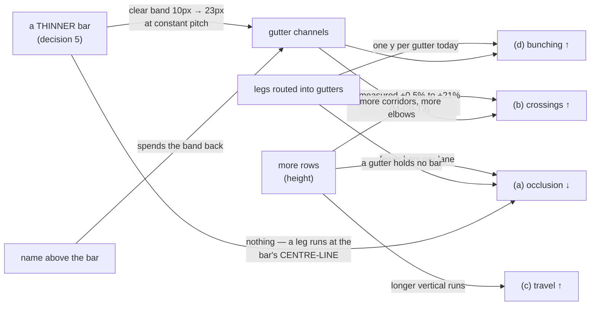

# Logic legibility — falsification conditions

- **Epic:** [`./feature-spec.md`](./feature-spec.md) · [`./implementation-plan.md`](./implementation-plan.md)
- **Status:** Draft — awaiting approval before implementation
- **Written:** 2026-09-22, against `web-v0.141.0` (ADR-0149's tree)
- **Amended 2026-09-22**, same day, after the product owner answered all four critical questions and
  supplied the NetPoint reference. Amendments are **dated and additive**; nothing is deleted, for the
  reason `part-c-conditions.md` gives about its own FC-C1.
- **To be committed ALONE, before any harness is edited and before any further reading is taken.**
  A threshold written after its measurement is a number tuned to the answer, and the git order is the
  only evidence that it was not (ADR-0128's ordering; ADR-0097 Landing C's harness that returned
  `PROCEED` from an `undefined`; ADR-0121's two conditions that failed and were honoured rather than
  softened).

**Every condition names what makes it fail and what happens then. A condition without a withdrawal
clause is a decoration.**

---

## 0. TWO ordering compromises, stated rather than glossed

### 0.1 The instrument pre-exists this spec

`apps/web/scripts/measure-occlusion.mjs` and `crossing-probe.ts:1349-1453` (`countOcclusions`,
`readBoth`) are headed "Part D M0" and were written before this spec. Nothing cites them — no ADR, no
`docs/TECH_DEBT.md` row, no spec, no `docs/DECISIONS.md` entry (established by
`rg -l 'measure-occlusion|countOcclusions|Part D'`: **two files, both of them the code itself**).

**M0-T1 reviews the instrument before it is trusted**, and the review is a task with its own
deliverable. ADR-0149's own closing finding is that _a control that proves the right code ran says
nothing about whether it ran on the right data_, and this harness family has already shipped one
instrument defect (`WBS_SUMMARY` at day 0) that survived every number being taken.

### 0.2 A reading has now been taken with it, BEFORE this file is committed — and FC-L2 is therefore pre-satisfied

The coordinator ran it and relayed **77.1 % of links occluded**, together with two independent
verifications of this spec's sharpest findings: that `link-routing.ts:182` returns before obstacles
are consulted, and that `gutterY` computes to **55.0** against a lane-0 bar bottom of **55.0**, so the
instrument's strict-interiority test excludes **every** gutter leg.

**What that costs, precisely.** FC-L2 below asks for `occl/link` ≥ 0.10 and was written **before** the
77.1 % arrived. It is **not moved** — moving it up now would be tuning a threshold to its own answer,
which is the one thing this file exists to prevent, and moving it down would be pointless. It is
instead marked **pre-satisfied on a relayed floor reading**, with its withdrawal clause recorded as
moot rather than deleted. Every other condition in this file was written before any figure it judges.

**Two rules follow and both bind everywhere:**

1. **77.1 % is a FLOOR, never a measurement, and is quoted that way in every document.** Its
   instrument excludes tangency, and a gutter leg is tangent to the upper lane's bar bottom **by
   construction** — `gutterY = screenYOfLane(L+1) − pad` expands to exactly that edge at every pitch
   (ADR-0149 D3's arithmetic; the coordinator's 55.0 = 55.0 is the same fact at `originY = 32`,
   lane 0). All 68 of Unit 300's gutter legs, 58 of which M-C0-T4 measured as lying _inside_ a painted
   bar at 0.0 px clearance, score **zero** under it. **The gutter blind spot is named wherever the
   number is.**
2. **The configuration it was taken in is not recorded, and the baseline has since changed** —
   decision 7 puts the WBS band **off**. M0-T3 re-takes it band-off with the configuration named.

---

## 1. What the product owner decided, and what each decision costs a condition

Answered across two clickable rounds on **2026-09-22**. These are approved constraints, not
preferences, and each removes an option a condition would otherwise keep open.

| #   | Decision                                                                                                               | What it costs a condition                                                                                                                                                                                                                    |
| --- | ---------------------------------------------------------------------------------------------------------------------- | -------------------------------------------------------------------------------------------------------------------------------------------------------------------------------------------------------------------------------------------- |
| 1   | **All four symptoms bite** — (a) vanish behind bars, (b) cross, (c) travel too far, (d) bunch on one y                 | No single-quantity verdict is admissible. **FC-L0** makes the reading a **vector**; a candidate reports all four or is not judged.                                                                                                           |
| 2   | **"As many rows as it takes. No cap."**                                                                                | Height is not a cost to be minimised. **FC-L7** reports what height costs; it does not bound it.                                                                                                                                             |
| 3   | **Paint order: "No — route around instead."** Bars stay visually supreme.                                              | The cheapest remedy for (a) is foreclosed, and so is the hollow-bar variant. **Supremacy is about occlusion ORDER, not thickness** (decision 5 makes the bar thin and keeps this rule intact).                                               |
| 4   | **Part B and Part A's M3 are unblocked and join this epic.**                                                           | Both arrive as measured candidates, never as inherited verdicts.                                                                                                                                                                             |
| 5   | **ADOPT the NetPoint bar treatment** — thin bar, name above, dates and duration below, a node at each end.             | **FC-L8 is rewritten.** Part B stops being a conditional late milestone and becomes load-bearing: it is the largest single source of routing channel. **FC-L11** is added because the gross figure and the net figure are different numbers. |
| 6   | **Pitch is spendable**, alongside row count.                                                                           | **FC-L3's withdrawal clause changes**: a gutter that cannot hold its channels is answered by the **row geometry**, of which pitch is one term — not by pitch alone, which ADR-0149 D3 measured as inert.                                     |
| 7   | **The WBS band goes OFF**; the epic re-baselines against band-off, the shipped default.                                | Every figure in this epic names band-off unless it says otherwise. The product owner did not know it was on, so **no prior reading taken band-on is a baseline**.                                                                            |
| 8   | **Build a small fixture; do not wait for their plan** — _"ensure it has sufficient logic links to make it realistic"_. | **FC-L12** is added. A fixture's activity count is not its value; its **logic density** is, and a sparse one would pass every condition while exhibiting nothing.                                                                            |

### What decision 1 does to the epic's shape, because it is the whole design

The four symptoms are **not independent, and two pairs are opposed**:

Every arrow is measured (`part-c-m-c0.md`) or structural (spec §2). **A remedy that improves one
symptom by worsening another is the normal case**, which is why FC-L0 exists and why no milestone may
be judged on a single number.

**The two dashed-looking arrows out of the thin bar are the amendment's most important content.** A
thinner bar buys **channel** (symptom d) and **ink** (Part B's original subject) and buys **nothing at
all** for occlusion — because a horizontal leg runs at the bar's **centre-line**, so whether it meets
a bar in its lane is an **x-overlap** question that a bar's height does not enter. And the label moving
above the bar spends the band back. Both are stated here so that no milestone can claim the bar change
as an occlusion remedy, and so that the gross gain is never reported as the net one.

---

## FC-L0 — the reading is a vector, and a candidate reports all of it or is not judged

Every configuration and candidate is read as **one row**, at the framings §2 of the spec names:

| column              | what it is                                                                                            | symptom |
| ------------------- | ----------------------------------------------------------------------------------------------------- | ------- |
| `occl/link`         | share of visible links with ≥ 1 horizontal segment running through a bar that is not its own endpoint | **(a)** |
| `x/link`            | whole-plan crossings per link (ADR-0149 D1's metric, unchanged)                                       | **(b)** |
| `mean \|Δlane\|`    | mean lane distance per link                                                                           | **(c)** |
| `max legs on one y` | the most horizontal segments sharing a single y in one gutter                                         | **(d)** |
| `rows`              | drawn extent in lanes — **reported, never scored** (decision 2)                                       | —       |
| `clear band`        | `LANE_HEIGHT − BAR_HEIGHT`, and the channels it yields — **reported from decision 5 onward**          | —       |

**Non-vacuity control, asserted first and throwing rather than judging:** attributed link polylines ==
the independently computed visible-edge count, and 0 non-axis-aligned segments (ADR-0065). A metric
that examined nothing reports zero of everything and looks like a triumph.

**Withdrawal clause.** A candidate measured on fewer than all four is **not offered and not recorded
as a result** — it is recorded as an incomplete reading. The single most likely way this epic goes
wrong is a milestone that halves occlusion, silently doubles crossings, and reports the first number.

---

## FC-L1 — the occlusion metric discriminates, and the prediction is committed here

Run the vector against two layouts of Unit 300 that differ on **this quantity by construction**: the
shipped `packLanes` output, and **one bar per lane**.

**The prediction, written before the run:** one-per-row measures **`occl/link` = 0**, because a
horizontal leg's y lies inside exactly one lane, a lane holding one bar can only be occluded by that
bar, and a leg's anchor sits **on** its own bar's edge and is excluded by strict interiority.

**The named refutation, so a non-zero reading is a finding and not a shrug.** If one-per-row is **not**
zero, every non-zero case must be a link occluding **its own endpoint bar** — which `routeOrthogonal`
can produce for an `SF` tie (its corridor is `(from.x + to.x) / 2`, which may fall inside either bar)
and for any clamped lag anchor (`lagAnchorPoints` clamps the walked anchor **onto** its bar and
`lagRunSegment` draws that stretch on purpose — ADR-0052 M5). The instrument is then taught to exclude
a link's own two endpoint bars **by id**, and re-run, **before anything else is judged**.

**Withdrawal clause.** If one-per-row is non-zero for a reason that is neither of those, the model "a
leg lies in exactly one lane" is wrong, the metric is replaced **before any candidate is measured**,
and nothing else in M0 is judged on it. FC-C1's clause reused verbatim, and FC-C1 is why: its
comparands rested on a premise nobody had checked, it failed at 0.83× in the wrong direction, and the
threshold was then moved after its own measurement.

---

## FC-L2 — the complaint is attributable to occlusion — **PRE-SATISFIED, and the clause is moot**

> **Amended 2026-09-22.** Written at ≥ **0.10** before any figure existed. A relayed reading of
> **77.1 %** (a **floor** — §0.2) arrived before this file was committed. **The threshold is not
> moved.** The condition is recorded as satisfied on that reading, its withdrawal clause as moot, and
> the obligation that survives is M0-T3's: **re-take it band-off, with the configuration named**, and
> report it as a floor with the gutter blind spot beside it.

Original text, kept because the derivation is what makes the number defensible: on Unit 300, in the
configuration the product owner is in, at **≥ 2 of the 3 measured zooms**, `occl/link` ≥ **0.10** —
at least one link in ten disappearing behind a bar. It is not derived from a prior remedy; it is
derived from what the number has to be for _"even for a simple plan the logic is mapping across other
bars"_ to describe this plan. It is a **floor on attribution**, not on the remedy.

**Withdrawal clause (moot, kept).** Below 0.10 at every measured zoom, §2.1's attribution would have
been **withdrawn in place rather than deleted**, M1 and M2 re-justified as correctness fixes on their
own evidence, and the remedy order re-taken from the vector.

---

## FC-L3 — the gutter becomes a channel, judged on arithmetic AND on a picture

After M1, on Unit 300 band-off at the geometry then shipping:

- **`legsTouchingABar` = 0.** Structural, so it tests the implementation and not the fixture: a channel
  at `screenYOfLane(L+1) ± (pad − 1)` cannot enter a bar's extent, because a bar occupies
  `[laneTop + pad, laneTop + pad + barHeight]`. Today's figure is **58 of 68** (`part-c-m-c0.md`
  M-C0-T4).
- **`max legs on one y` ≤ `ceil(peak gutter overlap / channels)`**, both terms measured in the same run
  and printed. Today's figure is **13 on one y**, 12 distinct y over 68 legs, identical at pitch 28,
  36 and 44.
- **Judged on a rendered image at 1646** — FC-C3's wording, kept: _"two runs through one gutter read as
  two lines, clear of both bar edges"_. The arithmetic above can be satisfied by channels 1 px apart,
  which a reader cannot use.
- **FC-6 holds** — Part A's condition reused verbatim **including its withdrawal clause: if it cannot
  be satisfied, the geometry changes, not the gate.**

> **Amended 2026-09-22 — the verdict is taken TWICE, and the withdrawal clause points at the row.**
>
> **The channel capacity must be DERIVED from `pad`, never a constant**, so it re-scales automatically
> when decision 5 thins the bar. With that, M1 is geometry-invariant by construction and can ship
> first without being re-built.
>
> So FC-L3 is read twice: once at **today's geometry** (bar 18, clear band 10 px, usable ±4 px — about
> 3–5 channels), which is a **progress reading**, and once at the **final row geometry** (M3), which is
> the **epic's verdict**. Only the second is quoted as FC-L3's result.
>
> **Withdrawal clause (amended).** Failure at today's geometry promotes **the row (M3)** — of which
> bar thickness, label placement and pitch are three terms — and does **not** promote pitch alone.
> ADR-0149 D3 measured pitch alone as inert at 28, 36 and 44 because `gutterY` had no per-link term;
> M1 supplies the term, and decision 5 supplies a cheaper source of band than pitch does. Arithmetic
> from the shipped constants, labelled as arithmetic and not as measurement: bar 18 → clear band
> **10 px**, usable ± 4; a NetPoint-thin bar at the same pitch → clear band **≈ 23 px**, usable ± 11,
> i.e. roughly **2.2× the channels for no pitch at all**.

---

## FC-L4 — leg checking buys the occlusion M0 says is available, and the bar is derived from M0

After M2, on Unit 300 band-off at every measured zoom:

> **M2 realises ≥ 70 % of the AVOIDABLE occlusions M0 measured**, where _avoidable_ is counted by
> M0-T3 as: an occluded leg for which at least one x in `routeOrthogonal`'s existing candidate set, or
> the gutter route, yields a polyline with no occluded leg and no bar-blocked corridor.

**The threshold is a formula, not a number, and that is deliberate.** The quantity it is a fraction of
does not exist yet; it is produced by M0, **before M2 is built**, and fixed in `m0-measurement.md` the
day it is taken. The _rule_ is committed here, the _denominator_ is measured, and neither can be
adjusted to suit the result afterwards. 70 % is chosen because the residue is expected to be cases
where **no** clear route exists, and a direct remedy that cannot realise most of what its own analysis
says is available is not the right remedy.

**And a crossings ceiling, because the two are opposed by construction.** `x/link` may rise by
**≤ 10 %** against the M0 baseline. A gutter route is a 6-point line, and `chooseCorridorsByCrossing`
skips 6-point lines (`link-routing.ts:844`), so converting occluded elbows into gutter routes withdraws
them from the pass that bought ADR-0149 its **−20.8 %**.

> **Amended 2026-09-22 — the crossing pass is inside this condition, not beside it.**
> `chooseCorridorsByCrossing` moves an elbow to candidates including `(from.x + to.x) / 2`, `to.x − gap`
> and offsets up to `± 8 × gap` (`link-routing.ts:879-890`), scores them on **crossings only**
> (`:859-862`), and checks bars in the **crossed lanes** only (`:889`). **Nothing checks the resulting
> legs.** So Part C's own remedy is a candidate cause of the complaint Part C did not measure.
>
> M0-T3 measures `occl/link` with that pass **on and off**. If the pass raises occlusion, M2's leg
> viability is applied to **its** candidate filter too, and that is not optional — it would otherwise
> spend M2's gain immediately after M2 produced it.

**Two withdrawal clauses, firing independently:**

- **Occlusion below 20 % of avoidable:** M2 is **withdrawn** and recorded as measured-and-rejected.
  M1's channel work stands on FC-L3.
- **Crossings up by more than 10 %:** the trade goes to the **product owner** with both numbers and
  both rendered pictures, as an explicit choice between (a) and (b) — never resolved inside a
  milestone. The named mitigation to offer alongside it is teaching `chooseCorridorsByCrossing` about
  6-point routes, whose justification is that ADR-0149 D4's stated reason for the skip — _"a six-point
  VHV route was produced because NO single corridor was clear … moving one of its two legs would be
  re-deciding that search from the outside with less information"_ — **lapses** once the gutter route
  is chosen deliberately rather than as a last resort.

---

## FC-L5 — paint cost, in separately-judged limbs

ADR-0128 probe, `canvas-draw`, **500 and 2,000**, **one press by the product owner on their own
hardware**. No CI gate, ever (ADR-0128's refusal follows from where the measurement has to be taken).
Dropped-frame percentage **≤ baseline + 2.00 pp** (ADR-0127 D8a's bar), **with the machine's own
run-to-run spread reported beside it** — a delta smaller than the spread is **INDETERMINATE**, not a
pass (ADR-0128's fourth verdict).

**Limb A — the routing (M1 + M2). Prediction committed here: the delta is > 0.** A gutter route is six
points where an elbow is four, the channel pass is a second post-pass beside `bundleCorridors`, and the
leg check is two more interval queries per candidate. This is the opposite of Part C's FC-C4 limb A,
whose prediction was ≤ 0 — stated so the outcome is a finding either way.

**Additionally `paint.routing-budget.test.ts` must stay green WITHOUT being edited.** If it has to be
relaxed, the search is unbounded and the milestone is withdrawn (FC-C4 limb B, verbatim). It is the
only thing standing between _"bounded work is the contract"_ (`link-routing.ts:227-233`) and a paint
path that grew a search.

**Limb B — the pitch.** `fitToContent` pins `originY` to the padding and discards `extent.maxLane`
(`viewport.ts:200-216`), so the visible lane band at Fit is constant and `cull` puts **fewer** bars in
it. **Prediction: ≤ 0.**

> **Limb C, added 2026-09-22 — the row treatment (decision 5).** Prediction: **> 0, and the largest of
> the three.** Today a task bar is one rounded fill, one hairline stroke and at most one inside label
> (`paint.ts:1622`, `:1898`). The NetPoint row is a thin bar **plus two node glyphs plus three text
> runs** (name, dates, duration) per activity — text being the painter's most expensive operation and
> the one `paint.dates-budget.test.ts` already exists to bound. Judged separately, because a routing
> change that costs frames and a row change that costs more would net out to one number and hide both.

---

## FC-L6 — a travel or assignment candidate earns its place on the vector, or is not offered

M4 measures candidates for symptom **(c)**: the unbuilt lane re-indexing of `cheap-levers.md` Finding 4
(**not built** — that file's own status line says so), and a re-derivation of ADR-0149 D5's three
assignment rules against the vector rather than against crossings alone.

> A candidate is **offered to the product owner** only if it improves **at least one** of `occl/link`,
> `x/link`, `mean |Δlane|` by **≥ 20 %** while worsening **none** of the three by more than **10 %**.
> Height is reported and does not disqualify (decision 2).

**Where 20 % comes from.** The lower of Part A's FC-3 pair (≥ 20 % mean, ≥ 30 % long links), themselves
derived from what the free `predecessorsOf` remedy had already delivered (2.34 → 1.83). It is
deliberately **not** FC-C2's 50 %: that floor was derived from height being expensive, and decision 2
removes the premise. The lowering is recorded here, in advance, with the reason — which is what
`part-c-conditions.md` asked for when it flagged its own 50 % as partly-stale and refused to move it
inside a milestone.

> **Amended 2026-09-22 — CHAIN ROWS is a first-class hypothesis with its own clause, and its
> counter-hypothesis is named so the measurement is not framed to confirm.**
>
> The NetPoint reference chains sequential activities along **one row**, node to node, with no elbow —
> `FBP Specification → Bid & Award Fluid Bed Processor → Submittals/Approvals` is one row; the
> automation chain is another. That is exactly ADR-0149 D5's **chain rows** candidate, which measured
> **+85.8 %** and was called the worst of three — **on link-versus-link crossings**.
>
> **Hypothesis (H1).** On occlusion it should be the _best_: a link between two adjacent members of a
> chain in one row has nothing between them, so it needs no traversal at all.
>
> **Counter-hypothesis (H2), stated because it is equally mechanical.** Chain rows puts **more bars
> per row**, and occlusion is a leg meeting a bar **in its own lane**. Every link _out_ of a chain has
> a leg in the chain's crowded row. H1 and H2 pull opposite ways and neither is obviously dominant.
>
> **Clause.** M4 measures chain rows **first**, on the vector, band-off, and reports H1 and H2 as a
> decomposition — same-row links and cross-row links counted separately — because the aggregate alone
> cannot distinguish them. If it qualifies under FC-L6 it goes to the product owner **with the
> NetPoint image beside the rendered candidate**, since the reference is what motivated it. If it does
> not, it is recorded as measured-and-rejected **a second time, on a second metric**, which is a
> stronger result than the first and must be written up as such rather than as a repeat.
>
> **This would be the third verdict in this epic to flip when the metric was corrected** (after
> FC-C1's comparands and ADR-0149 D5 itself). That is a pattern, not a coincidence, and the ADR says
> so.

**Withdrawal clause.** If no candidate qualifies, **M4 is withdrawn and recorded as
measured-and-rejected**, exactly as M-C4 was — including all four rules re-reported with their vector
rows, so the next reader does not re-derive them a third time.

---

## FC-L7 — the deliverable, the overview and the AT layer survive whatever height costs

Reported, never used to bound height (decision 2).

- **Export.** At the shipped geometry on the largest measured fixture, either the `whole` PNG's natural
  raster is within `EXPORT_MAX_PX` (8192) per side, or `scaledToFit` fires and the product owner has
  accepted it. **Measured at `devicePixelRatio = 1.75`, their own display, and not at 1** — the raster
  is `size × dpr`, so the CSS-px headroom is 1.75× smaller than the constant suggests (FC-C7, reused).
  **This is now the condition most likely to bind**: decision 6 makes the pitch spendable, and the
  NetPoint reference's own row is ~68 px against our 28.
- **Minimap.** `pxPerLane` at the shipped geometry on Unit 300, measured and reported against the
  baseline **in the configuration the reader is in** (band-off, decision 7), with a rendered pair.
  `docs/TECH_DEBT.md` #323 records that no lane remedy touches the minimap; a **row-count** change
  could, and a **pitch** change should not, because the minimap allocates its box across lanes rather
  than across pixels — **measured rather than assumed either way**.
- **The parallel listbox.** The ADR-0063 §4 invariant — the count of AT-reachable activities does not
  change — holds across every milestone. `a11y.ts` speaks the lane number, so any assignment change
  (M4) alters every moved row's announcement, which is behaviour rather than a defect and is asserted
  rather than discovered.

**Withdrawal clause.** If any is judged unacceptable, the remedy is a cap **in the export** or a
minimap change — each its own scope, filed rather than smuggled in — and **never** a row cap on the
packer, which the product owner removed deliberately.

---

## FC-L8 — the row geometry (decision 5), **rewritten: this is no longer conditional**

> **Rewritten 2026-09-22.** The original FC-L8 made Part B conditional on a criterion (CQ-3) and
> narrowed it to link ink on the reasoning that _with bars constitutionally supreme a bar redesign has
> little room_. **The product owner has withdrawn that premise**: the NetPoint bar treatment is
> adopted, and supremacy is re-scoped to occlusion **order** rather than thickness. The narrowed
> version is kept in this paragraph rather than deleted, because it was the basis of the original
> sequencing.

The row becomes: a **thin bar**, the **name above**, **dates and duration below**, and a **node glyph at
each end**. Five limbs, because it fails in five different ways and one assertion would hide four.

**1 — Every cue the bar carries today survives, or its replacement is named.** Criticality
(**fill _and_ dash** — WCAG 1.4.1), near-criticality, the in-bar progress band and its front divider,
LOE brackets, WBS summary tabs, milestone diamonds, constraint pins, the feasible window, the selection
and hover rings. **Two of these cannot survive as they are and the condition says so in advance rather
than discovering it:** an in-bar progress band and an inside label have no room in a thin bar, and a
**dash on a 5 px outline is not a channel a reader can use** — so criticality needs a second non-colour
channel or WCAG 1.4.1 is failed. A cue that moves is recorded as moved; a cue that goes is a
**product-owner decision**, not a milestone's.

**2 — FC-6, reused verbatim including its withdrawal clause: if it cannot be satisfied, the geometry
changes, not the gate.** Every glyph family and every decoration draws within
`[screenYOfLane(L), screenYOfLane(L+1))`.

**3 — Every constant justified by the old geometry is RE-DERIVED, not carried.** Each of these is a
value whose justification is a function of `BAR_HEIGHT = 18`, and each breaks differently at 5:

| constant                   | today                                                                       | at a NetPoint-thin bar                                                                                                                                                     |
| -------------------------- | --------------------------------------------------------------------------- | -------------------------------------------------------------------------------------------------------------------------------------------------------------------------- |
| `SUMMARY_TAB_H = 4`        | drops below the bar, **1 px** clearance                                     | clearance becomes ~7.5 px — **the problem inverts**: a 4 px tab under a 5 px bar is nearly as tall as the bar. A **proportion** problem, not a clearance one.              |
| `GLYPH_CAP_OVERHANG = 3`   | ±3 on an 18 px bar (24 px total)                                            | ±3 on a 5 px bar (11 px total) — the cap is **twice the bar**                                                                                                              |
| `FAN_OUT_MAX_PX = 6`       | justified in a comment by `BAR_HEIGHT/2 = 9`                                | half-height is **2.5**, and `FAN_OUT_STEP_PX = 3` **already exceeds it** — the mechanism's unit of separation is larger than the bar. **Fan-out as designed cannot work.** |
| `TAIL_HEIGHT = 6`          | _"thinner than the bar, so it never reads as duration"_ (`geometry.ts:145`) | **thicker than the bar — the docblock's invariant inverts**                                                                                                                |
| `BAR_RADIUS = 3`           | _"subtle at BAR_HEIGHT 18"_                                                 | a fully-rounded capsule                                                                                                                                                    |
| `LABEL_INSIDE_MIN_PX = 24` | a **width** gate with **no height term**                                    | `labelPlacement` still returns `'inside'` (`geometry.ts:611`) and the text paints outside a 5 px bar. **A live defect the row change must handle**, not a styling choice.  |

**The fan-out row is the sharpest, and it is a hard coupling between Part B and Part A:** the comment
is the only place the invariant exists, `link-routing.ts` does not import `BAR_HEIGHT`, and the
compiler cannot see it. **The reference supplies the answer**: NetPoint converges links on a **node**
at each bar end rather than spreading them along an edge, so the node glyph _replaces_ fan-out rather
than coexisting with it. That is a design consequence of adopting the reference and is recorded as
one.

**4 — Judged on a rendered picture against the reference**, at 1646, band-off, with the NetPoint image
beside it. This epic exists because a diagram that satisfied every number was still hard to read.

**5 — Every new colour value clears all three canvas traps in a REAL browser** — ADR-0102's
`@theme inline` aliases a surface rebind can never reach, ADR-0100 M4's token pair that painted
**nothing** while the contrast gate stayed green, and ADR-0121's `fillStyle` setter that silently
discards an unparseable value. The reference's links are a **different hue entirely** (yellow with red
arrow ticks against blue bars), so this limb is certain to fire.

**Withdrawal clause.** A limb that cannot be met sends the **specific sub-decision** back to the
product owner — which cue moves, which constant's replacement value, whether pitch rises further —
**never the whole treatment**, which they have decided. A limb is not relaxed to let the milestone
close.

---

## FC-L9 — determinism, at both tiers

Two runs on one plan produce **byte-identical routed polylines and byte-identical channel
assignments**. Permuting the input `activities` and `edges` arrays changes neither.

**Verified red** against a channel assignment that consults `scene.edges` in array order without
imposing a total order — a named mutation, per ADR-0110 D5: _a gate is finished when it has been made
to fail by the defect it was written for._ `scene.edges` order is a server response, not a total order.
ADR-0065's rule is that a route which varies between frames reads as the diagram twitching; a
**channel** that varies between frames is worse — the line moves without the viewport moving.

---

## FC-L10 — byte-identity when not asked

Three separate cases, because they fail differently and one assertion would hide two:

1. **`routeOrthogonal` without the obstacle parameter is byte-identical point for point** — the
   existing parity rule (`link-routing.ts:168-172`) extended rather than restated.
2. **With the obstacle parameter, a link whose legs are clear and whose corridor is unblocked is
   byte-identical to today.** This is what makes the rollback a commit boundary rather than a hope: a
   diagram with no occlusion does not move at all.
3. **`packLanes` with any new objective omitted, and with it set to the neutral value, are two separate
   cases and both are byte-identical** (M4 only). The importer calls `packLanes` directly
   (`interchange.service.ts:1096`), so if the omitted case is byte-identical, import cannot have
   changed.

> **Case 2 does NOT survive the row treatment, and that is stated rather than discovered.** Decision 5
> changes every bar's geometry, so every anchor, every rect and every route moves. FC-L10 case 2 is
> therefore a **per-milestone** contract that holds for M1 and M2 and is **void from M3 onward** —
> where the rollback contract becomes the commit boundary plus the golden log, read line by line.

**Withdrawal clause.** A case that cannot be made byte-identical **in the milestone it applies to** is
not relaxed; the change is re-shaped until it can be, or the milestone is withdrawn.

---

## FC-L11 — the row's NET clear-band gain is measured, and the gross figure is never quoted alone

> **Added 2026-09-22** with decision 5.

Thinning the bar hands vertical space back; moving the name above the bar and the dates below it spends
some of that space. **The net gain is an output of the design, not an input to it.**

- **Gross**, arithmetic from the shipped constants and labelled as arithmetic: `LANE_HEIGHT 28`,
  `BAR_HEIGHT 18` ⇒ clear band **10 px**; a NetPoint-thin bar at the same pitch ⇒ **≈ 23 px**. That is
  the _"~57 % of every row handed back"_ figure.
- **Net**, measured on the shipped row at the shipped pitch: the clear band **actually available to a
  channel** after the label, the dates, the duration and the node glyphs have taken theirs — reported
  as a number of channels at the channel pitch FC-L3 judges.

**The arithmetic that makes this a condition rather than a caveat.** A 5 px bar centred in a 28 px row
leaves **11.5 px** above it and 11.5 below. A text line at the canvas's label size needs roughly
12–14 px. **So "name above the bar" is not buildable at the shipped pitch**, which is why decision 5
and decision 6 are one decision and are one milestone (M3). The full reference row is ~68 px against
our 28.

**Withdrawal clause.** If the net gain at the chosen pitch is **smaller than today's 10 px**, the row
treatment has spent the channel it was also supposed to supply, and that goes to the product owner as
a trade between the picture they asked for and the channel M1 needs — **with both rendered**. The gross
figure may not be quoted in any document without the net beside it or, before M3, without the words
_"net not yet measured"_.

---

## FC-L12 — the small fixture's value is its logic density, and the fixture asserts that itself

> **Added 2026-09-22** with decision 8. The product owner's words: _"Build a small activity plan but
> ensure it has sufficient logic links to make it realistic."_

**A sparse 13-activity fixture would pass every condition in this file while exhibiting nothing**, and
would then be quoted as evidence that a small plan is fine. So the fixture's properties are a
**condition on its builder**, asserted by the fixture's own test and verified red against a
deliberately sparse version:

1. **Link density ≥ 1.3 links per activity** — Unit 300's own measured ratio (188/144 = 1.31), so the
   floor is derived from the realistic fixture rather than chosen.
2. **≥ 1 same-lane `A → C` link with an intervening bar `B` in that lane**, after `packLanes` has run
   — the `link-routing.ts:182` mechanism, which is the one a small plan is _for_. Asserted against the
   packer's real output, not against the authored lane.
3. **≥ 1 link whose preferred corridor and all four candidates are blocked**, so the gutter fallback
   fires at all.
4. **≥ 2 gutter runs overlapping in x in one gutter**, so the channel pass has something to do.
5. **`occl/link` > 0 and `max legs on one y` ≥ 2** on the shipped tree.

**Its docblock states what it is for and that it is a construction, not the product owner's plan** —
CQ-4's rule from Part A, kept, and now the stronger form: every figure taken on it names it as
synthetic.

**Withdrawal clause.** A fixture failing any of the five is **not used**, and the failure is a defect
in the fixture rather than a finding about small plans. A reading taken on a fixture that has not
passed all five is not evidence.

---

## What is NOT a condition here, and why

- **A row-count ceiling.** Removed deliberately (decision 2). FC-L7 reports what height costs; it does
  not bound it.
- **A paint-order change.** Foreclosed by decision 3, including the hollow-bar variant. **Decision 5
  thins the bar and does not touch this**: supremacy is about occlusion order.
- **A CI gate on paint cost.** ADR-0128 refused one, and that refusal follows from where the
  measurement has to be taken.
- **A wall-clock bar on the harness.** ADR-0058: two of this repository's slowest CI samples changed no
  test and no workflow.
- **A `VITE_` flag.** ADR-0088 D1: inlined at build time, `docker-publish.yml` passes none, every
  published image carries every flag at its default. FC-L10 and the golden log are the rollback
  contract.
