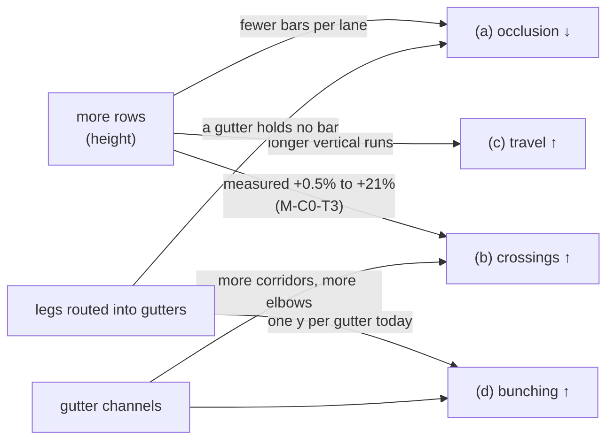

# Logic legibility — falsification conditions

- **Epic:** [`./feature-spec.md`](./feature-spec.md) · [`./implementation-plan.md`](./implementation-plan.md)
- **Status:** Draft — awaiting approval before implementation
- **Written:** 2026-09-22, against `web-v0.141.0` (ADR-0149's tree)
- **To be committed ALONE, before any harness is edited and before any reading is taken.** That is
  the whole point of this file: a threshold written after its measurement is a number tuned to the
  answer, and the git order is the only evidence that it was not (ADR-0128's ordering; ADR-0097
  Landing C's harness that returned `PROCEED` from an `undefined`; ADR-0121's two conditions that
  failed and were honoured rather than softened).

**Every condition names what makes it fail and what happens then. A condition without a withdrawal
clause is a decoration.**

---

## 0. The ordering compromise, stated rather than glossed

**An occlusion instrument already exists in the tree and is referenced by no document.**
`apps/web/scripts/measure-occlusion.mjs` and `crossing-probe.ts:1349-1453` (`countOcclusions`,
`readBoth`) are headed "Part D M0" and were written before this spec. Nothing cites them — no ADR,
no `docs/TECH_DEBT.md` row, no spec, no `docs/DECISIONS.md` entry (established by
`rg -l 'measure-occlusion|countOcclusions|Part D'` over the whole repository: **two files, both of
them the code itself**).

So ADR-0128's ordering — conditions before measurement — **can still be honoured, and only just**:
no reading has been recorded anywhere, so no threshold below has been written against a number.
What cannot be claimed is the stronger property Part C had, that the instrument did not exist when
the conditions were written.

Two consequences, both binding:

1. **M0-T1 reviews the instrument before it is trusted**, and the review is a task with its own
   deliverable, not a glance. ADR-0149's own closing finding is that _a control that proves the
   right code ran says nothing about whether it ran on the right data_, and that harness family has
   already shipped one instrument defect (`WBS_SUMMARY` at day 0) that survived every number being
   taken.
2. **If a reading was taken with it before this file is committed, it is not evidence and is not
   quoted.** Any figure entering this epic names the commit it was taken against (§19.11).

---

## 1. What the product owner decided, and what each decision costs a condition

Answered in a clickable round on **2026-09-22**. These are approved constraints, not preferences,
and each one removes an option a condition would otherwise have to keep open.

| #   | Decision                                                                                                                       | What it costs a condition                                                                                                                                                                                                                    |
| --- | ------------------------------------------------------------------------------------------------------------------------------ | -------------------------------------------------------------------------------------------------------------------------------------------------------------------------------------------------------------------------------------------- |
| 1   | **All four symptoms bite** — (a) lines vanish behind bars, (b) lines cross, (c) lines travel too far, (d) lines bunch on one y | No single-quantity verdict is admissible. **FC-L0** makes the reading a **vector**, and every candidate reports all four or is not judged.                                                                                                   |
| 2   | **"As many rows as it takes. No cap."**                                                                                        | Height is not a cost to be minimised, so no condition may reject a candidate for its row count. **FC-L7** reports what height costs; it does not bound it.                                                                                   |
| 3   | **Paint order: "No — route around instead."** Bars stay visually supreme.                                                      | The cheapest remedy for (a) — draw links over bars with a halo — is **foreclosed**. So is the hollow-bar variant that reaches the same picture by a different mechanism (§4.5 D5). No condition may be satisfied by either.                  |
| 4   | **Part B and Part A's M3 are unblocked and join this epic.**                                                                   | Both arrive as **measured candidates under FC-L6/FC-L8**, not as work to build. ADR-0149 D5 already withdrew three assignment rules on the crossings quantity alone, and that verdict is **re-derived against the vector**, never inherited. |

### What decision 1 does to the epic's shape, because it is the whole design

The four symptoms are **not independent, and two pairs are opposed**:

Every arrow here is either measured (`part-c-m-c0.md`) or structural (§2 of the spec). **A remedy
that improves one symptom by worsening another is the normal case, not the exception**, which is
why FC-L0 exists and why no milestone in this epic may be judged on a single number.

---

## FC-L0 — the reading is a vector, and a candidate reports all of it or is not judged

Every configuration and every candidate is read as **one row carrying four quantities plus its
height**, at the framings §2 names:

| column              | what it is                                                                                            | symptom |
| ------------------- | ----------------------------------------------------------------------------------------------------- | ------- |
| `occl/link`         | share of visible links with ≥ 1 horizontal segment running through a bar that is not its own endpoint | **(a)** |
| `x/link`            | whole-plan crossings per link (ADR-0149 D1's metric, unchanged)                                       | **(b)** |
| `mean \|Δlane\|`    | mean lane distance per link (`cheap-levers.md`'s proxy, unchanged)                                    | **(c)** |
| `max legs on one y` | the most horizontal segments sharing a single y in one gutter                                         | **(d)** |
| `rows`              | drawn extent in lanes — **reported, never scored** (decision 2)                                       | —       |

**Non-vacuity control, asserted first and throwing rather than judging:** attributed link polylines
== the independently computed visible-edge count, and 0 non-axis-aligned segments (ADR-0065). A
metric that examined nothing reports zero of everything and looks like a triumph.

**Withdrawal clause.** A candidate measured on fewer than all four is **not offered and not
recorded as a result** — it is recorded as an incomplete reading. The single most likely way this
epic goes wrong is a milestone that halves occlusion, silently doubles crossings, and reports the
first number.

---

## FC-L1 — the occlusion metric discriminates, and the prediction is committed here

Run the vector against two layouts of Unit 300 that differ on **this quantity by construction**:
the shipped `packLanes` output, and **one bar per lane**.

**The prediction, written before the run:** one-per-row measures **`occl/link` = 0**, because a
horizontal leg's y lies inside exactly one lane (it is a bar centre-line or a gutter datum, both
constant within a lane), a lane holding one bar can only be occluded by that bar, and a leg's
anchor sits **on** its own bar's edge and is excluded by strict interiority.

**The named refutation, so a non-zero reading is a finding and not a shrug.** If one-per-row is
**not** zero, every non-zero case must be a link occluding **its own endpoint bar** — which
`routeOrthogonal` can produce for an `SF` tie (its corridor is `(from.x + to.x) / 2`, which may
fall inside either bar) and for any clamped lag anchor (`lagAnchorPoints` deliberately clamps the
walked anchor **onto** its bar, and `lagRunSegment` draws that stretch on purpose — ADR-0052 M5).
In that case the instrument is taught to exclude a link's own two endpoint bars **by id**, and
re-run, **before anything else is judged**.

**Withdrawal clause.** If one-per-row is non-zero for a reason that is neither of those, the model
"a leg lies in exactly one lane" is wrong, the metric is replaced **before any candidate is
measured**, and nothing else in M0 is judged on it. This is FC-C1's clause reused verbatim, and
FC-C1 is why: its comparands were chosen on a premise nobody had checked, it failed at 0.83× in the
wrong direction, and the threshold was then moved after its own measurement — which
`part-c-conditions.md` records as the one thing that file exists to prevent.

---

## FC-L2 — the complaint is attributable to occlusion, or the diagnosis is withdrawn in place

On **Unit 300, in the configuration the product owner is in** (CQ-2; measured for all five if that
question is unanswered), at **≥ 2 of the 3 measured zooms**, `occl/link` ≥ **0.10** — i.e. at least
one link in ten disappears behind a bar.

**Where 0.10 comes from, since a round number is a warning sign.** It is not derived from a prior
remedy. It is derived from what the number has to be for the sentence _"even for a simple plan the
logic is mapping across other bars"_ to describe this plan: below one link in ten, a planner reading
a 188-link diagram meets fewer than nineteen occluded lines and the complaint is more likely about
(b), (c) or (d), which have their own milestones. It is a **floor on attribution**, not on the
remedy.

**Withdrawal clause.** Below 0.10 at every measured zoom, §2.1's attribution of _"mapping across
other bars"_ to link-over-bar occlusion is **withdrawn in place rather than deleted**, M1 and M2 are
re-justified as correctness fixes on their own evidence (`legsTouchingABar` 58/68 is already
measured and stands whatever this says) or dropped, and the epic's remedy order is re-taken from the
vector. This is Part A's FC-1 shape: a condition that can falsify the epic's own diagnosis while
leaving the defect a defect.

---

## FC-L3 — the gutter becomes a channel, judged on arithmetic AND on a picture

After M1, on Unit 300 at the shipped pitch:

- **`legsTouchingABar` = 0.** Structural, and therefore a real test of the implementation rather
  than of the fixture: a channel at `screenYOfLane(L+1) ± (pad − 1)` cannot enter a bar's extent,
  because a bar occupies `[laneTop + pad, laneTop + pad + barHeight]` and `pad = 5`. Today's figure
  is **58 of 68** (`part-c-m-c0.md` M-C0-T4).
- **`max legs on one y` ≤ `ceil(peak gutter overlap / channels)`**, where both terms are measured in
  the same run and printed. Today's figure is **13 on one y**, 12 distinct y over 68 legs, identical
  at pitch 28, 36 and 44.
- **Judged on a rendered image at 1646** — FC-C3's own wording, kept: _"two runs through one gutter
  read as two lines, clear of both bar edges"_. This epic exists because a diagram that satisfied
  every number was still hard to read, and the arithmetic above can be satisfied by channels 1 px
  apart, which a reader cannot use.
- **FC-6 holds** — Part A's condition reused verbatim **including its withdrawal clause: if it
  cannot be satisfied, the geometry changes, not the gate.** Every glyph family (task, milestone,
  LOE, WBS summary) and every decoration (progress band, constraint pin, feasible window, fan-out
  anchors, selection and hover rings) draws within `[screenYOfLane(L), screenYOfLane(L+1))`.

**Withdrawal clause.** If `legsTouchingABar` cannot reach 0 at pitch 28, the pitch question (M3) is
**promoted ahead of M2** rather than the target being relaxed — because M2 deliberately sends more
traffic into the gutter, and sending it into a gutter that still runs along a bar edge would make
the epic's own headline symptom worse.

**What this condition does NOT do, and it matters.** It does not reverse ADR-0149 D3. That decision
measured that **pitch alone** changes nothing and said why in a sentence this file quotes rather
than reinterprets: `gutterY` _"has no per-link term at any pitch"_, so eleven lines at one y are
eleven lines on top of each other however tall the gutter is. D3 then handed distribution to the
router in as many words. **The case D3 could not measure is pitch WITH a per-link term**, and that
is M3's subject, not a re-run of M-C1.

---

## FC-L4 — leg checking buys the occlusion M0 says is available, and the bar is derived from M0

After M2, on Unit 300 at every measured zoom:

> **M2 realises ≥ 70 % of the AVOIDABLE occlusions M0 measured**, where _avoidable_ is counted by
> M0-T3 as: an occluded leg for which at least one x in `routeOrthogonal`'s existing candidate set,
> or the gutter route, yields a polyline with no occluded leg and no bar-blocked corridor.

**The threshold is a formula, not a number, and that is deliberate.** The quantity it is a fraction
of does not exist yet; it is produced by M0, before M2 is built, and is fixed in
`m0-measurement.md` the day it is taken. This is how a bar can be committed before its measurement
without being invented: the _rule_ is committed here, the _denominator_ is measured, and neither can
be adjusted to suit the result afterwards. 70 % is chosen because the residue is expected to be
cases where **no** clear route exists — the router refuses, the gutter is full — and a direct
remedy that cannot realise most of what its own analysis says is available is not the right remedy.

**And a crossings ceiling, because the two are opposed by construction.** `x/link` may rise by
**≤ 10 %** against the M0 baseline. A gutter route is a 6-point line, and
`chooseCorridorsByCrossing` skips 6-point lines today (`link-routing.ts:844`) — so converting
occluded elbows into gutter routes withdraws them from the pass that bought ADR-0149 its **−20.8 %**.

**Two withdrawal clauses, and they fire independently:**

- **Occlusion below 20 % of avoidable:** M2 is **withdrawn** and recorded as measured-and-rejected.
  M1's channel work stands on FC-L3.
- **Crossings up by more than 10 %:** the trade is put to the **product owner** with both numbers
  and both rendered pictures, as an explicit choice between (a) and (b) — never resolved inside a
  milestone. The named mitigation to offer alongside it is M2-T4 (teaching
  `chooseCorridorsByCrossing` about 6-point routes), whose own justification is that ADR-0149 D4's
  stated reason for the skip — _"a six-point VHV route was produced because NO single corridor was
  clear … moving one of its two legs would be re-deciding that search from the outside with less
  information"_ — **lapses** once the gutter route is chosen deliberately rather than as a last
  resort.

---

## FC-L5 — paint cost, in two separately-judged limbs

ADR-0128 probe, `canvas-draw`, **500 and 2,000**, **one press by the product owner on their own
hardware**. No CI gate, ever (ADR-0128's refusal, which follows from where the measurement has to be
taken rather than being a gap in it). Dropped-frame percentage **≤ baseline + 2.00 pp** (ADR-0127
D8a's bar), **with the machine's own run-to-run spread reported beside it** — a delta smaller than
the spread is **INDETERMINATE**, not a pass (ADR-0128's fourth verdict).

**Limb A — the routing (M1 + M2). Prediction committed here: the delta is > 0.** A gutter route is
six points where an elbow is four, the channel pass is a second post-pass beside `bundleCorridors`,
and the leg check is two more interval queries per candidate. This is the opposite of Part C's
FC-C4 limb A, whose prediction was ≤ 0 — stated so the outcome is a finding either way.

**Additionally `paint.routing-budget.test.ts` must stay green WITHOUT being edited.** If it has to
be relaxed, the search is unbounded and the milestone is withdrawn. That is FC-C4 limb B, reused
verbatim, and it is the only thing standing between "bounded work is the contract"
(`link-routing.ts:227-233`) and a paint path that grew a search.

**Limb B — the pitch (M3), if it happens.** More rows means a taller diagram, and `fitToContent`
pins `originY` to the padding and discards `extent.maxLane` (`viewport.ts:200-216`), so the visible
lane band at Fit is constant and `cull` puts **fewer** bars in it. **Prediction: ≤ 0**, which is
Part A §0.3's prediction, measured once and confirmed at FC-4. Judged separately from limb A because
a routing change that costs frames and a pitch change that saves them would net out to "no change"
and hide both.

---

## FC-L6 — a travel or assignment candidate earns its place on the vector, or is not offered

M4 measures candidates for symptom **(c)**: the unbuilt lane re-indexing of `cheap-levers.md`
Finding 4 (**not built** — that file's own status line says so), and a re-derivation of ADR-0149
D5's three assignment rules against the vector rather than against crossings alone.

> A candidate is **offered to the product owner** only if it improves **at least one** of
> `occl/link`, `x/link`, `mean |Δlane|` by **≥ 20 %** while worsening **none** of the three by more
> than **10 %**. Height is reported and does not disqualify (decision 2).

**Where 20 % comes from.** It is the lower of Part A's FC-3 pair (≥ 20 % mean, ≥ 30 % long links),
which were themselves derived from what the free `predecessorsOf` remedy had already delivered
(2.34 → 1.83). It is deliberately **not** FC-C2's 50 %: that floor was derived from height being
expensive, and decision 2 removes the premise. Lowering it is recorded here, in advance, with the
reason — which is what `part-c-conditions.md` asked for when it flagged its own 50 % as
partly-stale and refused to move it inside a milestone.

**Withdrawal clause.** If no candidate qualifies, **M4 is withdrawn and recorded as
measured-and-rejected**, exactly as M-C4 was — including the three rules being re-reported with
their vector rows, so the next reader does not re-derive them a third time.

---

## FC-L7 — the deliverable, the overview and the AT layer survive whatever height costs

Reported, never used to bound height (decision 2).

- **Export.** At the shipped candidate on the largest measured fixture, either the `whole` PNG's
  natural raster is within `EXPORT_MAX_PX` (8192) per side, or `scaledToFit` fires and the product
  owner has accepted it. **Measured at `devicePixelRatio = 1.75`, their own display, and not at 1** —
  the raster is `size × dpr`, so the CSS-px headroom is 1.75× smaller than the constant suggests
  (FC-C7, reused).
- **Minimap.** `pxPerLane` at the shipped candidate on Unit 300, measured and reported against the
  baseline **in the configuration the reader is in**, with a rendered pair beside it.
  `docs/TECH_DEBT.md` #323 records that no lane remedy touches the minimap; a **pitch** change is
  the first thing in this epic that could, and it is measured rather than assumed either way.
- **The parallel listbox.** The ADR-0063 §4 invariant — the count of AT-reachable activities does
  not change — holds across every milestone. `a11y.ts` speaks the lane number, so any assignment
  change (M4) alters every moved row's announcement, which is behaviour rather than a defect and is
  asserted rather than discovered.

**Withdrawal clause.** If any is judged unacceptable, the remedy is a cap **in the export** or a
minimap change — each its own scope, filed rather than smuggled in — and **never** a row cap on the
packer, which the product owner removed deliberately.

---

## FC-L8 — Part B moves the ink, against a criterion that exists first

**Conditional on CQ-3.** No threshold is set here, and that is the condition: specifying a target
before the criterion exists is how a number gets tuned to the answer, and Part A's CQ-1 has been
open since 2026-09-21 for exactly this reason.

What _is_ committed: Part B is measured on the **same fixture, framings and vector** as everything
else, plus its own ink measure, and it is judged on a **rendered picture** as well as a number.

**Withdrawal clause.** If CQ-3 is declined, Part B's scope collapses to the half that needs no
criterion — **link ink** (the weight and contrast of a line against the canvas ground and against a
bar it passes close to), judged by the ADR-0055 contrast matrix and a picture — and the bar half is
recorded as **not attempted**, not as done.

---

## FC-L9 — determinism, at both tiers

Two runs on one plan produce **byte-identical routed polylines and byte-identical channel
assignments**. Permuting the input `activities` and `edges` arrays changes neither.

**Verified red** against a channel assignment that consults `scene.edges` in array order without
imposing a total order — a named mutation, per ADR-0110 D5: _a gate is finished when it has been
made to fail by the defect it was written for._ `scene.edges` order is a server response, not a
total order, and ADR-0065's rule is that a route which varies between frames reads as the diagram
twitching. A **channel** that varies between frames is worse: the line moves without the viewport
moving.

---

## FC-L10 — byte-identity when not asked

Three separate cases, because they fail differently and one assertion would hide two:

1. **`routeOrthogonal` without the obstacle parameter is byte-identical point for point.** The
   existing parity rule (`link-routing.ts:168-172`) extended rather than restated.
2. **With the obstacle parameter, a link whose legs are clear and whose corridor is unblocked is
   byte-identical to today.** This is the one that makes the rollback a commit boundary rather than
   a hope: a diagram with no occlusion does not move at all.
3. **`packLanes` with any new objective omitted, and with it set to the neutral value, are two
   separate cases and both are byte-identical** (M4 only). The importer calls `packLanes` directly
   (`interchange.service.ts:1096`), so if the omitted case is byte-identical, import cannot have
   changed — which is what makes M4's scope checkable rather than asserted.

**Withdrawal clause.** A case that cannot be made byte-identical is not relaxed; the change is
re-shaped until it can be, or the milestone is withdrawn. Every rollback argument in this epic rests
on these three.

---

## What is NOT a condition here, and why

- **A row-count ceiling.** Removed deliberately by the product owner (decision 2). FC-L7 reports
  what height costs the export and the minimap; it does not bound it.
- **A paint-order change.** Foreclosed by decision 3, including the hollow-bar variant. No condition
  may be satisfied by making a link visible _through_ a bar.
- **A CI gate on paint cost.** ADR-0128 refused one, and that refusal follows from where the
  measurement has to be taken — the operator's own machine.
- **A wall-clock bar on the harness.** ADR-0058: two of this repository's slowest CI samples changed
  no test and no workflow.
- **A `VITE_` flag.** ADR-0088 D1: a `VITE_` constant is inlined at build time,
  `docker-publish.yml` passes none, and every published image carries every flag at its default — so
  a flag is a second JSX root maintained forever, not a rollback. FC-L10 is the rollback contract.
