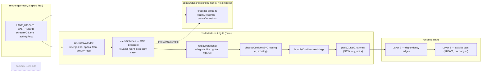
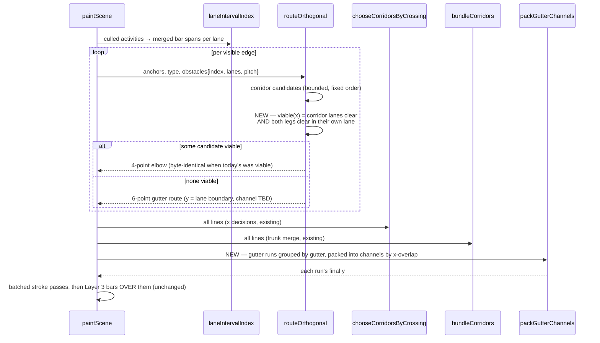
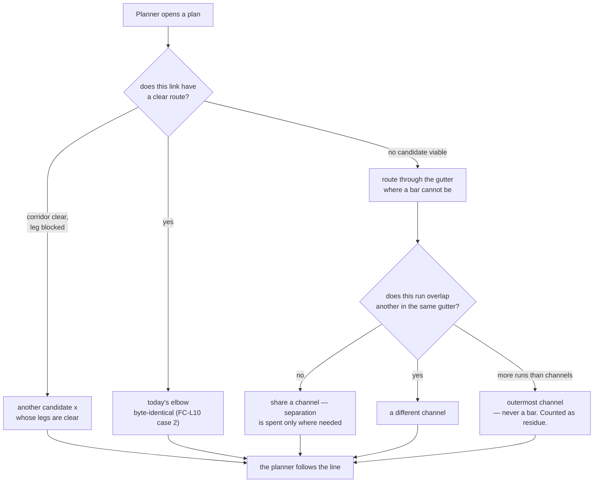

# Feature Spec: Logic legibility — a link that can be followed

- **Status:** Draft — awaiting approval before implementation
- **Author(s):** feature-analyst (Claude Opus 5)
- **Date:** 2026-09-22 · **amended 2026-09-22** (§0.8–§0.11, §2.7, §4.4 D8–D11) after the product
  owner answered all four critical questions and supplied the NetPoint reference. One answer —
  _adopt the NetPoint bar treatment_ — **withdraws a premise this spec's first draft reasoned
  from**, so Part B is promoted from a conditional late milestone to a load-bearing one and the
  sequencing changes. Amendments are additive and dated; the withdrawn reasoning is kept in place.
- **Tracking issue / epic:** _(none yet)_
- **Roadmap link:** _(none — a canvas-legibility epic, not a roadmap milestone)_
- **Conditions:** [`./conditions.md`](./conditions.md) — **to be committed alone, before any harness
  is edited or run** (ADR-0128's ordering; see that file's §0 for the compromise this epic inherits)
- **Implementation plan:** [`./implementation-plan.md`](./implementation-plan.md)
- **Related ADR(s):** amends/extends **ADR-0026** (canvas model), **ADR-0052 M5** (fan-out, lag
  anchors, the link refresh), **ADR-0064 M2** (obstacle-aware routing and the VHV fallback),
  **ADR-0065** (orthogonal corridors, bundling, the no-diagonals rule), **ADR-0069** (the shared
  lane packer), **ADR-0100/0141/0142** (the minimap), **ADR-0103** (the export composes the same
  scene), **ADR-0149** (the crossing-aware corridor pass — this epic measures the quantity that one
  did not). **An ADR is required** (§4.9). Number deliberately not pinned (ADR-0079 records a number
  being taken between a plan and its milestone).

> **Why a new directory rather than a fourth part of `docs/specs/diagram-legibility/`.** Two
> reasons, and the second is a gate finding. (1) That directory's `feature-spec.md` is the record of
> Parts A and B, whose FC-1/FC-2 were committed before M1 and judged in `m2-verdict.md`; rewriting
> it to describe a different problem destroys the evidence M3's withdrawal rests on — the same
> argument Part C made for its own file. (2) **`check:spec-status` reads `feature-spec.md` and
> `spec.md` only**, so `part-c-feature-spec.md` is invisible to it and still reads `Draft — awaiting
approval before implementation` today, three milestones after ADR-0149 shipped citing that
> directory. A `part-d-feature-spec.md` would inherit the same blind spot. This directory has a
> canonical `feature-spec.md`, so the gate sees it. The blind spot itself is filed (§3, new row).

---

## 0. What changed while reading the code

The brief for this spec carried a five-point diagnosis and said to treat every point as a hypothesis
— because Part C had **four premises contradicted by its own measurement**. Each was checked against
the tree today. **Four of the five hold as stated, one holds with a nuance that changes what M2 is
allowed to claim, and three things nobody had reported were found.** Every claim names the file and
line, or the command, that establishes it (§19.11 / ADR-0076).

### 0.1 The brief's five diagnosis points, checked

| #   | Claim                                                                       | Verdict                  | Established at                                                                                                             |
| --- | --------------------------------------------------------------------------- | ------------------------ | -------------------------------------------------------------------------------------------------------------------------- |
| 1   | Horizontal legs are never checked against bars                              | **HOLDS**                | `link-routing.ts:203-210` — `crossedLanes` excludes both endpoint lanes at `:142-148`; `free(x)` tests the corridor x only |
| 2   | Links paint **under** bars, so a crossed link vanishes                      | **HOLDS**                | `paint.ts:1053` "Layer 2: dependency edges"; `paint.ts:1622` "Layer 3: activity bars"                                      |
| 3   | The crossing metric never saw bars                                          | **HOLDS**                | `link-routing.ts:744-760` `snapshotSegments` iterates link polylines only; `crossing-probe.ts:334` counts link-vs-link     |
| 4   | Gutter legs still collide; `chooseCorridorsByCrossing` skips 6-point routes | **HOLDS, with a nuance** | `link-routing.ts:844` `if (line.length !== 4) continue;` — see §0.2                                                        |
| 5   | M-C4's verdict must be re-derived against the new metric, not inherited     | **HOLDS as an argument** | ADR-0149 D5 judged three rules on `x/link` alone; §2.6 gives the mechanism, and FC-L6 measures it                          |

### 0.2 The nuance on point 4, and why it changes what M2 may claim

`chooseCorridorsByCrossing` skipping 6-point lines is **not an oversight and is correct for what
that pass does.** Its own comment gives the reason in full (`link-routing.ts:840-843`): a six-point
route exists _because_ no single corridor was clear, so moving one of its two corridors would be
re-deciding `routeOrthogonal`'s search from the outside with less information than it had.

What is genuinely missing is a **different operation on a different axis**. Distributing gutter legs
is about a leg's **y**; that pass only ever moves a corridor's **x**. ADR-0149 D3 handed
distribution to the router in as many words — _"distributing legs within a gutter is handed to the
router as a corridor decision rather than kept alive as a pitch change wearing a different name"_ —
and `part-c-m-c0.md` M-C0-T4 repeats it: _"including, now, distributing legs within a gutter rather
than stacking them."_ **It was specified for M-C3 and no pass for the y exists.** That is the
accurate form of point 4: not a wrong skip, but a homeless operation.

The nuance matters twice over. It means M1 is a **new pass**, not an edit to an existing one; and it
means the skip's justification **lapses** the moment M2 makes the gutter route a deliberate first
choice rather than a last resort — which is the argument FC-L4's mitigation rests on, and it is
quoted there rather than asserted.

### 0.3 Found, not reported — a same-lane link is checked against nothing at all

`routeOrthogonal` returns a **two-point straight line before obstacles are consulted**:

```ts
// apps/web/src/features/tsld/render/link-routing.ts:182
if (from.y === to.y) return [from, to];
```

`from.y === to.y` holds whenever both bars are in one lane and their fan-out offsets match — which
includes the common uncrowded case where `computeEdgeFanOut` emits no offset at all
(`link-routing.ts:583` — `if (members.length < 2) continue;`, whose docblock at `:554-556` puts it
as _"A group of one gets no offset (and is omitted from the map), so an uncrowded diagram — the
common zero-lag FS chain — is byte-for-byte unmoved"_).

`packLanes` refuses same-lane time overlap but places bars in one lane **by time**, so A (days 1–10),
B (days 15–25) and C (days 30–40) legitimately share a lane, and a link **A → C** is drawn as a
straight horizontal **straight through B**. No candidate list, no fallback, no obstacle parameter —
the function has already returned.

**This is the sharpest instance of symptom (a), and it is the one most likely to be what a
13-activity plan shows.** A small plan packs into two or three lanes, so nearly every link is a
same-lane or one-lane hop; `part-c-m-c0.md` M-C0-T3 already measured that **115 of Unit 300's 188
links are one lane apart or less**. The product owner's words were _"even for a simple plan the
logic is mapping across other bars"_, and this is the only mechanism in the router that produces
that on a simple plan.

It is a **reading, not an experiment** (ADR-0139's label, used deliberately): the early return is
certain, and **how often it fires with a bar in the way is not**. M0-T3 counts it separately from
every other occlusion, so the two can be told apart.

### 0.4 Found, not reported — an occlusion instrument already exists and no document mentions it

`apps/web/scripts/measure-occlusion.mjs` and `crossing-probe.ts:1349-1453` (`countOcclusions`,
`readBoth`) are headed **"Part D M0"** and implement most of what this spec's M0 needs. Nothing
cites them: `rg -l 'measure-occlusion|countOcclusions|Part D'` over the whole repository returns
**two files, both of them the code itself**. No spec, no conditions file, no ADR, no
`docs/TECH_DEBT.md` row, no `docs/DECISIONS.md` entry, and **no recorded reading**.

Three consequences, all of which shape the plan:

1. **ADR-0128's ordering can still be honoured, and only just.** No threshold in
   [`./conditions.md`](./conditions.md) has been written against a number from it. What cannot be
   claimed is Part C's stronger property — that the instrument did not exist when the conditions
   were written. `conditions.md` §0 says so rather than glossing it.
2. **M0's first task is a review, not a build** (M0-T1), with its own deliverable. ADR-0149's own
   closing finding is that _a control that proves the right code ran says nothing about whether it
   ran on the right data_, and this harness family has already shipped one instrument defect that
   survived every number being taken (`WBS_SUMMARY` at day 0).
3. **It is an ADR-0105 instance in miniature.** Building a measurement instrument for an unspecced
   epic is not a spec trigger on its own, but it is the shape that ends with a milestone built
   before the conditions exist. Recorded here rather than stepped over (ADR-0071's lesson).

**The review already has three findings to start from**, each read from `countOcclusions`:

- **Tangency is excluded, and the tangent case is exactly the one ADR-0149 measured.** The test is
  `if (a.y <= r.y1 || a.y >= r.y2) continue;` (`crossing-probe.ts:1410`) — strictly inside the bar.
  A VHV gutter leg sits at `gutterY`, which expands to **exactly the upper lane's bar bottom edge**
  (`gutterY = laneTop(L) + laneHeight − pad = laneTop(L) + 23`, and that bar's `y2` is
  `laneTop(L) + 5 + 18 = laneTop(L) + 23`), so `a.y >= r.y2` is true and **all 68 of Unit 300's
  gutter legs score zero occlusions** — the same 58 of 68 that M-C0-T4 reports as lying _inside_ a
  painted bar with 0.0 px clearance. The two instruments disagree because one uses `>=` and the
  other `<=`. Neither is wrong; the reading is, if only one is quoted. M0-T1 reports **tangent** as
  its own column.
- **A link's own endpoint bars are excluded by strict x, which fails for `SF` and for clamped lag
  anchors.** `SF`'s corridor is `(from.x + to.x) / 2` (`link-routing.ts:194`), which may fall inside
  either bar; `lagAnchorPoints` deliberately clamps the walked anchor **onto** its bar
  (`link-routing.ts:408-411`) and `lagRunSegment` draws that stretch on purpose (ADR-0052 M5). The
  harness's own scene cannot exhibit either (`sceneFor` builds edges with no `lagDays`), so the
  defect is **latent for this fixture and live for any real plan**. FC-L1's named refutation covers
  it.
- **`readBoth` paints the scene twice** — once inside `read`, once for the occlusion pass
  (`crossing-probe.ts:1436-1446`) — so the two halves of one row come from two paint runs. They
  should be identical, being deterministic; one paint feeding both removes a class of mismatch that
  nothing would report.

### 0.5 Found, not reported — `check:spec-status` cannot see a multi-part epic's later parts

ADR-0131's gate reads `docs/specs/*/feature-spec.md` and `spec.md`. `part-c-feature-spec.md` matches
neither, so it still carries `**Status:** Draft — awaiting approval before implementation` while
ADR-0149 cites its directory and three of its milestones have shipped. The gate passes because the
directory's _other_ spec says `Accepted`.

This is the exact class that gate exists to close — **a spec header that stopped being nobody's step
and became nobody's file** — and it is why this epic gets its own directory (§ the note under the
header). Filed as a register row rather than fixed here: widening the glob is a shared-gate change,
which is an ADR-0105 trigger of its own and must not ride along inside an epic's milestone
(ADR-0136's closing rule).

### 0.6 The one thing in the brief that is a hypothesis about the reader, not about the code

The brief reports the product owner's screenshot as the 144-activity **Unit 300 Amine** plan drawn
in **12 rows**. Part C established that Unit 300 draws in 12 rows in **exactly one** of five
configurations — _arranged, WBS band on_ (`part-c-m-c0.md` M-C0-T3, configuration **D**;
`part-c-feature-spec.md` §0.1's table) — and M-C0-T3 measured that configuration as **the worst of
the five for crossings**: +26.9 % at 4 px/day and +26.5 % at 12 px/day against the same plan
arranged with the band off.

If that identification is right, then **one remedy is available today at zero cost and is already
this repository's decision**: ADR-0149 D7 kept the band's default **off** on exactly this evidence,
and the product owner appears to be looking at it **on**. That is not a fix for the epic — the
complaint survives band-off — but it is a fact worth establishing before spending a milestone on it,
and it is **CQ-2**, which is cheap to ask and cannot be answered from here.

### 0.7 What is inherited rather than re-verified, stated so a reader knows which is which

§19.11 says a decision-bearing claim names what was **run or read** to establish it, and that a
pointer to another document is not evidence. Every citation into `render/`, `scripts/` and
`components/layout/` in this spec was opened today. The following are **inherited from Part A or
Part C and were not re-opened**, because none of them decides anything in this document — they
appear as context or as a cost this epic must respect, and each is re-verified by the milestone that
would rely on it:

| Inherited claim                                                                            | From                                  | Re-verified by |
| ------------------------------------------------------------------------------------------ | ------------------------------------- | -------------- |
| `interchange.service.ts:1096` calls `packLanes` directly, over every dated activity        | `part-c-feature-spec.md` §0.1 (today) | M4-T3          |
| `compute.ts:545` / ADR-0035 §24 — a summary's span is derived from its children            | `part-c-m-c0.md` (2026-09-22)         | M0-T1          |
| `pack-lanes.ts:45-48` — the hint never opens a lane, so lane count is identical either way | `part-c-feature-spec.md` §0.3 (today) | M4-T1          |
| `viewport.ts:200-216` — `fitToContent` pins `originY` and discards `extent.maxLane`        | `part-c-conditions.md` FC-C4 limb A   | FC-L5 limb B   |
| `a11y.ts` speaks the lane number, so a repack changes every moved row's announcement       | `feature-spec.md` §3 (Part A)         | M4-T3, M6-T2   |
| `docs/DECISIONS.md:3111-3157` — the 2026-07-31 first report of this complaint family       | `feature-spec.md` §0.1 (Part A)       | not relied on  |
| `LANE_HEIGHT` is 65 lines across 18 files under `features/tsld/`                           | `part-c-feature-spec.md` §0.3 (today) | M3-T2          |

**`render-model.ts:82` / `:102` / `:31` and `shoot.mjs:231` and `tsld-motif.tsx:41-42` were
inherited from Part A and then re-opened anyway**, because they are the glyph budget M3 has to
satisfy and a stale number there would mis-price a milestone. All four hold:
`GLYPH_CAP_OVERHANG = 3`, `SUMMARY_TAB_H = 4` dropping **below** the bar (`summaryTabRects`'s
`y = rect.y + rect.h`, `:110`) into a 5 px pad — **1 px clearance** — `BAR_RADIUS = 3`, six linked
activities, and a 6/12 motif ratio.

---

## 0.8 The NetPoint reference, measured rather than described (added 2026-09-22)

The product owner supplied two images. The coordinator **measured the ratios** rather than
characterising the style — second image, a 2011–13 procurement schedule, ~17 activities:

| quantity              | NetPoint          | SchedulePoint                   | ratio |
| --------------------- | ----------------- | ------------------------------- | ----- |
| row pitch             | ~68 px            | **28 px** (`geometry.ts:40`)    | 2.43× |
| bar thickness         | ~5 px             | **18 px** (`geometry.ts:42`)    | 0.28× |
| bar as share of a row | ~7 %              | **64 %**                        | —     |
| label                 | **above** the bar | **inside** it (`paint.ts:1898`) | —     |

A NetPoint bar is a **thin line with a hollow node circle at each end**, the name centred above, the
date at each end below, and the duration in days as a blue number centred below. **Links are yellow
with red arrow ticks — a different hue from bars entirely — and they run in the clear channel, not
along bar centre-lines.**

**Three things follow that are not style observations.**

1. **The reference's default routing is this spec's M2.** NetPoint runs horizontals in the channel,
   _except_ where sequential activities sit on one row node-to-node with no elbow at all. That is
   exactly "at bar level when the run is clear, in the gutter when it is not" — the design in §4.4
   D2/D3, arrived at independently and now corroborated by the picture the product owner chose. It
   is also the argument against the stronger variant (§4.5, _always_ gutter).
2. **The chain-row observation is structural, and it bears on M4** — §0.9.
3. **The thin bar is the largest single source of routing channel**, and it is the amendment's
   headline — §0.10.

## 0.9 Chain rows: the second verdict in this epic that may flip when the metric is corrected

NetPoint chains sequential activities along **one row**: `FBP Specification → Bid & Award Fluid Bed
Processor → Submittals/Approvals` is one row; `Automation Spec Review → Automation Procurement →
Software Development → Software FAT → Factory Delivery` is another.

That is **ADR-0149 D5's "chain rows" candidate**, which measured **+85.8 %** and was named the worst
of three — **on link-versus-link crossings**, the metric §1 establishes was not the complaint. It is
therefore a first-class M4 hypothesis with its own clause (FC-L6), not a footnote.

**And its counter-hypothesis is named here so the measurement is not framed to confirm.** H1: a link
between adjacent members of a chain in one row has nothing between them, so it needs no traversal —
chain rows should be _best_ on occlusion. H2: chain rows puts **more bars per row**, and occlusion is
a leg meeting a bar **in its own lane**, so every link _out_ of a chain has a leg in a crowded row.
The two pull opposite ways and neither is obviously dominant. M4 reports same-row and cross-row links
**separately**, because the aggregate cannot distinguish them.

**This would be the third flip in one epic** — after FC-C1's comparands and ADR-0149 D5 itself. Three
is a pattern rather than three coincidences, and the ADR should say so: _the metric, not the
threshold, is what these decisions were wrong about._

## 0.10 The bar and the pitch are ONE question, and the arithmetic says so

Decision 5 (thin bar) and decision 6 (pitch is spendable) were answered separately and **cannot be
built separately**:

- A 5 px bar centred in a 28 px row leaves **11.5 px above it**. A text line at the canvas's label
  size needs roughly 12–14 px. **So "name above the bar" is not buildable at the shipped pitch.**
- The reference's own row is **~68 px** against our 28, and spends the difference on exactly that
  label, the two date labels and the duration.

So M3 is **one milestone covering bar thickness, label placement, pitch and the glyph budget**, and
the alternative — shipping a thin bar first and the pitch later — would put a five-pixel bar under a
label the row cannot hold.

**What the thin bar buys, and what it does not.** Gross arithmetic from the shipped constants,
labelled as arithmetic and not as measurement: clear band **10 px → ≈ 23 px** at constant pitch,
usable channel band **± 4 px → ± 11 px**, i.e. roughly **2.2× the channels for no pitch at all** —
the _"~57 % of every row handed back"_ figure. **It is a GROSS figure. The label above spends some of
it back, and the net is an output of the design** (FC-L11, which forbids quoting the gross alone).

**And it buys nothing for symptom (a).** A horizontal leg runs at the bar's **centre-line**, so
whether it meets a bar in its lane is an **x-overlap** question that the bar's height does not enter.
**Only M2 serves occlusion.** Stated here because "we made the bars thinner" is the most natural
wrong thing to believe about this epic.

## 0.11 The coordinator's independent verification, and the 77.1 % floor

Two of this spec's findings were re-derived independently before being relayed, and both hold:

- **`link-routing.ts:182` returns before obstacles are consulted** (§0.3).
- **`gutterY` computes to 55.0 against a lane-0 bar bottom of 55.0** at `originY = 32` — the same
  arithmetic §0.4 gives, confirmed by execution rather than by reading. So the instrument's
  strict-interiority test (`crossing-probe.ts:1410`) **excludes every gutter leg**.

A reading of **77.1 % of links occluded** was taken with it. **It is a FLOOR and is quoted that way
everywhere in this epic**, for the reason immediately above: all 68 of Unit 300's gutter legs — 58 of
which M-C0-T4 measured as lying _inside_ a painted bar at 0.0 px clearance — score **zero** under it.
Its configuration is not recorded, and **decision 7 has since moved the baseline to band-off**, so
M0-T3 re-takes it with the configuration named.

**It also pre-satisfies FC-L2**, which asked for ≥ 0.10 and was written before the figure arrived.
`conditions.md` §0.2 records that compromise in full: **the threshold is not moved**, the condition is
marked pre-satisfied, and its withdrawal clause is recorded as moot rather than deleted.

---

## 1. Business understanding

### Problem

**The product owner used `web-v0.141.0` — the release ADR-0149 shipped — and reported that nothing
they can see has changed:** _"the logic is still difficult to read. even for a simple plan the logic
is mapping across other bars."_

ADR-0149's **−20.8 %** is real and is not in dispute. It is a true statement about **link-versus-link
crossings**, and the sentence above is about **link-versus-bar occlusion**. No instrument in this
repository had ever counted the second, and the one that judged four Part C milestones
**structurally could not see it**: `crossingsOf` builds its index from link polylines only
(`link-routing.ts:744-760`), and the recording context discards `fillRect` entirely
(`crossing-probe.ts:103`), which is how a bar is painted.

**That is the founding fact of this epic, and it is a method failure rather than an arithmetic one.**
Part C measured a quantity, improved it, and shipped — and the quantity was not the complaint. The
answer is not a different single number: it is that **the complaint has four parts, and they are
partly opposed**, so the verdict has to be a vector (FC-L0).

**The four symptoms, in the product owner's own framing** (clickable round, 2026-09-22 — _"all four
bite"_):

| Symptom                          | Mechanism                                                                                                                                                                    | Measured today                                                                         |
| -------------------------------- | ---------------------------------------------------------------------------------------------------------------------------------------------------------------------------- | -------------------------------------------------------------------------------------- |
| **(a) lines vanish behind bars** | Horizontal legs are checked against nothing (`link-routing.ts:203-210`); same-lane links are not checked at all (`:182`); links paint under bars (`paint.ts:1053` / `:1622`) | **77.1 % of links — a FLOOR** (§0.11)                                                  |
| **(b) lines cross each other**   | Corridors and legs share space                                                                                                                                               | 2.069 per link after ADR-0149 D4, from 2.612                                           |
| **(c) lines travel too far**     | Lanes are packed for minimum **count**; the `predecessorsOf` hint may never open a lane (`pack-lanes.ts:45-48`)                                                              | mean \|Δlane\| 1.78, 14 links over five lanes (Unit 300, shipped)                      |
| **(d) lines bunch on one y**     | `gutterY` has **no per-link term at any pitch** (`link-routing.ts:254-257`)                                                                                                  | **13 of 68** gutter legs on one y; **58 of 68** inside a painted bar; 0.0 px clearance |

**All four now carry a number, and the first one carries the worst kind.** Row (a) had never been
measured when this spec was drafted; it has since been measured at **77.1 %**, and that figure is a
**floor** rather than a reading — its instrument's strict-interiority test excludes **every** gutter
leg, including the 58 of 68 that ADR-0149 measured as lying _inside_ a painted bar at 0.0 px
clearance (§0.11). **It is quoted as a floor, with that blind spot named, everywhere it appears in
this epic.** Its configuration is unrecorded and decision 7 has since moved the baseline to band-off,
so M0-T3 re-takes it.

Note also that rows (a) and (d) are **not independent counts of independent defects**: every gutter
leg the (a) instrument silently drops is a leg the (d) row counts, which is why a single scalar for
"how bad is the picture" was never going to work.

**Why now.** This is the **third** report of the same family of complaint (2026-07-31, 2026-09-21,
2026-09-22), each after a remedy shipped for the previous one. `docs/DECISIONS.md:3111-3157` records
the first; `m2-verdict.md` records the second being half-answered and saying so in its own words
(_"'withdrawn' must not be read as 'solved'"_). A third report after two measured remedies is the
signal that the **quantity**, not the threshold, was wrong.

### Users

| Role                                  | What they need from this                                                                                                                                                                                               |
| ------------------------------------- | ---------------------------------------------------------------------------------------------------------------------------------------------------------------------------------------------------------------------- |
| **Planner** (ADR-0016)                | The primary user. Reads and draws the TSLD. The only role that can press `Arrange`, and the one whose complaint opened this.                                                                                           |
| **Contributor**                       | Reads the diagram; reports progress. Benefits from legibility only.                                                                                                                                                    |
| **Viewer**                            | Reads the diagram. Benefits from legibility only.                                                                                                                                                                      |
| **Org Admin**                         | As Planner, plus the pen override.                                                                                                                                                                                     |
| **External Guest** (ADR-0051)         | Reads a shared plan through `/share`. Same painted canvas, inherits every fix, controls none of them.                                                                                                                  |
| **The person who is not in the room** | Receives the exported PNG/PDF or the printed programme. They cannot pan, zoom or re-arrange. For them the picture **is** the product, which is why a link that vanishes behind a bar outranks one that is merely long. |

### Primary use cases

1. A planner opens a plan — imported or authored, large or small — and can follow any single
   relationship from its predecessor to its successor without losing the line.
2. A planner reading a dense area can tell two runs through the same gap apart.
3. A planner exports or prints the diagram and hands it to somebody who was not in the room, and
   that artefact is as followable as the screen.
4. A planner asks what arranging the plan will cost, and is told in the same terms the picture is
   judged in.

### User journeys

**Happy path.** Planner opens a packed plan → every relationship is drawn either as a short clear
run at bar level, or through a gutter where no bar can be → two runs sharing a gutter sit in
different channels → the planner traces a link end to end without it passing behind anything.

**Alternate — the plan is dense.** Some link has no clear route at all: every corridor is blocked
and the gutter's channels are full. The line falls back to today's shape, which is a line that can
be occluded — **stated as the designed residue rather than presented as solved**, and counted by the
same instrument that judges the milestone (FC-L4's residual).

**Alternate — the plan is untidy.** Planner presses **Arrange** → the confirmation states what it
will do and what it costs → confirms → lanes repack → one Undo reverses it (ADR-0048 M2.3). The
command, its gate and its copy are unchanged by M1–M3; M4 may change what it _does_, and then its
copy changes with it.

**Alternate — nothing to do.** `computeArrangeChanges` returns empty ⇒ _"Lanes are already arranged;
nothing to move."_ Unchanged.

### Expected outcomes

- A link that has a clear route is drawn on it; a link that does not is drawn through a gutter, not
  through a bar.
- Two runs through one gutter read as two lines.
- **An activity reads as a node on a timeline** — a thin bar with a node at each end, its name above,
  its dates and duration below — rather than as a block of duration (decision 5).
- Every quantity the product owner named has a number attached to it, taken on their plan **band-off**
  (decision 7), before and after — including the ones a remedy made worse.
- The exported and printed diagram match the screen (ADR-0103's rule, held).
- **The WBS band is off**, which is the shipped default and the configuration every figure names.

### Success criteria

Each is a falsification condition in [`./conditions.md`](./conditions.md), **committed in its own
commit before any harness is edited or run**. Summarised:

| #      | Criterion                                                                                                                                                                                                                                                  |
| ------ | ---------------------------------------------------------------------------------------------------------------------------------------------------------------------------------------------------------------------------------------------------------- |
| FC-L0  | The reading is a **vector** of four quantities; a candidate measured on fewer is not judged.                                                                                                                                                               |
| FC-L1  | The occlusion metric discriminates, against a structural prediction committed in advance (one-per-row measures zero).                                                                                                                                      |
| FC-L2  | **PRE-SATISFIED** on the relayed 77.1 % floor; the ≥ 0.10 threshold is **not moved**, the clause is moot, and M0-T3 re-takes it band-off.                                                                                                                  |
| FC-L3  | The gutter becomes a channel: `legsTouchingABar` → 0, legs distributed, judged on a picture, FC-6 holds. **Read twice** — a progress reading at today's geometry, the verdict at M3's.                                                                     |
| FC-L4  | Leg checking realises **≥ 70 % of the avoidable occlusions M0 measured**, with crossings up by ≤ 10 % — and `chooseCorridorsByCrossing` is inside the condition, not beside it.                                                                            |
| FC-L5  | Paint cost ≤ baseline + 2.00 pp with the machine's spread beside it; `paint.routing-budget.test.ts` green **without being edited**. Three limbs now: routing, pitch, **and the row**.                                                                      |
| FC-L6  | A travel or assignment candidate improves one quantity by ≥ 20 % while worsening none by > 10 %, or is not offered — with **chain rows as a named hypothesis and a named counter-hypothesis**.                                                             |
| FC-L7  | The export, the minimap and the AT layer survive whatever height costs. **Now the likeliest to bind**, since the reference row is ~68 px against our 28.                                                                                                   |
| FC-L8  | **REWRITTEN** — the row geometry: five limbs (every cue survives or its replacement is named; FC-6; every `BAR_HEIGHT`-justified constant re-derived; a picture against the reference; every new colour through all three canvas traps in a real browser). |
| FC-L9  | Determinism at both tiers, verified red.                                                                                                                                                                                                                   |
| FC-L10 | Byte-identity when not asked — three cases. **Case 2 is void from M3 onward**, where the rollback contract becomes the commit boundary plus the golden log.                                                                                                |
| FC-L11 | **NEW** — the row's **net** clear-band gain is measured, and the gross _"~57 % handed back"_ figure is never quoted alone.                                                                                                                                 |
| FC-L12 | **NEW** — the small fixture's value is its **logic density**, asserted by its own test in five limbs and verified red against a sparse version.                                                                                                            |

### Open questions

See §2.7. **All four critical questions (CQ-1 … CQ-4) were answered on 2026-09-22** and are recorded
there as decisions. One new non-blocking question (CQ-6) falls out of the answers and carries a
default; CQ-5 remains decided by default.

---

## 2. Functional requirements

### 2.1 User stories & acceptance criteria

> **US-1** — As a **Planner**, I want a relationship's line never to disappear behind an unrelated
> bar, so that I can follow it from end to end.
>
> **Acceptance criteria**
>
> - **Given** a lane holding bars A, B and C in time order and a link **A → C**, **when** the
>   diagram is painted, **then** the link's horizontal run does not pass through B's painted extent.
>   (Today it does, and nothing checks: `link-routing.ts:182` returns before obstacles exist — §0.3.)
> - **Given** a link whose preferred corridor would require a leg through a bar, **when** the route
>   is chosen, **then** a corridor whose legs are clear is preferred, within the existing bounded
>   candidate list.
> - **Given** no corridor in that list has clear legs, **when** the route is chosen, **then** the
>   link is routed through the inter-lane gutter, where a bar cannot be.
> - **Given** no clear route exists at all, **when** the route is chosen, **then** the line falls
>   back to today's shape and the residue is **counted**, not hidden (FC-L4).
> - **Given** a link whose legs are already clear, **when** the route is chosen, **then** the
>   polyline is **byte-identical** to today's, point for point (FC-L10 case 2).

> **US-2** — As a **Planner**, I want two relationships running through the same gap to read as two
> lines, so that a dense area is still information rather than a smudge.
>
> **Acceptance criteria**
>
> - **Given** two links whose gutter runs overlap in x in the same gutter, **when** the diagram is
>   painted, **then** they are drawn at different y.
> - **Given** two links whose gutter runs do **not** overlap in x, **when** the diagram is painted,
>   **then** they may share a y — separation is spent only where it is needed.
> - **Given** any gutter run, **when** it is drawn, **then** its y lies strictly inside the gutter
>   and outside every bar's vertical extent in both adjacent lanes (FC-L3, today 58 of 68 fail).
> - **Given** the same plan painted twice, or with the `activities`/`edges` arrays permuted, **then**
>   every channel assignment is identical (FC-L9). A channel that varies between frames moves a line
>   without the viewport moving.
> - **Given** more overlapping runs than the gutter has channels, **when** the diagram is painted,
>   **then** the surplus degrade to sharing the outermost channel — never to overlapping a bar.

> **US-3** — As a **Planner**, I want to know what the picture costs in each of the terms I
> complained about, so that a change is a choice rather than a surprise.
>
> **Acceptance criteria**
>
> - **Given** any milestone in this epic, **when** its verdict is recorded, **then** it carries all
>   four quantities and the row count (FC-L0), including any that got worse.
> - **Given** a candidate that trades one symptom for another, **when** the trade exceeds FC-L4's or
>   FC-L6's ceiling, **then** it is put to the product owner with both numbers and both rendered
>   pictures, and is **not** resolved inside a milestone.

> **US-4** — As a **Planner**, I want an activity to read as a **node on a timeline** rather than as
> a block of duration, so that the logic between activities is the thing I see first.
>
> **Amended 2026-09-22.** This story was conditional on CQ-3 and scoped to link ink. **The product
> owner answered it by adopting the NetPoint bar treatment** (decision 5), which withdraws the
> premise the narrowing rested on. It is now unconditional, load-bearing, and the subject of M3.
>
> **Acceptance criteria**
>
> - **Given** any plan, **when** the diagram is painted, **then** an activity is a **thin bar with a
>   node glyph at each end**, its **name above**, its **dates and duration below** — the reference's
>   treatment, measured in §0.8 rather than described.
> - **Given** any plan, **when** the diagram is painted, **then** every cue the bar carries today
>   survives **or its replacement is named as a product-owner decision**: criticality, near-criticality,
>   the progress band and its front divider, LOE brackets, WBS summary tabs, milestone diamonds,
>   constraint pins, the feasible window, the selection and hover rings. **Two are known in advance not
>   to survive as they are** — an in-bar progress band and an inside label have no room in a thin bar.
> - **Given** the thin bar, **when** criticality is encoded, **then** it is **not colour-only**
>   (WCAG 1.4.1). Today's second channel is a dashed emphasis outline, and **a dash on a 5 px outline
>   is not a channel a reader can use** — so a second channel is designed, not assumed.
> - **Given** the thin bar, **when** any constant justified by `BAR_HEIGHT = 18` is used, **then** it
>   has been **re-derived rather than carried** — `SUMMARY_TAB_H`, `GLYPH_CAP_OVERHANG`,
>   `FAN_OUT_MAX_PX`, `TAIL_HEIGHT`, `BAR_RADIUS`, `LABEL_INSIDE_MIN_PX` (FC-L8 limb 3).
> - **Given** the thin bar, **when** links converge on one bar end, **then** the **node glyph carries
>   them** — `FAN_OUT_STEP_PX = 3` already exceeds a 5 px bar's half-height of 2.5, so fan-out as
>   designed cannot work and the reference supplies its replacement.
> - **Given** any new canvas colour value, **when** it is resolved in a **real browser**, **then** it
>   resolves to a parseable colour under the `canvas` surface scope (§3, the three traps). The
>   reference's links are a different hue entirely, so this **will** fire.
> - **Given** a screen-reader user on the parallel listbox, **when** this ships, **then** the count
>   of AT-reachable activities is unchanged (ADR-0063 §4) and every spoken row says what it said before.

> **US-5** — As **the person who is not in the room**, I want the exported and printed diagram to be
> as followable as the screen, so that the artefact I was sent is usable.
>
> **Acceptance criteria**
>
> - **Given** any change in this epic, **when** the diagram is exported to PNG/PDF or printed,
>   **then** the routed lines in the artefact match the screen — ADR-0103's rule, held by the export
>   and the print reading the same `scene-layers.ts` composition.

> **US-6** — As an **External Guest** on a share link, I want the shared diagram to be as legible as
> the member's.
>
> **Acceptance criteria**
>
> - **Given** the guest read-only view, **when** it paints, **then** it carries every routing change
>   with no new capability and no new data in the payload.

### 2.2 Workflows

**Painting a link (the only workflow this epic changes in M1–M3).**

1. `paint.ts:1093-1101` builds `laneIntervalIndex` **once per frame from the culled set**, gated on
   `refresh && scene.linkRouting === true`.
2. `lineOf` (`:1111-1194`) resolves anchors (time-true, fan-out offsets) and calls `routeOrthogonal`
   with the obstacle parameter.
3. `routeOrthogonal` chooses a corridor. **This is where M2 lands**: the corridor's two horizontal
   legs become part of the viability test, and the gutter route becomes the structured fallback
   rather than the last resort.
4. Every line for the frame is collected into `lines` (`:1204-1212`).
5. `chooseCorridorsByCrossing` moves four-point elbows for crossings (`:1228`, ADR-0149 D4).
   **M2-T4 may extend it to six-point routes.**
6. `bundleCorridors` merges near-identical verticals (`:1232`).
7. **M1 lands here**: a new channel pass assigns each gutter run a y within its gutter, after the
   x decisions are final and before the draw passes.
8. `drawEdges` strokes two batched passes plus the highlight passes (`:1234-1295`).

**Arrange (unchanged in shape).** Pen-gated command → `computeArrangeChanges` → `packLanes` → empty
⇒ announce; non-empty ⇒ confirm → batch write → announce → undo entry. **M4 alone can change what
this does**, and then its confirmation copy changes with it (US-3).

### 2.3 Edge cases

| Case                              | Expected behaviour                                                                                                                                                                                                                                         |
| --------------------------------- | ---------------------------------------------------------------------------------------------------------------------------------------------------------------------------------------------------------------------------------------------------------- |
| Plan never recalculated           | No `earlyStart` ⇒ `activityRect` returns null ⇒ no bar, no rect, no obstacle. Unchanged.                                                                                                                                                                   |
| Plan with one activity, or none   | No links. Every pass is a no-op and must be byte-identical (FC-L10).                                                                                                                                                                                       |
| Same-lane link, nothing between   | Two-point straight line, **byte-identical to today** — the check finds nothing and changes nothing.                                                                                                                                                        |
| Same-lane link, a bar between     | **The case this epic exists for at small scale** (§0.3). Routed through a gutter.                                                                                                                                                                          |
| Adjacent lanes                    | `crossedLanes` is empty, so no corridor can hit a bar — but a **leg** still can, and that is the new check. `chooseCorridorsByCrossing` already refuses to inherit the skip for its own reason (`link-routing.ts:826-837`).                                |
| Milestone endpoint                | `activityRect` returns a 14 × 14 box around the diamond (`geometry.ts:583-591`). The bounding box overstates the painted diamond off the centre-line; at the centre-line, where legs run, it is exact. Stated rather than corrected.                       |
| Zero-lag `FS` chain, uncrowded    | No fan-out offsets ⇒ `from.y === to.y` for a same-lane pair. The commonest shape in the product, and the one §0.3 is about.                                                                                                                                |
| Lagged link with a clamped anchor | The anchor sits **on** its own bar by design (ADR-0052 M5); the lag run is drawn there on purpose. Must not be counted or re-routed as an occlusion (FC-L1's refutation).                                                                                  |
| Gutter full                       | Surplus runs share the outermost channel — never a bar. Counted as residue.                                                                                                                                                                                |
| WBS band on                       | Summaries leave the scene (ADR-0063) and their lanes stay in the model. Fewer bars ⇒ fewer obstacles ⇒ different routes; the vector is read in both states.                                                                                                |
| Guest share view                  | Read-only; inherits everything; no payload change.                                                                                                                                                                                                         |
| Gantt view                        | One bar per row, does not use `packLanes` or `routeOrthogonal`, and its dependency arrows are a separate default-off layer (ADR-0095). **Out of reach for M1–M4**; M5's link ink could reach it and M0-T6 establishes whether by reading, not by assuming. |
| Minimap                           | Draws its own decimated picture with no links at all (ADR-0100). Unreachable by M1–M2; reachable by a **pitch** change (M3), which is the first thing in this epic that could move `docs/TECH_DEBT.md` #323's number.                                      |

### 2.4 Permissions

Nothing in this epic changes the permission model, and that is checkable rather than asserted:

| Capability           | Role                                                    | Scope                         | Gate                                                             |
| -------------------- | ------------------------------------------------------- | ----------------------------- | ---------------------------------------------------------------- |
| Read the diagram     | Viewer, Contributor, Planner, Org Admin, External Guest | organisation / per-plan share | existing — **unchanged**                                         |
| Press `Arrange`      | Planner, Org Admin                                      | organisation                  | `penGated: true` + `canAutoArrange` — **unchanged**              |
| Write lane positions | Planner, Org Admin holding the pen                      | organisation                  | positions endpoint + `assertHoldsPen` (ADR-0028) — **unchanged** |
| Import packing       | the import's actor                                      | organisation                  | existing (ADR-0069) — **unchanged unless M4 ships** (CQ-5)       |

Routing and channel assignment are **render decisions and take nothing**: they happen in the
painter, per frame, from data the client already holds.

### 2.5 Validation rules

- **Determinism is a validation rule, not a nice-to-have.** Every new pass takes a total order
  (`gutterLane`, `x0`, `x1`, edge key — the key-based discipline `computeEdgeFanOut` already uses at
  `link-routing.ts:584-588`), and a property test asserts output equality across input permutations.
- **Bounded work.** No unbounded search on the paint path. _"Bounded work is the contract and an
  unbounded search on the paint path is how a draw budget dies"_ (`link-routing.ts:230-233`). Every
  new pass has a stated bound, and `paint.routing-budget.test.ts` is the gate (FC-L5).
- **One bar-geometry source.** Every occlusion question — the router's and the harness's — is
  answered from `activityRect` through the existing `LaneIntervalIndex`. A second opinion about
  where a bar is would disagree exactly when it mattered (`link-routing.ts:84-89`; M-C0-T4's rule).
- **One predicate.** The rule the router uses to refuse a route and the rule the harness uses to
  count an occlusion are **the same exported function**, so a residual occlusion is always
  explainable as _"no viable route existed"_ rather than as two implementations disagreeing
  (ADR-0065's argument, applied to an instrument and its subject).
- **Channel geometry.** A channel's y is `screenYOfLane(L+1) ± k`, `|k| ≤ pad − 1`, so it cannot
  enter a bar's extent at any pitch. Expressed as an inequality a test asserts, not as a comment.

### 2.6 Error scenarios

| Scenario                             | Detection                                                                     | User-facing result                                                       | Status |
| ------------------------------------ | ----------------------------------------------------------------------------- | ------------------------------------------------------------------------ | ------ |
| No viable route for a link           | the viability predicate                                                       | today's line, possibly occluded — **counted as residue**, never hidden   | —      |
| Gutter channels exhausted            | the channel pass's cap                                                        | surplus share the outermost channel; never a bar                         | —      |
| Router handed a malformed scene      | pure function                                                                 | terminates, returns a valid polyline; never throws on the paint path     | —      |
| Canvas 2D handed an unparseable fill | **silent** — `fillStyle` discards it and keeps the previous colour (ADR-0121) | development-time throw in the painter; real-browser check in the harness | —      |
| Pen not held when `Arrange` pressed  | `penGated` shading + `disabledReason`                                         | shaded with its reason (ADR-0082) — unchanged                            | —      |
| Positions write conflicts (M4 only)  | optimistic lock                                                               | existing conflict banner — unchanged                                     | 409    |

### 2.7 Open questions — **all four critical questions were ANSWERED on 2026-09-22**

> **The answers are recorded below each question rather than replacing it.** Three of them confirm
> the default this spec had already stated, which is worth knowing; **one does not, and it withdraws
> a premise this document reasoned from** — so deleting the question would delete the reasoning the
> amendment corrects. `conditions.md` §1 carries the same eight decisions in the form that binds a
> condition.
>
> | CQ       | Answer                                                                            | Was it the default?     |
> | -------- | --------------------------------------------------------------------------------- | ----------------------- |
> | **CQ-1** | **Yes** — pitch is spendable. M3 exists.                                          | yes                     |
> | **CQ-2** | The **WBS band goes OFF**; band-off is the baseline. They did not know it was on. | yes                     |
> | **CQ-3** | **ADOPT the NetPoint bar treatment.** Part B is promoted and load-bearing.        | **NO — see §0.8–§0.10** |
> | **CQ-4** | **Build the fixture; do not wait.** Its value is **logic density**.               | partly                  |

**CQ-1 — ANSWERED: YES — is the height budget spendable on lane PITCH as well as on row COUNT?**
_"As many rows as it takes. No cap."_ was said about **rows**. Widening the 10 px gutter
(`LANE_HEIGHT − BAR_HEIGHT`) to hold more distinguishable channels spends vertical space too, and it
buys capacity for symptom (d) without touching assignment at all. **This needs an answer because it
decides whether M3 exists.**

It is not a re-run of a withdrawn milestone, and the distinction is written down so a later reader
does not read it as one: ADR-0149 D3 withdrew the pitch on the measured ground that
`gutterY` _"has no per-link term at any pitch"_, so eleven lines at one y stay eleven lines on top of
each other however tall the gutter is. **The case that decision could not measure is pitch WITH a
per-link term**, which M1 creates. The same file hands distribution to the router in as many words.

**Default if unanswered:** **yes, pitch is in scope as a measured parameter**, judged by the same
conditions, with row count unchanged — because the gutter is where the horizontals must go once
bars are constitutionally supreme (decision 3), and its capacity is then the binding constraint on
(d). The cost is real and is stated: `LANE_HEIGHT` is **65 lines across 18 files** under
`apps/web/src/features/tsld/`, and the bar's vertical budget is 5 px a side with 4 px already spent
by `SUMMARY_TAB_H` (`render-model.ts:102`), so a pitch change is a **budget re-allocation across
four glyph families**, which is what FC-6 exists to gate.

> **ANSWER (decision 6): yes.** The default holds and M3 exists. **What changed with it is that M3
> is no longer a milestone of its own**: §0.10 establishes by arithmetic that a 5 px bar leaves
> 11.5 px above it at pitch 28 against a label's 12–14 px, so _"name above the bar"_ is unbuildable
> at the shipped pitch and the bar, the label and the pitch are **one decision in one milestone**.
>
> **And the `SUMMARY_TAB_H` clearance quoted above must be re-derived, not carried.** At bar 5 the
> pad is 11.5 px, so the 1 px clearance becomes ~7.5 px — **the problem inverts**: a 4 px tab under a
> 5 px bar is nearly as tall as the bar, which is a **proportion** problem and not a clearance one.
> Five more constants break differently at 5 px and each is enumerated in FC-L8 limb 3, the sharpest
> being `FAN_OUT_MAX_PX`, whose `FAN_OUT_STEP_PX = 3` **already exceeds** a 5 px bar's half-height of
> 2.5 — so fan-out as designed cannot work at all, and the reference's node glyph replaces it.

**CQ-2 — ANSWERED: THE BAND GOES OFF — which configuration is the product owner in?** Their screenshot shows Unit 300
in **12 rows**, and Part C measured that as **exactly one** of five configurations: _arranged, WBS
band on_ — which M-C0-T3 measured as the **worst** of the five for crossings (+26.9 % at 4 px/day
against the same plan with the band off), and on which evidence ADR-0149 D7 kept the band's default
**off**. If they have turned it on, a zero-cost improvement to one of the four symptoms is available
today, and the epic's baseline is the wrong row.
**Default if unanswered:** M0 measures all five configurations; the verdict is read from **arranged,
band off** (the shipped default) with the band-on row printed beside it, and the discrepancy is
reported rather than resolved.

> **ANSWER (decision 7): the band goes OFF, and the epic re-baselines against band-off.** The
> identification was right and **the product owner did not know it was on** — so they had been
> reading the one configuration of five that M-C0-T3 measured as the worst for crossings, which is
> a fair part of why ADR-0149's shipped improvement was invisible to them.
>
> Three consequences, none of them cosmetic. **(1)** Every figure in this epic names band-off unless
> it says otherwise, and the relayed 77.1 % floor is re-taken band-off (§0.11). **(2)** No reading
> taken band-on is a baseline — including any Part C figure quoted forward. **(3)** ADR-0149 D7 kept
> the band's default off on measured evidence and was **right**, which is worth recording: the
> remedy here was a toggle, not code.

**CQ-3 — ANSWERED: ADOPT THE NETPOINT TREATMENT — what is Part B's criterion?** Unanswered since 2026-09-21 (Part A's CQ-1).
_"NetPoint's look"_ and _"a diagram that reads as a network rather than a bar chart"_ diverge, and
only the second is something a measurement or a reviewer can judge. It must be answered **before M5
designs its measurement**, because it decides what M5 measures.
**Default if unanswered:** the second, with the NetPoint screenshot as a reference rather than a
target — and **Part B's scope narrows to link ink**: the weight, dash and contrast of a line against
the canvas ground and against a bar it passes close to. That narrowing is not a dodge; it follows
from decision 3. With bars constitutionally supreme, a bar redesign has little room, and the half of
Part B that directly serves _"the logic is difficult to read"_ is the line, not the bar.

> **ANSWER (decision 5): the NetPoint bar treatment is ADOPTED. The paragraph above is WITHDRAWN and
> kept in place, because it is the reasoning this amendment corrects.**
>
> **The premise was wrong, and it was mine.** I inferred from _"bars stay visually supreme"_ that a
> bar redesign had little room, and narrowed Part B to link ink on that inference. The product owner's
> answer separates the two: **supremacy is about occlusion ORDER — links still never draw over a bar —
> and says nothing about thickness.** A thin bar under the same paint order satisfies decision 3
> exactly. This is ADR-0076 Class 3 in miniature: a decision-bearing inference from somebody else's
> words, asserted without being put back to them.
>
> **What it changes.** Part B stops being a conditional late milestone and becomes **M3, load-bearing
> and sequenced third** — it is the largest single source of routing channel (§0.10) and everything
> downstream depends on the final geometry. FC-L8 is rewritten from "moves the ink against a criterion"
> to five limbs on the row itself. CQ-3's question — _what is the criterion_ — is answered not by a
> metric but by a **reference**, measured in §0.8 rather than described, which is a better answer than
> the one the question asked for.
>
> **What it does NOT change.** The bar treatment buys **channel** and **ink**, and **nothing for
> occlusion** (§0.10). Only M2 serves symptom (a).

**CQ-4 — ANSWERED: BUILD IT — would the product owner share the 13-activity `best` plan?**
§0.3 predicts the same-lane straight line is the dominant mechanism on a small plan, and the
repository has **no small realistic fixture**: `shoot.mjs` seeds six linked activities
(`apps/web/scripts/shoot.mjs:231`) and every canvas shot uses it, so the condition is unphotographed.
**Default:** M0 builds a 13-activity fixture that exhibits the A→C-over-B shape, and **states in its
own output that it is not the reported plan** (CQ-4's rule from Part A, kept).

> **ANSWER (decision 8): build it; do not wait.** Their words: _"Build a small activity plan but
> ensure it has sufficient logic links to make it realistic."_
>
> **The operative half is the second clause, and it is a condition rather than a preference.** A
> fixture's value here is its **logic density**, not its activity count — and a sparse 13-activity
> fixture would **pass every condition in this epic while exhibiting nothing**, then be quoted as
> evidence that small plans are fine. So FC-L12 turns it into five properties the fixture **asserts
> about itself**, verified red against a deliberately sparse version: link density ≥ 1.3 per activity
> (Unit 300's own measured 188/144, so the floor is derived rather than chosen); ≥ 1 same-lane A→C
> link with an intervening bar **after `packLanes` has run**, not as authored; ≥ 1 link whose
> preferred corridor and all four candidates are blocked; ≥ 2 gutter runs overlapping in x in one
> gutter; and `occl/link` > 0 with `max legs on one y` ≥ 2.
>
> ~13 activities remains the right order of magnitude. Its docblock states what it is for and that it
> is **a construction, not their plan**.

**CQ-5 — not blocking, decided by default — does the importer get anything from this epic?**
M1–M3 and M5 are **render-time only**: the importer cannot reach them, because it writes
`lane_index` and never paints. Only **M4** would touch `packLanes`, which the importer calls
directly (`interchange.service.ts:1096`).
**Default if M4 ships:** **both callers, one parameter** — Part A's CQ-2 default, unchanged, for the
reason ADR-0065/0069/0121 all record: two implementations drift, and the drift is invisible because
each diagram looks plausible alone.

**CQ-6 — NEW, not blocking, falls out of decision 5 — where does progress go, and what is
criticality's second channel?** A thin bar has no room for the in-bar progress band and its front
divider (`paint.ts:810-832`), and **a dash on a 5 px emphasis outline is not a channel a reader can
use**, so WCAG 1.4.1's requirement that criticality is not colour-only needs a new answer. Both are
sub-decisions **inside M3** and neither blocks approval of this spec, but neither may be settled by
a milestone on its own — FC-L8 limb 1 says a cue that moves is recorded as moved and a cue that
**goes** is a product-owner decision.
**Default:** progress becomes a **second, shorter bar drawn along the same line** (the reference has
the vertical room for it once the pitch rises) rather than an in-bar band; criticality's second
channel becomes the **node glyph** — filled versus hollow — which the reference already draws and
which is a shape difference rather than a colour one. Both are put up with the rendered picture at
M3 rather than asserted here.

**Defaults stated rather than asked (no answer needed):**

- **Feature flag?** **No.** ADR-0088 D1. The rollback is a commit boundary and FC-L10 is what makes
  that real — with the amendment that **FC-L10 case 2 is void from M3 onward**, since the row
  treatment moves every bar's geometry and therefore every anchor and every route. From M3 the
  rollback contract is the commit boundary plus the golden log read line by line.
- **Diagonal segments, or a second `Arrange` command?** No. ADR-0065 rejected diagonals because on a
  time-scaled diagram **x is time**, so a diagonal asserts work across the days it crosses;
  ADR-0093/0094 both record removing a second command that produces a second diagram of one plan.
- **Does anything reach the CPM engine?** No. See §3 and §4.1.

---

## 3. Technical analysis

| Area               | Impact                                                                                                                                                  | Notes                                                                                                                                                                                                                                                                                                                                                                                                                                                                                                                                       |
| ------------------ | ------------------------------------------------------------------------------------------------------------------------------------------------------- | ------------------------------------------------------------------------------------------------------------------------------------------------------------------------------------------------------------------------------------------------------------------------------------------------------------------------------------------------------------------------------------------------------------------------------------------------------------------------------------------------------------------------------------------- |
| **Frontend**       | **high** — and **higher since the amendment**                                                                                                           | **M1/M2:** `render/link-routing.ts` (the predicate, the viability test, the gutter datum, the channel pass) + one new pass call in `render/paint.ts`. **M3 (the row):** `render/geometry.ts` (`LANE_HEIGHT`, `BAR_HEIGHT`, `TAIL_HEIGHT`, `LABEL_INSIDE_MIN_PX`), `render/render-model.ts` (the node glyph and three re-derived constants), `paint.ts`'s bar/label/decoration layers, `render/palette.ts`, and `link-routing.ts` again for fan-out's retirement (D10). **M5:** `palette.ts`.                                                |
| **Backend**        | **none** for M1–M3 and M5; **one call site** for M4 (`interchange.service.ts:1096`, and only under CQ-5's default). No new module, service or endpoint. |
| **Database**       | **none**                                                                                                                                                | No model, column, index, constraint or migration. **`database-architect` is therefore not engaged, because there is nothing to design** — recorded explicitly so it cannot read as the judgement §19.3 forbids.                                                                                                                                                                                                                                                                                                                             |
| **API**            | **none**                                                                                                                                                | No endpoint, DTO, status code or OpenAPI change. The lane-positions batch write keeps its contract exactly.                                                                                                                                                                                                                                                                                                                                                                                                                                 |
| **Security**       | **none**                                                                                                                                                | No new data, no new capability, no change to RBAC or org scope. The pen still gates the only write this epic can reach.                                                                                                                                                                                                                                                                                                                                                                                                                     |
| **Performance**    | **medium → high at M3**                                                                                                                                 | The painter's one measured quantity is **frames**, not paint duration (`docs/TECH_DEBT.md` #75). Every new pass is on the per-frame path. **M3 is the expensive one and the amendment made it so**: the reference's row is a thin bar **plus two node glyphs plus three text runs** (name, dates, duration) per activity, and text is the painter's most expensive operation — `paint.dates-budget.test.ts` already exists to bound a _fraction_ of that. FC-L5 gains a third limb; `paint.routing-budget.test.ts` bounds the routing half. |
| **Infrastructure** | **low**                                                                                                                                                 | **No new CI step and no new shard.** The browser measurement harness uses the `measure:*` pattern, which is a `playwright.measure-*.config.ts` run on demand and is **not** a `test:e2e:*` script — so ADR-0138's roster gate has nothing to demand. The journey extends the existing `e2e-arrange` suite.                                                                                                                                                                                                                                  |
| **Observability**  | **none**                                                                                                                                                | Nothing new logged.                                                                                                                                                                                                                                                                                                                                                                                                                                                                                                                         |
| **Testing**        | **high**                                                                                                                                                | See below.                                                                                                                                                                                                                                                                                                                                                                                                                                                                                                                                  |

### Testing

- **Unit (Vitest)** — the interval predicate against the merged spans, including the degenerate
  point case (`isLaneFreeAt(i,l,x) === clearBetween(i,l,x,x)`, so it is **one** predicate with the
  point case as a degenerate rather than two that can drift); the viability test's three byte-identity
  cases (FC-L10); the channel pass's determinism and permutation-independence (FC-L9, verified red);
  the channel geometry inequality (FC-L3); the same-lane case of §0.3, **verified red against the
  shipped early return**.
- **The golden log** — `paint.golden.test.ts` is the whole-scene oracle (ADR-0078 S1). M1 and M2
  will move it. It is **re-baselined by reading the diff line by line against a written list of
  expected changes, never taken with `-u`** — the rule ADR-0106 followed and recorded, and the only
  thing standing between a deliberate change and an accidental one.
- **Structural** — the engine import ban extended by prefix if `render/` gains a module in the same
  commit (ADR-0129's shape); the one-predicate assertion (the router and the harness import the same
  symbol).
- **Real browser** — the unit tier runs in jsdom, which has no layout, no canvas and no colour
  resolution, and **three of this register's canvas defects were invisible to it**: ADR-0100 M4's
  token pair that painted nothing, ADR-0102's `@theme inline` aliases that meant the painter had
  never used the canvas scope, and ADR-0121's silently-discarded `fillStyle`. The node probe stub
  additionally has **no `arcTo` and no `roundRect`** (`crossing-probe.ts:35-38`), so rounded elbows
  are absent from every node reading — which cannot move a segment's interior but does move corner
  arcs, and is why the FC-L3 picture is taken in Chromium.
- **Journey** — extends `apps/web/e2e-arrange/`, which already drives a **real `.xer` import against
  a real API with the pen enforced**. Lands with the first user-facing milestone, not at the end
  (ADR-0081).
- **Probe** — ADR-0128's staff-console benchmark, `canvas-draw`, 500 and 2,000, **one press by the
  product owner** (FC-L5).
- **a11y** — the ADR-0063 §4 count invariant; the spoken row content, which changes only if M4
  changes a lane.

### Security & rendering traps (all three verified still live in this code)

1. **ADR-0102** — `resolveTsldPalette` once read `@theme inline` aliases that a surface rebind can
   never reach. Fixed; any **new** token must follow the raw-name pattern under the canvas root.
2. **ADR-0100 M4** — a token pair absent from `@theme inline` painted **nothing at all** in a real
   browser while the contrast gate stayed green. Any new pair must be asserted **reachable**, not
   merely contrasty.
3. **ADR-0121** — Canvas 2D's `fillStyle` setter **silently discards** an unparseable value and
   keeps the previous colour. No throw, no warning, every jsdom test green.

M1–M4 introduce **no new colour value**, which removes all three by construction. M5 (Part B) is the
milestone where they apply, and its plan says so.

### Dependencies

**Constants and invariants a pitch change (M3) must satisfy — read, not assumed:**

- **`LANE_HEIGHT = 28`, `BAR_HEIGHT = 18`** (`geometry.ts:40,42`), so `pad = 5` a side and the
  gutter is **10 px**. `LANE_HEIGHT` is **65 lines across 18 files** under
  `apps/web/src/features/tsld/`, all reading the one exported constant.
- **4 of the 5 px per side is already spent.** `SUMMARY_TAB_H = 4` drops below the bar
  (`render-model.ts:102`) — 1 px clearance. `GLYPH_CAP_OVERHANG = 3` overhangs both edges
  (`render-model.ts:82`) — 2 px. So "taller lane, same bar" is free and "thinner bar" is not.
- **`FAN_OUT_MAX_PX = 6` is a literal justified in a comment by `BAR_HEIGHT / 2 = 9`**
  (`link-routing.ts:527-529`), and `link-routing.ts` **does not import `BAR_HEIGHT`**. The invariant
  is comment-only and the compiler cannot see it. A bar shorter than 12 px silently pushes fanned
  anchors off the bar they are meant to sit on.
- **`MILESTONE_RADIUS = 7`** (`geometry.ts:44`) — a diamond is 14 px tall in an 18 px bar row, so it
  is the glyph with the most headroom and the least margin for a **narrower** lane.
- **`TAIL_HEIGHT = 6`** is centred on the bar, so the feasible window moves with any `BAR_HEIGHT`
  change; **`BAR_RADIUS = 3`**'s docblock says "subtle **at BAR_HEIGHT 18**" — a value whose
  justification is a function of another value.

**Existing instruments this epic depends on:**

- `apps/web/scripts/crossing-probe.ts` — the recorder, the crossing metric, the Unit 300 bridge
  (`sceneFor`, `unit300Layouts`), and the **undocumented occlusion half** (§0.4).
- `apps/web/scripts/measure-crossings.mjs`, `measure-gutter-pitch.mjs` + `gutter-pitch-bench.ts`
  (the Chromium renderer), `measure-assignment.mjs`, `measure-occlusion.mjs`.
- **Every Part C/D runner must pass `{ rollUpSummaries: true }`.** `unit300Asap` otherwise places
  each `WBS_SUMMARY` at day 0 carrying its own zero duration, where the engine derives a summary's
  span from its children (`compute.ts:545`, ADR-0035 §24). That defect survived every Part C number
  being taken and was found by looking at a picture; the flag defaults **off** on purpose, so that a
  recorded measurement keeps describing what produced it.

**Open register rows this epic touches:** **#75** (the draw budget — FC-L5 adds a reading, and does
not close it), **#323** (the minimap's lane compression — reachable for the first time by a pitch
change), **#365** (`#364`'s 420 px, re-read as 112 px — settling it needs a measurement in the
product, which M0 can take while it is running), **#366** (Part C's four non-blocking findings),
**#167** (the export renders the default picture rather than the planner's lens state — deliberately
left alone).

**New register rows this epic files:** the `check:spec-status` glob blind spot (§0.5); the
undocumented Part D instrument if it is not adopted wholesale (§0.4); `readBoth`'s double paint.

---

## 4. Solution design

### 4.1 Architecture overview



> **The diagram above is M1/M2's**, and M3 sits **upstream of every box in it.** `geometry.ts` is a
> pure leaf that `link-routing.ts`, `render-model.ts`, `paint.ts` and the harness all read, so
> changing `LANE_HEIGHT` and `BAR_HEIGHT` moves every rect, every anchor, every route and every
> measurement in one step. That is exactly why **M1's channel capacity is derived from `pad` rather
> than fixed** (FC-L3's amended clause) and why **FC-L10 case 2 is void from M3 onward** — there is
> no byte-identity story for a change at the leaf, and the golden log is the oracle instead.

**`computeSchedule` is not imported, not reachable and not called** by anything in this epic. That
is **ADR-0125 D1's strong form** and deliberately **not ADR-0116 D7's weaker sibling** — named so
nobody reaches for the wrong sentence later. The ADR-0034 recalculation parity gate is untouched **by
construction**: `apps/api` contributes zero files to M1–M3 and M5, `lane_index` is presentation and
`computeSchedule` has never seen it (ADR-0069's own words), and the render tree imports no engine
symbol. **If `render/` gains a module, the import-ban structural test is extended to cover it in the
same commit** — a roster derived by prefix, the shape ADR-0129 used.

### 4.2 Data flow — one frame of the edge layer



**The ordering is a decision, and it is the one most likely to be got wrong.** The channel pass runs
**last**, after every x is final, because a channel is chosen by which runs **overlap in x** — and
`chooseCorridorsByCrossing` and `bundleCorridors` both move x. Running it earlier would pack
channels against x values that then change, which is ADR-0090's recorded oscillation with a third
subject. It never moves an x, so it cannot disturb either of them.

### 4.3 User flow



### 4.4 The design, decision by decision

#### D1 — A horizontal leg is an obstacle question, and the index already answers it

`isLaneFreeAt` asks _"is this point clear in this lane?"_ over merged, sorted spans by binary search
(`link-routing.ts:121-135`). The question a leg asks is _"is this interval clear in this lane?"_ —
the same data, one generalisation.

`clearBetween(index, lane, x0, x1)` is **one predicate with the point case as a degenerate**
(`isLaneFreeAt(i, l, x)` ≡ `clearBetween(i, l, x, x)`), asserted by a test, so there are never two
rules about whether a bar is in the way. Strict interiority — the same rule `crossingsOf` and
`countOcclusions` already use — excludes a leg's own anchor, which sits exactly on its bar's edge by
construction, **without any per-link bookkeeping about which bars are its own endpoints**.

**Why this is the whole of the mechanism.** A horizontal leg has constant y, and every y a leg can
take is either a bar centre-line or a gutter datum — both constant within one lane. So a leg can
only ever be occluded by a bar **in its own lane**, and one interval query answers it completely.
That is what makes the remedy bounded rather than a search.

#### D2 — A corridor candidate is viable only if its legs are clear

`free(x)` becomes `viable(x)`: the crossed lanes clear at `x` **and** `clearBetween(fromLane, from.x,
x)` **and** `clearBetween(toLane, x, to.x)`. The candidate list, its order and its bound are
unchanged (`link-routing.ts:217-225`), so the work per link rises by two interval queries per
candidate and the complexity class does not move.

**Two consequences, both stated rather than discovered:**

1. `crossedLanes` being empty no longer ends the question. Today an adjacent-lane or same-lane pair
   returns immediately (`:182`, `:206`) because no corridor can hit a bar — and a **leg** still can.
   §0.3 is that case at its simplest. `chooseCorridorsByCrossing` already refuses to inherit that
   early return for its own reason (`:826-837`), and this is the same correction one function up.
2. More links will take the gutter route. That is the point, and it is also why **M1 lands before
   M2** — sending more traffic into a gutter that still runs along a bar's bottom edge would make
   the epic's headline symptom worse.

#### D3 — The gutter's datum is the lane boundary, and a run gets a channel

**The datum.** `gutterY` is `screenYOfLane(L+1) − pad`, which expands to **exactly the upper lane's
bar bottom edge** — ADR-0149 D3 measured 58 of 68 legs inside a painted bar with 0.0 px clearance,
identically at pitch 28, 36 and 44, and gave the arithmetic: `pad` is `(laneHeight − barHeight) / 2`
at both ends, so the difference cancels to zero at every pitch. The datum becomes
`screenYOfLane(L+1)` — the gutter's **centre**, which is the lane boundary exactly — and the usable
band is `± (pad − 1)`, i.e. **± 4 px at pitch 28**, structurally clear of both lanes' bars.

**The channel.** `packGutterChannels` is **`packLanes` one dimension down**: group the frame's gutter
runs by gutter, sort by a total order, and first-fit each into the lowest channel whose occupant does
not overlap it in x. Two runs that do not overlap share a channel; two that do are separated. The
cap is the band's capacity, and surplus runs share the outermost channel rather than a bar.

Four properties, in the order they matter:

1. **It moves y only.** Every x is final before it runs, so it cannot disturb
   `chooseCorridorsByCrossing` or `bundleCorridors`, and it cannot reach a lag anchor, a drag handle
   or a hit zone — those are computed earlier and are not passed in. Structural, not remembered
   (`bundleCorridors`'s own property, inherited by taking the same argument shape).
2. **It is deterministic and permutation-independent.** A fixed total order, no randomness. A route
   that varies between frames reads as the diagram twitching (ADR-0065); a **channel** that varies
   between frames moves a line without the viewport moving, which is worse.
3. **It separates only where separation is needed.** Non-overlapping runs keep one y, so a sparse
   diagram is visually unchanged.
4. **It degrades, it does not fail.** Over capacity, runs stack — which is today's behaviour, and
   today's behaviour is the floor rather than the target.

#### D4 — Paint order is NOT changed, and the two cheap remedies are named and declined

**The cheapest remedy for symptom (a) is to draw links over bars with a contrasting halo.** It was
offered and the product owner declined it: _"No — route around instead."_ Bars stay visually supreme.

**The second-cheapest reaches the same picture by a different mechanism and is declined for the same
reason**: making the bar a hollow container rather than a solid fill, so a link passing behind it
shows through. The mechanism differs; the outcome — a link visible across a bar — is exactly what
decision 3 refuses, and a bar that no longer reads as a solid object is not "visually supreme".

Both are written down here so that a later reader meets them as **decisions with a date** rather
than discovering them as an obvious idea nobody had. Reopening either needs the product owner, not a
milestone.

#### D5 — The crossing pass learns about gutter routes, on an argument whose premise has changed

`chooseCorridorsByCrossing` skips six-point routes (`link-routing.ts:844`), and ADR-0149 D4's stated
reason is quoted in §0.2: a VHV route exists _because_ no single corridor was clear, so moving one of
its corridors re-decides that search from outside with less information.

**M2 changes the premise.** After D2, a gutter route is chosen **deliberately** — because the legs
are blocked, not because the corridor search exhausted itself — so the pass has exactly the
information `routeOrthogonal` had. Extending it is therefore a re-derivation of a decision whose
ground moved, not a reversal of it, and it is the named mitigation for FC-L4's crossings ceiling.

It is a **separate task with its own measurement**, and it is withdrawn if it does not pay. The one
thing it must not do is undo the routing: a corridor moves only to an x whose lanes **and legs** are
clear — `bundleCorridors`'s recorded hazard, now with a second clause.

#### D6 — What is measured is a vector, and this is the epic's central instrument decision

Part C's failure was not a wrong threshold; it was a **scalar verdict on a four-part complaint**.
Every milestone here reports `occl/link`, `x/link`, `mean |Δlane|`, `max legs on one y` and the row
count, on the same fixture and framings (FC-L0). A candidate that improves one by worsening another
is the normal case (§ the diagram in `conditions.md` §1), and the only way it becomes a decision
rather than an accident is if both numbers are on the page.

#### D7 — Rollback is a commit boundary, and FC-L10 is what makes that real

**No `VITE_` flag** (ADR-0088 D1: a `VITE_` constant is inlined at build time,
`docker-publish.yml` passes none, every published image carries every flag at its default — a flag
is a second JSX root maintained forever, not a rollback).

Each milestone is shaped so "revert" is cheap and provable:

- **D1/D2** — the viability test lives inside the existing optional `obstacles` parameter. Absent ⇒
  byte-identical, which is the existing parity rule extended rather than restated.
- **D3** — one new pass with one call site, and a scene with no gutter run is byte-identical.
- **M3's pitch** — one constant, gated by FC-6.
- **M4** — one more optional parameter of `packLanes`; absent and neutral are two separate cases and
  both are byte-identical, which is what makes the importer's scope checkable (`interchange.service.ts:1096`).

> **Amended 2026-09-22.** **M3's row treatment has no byte-identity story and cannot have one** — it
> moves every bar's geometry, so every anchor, rect and route moves with it. From M3 onward the
> rollback contract is the **commit boundary plus the golden log, re-baselined by reading** (ADR-0106).
> That is weaker than FC-L10 case 2 and is stated as weaker rather than elided.

#### D8 — The bar, the label and the pitch are ONE decision (added 2026-09-22)

The product owner answered CQ-1 (pitch is spendable) and CQ-3 (adopt the NetPoint bar) separately.
**They cannot be built separately**, and the arithmetic in §0.10 is why: a 5 px bar centred in a 28 px
row leaves **11.5 px above it**, a label needs **12–14 px**, so _"name above the bar"_ is unbuildable
at the shipped pitch. The reference's own row is **~68 px** against our 28 and spends the difference
on exactly the name, the two dates and the duration.

So M3 is **one milestone covering bar thickness, label placement, pitch and the glyph budget**. The
alternative — thin bar first, pitch later — ships a five-pixel bar under a label the row cannot hold.

#### D9 — The bar change serves (d) and ink; it serves (a) not at all (added 2026-09-22)

Thinning the bar takes the clear band from **10 px to ≈ 23 px** at constant pitch — the _"~57 % of
every row handed back"_ figure, which is **gross** and which FC-L11 forbids quoting without the net.

**It does nothing for occlusion.** A horizontal leg runs at the bar's **centre-line**, so whether it
meets a bar in its lane is an **x-overlap** question that the bar's height does not enter. Stated as a
decision rather than left implicit, because _"we made the bars thinner"_ is the most natural wrong
thing to believe about this epic, and because a milestone that claimed the bar as an occlusion remedy
would pass FC-L0 while being false.

#### D10 — The node glyph replaces fan-out; it does not sit beside it (added 2026-09-22)

`FAN_OUT_MAX_PX = 6` is justified in a comment by `BAR_HEIGHT / 2 = 9`, in a file that **does not
import `BAR_HEIGHT`** — a comment-only invariant the compiler cannot see. At a 5 px bar the
half-height is **2.5**, and `FAN_OUT_STEP_PX = 3` **already exceeds it**: the mechanism's unit of
separation is larger than the bar it is meant to spread anchors along. **Fan-out as designed cannot
work.**

**The reference supplies the replacement**: NetPoint converges links on a **hollow node circle** at
each bar end rather than spreading them along an edge. So the node is not decoration — it is the
structure that does fan-out's job once fan-out cannot. Recorded as a design consequence of adopting
the reference rather than as a styling choice, and it is the tightest coupling in the epic between
Part B's geometry and Part A's routing.

#### D11 — Chain rows is a hypothesis with a named counter-hypothesis (added 2026-09-22)

The reference's chained rows are ADR-0149 D5's worst candidate (+85.8 % on crossings). On occlusion
it may be the best (H1) or worse (H2) — §0.9 gives both mechanisms. **M4 measures it first and
reports same-row and cross-row links separately**, because the aggregate cannot distinguish them, and
a measurement framed only by H1 would find H1.

### 4.5 Rejected alternatives

| Alternative                                                    | Why not                                                                                                                                                                                                                                                                                                                                                                                                                                                                                                                                                            |
| -------------------------------------------------------------- | ------------------------------------------------------------------------------------------------------------------------------------------------------------------------------------------------------------------------------------------------------------------------------------------------------------------------------------------------------------------------------------------------------------------------------------------------------------------------------------------------------------------------------------------------------------------ |
| Draw links **over** bars with a halo                           | Declined by the product owner, 2026-09-22 (D4). Bars stay visually supreme.                                                                                                                                                                                                                                                                                                                                                                                                                                                                                        |
| Hollow/outlined bars so links show through                     | The same picture by another mechanism; same decision (D4).                                                                                                                                                                                                                                                                                                                                                                                                                                                                                                         |
| Diagonal segments                                              | ADR-0065: on a time-scaled diagram **x is time**, so a diagonal asserts work across the days it crosses. Not re-opened.                                                                                                                                                                                                                                                                                                                                                                                                                                            |
| Crossing "hops" (a small arc where two lines meet)             | Makes crossings **readable** rather than fewer, which is a real answer to (b) — but it adds arcs to a batched stroke path whose budget is already the epic's tightest constraint (FC-L5), and it collides with the ADR-0052 M5 rounded-elbow language. **Not rejected on principle; deferred with a named reopen trigger** — if FC-L4's crossings ceiling is breached and D5 cannot recover it, this is the next thing to measure.                                                                                                                                 |
| A second "arrange for readable logic" command                  | Two diagrams of one plan, reached from one surface. ADR-0093 and ADR-0094 both record removing exactly that.                                                                                                                                                                                                                                                                                                                                                                                                                                                       |
| A separate router for the canvas and the export                | ADR-0103 exists because they diverged once. One `routeOrthogonal`, one `scene-layers.ts` composition.                                                                                                                                                                                                                                                                                                                                                                                                                                                              |
| Global optimisation (minimise total crossings)                 | Unbounded, not obviously deterministic, on the paint path. _"Bounded work is the contract"_ (`link-routing.ts:230-233`).                                                                                                                                                                                                                                                                                                                                                                                                                                           |
| A per-plan pitch or channel setting                            | Schema change, migration, ADR, `database-architect` — for a value nobody has chosen once.                                                                                                                                                                                                                                                                                                                                                                                                                                                                          |
| Widening the gutter **alone** (M-C1 again)                     | ADR-0149 D3 measured it as inert at 28, 36 and 44, because `gutterY` has no per-link term. M3 is the **untested combination** (pitch **with** a per-link term), and CQ-1's wording says so rather than reversing D3.                                                                                                                                                                                                                                                                                                                                               |
| **Always** route horizontals in the gutter, never at bar level | The strongest form of M2, and **the reference itself argues against it**: NetPoint runs chained sequential activities **node to node along one row with no elbow at all** (§0.8), and only cross-row links take a channel. Routing an adjacent-bar hop down into a gutter and back would be a detour of several pixels' travel for a two-pixel link, on the commonest shape in the product. **Declined, with the reference as the evidence** — but named here because it is the obvious escalation and a later reader should meet the reason rather than the idea. |
| Thinning the bar as an **occlusion** remedy                    | It is not one (D9). A leg runs at the bar's centre-line, so occlusion is an x-overlap question. Named as rejected because it is the plausible-sounding claim this epic is most likely to have made about itself.                                                                                                                                                                                                                                                                                                                                                   |
| Keeping fan-out beside the node glyph                          | Impossible at a 5 px bar (D10): `FAN_OUT_STEP_PX = 3` exceeds the bar's 2.5 px half-height.                                                                                                                                                                                                                                                                                                                                                                                                                                                                        |

### 4.6 Database changes

**None.** No model, column, index, constraint or migration. `database-architect` is not engaged
because there is nothing to design, which is recorded explicitly so it cannot read as the judgement
§19.3 forbids (ADR-0121's wording).

### 4.7 API changes

**None.** No endpoint, DTO, status code or OpenAPI change.

### 4.8 Falsification conditions

The full text, with every withdrawal clause, is [`./conditions.md`](./conditions.md) — **to be
committed alone, before any harness is edited or run**. The summary table is in §1 "Success
criteria" above. Read that file rather than this summary: a condition's value is in its withdrawal
clause, and a table cannot carry one.

### 4.9 Is this architecturally significant? (ADR question)

**Yes, and it is one ADR covering M1–M3.** Four grounds, each sufficient:

1. It changes **what a corridor is chosen for**, which is ADR-0065's and ADR-0149 D4's subject, and
   it re-derives a decision (the six-point skip) whose stated premise has moved.
2. It introduces a **third geometric pass** on the paint path (ADR-0026's layer and budget model)
   and moves a datum ADR-0064 M2 established.
3. It records a **method failure**: Part C measured a quantity, improved it, shipped, and the
   quantity was not the complaint. That belongs in the register whatever the code does, and it is
   the most transferable thing this epic will produce.
4. **Under CQ-1 it changes `LANE_HEIGHT`**, a constant 65 lines in 18 files depend on, with a glyph
   budget four families silently share.

> **Amended 2026-09-22 — it is TWO ADRs, and the amendment is what makes that clear.** Decision 5
> changes the **glyph vocabulary** (a node glyph arrives, fan-out leaves, criticality gets a new
> second channel) **and** the **geometry contract** (bar, pitch, label placement, and six constants
> justified by `BAR_HEIGHT = 18`). That is **both** halves of the discriminator Part A wrote down for
> when Part B needs its own ADR, so it gets one.
>
> - **ADR-A — routing** (M1, M2): the corridor's new question, the gutter datum, the channel pass,
>   the six-point skip re-derived, and the method failure that opened the epic.
> - **ADR-B — the row** (M3): the reference adopted, the thin bar, the label above, the pitch, the
>   node glyph replacing fan-out, and every re-derived constant with its new justification.
>
> They are separable because they are separable in the code: ADR-A is `link-routing.ts` and one call
> in `paint.ts`; ADR-B is `geometry.ts`, `render-model.ts`, `paint.ts`'s bar and label layers, and
> `palette.ts`. Writing one ADR for both would make the row's vocabulary an appendix to a routing
> decision, and a later reader looking for _"why is a bar five pixels tall"_ would not find it there.

**M4, if it ships, folds into ADR-A** (it changes a shared pure package's objective — ADR-0069's
subject) **or takes its own**, decided at the milestone when the design exists. **M5 (link ink)
folds into ADR-B**, since the reference's yellow-with-red-ticks link is part of the same picture and
would be incoherent filed away from the bar it sits beside.

**Numbers deliberately not pinned.** ADR-0079 records a number being taken between a plan and its
milestone, and stepping over that rather than recording it is the ADR-0071 failure.

### 4.10 Component changes

| Component                            | Change                                                                                                                                                  | States              |
| ------------------------------------ | ------------------------------------------------------------------------------------------------------------------------------------------------------- | ------------------- |
| `render/link-routing.ts`             | `clearBetween`; leg viability in `routeOrthogonal`; the gutter datum; `packGutterChannels`; D5's extension                                              | — (pure)            |
| `render/link-routing.test.ts`        | the same-lane case (verified red), the three parity cases, the channel geometry                                                                         | —                   |
| `render/paint.ts`                    | one call to the channel pass in the edge layer                                                                                                          | —                   |
| `render/geometry.ts`                 | **M3** — `LANE_HEIGHT`, `BAR_HEIGHT`, `TAIL_HEIGHT`, `LABEL_INSIDE_MIN_PX`'s missing height term, `MILESTONE_RADIUS` against a thin bar                 | —                   |
| `render/render-model.ts`             | **M3** — the node glyph; `SUMMARY_TAB_H`, `GLYPH_CAP_OVERHANG`, `BAR_RADIUS` re-derived; the glyph vocabulary                                           | — (pure)            |
| `render/paint.ts`                    | **M1** one call to the channel pass; **M3** the bar, node, label-above, dates-below and duration layers, and whatever replaces the in-bar progress band | —                   |
| `render/link-routing.ts` (fan-out)   | **M3** — `FAN_OUT_MAX_PX` / `FAN_OUT_STEP_PX` retire or re-derive as the node takes their job (D10)                                                     | — (pure)            |
| `packages/layout/src/pack-lanes.ts`  | one optional parameter (M4 only, conditional)                                                                                                           | — (pure)            |
| `TsldPanel.tsx` confirm dialog       | copy, **only if M4 changes what `Arrange` does**                                                                                                        | unchanged otherwise |
| `render/palette.ts`                  | **M3/M5** — the link hue and the node's fill/hollow criticality channel, under §3's three traps                                                         | —                   |
| `apps/web/scripts/crossing-probe.ts` | the reviewed occlusion half; the shared predicate; one paint per reading                                                                                | —                   |
| `apps/web/scripts/shoot.mjs`         | the small logic-dense fixture (CQ-4 / FC-L12) — the condition has never been photographed                                                               | —                   |
| `apps/web/e2e-arrange/`              | one new spec — **no new config, no new CI step**                                                                                                        | —                   |

**No design-system component changes; no new UI primitive; no one-off styling.** The row treatment is
**canvas geometry, not DOM**, so it reaches no `components/ui/` primitive — worth saying, because
"redesign the bars" sounds like a design-system change and is not one.

---

## 5. Links

- Falsification conditions: [`./conditions.md`](./conditions.md)
- Implementation plan: [`./implementation-plan.md`](./implementation-plan.md)
- **Predecessor epic:** [`../diagram-legibility/`](../diagram-legibility/) — Parts A and B
  ([`feature-spec.md`](../diagram-legibility/feature-spec.md)), Part C
  ([`part-c-feature-spec.md`](../diagram-legibility/part-c-feature-spec.md),
  [`part-c-conditions.md`](../diagram-legibility/part-c-conditions.md),
  [`part-c-m-c0.md`](../diagram-legibility/part-c-m-c0.md),
  [`part-c-verdict.md`](../diagram-legibility/part-c-verdict.md)) and **ADR-0149**. Read Part C's M0
  before any number in this epic: it carries the instrument defect, the five configurations and the
  measured baselines this spec builds on.
- Docs this change will update: `docs/adr/` (the epic's ADR and `docs/adr/README.md`), `CLAUDE.md`
  §16 (the register entry — ADR-0147 gates it), `docs/TECH_DEBT.md` (the new rows in §3, plus
  readings added to #75 and #323), `docs/DECISIONS.md`, `docs/TESTING.md` (the new journey spec in
  an existing suite).
