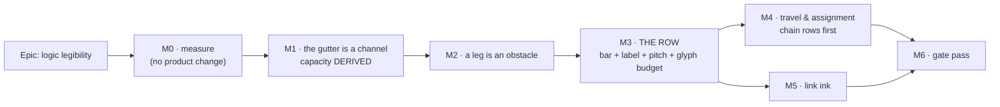

# Implementation Plan: Logic legibility — a link that can be followed

- **Feature spec:** [`./feature-spec.md`](./feature-spec.md) — **Draft, awaiting approval before
  implementation** (the same state this file holds; `check:spec-status` refuses a plan that disagrees
  with its spec)
- **Conditions:** [`./conditions.md`](./conditions.md) — **committed alone, in its own commit, before
  M0-T1 touches anything**
- **Status:** Draft — awaiting approval before implementation
- **Owner:** _(unassigned)_
- **Amended 2026-09-22** after the product owner answered all four critical questions and supplied
  the NetPoint reference. **The milestone order changed**: Part B is no longer a conditional late
  milestone, it is **M3** and it is load-bearing. The superseded order is recorded in
  "Sequencing & slices" rather than deleted.

## Breakdown

### Epic

**Logic legibility** — make a single relationship followable end to end on the TSLD, by measuring the
four things the product owner named rather than the one Part C could see, and remedying them in the
order that spends the least.

**Roadmap theme:** none. This is a canvas-legibility epic; it appears in `docs/ROADMAP.md` only if an
ADR requires it.

---

## The sequencing argument, because it is the plan's main content

Five principles, each derived from something recorded rather than chosen:

1. **Measure before designing, and commit the conditions before measuring.** ADR-0128's ordering. The
   epic exists because Part C measured the wrong quantity, so M0 buys nothing a planner can see and
   is not negotiable.
2. **Zero-height remedies before paid ones.** ADR-0149's own sequencing decision, which paid twice:
   the router (zero height) returned −20.8 % and the layout rule (paid) returned three candidates all
   worse than shipped. M1 and M2 cost no vertical space; M3 and M4 do.
3. **M1 before M2, and this one is not obvious.** M2 deliberately sends more traffic into the gutter.
   Today the gutter's horizontal leg runs **along the upper lane's bar bottom edge** — 58 of 68 legs
   inside a painted bar at 0.0 px clearance, and 13 of 68 on a single y (`part-c-m-c0.md` M-C0-T4;
   the coordinator's `gutterY = 55.0` against a bar bottom of `55.0` is the same fact executed).
   **Shipping M2 first is predicted to make the diagram worse**, turning symptom (a) into (a) and (d)
   at once.
4. **M3 after M2, and this changed with the amendment.** The row treatment is the largest source of
   routing channel and the biggest visual change in the epic — but it **buys nothing for occlusion**
   (spec D9), so putting it before M2 would spend the epic's riskiest milestone on the symptom it
   cannot move. What makes the order safe is that **M1's channel capacity is DERIVED from `pad`**, so
   it re-scales automatically when the bar thins and M1 never has to be rebuilt (FC-L3's amended
   clause).
5. **Each milestone is independently revertible** — with one honest exception. M1, M2 and M4 each
   have a byte-identity story (FC-L10). **M3 does not and cannot**: it moves every bar's geometry, so
   from M3 the rollback contract is the commit boundary plus the golden log read line by line.

**Three milestones can still be withdrawn on their own conditions** — M2 (FC-L4), M4 (FC-L6), M5
(its share of FC-L8) — and that is deliberate. Two of Part C's four were withdrawn and the epic was
better for it. **M3 cannot be withdrawn by a milestone**: the product owner decided it. What a
milestone may do is send a **sub-decision** back (which cue moves, which constant's value, whether
pitch rises further).

---

## Milestone M0 — measure (no product change)

**Outcome:** nothing a planner can see. **Ships dark by design**, and says so: M0 changes no product
file. Its deliverable is `m0-measurement.md` — a vector reading of the shipped product on the product
owner's own plan **band-off**, verdicts on FC-L1 and FC-L12, and the denominator FC-L4 needs.
**Entry point:** none. The next milestone claiming user-facing capability is **M1**.
**Journey:** none at M0; it lands with **M1** (ADR-0081 §2).

> **Everything in M0 runs with `{ rollUpSummaries: true }` and band-off.** The first is
> `part-c-m-c0.md`'s recorded instrument defect (`WBS_SUMMARY` at day 0, found by looking at a
> picture after every number had been taken). The second is **decision 7** — the product owner did
> not know the band was on, so no band-on figure is a baseline.

---

#### Feature: the instrument and the baseline

> **Description:** one reading carrying all four quantities, taken with an instrument that has been
> reviewed rather than trusted, on a plan and a fixture that can both exhibit the mechanisms.
> **Complexity:** L
> **Dependencies:** `conditions.md` committed alone, first.
> **Risks:** the harness already exists and no document mentions it (spec §0.4); a reading has
> already been taken with it (spec §0.11) → M0-T1 is a review with a written deliverable, and every
> relayed figure is re-taken with its configuration named.
> **Testing requirements:** the non-vacuity control throws rather than judging; FC-L1's structural
> prediction and FC-L12's five properties are committed before any run.

##### M0-T0 — commit `conditions.md`, alone

- **Description:** the conditions file lands in its own commit, touching nothing else.
- **Complexity:** S
- **Dependencies:** product-owner approval.
- **Risks:** an instrument exists **and a reading has been taken** (`conditions.md` §0) → that file's
  §0 states both compromises and marks FC-L2 pre-satisfied **without moving its threshold**.
- **Testing:** none — this is the evidence, not a test.
- **Development steps:**
  1. Commit `docs/specs/logic-legibility/conditions.md` alone; record its SHA in `m0-measurement.md`.
  2. Nothing else in the same commit. The git order is the only evidence a threshold was not tuned.

##### M0-T1 — review the existing occlusion instrument before trusting it

- **Description:** `crossing-probe.ts:1349-1453` and `measure-occlusion.mjs` exist, undocumented and
  uncited, and have produced one relayed figure. Establish what they measure, fix what they miss.
- **Complexity:** M
- **Dependencies:** M0-T0.
- **Risks:** adopting an unreviewed instrument wholesale → the four findings below are the starting
  list, not the finishing one.
- **Testing:** each finding gets a unit case; the tangent case is **verified red** against the
  shipped `>=`.
- **Development steps:**
  1. **Tangency — and this one is confirmed by execution, not only by reading.** The test is
     `a.y <= r.y1 || a.y >= r.y2` (`:1410`), and the coordinator measured `gutterY = 55.0` against a
     lane-0 bar bottom of **55.0** at `originY = 32`. So **all 68 of Unit 300's gutter legs score
     zero** — the same 58 of 68 M-C0-T4 reports as _inside_ a bar at 0.0 px. Report **tangent** as
     its own column. **Every quotation of the 77.1 % figure carries the word "floor" and names this
     blind spot** — in this plan, in `m0-measurement.md`, in the ADR and in any register row.
  2. **A link's own endpoint bars.** Strict x excludes the anchor, which fails for `SF` (corridor
     `(from.x + to.x) / 2` can fall inside either bar) and for a clamped lag anchor, which
     `lagAnchorPoints` puts **on** the bar and `lagRunSegment` draws there on purpose. Latent on this
     fixture (no lags in `sceneFor`), live on a real plan. Exclude by id or state the blind spot —
     decide by running FC-L1's control and reading which cases appear.
  3. **One paint per reading.** `readBoth` paints twice (`:1436-1446`).
  4. **One predicate.** Export the interval predicate from `link-routing.ts`; the harness imports it,
     pinned structurally, so what the router refuses and what the instrument counts cannot drift.
  5. Write the review up in `m0-measurement.md`, including anything found that is not on this list.

##### M0-T2 — the vector baseline, band-off, on the plan the complaint is about

- **Description:** FC-L0's six-column reading of `web-v0.141.0` on Unit 300, **band-off**, at the
  framings a planner uses — with the other four Part C configurations printed beside it as context
  rather than as baselines.
- **Complexity:** M
- **Dependencies:** M0-T1.
- **Risks:** a culled framing hands the win to whichever layout shows less of the plan → every figure
  is per **visible** link with the denominator printed, and the verdict is read from the whole-plan
  framing (M-C0-T2a: 283 stroked polylines against 800 edges at 1646 × 857).
- **Testing:** the non-vacuity control asserted first and **throwing**; 0 non-axis-aligned segments.
- **Development steps:**
  1. Extend `measure-occlusion.mjs` to emit the full FC-L0 vector, including `clear band` and the
     channels it yields.
  2. Sweep zooms {1, 4, 12} × pan positions {32, −200, −500} — the pan sweep is
     `vhv-gutter-probe`'s recorded rule that `originY: 0` is the single value at which a whole class
     of defect is invisible.
  3. **Re-take the relayed 77.1 % band-off, with the configuration named**, and report it as a floor.
  4. Record every figure against the commit it was taken at.

##### M0-T3 — FC-L1's verdict, the avoidable denominator, and the crossing pass on trial

- **Description:** judge the condition that gates the metric, produce FC-L4's denominator, and
  measure whether **Part C's own remedy is a cause of the complaint**.
- **Complexity:** M
- **Dependencies:** M0-T2.
- **Risks:** FC-L1 fails the way FC-C1 did → its withdrawal clause binds, and the named refutation (a
  link's own endpoint bars) is checked first because it is the likeliest cause.
- **Testing:** FC-L1's prediction (one-per-row measures **zero**) is committed before the run.
- **Development steps:**
  1. Run FC-L1's pair — shipped `packLanes` against one-bar-per-lane — and judge.
  2. Count **avoidable** occlusions and fix the number in `m0-measurement.md`. FC-L4's ≥ 70 % is a
     fraction of it, and the fraction was committed before the number existed.
  3. **Measure `occl/link` with `chooseCorridorsByCrossing` ON and OFF.** That pass moves elbows to
     candidates including `(from.x + to.x) / 2`, `to.x − gap` and offsets to `± 8 × gap`
     (`link-routing.ts:879-890`), scores them on **crossings only** (`:859-862`) and checks bars in
     the **crossed lanes** only (`:889`) — **nothing checks the resulting legs.** A corridor moved
     far from its anchor lengthens the leg, and a long leg is what meets a bar. If the pass raises
     occlusion, **Part C's remedy made the reported complaint worse**, which is the epic's headline
     finding and makes M2-T4 mandatory rather than conditional.
  4. Count spec §0.3's **same-lane two-point** occlusions separately from every other kind, so the
     small-plan mechanism can be told from the large-plan one.
  5. Record `x/link` on the same runs, so FC-L4's 10 % ceiling has a baseline taken at the same time
     as its numerator.

##### M0-T4 — the small fixture, and its five self-asserted properties

- **Description:** decision 8's fixture. **Its value is logic density, not activity count.**
- **Complexity:** M
- **Dependencies:** M0-T1.
- **Risks:** **a sparse fixture would pass every condition in this epic while exhibiting nothing**,
  and would then be quoted as evidence that small plans are fine → FC-L12 makes the five properties
  the fixture's own test, **verified red against a deliberately sparse version**.
- **Testing:** the five properties are the test.
- **Development steps:**
  1. Author ~13 activities with **≥ 1.3 links per activity** — Unit 300's own measured 188/144, so
     the floor is derived from the realistic fixture rather than chosen. A plausible construction
     shape: a main sequence with two parallel trades rejoining, which is what produces both
     same-lane runs and cross-lane links.
  2. Assert, **after `packLanes` has run** and not as authored: ≥ 1 same-lane `A → C` with an
     intervening `B`; ≥ 1 link whose preferred corridor and all four candidates are blocked; ≥ 2
     gutter runs overlapping in x in one gutter; `occl/link` > 0; `max legs on one y` ≥ 2.
  3. Run the suite red against a sparse variant (same activities, a third of the links).
  4. Docblock states what it is for and that it is **a construction, not the product owner's plan**.

##### M0-T5 — the pictures, and the reference beside them

- **Description:** the numbers calibrated by images, because this epic exists because a diagram that
  satisfied every number was still hard to read.
- **Complexity:** S
- **Dependencies:** M0-T2, M0-T4.
- **Risks:** a picture of a quiet area shows a case nobody complained about → the frame is centred on
  the **worst** occlusion cluster, measured rather than chosen (`sceneForShot`'s rule).
- **Testing:** painted by the real `paintScene` against a real Chromium 2D context with the real
  `resolveTsldPalette` under ADR-0102's canvas surface scope. No hex literal stands in for a token.
- **Development steps:**
  1. Extend the `gutter-pitch-bench.ts` Chromium harness to shoot the occlusion cluster, band-off, on
     Unit 300 and on the small fixture.
  2. Add the small fixture to `shoot.mjs` — Part A §0.4 recorded that every canvas shot uses a
     six-activity seed, so **the condition has never been photographed**.
  3. **Commit the NetPoint reference images beside them**, with §0.8's measured ratio table, so M3's
     design is judged against the picture rather than against a memory of it.

---

## Milestone M1 — the gutter is a channel

**Outcome:** a link routed through a gutter runs **clear of both lanes' bars**, and two runs sharing a
gutter sit at different y where they overlap in x. On Unit 300 that is 68 legs, 58 inside a painted
bar and 13 on one y.
**Entry point:** **opening any plan whose routing takes the gutter fallback** — no control, and the
milestone says so rather than implying one. On Unit 300 band-off that is 69 of 188 links, measured.
**Journey:** `apps/web/e2e-arrange/` gains one spec — it already imports a real `.xer` against a real
API with the pen enforced. **No new Playwright config and no new CI step**: a `measure-*` harness is
run on demand and is not a `test:e2e:*` script, so ADR-0138's roster gate has nothing to demand.

---

#### Feature: the gutter datum and the channel pass

> **Description:** move the gutter's datum to the lane boundary, and give each gutter run a channel.
> **Complexity:** L
> **Dependencies:** M0.
> **Risks:** (i) a channel varying between frames moves a line without the viewport moving → FC-L9,
> verified red; (ii) the pass measuring its own output → it runs **last**, after every x is final,
> and moves y only; (iii) the golden log moves → re-baselined by reading, never with `-u`;
> (iv) **capacity hard-coded** → it must be derived from `pad`, or M3 forces a rebuild.
> **Testing requirements:** unit (geometry inequality, determinism, permutation-independence,
> capacity derivation), golden log, the M0 harness re-run, the Chromium picture, the journey.

##### M1-T1 — the datum

- **Description:** `gutterY` becomes `screenYOfLane(L + 1)` — the gutter's centre, which is the lane
  boundary exactly — from `screenYOfLane(L + 1) − pad`, which expands to the upper lane's bar bottom.
- **Complexity:** S
- **Dependencies:** M0-T1.
- **Risks:** re-deriving it from `screenYOfLane` would make `link-routing.ts` import
  `LANE_HEIGHT`/`BAR_HEIGHT`, which the obstacle parameter exists to avoid (`link-routing.ts:249-253`
  says so) → keep the injected `laneHeight`, change the arithmetic only.
- **Testing:** the VHV case asserts the leg's **y**, parameterised over
  `originY ∈ {0, 32, −500, −1500}`, **verified red** against the shipped expression. Part A M1 fixed
  this expression's `originY` **sign**; this changes its **datum** and must not silently re-introduce
  that defect — the parameterised test guards both.
- **Development steps:**
  1. Change the expression; state the invariant as an inequality in the docblock, not a sentence.
  2. Extend the VHV test; run red first.
  3. Re-run the M0 harness: `legsTouchingABar` must fall from 58 toward 0.

##### M1-T2 — `packGutterChannels`, with capacity **derived**

- **Description:** a pure pass grouping the frame's gutter runs by gutter, sorting by a total order,
  and first-fitting each into the lowest channel whose occupant does not overlap it in x.
- **Complexity:** M
- **Dependencies:** M1-T1.
- **Risks:** **a hard-coded channel count is the one thing that would make M3 rebuild this** → the
  usable band is computed as `pad − 1` from the injected geometry, so bar 18 gives ± 4 px and a
  NetPoint-thin bar gives ± 11 px **with no edit** (FC-L3's amended clause). An order derived from
  `scene.edges` is a server response, not a total order → FC-L9's named mutation, verified red.
  Surplus runs degrade to the **outermost channel**, never to a bar.
- **Testing:** the geometry inequality (`|k| ≤ pad − 1` ⇒ no bar extent entered at any pitch **or any
  bar height**); the capacity derivation asserted at two bar heights; determinism; permutation
  independence; the over-capacity case; a scene with no gutter run byte-identical (FC-L10).
- **Development steps:**
  1. Write the pass beside `bundleCorridors`, taking the same `BundleCandidate[]` argument shape —
     which structurally denies it access to lag anchors, drag handles and hit zones.
  2. Return the number of runs moved, so a test can assert it did something rather than assert the
     absence of a change it never attempted.
  3. Unit-test all seven cases; run the permutation case and the capacity case red first.

##### M1-T3 — wire it into the painter, last

- **Description:** one call in the edge layer, **after** `chooseCorridorsByCrossing` and
  `bundleCorridors`.
- **Complexity:** S
- **Dependencies:** M1-T2.
- **Risks:** calling it earlier packs channels against x values that then change — ADR-0090's
  oscillation with a third subject → the ordering is in the call site's comment with its reason, and
  a test asserts the pass sees the post-bundle x.
- **Testing:** `paint.golden.test.ts` re-baselined **by reading the diff line by line against a
  written list of expected changes, never with `-u`** (ADR-0106); `paint.routing-budget.test.ts`
  green **without being edited** (FC-L5).
- **Development steps:**
  1. Add the call after `bundleCorridors` (`paint.ts:1232`).
  2. Re-baseline the golden log against a written list; audit every moved line.
  3. Confirm the routing budget test is untouched.

##### M1-T4 — the journey, the picture, and FC-L3's **first** reading

- **Description:** the first thing in this repository to assert what a routed line looks like in a
  real browser — and a **progress reading**, not the epic's verdict.
- **Complexity:** M
- **Dependencies:** M1-T3.
- **Risks:** jsdom has no layout and the node probe stub has **no `arcTo` and no `roundRect`**
  (`crossing-probe.ts:35-38`) → the picture is Chromium and the journey drives the real product.
- **Testing:** this is the testing.
- **Development steps:**
  1. Add a spec to `apps/web/e2e-arrange/` importing the real `.xer`, opening the diagram, asserting
     the canvas paints the expected link population. Locate controls by `[data-toolbar-item]`, never
     by copy (ADR-0091 M7).
  2. Shoot the FC-L3 picture at 1646, band-off, centred on the busiest gutter, **measured rather than
     chosen**.
  3. Record FC-L3's **first** reading, at today's geometry (± 4 px, ~3–5 channels), and label it a
     progress reading. **The epic's FC-L3 verdict is taken at M3's geometry.**
  4. If `legsTouchingABar` cannot reach 0 at today's geometry, **fire the amended withdrawal clause**:
     the row (M3) is promoted ahead of M2, **not** the pitch alone.

---

## Milestone M2 — a leg is an obstacle

**Outcome:** a link whose horizontal run would pass through an unrelated bar is routed round it, or
through the gutter. **This is the only milestone that serves symptom (a)** (spec D9).
**Entry point:** **opening any plan with a bar between two linked activities in one lane** — spec
§0.3's shape, which is the one the small fixture is built to exhibit.
**Journey:** the `e2e-arrange` spec gains a case on the small fixture, so the A→C-over-B shape is
driven in a real browser rather than only counted in node.

---

#### Feature: leg viability

> **Description:** one predicate, one generalisation of the existing point test, one new term in the
> corridor's viability check — and the same term applied to the crossing pass.
> **Complexity:** L
> **Dependencies:** M1 (the gutter must be good before more traffic goes into it).
> **Risks:** (i) `x/link` rises, because gutter routes are 6-point and `chooseCorridorsByCrossing`
> skips those → FC-L4's ceiling and M2-T4; (ii) more work per link on the paint path → FC-L5 and the
> routing-budget test; (iii) a diagram with no occlusion must not move at all → FC-L10 case 2.
> **Testing requirements:** the three byte-identity cases; the same-lane case verified red; the M0
> harness re-run for FC-L4; the probe for FC-L5.

##### M2-T1 — `clearBetween`, the one predicate

- **Description:** generalise `isLaneFreeAt` from a point to an interval over the same merged spans.
- **Complexity:** S
- **Dependencies:** M0-T1 (the harness already imports it).
- **Risks:** two rules about whether a bar is in the way → a test asserts
  `isLaneFreeAt(i, l, x) === clearBetween(i, l, x, x)`, so the point case is a **degenerate of one
  predicate** rather than a second implementation.
- **Testing:** the equivalence; strict interiority (an anchor exactly on a bar edge is clear); the
  empty-lane case; binary-search correctness against a linear reference.
- **Development steps:**
  1. Implement over the existing sorted, merged spans; keep it O(log n).
  2. Export it; the harness imports the symbol (M0-T1 step 4's structural test now has a subject).

##### M2-T2 — viability replaces freedom

- **Description:** `free(x)` becomes `viable(x)` = crossed lanes clear **and** both legs clear in
  their own lanes. The candidate list, its order and its bound are unchanged.
- **Complexity:** M
- **Dependencies:** M2-T1.
- **Risks:** the two early returns (`from.y === to.y` at `:182`, `crossed.length === 0` at `:206`)
  end the question before a leg is considered → **both must consult the legs**.
  `chooseCorridorsByCrossing` already refuses to inherit that early return for its own reason
  (`:826-837`); this is the same correction one function up.
- **Testing:** the same-lane A→C-over-B case, **verified red against the shipped early return**; the
  adjacent-lane case; FC-L10 cases 1 and 2.
- **Development steps:**
  1. Add the two leg terms to the viability test.
  2. Make both early returns consult the legs first, and keep them returning today's line when the
     legs are clear — FC-L10 case 2, and the commonest path in the product.
  3. Run the same-lane test red first.

##### M2-T3 — the gutter becomes the structured fallback

- **Description:** when no candidate is viable, take the gutter route, which M1 has made safe.
- **Complexity:** S
- **Dependencies:** M2-T2, M1.
- **Risks:** the channel run must still be clear of the two lanes it lies between → after M1-T1 that
  is **structural rather than a test** (a channel within `± (pad − 1)` cannot enter a bar).
- **Testing:** the route taken when and only when nothing is viable; the residue counted, not hidden.
- **Development steps:**
  1. Route to the gutter on exhaustion.
  2. Count the residue (no viable route at all) and surface it in the harness, so FC-L4's shortfall
     is explainable rather than mysterious.

##### M2-T4 — the crossing pass gets the same constraint (and, if measured, gutter routes)

- **Description:** two changes to `chooseCorridorsByCrossing`, of which **the first is mandatory if
  M0-T3 step 3 says the pass raises occlusion**.
- **Complexity:** M
- **Dependencies:** M2-T3, M0-T3.
- **Risks:** without the first change, the pass **spends M2's gain immediately after M2 produces it**
  — it moves elbows up to `± 8 × gap` from the anchor on a crossings-only score with no leg check.
  For the second, ADR-0149 D4's stated reason for skipping 6-point routes — _"a six-point VHV route
  was produced because NO single corridor was clear … moving one of its two legs would be re-deciding
  that search from the outside with less information than it had"_ — **lapses** once M2-T3 makes the
  gutter a deliberate first choice. Neither may undo the routing: a corridor moves only to an x whose
  lanes **and legs** are clear.
- **Testing:** measured before and after on the vector; the second is withdrawn if it does not pay.
- **Development steps:**
  1. Add `clearBetween` to the pass's candidate filter (`:889`). Measure.
  2. Measure `x/link`. If within FC-L4's 10 % ceiling, **do not** extend the pass to 6-point routes,
     and record that it was not needed.
  3. If not, extend it, measure again, keep only on a strict improvement.
  4. If the ceiling is still breached, **put the trade to the product owner** with both numbers and
     both pictures. Do not resolve it inside the milestone.

##### M2-T5 — FC-L4's and FC-L5's verdicts

- **Description:** judge the milestone.
- **Complexity:** S
- **Dependencies:** M2-T4.
- **Risks:** a scalar verdict → FC-L0 binds; all four quantities reported, including those that got
  worse.
- **Testing:** the M0 harness; the ADR-0128 probe.
- **Development steps:**
  1. Re-run the vector; compute the realised fraction of M0-T3's avoidable count.
  2. Hand the product owner the probe run (`canvas-draw`, 500 and 2,000, **their hardware, one
     press**), with the machine's spread beside the delta. Delta < spread is **INDETERMINATE**.
  3. Confirm `paint.routing-budget.test.ts` green **without having been edited**.
  4. Record the verdict, including FC-L5 limb A's committed prediction that the delta is **> 0**.

---

## Milestone M3 — **the row**: bar, label, pitch, and the glyph budget

**Outcome:** an activity reads as a **node on a timeline** — a thin bar with a node at each end, its
name above, its dates and duration below — and the row hands the routing the channel it needs.
**Entry point:** **opening any plan.** Every activity looks different; this is the epic's one
milestone a planner cannot miss.
**Journey:** `e2e-arrange` re-run at the new geometry, plus the a11y scan; FC-6's glyph sweep is a
unit gate that **lands before the geometry moves**.

> **Promoted from last to third by the product owner's answer to CQ-3** (decision 5). The first draft
> of this plan had it as a conditional M5 scoped to link ink, on my inference that _"bars stay
> visually supreme"_ left a bar redesign no room. **That inference was wrong and was mine** —
> supremacy is about occlusion **order**, not thickness (spec §2.7 CQ-3's answer).
>
> **It is one milestone and not two** because §0.10's arithmetic makes the bar and the pitch one
> decision: a 5 px bar at pitch 28 leaves 11.5 px above it against a label's 12–14 px, so _"name
> above the bar"_ is unbuildable at the shipped pitch.
>
> **And it buys nothing for occlusion** (spec D9). Its currency is **channel** and **ink**.

---

#### Feature: the row geometry

> **Description:** one constant set, one glyph vocabulary, and six constants whose justification is a
> function of `BAR_HEIGHT = 18`.
> **Complexity:** XL
> **Dependencies:** M1, M2, M0-T5's reference images.
> **Risks:** the highest in the epic. Six constants break differently; fan-out **cannot work** at a
> 5 px bar; the in-bar progress band and the inside label have no room; a dash on a 5 px outline is
> not a WCAG 1.4.1 channel; and **there is no byte-identity rollback** — the golden log is the
> oracle.
> **Testing requirements:** FC-6 as a computed inequality **landing first, verified red**; FC-L8's
> five limbs; FC-L11's net measurement; FC-L7's export and minimap readings; FC-L5 limb C; the
> contrast matrix and a real-browser resolution check for every new value; a picture beside the
> reference.

##### M3-T1 — FC-6 as a gate, **before** any constant moves

- **Description:** turn the four-comment invariant into a computed test.
- **Complexity:** M
- **Dependencies:** none — it can and should land before anything else in M3.
- **Risks:** writing the gate after the change is how a gate gets tuned to pass → it lands first and
  is verified red against a deliberately-too-tall bar.
- **Testing:** every glyph family (task, milestone, LOE, WBS summary) and every decoration (progress
  band, constraint pin, feasible window, fan-out anchors, selection and hover rings) draws within
  `[screenYOfLane(L), screenYOfLane(L + 1))`.
- **Development steps:**
  1. Write the inequality; run it red.
  2. Land it alone. Part A's FC-6 named this as the epic's durable output whatever the visual answer
     is, and that is still true.

##### M3-T2 — re-derive the six constants, each with its new justification

- **Description:** the glyph budget, re-derived rather than carried.
- **Complexity:** L
- **Dependencies:** M3-T1.
- **Risks:** each breaks differently and **one of them breaks silently across a module boundary**.
- **Testing:** each constant's new value asserted against the property its docblock claims, so the
  claim and the code cannot part company again.
- **Development steps:**
  1. **`FAN_OUT_MAX_PX` / `FAN_OUT_STEP_PX` — do this one first, because it is a hard coupling to
     Part A.** The comment justifies 6 by `BAR_HEIGHT / 2 = 9` in a file that **does not import
     `BAR_HEIGHT`**; at 5 px the half-height is 2.5 and the **step of 3 already exceeds it**. The
     node glyph replaces fan-out (spec D10). Retire or re-derive, and **assert the relationship in
     code** so the compiler can see what the comment could not.
  2. `SUMMARY_TAB_H = 4` — the 1 px clearance becomes ~7.5 px, so **the problem inverts**: a 4 px tab
     under a 5 px bar is nearly as tall as the bar. A proportion decision, not a clearance one.
  3. `GLYPH_CAP_OVERHANG = 3` — ±3 on a 5 px bar is a cap twice the bar.
  4. `TAIL_HEIGHT = 6` — `geometry.ts:145` says _"thinner than the bar, so it never reads as
     duration"_; at 5 px **the docblock's invariant inverts**.
  5. `BAR_RADIUS = 3` — _"subtle at BAR_HEIGHT 18"_; at 5 px a fully-rounded capsule.
  6. `LABEL_INSIDE_MIN_PX = 24` — a **width** gate with **no height term**, so `labelPlacement`
     (`geometry.ts:611`) still returns `'inside'` and paints text outside a 5 px bar. **A live defect
     this milestone must handle**, not a styling choice: either the branch retires with the label
     moving above, or the function gains a height term.

##### M3-T3 — the row: thin bar, nodes, label above, dates and duration below, pitch

- **Description:** the treatment itself.
- **Complexity:** XL
- **Dependencies:** M3-T2, M0-T5.
- **Risks:** as the feature's. The two cues that cannot survive as they are (progress band, inside
  label) and the one that needs a new channel (criticality) are **CQ-6**, and FC-L8 limb 1 says a cue
  that **goes** is a product-owner decision, not a milestone's.
- **Testing:** FC-L8's five limbs; the golden log re-baselined **by reading**; the contrast matrix
  under the `canvas` surface scope; a real-browser resolution check for every new value (ADR-0102 /
  ADR-0100 M4 / ADR-0121 — the reference's links are a different hue entirely, so this **will** fire).
- **Development steps:**
  1. Build the row at the pitch M3-T4 measures, with the node glyph carrying what fan-out did.
  2. Put CQ-6's two sub-decisions up **with the rendered picture**: where progress goes, and
     criticality's second non-colour channel (default: a filled-versus-hollow node, a shape channel
     the reference already draws).
  3. Re-baseline the golden log against a written list of expected changes.
  4. Shoot the picture **beside the NetPoint reference**, band-off, at 1646.

##### M3-T4 — FC-L11's net measurement, FC-L3's **verdict**, and FC-L7

- **Description:** measure what the row actually handed back, and take the epic's FC-L3 verdict at the
  final geometry.
- **Complexity:** M
- **Dependencies:** M3-T3.
- **Risks:** quoting the gross figure → **FC-L11 forbids it**: the _"~57 % handed back"_ /
  10 px → ≈ 23 px arithmetic may not appear in any document without the net beside it, or before this
  task without the words _"net not yet measured"_.
- **Testing:** the vector at the candidate pitches; FC-L3's picture at each; FC-6; FC-L7; FC-L5
  limb C.
- **Development steps:**
  1. Sweep the pitch by rewriting the **bundle**, not a tracked file (M-C0-T4's method, which avoids
     leaving a tracked file modified behind a `finally` a crash can skip), with every run **reporting
     back the pitch it painted with**.
  2. Measure the **net** clear band — what is left to a channel after the label, dates, duration and
     nodes have taken theirs — reported as a channel count at FC-L3's channel pitch.
  3. Take **FC-L3's verdict** here. M1-T4's reading was a progress reading.
  4. Measure FC-L7: the export raster at `devicePixelRatio = 1.75` (their display, not 1) — **the
     condition most likely to bind**, since the reference's row is ~68 px against our 28 — and the
     minimap's `pxPerLane` band-off with a rendered pair.
  5. If the net gain is **smaller than today's 10 px**, fire FC-L11's clause: the trade goes to the
     product owner **with both rendered**.

---

## Milestone M4 — travel and assignment (conditional on FC-L6)

**Outcome:** shorter links, if any candidate earns it on the vector.
**Entry point:** **`Arrange`** (`[data-toolbar-item="auto-arrange"]`), pen-gated, unchanged — plus its
confirmation copy, which changes **only if** what the command does changes.
**Journey:** `e2e-arrange` already presses it with the pen enforced; the new case asserts the copy
matches what the packer now promises.

> **A measurement milestone first, and chain rows is its headline.** ADR-0149 D5 measured three rules
> as worse than shipped **on crossings alone**; that verdict is **re-derived against the vector, never
> inherited**. The NetPoint reference chains sequential activities along one row, so **chain rows is
> the reference's own shape** — and it was D5's worst candidate at +85.8 %.

---

#### Feature: candidates for symptom (c)

> **Description:** four candidates, none built, all measurable before anything is.
> **Complexity:** L
> **Dependencies:** M0 (the vector), M2 (so candidates are judged against the fixed router), M3 (so
> they are judged at the final geometry).
> **Risks:** a candidate that halves travel and doubles occlusion → FC-L6's ceiling; a second packer →
> one function, one optional parameter (ADR-0065/0069/0121's recorded drift argument).
> **Testing requirements:** FC-L10 case 3 (omitted **and** neutral are two separate byte-identity
> cases); determinism and permutation-independence; the vector.

##### M4-T1 — chain rows, measured first, with H1 and H2 reported separately

- **Description:** ADR-0149 D5's worst candidate, re-measured on the metric that was not available
  when it was judged.
- **Complexity:** M
- **Dependencies:** M0, M3.
- **Risks:** **a measurement framed only by H1 would find H1** → the decomposition is mandatory.
  H1: a chain in one row needs no traversal, so occlusion should fall. H2: a chain in one row puts
  **more bars per row**, and occlusion is a leg meeting a bar **in its own lane**, so every link out
  of a chain has a leg in a crowded row. Neither is obviously dominant.
- **Testing:** the vector, band-off, with **same-row and cross-row links counted separately** — the
  aggregate cannot distinguish H1 from H2.
- **Development steps:**
  1. Re-run `crossing-probe.ts:1103-1330`'s existing chain-rows implementation through the vector.
  2. Report the decomposition. Judge against FC-L6.
  3. If it qualifies, put it to the product owner **with the NetPoint image beside the rendered
     candidate**, since the reference is what motivated it.
  4. If it does not, record it as measured-and-rejected **a second time, on a second metric** —
     a stronger result than the first, and written up as such rather than as a repeat.

##### M4-T2 — lane re-indexing, which is free and unbuilt

- **Description:** `cheap-levers.md` Finding 4's barycentre pass plus pairwise-swap local search.
  Measured at **−7.5 % mean and −14.3 % long links at zero lane cost** on Unit 300 — **never measured
  on occlusion or crossings**, and **not built** (that file's own status line says so).
- **Complexity:** M
- **Dependencies:** M0.
- **Risks:** it cannot change the lane count, and lanes are independent time-partitions, so
  relabelling cannot create an overlap — a structural argument that file makes and a test should
  assert rather than inherit.
- **Testing:** the vector; determinism (fixed start order, fixed tie-breaks, no randomness — a lane
  that varies between presses of the same button is worse than a route that varies between frames).
- **Development steps:**
  1. Measure on the vector **before building it in the product** (`measure-assignment.mjs` is the
     place, and is committed).
  2. Judge against FC-L6; record and stop if it does not qualify.

##### M4-T3 — the other two D5 rules, re-reported

- **Description:** near-predecessors and depth-first pack, already implemented in the harness.
- **Complexity:** S
- **Dependencies:** M0.
- **Risks:** inheriting D5's verdict → the point is not to.
- **Testing:** the vector.
- **Development steps:**
  1. Run both through the vector at M0-T2's framings, band-off.
  2. Re-report all four rules with their vector rows, so the next reader does not re-derive them a
     third time.

##### M4-T4 — build the winner, if there is one (conditional)

- **Description:** one optional parameter of `packLanes`.
- **Complexity:** M
- **Dependencies:** a qualifier from M4-T1/T2/T3, and the product owner choosing it.
- **Risks:** the importer calls `packLanes` directly (`interchange.service.ts:1096`) → CQ-5's default
  is **both callers, one parameter**, and FC-L10 case 3 makes that scope checkable.
- **Testing:** FC-L10 case 3; determinism; the `Arrange` confirmation copy no longer promising
  something the packer would not keep.
- **Development steps:**
  1. Add the parameter; omitted and neutral are two separate byte-identity cases.
  2. Update the confirmation copy if and only if what the command does changed.
  3. `database-architect` is **not** engaged — there is still no schema change to design.

---

## Milestone M5 — link ink

**Outcome:** the relationship stops being the quietest thing on a surface whose subject is
relationships.
**Entry point:** opening any plan.
**Journey:** the `e2e-arrange` spec's a11y scan plus a Chromium picture; the ADR-0055 contrast matrix
for every new value.

> **Folds into ADR-B, not its own ADR.** The reference's link is **yellow with red arrow ticks** — a
> different hue from the bar entirely — and it is part of the same picture as the row. Filing it away
> from the bar it sits beside would make both incoherent.
>
> **After M3, deliberately.** Re-styling a line whose neighbouring geometry is about to change is
> wasted work, and link ink is judged _against the bar it passes near_.

---

#### Feature: the line

> **Description:** weight, hue, dash and the arrow tick, against the canvas ground and against a bar.
> **Complexity:** M
> **Dependencies:** M3.
> **Risks:** **all three canvas traps apply here and at M3 and nowhere else in this epic** —
> ADR-0102's `@theme inline` aliases a surface rebind can never reach, ADR-0100 M4's token pair that
> painted **nothing** in a real browser while the contrast gate stayed green, ADR-0121's `fillStyle`
> setter that silently discards an unparseable value.
> **Testing requirements:** the contrast matrix under the `canvas` surface scope; a real-browser check
> that every new value resolves to a parseable colour; the painter's development-time throw; a picture
> beside the reference; WCAG 1.4.1 for the driving/non-driving cue, which is a weight-and-dash channel
> today and must stay non-colour-only.

- **Development steps:**
  1. Measure the ink distribution between bars and links on the M0 fixtures at 1646 and 1920 —
     **then** design. Part A §4.5 listed four candidate terms and said the design picks from the
     measurement, not from the list; that still holds.
  2. Any new token follows the raw-name pattern under the canvas root (ADR-0102), is asserted
     **reachable** in `@theme inline` (ADR-0100 M4), and is exercised through the painter's
     development-time throw (ADR-0121).
  3. Re-baseline the golden log by reading. Shoot the picture.

---

## Milestone M6 — the gate pass

**Outcome:** the epic is reviewed by the specialists whose findings this register records catching
what human reads do not — for the tenth consecutive epic.
**Entry point:** none; this milestone ships fixes, and any fix adding a control names it.
**Journey:** every folded fix carries a regression test **verified red first**.

---

#### Feature: specialist review over the combined diff

> **Description:** the reviews, the fold-ins, and the documents.
> **Complexity:** L
> **Dependencies:** every shipped milestone.
> **Risks:** a review that re-reads the epic's numbers rather than re-deriving them → each reviewer is
> asked to re-derive from the shipped code, which is where three of the last four gate passes'
> corrections came from.
> **Testing requirements:** regression tests verified red; the sweep.

##### M6-T1 — the reviews

- **Complexity:** M
- **Development steps:**
  1. **accessibility-reviewer** — **the largest risk in the epic now sits here**: criticality's
     second channel on a 5 px bar (WCAG 1.4.1), the ADR-0063 §4 count invariant, the spoken row
     content if M4 moved a lane, and whether the reference's hue pairs clear 1.4.11 on the canvas
     ground.
  2. **component-reviewer** — the predicate's single-implementation property, the pass ordering, the
     capacity derivation, and memo/identity stability of anything new on the per-frame path
     (ADR-0133 D6).
  3. **ux-reviewer** — the row treatment against the reference, the `Arrange` copy if M4 changed it,
     and whether the residue (a link with no viable route) needs saying anywhere.
  4. **frontend-performance-reviewer** — the per-frame cost re-derived from the shipped code rather
     than from FC-L5's write-up; **three text runs per activity** is the term to interrogate.
  5. **database-architect** is **not** engaged, and the reason is recorded: there is nothing to
     design, which is the decision §19.3 protects rather than the one it forbids.

##### M6-T2 — the documents, and the register

- **Complexity:** M
- **Development steps:**
  1. **Two ADRs** (spec §4.9): **ADR-A** routing (M1, M2, and the method failure that opened the
     epic), **ADR-B** the row (M3, M5). Both need entries in **`docs/adr/README.md`** and
     **`CLAUDE.md` §16** — both gated (ADR-0147, ADR-0110 D6); `check:adr-coverage` refuses the
     commit otherwise.
  2. `docs/TECH_DEBT.md`: the new rows (the `check:spec-status` glob blind spot; anything M0-T1's
     review found and did not fold), readings added to **#75** and **#323**, and #365's Unit 300
     question settled in the product if M0 took that measurement.
  3. `docs/DECISIONS.md` for anything smaller than an ADR.
  4. **Both spec headers** to `Accepted — shipped (ADR-NNNN)` in the commit filing the ADRs
     (ADR-0131), and the same for this plan.
  5. The pointer block in `docs/specs/diagram-legibility/feature-spec.md` §5 (already added).
  6. A changeset. `apps/web` is a user-visible change, and M3 is the most visible in a year.

---

## Sequencing & slices

| Order | Milestone | Ships                                   | Height  | Rollback                | Can be withdrawn on                         |
| ----- | --------- | --------------------------------------- | ------- | ----------------------- | ------------------------------------------- |
| 1     | **M0**    | nothing (dark by design)                | —       | —                       | FC-L1 fails ⇒ metric replaced first         |
| 2     | **M1**    | the gutter datum + derived channels     | zero    | byte-identical          | FC-L3 limb 1 unreachable ⇒ **M3** first     |
| 3     | **M2**    | leg viability + the structured fallback | zero    | byte-identical          | FC-L4                                       |
| 4     | **M3**    | **the row** — bar, label, pitch, glyphs | **yes** | **commit + golden log** | **not by a milestone** — sub-decisions only |
| 5a    | **M4**    | assignment                              | maybe   | parameter absent        | FC-L6                                       |
| 5b    | **M5**    | link ink                                | zero    | commit                  | its share of FC-L8                          |
| 6     | **M6**    | the gate pass                           | —       | —                       | —                                           |

> **The superseded order, recorded rather than deleted:** M0 → M1 → M2 → M3 _pitch_ → M4 travel →
> M5 _link ink only_ → M6, with Part B conditional on CQ-3 and narrowed to ink. **CQ-3's answer
> promoted Part B to M3 and merged the pitch into it**, for the reason in §0.10: the bar and the
> pitch are one decision. The old order is kept because this plan's first draft reasoned from a
> premise the product owner has since withdrawn, and deleting it would delete the correction.

`main` stays releasable at every boundary. M1, M2 and M4 are each one revertible commit whose absence
is byte-identical (FC-L10); **M3 is one revertible commit whose absence is not**, and that is stated
rather than glossed.

**No feature flag** (ADR-0088 D1).

## Definition of Done (per task)

Each task's PR satisfies the Feature Completion Criteria in [`docs/PROCESS.md`](../../PROCESS.md).

Three additions this epic insists on:

- **The pre-push gate is run, not written**: `pnpm prepush`, plus `scripts/e2e-local.sh web:arrange`
  for any task touching `apps/web/e2e-arrange/`. **After any change to the canvas, run the base
  journey too** (ADR-0096's rule: `e2e-local.sh` maps `web:<suite>` to `test:e2e:<suite>`, and the
  base is `test:e2e` with no suffix). **M3 touches every canvas screenshot in the repository**, so it
  runs the full sweep, not one suite.
- **Every decision-bearing claim names its evidence** (§19.11). A claim inherited from this plan is
  checked like any other — three of Part C's four premises were contradicted by its own measurement,
  **and this plan's own first draft narrowed Part B on an inference that was wrong**.
- **The 77.1 % figure is quoted as a FLOOR, with the gutter blind spot named, or not quoted.** Same
  for the _"~57 % handed back"_ figure, which is **gross** and may not appear without the net beside
  it or the words _"net not yet measured"_ (FC-L11).

## Risks & assumptions (rollup)

| Risk / assumption                                                       | Likelihood | Impact   | Mitigation                                                                                                                                                   |
| ----------------------------------------------------------------------- | ---------- | -------- | ------------------------------------------------------------------------------------------------------------------------------------------------------------ |
| **M3's criticality cue becomes colour-only on a 5 px bar** — WCAG 1.4.1 | **high**   | **high** | Named in FC-L8 limb 1 and CQ-6 **before the design starts**, with a default (filled vs hollow node — a shape channel). accessibility-reviewer leads M6.      |
| M2 trades (a) for (b): fewer occlusions, more crossings                 | **high**   | med      | Structural, not speculative. FC-L4's ceiling; M2-T4; the trade goes to the product owner.                                                                    |
| **`chooseCorridorsByCrossing` is itself a cause of occlusion**          | med        | **high** | M0-T3 step 3 measures it on and off. If so, Part C's remedy made the complaint worse, M2-T4 step 1 becomes mandatory, and it is the ADR's headline.          |
| M3's net clear band is smaller than today's 10 px                       | med        | **high** | FC-L11 measures it and fires a clause. The label above is a real cost and is not assumed away.                                                               |
| Fan-out breaks silently at a thin bar                                   | **high**   | med      | Certain, not probable — `FAN_OUT_STEP_PX = 3` exceeds a 5 px bar's 2.5 px half-height. M3-T2 step 1 does it **first** and asserts the relationship in code.  |
| The export raster exceeds `EXPORT_MAX_PX` at the new pitch              | med        | med      | FC-L7, measured at `dpr = 1.75`. Remedy is a cap **in the export**, never a row cap on the packer.                                                           |
| Occlusion is not the dominant symptom                                   | **low**    | high     | Was FC-L2's job; **pre-satisfied at a 77.1 % floor** (§0.11). Residual risk is the configuration, which M0-T3 re-takes band-off.                             |
| The pre-existing harness has a defect that survives the review          | med        | high     | M0-T1 is a task with a written deliverable and four findings already listed. ADR-0149's own defect was found by **looking at a picture**, so M0-T5 exists.   |
| Paint cost breaches FC-L5 — **and M3 is the likeliest limb**            | med        | high     | Three text runs per activity is the term. `paint.routing-budget.test.ts` **unedited** is the hard gate; a milestone is withdrawn rather than a test relaxed. |
| The golden log is re-baselined with `-u` and an unintended change ships | med        | high     | ADR-0106's rule, stated in M1-T3, M3-T3 and M5. **M3 has no byte-identity oracle, so this is its only one.**                                                 |
| The small fixture is sparse and proves nothing                          | med        | med      | FC-L12's five properties, asserted by the fixture's own test, **verified red against a sparse version**.                                                     |
| Chain rows is measured in a frame that confirms H1                      | med        | med      | H2 is written down in the spec and the condition **before** the measurement, and the decomposition is mandatory.                                             |
| This plan's own problem statement goes stale, as Part C's did           | med        | med      | M0 re-measures the baseline before anything is designed; M2-T4 and M4-T1 exist to **re-derive** decisions rather than inherit them.                          |
