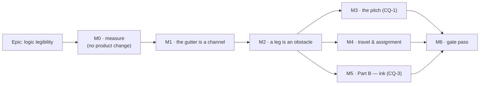

# Implementation Plan: Logic legibility — a link that can be followed

- **Feature spec:** [`./feature-spec.md`](./feature-spec.md) — **Draft, awaiting approval before
  implementation** (the same state this file holds; `check:spec-status` refuses a plan that
  disagrees with its spec)
- **Conditions:** [`./conditions.md`](./conditions.md) — **committed alone, in its own commit,
  before M0-T1 touches anything**
- **Status:** Draft — awaiting approval before implementation
- **Owner:** _(unassigned)_

## Breakdown

### Epic

**Logic legibility** — make a single relationship followable end to end on the TSLD, by measuring
the four things the product owner named rather than the one Part C could see, and remedying them in
the order that spends the least.

**Roadmap theme:** none. This is a canvas-legibility epic; it appears in `docs/ROADMAP.md` only if
the ADR requires it (ADR-0136's exemption class applies to gate-only work, not to this).

---

## The sequencing argument, because it is the plan's main content

Four principles, each derived from something recorded rather than chosen:

1. **Measure before designing, and commit the conditions before measuring.** ADR-0128's ordering.
   The epic exists because Part C measured the wrong quantity, so the first milestone buys nothing a
   planner can see and is not negotiable.
2. **Zero-height remedies before paid ones.** ADR-0149's own sequencing decision, which paid twice:
   the router (zero height) returned −20.8 % and the layout rule (paid) returned three candidates
   all worse than shipped. M1 and M2 cost no vertical space; M3 and M4 do.
3. **M1 before M2, and this one is not obvious.** M2 deliberately sends more traffic into the
   gutter. Today the gutter's horizontal leg runs **along the upper lane's bar bottom edge** — 58 of
   68 legs inside a painted bar, 0.0 px clearance (`part-c-m-c0.md` M-C0-T4) — and 13 of 68 share a
   single y. **Shipping M2 first is predicted to make the diagram worse**, converting symptom (a)
   into symptoms (a) and (d) at once. M1 makes the fallback good, then M2 starts using it.
4. **Each milestone is independently valuable and independently revertible.** M1 fixes measured
   defects on its own evidence whatever M2 does; M2 is one predicate inside an existing optional
   parameter; M3 is one constant; M4 is one optional parameter of a pure package.

**Three milestones can be withdrawn on their own conditions** — M2 (FC-L4), M3 (CQ-1 declined or
FC-L3 satisfied at pitch 28), M4 (FC-L6) — and that is deliberate. Two of Part C's four were
withdrawn and the epic was better for it.

---

## Milestone M0 — measure (no product change)

**Outcome:** nothing a planner can see. **Ships dark by design**, and says so: M0 changes no product
file. Its deliverable is `m0-measurement.md` — a vector reading of the shipped product on the
product owner's own plan, and a verdict on FC-L1 and FC-L2.
**Entry point:** none. The next milestone that claims user-facing capability is **M1**, whose entry
point is _opening any plan whose routing takes the gutter fallback_.
**Journey:** none at M0; the journey lands with **M1** (ADR-0081 §2 — the first user-facing
milestone, not enablement).

> **Everything in M0 runs with `{ rollUpSummaries: true }`.** `unit300Asap` otherwise places each
> `WBS_SUMMARY` at day 0 carrying its own zero duration, where the engine derives a summary's span
> from its children (`compute.ts:545`, ADR-0035 §24). That defect survived every Part C number being
> taken and was found by **looking at a rendered picture**. The flag defaults off on purpose, so a
> recorded measurement keeps describing what produced it.

---

#### Feature: the instrument

> **Description:** one reading that carries all four quantities, taken with an instrument that has
> been reviewed rather than trusted.
> **Complexity:** M
> **Dependencies:** `conditions.md` committed alone, first.
> **Risks:** the harness already exists and no document mentions it (spec §0.4) → M0-T1 is a review
> with a written deliverable, not a glance. An instrument that agrees with itself is this
> repository's most-recorded measurement failure.
> **Testing requirements:** the non-vacuity control throws rather than judging; FC-L1's structural
> prediction is committed before the run.

##### M0-T0 — commit `conditions.md`, alone

- **Description:** the conditions file lands in its own commit, touching nothing else.
- **Complexity:** S
- **Dependencies:** product-owner approval of this plan.
- **Risks:** an instrument already exists (spec §0.4) → the file's §0 states the compromise rather
  than claiming Part C's stronger property.
- **Testing:** none — this is the evidence, not a test.
- **Development steps:**
  1. Commit `docs/specs/logic-legibility/conditions.md` alone. Record its SHA in `m0-measurement.md`
     when that file is created.
  2. Nothing else in the same commit. The git order is the only evidence a threshold was not tuned
     to its answer.

##### M0-T1 — review the existing occlusion instrument before trusting it

- **Description:** `crossing-probe.ts:1349-1453` and `measure-occlusion.mjs` exist, undocumented and
  uncited. Establish what they measure, fix what they miss, and record the review.
- **Complexity:** M
- **Dependencies:** M0-T0.
- **Risks:** adopting an unreviewed instrument wholesale → the three known findings below are the
  starting list, not the finishing one.
- **Testing:** each finding gets a unit case; the tangent case is **verified red** against the
  shipped `>=`.
- **Development steps:**
  1. **Tangency.** `countOcclusions` tests `a.y <= r.y1 || a.y >= r.y2` — strictly inside. A gutter
     leg sits at `gutterY`, which is **exactly** the upper lane's bar bottom (`laneTop + 23`
     against that bar's `y2 = laneTop + 5 + 18`), so all 68 of Unit 300's gutter legs score **zero**
     — the same 58 of 68 M-C0-T4 reports as _inside_ a bar with 0.0 px clearance. Report **tangent**
     as its own column. Neither instrument is wrong; a reading that quotes only one is.
  2. **A link's own endpoint bars.** Strict x excludes the anchor, which fails for `SF` (corridor
     `(from.x + to.x) / 2` can fall inside either bar) and for a clamped lag anchor, which
     `lagAnchorPoints` deliberately puts **on** the bar and `lagRunSegment` draws there on purpose.
     The harness's own scene carries no lags, so this is **latent here and live on a real plan**.
     Exclude a link's own two endpoint bars by id, or state the blind spot in the docblock — decide
     by running FC-L1's control and reading which cases appear.
  3. **One paint per reading.** `readBoth` paints twice (`:1436-1446`), so the two halves of one row
     come from two runs. Fold to one.
  4. **One predicate.** Export the interval predicate from `link-routing.ts` and have the harness
     import it, so what the router refuses and what the instrument counts cannot drift (spec §2.5).
     A structural test asserts the harness imports the symbol rather than reimplementing it.
  5. Write up the review in `m0-measurement.md` — including anything found that is not on this list.

##### M0-T2 — the vector baseline, on the plan the complaint is about

- **Description:** FC-L0's five-column reading of `web-v0.141.0`, on Unit 300 in **all five Part C
  configurations** and on a small plan, at the framings a planner uses.
- **Complexity:** M
- **Dependencies:** M0-T1.
- **Risks:** a culled framing hands the win to whichever layout shows less of the plan → every
  figure is per **visible** link with the denominator printed, and the whole-plan framing is the one
  the verdict is read from (M-C0-T2a's finding: 283 stroked polylines against 800 edges at a
  1646 × 857 framing).
- **Testing:** the non-vacuity control asserted first and **throwing**; 0 non-axis-aligned segments.
- **Development steps:**
  1. Extend `measure-occlusion.mjs` to emit the full FC-L0 vector, not two columns.
  2. Sweep the five configurations (`unit300BandConfigs`: A/B/C/D/E) × zooms {1, 4, 12} ×
     pan positions {32, −200, −500}. The pan sweep is `vhv-gutter-probe`'s recorded rule:
     `originY: 0` is the single value at which a whole class of defect is invisible.
  3. Build and read the small fixture (CQ-4) — 13 activities exhibiting the A→C-over-B shape of spec
     §0.3 — and **state in the output that it is not the reported plan**.
  4. Record every figure against the commit it was taken at.

##### M0-T3 — FC-L1 and FC-L2's verdicts, and the avoidable denominator FC-L4 needs

- **Description:** judge the two conditions that gate the rest of the epic, and produce the number
  FC-L4's threshold is a fraction of.
- **Complexity:** M
- **Dependencies:** M0-T2.
- **Risks:** FC-L1 fails the way FC-C1 did → its withdrawal clause binds: the metric is replaced
  **before any candidate is measured**, and the named refutation (a link's own endpoint bars) is
  checked first because it is the likeliest cause.
- **Testing:** FC-L1's prediction (one-per-row measures **zero**) is committed in `conditions.md`
  before the run.
- **Development steps:**
  1. Run FC-L1's pair — shipped `packLanes` against one-bar-per-lane — and judge.
  2. Run FC-L2 on the reader's configuration and judge. If it fails, **withdraw the attribution in
     place** (do not delete it) and re-take the remedy order from the vector.
  3. Count **avoidable** occlusions: an occluded leg for which some x in `routeOrthogonal`'s existing
     candidate set, or the gutter route, yields a polyline with no occluded leg and no blocked
     corridor. Fix that number in `m0-measurement.md`; FC-L4's ≥ 70 % is a fraction of it.
  4. Count spec §0.3's **same-lane two-point** occlusions **separately** from every other kind, so
     the small-plan mechanism can be told apart from the large-plan one.
  5. Record `x/link` for the same runs, so FC-L4's 10 % ceiling has a baseline that was taken at the
     same time as its numerator.

##### M0-T4 — the pictures

- **Description:** the vector's numbers calibrated by images, because this epic exists because a
  diagram that satisfied every number was still hard to read.
- **Complexity:** S
- **Dependencies:** M0-T2.
- **Risks:** a picture of a quiet area shows a case nobody complained about → the frame is centred
  on the **worst** occlusion cluster, measured rather than chosen (`sceneForShot`'s rule).
- **Testing:** painted by the real `paintScene` against a real Chromium 2D context with the real
  `resolveTsldPalette` under ADR-0102's canvas surface scope. No hex literal stands in for a token.
- **Development steps:**
  1. Extend the `gutter-pitch-bench.ts` Chromium harness to shoot the occlusion cluster in each of
     the five configurations.
  2. Add the missing canvas fixture to `shoot.mjs` (CQ-4; Part A §0.4 recorded that every canvas
     shot uses a six-activity seed, so **the condition has never been photographed**).
  3. Commit the images beside `m0-measurement.md`.

---

## Milestone M1 — the gutter is a channel

**Outcome:** a link routed through a gutter runs **clear of both lanes' bars**, and two runs sharing
a gutter sit at different y where they overlap in x. On Unit 300 today that is 68 legs, 58 of them
inside a painted bar and 13 of them on one y.
**Entry point:** **opening any plan whose routing takes the gutter fallback** — no control, and the
milestone says so rather than implying one. On Unit 300 at the shipped configuration that is 69 of
188 links, measured (`part-c-m-c0.md` M-C0-T4).
**Journey:** `apps/web/e2e-arrange/` gains one spec — it already imports a real `.xer` against a real
API with the pen enforced. **No new Playwright config and no new CI step** (spec §3): a
`measure-*` harness is run on demand and is not a `test:e2e:*` script, so ADR-0138's roster gate has
nothing to demand and no shard is spent.

---

#### Feature: the gutter datum and the channel pass

> **Description:** move the gutter's datum from the upper bar's bottom edge to the lane boundary,
> and give each gutter run a channel within the band.
> **Complexity:** L
> **Dependencies:** M0.
> **Risks:** (i) a channel that varies between frames moves a line without the viewport moving →
> FC-L9, verified red; (ii) the pass measures its own output → it runs **last**, after every x is
> final, and moves y only; (iii) the golden log moves → re-baselined by reading, never with `-u`.
> **Testing requirements:** unit (geometry inequality, determinism, permutation-independence),
> golden log, the M0 harness re-run, the Chromium picture, the journey.

##### M1-T1 — the datum

- **Description:** `gutterY` becomes `screenYOfLane(L + 1)` — the gutter's centre, which is the lane
  boundary exactly — from `screenYOfLane(L + 1) − pad`, which expands to the upper lane's bar bottom.
- **Complexity:** S
- **Dependencies:** M0-T1.
- **Risks:** re-deriving it from `screenYOfLane` would make `link-routing.ts` import
  `LANE_HEIGHT`/`BAR_HEIGHT`, which the obstacle parameter exists to avoid
  (`link-routing.ts:249-253` says so in as many words) → keep the injected `laneHeight`, change the
  arithmetic only.
- **Testing:** `link-routing.test.ts`'s VHV case asserts the leg's **y**, parameterised over
  `originY ∈ {0, 32, −500, −1500}`. **Verified red** against the shipped expression. (Part A M1
  already fixed this expression's `originY` sign; this changes its **datum** and must not silently
  re-introduce that defect — the parameterised test is the recurrence guard for both.)
- **Development steps:**
  1. Change the expression; state the invariant in the docblock as an inequality, not a sentence.
  2. Extend the VHV test; run red first.
  3. Re-run the M0 harness: `legsTouchingABar` must fall from 58 toward 0 (FC-L3's first limb).

##### M1-T2 — `packGutterChannels`

- **Description:** a pure pass that groups the frame's gutter runs by gutter, sorts by a total order,
  and first-fits each into the lowest channel whose occupant does not overlap it in x.
- **Complexity:** M
- **Dependencies:** M1-T1.
- **Risks:** an order derived from `scene.edges` is a server response, not a total order →
  FC-L9's named mutation, verified red. Surplus runs must degrade to the **outermost channel**, never
  to a bar.
- **Testing:** the geometry inequality (`|k| ≤ pad − 1` ⇒ no bar extent is entered at any pitch);
  determinism across two runs; permutation-independence across shuffled `activities` and `edges`;
  the over-capacity case; a scene with no gutter run is byte-identical (FC-L10).
- **Development steps:**
  1. Write the pass beside `bundleCorridors`, taking the same `BundleCandidate[]` argument shape —
     which structurally denies it access to lag anchors, drag handles and hit zones
     (`bundleCorridors`'s recorded property, inherited rather than remembered).
  2. Return the number of runs moved, so a test can assert it did something rather than assert the
     absence of a change it never attempted (`bundleCorridors`'s own rule).
  3. Unit-test all five cases above; run the permutation case red first.

##### M1-T3 — wire it into the painter, last

- **Description:** one call in the edge layer, **after** `chooseCorridorsByCrossing` and
  `bundleCorridors`.
- **Complexity:** S
- **Dependencies:** M1-T2.
- **Risks:** calling it earlier packs channels against x values that then change — ADR-0090's
  recorded oscillation with a third subject → the ordering is stated in the call site's comment with
  the reason, and a test asserts the pass sees the post-bundle x.
- **Testing:** `paint.golden.test.ts` re-baselined **by reading the diff line by line against a
  written list of expected changes, never with `-u`** (ADR-0106's rule);
  `paint.routing-budget.test.ts` green **without being edited** (FC-L5).
- **Development steps:**
  1. Add the call after `bundleCorridors` (`paint.ts:1232`).
  2. Re-baseline the golden log against a written list; audit every moved line.
  3. Confirm the routing budget test is untouched.

##### M1-T4 — the journey and the picture

- **Description:** the first thing in this repository to assert what a **routed line** looks like in
  a real browser, and FC-L3's rendered judgement.
- **Complexity:** M
- **Dependencies:** M1-T3.
- **Risks:** jsdom has no layout, no canvas, and the node probe stub has **no `arcTo` and no
  `roundRect`** (`crossing-probe.ts:35-38`) → the picture is taken in Chromium and the journey drives
  the real product.
- **Testing:** this is the testing.
- **Development steps:**
  1. Add a spec to `apps/web/e2e-arrange/` that imports the real `.xer`, opens the diagram, and
     asserts the canvas paints with the expected link population. Locate controls by
     `[data-toolbar-item]`, never by copy (ADR-0091 M7's rule).
  2. Shoot the FC-L3 picture at 1646 in Chromium, centred on the busiest gutter, **measured rather
     than chosen**.
  3. Judge FC-L3 on both limbs and record the verdict. If `legsTouchingABar` cannot reach 0 at pitch
     28, **fire the withdrawal clause**: M3 is promoted ahead of M2.

---

## Milestone M2 — a leg is an obstacle

**Outcome:** a link whose horizontal run would pass through an unrelated bar is routed round it, or
through the gutter. This is the milestone the epic was opened for.
**Entry point:** **opening any plan with a bar between two linked activities in one lane** — spec
§0.3's shape, which is the one a 13-activity plan shows.
**Journey:** the `e2e-arrange` spec from M1-T4 gains a case built on the small fixture, so the
A→C-over-B shape is driven in a real browser rather than only counted in node.

---

#### Feature: leg viability

> **Description:** one predicate, one generalisation of the existing point test, and one new term in
> the corridor's viability check.
> **Complexity:** L
> **Dependencies:** M1 (the gutter must be good before more traffic goes into it).
> **Risks:** (i) `x/link` rises, because gutter routes are 6-point and
> `chooseCorridorsByCrossing` skips those → FC-L4's ceiling and M2-T4's mitigation; (ii) more work
> per link on the paint path → FC-L5 and the routing-budget test; (iii) a diagram with no occlusion
> must not move at all → FC-L10 case 2.
> **Testing requirements:** the three byte-identity cases; the same-lane case verified red; the M0
> harness re-run for FC-L4; the probe for FC-L5.

##### M2-T1 — `clearBetween`, the one predicate

- **Description:** generalise `isLaneFreeAt` from a point to an interval over the same merged spans.
- **Complexity:** S
- **Dependencies:** M0-T1 (the harness already imports it).
- **Risks:** two rules about whether a bar is in the way → a test asserts
  `isLaneFreeAt(i, l, x) === clearBetween(i, l, x, x)`, so the point case is a **degenerate of one
  predicate** rather than a second implementation.
- **Testing:** the equivalence; strict interiority (an anchor exactly on a bar edge is clear); the
  empty-lane case; binary-search correctness against a linear reference.
- **Development steps:**
  1. Implement over the existing sorted, merged spans; keep it O(log n).
  2. Export it; the harness imports the symbol (M0-T1 step 4's structural test now has a subject).

##### M2-T2 — viability replaces freedom

- **Description:** `free(x)` becomes `viable(x)` = crossed lanes clear **and** both legs clear in
  their own lanes. The candidate list, its order and its bound are unchanged.
- **Complexity:** M
- **Dependencies:** M2-T1.
- **Risks:** the two early returns (`from.y === to.y` at `:182`, `crossed.length === 0` at `:206`)
  end the question before a leg is ever considered → **both must consult the legs**, and the
  same-lane case is the one spec §0.3 is about. `chooseCorridorsByCrossing` already refuses to
  inherit that early return for its own reason (`:826-837`); this is the same correction one
  function up.
- **Testing:** the same-lane A→C-over-B case, **verified red against the shipped early return**; the
  adjacent-lane case; FC-L10 cases 1 and 2.
- **Development steps:**
  1. Add the two leg terms to the viability test.
  2. Make both early returns consult the legs before returning, and keep them returning today's line
     when the legs are clear (that is FC-L10 case 2 and it is the commonest path in the product).
  3. Run the same-lane test red first.

##### M2-T3 — the gutter becomes the structured fallback

- **Description:** when no candidate is viable, take the gutter route — which M1 has made safe.
- **Complexity:** S
- **Dependencies:** M2-T2, M1.
- **Risks:** the gutter's own legs are unchecked → the gutter route's `near`/`far` legs are short and
  vertical-adjacent, but the **channel run** must still be checked against the two lanes it lies
  between, which after M1-T1 is structural rather than a test (a channel within `± (pad − 1)` of the
  boundary cannot enter a bar).
- **Testing:** the route taken when and only when nothing is viable; the residue counted, not hidden.
- **Development steps:**
  1. Route to the gutter on exhaustion rather than only after the four candidates.
  2. Count the residue (no viable route at all) and surface it in the harness, so FC-L4's shortfall
     is explainable rather than mysterious.

##### M2-T4 — teach the crossing pass about gutter routes (conditional, measured)

- **Description:** extend `chooseCorridorsByCrossing` to six-point routes.
- **Complexity:** M
- **Dependencies:** M2-T3, and **a measured `x/link` regression**. Not built speculatively.
- **Risks:** ADR-0149 D4 skipped them for a stated reason — _"a six-point VHV route was produced
  because NO single corridor was clear … moving one of its two legs would be re-deciding that search
  from the outside with less information than it had."_ **That premise lapses** once M2-T3 makes the
  gutter route a deliberate first choice, and the argument is written down rather than assumed. It
  must never undo the routing: a corridor moves only to an x whose lanes **and legs** are clear.
- **Testing:** measured before and after on the vector; withdrawn if it does not pay.
- **Development steps:**
  1. Measure `x/link` after M2-T3. If it is within FC-L4's 10 % ceiling, **do not build this** and
     record that it was not needed.
  2. If it is not, build it, measure again, and keep it only on a strict improvement.
  3. If the ceiling is still breached, **put the trade to the product owner** with both numbers and
     both pictures (FC-L4's second withdrawal clause). Do not resolve it inside the milestone.

##### M2-T5 — FC-L4's and FC-L5's verdicts

- **Description:** judge the milestone.
- **Complexity:** S
- **Dependencies:** M2-T4.
- **Risks:** a scalar verdict → FC-L0 binds; all four quantities are reported, including those that
  got worse.
- **Testing:** the M0 harness, unchanged apart from the commit it runs against; the ADR-0128 probe.
- **Development steps:**
  1. Re-run the vector; compute the realised fraction of M0-T3's avoidable count.
  2. Hand the product owner the ADR-0128 probe run (`canvas-draw`, 500 and 2,000, **their own
     hardware, one press**), with the machine's run-to-run spread reported beside the delta. A delta
     smaller than the spread is **INDETERMINATE**, not a pass.
  3. Confirm `paint.routing-budget.test.ts` is green **without having been edited**.
  4. Record the verdict, including the prediction that limb A's delta is > 0 (spec's FC-L5), so the
     outcome is a finding either way.

---

## Milestone M3 — the pitch (conditional on CQ-1)

**Outcome:** enough gutter to hold the channels a dense programme needs.
**Entry point:** opening any plan — every lane is taller.
**Journey:** the `e2e-arrange` spec re-run at the new pitch; FC-6's glyph sweep is a unit gate.

> **This milestone does not exist unless CQ-1 is answered yes and FC-L3 measured the gutter's
> capacity as binding.** If M1 clears FC-L3 at pitch 28, M3 is not built and is recorded as **not
> needed**, which is a better outcome than building it.
>
> **It is not a re-run of M-C1.** ADR-0149 D3 withdrew the pitch on the measured ground that
> `gutterY` has _"no per-link term at any pitch"_. M1 creates that term. The case D3 could not
> measure is the one M3 measures, and CQ-1's wording says so rather than reversing D3.

---

#### Feature: `LANE_HEIGHT`

> **Description:** one constant, and a glyph budget four families silently share.
> **Complexity:** M
> **Dependencies:** M1, M2, CQ-1 answered.
> **Risks:** the bar's vertical budget is 5 px a side and **4 px is already spent** —
> `SUMMARY_TAB_H = 4` drops below the bar with 1 px clearance, `GLYPH_CAP_OVERHANG = 3` overhangs
> both edges. And `FAN_OUT_MAX_PX = 6` is a literal justified in a comment by `BAR_HEIGHT / 2 = 9`
> in a file that **does not import `BAR_HEIGHT`** — a comment-only invariant the compiler cannot see.
> **Testing requirements:** FC-6 as a computed inequality over every glyph family and decoration,
> **verified red against a deliberately-too-tall bar**; FC-L7's export and minimap readings; the
> probe's limb B.

##### M3-T1 — FC-6 as a gate before the constant moves

- **Description:** turn the four-comment invariant into a computed test.
- **Complexity:** M
- **Dependencies:** none — it can land before the pitch does, and should.
- **Risks:** writing the gate after the change is how a gate gets tuned to pass → it lands first and
  is verified red.
- **Testing:** every glyph family (task, milestone, LOE, WBS summary) and every decoration (progress
  band, constraint pin, feasible window, fan-out anchors, selection and hover rings) draws within
  `[screenYOfLane(L), screenYOfLane(L + 1))`.
- **Development steps:**
  1. Write the inequality; run it red against a too-tall bar.
  2. Land it **before** M3-T2. Part A's FC-6 named this as the epic's durable output whatever the
     visual answer is, and it is still true.

##### M3-T2 — the pitch, measured at three values

- **Description:** sweep, judge, pick.
- **Complexity:** M
- **Dependencies:** M3-T1, M1.
- **Risks:** `LANE_HEIGHT` is 65 lines across 18 files under `features/tsld/` → the sweep rewrites
  the **bundle**, not a tracked file (M-C0-T4's method, which avoids leaving a tracked file modified
  behind a `finally` a crash can skip), and every run **reports back the pitch it painted with**.
- **Testing:** the vector at each pitch; FC-L3's picture at each; FC-6; FC-L7.
- **Development steps:**
  1. Sweep the vector and the pictures at the candidate pitches.
  2. Measure FC-L7: the export raster at `devicePixelRatio = 1.75` (their display, not 1) and the
     minimap's `pxPerLane` in the configuration the reader is in, with a rendered pair.
  3. Put the numbers and the pictures to the product owner. Height is reported, never scored
     (decision 2).

---

## Milestone M4 — travel and assignment (conditional on FC-L6)

**Outcome:** shorter links, if any candidate earns it on the vector.
**Entry point:** **`Arrange`** (`[data-toolbar-item="auto-arrange"]`), pen-gated, unchanged — plus
its confirmation copy, which changes **only if** what the command does changes.
**Journey:** `e2e-arrange` already presses it with the pen enforced; the new case asserts the copy
matches what the packer now promises.

> **This is a measurement milestone first.** ADR-0149 D5 measured three assignment rules as worse
> than shipped **on crossings alone** and withdrew the layout rule. That verdict is **re-derived
> against the vector, never inherited** — because packing into the fewest lanes maximises
> bars-per-lane, which is exactly what makes a leg likely to meet a bar, so height may be a lever for
> **(a)** even though it was not for **(b)**. FC-L1's structural prediction (one-per-row measures
> zero occlusions) is the extreme case of that argument, and M0 measures it before anything is built.

---

#### Feature: candidates for symptom (c)

> **Description:** two families, both already measured on other quantities and neither built.
> **Complexity:** L
> **Dependencies:** M0 (the vector), M2 (so candidates are judged against the fixed router).
> **Risks:** a candidate that halves travel and doubles occlusion → FC-L6's ceiling; a second packer
> → one function, one optional parameter (ADR-0065/0069/0121's recorded drift argument).
> **Testing requirements:** FC-L10 case 3 (omitted **and** neutral are two separate byte-identity
> cases); determinism and permutation-independence; the vector.

##### M4-T1 — lane re-indexing, which is free and unbuilt

- **Description:** `cheap-levers.md` Finding 4's barycentre pass plus pairwise-swap local search.
  Measured at **−7.5 % mean and −14.3 % long links at zero lane cost** on Unit 300 — and **never
  measured on occlusion or crossings**, and **not built** (that file's own status line says so).
- **Complexity:** M
- **Dependencies:** M0.
- **Risks:** it cannot change the lane count and lanes are independent time-partitions, so
  relabelling cannot create an overlap — a structural argument that file already makes, and which a
  test should assert rather than inherit.
- **Testing:** the vector; determinism (fixed start order, fixed tie-breaks, no randomness — a lane
  that varies between presses of the same button is worse than a route that varies between frames).
- **Development steps:**
  1. Measure it on the vector **before building it in the product** (`measure-assignment.mjs` is
     committed and is the place).
  2. Judge against FC-L6. If it does not qualify, record it as measured-and-rejected and stop.

##### M4-T2 — re-derive ADR-0149 D5's three rules against the vector

- **Description:** chain rows, near-predecessors, depth-first pack — all three are already
  implemented in `crossing-probe.ts:1103-1330` and already measured on crossings.
- **Complexity:** S
- **Dependencies:** M0.
- **Risks:** inheriting D5's verdict → the whole point is not to. Re-report all three with their
  vector rows so the next reader does not re-derive them a third time.
- **Testing:** the vector.
- **Development steps:**
  1. Run all three through the vector at the same framings as M0-T2.
  2. Judge against FC-L6; put any qualifier to the product owner **with the pictures**, per CQ-C1's
     standing instruction that the layout choice is theirs on the numbers **and** the pictures.

##### M4-T3 — build the winner, if there is one (conditional)

- **Description:** one optional parameter of `packLanes`.
- **Complexity:** M
- **Dependencies:** M4-T1 or M4-T2 producing a qualifier, and the product owner choosing it.
- **Risks:** the importer calls `packLanes` directly (`interchange.service.ts:1096`) → CQ-5's
  default is **both callers, one parameter**, and FC-L10 case 3 is what makes that scope checkable
  rather than asserted.
- **Testing:** FC-L10 case 3; determinism; the `Arrange` confirmation copy no longer promising
  something the packer would not keep.
- **Development steps:**
  1. Add the parameter; omitted and neutral are two separate byte-identity cases.
  2. Update the confirmation copy if and only if what the command does changed.
  3. `database-architect` is **not** engaged — there is still no schema change to design.

---

## Milestone M5 — Part B, the ink (conditional on CQ-3)

**Outcome:** the logic reads as the subject of the picture.
**Entry point:** opening any plan.
**Journey:** the `e2e-arrange` spec's a11y scan plus a Chromium picture; the ADR-0055 contrast matrix
for any new value.

> **Scope depends on CQ-3, and FC-L8's withdrawal clause is the default.** With bars constitutionally
> supreme (decision 3), a bar redesign has little room, and the half of Part B that directly serves
> _"the logic is difficult to read"_ is **the line**: its weight, its dash, and its contrast against
> the canvas ground and against a bar it passes close to. If CQ-3 is declined, that is the whole
> milestone and the bar half is recorded as **not attempted**, not as done.

---

#### Feature: link ink

> **Description:** the quietest thing on the canvas is the relationship, on a surface whose subject
> is relationships.
> **Complexity:** M
> **Dependencies:** M2 (routing settled first — re-styling a line that is about to move is wasted).
> **Risks:** **all three canvas traps apply here and nowhere else in this epic** — ADR-0102's
> `@theme inline` aliases a surface rebind can never reach, ADR-0100 M4's token pair that painted
> **nothing** in a real browser while the contrast gate stayed green, and ADR-0121's `fillStyle`
> setter that silently discards an unparseable value.
> **Testing requirements:** the contrast matrix under the `canvas` surface scope; a **real-browser**
> check that every new value resolves to a parseable colour; the painter's development-time throw;
> a picture.

##### M5-T1 — measure the ink, then design

- **Description:** the ink distribution between bars and links on the M0 fixture at 1646 and 1920.
- **Complexity:** M
- **Dependencies:** CQ-3 answered.
- **Risks:** designing before measuring → Part A §4.5 lists four candidate terms and says the design
  milestone picks from the measurement, not from the list. That still holds.
- **Testing:** the measurement is the deliverable.
- **Development steps:**
  1. Measure; record; **then** design.
  2. Note the one external data point rather than treating it as evidence: the public-screens brand
     motif (ADR-0077) is a second, independently-authored picture of a TSLD whose designer chose a
     **50 %** bar-to-lane ratio (`tsld-motif.tsx:41-42`) against the canvas's 64 %. One hand, once.

##### M5-T2 — the change, and the three traps

- **Complexity:** M
- **Dependencies:** M5-T1.
- **Risks:** as the feature's.
- **Testing:** as the feature's.
- **Development steps:**
  1. Any new token follows the raw-name pattern under the canvas root (ADR-0102), is asserted
     **reachable** in `@theme inline` (ADR-0100 M4), and is exercised through the painter's
     development-time throw (ADR-0121).
  2. Re-baseline the golden log by reading.
  3. Shoot the picture.

---

## Milestone M6 — the gate pass

**Outcome:** the epic is reviewed by the specialists whose findings this register records catching
what human reads do not — for the tenth consecutive epic.
**Entry point:** none; this milestone ships fixes, and any fix that adds a control names it.
**Journey:** every folded fix carries a regression test **verified red first**.

---

#### Feature: specialist review over the combined diff

> **Description:** the reviews, the fold-ins, and the documents.
> **Complexity:** M
> **Dependencies:** every shipped milestone.
> **Risks:** a review that re-reads the epic's own numbers rather than re-deriving them → each
> reviewer is asked to re-derive the figures from the shipped code, which is what the last four gate
> passes did and is where three of their corrections came from.
> **Testing requirements:** regression tests verified red; the sweep.

##### M6-T1 — the reviews

- **Complexity:** M
- **Development steps:**
  1. **component-reviewer** — the predicate's single-implementation property, the pass ordering, the
     memo/identity stability of anything new on the per-frame path (ADR-0133 D6).
  2. **accessibility-reviewer** — the ADR-0063 §4 count invariant, the spoken row content if M4
     moved a lane, and WCAG 1.4.1 for anything M5 encodes in colour.
  3. **ux-reviewer** — the `Arrange` copy if M4 changed it, and whether the residue (a link with no
     viable route) needs saying anywhere.
  4. **frontend-performance-reviewer** — the per-frame cost, re-derived from the shipped code rather
     than from FC-L5's write-up.
  5. **database-architect** is **not** engaged, and the reason is recorded: there is nothing to
     design, which is the decision §19.3 protects rather than the one it forbids.

##### M6-T2 — the documents, and the register

- **Complexity:** M
- **Development steps:**
  1. The ADR (§4.9), and its entry in **`docs/adr/README.md`** and **`CLAUDE.md` §16** — both gated
     (ADR-0147, ADR-0110 D6). `check:adr-coverage` refuses the commit otherwise.
  2. `docs/TECH_DEBT.md`: the new rows (the `check:spec-status` glob blind spot; anything M0-T1's
     review found and did not fold), readings added to **#75** and **#323**, and #365's Unit 300
     question **settled in the product** if M0 took that measurement while it was running.
  3. `docs/DECISIONS.md` for anything smaller than an ADR.
  4. **Both spec headers** to `Accepted — shipped (ADR-NNNN)` in the commit that files the ADR
     (ADR-0131's rule), and the same for this plan.
  5. A pointer block in `docs/specs/diagram-legibility/feature-spec.md` §5, the way Part C added its
     own — so a reader arriving at the predecessor finds this epic.
  6. A changeset. `apps/web` is a user-visible change.

---

## Sequencing & slices

| Order | Milestone | Ships                                          | Height  | Can be withdrawn on                       |
| ----- | --------- | ---------------------------------------------- | ------- | ----------------------------------------- |
| 1     | **M0**    | nothing (dark by design)                       | —       | FC-L1 fails ⇒ metric replaced first       |
| 2     | **M1**    | the gutter datum + channels                    | zero    | FC-L3's first limb unreachable ⇒ M3 first |
| 3     | **M2**    | leg viability + the structured gutter fallback | zero    | FC-L4                                     |
| 4a    | **M3**    | the pitch                                      | **yes** | CQ-1 declined, or FC-L3 clear at 28       |
| 4b    | **M4**    | assignment                                     | maybe   | FC-L6                                     |
| 4c    | **M5**    | link ink                                       | zero    | CQ-3 declined ⇒ narrowed, not dropped     |
| 5     | **M6**    | the gate pass                                  | —       | —                                         |

`main` stays releasable at every boundary: M1, M2, M3 and M5 are each one revertible commit whose
absence is byte-identical (FC-L10), and M4's parameter is absent by default.

**No feature flag** (ADR-0088 D1). FC-L10's three cases are the rollback contract, and each is a
test rather than a promise.

## Definition of Done (per task)

Each task's PR satisfies the Feature Completion Criteria in [`docs/PROCESS.md`](../../PROCESS.md) —
code, tests, docs, security, performance, accessibility, Docker build, CI, changelog, version impact.

Two additions this epic insists on:

- **The pre-push gate is run, not written**: `pnpm prepush`, plus `scripts/e2e-local.sh web:arrange`
  for any task touching `apps/web/e2e-arrange/`. CI is the second opinion, never the first — and
  **after any change to the canvas, run the base journey too** (ADR-0096's rule: `scripts/e2e-local.sh`
  maps `web:<suite>` to `test:e2e:<suite>`, and the base is `test:e2e` with no suffix).
- **Every decision-bearing claim names its evidence** (§19.11): the command, the file and line, or
  the test. A claim inherited from this plan is checked like any other — three of Part C's four
  premises were contradicted by its own measurement, and **two of this plan's own tasks
  (M2-T4, M4-T2) exist precisely to re-derive a decision rather than inherit it.**

## Risks & assumptions (rollup)

| Risk / assumption                                                       | Likelihood | Impact | Mitigation                                                                                                                                                                                       |
| ----------------------------------------------------------------------- | ---------- | ------ | ------------------------------------------------------------------------------------------------------------------------------------------------------------------------------------------------ |
| Occlusion is **not** the dominant symptom on the reader's plan          | med        | high   | **FC-L2 is designed to find this and withdraw the diagnosis in place.** Part A's FC-1 shape.                                                                                                     |
| M2 trades (a) for (b): fewer occlusions, more crossings                 | **high**   | med    | Structural, not speculative — gutter routes are 6-point and the crossing pass skips those. FC-L4's ceiling; M2-T4; the trade goes to the product owner.                                          |
| M1 alone is not enough gutter, and CQ-1 is declined                     | med        | med    | M2 still ships; the residue is counted and reported rather than hidden. The picture is worse than it could be, not worse than today.                                                             |
| The pre-existing harness has a defect that survives the review          | med        | high   | M0-T1 is a task with a written deliverable and three findings already listed. ADR-0149's own defect was found by **looking at a picture** after every number was taken — so M0-T4 exists.        |
| Paint cost breaches FC-L5                                               | med        | high   | Bounded by construction (two interval queries per candidate; one y-pass). `paint.routing-budget.test.ts` **unedited** is the hard gate; the milestone is withdrawn rather than the test relaxed. |
| The golden log is re-baselined with `-u` and an unintended change ships | low        | high   | ADR-0106's rule, stated in M1-T3 and M5-T2: read the diff line by line against a written list.                                                                                                   |
| CQ-2 is wrong and the product owner is not in the band-on configuration | med        | low    | M0-T2 measures all five, so the baseline is right either way; only the §0.6 observation is affected.                                                                                             |
| A channel pass makes a sparse diagram busier for no gain                | low        | med    | It separates **only overlapping runs**; a sparse diagram is byte-identical. Asserted, not intended.                                                                                              |
| M3 changes `LANE_HEIGHT` and a glyph overruns its lane                  | med        | high   | FC-6 **lands first, verified red** (M3-T1), and its withdrawal clause is Part A's: the geometry changes, not the gate.                                                                           |
| M4 changes the importer's picture for every future import               | low        | med    | CQ-5's default is one parameter, both callers — ADR-0069's own argument. FC-L10 case 3 makes the omitted path checkable.                                                                         |
| This plan's own problem statement goes stale, as Part C's did           | med        | med    | §19's rule, applied to the plan: **M2-T4 and M4-T2 re-verify a decision rather than inherit it**, and M0 re-measures the baseline before anything is designed.                                   |
